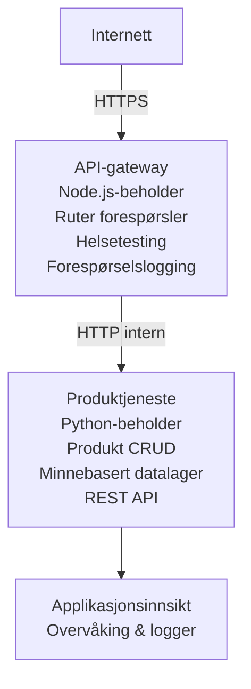

# Microtjenestearkitektur - Eksempel med Container App

⏱️ **Estimert tid**: 25-35 minutter | 💰 **Estimert kostnad**: ~$50-100/måned | ⭐ **Kompleksitet**: Avansert

En **forenklet, men funksjonell** mikrotjenestearkitektur deployert til Azure Container Apps ved hjelp av AZD CLI. Dette eksempelet viser kommunikasjon mellom tjenester, containerorkestrering og overvåking med en praktisk oppsett av 2 tjenester.

> **📚 Læretilnærming**: Dette eksempelet starter med en minimal 2-tjenesters arkitektur (API-gateway + backend-tjeneste) som du faktisk kan deployere og lære av. Etter å ha mestret dette grunnlaget, gir vi veiledning for utvidelse til et fullstendig mikrotjenesteøkosystem.

## Hva du vil lære

Ved å fullføre dette eksempelet vil du:  
- Deployere flere containere til Azure Container Apps  
- Implementere kommunikasjon mellom tjenester med internt nettverk  
- Konfigurere miljøbasert skalering og helseundersøkelser  
- Overvåke distribuerte applikasjoner med Application Insights  
- Forstå distribusjonsmønstre for mikrotjenester og beste praksis  
- Lære progressiv utvidelse fra enkle til komplekse arkitekturer  

## Arkitektur

### Fase 1: Hva vi bygger (inkludert i dette eksempelet)


**Hvorfor starte enkelt?**  
- ✅ Deployere og forstå raskt (25-35 minutter)  
- ✅ Lær kjernemønstre for mikrotjenester uten kompleksitet  
- ✅ Arbeidende kode du kan modifisere og eksperimentere med  
- ✅ Lavere kostnad for læring (~$50-100/måned kontra $300-1400/måned)  
- ✅ Bygg selvtillit før du legger til databaser og meldingskøer  

**Analogien**: Tenk på dette som å lære å kjøre bil. Du begynner med en tom parkeringsplass (2 tjenester), mestrer det grunnleggende, og går deretter videre til bytrafikk (5+ tjenester med databaser).

### Fase 2: Fremtidig utvidelse (referansearkitektur)

Når du mestrer 2-tjenestearkitekturen, kan du utvide til:

```
Full Architecture (Not Included - For Reference)
├── API Gateway (✅ Included)
├── Product Service (✅ Included)
├── Order Service (🔜 Add next)
├── User Service (🔜 Add next)
├── Notification Service (🔜 Add last)
├── Azure Service Bus (🔜 For async communication)
├── Cosmos DB (🔜 For product persistence)
├── Azure SQL (🔜 For order management)
└── Azure Storage (🔜 For file storage)
```
  
Se avsnittet "Utvidelsesguide" på slutten for trinnvise instruksjoner.

## Inkluderte funksjoner

✅ **Tjenesteoppdagelse**: Automatisk DNS-basert oppdagelse mellom containere  
✅ **Lastbalansering**: Innebygd lastbalansering mellom replikaer  
✅ **Autoskalering**: Uavhengig skalering per tjeneste basert på HTTP-forespørsler  
✅ **Helseovervåking**: Liveness og readiness probes for begge tjenester  
✅ **Distribuert logging**: Sentralisert logging med Application Insights  
✅ **Internt nettverk**: Sikker tjeneste-til-tjeneste-kommunikasjon  
✅ **Containerorkestrering**: Automatisk distribusjon og skalering  
✅ **Oppdateringer uten nedetid**: Rullerende oppdateringer med revisjonsstyring  

## Forutsetninger

### Nødvendige verktøy

Før du starter, bekreft at du har disse verktøyene installert:

1. **[Azure Developer CLI (azd)](https://learn.microsoft.com/azure/developer/azure-developer-cli/install-azd)** (versjon 1.0.0 eller høyere)  
   ```bash
   azd version
   # Forventet utdata: azd versjon 1.0.0 eller høyere
   ```
  
2. **[Azure CLI](https://learn.microsoft.com/cli/azure/install-azure-cli)** (versjon 2.50.0 eller høyere)  
   ```bash
   az --version
   # Forventet output: azure-cli 2.50.0 eller høyere
   ```
  
3. **[Docker](https://www.docker.com/get-started)** (for lokal utvikling/testing - valgfritt)  
   ```bash
   docker --version
   # Forventet utdata: Docker versjon 20.10 eller høyere
   ```


### Azure-krav

- Et aktivt **Azure-abonnement** ([opprett en gratis konto](https://azure.microsoft.com/free/))  
- Tillatelser til å opprette ressurser i abonnementet ditt  
- **Bidragsyter**-rolle på abonnementet eller ressursgruppen  

### Kunnskapsforutsetninger

Dette er et **avansert nivå** eksempel. Du bør ha:  
- Fullført [Simple Flask API-eksempelet](../../../../../examples/container-app/simple-flask-api)  
- Grunnleggende forståelse av mikrotjenestearkitektur  
- Kjennskap til REST APIer og HTTP  
- Forståelse av containerkonsepter  

**Ny på Container Apps?** Start med [Simple Flask API-eksempelet](../../../../../examples/container-app/simple-flask-api) først for å lære det grunnleggende.

## Rask start (trinn for trinn)

### Trinn 1: Klon og naviger

```bash
git clone https://github.com/microsoft/AZD-for-beginners.git
cd AZD-for-beginners/examples/container-app/microservices
```
  
**✓ Suksesskontroll**: Bekreft at du ser `azure.yaml`:  
```bash
ls
# Forventet: README.md, azure.yaml, infra/, src/
```


### Trinn 2: Autentiser mot Azure

```bash
azd auth login
```
  
Dette åpner nettleseren for Azure-autentisering. Logg på med dine Azure-legitimasjoner.

**✓ Suksesskontroll**: Du bør se:  
```
Logged in to Azure.
```


### Trinn 3: Initialiser miljøet

```bash
azd init
```
  
**Spørsmål du vil få**:  
- **Miljønavn**: Skriv inn et kort navn (f.eks. `microservices-dev`)  
- **Azure-abonnement**: Velg abonnement  
- **Azure-region**: Velg en region (f.eks. `eastus`, `westeurope`)  

**✓ Suksesskontroll**: Du bør se:  
```
SUCCESS: New project initialized!
```


### Trinn 4: Deploy infrastruktur og tjenester

```bash
azd up
```
  
**Hva som skjer** (tar 8-12 minutter):  
1. Oppretter Container Apps-miljø  
2. Oppretter Application Insights for overvåking  
3. Bygger API Gateway-container (Node.js)  
4. Bygger Product Service-container (Python)  
5. Deployer begge containere til Azure  
6. Konfigurerer nettverk og helseundersøkelser  
7. Setter opp overvåking og logging  

**✓ Suksesskontroll**: Du bør se:  
```
SUCCESS: Your application was deployed to Azure in X minutes Y seconds.
Endpoint: https://api-gateway-<unique-id>.azurecontainerapps.io
```
  
**⏱️ Tid**: 8-12 minutter

### Trinn 5: Test deployeringen

```bash
# Hent gateway-endepunktet
GATEWAY_URL=$(azd env get-values | grep API_GATEWAY_URL | cut -d '=' -f2 | tr -d '"')

# Test API Gateway-helse
curl $GATEWAY_URL/health

# Forventet utdata:
# {"status":"healthy","service":"api-gateway","timestamp":"2025-11-19T10:30:00Z"}
```
  
**Test produkt-tjenesten gjennom gateway**:  
```bash
# List produkter
curl $GATEWAY_URL/api/products

# Forventet utdata:
# [
#   {"id":1,"name":"Laptop","price":999.99,"stock":50},
#   {"id":2,"name":"Mus","price":29.99,"stock":200},
#   {"id":3,"name":"Tastatur","price":79.99,"stock":150}
# ]
```
  
**✓ Suksesskontroll**: Begge endepunkter returnerer JSON-data uten feil.

---

**🎉 Gratulerer!** Du har deployert en mikrotjenestearkitektur til Azure!

## Prosjektstruktur

Alle implementeringsfiler er inkludert – dette er et komplett, fungerende eksempel:

```
microservices/
│
├── README.md                         # This file
├── azure.yaml                        # AZD configuration
├── .gitignore                        # Git ignore patterns
│
├── infra/                           # Infrastructure as Code (Bicep)
│   ├── main.bicep                   # Main orchestration
│   ├── abbreviations.json           # Naming conventions
│   ├── core/                        # Shared infrastructure
│   │   ├── container-apps-environment.bicep  # Container environment + registry
│   │   └── monitor.bicep            # Application Insights + Log Analytics
│   └── app/                         # Service definitions
│       ├── api-gateway.bicep        # API Gateway container app
│       └── product-service.bicep    # Product Service container app
│
└── src/                             # Application source code
    ├── api-gateway/                 # Node.js API Gateway
    │   ├── app.js                   # Express server with routing
    │   ├── package.json             # Node dependencies
    │   └── Dockerfile               # Container definition
    └── product-service/             # Python Product Service
        ├── main.py                  # Flask API with product data
        ├── requirements.txt         # Python dependencies
        └── Dockerfile               # Container definition
```
  
**Hva hver komponent gjør:**  

**Infrastruktur (infra/)**:  
- `main.bicep`: Orkestrerer alle Azure-ressurser og deres avhengigheter  
- `core/container-apps-environment.bicep`: Oppretter Container Apps-miljø og Azure Container Registry  
- `core/monitor.bicep`: Setter opp Application Insights for distribuert logging  
- `app/*.bicep`: Individuelle container app-definisjoner med skalering og helseundersøkelser  

**API Gateway (src/api-gateway/)**:  
- Offentlig tjeneste som ruter forespørsler til backend-tjenester  
- Implementerer logging, feilhåndtering og videresending av forespørsler  
- Demonstrerer tjeneste-til-tjeneste HTTP-kommunikasjon  

**Product Service (src/product-service/)**:  
- Intern tjeneste med produktkatalog (i minnet for enkelhets skyld)  
- REST API med helseundersøkelser  
- Eksempel på backend mikrotjenestemønster  

## Tjenesteoversikt

### API Gateway (Node.js/Express)

**Port**: 8080  
**Tilgang**: Offentlig (ekstern inngang)  
**Formål**: Ruter innkommende forespørsler til riktige backend-tjenester  

**Endepunkter**:  
- `GET /` - Tjenesteinformasjon  
- `GET /health` - Helseundersøkelse  
- `GET /api/products` - Videresend til produkt-tjeneste (liste alle)  
- `GET /api/products/:id` - Videresend til produkt-tjeneste (hent etter ID)  

**Nøkkelfunksjoner**:  
- Forespørselsruting med axios  
- Sentralisert logging  
- Feilhåndtering og timeout-styring  
- Tjenesteoppdagelse via miljøvariabler  
- Application Insights integrasjon  

**Kodeutdrag** (`src/api-gateway/app.js`):  
```javascript
// Intern tjenestekommunikasjon
app.get('/api/products', async (req, res) => {
  const response = await axios.get(`${PRODUCT_SERVICE_URL}/products`);
  res.json(response.data);
});
```


### Product Service (Python/Flask)

**Port**: 8000  
**Tilgang**: Kun internt (ingen ekstern inngang)  
**Formål**: Håndterer produktkatalog med data i minnet  

**Endepunkter**:  
- `GET /` - Tjenesteinformasjon  
- `GET /health` - Helseundersøkelse  
- `GET /products` - Liste alle produkter  
- `GET /products/<id>` - Hent produkt etter ID  

**Nøkkelfunksjoner**:  
- RESTful API med Flask  
- In-memory produktlager (enkelt, ingen database nødvendig)  
- Helseovervåking med probes  
- Strukturert logging  
- Application Insights integrasjon  

**Datamodell**:  
```python
{
  "id": 1,
  "name": "Laptop",
  "description": "High-performance laptop",
  "price": 999.99,
  "stock": 50
}
```
  
**Hvorfor kun intern?**  
Produkt-tjenesten eksponeres ikke offentlig. Alle forespørsler må gå via API Gateway, som gir:  
- Sikkerhet: Kontrollerte tilgangspunkter  
- Fleksibilitet: Kan endre backend uten å påvirke klienter  
- Overvåking: Sentralisert forespørselslogging  

## Forstå tjenestekommunikasjon

### Hvordan tjenester kommuniserer

I dette eksempelet kommuniserer API Gateway med Product Service via **interne HTTP-kall**:

```javascript
// API Gateway (src/api-gateway/app.js)
const PRODUCT_SERVICE_URL = process.env.PRODUCT_SERVICE_URL;

// Lag intern HTTP-forespørsel
const response = await axios.get(`${PRODUCT_SERVICE_URL}/products`);
```
  
**Nøkkelpunkter**:  

1. **DNS-basert oppdagelse**: Container Apps tilbyr automatisk DNS for interne tjenester  
   - Produkt-tjenestens FQDN: `product-service.internal.<environment>.azurecontainerapps.io`  
   - Forkortes til: `http://product-service` (Container Apps løser dette)  

2. **Ingen offentlig eksponering**: Product Service har `external: false` i Bicep  
   - Bare tilgjengelig innen Container Apps-miljøet  
   - Kan ikke nås fra internett  

3. **Miljøvariabler**: Tjeneste-URLer injiseres ved deployering  
   - Bicep sender intern FQDN til gateway  
   - Ingen hardkodede URLer i applikasjonskoden  

**Analogien**: Tenk på dette som kontorrom. API Gateway er resepsjonen (offentlig), og Product Service er et kontorrom (kun internt). Besøkende må gå via resepsjonen for å nå noen kontorrom.

## Distribusjonsalternativer

### Full distribusjon (anbefalt)

```bash
# Distribuer infrastruktur og begge tjenester
azd up
```
  
Dette deployerer:  
1. Container Apps-miljø  
2. Application Insights  
3. Container Registry  
4. API Gateway-container  
5. Product Service-container  

**Tid**: 8-12 minutter

### Deploy enkeltkomponent

```bash
# Distribuer bare én tjeneste (etter første azd opp)
azd deploy api-gateway

# Eller distribuer produkttjeneste
azd deploy product-service
```
  
**Bruksområde**: Når du har oppdatert kode i en tjeneste og ønsker å deploye kun denne.

### Oppdater konfigurasjon

```bash
# Endre skaleringsparametere
azd env set GATEWAY_MAX_REPLICAS 30

# Distribuer på nytt med ny konfigurasjon
azd up
```


## Konfigurasjon

### Skalering

Begge tjenester er konfigurert med HTTP-basert autoskalering i sine Bicep-filer:

**API Gateway**:  
- Minste replikaer: 2 (alltid minst 2 for tilgjengelighet)  
- Maks replikaer: 20  
- Skalerings-trigger: 50 samtidige forespørsler per replika  

**Product Service**:  
- Minste replikaer: 1 (kan skaleres til null hvis nødvendig)  
- Maks replikaer: 10  
- Skalerings-trigger: 100 samtidige forespørsler per replika  

**Tilpass skalering** (i `infra/app/*.bicep`):  
```bicep
scale: {
  minReplicas: 1
  maxReplicas: 10
  rules: [
    {
      name: 'http-scale-rule'
      http: {
        metadata: {
          concurrentRequests: '100'  // Adjust this
        }
      }
    }
  ]
}
```


### Ressursallokering

**API Gateway**:  
- CPU: 1.0 vCPU  
- Minne: 2 GiB  
- Begrunnelse: Håndterer all ekstern trafikk  

**Product Service**:  
- CPU: 0.5 vCPU  
- Minne: 1 GiB  
- Begrunnelse: Lettvekts in-memory operasjoner  

### Helseundersøkelser

Begge tjenester inkluderer liveness og readiness probes:

```bicep
probes: [
  {
    type: 'Liveness'
    httpGet: {
      path: '/health'
      port: 8080
    }
    initialDelaySeconds: 10
    periodSeconds: 30
  }
  {
    type: 'Readiness'
    httpGet: {
      path: '/health'
      port: 8080
    }
    initialDelaySeconds: 5
    periodSeconds: 10
  }
]
```
  
**Hva dette betyr**:  
- **Liveness**: Hvis helseundersøkelsen feiler, starter Container Apps containeren på nytt  
- **Readiness**: Hvis ikke klar, stopper Container Apps ruting av trafikk til den replikaen  

## Overvåking og observabilitet

### Se tjenestelogs

```bash
# Vis logger med azd monitor
azd monitor --logs

# Eller bruk Azure CLI for spesifikke Container Apps:
# Strøm logger fra API Gateway
az containerapp logs show --name api-gateway --resource-group $RG_NAME --follow

# Se nylige logger for produktjenesten
az containerapp logs show --name product-service --resource-group $RG_NAME --tail 100
```
  
**Forventet utdata**:  
```
[api-gateway] API Gateway listening on port 8080
[api-gateway] Product Service URL: http://product-service
[api-gateway] GET /api/products 200 - 45ms
[product-service] Retrieved 5 products
```


### Application Insights-spørringer

Åpne Application Insights i Azure-portalen, kjør så disse spørringene:

**Finn trege forespørsler**:  
```kusto
requests
| where timestamp > ago(1h)
| where duration > 1000  // Requests taking >1 second
| summarize count() by name, cloud_RoleName
| order by count_ desc
```
  
**Spor tjeneste-til-tjeneste-kall**:  
```kusto
dependencies
| where timestamp > ago(1h)
| where type == "Http"
| project timestamp, name, target, duration, success
| order by timestamp desc
```
  
**Feilrate per tjeneste**:  
```kusto
exceptions
| where timestamp > ago(24h)
| summarize errorCount = count() by cloud_RoleName, type
| order by errorCount desc
```
  
**Forespørselsvolum over tid**:  
```kusto
requests
| where timestamp > ago(1h)
| summarize requestCount = count() by bin(timestamp, 5m), cloud_RoleName
| render timechart
```


### Åpne overvåkingsdashbord

```bash
# Hent Application Insights-detaljer
azd env get-values | grep APPLICATIONINSIGHTS

# Åpne Azure Portal overvåking
az monitor app-insights component show \
  --app $(azd env get-values | grep APPLICATIONINSIGHTS_CONNECTION_STRING | cut -d '=' -f2) \
  --resource-group $(azd env get-values | grep AZURE_RESOURCE_GROUP | cut -d '=' -f2) \
  --query "appId" -o tsv
```


### Sanntidsmålinger

1. Naviger til Application Insights i Azure-portalen  
2. Klikk på "Live Metrics"  
3. Se sanntidsforespørsler, feil og ytelse  
4. Test ved å kjøre: `curl $(azd env get-values | grep API_GATEWAY_URL | cut -d '=' -f2 | tr -d '"')/api/products`

## Praktiske øvelser

[Merk: Se fullstendige øvelser over i avsnittet "Praktiske øvelser" for detaljerte trinnvise øvelser inkludert deploy-verifisering, datamodifikasjon, autoskaleringstester, feilhåndtering og tillegg av en tredje tjeneste.]

## Kostnadsanalyse

### Estimerte månedlige kostnader (for dette 2-tjenesteeksempelet)

| Ressurs | Konfigurasjon | Estimert kostnad |
|----------|--------------|----------------|
| API Gateway | 2-20 replikaer, 1 vCPU, 2GB RAM | $30-150 |
| Product Service | 1-10 replikaer, 0.5 vCPU, 1GB RAM | $15-75 |
| Container Registry | Basisnivå | $5 |
| Application Insights | 1-2 GB/måned | $5-10 |
| Log Analytics | 1 GB/måned | $3 |
| **Totalt** | | **$58-243/måned** |

**Kostnadsfordeling etter bruk**:  
- **Lav trafikk** (testing/læring): ~$60/måned  
- **Moderat trafikk** (liten produksjon): ~$120/måned  
- **Høy trafikk** (travel periode): ~$240/måned  

### Tips for kostnadsoptimalisering

1. **Skaler til null under utvikling**:  
   ```bicep
   scale: {
     minReplicas: 0  // Save $30-40/month when not in use
     maxReplicas: 10
   }
   ```
  
2. **Bruk konsumplan for Cosmos DB** (når du legger til det):  
   - Betal kun for det du bruker  
   - Ingen minimumsavgift  

3. **Sett sampling i Application Insights**:  
   ```javascript
   appInsights.defaultClient.config.samplingPercentage = 50; // Prøve 50% av forespørslene
   ```
  
4. **Rydd opp når det ikke trengs**:  
   ```bash
   azd down
   ```


### Gratisnivå-alternativer

For læring/testing, vurder:
- Bruk Azure gratis kreditter (første 30 dager)  
- Hold antall replikaer på et minimum  
- Slett etter testing (ingen løpende kostnader)  

---

## Opprydding

For å unngå løpende kostnader, slett alle ressurser:

```bash
azd down --force --purge
```
  
**Bekreftelsesprompt**:  
```
? Total resources to delete: 6, are you sure you want to continue? (y/N)
```
  
Skriv `y` for å bekrefte.

**Hva som slettes**:  
- Container Apps-miljø  
- Begge Container Apps (gateway & produktservice)  
- Container Register  
- Application Insights  
- Log Analytics Workspace  
- Ressursgruppe  

**✓ Verifiser opprydding**:  
```bash
az group list --query "[?starts_with(name,'rg-microservices')]" --output table
```
  
Skal returnere tomt.

---

## Utvidelsesguide: Fra 2 til 5+ tjenester

Når du har mestret denne to-tjeneste arkitekturen, slik kan du utvide:

### Fase 1: Legg til databasepersistens (neste steg)

**Legg til Cosmos DB for produktservice**:

1. Opprett `infra/core/cosmos.bicep`:  
   ```bicep
   resource cosmosAccount 'Microsoft.DocumentDB/databaseAccounts@2023-04-15' = {
     name: name
     location: location
     kind: 'GlobalDocumentDB'
     properties: {
       databaseAccountOfferType: 'Standard'
       locations: [{ locationName: location, failoverPriority: 0 }]
     }
   }
   ```
  
2. Oppdater produktservice til å bruke Cosmos DB i stedet for minnebaserte data

3. Anslått ekstra kostnad: ~25 USD/måned (serverløs)

### Fase 2: Legg til tredjepartstjeneste (ordrehåndtering)

**Opprett ordre-tjeneste**:

1. Ny mappe: `src/order-service/` (Python/Node.js/C#)  
2. Ny Bicep: `infra/app/order-service.bicep`  
3. Oppdater API-gateway for å rute `/api/orders`  
4. Legg til Azure SQL Database for ordre-persistens  

**Arkitekturen blir**:  
```
API Gateway → Product Service (Cosmos DB)
           → Order Service (Azure SQL)
```
  
### Fase 3: Legg til asynkron kommunikasjon (Service Bus)

**Implementer hendelsesdrevet arkitektur**:

1. Legg til Azure Service Bus: `infra/core/servicebus.bicep`  
2. Produktservice publiserer "ProductCreated"-hendelser  
3. Ordretjeneste abonnerer på produkthendelser  
4. Legg til notifikasjonstjeneste for å behandle hendelser  

**Mønster**: Forespørsel/Svar (HTTP) + hendelsesdrevet (Service Bus)  

### Fase 4: Legg til brukerautentisering

**Implementer brukertjeneste**:

1. Opprett `src/user-service/` (Go/Node.js)  
2. Legg til Azure AD B2C eller egen JWT-autentisering  
3. API-gateway verifiserer tokens  
4. Tjenestene sjekker brukerrettigheter  

### Fase 5: Produksjonsklarhet

**Legg til disse komponentene**:  
- Azure Front Door (global lastbalansering)  
- Azure Key Vault (hemmelighetshåndtering)  
- Azure Monitor Workbooks (egendefinerte dashbord)  
- CI/CD-pipeline (GitHub Actions)  
- Blue-Green deployeringer  
- Administrerte identiteter for alle tjenester  

**Full produksjonsarkitektur kostnad**: ~300-1,400 USD/måned  

---

## Lær mer

### Relatert dokumentasjon  
- [Azure Container Apps Documentation](https://learn.microsoft.com/azure/container-apps/)  
- [Microservices Architecture Guide](https://learn.microsoft.com/azure/architecture/guide/architecture-styles/microservices)  
- [Application Insights for Distributed Tracing](https://learn.microsoft.com/azure/azure-monitor/app/distributed-tracing)  
- [Azure Developer CLI Documentation](https://learn.microsoft.com/azure/developer/azure-developer-cli/)  

### Neste steg i dette kurset  
- ← Forrige: [Simple Flask API](../../../../../examples/container-app/simple-flask-api) - Nybegynner enkeltcontainer-eksempel  
- → Neste: [AI Integration Guide](../../../../../examples/docs/ai-foundry) - Legg til AI-funksjonalitet  
- 🏠 [Kursforside](../../README.md)  

### Sammenligning: Når skal man bruke hva

**Enkelt Container App** (enkelt Flask API-eksempel):  
- ✅ Enkle applikasjoner  
- ✅ Monolitisk arkitektur  
- ✅ Rask å deployere  
- ❌ Begrenset skalerbarhet  
- **Kostnad**: ~15-50 USD/måned  

**Mikrotjenester** (dette eksempelet):  
- ✅ Komplekse applikasjoner  
- ✅ Uavhengig skalering per tjeneste  
- ✅ Team-autonomi (ulik tjeneste, ulike team)  
- ❌ Mer komplekst å administrere  
- **Kostnad**: ~60-250 USD/måned  

**Kubernetes (AKS)**:  
- ✅ Maksimal kontroll og fleksibilitet  
- ✅ Multi-cloud portabilitet  
- ✅ Avansert nettverksfunksjonalitet  
- ❌ Krever Kubernetes-kompetanse  
- **Kostnad**: minst ~150-500 USD/måned  

**Anbefaling**: Start med Container Apps (dette eksempelet), gå til AKS kun om du trenger Kubernetes-spesifikke funksjoner.

---

## Ofte stilte spørsmål

**Q: Hvorfor bare 2 tjenester i stedet for 5+?**  
A: Pedagogisk progresjon. Mestre grunnleggende (tjenestekommunikasjon, overvåkning, skalering) med et enkelt eksempel før du legger til kompleksitet. Mønstrene du lærer her gjelder for arkitekturer med 100 tjenester.

**Q: Kan jeg legge til flere tjenester selv?**  
A: Absolutt! Følg utvidelsesguiden over. Hver ny tjeneste følger samme mønster: opprett src-mappe, opprett Bicep-fil, oppdater azure.yaml, deploy.

**Q: Er dette produksjonsklart?**  
A: Det er et solid fundament. For produksjon, legg til: administrert identitet, Key Vault, vedvarende databaser, CI/CD pipeline, overvåkingsvarsler, og backup-strategi.

**Q: Hvorfor ikke bruke Dapr eller annen servicemesh?**  
A: Hold det enkelt for læring. Når du forstår native Container Apps-nettverk, kan du legge på Dapr for avanserte scenarioer.

**Q: Hvordan kan jeg feilsøke lokalt?**  
A: Kjør tjenestene lokalt med Docker:  
```bash
cd src/api-gateway
docker build -t local-gateway .
docker run -p 8080:8080 -e PRODUCT_SERVICE_URL=http://localhost:8000 local-gateway
```
  
**Q: Kan jeg bruke forskjellige programmeringsspråk?**  
A: Ja! Dette eksempelet viser Node.js (gateway) + Python (produktservice). Du kan mikse alle språk som kjører i containere.

**Q: Hva om jeg ikke har Azure-kreditter?**  
A: Bruk Azure gratisnivå (første 30 dager med ny konto) eller deploy for korte testperioder og slett med én gang.

---

> **🎓 Oppsummering av læringsvei**: Du har lært å deployere en arkitektur med flere tjenester med automatisk skalering, internt nettverk, sentralisert overvåkning, og produksjonsklare mønstre. Dette fundamentet forbereder deg på komplekse distribuerte systemer og enterprise mikrotjenestearkitekturer.

**📚 Kursnavigasjon:**  
- ← Forrige: [Simple Flask API](../../../../../examples/container-app/simple-flask-api)  
- → Neste: [Database Integration Example](../../../../../examples/database-app)  
- 🏠 [Kursforside](../../../README.md)  
- 📖 [Container Apps beste praksis](../../../docs/chapter-04-infrastructure/deployment-guide.md)

---

<!-- CO-OP TRANSLATOR DISCLAIMER START -->
**Ansvarsfraskrivelse**:  
Dette dokumentet er oversatt ved hjelp av AI-oversettelsestjenesten [Co-op Translator](https://github.com/Azure/co-op-translator). Selv om vi streber etter nøyaktighet, vær oppmerksom på at automatiske oversettelser kan inneholde feil eller unøyaktigheter. Det originale dokumentet på dets opprinnelige språk bør betraktes som den autoritative kilden. For kritisk informasjon anbefales profesjonell menneskelig oversettelse. Vi er ikke ansvarlige for misforståelser eller feiltolkninger som oppstår ved bruk av denne oversettelsen.
<!-- CO-OP TRANSLATOR DISCLAIMER END -->