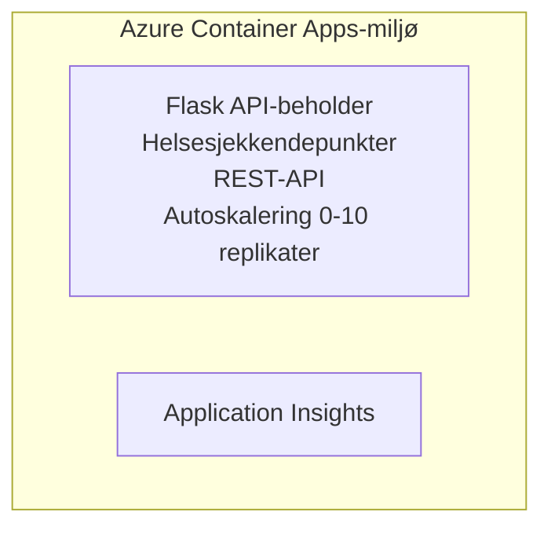

# Enkel Flask API - Container App Eksempel

**Læringssti:** Nybegynner ⭐ | **Tid:** 25-35 minutter | **Kostnad:** 0-15 USD/måned

En komplett, fungerende Python Flask REST API distribuert til Azure Container Apps ved bruk av Azure Developer CLI (azd). Dette eksempelet demonstrerer containervisning, automatisk skalering og grunnleggende overvåking.

## 🎯 Hva Du Vil Lære

- Distribuere en containerisert Python-applikasjon til Azure
- Konfigurere automatisk skalering med skalering til null
- Implementere helseprober og klarhetskontroller
- Overvåke applikasjonslogger og måledata
- Bruke Azure Developer CLI for rask distribusjon

## 📦 Hva Som Er Inkludert

✅ **Flask Applikasjon** - Komplett REST API med CRUD-operasjoner (`src/app.py`)  
✅ **Dockerfile** - Produksjonsklar containerkonfigurasjon  
✅ **Bicep Infrastruktur** - Container Apps-miljø og API-distribusjon  
✅ **AZD Konfigurasjon** - Distribusjonsoppsett med én kommando  
✅ **Helseprober** - Konfigurerte liveness- og readiness-kontroller  
✅ **Automatisk skalering** - 0-10 replikaer basert på HTTP-behov  

## Arkitektur



## Forutsetninger

### Påkrevd
- **Azure Developer CLI (azd)** - [Installering guide](https://learn.microsoft.com/azure/developer/azure-developer-cli/install-azd)
- **Azure-abonnement** - [Gratis konto](https://azure.microsoft.com/free/)
- **Docker Desktop** - [Installer Docker](https://www.docker.com/products/docker-desktop/) (for lokal testing)

### Verifiser Forutsetninger

```bash
# Sjekk azd-versjon (krever 1.5.0 eller høyere)
azd version

# Verifiser Azure-pålogging
azd auth login

# Sjekk Docker (valgfritt, for lokal testing)
docker --version
```

## ⏱️ Distribusjonstidslinje

| Fase | Varighet | Hva Skjer |
|-------|----------|--------------||
| Miljøoppsett | 30 sekunder | Opprett azd-miljø |
| Bygg container | 2-3 minutter | Docker bygger Flask-app |
| Tilrettelegg infrastruktur | 3-5 minutter | Opprett Container Apps, register, overvåking |
| Distribuer applikasjon | 2-3 minutter | Push bilde og distribuer til Container Apps |
| **Totalt** | **8-12 minutter** | Fullført distribusjon klar |

## Komme I Gang Raskt

```bash
# Naviger til eksemplet
cd examples/container-app/simple-flask-api

# Initialiser miljøet (velg unikt navn)
azd env new myflaskapi

# Distribuer alt (infrastruktur + applikasjon)
azd up
# Du vil bli bedt om å:
# 1. Velge Azure-abonnement
# 2. Velge lokasjon (f.eks., eastus2)
# 3. Vent 8-12 minutter på distribusjon

# Få API-endepunktet ditt
azd env get-values

# Test API-en
curl $(azd env get-value API_ENDPOINT)/health
```

**Forventet Utdata:**
```json
{
  "status": "healthy",
  "timestamp": "2025-11-19T10:30:00Z",
  "service": "simple-flask-api",
  "version": "1.0.0"
}
```

## ✅ Verifiser Distribusjon

### Trinn 1: Sjekk Distribusjonsstatus

```bash
# Vis distribuerte tjenester
azd show

# Forventet utdata viser:
# - Tjeneste: api
# - Endepunkt: https://ca-api-[env].xxx.azurecontainerapps.io
# - Status: Kjører
```

### Trinn 2: Test API-Endepunkter

```bash
# Hent API-endepunkt
API_URL=$(azd env get-value API_ENDPOINT)

# Test helsetilstand
curl $API_URL/health

# Test rotendepunkt
curl $API_URL/

# Opprett et element
curl -X POST $API_URL/api/items \
  -H "Content-Type: application/json" \
  -d '{"name": "Test Item", "description": "My first item"}'

# Hent alle elementer
curl $API_URL/api/items
```

**Suksesskriterier:**
- ✅ Helseendepunkt returnerer HTTP 200
- ✅ Rotendepunkt viser API-informasjon
- ✅ POST oppretter element og returnerer HTTP 201
- ✅ GET returnerer opprettede elementer

### Trinn 3: Se Logger

```bash
# Strøm live logger ved å bruke azd monitor
azd monitor --logs

# Eller bruk Azure CLI:
az containerapp logs show --name api --resource-group $RG_NAME --follow

# Du bør se:
# - Gunicorn oppstarts meldinger
# - HTTP forespørselslogger
# - Applikasjonsinformasjonslogger
```

## Prosjektstruktur

```
simple-flask-api/
├── azure.yaml              # AZD configuration
├── infra/
│   ├── main.bicep         # Main infrastructure
│   ├── main.parameters.json
│   └── app/
│       ├── container-env.bicep
│       └── api.bicep
└── src/
    ├── app.py             # Flask application
    ├── requirements.txt
    └── Dockerfile
```

## API-Endepunkter

| Endepunkt | Metode | Beskrivelse |
|----------|--------|-------------|
| `/health` | GET | Helsekontroll |
| `/api/items` | GET | Liste alle elementer |
| `/api/items` | POST | Opprett nytt element |
| `/api/items/{id}` | GET | Hent spesifikt element |
| `/api/items/{id}` | PUT | Oppdater element |
| `/api/items/{id}` | DELETE | Slett element |

## Konfigurasjon

### Miljøvariabler

```bash
# Angi egendefinert konfigurasjon
azd env set PORT 8000
azd env set LOG_LEVEL info
azd env set MAX_REPLICAS 20
```

### Skaleringskonfigurasjon

API-en skalerer automatisk basert på HTTP-trafikk:
- **Min replikaer**: 0 (skalerer til null når inaktiv)
- **Maks replikaer**: 10
- **Samtidige forespørsler per replika**: 50

## Utvikling

### Kjør Lokalt

```bash
# Installer avhengigheter
cd src
pip install -r requirements.txt

# Kjør appen
python app.py

# Test lokalt
curl http://localhost:8000/health
```

### Bygg og Test Container

```bash
# Bygg Docker-bilde
docker build -t flask-api:local ./src

# Kjør container lokalt
docker run -p 8000:8000 flask-api:local

# Test container
curl http://localhost:8000/health
```

## Distribusjon

### Full Distribusjon

```bash
# Distribuer infrastruktur og applikasjon
azd up
```

### Bare Kode-Distribusjon

```bash
# Distribuer bare applikasjonskode (infrastrukturen uendret)
azd deploy api
```

### Oppdater Konfigurasjon

```bash
# Oppdater miljøvariabler
azd env set API_KEY "new-api-key"

# Distribuer på nytt med ny konfigurasjon
azd deploy api
```

## Overvåking

### Se Logger

```bash
# Strøm live logger ved hjelp av azd monitor
azd monitor --logs

# Eller bruk Azure CLI for Container Apps:
az containerapp logs show --name api --resource-group $RG_NAME --follow

# Vis de siste 100 linjene
az containerapp logs show --name api --resource-group $RG_NAME --tail 100
```

### Overvåk Måledata

```bash
# Åpne Azure Monitor-dashbord
azd monitor --overview

# Se spesifikke måledata
az monitor metrics list \
  --resource $(azd show --output json | jq -r '.services.api.resourceId') \
  --metric "Requests,ResponseTime"
```

## Testing

### Helsekontroll

```bash
curl $(azd show --output json | jq -r '.services.api.endpoint')/health
```

Forventet respons:
```json
{
  "status": "healthy",
  "timestamp": "2025-11-19T10:30:00Z"
}
```

### Opprett Element

```bash
curl -X POST $(azd show --output json | jq -r '.services.api.endpoint')/api/items \
  -H "Content-Type: application/json" \
  -d '{"name": "Test Item", "description": "A test item"}'
```

### Hent Alle Elementer

```bash
curl $(azd show --output json | jq -r '.services.api.endpoint')/api/items
```

## Kostnadsoptimalisering

Denne distribusjonen bruker skalering til null, så du betaler kun når API-en behandler forespørsler:

- **Inaktiv kostnad**: ~0 USD/måned (skalert til null)
- **Aktiv kostnad**: ~0,000024 USD/sekund per replika
- **Forventet månedskostnad** (lett bruk): 5-15 USD

### Reduser Kostnadene Videre

```bash
# Skaler ned maks replikater for utvikling
azd env set MAX_REPLICAS 3

# Bruk kortere tomgangstid
azd env set SCALE_TO_ZERO_TIMEOUT 300  # 5 minutter
```

## Feilsøking

### Container Starter Ikke

```bash
# Sjekk containerlogger ved hjelp av Azure CLI
az containerapp logs show --name api --resource-group $RG_NAME --tail 100

# Verifiser Docker-bilder bygges lokalt
docker build -t test ./src
```

### API Ikke Tilgjengelig

```bash
# Bekreft at inngangen er ekstern
az containerapp show --name api --resource-group rg-simple-flask-api \
  --query properties.configuration.ingress.external
```

### Høye Responstider

```bash
# Sjekk CPU-/minnebruk
az monitor metrics list \
  --resource $(azd show --output json | jq -r '.services.api.resourceId') \
  --metric "CPUPercentage,MemoryPercentage"

# Skaler opp ressurser om nødvendig
az containerapp update --name api --resource-group rg-simple-flask-api \
  --cpu 1.0 --memory 2Gi
```

## Rydd Opp

```bash
# Slett alle ressurser
azd down --force --purge
```

## Neste Steg

### Utvid Dette Eksempelet

1. **Legg til database** - Integrer Azure Cosmos DB eller SQL Database
   ```bash
   # Legg til Cosmos DB-modul i infra/main.bicep
   # Oppdater app.py med databaseforbindelse
   ```

2. **Legg til autentisering** - Implementer Microsoft Entra ID eller API-nøkler
   ```python
   # Legg til autentiserings-mellomvare i app.py
   from functools import wraps
   ```

3. **Sett opp CI/CD** - GitHub Actions workflow
   ```yaml
   # Create .github/workflows/deploy.yml
   name: Deploy to Azure
   on: [push]
   ```

4. **Legg til administrert identitet** - Sikre tilgang til Azure-tjenester
   ```bicep
   # Update infra/app/api.bicep
   identity: { type: 'SystemAssigned' }
   ```

### Relaterte Eksempler

- **[Database App](../../../../../examples/database-app)** - Komplett eksempel med SQL Database
- **[Mikrotjenester](../../../../../examples/container-app/microservices)** - Multi-tjeneste arkitektur
- **[Container Apps Hovedguide](../README.md)** - Alle container-mønstre

### Læringsressurser

- 📚 [AZD For Nybegynnere Kurs](../../../README.md) - Hovedkurs startside
- 📚 [Container Apps Mønstre](../README.md) - Flere distribusjonsmønstre
- 📚 [AZD Maler Galleri](https://azure.github.io/awesome-azd/) - Fellesskapsmaler

## Ekstra Ressurser

### Dokumentasjon
- **[Flask Dokumentasjon](https://flask.palletsprojects.com/)** - Flask rammeverksguide
- **[Azure Container Apps](https://learn.microsoft.com/azure/container-apps/)** - Offisielle Azure-dokumenter
- **[Azure Developer CLI](https://learn.microsoft.com/azure/developer/azure-developer-cli/)** - azd kommandoreferanse

### Veiledninger
- **[Container Apps Komme I Gang](https://learn.microsoft.com/azure/container-apps/quickstart-portal)** - Distribuer din første app
- **[Python på Azure](https://learn.microsoft.com/azure/developer/python/)** - Python utviklingsguide
- **[Bicep Språk](https://learn.microsoft.com/azure/azure-resource-manager/bicep/)** - Infrastruktur som kode

### Verktøy
- **[Azure Portalen](https://portal.azure.com)** - Administrer ressurser visuelt
- **[VS Code Azure Utvidelse](https://marketplace.visualstudio.com/items?itemName=ms-azuretools.vscode-azurecontainerapps)** - IDE-integrasjon

---

**🎉 Gratulerer!** Du har distribuert en produksjonsklar Flask API til Azure Container Apps med automatisk skalering og overvåking.

**Spørsmål?** [Åpne en sak](https://github.com/microsoft/AZD-for-beginners/issues) eller sjekk [FAQ](../../../resources/faq.md)

---

<!-- CO-OP TRANSLATOR DISCLAIMER START -->
**Ansvarsfraskrivelse**:
Dette dokumentet er oversatt ved hjelp av AI-oversettelsestjenesten [Co-op Translator](https://github.com/Azure/co-op-translator). Selv om vi streber etter nøyaktighet, vær oppmerksom på at automatiske oversettelser kan inneholde feil eller unøyaktigheter. Det opprinnelige dokumentet på originalspråket skal betraktes som den autoritative kilden. For kritisk informasjon anbefales profesjonell menneskelig oversettelse. Vi er ikke ansvarlige for eventuelle misforståelser eller feiltolkninger som oppstår ved bruk av denne oversettelsen.
<!-- CO-OP TRANSLATOR DISCLAIMER END -->