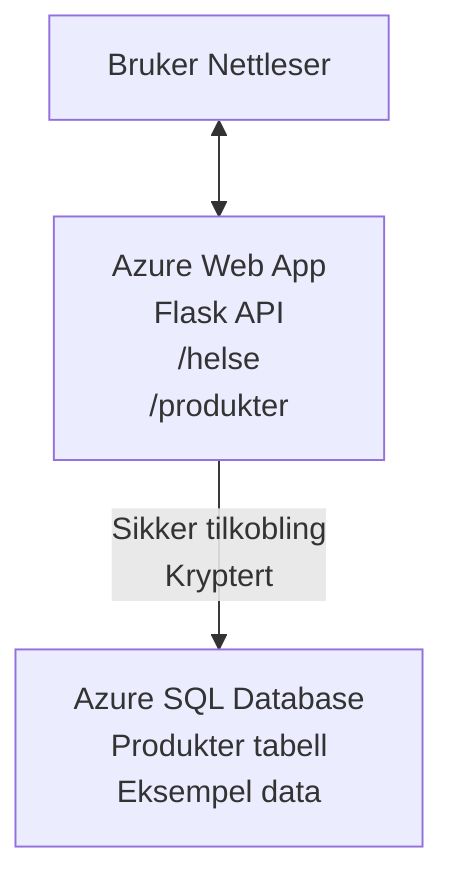

# Distribuere en Microsoft SQL Database og Web App med AZD

⏱️ **Estimert tid**: 20-30 minutter | 💰 **Estimert kostnad**: ~$15-25/måned | ⭐ **Kompleksitet**: Middels

Dette **komplette, fungerende eksempelet** viser hvordan du bruker [Azure Developer CLI (azd)](https://learn.microsoft.com/azure/developer/azure-developer-cli/) for å distribuere en Python Flask webapplikasjon med en Microsoft SQL Database til Azure. All kode er inkludert og testet—ingen eksterne avhengigheter kreves.

## Hva du vil lære

Ved å fullføre dette eksempelet vil du:
- Distribuere en flerlagsapplikasjon (webapp + database) ved bruk av infrastruktur-som-kode
- Konfigurere sikre databasetilkoblinger uten å hardkode hemmeligheter
- Overvåke applikasjonens helse med Application Insights
- Administrere Azure-ressurser effektivt med AZD CLI
- Følge Azures beste praksis for sikkerhet, kostnadsoptimalisering og observabilitet

## Scenariooversikt
- **Webapp**: Python Flask REST API med databasetilkobling
- **Database**: Azure SQL Database med eksempeldata
- **Infrastruktur**: Tilrettelagt med Bicep (modulære, gjenbrukbare maler)
- **Distribusjon**: Fullt automatisert med `azd`-kommandoer
- **Overvåking**: Application Insights for logger og telemetri

## Forutsetninger

### Påkrevde verktøy

Før du begynner, sjekk at du har disse verktøyene installert:

1. **[Azure CLI](https://learn.microsoft.com/cli/azure/install-azure-cli)** (versjon 2.50.0 eller nyere)
   ```sh
   az --version
   # Forventet utdata: azure-cli 2.50.0 eller høyere
   ```

2. **[Azure Developer CLI (azd)](https://learn.microsoft.com/azure/developer/azure-developer-cli/install-azd)** (versjon 1.0.0 eller nyere)
   ```sh
   azd version
   # Forventet utdata: azd versjon 1.0.0 eller høyere
   ```

3. **[Python 3.8+](https://www.python.org/downloads/)** (for lokal utvikling)
   ```sh
   python --version
   # Forventet resultat: Python 3.8 eller høyere
   ```

4. **[Docker](https://www.docker.com/get-started)** (valgfritt, for lokal containerbasert utvikling)
   ```sh
   docker --version
   # Forventet utdata: Docker versjon 20.10 eller høyere
   ```

### Azure-krav

- Et aktivt **Azure-abonnement** ([opprett en gratis konto](https://azure.microsoft.com/free/))
- Tillatelser til å opprette ressurser i abonnementet ditt
- **Eier** eller **Bidragsyter**-rolle på abonnement eller ressursgruppe

### Forhåndskunnskaper

Dette er et **middels avansert** eksempel. Du bør være kjent med:
- Grunnleggende kommandolinjeoperasjoner
- Grunnleggende sky-konsepter (ressurser, ressursgrupper)
- Enkel forståelse av webapplikasjoner og databaser

**Ny i AZD?** Start med [Kom i gang-guiden](../../docs/chapter-01-foundation/azd-basics.md) først.

## Arkitektur

Dette eksempelet deployerer en to-lags arkitektur med en webapplikasjon og SQL-database:


**Ressursdistribusjon:**
- **Ressursgruppe**: Inneholder alle ressurser
- **App Service Plan**: Linux-basert hosting (B1-nivå for kostnadseffektivitet)
- **Webapp**: Python 3.11 runtime med Flask-applikasjon
- **SQL Server**: Administrert databaseserver med minimum TLS 1.2
- **SQL Database**: Basic nivå (2GB, egnet for utvikling/testing)
- **Application Insights**: Overvåking og logging
- **Log Analytics Workspace**: Sentral logglagring

**Analogien**: Tenk på dette som en restaurant (webapp) med en frysere (database). Kundene bestiller fra menyen (API-endepunkter), og kjøkkenet (Flask-app) henter ingrediensene (data) fra fryseren. Restaurantlederen (Application Insights) følger med på alt som skjer.

## Mappestruktur

Alle filer er inkludert i dette eksempelet—ingen eksterne avhengigheter kreves:

```
examples/database-app/
│
├── README.md                    # This file
├── azure.yaml                   # AZD configuration file
├── .env.sample                  # Sample environment variables
├── .gitignore                   # Git ignore patterns
│
├── infra/                       # Infrastructure as Code (Bicep)
│   ├── main.bicep              # Main orchestration template
│   ├── abbreviations.json      # Azure naming conventions
│   └── resources/              # Modular resource templates
│       ├── sql-server.bicep    # SQL Server configuration
│       ├── sql-database.bicep  # Database configuration
│       ├── app-service-plan.bicep  # Hosting plan
│       ├── app-insights.bicep  # Monitoring setup
│       └── web-app.bicep       # Web application
│
└── src/
    └── web/                    # Application source code
        ├── app.py              # Flask REST API
        ├── requirements.txt    # Python dependencies
        └── Dockerfile          # Container definition
```

**Hva hver fil gjør:**
- **azure.yaml**: Forteller AZD hva som skal deployeres og hvor
- **infra/main.bicep**: Koordinerer alle Azure-ressurser
- **infra/resources/*.bicep**: Individuelle ressursdefinisjoner (modulære for gjenbruk)
- **src/web/app.py**: Flask-applikasjon med databaselogikk
- **requirements.txt**: Python-pakkesavhengigheter
- **Dockerfile**: Instruksjoner for containerisering ved distribusjon

## Hurtigstart (Steg-for-steg)

### Steg 1: Klon og naviger

```sh
git clone https://github.com/microsoft/AZD-for-beginners.git
cd AZD-for-beginners/examples/database-app
```

**✓ Suksesssjekk**: Bekreft at du ser `azure.yaml` og mappen `infra/`:
```sh
ls
# Forventet: README.md, azure.yaml, infra/, src/
```

### Steg 2: Autentiser mot Azure

```sh
azd auth login
```

Dette åpner nettleseren for Azure-autentisering. Logg inn med dine Azure-legitimasjoner.

**✓ Suksesssjekk**: Du skal se:
```
Logged in to Azure.
```

### Steg 3: Initialiser miljøet

```sh
azd init
```

**Hva skjer**: AZD oppretter en lokal konfigurasjon for distribueringen din.

**Spørsmål du får**:
- **Miljønavn**: Skriv inn et kort navn (f.eks. `dev`, `myapp`)
- **Azure-abonnement**: Velg abonnement fra listen
- **Azure-lokasjon**: Velg en region (f.eks. `eastus`, `westeurope`)

**✓ Suksesssjekk**: Du vil se:
```
SUCCESS: New project initialized!
```

### Steg 4: Tilrettelegg Azure-ressurser

```sh
azd provision
```

**Hva skjer**: AZD deployerer all infrastruktur (tar 5-8 minutter):
1. Oppretter ressursgruppe
2. Oppretter SQL Server og Database
3. Oppretter App Service Plan
4. Oppretter Web App
5. Oppretter Application Insights
6. Konfigurerer nettverk og sikkerhet

**Du blir spurt om**:
- **SQL admin brukernavn**: Skriv inn et brukernavn (f.eks. `sqladmin`)
- **SQL admin passord**: Skriv inn et sterkt passord (lagre dette!)

**✓ Suksesssjekk**: Du skal se:
```
SUCCESS: Your application was provisioned in Azure in X minutes Y seconds.
You can view the resources created under the resource group rg-<env-name> in Azure Portal:
https://portal.azure.com/#@/resource/subscriptions/.../resourceGroups/rg-<env-name>
```

**⏱️ Tid**: 5-8 minutter

### Steg 5: Distribuer applikasjonen

```sh
azd deploy
```

**Hva skjer**: AZD bygger og distribuerer din Flask-applikasjon:
1. Pakketerer Python-applikasjonen
2. Bygger Docker-container
3. Pusher til Azure Web App
4. Initialiserer databasen med eksempeldata
5. Starter applikasjonen

**✓ Suksesssjekk**: Du skal se:
```
SUCCESS: Your application was deployed to Azure in X minutes Y seconds.
You can view the resources created under the resource group rg-<env-name> in Azure Portal:
https://portal.azure.com/#@/resource/subscriptions/.../resourceGroups/rg-<env-name>
```

**⏱️ Tid**: 3-5 minutter

### Steg 6: Åpne applikasjonen

```sh
azd browse
```

Dette åpner din deployerte webapp i nettleseren på `https://app-<unikt-id>.azurewebsites.net`

**✓ Suksesssjekk**: Du vil se JSON-utdata:
```json
{
  "message": "Welcome to the Database App API",
  "endpoints": {
    "/": "This help message",
    "/health": "Health check endpoint",
    "/products": "List all products",
    "/products/<id>": "Get product by ID"
  }
}
```

### Steg 7: Test API-endepunkter

**Helsetest** (verifisere databasetilkobling):
```sh
curl https://app-<your-id>.azurewebsites.net/health
```

**Forventet respons**:
```json
{
  "status": "healthy",
  "database": "connected"
}
```

**Liste over produkter** (eksempeldata):
```sh
curl https://app-<your-id>.azurewebsites.net/products
```

**Forventet respons**:
```json
[
  {
    "id": 1,
    "name": "Laptop",
    "description": "High-performance laptop",
    "price": 1299.99,
    "created_at": "2025-11-19T10:30:00"
  },
  ...
]
```

**Hent enkeltprodukt**:
```sh
curl https://app-<your-id>.azurewebsites.net/products/1
```

**✓ Suksesssjekk**: Alle endepunkter returnerer JSON data uten feil.

---

**🎉 Gratulerer!** Du har nå distribuert en webapplikasjon med database til Azure ved bruk av AZD.

## Konfigurasjon Detaljer

### Miljøvariabler

Hemmeligheter håndteres sikkert via Azure App Service-konfigurasjon—**aldri hardkodet i kildekoden**.

**Automatisk konfigurert av AZD**:
- `SQL_CONNECTION_STRING`: Tilkobling til database med krypterte legitimasjoner
- `APPLICATIONINSIGHTS_CONNECTION_STRING`: Endepunkt for telemetri til overvåking
- `SCM_DO_BUILD_DURING_DEPLOYMENT`: Aktiverer automatisk installasjon av avhengigheter

**Hvor hemmeligheter lagres**:
1. Under `azd provision` oppgir du SQL-legitimasjon via sikre promter
2. AZD lagrer disse i din lokale `.azure/<miljø-navn>/.env`-fil (git-ignoret)
3. AZD injiserer dem i Azure App Service-konfigurasjonen (kryptert i ro)
4. Applikasjonen leser dem via `os.getenv()` under kjøring

### Lokal utvikling

For lokal testing, opprett en `.env`-fil fra eksempelet:

```sh
cp .env.sample .env
# Rediger .env med din lokale databaseforbindelse
```

**Arbeidsflyt for lokal utvikling**:
```sh
# Installer avhengigheter
cd src/web
pip install -r requirements.txt

# Sett miljøvariabler
export SQL_CONNECTION_STRING="your-local-connection-string"

# Kjør applikasjonen
python app.py
```

**Test lokalt**:
```sh
curl http://localhost:8000/health
# Forventet: {"status": "frisk", "database": "tilkoblet"}
```

### Infrastruktur som kode

Alle Azure-ressurser er definert i **Bicep-maler** (`infra/`-mappen):

- **Modulært design**: Hver ressurs-type har egen fil for gjenbruk
- **Parameterisert**: Tilpass SKUs, regioner, navnekonvensjoner
- **Beste praksis**: Følger Azure-navnestandarder og sikkerhetsstandarder
- **Versjonskontrollert**: Infrastrukturendringer spores i Git

**Tilpasning eksempel**:
For å endre databasetier, rediger `infra/resources/sql-database.bicep`:
```bicep
sku: {
  name: 'Standard'  // Changed from 'Basic'
  tier: 'Standard'
  capacity: 10
}
```

## Sikkerhets Beste Praksis

Dette eksempelet følger Azures beste praksis for sikkerhet:

### 1. **Ingen hemmeligheter i kildekoden**
- ✅ Legitimasjon lagres i Azure App Service-konfigurasjon (kryptert)
- ✅ `.env`-filer ekskludert fra Git via `.gitignore`
- ✅ Hemmeligheter overføres via sikre parametere under provisjonering

### 2. **Krypterte tilkoblinger**
- ✅ TLS 1.2 minimum for SQL Server
- ✅ HTTPS-only håndhevet for Webapp
- ✅ Database-tilkoblinger bruker krypterte kanaler

### 3. **Nettverkssikkerhet**
- ✅ SQL Server-brannmur konfigurert til å tillate kun Azure-tjenester
- ✅ Offentlig nettverkstilgang begrenset (kan låses mer med Private Endpoints)
- ✅ FTPS deaktivert på Webapp

### 4. **Autentisering & autorisasjon**
- ⚠️ **Nåværende**: SQL-autentisering (brukernavn/passord)
- ✅ **Anbefaling for produksjon**: Bruk Azure Managed Identity for passordløs autentisering

**For å oppgradere til Managed Identity** (for produksjon):
1. Aktiver managed identity på Webapp
2. Gi identiteten SQL-tillatelser
3. Oppdater tilkoblingsstreng til å bruke managed identity
4. Fjern passordbasert autentisering

### 5. **Revisjon & compliance**
- ✅ Application Insights logger alle forespørsler og feil
- ✅ SQL Database revisjon aktivert (kan konfigureres for compliance)
- ✅ Alle ressurser tagget for styring

**Sikkerhetssjekkliste før produksjon**:
- [ ] Aktiver Azure Defender for SQL
- [ ] Konfigurer Private Endpoints for SQL Databasen
- [ ] Aktiver Web Application Firewall (WAF)
- [ ] Implementer Azure Key Vault for hemmelighetsrotasjon
- [ ] Konfigurer Azure AD-autentisering
- [ ] Aktiver diagnostisk logging for alle ressurser

## Kostnadsoptimalisering

**Estimert månedspris** (per november 2025):

| Ressurs | SKU/Nivå | Estimert kostnad |
|----------|----------|------------------|
| App Service Plan | B1 (Basic) | ~$13/måned |
| SQL Database | Basic (2GB) | ~$5/måned |
| Application Insights | Betal-etter-bruk | ~$2/måned (lav trafikk) |
| **Totalt** | | **~$20/måned** |

**💡 Kostnadstips**:

1. **Bruk gratisnivå for læring**:
   - App Service: F1-nivå (gratis, begrensede timer)
   - SQL Database: Bruk Azure SQL Database serverløs
   - Application Insights: 5GB/måned gratis inntak

2. **Stopp ressurser når de ikke er i bruk**:
   ```sh
   # Stopp nettappen (databasen belastes fortsatt)
   az webapp stop --name <app-name> --resource-group <rg-name>
   
   # Start på nytt når det trengs
   az webapp start --name <app-name> --resource-group <rg-name>
   ```

3. **Slett alt etter testing**:
   ```sh
   azd down
   ```
   Dette fjerner ALLE ressurser og stopper kostnader.

4. **Utvikling vs. produksjon SKUs**:
   - **Utvikling**: Basic nivå (brukt i dette eksemplet)
   - **Produksjon**: Standard/Premium nivå med redundans

**Kostnadsovervåking**:
- Se kostnader i [Azure Cost Management](https://portal.azure.com/#view/Microsoft_Azure_CostManagement)
- Sett opp kostnadsvarsler for å unngå overraskelser
- Tag alle ressurser med `azd-env-name` for sporing

**Gratisnivå-alternativ**:
For læringsformål kan du endre `infra/resources/app-service-plan.bicep`:
```bicep
sku: {
  name: 'F1'  // Free tier
  tier: 'Free'
}
```
**Merk**: Gratisnivå har begrensninger (60 min/dag CPU, ingen alltid-på).

## Overvåking & Observabilitet

### Integrasjon med Application Insights

Dette eksempelet inkluderer **Application Insights** for omfattende overvåking:

**Hva som overvåkes**:
- ✅ HTTP-forespørsler (latens, statuskoder, endepunkter)
- ✅ Applikasjonsfeil og unntak
- ✅ Egendefinert logging fra Flask-app
- ✅ Database-tilkoblingens helse
- ✅ Ytelsesmetrikker (CPU, minne)

**Åpne Application Insights**:
1. Åpne [Azure Portal](https://portal.azure.com)
2. Naviger til ressursgruppen din (`rg-<miljø-navn>`)
3. Klikk på Application Insights-ressursen (`appi-<unikt-id>`)

**Nyttige spørringer** (Application Insights → Logger):

**Se alle forespørsler**:
```kusto
requests
| where timestamp > ago(1h)
| order by timestamp desc
| project timestamp, name, url, resultCode, duration
```

**Finn feil**:
```kusto
exceptions
| where timestamp > ago(24h)
| order by timestamp desc
| project timestamp, type, outerMessage, operation_Name
```

**Sjekk helsetilstand endepunkt**:
```kusto
requests
| where name contains "health"
| summarize count() by resultCode, bin(timestamp, 1h)
```

### Revisjon av SQL Database

**SQL Database-revisjon er aktivert** for å spore:
- Database-tilgangsmønstre
- Mislykkede påloggingsforsøk
- Skjemendringer
- Datatilgang (for compliance)

**Se revisjonslogger**:
1. Azure Portal → SQL Database → Revisjon
2. Se logger i Log Analytics Workspace

### Sanntidsovervåking

**Se live-metrikker**:
1. Application Insights → Live Metrics
2. Se forespørsler, feil og ytelse i sanntid

**Sett opp varsler**:
Lag varsler for kritiske hendelser:
- HTTP 500-feil > 5 på 5 minutter
- Database-tilkoblingsfeil
- Høye responstider (>2 sekunder)

**Eksempel på varselopprettelse**:
```sh
az monitor metrics alert create \
  --name "High-Response-Time" \
  --resource-group <rg-name> \
  --scopes <app-insights-resource-id> \
  --condition "avg requests/duration > 2000" \
  --description "Alert when response time exceeds 2 seconds"
```

## Feilsøking
### Vanlige problemer og løsninger

#### 1. `azd provision` mislykkes med "Location not available"

**Symptom**:  
```
Error: The subscription is not registered for the resource type 'components' in the location 'centralus'.
```
  
**Løsning**:  
Velg en annen Azure-region eller registrer ressursleverandøren:  
```sh
az provider register --namespace Microsoft.Insights
```
  
#### 2. SQL-tilkobling mislykkes under distribusjon

**Symptom**:  
```
pyodbc.OperationalError: ('08001', '[08001] [Microsoft][ODBC Driver 18 for SQL Server]TCP Provider...')
```
  
**Løsning**:  
- Bekreft at SQL Server-brannmuren tillater Azure-tjenester (konfigureres automatisk)  
- Sjekk at SQL-administratorpassordet ble skrevet inn korrekt under `azd provision`  
- Sørg for at SQL Server er fullstendig provisionert (kan ta 2-3 minutter)  

**Bekreft tilkobling**:  
```sh
# Fra Azure-portalen, gå til SQL Database → Spørringsredigerer
# Prøv å koble til med dine legitimasjoner
```
  
#### 3. Web-appen viser "Application Error"

**Symptom**:  
Nettleseren viser en generell feilmelding.

**Løsning**:  
Sjekk applikasjonslogger:  
```sh
# Vis nylige logger
az webapp log tail --name <app-name> --resource-group <rg-name>
```
  
**Vanlige årsaker**:  
- Manglende miljøvariabler (sjekk App Service → Configuration)  
- Installeringsfeil for Python-pakker (sjekk distribusjonslogger)  
- Feil ved databaseinitialisering (sjekk SQL-tilkobling)  

#### 4. `azd deploy` mislykkes med "Build Error"

**Symptom**:  
```
Error: Failed to build project
```
  
**Løsning**:  
- Sørg for at `requirements.txt` ikke inneholder syntaksfeil  
- Sjekk at Python 3.11 er spesifisert i `infra/resources/web-app.bicep`  
- Bekreft at Dockerfile har korrekt basebilde  

**Feilsøk lokalt**:  
```sh
cd src/web
docker build -t test-app .
docker run -p 8000:8000 test-app
```
  
#### 5. "Unauthorized" når du kjører AZD-kommandoer

**Symptom**:  
```
ERROR: (Unauthorized) The client '<id>' with object id '<id>' does not have authorization
```
  
**Løsning**:  
Autentiser på nytt med Azure:  
```sh
# Kreves for AZD-arbeidsflyter
azd auth login

# Valgfritt hvis du også bruker Azure CLI-kommandoer direkte
az login
```
  
Bekreft at du har riktige tillatelser (Contributor-rolle) på abonnementet.

#### 6. Høye databasekostnader

**Symptom**:  
Uventet Azure-regning.

**Løsning**:  
- Sjekk om du glemte å kjøre `azd down` etter testing  
- Bekreft at SQL-databasen bruker Basic-nivå (ikke Premium)  
- Gå gjennom kostnader i Azure Cost Management  
- Sett opp kostnadsvarsler  

### Få hjelp

**Vis alle AZD miljøvariabler**:  
```sh
azd env get-values
```
  
**Sjekk distribusjonsstatus**:  
```sh
az webapp show --name <app-name> --resource-group <rg-name> --query state
```
  
**Få tilgang til applikasjonslogger**:  
```sh
az webapp log download --name <app-name> --resource-group <rg-name> --log-file app-logs.zip
```
  
**Trenger du mer hjelp?**  
- [AZD Feilsøkingsveiledning](../../docs/chapter-07-troubleshooting/common-issues.md)  
- [Azure App Service Feilsøking](https://learn.microsoft.com/azure/app-service/troubleshoot-diagnostic-logs)  
- [Azure SQL Feilsøking](https://learn.microsoft.com/azure/azure-sql/database/troubleshoot-common-errors-issues)  

## Praktiske øvelser

### Øvelse 1: Verifiser distribusjonen din (Nybegynner)

**Mål**: Bekreft at alle ressurser er distribuert og at applikasjonen fungerer.

**Steg**:  
1. Liste opp alle ressurser i ressursgruppen din:  
   ```sh
   az resource list --resource-group rg-<env-name> --output table
   ```
  
   **Forventet**: 6-7 ressurser (Web App, SQL Server, SQL Database, App Service Plan, Application Insights, Log Analytics)

2. Test alle API-endepunkter:  
   ```sh
   curl https://app-<your-id>.azurewebsites.net/
   curl https://app-<your-id>.azurewebsites.net/health
   curl https://app-<your-id>.azurewebsites.net/products
   curl https://app-<your-id>.azurewebsites.net/products/1
   ```
  
   **Forventet**: Alle returnerer gyldig JSON uten feil

3. Sjekk Application Insights:  
   - Naviger til Application Insights i Azure-portalen  
   - Gå til "Live Metrics"  
   - Oppdater nettleseren på web-appen  
   **Forventet**: Se forespørsler vises i sanntid  

**Suksesskriterier**: Alle 6-7 ressurser finnes, alle endepunkter returnerer data, Live Metrics viser aktivitet.

---

### Øvelse 2: Legg til et nytt API-endepunkt (Middels)

**Mål**: Utvid Flask-applikasjonen med et nytt endepunkt.

**Startkode**: Nåværende endepunkter i `src/web/app.py`

**Steg**:  
1. Rediger `src/web/app.py` og legg til et nytt endepunkt etter `get_product()`-funksjonen:  
   ```python
   @app.route('/products/search/<keyword>')
   def search_products(keyword):
       """Search products by name or description."""
       try:
           conn = get_db_connection()
           cursor = conn.cursor()
           cursor.execute(
               "SELECT id, name, description, price, created_at FROM products WHERE name LIKE ? OR description LIKE ?",
               (f'%{keyword}%', f'%{keyword}%')
           )
           
           products = []
           for row in cursor.fetchall():
               products.append({
                   'id': row[0],
                   'name': row[1],
                   'description': row[2],
                   'price': float(row[3]) if row[3] else None,
                   'created_at': row[4].isoformat() if row[4] else None
               })
           
           cursor.close()
           conn.close()
           
           logger.info(f"Search for '{keyword}' returned {len(products)} results")
           return jsonify(products), 200
           
       except Exception as e:
           logger.error(f"Error searching products: {str(e)}")
           return jsonify({'error': str(e)}), 500
   ```
  
2. Distribuer den oppdaterte applikasjonen:  
   ```sh
   azd deploy
   ```
  
3. Test det nye endepunktet:  
   ```sh
   curl https://app-<your-id>.azurewebsites.net/products/search/laptop
   ```
  
   **Forventet**: Returnerer produkter som matcher "laptop"  

**Suksesskriterier**: Nytt endepunkt fungerer, returnerer filtrerte resultater, vises i Application Insights-logger.

---

### Øvelse 3: Legg til overvåking og varsler (Avansert)

**Mål**: Sett opp proaktiv overvåking med varsler.

**Steg**:  
1. Opprett et varsel for HTTP 500-feil:  
   ```sh
   # Hent Application Insights-ressurs-ID
   AI_ID=$(az monitor app-insights component show \
     --app appi-<your-id> \
     --resource-group rg-<env-name> \
     --query id -o tsv)
   
   # Opprett varsel
   az monitor metrics alert create \
     --name "High-Error-Rate" \
     --resource-group rg-<env-name> \
     --scopes $AI_ID \
     --condition "count requests/failed > 5" \
     --window-size 5m \
     --evaluation-frequency 1m \
     --description "Alert when >5 failed requests in 5 minutes"
   ```
  
2. Utløse varselet ved å skape feil:  
   ```sh
   # Be om et ikke-eksisterende produkt
   for i in {1..10}; do curl https://app-<your-id>.azurewebsites.net/products/999; done
   ```
  
3. Sjekk om varselet ble utløst:  
   - Azure Portal → Alerts → Alert Rules  
   - Sjekk e-post (hvis konfigurert)  

**Suksesskriterier**: Varselet er opprettet, utløses på feil, varsler mottatt.

---

### Øvelse 4: Endringer i databaseskjema (Avansert)

**Mål**: Legg til en ny tabell og modifiser applikasjonen for å bruke den.

**Steg**:  
1. Koble til SQL Database via Azure Portal Query Editor  

2. Opprett en ny `categories` tabell:  
   ```sql
   CREATE TABLE categories (
       id INT PRIMARY KEY IDENTITY(1,1),
       name NVARCHAR(50) NOT NULL,
       description NVARCHAR(200)
   );
   
   INSERT INTO categories (name, description) VALUES
   ('Electronics', 'Electronic devices and accessories'),
   ('Office Supplies', 'Office equipment and supplies');
   
   -- Add category to products table
   ALTER TABLE products ADD category_id INT;
   UPDATE products SET category_id = 1; -- Set all to Electronics
   ```
  
3. Oppdater `src/web/app.py` for å inkludere kategoridata i svarene  

4. Distribuer og test  

**Suksesskriterier**: Ny tabell eksisterer, produkter viser kategoridata, applikasjonen fungerer fortsatt.

---

### Øvelse 5: Implementer caching (Ekspert)

**Mål**: Legg til Azure Redis Cache for bedre ytelse.

**Steg**:  
1. Legg til Redis Cache i `infra/main.bicep`  
2. Oppdater `src/web/app.py` for å cache produktforespørsler  
3. Mål ytelsesforbedring med Application Insights  
4. Sammenlign responstider før og etter caching  

**Suksesskriterier**: Redis er distribuert, caching fungerer, responstidene forbedres med >50%.

**Tips**: Start med [Azure Cache for Redis dokumentasjon](https://learn.microsoft.com/azure/azure-cache-for-redis/).

---

## Opprydding

For å unngå løpende kostnader, slett alle ressurser når du er ferdig:

```sh
azd down
```
  
**Bekreftelsesprompt**:  
```
? Total resources to delete: 7, are you sure you want to continue? (y/N)
```
  
Skriv `y` for å bekrefte.

**✓ Suksesssjekk**:  
- Alle ressurser er slettet fra Azure-portalen  
- Ingen løpende kostnader  
- Lokalt `.azure/<env-name>`-mappe kan slettes  

**Alternativ** (behold infrastruktur, slett data):  
```sh
# Slett bare ressursgruppen (behold AZD-konfigurasjonen)
az group delete --name rg-<env-name> --yes
```
  
## Lær mer

### Relatert dokumentasjon  
- [Azure Developer CLI-dokumentasjon](https://learn.microsoft.com/azure/developer/azure-developer-cli/)  
- [Azure SQL Database dokumentasjon](https://learn.microsoft.com/azure/azure-sql/database/)  
- [Azure App Service dokumentasjon](https://learn.microsoft.com/azure/app-service/)  
- [Application Insights dokumentasjon](https://learn.microsoft.com/azure/azure-monitor/app/app-insights-overview)  
- [Bicep språkreferanse](https://learn.microsoft.com/azure/azure-resource-manager/bicep/)  

### Neste steg i dette kurset  
- **[Container Apps-eksempel](../../../../examples/container-app)**: Distribuer mikrotjenester med Azure Container Apps  
- **[Guide for AI-integrasjon](../../../../docs/ai-foundry)**: Legg til AI-funksjonalitet i appen din  
- **[Distribusjonsbeste praksis](../../docs/chapter-04-infrastructure/deployment-guide.md)**: Produksjonsdistribusjonsmønstre  

### Avanserte temaer  
- **Managed Identity**: Fjern passord og bruk Azure AD-autentisering  
- **Private Endpoints**: Sikre databasetilkoblinger innen et virtuelt nettverk  
- **CI/CD-integrasjon**: Automatiser distribusjoner med GitHub Actions eller Azure DevOps  
- **Flere miljøer**: Sett opp utvikling, staging og produksjonsmiljøer  
- **Database-migrasjoner**: Bruk Alembic eller Entity Framework for skjema-versjonering  

### Sammenligning med andre tilnærminger

**AZD vs. ARM-maler**:  
- ✅ AZD: Høyere abstraksjon, enklere kommandoer  
- ⚠️ ARM: Mer detaljert, granulær kontroll  

**AZD vs. Terraform**:  
- ✅ AZD: Azure-native, integrert med Azures tjenester  
- ⚠️ Terraform: Multi-cloud-støtte, større økosystem  

**AZD vs. Azure-portalen**:  
- ✅ AZD: Gjentakbart, versjonskontrollert, automatiserbart  
- ⚠️ Portalen: Manuelle klikk, vanskelig å gjenskape  

**Tenk på AZD som**: Docker Compose for Azure—forenklet konfigurasjon for komplekse distribusjoner.

---

## Ofte stilte spørsmål

**Spørsmål: Kan jeg bruke et annet programmeringsspråk?**  
Svar: Ja! Erstatt `src/web/` med Node.js, C#, Go eller et hvilket som helst språk. Oppdater `azure.yaml` og Bicep deretter.

**Spørsmål: Hvordan legger jeg til flere databaser?**  
Svar: Legg til en ekstra SQL Database-modul i `infra/main.bicep` eller bruk PostgreSQL/MySQL fra Azure Database-tjenester.

**Spørsmål: Kan jeg bruke dette til produksjon?**  
Svar: Dette er et utgangspunkt. For produksjon, legg til: managed identity, private endpoints, redundans, backup-strategi, WAF og forbedret overvåking.

**Spørsmål: Hva om jeg vil bruke containere i stedet for kode-distribusjon?**  
Svar: Sjekk ut [Container Apps-eksemplet](../../../../examples/container-app) som bruker Docker-containere gjennom hele prosessen.

**Spørsmål: Hvordan kobler jeg til databasen fra min lokale maskin?**  
Svar: Legg til IP-adressen din i SQL Servers brannmur:  
```sh
az sql server firewall-rule create \
  --resource-group rg-<env-name> \
  --server sql-<unique-id> \
  --name AllowMyIP \
  --start-ip-address <your-ip> \
  --end-ip-address <your-ip>
```
  
**Spørsmål: Kan jeg bruke en eksisterende database i stedet for å opprette en ny?**  
Svar: Ja, modifiser `infra/main.bicep` for å referere til en eksisterende SQL Server og oppdater tilkoblingsstreng-parameterne.

---

> **Merk:** Dette eksemplet demonstrerer beste praksis for å distribuere en web-app med en database ved bruk av AZD. Det inkluderer fungerende kode, omfattende dokumentasjon og praktiske øvelser for å styrke læringen. For produksjonsdistribusjoner, vurder sikkerhet, skalering, etterlevelse og kostnadskrav som er spesifikke for din organisasjon.

**📚 Kursnavigasjon:**  
- ← Forrige: [Container Apps-eksempel](../../../../examples/container-app)  
- → Neste: [Guide for AI-integrasjon](../../../../docs/ai-foundry)  
- 🏠 [Kursforside](../../README.md)

---

<!-- CO-OP TRANSLATOR DISCLAIMER START -->
**Ansvarsfraskrivelse**:
Dette dokumentet er oversatt ved hjelp av AI-oversettelsestjenesten [Co-op Translator](https://github.com/Azure/co-op-translator). Selv om vi streber etter nøyaktighet, vennligst vær oppmerksom på at automatiserte oversettelser kan inneholde feil eller unøyaktigheter. Det opprinnelige dokumentet på dets originale språk bør betraktes som den autoritative kilden. For kritisk informasjon anbefales profesjonell menneskelig oversettelse. Vi er ikke ansvarlige for eventuelle misforståelser eller feiltolkninger som oppstår fra bruk av denne oversettelsen.
<!-- CO-OP TRANSLATOR DISCLAIMER END -->