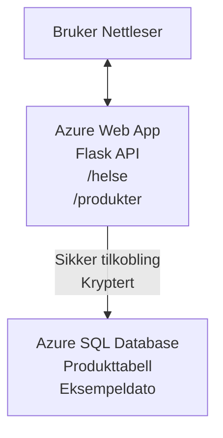

# Distribuere en Microsoft SQL-database og nettapp med AZD

⏱️ **Estimert tid**: 20-30 minutter | 💰 **Estimert kostnad**: ~15–25 USD/måned | ⭐ **Kompleksitet**: Mellomnivå

Dette **fullstendige, fungerende eksempelet** viser hvordan du kan bruke [Azure Developer CLI (azd)](https://learn.microsoft.com/azure/developer/azure-developer-cli/) for å distribuere en Python Flask-nettapplikasjon med en Microsoft SQL-database til Azure. All kode er inkludert og testet—ingen eksterne avhengigheter kreves.

## Hva du vil lære

Ved å fullføre dette eksempelet vil du:
- Distribuere en flerlags applikasjon (nettapp + database) ved hjelp av infrastruktur som kode
- Konfigurere sikre databasetilkoblinger uten å hardkode hemmeligheter
- Overvåke applikasjonens helse med Application Insights
- Administrere Azure-ressurser effektivt med AZD CLI
- Følge Azures beste praksis for sikkerhet, kostnadsoptimalisering og observabilitet

## Scenariooversikt
- **Nettapp**: Python Flask REST API med databasetilkobling
- **Database**: Azure SQL Database med eksempeldata
- **Infrastruktur**: Provisionert med Bicep (modulære, gjenbrukbare maler)
- **Distribusjon**: Fullt automatisert med `azd`-kommandoer
- **Overvåking**: Application Insights for logger og telemetri

## Forutsetninger

### Nødvendige verktøy

Før du starter, sørg for at du har disse verktøyene installert:

1. **[Azure CLI](https://learn.microsoft.com/cli/azure/install-azure-cli)** (versjon 2.50.0 eller høyere)
   ```sh
   az --version
   # Forventet utdata: azure-cli 2.50.0 eller nyere
   ```

2. **[Azure Developer CLI (azd)](https://learn.microsoft.com/azure/developer/azure-developer-cli/install-azd)** (versjon 1.0.0 eller høyere)
   ```sh
   azd version
   # Forventet output: azd versjon 1.0.0 eller høyere
   ```

3. **[Python 3.8+](https://www.python.org/downloads/)** (for lokal utvikling)
   ```sh
   python --version
   # Forventet utgang: Python 3.8 eller høyere
   ```

4. **[Docker](https://www.docker.com/get-started)** (valgfritt, for lokal containerutvikling)
   ```sh
   docker --version
   # Forventet utdata: Docker versjon 20.10 eller høyere
   ```

### Azure-krav

- Et aktivt **Azure-abonnement** ([opprett en gratis konto](https://azure.microsoft.com/free/))
- Tillatelser til å opprette ressurser i abonnementet ditt
- **Owner**- eller **Contributor**-rolle på abonnementet eller ressursgruppen

### Forhåndskunnskaper

Dette er et **mellomnivå**-eksempel. Du bør være kjent med:
- Grunnleggende kommandolinjeoperasjoner
- Grunnleggende sky-konsepter (ressurser, ressursgrupper)
- Grunnleggende forståelse av webapplikasjoner og databaser

**Ny med AZD?** Start med [Kom-i-gang-guiden](../../docs/chapter-01-foundation/azd-basics.md).

## Arkitektur

Dette eksempelet distribuerer en to-lags arkitektur med en nettapplikasjon og SQL-database:



**Ressursdistribusjon:**
- **Ressursgruppe**: Beholder for alle ressurser
- **App Service Plan**: Linux-basert hosting (B1-nivå for kostnadseffektivitet)
- **Nettapp**: Python 3.11-runtime med Flask-applikasjon
- **SQL Server**: Administrert databaseserver med minimum TLS 1.2
- **SQL Database**: Basisnivå (2GB, egnet for utvikling/testing)
- **Application Insights**: Overvåking og logging
- **Log Analytics Workspace**: Sentralisert logglagring

**Analogien**: Tenk på dette som en restaurant (nettapp) med en fryser (database). Kundene bestiller fra menyen (API-endepunkter), og kjøkkenet (Flask-appen) henter ingrediensene (data) fra fryseren. Restaurantsjefen (Application Insights) holder oversikt over alt som skjer.

## Mappestruktur

Alle filer er inkludert i dette eksempelet—ingen eksterne avhengigheter kreves:

```
examples/database-app/
│
├── README.md                    # This file
├── azure.yaml                   # AZD configuration file
├── .env.sample                  # Sample environment variables
├── .gitignore                   # Git ignore patterns
│
├── infra/                       # Infrastructure as Code (Bicep)
│   ├── main.bicep              # Main orchestration template
│   ├── abbreviations.json      # Azure naming conventions
│   └── resources/              # Modular resource templates
│       ├── sql-server.bicep    # SQL Server configuration
│       ├── sql-database.bicep  # Database configuration
│       ├── app-service-plan.bicep  # Hosting plan
│       ├── app-insights.bicep  # Monitoring setup
│       └── web-app.bicep       # Web application
│
└── src/
    └── web/                    # Application source code
        ├── app.py              # Flask REST API
        ├── requirements.txt    # Python dependencies
        └── Dockerfile          # Container definition
```

**Hva hver fil gjør:**
- **azure.yaml**: Forteller AZD hva som skal distribueres og hvor
- **infra/main.bicep**: Orkestrerer alle Azure-ressurser
- **infra/resources/*.bicep**: Enkeltressursdefinisjoner (modulær for gjenbruk)
- **src/web/app.py**: Flask-applikasjon med databaselogikk
- **requirements.txt**: Python-pakkeavhengigheter
- **Dockerfile**: Instruksjoner for containerisering ved distribusjon

## Rask start (Steg-for-steg)

### Steg 1: Klon og naviger

```sh
git clone https://github.com/microsoft/AZD-for-beginners.git
cd AZD-for-beginners/examples/database-app
```

**✓ Suksesssjekk**: Bekreft at du ser `azure.yaml` og `infra/`-mappen:
```sh
ls
# Forventet: README.md, azure.yaml, infra/, src/
```

### Steg 2: Autentiser med Azure

```sh
azd auth login
```

Dette åpner nettleseren din for Azure-autentisering. Logg inn med dine Azure-legitimasjoner.

**✓ Suksesssjekk**: Du bør se:
```
Logged in to Azure.
```

### Steg 3: Initialiser miljøet

```sh
azd init
```

**Hva skjer**: AZD oppretter en lokal konfigurasjon for distribusjonen din.

**Promptene du vil se**:
- **Miljønavn**: Skriv inn et kort navn (f.eks. `dev`, `myapp`)
- **Azure-abonnement**: Velg abonnement fra listen
- **Azure-lokasjon**: Velg region (f.eks. `eastus`, `westeurope`)

**✓ Suksesssjekk**: Du bør se:
```
SUCCESS: New project initialized!
```

### Steg 4: Provisioner Azure-ressurser

```sh
azd provision
```

**Hva skjer**: AZD deployerer all infrastruktur (tar 5-8 minutter):
1. Oppretter ressursgruppe
2. Oppretter SQL Server og Database
3. Oppretter App Service Plan
4. Oppretter Nettapp
5. Oppretter Application Insights
6. Konfigurerer nettverk og sikkerhet

**Du blir spurt om**:
- **SQL admin brukernavn**: Skriv inn brukernavn (f.eks. `sqladmin`)
- **SQL admin passord**: Skriv inn et sterkt passord (lagre dette!)

**✓ Suksesssjekk**: Du bør se:
```
SUCCESS: Your application was provisioned in Azure in X minutes Y seconds.
You can view the resources created under the resource group rg-<env-name> in Azure Portal:
https://portal.azure.com/#@/resource/subscriptions/.../resourceGroups/rg-<env-name>
```

**⏱️ Tid**: 5–8 minutter

### Steg 5: Distribuer applikasjonen

```sh
azd deploy
```

**Hva skjer**: AZD bygger og deployerer Flask-applikasjonen din:
1. Pakker Python-applikasjonen
2. Bygger Docker-containeren
3. Pusher til Azure Web App
4. Initialiserer databasen med eksempeldata
5. Starter applikasjonen

**✓ Suksesssjekk**: Du bør se:
```
SUCCESS: Your application was deployed to Azure in X minutes Y seconds.
You can view the resources created under the resource group rg-<env-name> in Azure Portal:
https://portal.azure.com/#@/resource/subscriptions/.../resourceGroups/rg-<env-name>
```

**⏱️ Tid**: 3–5 minutter

### Steg 6: Åpne applikasjonen i nettleser

```sh
azd browse
```

Dette åpner den deployerte nettappen i nettleseren på `https://app-<unique-id>.azurewebsites.net`

**✓ Suksesssjekk**: Du bør se JSON-utdata:
```json
{
  "message": "Welcome to the Database App API",
  "endpoints": {
    "/": "This help message",
    "/health": "Health check endpoint",
    "/products": "List all products",
    "/products/<id>": "Get product by ID"
  }
}
```

### Steg 7: Test API-endepunktene

**Helsetest** (bekreft databasetilkobling):
```sh
curl https://app-<your-id>.azurewebsites.net/health
```

**Forventet svar**:
```json
{
  "status": "healthy",
  "database": "connected"
}
```

**List produkter** (eksempeldata):
```sh
curl https://app-<your-id>.azurewebsites.net/products
```

**Forventet svar**:
```json
[
  {
    "id": 1,
    "name": "Laptop",
    "description": "High-performance laptop",
    "price": 1299.99,
    "created_at": "2025-11-19T10:30:00"
  },
  ...
]
```

**Hent enkeltprodukt**:
```sh
curl https://app-<your-id>.azurewebsites.net/products/1
```

**✓ Suksesssjekk**: Alle endepunkter returnerer JSON-data uten feil.

---

**🎉 Gratulerer!** Du har nå distribuert en nettapplikasjon med en database til Azure ved bruk av AZD.

## Konfigurasjonsdykk

### Miljøvariabler

Hemmeligheter håndteres sikkert via Azure App Service-konfigurasjon—**aldri hardkodet i koden**.

**Automatisk konfigurert av AZD**:
- `SQL_CONNECTION_STRING`: Databasetilkobling med krypterte legitimasjoner
- `APPLICATIONINSIGHTS_CONNECTION_STRING`: Overvåkings-telemetri-endepunkt
- `SCM_DO_BUILD_DURING_DEPLOYMENT`: Aktiverer automatisk avhengighetsinstallasjon

**Hvor hemmeligheter lagres**:
1. Under `azd provision` oppgir du SQL-legitimasjoner via sikre prompt
2. AZD lagrer disse i lokal `.azure/<env-navn>/.env`-fil (git-ignoret)
3. AZD injiserer dem i Azure App Service-konfigurasjonen (kryptert i hvile)
4. Applikasjonen leser disse via `os.getenv()` ved kjøretid

### Lokal utvikling

For lokal testing, lag en `.env`-fil fra eksempelet:

```sh
cp .env.sample .env
# Rediger .env med din lokale databaseforbindelse
```

**Lokal utviklingsarbeidsflyt**:
```sh
# Installer avhengigheter
cd src/web
pip install -r requirements.txt

# Sett miljøvariabler
export SQL_CONNECTION_STRING="your-local-connection-string"

# Kjør applikasjonen
python app.py
```

**Test lokalt**:
```sh
curl http://localhost:8000/health
# Forventet: {"status": "helse", "database": "tilkoblet"}
```

### Infrastruktur som kode

Alle Azure-ressurser er definert i **Bicep-maler** (`infra/`-mappen):

- **Modulært design**: Hver ressurs type har egen fil for gjenbruk
- **Parameterisert**: Tilpass SKUs, regioner, navnekonvensjoner
- **Beste praksis**: Følger Azure-navnestandarder og sikkerhetsdefaulter
- **Versjonskontrollert**: Infrastrukturendringer spores i Git

**Eksempel på tilpasning**:
For å endre databasenivå, rediger `infra/resources/sql-database.bicep`:
```bicep
sku: {
  name: 'Standard'  // Changed from 'Basic'
  tier: 'Standard'
  capacity: 10
}
```

## Sikkerhetsbeste praksis

Dette eksempelet følger Azures beste praksis for sikkerhet:

### 1. **Ingen hemmeligheter i koden**
- ✅ Legitimasjoner lagres i Azure App Service-konfigurasjon (kryptert)
- ✅ `.env`-filer ekskluderes fra Git via `.gitignore`
- ✅ Hemmeligheter overføres som sikre parametre under oppretting

### 2. **Krypterte tilkoblinger**
- ✅ TLS 1.2 minimum for SQL Server
- ✅ Kun HTTPS for nettappen
- ✅ Databastilkoblinger bruker krypterte kanaler

### 3. **Nettverkssikkerhet**
- ✅ SQL Server-brannmur konfigurert for kun Azure-tjenester
- ✅ Offentlig nettverkstilgang begrenset (kan låses ytterligere med Private Endpoints)
- ✅ FTPS deaktivert på nettappen

### 4. **Autentisering og autorisering**
- ⚠️ **Nåværende**: SQL-autentisering (brukernavn/passord)
- ✅ **Produksjonsanbefaling**: Bruk Azure Managed Identity for passordfri autentisering

**For å oppgradere til Managed Identity** (for produksjon):
1. Aktiver managed identity på Nettappen
2. Gi identiteten SQL-tillatelser
3. Oppdater tilkoblingsstrengen for å bruke managed identity
4. Fjern passordbasert autentisering

### 5. **Revisjon og samsvar**
- ✅ Application Insights logger alle forespørsler og feil
- ✅ SQL Database-revisjon aktivert (kan konfigureres for samsvar)
- ✅ Alle ressurser tagget for styring

**Sikkerhetssjekkliste før produksjon**:
- [ ] Aktiver Azure Defender for SQL
- [ ] Konfigurer Private Endpoints for SQL Database
- [ ] Aktiver Web Application Firewall (WAF)
- [ ] Implementer Azure Key Vault for hemmelighetsrotasjon
- [ ] Konfigurer Microsoft Entra ID-autentisering
- [ ] Aktiver diagnostisk logging for alle ressurser

## Kostnadsoptimalisering

**Estimert månedlig kostnad** (per november 2025):

| Ressurs | SKU/Nivå | Estimert kostnad |
|----------|----------|------------------|
| App Service Plan | B1 (Basic) | ~13 USD/måned |
| SQL Database | Basic (2GB) | ~5 USD/måned |
| Application Insights | Betal etter bruk | ~2 USD/måned (lav trafikk) |
| **Totalt** | | **~20 USD/måned** |

**💡 Kostnadsbesparende tips**:

1. **Bruk gratisnivå for læring**:
   - App Service: F1-nivå (gratis, begrensede timer)
   - SQL Database: Bruk Azure SQL Database serverless
   - Application Insights: 5GB/måned gratis inntak

2. **Stopp ressurser når de ikke er i bruk**:
   ```sh
   # Stopp webappen (databasen belastes fortsatt)
   az webapp stop --name <app-name> --resource-group <rg-name>
   
   # Start på nytt ved behov
   az webapp start --name <app-name> --resource-group <rg-name>
   ```

3. **Slett alt etter testing**:
   ```sh
   azd down
   ```
   Dette fjerner ALLE ressurser og stopper kostnader.

4. **Utvikling vs. produksjon SKUs**:
   - **Utvikling**: Basisnivå (brukes i dette eksempelet)
   - **Produksjon**: Standard/Premium med redundans

**Kostnadsovervåking**:
- Se kostnader i [Azure Cost Management](https://portal.azure.com/#view/Microsoft_Azure_CostManagement)
- Sett opp kostnadsvarsler for å unngå overraskelser
- Tag alle ressurser med `azd-env-name` for sporing

**Gratisnivå-alternativ**:
For læringsformål kan du endre `infra/resources/app-service-plan.bicep`:
```bicep
sku: {
  name: 'F1'  // Free tier
  tier: 'Free'
}
```
**Merk**: Gratisnivå har begrensninger (60 min/dag CPU, ikke alltid på).

## Overvåking og observabilitet

### Application Insights-integrasjon

Dette eksempelet inkluderer **Application Insights** for omfattende overvåking:

**Hva som overvåkes**:
- ✅ HTTP-forespørsler (forsinkelse, statuskoder, endepunkter)
- ✅ Applikasjonsfeil og unntak
- ✅ Egne logger fra Flask-appen
- ✅ Databasetilkoblingens helse
- ✅ Ytelsesmålinger (CPU, minne)

**Åpne Application Insights**:
1. Åpne [Azure Portal](https://portal.azure.com)
2. Gå til ressursgruppen din (`rg-<env-navn>`)
3. Klikk på Application Insights-ressursen (`appi-<unique-id>`)

**Nyttige spørringer** (Application Insights → Logger):

**Vis alle forespørsler**:
```kusto
requests
| where timestamp > ago(1h)
| order by timestamp desc
| project timestamp, name, url, resultCode, duration
```

**Finn feil**:
```kusto
exceptions
| where timestamp > ago(24h)
| order by timestamp desc
| project timestamp, type, outerMessage, operation_Name
```

**Sjekk helsetilstand-endepunkt**:
```kusto
requests
| where name contains "health"
| summarize count() by resultCode, bin(timestamp, 1h)
```

### SQL Database-revisjon

**SQL Database-revisjon er aktivert** for å spore:
- Tilgangsmønstre til databasen
- Mislykkede påloggingsforsøk
- Skjemaendringer
- Dataadgang (for samsvar)

**Åpne revisjonslogger**:
1. Azure Portal → SQL Database → Revisjon
2. Se logger i Log Analytics workspace

### Sanntidsovervåking

**Se live-metrikker**:
1. Application Insights → Live Metrics
2. Se forespørsler, feilet, og ytelse i sanntid

**Sett opp varsler**:
Lag varsler for kritiske hendelser:
- HTTP 500-feil > 5 på 5 minutter
- Databasetilkoblingsfeil
- Høy svartid (>2 sekunder)

**Eksempel på varseloppsett**:
```sh
az monitor metrics alert create \
  --name "High-Response-Time" \
  --resource-group <rg-name> \
  --scopes <app-insights-resource-id> \
  --condition "avg requests/duration > 2000" \
  --description "Alert when response time exceeds 2 seconds"
```

## Feilsøking
### Vanlige problemer og løsninger

#### 1. `azd provision` mislykkes med "Location not available"

**Symptom**:  
```
Error: The subscription is not registered for the resource type 'components' in the location 'centralus'.
```
  
**Løsning**:  
Velg en annen Azure-region eller registrer ressursleverandøren:  
```sh
az provider register --namespace Microsoft.Insights
```
  
#### 2. SQL-tilkobling mislykkes under distribusjon

**Symptom**:  
```
pyodbc.OperationalError: ('08001', '[08001] [Microsoft][ODBC Driver 18 for SQL Server]TCP Provider...')
```
  
**Løsning**:  
- Bekreft at SQL Server-brannmuren tillater Azure-tjenester (konfigureres automatisk)  
- Sjekk at SQL-adminpassordet ble skrevet inn korrekt under `azd provision`  
- Sørg for at SQL Server er fullstendig tilordnet (kan ta 2-3 minutter)  

**Bekreft tilkobling**:  
```sh
# Fra Azure-portalen, gå til SQL-database → Spørringsredigerer
# Prøv å koble til med dine legitimasjonsopplysninger
```
  
#### 3. Webappen viser "Application Error"

**Symptom**:  
Nettleseren viser generisk feilmelding.

**Løsning**:  
Sjekk applikasjonslogger:  
```sh
# Vis nylige logger
az webapp log tail --name <app-name> --resource-group <rg-name>
```
  
**Vanlige årsaker**:  
- Manglende miljøvariabler (sjekk App Service → Konfigurasjon)  
- Python-pakkeinstallasjon feilet (sjekk distribusjonslogger)  
- Databaseinitialiseringsfeil (sjekk SQL-tilkobling)  

#### 4. `azd deploy` mislykkes med "Build Error"

**Symptom**:  
```
Error: Failed to build project
```
  
**Løsning**:  
- Sørg for at `requirements.txt` ikke inneholder syntaksfeil  
- Sjekk at Python 3.11 er spesifisert i `infra/resources/web-app.bicep`  
- Bekreft at Dockerfile har korrekt basebilde  

**Feilsøk lokalt**:  
```sh
cd src/web
docker build -t test-app .
docker run -p 8000:8000 test-app
```
  
#### 5. "Unauthorized" ved kjøring av AZD-kommandoer

**Symptom**:  
```
ERROR: (Unauthorized) The client '<id>' with object id '<id>' does not have authorization
```
  
**Løsning**:  
Autentiser på nytt med Azure:  
```sh
# Nødvendig for AZD-arbeidsflyter
azd auth login

# Valgfritt hvis du også bruker Azure CLI-kommandoer direkte
az login
```
  
Bekreft at du har riktige tillatelser (Bidragsyterrolle) på abonnementet.

#### 6. Høye databasekostnader

**Symptom**:  
Uventet Azure-regning.

**Løsning**:  
- Sjekk om du glemte å kjøre `azd down` etter testing  
- Kontroller at SQL-databasen bruker Basic-nivå (ikke Premium)  
- Gjennomgå kostnader i Azure Cost Management  
- Sett opp kostnadsvarsler  

### Få hjelp

**Vis alle AZD-miljøvariabler**:  
```sh
azd env get-values
```
  
**Sjekk distribusjonsstatus**:  
```sh
az webapp show --name <app-name> --resource-group <rg-name> --query state
```
  
**Tilgang til applikasjonslogger**:  
```sh
az webapp log download --name <app-name> --resource-group <rg-name> --log-file app-logs.zip
```
  
**Trenger du mer hjelp?**  
- [AZD feilsøkingsguide](../../docs/chapter-07-troubleshooting/common-issues.md)  
- [Azure App Service feilsøking](https://learn.microsoft.com/azure/app-service/troubleshoot-diagnostic-logs)  
- [Azure SQL feilsøking](https://learn.microsoft.com/azure/azure-sql/database/troubleshoot-common-errors-issues)  

## Praktiske øvelser

### Øvelse 1: Bekreft distribusjonen din (Nybegynner)

**Mål**: Bekreft at alle ressurser er distribuert og at applikasjonen fungerer.

**Trinn**:  
1. List alle ressurser i ressursgruppen din:  
   ```sh
   az resource list --resource-group rg-<env-name> --output table
   ```
   **Forventet**: 6-7 ressurser (Web App, SQL Server, SQL Database, App Service Plan, Application Insights, Log Analytics)  

2. Test alle API-endepunkter:  
   ```sh
   curl https://app-<your-id>.azurewebsites.net/
   curl https://app-<your-id>.azurewebsites.net/health
   curl https://app-<your-id>.azurewebsites.net/products
   curl https://app-<your-id>.azurewebsites.net/products/1
   ```
   **Forventet**: Alle returnerer gyldig JSON uten feil  

3. Sjekk Application Insights:  
   - Naviger til Application Insights i Azure-portalen  
   - Gå til "Live Metrics"  
   - Oppdater nettleseren på webappen  
   **Forventet**: Se forespørsler vises i sanntid  

**Suksesskriterier**: Alle 6-7 ressurser eksisterer, alle endepunkter returnerer data, Live Metrics viser aktivitet.

---

### Øvelse 2: Legg til et nytt API-endepunkt (Middels)

**Mål**: Utvid Flask-applikasjonen med et nytt endepunkt.

**Startkode**: Nåværende endepunkter i `src/web/app.py`

**Trinn**:  
1. Rediger `src/web/app.py` og legg til et nytt endepunkt etter funksjonen `get_product()`:  
   ```python
   @app.route('/products/search/<keyword>')
   def search_products(keyword):
       """Search products by name or description."""
       try:
           conn = get_db_connection()
           cursor = conn.cursor()
           cursor.execute(
               "SELECT id, name, description, price, created_at FROM products WHERE name LIKE ? OR description LIKE ?",
               (f'%{keyword}%', f'%{keyword}%')
           )
           
           products = []
           for row in cursor.fetchall():
               products.append({
                   'id': row[0],
                   'name': row[1],
                   'description': row[2],
                   'price': float(row[3]) if row[3] else None,
                   'created_at': row[4].isoformat() if row[4] else None
               })
           
           cursor.close()
           conn.close()
           
           logger.info(f"Search for '{keyword}' returned {len(products)} results")
           return jsonify(products), 200
           
       except Exception as e:
           logger.error(f"Error searching products: {str(e)}")
           return jsonify({'error': str(e)}), 500
   ```
  
2. Distribuer den oppdaterte applikasjonen:  
   ```sh
   azd deploy
   ```
  
3. Test det nye endepunktet:  
   ```sh
   curl https://app-<your-id>.azurewebsites.net/products/search/laptop
   ```
   **Forventet**: Returnerer produkter som matcher "laptop"  

**Suksesskriterier**: Det nye endepunktet fungerer, returnerer filtrerte resultater, vises i Application Insights-logger.

---

### Øvelse 3: Legg til overvåking og varsler (Avansert)

**Mål**: Sett opp proaktiv overvåking med varsler.

**Trinn**:  
1. Lag et varsel for HTTP 500-feil:  
   ```sh
   # Hent Application Insights ressurs-ID
   AI_ID=$(az monitor app-insights component show \
     --app appi-<your-id> \
     --resource-group rg-<env-name> \
     --query id -o tsv)
   
   # Opprett varsel
   az monitor metrics alert create \
     --name "High-Error-Rate" \
     --resource-group rg-<env-name> \
     --scopes $AI_ID \
     --condition "count requests/failed > 5" \
     --window-size 5m \
     --evaluation-frequency 1m \
     --description "Alert when >5 failed requests in 5 minutes"
   ```
  
2. Utløse varslet ved å forårsake feil:  
   ```sh
   # Be om et ikke-eksisterende produkt
   for i in {1..10}; do curl https://app-<your-id>.azurewebsites.net/products/999; done
   ```
  
3. Sjekk om varslet utløste:  
   - Azure Portal → Varsler → Varselregler  
   - Sjekk e-posten din (hvis konfigurert)  

**Suksesskriterier**: Varselregel er opprettet, utløses ved feil, varsler mottas.

---

### Øvelse 4: Endringer i databaseskjema (Avansert)

**Mål**: Legg til en ny tabell og oppdater applikasjonen til å bruke den.

**Trinn**:  
1. Koble til SQL-databasen via Azure Portal Query Editor  

2. Opprett en ny `categories`-tabell:  
   ```sql
   CREATE TABLE categories (
       id INT PRIMARY KEY IDENTITY(1,1),
       name NVARCHAR(50) NOT NULL,
       description NVARCHAR(200)
   );
   
   INSERT INTO categories (name, description) VALUES
   ('Electronics', 'Electronic devices and accessories'),
   ('Office Supplies', 'Office equipment and supplies');
   
   -- Add category to products table
   ALTER TABLE products ADD category_id INT;
   UPDATE products SET category_id = 1; -- Set all to Electronics
   ```
  
3. Oppdater `src/web/app.py` for å inkludere kategoriinformasjon i svar  

4. Distribuer og test  

**Suksesskriterier**: Ny tabell eksisterer, produkter viser kategoriinformasjon, applikasjonen fungerer fortsatt.

---

### Øvelse 5: Implementer caching (Ekspert)

**Mål**: Legg til Azure Redis Cache for å forbedre ytelsen.

**Trinn**:  
1. Legg til Redis Cache i `infra/main.bicep`  
2. Oppdater `src/web/app.py` for å cache produktspørringer  
3. Mål ytelsesforbedring med Application Insights  
4. Sammenlign svartid før/etter caching  

**Suksesskriterier**: Redis er distribuert, caching fungerer, svartiden forbedres med >50%.

**Tips**: Start med [Azure Cache for Redis dokumentasjon](https://learn.microsoft.com/azure/azure-cache-for-redis/).

---

## Opprydding

For å unngå løpende kostnader, slett alle ressurser når du er ferdig:  

```sh
azd down
```
  
**Bekreftelsesprompt**:  
```
? Total resources to delete: 7, are you sure you want to continue? (y/N)
```
  
Skriv `y` for å bekrefte.

**✓ Suksesssjekk**:  
- Alle ressurser er slettet fra Azure-portalen  
- Ingen løpende kostnader  
- Lokal `.azure/<env-name>` mappe kan slettes  

**Alternativ** (behold infrastruktur, slett data):  
```sh
# Slett bare ressursgruppen (behold AZD-konfigurasjonen)
az group delete --name rg-<env-name> --yes
```
## Lær mer

### Relatert dokumentasjon
- [Azure Developer CLI-dokumentasjon](https://learn.microsoft.com/azure/developer/azure-developer-cli/)  
- [Azure SQL Database dokumentasjon](https://learn.microsoft.com/azure/azure-sql/database/)  
- [Azure App Service dokumentasjon](https://learn.microsoft.com/azure/app-service/)  
- [Application Insights dokumentasjon](https://learn.microsoft.com/azure/azure-monitor/app/app-insights-overview)  
- [Bicep språkreferanse](https://learn.microsoft.com/azure/azure-resource-manager/bicep/)  

### Neste steg i dette kurset
- **[Container Apps-eksempel](../../../../examples/container-app)**: Distribuer mikrotjenester med Azure Container Apps  
- **[Guide for AI-integrasjon](../../../../docs/ai-foundry)**: Legg til AI-funksjonalitet i appen din  
- **[Beste praksis for distribusjon](../../docs/chapter-04-infrastructure/deployment-guide.md)**: Produksjonsmønstre for distribusjon  

### Avanserte temaer
- **Administrerte identiteter**: Fjern passord og bruk Microsoft Entra ID-autentisering  
- **Private endepunkter**: Sikre databasetilkoblinger innenfor et virtuelt nettverk  
- **CI/CD-integrasjon**: Automatiser distribusjoner med GitHub Actions eller Azure DevOps  
- **Multi-miljø**: Sett opp utvikling, staging og produksjonsmiljøer  
- **Database-migrasjoner**: Bruk Alembic eller Entity Framework for skjema-versjonering  

### Sammenligning med andre tilnærminger

**AZD vs. ARM-maler**:  
- ✅ AZD: Høyere abstraksjon, enklere kommandoer  
- ⚠️ ARM: Mer detaljert, finjustert kontroll  

**AZD vs. Terraform**:  
- ✅ AZD: Azure-innfødt, integrert med Azure-tjenester  
- ⚠️ Terraform: Multi-cloud støtte, større økosystem  

**AZD vs. Azure Portal**:  
- ✅ AZD: Reproduserbart, versjonskontrollert, automatiserbart  
- ⚠️ Portal: Manuelle klikk, vanskelig å gjenskape  

**Tenk på AZD som**: Docker Compose for Azure—forenklet konfigurasjon for komplekse distribusjoner.

---

## Ofte stilte spørsmål

**Q: Kan jeg bruke et annet programmeringsspråk?**  
A: Ja! Erstatt `src/web/` med Node.js, C#, Go eller hvilket som helst språk. Oppdater `azure.yaml` og Bicep deretter.

**Q: Hvordan legger jeg til flere databaser?**  
A: Legg til en annen SQL Database-modul i `infra/main.bicep` eller bruk PostgreSQL/MySQL fra Azure Database-tjenester.

**Q: Kan jeg bruke dette i produksjon?**  
A: Dette er et utgangspunkt. For produksjon legg til: administrert identitet, private endepunkter, redundans, backup-strategi, WAF og avansert overvåking.

**Q: Hva om jeg vil bruke containere istedenfor kode-distribusjon?**  
A: Sjekk ut [Container Apps-eksemplet](../../../../examples/container-app) som bruker Docker-containere gjennomgående.

**Q: Hvordan kobler jeg til databasen fra min lokale maskin?**  
A: Legg til IP-adressen din i SQL Server-brannmuren:  
```sh
az sql server firewall-rule create \
  --resource-group rg-<env-name> \
  --server sql-<unique-id> \
  --name AllowMyIP \
  --start-ip-address <your-ip> \
  --end-ip-address <your-ip>
```
  
**Q: Kan jeg bruke en eksisterende database i stedet for å opprette en ny?**  
A: Ja, endre `infra/main.bicep` for å referere en eksisterende SQL Server og oppdater tilkoblingsstrengparametrene.

---

> **Merk:** Dette eksemplet demonstrerer beste praksis for distribusjon av en webapp med database ved bruk av AZD. Det inkluderer fungerende kode, omfattende dokumentasjon og praktiske øvelser for å styrke læring. For produksjonsdistribusjoner, vurder sikkerhet, skalerbarhet, samsvar og kostnadskrav spesifikt for din organisasjon.

**📚 Kursnavigasjon:**  
- ← Forrige: [Container Apps-eksempel](../../../../examples/container-app)  
- → Neste: [Guide for AI-integrasjon](../../../../docs/ai-foundry)  
- 🏠 [Kurs Hjem](../../README.md)

---

<!-- CO-OP TRANSLATOR DISCLAIMER START -->
**Ansvarsfraskrivelse**:
Dette dokumentet er oversatt ved hjelp av AI-oversettelsestjenesten [Co-op Translator](https://github.com/Azure/co-op-translator). Selv om vi streber etter nøyaktighet, vær oppmerksom på at automatiske oversettelser kan inneholde feil eller unøyaktigheter. Det opprinnelige dokumentet på originalspråket skal betraktes som den autoritative kilden. For kritisk informasjon anbefales profesjonell menneskelig oversettelse. Vi er ikke ansvarlige for eventuelle misforståelser eller feiltolkninger som oppstår ved bruk av denne oversettelsen.
<!-- CO-OP TRANSLATOR DISCLAIMER END -->