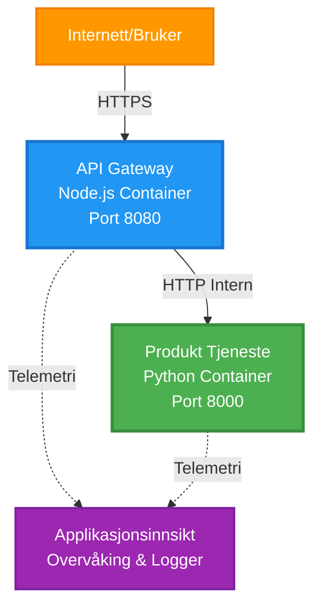
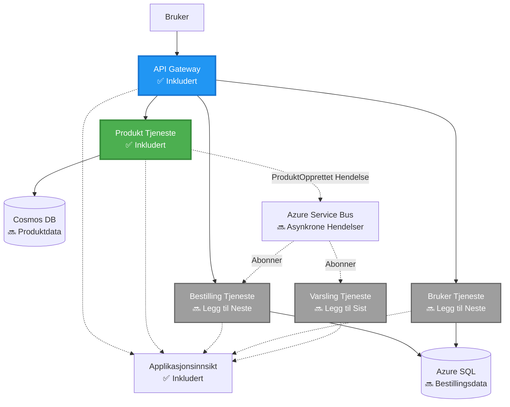
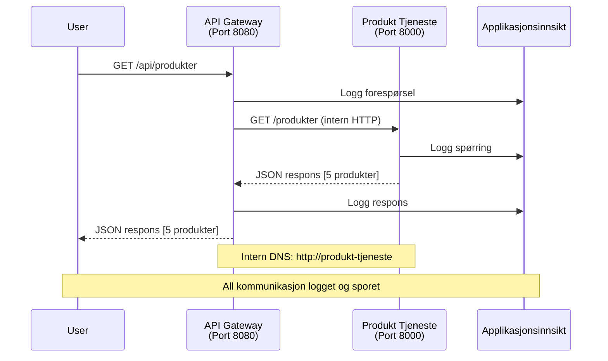

<!--
CO_OP_TRANSLATOR_METADATA:
{
  "original_hash": "eb3a4803a1e80a7f2e64f6bf63738c0f",
  "translation_date": "2025-11-21T18:20:28+00:00",
  "source_file": "examples/microservices/README.md",
  "language_code": "no"
}
-->
# Mikrotjenestearkitektur - Eksempel på Container App

⏱️ **Estimert tid**: 25-35 minutter | 💰 **Estimert kostnad**: ~$50-100/måned | ⭐ **Kompleksitet**: Avansert

**📚 Læringssti:**
- ← Forrige: [Enkel Flask API](../../../../examples/container-app/simple-flask-api) - Grunnleggende om enkeltcontainer
- 🎯 **Du er her**: Mikrotjenestearkitektur (grunnlag med 2 tjenester)
- → Neste: [AI-integrasjon](../../../../docs/ai-foundry) - Legg til intelligens i tjenestene dine
- 🏠 [Kursoversikt](../../README.md)

---

En **forenklet, men funksjonell** mikrotjenestearkitektur distribuert til Azure Container Apps ved bruk av AZD CLI. Dette eksemplet demonstrerer kommunikasjon mellom tjenester, containerorkestrering og overvåking med en praktisk oppsett av to tjenester.

> **📚 Læringsmetode**: Dette eksemplet starter med en minimal arkitektur med to tjenester (API Gateway + Backend-tjeneste) som du faktisk kan distribuere og lære av. Etter å ha mestret dette grunnlaget, gir vi veiledning for å utvide til et komplett mikrotjenestesystem.

## Hva du vil lære

Ved å fullføre dette eksemplet vil du:
- Distribuere flere containere til Azure Container Apps
- Implementere kommunikasjon mellom tjenester med internt nettverk
- Konfigurere miljøbasert skalering og helsesjekker
- Overvåke distribuerte applikasjoner med Application Insights
- Forstå distribusjonsmønstre og beste praksis for mikrotjenester
- Lære progressiv utvidelse fra enkle til komplekse arkitekturer

## Arkitektur

### Fase 1: Hva vi bygger (inkludert i dette eksemplet)


**Komponentdetaljer:**

| Komponent | Formål | Tilgang | Ressurser |
|-----------|--------|---------|-----------|
| **API Gateway** | Ruter eksterne forespørsler til backend-tjenester | Offentlig (HTTPS) | 1 vCPU, 2GB RAM, 2-20 replikaer |
| **Produkt-tjeneste** | Administrerer produktkatalog med data i minnet | Kun internt | 0.5 vCPU, 1GB RAM, 1-10 replikaer |
| **Application Insights** | Sentralisert logging og distribuert sporing | Azure Portal | 1-2 GB/måned datainntak |

**Hvorfor starte enkelt?**
- ✅ Distribuer og forstå raskt (25-35 minutter)
- ✅ Lær grunnleggende mønstre for mikrotjenester uten kompleksitet
- ✅ Fungerende kode du kan modifisere og eksperimentere med
- ✅ Lavere kostnad for læring (~$50-100/måned vs $300-1400/måned)
- ✅ Bygg selvtillit før du legger til databaser og meldingskøer

**Analogien**: Tenk på dette som å lære å kjøre bil. Du starter på en tom parkeringsplass (2 tjenester), mestrer det grunnleggende, og går deretter videre til bytrafikk (5+ tjenester med databaser).

### Fase 2: Fremtidig utvidelse (referansearkitektur)

Når du har mestret arkitekturen med 2 tjenester, kan du utvide til:


Se "Utvidelsesveiledning"-seksjonen på slutten for trinnvise instruksjoner.

## Inkluderte funksjoner

✅ **Tjenesteoppdagelse**: Automatisk DNS-basert oppdagelse mellom containere  
✅ **Lastbalansering**: Innebygd lastbalansering på tvers av replikaer  
✅ **Autoskalering**: Uavhengig skalering per tjeneste basert på HTTP-forespørsler  
✅ **Helseovervåking**: Liveness- og readiness-prober for begge tjenester  
✅ **Distribuert logging**: Sentralisert logging med Application Insights  
✅ **Internt nettverk**: Sikker kommunikasjon mellom tjenester  
✅ **Containerorkestrering**: Automatisk distribusjon og skalering  
✅ **Oppdateringer uten nedetid**: Rullerende oppdateringer med revisjonshåndtering  

## Forutsetninger

### Nødvendige verktøy

Før du starter, bekreft at du har disse verktøyene installert:

1. **[Azure Developer CLI (azd)](https://learn.microsoft.com/azure/developer/azure-developer-cli/install-azd)** (versjon 1.0.0 eller høyere)
   ```bash
   azd version
   # Forventet output: azd versjon 1.0.0 eller høyere
   ```

2. **[Azure CLI](https://learn.microsoft.com/cli/azure/install-azure-cli)** (versjon 2.50.0 eller høyere)
   ```bash
   az --version
   # Forventet output: azure-cli 2.50.0 eller høyere
   ```

3. **[Docker](https://www.docker.com/get-started)** (for lokal utvikling/testing - valgfritt)
   ```bash
   docker --version
   # Forventet output: Docker versjon 20.10 eller høyere
   ```

### Verifiser oppsettet ditt

Kjør disse kommandoene for å bekrefte at du er klar:

```bash
# Sjekk Azure Developer CLI
azd version
# ✅ Forventet: azd versjon 1.0.0 eller høyere

# Sjekk Azure CLI
az --version
# ✅ Forventet: azure-cli 2.50.0 eller høyere

# Sjekk Docker (valgfritt)
docker --version
# ✅ Forventet: Docker versjon 20.10 eller høyere
```

**Suksesskriterier**: Alle kommandoer returnerer versjonsnumre som samsvarer med eller overstiger minimumskravene.

### Azure-krav

- Et aktivt **Azure-abonnement** ([opprett en gratis konto](https://azure.microsoft.com/free/))
- Tillatelser til å opprette ressurser i abonnementet ditt
- **Bidragsyter**-rolle på abonnementet eller ressursgruppen

### Kunnskapsforutsetninger

Dette er et eksempel på **avansert nivå**. Du bør ha:
- Fullført [Enkel Flask API-eksempel](../../../../examples/container-app/simple-flask-api) 
- Grunnleggende forståelse av mikrotjenestearkitektur
- Kjennskap til REST API-er og HTTP
- Forståelse av containerkonsepter

**Ny i Container Apps?** Start med [Enkel Flask API-eksempel](../../../../examples/container-app/simple-flask-api) først for å lære det grunnleggende.

## Hurtigstart (trinnvis)

### Trinn 1: Klon og naviger

```bash
git clone https://github.com/microsoft/AZD-for-beginners.git
cd AZD-for-beginners/examples/microservices
```

**✓ Suksesskontroll**: Bekreft at du ser `azure.yaml`:
```bash
ls
# Forventet: README.md, azure.yaml, infra/, src/
```

### Trinn 2: Autentiser med Azure

```bash
azd auth login
```

Dette åpner nettleseren din for Azure-autentisering. Logg inn med Azure-legitimasjonen din.

**✓ Suksesskontroll**: Du bør se:
```
Logged in to Azure.
```

### Trinn 3: Initialiser miljøet

```bash
azd init
```

**Spørsmål du vil se**:
- **Miljønavn**: Skriv inn et kort navn (f.eks. `microservices-dev`)
- **Azure-abonnement**: Velg abonnementet ditt
- **Azure-plassering**: Velg en region (f.eks. `eastus`, `westeurope`)

**✓ Suksesskontroll**: Du bør se:
```
SUCCESS: New project initialized!
```

### Trinn 4: Distribuer infrastruktur og tjenester

```bash
azd up
```

**Hva som skjer** (tar 8-12 minutter):

```mermaid
graph LR
    A[azd opp] --> B[Opprett ressursgruppe]
    B --> C[Distribuer containerregister]
    C --> D[Distribuer logganalyse]
    D --> E[Distribuer appinnsikt]
    E --> F[Opprett container-miljø]
    F --> G[Bygg API-gateway-bilde]
    F --> H[Bygg produktservice-bilde]
    G --> I[Skyv til register]
    H --> I
    I --> J[Distribuer API-gateway]
    I --> K[Distribuer produktservice]
    J --> L[Konfigurer ingress og helsesjekker]
    K --> L
    L --> M[Distribusjon fullført ✓]
    
    style A fill:#2196F3,stroke:#1976D2,stroke-width:3px,color:#fff
    style M fill:#4CAF50,stroke:#388E3C,stroke-width:3px,color:#fff
```


**✓ Suksesskontroll**: Du bør se:
```
SUCCESS: Your application was deployed to Azure in X minutes Y seconds.
Endpoint: https://api-gateway-<unique-id>.azurecontainerapps.io
```

**⏱️ Tid**: 8-12 minutter

### Trinn 5: Test distribusjonen

```bash
# Hent gateway-endepunktet
GATEWAY_URL=$(azd env get-values | grep API_GATEWAY_URL | cut -d '=' -f2 | tr -d '"')

# Test API Gateway-tilstand
curl $GATEWAY_URL/health
```

**✅ Forventet utdata:**
```json
{
  "status": "healthy",
  "service": "api-gateway",
  "timestamp": "2025-11-19T10:30:00Z"
}
```

**Test produkt-tjenesten gjennom gateway**:
```bash
# Liste produkter
curl $GATEWAY_URL/api/products
```

**✅ Forventet utdata:**
```json
[
  {"id":1,"name":"Laptop","price":999.99,"stock":50},
  {"id":2,"name":"Mouse","price":29.99,"stock":200},
  {"id":3,"name":"Keyboard","price":79.99,"stock":150}
]
```

**✓ Suksesskontroll**: Begge endepunktene returnerer JSON-data uten feil.

---

**🎉 Gratulerer!** Du har distribuert en mikrotjenestearkitektur til Azure!

## Prosjektstruktur

Alle implementeringsfiler er inkludert—dette er et komplett, fungerende eksempel:

```
microservices/
│
├── README.md                         # This file
├── azure.yaml                        # AZD configuration
├── .gitignore                        # Git ignore patterns
│
├── infra/                           # Infrastructure as Code (Bicep)
│   ├── main.bicep                   # Main orchestration
│   ├── abbreviations.json           # Naming conventions
│   ├── core/                        # Shared infrastructure
│   │   ├── container-apps-environment.bicep  # Container environment + registry
│   │   └── monitor.bicep            # Application Insights + Log Analytics
│   └── app/                         # Service definitions
│       ├── api-gateway.bicep        # API Gateway container app
│       └── product-service.bicep    # Product Service container app
│
└── src/                             # Application source code
    ├── api-gateway/                 # Node.js API Gateway
    │   ├── app.js                   # Express server with routing
    │   ├── package.json             # Node dependencies
    │   └── Dockerfile               # Container definition
    └── product-service/             # Python Product Service
        ├── main.py                  # Flask API with product data
        ├── requirements.txt         # Python dependencies
        └── Dockerfile               # Container definition
```

**Hva hver komponent gjør:**

**Infrastruktur (infra/)**:
- `main.bicep`: Orkestrerer alle Azure-ressurser og deres avhengigheter
- `core/container-apps-environment.bicep`: Oppretter Container Apps-miljøet og Azure Container Registry
- `core/monitor.bicep`: Konfigurerer Application Insights for distribuert logging
- `app/*.bicep`: Individuelle containerapp-definisjoner med skalering og helsesjekker

**API Gateway (src/api-gateway/)**:
- Offentlig tjeneste som ruter forespørsler til backend-tjenester
- Implementerer logging, feilhåndtering og forespørsel-videresending
- Demonstrerer HTTP-kommunikasjon mellom tjenester

**Produkt-tjeneste (src/product-service/)**:
- Intern tjeneste med produktkatalog (i minnet for enkelhet)
- REST API med helsesjekker
- Eksempel på backend-mikrotjenestemønster

## Tjenesteoversikt

### API Gateway (Node.js/Express)

**Port**: 8080  
**Tilgang**: Offentlig (ekstern inngang)  
**Formål**: Ruter innkommende forespørsler til riktige backend-tjenester  

**Endepunkter**:
- `GET /` - Tjenesteinformasjon
- `GET /health` - Helsesjekkendepunkt
- `GET /api/products` - Videresender til produkt-tjeneste (list alle)
- `GET /api/products/:id` - Videresender til produkt-tjeneste (hent etter ID)

**Nøkkelfunksjoner**:
- Forespørselsruting med axios
- Sentralisert logging
- Feilhåndtering og tidsavbruddshåndtering
- Tjenesteoppdagelse via miljøvariabler
- Application Insights-integrasjon

**Kodehøydepunkt** (`src/api-gateway/app.js`):
```javascript
// Intern tjenestekommunikasjon
app.get('/api/products', async (req, res) => {
  const response = await axios.get(`${PRODUCT_SERVICE_URL}/products`, {
    timeout: 5000
  });
  res.json(response.data);
});
```

### Produkt-tjeneste (Python/Flask)

**Port**: 8000  
**Tilgang**: Kun internt (ingen ekstern inngang)  
**Formål**: Administrerer produktkatalog med data i minnet  

**Endepunkter**:
- `GET /` - Tjenesteinformasjon
- `GET /health` - Helsesjekkendepunkt
- `GET /products` - List alle produkter
- `GET /products/<id>` - Hent produkt etter ID

**Nøkkelfunksjoner**:
- RESTful API med Flask
- Produktlager i minnet (enkelt, ingen database nødvendig)
- Helseovervåking med prober
- Strukturert logging
- Application Insights-integrasjon

**Datamodell**:
```python
{
  "id": 1,
  "name": "Laptop",
  "description": "High-performance laptop",
  "price": 999.99,
  "stock": 50
}
```

**Hvorfor kun internt?**
Produkt-tjenesten er ikke eksponert offentlig. Alle forespørsler må gå gjennom API Gateway, som gir:
- Sikkerhet: Kontrollert tilgangspunkt
- Fleksibilitet: Kan endre backend uten å påvirke klienter
- Overvåking: Sentralisert forespørselslogging

## Forstå kommunikasjon mellom tjenester

### Hvordan tjenester snakker med hverandre


I dette eksemplet kommuniserer API Gateway med Produkt-tjenesten ved bruk av **interne HTTP-kall**:

```javascript
// API Gateway (src/api-gateway/app.js)
const PRODUCT_SERVICE_URL = process.env.PRODUCT_SERVICE_URL;

// Gjør intern HTTP-forespørsel
const response = await axios.get(`${PRODUCT_SERVICE_URL}/products`);
```

**Viktige punkter**:

1. **DNS-basert oppdagelse**: Container Apps gir automatisk DNS for interne tjenester
   - Produkt-tjeneste FQDN: `product-service.internal.<environment>.azurecontainerapps.io`
   - Forenklet som: `http://product-service` (Container Apps løser det)

2. **Ingen offentlig eksponering**: Produkt-tjenesten har `external: false` i Bicep
   - Kun tilgjengelig innenfor Container Apps-miljøet
   - Kan ikke nås fra internett

3. **Miljøvariabler**: Tjeneste-URL-er injiseres ved distribusjon
   - Bicep sender den interne FQDN til gatewayen
   - Ingen hardkodede URL-er i applikasjonskoden

**Analogien**: Tenk på dette som kontorrom. API Gateway er resepsjonen (offentlig tilgjengelig), og Produkt-tjenesten er et kontorrom (kun internt). Besøkende må gå gjennom resepsjonen for å nå et kontor.

## Distribusjonsalternativer

### Full distribusjon (anbefalt)

```bash
# Distribuer infrastruktur og begge tjenester
azd up
```

Dette distribuerer:
1. Container Apps-miljø
2. Application Insights
3. Container Registry
4. API Gateway-container
5. Produkt-tjeneste-container

**Tid**: 8-12 minutter

### Distribuer individuell tjeneste

```bash
# Distribuer kun én tjeneste (etter initial azd up)
azd deploy api-gateway

# Eller distribuer produkttjeneste
azd deploy product-service
```

**Brukstilfelle**: Når du har oppdatert kode i én tjeneste og vil distribuere kun den tjenesten.

### Oppdater konfigurasjon

```bash
# Endre skaleringsparametere
azd env set GATEWAY_MAX_REPLICAS 30

# Gjenopprett med ny konfigurasjon
azd up
```

## Konfigurasjon

### Skalering

Begge tjenestene er konfigurert med HTTP-basert autoskalering i sine Bicep-filer:

**API Gateway**:
- Min. replikaer: 2 (alltid minst 2 for tilgjengelighet)
- Maks. replikaer: 20
- Skaleringstrigger: 50 samtidige forespørsler per replika

**Produkt-tjeneste**:
- Min. replikaer: 1 (kan skalere til null om nødvendig)
- Maks. replikaer: 10
- Skaleringstrigger: 100 samtidige forespørsler per replika

**Tilpass skalering** (i `infra/app/*.bicep`):
```bicep
scale: {
  minReplicas: 1
  maxReplicas: 10
  rules: [
    {
      name: 'http-scale-rule'
      http: {
        metadata: {
          concurrentRequests: '100'  // Adjust this
        }
      }
    }
  ]
}
```

### Ressurstildeling

**API Gateway**:
- CPU: 1.0 vCPU
- Minne: 2 GiB
- Begrunnelse: Håndterer all ekstern trafikk

**Produkt-tjeneste**:
- CPU: 0.5 vCPU
- Minne: 1 GiB
- Begrunnelse: Lettvektsoperasjoner i minnet

### Helsesjekker

Begge tjenestene inkluderer liveness- og readiness-prober:

```bicep
probes: [
  {
    type: 'Liveness'
    httpGet: {
      path: '/health'
      port: 8080
    }
    initialDelaySeconds: 10
    periodSeconds: 30
  }
  {
    type: 'Readiness'
    httpGet: {
      path: '/health'
      port: 8080
    }
    initialDelaySeconds: 5
    periodSeconds: 10
  }
]
```

**Hva dette betyr**:
- **Liveness**: Hvis helsesjekken feiler, starter Container Apps containeren på nytt
- **Readiness**: Hvis ikke klar, slutter Container Apps å rute trafikk til den replikaen

## Overvåking og observasjon

### Vis tjenestelogger

```bash
# Strøm logger fra API Gateway
azd logs api-gateway --follow

# Vis nylige produktservicelogger
azd logs product-service --tail 100

# Vis alle logger fra begge tjenester
azd logs --follow
```

**Forventet utdata**:
```
[api-gateway] API Gateway listening on port 8080
[api-gateway] Product Service URL: http://product-service
[api-gateway] GET /api/products 200 - 45ms
[product-service] Retrieved 5 products
```

### Application Insights-spørringer

Åpne Application Insights i Azure Portal, og kjør disse spørringene:

**Finn trege forespørsler**:
```kusto
requests
| where timestamp > ago(1h)
| where duration > 1000  // Requests taking >1 second
| summarize count() by name, cloud_RoleName
| order by count_ desc
```

**Spor tjeneste-til-tjeneste-kall**:
```kusto
dependencies
| where timestamp > ago(1h)
| where type == "Http"
| project timestamp, name, target, duration, success
| order by timestamp desc
```

**Feilrate per tjeneste**:
```kusto
exceptions
| where timestamp > ago(24h)
| summarize errorCount = count() by cloud_RoleName, type
| order by errorCount desc
```

**Forespørselsvolum over tid**:
```kusto
requests
| where timestamp > ago(1h)
| summarize requestCount = count() by bin(timestamp, 5m), cloud_RoleName
| render timechart
```

### Tilgang til overvåkingsdashbord

```bash
# Hent detaljer om Application Insights
azd env get-values | grep APPLICATIONINSIGHTS

# Åpne Azure Portal-overvåking
az monitor app-insights component show \
  --app $(azd env get-values | grep APPLICATIONINSIGHTS_CONNECTION_STRING | cut -d '=' -f2) \
  --resource-group $(azd env get-values | grep AZURE_RESOURCE_GROUP | cut -d '=' -f2) \
  --query "appId" -o tsv
```

### Live-metrikker

1. Naviger til Application Insights i Azure Portal
2. Klikk på "Live Metrics"
3. Se sanntidsforespørsler, feil og ytelse
4. Test ved å kjøre: `curl $(azd env get-values | grep API_GATEWAY_URL | cut -d '=' -f2 | tr -d '"')/api/products`

## Praktiske øvelser

### Øvelse 1: Legg til et nytt produkt-endepunkt ⭐ (Enkel)

**Mål**: Legg til et POST-endepunkt for å opprette nye produkter

**Startpunkt**: `src/product-service/main.py`

**Trinn**:

1. Legg til dette endepunktet etter `get_product`-funksjonen i `main.py`:

```python
@app.route('/products', methods=['POST'])
def create_product():
    """Create a new product"""
    data = request.get_json()
    
    # Valider påkrevde felt
    if not data or 'name' not in data or 'price' not in data:
        return jsonify({'error': 'Missing required fields: name, price'}), 400
    
    new_id = max(p['id'] for p in products) + 1
    new_product = {
        'id': new_id,
        'name': data['name'],
        'description': data.get('description', ''),
        'price': float(data['price']),
        'stock': int(data.get('stock', 0))
    }
    products.append(new_product)
    logger.info(f"Created product {new_id}")
    return jsonify(new_product), 201
```

2. Legg til POST-rute i API Gateway (`src/api-gateway/app.js`):

```javascript
// Legg til dette etter GET /api/products-ruten
app.post('/api/products', async (req, res) => {
  try {
    console.log(`Forwarding POST request to ${PRODUCT_SERVICE_URL}/products`);
    const response = await axios.post(`${PRODUCT_SERVICE_URL}/products`, req.body, {
      timeout: 5000
    });
    res.status(201).json(response.data);
  } catch (error) {
    console.error('Error calling product service:', error.message);
    res.status(503).json({
      error: 'Product service unavailable',
      message: error.message
    });
  }
});
```

3. Gjenopprett begge tjenestene:

```bash
azd deploy product-service
azd deploy api-gateway
```

4. Test den nye endepunktet:

```bash
GATEWAY_URL=$(azd env get-values | grep API_GATEWAY_URL | cut -d '=' -f2 | tr -d '"')

# Opprett et nytt produkt
curl -X POST $GATEWAY_URL/api/products \
  -H "Content-Type: application/json" \
  -d '{"name":"USB Cable","price":9.99,"stock":500}'
```

**✅ Forventet output:**
```json
{"id":6,"name":"USB Cable","description":"","price":9.99,"stock":500}
```

5. Bekreft at det vises i listen:

```bash
curl $GATEWAY_URL/api/products
# Skal nå vise 6 produkter inkludert den nye USB-kabelen
```

**Kriterier for suksess**:
- ✅ POST-forespørsel returnerer HTTP 201
- ✅ Nytt produkt vises i GET /api/products-listen
- ✅ Produktet har auto-inkrementert ID

**Tid**: 10-15 minutter

---

### Øvelse 2: Endre Autoskalering Regler ⭐⭐ (Medium)

**Mål**: Endre Product Service til å skalere mer aggressivt

**Startpunkt**: `infra/app/product-service.bicep`

**Steg**:

1. Åpne `infra/app/product-service.bicep` og finn `scale`-blokken (rundt linje 95)

2. Endre fra:
```bicep
scale: {
  minReplicas: 1
  maxReplicas: 10
  rules: [
    {
      name: 'http-scale-rule'
      http: {
        metadata: {
          concurrentRequests: '100'  // OLD
        }
      }
    }
  ]
}
```

Til:
```bicep
scale: {
  minReplicas: 2  // Always have 2 running
  maxReplicas: 20  // Allow more scaling
  rules: [
    {
      name: 'http-scale-rule'
      http: {
        metadata: {
          concurrentRequests: '20'  // Scale at lower threshold
        }
      }
    }
  ]
}
```

3. Gjenopprett infrastrukturen:

```bash
azd up
```

4. Bekreft den nye skaleringkonfigurasjonen:

```bash
az containerapp show \
  --name $(azd env get-values | grep PRODUCT_SERVICE | head -1 | cut -d '/' -f5) \
  --resource-group $(azd env get-values | grep AZURE_RESOURCE_GROUP | cut -d '=' -f2 | tr -d '"') \
  --query "properties.template.scale" -o json
```

**✅ Forventet output:**
```json
{
  "minReplicas": 2,
  "maxReplicas": 20,
  "rules": [...]
}
```

5. Test autoskalering med belastning:

```bash
# Generer samtidige forespørsler
for i in {1..500}; do curl $GATEWAY_URL/api/products & done

# Se skalering skje
azd logs product-service --follow
# Se etter: Skalering av Container Apps
```

**Kriterier for suksess**:
- ✅ Product Service kjører alltid minst 2 replikaer
- ✅ Under belastning skalerer til mer enn 2 replikaer
- ✅ Azure Portal viser nye skaleringregler

**Tid**: 15-20 minutter

---

### Øvelse 3: Legg til Egendefinert Overvåkningsspørring ⭐⭐ (Medium)

**Mål**: Opprett en egendefinert Application Insights-spørring for å overvåke ytelsen til produkt-APIet

**Steg**:

1. Naviger til Application Insights i Azure Portal:
   - Gå til Azure Portal
   - Finn ressursgruppen din (rg-microservices-*)
   - Klikk på Application Insights-ressursen

2. Klikk "Logs" i venstre meny

3. Opprett denne spørringen:

```kusto
requests
| where timestamp > ago(1h)
| where name contains "products"
| summarize 
    RequestCount = count(),
    AvgDuration = avg(duration),
    P95Duration = percentile(duration, 95),
    SuccessRate = 100.0 * countif(success == true) / count()
  by bin(timestamp, 5m)
| render timechart
```

4. Klikk "Run" for å kjøre spørringen

5. Lagre spørringen:
   - Klikk "Save"
   - Navn: "Product API Performance"
   - Kategori: "Performance"

6. Generer testtrafikk:

```bash
for i in {1..100}; do curl $GATEWAY_URL/api/products; sleep 1; done
```

7. Oppdater spørringen for å se data

**✅ Forventet output:**
- Diagram som viser antall forespørsler over tid
- Gjennomsnittlig varighet < 500ms
- Suksessrate = 100%
- Tidsintervaller på 5 minutter

**Kriterier for suksess**:
- ✅ Spørringen viser 100+ forespørsler
- ✅ Suksessrate er 100%
- ✅ Gjennomsnittlig varighet < 500ms
- ✅ Diagram viser 5-minutters tidsintervaller

**Læringsutbytte**: Forstå hvordan man overvåker tjenesteytelse med egendefinerte spørringer

**Tid**: 10-15 minutter

---

### Øvelse 4: Implementer Retry-logikk ⭐⭐⭐ (Avansert)

**Mål**: Legg til retry-logikk i API Gateway når Product Service midlertidig er utilgjengelig

**Startpunkt**: `src/api-gateway/app.js`

**Steg**:

1. Installer retry-bibliotek:

```bash
cd src/api-gateway
npm install axios-retry --save
cd ../..
```

2. Oppdater `src/api-gateway/app.js` (legg til etter axios-importen):

```javascript
const axiosRetry = require('axios-retry');

// Konfigurer logikk for gjentatte forsøk
axiosRetry(axios, {
  retries: 3,
  retryDelay: (retryCount) => {
    return retryCount * 1000; // 1s, 2s, 3s
  },
  retryCondition: (error) => {
    // Gjenta ved nettverksfeil eller 5xx-responser
    return axiosRetry.isNetworkOrIdempotentRequestError(error) ||
           (error.response && error.response.status >= 500);
  }
});

console.log('Retry logic configured: 3 retries with exponential backoff');
```

3. Gjenopprett API Gateway:

```bash
azd deploy api-gateway
```

4. Test retry-oppførsel ved å simulere tjenestefeil:

```bash
# Skaler produktservice til 0 (simuler feil)
az containerapp update \
  --name $(azd env get-values | grep PRODUCT_SERVICE | head -1 | cut -d '/' -f5) \
  --resource-group $(azd env get-values | grep AZURE_RESOURCE_GROUP | cut -d '=' -f2 | tr -d '"') \
  --min-replicas 0 \
  --max-replicas 0

# Prøv å få tilgang til produkter (vil prøve igjen 3 ganger)
time curl -v $GATEWAY_URL/api/products
# Observer: Responsen tar ~6 sekunder (1s + 2s + 3s forsøk)

# Gjenopprett produktservice
az containerapp update \
  --name $(azd env get-values | grep PRODUCT_SERVICE | head -1 | cut -d '/' -f5) \
  --resource-group $(azd env get-values | grep AZURE_RESOURCE_GROUP | cut -d '=' -f2 | tr -d '"') \
  --min-replicas 1 \
  --max-replicas 10
```

5. Se retry-logger:

```bash
azd logs api-gateway --tail 50
# Se etter: Forsøk på nytt-meldinger
```

**✅ Forventet oppførsel:**
- Forespørsler prøver på nytt 3 ganger før de feiler
- Hver retry venter lengre (1s, 2s, 3s)
- Vellykkede forespørsler etter at tjenesten starter på nytt
- Logger viser retry-forsøk

**Kriterier for suksess**:
- ✅ Forespørsler prøver på nytt 3 ganger før de feiler
- ✅ Hver retry venter lengre (eksponentiell backoff)
- ✅ Vellykkede forespørsler etter at tjenesten starter på nytt
- ✅ Logger viser retry-forsøk

**Læringsutbytte**: Forstå motstandsdyktighetsmønstre i mikrotjenester (circuit breakers, retries, timeouts)

**Tid**: 20-25 minutter

---

## Kunnskapssjekk

Etter å ha fullført dette eksempelet, bekreft din forståelse:

### 1. Tjenestekommunikasjon ✓

Test kunnskapen din:
- [ ] Kan du forklare hvordan API Gateway oppdager Product Service? (DNS-basert tjenesteoppdagelse)
- [ ] Hva skjer hvis Product Service er nede? (Gateway returnerer 503-feil)
- [ ] Hvordan ville du legge til en tredje tjeneste? (Opprett ny Bicep-fil, legg til i main.bicep, opprett src-mappe)

**Praktisk verifisering:**
```bash
# Simuler tjenestefeil
az containerapp update --name <product-service-name> --min-replicas 0 --max-replicas 0
curl $GATEWAY_URL/api/products
# ✅ Forventet: 503 Tjenesten utilgjengelig

# Gjenopprett tjenesten
az containerapp update --name <product-service-name> --min-replicas 1 --max-replicas 10
```

### 2. Overvåking og Observabilitet ✓

Test kunnskapen din:
- [ ] Hvor ser du distribuerte logger? (Application Insights i Azure Portal)
- [ ] Hvordan sporer du trege forespørsler? (Kusto-spørring: `requests | where duration > 1000`)
- [ ] Kan du identifisere hvilken tjeneste som forårsaket en feil? (Sjekk `cloud_RoleName`-feltet i logger)

**Praktisk verifisering:**
```bash
# Generer en simulering av treg forespørsel
curl "$GATEWAY_URL/api/products?delay=2000"

# Spør Application Insights om trege forespørsler
# Naviger til Azure Portal → Application Insights → Logger
# Kjør: requests | where duration > 1000 | project timestamp, name, duration, cloud_RoleName
```

### 3. Skalering og Ytelse ✓

Test kunnskapen din:
- [ ] Hva utløser autoskalering? (HTTP samtidige forespørselsregler: 50 for gateway, 100 for produkt)
- [ ] Hvor mange replikaer kjører nå? (Sjekk med `az containerapp revision list`)
- [ ] Hvordan ville du skalere Product Service til 5 replikaer? (Oppdater minReplicas i Bicep)

**Praktisk verifisering:**
```bash
# Generer belastning for å teste autoskalering
for i in {1..1000}; do curl $GATEWAY_URL/api/products & done

# Se replikaer øke
azd logs api-gateway --follow
# ✅ Forventet: Se skaleringseventer i logger
```

**Kriterier for suksess**: Du kan svare på alle spørsmål og verifisere med praktiske kommandoer.

---

## Kostnadsanalyse

### Estimerte Månedlige Kostnader (For Dette 2-Tjeneste Eksempelet)

| Ressurs | Konfigurasjon | Estimert Kostnad |
|---------|---------------|------------------|
| API Gateway | 2-20 replikaer, 1 vCPU, 2GB RAM | $30-150 |
| Product Service | 1-10 replikaer, 0.5 vCPU, 1GB RAM | $15-75 |
| Container Registry | Basic tier | $5 |
| Application Insights | 1-2 GB/måned | $5-10 |
| Log Analytics | 1 GB/måned | $3 |
| **Totalt** | | **$58-243/måned** |

### Kostnadsfordeling etter Bruk

**Lett trafikk** (testing/læring): ~$60/måned
- API Gateway: 2 replikaer × 24/7 = $30
- Product Service: 1 replika × 24/7 = $15
- Overvåking + Registry = $13

**Moderat trafikk** (liten produksjon): ~$120/måned
- API Gateway: 5 gj.snitt replikaer = $75
- Product Service: 3 gj.snitt replikaer = $45
- Overvåking + Registry = $13

**Høy trafikk** (travle perioder): ~$240/måned
- API Gateway: 15 gj.snitt replikaer = $225
- Product Service: 8 gj.snitt replikaer = $120
- Overvåking + Registry = $13

### Tips for Kostnadsoptimalisering

1. **Skaler til null for utvikling**:
   ```bicep
   scale: {
     minReplicas: 0  // Save $30-40/month when not in use
     maxReplicas: 10
   }
   ```

2. **Bruk Forbruksplan for Cosmos DB** (når du legger det til):
   - Betal kun for det du bruker
   - Ingen minimumsavgift

3. **Sett Application Insights Sampling**:
   ```javascript
   appInsights.defaultClient.config.samplingPercentage = 50; // Prøve 50% av forespørslene
   ```

4. **Rydd opp når det ikke trengs**:
   ```bash
   azd down --force --purge
   ```

### Gratis Alternativer

For læring/testing, vurder:
- ✅ Bruk Azure gratis kreditter ($200 for de første 30 dagene med nye kontoer)
- ✅ Hold til minimum replikaer (spar ~50% kostnader)
- ✅ Slett etter testing (ingen løpende kostnader)
- ✅ Skaler til null mellom læringsøkter

**Eksempel**: Kjøre dette eksempelet i 2 timer/dag × 30 dager = ~$5/måned i stedet for $60/måned

---

## Feilsøkingsreferanse

### Problem: `azd up` feiler med "Abonnement ikke funnet"

**Løsning**:
```bash
# Logg inn igjen med eksplisitt abonnement
az account set --subscription <your-subscription-id>
azd env set AZURE_SUBSCRIPTION_ID <your-subscription-id>
azd up
```

### Problem: API Gateway returnerer 503 "Product service unavailable"

**Diagnose**:
```bash
# Sjekk produktservicelogger
azd logs product-service --tail 50

# Sjekk produktservicehelse
az containerapp show \
  --name $(azd env get-values | grep PRODUCT_SERVICE | head -1 | cut -d '/' -f5) \
  --resource-group $(azd env get-values | grep AZURE_RESOURCE_GROUP | cut -d '=' -f2 | tr -d '"') \
  --query "properties.runningStatus"
```

**Vanlige Årsaker**:
1. Product service startet ikke (sjekk logger for Python-feil)
2. Helsekontroll feiler (bekreft at `/health`-endepunktet fungerer)
3. Container image build feilet (sjekk registry for image)

### Problem: Autoskalering fungerer ikke

**Diagnose**:
```bash
# Sjekk nåværende replikaantall
az containerapp revision list \
  --name $(azd env get-values | grep API_GATEWAY | head -1 | cut -d '/' -f5) \
  --resource-group $(azd env get-values | grep AZURE_RESOURCE_GROUP | cut -d '=' -f2 | tr -d '"') \
  --query "[].properties.replicas"

# Generer belastning for testing
for i in {1..1000}; do curl $GATEWAY_URL/api/products & done

# Overvåk skaleringshendelser
azd logs api-gateway --follow | grep -i scale
```

**Vanlige Årsaker**:
1. Belastning ikke høy nok til å utløse skaleringregel (trenger >50 samtidige forespørsler)
2. Maks replikaer allerede nådd (sjekk Bicep-konfigurasjon)
3. Skaleringregel feilkonfigurert i Bicep (bekreft concurrentRequests-verdi)

### Problem: Application Insights viser ikke logger

**Diagnose**:
```bash
# Verifiser at tilkoblingsstrengen er satt
azd env get-values | grep APPLICATIONINSIGHTS

# Sjekk om tjenester sender telemetri
az monitor app-insights component show \
  --app $(azd env get-values | grep APPLICATIONINSIGHTS_NAME | cut -d '=' -f2 | tr -d '"') \
  --resource-group $(azd env get-values | grep AZURE_RESOURCE_GROUP | cut -d '=' -f2 | tr -d '"') \
  --query "properties.InstrumentationKey"
```

**Vanlige Årsaker**:
1. Tilkoblingsstreng ikke sendt til container (sjekk miljøvariabler)
2. Application Insights SDK ikke konfigurert (bekreft imports i kode)
3. Brannmur blokkerer telemetri (sjelden, sjekk nettverksregler)

### Problem: Docker build feiler lokalt

**Diagnose**:
```bash
# Test API Gateway bygg
cd src/api-gateway
docker build -t test-gateway .

# Test Product Service bygg
cd ../product-service
docker build -t test-product .
```

**Vanlige Årsaker**:
1. Manglende avhengigheter i package.json/requirements.txt
2. Dockerfile syntaksfeil
3. Nettverksproblemer ved nedlasting av avhengigheter

**Fortsatt fast?** Se [Vanlige Problemer Guide](../../docs/troubleshooting/common-issues.md) eller [Azure Container Apps Feilsøking](https://learn.microsoft.com/azure/container-apps/troubleshooting)

---

## Opprydding

For å unngå løpende kostnader, slett alle ressurser:

```bash
azd down --force --purge
```

**Bekreftelsesprompt**:
```
? Total resources to delete: 6, are you sure you want to continue? (y/N)
```

Skriv `y` for å bekrefte.

**Hva Blir Slettet**:
- Container Apps Environment
- Begge Container Apps (gateway & product service)
- Container Registry
- Application Insights
- Log Analytics Workspace
- Ressursgruppe

**✓ Bekreft Opprydding**:
```bash
az group list --query "[?starts_with(name,'rg-microservices')]" --output table
```

Skal returnere tomt.

---

## Utvidelsesguide: Fra 2 til 5+ Tjenester

Når du har mestret denne 2-tjeneste arkitekturen, her er hvordan du kan utvide:

### Fase 1: Legg til Database Persistens (Neste Steg)

**Legg til Cosmos DB for Product Service**:

1. Opprett `infra/core/cosmos.bicep`:
   ```bicep
   resource cosmosAccount 'Microsoft.DocumentDB/databaseAccounts@2023-04-15' = {
     name: name
     location: location
     kind: 'GlobalDocumentDB'
     properties: {
       databaseAccountOfferType: 'Standard'
       consistencyPolicy: { defaultConsistencyLevel: 'Session' }
       locations: [{ locationName: location, failoverPriority: 0 }]
     }
   }
   ```

2. Oppdater produkt-tjenesten til å bruke Azure Cosmos DB Python SDK i stedet for in-memory data

3. Estimert tilleggskostnad: ~$25/måned (serverless)

### Fase 2: Legg til Tredje Tjeneste (Ordrehåndtering)

**Opprett Order Service**:

1. Ny mappe: `src/order-service/` (Python/Node.js/C#)
2. Ny Bicep: `infra/app/order-service.bicep`
3. Oppdater API Gateway til å rute `/api/orders`
4. Legg til Azure SQL Database for ordre-persistens

**Arkitekturen blir**:
```
API Gateway → Product Service (Cosmos DB)
           → Order Service (Azure SQL)
```

### Fase 3: Legg til Asynkron Kommunikasjon (Service Bus)

**Implementer Hendelsesdrevet Arkitektur**:

1. Legg til Azure Service Bus: `infra/core/servicebus.bicep`
2. Product Service publiserer "ProductCreated"-hendelser
3. Order Service abonnerer på produkt-hendelser
4. Legg til Notification Service for å behandle hendelser

**Mønster**: Forespørsel/Svar (HTTP) + Hendelsesdrevet (Service Bus)

### Fase 4: Legg til Brukerautentisering

**Implementer User Service**:

1. Opprett `src/user-service/` (Go/Node.js)
2. Legg til Azure AD B2C eller egendefinert JWT-autentisering
3. API Gateway validerer tokens før ruting
4. Tjenester sjekker brukerrettigheter

### Fase 5: Produksjonsklarhet

**Legg til Disse Komponentene**:
- ✅ Azure Front Door (global lastbalansering)
- ✅ Azure Key Vault (hemmelighetsadministrasjon)
- ✅ Azure Monitor Workbooks (egendefinerte dashbord)
- ✅ CI/CD Pipeline (GitHub Actions)
- ✅ Blue-Green Deployments
- ✅ Managed Identity for alle tjenester

**Full Produksjonsarkitektur Kostnad**: ~$300-1,400/måned

---

## Lær Mer

### Relatert Dokumentasjon
- [Azure Container Apps Dokumentasjon](https://learn.microsoft.com/azure/container-apps/)
- [Mikrotjenester Arkitektur Guide](https://learn.microsoft.com/azure/architecture/guide/architecture-styles/microservices)
- [Application Insights for Distribuert Sporing](https://learn.microsoft.com/azure/azure-monitor/app/distributed-tracing)
- [Azure Developer CLI Dokumentasjon](https://learn.microsoft.com/azure/developer/azure-developer-cli/)

### Neste Steg i Denne Kursen
- ← Forrige: [Enkel Flask API](../../../../examples/container-app/simple-flask-api) - Nybegynner enkelt-container eksempel
- → Neste: [AI Integrasjonsguide](../../../../docs/ai-foundry) - Legg til AI-funksjoner
- 🏠 [Kurs Hjem](../../README.md)

### Sammenligning: Når Skal Man Bruke Hva

| Funksjon | Enkel Container | Mikrotjenester (Dette) | Kubernetes (AKS) |
|----------|-----------------|------------------------|------------------|
| **Brukstilfelle** | Enkle apper | Komplekse apper | Bedriftsapper |
| **Skalerbarhet** | Enkel tjeneste | Per-tjeneste skalering | Maksimal fleksibilitet |
| **Kompleksitet** | Lav | Medium | Høy |
| **Teamstørrelse** | 1-3 utviklere | 3-10 utviklere | 10+ utviklere |
| **Kostnad** | ~$15-50/måned | ~$60-250/måned | ~$150-500/måned |
| **Implementeringstid** | 5-10 minutter | 8-12 minutter | 15-30 minutter |
| **Best For** | MVP-er, prototyper | Produksjonsapper | Multi-cloud, avansert nettverk |

**Anbefaling**: Start med Container Apps (dette eksempelet), gå over til AKS bare hvis du trenger Kubernetes-spesifikke funksjoner.

---

## Ofte stilte spørsmål

**Spørsmål: Hvorfor bare 2 tjenester i stedet for 5+?**  
Svar: Pedagogisk progresjon. Mestre det grunnleggende (tjenestekommunikasjon, overvåking, skalering) med et enkelt eksempel før du legger til kompleksitet. Mønstrene du lærer her gjelder også for arkitekturer med 100 tjenester.

**Spørsmål: Kan jeg legge til flere tjenester selv?**  
Svar: Absolutt! Følg utvidelsesguiden ovenfor. Hver ny tjeneste følger samme mønster: opprett src-mappe, opprett Bicep-fil, oppdater azure.yaml, deploy.

**Spørsmål: Er dette klart for produksjon?**  
Svar: Det er et solid grunnlag. For produksjon, legg til: administrert identitet, Key Vault, vedvarende databaser, CI/CD-pipeline, overvåkingsvarsler og backup-strategi.

**Spørsmål: Hvorfor ikke bruke Dapr eller andre service mesh?**  
Svar: Hold det enkelt for læring. Når du forstår native Container Apps-nettverk, kan du legge til Dapr for avanserte scenarier (tilstandshåndtering, pub/sub, bindings).

**Spørsmål: Hvordan feilsøker jeg lokalt?**  
Svar: Kjør tjenester lokalt med Docker:  
```bash
cd src/api-gateway
docker build -t local-gateway .
docker run -p 8080:8080 -e PRODUCT_SERVICE_URL=http://localhost:8000 local-gateway
```


**Spørsmål: Kan jeg bruke forskjellige programmeringsspråk?**  
Svar: Ja! Dette eksempelet viser Node.js (gateway) + Python (produkt-tjeneste). Du kan blande alle språk som kan kjøre i containere: C#, Go, Java, Ruby, PHP, osv.

**Spørsmål: Hva hvis jeg ikke har Azure-kreditter?**  
Svar: Bruk Azure gratisnivå (de første 30 dagene med nye kontoer gir $200 kreditter) eller deploy for korte testperioder og slett umiddelbart. Dette eksempelet koster ca. $2/dag.

**Spørsmål: Hvordan skiller dette seg fra Azure Kubernetes Service (AKS)?**  
Svar: Container Apps er enklere (ingen Kubernetes-kunnskap nødvendig) men mindre fleksibelt. AKS gir deg full Kubernetes-kontroll, men krever mer ekspertise. Start med Container Apps, gå over til AKS hvis nødvendig.

**Spørsmål: Kan jeg bruke dette med eksisterende Azure-tjenester?**  
Svar: Ja! Du kan koble til eksisterende databaser, lagringskontoer, Service Bus, osv. Oppdater Bicep-filene for å referere til eksisterende ressurser i stedet for å opprette nye.

---

> **🎓 Oppsummering av læringssti**: Du har lært å deploye en arkitektur med flere tjenester med automatisk skalering, intern nettverkskommunikasjon, sentralisert overvåking og produksjonsklare mønstre. Dette grunnlaget forbereder deg på komplekse distribuerte systemer og mikrotjenestearkitekturer for bedrifter.

**📚 Kursnavigasjon:**
- ← Forrige: [Enkel Flask API](../../../../examples/container-app/simple-flask-api)
- → Neste: [Eksempel på databaseintegrasjon](../../../../database-app)
- 🏠 [Kursoversikt](../../README.md)
- 📖 [Container Apps beste praksis](../../docs/deployment/deployment-guide.md)

---

**✨ Gratulerer!** Du har fullført mikrotjenesteeksempelet. Du forstår nå hvordan du bygger, deployer og overvåker distribuerte applikasjoner på Azure Container Apps. Klar for å legge til AI-funksjonalitet? Sjekk ut [AI-integrasjonsguiden](../../../../docs/ai-foundry)!

---

<!-- CO-OP TRANSLATOR DISCLAIMER START -->
**Ansvarsfraskrivelse**:  
Dette dokumentet er oversatt ved hjelp av AI-oversettelsestjenesten [Co-op Translator](https://github.com/Azure/co-op-translator). Selv om vi streber etter nøyaktighet, vær oppmerksom på at automatiserte oversettelser kan inneholde feil eller unøyaktigheter. Det originale dokumentet på dets opprinnelige språk bør anses som den autoritative kilden. For kritisk informasjon anbefales profesjonell menneskelig oversettelse. Vi er ikke ansvarlige for misforståelser eller feiltolkninger som oppstår ved bruk av denne oversettelsen.
<!-- CO-OP TRANSLATOR DISCLAIMER END -->