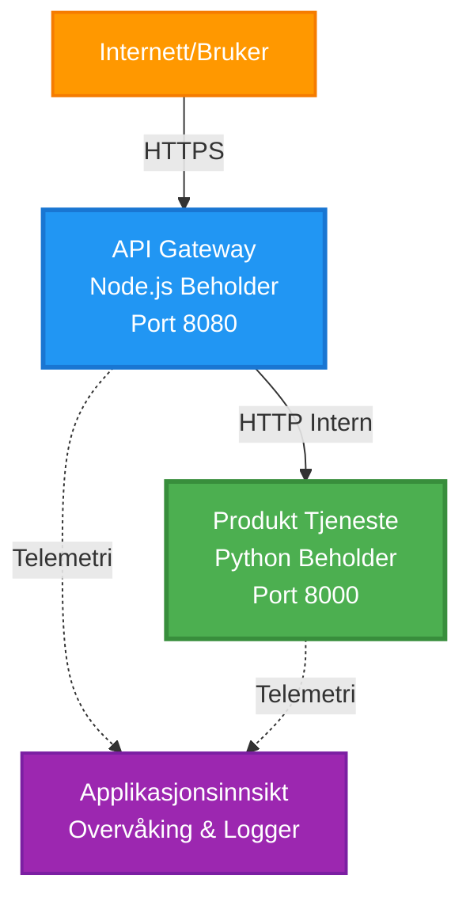
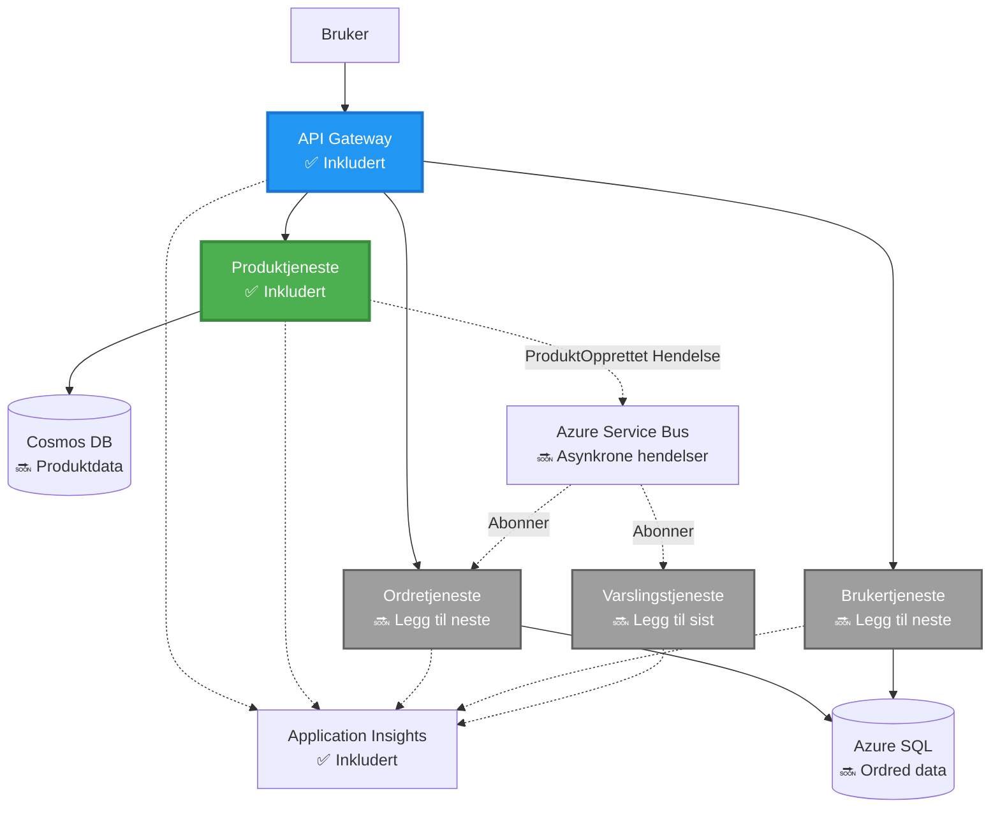
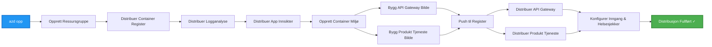
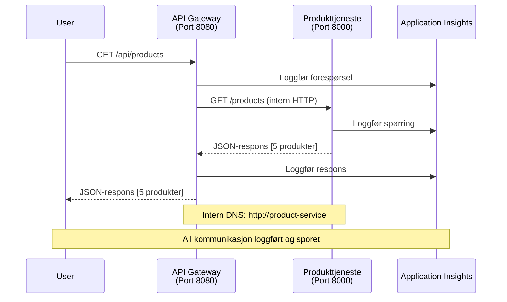

# Microservices Arkitektur - Container App Eksempel

⏱️ **Estimert Tid**: 25-35 minutter | 💰 **Estimert Kostnad**: ~$50-100/måned | ⭐ **Kompleksitet**: Avansert

**📚 Læringssti:**
- ← Forrige: [Simple Flask API](../../../../examples/container-app/simple-flask-api) - Grunnleggende enkelt container
- 🎯 **Du er her**: Microservices Arkitektur (2-tjenesters grunnlag)
- → Neste: [AI Integrasjon](../../../../docs/ai-foundry) - Legg til intelligens i tjenestene dine
- 🏠 [Kurs Hjem](../../README.md)

---

En **forenklet men funksjonell** microservices arkitektur distribuert til Azure Container Apps ved bruk av AZD CLI. Dette eksemplet demonstrerer tjeneste-til-tjeneste kommunikasjon, container orkestrering, og overvåking med et praktisk 2-tjenesters oppsett.

> **📚 Læringsmetode**: Dette eksemplet starter med en minimal 2-tjenesters arkitektur (API Gateway + Backend Tjeneste) som du faktisk kan distribuere og lære fra. Etter å ha mestret dette grunnlaget, gir vi veiledning for å utvide til et fullverdig microservices økosystem.

## Hva Du Vil Lære

Ved å fullføre dette eksemplet vil du:
- Distribuere flere containere til Azure Container Apps
- Implementere tjeneste-til-tjeneste kommunikasjon med intern nettverkskobling
- Konfigurere miljøbasert skalering og helsesjekker
- Overvåke distribuerte applikasjoner med Application Insights
- Forstå microservices distribusjonsmønstre og beste praksis
- Lære progressiv utvidelse fra enkel til kompleks arkitektur

## Arkitektur

### Fase 1: Hva Vi Bygger (Inkludert i Dette Eksemplet)


```mermaid
graph TB
    Internet[Internett/Bruker]
    Gateway[API Gateway<br/>Node.js Beholder<br/>Port 8080]
    Product[Produkt Tjeneste<br/>Python Beholder<br/>Port 8000]
    AppInsights[Applikasjonsinnsikt<br/>Overvåking & Logger]
    
    Internet -->|HTTPS| Gateway
    Gateway -->|HTTP Intern| Product
    Gateway -.->|Telemetri| AppInsights
    Product -.->|Telemetri| AppInsights
    
    style Gateway fill:#2196F3,stroke:#1976D2,stroke-width:3px,color:#fff
    style Product fill:#4CAF50,stroke:#388E3C,stroke-width:3px,color:#fff
    style Internet fill:#FF9800,stroke:#F57C00,stroke-width:2px,color:#fff
    style AppInsights fill:#9C27B0,stroke:#7B1FA2,stroke-width:2px,color:#fff
```
**Komponentdetaljer:**

| Komponent | Formål | Tilgang | Resurser |
|-----------|---------|--------|-----------|
| **API Gateway** | Ruter eksterne forespørsler til backend-tjenester | Offentlig (HTTPS) | 1 vCPU, 2GB RAM, 2-20 replikaer |
| **Product Service** | Administrerer produktkatalog med in-memory data | Kun intern | 0.5 vCPU, 1GB RAM, 1-10 replikaer |
| **Application Insights** | Sentralisert logging og distribuert sporing | Azure Portal | 1-2 GB/måned dataopptak |

**Hvorfor Starte Enkelt?**
- ✅ Distribuer og forstå raskt (25-35 minutter)
- ✅ Lær kjerne microservices mønstre uten kompleksitet
- ✅ Arbeidende kode du kan modifisere og eksperimentere med
- ✅ Lavere læringskostnad (~$50-100/måned vs $300-1400/måned)
- ✅ Bygg selvtillit før du legger til databaser og meldingskøer

**Analogien**: Tenk på dette som å lære å kjøre. Du starter med en tom parkeringsplass (2 tjenester), mestrer det grunnleggende, og går videre til bytrafikk (5+ tjenester med databaser).

### Fase 2: Fremtidig Utvidelse (Referansearkitektur)

Når du mestrer 2-tjenesters arkitekturen, kan du utvide til:


```mermaid
graph TB
    User[Bruker]
    Gateway[API Gateway<br/>✅ Inkludert]
    Product[Produktjeneste<br/>✅ Inkludert]
    Order[Ordretjeneste<br/>🔜 Legg til neste]
    UserSvc[Brukertjeneste<br/>🔜 Legg til neste]
    Notify[Varslingstjeneste<br/>🔜 Legg til sist]
    
    CosmosDB[(Cosmos DB<br/>🔜 Produktdata)]
    AzureSQL[(Azure SQL<br/>🔜 Ordred data)]
    ServiceBus[Azure Service Bus<br/>🔜 Asynkrone hendelser]
    AppInsights[Application Insights<br/>✅ Inkludert]
    
    User --> Gateway
    Gateway --> Product
    Gateway --> Order
    Gateway --> UserSvc
    
    Product --> CosmosDB
    Order --> AzureSQL
    UserSvc --> AzureSQL
    
    Product -.->|ProduktOpprettet Hendelse| ServiceBus
    ServiceBus -.->|Abonner| Notify
    ServiceBus -.->|Abonner| Order
    
    Gateway -.-> AppInsights
    Product -.-> AppInsights
    Order -.-> AppInsights
    UserSvc -.-> AppInsights
    Notify -.-> AppInsights
    
    style Product fill:#4CAF50,stroke:#388E3C,stroke-width:3px,color:#fff
    style Gateway fill:#2196F3,stroke:#1976D2,stroke-width:3px,color:#fff
    style Order fill:#9E9E9E,stroke:#616161,stroke-width:2px,color:#fff
    style UserSvc fill:#9E9E9E,stroke:#616161,stroke-width:2px,color:#fff
    style Notify fill:#9E9E9E,stroke:#616161,stroke-width:2px,color:#fff
```
Se seksjonen "Utvidelsesguide" på slutten for steg-for-steg instruksjoner.

## Inkluderte Funksjoner

✅ **Serviceoppdagelse**: Automatisk DNS-basert oppdagelse mellom containere  
✅ **Lastbalansering**: Innebygd lastbalansering over replikaer  
✅ **Autoskalering**: Uavhengig skalering per tjeneste basert på HTTP-forespørsler  
✅ **Helseovervåking**: Liveness- og readiness-prober for begge tjenester  
✅ **Distribuert Logging**: Sentralisert logging med Application Insights  
✅ **Internt Nettverk**: Sikker tjeneste-til-tjeneste kommunikasjon  
✅ **Container Orkestrering**: Automatisk distribusjon og skalering  
✅ **Oppdateringer Uten Nedetid**: Rullerende oppdateringer med revisjonsstyring  

## Forutsetninger

### Nødvendige Verktøy

Før du starter, kontroller at du har disse verktøyene installert:

1. **[Azure Developer CLI (azd)](https://learn.microsoft.com/azure/developer/azure-developer-cli/install-azd)** (versjon 1.0.0 eller høyere)
   ```bash
   azd version
   # Forventet utdata: azd versjon 1.0.0 eller høyere
   ```

2. **[Azure CLI](https://learn.microsoft.com/cli/azure/install-azure-cli)** (versjon 2.50.0 eller høyere)
   ```bash
   az --version
   # Forventet utdata: azure-cli 2.50.0 eller høyere
   ```

3. **[Docker](https://www.docker.com/get-started)** (for lokal utvikling/testing - valgfritt)
   ```bash
   docker --version
   # Forventet utdata: Docker versjon 20.10 eller høyere
   ```

### Verifiser Oppsettet Ditt

Kjør disse kommandoene for å bekrefte at du er klar:

```bash
# Sjekk Azure Developer CLI
azd version
# ✅ Forventet: azd versjon 1.0.0 eller høyere

# Sjekk Azure CLI
az --version
# ✅ Forventet: azure-cli 2.50.0 eller høyere

# Sjekk Docker (valgfritt)
docker --version
# ✅ Forventet: Docker versjon 20.10 eller høyere
```

**Suksesskriterier**: Alle kommandoer returnerer versjonsnumre som møter eller overstiger minimumskravene.

### Azure Krav

- Et aktivt **Azure abonnement** ([opprett en gratis konto](https://azure.microsoft.com/free/))
- Tillatelser til å opprette ressurser i abonnementet ditt
- **Bidragsyter** rolle på abonnement eller ressursgruppe

### Kunnskapsforutsetninger

Dette er et **avansert nivå** eksempel. Du bør ha:
- Fullført [Simple Flask API eksemplet](../../../../examples/container-app/simple-flask-api) 
- Grunnleggende forståelse av microservices arkitektur
- Kjennskap til REST APIer og HTTP
- Forståelse av container-konsepter

**Ny til Container Apps?** Start med [Simple Flask API eksemplet](../../../../examples/container-app/simple-flask-api) først for å lære det grunnleggende.

## Rask Start (Steg-for-Steg)

### Steg 1: Klon og Naviger

```bash
git clone https://github.com/microsoft/AZD-for-beginners.git
cd AZD-for-beginners/examples/microservices
```

**✓ Suksesssjekk**: Bekreft at du ser `azure.yaml`:
```bash
ls
# Forventet: README.md, azure.yaml, infra/, src/
```

### Steg 2: Autentiser med Azure

```bash
azd auth login
```

Dette åpner nettleseren din for Azure-autentisering. Logg inn med dine Azure-legitimasjoner.

**✓ Suksesssjekk**: Du skal se:
```
Logged in to Azure.
```

### Steg 3: Initialiser Miljøet

```bash
azd init
```

**Spørsmål du vil se**:
- **Miljønavn**: Skriv inn et kort navn (f.eks. `microservices-dev`)
- **Azure abonnement**: Velg ditt abonnement
- **Azure lokasjon**: Velg en region (f.eks. `eastus`, `westeurope`)

**✓ Suksesssjekk**: Du skal se:
```
SUCCESS: New project initialized!
```

### Steg 4: Distribuer Infrastruktur og Tjenester

```bash
azd up
```

**Hva skjer** (tar 8-12 minutter):


```mermaid
graph LR
    A[azd opp] --> B[Opprett Ressursgruppe]
    B --> C[Distribuer Container Register]
    C --> D[Distribuer Logganalyse]
    D --> E[Distribuer App Innsikter]
    E --> F[Opprett Container Miljø]
    F --> G[Bygg API Gateway Bilde]
    F --> H[Bygg Produkt Tjeneste Bilde]
    G --> I[Push til Register]
    H --> I
    I --> J[Distribuer API Gateway]
    I --> K[Distribuer Produkt Tjeneste]
    J --> L[Konfigurer Inngang & Helsesjekker]
    K --> L
    L --> M[Distribusjon Fullført ✓]
    
    style A fill:#2196F3,stroke:#1976D2,stroke-width:3px,color:#fff
    style M fill:#4CAF50,stroke:#388E3C,stroke-width:3px,color:#fff
```
**✓ Suksesssjekk**: Du skal se:
```
SUCCESS: Your application was deployed to Azure in X minutes Y seconds.
Endpoint: https://api-gateway-<unique-id>.azurecontainerapps.io
```

**⏱️ Tid**: 8-12 minutter

### Steg 5: Test Distribusjonen

```bash
# Hent gateway-endepunktet
GATEWAY_URL=$(azd env get-values | grep API_GATEWAY_URL | cut -d '=' -f2 | tr -d '"')

# Test API Gateway-helse
curl $GATEWAY_URL/health
```

**✅ Forventet output:**
```json
{
  "status": "healthy",
  "service": "api-gateway",
  "timestamp": "2025-11-19T10:30:00Z"
}
```

**Test produktservice gjennom gateway**:
```bash
# Liste produkter
curl $GATEWAY_URL/api/products
```

**✅ Forventet output:**
```json
[
  {"id":1,"name":"Laptop","price":999.99,"stock":50},
  {"id":2,"name":"Mouse","price":29.99,"stock":200},
  {"id":3,"name":"Keyboard","price":79.99,"stock":150}
]
```

**✓ Suksesssjekk**: Begge endepunkter returnerer JSON-data uten feil.

---

**🎉 Gratulerer!** Du har distribuert en microservices arkitektur til Azure!

## Prosjektstruktur

Alle implementeringsfiler er inkludert—dette er et komplett, fungerende eksempel:

```
microservices/
│
├── README.md                         # This file
├── azure.yaml                        # AZD configuration
├── .gitignore                        # Git ignore patterns
│
├── infra/                           # Infrastructure as Code (Bicep)
│   ├── main.bicep                   # Main orchestration
│   ├── abbreviations.json           # Naming conventions
│   ├── core/                        # Shared infrastructure
│   │   ├── container-apps-environment.bicep  # Container environment + registry
│   │   └── monitor.bicep            # Application Insights + Log Analytics
│   └── app/                         # Service definitions
│       ├── api-gateway.bicep        # API Gateway container app
│       └── product-service.bicep    # Product Service container app
│
└── src/                             # Application source code
    ├── api-gateway/                 # Node.js API Gateway
    │   ├── app.js                   # Express server with routing
    │   ├── package.json             # Node dependencies
    │   └── Dockerfile               # Container definition
    └── product-service/             # Python Product Service
        ├── main.py                  # Flask API with product data
        ├── requirements.txt         # Python dependencies
        └── Dockerfile               # Container definition
```

**Hva Hver Komponent Gjør:**

**Infrastruktur (infra/)**:
- `main.bicep`: Orkestrerer alle Azure-ressurser og deres avhengigheter
- `core/container-apps-environment.bicep`: Oppretter Container Apps miljø og Azure Container Registry
- `core/monitor.bicep`: Setter opp Application Insights for distribuert logging
- `app/*.bicep`: Individuelle container app definisjoner med skalering og helsesjekker

**API Gateway (src/api-gateway/)**:
- Offentlig tjeneste som ruter forespørsler til backend-tjenester
- Implementerer logging, feilbehandling, og request forwarding
- Demonstrerer tjeneste-til-tjeneste HTTP-kommunikasjon

**Product Service (src/product-service/)**:
- Intern tjeneste med produktkatalog (in-memory for enkelhet)
- REST API med helsesjekker
- Eksempel på backend microservices mønster

## Tjenesteoversikt

### API Gateway (Node.js/Express)

**Port**: 8080  
**Tilgang**: Offentlig (ekstern ingress)  
**Formål**: Ruter innkommende forespørsler til riktige backend-tjenester  

**Endepunkter**:
- `GET /` - Tjenesteinformasjon
- `GET /health` - Helsekontroll endepunkt
- `GET /api/products` - Viderekobler til produktservice (liste alle)
- `GET /api/products/:id` - Viderekobler til produktservice (hent etter ID)

**Nøkkelfunksjoner**:
- Forespørselsruting med axios
- Sentralisert logging
- Feilhåndtering og timeout-styring
- Serviceoppdagelse via miljøvariabler
- Application Insights integrasjon

**Kodeeksempel** (`src/api-gateway/app.js`):
```javascript
// Intern tjenestekommunikasjon
app.get('/api/products', async (req, res) => {
  const response = await axios.get(`${PRODUCT_SERVICE_URL}/products`, {
    timeout: 5000
  });
  res.json(response.data);
});
```

### Product Service (Python/Flask)

**Port**: 8000  
**Tilgang**: Kun intern (ingen ekstern ingress)  
**Formål**: Administrerer produktkatalog med in-memory data  

**Endepunkter**:
- `GET /` - Tjenesteinformasjon
- `GET /health` - Helsekontroll endepunkt
- `GET /products` - Liste alle produkter
- `GET /products/<id>` - Hent produkt etter ID

**Nøkkelfunksjoner**:
- RESTful API med Flask
- In-memory produktlager (enkelt, uten behov for database)
- Helseovervåking med prober
- Strukturert logging
- Application Insights integrasjon

**Datamodell**:
```python
{
  "id": 1,
  "name": "Laptop",
  "description": "High-performance laptop",
  "price": 999.99,
  "stock": 50
}
```

**Hvorfor Kun Intern?**
Produktservicen eksponeres ikke offentlig. Alle forespørsler må gå gjennom API Gateway, som gir:
- Sikkerhet: Kontrollert tilgangspunkt
- Fleksibilitet: Kan endre backend uten å påvirke klienter
- Overvåking: Sentralisert forespørselslogging

## Forstå Kommunikasjon Mellom Tjenester

### Hvordan Tjenester Snakker Med Hverandre


```mermaid
sequenceDiagram
    participant User
    participant Gateway as API Gateway<br/>(Port 8080)
    participant Product as Produkttjeneste<br/>(Port 8000)
    participant AI as Application Insights
    
    User->>Gateway: GET /api/products
    Gateway->>AI: Loggfør forespørsel
    Gateway->>Product: GET /products (intern HTTP)
    Product->>AI: Loggfør spørring
    Product-->>Gateway: JSON-respons [5 produkter]
    Gateway->>AI: Loggfør respons
    Gateway-->>User: JSON-respons [5 produkter]
    
    Note over Gateway,Product: Intern DNS: http://product-service
    Note over User,AI: All kommunikasjon loggført og sporet
```
I dette eksemplet kommuniserer API Gateway med Product Service via **interne HTTP-kall**:

```javascript
// API Gateway (src/api-gateway/app.js)
const PRODUCT_SERVICE_URL = process.env.PRODUCT_SERVICE_URL;

// Utfør intern HTTP-forespørsel
const response = await axios.get(`${PRODUCT_SERVICE_URL}/products`);
```

**Viktige Punkter**:

1. **DNS-basert Oppdagelse**: Container Apps gir automatisk DNS for interne tjenester
   - Product Service FQDN: `product-service.internal.<environment>.azurecontainerapps.io`
   - Forenklet til: `http://product-service` (Container Apps løser dette)

2. **Ingen Offentlig Eksponering**: Product Service har `external: false` i Bicep
   - Kun tilgjengelig innen Container Apps miljøet
   - Kan ikke nås fra internett

3. **Miljøvariabler**: Tjeneste-URLer injiseres ved distribusjon
   - Bicep sender intern FQDN til gateway
   - Ingen hardkodede URLer i applikasjonskode

**Analogien**: Tenk på dette som kontorrom. API Gateway er resepsjonen (offentlig), og Product Service er et kontor (kun internt). Besøkende må gjennom resepsjonen for å nå kontoret.

## Distribusjonsmuligheter

### Full Distribusjon (Anbefalt)

```bash
# Distribuer infrastruktur og begge tjenester
azd up
```

Dette distribuerer:
1. Container Apps miljø
2. Application Insights
3. Container Registry
4. API Gateway container
5. Product Service container

**Tid**: 8-12 minutter

### Distribuer Enkelttjeneste

```bash
# Distribuer kun én tjeneste (etter første azd opp)
azd deploy api-gateway

# Eller distribuer produkttjenesten
azd deploy product-service
```

**Brukstilfelle**: Når du har oppdatert kode i én tjeneste og ønsker å redeploye bare den tjenesten.

### Oppdater Konfigurasjon

```bash
# Endre skaleringsparametere
azd env set GATEWAY_MAX_REPLICAS 30

# Distribuer på nytt med ny konfigurasjon
azd up
```

## Konfigurasjon

### Skalering Konfigurasjon

Begge tjenester er konfigurert med HTTP-basert autoskalering i sine Bicep-filer:

**API Gateway**:
- Min replikaer: 2 (alltid minst 2 for tilgjengelighet)
- Maks replikaer: 20
- Skaleringsutløser: 50 samtidige forespørsler per replika

**Product Service**:
- Min replikaer: 1 (kan skaleres til null om nødvendig)
- Maks replikaer: 10
- Skaleringsutløser: 100 samtidige forespørsler per replika

**Tilpass Skalering** (i `infra/app/*.bicep`):
```bicep
scale: {
  minReplicas: 1
  maxReplicas: 10
  rules: [
    {
      name: 'http-scale-rule'
      http: {
        metadata: {
          concurrentRequests: '100'  // Adjust this
        }
      }
    }
  ]
}
```

### Ressursallokering

**API Gateway**:
- CPU: 1.0 vCPU
- Minne: 2 GiB
- Begrunnelse: Håndterer all ekstern trafikk

**Product Service**:
- CPU: 0.5 vCPU
- Minne: 1 GiB
- Begrunnelse: Lettvekts in-memory operasjoner

### Helsesjekker

Begge tjenester inkluderer liveness og readiness prober:

```bicep
probes: [
  {
    type: 'Liveness'
    httpGet: {
      path: '/health'
      port: 8080
    }
    initialDelaySeconds: 10
    periodSeconds: 30
  }
  {
    type: 'Readiness'
    httpGet: {
      path: '/health'
      port: 8080
    }
    initialDelaySeconds: 5
    periodSeconds: 10
  }
]
```

**Hva Dette Betyr**:
- **Liveness**: Hvis helsesjekk feiler, restartes containeren av Container Apps
- **Readiness**: Hvis ikke klar, stopper Container Apps å rute trafikk til replikaen

## Overvåking & Observabilitet

### Se Tjenestelogger

```bash
# Se logger ved å bruke azd monitor
azd monitor --logs

# Eller bruk Azure CLI for spesifikke Container Apps:
# Strøm logger fra API Gateway
az containerapp logs show --name api-gateway --resource-group $RG_NAME --follow

# Se nylige logger for produktservice
az containerapp logs show --name product-service --resource-group $RG_NAME --tail 100
```

**Forventet Output**:
```
[api-gateway] API Gateway listening on port 8080
[api-gateway] Product Service URL: http://product-service
[api-gateway] GET /api/products 200 - 45ms
[product-service] Retrieved 5 products
```

### Application Insights Spørringer

Åpne Application Insights i Azure Portal, og kjør disse spørringene:

**Finn Treg Forespørsler**:
```kusto
requests
| where timestamp > ago(1h)
| where duration > 1000  // Requests taking >1 second
| summarize count() by name, cloud_RoleName
| order by count_ desc
```

**Spor Tjeneste-til-Tjeneste Anrop**:
```kusto
dependencies
| where timestamp > ago(1h)
| where type == "Http"
| project timestamp, name, target, duration, success
| order by timestamp desc
```

**Feilrate per Tjeneste**:
```kusto
exceptions
| where timestamp > ago(24h)
| summarize errorCount = count() by cloud_RoleName, type
| order by errorCount desc
```

**Forespørselsvolum Over Tid**:
```kusto
requests
| where timestamp > ago(1h)
| summarize requestCount = count() by bin(timestamp, 5m), cloud_RoleName
| render timechart
```

### Tilgang Overvåkingsdashboard

```bash
# Hent detaljer for Application Insights
azd env get-values | grep APPLICATIONINSIGHTS

# Åpne Azure Portal overvåking
az monitor app-insights component show \
  --app $(azd env get-values | grep APPLICATIONINSIGHTS_CONNECTION_STRING | cut -d '=' -f2) \
  --resource-group $(azd env get-values | grep AZURE_RESOURCE_GROUP | cut -d '=' -f2) \
  --query "appId" -o tsv
```

### Live Metrics

1. Naviger til Application Insights i Azure Portal  
2. Klikk "Live Metrics"  
3. Se sanntidsforespørsler, feil og ytelse  
4. Test ved å kjøre: `curl $(azd env get-values | grep API_GATEWAY_URL | cut -d '=' -f2 | tr -d '"')/api/products`

## Praktiske Øvelser

### Øvelse 1: Legg til nytt produktendepunkt ⭐ (Enkel)

**Mål**: Legg til et POST-endepunkt for å opprette nye produkter

**Startpunkt**: `src/product-service/main.py`

**Steg**:

1. Legg til dette endepunktet etter funksjonen `get_product` i `main.py`:

```python
@app.route('/products', methods=['POST'])
def create_product():
    """Create a new product"""
    data = request.get_json()
    
    # Valider påkrevde felt
    if not data or 'name' not in data or 'price' not in data:
        return jsonify({'error': 'Missing required fields: name, price'}), 400
    
    new_id = max(p['id'] for p in products) + 1
    new_product = {
        'id': new_id,
        'name': data['name'],
        'description': data.get('description', ''),
        'price': float(data['price']),
        'stock': int(data.get('stock', 0))
    }
    products.append(new_product)
    logger.info(f"Created product {new_id}")
    return jsonify(new_product), 201
```

2. Legg til POST-rute i API Gateway (`src/api-gateway/app.js`):

```javascript
// Legg dette til etter GET /api/products-ruten
app.post('/api/products', async (req, res) => {
  try {
    console.log(`Forwarding POST request to ${PRODUCT_SERVICE_URL}/products`);
    const response = await axios.post(`${PRODUCT_SERVICE_URL}/products`, req.body, {
      timeout: 5000
    });
    res.status(201).json(response.data);
  } catch (error) {
    console.error('Error calling product service:', error.message);
    res.status(503).json({
      error: 'Product service unavailable',
      message: error.message
    });
  }
});
```

3. Distribuer begge tjenester på nytt:

```bash
azd deploy product-service
azd deploy api-gateway
```

4. Test den nye endepunktet:

```bash
GATEWAY_URL=$(azd env get-values | grep API_GATEWAY_URL | cut -d '=' -f2 | tr -d '"')

# Opprett et nytt produkt
curl -X POST $GATEWAY_URL/api/products \
  -H "Content-Type: application/json" \
  -d '{"name":"USB Cable","price":9.99,"stock":500}'
```

**✅ Forventet utdata:**
```json
{"id":6,"name":"USB Cable","description":"","price":9.99,"stock":500}
```

5. Verifiser at den vises i listen:

```bash
curl $GATEWAY_URL/api/products
# Skal nå vise 6 produkter inkludert den nye USB-kabelen
```

**Kriterier for suksess**:
- ✅ POST-forespørsel returnerer HTTP 201
- ✅ Nytt produkt vises i GET /api/products liste
- ✅ Produktet har auto-inkrementert ID

**Tid**: 10-15 minutter

---

### Øvelse 2: Endre Autoskaleringregler ⭐⭐ (Medium)

**Mål**: Endre Product Service for å skalere mer aggressivt

**Utgangspunkt**: `infra/app/product-service.bicep`

**Steg**:

1. Åpne `infra/app/product-service.bicep` og finn `scale`-blokken (omtrent linje 95)

2. Endre fra:
```bicep
scale: {
  minReplicas: 1
  maxReplicas: 10
  rules: [
    {
      name: 'http-scale-rule'
      http: {
        metadata: {
          concurrentRequests: '100'  // OLD
        }
      }
    }
  ]
}
```

Til:
```bicep
scale: {
  minReplicas: 2  // Always have 2 running
  maxReplicas: 20  // Allow more scaling
  rules: [
    {
      name: 'http-scale-rule'
      http: {
        metadata: {
          concurrentRequests: '20'  // Scale at lower threshold
        }
      }
    }
  ]
}
```

3. Distribuer infrastrukturen på nytt:

```bash
azd up
```

4. Verifiser ny skaleringskonfigurasjon:

```bash
az containerapp show \
  --name $(azd env get-values | grep PRODUCT_SERVICE | head -1 | cut -d '/' -f5) \
  --resource-group $(azd env get-values | grep AZURE_RESOURCE_GROUP | cut -d '=' -f2 | tr -d '"') \
  --query "properties.template.scale" -o json
```

**✅ Forventet utdata:**
```json
{
  "minReplicas": 2,
  "maxReplicas": 20,
  "rules": [...]
}
```

5. Test autoskalering med belastning:

```bash
# Generer samtidige forespørsler
for i in {1..500}; do curl $GATEWAY_URL/api/products & done

# Se skaleringsprosess ved bruk av Azure CLI
az containerapp logs show --name product-service --resource-group $RG_NAME --follow
# Se etter: Skaleringshendelser for Container Apps
```

**Kriterier for suksess**:
- ✅ Product Service kjører alltid minst 2 replikaer
- ✅ Skalerer til mer enn 2 replikaer under belastning
- ✅ Azure Portal viser nye skaleringsregler

**Tid**: 15-20 minutter

---

### Øvelse 3: Legg til Tilpasset Overvåkingsspørring ⭐⭐ (Medium)

**Mål**: Opprette en tilpasset Application Insights-spørring for å spore produkt-API-ytelse

**Steg**:

1. Gå til Application Insights i Azure Portal:
   - Gå til Azure Portal
   - Finn ressursgruppen din (rg-microservices-*)
   - Klikk på Application Insights-ressursen

2. Klikk "Logs" i venstremenyen

3. Lag denne spørringen:

```kusto
requests
| where timestamp > ago(1h)
| where name contains "products"
| summarize 
    RequestCount = count(),
    AvgDuration = avg(duration),
    P95Duration = percentile(duration, 95),
    SuccessRate = 100.0 * countif(success == true) / count()
  by bin(timestamp, 5m)
| render timechart
```

4. Klikk "Run" for å kjøre spørringen

5. Lagre spørringen:
   - Klikk "Save"
   - Navn: "Product API Performance"
   - Kategori: "Performance"

6. Generer testtrafikk:

```bash
for i in {1..100}; do curl $GATEWAY_URL/api/products; sleep 1; done
```

7. Oppdater spørringen for å se data

**✅ Forventet utdata:**
- Diagram som viser antall forespørsler over tid
- Gjennomsnittlig varighet < 500ms
- Suksessrate = 100%
- Tidsintervaller på 5 minutter

**Kriterier for suksess**:
- ✅ Spørringen viser 100+ forespørsler
- ✅ Suksessraten er 100%
- ✅ Gjennomsnittlig varighet < 500ms
- ✅ Diagrammet viser 5-minutters tidsintervaller

**Læringsutbytte**: Forstå hvordan man overvåker tjenesteytelse med tilpassede spørringer

**Tid**: 10-15 minutter

---

### Øvelse 4: Implementer Retri-logikk ⭐⭐⭐ (Avansert)

**Mål**: Legg til retri-logikk i API Gateway når Product Service midlertidig er utilgjengelig

**Utgangspunkt**: `src/api-gateway/app.js`

**Steg**:

1. Installer retry-bibliotek:

```bash
cd src/api-gateway
npm install axios-retry --save
cd ../..
```

2. Oppdater `src/api-gateway/app.js` (legg til etter axios-importen):

```javascript
const axiosRetry = require('axios-retry');

// Konfigurer gjenforsøklogikk
axiosRetry(axios, {
  retries: 3,
  retryDelay: (retryCount) => {
    return retryCount * 1000; // 1s, 2s, 3s
  },
  retryCondition: (error) => {
    // Gjenforsøk ved nettverksfeil eller 5xx-responser
    return axiosRetry.isNetworkOrIdempotentRequestError(error) ||
           (error.response && error.response.status >= 500);
  }
});

console.log('Retry logic configured: 3 retries with exponential backoff');
```

3. Distribuer API Gateway på nytt:

```bash
azd deploy api-gateway
```

4. Test retry-atferd ved å simulere tjenestefeil:

```bash
# Skaler produktjenesten til 0 (simuler feil)
az containerapp update \
  --name $(azd env get-values | grep PRODUCT_SERVICE | head -1 | cut -d '/' -f5) \
  --resource-group $(azd env get-values | grep AZURE_RESOURCE_GROUP | cut -d '=' -f2 | tr -d '"') \
  --min-replicas 0 \
  --max-replicas 0

# Forsøk å få tilgang til produkter (prøver 3 ganger)
time curl -v $GATEWAY_URL/api/products
# Observer: Svar tar ~6 sekunder (1s + 2s + 3s forsøk)

# Gjenopprett produktjenesten
az containerapp update \
  --name $(azd env get-values | grep PRODUCT_SERVICE | head -1 | cut -d '/' -f5) \
  --resource-group $(azd env get-values | grep AZURE_RESOURCE_GROUP | cut -d '=' -f2 | tr -d '"') \
  --min-replicas 1 \
  --max-replicas 10
```

5. Se retry-logger:

```bash
az containerapp logs show --name api-gateway --resource-group $RG_NAME --tail 50
# Se etter: Meldinger om nye forsøk på gjentakelse
```

**✅ Forventet atferd:**
- Forespørsler retrieres 3 ganger før de feiler
- Hver retry venter lengre (1s, 2s, 3s)
- Vellykede forespørsler etter at tjenesten starter på nytt
- Logger viser retry-forsøk

**Kriterier for suksess**:
- ✅ Forespørsler retrieres 3 ganger før de feiler
- ✅ Hver retry venter lengre (eksponentiell backoff)
- ✅ Vellykede forespørsler etter at tjenesten starter på nytt
- ✅ Logger viser retry-forsøk

**Læringsutbytte**: Forstå robusthetsmønstre i mikrotjenester (kretsbrytere, retries, timeouts)

**Tid**: 20-25 minutter

---

## Kunnskapssjekkpunkt

Etter å ha fullført dette eksemplet, verifiser din forståelse:

### 1. Tjenestekommunikasjon ✓

Test din kunnskap:
- [ ] Kan du forklare hvordan API Gateway oppdager Product Service? (DNS-basert tjenesteoppdagelse)
- [ ] Hva skjer hvis Product Service er nede? (Gateway returnerer 503-feil)
- [ ] Hvordan legger du til en tredje tjeneste? (Lag ny Bicep-fil, legg til main.bicep, lag src-mappe)

**Praktisk verifisering:**
```bash
# Simuler tjenestefeil
az containerapp update --name <product-service-name> --min-replicas 0 --max-replicas 0
curl $GATEWAY_URL/api/products
# ✅ Forventet: 503 Service Utilgjengelig

# Gjenopprett tjenesten
az containerapp update --name <product-service-name> --min-replicas 1 --max-replicas 10
```

### 2. Overvåking & Observabilitet ✓

Test din kunnskap:
- [ ] Hvor ser du distribuerte logger? (Application Insights i Azure Portal)
- [ ] Hvordan sporer du trege forespørsler? (Kusto-spørring: `requests | where duration > 1000`)
- [ ] Kan du identifisere hvilken tjeneste som forårsaket en feil? (Sjekk `cloud_RoleName`-feltet i logger)

**Praktisk verifisering:**
```bash
# Generer en simulering av en treg forespørsel
curl "$GATEWAY_URL/api/products?delay=2000"

# Spørr Application Insights etter trege forespørsler
# Naviger til Azure Portal → Application Insights → Logger
# Kjør: requests | where duration > 1000 | project timestamp, name, duration, cloud_RoleName
```

### 3. Skalering & Ytelse ✓

Test din kunnskap:
- [ ] Hva utløser autoskalering? (HTTP samtidig-forespørselsregler: 50 for gateway, 100 for product)
- [ ] Hvor mange replikaer kjører nå? (Sjekk med `az containerapp revision list`)
- [ ] Hvordan skalerer du Product Service til 5 replikaer? (Oppdater minReplicas i Bicep)

**Praktisk verifisering:**
```bash
# Generer belastning for å teste autoskalering
for i in {1..1000}; do curl $GATEWAY_URL/api/products & done

# Se at replikaer øker ved å bruke Azure CLI
az containerapp logs show --name api-gateway --resource-group $RG_NAME --follow
# ✅ Forventet: Se skaleringshendelser i logger
```

**Kriterier for suksess**: Du kan svare på alle spørsmål og verifisere med praktiske kommandoer.

---

## Kostnadsanalyse

### Estimerte månedlige kostnader (for dette 2-tjeneste-eksemplet)

| Ressurs | Konfigurasjon | Estimert kostnad |
|----------|--------------|----------------|
| API Gateway | 2-20 replikaer, 1 vCPU, 2GB RAM | $30-150 |
| Product Service | 1-10 replikaer, 0.5 vCPU, 1GB RAM | $15-75 |
| Container Registry | Basisnivå | $5 |
| Application Insights | 1-2 GB/måned | $5-10 |
| Log Analytics | 1 GB/måned | $3 |
| **Totalt** | | **$58-243/måned** |

### Kostnadsfordeling etter bruk

**Lett trafikk** (testing/læring): ~$60/måned
- API Gateway: 2 replikaer × 24/7 = $30
- Product Service: 1 replika × 24/7 = $15
- Overvåking + Registry = $13

**Moderat trafikk** (liten produksjon): ~$120/måned
- API Gateway: 5 gj.sn. replikaer = $75
- Product Service: 3 gj.sn. replikaer = $45
- Overvåking + Registry = $13

**Høy trafikk** (travle perioder): ~$240/måned
- API Gateway: 15 gj.sn. replikaer = $225
- Product Service: 8 gj.sn. replikaer = $120
- Overvåking + Registry = $13

### Tips for kostnadsoptimalisering

1. **Skaler til null under utvikling**:
   ```bicep
   scale: {
     minReplicas: 0  // Save $30-40/month when not in use
     maxReplicas: 10
   }
   ```

2. **Bruk Consumption Plan for Cosmos DB** (når du legger til denne):
   - Betal kun for det du bruker
   - Ingen minimumsavgift

3. **Sett Application Insights Sampling**:
   ```javascript
   appInsights.defaultClient.config.samplingPercentage = 50; // Prøve 50 % av forespørsler
   ```

4. **Rydd opp når ikke i bruk**:
   ```bash
   azd down --force --purge
   ```

### Gratisnivåalternativer

For læring/testing, vurder:
- ✅ Bruk Azure gratis kreditter ($200 de første 30 dagene med nye kontoer)
- ✅ Hold deg til minimum replikaer (spar ~50% kostnader)
- ✅ Slett etter testing (ingen løpende kostnader)
- ✅ Skaler til null mellom læringsøkter

**Eksempel**: Kjøre dette eksemplet 2 timer per dag × 30 dager = ~$5/måned i stedet for $60/måned

---

## Rask feilsøking

### Problem: `azd up` feiler med "Subscription not found"

**Løsning**:
```bash
# Logg inn igjen med eksplisitt abonnement
az account set --subscription <your-subscription-id>
azd env set AZURE_SUBSCRIPTION_ID <your-subscription-id>
azd up
```

### Problem: API Gateway gir 503 "Product service unavailable"

**Diagnose**:
```bash
# Sjekk produktets tjenestelogger ved hjelp av Azure CLI
az containerapp logs show --name product-service --resource-group $RG_NAME --tail 50

# Sjekk produktets tjenestehelse
az containerapp show \
  --name $(azd env get-values | grep PRODUCT_SERVICE | head -1 | cut -d '/' -f5) \
  --resource-group $(azd env get-values | grep AZURE_RESOURCE_GROUP | cut -d '=' -f2 | tr -d '"') \
  --query "properties.runningStatus"
```

**Vanlige årsaker**:
1. Product service startet ikke (sjekk logger for Python-feil)
2. Helsekontroll feiler (sjekk at `/health` endepunkt fungerer)
3. Containerbildet bygget ikke (sjekk registry for bilde)

### Problem: Autoskalering fungerer ikke

**Diagnose**:
```bash
# Sjekk gjeldende antall replikaer
az containerapp revision list \
  --name $(azd env get-values | grep API_GATEWAY | head -1 | cut -d '/' -f5) \
  --resource-group $(azd env get-values | grep AZURE_RESOURCE_GROUP | cut -d '=' -f2 | tr -d '"') \
  --query "[].properties.replicas"

# Generer belastning for testing
for i in {1..1000}; do curl $GATEWAY_URL/api/products & done

# Følg skaleringshendelser ved bruk av Azure CLI
az containerapp logs show --name api-gateway --resource-group $RG_NAME --follow | grep -i scale
```

**Vanlige årsaker**:
1. Belastning ikke høy nok til å utløse skaleringsregel (krever >50 samtidige forespørsler)
2. Maks replikaer nådd (sjekk Bicep-konfigurasjon)
3. Skaleringsregel feilkonfigurert i Bicep (verifiser concurrentRequests-verdi)

### Problem: Application Insights viser ikke logger

**Diagnose**:
```bash
# Sjekk at tilkoblingsstrengen er satt
azd env get-values | grep APPLICATIONINSIGHTS

# Sjekk om tjenester sender telemetri
az monitor app-insights component show \
  --app $(azd env get-values | grep APPLICATIONINSIGHTS_NAME | cut -d '=' -f2 | tr -d '"') \
  --resource-group $(azd env get-values | grep AZURE_RESOURCE_GROUP | cut -d '=' -f2 | tr -d '"') \
  --query "properties.InstrumentationKey"
```

**Vanlige årsaker**:
1. Connection string ikke sendt til container (sjekk miljøvariabler)
2. Application Insights SDK ikke konfigurert (sjekk import i kode)
3. Brannmur blokkerer telemetri (sjelden, sjekk nettverksregler)

### Problem: Docker build feiler lokalt

**Diagnose**:
```bash
# Test API Gateway bygg
cd src/api-gateway
docker build -t test-gateway .

# Test Produkt Service bygg
cd ../product-service
docker build -t test-product .
```

**Vanlige årsaker**:
1. Manglende avhengigheter i package.json/requirements.txt
2. Feil i Dockerfile-syntaks
3. Nettverksproblemer ved nedlasting av avhengigheter

**Fortsatt fast?** Se [Vanlige problemer-guide](../../docs/chapter-07-troubleshooting/common-issues.md) eller [Azure Container Apps feilsøking](https://learn.microsoft.com/azure/container-apps/troubleshooting)

---

## Rydding

For å unngå løpende kostnader, slett alle ressurser:

```bash
azd down --force --purge
```

**Bekreftelsesforespørsel**:
```
? Total resources to delete: 6, are you sure you want to continue? (y/N)
```

Skriv `y` for å bekrefte.

**Hva slettes**:
- Container Apps Environment
- Begge Container Apps (gateway og product service)
- Container Registry
- Application Insights
- Log Analytics Workspace
- Ressursgruppe

**✓ Verifiser rydding**:
```bash
az group list --query "[?starts_with(name,'rg-microservices')]" --output table
```

Bør returnere tomt.

---

## Utvidelsesguide: Fra 2 til 5+ tjenester

Når du har mestret denne 2-tjenestearkitekturen, slik utvider du:

### Fase 1: Legg til databasepersistens (neste steg)

**Legg til Cosmos DB for Product Service**:

1. Lag `infra/core/cosmos.bicep`:
   ```bicep
   resource cosmosAccount 'Microsoft.DocumentDB/databaseAccounts@2023-04-15' = {
     name: name
     location: location
     kind: 'GlobalDocumentDB'
     properties: {
       databaseAccountOfferType: 'Standard'
       consistencyPolicy: { defaultConsistencyLevel: 'Session' }
       locations: [{ locationName: location, failoverPriority: 0 }]
     }
   }
   ```

2. Oppdater product service til å bruke Azure Cosmos DB Python SDK i stedet for minnebase

3. Beregnet tilleggskostnad: ~$25/måned (serverløs)

### Fase 2: Legg til tredje tjeneste (Order Management)

**Lag Order Service**:

1. Ny mappe: `src/order-service/` (Python/Node.js/C#)
2. Ny Bicep: `infra/app/order-service.bicep`
3. Oppdater API Gateway for å rute `/api/orders`
4. Legg til Azure SQL Database for ordre-persistens

**Arkitekturen blir**:
```
API Gateway → Product Service (Cosmos DB)
           → Order Service (Azure SQL)
```

### Fase 3: Legg til asynkron kommunikasjon (Service Bus)

**Implementer event-drevet arkitektur**:

1. Legg til Azure Service Bus: `infra/core/servicebus.bicep`
2. Product Service publiserer "ProductCreated"-hendelser
3. Order Service abonnerer på produktehendelser
4. Legg til Notification Service for å prosessere hendelser

**Mønster**: Forespørsel/Svar (HTTP) + Event-drevet (Service Bus)

### Fase 4: Legg til brukerautentisering

**Implementer User Service**:

1. Lag `src/user-service/` (Go/Node.js)
2. Legg til Azure AD B2C eller egendefinert JWT-autentisering
3. API Gateway validerer tokens før ruting
4. Tjenester sjekker brukertillatelser

### Fase 5: Produksjonsklarhet

**Legg til disse komponentene**:
- ✅ Azure Front Door (global lastbalansering)
- ✅ Azure Key Vault (hemmelighetshåndtering)
- ✅ Azure Monitor Workbooks (tilpassede dashboard)
- ✅ CI/CD Pipeline (GitHub Actions)
- ✅ Blue-Green Deployments
- ✅ Administrert identitet for alle tjenester

**Full produksjonsarkitektur kostnad**: ~$300-1,400/måned

---

## Lær mer

### Relatert dokumentasjon
- [Azure Container Apps Dokumentasjon](https://learn.microsoft.com/azure/container-apps/)
- [Mikrotjenestearkitektur Guide](https://learn.microsoft.com/azure/architecture/guide/architecture-styles/microservices)
- [Application Insights for distribuert sporing](https://learn.microsoft.com/azure/azure-monitor/app/distributed-tracing)
- [Azure Developer CLI Dokumentasjon](https://learn.microsoft.com/azure/developer/azure-developer-cli/)

### Neste steg i dette kurset
- ← Forrige: [Simple Flask API](../../../../examples/container-app/simple-flask-api) - Nybegynner enkelt-container eksempel
- → Neste: [AI Integrasjonsguide](../../../../docs/ai-foundry) - Legg til AI-funksjoner
- 🏠 [Kursstartside](../../README.md)

### Sammenligning: Når bruke hva

| Funksjon | Enkel beholder | Mikrotjenester (dette) | Kubernetes (AKS) |
|---------|-----------------|---------------------|------------------|
| **Brukstilfelle** | Enkle apper | Komplekse apper | Enterprise apper |
| **Skalerbarhet** | Én tjeneste | Per-tjeneste skalering | Maksimal fleksibilitet |
| **Kompleksitet** | Lav | Medium | Høy |
| **Teamstørrelse** | 1-3 utviklere | 3-10 utviklere | 10+ utviklere |
| **Kostnad** | ~$15-50/måned | ~$60-250/måned | ~$150-500/måned |
| **Distribusjonstid** | 5-10 minutter | 8-12 minutter | 15-30 minutter |
| **Best For** | MVP-er, prototyper | Produksjonsapper | Multi-cloud, avansert nettverkskonfigurasjon |

**Anbefaling**: Start med Container Apps (dette eksempelet), gå videre til AKS bare hvis du trenger Kubernetes-spesifikke funksjoner.

---

## Ofte stilte spørsmål

**Q: Hvorfor bare 2 tjenester istedenfor 5+?**  
A: Pedagogisk fremgang. Mestre det grunnleggende (tjenestekommunikasjon, overvåking, skalering) med et enkelt eksempel før du legger til kompleksitet. Mønstrene du lærer her gjelder for arkitekturer med 100 tjenester.

**Q: Kan jeg legge til flere tjenester selv?**  
A: Absolutt! Følg utvidelsesveiledningen ovenfor. Hver ny tjeneste følger samme mønster: opprett src-mappe, opprett Bicep-fil, oppdater azure.yaml, distribuer.

**Q: Er dette produksjonsklart?**  
A: Det er et solid grunnlag. For produksjon må du legge til: administrert identitet, Key Vault, persistente databaser, CI/CD-pipeline, overvåkingsvarsler og en sikkerhetskopieringsstrategi.

**Q: Hvorfor ikke bruke Dapr eller annen service mesh?**  
A: Hold det enkelt for læring. Når du forstår native Container Apps-nettverk, kan du legge på Dapr for avanserte scenarioer (tilstandshåndtering, pub/sub, bindings).

**Q: Hvordan feilsøker jeg lokalt?**  
A: Kjør tjenester lokalt med Docker:
```bash
cd src/api-gateway
docker build -t local-gateway .
docker run -p 8080:8080 -e PRODUCT_SERVICE_URL=http://localhost:8000 local-gateway
```

**Q: Kan jeg bruke forskjellige programmeringsspråk?**  
A: Ja! Dette eksempelet viser Node.js (gateway) + Python (produkt-tjeneste). Du kan blande alle språk som kjører i containere: C#, Go, Java, Ruby, PHP, osv.

**Q: Hva om jeg ikke har Azure-kreditter?**  
A: Bruk Azure gratisnivå (de første 30 dagene med nye kontoer får du $200 kreditter) eller distribuer for korte testperioder og slett umiddelbart. Dette eksempelet koster ca. $2/dag.

**Q: Hvordan skiller dette seg fra Azure Kubernetes Service (AKS)?**  
A: Container Apps er enklere (ingen Kubernetes-kunnskap nødvendig) men mindre fleksibelt. AKS gir full Kubernetes-kontroll men krever mer ekspertise. Start med Container Apps, gå videre til AKS om nødvendig.

**Q: Kan jeg bruke dette med eksisterende Azure-tjenester?**  
A: Ja! Du kan koble til eksisterende databaser, lagringskontoer, Service Bus, osv. Oppdater Bicep-filene for å referere eksisterende ressurser i stedet for å opprette nye.

---

> **🎓 Sammendrag av læringsløp**: Du har lært å distribuere en arkitektur med flere tjenester med automatisk skalering, intern nettverkskommunikasjon, sentralisert overvåking og produksjonsklare mønstre. Dette grunnlaget forbereder deg for komplekse distribuerte systemer og bedriftsmikrotjenestearkitekturer.

**📚 Kursnavigasjon:**
- ← Forrige: [Simple Flask API](../../../../examples/container-app/simple-flask-api)
- → Neste: [Database Integration Example](../../../../database-app)
- 🏠 [Kursoversikt](../../README.md)
- 📖 [Container Apps beste praksis](../../docs/chapter-04-infrastructure/deployment-guide.md)

---

**✨ Gratulerer!** Du har fullført mikrotjeneste-eksempelet. Du forstår nå hvordan du bygger, distribuerer og overvåker distribuerte applikasjoner på Azure Container Apps. Klar for å legge til AI-funksjonalitet? Sjekk ut [AI Integration Guide](../../../../docs/ai-foundry)!

---

<!-- CO-OP TRANSLATOR DISCLAIMER START -->
**Ansvarsfraskrivelse**:
Dette dokumentet er oversatt ved hjelp av AI-oversettelsestjenesten [Co-op Translator](https://github.com/Azure/co-op-translator). Selv om vi streber etter nøyaktighet, vær oppmerksom på at automatiserte oversettelser kan inneholde feil eller unøyaktigheter. Det originale dokumentet på dets opprinnelige språk skal betraktes som den autoritative kilden. For kritisk informasjon anbefales profesjonell menneskelig oversettelse. Vi er ikke ansvarlige for eventuelle misforståelser eller feiltolkninger som oppstår ved bruk av denne oversettelsen.
<!-- CO-OP TRANSLATOR DISCLAIMER END -->