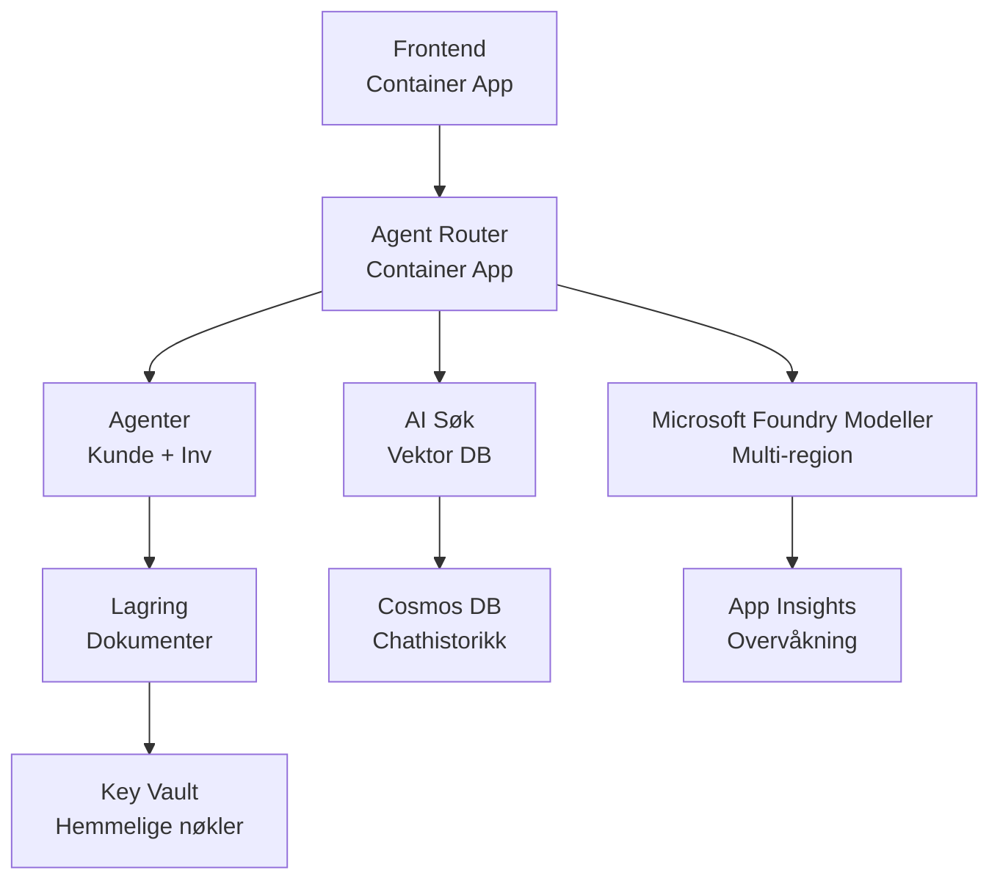

# Retail Multi-Agent Solution - Infrastrukturmal

**Kapittel 5: Produksjonsdistribusjonspakke**
- **📚 Kurs Hjem**: [AZD For Beginners](../../README.md)
- **📖 Relatert Kapittel**: [Kapittel 5: Multi-Agent AI Løsninger](../../README.md#-chapter-5-multi-agent-ai-solutions-advanced)
- **📝 Scenario Guide**: [Full Arkitektur](../retail-scenario.md)
- **🎯 Rask Distribusjon**: [Enkeltklikk Distribusjon](#-quick-deployment)

> **⚠️ KUN INFRASTRUKTURMAL**  
> Denne ARM-malen distribuerer **Azure-ressurser** for et multi-agent system.  
>  
> **Hva som distribueres (15-25 minutter):**
> - ✅ Microsoft Foundry Modeller (gpt-4.1, gpt-4.1-mini, embeddings i 3 regioner)
> - ✅ AI Search-tjeneste (tom, klar for indeksopprettelse)
> - ✅ Container Apps (plassholderbilder, klar for din kode)
> - ✅ Lagring, Cosmos DB, Key Vault, Application Insights
>  
> **Hva som IKKE er inkludert (krever utvikling):**
> - ❌ Agent-implementasjonskode (Kunde Agent, Lager Agent)
> - ❌ Rutinglogikk og API-endepunkter
> - ❌ Frontend chat UI
> - ❌ Søk indeks skjemaer og datapipelines
> - ❌ **Estimert utviklingsinnsats: 80-120 timer**
>  
> **Bruk denne malen hvis:**
> - ✅ Du vil opprette Azure infrastruktur for et multi-agent prosjekt
> - ✅ Du planlegger å utvikle agentimplementasjon separat
> - ✅ Du trenger et produksjonsklart infrastrukturbaseline
>  
> **Ikke bruk hvis:**
> - ❌ Du forventer en fungerende multi-agent demo umiddelbart
> - ❌ Du er ute etter komplett applikasjonskodeeksempler

## Oversikt

Denne katalogen inneholder en omfattende Azure Resource Manager (ARM) mal for å distribuere **infrastrukturbasisen** til et multi-agent kundestøttesystem. Malen oppretter alle nødvendige Azure-tjenester, riktig konfigurert og sammenkoblet, klar for din applikasjonsutvikling.

**Etter distribusjon vil du ha:** Produksjonsklar Azure-infrastruktur  
**For å fullføre systemet trenger du:** Agentkode, frontend UI og datakonfigurasjon (se [Arkitektur Guide](../retail-scenario.md))

## 🎯 Hva Distribueres

### Kjerneinfrastruktur (Status Etter Distribusjon)

✅ **Microsoft Foundry Models Tjenester** (Klar for API-kall)
  - Primær region: gpt-4.1 distribusjon (20K TPM kapasitet)
  - Sekundær region: gpt-4.1-mini distribusjon (10K TPM kapasitet)
  - Tertiær region: Tekst-embeddingsmodell (30K TPM kapasitet)
  - Evalueringsregion: gpt-4.1 graderingsmodell (15K TPM kapasitet)
  - **Status:** Fullt funksjonell - kan utføre API-kall umiddelbart

✅ **Azure AI Search** (Tom - klar for konfigurasjon)
  - Vektor-søk funksjonalitet aktivert
  - Standard nivå med 1 partisjon, 1 replika
  - **Status:** Tjeneste kjører, men krever indeksopprettelse
  - **Handling nødvendig:** Opprett søkeindeks med ditt skjema

✅ **Azure Storage Konto** (Tom - klar for opplastinger)
  - Blob-containere: `documents`, `uploads`
  - Sikker konfigurasjon (kun HTTPS, ingen offentlig tilgang)
  - **Status:** Klar til å motta filer
  - **Handling nødvendig:** Last opp produktdata og dokumenter

⚠️ **Container Apps Miljø** (Plassholderbilder distribuert)
  - Agent router app (nginx standardbilde)
  - Frontend app (nginx standardbilde)
  - Autoskalering konfigurert (0-10 instanser)
  - **Status:** Kjører plassholdercontainere
  - **Handling nødvendig:** Bygg og distribuer dine agentapplikasjoner

✅ **Azure Cosmos DB** (Tom - klar for data)
  - Database og container forhåndskonfigurert
  - Optimalisert for lav ventetid
  - TTL aktivert for automatisk opprydding
  - **Status:** Klar til å lagre chatthistorikk

✅ **Azure Key Vault** (Valgfri - klar for hemmeligheter)
  - Soft delete aktivert
  - RBAC konfigurert for administrerte identiteter
  - **Status:** Klar til å lagre API-nøkler og tilkoblingsstrenger

✅ **Application Insights** (Valgfri - overvåking aktiv)
  - Tilkoblet Log Analytics arbeidsområde
  - Tilpassede målinger og varsler konfigurert
  - **Status:** Klar til å motta telemetri fra dine apper

✅ **Document Intelligence** (Klar for API-kall)
  - S0 nivå for produksjonsarbeidsmengder
  - **Status:** Klar til å behandle opplastede dokumenter

✅ **Bing Search API** (Klar for API-kall)
  - S1 nivå for sanntidssøk
  - **Status:** Klar for websøke-forespørsler

### Distribusjonsmodi

| Modus | OpenAI Kapasitet | Container Instanser | Søkenivå | Lagringsredundans | Best For |
|------|-----------------|---------------------|-------------|-------------------|----------|
| **Minimal** | 10K-20K TPM | 0-2 replikaer | Basis | LRS (Lokal) | Utvikling/test, læring, proof-of-concept |
| **Standard** | 30K-60K TPM | 2-5 replikaer | Standard | ZRS (Sone) | Produksjon, moderat trafikk (<10K brukere) |
| **Premium** | 80K-150K TPM | 5-10 replikaer, sone-redundant | Premium | GRS (Geo) | Enterprise, høy trafikk (>10K brukere), 99,99% SLA |

**Kostnadseffekt:**
- **Minimal → Standard:** ~4x kostnadsøkning ($100-370/mnd → $420-1,450/mnd)
- **Standard → Premium:** ~3x kostnadsøkning ($420-1,450/mnd → $1,150-3,500/mnd)
- **Velg basert på:** Forventet belastning, SLA-krav, budsjettbegrensninger

**Kapasitetsplanlegging:**
- **TPM (Tokens Per Minute):** Totalt for alle modell-distribusjoner
- **Container Instanser:** Autoskaleringsområde (min-maks replikaer)
- **Søkenivå:** Påvirker spørringsytelse og indeksstørrelsesgrenser

## 📋 Forutsetninger

### Nødvendige Verktøy
1. **Azure CLI** (versjon 2.50.0 eller høyere)
   ```bash
   az --version  # Sjekk versjon
   az login      # Autentiser
   ```

2. **Aktivt Azure-abonnement** med Eier eller Bidragsyter-tilgang
   ```bash
   az account show  # Bekreft abonnement
   ```

### Nødvendige Azure Kvoter

Før distribusjon, kontroller at tilstrekkelige kvoter finnes i dine målregioner:

```bash
# Sjekk tilgjengeligheten til Microsoft Foundry-modeller i ditt område
az cognitiveservices account list-skus \
  --kind OpenAI \
  --location eastus2

# Verifiser OpenAI-kvote (eksempel for gpt-4.1)
az cognitiveservices usage list \
  --location eastus2 \
  --query "[?name.value=='OpenAI.Standard.gpt-4.1']"

# Sjekk kvote for Container Apps
az provider show \
  --namespace Microsoft.App \
  --query "resourceTypes[?resourceType=='managedEnvironments'].locations"
```

**Minimumskvoter som kreves:**
- **Microsoft Foundry Modeller:** 3-4 modell-distribusjoner på tvers av regioner
  - gpt-4.1: 20K TPM (Tokens Per Minute)
  - gpt-4.1-mini: 10K TPM
  - text-embedding-ada-002: 30K TPM
  - **Merk:** gpt-4.1 kan ha venteliste i enkelte regioner - sjekk [modelltilgjengelighet](https://learn.microsoft.com/azure/ai-services/openai/concepts/models)
- **Container Apps:** Administrert miljø + 2-10 container-instanser
- **AI Search:** Standard nivå (Basis utilstrekkelig for vektor-søk)
- **Cosmos DB:** Standard provisionert gjennomstrømming

**Hvis kvote er utilstrekkelig:**
1. Gå til Azure Portal → Kvoter → Be om økning
2. Eller bruk Azure CLI:
   ```bash
   az support tickets create \
     --ticket-name "OpenAI-Quota-Increase" \
     --severity "minimal" \
     --description "Request quota increase for Microsoft Foundry Models gpt-4.1 in eastus2"
   ```
3. Vurder alternative regioner med tilgjengelighet

## 🚀 Rask Distribusjon

### Alternativ 1: Bruke Azure CLI

```bash
# Klon eller last ned malfilene
git clone <repository-url>
cd examples/retail-multiagent-arm-template

# Gjør distribusjonsskriptet kjørbart
chmod +x deploy.sh

# Distribuer med standardinnstillinger
./deploy.sh -g myResourceGroup

# Distribuer for produksjon med premium-funksjoner
./deploy.sh -g myProdRG -e prod -m premium -l eastus2
```

### Alternativ 2: Bruke Azure Portal

[](https://portal.azure.com/#create/Microsoft.Template/uri/https%3A%2F%2Fraw.githubusercontent.com%2Fmicrosoft%2Fazd-for-beginners%2Fmain%2Fexamples%2Fretail-multiagent-arm-template%2Fazuredeploy.json)

### Alternativ 3: Bruke Azure CLI direkte

```bash
# Opprett ressursgruppe
az group create --name myResourceGroup --location eastus2

# Distribuer mal
az deployment group create \
  --resource-group myResourceGroup \
  --template-file azuredeploy.json \
  --parameters azuredeploy.parameters.json
```

## ⏱️ Distribusjonstidslinje

### Hva Du Kan Forvente

| Fase | Varighet | Hva Skjer |
|-------|----------|--------------||
| **Malsyntaksvalidering** | 30-60 sekunder | Azure validerer ARM-malsyntaks og parametere |
| **Opprettelse av ressursgruppe** | 10-20 sekunder | Oppretter ressursgruppe (om nødvendig) |
| **OpenAI Opprettelse** | 5-8 minutter | Oppretter 3-4 OpenAI-kontoer og distribuerer modeller |
| **Container Apps** | 3-5 minutter | Oppretter miljø og distribuerer plassholdercontainere |
| **Søk & Lagring** | 2-4 minutter | Oppretter AI Search-tjeneste og lagringskontoer |
| **Cosmos DB** | 2-3 minutter | Oppretter database og konfigurerer containere |
| **Overvåkingsoppsett** | 2-3 minutter | Setter opp Application Insights og Log Analytics |
| **RBAC-konfigurasjon** | 1-2 minutter | Konfigurerer administrerte identiteter og tillatelser |
| **Total distribusjon** | **15-25 minutter** | Komplett infrastruktur klar |

**Etter distribusjon:**
- ✅ **Infrastruktur Klar:** Alle Azure-tjenester opprettet og kjører
- ⏱️ **Applikasjonsutvikling:** 80-120 timer (brukeransvar)
- ⏱️ **Indekskonfigurasjon:** 15-30 minutter (krever ditt skjema)
- ⏱️ **Dataopplasting:** Varierer med datasettstørrelse
- ⏱️ **Testing & Validering:** 2-4 timer

---

## ✅ Verifiser Distribusjonssuksess

### Steg 1: Sjekk Ressursopprettelse (2 minutter)

```bash
# Bekreft at alle ressurser ble distribuert vellykket
az resource list \
  --resource-group myResourceGroup \
  --query "[?provisioningState!='Succeeded'].{Name:name, Status:provisioningState, Type:type}" \
  --output table
```

**Forventet:** Tom tabell (alle ressurser viser "Succeeded"-status)

### Steg 2: Verifiser Microsoft Foundry Models Distribusjoner (3 minutter)

```bash
# Liste alle OpenAI-kontoer
az cognitiveservices account list \
  --resource-group myResourceGroup \
  --query "[?kind=='OpenAI'].{Name:name, Location:location, Status:properties.provisioningState}" \
  --output table

# Sjekk modellimplementeringer for primærregion
OPENAI_NAME=$(az cognitiveservices account list \
  --resource-group myResourceGroup \
  --query "[?kind=='OpenAI'] | [0].name" -o tsv)

az cognitiveservices account deployment list \
  --name $OPENAI_NAME \
  --resource-group myResourceGroup \
  --output table
```

**Forventet:** 
- 3-4 OpenAI-kontoer (primær, sekundær, tertiær, evalueringsregioner)
- 1-2 modell-distribusjoner per konto (gpt-4.1, gpt-4.1-mini, text-embedding-ada-002)

### Steg 3: Test Infrastruktur Endepunkter (5 minutter)

```bash
# Hent URL-er for Container App
az containerapp list \
  --resource-group myResourceGroup \
  --query "[].{Name:name, URL:properties.configuration.ingress.fqdn, Status:properties.runningStatus}" \
  --output table

# Test ruterenes endepunkt (plassholderbilde vil svare)
ROUTER_URL=$(az containerapp show \
  --name retail-router \
  --resource-group myResourceGroup \
  --query "properties.configuration.ingress.fqdn" -o tsv)

echo "Testing: https://$ROUTER_URL"
curl -I https://$ROUTER_URL || echo "Container running (placeholder image - expected)"
```

**Forventet:** 
- Container Apps viser "Running"-status
- Plassholder nginx svarer med HTTP 200 eller 404 (ingen applikasjonskode enda)

### Steg 4: Verifiser Microsoft Foundry Models API-tilgang (3 minutter)

```bash
# Hent OpenAI-endepunkt og nøkkel
OPENAI_ENDPOINT=$(az cognitiveservices account show \
  --name $OPENAI_NAME \
  --resource-group myResourceGroup \
  --query "properties.endpoint" -o tsv)

OPENAI_KEY=$(az cognitiveservices account keys list \
  --name $OPENAI_NAME \
  --resource-group myResourceGroup \
  --query "key1" -o tsv)

# Test gpt-4.1 distribusjon
curl "${OPENAI_ENDPOINT}openai/deployments/gpt-4.1/chat/completions?api-version=2024-08-01-preview" \
  -H "Content-Type: application/json" \
  -H "api-key: $OPENAI_KEY" \
  -d '{
    "messages": [{"role": "user", "content": "Say hello"}],
    "max_tokens": 10
  }'
```

**Forventet:** JSON-svar med chat fullføring (bekrefter at OpenAI er funksjonell)

### Hva Virker vs. Hva Virker Ikke

**✅ Virker Etter Distribusjon:**
- Microsoft Foundry Modeller distribuert og mottar API-kall
- AI Search-tjeneste kjører (tom, ingen indekser enda)
- Container Apps kjører (plassholder nginx-bilder)
- Lagringskontoer tilgjengelige og klare for opplasting
- Cosmos DB klar for dataoperasjoner
- Application Insights samler infrastrukturtelemetri
- Key Vault klar for hemmelighetslagring

**❌ Virker Ikke Enda (Krever Utvikling):**
- Agent endepunkter (ingen applikasjonskode distribuert)
- Chat-funksjonalitet (krever frontend + backend implementasjon)
- Søkespørringer (ingen søkeindeks opprettet enda)
- Dokumentbehandlingspipeline (ingen data lastet opp)
- Egendefinert telemetri (krever applikasjonsinstrumentering)

**Neste Steg:** Se [Post-Deploy Konfigurasjon](#-post-deployment-next-steps) for å utvikle og distribuere applikasjonen din

---

## ⚙️ Konfigurasjonsalternativer

### Malparametere

| Parameter | Type | Standard | Beskrivelse |
|-----------|------|---------|-------------|
| `projectName` | string | "retail" | Prefiks for alle ressursnavn |
| `location` | string | Ressursgruppens plassering | Primær distribusjonsregion |
| `secondaryLocation` | string | "westus2" | Sekundær region for multiregionsdistribusjon |
| `tertiaryLocation` | string | "francecentral" | Region for embeddings-modell |
| `environmentName` | string | "dev" | Miljøbetegnelse (dev/staging/prod) |
| `deploymentMode` | string | "standard" | Distribusjonskonfigurasjon (minimal/standard/premium) |
| `enableMultiRegion` | bool | true | Aktiver multiregionsdistribusjon |
| `enableMonitoring` | bool | true | Aktiver Application Insights og logging |
| `enableSecurity` | bool | true | Aktiver Key Vault og utvidet sikkerhet |

### Tilpasse Parametere

Rediger `azuredeploy.parameters.json`:

```json
{
  "$schema": "https://schema.management.azure.com/schemas/2019-04-01/deploymentParameters.json#",
  "contentVersion": "1.0.0.0",
  "parameters": {
    "projectName": {
      "value": "mycompany"
    },
    "environmentName": {
      "value": "prod"
    },
    "deploymentMode": {
      "value": "premium"
    },
    "location": {
      "value": "eastus2"
    }
  }
}
```

## 🏗️ Arkitektur Oversikt


## 📖 Distribusjonsskriptets Bruk

Skriptet `deploy.sh` gir en interaktiv distribusjonsopplevelse:

```bash
# Vis hjelp
./deploy.sh --help

# Grunnleggende distribusjon
./deploy.sh -g myResourceGroup

# Avansert distribusjon med egendefinerte innstillinger
./deploy.sh \
  -g myProductionRG \
  -p companyname \
  -e prod \
  -m premium \
  -l eastus2

# Utviklingsdistribusjon uten flerregion
./deploy.sh \
  -g myDevRG \
  -e dev \
  -m minimal \
  --no-multi-region \
  --no-security
```

### Skriptfunksjoner

- ✅ **Validering av forutsetninger** (Azure CLI, innloggingsstatus, malfiler)
- ✅ **Håndtering av ressursgruppe** (oppretter hvis ikke eksisterer)
- ✅ **Malvalidering** før distribusjon
- ✅ **Overvåking av fremgang** med fargeutskrift
- ✅ **Visning av distribusjonsresultater**
- ✅ **Veiledning etter distribusjon**

## 📊 Overvåk Distribusjon

### Sjekk Distribusjonsstatus

```bash
# List distribusjoner
az deployment group list --resource-group myResourceGroup --output table

# Hent distribusjonsdetaljer
az deployment group show \
  --resource-group myResourceGroup \
  --name retail-deployment-YYYYMMDD-HHMMSS

# Overvåk distribusjonsfremdrift
az deployment group create \
  --resource-group myResourceGroup \
  --template-file azuredeploy.json \
  --parameters azuredeploy.parameters.json \
  --verbose
```

### Distribusjonsresultater

Etter vellykket distribusjon er følgende resultater tilgjengelige:

- **Frontend URL**: Offentlig endepunkt for webgrensesnittet
- **Router URL**: API-endepunkt for agent router
- **OpenAI Endepunkter**: Primær og sekundær OpenAI tjeneste endepunkter
- **Søk Tjeneste**: Azure AI Search tjeneste endepunkt
- **Lagringskonto**: Navn på lagringskonto for dokumenter
- **Key Vault**: Navn på Key Vault (om aktivert)
- **Application Insights**: Navn på overvåkningstjeneste (om aktivert)

## 🔧 Etter Distribusjon: Neste Steg
> **📝 Viktig:** Infrastruktur er distribuert, men du må utvikle og distribuere applikasjonskode.

### Fase 1: Utvikle Agent-applikasjoner (Ditt Ansvar)

ARM-malen oppretter **tomme Container Apps** med plassholder nginx-bilder. Du må:

**Nødvendig utvikling:**
1. **Agentimplementering** (30-40 timer)
   - Kundeserviceagent med gpt-4.1-integrasjon
   - Lageragent med gpt-4.1-mini-integrasjon
   - Agent rutingslogikk

2. **Frontend-utvikling** (20-30 timer)
   - Chatgrensesnitt UI (React/Vue/Angular)
   - Filopplastingsfunksjonalitet
   - Responsrendering og formatering

3. **Backend-tjenester** (12-16 timer)
   - FastAPI eller Express-ruter
   - Autentiseringsmiddleware
   - Telemetri-integrasjon

**Se:** [Arkitekturguide](../retail-scenario.md) for detaljerte implementeringsmønstre og kodeeksempler

### Fase 2: Konfigurer AI Søkeindeks (15-30 minutter)

Opprett en søkeindeks som matcher din datamodell:

```bash
# Hent detaljene for søketjenesten
SEARCH_NAME=$(az search service list \
  --resource-group myResourceGroup \
  --query "[0].name" -o tsv)

SEARCH_KEY=$(az search admin-key show \
  --service-name $SEARCH_NAME \
  --resource-group myResourceGroup \
  --query "primaryKey" -o tsv)

# Opprett indeks med skjemaet ditt (eksempel)
curl -X POST "https://${SEARCH_NAME}.search.windows.net/indexes?api-version=2023-11-01" \
  -H "Content-Type: application/json" \
  -H "api-key: ${SEARCH_KEY}" \
  -d '{
    "name": "products",
    "fields": [
      {"name": "id", "type": "Edm.String", "key": true},
      {"name": "title", "type": "Edm.String", "searchable": true},
      {"name": "content", "type": "Edm.String", "searchable": true},
      {"name": "category", "type": "Edm.String", "filterable": true},
      {"name": "content_vector", "type": "Collection(Edm.Single)", 
       "searchable": true, "dimensions": 1536, "vectorSearchProfile": "default"}
    ],
    "vectorSearch": {
      "algorithms": [{"name": "default", "kind": "hnsw"}],
      "profiles": [{"name": "default", "algorithm": "default"}]
    }
  }'
```

**Ressurser:**
- [AI Søkeindeks Skjema Design](https://learn.microsoft.com/azure/search/search-what-is-an-index)
- [Vector Search Konfigurasjon](https://learn.microsoft.com/azure/search/vector-search-how-to-create-index)

### Fase 3: Last opp dine data (Tid varierer)

Når du har produktdata og dokumenter:

```bash
# Hent lagringskontodetaljer
STORAGE_NAME=$(az storage account list \
  --resource-group myResourceGroup \
  --query "[0].name" -o tsv)

STORAGE_KEY=$(az storage account keys list \
  --account-name $STORAGE_NAME \
  --resource-group myResourceGroup \
  --query "[0].value" -o tsv)

# Last opp dokumentene dine
az storage blob upload-batch \
  --destination documents \
  --source /path/to/your/product/docs \
  --account-name $STORAGE_NAME \
  --account-key $STORAGE_KEY

# Eksempel: Last opp enkeltfil
az storage blob upload \
  --container-name documents \
  --name "product-manual.pdf" \
  --file /path/to/product-manual.pdf \
  --account-name $STORAGE_NAME \
  --account-key $STORAGE_KEY
```

### Fase 4: Bygg og distribuer dine applikasjoner (8-12 timer)

Når du har utviklet agentkoden din:

```bash
# 1. Opprett Azure Container Registry (hvis nødvendig)
az acr create \
  --name myregistry \
  --resource-group myResourceGroup \
  --sku Basic

# 2. Bygg og push agent-rutebilde
docker build -t myregistry.azurecr.io/agent-router:v1 /path/to/your/router/code
az acr login --name myregistry
docker push myregistry.azurecr.io/agent-router:v1

# 3. Bygg og push frontend-bilde
docker build -t myregistry.azurecr.io/frontend:v1 /path/to/your/frontend/code
docker push myregistry.azurecr.io/frontend:v1

# 4. Oppdater Container Apps med dine bilder
az containerapp update \
  --name retail-router \
  --resource-group myResourceGroup \
  --image myregistry.azurecr.io/agent-router:v1

az containerapp update \
  --name retail-frontend \
  --resource-group myResourceGroup \
  --image myregistry.azurecr.io/frontend:v1

# 5. Konfigurer miljøvariabler
az containerapp update \
  --name retail-router \
  --resource-group myResourceGroup \
  --set-env-vars \
    OPENAI_ENDPOINT=secretref:openai-endpoint \
    OPENAI_KEY=secretref:openai-key \
    SEARCH_ENDPOINT=secretref:search-endpoint \
    SEARCH_KEY=secretref:search-key
```

### Fase 5: Test applikasjonen din (2-4 timer)

```bash
# Få URL-en til applikasjonen din
ROUTER_URL=$(az containerapp show \
  --name retail-router \
  --resource-group myResourceGroup \
  --query "properties.configuration.ingress.fqdn" -o tsv)

# Test agent-endepunktet (når koden din er distribuert)
curl -X POST "https://${ROUTER_URL}/chat" \
  -H "Content-Type: application/json" \
  -d '{
    "message": "Hello, I need help with my order",
    "agent": "customer"
  }'

# Sjekk applikasjonslogger
az containerapp logs show \
  --name retail-router \
  --resource-group myResourceGroup \
  --follow
```

### Implementeringsressurser

**Arkitektur & Design:**
- 📖 [Fullstendig Arkitekturguide](../retail-scenario.md) - Detaljerte implementeringsmønstre
- 📖 [Multi-Agent Design Patterns](https://learn.microsoft.com/azure/architecture/ai-ml/guide/multi-agent-systems)

**Kodeeksempler:**
- 🔗 [Microsoft Foundry Models Chat Example](https://github.com/Azure-Samples/azure-search-openai-demo) - RAG-mønster
- 🔗 [Semantic Kernel](https://github.com/microsoft/semantic-kernel) - Agent-rammeverk (C#)
- 🔗 [LangChain Azure](https://github.com/langchain-ai/langchain) - Agentorkestrering (Python)
- 🔗 [AutoGen](https://github.com/microsoft/autogen) - Multi-agent samtaler

**Estimert total innsats:**
- Infrastrukturdistribusjon: 15-25 minutter (✅ Fullført)
- Applikasjonsutvikling: 80-120 timer (🔨 Ditt arbeid)
- Testing og optimalisering: 15-25 timer (🔨 Ditt arbeid)

## 🛠️ Feilsøking

### Vanlige problemer

#### 1. Microsoft Foundry Models Kvote Overskredet

```bash
# Sjekk nåværende kvotebruk
az cognitiveservices usage list --location eastus2

# Be om å øke kvoten
az support tickets create \
  --ticket-name "OpenAI-Quota-Increase" \
  --severity "minimal" \
  --description "Request quota increase for Microsoft Foundry Models in region X"
```

#### 2. Container Apps Distribusjon Mislyktes

```bash
# Sjekk containere app logger
az containerapp logs show \
  --name retail-router \
  --resource-group myResourceGroup \
  --follow

# Start containere app på nytt
az containerapp revision restart \
  --name retail-router \
  --resource-group myResourceGroup
```

#### 3. Søketjeneste Initialisering

```bash
# Verifiser status for søketjenesten
az search service show \
  --name <search-service-name> \
  --resource-group myResourceGroup

# Test tilkoblingen til søketjenesten
curl -X GET "https://<search-service-name>.search.windows.net/indexes?api-version=2023-11-01" \
  -H "api-key: <search-admin-key>"
```

### Distribusjonsvalidering

```bash
# Bekreft at alle ressurser er opprettet
az resource list \
  --resource-group myResourceGroup \
  --output table

# Sjekk ressurshelse
az resource list \
  --resource-group myResourceGroup \
  --query "[?provisioningState!='Succeeded'].{Name:name, Status:provisioningState, Type:type}" \
  --output table
```

## 🔐 Sikkerhetshensyn

### Nøkkeladministrasjon
- Alle hemmeligheter lagres i Azure Key Vault (når aktivert)
- Container-apper bruker administrert identitet for autentisering
- Storage-kontoer har sikre standarder (kun HTTPS, ingen offentlig blob-tilgang)

### Nettverkssikkerhet
- Container-apper bruker internt nettverk der det er mulig
- Søketjeneste konfigurert med alternativ for private endepunkter
- Cosmos DB konfigurert med minimale nødvendige tillatelser

### RBAC-konfigurasjon
```bash
# Tilordne nødvendige roller for administrert identitet
az role assignment create \
  --assignee <container-app-managed-identity> \
  --role "Cognitive Services OpenAI User" \
  --scope <openai-resource-id>
```

## 💰 Kostnadsoptimalisering

### Kostnadsestimater (månedlig, USD)

| Modus | OpenAI | Container Apps | Search | Storage | Total Est. |
|------|--------|----------------|--------|---------|------------|
| Minimal | $50-200 | $20-50 | $25-100 | $5-20 | $100-370 |
| Standard | $200-800 | $100-300 | $100-300 | $20-50 | $420-1450 |
| Premium | $500-2000 | $300-800 | $300-600 | $50-100 | $1150-3500 |

### Kostnadsovervåking

```bash
# Sett opp budsjettvarsler
az consumption budget create \
  --account-name <subscription-id> \
  --budget-name "retail-budget" \
  --amount 500 \
  --time-grain Monthly \
  --start-date 2024-01-01 \
  --end-date 2024-12-31
```

## 🔄 Oppdateringer og Vedlikehold

### Maloppdateringer
- Versjonskontroller ARM-malfilene
- Test endringer i utviklingsmiljø først
- Bruk inkrementell distribusjonsmodus for oppdateringer

### Ressursoppdateringer
```bash
# Oppdater med nye parametere
az deployment group create \
  --resource-group myResourceGroup \
  --template-file azuredeploy.json \
  --parameters azuredeploy.parameters.json \
  --mode Incremental
```

### Backup og Gjenoppretting
- Automatisk backup for Cosmos DB aktivert
- Key Vault myk sletting aktivert
- Container-app revisjoner opprettholdes for tilbakestilling

## 📞 Support

- **Malproblemer**: [GitHub Issues](https://github.com/microsoft/azd-for-beginners/issues)
- **Azure Support**: [Azure Support Portal](https://portal.azure.com/#blade/Microsoft_Azure_Support/HelpAndSupportBlade)
- **Community**: [Azure AI Discord](https://discord.gg/microsoft-azure)

---

**⚡ Klar til å distribuere din multi-agent løsning?**

Start med: `./deploy.sh -g myResourceGroup`

---

<!-- CO-OP TRANSLATOR DISCLAIMER START -->
**Ansvarsfraskrivelse**:  
Dette dokumentet er oversatt ved hjelp av AI-oversettelsestjenesten [Co-op Translator](https://github.com/Azure/co-op-translator). Selv om vi streber etter nøyaktighet, vennligst vær oppmerksom på at automatiske oversettelser kan inneholde feil eller unøyaktigheter. Det opprinnelige dokumentet på originalspråket bør anses som den autoritative kilden. For kritisk informasjon anbefales profesjonell menneskelig oversettelse. Vi påtar oss ikke ansvar for eventuelle misforståelser eller feiltolkninger som oppstår ved bruk av denne oversettelsen.
<!-- CO-OP TRANSLATOR DISCLAIMER END -->