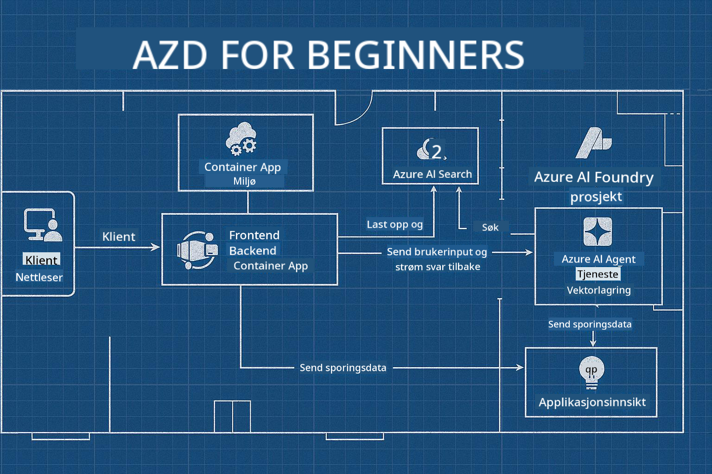

<!--
CO_OP_TRANSLATOR_METADATA:
{
  "original_hash": "245d24997bbcf2bae93bb2a503845d37",
  "translation_date": "2025-09-23T11:57:29+00:00",
  "source_file": "workshop/README.md",
  "language_code": "no"
}
-->
# AZD for AI-utviklere Workshop

## AZD Maler

Å bygge en AI-applikasjon av bedriftskvalitet for ditt spesifikke scenario er veldig likt det å bygge ditt eget hjem. Du kan designe det selv, bygge det stein for stein, og ta ansvar for å sikre at det oppfyller alle styrings- og utviklingsretningslinjer.

**ELLER ....**

Du kan jobbe med en arkitekt som kan gi deg en _blåkopi_ for et start-hjem, og deretter samarbeide med deg for å _tilpasse_ det til dine behov. Dette lar deg fokusere på det som gjør **ditt hjem** spesielt, mens ekspertene tar seg av den underliggende ledningen, rørleggingen og andre avhengigheter.

**Dette er tilnærmingen bak [AI App Templates](https://ai.azure.com/templates)** - en serie blåkopier for å bygge ulike typer AI-applikasjons "hjem" avhengig av hva dine kjernebehov og avhengigheter er.

## Tilpasning av maler

Maler er designet for å fungere med [Azure AI Foundry](https://ai.azure.com). Tenk på denne plattformen som din "byggmester" med tilgang til alle ressursene, verktøyene og ekspertisen du trenger for å få jobben gjort!

Alt du trenger å gjøre er å velge [dine startmaler](https://learn.microsoft.com/en-us/azure/ai-foundry/how-to/develop/ai-template-get-started). For eksempel vil vi fokusere på _Get Started with AI Agents_-malen for å bygge deg et "Agentisk AI-hjem" som er klargjort for funksjoner som AI-søk, Red Teaming, evalueringer, sporing, overvåking og mer!



Alt du trenger er å booke tid med arkitekten, som kan veilede deg gjennom tilpasningsprosessen. [GitHub Copilot for Azure](https://learn.microsoft.com/en-us/azure/developer/github-copilot-azure/get-started) kan være den veilederen. Bare "chat med den" for å:

- Lære om Azure-funksjonene i malen din
- Distribuere Azure-ressurser
- Få informasjon om distribusjonen din
- Diagnostisere og feilsøke problemer!

I denne workshopen lærer vi hvordan vi _dekonstruerer_ den eksisterende malen (for å forstå hva den tilbyr), og deretter _tilpasser_ den (for å oppfylle våre krav) - steg for steg.

AI-maler **får det til å fungere** - ved å fullføre workshopen vil du lære å **gjøre det til ditt eget**

----

**Workshop-navigasjon**
- **📚 Kursoversikt**: [AZD For Nybegynnere](../README.md)
- **📖 Relaterte kapitler**: Dekker [Kapittel 1](../README.md#-chapter-1-foundation--quick-start), [Kapittel 2](../README.md#-chapter-2-ai-first-development-recommended-for-ai-developers), og [Kapittel 5](../README.md#-chapter-5-multi-agent-ai-solutions-advanced)
- **🛠️ Praktisk Lab**: [AI Workshop Lab](../docs/ai-foundry/ai-workshop-lab.md)
- **🚀 Neste steg**: [Workshop Lab-moduler](../../../workshop)

Velkommen til den praktiske workshopen for å lære Azure Developer CLI (AZD) med fokus på distribusjon av AI-applikasjoner. Denne workshopen er designet for å ta deg fra AZD-grunnleggende til distribusjon av produksjonsklare AI-løsninger.

## Workshop-oversikt

**Varighet:** 2-3 timer  
**Nivå:** Nybegynner til middels  
**Forutsetninger:** Grunnleggende kunnskap om Azure, kommandolinjeverktøy og AI-konsepter

### Hva du vil lære

- **AZD Grunnleggende**: Forstå Infrastructure as Code med AZD
- 🤖 **AI-tjenesteintegrasjon**: Distribuere Azure OpenAI, AI-søk og andre AI-tjenester
- **Container-distribusjon**: Bruke Azure Container Apps for AI-applikasjoner
- **Sikkerhetspraksis**: Implementere Managed Identity og sikre konfigurasjoner
- **Overvåking og observasjon**: Sette opp Application Insights for AI-arbeidsbelastninger
- **Produksjonsmønstre**: Distribusjonsstrategier klare for bedrifter

## Workshop-struktur

### Modul 1: AZD Grunnleggende (30 minutter)
- Installere og konfigurere AZD
- Forstå AZD-prosjektstruktur
- Din første AZD-distribusjon
- **Lab**: Distribuer en enkel webapplikasjon

### Modul 2: Azure OpenAI-integrasjon (45 minutter)
- Sette opp Azure OpenAI-ressurser
- Modell-distribusjonsstrategier
- Konfigurere API-tilgang og autentisering
- **Lab**: Distribuer en chat-applikasjon med GPT-4

### Modul 3: RAG-applikasjoner (45 minutter)
- Integrasjon med Azure AI-søk
- Dokumentbehandling med Azure Document Intelligence
- Vektor-embedding og semantisk søk
- **Lab**: Bygg et dokument Q&A-system

### Modul 4: Produksjonsdistribusjon (30 minutter)
- Konfigurasjon av Container Apps
- Skalering og ytelsesoptimalisering
- Overvåking og logging
- **Lab**: Distribuer til produksjon med observasjon

### Modul 5: Avanserte mønstre (15 minutter)
- Distribusjoner i flere miljøer
- CI/CD-integrasjon
- Kostnadsoptimaliseringsstrategier
- **Oppsummering**: Sjekkliste for produksjonsklarhet

## Forutsetninger

### Nødvendige verktøy

Vennligst installer disse verktøyene før workshopen:

```bash
# Azure Developer CLI
curl -fsSL https://aka.ms/install-azd.sh | bash

# Azure CLI
curl -sL https://aka.ms/InstallAzureCLIDeb | sudo bash

# Git
sudo apt-get install git

# Docker
curl -fsSL https://get.docker.com -o get-docker.sh
sudo sh get-docker.sh

# Python 3.10+
sudo apt-get install python3.10 python3.10-venv python3-pip
```

### Azure-kontooppsett

1. **Azure-abonnement**: [Registrer deg gratis](https://azure.microsoft.com/free/)
2. **Azure OpenAI-tilgang**: [Be om tilgang](https://aka.ms/oai/access)
3. **Nødvendige tillatelser**:
   - Bidragsyterrolle på abonnement eller ressursgruppe
   - Brukertilgangsadministrator (for RBAC-tilordninger)

### Verifiser forutsetninger

Kjør dette skriptet for å verifisere oppsettet ditt:

```bash
#!/bin/bash
echo "Verifying workshop prerequisites..."

# Check AZD installation
if command -v azd &> /dev/null; then
    echo "✅ Azure Developer CLI: $(azd --version)"
else
    echo "❌ Azure Developer CLI not found"
fi

# Check Azure CLI
if command -v az &> /dev/null; then
    echo "✅ Azure CLI: $(az --version | head -n1)"
else
    echo "❌ Azure CLI not found"
fi

# Check Docker
if command -v docker &> /dev/null; then
    echo "✅ Docker: $(docker --version)"
else
    echo "❌ Docker not found"
fi

# Check Python
if command -v python3 &> /dev/null; then
    echo "✅ Python: $(python3 --version)"
else
    echo "❌ Python 3 not found"
fi

# Check Azure login
if az account show &> /dev/null; then
    echo "✅ Azure: Logged in as $(az account show --query user.name -o tsv)"
else
    echo "❌ Azure: Not logged in (run 'az login')"
fi

echo "Setup verification complete!"
```

## Workshop-materialer

### Lab-øvelser

Hver modul inkluderer praktiske lab-øvelser med startkode og trinnvise instruksjoner:

- **[lab-1-azd-basics/](../../../workshop/lab-1-azd-basics)** - Din første AZD-distribusjon
- **[lab-2-openai-chat/](../../../workshop/lab-2-openai-chat)** - Chat-applikasjon med Azure OpenAI
- **[lab-3-rag-search/](../../../workshop/lab-3-rag-search)** - RAG-applikasjon med AI-søk
- **[lab-4-production/](../../../workshop/lab-4-production)** - Produksjonsdistribusjonsmønstre
- **[lab-5-advanced/](../../../workshop/lab-5-advanced)** - Avanserte distribusjonsscenarier

### Referansematerialer

- **[AI Foundry Integrasjonsguide](../docs/ai-foundry/azure-ai-foundry-integration.md)** - Omfattende integrasjonsmønstre
- **[AI Modell-distribusjonsguide](../docs/ai-foundry/ai-model-deployment.md)** - Beste praksis for modell-distribusjon
- **[Produksjons-AI-praksis](../docs/ai-foundry/production-ai-practices.md)** - Distribusjonsmønstre klare for bedrifter
- **[AI Feilsøkingsguide](../docs/troubleshooting/ai-troubleshooting.md)** - Vanlige problemer og løsninger

### Eksempelmaler

Hurtigstartmaler for vanlige AI-scenarier:

```
workshop/templates/
├── minimal-chat/          # Basic OpenAI chat app
├── rag-application/       # RAG with AI Search
├── multi-model/          # Multiple AI services
└── production-ready/     # Enterprise template
```

## Kom i gang

### Alternativ 1: GitHub Codespaces (Anbefalt)

Den raskeste måten å starte workshopen:

[](https://github.com/codespaces/new?hide_repo_select=true&ref=main&repo=YOUR_REPO_ID)

### Alternativ 2: Lokal utvikling

1. **Klon workshop-repositoriet:**
```bash
git clone https://github.com/YOUR_ORG/AZD-for-beginners.git
cd AZD-for-beginners/workshop
```

2. **Logg inn på Azure:**
```bash
az login
azd auth login
```

3. **Start med Lab 1:**
```bash
cd lab-1-azd-basics
cat README.md  # Follow the instructions
```

### Alternativ 3: Instruktørledet workshop

Hvis du deltar på en instruktørledet sesjon:

- 🎥 **Workshop-opptak**: [Tilgjengelig på forespørsel](https://aka.ms/azd-ai-workshop)
- 💬 **Discord-fellesskap**: [Bli med for live support](https://aka.ms/foundry/discord)
- **Workshop-tilbakemelding**: [Del din erfaring](https://aka.ms/azd-workshop-feedback)

## Workshop-tidslinje

### Selvstyrt læring (3 timer)

```
⏰ 00:00 - 00:30  Module 1: AZD Foundations
⏰ 00:30 - 01:15  Module 2: Azure OpenAI Integration
⏰ 01:15 - 02:00  Module 3: RAG Applications
⏰ 02:00 - 02:30  Module 4: Production Deployment
⏰ 02:30 - 02:45  Module 5: Advanced Patterns
⏰ 02:45 - 03:00  Q&A and Next Steps
```

### Instruktørledet sesjon (2,5 timer)

```
⏰ 00:00 - 00:15  Welcome & Prerequisites Check
⏰ 00:15 - 00:40  Module 1: Live Demo + Lab
⏰ 00:40 - 01:20  Module 2: OpenAI Integration
⏰ 01:20 - 01:30  Break
⏰ 01:30 - 02:10  Module 3: RAG Applications
⏰ 02:10 - 02:30  Module 4: Production Patterns
⏰ 02:30 - 02:45  Module 5: Advanced Topics
⏰ 02:45 - 03:00  Q&A and Resources
```

## Suksesskriterier

Ved slutten av denne workshopen vil du kunne:

✅ **Distribuere AI-applikasjoner** ved hjelp av AZD-maler  
✅ **Konfigurere Azure OpenAI**-tjenester med riktig sikkerhet  
✅ **Bygge RAG-applikasjoner** med Azure AI-søkintegrasjon  
✅ **Implementere produksjonsmønstre** for AI-arbeidsbelastninger klare for bedrifter  
✅ **Overvåke og feilsøke** distribusjoner av AI-applikasjoner  
✅ **Bruke kostnadsoptimalisering** for AI-arbeidsbelastninger  

## Fellesskap og støtte

### Under workshopen

- 🙋 **Spørsmål**: Bruk workshop-chat eller gi beskjed
- 🐛 **Problemer**: Sjekk [feilsøkingsguiden](../docs/troubleshooting/ai-troubleshooting.md)
- **Tips**: Del oppdagelser med andre deltakere

### Etter workshopen

- 💬 **Discord**: [Azure AI Foundry-fellesskap](https://aka.ms/foundry/discord)
- **GitHub Issues**: [Rapporter malproblemer](https://github.com/YOUR_ORG/AZD-for-beginners/issues)
- 📧 **Tilbakemelding**: [Workshop-evalueringsskjema](https://aka.ms/azd-workshop-feedback)

## Neste steg

### Fortsett læringen

1. **Avanserte scenarier**: Utforsk [multi-region distribusjoner](../docs/ai-foundry/production-ai-practices.md#multi-region-deployment)
2. **CI/CD-integrasjon**: Sett opp [GitHub Actions-arbeidsflyter](../docs/deployment/github-actions.md)
3. **Egendefinerte maler**: Lag dine egne [AZD-maler](../docs/getting-started/custom-templates.md)

### Bruk i dine prosjekter

1. **Vurdering**: Bruk vår [klarhetssjekkliste](./production-readiness-checklist.md)
2. **Maler**: Start med våre [AI-spesifikke maler](../../../workshop/templates)
3. **Støtte**: Bli med i [Azure AI Foundry Discord](https://aka.ms/foundry/discord)

### Del din suksess

- ⭐ **Gi stjerne til repositoriet** hvis denne workshopen hjalp deg
- 🐦 **Del på sosiale medier** med #AzureDeveloperCLI #AzureAI
- 📝 **Skriv et blogginnlegg** om din AI-distribusjonsreise

---

## Workshop-tilbakemelding

Din tilbakemelding hjelper oss med å forbedre workshop-opplevelsen:

| Aspekt | Vurdering (1-5) | Kommentarer |
|--------|------------------|-------------|
| Kvalitet på innhold | ⭐⭐⭐⭐⭐ | |
| Praktiske lab-øvelser | ⭐⭐⭐⭐⭐ | |
| Dokumentasjon | ⭐⭐⭐⭐⭐ | |
| Vanskelighetsnivå | ⭐⭐⭐⭐⭐ | |
| Totalopplevelse | ⭐⭐⭐⭐⭐ | |

**Send inn tilbakemelding**: [Workshop-evalueringsskjema](https://aka.ms/azd-workshop-feedback)

---

**Forrige:** [AI Feilsøkingsguide](../docs/troubleshooting/ai-troubleshooting.md) | **Neste:** Start med [Lab 1: AZD Grunnleggende](../../../workshop/lab-1-azd-basics)

**Klar til å begynne å bygge AI-applikasjoner med AZD?**

[Start Lab 1: AZD Grunnleggende →](./lab-1-azd-basics/README.md)

---

