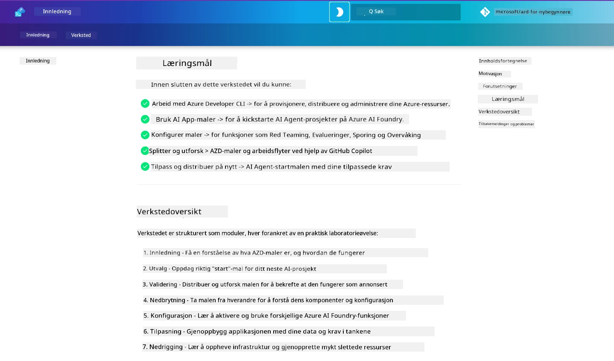

<div align="center">
  <div style="background: linear-gradient(135deg, #0078d4, #106ebe); border-radius: 10px; padding: 20px; margin: 20px 0; box-shadow: 0 4px 15px rgba(0, 120, 212, 0.3); border: 2px solid #005a9e;">
    <h2 style="color: white; margin: 0; font-size: 24px; text-shadow: 1px 1px 2px rgba(0,0,0,0.3);">
      🎯 AZD for AI-utviklere Workshop
    </h2>
    <p style="color: white; margin: 10px 0 0 0; font-size: 16px; text-shadow: 1px 1px 2px rgba(0,0,0,0.3);">
      <strong>En praktisk workshop for å bygge AI-applikasjoner med Azure Developer CLI.</strong><br>
      Fullfør 7 moduler for å mestre AZD-maler og AI distribusjonsarbeidsflyter.
    </p>
    <div style="margin-top: 15px;">
      <span style="background: rgba(255,255,255,0.2); padding: 5px 10px; border-radius: 15px; color: white; font-size: 14px;">
        📅 Sist oppdatert: mars 2026
      </span>
    </div>
  </div>
</div>

# AZD for AI-utviklere Workshop

Velkommen til den praktiske workshopen for å lære Azure Developer CLI (AZD) med fokus på distribusjon av AI-applikasjoner. Denne workshopen hjelper deg å oppnå en praktisk forståelse av AZD-maler i 3 steg:

1. **Oppdagelse** - finn malen som passer for deg.
1. **Distribusjon** - distribuer og bekreft at det fungerer
1. **Tilpasning** - endre og iterer for å gjøre det til ditt eget!

Gjennom denne workshopen vil du også bli introdusert for kjerneutviklerverktøy og arbeidsflyter, som hjelper deg å effektivisere hele utviklingsreisen din.

<br/>

## Nettleserbasert guide

Workshop-leksjonene er i Markdown. Du kan navigere i dem direkte på GitHub – eller starte en nettleserbasert forhåndsvisning som vist i skjermbildet under.



For å bruke dette alternativet – forker du depotet til din profil, og starter GitHub Codespaces. Når VS Code-terminalen er aktiv, skriver du inn denne kommandoen:

Denne nettleserforhåndsvisningen fungerer i GitHub Codespaces, utviklingscontainere eller en lokal klone med Python og MkDocs installert.

```bash title="" linenums="0"
mkdocs serve > /dev/null 2>&1 &
```

Om noen sekunder vil du se en popup-dialog. Velg alternativet for å `Åpne i nettleser`. Den nettbaserte guiden åpnes nå i en ny nettleserfane. Noen fordeler med denne forhåndsvisningen:

1. **Innebygd søk** - finn søkeord eller leksjoner raskt.
1. **Kopier-ikon** - hold musepekeren over kodeblokker for å se dette alternativet
1. **Temabryter** - bytt mellom mørkt og lyst tema
1. **Få hjelp** - klikk Discord-ikonet i bunnteksten for å bli med!

<br/>

## Workshop Oversikt

**Varighet:** 3-4 timer  
**Nivå:** Nybegynner til middels  
**Forutsetninger:** Kjennskap til Azure, AI-konsepter, VS Code & kommandolinjeverktøy.

Dette er en praktisk workshop hvor du lærer ved å gjøre. Når du har fullført øvelsene, anbefaler vi å gå gjennom AZD For Beginners-kurset for å fortsette læringsreisen innen sikkerhet og produktivitets beste praksis.

| Tid | Modul  | Mål |
|:---|:---|:---|
| 15 min | [Introduksjon](docs/instructions/0-Introduction.md) | Sett scenen, forstå målene |
| 30 min | [Velg AI-mal](docs/instructions/1-Select-AI-Template.md) | Utforsk alternativer og velg startmal | 
| 30 min | [Verifiser AI-mal](docs/instructions/2-Validate-AI-Template.md) | Distribuer standardløsning til Azure |
| 30 min | [Analyser AI-mal](docs/instructions/3-Deconstruct-AI-Template.md) | Undersøk struktur og konfigurasjon |
| 30 min | [Konfigurer AI-mal](docs/instructions/4-Configure-AI-Template.md) | Aktiver og prøv tilgjengelige funksjoner |
| 30 min | [Tilpass AI-mal](docs/instructions/5-Customize-AI-Template.md) | Tilpass malen til dine behov |
| 30 min | [Rydd opp infrastruktur](docs/instructions/6-Teardown-Infrastructure.md) | Rydd opp og frigjør ressurser |
| 15 min | [Oppsummering & Neste steg](docs/instructions/7-Wrap-up.md) | Læringsressurser, Workshop-utfordring |

<br/>

## Hva du vil lære

Se på AZD-malen som en læringssandkasse for å utforske ulike muligheter og verktøy for ende-til-ende utvikling på Microsoft Foundry. Når du er ferdig med denne workshopen, bør du ha en intuitiv forståelse for ulike verktøy og konsepter i denne konteksten.

| Konsept  | Mål |
|:---|:---|
| **Azure Developer CLI** | Forstå verktøyets kommandoer og arbeidsflyter |
| **AZD-maler**| Forstå prosjektstruktur og konfigurasjon |
| **Azure AI Agent**| Opprett og distribuer Microsoft Foundry-prosjekt |
| **Azure AI Search**| Muliggjør kontekstuell ingeniørkunst med agenter |
| **Observabilitet**| Utforsk sporing, overvåking og evalueringer |
| **Red Teaming**| Utforsk motstandstesting og risikoreduserende tiltak |

<br/>

## Workshopstruktur

Workshopen er strukturert for å ta deg med på en reise fra maloppdagelse, til distribusjon, nedbrytning og tilpasning – med den offisielle [Getting Started with AI Agents](https://github.com/Azure-Samples/get-started-with-ai-agents) startmalen som grunnlag.

### [Modul 1: Velg AI-mal](docs/instructions/1-Select-AI-Template.md) (30 min)

- Hva er AI-maler?
- Hvor kan jeg finne AI-maler?
- Hvordan kan jeg komme i gang med å bygge AI-agenter?
- **Lab:** Hurtigstart i Codespaces eller en utviklingscontainer

### [Modul 2: Verifiser AI-mal](docs/instructions/2-Validate-AI-Template.md) (30 min)

- Hva er AI-malens arkitektur?
- Hva er AZD utviklingsarbeidsflyt?
- Hvordan få hjelp med AZD-utvikling?
- **Lab:** Distribuer og verifiser AI-agenter malen

### [Modul 3: Analyser AI-mal](docs/instructions/3-Deconstruct-AI-Template.md) (30 min)

- Utforsk miljøet ditt i `.azure/`
- Utforsk ressursoppsettet ditt i `infra/`
- Utforsk AZD-konfigurasjonen din i `azure.yaml`-filene
- **Lab:** Endre miljøvariabler og distribuere på nytt

### [Modul 4: Konfigurer AI-mal](docs/instructions/4-Configure-AI-Template.md) (30 min)
- Utforsk: Retrieval Augmented Generation
- Utforsk: Agent Evaluering & Red Teaming
- Utforsk: Sporing & Overvåking
- **Lab:** Utforsk AI-agent + Observabilitet

### [Modul 5: Tilpass AI-mal](docs/instructions/5-Customize-AI-Template.md) (30 min)
- Definer: PRD med scenario-krav
- Konfigurer: Miljøvariabler for AZD
- Implementer: Livssyklus-kroker for ekstra oppgaver
- **Lab:** Tilpass malen for mitt scenario

### [Modul 6: Rydd opp infrastruktur](docs/instructions/6-Teardown-Infrastructure.md) (30 min)
- Oppsummering: Hva er AZD-maler?
- Oppsummering: Hvorfor bruke Azure Developer CLI?
- Neste steg: Prøv en annen mal!
- **Lab:** Fjern distribusjon av infrastruktur og rydd opp

<br/>

## Workshop-utfordring

Vil du utfordre deg selv til å gjøre mer? Her er noen prosjektforslag – eller del dine ideer med oss!!

| Prosjekt | Beskrivelse |
|:---|:---|
|1. **Analyser en kompleks AI-mal** | Bruk arbeidsflyten og verktøyene vi har skissert og se om du kan distribuere, verifisere og tilpasse en annen AI-løsningsmal. _Hva lærte du?_|
|2. **Tilpass med ditt scenario**  | Prøv å skrive et PRD (Product Requirements Document) for et annet scenario. Bruk så GitHub Copilot i mal-repoet ditt i Agent Model – og be det generere en tilpasningsarbeidsflyt for deg. _Hva lærte du? Hvordan kunne du forbedre disse forslagene?_|
| | |

## Har du tilbakemeldinger?

1. Legg inn en sak i dette repoet – merk den med `Workshop` for enkelhets skyld.
1. Bli med i Microsoft Foundry Discord – koble deg med dine kolleger!


| | | 
|:---|:---|
| **📚 Kurs Hjem**| [AZD For Beginners](../README.md)|
| **📖 Dokumentasjon** | [Kom i gang med AI-maler](https://learn.microsoft.com/en-us/azure/ai-foundry/how-to/develop/ai-template-get-started)|
| **🛠️AI-maler** | [Microsoft Foundry-maler](https://ai.azure.com/templates) |
|**🚀 Neste steg** | [Start Workshop](#workshop-oversikt) |
| | |

<br/>

---

**Navigasjon:** [Hovedkurs](../README.md) | [Introduksjon](docs/instructions/0-Introduction.md) | [Modul 1: Velg mal](docs/instructions/1-Select-AI-Template.md)

**Klar til å begynne å bygge AI-applikasjoner med AZD?**

[Start Workshop: Introduksjon →](docs/instructions/0-Introduction.md)

---

<!-- CO-OP TRANSLATOR DISCLAIMER START -->
**Ansvarsfraskrivelse**:  
Dette dokumentet er oversatt ved bruk av AI-oversettelsestjenesten [Co-op Translator](https://github.com/Azure/co-op-translator). Selv om vi streber etter nøyaktighet, vennligst vær oppmerksom på at automatiserte oversettelser kan inneholde feil eller unøyaktigheter. Det opprinnelige dokumentet på det opprinnelige språket bør betraktes som den autoritative kilden. For kritisk informasjon anbefales profesjonell menneskelig oversettelse. Vi er ikke ansvarlige for eventuelle misforståelser eller feiltolkninger som oppstår ved bruk av denne oversettelsen.
<!-- CO-OP TRANSLATOR DISCLAIMER END -->