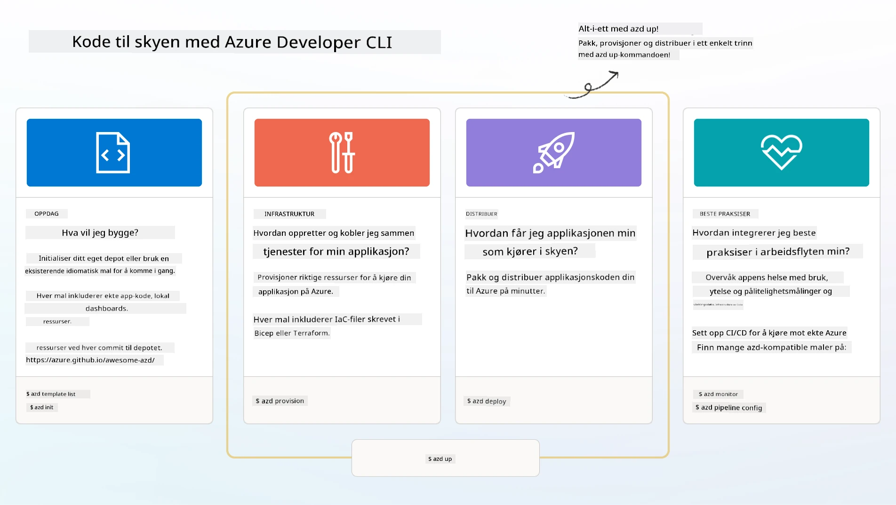

<!--
CO_OP_TRANSLATOR_METADATA:
{
  "original_hash": "06d6207eff634aefcaa41739490a5324",
  "translation_date": "2025-09-24T22:44:33+00:00",
  "source_file": "workshop/docs/instructions/1-Select-AI-Template.md",
  "language_code": "no"
}
-->
# 1. Velg en mal

!!! tip "VED SLUTTEN AV DENNE MODULEN VIL DU KUNNE"

    - [ ] Beskrive hva AZD-maler er
    - [ ] Oppdage og bruke AZD-maler for AI
    - [ ] Komme i gang med AI Agents-malen
    - [ ] **Lab 1:** AZD Quickstart med GitHub Codespaces

---

## 1. En analogi for bygging

Å bygge en moderne AI-applikasjon klar for bedrifter _fra bunnen av_ kan være overveldende. Det er litt som å bygge ditt nye hjem helt alene, murstein for murstein. Ja, det kan gjøres! Men det er ikke den mest effektive måten å oppnå ønsket sluttresultat på!

I stedet starter vi ofte med en eksisterende _designplan_, og jobber med en arkitekt for å tilpasse den til våre personlige behov. Og det er akkurat denne tilnærmingen vi bør ta når vi bygger intelligente applikasjoner. Først, finn en god designarkitektur som passer til ditt problemområde. Deretter jobber du med en løsningsarkitekt for å tilpasse og utvikle løsningen for ditt spesifikke scenario.

Men hvor kan vi finne disse designplanene? Og hvordan finner vi en arkitekt som er villig til å lære oss hvordan vi kan tilpasse og implementere disse planene selv? I denne workshopen svarer vi på disse spørsmålene ved å introdusere deg for tre teknologier:

1. [Azure Developer CLI](https://aka.ms/azd) - et åpen kildekode-verktøy som akselererer utviklerens vei fra lokal utvikling (bygging) til skyimplementering (levering).
1. [Azure AI Foundry Templates](https://ai.azure.com/templates) - standardiserte åpen kildekode-repositorier som inneholder eksempelkode, infrastruktur og konfigurasjonsfiler for å implementere en AI-løsningsarkitektur.
1. [GitHub Copilot Agent Mode](https://code.visualstudio.com/docs/copilot/chat/chat-agent-mode) - en kodeagent basert på Azure-kunnskap, som kan veilede oss i å navigere kodebasen og gjøre endringer - ved bruk av naturlig språk.

Med disse verktøyene kan vi nå _oppdage_ den rette malen, _implementere_ den for å validere at den fungerer, og _tilpasse_ den til våre spesifikke scenarier. La oss dykke inn og lære hvordan disse fungerer.

---

## 2. Azure Developer CLI

[Azure Developer CLI](https://learn.microsoft.com/en-us/azure/developer/azure-developer-cli/) (eller `azd`) er et åpen kildekode-kommandolinjeverktøy som kan akselerere din reise fra kode til sky med et sett utviklervennlige kommandoer som fungerer konsekvent på tvers av ditt IDE (utvikling) og CI/CD (devops)-miljøer.

Med `azd` kan implementeringsreisen din være så enkel som:

- `azd init` - Initialiserer et nytt AI-prosjekt fra en eksisterende AZD-mal.
- `azd up` - Oppretter infrastruktur og implementerer applikasjonen i ett steg.
- `azd monitor` - Få sanntids overvåking og diagnostikk for din implementerte applikasjon.
- `azd pipeline config` - Sett opp CI/CD-pipelines for å automatisere implementering til Azure.

**🎯 | ØVELSE**: <br/> Utforsk `azd`-kommandolinjeverktøyet i ditt GitHub Codespaces-miljø nå. Start med å skrive denne kommandoen for å se hva verktøyet kan gjøre:

```bash title="" linenums="0"
azd help
```


---

## 3. AZD-malen

For at `azd` skal oppnå dette, må det vite hvilken infrastruktur som skal opprettes, hvilke konfigurasjonsinnstillinger som skal håndheves, og hvilken applikasjon som skal implementeres. Dette er hvor [AZD-maler](https://learn.microsoft.com/en-us/azure/developer/azure-developer-cli/azd-templates?tabs=csharp) kommer inn.

AZD-maler er åpen kildekode-repositorier som kombinerer eksempelkode med infrastruktur og konfigurasjonsfiler som er nødvendige for å implementere løsningsarkitekturen. Ved å bruke en _Infrastructure-as-Code_ (IaC)-tilnærming, lar de malens ressursdefinisjoner og konfigurasjonsinnstillinger bli versjonskontrollert (akkurat som appens kildekode) - og skaper gjenbrukbare og konsistente arbeidsflyter på tvers av brukere av det prosjektet.

Når du lager eller gjenbruker en AZD-mal for _ditt_ scenario, vurder disse spørsmålene:

1. Hva bygger du? → Finnes det en mal som har startkode for det scenariet?
1. Hvordan er løsningen din arkitektert? → Finnes det en mal som har de nødvendige ressursene?
1. Hvordan implementeres løsningen din? → Tenk `azd deploy` med pre/post-prosessering hooks!
1. Hvordan kan du optimalisere den ytterligere? → Tenk innebygd overvåking og automatiseringspipelines!

**🎯 | ØVELSE**: <br/> 
Besøk [Awesome AZD](https://azure.github.io/awesome-azd/) galleriet og bruk filtrene for å utforske de 250+ malene som er tilgjengelige. Se om du kan finne en som samsvarer med _dine_ scenariokrav.



---

## 4. AI App-maler

---

