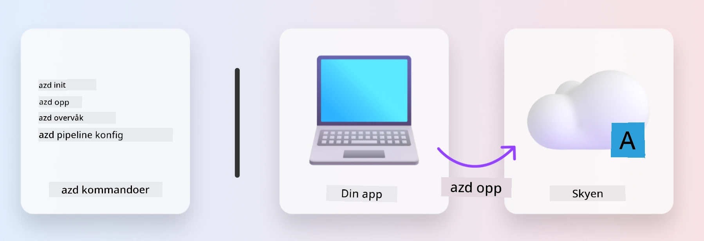
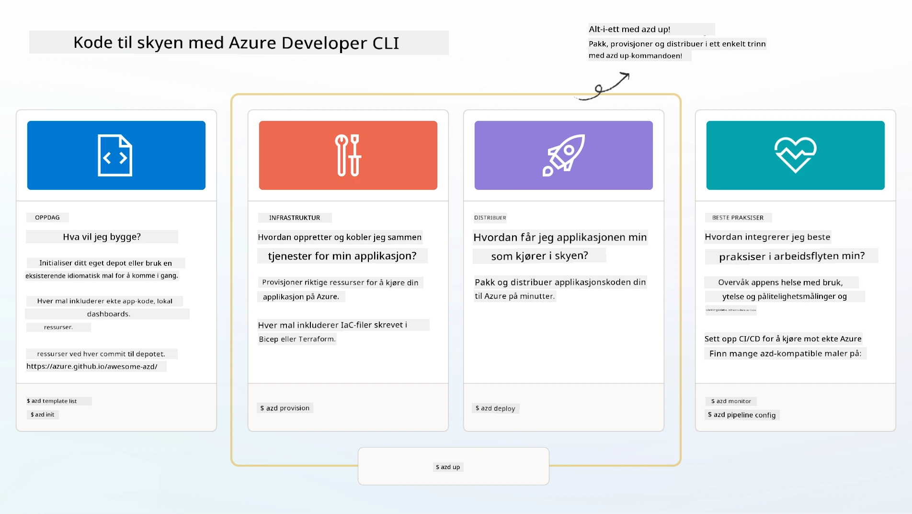

# 1. Velg en mal

!!! tip "ETTER DENNE MODULEN VIL DU KUNNE"

    - [ ] Beskrive hva AZD-maler er
    - [ ] Oppdage og bruke AZD-maler for AI
    - [ ] Komme i gang med AI Agents-malen
    - [ ] **Lab 1:** AZD Quickstart med GitHub Codespaces

---

## 1. En byggeanalogi

Å bygge en moderne AI-applikasjon klar for bedrifter _fra bunnen av_ kan være skremmende. Det er litt som å bygge ditt nye hjem helt alene, murstein for murstein. Ja, det kan gjøres! Men det er ikke den mest effektive måten å oppnå ønsket sluttresultat på!

I stedet starter vi ofte med en eksisterende _designplan_, og jobber med en arkitekt for å tilpasse den til våre personlige krav. Og det er akkurat denne tilnærmingen man bør ta når man bygger intelligente applikasjoner. Først finner du en god designarkitektur som passer problemområdet ditt. Så jobber du med en løsningsarkitekt for å tilpasse og utvikle løsningen for ditt spesifikke scenario.

Men hvor finner vi disse designplanene? Og hvordan finner vi en arkitekt som er villig til å lære oss hvordan vi kan tilpasse og distribuere disse planene på egen hånd? I denne workshopen svarer vi på disse spørsmålene ved å introdusere deg for tre teknologier:

1. [Azure Developer CLI](https://aka.ms/azd) - et åpen kildekode-verktøy som akselererer utviklerreisen fra lokal utvikling (bygging) til skyutrulling (deploy).
1. [Microsoft Foundry Templates](https://ai.azure.com/templates) - standardiserte åpen kildekode-repositorier som inneholder eksempel-kode, infrastruktur og konfigurasjonsfiler for utrulling av AI-løsningsarkitektur.
1. [GitHub Copilot Agent Mode](https://code.visualstudio.com/docs/copilot/chat/chat-agent-mode) - en kodeagent basert på Azure-kunnskap, som kan veilede oss i navigering i kodebasen og gjøre endringer – ved hjelp av naturlig språk.

Med disse verktøyene i hånden kan vi nå _oppdage_ riktig mal, _rulle ut_ den for å validere at den fungerer, og _tilpasse_ den for å passe våre spesifikke scenarier. La oss dykke inn og lære hvordan disse fungerer.


---

## 2. Azure Developer CLI

[Azure Developer CLI](https://learn.microsoft.com/en-us/azure/developer/azure-developer-cli/) (eller `azd`) er et åpen kildekode kommandolinjeverktøy som kan fremskynde reisen fra kode til sky med et sett av utviklervennlige kommandoer som fungerer konsekvent på tvers av IDE (utvikling) og CI/CD (devops) miljøer.

Med `azd` kan distribusjonsreisen din være så enkel som:

- `azd init` - Initialiserer et nytt AI-prosjekt fra en eksisterende AZD-mal.
- `azd up` - Provisionerer infrastruktur og distribuerer applikasjonen din i ett trinn.
- `azd monitor` - Få sanntidsovervåking og diagnostikk for din deployerte applikasjon.
- `azd pipeline config` - Sett opp CI/CD pipelines for å automatisere distribusjon til Azure.

**🎯 | ØVELSE**: <br/> Utforsk `azd` kommandolinjeverktøyet i ditt GitHub Codespaces-miljø nå. Start med å skrive denne kommandoen for å se hva verktøyet kan gjøre:

```bash title="" linenums="0"
azd help
```



---

## 3. AZD-malen

For at `azd` skal kunne gjøre dette, må det vite hvilken infrastruktur som skal provisioneres, hvilke konfigurasjonsinnstillinger som skal håndheves, og hvilken applikasjon som skal distribueres. Her kommer [AZD-maler](https://learn.microsoft.com/en-us/azure/developer/azure-developer-cli/azd-templates?tabs=csharp) inn i bildet.

AZD-maler er åpne kildekode-repositorier som kombinerer eksempel-kode med infrastruktur- og konfigurasjonsfiler som kreves for å deployere løsningsarkitekturen.
Ved å bruke en _Infrastructure-as-Code_ (IaC) tilnærming, tillater de at malens ressursdefinisjoner og konfigurasjonsinnstillinger versjonskontrolleres (akkurat som appens kildekode) - noe som skaper gjenbrukbare og konsistente arbeidsflyter på tvers av brukere av prosjektet.

Når du skal opprette eller gjenbruke en AZD-mal for _ditt_ scenario, bør du vurdere disse spørsmålene:

1. Hva bygger du? → Finnes det en mal med startkode for det scenarioet?
1. Hvordan er løsningen din arkitektert? → Finnes det en mal med nødvendige ressurser?
1. Hvordan deployeres løsningen din? → Tenk `azd deploy` med pre/post-prosessering hooks!
1. Hvordan kan du optimalisere den ytterligere? → Tenk innebygd overvåking og automatiseringspipeliner!

**🎯 | ØVELSE**: <br/> 
Besøk [Awesome AZD](https://azure.github.io/awesome-azd/) galleriet og bruk filtrene til å utforske de 250+ malene som finnes tilgjengelig. Se om du kan finne en som samsvarer med _dine_ scenario-krav.



---

## 4. AI App-maler

For AI-drevne applikasjoner tilbyr Microsoft spesialiserte maler som inkluderer **Microsoft Foundry** og **Foundry Agents**. Disse malene akselererer veien til å bygge intelligente, produksjonsklare applikasjoner.

### Microsoft Foundry & Foundry Agents-maler

Velg en mal nedenfor for deployering. Hver mal er tilgjengelig på [Awesome AZD](https://azure.github.io/awesome-azd/) og kan initieres med en enkelt kommando.

| Mal | Beskrivelse | Deploy-kommando |
|----------|-------------|----------------|
| **[AI Chat med RAG](https://azure.github.io/awesome-azd/?tags=ai&tags=rag)** | Chat-applikasjon med Retrieval Augmented Generation ved hjelp av Microsoft Foundry | `azd init -t azure-samples/azure-search-openai-demo` |
| **[Foundry Agent Service Starter](https://azure.github.io/awesome-azd/?tags=ai&tags=agents)** | Bygg AI-agenter med Foundry Agents for autonom oppgaveutførelse | `azd init -t azure-samples/foundry-agent-service-starter` |
| **[Multi-Agent Orchestration](https://azure.github.io/awesome-azd/?tags=ai&tags=agents)** | Koordiner flere Foundry Agents for komplekse arbeidsflyter | `azd init -t azure-samples/multi-agent-orchestration` |
| **[AI Document Intelligence](https://azure.github.io/awesome-azd/?tags=ai&tags=document)** | Ekstraher og analyser dokumenter med Microsoft Foundry-modeller | `azd init -t azure-samples/ai-document-processing` |
| **[Conversational AI Bot](https://azure.github.io/awesome-azd/?tags=ai&tags=bot)** | Bygg intelligente chatboter med Microsoft Foundry-integrasjon | `azd init -t azure-samples/ai-chat-protocol` |
| **[AI Image Generation](https://azure.github.io/awesome-azd/?tags=ai&tags=dalle)** | Generer bilder med DALL-E via Microsoft Foundry | `azd init -t azure-samples/ai-image-generation` |
| **[Semantic Kernel Agent](https://azure.github.io/awesome-azd/?tags=ai&tags=semantic-kernel)** | AI-agenter som bruker Semantic Kernel med Foundry Agents | `azd init -t azure-samples/semantic-kernel-agent` |
| **[AutoGen Multi-Agent](https://azure.github.io/awesome-azd/?tags=ai&tags=autogen)** | Multi-agent systemer som bruker AutoGen-rammeverket | `azd init -t azure-samples/autogen-multi-agent` |

### Kom i gang

1. **Utforsk maler**: Besøk [https://azure.github.io/awesome-azd/](https://azure.github.io/awesome-azd/) og filtrer etter `AI`, `Agents` eller `Microsoft Foundry`
2. **Velg din mal**: Velg en som passer ditt brukstilfelle
3. **Initier**: Kjør `azd init`-kommandoen for malen du har valgt
4. **Deploy**: Kjør `azd up` for å provisionere og deployere

**🎯 | ØVELSE**: <br/>
Velg en av malene ovenfor basert på ditt scenario:

- **Bygger du en chatbot?** → Start med **AI Chat med RAG** eller **Conversational AI Bot**
- **Trenger du autonome agenter?** → Prøv **Foundry Agent Service Starter** eller **Multi-Agent Orchestration**
- **Behandler du dokumenter?** → Bruk **AI Document Intelligence**
- **Ønsker du AI-kodehjelp?** → Utforsk **Semantic Kernel Agent** eller **AutoGen Multi-Agent**

```bash title="Example: Deploy the AI Chat with RAG template" linenums="0"
azd init -t azure-samples/azure-search-openai-demo
azd up
```

!!! info "Utforsk flere maler"
    [Awesome AZD Gallery](https://azure.github.io/awesome-azd/) inneholder 250+ maler. Bruk filtrene for å finne maler som passer dine spesifikke krav for språk, rammeverk og Azure-tjenester.

---

<!-- CO-OP TRANSLATOR DISCLAIMER START -->
**Ansvarsfraskrivelse**:
Dette dokumentet er oversatt ved hjelp av AI-oversettelsestjenesten [Co-op Translator](https://github.com/Azure/co-op-translator). Selv om vi streber etter nøyaktighet, vennligst vær oppmerksom på at automatiske oversettelser kan inneholde feil eller unøyaktigheter. Det opprinnelige dokumentet på originalspråket bør anses som den autoritative kilden. For kritisk informasjon anbefales profesjonell menneskelig oversettelse. Vi er ikke ansvarlige for eventuelle misforståelser eller feiltolkninger som oppstår ved bruk av denne oversettelsen.
<!-- CO-OP TRANSLATOR DISCLAIMER END -->