<!--
CO_OP_TRANSLATOR_METADATA:
{
  "original_hash": "7816c6ec50c694c331e7c6092371be4d",
  "translation_date": "2025-09-24T22:48:40+00:00",
  "source_file": "workshop/docs/instructions/2-Validate-AI-Template.md",
  "language_code": "no"
}
-->
# 2. Validere en mal

!!! tip "VED SLUTTEN AV DENNE MODULEN VIL DU KUNNE"

    - [ ] Analysere AI-løsningsarkitekturen
    - [ ] Forstå AZD-deployeringsarbeidsflyten
    - [ ] Bruke GitHub Copilot for hjelp med AZD-bruk
    - [ ] **Lab 2:** Deployere og validere AI Agents-malen

---

## 1. Introduksjon

[Azure Developer CLI](https://learn.microsoft.com/en-us/azure/developer/azure-developer-cli/) eller `azd` er et åpen kildekode-kommandolinjeverktøy som forenkler utviklerarbeidsflyten når man bygger og deployerer applikasjoner til Azure.

[AZD-maler](https://learn.microsoft.com/azure/developer/azure-developer-cli/azd-templates) er standardiserte repositorier som inkluderer eksempelapplikasjonskode, _infrastruktur som kode_-ressurser og `azd`-konfigurasjonsfiler for en helhetlig løsningsarkitektur. Å klargjøre infrastrukturen blir så enkelt som en `azd provision`-kommando - mens `azd up` lar deg klargjøre infrastrukturen **og** deployere applikasjonen din i én operasjon!

Som et resultat kan du raskt komme i gang med applikasjonsutviklingen ved å finne den riktige _AZD Starter-malen_ som passer best til dine applikasjons- og infrastrukturbehov - og deretter tilpasse repositoriet til dine scenario-krav.

Før vi begynner, la oss sørge for at du har Azure Developer CLI installert.

1. Åpne en VS Code-terminal og skriv inn denne kommandoen:

      ```bash title="" linenums="0"
      azd version
      ```

1. Du bør se noe som dette!

      ```bash title="" linenums="0"
      azd version 1.19.0 (commit b3d68cea969b2bfbaa7b7fa289424428edb93e97)
      ```

**Du er nå klar til å velge og deployere en mal med azd**

---

## 2. Valg av mal

Azure AI Foundry-plattformen kommer med et [sett anbefalte AZD-maler](https://learn.microsoft.com/en-us/azure/ai-foundry/how-to/develop/ai-template-get-started) som dekker populære løsningsscenarier som _automatisering av multi-agent arbeidsflyt_ og _multi-modal innholdsbehandling_. Du kan også oppdage disse malene ved å besøke Azure AI Foundry-portalen.

1. Besøk [https://ai.azure.com/templates](https://ai.azure.com/templates)
1. Logg inn på Azure AI Foundry-portalen når du blir bedt om det - du vil se noe som dette.

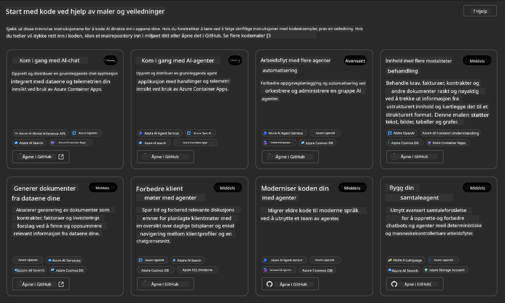

**Basic**-alternativene er dine startmaler:

1. [ ] [Kom i gang med AI Chat](https://github.com/Azure-Samples/get-started-with-ai-chat) som deployerer en enkel chat-applikasjon _med dine data_ til Azure Container Apps. Bruk denne for å utforske et grunnleggende AI-chatbot-scenario.
1. [X] [Kom i gang med AI Agents](https://github.com/Azure-Samples/get-started-with-ai-agents) som også deployerer en standard AI-agent (med Azure AI Agent Service). Bruk denne for å bli kjent med agentbaserte AI-løsninger som involverer verktøy og modeller.

Besøk den andre lenken i en ny nettleserfane (eller klikk `Open in GitHub` for det relaterte kortet). Du bør se repositoriet for denne AZD-malen. Ta et minutt til å utforske README. Applikasjonsarkitekturen ser slik ut:

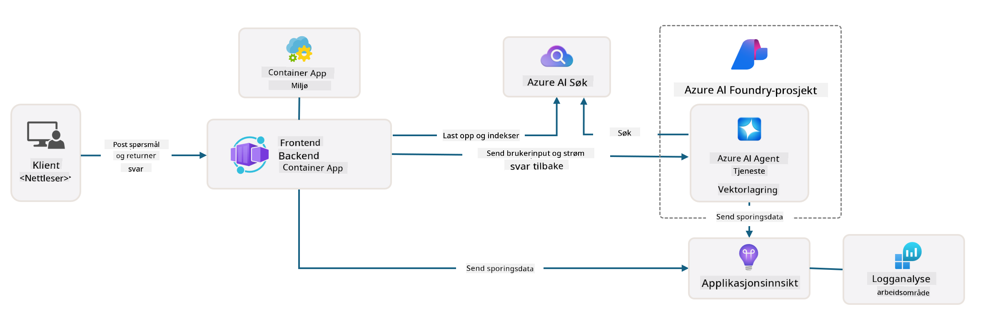

---

## 3. Aktivering av mal

La oss prøve å deployere denne malen og sørge for at den er gyldig. Vi følger retningslinjene i [Kom i gang](https://github.com/Azure-Samples/get-started-with-ai-agents?tab=readme-ov-file#getting-started)-seksjonen.

1. Klikk [denne lenken](https://github.com/codespaces/new/Azure-Samples/get-started-with-ai-agents) - bekreft standardhandlingen for å `Create codespace`
1. Dette åpner en ny nettleserfane - vent til GitHub Codespaces-økten er ferdig lastet
1. Åpne VS Code-terminalen i Codespaces - skriv inn følgende kommando:

   ```bash title="" linenums="0"
   azd up
   ```

Fullfør arbeidsflyttrinnene som dette vil utløse:

1. Du blir bedt om å logge inn på Azure - følg instruksjonene for autentisering
1. Skriv inn et unikt miljønavn for deg - f.eks. brukte jeg `nitya-mshack-azd`
1. Dette vil opprette en `.azure/`-mappe - du vil se en undermappe med miljønavnet
1. Du blir bedt om å velge et abonnementsnavn - velg standarden
1. Du blir bedt om å angi en plassering - bruk `East US 2`

Nå venter du på at klargjøringen skal fullføres. **Dette tar 10-15 minutter**

1. Når det er ferdig, vil konsollen din vise en SUKSESS-melding som dette:
      ```bash title="" linenums="0"
      SUCCESS: Your up workflow to provision and deploy to Azure completed in 10 minutes 17 seconds.
      ```
1. Din Azure Portal vil nå ha en klargjort ressursgruppe med det miljønavnet:

      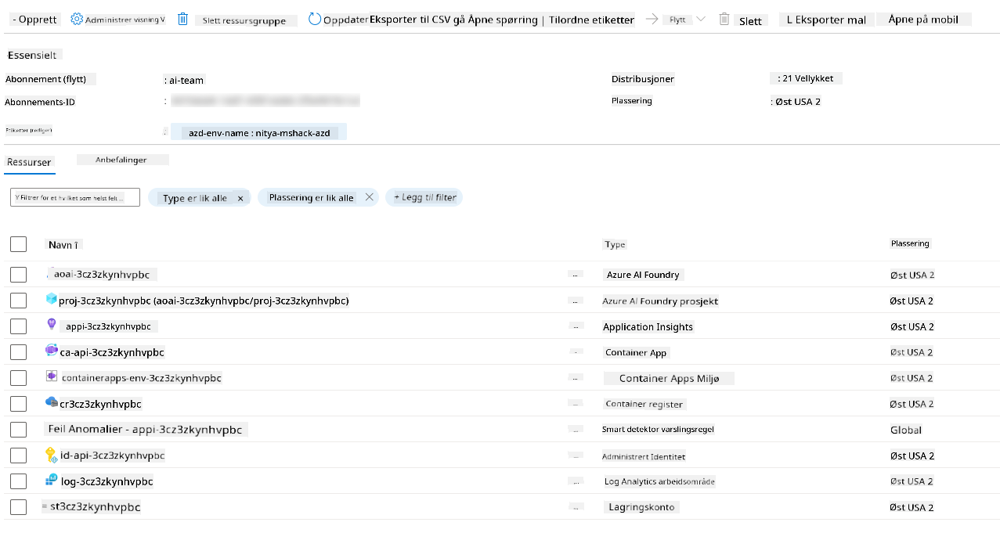

1. **Du er nå klar til å validere den deployerte infrastrukturen og applikasjonen**.

---

## 4. Validering av mal

1. Besøk Azure Portal [Resource Groups](https://portal.azure.com/#browse/resourcegroups)-siden - logg inn når du blir bedt om det
1. Klikk på RG for ditt miljønavn - du ser siden ovenfor

      - klikk på Azure Container Apps-ressursen
      - klikk på applikasjons-URL-en i _Essentials_-seksjonen (øverst til høyre)

1. Du bør se en hostet applikasjons front-end UI som dette:

   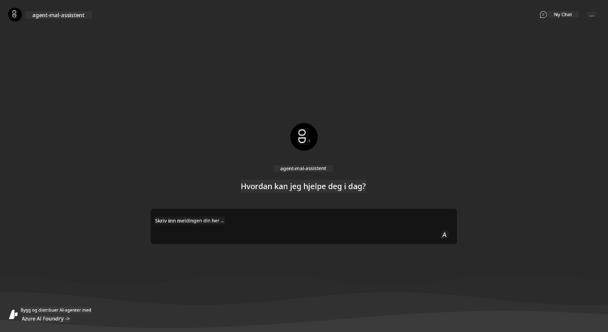

1. Prøv å stille et par [eksempelspørsmål](https://github.com/Azure-Samples/get-started-with-ai-agents/blob/main/docs/sample_questions.md)

      1. Spør: ```Hva er hovedstaden i Frankrike?``` 
      1. Spør: ```Hva er det beste teltet under $200 for to personer, og hvilke funksjoner har det?```

1. Du bør få svar som ligner på det som vises nedenfor. _Men hvordan fungerer dette?_ 

      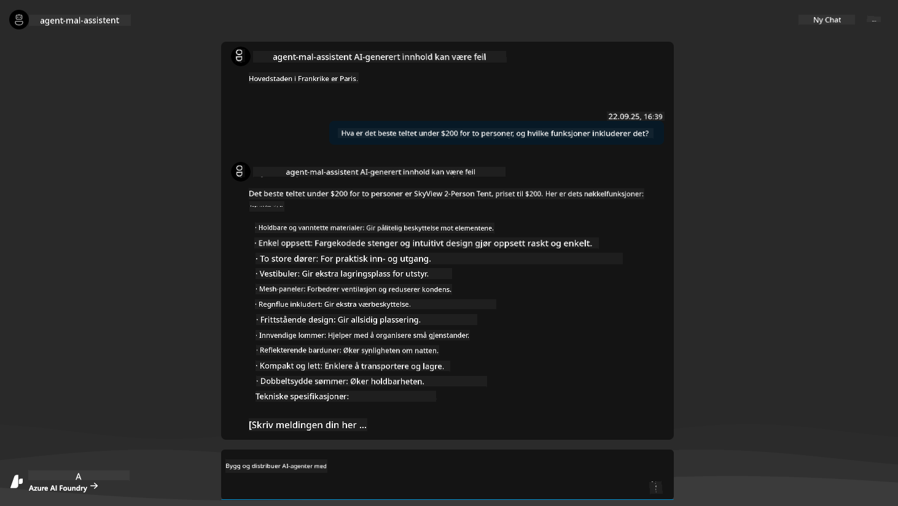

---

## 5. Validering av agent

Azure Container App deployerer en endepunkt som kobler til AI-agenten klargjort i Azure AI Foundry-prosjektet for denne malen. La oss se nærmere på hva det betyr.

1. Gå tilbake til Azure Portal _Overview_-siden for ressursgruppen din

1. Klikk på `Azure AI Foundry`-ressursen i listen

1. Du bør se dette. Klikk på `Go to Azure AI Foundry Portal`-knappen. 
   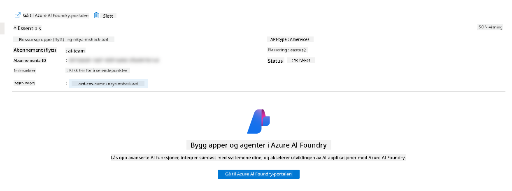

1. Du bør se Foundry-prosjektsiden for AI-applikasjonen din
   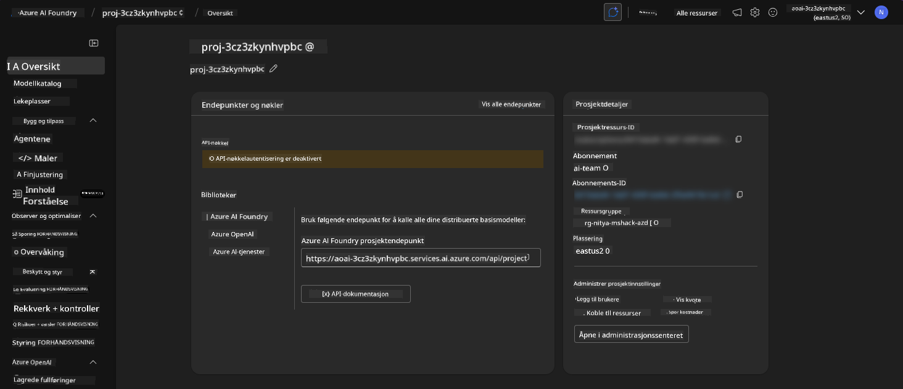

1. Klikk på `Agents` - du ser standardagenten klargjort i prosjektet ditt
   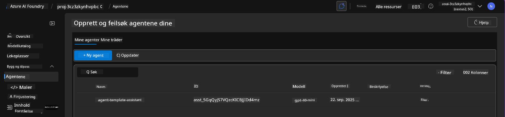

1. Velg den - og du ser agentdetaljene. Merk følgende:

      - Agenten bruker File Search som standard (alltid)
      - Agentens `Knowledge` indikerer at den har 32 filer lastet opp (for filsøking)
      

1. Se etter `Data+indexes`-alternativet i venstre meny og klikk for detaljer. 

      - Du bør se de 32 datafilene lastet opp for kunnskap.
      - Disse vil tilsvare de 12 kundefilene og 20 produktfilene under `src/files` 
      

**Du har validert agentens operasjon!** 

1. Agentens svar er basert på kunnskapen i disse filene. 
1. Du kan nå stille spørsmål relatert til disse dataene og få relevante svar.
1. Eksempel: `customer_info_10.json` beskriver de 3 kjøpene gjort av "Amanda Perez"

Gå tilbake til nettleserfanen med Container App-endepunktet og spør: `Hvilke produkter eier Amanda Perez?`. Du bør se noe som dette:

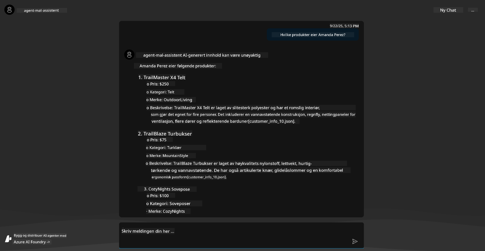

---

## 6. Agent Playground

La oss bygge litt mer intuisjon for kapasitetene til Azure AI Foundry, ved å teste agenten i Agents Playground. 

1. Gå tilbake til `Agents`-siden i Azure AI Foundry - velg standardagenten
1. Klikk på `Try in Playground`-alternativet - du bør få en Playground UI som dette
1. Still det samme spørsmålet: `Hvilke produkter eier Amanda Perez?`

    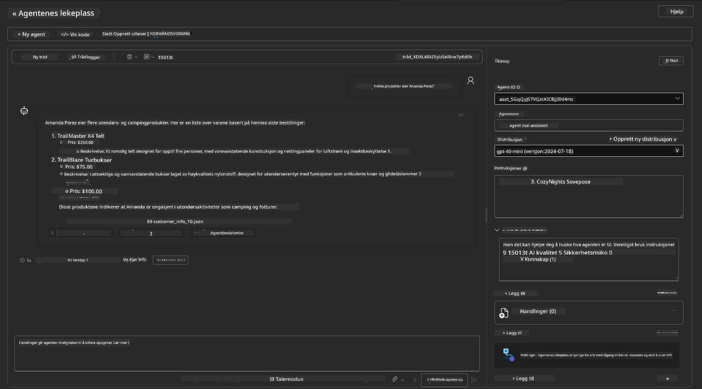

Du får det samme (eller lignende) svar - men du får også tilleggsinformasjon som du kan bruke til å forstå kvaliteten, kostnaden og ytelsen til din agentbaserte app. For eksempel:

1. Merk at svaret viser datafiler som brukes til å "grunnlegge" svaret
1. Hold musepekeren over noen av disse filnavnene - samsvarer dataene med spørsmålet ditt og det viste svaret?

Du ser også en _stats_-rad under svaret. 

1. Hold musepekeren over en hvilken som helst metrikk - f.eks. Safety. Du ser noe som dette
1. Samsvarer den vurderte rangeringen med din intuisjon for sikkerhetsnivået til svaret?

      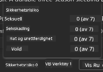

---

## 7. Innebygd observabilitet

Observabilitet handler om å instrumentere applikasjonen din for å generere data som kan brukes til å forstå, feilsøke og optimalisere dens operasjoner. For å få en følelse av dette:

1. Klikk på `View Run Info`-knappen - du bør se denne visningen. Dette er et eksempel på [Agent tracing](https://learn.microsoft.com/en-us/azure/ai-foundry/how-to/develop/trace-agents-sdk#view-trace-results-in-the-azure-ai-foundry-agents-playground) i aksjon. _Du kan også få denne visningen ved å klikke Thread Logs i toppmenyen_.

   - Få en følelse av kjøretrinnene og verktøyene som er engasjert av agenten
   - Forstå totalt antall tokens (vs. bruk av output tokens) for svaret
   - Forstå latensen og hvor tiden brukes i utførelsen

      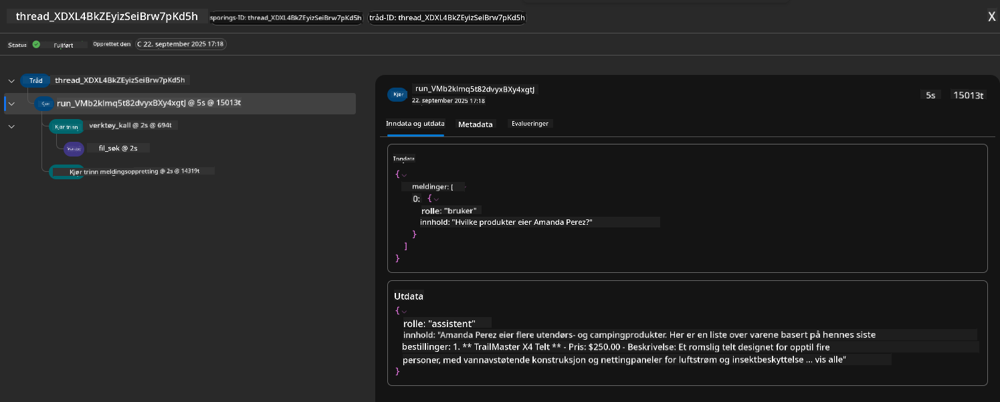

1. Klikk på `Metadata`-fanen for å se ytterligere attributter for kjøringen, som kan gi nyttig kontekst for feilsøking senere.   

      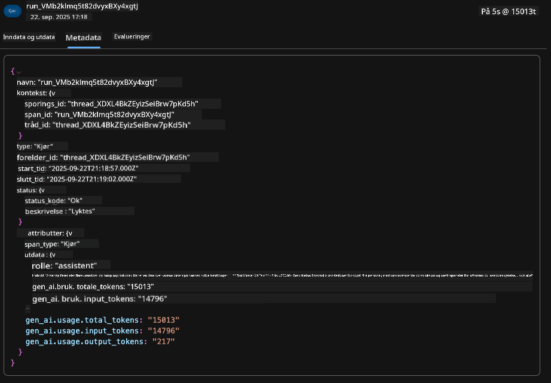

1. Klikk på `Evaluations`-fanen for å se automatiske vurderinger gjort på agentens svar. Disse inkluderer sikkerhetsvurderinger (f.eks. Selvskading) og agentspesifikke vurderinger (f.eks. Intent resolution, Task adherence).

      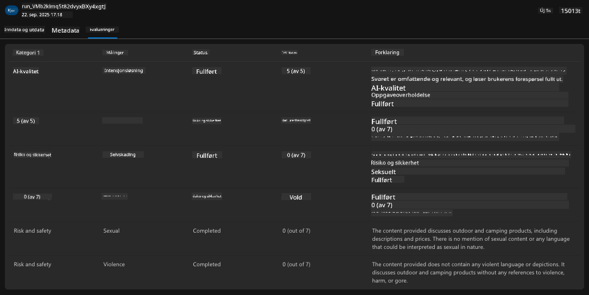

1. Sist men ikke minst, klikk på `Monitoring`-fanen i sidebarmenyen.

      - Velg `Resource usage`-fanen på den viste siden - og se på metrikken.
      - Spor applikasjonsbruk i form av kostnader (tokens) og belastning (forespørsler).
      - Spor applikasjonslatens til første byte (inputbehandling) og siste byte (output).

      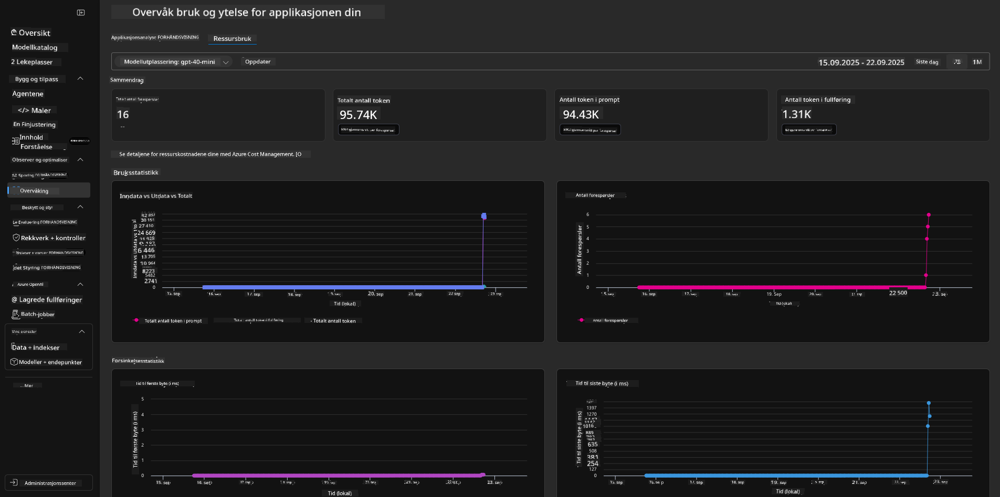

---

## 8. Miljøvariabler

Så langt har vi gått gjennom deployeringen i nettleseren - og validert at infrastrukturen vår er klargjort og applikasjonen er operativ. Men for å jobbe med applikasjonen _kode-først_, må vi konfigurere vårt lokale utviklingsmiljø med de relevante variablene som kreves for å jobbe med disse ressursene. Bruk av `azd` gjør dette enkelt.

1. Azure Developer CLI [bruker miljøvariabler](https://learn.microsoft.com/en-us/azure/developer/azure-developer-cli/manage-environment-variables?tabs=bash) for å lagre og administrere konfigurasjonsinnstillinger for applikasjonsdeployeringer.

1. Miljøvariabler lagres i `.azure/<env-name>/.env` - dette avgrenser dem til miljøet `env-name` som ble brukt under deployeringen og hjelper deg med å isolere miljøer mellom forskjellige deployeringsmål i samme repo.

1. Miljøvariabler lastes automatisk av `azd`-kommandoen hver gang den utfører en spesifikk kommando (f.eks. `azd up`). Merk at `azd` ikke automatisk leser _OS-nivå_ miljøvariabler (f.eks. satt i shell) - bruk i stedet `azd set env` og `azd get env` for å overføre informasjon innenfor skript.

La oss prøve noen kommandoer:

1. Hent alle miljøvariablene som er satt for `azd` i dette miljøet:

      ```bash title="" linenums="0"
      azd env get-values
      ```
      
      Du ser noe som dette:

      ```bash title="" linenums="0"
      AZURE_AI_AGENT_DEPLOYMENT_NAME="gpt-4o-mini"
      AZURE_AI_AGENT_NAME="agent-template-assistant"
      AZURE_AI_EMBED_DEPLOYMENT_NAME="text-embedding-3-small"
      AZURE_AI_EMBED_DIMENSIONS=100
      ...
      ```

1. Hent en spesifikk verdi - f.eks. Jeg vil vite om vi har satt verdien `AZURE_AI_AGENT_MODEL_NAME`

      ```bash title="" linenums="0"
      azd env get-value AZURE_AI_AGENT_MODEL_NAME 
      ```
      
      Du ser noe som dette - den ble ikke satt som standard!

      ```bash title="" linenums="0"
      ERROR: key 'AZURE_AI_AGENT_MODEL_NAME' not found in the environment values
      ```

1. Sett en ny miljøvariabel for `azd`. Her oppdaterer vi agentmodellnavnet. _Merk: eventuelle endringer som gjøres vil umiddelbart bli reflektert i `.azure/<env-name>/.env`-filen.

      ```bash title="" linenums="0"
      azd env set AZURE_AI_AGENT_MODEL_NAME gpt-4.1
      azd env set AZURE_AI_AGENT_MODEL_VERSION 2025-04-14
      azd env set AZURE_AI_AGENT_DEPLOYMENT_CAPACITY 150
      ```

      Nå bør vi finne at verdien er satt:

      ```bash title="" linenums="0"
      azd env get-value AZURE_AI_AGENT_MODEL_NAME 
      ```

1. Merk at noen ressurser er vedvarende (f.eks. modelldeployeringer) og vil kreve mer enn bare en `azd up` for å tvinge en ny deployering. La oss prøve å rive ned den opprinnelige deployeringen og deployere på nytt med endrede miljøvariabler.

1. **Oppdater** Hvis du tidligere har deployert infrastruktur ved hjelp av en azd-mal - kan du _oppdatere_ tilstanden til dine lokale miljøvariabler basert på den nåværende tilstanden til din Azure-deployering ved å bruke denne kommandoen:
      ```bash title="" linenums="0"
      azd env refresh
      ```

      Dette er en kraftig måte å _synkronisere_ miljøvariabler på tvers av to eller flere lokale utviklingsmiljøer (f.eks. et team med flere utviklere) - slik at den distribuerte infrastrukturen fungerer som sannhetskilde for tilstanden til miljøvariablene. Teammedlemmer kan enkelt _oppdatere_ variablene for å komme tilbake i synk.

---

## 9. Gratulerer 🏆

Du har nettopp fullført en helhetlig arbeidsflyt hvor du:

- [X] Valgte AZD-malen du ønsket å bruke
- [X] Startet malen med GitHub Codespaces
- [X] Distribuerte malen og bekreftet at den fungerer

---

