# 2. Valider en mal

> Validert mot `azd 1.23.12` i mars 2026.

!!! tip "ETTER DETTE MODULEN VIL DU KUNNE"

    - [ ] Analysere AI-løsningsarkitekturen
    - [ ] Forstå AZD Deploy-arbeidsflyten
    - [ ] Bruke GitHub Copilot for å få hjelp med AZD-bruk
    - [ ] **Lab 2:** Distribuere og validere AI Agents-malen

---


## 1. Introduksjon

[Azure Developer CLI](https://learn.microsoft.com/en-us/azure/developer/azure-developer-cli/) eller `azd` er et open-source kommandolinjeverktøy som forenkler utviklerens arbeidsflyt når man bygger og distribuerer applikasjoner til Azure.

[AZD-maler](https://learn.microsoft.com/azure/developer/azure-developer-cli/azd-templates) er standardiserte lagre som inkluderer eksempelapplikasjonskode, _infrastruktur-som-kode_-ressurser, og `azd` konfigurasjonsfiler for en helhetlig løsningsarkitektur. Å provisjonere infrastrukturen blir så enkelt som en `azd provision`-kommando - mens bruk av `azd up` lar deg provisjonere infrastruktur **og** distribuere applikasjonen din i ett slag!

Resultatet er at du kan sparke i gang applikasjonsutviklingsprosessen bare ved å finne den riktige _AZD Starter-malen_ som ligger nærmest dine behov for applikasjon og infrastruktur - og deretter tilpasse lageret for å passe scenariokravene dine.

Før vi begynner, la oss sørge for at du har Azure Developer CLI installert.

1. Åpne en VS Code-terminal og skriv denne kommandoen:

      ```bash title="" linenums="0"
      azd version
      ```

1. Du skal se noe som dette!

      ```bash title="" linenums="0"
      azd version 1.23.12 (commit <current-build>)
      ```

**Du er nå klar til å velge og distribuere en mal med azd**

---

## 2. Malvalg

Microsoft Foundry-plattformen leveres med et [sett anbefalte AZD-maler](https://learn.microsoft.com/en-us/azure/ai-foundry/how-to/develop/ai-template-get-started) som dekker populære løsningsscenarier som _multi-agent arbeidsflyt automatisering_ og _multimodal innholdsbehandling_. Du kan også finne disse malene ved å besøke Microsoft Foundry-portalen.

1. Besøk [https://ai.azure.com/templates](https://ai.azure.com/templates)
1. Logg inn på Microsoft Foundry-portalen når du blir bedt om det – du vil se noe som dette.

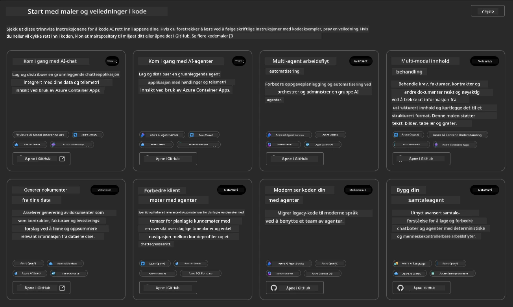


**Basis**-alternativene er dine startmaler:

1. [ ] [Kom i gang med AI Chat](https://github.com/Azure-Samples/get-started-with-ai-chat) som distribuerer en enkel chatteapplikasjon _med dine data_ til Azure Container Apps. Bruk denne for å utforske et grunnleggende AI-chatbotscenario.
1. [X] [Kom i gang med AI Agents](https://github.com/Azure-Samples/get-started-with-ai-agents) som også distribuerer en standard AI-agent (med Foundry Agents). Bruk denne for å bli kjent med agentbaserte AI-løsninger som involverer verktøy og modeller.

Besøk den andre lenken i en ny nettleserfane (eller klikk `Open in GitHub` på det aktuelle kortet). Du skal se lageret for denne AZD-malen. Ta et øyeblikk til å utforske README-filen. Applikasjonsarkitekturen ser slik ut:

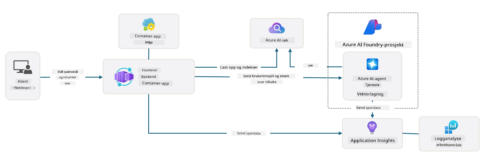

---

## 3. Aktivering av mal

La oss prøve å distribuere denne malen og sørge for at den er gyldig. Vi følger retningslinjene i [Kom i gang](https://github.com/Azure-Samples/get-started-with-ai-agents?tab=readme-ov-file#getting-started)-seksjonen.

1. Velg et arbeidsmiljø for malens lager:

      - **GitHub Codespaces**: Klikk på [denne lenken](https://github.com/codespaces/new/Azure-Samples/get-started-with-ai-agents) og bekreft `Create codespace`
      - **Lokal kloning eller dev-container**: Klon `Azure-Samples/get-started-with-ai-agents` og åpne det i VS Code

1. Vent til VS Code-terminalen er klar, og skriv deretter denne kommandoen:

   ```bash title="" linenums="0"
   azd up
   ```

Fullfør arbeidsflytstegene som denne vil starte:

1. Du blir bedt om å logge inn til Azure – følg instruksjonene for autentisering
1. Skriv inn et unikt miljønavn for deg – f.eks. brukte jeg `nitya-mshack-azd`
1. Dette vil opprette en `.azure/`-mappe – du vil se en undermappe med miljønavnet
1. Du blir bedt om å velge et abonnement – velg standard
1. Du blir bedt om et sted – bruk `East US 2`

Nå venter du på at provisjoneringen skal fullføres. **Dette tar 10-15 minutter**

1. Når det er ferdig, vil konsollen din vise en SUKSESS-melding som denne:
      ```bash title="" linenums="0"
      SUCCESS: Your up workflow to provision and deploy to Azure completed in 10 minutes 17 seconds.
      ```
1. Azure-portalen din vil nå inneholde en provisjonert ressursgruppe med det miljønavnet:

      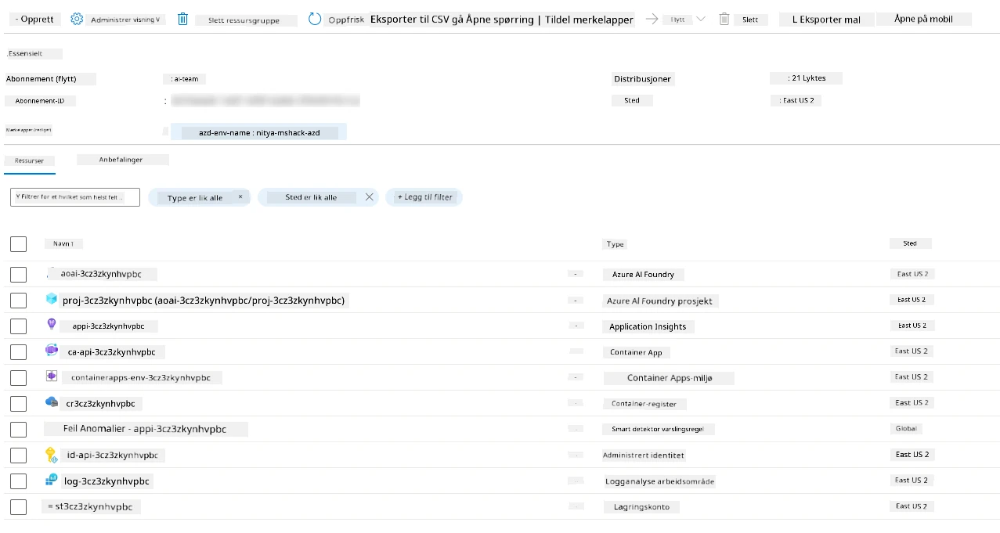

1. **Du er nå klar til å validere den distribuerte infrastrukturen og applikasjonen**.

---

## 4. Validering av mal

1. Gå til Azure Portal [Resource Groups](https://portal.azure.com/#browse/resourcegroups) siden – logg inn når du blir bedt om det
1. Klikk på ressursgruppen for miljønavnet ditt – du ser siden som ovenfor

      - klikk på Azure Container Apps-ressursen
      - klikk på Application Url i _Essentials_-seksjonen (øverst til høyre)

1. Du skal se en vert front-end UI som dette:

   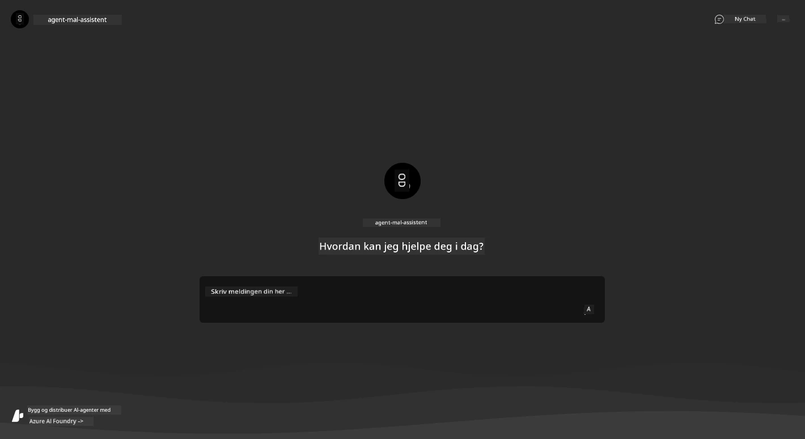

1. Prøv å stille et par [eksempelspørsmål](https://github.com/Azure-Samples/get-started-with-ai-agents/blob/main/docs/sample_questions.md)

      1. Spør: ```What is the capital of France?``` 
      1. Spør: ```What's the best tent under $200 for two people, and what features does it include?```

1. Du skal få svar som ligner på det som vises nedenfor. _Men hvordan fungerer dette?_ 

      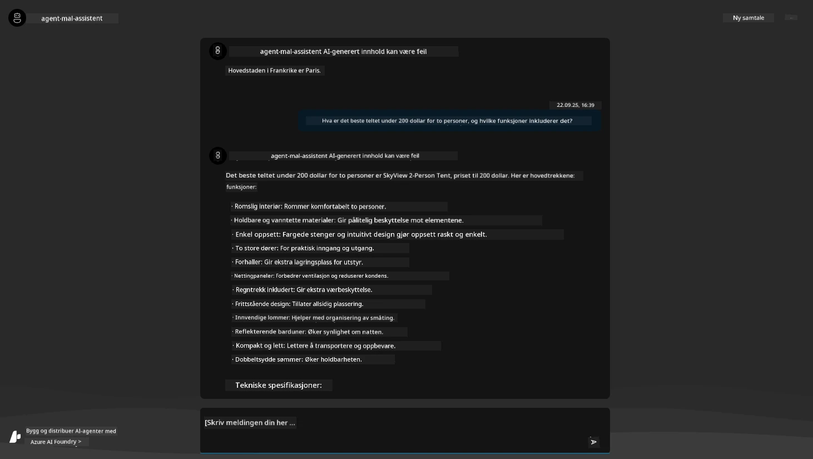

---

## 5. Validering av agent

Azure Container App distribuerer et endepunkt som kobler til AI-agenten som ble provisjonert i Microsoft Foundry-prosjektet for denne malen. La oss se nærmere på hva det betyr.

1. Gå tilbake til Azure Portals _Oversikt_-side for ressursgruppen din

1. Klikk på `Microsoft Foundry`-ressursen i listen

1. Du skal se dette. Klikk på knappen `Go to Microsoft Foundry Portal`.
   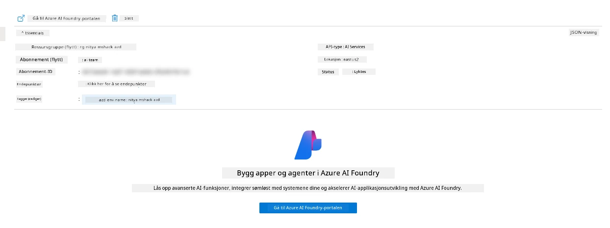

1. Du skal se Foundry-prosjektsiden for AI-applikasjonen din
   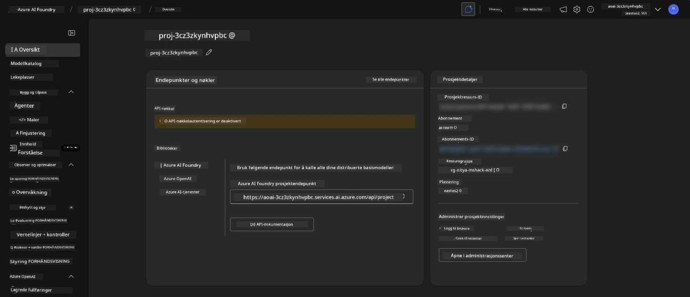

1. Klikk på `Agents` – du ser standardagenten som er provisjonert i prosjektet ditt
   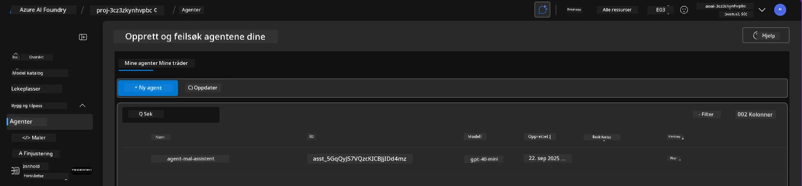

1. Velg den – du ser agentdetaljer. Merk følgende:

      - Agenten bruker Fil-søk som standard (alltid)
      - Agentens `Knowledge` indikerer at den har 32 filer lastet opp (for filsøk)
      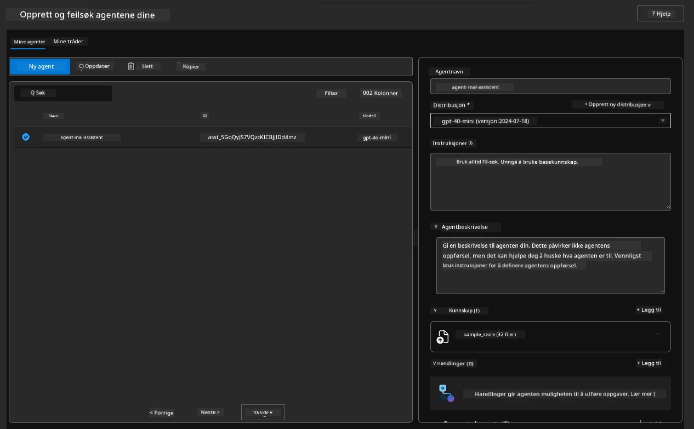

1. Se etter `Data+indexes`-valget i venstremenyen og klikk for detaljer.

      - Du skal se de 32 datafilene som er lastet opp for kunnskap.
      - Disse tilsvarer de 12 kundefilene og 20 produktfilene under `src/files`
      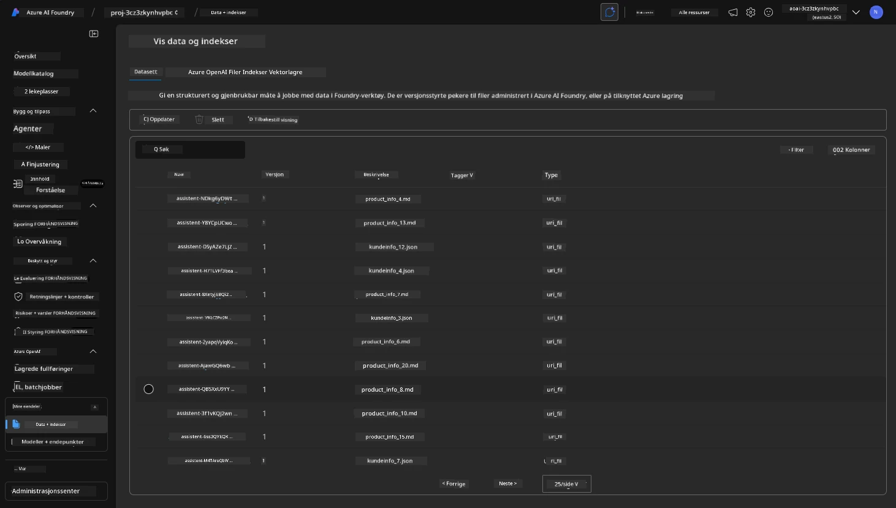

**Du har validert agentens operasjon!**

1. Agentens svar er basert på kunnskapen i disse filene.
1. Du kan nå stille spørsmål relatert til disse dataene og få forankrede svar.
1. Eksempel: `customer_info_10.json` beskriver de 3 kjøpene gjort av "Amanda Perez"

Gå tilbake til nettleserfanen med Container App-endepunktet og spør: `What products does Amanda Perez own?`. Du skal se noe som dette:

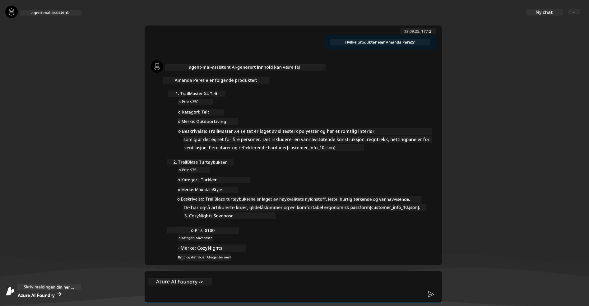

---

## 6. Agent-lekeplass

La oss bygge litt mer intuitiv forståelse av Microsoft Foundrys muligheter ved å ta agenten for en tur i Agents Playground.

1. Gå tilbake til `Agents`-siden i Microsoft Foundry – velg standardagenten
1. Klikk på `Try in Playground`-valget – du skal få en Playground UI som dette
1. Spør det samme spørsmålet: `What products does Amanda Perez own?`

    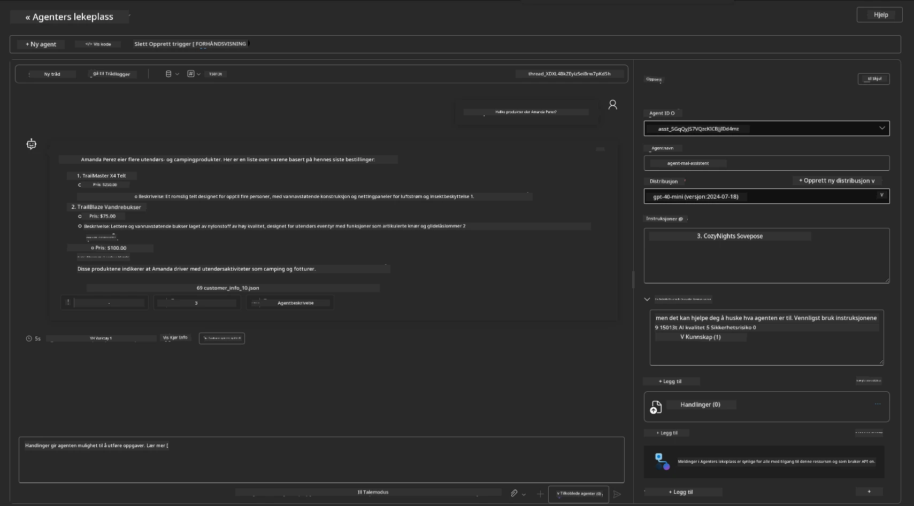

Du får samme (eller lignende) svar – men du får også tilleggsinformasjon som du kan bruke for å forstå kvalitet, kostnad og ytelse av din agentapp. For eksempel:

1. Merk at svaret viser til datafiler som ble brukt til å "forankre" svaret
1. Hold musepekeren over en av disse filetikettene – stemmer dataoverensstemmelsen med spørsmålet ditt og det viste svaret?

Du ser også en _statistikk_-rad under svaret.

1. Hold musepekeren over en hvilken som helst måling – f.eks. Safety. Du ser noe sånt som dette
1. Stemmer den vurderte ratingen med din intuisjon for sikkerhetsnivået for svaret?

      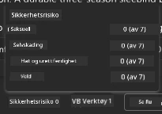

---

## 7. Innebygd observabilitet

Observabilitet handler om å instrumentere applikasjonen for å generere data som kan brukes til å forstå, feilsøke og optimalisere driften. For å få en følelse av dette:

1. Klikk på knappen `View Run Info` – du skal se denne visningen. Dette er et eksempel på [agent-sporing](https://learn.microsoft.com/en-us/azure/ai-foundry/how-to/develop/trace-agents-sdk#view-trace-results-in-the-azure-ai-foundry-agents-playground) i praksis. _Du kan også få denne visningen ved å klikke Thread Logs i toppmenyen_.

   - Få oversikt over kjøretrinn og verktøy engasjert av agenten
   - Forstå totalt antall Token (vs. brukte output-tokens) for svaret
   - Forstå ventetiden og hvor tiden brukes i utførelsen

      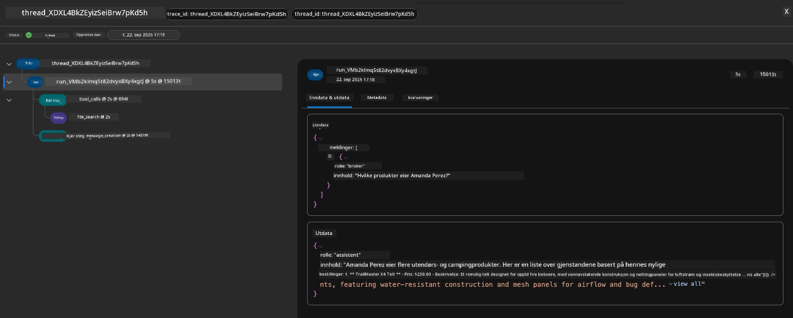

1. Klikk på fanen `Metadata` for å se ekstra attributter for kjøringen som kan gi nyttig kontekst for feilsøking senere.

      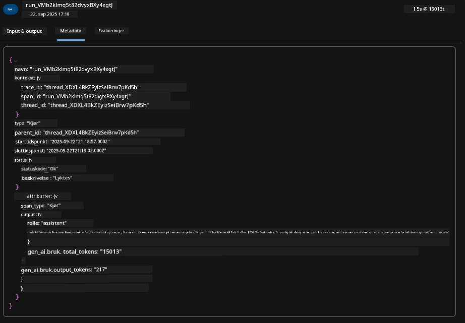


1. Klikk på fanen `Evaluations` for å se automatiske vurderinger gjort av agentens svar. Disse inkluderer sikkerhetsvurderinger (f.eks. selvskading) og agentspesifikke vurderinger (f.eks. intensjonsløsning, oppgaveetterlevelse).

      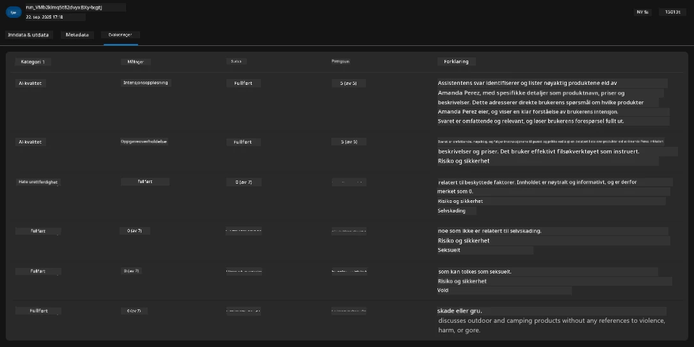

1. Til slutt, klikk på fanen `Monitoring` i sidemenyen.

      - Velg fanen `Resource usage` på siden som vises – og se på målingene.
      - Følg applikasjonsbruk i forhold til kostnad (tokens) og belastning (forespørsler).
      - Følg applikasjonslatens til første byte (inputbehandling) og siste byte (output).

      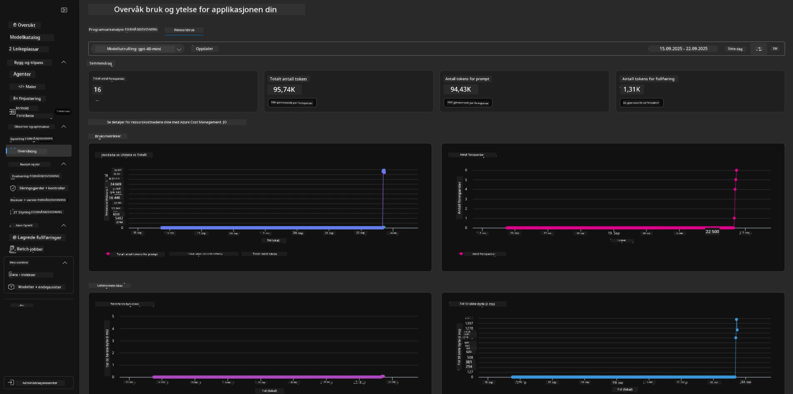

---

## 8. Miljøvariabler

Så langt har vi gått gjennom distribusjonen i nettleseren – og validert at infrastrukturen vår er provisjonert og applikasjonen er operativ. Men for å jobbe med applikasjonskoden _først_, må vi konfigurere vårt lokale utviklingsmiljø med relevante variabler som trengs for å jobbe med disse ressursene. Å bruke `azd` gjør dette enkelt.

1. Azure Developer CLI [bruker miljøvariabler](https://learn.microsoft.com/en-us/azure/developer/azure-developer-cli/manage-environment-variables?tabs=bash) for å lagre og administrere konfigurasjonsinnstillinger for applikasjonsdistribusjoner.

1. Miljøvariablene lagres i `.azure/<env-name>/.env` – dette begrenser dem til `env-name`-miljøet brukt under distribusjonen og hjelper deg med å isolere miljøer mellom forskjellige distribusjonsmål i samme repo.

1. Miljøvariabler lastes automatisk av `azd`-kommandoen hver gang den kjører en spesifikk kommando (f.eks. `azd up`). Merk at `azd` ikke automatisk leser _OS-nivå_ miljøvariabler (f.eks. satt i shell) – i stedet bruker du `azd set env` og `azd get env` for å overføre informasjon innen skript.


La oss prøve noen kommandoer:

1. Hent alle miljøvariabler satt for `azd` i dette miljøet:

      ```bash title="" linenums="0"
      azd env get-values
      ```
      
      Du ser noe som dette:

      ```bash title="" linenums="0"
      AZURE_AI_AGENT_DEPLOYMENT_NAME="gpt-4.1-mini"
      AZURE_AI_AGENT_NAME="agent-template-assistant"
      AZURE_AI_EMBED_DEPLOYMENT_NAME="text-embedding-3-small"
      AZURE_AI_EMBED_DIMENSIONS=100
      ...
      ```

1. Hent en spesifikk verdi – f.eks. vil jeg vite om vi har satt `AZURE_AI_AGENT_MODEL_NAME`

      ```bash title="" linenums="0"
      azd env get-value AZURE_AI_AGENT_MODEL_NAME 
      ```
      
      Du ser noe sånt – det var ikke satt som standard!

      ```bash title="" linenums="0"
      ERROR: key 'AZURE_AI_AGENT_MODEL_NAME' not found in the environment values
      ```

1. Sett en ny miljøvariabel for `azd`. Her oppdaterer vi agentmodellnavnet. _Merk: alle endringer vil umiddelbart bli reflektert i `.azure/<env-name>/.env`-fila.

      ```bash title="" linenums="0"
      azd env set AZURE_AI_AGENT_MODEL_NAME gpt-4.1
      azd env set AZURE_AI_AGENT_MODEL_VERSION 2025-04-14
      azd env set AZURE_AI_AGENT_DEPLOYMENT_CAPACITY 150
      ```

      Nå skal vi se at verdien er satt:

      ```bash title="" linenums="0"
      azd env get-value AZURE_AI_AGENT_MODEL_NAME 
      ```

1. Merk at enkelte ressurser er persistente (f.eks. modell-distribusjoner) og vil kreve mer enn bare en `azd up` for å tvinge redeploy. La oss prøve å rive ned den opprinnelige distribusjonen og distribuere på nytt med endrede miljøvariabler.

1. **Oppdater** Hvis du tidligere har distribuert infrastruktur med en azd-mal – kan du _oppdatere_ tilstanden til dine lokale miljøvariabler basert på den nåværende statusen for Azure-distribusjonen ved å bruke denne kommandoen:

      ```bash title="" linenums="0"
      azd env refresh
      ```

Dette er en kraftig måte å _synkronisere_ miljøvariabler på tvers av to eller flere lokale utviklingsmiljøer (f.eks. team med flere utviklere) - og lar den distribuerte infrastrukturen fungere som sannhetsgrunnlaget for miljøvariablens tilstand. Teammedlemmer kan enkelt _oppdatere_ variablene for å komme tilbake i synk.

---

## 9. Gratulerer 🏆

Du har nettopp fullført en helhetlig arbeidsflyt der du:

- [X] Valgte AZD-malen du vil bruke
- [X] Åpnet malen i et støttet utviklingsmiljø
- [X] Distribuerte malen og validerte at den fungerer

---

<!-- CO-OP TRANSLATOR DISCLAIMER START -->
**Ansvarsfraskrivelse**:  
Dette dokumentet er oversatt ved hjelp av AI-oversettelsestjenesten [Co-op Translator](https://github.com/Azure/co-op-translator). Selv om vi streber etter nøyaktighet, vennligst vær oppmerksom på at automatiske oversettelser kan inneholde feil eller unøyaktigheter. Det originale dokumentet på morsmålet anses som den autoritative kilden. For kritisk informasjon anbefales profesjonell menneskelig oversettelse. Vi fraskriver oss ansvar for eventuelle misforståelser eller feiltolkninger som oppstår ved bruk av denne oversettelsen.
<!-- CO-OP TRANSLATOR DISCLAIMER END -->