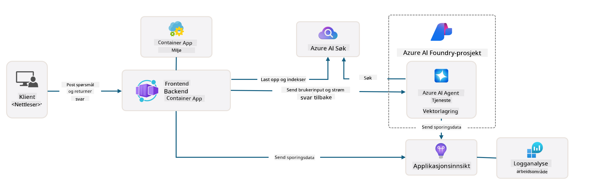

<!--
CO_OP_TRANSLATOR_METADATA:
{
  "original_hash": "4e403f041411361140d6beb88ab2a181",
  "translation_date": "2025-09-24T22:45:54+00:00",
  "source_file": "workshop/docs/instructions/3-Deconstruct-AI-Template.md",
  "language_code": "no"
}
-->
# 3. Dekonstruer en mal

!!! tip "VED SLUTTEN AV DENNE MODULEN VIL DU KUNNE"

    - [ ] Punkt
    - [ ] Punkt
    - [ ] Punkt
    - [ ] **Lab 3:** 

---

Med AZD-maler og Azure Developer CLI (`azd`) kan vi raskt starte vår AI-utviklingsreise med standardiserte repositorier som gir eksempelkode, infrastruktur og konfigurasjonsfiler - i form av et klart-til-å-deployere _startprosjekt_.

**Men nå må vi forstå prosjektstrukturen og kodebasen - og kunne tilpasse AZD-malen - uten noen tidligere erfaring eller forståelse av AZD!**

---

## 1. Aktiver GitHub Copilot

### 1.1 Installer GitHub Copilot Chat

Det er på tide å utforske [GitHub Copilot med Agent Mode](https://code.visualstudio.com/docs/copilot/chat/chat-agent-mode). Nå kan vi bruke naturlig språk for å beskrive oppgaven vår på et høyt nivå og få hjelp til utførelsen. For denne labben bruker vi [Copilot Free-planen](https://github.com/github-copilot/signup) som har en månedlig grense for fullføringer og chat-interaksjoner.

Utvidelsen kan installeres fra markedsplassen, men bør allerede være tilgjengelig i ditt Codespaces-miljø. _Klikk `Open Chat` fra Copilot-ikonets rullegardinmeny - og skriv en prompt som `What can you do?`_ - du kan bli bedt om å logge inn. **GitHub Copilot Chat er klar**.

### 1.2. Installer MCP-servere

For at Agent Mode skal være effektiv, trenger den tilgang til de riktige verktøyene for å hjelpe med å hente kunnskap eller utføre handlinger. Her kommer MCP-servere inn. Vi skal konfigurere følgende servere:

1. [Azure MCP Server](../../../../../workshop/docs/instructions)
1. [Microsoft Docs MCP Server](../../../../../workshop/docs/instructions)

For å aktivere disse:

1. Opprett en fil kalt `.vscode/mcp.json` hvis den ikke eksisterer
1. Kopier følgende inn i den filen - og start serverne!
   ```json title=".vscode/mcp.json"
   {
      "servers": {
         "Azure MCP Server": {
            "command": "npx",
            "args": [
            "-y",
            "@azure/mcp@latest",
            "server",
            "start"
            ]
         },
         "microsoft.docs.mcp": {
            "type": "http",
            "url": "https://learn.microsoft.com/api/mcp"
         }
      }
   }
   ```

??? warning "Du kan få en feil om at `npx` ikke er installert (klikk for å utvide for løsning)"

      For å fikse dette, åpne filen `.devcontainer/devcontainer.json` og legg til denne linjen i funksjonsseksjonen. Bygg deretter containeren på nytt. Du bør nå ha `npx` installert.

      ```title="" linenums="0"
         "features": {
            "ghcr.io/devcontainers/features/node:1": {},
            ...
         },
      ```

---

### 1.3. Test GitHub Copilot Chat

**Bruk først `az login` for å autentisere med Azure fra VS Code-kommandolinjen.**

Du bør nå kunne spørre om statusen til Azure-abonnementet ditt og stille spørsmål om distribuerte ressurser eller konfigurasjon. Prøv disse promptene:

1. `List my Azure resource groups`
1. `#foundry list my current deployments`

Du kan også stille spørsmål om Azure-dokumentasjon og få svar basert på Microsoft Docs MCP-serveren. Prøv disse promptene:

1. `#microsoft_docs_search What is Azure Developer CLI?`
1. `#microsoft_docs_search Show me a Python tutorial to chat with deployed model`

Eller du kan be om kodeeksempler for å fullføre en oppgave. Prøv denne prompten:

1. `Give me a Python code example that uses AAD for an interactive chat client`

I `Ask`-modus vil dette gi kode som du kan kopiere og prøve ut. I `Agent`-modus kan dette gå et skritt videre og opprette relevante ressurser for deg - inkludert oppsett-skript og dokumentasjon - for å hjelpe deg med å utføre oppgaven.

**Du er nå klar til å begynne å utforske mal-repositoriet**

---

## 2. Dekonstruer arkitektur

??? prompt "SPØR: Forklar applikasjonsarkitekturen i docs/images/architecture.png i én paragraf"

      Denne applikasjonen er en AI-drevet chat-applikasjon bygget på Azure som demonstrerer en moderne agentbasert arkitektur. Løsningen er sentrert rundt en Azure Container App som hoster hovedapplikasjonskoden, som behandler brukerinput og genererer intelligente svar gjennom en AI-agent. 
      
      Arkitekturen utnytter Azure AI Foundry Project som grunnlag for AI-funksjonalitet, og kobler til Azure AI Services som gir de underliggende språkmodellene (som GPT-4o-mini) og agentfunksjonalitet. Brukerinteraksjoner flyter gjennom en React-basert frontend til en FastAPI-backend som kommuniserer med AI-agenttjenesten for å generere kontekstuelle svar. 
      
      Systemet inkluderer kunnskapshentingsfunksjoner gjennom enten filsøk eller Azure AI Search-tjenesten, som lar agenten få tilgang til og sitere informasjon fra opplastede dokumenter. For operasjonell dyktighet inkluderer arkitekturen omfattende overvåking gjennom Application Insights og Log Analytics Workspace for sporing, logging og ytelsesoptimalisering. 
      
      Azure Storage gir blob-lagring for applikasjonsdata og filopplastinger, mens Managed Identity sikrer sikker tilgang mellom Azure-ressurser uten å lagre legitimasjon. Hele løsningen er designet for skalerbarhet og vedlikeholdbarhet, med den containeriserte applikasjonen som automatisk skalerer basert på etterspørsel, samtidig som den gir innebygd sikkerhet, overvåking og CI/CD-funksjoner gjennom Azures administrerte tjenesteøkosystem.



---

## 3. Repositoriets struktur

!!! prompt "SPØR: Forklar mappestrukturen til malen. Start med et visuelt hierarkisk diagram."

??? info "SVAR: Visuelt hierarkisk diagram"

      ```bash title="" 
      get-started-with-ai-agents/
      ├── 📋 Konfigurasjon og oppsett
      │   ├── azure.yaml                    # Azure Developer CLI-konfigurasjon
      │   ├── docker-compose.yaml           # Lokale utviklingscontainere
      │   ├── pyproject.toml                # Python-prosjektkonfigurasjon
      │   ├── requirements-dev.txt          # Utviklingsavhengigheter
      │   └── .devcontainer/                # VS Code dev container-oppsett
      │
      ├── 🏗️ Infrastruktur (infra/)
      │   ├── main.bicep                    # Hovedinfrastrukturmal
      │   ├── api.bicep                     # API-spesifikke ressurser
      │   ├── main.parameters.json          # Infrastrukturparametere
      │   └── core/                         # Modulære infrastrukturkomponenter
      │       ├── ai/                       # AI-tjenestekonfigurasjoner
      │       ├── host/                     # Hosting-infrastruktur
      │       ├── monitor/                  # Overvåking og logging
      │       ├── search/                   # Azure AI Search-oppsett
      │       ├── security/                 # Sikkerhet og identitet
      │       └── storage/                  # Lagringskonto-konfigurasjoner
      │
      ├── 💻 Applikasjonskilde (src/)
      │   ├── api/                          # Backend-API
      │   │   ├── main.py                   # FastAPI-applikasjonsinngang
      │   │   ├── routes.py                 # API-rutedefinisjoner
      │   │   ├── search_index_manager.py   # Søksfunksjonalitet
      │   │   ├── data/                     # API-datahåndtering
      │   │   ├── static/                   # Statisk webinnhold
      │   │   └── templates/                # HTML-maler
      │   ├── frontend/                     # React/TypeScript frontend
      │   │   ├── package.json              # Node.js-avhengigheter
      │   │   ├── vite.config.ts            # Vite byggekonfigurasjon
      │   │   └── src/                      # Frontend-kildekode
      │   ├── data/                         # Eksempelfiler
      │   │   └── embeddings.csv            # Forhåndsberegnede embeddings
      │   ├── files/                        # Kunnskapsbasefiler
      │   │   ├── customer_info_*.json      # Eksempler på kundedata
      │   │   └── product_info_*.md         # Produktdokumentasjon
      │   ├── Dockerfile                    # Container-konfigurasjon
      │   └── requirements.txt              # Python-avhengigheter
      │
      ├── 🔧 Automatisering og skript (scripts/)
      │   ├── postdeploy.sh/.ps1           # Oppsett etter distribusjon
      │   ├── setup_credential.sh/.ps1     # Legitimasjonskonfigurasjon
      │   ├── validate_env_vars.sh/.ps1    # Miljøvalidering
      │   └── resolve_model_quota.sh/.ps1  # Modellkvotehåndtering
      │
      ├── 🧪 Testing og evaluering
      │   ├── tests/                        # Enhets- og integrasjonstester
      │   │   └── test_search_index_manager.py
      │   ├── evals/                        # Agent evalueringsrammeverk
      │   │   ├── evaluate.py               # Evaluering kjører
      │   │   ├── eval-queries.json         # Testspørringer
      │   │   └── eval-action-data-path.json
      │   ├── sandbox/                      # Utviklingslekeplass
      │   │   ├── 1-quickstart.py           # Komme i gang eksempler
      │   │   └── aad-interactive-chat.py   # Autentisering eksempler
      │   └── airedteaming/                 # AI sikkerhetsevaluering
      │       └── ai_redteaming.py          # Red team testing
      │
      ├── 📚 Dokumentasjon (docs/)
      │   ├── deployment.md                 # Distribusjonsveiledning
      │   ├── local_development.md          # Lokale oppsettsinstruksjoner
      │   ├── troubleshooting.md            # Vanlige problemer og løsninger
      │   ├── azure_account_setup.md        # Azure-forutsetninger
      │   └── images/                       # Dokumentasjonsressurser
      │
      └── 📄 Prosjektmetadata
         ├── README.md                     # Prosjektoversikt
         ├── CODE_OF_CONDUCT.md           # Retningslinjer for fellesskapet
         ├── CONTRIBUTING.md              # Veiledning for bidrag
         ├── LICENSE                      # Lisensvilkår
         └── next-steps.md                # Veiledning etter distribusjon
      ```

### 3.1. Kjerneappens arkitektur

Denne malen følger et **full-stack webapplikasjonsmønster** med:

- **Backend**: Python FastAPI med Azure AI-integrasjon
- **Frontend**: TypeScript/React med Vite byggesystem
- **Infrastruktur**: Azure Bicep-maler for skyressurser
- **Containerisering**: Docker for konsistent distribusjon

### 3.2 Infrastruktur som kode (bicep)

Infrastrukturlaget bruker **Azure Bicep**-maler organisert modulært:

   - **`main.bicep`**: Orkestrerer alle Azure-ressurser
   - **`core/` moduler**: Gjenbrukbare komponenter for ulike tjenester
      - AI-tjenester (Azure OpenAI, AI Search)
      - Container-hosting (Azure Container Apps)
      - Overvåking (Application Insights, Log Analytics)
      - Sikkerhet (Key Vault, Managed Identity)

### 3.3 Applikasjonskilde (`src/`)

**Backend-API (`src/api/`)**:

- FastAPI-basert REST-API
- Integrasjon med Azure AI Agent-tjeneste
- Søkeindekshåndtering for kunnskapshenting
- Filopplasting og prosesseringsfunksjoner

**Frontend (`src/frontend/`)**:

- Moderne React/TypeScript SPA
- Vite for rask utvikling og optimaliserte bygg
- Chat-grensesnitt for agentinteraksjoner

**Kunnskapsbase (`src/files/`)**:

- Eksempler på kunde- og produktdata
- Demonstrerer filbasert kunnskapshenting
- Eksempler i JSON- og Markdown-format

### 3.4 DevOps og automatisering

**Skript (`scripts/`)**:

- Plattformuavhengige PowerShell- og Bash-skript
- Miljøvalidering og oppsett
- Konfigurasjon etter distribusjon
- Modellkvotehåndtering

**Azure Developer CLI-integrasjon**:

- `azure.yaml`-konfigurasjon for `azd`-arbeidsflyter
- Automatisert klargjøring og distribusjon
- Håndtering av miljøvariabler

### 3.5 Testing og kvalitetssikring

**Evalueringsrammeverk (`evals/`)**:

- Evaluering av agentens ytelse
- Test av kvalitet på spørring-svar
- Automatisert vurderingspipeline

**AI-sikkerhet (`airedteaming/`)**:

- Red team-testing for AI-sikkerhet
- Skanning av sikkerhetssårbarheter
- Ansvarlige AI-praksiser

---

## 4. Gratulerer 🏆

Du har med suksess brukt GitHub Copilot Chat med MCP-servere for å utforske repositoriet.

- [X] Aktivert GitHub Copilot for Azure
- [X] Forstått applikasjonsarkitekturen
- [X] Utforsket AZD-malens struktur

Dette gir deg en forståelse av _infrastruktur som kode_-ressursene for denne malen. Neste steg er å se på konfigurasjonsfilen for AZD.

---

