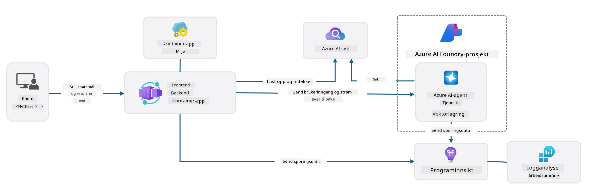

# 3. Dekonstruer en mal

!!! tip "PÅ SLUTTEN AV DETTE MODULEN VIL DU KUNNE"

    - [ ] Aktivere GitHub Copilot med MCP-servere for Azure-assistanse
    - [ ] Forstå AZD-malens mappestruktur og komponenter
    - [ ] Utforske infrastruktur-som-kode (Bicep) organisasjonsmønstre
    - [ ] **Lab 3:** Bruke GitHub Copilot for å utforske og forstå depotarkitektur

---

Med AZD-maler og Azure Developer CLI (`azd`) kan vi raskt starte vår AI-utviklingsreise med standardiserte depoter som tilbyr eksempel kode, infrastruktur og konfigurasjonsfiler - i form av et ferdig-til-utrulling _starter_-prosjekt.

**Men nå må vi forstå prosjektstrukturen og kodebasen – og kunne tilpasse AZD-malen – uten noen tidligere erfaring eller forståelse av AZD!**

---

## 1. Aktiver GitHub Copilot

### 1.1 Installer GitHub Copilot Chat

Det er på tide å utforske [GitHub Copilot med Agent Mode](https://code.visualstudio.com/docs/copilot/chat/chat-agent-mode). Nå kan vi bruke naturlig språk for å beskrive oppgaven på et overordnet nivå, og få hjelp til å utføre den. For denne labben bruker vi [Copilot Free plan](https://github.com/github-copilot/signup) som har en månedlig grense for fullføringer og chat-interaksjoner.

Utvidelsen kan installeres fra markedsplassen, og den er ofte allerede tilgjengelig i Codespaces eller dev container-miljøer. _Klikk `Open Chat` fra Copilot-ikonets nedtrekksmeny - og skriv en prompt som `What can you do?`_ – du kan bli bedt om å logge inn. **GitHub Copilot Chat er klar**.

### 1.2. Installer MCP-servere

For at Agent mode skal være effektivt, trenger det tilgang til riktige verktøy for å hjelpe med å hente kunnskap eller utføre handlinger. Her kan MCP-servere hjelpe oss. Vi konfigurerer følgende servere:

1. [Azure MCP Server](../../../../../workshop/docs/instructions)
1. [Microsoft Docs MCP Server](../../../../../workshop/docs/instructions)

For å aktivere disse:

1. Lag en fil kalt `.vscode/mcp.json` hvis den ikke finnes
1. Kopier følgende inn i filen - og start serverne!
   ```json title=".vscode/mcp.json"
   {
      "servers": {
         "Azure MCP Server": {
            "command": "npx",
            "args": [
            "-y",
            "@azure/mcp@latest",
            "server",
            "start"
            ]
         },
         "microsoft.docs.mcp": {
            "type": "http",
            "url": "https://learn.microsoft.com/api/mcp"
         }
      }
   }
   ```

??? warning "Du kan få en feil om at `npx` ikke er installert (klikk for løsning)"

      For å fikse dette, åpne `.devcontainer/devcontainer.json` filen og legg til denne linjen i features-seksjonen. Bygg deretter containeren på nytt. Du skal nå ha `npx` installert.

      ```title="" linenums="0"
         "features": {
            "ghcr.io/devcontainers/features/node:1": {},
            ...
         },
      ```

---

### 1.3. Test GitHub Copilot Chat

**Bruk først `azd auth login` for å autentisere med Azure fra VS Code-kommandolinjen. Bruk også `az login` dersom du planlegger å kjøre Azure CLI-kommandoer direkte.**

Du skal nå kunne forespørre status for din Azure-abonnement, og stille spørsmål om utrullede ressurser eller konfigurasjon. Prøv disse promptene:

1. `List my Azure resource groups`
1. `#foundry list my current deployments`

Du kan også spørre om Azure-dokumentasjon og få svar basert på Microsoft Docs MCP-serveren. Prøv disse promptene:

1. `#microsoft_docs_search What is Azure Developer CLI?`
1. `#microsoft_docs_search Show me a Python tutorial to chat with deployed model`

Eller du kan be om kodeeksempler for å fullføre en oppgave. Prøv denne prompten.

1. `Give me a Python code example that uses AAD for an interactive chat client`

I `Ask`-modus vil dette gi kode som du kan kopiere og teste. I `Agent`-modus kan det gå et steg videre og opprette relevante ressurser for deg – inkludert oppsettskript og dokumentasjon – for å hjelpe deg å utføre oppgaven.

**Du er nå utrustet for å begynne å utforske mal-depotet**

---

## 2. Dekonstruer arkitekturen

??? prompt "SPØR: Forklar applikasjonsarkitekturen i docs/images/architecture.png i ett avsnitt"

      Denne applikasjonen er en AI-drevet chatteapplikasjon bygget på Azure som demonstrerer en moderne agentbasert arkitektur. Løsningen sentrerer rundt en Azure Container App som kjører hovedapplikasjonskoden, som behandler brukerinput og genererer intelligente svar gjennom en AI-agent.
      
      Arkitekturen bruker Microsoft Foundry Project som grunnlag for AI-funksjonalitet, koblet til Azure AI-tjenester som tilbyr underliggende språkmodeller (som gpt-4.1-mini) og agentfunksjonalitet. Brukerinteraksjoner går gjennom et React-basert frontend til en FastAPI-backend som kommuniserer med AI-agenttjenesten for å generere kontekstuelle svar.
      
      Systemet inkluderer kunnskapsinnhentingsmuligheter via enten filsøk eller Azure AI Search-tjenesten, som lar agenten få tilgang til og sitere informasjon fra opplastede dokumenter.
      
      For operasjonell fortreffelighet inkluderer arkitekturen omfattende overvåking via Application Insights og Log Analytics Workspace for sporing, logging og ytelsesoptimalisering.
      
      Azure Storage tilbyr blob-lagring for applikasjonsdata og filopplastinger, mens Managed Identity sikrer sikker tilgang mellom Azure-ressurser uten å lagre legitimasjon. Hele løsningen er designet for skalerbarhet og vedlikeholdbarhet, med containerisert applikasjon som automatisk skalerer basert på behov samtidig som den tilbyr innebygd sikkerhet, overvåking og CI/CD-funksjoner gjennom Azures administrerte tjenester.



---

## 3. Depotstruktur

!!! prompt "SPØR: Forklar malens mappestruktur. Start med et visuelt hierarkisk diagram."

??? info "SVAR: Visuelt hierarkisk diagram"

      ```bash title="" 
      get-started-with-ai-agents/
      ├── 📋 Configuration & Setup
      │   ├── azure.yaml                    # Azure Developer CLI konfigurasjon
      │   ├── docker-compose.yaml           # Lokale utviklingscontainere
      │   ├── pyproject.toml                # Python prosjektkonfigurasjon
      │   ├── requirements-dev.txt          # Utviklingsavhengigheter
      │   └── .devcontainer/                # VS Code dev container oppsett
      │
      ├── 🏗️ Infrastructure (infra/)
      │   ├── main.bicep                    # Hovedinfrastrukturmal
      │   ├── api.bicep                     # API-spesifikke ressurser
      │   ├── main.parameters.json          # Infrastrukturparametere
      │   └── core/                         # Modulære infrastrukturelementer
      │       ├── ai/                       # AI tjenestekonfigurasjoner
      │       ├── host/                     # Hosting-infrastruktur
      │       ├── monitor/                  # Overvåking og logging
      │       ├── search/                   # Azure AI Search oppsett
      │       ├── security/                 # Sikkerhet og identitet
      │       └── storage/                  # Storage-kontokonfigurasjoner
      │
      ├── 💻 Application Source (src/)
      │   ├── api/                          # Backend-API
      │   │   ├── main.py                   # FastAPI applikasjonsinngang
      │   │   ├── routes.py                 # API-ruter definisjoner
      │   │   ├── search_index_manager.py  # Søkefunksjonalitet
      │   │   ├── data/                     # API databehandling
      │   │   ├── static/                   # Statisk webinnhold
      │   │   └── templates/                # HTML-maler
      │   ├── frontend/                     # React/TypeScript frontend
      │   │   ├── package.json              # Node.js avhengigheter
      │   │   ├── vite.config.ts            # Vite byggekonfigurasjon
      │   │   └── src/                      # Frontend kildekode
      │   ├── data/                         # Eksempelfiler for data
      │   │   └── embeddings.csv            # Forhåndsberegnede embeddings
      │   ├── files/                        # Kunnskapsbaserte filer
      │   │   ├── customer_info_*.json      # Eksempler på kundedata
      │   │   └── product_info_*.md         # Produktdokumentasjon
      │   ├── Dockerfile                    # Containerkonfigurasjon
      │   └── requirements.txt              # Python-avhengigheter
      │
      ├── 🔧 Automation & Scripts (scripts/)
      │   ├── postdeploy.sh/.ps1           # Oppsett etter utrulling
      │   ├── setup_credential.sh/.ps1     # Konfigurasjon av legitimasjon
      │   ├── validate_env_vars.sh/.ps1    # Validering av miljøvariabler
      │   └── resolve_model_quota.sh/.ps1  # Håndtering av modellkvoter
      │
      ├── 🧪 Testing & Evaluation
      │   ├── tests/                        # Enhets- og integrasjonstester
      │   │   └── test_search_index_manager.py
      │   ├── evals/                        # Agent evalueringsrammeverk
      │   │   ├── evaluate.py               # Evalueringskjører
      │   │   ├── eval-queries.json         # Testspørringer
      │   │   └── eval-action-data-path.json
      │   ├── sandbox/                      # Utviklingslekeplass
      │   │   ├── 1-quickstart.py           # Kom igang-eksempler
      │   │   └── aad-interactive-chat.py   # Autentiseringseksempler
      │   └── airedteaming/                 # AI sikkerhetsevaluering
      │       └── ai_redteaming.py          # Red team-testing
      │
      ├── 📚 Documentation (docs/)
      │   ├── deployment.md                 # Utrullingsveiledning
      │   ├── local_development.md          # Lokale oppsettsinstruksjoner
      │   ├── troubleshooting.md            # Vanlige problemer og løsninger
      │   ├── azure_account_setup.md        # Azure forutsetninger
      │   └── images/                       # Dokumentasjonsressurser
      │
      └── 📄 Project Metadata
         ├── README.md                     # Prosjektoversikt
         ├── CODE_OF_CONDUCT.md           # Retningslinjer for fellesskapet
         ├── CONTRIBUTING.md              # Bidragsveiledning
         ├── LICENSE                      # Lisensvilkår
         └── next-steps.md                # Veiledning etter utrulling
      ```

### 3.1. Kjerneapp-arkitektur

Denne malen følger et **fullstack webapplikasjonsmønster** med:

- **Backend**: Python FastAPI med Azure AI-integrasjon
- **Frontend**: TypeScript/React med Vite byggesystem
- **Infrastruktur**: Azure Bicep-maler for skyressurser
- **Containerisering**: Docker for konsistent utrulling

### 3.2 Infrastruktur som kode (bicep)

Infrastrukturlaget bruker **Azure Bicep**-maler organisert modulært:

   - **`main.bicep`**: Orkestrerer alle Azure-ressurser
   - **`core/` moduler**: Gjenbrukbare komponenter for ulike tjenester
      - AI-tjenester (Microsoft Foundry-modeller, AI Search)
      - Container-hosting (Azure Container Apps)
      - Overvåking (Application Insights, Log Analytics)
      - Sikkerhet (Key Vault, Managed Identity)

### 3.3 Applikasjonskilde (`src/`)

**Backend API (`src/api/`)**:

- FastAPI-basert REST API
- Integrasjon med Foundry Agents
- Søkeindeksforvaltning for kunnskapsinnhenting
- Filopplasting og prosesseringsfunksjonalitet

**Frontend (`src/frontend/`)**:

- Moderne React/TypeScript SPA
- Vite for rask utvikling og optimaliserte bygg
- Chatgrensesnitt for agentinteraksjoner

**Kunnskapsbase (`src/files/`)**:

- Eksempelkunde- og produktdata
- Demonstrerer filbasert kunnskapsinnhenting
- JSON- og Markdown-format eksempler

### 3.4 DevOps & Automatisering

**Skript (`scripts/`)**:

- Plattformuavhengige PowerShell- og Bash-skript
- Validering og oppsett av miljø
- Oppsett etter utrulling
- Modellkvotehåndtering

**Azure Developer CLI-integrasjon**:

- `azure.yaml` konfigurasjon for `azd`-arbeidsflyter
- Automatisert provisjonering og utrulling
- Miljøvariabelhåndtering

### 3.5 Testing og kvalitetssikring

**Evalueringsrammeverk (`evals/`)**:

- Evaluering av agentytelse
- Kvalitetstesting av spørsmål og svar
- Automatisert vurderingspipeline

**AI-sikkerhet (`airedteaming/`)**:

- Red team-testing for AI-sikkerhet
- Sikkerhetssårbarhetsskanning
- Ansvarlig AI-praksis

---

## 4. Gratulerer 🏆

Du brukte GitHub Copilot Chat med MCP-servere til å utforske depotet.

- [X] Aktiverte GitHub Copilot for Azure
- [X] Forstod applikasjonsarkitekturen
- [X] Utforsket AZD-malens struktur

Dette gir deg en forståelse av _infrastruktur som kode_-ressursene for denne malen. Neste steg ser vi på konfigurasjonsfilen for AZD.

---

<!-- CO-OP TRANSLATOR DISCLAIMER START -->
**Ansvarsfraskrivelse**:
Dette dokumentet er oversatt ved hjelp av AI-oversettelsestjenesten [Co-op Translator](https://github.com/Azure/co-op-translator). Selv om vi streber etter nøyaktighet, vennligst vær oppmerksom på at automatiserte oversettelser kan inneholde feil eller unøyaktigheter. Det originale dokumentet på sitt opprinnelige språk bør betraktes som den autoritative kilden. For kritisk informasjon anbefales profesjonell menneskelig oversettelse. Vi er ikke ansvarlige for eventuelle misforståelser eller feiltolkninger som følge av bruk av denne oversettelsen.
<!-- CO-OP TRANSLATOR DISCLAIMER END -->