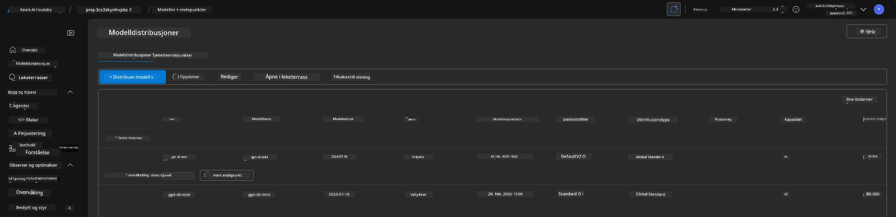

# 6. Avvikling av Infrastruktur

!!! tip "VED SLUTTEN AV DENNE MODULEN VIL DU KUNNE"

    - [ ] Punkt
    - [ ] Punkt
    - [ ] Punkt

---

## Ekstraoppgaver

Før vi avvikler prosjektet, ta noen minutter til å utforske fritt.

!!! danger "NITYA-TODO: Skisser noen forslag til utforskning"

---

## Avvikle Infrastruktur

1. Å avvikle infrastrukturen er så enkelt som:
      
      ```bash title="" linenums="0"
      azd down --purge
      ```
1. Flagget `--purge` sikrer at det også fjerner mykt slettede Cognitive Service-ressurser, og frigjør dermed kvoten som holdes av disse ressursene. Når prosessen er fullført, vil du se noe som dette:
      
      ```bash title="" linenums="0"
      ? Total resources to delete: 11, are you sure you want to continue? Yes
      Deleting your resources can take some time.
      (✓) Done: Deleted resource group rg-nitya-mshack-azd
      (✓) Done: Purging Cognitive Account: aoai-3cz3zkynhvpbc

      SUCCESS: Your application was removed from Azure in 11 minutes 4 seconds.
      ```

1. (Valgfritt) Hvis du nå kjører `azd up` igjen, vil du merke at gpt-4.1-modellen blir distribuert siden miljøvariabelen ble endret (og lagret) i den lokale `.azure`-mappen. 

      Her er modell-distribusjonene **før**:

      

      Og her er de **etter**:
      

---

