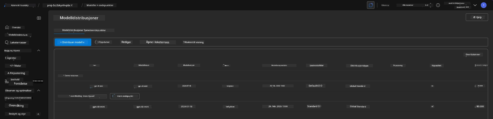
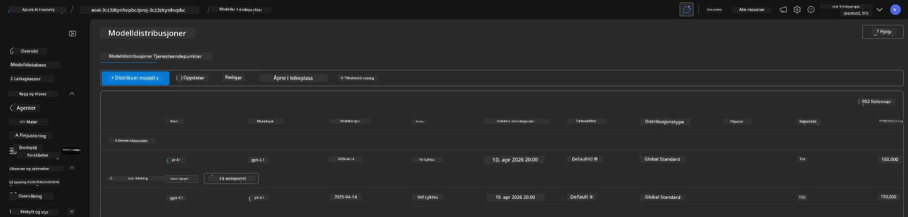

# 6. Nedlasting av infrastruktur

!!! tip "ETTER DETTE MODULEN VIL DU KUNNE"

    - [ ] Forstå viktigheten av ressursopprydding og kostnadsstyring
    - [ ] Bruke `azd down` for å trygt avvikle infrastruktur
    - [ ] Gjenopprette mykt slettede kognitive tjenester ved behov
    - [ ] **Lab 6:** Rydd opp Azure-ressurser og bekreft fjerning

---

## Bonusøvelser

Før vi demonterer prosjektet, ta noen minutter til å utforske åpent.

!!! info "Prøv disse utforskningsoppgavene"

    **Eksperimenter med GitHub Copilot:**
    
    1. Spør: `Hvilke andre AZD-maler kan jeg prøve for multi-agent scenarier?`
    2. Spør: `Hvordan kan jeg tilpasse agentinstruksjonene for en helsetjeneste?`
    3. Spør: `Hvilke miljøvariabler styrer kostnadsoptimalisering?`
    
    **Utforsk Azure-portalen:**
    
    1. Gå gjennom Application Insights-målinger for din distribusjon
    2. Sjekk kostnadsanalysen for provisjonerte ressurser
    3. Utforsk Microsoft Foundry-portalens agent-lekeplass en gang til

---

## Avvikle infrastruktur

1. Nedlasting av infrastruktur er så enkelt som:
      
      ```bash title="" linenums="0"
      azd down --purge
      ```
1. `--purge`-flagget sikrer at også mykt slettede kognitive tjenester blir slettet, og dermed frigjør kvote som holdes av disse ressursene. Når det er ferdig, vil du se noe som dette:
      
      ```bash title="" linenums="0"
      ? Total resources to delete: 11, are you sure you want to continue? Yes
      Deleting your resources can take some time.
      (✓) Done: Deleted resource group rg-nitya-mshack-azd
      (✓) Done: Purging Cognitive Account: aoai-3cz3zkynhvpbc

      SUCCESS: Your application was removed from Azure in 11 minutes 4 seconds.
      ```

1. (Valgfritt) Hvis du nå kjører `azd up` igjen, vil du merke at gpt-4.1-modellen blir distribuert siden miljøvariabelen ble endret (og lagret) i den lokale `.azure`-mappen.

      Her er modellfordelingene **før**:

      

      Og her er det **etter**:
      

---

<!-- CO-OP TRANSLATOR DISCLAIMER START -->
**Ansvarsfraskrivelse**:
Dette dokumentet er oversatt ved hjelp av AI-oversettelsestjenesten [Co-op Translator](https://github.com/Azure/co-op-translator). Selv om vi streber etter nøyaktighet, vennligst vær oppmerksom på at automatiske oversettelser kan inneholde feil eller unøyaktigheter. Det opprinnelige dokumentet på det opprinnelige språket skal anses som den autoritative kilden. For kritisk informasjon anbefales profesjonell menneskelig oversettelse. Vi er ikke ansvarlige for eventuelle misforståelser eller feiltolkninger som oppstår ved bruk av denne oversettelsen.
<!-- CO-OP TRANSLATOR DISCLAIMER END -->