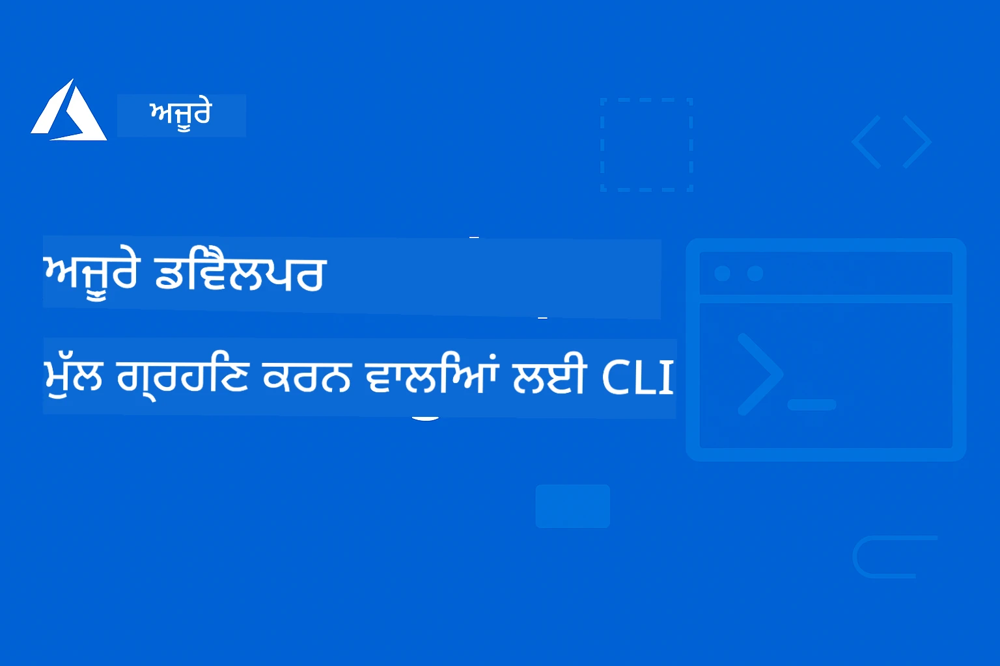

# AZD ਨਵੇਂ ਆਉਣ ਵਾਲਿਆਂ ਲਈ: ਇੱਕ ਸੰਗਠਿਤ ਸਿੱਖਣ ਯਾਤਰਾ

 

[](https://GitHub.com/microsoft/azd-for-beginners/watchers/)
[](https://GitHub.com/microsoft/azd-for-beginners/network/)
[](https://GitHub.com/microsoft/azd-for-beginners/stargazers/)

[](https://discord.gg/microsoft-azure)
[](https://discord.gg/nTYy5BXMWG)

## ਇਸ ਕੋਰਸ ਨਾਲ ਸ਼ੁਰੂਆਤ

ਆਪਣੀ AZD ਸਿੱਖਣ ਯਾਤਰਾ ਸ਼ੁਰੂ ਕਰਨ ਲਈ ਇਹ ਕਦਮ ਫੋਲੋ ਕਰੋ:

1. **ਰਿਪੋਜ਼ਟਰੀ ਨੂੰ ਫੋਰਕ ਕਰੋ**: ਕਲਿੱਕ ਕਰੋ [](https://GitHub.com/microsoft/azd-for-beginners/fork)
2. **ਰਿਪੋਜ਼ਟਰੀ ਕਲੋਨ ਕਰੋ**: `git clone https://github.com/microsoft/azd-for-beginners.git`
3. **ਕਮਿਊਨਿਟੀ ਵਿੱਚ ਸ਼ਾਮਲ ਹੋਵੋ**: ਮਾਹਿਰ ਸਹਾਇਤਾ ਲਈ [Azure Discord Communities](https://discord.com/invite/ByRwuEEgH4)
4. **ਆਪਣੀ ਸਿੱਖਣ ਦੀ ਰਾਹ ਚੁਣੋ**: ਹੇਠਾਂ ਦਿੱਤੇ ਅਧਿਆਇ ਚੁਣੋ ਜੋ ਤੁਹਾਡੇ ਤਜਰਬੇ ਦੀ ਸਤਰ ਨਾਲ ਮੇਲ ਖਾਂਦਾ ਹੈ

### ਬਹੁ-ਭਾਸ਼ਾਈ ਸਹਾਇਤਾ

#### ਆਟੋਮੈਟਿਕ ਅਨੁਵਾਦ (ਹਮੇਸ਼ਾ ਅਪਟੂਡੇਟ)

<!-- CO-OP TRANSLATOR LANGUAGES TABLE START -->
[Arabic](../ar/README.md) | [Bengali](../bn/README.md) | [Bulgarian](../bg/README.md) | [Burmese (Myanmar)](../my/README.md) | [Chinese (Simplified)](../zh-CN/README.md) | [Chinese (Traditional, Hong Kong)](../zh-HK/README.md) | [Chinese (Traditional, Macau)](../zh-MO/README.md) | [Chinese (Traditional, Taiwan)](../zh-TW/README.md) | [Croatian](../hr/README.md) | [Czech](../cs/README.md) | [Danish](../da/README.md) | [Dutch](../nl/README.md) | [Estonian](../et/README.md) | [Finnish](../fi/README.md) | [French](../fr/README.md) | [German](../de/README.md) | [Greek](../el/README.md) | [Hebrew](../he/README.md) | [Hindi](../hi/README.md) | [Hungarian](../hu/README.md) | [Indonesian](../id/README.md) | [Italian](../it/README.md) | [Japanese](../ja/README.md) | [Kannada](../kn/README.md) | [Korean](../ko/README.md) | [Lithuanian](../lt/README.md) | [Malay](../ms/README.md) | [Malayalam](../ml/README.md) | [Marathi](../mr/README.md) | [Nepali](../ne/README.md) | [Nigerian Pidgin](../pcm/README.md) | [Norwegian](../no/README.md) | [Persian (Farsi)](../fa/README.md) | [Polish](../pl/README.md) | [Portuguese (Brazil)](../pt-BR/README.md) | [Portuguese (Portugal)](../pt-PT/README.md) | [Punjabi (Gurmukhi)](./README.md) | [Romanian](../ro/README.md) | [Russian](../ru/README.md) | [Serbian (Cyrillic)](../sr/README.md) | [Slovak](../sk/README.md) | [Slovenian](../sl/README.md) | [Spanish](../es/README.md) | [Swahili](../sw/README.md) | [Swedish](../sv/README.md) | [Tagalog (Filipino)](../tl/README.md) | [Tamil](../ta/README.md) | [Telugu](../te/README.md) | [Thai](../th/README.md) | [Turkish](../tr/README.md) | [Ukrainian](../uk/README.md) | [Urdu](../ur/README.md) | [Vietnamese](../vi/README.md)

> **ਲੋਕਲ ਕਲੋਨ ਕਰਨਾ ਪਸੰਦ ਕਰੋ?**

> ਇਸ ਰਿਪੋਜ਼ਟਰੀ ਵਿੱਚ 50+ ਭਾਸ਼ਾ ਅਨੁਵਾਦ ਸ਼ਾਮਲ ਹਨ ਜੋ ਡਾਊਨਲੋਡ ਆਕਾਰ ਨੂੰ ਬਹੁਤ ਵਧਾਉਂਦੇ ਹਨ। ਬਿਨਾਂ ਅਨੁਵਾਦ ਦੇ ਕਲੋਨ ਕਰਨ ਲਈ, sparse checkout ਵਰਤੋਂ:
> ```bash
> git clone --filter=blob:none --sparse https://github.com/microsoft/AZD-for-beginners.git
> cd AZD-for-beginners
> git sparse-checkout set --no-cone '/*' '!translations' '!translated_images'
> ```
> ਇਹ ਤੁਹਾਨੂੰ ਕੋਰਸ ਪੂਰਾ ਕਰਨ ਲਈ ਲੋੜੀਦਾ ਸਭ ਕੁਝ ਬਹੁਤ ਤੇਜ਼ ਡਾਊਨਲੋਡ ਦੇ ਨਾਲ ਦਿੰਦਾ ਹੈ।
<!-- CO-OP TRANSLATOR LANGUAGES TABLE END -->

## ਕੋਰਸ ਦਾ ਜਾਇਜ਼ਾ

ਮਾਸਟਰ ਕਰੋ Azure Developer CLI (azd) ਨੂੰ ਸੰਗਠਿਤ ਅਧਿਆਇਆਂ ਰਾਹੀਂ ਜੋ ਪ੍ਰਗਟਿ ਸਿੱਖਣ ਲਈ ਡਿਜ਼ਾਈਨ ਕੀਤੇ ਗਏ ਹਨ। **ਮਾਇਕ੍ਰੋਸੌਫਟ ਫਾਊਂਡਰੀ ਇੰਟੀਗ੍ਰੇਸ਼ਨ ਨਾਲ AI ਐਪਲੀਕੇਸ਼ਨ ਤਾਇਨਾਤੀ 'ਤੇ ਖਾਸ ਧਿਆਨ।**

### ਇਹ ਕੋਰਸ ਆਧੁਨਿਕ ਡਿਵੈਲਪਰਾਂ ਲਈ ਕਿਉਂ ਜ਼ਰੂਰੀ ਹੈ

ਮਾਇਕ੍ਰੋਸੌਫਟ ਫਾਊਂਡਰੀ Discord ਕਮਿੂਨਿਟੀ ਦੇ ਸੂਝ ਬੂਝ ਵੱਲੋਂ, **45% ਡਿਵੈਲਪਰ AZD ਨੂੰ AI ਵਰਕਲੋਡ ਲਈ ਵਰਤਣਾ ਚਾਹੁੰਦੇ ਹਨ** ਪਰ ਥੱਲੇ ਦਿੱਤੀਆਂ ਚੁਣੌਤੀਆਂ ਦਾ ਸਾਹਮਣਾ ਕਰਦੇ ਹਨ:  
- ਜਟਿਲ ਬਹੁ-ਸੇਵਾ ਵਾਲੀ AI ਸਰਚਨਾ  
- ਉਤਪਾਦਨ ਵਾਲੀ AI ਤਾਇਨਾਤੀ ਦੀਆਂ ਸਰੋਤੀਆਂ  
- Azure AI ਸੇਵਾਵਾਂ ਦਾ ਇੰਟੀਗ੍ਰੇਸ਼ਨ ਅਤੇ ਸੰਰਚਨਾ  
- AI ਵਰਕਲੋਡ ਲਈ ਲਾਗਤ ਅਚੂਕਤਾ  
- AI-ਖਾਸ ਤਾਇਨਾਤੀ ਸਮੱਸਿਆਵਾਂ ਦਾ ਟ੍ਰਬਲਸ਼ੂਟਿੰਗ  

### ਸਿੱਖਣ ਦੇ ਲਕੜੇ

ਇਸ ਸੰਗਠਿਤ ਕੋਰਸ ਨੂੰ ਪੂਰਾ ਕਰਕੇ, ਤੁਸੀਂ:  
- **AZD ਬੁਨਿਆਦੀ ਜਾਣਕਾਰੀ ਮਾਸਟਰ ਕਰੋ**: ਮੁੱਖ ਧਾਰਣਾਵਾਂ, ਇੰਸਟਾਲੇਸ਼ਨ ਅਤੇ ਸੰਰਚਨਾ  
- **AI ਐਪਲੀਕੇਸ਼ਨਾਂ ਨੂੰ ਤਾਇਨਾਤ ਕਰੋ**: Microsoft Foundry ਸੇਵਾਵਾਂ ਨਾਲ AZD ਵਰਗੋ  
- **Infrastructure as Code ਲਾਗੂ ਕਰੋ**: Bicep ਟੈਮਪਲੇਟਾਂ ਨਾਲ Azure ਸਰੋਤ ਸੰਭਾਲੋ  
- **ਤਾਇਨਾਤੀਆਂ ਦੀ ਟ੍ਰਬਲਸ਼ੂਟਿੰਗ ਕਰੋ**: ਆਮ ਸਮੱਸਿਆਵਾਂ ਹੱਲ ਕਰੋ ਅਤੇ ਡੀਬੱਗ ਕਰੋ  
- **ਉਤਪਾਦਨ ਲਈ ਅਪਟੀਮਾਈਜ਼ ਕਰੋ**: ਸੁਰੱਖਿਆ, ਸਕੇਲਿੰਗ, ਨਿਗਰਾਨੀ ਅਤੇ ਲਾਗਤ ਪ੍ਰਬੰਧਨ  
- **ਬਹੁ-ਏਜੰਟ ਹੱਲ ਬਣਾਓ**: ਜਟਿਲ AI ਸਰਚਨਾਵਾਂ ਨੂੰ ਤਾਇਨਾਤ ਕਰੋ  

## 📚 ਸਿੱਖਣ ਵਾਲੇ ਅਧਿਆਇ

*ਆਪਣੇ ਤਜਰਬੇ ਅਤੇ ਲਕੜੇ ਦੇ ਆਧਾਰ ਤੇ ਆਪਣੀ ਰਾਹ ਚੁਣੋ*

### 🚀 ਅਧਿਆਇ 1: ਬੁਨਿਆਦ ਤੇ ਤੇਜ਼ ਸਟਾਰਟ  
**ਪੂਰਵ-ਆਵਸ਼ਕਤਾ**: Azure ਸਬਸਕ੍ਰਿਪਸ਼ਨ, ਬੇਸਿਕ ਕਮਾਂਡ ਲਾਈਨ ਗਿਆਨ  
**ਅਵਧੀ**: 30-45 ਮਿੰਟ  
**ਜਟਿਲਤਾ**: ⭐

#### ਤੁਸੀਂ ਕੀ ਸਿੱਖੋਗੇ  
- Azure Developer CLI ਦੀ ਬੁਨਿਆਦੀ ਸਮਝ  
- ਆਪਣੀ ਪਲੇਟਫਾਰਮ ਤੇ AZD ਇੰਸਟਾਲ ਕਰਨਾ  
- ਆਪਣੀ ਪਹਿਲੀ ਸਫਲ ਤਾਇਨਾਤੀ  

#### ਸਿੱਖਣ ਦੇ ਸਰੋਤ  
- **🎯 ਇਥੋਂ ਸ਼ੁਰੂ ਕਰੋ**: [What is Azure Developer CLI?](../..)  
- **📖 ਸਿਧਾਂਤ**: [AZD Basics](docs/getting-started/azd-basics.md) - ਮੁੱਖ ਧਾਰਣਾਵਾਂ ਅਤੇ ਸ਼ਬਦਾਵਲੀ  
- **⚙️ ਸੈਟਅਪ**: [Installation & Setup](docs/getting-started/installation.md) - ਪਲੇਟਫਾਰਮ ਖਾਸ ਗਾਈਡ  
- **🛠️ ਪ੍ਰਯੋਗਾਤਮਕ**: [Your First Project](docs/getting-started/first-project.md) - ਕਦਮ-ਦਰ-ਕਦਮ ਟਿਊਟੋਰੀਅਲ  
- **📋 ਤੁਰੰਤ ਸੰਦਰਭ**: [Command Cheat Sheet](resources/cheat-sheet.md)  

#### ਅਭਿਆਸ  
```bash
# ਤੇਜ਼ ਇੰਸਟਾਲੇਸ਼ਨ ਜਾਂਚ
azd version

# ਆਪਣਾ ਪਹਿਲਾ ਐਪਲੀਕੇਸ਼ਨ ਡਿਪਲੋਇ ਕਰੋ
azd init --template todo-nodejs-mongo
azd up
```
  
**💡 ਅਧਿਆਇ ਨਤੀਜਾ**: AZD ਨਾਲ ਇਕ ਸੋਖਾ ਵੈੱਬ ਐਪਲੀਕੇਸ਼ਨ Azure 'ਤੇ ਸਫਲ ਤਰੀਕੇ ਨਾਲ ਤਾਇਨਾਤ ਕਰੋ  

**✅ ਸਫਲਤਾ ਦੀ ਪੁਸ਼ਟੀ:**  
```bash
# ਅਧਿਆਇ 1 ਪੂਰਾ ਕਰਨ ਤੋਂ ਬਾਅਦ, ਤੁਸੀਂ ਸਮਰੱਥ ਹੋ ਜਾਣਗੇ:
azd version              # Installed ਵਰਜ਼ਨ ਦਿਖਾਉਂਦਾ ਹੈ
azd init --template todo-nodejs-mongo  # ਪ੍ਰੋਜੈਕਟ ਸ਼ੁਰੂ ਕਰਦਾ ਹੈ
azd up                  # ਆਜ਼ੁਰ 'ਤੇ ਤਾਇਨਾਤ ਕਰਦਾ ਹੈ
azd show                # ਚੱਲ ਰਹੀ ਐਪ URL ਦਿਖਾਉਂਦਾ ਹੈ
# ਐਪਲੀਕੇਸ਼ਨ ਬ੍ਰਾਊਜ਼ਰ ਵਿੱਚ ਖੁਲਦਾ ਹੈ ਅਤੇ ਕੰਮ ਕਰਦਾ ਹੈ
azd down --force --purge  # ਸਰੋਤ ਸਾਫ ਕਰਦਾ ਹੈ
```
  
**📊 ਸਮਾਂ ਲਗਾਉਣਾ:** 30-45 ਮਿੰਟ  
**📈 ਸਿੱਖਣ ਦੀ ਸਤਰ ਬਾਅਦ:** ਬੁਨਿਆਦੀ ਐਪਲੀਕੇਸ਼ਨਾਂ ਨੂੰ ਸੁਤੰਤਰਤਾ ਨਾਲ ਤਾਇਨਾਤ ਕਰ ਸਕਦਾ ਹੈ  

**✅ ਸਫਲਤਾ ਦੀ ਪੁਸ਼ਟੀ:**  
```bash
# ਅਧਿਆਇ 1 ਪੂਰਾ ਕਰਨ ਮਗਰੋਂ, ਤੁਹਾਨੂੰ ਲੁੜਕਣਾ ਚਾਹੀਦਾ ਹੈ:
azd version              # ਇੰਸਟਾਲ ਕੀਤੀ ਵਰਜਨ ਦਿਖਾਉਂਦਾ ਹੈ
azd init --template todo-nodejs-mongo  # ਪ੍ਰੋਜੈਕਟ ਸ਼ੁਰੂ ਕਰਦਾ ਹੈ
azd up                  # ਅਜ਼ੂਰੇ 'ਤੇੀਆਂ ਜ਼ਾਇਰਤ ਕਰਦਾ ਹੈ
azd show                # ਚੱਲ ਰਹੀ ਐਪ URL ਦਿਖਾਉਂਦਾ ਹੈ
# ਐਪਲੀਕੇਸ਼ਨ ਬਰਾਊਜ਼ਰ ਵਿੱਚ ਖੁਲਦੀ ਹੈ ਅਤੇ ਕੰਮ ਕਰਦੀ ਹੈ
azd down --force --purge  # ਸਾਧਨ ਸਾਫ਼ ਕਰਦਾ ਹੈ
```
  
**📊 ਸਮਾਂ ਲਗਾਉਣਾ:** 30-45 ਮਿੰਟ  
**📈 ਸਿੱਖਣ ਦੀ ਸਤਰ ਬਾਅਦ:** ਬੁਨਿਆਦੀ ਐਪਲੀਕੇਸ਼ਨਾਂ ਨੂੰ ਸੁਤੰਤਰਤਾ ਨਾਲ ਤਾਇਨਾਤ ਕਰ ਸਕਦਾ ਹੈ  

---

### 🤖 ਅਧਿਆਇ 2: AI-ਪਹਿਲਾ ਡਿਵੈਲਪਮੈਂਟ (AI ਡਿਵੈਲਪਰਾਂ ਲਈ ਸਿਫਾਰਸ਼ੀ)  
**ਪੂਰਵ-ਆਵਸ਼ਕਤਾ**: ਅਧਿਆਇ 1 ਮ.completed  
**ਅਵਧੀ**: 1-2 ਘੰਟੇ  
**ਜਟਿਲਤਾ**: ⭐⭐

#### ਤੁਸੀਂ ਕੀ ਸਿੱਖੋਗੇ  
- AZD ਨਾਲ Microsoft Foundry ਇੰਟੀਗ੍ਰੇਸ਼ਨ  
- AI-ਚਲਿਤ ਐਪਲੀਕੇਸ਼ਨਾਂ ਦੀ ਤਾਇਨਾਤੀ  
- AI ਸੇਵਾ ਸੰਰਚਨਾਵਾਂ ਦੀ ਸਮਝ  

#### ਸਿੱਖਣ ਦੇ ਸਰੋਤ  
- **🎯 ਇਥੋਂ ਸ਼ੁਰੂ ਕਰੋ**: [Microsoft Foundry Integration](docs/microsoft-foundry/microsoft-foundry-integration.md)  
- **📖 ਪੈਟਰਨ**: [AI Model Deployment](docs/microsoft-foundry/ai-model-deployment.md) - AI ਮਾਡਲ ਤਾਇਨਾਤ ਕਰੋ ਅਤੇ ਸੰਭਾਲੋ  
- **🛠️ ਵਰਕਸ਼ਾਪ**: [AI Workshop Lab](docs/microsoft-foundry/ai-workshop-lab.md) - ਆਪਣੇ AI ਹੱਲ AZD-ਰੇਡੀ ਬਣਾਓ  
- **🎥 ਇੰਟਰੈਕਟਿਵ ਗਾਈਡ**: [Workshop Materials](workshop/README.md) - MkDocs * DevContainer ਵਾਤਾਵਰਨ ਨਾਲ ਬ੍ਰਾਉਜ਼ਰ ਅਧਾਰਿਤ ਸਿੱਖਣਾ  
- **📋 ਟੈਮਪਲੇਟਸ**: [Microsoft Foundry Templates](../..)  
- **📝 ਉਦਾਹਰਨਾਂ**: [AZD Deployment Examples](examples/README.md)  

#### ਅਭਿਆਸ  
```bash
# ਆਪਣੀ ਪਹਿਲੀ ਏਆਈ ਐਪਲੀਕੇਸ਼ਨ ਤਿਆਰ ਕਰੋ
azd init --template azure-search-openai-demo
azd up

# ਹੋਰ ਏਆਈ ਟੈਂਪਲੇਟਸ ਨੂੰ ਅਜ਼ਮਾਓ
azd init --template openai-chat-app-quickstart
azd init --template agent-openai-python-prompty
```
  
**💡 ਅਧਿਆਇ ਨਤੀਜਾ**: RAG ਸਮਰੱਥਾਵਾਂ ਨਾਲ ਇੱਕ AI-ਚਲਿਤ ਚੈਟ ਐਪਲੀਕੇਸ਼ਨ ਤਾਇਨਾਤ ਅਤੇ ਸੰਰਚਿਤ ਕਰੋ  

**✅ ਸਫਲਤਾ ਦੀ ਪੁਸ਼ਟੀ:**  
```bash
# ਦੂਜੇ ਅਧਿਆਇ ਤੋਂ ਬਾਅਦ, ਤੁਹਾਨੂੰ ਸਮਰੱਥ ਹੋਣਾ ਚਾਹੀਦਾ ਹੈ:
azd init --template azure-search-openai-demo
azd up
# ਏਆਈ ਚੈਟ ਇੰਟਰਫੇਸ ਦੀ ਜਾਂਚ ਕਰੋ
# ਪ੍ਰਸ਼ਨ ਪੁੱਛੋ ਅਤੇ ਸਰੋਤਾਂ ਨਾਲ ਏਆਈ-ਸੰਚਾਲਿਤ ਜਵਾਬ ਪ੍ਰਾਪਤ ਕਰੋ
# ਖੋਜ ਇੰਟੀਗ੍ਰੇਸ਼ਨ ਕੰਮ ਕਰਦੀ ਹੈ ਜਾਂ ਨਹੀਂ ਇਸ ਦੀ ਪੁਸ਼ਟੀ ਕਰੋ
azd monitor  # ਐਪਲੀਕੇਸ਼ਨ ਇਨਸਾਈਟਸ ਵਿੱਚ ਟੈਲੀਮੀਟ੍ਰੀ ਦਿਖਾਈ ਦੇ ਰਹੀ ਹੈ ਜਾਂ ਨਹੀਂ ਜਾਂਚੋ
azd down --force --purge
```
  
**📊 ਸਮਾਂ ਲਗਾਉਣਾ:** 1-2 ਘੰਟੇ  
**📈 ਸਿੱਖਣ ਦੀ ਸਤਰ ਬਾਅਦ:** ਉਤਪਾਦਨ-ਤਿਆਰ AI ਐਪਲੀਕੇਸ਼ਨਾਂ ਨੂੰ ਤਾਇਨਾਤ ਅਤੇ ਸੰਰਚਿਤ ਕਰ ਸਕਦਾ ਹੈ  
**💰 ਲਾਗਤ ਜਾਣੂ:** $80-150/ਮਹੀਨਾ ਡਿਵ ਕਾਸਟ, $300-3500/ਮਹੀਨਾ ਉਤਪਾਦਨ ਕਾਸਟ ਨੂੰ ਸਮਝੋ  

#### 💰 AI ਤਾਇਨਾਤੀਆਂ ਲਈ ਲਾਗਤ ਬਾਰੇ ਵਿਚਾਰ

**ਵਿਕਾਸ ਵਾਤਾਵਰਨ (ਅੰਦਾਜ਼ਾ $80-150/ਮਹੀਨਾ):**  
- Azure OpenAI (ਤੁਸੀਂ ਵਰਤੋਂ ਮੁਤਾਬਕ ਭੁਗਤਾਨ ਕਰੋ): $0-50/ਮਹੀਨਾ (ਟੋਕਨ ਵਰਤੋਂ ਦੇ ਆਧਾਰ)  
- AI ਸਰਚ (ਬੇਸਿਕ ਟੀਅਰ): $75/ਮਹੀਨਾ  
- ਕੁੰਟੇਨਰ ਐਪਸ (ਖਪਤ ਅਧਾਰਿਤ): $0-20/ਮਹੀਨਾ  
- ਸਟੋਰੇਜ (ਮਿਆਰੀ): $1-5/ਮਹੀਨਾ  

**ਉਤਪਾਦਨ ਵਾਤਾਵਰਨ (ਅੰਦਾਜ਼ਾ $300-3,500+/ਮਹੀਨਾ):**  
- Azure OpenAI (ਸਥਿਰ ਪ੍ਰਦਰਸ਼ਨ ਲਈ PTU): $3,000+/ਮਹੀਨਾ ਜਾਂ ਉੱਚ ਖਪਤ ਵਾਲੀ ਪੇ-ਐਜ਼-ਯੂ-ਗੋ  
- AI ਸਰਚ (ਮਿਆਰੀ ਟੀਅਰ): $250/ਮਹੀਨਾ  
- ਕੁੰਟੇਨਰ ਐਪਸ (ਡੈਡੀਕੇਟੇਡ): $50-100/ਮਹੀਨਾ  
- ਐਪਲੀਕੇਸ਼ਨ ਇੰਸਾਈਟਸ: $5-50/ਮਹੀਨਾ  
- ਸਟੋਰੇਜ (ਪ੍ਰੀਮੀਅਮ): $10-50/ਮਹੀਨਾ  

**💡 ਲਾਗਤ ਅਪਟੀਮਾਈਜ਼ੇਸ਼ਨ ਸੁਝਾਅ:**  
- ਸਿੱਖਣ ਲਈ **ਮੁਫ਼ਤ ਟੀਅਰ** Azure OpenAI ਵਰਤੋ (50,000 ਟੋਕਨ/ਮਹੀਨਾ ਸ਼ਾਮਲ)  
- ਜਦੋਂ ਵਿਕਾਸ ਨਹੀਂ ਕਰ ਰਹੇ ਤਾਂ `azd down` ਨਾਲ ਸਰੋਤ ਹਟਾਓ  
- ਖਪਤ-ਅਧਾਰਿਤ ਬਿਲਿੰਗ ਨਾਲ ਸ਼ੁਰੂ ਕਰੋ, ਕੇਵਲ ਉਤਪਾਦਨ ਲਈ PTU ਉੱਪਗਰੇਡ ਕਰੋ  
- ਤਾਇਨਾਤੀ ਤੋਂ ਪਹਿਲਾਂ ਲਾਗਤ ਅੰਦਾਜ਼ਾ ਕਰਨ ਲਈ `azd provision --preview` ਵਰਤੋਂ  
- ਆਟੋ-ਸਕੇਲਿੰਗ ਯੋਗ ਕਰੋ: ਕੇਵਲ ਅਸਲ ਵਰਤੋਂ ਲਈ ਹੀ ਭੁਗਤਾਨ ਕਰੋ  

**ਲਾਗਤ ਨਿਗਰਾਨੀ:**  
```bash
# ਅੰਦਾਜ਼ੇ ਲਗਾਏ ਮਹੀਨਾਵਾਰ ਖਰਚੇ ਦੀ ਜਾਂਚ ਕਰੋ
azd provision --preview

# ਅਸਲ ਖਰਚੇ Azure ਪੋਰਟਲ ਵਿੱਚ ਨਿਗਰਾਨੀ ਕਰੋ
az consumption budget list --resource-group <your-rg>
```
  
---

### ⚙️ ਅਧਿਆਇ 3: ਸੰਰਚਨਾ ਅਤੇ ਪ੍ਰਮਾਣਿਕਤਾ  
**ਪੂਰਵ-ਆਵਸ਼ਕਤਾ**: ਅਧਿਆਇ 1 ਮ.completed  
**ਅਵਧੀ**: 45-60 ਮਿੰਟ  
**ਜਟਿਲਤਾ**: ⭐⭐

#### ਤੁਸੀਂ ਕੀ ਸਿੱਖੋਗੇ  
- ਵਾਤਾਵਰਨ ਦੀ ਸੰਰਚਨਾ ਅਤੇ ਪ੍ਰਬੰਧਨ  
- ਪ੍ਰਮਾਣਿਕਤਾ ਅਤੇ ਸੁਰੱਖਿਆ ਦੀਆਂ ਸਰੋਤੀਆਂ  
- ਸਰੋਤ ਨਾਮਕਰਨ ਅਤੇ ਸੰਗਠਨ  

#### ਸਿੱਖਣ ਦੇ ਸਰੋਤ  
- **📖 ਸੰਰਚਨਾ**: [Configuration Guide](docs/getting-started/configuration.md) - ਵਾਤਾਵਰਨ ਸੈਟਅਪ  
- **🔐 ਸੁਰੱਖਿਆ**: [Authentication patterns and managed identity](docs/getting-started/authsecurity.md) - ਪ੍ਰਮਾਣਿਕਤਾ ਦੇ ਪੈਟਰਨ  
- **📝 ਉਦਾਹਰਨਾਂ**: [Database App Example](examples/database-app/README.md) - AZD ਡੇਟਾਬੇਸ ਉਦਾਹਰਨਾਂ  

#### ਅਭਿਆਸ  
- ਕਈ ਵਾਤਾਵਰਨਾਂ ਦਾ ਸੰਰਚਨਾ (ਡਿਵ, ਸਟੇਜਿੰਗ, ਪ੍ਰੋਡ)  
- ਪ੍ਰਬੰਧਿਤ ਪਹਚਾਣ ਪ੍ਰਮਾਣਿਕਤਾ ਸੈਟਅਪ ਕਰੋ  
- ਵਾਤਾਵਰਨ-ਖਾਸ ਸੰਰਚਨਾ ਲਾਗੂ ਕਰੋ  

**💡 ਅਧਿਆਇ ਨਤੀਜਾ**: ਸਹੀ ਪ੍ਰਮਾਣਿਕਤਾ ਅਤੇ ਸੁਰੱਖਿਆ ਨਾਲ ਕਈ ਵਾਤਾਵਰਨਾਂ ਦੀ ਸੰਭਾਲ ਕਰੋ  

---

### 🏗️ ਅਧਿਆਇ 4: Infrastructure as Code ਅਤੇ ਤਾਇਨਾਤੀ  
**ਪੂਰਵ-ਆਵਸ਼ਕਤਾ**: ਅਧਿਆਇ 1-3 ਮ.completed  
**ਅਵਧੀ**: 1-1.5 ਘੰਟੇ  
**ਜਟਿਲਤਾ**: ⭐⭐⭐

#### ਤੁਸੀਂ ਕੀ ਸਿੱਖੋਗੇ  
- ਉਨਤ ਤਾਇਨਾਤੀ ਪੈਟਰਨ  
- Infrastructure as Code ਬਾਇਸਪ ਨਾਲ  
- ਸਰੋਤ ਪ੍ਰਦਾਨ ਕਰਨ ਦੀਆਂ ਰਣਨੀਤੀਆਂ  

#### ਸਿੱਖਣ ਦੇ ਸਰੋਤ  
- **📖 ਤਾਇਨਾਤੀ**: [Deployment Guide](docs/deployment/deployment-guide.md) - ਪੂਰੇ ਵਰਕਫਲੋ  
- **🏗️ ਸਰੋਤ ਪ੍ਰਦਾਨੀ**: [Provisioning Resources](docs/deployment/provisioning.md) - Azure ਸਰੋਤ ਪ੍ਰਬੰਧਨ  
- **📝 ਉਦਾਹਰਨਾਂ**: [Container App Example](../../examples/container-app) - ਕੰਟੇਨਰ ਕੀਤਾ ਤਾਇਨਾਤੀ  

#### ਅਭਿਆਸ  
- ਕਸਟਮ ਬਾਇਸਪ ਟੈਮਪਲੇਟ ਬਣਾਓ  
- ਬਹੁ-ਸੇਵਾ ਵਾਲੀਆਂ ਐਪਲੀਕੇਸ਼ਨਾਂ ਨੂੰ ਤਾਇਨਾਤ ਕਰੋ  
- ਨੀਲਾ-ਹਰਾ ਤਾਇਨਾਤੀ ਰਣਨੀਤੀਆਂ ਲਾਗੂ ਕਰੋ  

**💡 ਅਧਿਆਇ ਨਤੀਜਾ**: ਕਸਟਮ Infrastructure ਟੈਮਪਲੇਟਾਂ ਦੀ ਵਰਤੋਂ ਨਾਲ ਜਟਿਲ ਬਹੁ-ਸੇਵਾ ਵਾਲੀਆਂ ਐਪਲੀਕੇਸ਼ਨਾਂ ਨੂੰ ਤਾਇਨਾਤ ਕਰੋ  

---

### 🎯 ਅਧਿਆਇ 5: ਬਹੁ-ਏਜੰਟ AI ਹੱਲ (ਉੱਨਤ)  
**ਪੂਰਵ-ਆਵਸ਼ਕਤਾ**: ਅਧਿਆਇ 1-2 ਮ.completed  
**ਅਵਧੀ**: 2-3 ਘੰਟੇ  
**ਜਟਿਲਤਾ**: ⭐⭐⭐⭐
#### ਤੁਸੀਂ ਕੀ ਸਿੱਖੋਗੇ
- ਬਹੁ-ਏਜੰਟ ਆਰਕੀਟੈਕਚਰ ਪੈਟਰਨ
- ਏਜੰਟ ਸਾਂਝਾ-ਸੰਚਾਲਨ ਅਤੇ ਸਮਨ্বਯ
- ਉਤਪਾਦਨ-ਤੁਆਰ ਤਿਆਰ AI ਡਿਪਲੋਇਮੈਂਟ

#### ਸਿੱਖਣ ਵਾਲੇ ਸਰੋਤ
- **🤖 ਫੀਚਰ ਕੀਤਾ ਪ੍ਰੋਜੈਕਟ**: [ਰਿਟੇਲ ਬਹੁ-ਏਜੰਟ ਹੱਲ](examples/retail-scenario.md) - ਪੂਰਨ ਕਾਰਜਾਨਵਯ
- **🛠️ ARM ਟੈਂਪਲੇਟਸ**: [ARM ਟੈਂਪਲੇਟ ਪੈਕੇਜ](../../examples/retail-multiagent-arm-template) - ਇਕ-ਕਲਿੱਕ ਡਿਪਲੋਇਮੈਂਟ
- **📖 ਆਰਕੀਟੈਕਚਰ**: [ਬਹੁ-ਏਜੰਟ ਸਮਨ্বਯ ਪੈਟਰਨ](/docs/pre-deployment/coordination-patterns.md) - ਪੈਟਰਨ

#### ਪ੍ਰਯੋਗਾਤਮਕ ਅਭਿਆਸ
```bash
# ਪੂਰਾ ਰੀਟੇਲ ਮਲਟੀ-ਏਜੰਟ ਹੱਲ ਤਿਆਰ ਕਰੋ
cd examples/retail-multiagent-arm-template
./deploy.sh

# ਏਜੰਟ ਕੰਫਿਗਰੇਸ਼ਨਾਂ ਦਾ ਅਧਿਐਨ ਕਰੋ
az deployment group show --resource-group <rg-name> --name <deployment-name>
```

**💡 ਚੈਪਟਰ ਨਤੀਜਾ**: Customer ਅਤੇ Inventory ਏਜੰਟਾਂ ਦੇ ਨਾਲ ਉਤਪਾਦਨ-ਤਿਆਰ ਬਹੁ-ਏਜੰਟ AI ਹੱਲ ਤਿਆਰ ਅਤੇ ਪ੍ਰਬੰਧਿਤ ਕਰੋ

---

### 🔍 ਚੈਪਟਰ 6: ਪ੍ਰੀ-ਡਿਪਲੋਇਮੈਂਟ ਵੈਦਿੱਕਤਾ ਅਤੇ ਯੋਜਨਾ
**ਪੂਰਵ-ਆਵਸ਼ਕਤਾਵਾਂ**: ਚੈਪਟਰ 4 ਪੂਰਾ ਕੀਤਾ  
**ਅਵਧੀ**: 1 ਘੰਟਾ  
**ਕਠਿਨਾਈ**: ⭐⭐

#### ਤੁਸੀਂ ਕੀ ਸਿੱਖੋਗੇ
- ਸਮਰੱਥਾ ਯੋਜਨਾ ਅਤੇ ਸਰੋਤ ਵੈਦਿੱਕਤਾ
- SKU ਚੋਣ ਰਣਨੀਤੀਆਂ
- ਪ੍ਰੀ-ਫਲਾਈਟ ਜਾਂਚਾਂ ਅਤੇ ਆਟੋਮੇਸ਼ਨ

#### ਸਿੱਖਣ ਵਾਲੇ ਸਰੋਤ
- **📊 ਯੋਜਨਾ ਬੰਧੀ**: [ਸਮਰੱਥਾ ਯੋਜਨਾ](docs/pre-deployment/capacity-planning.md) - ਸਰੋਤ ਵੈਦਿੱਕਤਾ
- **💰 ਚੋਣ**: [SKU ਚੋਣ](docs/pre-deployment/sku-selection.md) - ਲਾਗਤ-ਸਰਲ ਚੋਣਾਂ
- **✅ ਵੈਦਿੱਕਤਾ**: [ਪ੍ਰੀ-ਫਲਾਈਟ ਜਾਂਚਾਂ](docs/pre-deployment/preflight-checks.md) - ਆਟੋਮੇਟਡ ਸਕ੍ਰਿਪਟ

#### ਪ੍ਰਯੋਗਾਤਮਕ ਅਭਿਆਸ
- ਸਮਰੱਥਾ ਵੈਦਿੱਕਤਾ ਸਕ੍ਰਿਪਟ ਚਲਾਓ
- ਲਾਗਤ ਲਈ SKU ਚੋਣਾਂ ਦਾ ਅਨੁਕੂਲਨ ਕਰੋ
- ਆਟੋਮੇਟਡ ਪ੍ਰੀ-ਡਿਪਲੋਇਮੈਂਟ ਜਾਂਚਾਂ ਲਾਗੂ ਕਰੋ

**💡 ਚੈਪਟਰ ਨਤੀਜਾ**: ਕਾਰਜਾਨਵਯ ਤੋਂ ਪਹਿਲਾਂ ਡਿਪਲੋਇਮੈਂਟਾਂ ਨੂੰ ਵੈਦਿੱਕਤਾ ਅਤੇ ਅਨੁਕੂਲਿਤ ਕਰੋ

---

### 🚨 ਚੈਪਟਰ 7: ਟ੍ਰਬਲਸ਼ੂਟਿੰਗ ਅਤੇ ਡੀਬੱਗਿੰਗ
**ਪੂਰਵ-ਆਵਸ਼ਕਤਾਵਾਂ**: ਕੋਈ ਵੀ ਡਿਪਲੋਇਮੈਂਟ ਚੈਪਟਰ ਪੂਰਾ ਕੀਤਾ  
**ਅਵਧੀ**: 1-1.5 ਘੰਟੇ  
**ਕਠਿਨਾਈ**: ⭐⭐

#### ਤੁਸੀਂ ਕੀ ਸਿੱਖੋਗੇ
- ਸਿਸਟਮੈਟਿਕ ਡੀਬੱਗਿੰਗ ਤਰੀਕੇ
- ਆਮ ਸਮੱਸਿਆਵਾਂ ਅਤੇ ਸਮਾਧਾਨ
- AI-ਵਿਸ਼ੇਸ਼ ਟ੍ਰਬਲਸ਼ੂਟਿੰਗ

#### ਸਿੱਖਣ ਵਾਲੇ ਸਰੋਤ
- **🔧 ਆਮ ਸਮੱਸਿਆਵਾਂ**: [ਆਮ ਸਮੱਸਿਆਵਾਂ](docs/troubleshooting/common-issues.md) - ਪ੍ਰਸਿੱਧ ਸਵਾਲ ਅਤੇ ਹੱਲ
- **🕵️ ਡੀਬੱਗਿੰਗ**: [ਡੀਬੱਗਿੰਗ ਗਾਈਡ](docs/troubleshooting/debugging.md) - ਕਦਮ ਦਰ ਕਦਮ ਰਣਨੀਤੀਆਂ
- **🤖 AI ਸਮੱਸਿਆਵਾਂ**: [AI-ਵਿਸ਼ੇਸ਼ ਟ੍ਰਬਲਸ਼ੂਟਿੰਗ](docs/troubleshooting/ai-troubleshooting.md) - AI ਸੇਵਾ ਸਮੱਸਿਆਵਾਂ

#### ਪ੍ਰਯੋਗਾਤਮਕ ਅਭਿਆਸ
- ਡਿਪਲੋਇਮੈਂਟ ਫੇਲਿਅਰਾਂ ਦੀ ਜਾਂਚ ਕਰੋ
- ਪ੍ਰਮਾਣੀਕਰਨ ਸਮੱਸਿਆਵਾਂ ਹੱਲ ਕਰੋ
- AI ਸੇਵਾ ਕਨੈਕਟਿਵਿਟੀ ਡੀਬੱਗ ਕਰੋ

**💡 ਚੈਪਟਰ ਨਤੀਜਾ**: ਆਜ਼ਾਦੀ ਨਾਲ ਆਮ ਡਿਪਲੋਇਮੈਂਟ ਸਮੱਸਿਆਵਾਂ ਦੀ ਜਾਂਚ ਅਤੇ ਹੱਲ ਕਰੋ

---

### 🏢 ਚੈਪਟਰ 8: ਉਤਪਾਦਨ ਅਤੇ ਉਦਯੋਗ ਪੈਟਰਨ
**ਪੂਰਵ-ਆਵਸ਼ਕਤਾਵਾਂ**: ਚੈਪਟਰ 1-4 ਪੂਰੇ  
**ਅਵਧੀ**: 2-3 ਘੰਟੇ  
**ਕਠਿਨਾਈ**: ⭐⭐⭐⭐

#### ਤੁਸੀਂ ਕੀ ਸਿੱਖੋਗੇ
- ਉਤਪਾਦਨ ਡਿਪਲੋਇਮੈਂਟ ਰਣਨੀਤੀਆਂ
- ਉਦਯੋਗ ਸੁਰੱਖਿਆ ਪੈਟਰਨ
- ਮਾਨੀਟਰਿੰਗ ਅਤੇ ਲਾਗਤ ਅਨੁਕੂਲਨ

#### ਸਿੱਖਣ ਵਾਲੇ ਸਰੋਤ
- **🏭 ਉਤਪਾਦਨ**: [ਉਤਪਾਦਨ AI ਬਿਹਤਰ ਅਭਿਆਸ](docs/microsoft-foundry/production-ai-practices.md) - ਉਦਯੋਗ ਪੈਟਰਨ
- **📝 ਉਦਾਹਰਨਾਂ**: [ਮਾਈਕ੍ਰੋਸਰਵਿਸز ਉਦਾਹਰਨ](../../examples/microservices) - ਜਟਿਲ ਆਰਕੀਟੈਕਚਰ
- **📊 ਮਾਨੀਟਰਿੰਗ**: [ਐਪਲੀਕੇਸ਼ਨ ਇੰਸਾਈਟਸ ਇੰਟੀਗ੍ਰੇਸ਼ਨ](docs/pre-deployment/application-insights.md) - ਮਾਨੀਟਰਿੰਗ

#### ਪ੍ਰਯੋਗਾਤਮਕ ਅਭਿਆਸ
- ਉਦਯੋਗ ਸੁਰੱਖਿਆ ਪੈਟਰਨ ਲਾਗੂ ਕਰੋ
- ਸਮੱਗਰੀ ਦੀ ਮਾਨੀਟਰਿੰਗ ਸੈਟ ਅੱਪ ਕਰੋ
- ਪੂਰੀ ਸਰਕਾਰ ਦੇ ਨਾਲ ਉਤਪਾਦਨ ਲਈ ਡਿਪਲੋਇਮੈਂਟ ਕਰੋ

**💡 ਚੈਪਟਰ ਨਤੀਜਾ**: ਪੂਰੀ ਉਤਪਾਦਨ ਯੋਗ ਉਦਯੋਗ ਐਪਲੀਕੇਸ਼ਨ ਡਿਪਲੋਇ ਕਰੋ

---

## 🎓 ਵਰਕਸ਼ਾਪ ਓਵਰਵਿਊ: ਹੱਥ-ਅਨੰਦ ਸਿੱਖਣ ਦਾ ਤਜਰਬਾ

> **⚠️ ਵਰਕਸ਼ਾਪ ਸਥਿਤੀ: ਸਭਿਆਚਾਰ ਵਿਕਾਸ ਪਰ**  
> ਵਰਕਸ਼ਾਪ ਸਮੱਗਰੀ ਇਸ ਸਮੇਂ ਵਿਕਸਤ ਅਤੇ ਸੁਧਾਰਤ ਕੀਤੀ ਜਾ ਰਹੀ ਹੈ। ਮੁੱਖ ਮੋਡੀਊਲ ਕੰਮ ਕਰ ਰਹੇ ਹਨ, ਪਰ ਕੁਝ ਪ੍ਰਗਟ ਅੰਸ਼ ਅਧੂਰੇ ਹਨ। ਅਸੀਂ ਸਾਰੇ ਸਮੱਗਰੀ ਪੂਰੀ ਕਰਨ ਲਈ ਸਰਗਰਮ ਹਾਂ। [ਤਰੱਕੀ ਦੀ ਪਾਲਣਾ ਕਰੋ →](workshop/README.md)

### ਇੰਟਰੈਕਟਿਵ ਵਰਕਸ਼ਾਪ ਸਮੱਗਰੀ
**ਬਰਾਊਜ਼ਰ ਆਧਾਰਿਤ ਟੂਲਾਂ ਅਤੇ ਮਾਰਗਦਰਸ਼ਿਤ ਅਭਿਆਸਾਂ ਨਾਲ ਪ੍ਰਸਥਿਤ ਸਿੱਖਣ**

ਸਾਡੀਆਂ ਵਰਕਸ਼ਾਪ ਸਮੱਗਰੀਆਂ ਚੈਪਟਰ-ਅਧਾਰਤ ਕਾਰਜਕ੍ਰਮ ਨਾਲ ਮੇਲ ਖਾਣ ਵਾਲਾ ਸੰਰਚਿਤ, ਇੰਟਰੈਕਟਿਵ ਸਿੱਖਣ ਦਾ ਤਜਰਬਾ ਪ੍ਰਦਾਨ ਕਰਦੀਆਂ ਹਨ। ਵਰਕਸ਼ਾਪ ਦੋਹਾਂ ਖੁਦ-ਗਤੀ ਨਾਲ ਸਿੱਖਣ ਅਤੇ ਅਧਿਆਪਕ-ਮਾਰਗਦਰਸ਼ਿਤ ਸੈਸ਼ਨਾਂ ਲਈ ਤਿਆਰ ਕੀਤੀ ਗਈ ਹੈ।

#### 🛠️ ਵਰਕਸ਼ਾਪ ਖੂਬੀਆਂ
- **ਬਰਾਊਜ਼ਰ-ਆਧਾਰਿਤ ਇੰਟਰਫੇਸ**: ਭਰਪੂਰ MkDocs-ਚਲਿਤ ਵਰਕਸ਼ਾਪ ਖੋਜ, ਨਕਲ ਅਤੇ ਥੀਮ ਖੂਬੀਆਂ ਨਾਲ
- **GitHub Codespaces ਇੰਟੀਗ੍ਰੇਸ਼ਨ**: ਇਕ-ਕਲਿੱਕ ਡਿਵੈਲਪਮੈਂਟ ਵਾਤਾਵਰਣ ਸੈਟਅੱਪ
- **ਸੰਰਚਿਤ ਸਿੱਖਣ ਦਾ ਰਸਤਾ**: 7-ਕਦਮੀ ਮਾਰਗਦਰਸ਼ਿਤ ਅਭਿਆਸ (ਕੁੱਲ 3.5 ਘੰਟੇ)
- **ਖੋਜ → ਡਿਪਲੋਇਮੈਂਟ → ਵਿਅਕਤੀਕਰਨ**: ਪ੍ਰਗਟ ਰਣਨੀਤੀ
- **ਇੰਟਰੈਕਟਿਵ DevContainer ਵਾਤਾਵਰਣ**: ਪਹਿਲਾਂ ਤੋਂ ਸੰਰਚਿਤ ਟੂਲ ਅਤੇ ਨਿਰਭਰਤਾ

#### 📚 ਵਰਕਸ਼ਾਪ ਸੰਰਚਨਾ
ਵਰਕਸ਼ਾਪ ਇੱਕ **ਖੋਜ → ਡਿਪਲੋਇਮੈਂਟ → ਵਿਅਕਤੀਕਰਨ** ਪद्धਤੀ ਦੀ ਪਾਲਣਾ ਕਰਦੀ ਹੈ:

1. **ਖੋਜ ਚਰਨ** (45 ਮਿੰਟ)
   - Microsoft Foundry ਟੈਂਪਲੇਟ ਅਤੇ ਸੇਵਾਵਾਂ ਦੀ ਖੋਜ
   - ਬਹੁ-ਏਜੰਟ ਆਰਕੀਟੈਕਚਰ ਪੈਟਰਨ ਸਮਝਣਾ
   - ਡਿਪਲੋਇਮੈਂਟ ਦੀਆਂ ਲੋੜਾਂ ਅਤੇ ਪੂਰਵ-ਆਵਸ਼ਕਤਾਵਾਂ ਦੀ ਸਮੀਖਿਆ

2. **ਡਿਪਲੋਇਮੈਂਟ ਚਰਨ** (2 ਘੰਟੇ)
   - AZD ਨਾਲ AI ਐਪਲੀਕੇਸ਼ਨਾਂ ਦਾ ਹੱਥ-ਅਨੰਦ ਡਿਪਲੋਇਮੈਂਟ
   - Azure AI ਸੇਵਾ ਅਤੇ ਐਂਡਪੌਇੰਟ ਵਿਵਸਥਿਤ ਕਰਨਾ
   - ਸੁਰੱਖਿਆ ਅਤੇ ਪ੍ਰਮਾਣੀਕਰਨ ਪੈਟਰਨ ਇੰਪਲੀਮੈਂਟ ਕਰਨਾ

3. **ਵਿਅਕਤੀਕਰਨ ਚਰਨ** (45 ਮਿੰਟ)
   - ਖਾਸ ਉਪਯੋਗ ਮਾਮਲਿਆਂ ਲਈ ਐਪਲੀਕੇਸ਼ਨਾਂ ਵਿੱਚ ਤਬਦੀਲੀ
   - ਉਤਪਾਦਨ ਡਿਪਲੋਇਮੈਂਟ ਲਈ ਅਨੁਕੂਲਨ
   - ਮਾਨੀਟਰਿੰਗ ਅਤੇ ਲਾਗਤ ਪ੍ਰਬੰਧਨ ਲਾਗੂ ਕਰਨਾ

#### 🚀 ਵਰਕਸ਼ਾਪ ਨਾਲ ਸ਼ੁਰੂਆਤ
```bash
# ਵਿਕਲਪ 1: GitHub ਕੋਡਸਪੇਸ (ਸਿਫਾਰਸ਼ੀ)
# ਰਿਪੋਜ਼ਟਰੀ ਵਿੱਚ "ਕੋਡ" → "ਮੁੱਖ 'ਤੇ ਕੋਡਸਪੇਸ ਬਣਾਓ" 'ਤੇ ਕਲਿੱਕ ਕਰੋ

# ਵਿਕਲਪ 2: ਸਥਾਨਕ ਵਿਕਾਸ
git clone https://github.com/microsoft/azd-for-beginners.git
cd azd-for-beginners/workshop
# ਵਰਕਸ਼ਾਪ/README.md ਵਿੱਚ ਸੈਟਅਪ ਨਿਰਦੇਸ਼ਾਂ ਦੀ ਪਾਲਣਾ ਕਰੋ
```

#### 🎯 ਵਰਕਸ਼ਾਪ ਸਿੱਖਣ ਦੇ ਉਦੇਸ਼
ਵਰਕਸ਼ਾਪ ਪੂਰਾ ਕਰਕੇ, ਭਾਗੀਦਾਰ:
- **ਉਤਪਾਦਨ AI ਐਪਲੀਕੇਸ਼ਨਾਂ ਨੂੰ ਡਿਪਲੋਇ ਕਰੋ**: Microsoft Foundry ਸੇਵਾਵਾਂ ਨਾਲ AZD ਵਰਤੋ
- **ਬਹੁ-ਏਜੰਟ ਆਰਕੀਟੈਕਚਰ ਵਿੱਚ ਮਾਹਰ ਹੋਵੋ**: ਕੋਆਰਡੀਨੇਟ ਕੀਤੇ AI ਏਜੰਟ ਹੱਲਾਂ ਨੂੰ ਲਾਗੂ ਕਰੋ
- **ਸੁਰੱਖਿਆ ਦੇ ਬਿਹਤਰ ਅਭਿਆਸ ਲਾਗੂ ਕਰੋ**: ਪ੍ਰਮਾਣੀਕਰਨ ਅਤੇ ਪਹੁੰਚ ਨਿਆੰਤਰਣ ਵਿਵਸਥਾ ਕਰੋ
- **ਪੈਮਾਨਾ ਲਈ ਅਨੁਕੂਲਨ ਕਰੋ**: ਲਾਗਤ-ਪ੍ਰਭਾਵੀ ਅਤੇ ਪ੍ਰਦਰਸ਼ਨਸ਼ੀਲ ਡਿਪਲੋਇਮੈਂਟ ਡਿਜ਼ਾਈਨ ਕਰੋ
- **ਡਿਪਲੋਇਮੈਂਟ ਟ੍ਰਬਲਸ਼ੂਟ ਕਰੋ**: ਆਮ ਸਮੱਸਿਆਵਾਂ ਨੂੰ ਸੁਤੰਤਰ ਤੌਰ ਤੇ ਹੱਲ ਕਰੋ

#### 📖 ਵਰਕਸ਼ਾਪ ਸਰੋਤ
- **🎥 ਇੰਟਰੈਕਟਿਵ ਗਾਈਡ**: [ਵਰਕਸ਼ਾਪ ਸਮੱਗਰੀ](workshop/README.md) - ਬਰਾਊਜ਼ਰ-ਆਧਾਰਿਤ ਸਿੱਖਣ ਵਾਤਾਵਰਣ
- **📋 ਕਦਮ-ਦਰ-ਕਦਮ ਨਿਰਦੇਸ਼**: [ਮਾਰਗਦਰਸ਼ਿਤ ਅਭਿਆਸ](../../workshop/docs/instructions) - ਵਿਸਥਾਰ ਨਾਲ ਚਾਲੂ
- **🛠️ AI ਵਰਕਸ਼ਾਪ ਲੈਬ**: [AI ਵਰਕਸ਼ਾਪ ਲੈਬ](docs/microsoft-foundry/ai-workshop-lab.md) - AI ਕੇਂਦਰਿਤ ਅਭਿਆਸ
- **💡 ਤੇਜ਼ ਸ਼ੁਰੂਆਤ**: [ਵਰਕਸ਼ਾਪ ਸੈਟਅੱਪ ਗਾਈਡ](workshop/README.md#quick-start) - ਵਾਤਾਵਰਣ ਸੰਰਚਨਾ

**ਉਚਿਤ ਹੈ**: ਕੰਪਨੀ ਟ੍ਰੇਨਿੰਗ, ਯੂਨੀਵਰਸਿਟੀ ਕੋਰਸ, ਖੁਦ-ਮੁੱਦਰਾ ਸਿੱਖਣ ਅਤੇ ਡਿਵੈਲਪਰ ਬੂਟਕੈਂਪ ਲਈ।

---

## 📖 Azure Developer CLI ਕੀ ਹੈ?

Azure Developer CLI (azd) ਇੱਕ ਡਿਵੈਲਪਰ-ਕੇਂਦਰਿਤ ਕਮਾਂਡ-ਲਾਈਨ ਇੰਟਰਫੇਸ ਹੈ ਜੋ Azure ‘ਤੇ ਐਪਲੀਕੇਸ਼ਨ ਬਣਾਉਣ ਅਤੇ ਡਿਪਲੋਇ ਕਰਨ ਦੀ ਪ੍ਰਕਿਰਿਆ ਨੂੰ ਤੇਜ਼ ਕਰਦਾ ਹੈ। ਇਹ ਪ੍ਰਦਾਨ ਕਰਦਾ ਹੈ:

- **ਟੈਂਪਲੇਟ-ਆਧਾਰਿਤ ਡਿਪਲੋਇਮੈਂਟ** - ਆਮ ਐਪਲੀਕੇਸ਼ਨ ਪੈਟਰਨ ਲਈ ਪਹਿਲਾਂ ਤੋਂ ਬਣੇ ਟੈਂਪਲੇਟ ਵਰਤੋ  
- **Infrastructure as Code** - Azure ਸਰੋਤਾਂ ਨੂੰ ਬਾਈਸਪ ਜਾਂ ਟੈਰਾਫ਼ਾਰਮ ਨਾਲ ਪਰਬੰਧਿਤ ਕਰੋ  
- **ਇੰਟੀਗ੍ਰੇਟਡ ਵਰਕਫ਼ਲੋਜ਼** - ਬਿਨਾਂ ਰੁਕਾਵਟ ਪ੍ਰੋਵਿਜ਼ਨ, ਡਿਪਲੋਇ ਅਤੇ ਮਾਨੀਟਰਿੰਗ ਕਰੋ  
- **ਡਿਵੈਲਪਰ-ਮਿੱਤਰ** - ਡਿਵੈਲਪਰ ਉਤਪਾਦਕਤਾ ਅਤੇ ਤਜਰਬੇ ਲਈ ਅਨੁਕੂਲਿਤ

### **AZD + Microsoft Foundry: AI ਡਿਪਲੋਇਮੈਂਟ ਲਈ ਪਰਫੈਕਟ**

**ਕਿਉਂ AZD AI ਹੱਲਾਂ ਲਈ?** AZD AI ਡਿਵੈਲਪਰਾਂ ਦੇ ਮੁੱਖ ਚੁਣੌਤੀਆਂ ਦਾ ਹੱਲ ਕਰਦਾ ਹੈ:

- **AI-ਤਿਆਰ ਟੈਂਪਲੇਟ** - Azure OpenAI, Cognitive Services ਅਤੇ ML ਵਰਕਲੋਡ ਲਈ ਪਹਿਲਾਂ ਤੋਂ ਸੰਰਚਿਤ ਟੈਂਪਲੇਟ  
- **ਸੁਰੱਖਿਅਤ AI ਡਿਪਲੋਇਮੈਂਟ** - AI ਸੇਵਾਵਾਂ, API ਕੀਜ਼, ਅਤੇ ਮਾਡਲ ਐਂਡਪੌਇੰਟ ਲਈ ਨਿਰਮਿਤ ਸੁਰੱਖਿਆ ਪੈਟਰਨ  
- **ਉਤਪਾਦਨ AI ਪੈਟਰਨ** - ਸਕੇਲਯੋਗ, ਲਾਗਤ-ਪ੍ਰਭਾਵੀ AI ਐਪਲੀਕੇਸ਼ਨ ਡਿਪਲੋਇਮੈਂਟ ਲਈ ਬਿਹਤਰ ਅਭਿਆਸ  
- **ਪੂਰਨ AI ਵਰਕਫਲੋਜ਼** - ਮਾਡਲ ਵਿਕਾਸ ਤੋਂ ਲੈ ਕੇ ਉਤਪਾਦਨ ਡਿਪਲੋਇਮੈਂਟ ਤੱਕ ਨਿਗਰਾਨੀ ਸਮੇਤ  
- **ਲਾਗਤ ਅਨੁਕੂਲਨ** - AI ਵਰਕਲੋਡ ਲਈ ਸਮਜੇਤ ਸਰੋਤ ਪ੍ਰਦਾਨਗੀ ਅਤੇ ਸਕੇਲਿੰਗ ਰਣਨੀਤੀਆਂ  
- **Microsoft Foundry ਇੰਟੀਗ੍ਰੇਸ਼ਨ** - Microsoft Foundry ਮਾਡਲ ਕੈਟਾਲੌਗ ਅਤੇ ਐਂਡਪੌਇੰਟ ਨਾਲ ਸਹਿਯੋਗ

---

## 🎯 ਟੈਂਪਲੇਟ ਅਤੇ ਉਦਾਹਰਨ ਲਾਇਬ੍ਰੇਰੀ

### ਫੀਚਰ ਕੀਤਾ: Microsoft Foundry ਟੈਂਪਲੇਟ  
**ਜੇ ਤੁਸੀਂ AI ਐਪਲੀਕੇਸ਼ਨ ਡਿਪਲੋਇਮੈਂਟ ਕਰ ਰਹੇ ਹੋ ਤਾਂ ਇੱਥੋਂ ਸ਼ੁਰੂ ਕਰੋ!**

> **ਨੋਟ:** ਇਹ ਟੈਂਪਲੇਟ ਵੱਖ-ਵੱਖ AI ਪੈਟਰਨ ਦਿਖਾਉਂਦੇ ਹਨ। ਕੁਝ ਬਾਹਰੀ Azure ਸੈਂਪਲ ਹਨ, ਕੁਝ ਸਥਾਨਕ ਕਾਰਜਾਨਵਯ ਹਨ।

| ਟੈਂਪਲੇਟ | ਚੈਪਟਰ | ਕਠਿਨਾਈ | ਸੇਵਾਵਾਂ | ਕਿਸਮ |
|----------|---------|------------|----------|------|
| [**AI ਚੈਟ ਨਾਲ ਸ਼ੁਰੂਆਤ**](https://github.com/Azure-Samples/get-started-with-ai-chat) | ਚੈਪਟਰ 2 | ⭐⭐ | AzureOpenAI + Azure AI Model Inference API + Azure AI Search + Azure Container Apps + Application Insights | ਬਾਹਰੀ |
| [**AI ਏਜੰਟਾਂ ਨਾਲ ਸ਼ੁਰੂਆਤ**](https://github.com/Azure-Samples/get-started-with-ai-agents) | ਚੈਪਟਰ 2 | ⭐⭐ | Azure AI Agent Service + AzureOpenAI + Azure AI Search + Azure Container Apps + Application Insights| ਬਾਹਰੀ |
| [**Azure Search + OpenAI ਡੈਮੋ**](https://github.com/Azure-Samples/azure-search-openai-demo) | ਚੈਪਟਰ 2 | ⭐⭐ | AzureOpenAI + Azure AI Search + App Service + Storage | ਬਾਹਰੀ |
| [**OpenAI ਚੈਟ ਐਪ ਤੁਰੰਤ ਸ਼ੁਰੂਆਤ**](https://github.com/Azure-Samples/openai-chat-app-quickstart) | ਚੈਪਟਰ 2 | ⭐ | AzureOpenAI + Container Apps + Application Insights | ਬਾਹਰੀ |
| [**ਏਜੰਟ OpenAI Python Prompty**](https://github.com/Azure-Samples/agent-openai-python-prompty) | ਚੈਪਟਰ 5 | ⭐⭐⭐ | AzureOpenAI + Azure Functions + Prompty | ਬਾਹਰੀ |
| [**Contoso ਚੈਟ RAG**](https://github.com/Azure-Samples/contoso-chat) | ਚੈਪਟਰ 8 | ⭐⭐⭐⭐ | AzureOpenAI + AI Search + Cosmos DB + Container Apps | ਬਾਹਰੀ |
| [**ਰਿਟੇਲ ਬਹੁ-ਏਜੰਟ ਹੱਲ**](examples/retail-scenario.md) | ਚੈਪਟਰ 5 | ⭐⭐⭐⭐ | AzureOpenAI + AI Search + Storage + Container Apps + Cosmos DB | **ਸਥਾਨਕ** |

### ਫੀਚਰ ਕੀਤਾ: ਪੂਰੇ ਸਿੱਖਣ ਵਾਲੇ ਸਿਸਟਮ  
**ਉਤਪਾਦਨ-ਤਿਆਰ ਐਪਲੀਕੇਸ਼ਨ ਟੈਂਪਲੇਟ ਸਿੱਖਣ ਵਾਲੇ ਚੈਪਟਰਾਂ ਨਾਲ ਮਿਲਾਏ ਗਏ**

| ਟੈਂਪਲੇਟ | ਸਿੱਖਣ ਵਾਲਾ ਚੈਪਟਰ | ਕਠਿਨਾਈ | ਮੁੱਖ ਸਿੱਖਿਆ |
|----------|------------------|------------|--------------|
| [**openai-chat-app-quickstart**](https://github.com/Azure-Samples/openai-chat-app-quickstart) | ਚੈਪਟਰ 2 | ⭐ | ਮੂਲ AI ਡਿਪਲੋਇਮੈਂਟ ਪੈਟਰਨ |
| [**azure-search-openai-demo**](https://github.com/Azure-Samples/azure-search-openai-demo) | ਚੈਪਟਰ 2 | ⭐⭐ | Azure AI Search ਨਾਲ RAG ਕਾਰਜਾਨਵਯ |
| [**ai-document-processing**](https://github.com/Azure-Samples/ai-document-processing) | ਚੈਪਟਰ 4 | ⭐⭐ | ਦਸਤਾਵੇਜ਼ ਬੁੱਧੀਮਤਾ ਇੰਟੀਗ੍ਰੇਸ਼ਨ |
| [**agent-openai-python-prompty**](https://github.com/Azure-Samples/agent-openai-python-prompty) | ਚੈਪਟਰ 5 | ⭐⭐⭐ | ਏਜੰਟ ਫ੍ਰੇਮਵਰਕ ਅਤੇ ਫਂਕਸ਼ਨ ਕਾਲਿੰਗ |
| [**contoso-chat**](https://github.com/Azure-Samples/contoso-chat) | ਚੈਪਟਰ 8 | ⭐⭐⭐ | ਉਦਯੋਗ AI ਸੰਚਾਲਨ |
| [**retail-multi-agent-solution**](examples/retail-scenario.md) | ਚੈਪਟਰ 5 | ⭐⭐⭐⭐ | Customer ਅਤੇ Inventory ਏਜੰਟਾਂ ਨਾਲ ਬਹੁ-ਏਜੰਟ ਆਰਕੀਟੈਕਚਰ |

### ਉਦਾਹਰਨ ਕਿਸਮ ਅਨੁਸਾਰ ਸਿੱਖਣਾ

> **📌 ਸਥਾਨਕ ਬਨਾਮ ਬਾਹਰੀ ਉਦਾਹਰਨ:**  
> **ਸਥਾਨਕ ਉਦਾਹਰਨ** (ਇਸ ਰਿਪੋ ਵਿੱਚ) = ਤੁਰੰਤ ਵਰਤੋਂ ਲਈ ਤਿਆਰ  
> **ਬਾਹਰੀ ਉਦਾਹਰਨ** (Azure ਸੈਂਪਲ) = ਲਿੰਕ ਕੀਤੀਆਂ ਗਿਟਹੱਬ ਰਿਪੋਜ਼ ਤੋਂ ਕਲੋਨ ਕਰੋ

#### ਸਥਾਨਕ ਉਦਾਹਰਨ (ਤੁਰੰਤ ਵਰਤੋਂ ਲਈ)
- [**ਰਿਟੇਲ ਬਹੁ-ਏਜੰਟ ਹੱਲ**](examples/retail-scenario.md) - ARM ਟੈਂਪਲੇਟਸ ਨਾਲ ਪੂਰੀ ਉਤਪਾਦਨ ਤਿਆਰੀ  
  - ਬਹੁ-ਏਜੰਟ ਆਰਕੀਟੈਕਚਰ (Customer + Inventory ਏਜੰਟ)  
  - ਵਿਆਪਕ ਮਾਨੀਟਰਿੰਗ ਅਤੇ ਮੁਲਾਂਕਣ  
  - ARM ਟੈਂਪਲੇਟ ਰਾਹੀਂ ਇਕ-ਕਲਿੱਕ ਡਿਪਲੋਇਮੈਂਟ

#### ਸਥਾਨਕ ਉਦਾਹਰਨ - ਕੰਟੇਨਰ ਐਪਲੀਕੇਸ਼ਨ (ਚੈਪਟਰ 2-5)
**ਇਸ ਰਿਪੋ ਵਿੱਚ ਵਿਸਤ੍ਰਿਤ ਕੰਟੇਨਰ ਡਿਪਲੋਇਮੈਂਟ ਉਦਾਹਰਨ:**
- [**ਕੰਟੇਨਰ ਐਪ ਉਦਾਹਰਨ**](examples/container-app/README.md) - ਕੰਟੇਨਰਾਈਜ਼ਡ ਡਿਪਲੋਇਮੈਂਟ ਲਈ ਪੂਰੀ ਮਾਰਗਦਰਸ਼ਿਕਾ  
  - [ਸਧਾਰਨ ਫਲਾਸਕ API](../../examples/container-app/simple-flask-api) - ਸਕੇਲ-ਟੂ-ਜ਼ੀਰੋ ਨਾਲ ਮੂਲ REST API  
  - [ਮਾਈਕ੍ਰੋਸਰਵਿਸਜ਼ ਆਰਕੀਟੈਕਚਰ](../../examples/container-app/microservices) - ਉਤਪਾਦਨ ਯੋਗ ਬਹੁ-ਸੇਵਾ ਡਿਪਲੋਇਮੈਂਟ  
  - ਤੁਰੰਤ ਸ਼ੁਰੂਆਤ, ਉਤਪਾਦਨ, ਅਤੇ ਐਡਵਾਂਸਡ ਡਿਪਲੋਇਮੈਂਟ ਪੈਟਰਨ  
  - ਮਾਨੀਟਰਿੰਗ, ਸੁਰੱਖਿਆ ਅਤੇ ਲਾਗਤ ਅਨੁਕੂਲਨ ਲਈ ਮਦਦ

#### ਬਾਹਰੀ ਉਦਾਹਰਨ - ਸਧਾਰਨ ਐਪਲੀਕੇਸ਼ਨ (ਚੈਪਟਰ 1-2)
**ਇਹ Azure ਸੈਂਪਲ ਰਿਪੋਜ਼ ਕਲੋਨ ਕਰਕੇ ਸ਼ੁਰੂਆਤ ਕਰੋ:**
- [ਸਧਾਰਨ ਵੈਬ ਐਪ - Node.js + MongoDB](https://github.com/Azure-Samples/todo-nodejs-mongo) - ਮੂਲ ਡਿਪਲੋਇਮੈਂਟ ਪੈਟਰਨ  
- [ਸਥਿਰ ਵੈੱਬਸਾਈਟ - React SPA](https://github.com/Azure-Samples/todo-csharp-sql-swa-func) - ਸਥਿਰ ਸਮੱਗਰੀ ਡਿਪਲੋਇਮੈਂਟ  
- [ਕੰਟੇਨਰ ਐਪ - Python Flask](https://github.com/Azure-Samples/container-apps-store-api-microservice) - REST API ਡਿਪਲੋਇਮੈਂਟ

#### ਬਾਹਰੀ ਉਦਾਹਰਨ - ਡੇਟਾਬੇਸ ਇੰਟੀਗ੍ਰੇਸ਼ਨ (ਚੈਪਟਰ 3-4)  
- [ਡੇਟਾਬੇਸ ਐਪ - C# + SQL](https://github.com/Azure-Samples/todo-csharp-sql) - ਡੇਟਾਬੇਸ ਕਨੈਕਟਿਵਿਟੀ ਪੈਟਰਨ  
- [ਫਂਕਸ਼ਨ + Cosmos DB](https://github.com/Azure-Samples/todo-python-mongo-swa-func) - ਸਰਵਰਲੇਸ ਡੇਟਾ ਵਰਕਫਲੋ

#### ਬਾਹਰੀ ਉਦਾਹਰਨ - ਉੱਚ ਪੈਟਰਨ (ਚੈਪਟਰ 4-8)
- [Java ਮਾਈਕ੍ਰੋਸਰਵਿਸਜ਼](https://github.com/Azure-Samples/java-microservices-aca-lab) - ਬਹੁ-ਸੇਵਾ ਆਰਕੀਟੈਕਚਰ  
- [ਕੰਟੇਨਰ ਐਪ ਜੌਬਜ਼](https://github.com/Azure-Samples/container-apps-jobs) - ਬੈਕਗਰਾਊਂਡ ਪ੍ਰੋਸੈਸਿੰਗ  
- [ਉਦਯੋਗ ML ਪਾਈਪਲਾਈਨ](https://github.com/Azure-Samples/mlops-v2) - ਉਤਪਾਦਨ-ਯੋਗ ML ਪੈਟਰਨ

### ਬਾਹਰੀ ਟੈਂਪਲੇਟ ਸੰਗ੍ਰਹਿ
- [**ਅਧਿਕਾਰਕ AZD ਟੈਂਪਲੇਟ ਗੈਲਰੀ**](https://azure.github.io/awesome-azd/) - ਅਧਿਕਾਰਕ ਅਤੇ ਕਮਿਊਨਿਟੀ ਟੈਂਪਲੇਟਾਂ ਦਾ ਸੰਕਲਨ
- [**Azure Developer CLI ਟੈਮਪਲੇਟਸ**](https://learn.microsoft.com/en-us/azure/developer/azure-developer-cli/azd-templates) - Microsoft Learn ਟੈਮਪਲੇਟ ਦਸਤਾਵੇਜ਼ੀਕਰਨ
- [**Examples Directory**](examples/README.md) - ਵਿਸਥਾਰਪੂਰਕ ਵਿਆਖਿਆਵਾਂ ਨਾਲ ਸਥਾਨਕ ਸਿੱਖਣ ਵਾਲੇ ਉਦਾਹਰਣ

---

## 📚 ਸਿੱਖਣ ਵਾਲੇ ਸਰੋਤ ਅਤੇ ਸੰਦਰਭ

### ਤੇਜ਼ ਰਿਫਰੈਂਸ
- [**ਕਮਾਂਡ ਚੀਟ ਸ਼ੀਟ**](resources/cheat-sheet.md) - ਭਾਗ ਅਨੁਸਾਰ ਵਿਵਸਥਿਤ ਜਰੂਰੀ azd ਕਮਾਂਡਾਂ
- [**ਸ਼ਬਦਕੋਸ਼**](resources/glossary.md) - Azure ਅਤੇ azd ਸ਼ਬਦਾਵਲੀ  
- [**ਅਕਸਰ ਪੁੱਛੇ ਜਾਂਦੇ ਸਵਾਲ**](resources/faq.md) - ਸਿੱਖਣ ਵਾਲੇ ਭਾਗ ਅਨੁਸਾਰ ਆਮ ਸਵਾਲ
- [**ਅਧਿਐਨ ਮਾਰਗਦਰਸ਼ਕ**](resources/study-guide.md) - ਵਿਸਥਾਰਪੂਰਕ ਅਭਿਆਸਕ ਅਭਿਆਸ

### ਹੱਥ-ਅਮਲ ਵਰਕਸ਼ਾਅਪ
- [**AI ਵਰਕਸ਼ਾਅਪ ਲੈਬ**](docs/microsoft-foundry/ai-workshop-lab.md) - ਆਪਣੀਆਂ AI ਹੱਲਾਂ ਨੂੰ AZD-ਡਿਪਲੋਏਬਲ ਬਣਾਓ (2-3 ਘੰਟੇ)
- [**ਇੰਟਰਐਕਟਿਵ ਵਰਕਸ਼ਾਅਪ ਮਾਰਗਦਰਸ਼ਿਕਾ**](workshop/README.md) - MkDocs ਅਤੇ DevContainer ਵਾਤਾਵਰਨ ਨਾਲ ਬ੍ਰਾਉਜ਼ਰ-ਅਧਾਰਿਤ ਵਰਕਸ਼ਾਅਪ
- [**ਸੰਰਚਿਤ ਸਿੱਖਣ ਦਾ ਰਸਤਾ**](../../workshop/docs/instructions) - 7-ਕਦਮੀ ਮਾਰਗਦਰਸ਼ਿਤ ਅਭਿਆਸ (ਖੋਜ → ਡਿਪਲੋਇਮੈਂਟ → ਕਸਟਮਾਈਜੇਸ਼ਨ)
- [**ਸ਼ੁਰੂਆਤੀ ਲਈ AZD ਵਰਕਸ਼ਾਅਪ**](workshop/README.md) - GitHub Codespaces ਇੰਟਿਗ੍ਰੇਸ਼ਨ ਨਾਲ ਸੰਪੂਰਨ ਹੱਥ-ਅਮਲ ਸਮੱਗਰੀ

### ਬਾਹਰੀ ਸਿੱਖਣ ਵਾਲੇ ਸਰੋਤ
- [Azure Developer CLI ਦਸਤਾਵੇਜ਼ੀਕਰਨ](https://learn.microsoft.com/en-us/azure/developer/azure-developer-cli/)
- [Azure ਆਰਕੀਟੈਕਚਰ ਸੈਂਟਰ](https://learn.microsoft.com/en-us/azure/architecture/)
- [Azure ਕੀਮਤ ਕੈਲਕਯੂਲੇਟਰ](https://azure.microsoft.com/pricing/calculator/)
- [Azure ਸਥਿਤੀ](https://status.azure.com/)

---

## 🔧 ਤੇਜ਼ ਸਮੱਸਿਆ ਸੂਚਕ

**ਆਮ ਸਮੱਸਿਆਵਾਂ ਜੋ ਸ਼ੁਰੂਆਤੀ ਸਾਮ੍ਹਣਾ ਕਰਦੇ ਹਨ ਅਤੇ ਤੁਰੰਤ ਹੱਲ:**

### ❌ "azd: ਕਮਾਂਡ ਨਹੀਂ ਮਿਲੀ"

```bash
# ਪਹਿਲਾਂ AZD ਇੰਸਟਾਲ ਕਰੋ
# Windows (ਪਾਵਰਸ਼ੈੱਲ):
winget install microsoft.azd

# macOS:
brew tap azure/azd && brew install azd

# ਲਿਨਕਸ:
curl -fsSL https://aka.ms/install-azd.sh | bash

# ਇੰਸਟਾਲੇਸ਼ਨ ਦੀ ਪੁਸ਼ਟੀ ਕਰੋ
azd version
```

### ❌ "ਕੋਈ ਸਬਸਕ੍ਰਿਪਸ਼ਨ ਨਹੀਂ ਮਿਲੀ" ਜਾਂ "ਸਬਸਕ੍ਰਿਪਸ਼ਨ ਸੈੱਟ ਨਹੀਂ ਕੀਤਾ"

```bash
# ਉਪਲਬਧ ਸਬਸਕ੍ਰਿਪਸ਼ਨਾਂ ਦੀ ਸੂਚੀ ਬਣਾਓ
az account list --output table

# ਡੀਫਾਲਟ ਸਬਸਕ੍ਰਿਪਸ਼ਨ ਸੈੱਟ ਕਰੋ
az account set --subscription "<subscription-id-or-name>"

# AZD ਮਾਹੌਲ ਲਈ ਸੈੱਟ ਕਰੋ
azd env set AZURE_SUBSCRIPTION_ID "<subscription-id>"

# ਪੁਸ਼ਟੀ ਕਰੋ
az account show
```

### ❌ "ਪਰ्यਾਪਤ ਕੁਟਾ ਨਹੀਂ" ਜਾਂ "ਕੁਟਾ ਪਾਰ ਹੋਇਆ"

```bash
# ਵੱਖ-ਵੱਖ ਐਜ਼ਿਊਰ ਖੇਤਰ ਦੀ ਕੋਸ਼ਿਸ਼ ਕਰੋ
azd env set AZURE_LOCATION "westus2"
azd up

# ਜਾਂ ਵਿਕਾਸ ਵਿੱਚ ਛੋਟੇ SKUs ਵਰਤੋ
# infra/main.parameters.json ਸੰਪਾਦਿਤ ਕਰੋ:
{
  "sku": "B1"  // Instead of "P1V2"
}
```

### ❌ "azd up" ਅੱਧੇ ਰਸਤੇ ਫੇਲ ਹੋਣਾ

```bash
# ਵਿਕਲਪ 1: ਸਾਫ਼ ਕਰੋ ਅਤੇ ਦੁਬਾਰਾ ਕੋਸ਼ਿਸ਼ ਕਰੋ
azd down --force --purge
azd up

# ਵਿਕਲਪ 2: ਸਿਰਫ ਧਾਂਚਾ ਸਹੀ ਕਰੋ
azd provision

# ਵਿਕਲਪ 3: ਵਿਸਥਾਰਿਤ ਲੌਗ ਜਾਂਚੋ
azd show
azd logs
```

### ❌ "ਪ੍ਰਮਾਣਿਕਤਾ ਅਸਫਲ" ਜਾਂ "ਟੋਕਨ ਮਿਆਦ ਸਮਾਪਤ"

```bash
# ਮੁੜ ਪ੍ਰਮਾਣਿਕਤਾ ਕਰੋ
az logout
az login

azd auth logout
azd auth login

# ਪ੍ਰਮਾਣਿਕਤਾ ਦੀ ਜਾਂਚ ਕਰੋ
az account show
```

### ❌ "ਸੰਸਾਧਨ ਪਹਿਲਾਂ ਤੋਂ ਮੌਜੂਦ ਹੈ" ਜਾਂ ਨਾਮਕਰਨ ਦਾ ਟਕਰਾਅ

```bash
# AZD ਵਿਲੱਖਣ ਨਾਮ ਬਣਾਉਂਦਾ ਹੈ, ਪਰ ਜੇ ਟਕਰਾਅ ਹੋਵੇ:
azd down --force --purge

# ਫਿਰ ਨਵੇਂ ਮਾਹੌਲ ਨਾਲ ਮੁੜ ਕੋਸ਼ਿਸ਼ ਕਰੋ
azd env new dev-v2
azd up
```

### ❌ ਟੈਮਪਲੇਟ ਡਿਪਲੋਇਮੈਂਟ ਬਹੁਤ ਸਮਾਂ ਲੈ ਰਿਹਾ ਹੈ

**ਸਧਾਰਣ ਇੰਤਜ਼ਾਰ ਸਮੇਂ:**
- ਸਧਾਰਣ ਵੈੱਬ ਐਪ: 5-10 ਮਿੰਟ
- ਡਾਟਾਬੇਸ ਵਾਲਾ ਐਪ: 10-15 ਮਿੰਟ
- AI ਐਪਲੀਕੇਸ਼ਨਜ਼: 15-25 ਮਿੰਟ (OpenAI ਪ੍ਰੋਵੀਜ਼ਨਿੰਗ ਧੀਮੀ ਹੈ)

```bash
# ਤਰੱਕੀ ਦੀ ਜਾਂਚ ਕਰੋ
azd show

# ਜੇ 30 ਮਿੰਟ ਤੋਂ ਵੱਧ ਫਸ ਜਾਂਦੇ ਹੋ, ਤਾਂ ਅਜ਼ੂਰੇ ਪੋਰਟਲ ਦੀ ਜਾਂਚ ਕਰੋ:
azd monitor
# ਨਾਕਾਮ ਰਹਿ ਗਈਆਂ ਡਿਪਲੋਇਮੈਂਟਾਂ ਦੀ ਤਲਾਸ਼ ਕਰੋ
```

### ❌ "ਪ੍ਰਵਾਨਗੀ ਨਾ ਹੋਣੀ" ਜਾਂ "ਮਨਾਹੀ"

```bash
# ਆਪਣੇ ਏਜ਼ੂਰ ਰੋਲ ਦੀ ਜਾਂਚ ਕਰੋ
az role assignment list --assignee $(az account show --query user.name -o tsv)

# ਤੁਹਾਨੂੰ ਘੱਟੋ-ਘੱਟ "Contributor" ਰੋਲ ਦੀ ਲੋੜ ਹੈ
# ਆਪਣੇ ਏਜ਼ੂਰ ਐਡਮਿਨ ਨੂੰ ਅਨੁਰੋਧ ਕਰੋ:
# - Contributor (ਸੰਸਾਧਨਾਂ ਲਈ)
# - User Access Administrator (ਰੋਲ ਅਸਾਈਨਮੈਂਟਸ ਲਈ)
```

### ❌ ਪ੍ਰਤਿ-ਲਾਗੂ ਕੀਤੀ ਐਪਲੀਕੇਸ਼ਨ URL ਨਹੀਂ ਮਿਲ ਰਿਹਾ

```bash
# ਸਾਰੇ ਸੇਵਾ ਐਂਡਪੌਇੰਟ ਦਿਖਾਓ
azd show

# ਜਾਂ ਅਜ਼ੂਰ ਪੋਰਟਲ ਖੋਲ੍ਹੋ
azd monitor

# ਖਾਸ ਸੇਵਾ ਦੀ ਜਾਂਚ ਕਰੋ
azd env get-values
# *_URL ਵਰਿਆਬਲ ਵਿੱਚ ਖੋਜ ਕਰੋ
```

### 📚 ਪੂਰਨ ਸਮੱਸਿਆ ਸੁਧਾਰ ਸਰੋਤ

- **ਆਮ ਸਮੱਸਿਆਵਾਂ ਲਈ ਮਾਰਗਦਰਸ਼ਿਕਾ:** [ਵਿਸਥਾਰਪੂਰਕ ਹੱਲ](docs/troubleshooting/common-issues.md)
- **AI-ਵਿਸ਼ੇਸ਼ ਸਮੱਸਿਆਵਾਂ:** [AI ਸਭੰਧੀ ਸਮੱਸਿਆਵਾਂ](docs/troubleshooting/ai-troubleshooting.md)
- **ਡਿਬੱਗਿੰਗ ਮਾਰਗਦਰਸ਼ਿਕਾ:** [ਕਦਮ-ਦਰ-ਕਦਮ ਡਿਬੱਗਿੰਗ](docs/troubleshooting/debugging.md)
- **ਮਦਦ ਲਓ:** [Azure Discord](https://discord.gg/microsoft-azure) #azure-developer-cli

---

## 🔧 ਤੇਜ਼ ਸਮੱਸਿਆ ਸੂਚਕ

**ਆਮ ਸਮੱਸਿਆਵਾਂ ਜੋ ਸ਼ੁਰੂਆਤੀ ਸਾਮ੍ਹਣਾ ਕਰਦੇ ਹਨ ਅਤੇ ਤੁਰੰਤ ਹੱਲ:**

<details>
<summary><strong>❌ "azd: ਕਮਾਂਡ ਨਹੀਂ ਮਿਲੀ"</strong></summary>

```bash
# ਪਹਿਲਾਂ AZD ਇੰਸਟਾਲ ਕਰੋ
# ਵਿੰਡੋਜ਼ (ਪਾਵਰਸ਼ੈੱਲ):
winget install microsoft.azd

# ਮੈਕਓਐਸ:
brew tap azure/azd && brew install azd

# ਲਿਨਕਸ:
curl -fsSL https://aka.ms/install-azd.sh | bash

# ਇੰਸਟਾਲੇਸ਼ਨ ਦੀ ਜਾਂਚ ਕਰੋ
azd version
```
</details>

<details>
<summary><strong>❌ "ਕੋਈ ਸਬਸਕ੍ਰਿਪਸ਼ਨ ਨਹੀਂ ਮਿਲੀ" ਜਾਂ "ਸਬਸਕ੍ਰਿਪਸ਼ਨ ਸੈੱਟ ਨਹੀਂ ਕੀਤਾ"</strong></summary>

```bash
# ਉਪਲਬਧ ਸਬਸਕ੍ਰਿਪਸ਼ਨਾਂ ਦੀ ਸੂਚੀ ਬਣਾਓ
az account list --output table

# ਡિફਾਲਟ ਸਬਸਕ੍ਰਿਪਸ਼ਨ ਸੈੱਟ ਕਰੋ
az account set --subscription "<subscription-id-or-name>"

# AZD ਵਾਤਾਵਰਣ ਲਈ ਸੈੱਟ ਕਰੋ
azd env set AZURE_SUBSCRIPTION_ID "<subscription-id>"

# ਜਾਂਚੋ
az account show
```
</details>

<details>
<summary><strong>❌ "ਪਰਯਾਪਤ ਕੁਟਾ ਨਹੀਂ" ਜਾਂ "ਕੁਟਾ ਪਾਰ ਹੋਇਆ"</strong></summary>

```bash
# ਵੱਖ-ਵੱਖ ਅਜ਼ੂਰੇ ਖੇਤਰ ਦੀ ਕੋਸ਼ਿਸ਼ ਕਰੋ
azd env set AZURE_LOCATION "westus2"
azd up

# ਜਾ ਵਿਕਾਸ ਵਿੱਚ ਛੋਟੇ SKU ਦੀ ਵਰਤੋਂ ਕਰੋ
# infra/main.parameters.json ਸੋਧੋ:
{
  "sku": "B1"  // Instead of "P1V2"
}
```
</details>

<details>
<summary><strong>❌ "azd up" ਅੱਧੇ ਰਸਤੇ ਫੇਲ ਹੋਣਾ</strong></summary>

```bash
# ਵਿਕਲਪ 1: ਸਾਫ ਕਰੋ ਅਤੇ ਮੁੜ ਕੋਸ਼ਿਸ਼ ਕਰੋ
azd down --force --purge
azd up

# ਵਿਕਲਪ 2: ਸਿਰਫ ਬੁਨਿਆਦੀ ਢਾਂਚਾ ਠੀਕ ਕਰੋ
azd provision

# ਵਿਕਲਪ 3: ਵਿਸਥਾਰਪੂਰਵਕ ਲੌਗ ਚੈੱਕ ਕਰੋ
azd show
azd logs
```
</details>

<details>
<summary><strong>❌ "ਪ੍ਰਮਾਣਿਕਤਾ ਅਸਫਲ" ਜਾਂ "ਟੋਕਨ ਮਿਆਦ ਸਮਾਪਤ"</strong></summary>

```bash
# ਮੁੜ ਪ੍ਰਮਾਣਿਕਤਾ ਕਰੋ
az logout
az login

azd auth logout
azd auth login

# ਪ੍ਰਮਾਣਿਕਤਾ ਦੀ ਜਾਂਚ ਕਰੋ
az account show
```
</details>

<details>
<summary><strong>❌ "ਸੰਸਾਧਨ ਪਹਿਲਾਂ ਤੋਂ ਮੌਜੂਦ ਹੈ" ਜਾਂ ਨਾਮਕਰਨ ਦਾ ਟਕਰਾਅ</strong></summary>

```bash
# AZD ਵਿਲੱਖਣ ਨਾਮ ਬਣਾਉਂਦਾ ਹੈ, ਪਰ ਜੇ ਟਕਰਾਅ ਹੋਵੇ:
azd down --force --purge

# ਫਿਰ ਨਵੀਂ ਵਾਤਾਵਰਨ ਨਾਲ ਦੁਬਾਰਾ ਕੋਸ਼ਿਸ਼ ਕਰੋ
azd env new dev-v2
azd up
```
</details>

<details>
<summary><strong>❌ ਟੈਮਪਲੇਟ ਡਿਪਲੋਇਮੈਂਟ ਬਹੁਤ ਸਮਾਂ ਲੈ ਰਿਹਾ ਹੈ</strong></summary>

**ਸਧਾਰਣ ਇੰਤਜ਼ਾਰ ਸਮੇਂ:**
- ਸਧਾਰਣ ਵੈੱਬ ਐਪ: 5-10 ਮਿੰਟ
- ਡਾਟਾਬੇਸ ਵਾਲਾ ਐਪ: 10-15 ਮਿੰਟ
- AI ਐਪਲੀਕੇਸ਼ਨਜ਼: 15-25 ਮਿੰਟ (OpenAI ਪ੍ਰੋਵੀਜ਼ਨਿੰਗ ਧੀਮੀ ਹੈ)

```bash
# ਤਰੱਕੀ ਦੀ ਜਾਂਚ ਕਰੋ
azd show

# ਜੇ 30 ਮਿੰਟ ਤੋਂ ਵੱਧ ਫਸੇ ਹੋ, ਤਾਂ Azure ਪੋਰਟਲ ਦੀ ਜਾਂਚ ਕਰੋ:
azd monitor
# ਅਸਫਲ ਡਿਪਲੌਇਮੈਂਟ ਲਈ ਦੇਖੋ
```
</details>

<details>
<summary><strong>❌ "ਪ੍ਰਵਾਨਗੀ ਨਾ ਹੋਣੀ" ਜਾਂ "ਮਨਾਹੀ"</strong></summary>

```bash
# ਆਪਣੇ ਏਜ਼ੂਰ ਰੋਲ ਦੀ ਜਾਂਚ ਕਰੋ
az role assignment list --assignee $(az account show --query user.name -o tsv)

# ਤੁਹਾਨੂੰ ਘੱਟੋ-ਘੱਟ "ਸਹਿਯੋਗੀ" ਰੋਲ ਦੀ ਲੋੜ ਹੈ
# ਆਪਣੇ ਏਜ਼ੂਰ ਐਡਮਿਨ ਤੋਂ ਬੇਨਤੀ ਕਰੋ ਕਿ ਉਹ ਦਿਓ:
# - ਸਹਿਯੋਗੀ (ਸੰਸਾਧਨਾਂ ਲਈ)
# - ਯੂਜ਼ਰ ਐਕਸੈਸ ਐਡਮਿਨਿਸਟ੍ਰੇਟਰ (ਰੋਲ ਅਸਾਈਨਮੈਂਟ ਲਈ)
```
</details>

<details>
<summary><strong>❌ ਪ੍ਰਤਿ-ਲਾਗੂ ਕੀਤੀ ਐਪਲੀਕੇਸ਼ਨ URL ਨਹੀਂ ਮਿਲ ਰਿਹਾ</strong></summary>

```bash
# ਸਾਰੇ ਸੇਵਾ ਅੰਤ ਬਿੰਦੂ ਦਿਖਾਓ
azd show

# ਜਾਂ ਐਜ਼ੂਰੀ ਪੋਰਟਲ ਖੋਲ੍ਹੋ
azd monitor

# ਖ਼ਾਸ ਸੇਵਾ ਦੀ ਜਾਂਚ ਕਰੋ
azd env get-values
# *_URL ਵੇਰੀਏਬਲ ਖੋਜੋ
```
</details>

### 📚 ਪੂਰਨ ਸਮੱਸਿਆ ਸੁਧਾਰ ਸਰੋਤ

- **ਆਮ ਸਮੱਸਿਆਵਾਂ ਲਈ ਮਾਰਗਦਰਸ਼ਿਕਾ:** [ਵਿਸਥਾਰਪੂਰਕ ਹੱਲ](docs/troubleshooting/common-issues.md)
- **AI-ਵਿਸ਼ੇਸ਼ ਸਮੱਸਿਆਵਾਂ:** [AI ਸਭੰਧੀ ਸਮੱਸਿਆਵਾਂ](docs/troubleshooting/ai-troubleshooting.md)
- **ਡਿਬੱਗਿੰਗ ਮਾਰਗਦਰਸ਼ਿਕਾ:** [ਕਦਮ-ਦਰ-ਕਦਮ ਡਿਬੱਗਿੰਗ](docs/troubleshooting/debugging.md)
- **ਮਦਦ ਲਓ:** [Azure Discord](https://discord.gg/microsoft-azure) #azure-developer-cli

---

## 🎓 ਕੋਰਸ ਪੂਰਾ ਕਰਨ ਅਤੇ ਪ੍ਰਮਾਣੀਕਰਨ

### ਪ੍ਰਗਟੀ ਟਰੈੱਕਿੰਗ
ਹਰ ਭਾਗ ਦੇ ਰਾਹੀਂ ਆਪਣੀ ਸਿੱਖਣ ਦੀ ਪ੍ਰਗਤੀ ਟਰੈੱਕ ਕਰੋ:

- [ ] **ਭਾਗ 1**: ਮੂਲ ਬੁਨਿਆਦ ਅਤੇ ਤੇਜ਼ ਸ਼ੁਰੂਆਤ ✅
- [ ] **ਭਾਗ 2**: AI-ਪਹਿਲਾ ਵਿਕਾਸ ✅  
- [ ] **ਭਾਗ 3**: ਸੰਰਚਨਾ ਅਤੇ ਪ੍ਰਮਾਣਿਕਤਾ ✅
- [ ] **ਭਾਗ 4**: ਇੰਫਰਾਸਟ੍ਰੱਕਚਰ ਐਜ਼ ਕੋਡ ਅਤੇ ਡਿਪਲੋਇਮੈਂਟ ✅
- [ ] **ਭਾਗ 5**: ਬਹੁ-ਏਜੰਟ AI ਹੱਲ ✅
- [ ] **ਭਾਗ 6**: ਪ੍ਰੀ-ਡਿਪਲੋਇਮੈਂਟ ਮਾਣਤਾ ਅਤੇ ਯੋਜਨਾ ✅
- [ ] **ਭਾਗ 7**: ਸਮੱਸਿਆ ਸੁਧਾਰ ਅਤੇ ਡਿਬੱਗਿੰਗ ✅
- [ ] **ਭਾਗ 8**: ਉਤਪਾਦਨ ਅਤੇ ਉਦਯੋਗ ਪੈਟਰਨ ✅

### ਸਿੱਖਣ ਦੀ ਪੁਸ਼ਟੀ
ਹਰ ਭਾਗ ਮੁਕੰਮਲ ਕਰਨ ਤੋਂ ਬਾਅਦ, ਆਪਣੀ ਸੂਝ ਬੂਝ ਦੀ ਪੁਸ਼ਟੀ ਕਰੋ:  
1. **ਵੈਵਹਾਰਿਕ ਅਭਿਆਸ**: ਭਾਗ ਦੀ ਹੱਥ-ਅਮਲ ਡਿਪਲੋਇਮੈਂਟ ਪੂਰੀ ਕਰੋ  
2. **ਜਾਣਕਾਰੀ ਜਾਂਚ**: ਆਪਣੇ ਭਾਗ ਲਈ FAQ ਸੈਕਸ਼ਨ ਦੀ ਸਮੀਖਿਆ ਕਰੋ  
3. **ਕਮਿਊਨਟੀ ਚਰਚਾ**: Azure Discord ਵਿੱਚ ਆਪਣਾ ਅਨੁਭਵ ਸਾਂਝਾ ਕਰੋ  
4. **ਅਗਲਾ ਭਾਗ**: ਅਗਲੀ ਜਟਿਲਤਾ ਪੱਧਰ ਵੱਲ ਵਧੋ  

### ਕੋਰਸ ਪੂਰਾ ਕਰਨ ਦੇ ਫਾਇਦੇ  
ਸਾਰੇ ਭਾਗ ਮੁਕੰਮਲ ਕਰਨ ਉੱਪਰ, ਤੁਹਾਡੇ ਕੋਲ ਹੋਵੇਗਾ:  
- **ਉਤਪਾਦਨ ਅਨੁਭਵ**: ਅਸਲ AI ਐਪਲੀਕੇਸ਼ਨਾਂ ਨੂੰ Azure 'ਤੇ ਡਿਪਲੋਇ ਕੀਤਾ  
- **ਪੇਸ਼ੇਵਰ ਹੁਨਰ**: ਉਦਯੋਗ-ਤਿਆਰ ਡਿਪਲੋਇਮੈਂਟ ਯੋਗਤਾਵਾਂ  
- **ਕਮਿਊਨਟੀ ਪਹਿਚਾਨ**: Azure ਡਿਵੈਲਪਰ ਕਮਿਊਨਟੀ ਦਾ ਸਰਗਰਮ ਮੈਂਬਰ  
- **ਕੈਰੀਅਰ ਉਨਤੀ**: ਮੰਗ ਵਿੱਚ AZD ਅਤੇ AI ਡਿਪਲੋਇਮੈਂਟ ਵਿਸ਼ੇਸ਼ਗਿਆ

---

## 🤝 ਕਮਿਊਨਟੀ ਅਤੇ ਸਹਾਇਤਾ

### ਮਦਦ ਅਤੇ ਸਹਾਇਤਾ ਲਓ  
- **ਤਕਨੀਕੀ ਸਮੱਸਿਆਵਾਂ**: [ਬੱਗ ਰਿਪੋਰਟ ਕਰੋ ਅਤੇ ਵਿਸ਼ੇਸ਼ਤਾਵਾਂ ਮੰਗੋ](https://github.com/microsoft/azd-for-beginners/issues)  
- **ਸਿੱਖਣ ਸਵਾਲ**: [Microsoft Azure Discord ਕਮਿਊਨਟੀ](https://discord.gg/microsoft-azure) ਅਤੇ [](https://discord.gg/nTYy5BXMWG)  
- **AI-ਵਿਸ਼ੇਸ਼ ਮਦਦ**: ਸ਼ਾਮਿਲ ਹੋਵੋ [](https://discord.gg/nTYy5BXMWG)  
- **ਦਸਤਾਵੇਜ਼ੀਕਰਨ**: [ਆਧਿਕਾਰਕ Azure Developer CLI ਦਸਤਾਵੇਜ਼](https://learn.microsoft.com/en-us/azure/developer/azure-developer-cli/)

### Microsoft Foundry Discord ਤੋਂ ਕਮਿਊਨਟੀ ਅੰਦਰੂਨੀ ਜਾਣਕਾਰੀਆਂ

**#Azure ਚੈਨਲ ਤੋਂ ਹਾਲੀਆ ਸਰਵੇਖਣ ਨਤੀਜੇ:**  
- **45%** ਡਿਵੈਲਪਰ AI ਵਰਕਲੋਡ ਲਈ AZD ਵਰਤਣਾ ਚਾਹੁੰਦੇ ਹਨ  
- **ਮੁੱਖ ਚੁਣੌਤੀਆਂ**: ਬਹੁ-ਸੇਵਾ ਡਿਪਲੋਇਮੈਂਟ, ਪ੍ਰਮਾਣ ਪੱਤਰ ਪ੍ਰਬੰਧਨ, ਉਤਪਾਦਨ ਤਿਆਰੀ  
- **ਸਭ ਤੋਂ ਬਹੁਤ ਮੰਗ ਕੀਤੇ ਗਏ:** AI-ਵਿਸ਼ੇਸ਼ ਟੈਮਪਲੇਟ, ਸਮੱਸਿਆ ਸੁਧਾਰ ਮਾਰਗਦਰਸ਼ਿਕਾ, ਸਭ ਤੋਂ ਵਧੀਆ ਅਭਿਆਸ

**ਸਾਡੇ ਕਮਿਊਨਟੀ ਨਾਲ ਜੁੜੋ, ਤਾਂ ਜੋ:**  
- ਆਪਣਾ AZD + AI ਅਨੁਭਵ ਸਾਂਝਾ ਕਰੋ ਅਤੇ ਮਦਦ ਲਵੋ  
- ਨਵੇਂ AI ਟੈਮਪਲੇਟਾਂ ਦੀ ਪਹਿਲਾਂ ਦੇਖਭਾਲ ਪ੍ਰਾਪਤ ਕਰੋ  
- AI ਡਿਪਲੋਇਮੈਂਟ ਸਭ ਤੋਂ ਵਧੀਆ ਅਭਿਆਸਾਂ ਵਿੱਚ ਯੋਗਦਾਨ ਪਾਉ  
- ਭਵਿੱਖ ਦੇ AI + AZD ਫੀਚਰ ਵਿਕਾਸ ਨੂੰ ਪ੍ਰਭਾਵਿਤ ਕਰੋ

### ਕੋਰਸ ਵਿੱਚ ਯੋਗਦਾਨ ਪਾਓ  
ਸਾਨੂੰ ਯੋਗਦਾਨ ਦਾ ਸਵਾਗਤ ਹੈ! ਵਿਸਥਾਰ ਲਈ कृਪਾ ਕਰਕੇ ਸਾਡਾ [ਯੋਗਦਾਨ ਮਾਰਗਦਰਸ਼ਿਕਾ](CONTRIBUTING.md) ਪੜ੍ਹੋ:  
- **ਸਮੱਗਰੀ ਸੁਧਾਰ**: ਮੌਜੂਦਾ ਭਾਗਾਂ ਅਤੇ ਉਦਾਹਰਣਾਂ ਨੂੰ ਬਹਿਤਰ ਬਣਾਓ  
- **ਨਵੇਂ ਉਦਾਹਰਣ**: ਹਕੀਕਤੀ ਦੁਨੀਆ ਦੇ ਸਥਿਤੀਆਂ ਅਤੇ ਟੈਮਪਲੇਟ ਸ਼ਾਮਿਲ ਕਰੋ  
- **ਅਨੁਵਾਦ**: ਬਹੁ-ਭਾਸ਼ਾਈ ਸਹਾਇਤਾ ਨੂੰ ਬਣਾਈ ਰੱਖੋ  
- **ਬੱਗ ਰਿਪੋਰਟ**: ਸਹੀਤਾ ਅਤੇ ਸਫਾਈ ਸੁਧਾਰੋ  
- **ਕਮਿਊਨਟੀ ਮਿਆਰ**: ਸਾਡੇ ਸਮਾਵੇਸ਼ੀ ਕਮਿਊਨਟੀ ਨਿਯਮਾਂ ਨੂੰ ਫੋਲੋ ਕਰੋ

---

## 📄 ਕੋਰਸ ਜਾਣਕਾਰੀ

### ਲਾਈਸੈਂਸ  
ਇਹ ਪ੍ਰੋਜੈਕਟ MIT ਲਾਈਸੈਂਸ ਥੱਲੇ ਲਾਇਸੈਂਸਡ ਹੈ - ਵੇਰਵੇ ਲਈ [LICENSE](../../LICENSE) ਫਾਈਲ ਵੇਖੋ।

### ਸਬੰਧਤ Microsoft ਸਿੱਖਣ ਵਾਲੇ ਸਰੋਤ

ਸਾਡੀ ਟੀਮ ਹੋਰ ਵਿਸਥਾਰਪੂਰਕ ਸਿੱਖਣ ਵਾਲੇ ਕੋਰਸ ਬਣਾਉਂਦੀ ਹੈ:

<!-- CO-OP TRANSLATOR OTHER COURSES START -->
### LangChain  
[](https://aka.ms/langchain4j-for-beginners)  
[](https://aka.ms/langchainjs-for-beginners?WT.mc_id=m365-94501-dwahlin)  
[](https://github.com/microsoft/langchain-for-beginners?WT.mc_id=m365-94501-dwahlin)  
---

### Azure / Edge / MCP / ਏਜੰਟ  
[](https://github.com/microsoft/AZD-for-beginners?WT.mc_id=academic-105485-koreyst)  
[](https://github.com/microsoft/edgeai-for-beginners?WT.mc_id=academic-105485-koreyst)  
[](https://github.com/microsoft/mcp-for-beginners?WT.mc_id=academic-105485-koreyst)  
[](https://github.com/microsoft/ai-agents-for-beginners?WT.mc_id=academic-105485-koreyst)  

---
 
### ਜਨੇਰੇਟਿਵ AI ਸੀਰੀਜ਼  
[](https://github.com/microsoft/generative-ai-for-beginners?WT.mc_id=academic-105485-koreyst)  
[-9333EA?style=for-the-badge&labelColor=E5E7EB&color=9333EA)](https://github.com/microsoft/Generative-AI-for-beginners-dotnet?WT.mc_id=academic-105485-koreyst)  
[-C084FC?style=for-the-badge&labelColor=E5E7EB&color=C084FC)](https://github.com/microsoft/generative-ai-for-beginners-java?WT.mc_id=academic-105485-koreyst)  
[-E879F9?style=for-the-badge&labelColor=E5E7EB&color=E879F9)](https://github.com/microsoft/generative-ai-with-javascript?WT.mc_id=academic-105485-koreyst)  

---
 
### ਮੂਲ ਸਿੱਖਣ  

[](https://aka.ms/ml-beginners?WT.mc_id=academic-105485-koreyst)
[](https://aka.ms/datascience-beginners?WT.mc_id=academic-105485-koreyst)
[](https://aka.ms/ai-beginners?WT.mc_id=academic-105485-koreyst)
[](https://github.com/microsoft/Security-101?WT.mc_id=academic-96948-sayoung)
[](https://aka.ms/webdev-beginners?WT.mc_id=academic-105485-koreyst)
[](https://aka.ms/iot-beginners?WT.mc_id=academic-105485-koreyst)
[](https://github.com/microsoft/xr-development-for-beginners?WT.mc_id=academic-105485-koreyst)

---
 
### ਕੋਪਾਈਲਟ ਸਿਰੀਜ਼
[](https://aka.ms/GitHubCopilotAI?WT.mc_id=academic-105485-koreyst)
[](https://github.com/microsoft/mastering-github-copilot-for-dotnet-csharp-developers?WT.mc_id=academic-105485-koreyst)
[](https://github.com/microsoft/CopilotAdventures?WT.mc_id=academic-105485-koreyst)
<!-- CO-OP TRANSLATOR OTHER COURSES END -->

---

## 🗺️ ਕੋਰਸ ਨੈਵੀਗੇਸ਼ਨ

**🚀 ਸਿੱਖਣਾ ਸ਼ੁਰੂ ਕਰਨ ਲਈ ਤਿਆਰ?**

**ਸ਼ੁਰੂਆਤੀ**: ਨਾਲ ਸ਼ੁਰੂ ਕਰੋ [ਅਧਿਆਇ 1: ਫਾਊਂਡੇਸ਼ਨ ਅਤੇ ਕਵਿਕ ਸਟਾਰਟ](../..)  
**ਏਆਈ ਡਿਵੈਲਪਰਸ**: ਕੋਲ ਜਾਓ [ਅਧਿਆਇ 2: ਏਆਈ-ਪਹਿਲਾ ਵਿਕਾਸ](../..)  
**ਅਨੁਭਵੀ ਡਿਵੈਲਪਰਸ**: ਸ਼ੁਰੂ ਕਰੋ ਨਾਲ [ਅਧਿਆਇ 3: ਸੰਰਚਨਾ ਅਤੇ ਪ੍ਰਮਾਣਿਕਤਾ](../..)

**ਅਗਲੇ ਕਦਮ**: [ਅਧਿਆਇ 1 - AZD ਬੁਨਿਆਦੀ ਜਾਣਕਾਰੀ ਸ਼ੁਰੂ ਕਰੋ](docs/getting-started/azd-basics.md) →

---

<!-- CO-OP TRANSLATOR DISCLAIMER START -->
**ਅਸਵੀਕਾਰ੍ਯੋਗਤਾ**:  
ਇਹ ਦਸਤਾਵੇਜ਼ AI ਅਨੁਵਾਦ ਸੇਵਾ [Co-op Translator](https://github.com/Azure/co-op-translator) ਦੀ ਵਰਤੋਂ ਨਾਲ ਅਨੁਵਾਦਿਤ ਕੀਤਾ ਗਿਆ ਹੈ। ਜਦੋਂ ਅਸੀਂ ਸ਼ੁੱਧਤਾ ਲਈ ਕੋਸ਼ਿਸ਼ ਕਰਦੇ ਹਾਂ, ਕਿਰਪਾ ਕਰਕੇ ਜਾਣੂ ਹੋਵੋ ਕਿ ਆਟੋਮੇਟਿਕ ਅਨੁਵਾਦਾਂ ਵਿੱਚ ਗਲਤੀਆਂ ਜਾਂ ਅਸਟੀਕਤਾਵਾਂ ਹੋ ਸਕਦੀਆਂ ਹਨ। ਅਸਲ ਦਸਤਾਵੇਜ਼ ਆਪਣੇ ਮੂਲ ਭਾਸ਼ਾ ਵਿੱਚ ਹੀ ਪ੍ਰਮਾਣਿਕ ਸੂਤਰ ਮੰਨਿਆ ਜਾਣਾ ਚਾਹੀਦਾ ਹੈ। ਮਹੱਤਵਪੂਰਨ ਜਾਣਕਾਰੀ ਲਈ ਪੇਸ਼ਾਵਰ ਇਨਸਾਨੀ ਅਨੁਵਾਦ ਦੀ ਸਿਫਾਰਿਸ਼ ਕੀਤੀ ਜਾਂਦੀ ਹੈ। ਅਸੀਂ ਇਸ ਅਨੁਵਾਦ ਦੀ ਵਰਤੋਂ ਤੋਂ ਉੱਪਜੇ ਕਿਸੇ ਵੀ ਗਲਤਫਹਮੀ ਜਾਂ ਗਲਤ ਅਰਥ ਲਾਏ ਜਾਣ ਦੇ ਲਈ ਜ਼ਿੰਮੇਵਾਰ ਨਹੀਂ ਹਾਂ।
<!-- CO-OP TRANSLATOR DISCLAIMER END -->