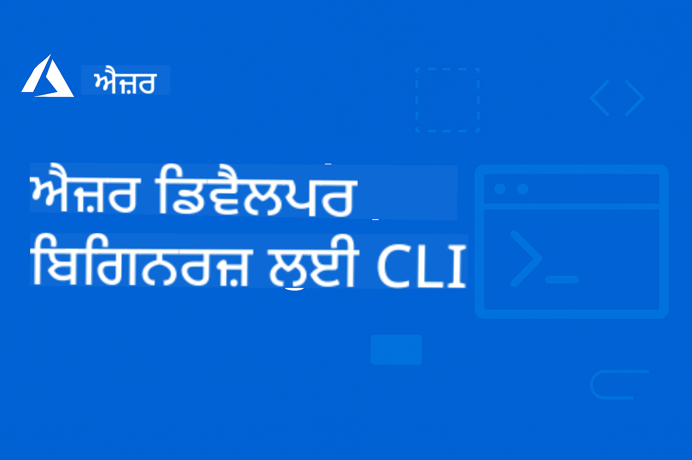

<!--
CO_OP_TRANSLATOR_METADATA:
{
  "original_hash": "6c3d0f9ef66c2cd692a55a2811d9c3e5",
  "translation_date": "2025-09-15T15:04:57+00:00",
  "source_file": "README.md",
  "language_code": "pa"
}
-->
# AZD ਸ਼ੁਰੂਆਤੀ ਲਈ

 

[](https://GitHub.com/microsoft/azd-for-beginners/watchers/)
[](https://GitHub.com/microsoft/azd-for-beginners/network/)
[](https://GitHub.com/microsoft/azd-for-beginners/stargazers/)

[](https://discord.gg/microsoft-azure)

[](https://discord.gg/kzRShWzttr)

ਇਹ ਸਰੋਤਾਂ ਦੀ ਵਰਤੋਂ ਸ਼ੁਰੂ ਕਰਨ ਲਈ ਹੇਠਾਂ ਦਿੱਤੇ ਕਦਮਾਂ ਦੀ ਪਾਲਣਾ ਕਰੋ:
1. **ਰੇਪੋਜ਼ਟਰੀ ਨੂੰ ਫੋਰਕ ਕਰੋ**: ਕਲਿਕ ਕਰੋ [](https://GitHub.com/microsoft/azd-for-beginners/fork)
2. **ਰੇਪੋਜ਼ਟਰੀ ਕਲੋਨ ਕਰੋ**: `git clone https://github.com/microsoft/azd-for-beginners.git`
3. [**Azure Discord ਕਮਿਊਨਿਟੀਜ਼ ਵਿੱਚ ਸ਼ਾਮਲ ਹੋਵੋ ਅਤੇ ਮਾਹਰਾਂ ਅਤੇ ਹੋਰ ਡਿਵੈਲਪਰਾਂ ਨਾਲ ਮਿਲੋ**](https://discord.com/invite/ByRwuEEgH4)

### ਬਹੁ-ਭਾਸ਼ਾ ਸਹਾਇਤਾ

#### GitHub Action ਰਾਹੀਂ ਸਹਾਇਤ (ਆਟੋਮੈਟਿਕ ਅਤੇ ਹਮੇਸ਼ਾ ਅਪ-ਟੂ-ਡੇਟ)

[French](../fr/README.md) | [Spanish](../es/README.md) | [German](../de/README.md) | [Russian](../ru/README.md) | [Arabic](../ar/README.md) | [Persian (Farsi)](../fa/README.md) | [Urdu](../ur/README.md) | [Chinese (Simplified)](../zh/README.md) | [Chinese (Traditional, Macau)](../mo/README.md) | [Chinese (Traditional, Hong Kong)](../hk/README.md) | [Chinese (Traditional, Taiwan)](../tw/README.md) | [Japanese](../ja/README.md) | [Korean](../ko/README.md) | [Hindi](../hi/README.md) | [Bengali](../bn/README.md) | [Marathi](../mr/README.md) | [Nepali](../ne/README.md) | [Punjabi (Gurmukhi)](./README.md) | [Portuguese (Portugal)](../pt/README.md) | [Portuguese (Brazil)](../br/README.md) | [Italian](../it/README.md) | [Polish](../pl/README.md) | [Turkish](../tr/README.md) | [Greek](../el/README.md) | [Thai](../th/README.md) | [Swedish](../sv/README.md) | [Danish](../da/README.md) | [Norwegian](../no/README.md) | [Finnish](../fi/README.md) | [Dutch](../nl/README.md) | [Hebrew](../he/README.md) | [Vietnamese](../vi/README.md) | [Indonesian](../id/README.md) | [Malay](../ms/README.md) | [Tagalog (Filipino)](../tl/README.md) | [Swahili](../sw/README.md) | [Hungarian](../hu/README.md) | [Czech](../cs/README.md) | [Slovak](../sk/README.md) | [Romanian](../ro/README.md) | [Bulgarian](../bg/README.md) | [Serbian (Cyrillic)](../sr/README.md) | [Croatian](../hr/README.md) | [Slovenian](../sl/README.md) | [Ukrainian](../uk/README.md) | [Burmese (Myanmar)](../my/README.md)

**ਜੇ ਤੁਸੀਂ ਹੋਰ ਭਾਸ਼ਾਵਾਂ ਵਿੱਚ ਅਨੁਵਾਦ ਕਰਵਾਉਣਾ ਚਾਹੁੰਦੇ ਹੋ ਤਾਂ ਸਹਾਇਤ ਭਾਸ਼ਾਵਾਂ ਦੀ ਸੂਚੀ [ਇੱਥੇ](https://github.com/Azure/co-op-translator/blob/main/getting_started/supported-languages.md) ਉਪਲਬਧ ਹੈ।**

## ਪਰਿਚਯ

Azure Developer CLI (azd) ਲਈ ਵਿਸਤ੍ਰਿਤ ਗਾਈਡ ਵਿੱਚ ਤੁਹਾਡਾ ਸਵਾਗਤ ਹੈ। ਇਹ ਰੇਪੋਜ਼ਟਰੀ ਵਿਦਿਆਰਥੀਆਂ ਤੋਂ ਲੈ ਕੇ ਪੇਸ਼ੇਵਰ ਡਿਵੈਲਪਰਾਂ ਤੱਕ ਹਰ ਪੱਧਰ ਦੇ ਡਿਵੈਲਪਰਾਂ ਨੂੰ ਸਿਖਾਉਣ ਅਤੇ Azure Developer CLI ਨੂੰ ਸਮਝਣ ਵਿੱਚ ਮਦਦ ਕਰਨ ਲਈ ਤਿਆਰ ਕੀਤੀ ਗਈ ਹੈ, **ਖਾਸ ਤੌਰ 'ਤੇ Azure AI Foundry ਦੀ ਵਰਤੋਂ ਕਰਕੇ AI ਐਪਲੀਕੇਸ਼ਨ ਡਿਪਲੌਇਮੈਂਟ 'ਤੇ ਧਿਆਨ ਦੇ ਨਾਲ।** ਇਹ ਸੰਗਠਿਤ ਸਿਖਲਾਈ ਸਰੋਤ Azure ਕਲਾਉਡ ਡਿਪਲੌਇਮੈਂਟ, ਆਮ ਸਮੱਸਿਆਵਾਂ ਦਾ ਨਿਪਟਾਰਾ ਕਰਨ, ਅਤੇ ਸਫਲ AZD ਟੈਂਪਲੇਟ ਡਿਪਲੌਇਮੈਂਟ ਲਈ ਵਧੀਆ ਤਰੀਕਿਆਂ ਨੂੰ ਲਾਗੂ ਕਰਨ ਲਈ ਹੱਥ-ਅਨੁਭਵ ਪ੍ਰਦਾਨ ਕਰਦਾ ਹੈ।

### **AI ਡਿਵੈਲਪਰਾਂ ਲਈ ਇਹ ਗਾਈਡ ਕਿਉਂ ਮਹੱਤਵਪੂਰਨ ਹੈ**
ਸਾਡੇ ਹਾਲੀਆ Azure AI Foundry Discord ਕਮਿਊਨਿਟੀ ਪੋਲ ਦੇ ਅਧਾਰ 'ਤੇ, **45% ਡਿਵੈਲਪਰ AZD ਨੂੰ AI ਵਰਕਲੋਡ ਲਈ ਵਰਤਣ ਵਿੱਚ ਦਿਲਚਸਪੀ ਰੱਖਦੇ ਹਨ** ਪਰ ਹੇਠਾਂ ਦਿੱਤੀਆਂ ਚੁਣੌਤੀਆਂ ਦਾ ਸਾਹਮਣਾ ਕਰਦੇ ਹਨ:
- ਜਟਿਲ ਬਹੁ-ਸੇਵਾ AI ਆਰਕੀਟੈਕਚਰ
- ਪ੍ਰੋਡਕਸ਼ਨ AI ਡਿਪਲੌਇਮੈਂਟ ਲਈ ਵਧੀਆ ਤਰੀਕੇ
- Azure AI ਸੇਵਾ ਇੰਟੀਗ੍ਰੇਸ਼ਨ ਅਤੇ ਕਨਫਿਗਰੇਸ਼ਨ
- AI ਵਰਕਲੋਡ ਲਈ ਲਾਗਤ ਦਾ ਅਨੁਕੂਲਨ
- AI-ਵਿਸ਼ੇਸ਼ ਡਿਪਲੌਇਮੈਂਟ ਸਮੱਸਿਆਵਾਂ ਦਾ ਨਿਪਟਾਰਾ

## ਸਿਖਲਾਈ ਦੇ ਲਕਸ਼

ਇਸ ਰੇਪੋਜ਼ਟਰੀ 'ਤੇ ਕੰਮ ਕਰਕੇ, ਤੁਸੀਂ:
- Azure Developer CLI ਦੇ ਮੁੱਢਲੇ ਸਿਧਾਂਤ ਅਤੇ ਮੁੱਖ ਧਾਰਨਾਵਾਂ ਨੂੰ ਸਮਝਣਾ
- Infrastructure as Code ਦੀ ਵਰਤੋਂ ਕਰਕੇ Azure ਸਰੋਤਾਂ ਨੂੰ ਡਿਪਲੌਇ ਅਤੇ ਪ੍ਰੋਵਿਜ਼ਨ ਕਰਨਾ ਸਿੱਖਣਾ
- ਆਮ AZD ਡਿਪਲੌਇਮੈਂਟ ਸਮੱਸਿਆਵਾਂ ਲਈ ਨਿਪਟਾਰਾ ਕੌਸ਼ਲ ਵਿਕਸਿਤ ਕਰਨਾ
- ਪ੍ਰੀ-ਡਿਪਲੌਇਮੈਂਟ ਵੈਧਤਾ ਅਤੇ ਸਮਰੱਥਾ ਯੋਜਨਾ ਨੂੰ ਸਮਝਣਾ
- ਸੁਰੱਖਿਆ ਦੇ ਵਧੀਆ ਤਰੀਕੇ ਅਤੇ ਲਾਗਤ ਅਨੁਕੂਲਨ ਰਣਨੀਤੀਆਂ ਨੂੰ ਲਾਗੂ ਕਰਨਾ
- Azure 'ਤੇ ਪ੍ਰੋਡਕਸ਼ਨ-ਤਿਆਰ ਐਪਲੀਕੇਸ਼ਨ ਡਿਪਲੌਇ ਕਰਨ ਵਿੱਚ ਭਰੋਸਾ ਬਣਾਉਣਾ

## ਸਿੱਖਣ ਦੇ ਨਤੀਜੇ

ਇਹ ਕੋਰਸ ਪੂਰਾ ਕਰਨ ਤੋਂ ਬਾਅਦ, ਤੁਸੀਂ:
- ਸਫਲਤਾਪੂਰਵਕ Azure Developer CLI ਨੂੰ ਇੰਸਟਾਲ, ਕਨਫਿਗਰ ਅਤੇ ਵਰਤ ਸਕਦੇ ਹੋ
- AZD ਟੈਂਪਲੇਟ ਦੀ ਵਰਤੋਂ ਕਰਕੇ ਐਪਲੀਕੇਸ਼ਨ ਬਣਾਉਣਾ ਅਤੇ ਡਿਪਲੌਇ ਕਰਨਾ
- ਪ੍ਰਮਾਣਿਕਤਾ, ਇੰਫਰਾਸਟਰਕਚਰ ਅਤੇ ਡਿਪਲੌਇਮੈਂਟ ਸਮੱਸਿਆਵਾਂ ਦਾ ਨਿਪਟਾਰਾ ਕਰਨਾ
- ਪ੍ਰੀ-ਡਿਪਲੌਇਮੈਂਟ ਚੈੱਕ ਕਰਨਾ ਜਿਸ ਵਿੱਚ ਸਮਰੱਥਾ ਯੋਜਨਾ ਅਤੇ SKU ਚੋਣ ਸ਼ਾਮਲ ਹੈ
- ਮਾਨਟਰਿੰਗ, ਸੁਰੱਖਿਆ ਅਤੇ ਲਾਗਤ ਪ੍ਰਬੰਧਨ ਦੇ ਵਧੀਆ ਤਰੀਕੇ ਲਾਗੂ ਕਰਨਾ
- AZD ਵਰਕਫਲੋਜ਼ ਨੂੰ CI/CD ਪਾਈਪਲਾਈਨ ਵਿੱਚ ਇੰਟੀਗ੍ਰੇਟ ਕਰਨਾ

## ਸਮੱਗਰੀ ਦੀ ਸੂਚੀ

- [Azure Developer CLI ਕੀ ਹੈ?](../..)
- [ਤੁਰੰਤ ਸ਼ੁਰੂਆਤ](../..)
- [ਸਿੱਖਣ ਦਾ ਪਾਥ](../..)
  - [AI ਡਿਵੈਲਪਰਾਂ ਲਈ (ਇੱਥੇ ਸ਼ੁਰੂ ਕਰਨ ਦੀ ਸਿਫਾਰਸ਼ ਕੀਤੀ ਗਈ ਹੈ!)](../..)
  - [ਵਿਦਿਆਰਥੀਆਂ ਅਤੇ ਸ਼ੁਰੂਆਤ ਕਰਨ ਵਾਲਿਆਂ ਲਈ](../..)
  - [ਡਿਵੈਲਪਰਾਂ ਲਈ](../..)
  - [DevOps ਇੰਜੀਨੀਅਰਾਂ ਲਈ](../..)
- [ਦਸਤਾਵੇਜ਼](../..)
  - [ਸ਼ੁਰੂਆਤ](../..)
  - [ਡਿਪਲੌਇਮੈਂਟ ਅਤੇ ਪ੍ਰੋਵਿਜ਼ਨਿੰਗ](../..)
  - [ਪ੍ਰੀ-ਡਿਪਲੌਇਮੈਂਟ ਚੈੱਕ](../..)
  - [AI ਅਤੇ Azure AI Foundry](../..)
  - [ਨਿਪਟਾਰਾ](../..)
- [ਉਦਾਹਰਨਾਂ ਅਤੇ ਟੈਂਪਲੇਟ](../..)
  - [ਫੀਚਰਡ: Azure AI Foundry ਟੈਂਪਲੇਟ](../..)
  - [ਫੀਚਰਡ: Azure AI Foundry E2E ਸਿਨੇਰੀਓ](../..)
  - [ਵਾਧੂ AZD ਟੈਂਪਲੇਟ](../..)
  - [ਹੱਥ-ਅਨੁਭਵ ਲੈਬ ਅਤੇ ਵਰਕਸ਼ਾਪ](../..)
- [ਸਰੋਤ](../..)
- [ਯੋਗਦਾਨ](../..)
- [ਸਹਾਇਤਾ](../..)
- [ਕਮਿਊਨਿਟੀ](../..)

## Azure Developer CLI ਕੀ ਹੈ?

Azure Developer CLI (azd) ਇੱਕ ਡਿਵੈਲਪਰ-ਕੇਂਦਰਤ ਕਮਾਂਡ-ਲਾਈਨ ਇੰਟਰਫੇਸ ਹੈ ਜੋ Azure 'ਤੇ ਐਪਲੀਕੇਸ਼ਨ ਬਣਾਉਣ ਅਤੇ ਡਿਪਲੌਇ ਕਰਨ ਦੀ ਪ੍ਰਕਿਰਿਆ ਨੂੰ ਤੇਜ਼ ਕਰਦਾ ਹੈ। ਇਹ ਪ੍ਰਦਾਨ ਕਰਦਾ ਹੈ:

- **ਟੈਂਪਲੇਟ-ਅਧਾਰਿਤ ਡਿਪਲੌਇਮੈਂਟ** - ਆਮ ਐਪਲੀਕੇਸ਼ਨ ਪੈਟਰਨ ਲਈ ਪੂਰਵ-ਨਿਰਮਿਤ ਟੈਂਪਲੇਟ ਦੀ ਵਰਤੋਂ ਕਰੋ
- **Infrastructure as Code** - Bicep ਜਾਂ Terraform ਦੀ ਵਰਤੋਂ ਕਰਕੇ Azure ਸਰੋਤਾਂ ਦਾ ਪ੍ਰਬੰਧਨ ਕਰੋ
- **ਇੰਟੀਗ੍ਰੇਟਡ ਵਰਕਫਲੋਜ਼** - ਐਪਲੀਕੇਸ਼ਨ ਪ੍ਰੋਵਿਜ਼ਨ, ਡਿਪਲੌਇ ਅਤੇ ਮਾਨਟਰ ਕਰਨ ਲਈ ਬੇਹਤਰੀਨ ਤਰੀਕੇ
- **ਡਿਵੈਲਪਰ-ਫ੍ਰੈਂਡਲੀ** - ਡਿਵੈਲਪਰ ਦੀ ਉਤਪਾਦਕਤਾ ਅਤੇ ਅਨੁਭਵ ਲਈ ਅਨੁਕੂਲਿਤ

### **AZD + Azure AI Foundry: AI ਡਿਪਲੌਇਮੈਂਟ ਲਈ ਬਿਹਤਰ**

**AI ਹੱਲਾਂ ਲਈ AZD ਕਿਉਂ?** AZD ਉਹ ਮੁੱਖ ਚੁਣੌਤੀਆਂ ਦਾ ਹੱਲ ਕਰਦਾ ਹੈ ਜੋ AI ਡਿਵੈਲਪਰ ਸਾਹਮਣਾ ਕਰਦੇ ਹਨ:

- **AI-ਤਿਆਰ ਟੈਂਪਲੇਟ** - Azure OpenAI, Cognitive Services, ਅਤੇ ML ਵਰਕਲੋਡ ਲਈ ਪੂਰਵ-ਕਨਫਿਗਰਡ ਟੈਂਪਲੇਟ
- **ਸੁਰੱਖਿਅਤ AI ਡਿਪਲੌਇਮੈਂਟ** - AI ਸੇਵਾਵਾਂ, API ਕੁੰਜੀਆਂ, ਅਤੇ ਮਾਡਲ ਐਂਡਪੋਇੰਟ ਲਈ ਬਣਾਈ ਗਈ ਸੁਰੱਖਿਆ ਪੈਟਰਨ
- **ਪ੍ਰੋਡਕਸ਼ਨ AI ਪੈਟਰਨ** - ਸਕੇਲਬਲ, ਲਾਗਤ-ਅਨੁਕੂਲ AI ਐਪਲੀਕੇਸ਼ਨ ਡਿਪਲੌਇਮੈਂਟ ਲਈ ਵਧੀਆ ਤਰੀਕੇ
- **ਐਂਡ-ਟੂ-ਐਂਡ AI ਵਰਕਫਲੋਜ਼** - ਮਾਡਲ ਵਿਕਾਸ ਤੋਂ ਲੈ ਕੇ ਪ੍ਰੋਡਕਸ਼ਨ ਡਿਪਲੌਇਮੈਂਟ ਤੱਕ ਸਹੀ ਮਾਨਟਰਿੰਗ ਦੇ ਨਾਲ
- **ਲਾਗਤ ਦਾ ਅਨੁਕੂਲਨ** - AI ਵਰਕਲੋਡ ਲਈ ਸਮਰੱਥ ਸਰੋਤ ਅਲੋਕੇਸ਼ਨ ਅਤੇ ਸਕੇਲਿੰਗ ਰਣਨੀਤੀਆਂ
- **Azure AI Foundry ਇੰਟੀਗ੍ਰੇਸ਼ਨ** - AI Foundry ਮਾਡਲ ਕੈਟਾਲੌਗ ਅਤੇ ਐਂਡਪੋਇੰਟ ਨਾਲ ਸਹੀ ਕਨੈਕਸ਼ਨ

## ਤੁਰੰਤ ਸ਼ੁਰੂਆਤ

### ਪੂਰਵ-ਸ਼ਰਤਾਂ
- Azure ਸਬਸਕ੍ਰਿਪਸ਼ਨ
- Azure CLI ਇੰਸਟਾਲ ਕੀਤੀ ਹੋਈ
- Git (ਟੈਂਪਲੇਟ ਕਲੋਨ ਕਰਨ ਲਈ)

### ਇੰਸਟਾਲੇਸ਼ਨ
```bash
# Windows (PowerShell)
powershell -ex AllSigned -c "Invoke-RestMethod 'https://aka.ms/install-azd.ps1' | Invoke-Expression"

# macOS/Linux
curl -fsSL https://aka.ms/install-azd.sh | bash
```

### ਤੁਹਾਡਾ ਪਹਿਲਾ ਡਿਪਲੌਇਮੈਂਟ
```bash
# Initialize a new project
azd init --template todo-nodejs-mongo

# Provision Azure resources and deploy
azd up
```

### ਤੁਹਾਡਾ ਪਹਿਲਾ AI ਡਿਪਲੌਇਮੈਂਟ
```bash
# Initialize an AI-powered chat application with Azure OpenAI
azd init --template azure-search-openai-demo

# Configure AI services and deploy
azd up

# Or try other AI templates:
azd init --template openai-chat-app-quickstart
azd init --template ai-document-processing
azd init --template contoso-chat
```

## ਸਿੱਖਣ ਦਾ ਪਾਥ

### AI ਡਿਵੈਲਪਰਾਂ ਲਈ (ਇੱਥੇ ਸ਼ੁਰੂ ਕਰਨ ਦੀ ਸਿਫਾਰਸ਼ ਕੀਤੀ ਗਈ ਹੈ!)
1. **ਤੁਰੰਤ ਸ਼ੁਰੂਆਤ**: [azure-search-openai-demo](https://github.com/Azure-Samples/azure-search-openai-demo) ਟੈਂਪਲੇਟ ਦੀ ਕੋਸ਼ਿਸ਼ ਕਰੋ
2. **ਮੁੱਢਲੇ ਸਿਧਾਂਤ ਸਿੱਖੋ**: [AZD Basics](docs/getting-started/azd-basics.md) + [Azure AI Foundry Integration](docs/ai-foundry/azure-ai-foundry-integration.md)
3. **ਹੱਥ-ਅਨੁਭਵ ਅਭਿਆਸ**: [AI Workshop Lab](docs/ai-foundry/ai-workshop-lab.md) ਪੂਰਾ ਕਰੋ
4. **ਪ੍ਰੋਡਕਸ਼ਨ ਤਿਆਰ**: [Production AI Best Practices](docs/ai-foundry/production-ai-practices.md) ਦੀ ਸਮੀਖਾ ਕਰੋ
5. **ਉੱਚ-ਪੱਧਰ**: [contoso-chat](https://github.com/Azure-Samples/contoso-chat) ਐਂਟਰਪ੍ਰਾਈਜ਼ ਟੈਂਪਲੇਟ ਡਿਪਲੌਇ ਕਰੋ

### ਵਿਦਿਆਰਥੀਆਂ ਅਤੇ ਸ਼ੁਰੂਆਤ ਕਰਨ ਵਾਲਿਆਂ ਲਈ
1. [AZD Basics](docs/getting-started/azd-basics.md) ਨਾਲ ਸ਼ੁਰੂ ਕਰੋ
2. [Installation Guide](docs/getting-started/installation.md) ਦੀ ਪਾਲਣਾ ਕਰੋ
3. [Your First Project](docs/getting-started/first-project.md) ਪੂਰਾ ਕਰੋ
4. [Simple Web App Example](../../examples/simple-web-app) ਨਾਲ ਅਭਿਆਸ ਕਰੋ

### ਡਿਵੈਲਪਰਾਂ ਲਈ
1. [Configuration Guide](docs/getting-started/configuration.md) ਦੀ ਸਮੀਖਾ ਕਰੋ
2. [Deployment Guide](docs/deployment/deployment-guide.md) ਦਾ ਅਧਿਐਨ ਕਰੋ
3. [Database App Example](../../examples/database-app) 'ਤੇ ਕੰਮ ਕਰੋ
4. [Container App Example](../../examples/container-app) ਦੀ ਖੋਜ ਕਰੋ

### DevOps ਇੰਜੀਨੀਅਰਾਂ ਲਈ
1. [Provisioning Resources](docs/deployment/provisioning.md) ਨੂੰ ਸਮਝੋ
2. [Pre-flight Checks](docs/pre-deployment/preflight-checks.md) ਲਾਗੂ ਕਰੋ
3. [Capacity Planning](docs/pre-deployment/capacity-planning.md) 'ਤੇ ਅਭਿਆਸ ਕਰੋ
4. ਉੱਚ-ਪੱਧਰ [Microservices Example](../../examples/microservices) ਪੂਰਾ ਕਰੋ

## ਦਸਤਾਵੇਜ਼

### ਸ਼ੁਰੂਆਤ
- [**AZD Basics**](docs/getting-started/azd-basics.md) - ਮੁੱਖ ਧਾਰਨਾਵਾਂ ਅਤੇ ਸ਼ਬਦਾਵਲੀ
- [**Installation & Setup**](docs/getting-started/installation.md) - ਪਲੇਟਫਾਰਮ-ਵਿਸ਼ੇਸ਼ ਇੰਸਟਾਲੇਸ਼ਨ ਗਾਈਡ
- [**Configuration**](docs/getting-started/configuration.md) - ਵਾਤਾਵਰਣ ਸੈਟਅੱਪ ਅਤੇ ਪ੍ਰਮਾਣਿਕਤਾ
- [**Your First Project**](docs/getting-started/first-project.md) - ਕਦਮ-ਦਰ-ਕਦਮ ਟਿਊਟੋਰਿਅਲ

### ਡ
- [**ਡਿਬੱਗਿੰਗ ਗਾਈਡ**](docs/troubleshooting/debugging.md) - ਕਦਮ-ਦਰ-ਕਦਮ ਡਿਬੱਗਿੰਗ ਰਣਨੀਤੀਆਂ  
- [**AI-ਵਿਸ਼ੇਸ਼ ਸਮੱਸਿਆ ਹੱਲ**](docs/troubleshooting/ai-troubleshooting.md) - AI ਸੇਵਾ ਅਤੇ ਮਾਡਲ ਡਿਪਲੌਇਮੈਂਟ ਸਮੱਸਿਆਵਾਂ  

## ਉਦਾਹਰਨਾਂ ਅਤੇ ਟੈਂਪਲੇਟ

### [ਪ੍ਰਮੁੱਖ: Azure AI Foundry ਟੈਂਪਲੇਟ](https://ai.azure.com/resource/build/templates)  
**ਜੇ ਤੁਸੀਂ AI ਐਪਲੀਕੇਸ਼ਨ ਡਿਪਲੌਇ ਕਰ ਰਹੇ ਹੋ ਤਾਂ ਇੱਥੇ ਸ਼ੁਰੂ ਕਰੋ!**

| ਟੈਂਪਲੇਟ | ਵੇਰਵਾ | ਜਟਿਲਤਾ | ਸੇਵਾਵਾਂ |
|----------|-------------|------------|----------|
| [**AI ਚੈਟ ਨਾਲ ਸ਼ੁਰੂਆਤ ਕਰੋ**](https://github.com/Azure-Samples/get-started-with-ai-chat) | Azure Container Apps ਦੀ ਵਰਤੋਂ ਕਰਕੇ ਡਾਟਾ ਅਤੇ ਟੈਲੀਮੈਟਰੀ ਇਨਸਾਈਟਸ ਨਾਲ ਇੱਕ ਬੁਨਿਆਦੀ ਚੈਟ ਐਪਲੀਕੇਸ਼ਨ ਬਣਾਓ ਅਤੇ ਡਿਪਲੌਇ ਕਰੋ |⭐⭐ | AzureOpenAI + Azure AI Model Inference API + Azure AI Search + Azure Container Apps + Application Insights |
| [**AI ਏਜੰਟਸ ਨਾਲ ਸ਼ੁਰੂਆਤ ਕਰੋ**](https://github.com/Azure-Samples/get-started-with-ai-agents) | Azure Container Apps ਦੀ ਵਰਤੋਂ ਕਰਕੇ ਕਾਰਵਾਈਆਂ ਅਤੇ ਟੈਲੀਮੈਟਰੀ ਇਨਸਾਈਟਸ ਨਾਲ ਇੱਕ ਬੁਨਿਆਦੀ ਏਜੰਟ ਐਪਲੀਕੇਸ਼ਨ ਬਣਾਓ ਅਤੇ ਡਿਪਲੌਇ ਕਰੋ। |⭐⭐ | Azure AI Agent Service + AzureOpenAI + Azure AI Search + Azure Container Apps + Application Insights|
| [**ਮਲਟੀ-ਏਜੰਟ ਵਰਕਫਲੋ ਆਟੋਮੇਸ਼ਨ**](https://github.com/Azure-Samples/get-started-with-ai-chat) | AI ਏਜੰਟਸ ਦੇ ਸਮੂਹ ਨੂੰ ਪ੍ਰਬੰਧਿਤ ਕਰਕੇ ਟਾਸਕ ਪਲੈਨਿੰਗ ਅਤੇ ਆਟੋਮੇਸ਼ਨ ਵਿੱਚ ਸੁਧਾਰ ਕਰੋ।|⭐⭐⭐ | AzureOpenAI + Azure AI Agent Service + Semantic Kernel + Azure CosmosDB + Azure Container Apps|
| [**ਤੁਹਾਡੇ ਡਾਟਾ ਤੋਂ ਦਸਤਾਵੇਜ਼ ਬਣਾਓ**](https://github.com/Azure-Samples/get-started-with-ai-chat) | ਤੁਹਾਡੇ ਡਾਟਾ ਤੋਂ ਸਬੰਧਤ ਜਾਣਕਾਰੀ ਲੱਭਣ ਅਤੇ ਸੰਖੇਪ ਕਰਨ ਦੁਆਰਾ ਦਸਤਾਵੇਜ਼ ਜਿਵੇਂ ਕਿ ਕਾਂਟ੍ਰੈਕਟ, ਚਲਾਨ ਅਤੇ ਨਿਵੇਸ਼ ਪ੍ਰਸਤਾਵ ਬਣਾਉਣ ਵਿੱਚ ਤੇਜ਼ੀ ਲਿਆਓ। |⭐⭐⭐  | AzureOpenAI + Azure AI Search + Azure AI Services + Azure CosmosDB|
| [**ਗਾਹਕ ਮੀਟਿੰਗਾਂ ਵਿੱਚ ਏਜੰਟਸ ਨਾਲ ਸੁਧਾਰ ਕਰੋ**](https://github.com/Azure-Samples/get-started-with-ai-chat) | ਪੁਰਾਣੇ ਕੋਡ ਨੂੰ ਆਧੁਨਿਕ ਭਾਸ਼ਾਵਾਂ ਵਿੱਚ ਮਾਈਗਰੇਟ ਕਰੋ। |⭐⭐⭐| AzureOpenAI + Azure AI Search + Azure CosmosDB + Azure SQL Database |
| [**ਤੁਹਾਡੇ ਕੋਡ ਨੂੰ ਏਜੰਟਸ ਨਾਲ ਆਧੁਨਿਕ ਬਣਾਓ**](https://github.com/Azure-Samples/get-started-with-ai-chat) | Azure Container Apps ਦੀ ਵਰਤੋਂ ਕਰਕੇ ਡਾਟਾ ਅਤੇ ਟੈਲੀਮੈਟਰੀ ਇਨਸਾਈਟਸ ਨਾਲ ਇੱਕ ਬੁਨਿਆਦੀ ਚੈਟ ਐਪਲੀਕੇਸ਼ਨ ਬਣਾਓ ਅਤੇ ਡਿਪਲੌਇ ਕਰੋ। |⭐⭐⭐ | AzureOpenAI + Azure Agent Service + Semantic Kernel + Azure CosmosDB + Azure Container Apps|
| [**ਤੁਹਾਡਾ ਗੱਲਬਾਤੀ ਏਜੰਟ ਬਣਾਓ**](https://github.com/Azure-Samples/get-started-with-ai-chat) | ਗੱਲਬਾਤੀ ਸਮਝ ਨੂੰ ਲਾਭਦਾਇਕ ਬਣਾਉਣ ਲਈ ਡਿਟਰਮਿਨਿਸਟਿਕ ਅਤੇ ਮਨੁੱਖ-ਨਿਯੰਤਰਿਤ ਵਰਕਫਲੋਜ਼ ਨਾਲ ਚੈਟਬੋਟਸ ਅਤੇ ਏਜੰਟਸ ਬਣਾਓ। |⭐⭐⭐ | AI Language + AzureOpenAI + AI Search + Azure Storage + Azure Container Registry|
| [**ਗੱਲਬਾਤੀ ਡਾਟਾ ਤੋਂ ਜਾਣਕਾਰੀ ਖੋਲ੍ਹੋ**](https://github.com/Azure-Samples/get-started-with-ai-chat) | ਵੱਡੇ ਆਡੀਓ ਅਤੇ ਟੈਕਸਟ-ਅਧਾਰਿਤ ਡਾਟਾ ਸੈਟਸ ਤੋਂ ਜਾਣਕਾਰੀ ਲੱਭਣ ਦੁਆਰਾ ਸੰਪਰਕ ਕੇਂਦਰ ਦੀ ਕੁਸ਼ਲਤਾ ਵਿੱਚ ਸੁਧਾਰ ਕਰੋ। |⭐⭐⭐ | AzureOpenAI + AI Search + Semantic Kernel + Azure Agent Service + AI AI Content Understanding|
| [**ਮਲਟੀ-ਮੋਡਲ ਸਮੱਗਰੀ ਪ੍ਰੋਸੈਸਿੰਗ**](https://github.com/Azure-Samples/get-started-with-ai-chat) | ਅਸੰਰਚਿਤ ਸਮੱਗਰੀ ਤੋਂ ਜਾਣਕਾਰੀ ਕੱਢ ਕੇ ਅਤੇ ਇਸਨੂੰ ਸੰਰਚਿਤ ਫਾਰਮੈਟ ਵਿੱਚ ਮੈਪ ਕਰਕੇ ਦਾਅਵੇ, ਚਲਾਨ, ਕਾਂਟ੍ਰੈਕਟ ਅਤੇ ਹੋਰ ਦਸਤਾਵੇਜ਼ ਤੇਜ਼ੀ ਅਤੇ ਸਹੀ ਤਰੀਕੇ ਨਾਲ ਪ੍ਰੋਸੈਸ ਕਰੋ। ਇਹ ਟੈਂਪਲੇਟ ਟੈਕਸਟ, ਚਿੱਤਰ, ਟੇਬਲ ਅਤੇ ਗ੍ਰਾਫਸ ਦਾ ਸਮਰਥਨ ਕਰਦਾ ਹੈ। |⭐⭐⭐⭐ | AzureOpenAI + Azure Content Understanding + Azure CosmosDB + Azure Container Apps|

### ਪ੍ਰਮੁੱਖ: Azure AI Foundry E2E ਸਨਰੀਓਜ਼  
**ਜੇ ਤੁਸੀਂ AI ਐਪਲੀਕੇਸ਼ਨ ਡਿਪਲੌਇ ਕਰ ਰਹੇ ਹੋ ਤਾਂ ਇੱਥੇ ਸ਼ੁਰੂ ਕਰੋ!**

| ਟੈਂਪਲੇਟ | ਵੇਰਵਾ | ਜਟਿਲਤਾ | ਸੇਵਾਵਾਂ |
|----------|-------------|------------|----------|
| [**openai-chat-app-quickstart**](https://github.com/Azure-Samples/openai-chat-app-quickstart) | Azure OpenAI ਨਾਲ ਸਧਾਰਨ ਚੈਟ ਇੰਟਰਫੇਸ | ⭐ | AzureOpenAI + Container Apps |
| [**azure-search-openai-demo**](https://github.com/Azure-Samples/azure-search-openai-demo) | RAG-ਸਮਰਥਿਤ ਚੈਟ ਐਪ Azure OpenAI ਨਾਲ | ⭐⭐ | AzureOpenAI + Search + App Service |
| [**ai-document-processing**](https://github.com/Azure-Samples/ai-document-processing) | AI ਸੇਵਾਵਾਂ ਨਾਲ ਦਸਤਾਵੇਜ਼ ਵਿਸ਼ਲੇਸ਼ਣ | ⭐⭐ | Azure Document Intelligence + Functions |
| [**agent-openai-python-prompty**](https://github.com/Azure-Samples/agent-openai-python-prompty) | ਫੰਕਸ਼ਨ ਕਾਲਿੰਗ ਨਾਲ AI ਏਜੰਟ ਫਰੇਮਵਰਕ | ⭐⭐⭐ | AzureOpenAI + Azure Container Apps + Functions |
| [**contoso-chat**](https://github.com/Azure-Samples/contoso-chat) | AI orchestration ਨਾਲ ਐਨਟਰਪ੍ਰਾਈਜ਼ ਚੈਟ | ⭐⭐⭐ | AzureOpenAI + Azure AI Search + Container Apps |

### ਵਾਧੂ AZD ਟੈਂਪਲੇਟ  
- [**ਉਦਾਹਰਨ ਡਾਇਰੈਕਟਰੀ**](examples/README.md) - ਵਿਹੰਗੀਕ ਉਦਾਹਰਨਾਂ, ਟੈਂਪਲੇਟ ਅਤੇ ਅਸਲ-ਦੁਨੀਆ ਦੇ ਸਨਰੀਓਜ਼  
- [**Azure-Samples AZD ਟੈਂਪਲੇਟ**](https://github.com/Azure-Samples/azd-templates) - Microsoft ਦੇ ਅਧਿਕਾਰਕ ਨਮੂਨਾ ਟੈਂਪਲੇਟ  
- [**ਸ਼ਾਨਦਾਰ AZD ਗੈਲਰੀ**](https://azure.github.io/awesome-azd/) - ਕਮਿਊਨਿਟੀ ਦੁਆਰਾ ਯੋਗਦਾਨ ਦਿੱਤੇ ਟੈਂਪਲੇਟ  

### ਹੈਂਡਸ-ਆਨ ਲੈਬਸ ਅਤੇ ਵਰਕਸ਼ਾਪ  
- [**AI ਵਰਕਸ਼ਾਪ ਲੈਬ**](docs/ai-foundry/ai-workshop-lab.md) - **ਨਵਾਂ**: ਆਪਣੀ AI ਹੱਲ AZD-ਡਿਪਲੌਇਯੋਗ ਬਣਾਓ  
- [**AZD ਸ਼ੁਰੂਆਤੀ ਵਰਕਸ਼ਾਪ**](workshop/README.md) - AZD ਟੈਂਪਲੇਟ ਡਿਪਲੌਇਮੈਂਟ 'ਤੇ ਧਿਆਨ  

## ਸਰੋਤ

### ਤੁਰੰਤ ਹਵਾਲੇ  
- [**ਕਮਾਂਡ ਚੀਟ ਸ਼ੀਟ**](resources/cheat-sheet.md) - ਜ਼ਰੂਰੀ azd ਕਮਾਂਡ  
- [**ਸ਼ਬਦਾਵਲੀ**](resources/glossary.md) - Azure ਅਤੇ azd ਸ਼ਬਦਾਵਲੀ  
- [**FAQ**](resources/faq.md) - ਅਕਸਰ ਪੁੱਛੇ ਜਾਣ ਵਾਲੇ ਸਵਾਲ  
- [**ਅਧਿਐਨ ਗਾਈਡ**](resources/study-guide.md) - ਵਿਸਤ੍ਰਿਤ ਸਿੱਖਣ ਦੇ ਉਦੇਸ਼ ਅਤੇ ਅਭਿਆਸ ਅਭਿਆਸ  

### ਬਾਹਰੀ ਸਰੋਤ  
- [Azure Developer CLI ਦਸਤਾਵੇਜ਼](https://learn.microsoft.com/en-us/azure/developer/azure-developer-cli/)  
- [Azure ਆਰਕੀਟੈਕਚਰ ਸੈਂਟਰ](https://learn.microsoft.com/en-us/azure/architecture/)  
- [Azure ਕੀਮਤ ਕੈਲਕੂਲੇਟਰ](https://azure.microsoft.com/pricing/calculator/)  
- [Azure ਸਥਿਤੀ](https://status.azure.com/)  

## ਯੋਗਦਾਨ

ਅਸੀਂ ਯੋਗਦਾਨਾਂ ਦਾ ਸਵਾਗਤ ਕਰਦੇ ਹਾਂ! ਕਿਰਪਾ ਕਰਕੇ [ਯੋਗਦਾਨ ਗਾਈਡ](CONTRIBUTING.md) ਪੜ੍ਹੋ:  
- ਮਸਲਿਆਂ ਅਤੇ ਫੀਚਰ ਦੀ ਬੇਨਤੀ ਕਿਵੇਂ ਕਰਨੀ ਹੈ  
- ਕੋਡ ਯੋਗਦਾਨ ਦੇ ਨਿਯਮ  
- ਦਸਤਾਵੇਜ਼ ਵਿੱਚ ਸੁਧਾਰ  
- ਕਮਿਊਨਿਟੀ ਮਿਆਰ  

## ਸਹਾਇਤਾ

- **ਮਸਲੇ**: [ਬੱਗ ਰਿਪੋਰਟ ਕਰੋ ਅਤੇ ਫੀਚਰ ਦੀ ਬੇਨਤੀ ਕਰੋ](https://github.com/microsoft/azd-for-beginners/issues)  
- **ਚਰਚਾ**: [Microsoft Azure Discord ਕਮਿਊਨਿਟੀ Q&A ਅਤੇ ਚਰਚਾ](https://discord.gg/microsoft-azure)  
- **AI-ਵਿਸ਼ੇਸ਼ ਸਹਾਇਤਾ**: AZD + AI Foundry ਚਰਚਾ ਲਈ [#Azure ਚੈਨਲ](https://discord.gg/microsoft-azure) ਵਿੱਚ ਸ਼ਾਮਲ ਹੋਵੋ  
- **ਈਮੇਲ**: ਨਿੱਜੀ ਪੁੱਛਗਿੱਛ ਲਈ  
- **Microsoft Learn**: [ਅਧਿਕਾਰਕ Azure Developer CLI ਦਸਤਾਵੇਜ਼](https://learn.microsoft.com/en-us/azure/developer/azure-developer-cli/)  

### ਕਮਿਊਨਿਟੀ ਅੰਦਰੂਨੀ ਜਾਣਕਾਰੀ Azure AI Foundry Discord ਤੋਂ  

**#Azure ਚੈਨਲ ਤੋਂ ਪੋਲ ਨਤੀਜੇ:**  
- **45%** ਡਿਵੈਲਪਰ AZD ਨੂੰ AI ਵਰਕਲੋਡ ਲਈ ਵਰਤਣਾ ਚਾਹੁੰਦੇ ਹਨ  
- **ਸਿਖਰ ਦੀਆਂ ਚੁਣੌਤੀਆਂ**: ਮਲਟੀ-ਸੇਵਾ ਡਿਪਲੌਇਮੈਂਟ, ਪ੍ਰਮਾਣ ਪੱਤਰ ਪ੍ਰਬੰਧਨ, ਉਤਪਾਦਨ ਤਿਆਰੀ  
- **ਸਭ ਤੋਂ ਜ਼ਿਆਦਾ ਬੇਨਤੀ ਕੀਤੀ ਗਈ**: AI-ਵਿਸ਼ੇਸ਼ ਟੈਂਪਲੇਟ, ਸਮੱਸਿਆ ਹੱਲ ਗਾਈਡ, ਸ੍ਰੇਸ਼ਠ ਅਭਿਆਸ  

**ਸਾਡੀ ਕਮਿਊਨਿਟੀ ਵਿੱਚ ਸ਼ਾਮਲ ਹੋਵੋ:**  
- ਆਪਣਾ AZD + AI ਅਨੁਭਵ ਸਾਂਝਾ ਕਰੋ ਅਤੇ ਮਦਦ ਪ੍ਰਾਪਤ ਕਰੋ  
- ਨਵੇਂ AI ਟੈਂਪਲੇਟ ਦੇ ਸ਼ੁਰੂਆਤੀ ਪ੍ਰੀਵਿਊਜ਼ ਤੱਕ ਪਹੁੰਚ ਕਰੋ  
- AI ਡਿਪਲੌਇਮੈਂਟ ਸ੍ਰੇਸ਼ਠ ਅਭਿਆਸਾਂ ਵਿੱਚ ਯੋਗਦਾਨ ਦਿਓ  
- ਭਵਿੱਖ ਦੇ AI + AZD ਫੀਚਰ ਵਿਕਾਸ ਨੂੰ ਪ੍ਰਭਾਵਿਤ ਕਰੋ  

## ਲਾਇਸੰਸ

ਇਹ ਪ੍ਰੋਜੈਕਟ MIT ਲਾਇਸੰਸ ਅਧੀਨ ਹੈ - ਵੇਰਵੇ ਲਈ [LICENSE](../../LICENSE) ਫਾਈਲ ਵੇਖੋ।  

## ਹੋਰ ਕੋਰਸ

ਸਾਡੀ ਟੀਮ ਹੋਰ ਕੋਰਸ ਤਿਆਰ ਕਰਦੀ ਹੈ! ਚੈੱਕ ਕਰੋ:  

- [**ਨਵਾਂ** ਮਾਡਲ ਕਾਂਟੈਕਸਟ ਪ੍ਰੋਟੋਕੋਲ (MCP) ਸ਼ੁਰੂਆਤ ਕਰਨ ਵਾਲਿਆਂ ਲਈ](https://github.com/microsoft/mcp-for-beginners?WT.mc_id=academic-105485-koreyst)  
- [AI ਏਜੰਟਸ ਸ਼ੁਰੂਆਤ ਕਰਨ ਵਾਲਿਆਂ ਲਈ](https://github.com/microsoft/ai-agents-for-beginners?WT.mc_id=academic-105485-koreyst)  
- [Generative AI ਸ਼ੁਰੂਆਤ ਕਰਨ ਵਾਲਿਆਂ ਲਈ .NET ਦੀ ਵਰਤੋਂ ਕਰਦੇ ਹੋਏ](https://github.com/microsoft/Generative-AI-for-beginners-dotnet?WT.mc_id=academic-105485-koreyst)  
- [Generative AI ਸ਼ੁਰੂਆਤ ਕਰਨ ਵਾਲਿਆਂ ਲਈ](https://github.com/microsoft/generative-ai-for-beginners?WT.mc_id=academic-105485-koreyst)  
- [Generative AI ਸ਼ੁਰੂਆਤ ਕਰਨ ਵਾਲਿਆਂ ਲਈ ਜਾਵਾ ਦੀ ਵਰਤੋਂ ਕਰਦੇ ਹੋਏ](https://github.com/microsoft/generative-ai-for-beginners-java?WT.mc_id=academic-105485-koreyst)  
- [ML ਸ਼ੁਰੂਆਤ ਕਰਨ ਵਾਲਿਆਂ ਲਈ](https://aka.ms/ml-beginners?WT.mc_id=academic-105485-koreyst)  
- [ਡਾਟਾ ਸਾਇੰਸ ਸ਼ੁਰੂਆਤ ਕਰਨ ਵਾਲਿਆਂ ਲਈ](https://aka.ms/datascience-beginners?WT.mc_id=academic-105485-koreyst)  
- [AI ਸ਼ੁਰੂਆਤ ਕਰਨ ਵਾਲਿਆਂ ਲਈ](https://aka.ms/ai-beginners?WT.mc_id=academic-105485-koreyst)  
- [ਸਾਇਬਰਸੁਰੱਖਿਆ ਸ਼ੁਰੂਆਤ ਕਰਨ ਵਾਲਿਆਂ ਲਈ](https://github.com/microsoft/Security-101??WT.mc_id=academic-96948-sayoung)  
- [ਵੈੱਬ ਡਿਵ ਸ਼ੁਰੂਆਤ ਕਰਨ ਵਾਲਿਆਂ ਲਈ](https://aka.ms/webdev-beginners?WT.mc_id=academic-105485-koreyst)  
- [IoT ਸ਼ੁਰੂਆਤ ਕਰਨ ਵਾਲਿਆਂ ਲਈ](https://aka.ms/iot-beginners?WT.mc_id=academic-105485-koreyst)  
- [XR ਵਿਕਾਸ ਸ਼ੁਰੂਆਤ ਕਰਨ ਵਾਲਿਆਂ ਲਈ](https://github.com/microsoft/xr-development-for-beginners?WT.mc_id=academic-105485-koreyst)  
- [GitHub Copilot ਲਈ AI ਜੋੜੇ ਪ੍ਰੋਗਰਾਮਿੰਗ ਵਿੱਚ ਮਾਹਰ ਬਣੋ](https://aka.ms/GitHubCopilotAI?WT.mc_id=academic-105485-koreyst)  
- [GitHub Copilot ਲਈ C#/.NET ਡਿਵੈਲਪਰਜ਼ ਵਿੱਚ ਮਾਹਰ ਬਣੋ](https://github.com/microsoft/mastering-github-copilot-for-dotnet-csharp-developers?WT.mc_id=academic-105485-koreyst)  
- [ਆਪਣੀ Copilot ਮੁਹਿੰਮ ਚੁਣੋ](https://github.com/microsoft/CopilotAdventures?WT.mc_id=academic-105485-koreyst)  

---

**ਨੈਵੀਗੇਸ਼ਨ**  
- **ਅਗਲਾ ਪਾਠ**: [AZD ਬੁਨਿਆਦੀਆਂ](docs/getting-started/azd-basics.md)  

---

**ਅਸਵੀਕਾਰਨਾ**:  
ਇਹ ਦਸਤਾਵੇਜ਼ AI ਅਨੁਵਾਦ ਸੇਵਾ [Co-op Translator](https://github.com/Azure/co-op-translator) ਦੀ ਵਰਤੋਂ ਕਰਕੇ ਅਨੁਵਾਦ ਕੀਤਾ ਗਿਆ ਹੈ। ਜਦੋਂ ਕਿ ਅਸੀਂ ਸਹੀਤਾ ਲਈ ਯਤਨਸ਼ੀਲ ਹਾਂ, ਕਿਰਪਾ ਕਰਕੇ ਧਿਆਨ ਦਿਓ ਕਿ ਸਵੈਚਾਲਿਤ ਅਨੁਵਾਦਾਂ ਵਿੱਚ ਗਲਤੀਆਂ ਜਾਂ ਅਸੁਚਨਾਵਾਂ ਹੋ ਸਕਦੀਆਂ ਹਨ। ਮੂਲ ਦਸਤਾਵੇਜ਼ ਨੂੰ ਇਸਦੀ ਮੂਲ ਭਾਸ਼ਾ ਵਿੱਚ ਅਧਿਕਾਰਤ ਸਰੋਤ ਮੰਨਿਆ ਜਾਣਾ ਚਾਹੀਦਾ ਹੈ। ਮਹੱਤਵਪੂਰਨ ਜਾਣਕਾਰੀ ਲਈ, ਪੇਸ਼ੇਵਰ ਮਨੁੱਖੀ ਅਨੁਵਾਦ ਦੀ ਸਿਫਾਰਸ਼ ਕੀਤੀ ਜਾਂਦੀ ਹੈ। ਇਸ ਅਨੁਵਾਦ ਦੀ ਵਰਤੋਂ ਤੋਂ ਪੈਦਾ ਹੋਣ ਵਾਲੇ ਕਿਸੇ ਵੀ ਗਲਤਫਹਿਮੀ ਜਾਂ ਗਲਤ ਵਿਆਖਿਆ ਲਈ ਅਸੀਂ ਜ਼ਿੰਮੇਵਾਰ ਨਹੀਂ ਹਾਂ।