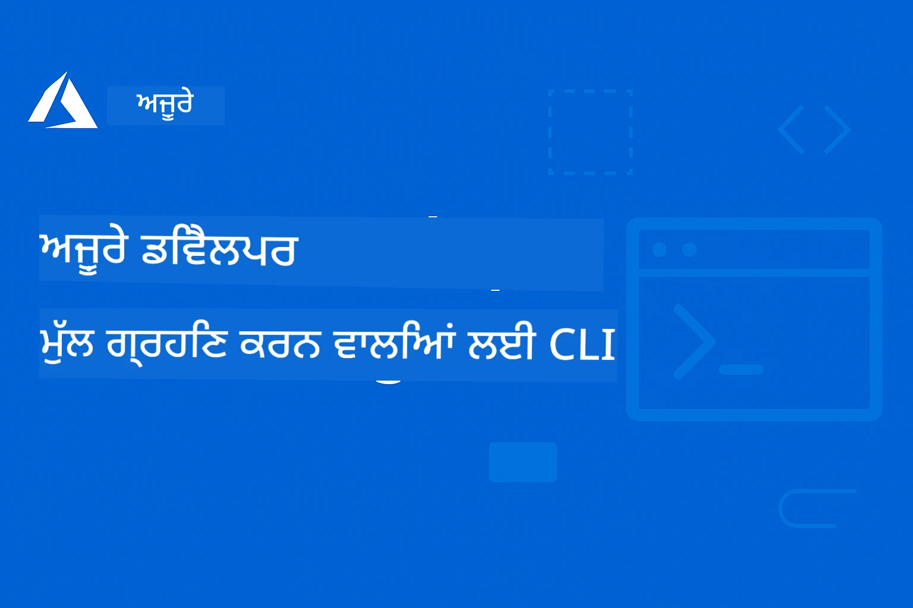

# AZD ਸ਼ੁਰੂਆਤੀਆਂ ਲਈ: ਇੱਕ ਢਾਂਚਾਬੱਧ ਸਿੱਖਣ ਯਾਤਰਾ

 

[](https://GitHub.com/microsoft/azd-for-beginners/watchers/)
[](https://GitHub.com/microsoft/azd-for-beginners/network/)
[](https://GitHub.com/microsoft/azd-for-beginners/stargazers/)

[](https://discord.com/invite/nkVh3dp)
[](https://discord.gg/nTYy5BXMWG)

---

### ਆਟੋਮੇਟਿਕ ਅਨੁਵਾਦ (ਸਦਾ ਤਾਜ਼ਾ)

<!-- CO-OP TRANSLATOR LANGUAGES TABLE START -->
[ਅਰਬੀ](../ar/README.md) | [ਬੰਗਾਲੀ](../bn/README.md) | [ਬਲਗੇਰੀਆਈ](../bg/README.md) | [ਬਰਮੀ (ਮੈਅਨਮਾਰ)](../my/README.md) | [ਚੀਨੀ (ਸਰਲੀਕ੍ਰਿਤ)](../zh-CN/README.md) | [ਚੀਨੀ (ਰਿਵਾਇਤੀ, ਹਾਂਗਕਾਂਗ)](../zh-HK/README.md) | [ਚੀਨੀ (ਰਿਵਾਇਤੀ, ਮੈਕਾਉ)](../zh-MO/README.md) | [ਚੀਨੀ (ਰਿਵਾਇਤੀ, ਤਾਈਵਾਨ)](../zh-TW/README.md) | [ਕ੍ਰੋਏਸ਼ੀਆਈ](../hr/README.md) | [ਚੈਕ](../cs/README.md) | [ਡੈਨਿਸ਼](../da/README.md) | [ਡਚ](../nl/README.md) | [ਏਸਟੋਨੀਆਈ](../et/README.md) | [ਫਿਨਲੈਂਡੀ](../fi/README.md) | [ਫ੍ਰੈਂਚ](../fr/README.md) | [ਜਰਮਨ](../de/README.md) | [ਗ੍ਰੀਕ](../el/README.md) | [ਹਿਬਰੂ](../he/README.md) | [ਹਿੰਦੀ](../hi/README.md) | [ਹੰਗੇਰੀਅਨ](../hu/README.md) | [ਇੰਡੋਨੇਸ਼ੀਆਈ](../id/README.md) | [ਇਟਾਲਵੀ](../it/README.md) | [ਜਪਾਨੀ](../ja/README.md) | [ਕੰਨੜ](../kn/README.md) | [ਖਮੇਰ](../km/README.md) | [ਕੋਰੀਆਈ](../ko/README.md) | [ਲਿਥੂਆਨੀਆਈ](../lt/README.md) | [ਮਲਯ](../ms/README.md) | [മലയാളം](../ml/README.md) | [ਮਰਾਠੀ](../mr/README.md) | [ਨੇਪਾਲੀ](../ne/README.md) | [ਨਾਈਜੀਰੀਆਈ ਪਿਡਜਿਨ](../pcm/README.md) | [ਨਾਰਵੇਜੀਅਨ](../no/README.md) | [ਪੇਰਸ਼ੀਆਈ (ਫਾਰਸੀ)](../fa/README.md) | [ਪੋਲਿਸ਼](../pl/README.md) | [ਪੁਰਤਗਾਲੀ (ਬਰਾਜ਼ੀਲ)](../pt-BR/README.md) | [ਪੁਰਤਗਾਲੀ (ਪੁਰਤਗਾਲ)](../pt-PT/README.md) | [ਪੰਜਾਬੀ (ਗੁਰਮੁਖੀ)](./README.md) | [ਰੂਮਾਨੀਆਈ](../ro/README.md) | [ਰੂਸੀ](../ru/README.md) | [ਸਰਬੀਅਨ (ਸਿਰੀਲਿਕ)](../sr/README.md) | [ਸਲੋਵਾਕ](../sk/README.md) | [ਸਲੋਵੇਨੀਅਨ](../sl/README.md) | [ਸਪੇਨੀ](../es/README.md) | [ਸਵਾਹਿਲੀ](../sw/README.md) | [ਸਵੀਡੀਸ਼](../sv/README.md) | [ਤਗਾਲੋਗ (ਫਿਲੀਪੀਨੀ)](../tl/README.md) | [ਤਮਿਲ](../ta/README.md) | [ਤੇਲਗੂ](../te/README.md) | [ਥਾਈ](../th/README.md) | [ਤੁਰਕੀ](../tr/README.md) | [ਉਕਰੇਨੀ](../uk/README.md) | [ਉਰਦੂ](../ur/README.md) | [ਵੀਅਤਨਾਮੀ](../vi/README.md)

> **ਕੀ ਤੁਸੀਂ ਇਸ ਰੀਪੋ ਨੂੰ ਲੋਕਲ ਤੌਰ 'ਤੇ ਕਲੋਨ ਕਰਨਾ ਪਸੰਦ ਕਰੋਗੇ?**
>
> ਇਹ ਰੀਪੋਜ਼ਿਟਰੀ 50+ ਭਾਸ਼ਾਈ ਅਨੁਵਾਦ ਸ਼ਾਮِل ਕਰਦੀ ਹੈ ਜੋ ਡਾਊਨਲੋਡ ਸਾਈਜ਼ ਨੂੰ ਕਾਫੀ ਵਧਾ ਦਿੰਦੀ ਹੈ। ਅਨੁਵਾਦਾਂ ਤੋਂ ਬਿਨਾਂ ਕਲੋਨ ਕਰਨ ਲਈ, sparse checkout ਦੀ ਵਰਤੋਂ ਕਰੋ:
>
> **Bash / macOS / Linux:**
> ```bash
> git clone --filter=blob:none --sparse https://github.com/microsoft/AZD-for-beginners.git
> cd AZD-for-beginners
> git sparse-checkout set --no-cone '/*' '!translations' '!translated_images'
> ```
>
> **CMD (Windows):**
> ```cmd
> git clone --filter=blob:none --sparse https://github.com/microsoft/AZD-for-beginners.git
> cd AZD-for-beginners
> git sparse-checkout set --no-cone "/*" "!translations" "!translated_images"
> ```
>
> ਇਸ ਤਰ੍ਹਾਂ ਤੁਹਾਨੂੰ ਕੋਰਸ ਮੁਕੰਮਲ ਕਰਨ ਲਈ ਲੋੜੀਂਦਾ ਸਾਰਾ ਕੁਝ ਤੇਜ਼ ਡਾਊਨਲੋਡ ਨਾਲ ਮਿਲ ਜਾਵੇਗਾ।
<!-- CO-OP TRANSLATOR LANGUAGES TABLE END -->

## 🆕 azd ਵਿੱਚ ਅੱਜ ਨਵਾਂ ਕੀ ਹੈ

Azure Developer CLI ਹੁਣ ਰਵਾਇਤੀ ਵੈੱਬ ਐਪਾਂ ਅਤੇ APIs ਤੋਂ ਅੱਗੇ ਵੱਧ ਚੁੱਕੀ ਹੈ। ਅੱਜ, azd ਇੱਕੋ ਟੂਲ ਹੈ ਜੋ Azure 'ਤੇ ਕਿਸੇ ਵੀ ਐਪਲੀਕੇਸ਼ਨ ਨੂੰ ਡਿਪਲੋਏ ਕਰਨ ਲਈ ਵਰਤੀ ਜਾ ਸਕਦੀ ਹੈ — ਜਿਸ ਵਿੱਚ AI-ਸਮਰਥਿਤ ਐਪਲੀਕੇਸ਼ਨ ਅਤੇ ਬੁੱਧੀਮਾਨ ਏਜੰਟ ਵੀ ਸ਼ਾਮਿਲ ਹਨ।

ਇਸਦਾ ਤੁਹਾਡੇ ਲਈ ਮਤਲਬ ਇਹ ਹੈ:

- **AI ਏਜੰਟ ਹੁਣ azd ਦੇ ਪ੍ਰਮੁੱਖ ਵਰਕਲੋਡ ਹਨ।** ਤੁਸੀਂ ਉਹੀ `azd init` → `azd up` ਵਰਕਫਲੋਵ ਵਰਤਕੇ AI ਏਜੰਟ ਪ੍ਰੋਜੈਕਟ ਸ਼ੁਰੂ, ਡਿਪਲੋਏ ਅਤੇ ਪ੍ਰਬੰਧਿਤ ਕਰ ਸਕਦੇ ਹੋ।
- **Microsoft Foundry ਏਕੀਕਰਨ** ਮਾਡਲ ਡਿਪਲੋਏਮੈਂਟ, ਏਜੰਟ ਹੋਸਟਿੰਗ, ਅਤੇ AI ਸੇਵਾ ਸੰਰਚਨਾ ਨੂੰ ਸਿੱਧਾ azd ਟੈਮਪਲੇਟ ਇਕੋਸਿਸਟਮ ਵਿੱਚ ਲਿਆਉਂਦਾ ਹੈ।
- **ਮੂਲ ਵਰਕਫਲੋ ਵਧੇ ਨਹੀ ਹੈ।** ਚਾਹੇ ਤੁਸੀਂ ਇੱਕ todo ਐਪ, ਮਾਈਕ੍ਰੋਸਰਵਿਸ, ਜਾਂ ਇੱਕ ਬਹੁ-ਏਜੰਟ AI ਹੱਲ ਡਿਪਲੋਏ ਕਰ ਰਹੇ ਹੋ, ਕਮਾਂਡਸ ਇੱਕੋ ਜਿਹੇ ਹਨ।

ਜੇ ਤੁਸੀਂ ਪਹਿਲਾਂ azd ਵਰਤ ਚੁੱਕੇ ਹੋ, ਤਾਂ AI ਸਮਰਥਨ ਇੱਕ ਪ੍ਰਾਕ੍ਰਿਤਿਕ ਵਾਧਾ ਹੈ — ਕੋਈ ਵੱਖਰਾ ਟੂਲ ਜਾਂ ਉੱਚ ਪੱਧਰੀ ਟ੍ਰੈਕ ਨਹੀਂ। ਜੇ ਤੁਸੀਂ ਨਵੇਂ ਹੋ, ਤਾਂ ਤੁਸੀਂ ਇੱਕ ਐਸਾ ਵਰਕਫਲੋ ਸਿੱਖੋਗੇ ਜੋ ਹਰ ਚੀਜ਼ ਲਈ ਕੰਮ ਕਰਦਾ ਹੈ।

---

## 🚀 Azure Developer CLI (azd) ਕੀ ਹੈ?

**Azure Developer CLI (azd)** ਇੱਕ ਡਿਵੈਲਪਰ-ਮਿੱਤਰ ਕਮਾਂਡ-ਲਾਈਨ ਟੂਲ ਹੈ ਜੋ Azure 'ਤੇ ਐਪਲੀਕੇਸ਼ਨਾਂ ਨੂੰ ਡਿਪਲੋਏ ਕਰਨਾ ਸੌਖਾ ਬਣਾਉਂਦਾ ਹੈ। ਸੈਂਕੜਿਆਂ Azure ਰਿਸੋਰਸ ਹੱਥੋਂ-ਹੱਥ ਬਣਾਉਣ ਅਤੇ ਜੁੜਨ ਦੀ ਥਾਂ, ਤੁਸੀਂ ਇੱਕ ਹੀ ਕਮਾਂਡ ਨਾਲ ਪੂਰੀਆਂ ਐਪਲੀਕੇਸ਼ਨਾਂ ਡਿਪਲੋਏ ਕਰ ਸਕਦੇ ਹੋ।

### `azd up` ਦਾ ਜਾਦੂ

```bash
# ਇਹ ਇਕੱਲਾ ਕਮਾਂਡ ਸਾਰਾ ਕੰਮ ਕਰਦਾ ਹੈ:
# ✅ ਸਾਰੇ ਅਜ਼ੁਰ ਸਰੋਤ ਬਣਾਉਂਦਾ ਹੈ
# ✅ ਨੈੱਟਵਰਕਿੰਗ ਅਤੇ ਸੁਰੱਖਿਆ ਨੂੰ ਸੈੱਟ ਕਰਦਾ ਹੈ
# ✅ ਤੁਹਾਡਾ ਐਪਲੀਕੇਸ਼ਨ ਕੋਡ ਤਿਆਰ ਕਰਦਾ ਹੈ
# ✅ ਅਜ਼ੁਰ 'ਤੇ ਡਿਪਲੋਇ ਕਰਦਾ ਹੈ
# ✅ ਤੁਹਾਨੂੰ ਇੱਕ ਕਾਮਯਾਬ URL ਦਿੰਦਾ ਹੈ
azd up
```

**ਬੱਸ ਇੰਨਾ ਹੀ!** ਕੋਈ Azure ਪੋਰਟਲ 'ਤੇ ਕਲਿੱਕਿੰਗ, ਕੋਈ ਜਟਿਲ ARM ਟੈਮਪਲੇਟ ਪਹਿਲਾਂ ਸਿੱਖਣ ਦੀ ਲੋੜ ਨਹੀਂ, ਕੋਈ ਹੱਥੋਂ-ਹੱਥ ਸੰਰਚਨਾ ਨਹੀਂ — ਸਿਰਫ਼ Azure 'ਤੇ ਚੱਲ ਰਹੀਆਂ ਕਾਰਜਸ਼ੀਲ ਐਪਲੀਕੇਸ਼ਨ।

---

## ❓ Azure Developer CLI ਅਤੇ Azure CLI: ਫਰਕ ਕੀ ਹੈ?

ਇਹ ਉਹ ਸਭ ਤੋਂ ਆਮ ਸਵਾਲ ਹੈ ਜੋ ਸ਼ੁਰੂਆਤੀ ਪੁੱਛਦੇ ਹਨ। ਇੱਥੇ ਸਧਾਰਨ ਜਵਾਬ ਹੈ:

| ਖਾਸੀਅਤ | **Azure CLI (`az`)** | **Azure Developer CLI (`azd`)** |
|---------|---------------------|--------------------------------|
| **ਮਕਸਦ** | ਵਿਅਕਤੀਗਤ Azure ਰਿਸੋਰਸਾਂ ਨੂੰ ਪ੍ਰਬੰਧਿਤ ਕਰੋ | ਪੂਰੀਆਂ ਐਪਲੀਕੇਸ਼ਨਾਂ ਨੂੰ ਡਿਪਲੋਏ ਕਰੋ |
| **ਦ੍ਰਿਸ਼ਟੀਕੋਣ** | ਇੰਫਰਾਸਟ੍ਰਕਚਰ-ਕੇਂਦਰਿਤ | ਐਪਲੀਕੇਸ਼ਨ-ਕੇਂਦਰਿਤ |
| **ਉਦਾਹਰਨ** | `az webapp create --name myapp...` | `azd up` |
| **ਸਿੱਖਣ ਦੀ ਲੁੜੀ** | Azure ਸੇਵਾਵਾਂ ਬਾਰੇ ਜਾਣਨਾ ਲਾਜ਼ਮੀ | ਸਿਰਫ਼ ਆਪਣੀ ਐਪ ਜਾਣੋ |
| **ਸਭ ਤੋਂ ਵਧੀਆ ਲਈ** | DevOps, Infrastructure | ਡਿਵੈਲਪર્સ, ਪ੍ਰੋਟੋਟਾਈਪਿੰਗ |

### ਸਧਾਰਨ ਤੌਰ ਤੇ ਮਿਸਾਲ

- **Azure CLI** ਉਹਨਾਂ ਸਾਰਿਆਂ ਯੰਤਰਾਂ ਵਰਗੀ ਹੈ ਜੋ ਇੱਕ ਘਰ ਤਿਆਰ ਕਰਨ ਲਈ ਲੋੜੀਂਦੇ ਹਨ - ਹਥੌੜੇ, ਦਰਾਜ, ਕੇਲ। ਤੁਸੀਂ ਕੁਝ ਵੀ ਬਣਾ ਸਕਦੇ ਹੋ, ਪਰ ਤੁਹਾਨੂੰ ਨਿਰਮਾਣ ਦਾ ਗਿਆਨ ਲੋੜੀਂਦਾ ਹੈ।
- **Azure Developer CLI** ਇੱਕ ਠੇਕੇਦਾਰ ਹਾਇਰ ਕਰਨ ਵਰਗਾ ਹੈ - ਤੁਸੀਂ ਦੱਸੋ ਕਿ ਤੁਸੀਂ ਕੀ ਚਾਹੁੰਦੇ ਹੋ, ਅਤੇ ਉਹ ਬਨਾਉਂਦੇ ਹਨ।

### ਕਦੋਂ ਕਿਸਦੀ ਵਰਤੋਂ ਕਰੋ

| ਪਰਿਸਥਿਤੀ | ਇਹ ਵਰਤੋ |
|----------|----------|
| "ਮੈਂ ਆਪਣੀ ਵੇਬ ਐਪ ਜਲਦੀ ਡਿਪਲੋਏ ਕਰਨੀ ਚਾਹੁੰਦਾ/ਚਾਹੁੰਦੀ ਹਾਂ" | `azd up` |
| "ਮੈਨੂੰ ਸਿਰਫ਼ ਇੱਕ storage account ਬਣਾਉਣਾ ਹੈ" | `az storage account create` |
| "ਮੈਂ ਇੱਕ ਪੂਰਾ AI ਐਪ ਤਿਆਰ ਕਰ ਰਿਹਾ/ਰਿਹੀ ਹਾਂ" | `azd init --template azure-search-openai-demo` |
| "ਮੈਨੂੰ ਕਿਸੇ ਖਾਸ Azure ਰਿਸੋਰਸ ਨੂੰ ਡਿਬੱਗ ਕਰਨਾ ਹੈ" | `az resource show` |
| "ਮੈਂ ਮਿੰਟਾਂ ਵਿੱਚ ਪ੍ਰੋਡਕਸ਼ਨ-ਤਿਅਰ ਡਿਪਲੋਏਮੈਂਟ ਚਾਹੁੰਦਾ/ਚਾਹੁੰਦੀ ਹਾਂ" | `azd up --environment production` |

### ਇਹ ਇਕੱਠੇ ਕੰਮ ਕਰਦੇ ਹਨ!

AZD ਅੰਦਰੋਂ Azure CLI ਦੀ ਵਰਤੋਂ ਕਰਦਾ ਹੈ। ਤੁਸੀਂ ਦੋਹਾਂ ਵਰਤ ਸਕਦੇ ਹੋ:
```bash
# ਆਪਣੇ ਐਪ ਨੂੰ AZD ਨਾਲ ਤਾਇਨਾਤ ਕਰੋ
azd up

# ਫਿਰ Azure CLI ਨਾਲ ਖ਼ਾਸ ਸਰੋਤਾਂ ਨੂੰ ਬਿਹਤਰ ਬਣਾਓ
az webapp config set --name myapp --always-on true
```

---

## 🌟 Awesome AZD ਵਿਚ ਟੈਮਪਲੇਟ ਲੱਭੋ

ਸ਼ੁਰੂਆਤ ਤੋਂ ਨਹੀਂ ਬਣਾਉਣਾ! **Awesome AZD** ਭਾਈਚਾਰੇ ਦਾ ਤਿਆਰ-ਡਿਪਲੋਏ ਟੈਮਪਲੇਟ ਸੰਗ੍ਰਹਿ ਹੈ:

| ਸਰੋਤ | ਵੇਰਵਾ |
|----------|-------------|
| 🔗 [**Awesome AZD ਗੈਲਰੀ**](https://azure.github.io/awesome-azd/) | ਇੱਕ-ਕਲਿੱਕ ਡਿਪਲੋਏ ਨਾਲ 200+ ਟੈਮਪਲੇਟ ਵੇਖੋ |
| 🔗 [**ਟੈਮਪਲੇਟ ਜਮ੍ਹਾਂ ਕਰੋ**](https://github.com/Azure/awesome-azd/issues) | ਆਪਣਾ ਟੈਮਪਲੇਟ ਭਾਈਚਾਰੇ ਨੂੰ ਦਿਓ |
| 🔗 [**GitHub ਰੀਪੋਜ਼ਟਰੀ**](https://github.com/Azure/awesome-azd) | ਸਟਾਰ ਕਰੋ ਅਤੇ ਸੋਰਸ ਖੋਜੋ |

### Awesome AZD ਤੋਂ ਪ੍ਰਸਿੱਧ AI ਟੈਮਪਲੇਟ

```bash
# Microsoft Foundry ਮਾਡਲਾਂ ਅਤੇ AI ਖੋਜ ਨਾਲ RAG ਗੱਲਬਾਤ
azd init --template azure-search-openai-demo

# ਤੇਜ਼ AI ਗੱਲਬਾਤ ਐਪਲੀਕੇਸ਼ਨ
azd init --template openai-chat-app-quickstart

# Foundry ਏਜੰਟਾਂ ਨਾਲ AI ਏਜੰਟਸ
azd init --template get-started-with-ai-agents
```

---

## 🎯 3 ਕਦਮਾਂ ਵਿੱਚ ਸ਼ੁਰੂਆਤ

ਸ਼ੁਰੂ ਕਰਨ ਤੋਂ ਪਹਿਲਾਂ, ਯਕੀਨੀ ਬਣਾਓ ਕਿ ਤੁਹਾਡੀ ਮਸ਼ੀਨ ਉਸ ਟੈਮਪਲੇਟ ਲਈ ਤਿਆਰ ਹੈ ਜੋ ਤੁਸੀਂ ਡਿਪਲੋਏ ਕਰਨਾ ਚਾਹੁੰਦੇ ਹੋ:

**Windows:**
```powershell
.\validate-setup.ps1
```

**macOS / Linux:**
```bash
bash ./validate-setup.sh
```

ਜੇ ਕੋਈ ਲੋੜੀਂਦੀ ਜਾਂਚ ਅਸਫਲ ਹੁੰਦੀ ਹੈ, ਤਾਂ ਪਹਿਲਾਂ ਉਸ ਨੂੰ ਠੀਕ ਕਰੋ ਅਤੇ ਫਿਰ ਕਵਿਕ ਸਟਾਰਟ ਨਾਲ ਜਾਰੀ ਰੱਖੋ।

### ਕਦਮ 1: AZD ਇੰਸਟਾਲ ਕਰੋ (2 ਮਿੰਟ)

**Windows:**
```powershell
winget install microsoft.azd
```

**macOS:**
```bash
brew tap azure/azd && brew install azd
```

**Linux:**
```bash
curl -fsSL https://aka.ms/install-azd.sh | bash
```

### ਕਦਮ 2: AZD ਲਈ ਪ੍ਰਮਾਣਿਕਤਾ

```bash
# ਜੇ ਤੁਸੀਂ ਇਸ ਕੋਰਸ ਵਿੱਚ ਸੀਧਾ Azure CLI ਹੁਕਮ ਵਰਤਣ ਦਾ ਯੋਜਨਾ ਬਣਾਈ ਹੈ ਤਾਂ ਵੈਕਲਪਿਕ
az login

# AZD ਵਰਕਫਲੋਜ਼ ਲਈ ਲਾਜ਼ਮੀ
azd auth login
```

ਜੇ ਤੁਹਾਨੂੰ ਪਤਾ ਨਹੀਂ ਕਿ ਤੁਹਾਨੂੰ ਕਿਹੜੀ ਲੋੜ ਹੈ, ਤਾਂ ਪੂਰੇ ਸੈਟਅਪ ਫਲੋ ਲਈ [ਇੰਸਟਾਲੇਸ਼ਨ ਅਤੇ ਸੈਟਅਪ](docs/chapter-01-foundation/installation.md#authentication-setup) ਦੇ ਨਿਰਦੇਸ਼ਾਂ ਦੀ ਪਾਲਣਾ ਕਰੋ।

### ਕਦਮ 3: ਆਪਣੀ ਪਹਿਲੀ ਐਪ ਡਿਪਲੋਏ ਕਰੋ

```bash
# ਟੈਮਪਲੇਟ ਤੋਂ ਸ਼ੁਰੂਆਤ ਕਰੋ
azd init --template todo-nodejs-mongo

# ਅਜ਼ੂਰ 'ਤੇ ਰੋਲਆਉਟ ਕਰੋ (ਸਭ ਕੁਝ ਬਣਾਉਂਦਾ ਹੈ!)
azd up
```

**🎉 ਹੋ ਗਿਆ!** ਤੁਹਾਡੀ ਐਪ ਹੁਣ Azure 'ਤੇ ਲਾਈਵ ਹੈ।

### ਸਾਫ਼-ਸਫਾਈ (ਭੁੱਲਣਾ ਨਾ!)

```bash
# Remove all resources when done experimenting
azd down --force --purge
```

---

## 📚 ਇਸ ਕੋਰਸ ਦੀ ਵਰਤੋਂ ਕਿਵੇਂ ਕਰੋ

ਇਹ ਕੋਰਸ "ਕ੍ਰਮਬੱਧ ਸਿੱਖਿਆ" ਲਈ ਡਿਜ਼ਾਇਨ ਕੀਤਾ ਗਿਆ ਹੈ - ਉਥੋਂ ਸ਼ੁਰੂ ਕਰੋ ਜਿੱਥੇ ਤੁਸੀਂ ਆਰਾਮਦਾਇਕ ਮਹਿਸੂਸ ਕਰਦੇ ਹੋ ਅਤੇ ਉੱਪਰ ਵਧੋ:

| ਤੁਹਾਡਾ ਅਨੁਭਵ | ਇੱਥੇ ਸ਼ੁਰੂ ਕਰੋ |
|-----------------|------------|
| **Azure ਲਈ ਨਵਾਂ** | [ਅਧਿਆਇ 1: ਬੁਨਿਆਦ](#-chapter-1-foundation--quick-start) |
| **Azure ਜਾਣਦੇ ਹੋ, AZD ਨਵਾਂ** | [ਅਧਿਆਇ 1: ਬੁਨਿਆਦ](#-chapter-1-foundation--quick-start) |
| **AI ਐਪ ਡਿਪਲੋਏ ਕਰਨਾ ਚਾਹੁੰਦੇ ਹੋ** | [ਅਧਿਆਇ 2: AI-ਪਹਿਲਾ ਵਿਕਾਸ](#-chapter-2-ai-first-development-recommended-for-ai-developers) |
| **ਹਥੋਂ-ਹਥ ਅਭਿਆਸ ਚਾਹੁੰਦੇ ਹੋ** | [🎓 ਇੰਟਰਐਕਟਿਵ ਵਰਕਸ਼ਾਪ](workshop/README.md) - 3-4 ਘੰਟੇ ਦੀ ਰਹਿਨੁਮਾ ਲੈਬ |
| **ਉਤਪਾਦਨ ਪੈਟਰਨ ਚਾਹੁੰਦੇ ਹੋ** | [ਅਧਿਆਇ 8: ਪ੍ਰੋਡਕਸ਼ਨ ਅਤੇ ਐਨਟਰਪ੍ਰਾਈਜ਼](#-chapter-8-production--enterprise-patterns) |

### ਤੁਰੰਤ ਸੈਟਅਪ

1. **ਇਸ ਰੀਪੋਜ਼ਿਟਰੀ ਨੂੰ Fork ਕਰੋ**: [](https://GitHub.com/microsoft/azd-for-beginners/fork)
2. **ਇਸਨੂੰ ਕਲੋਨ ਕਰੋ**: `git clone https://github.com/YOUR-USERNAME/azd-for-beginners.git`
3. **ਮਦਦ ਪ੍ਰਾਪਤ ਕਰੋ**: [Azure ਡਿਸਕੋਰਡ ਸਮੂਹ](https://discord.com/invite/ByRwuEEgH4)

> **ਕੀ ਤੁਸੀਂ ਇਸ ਰੀਪੋ ਨੂੰ लोकਲ ਤੌਰ 'ਤੇ ਕਲੋਨ ਕਰਨਾ ਪਸੰਦ ਕਰੋਗੇ?**
>
> ਇਹ ਰੀਪੋਜ਼ਿਟਰੀ 50+ ਭਾਸ਼ਾਈ ਅਨੁਵਾਦ ਸ਼ਾਮِل ਕਰਦੀ ਹੈ ਜੋ ਡਾਊਨਲੋਡ ਸਾਈਜ਼ ਨੂੰ ਕਾਫੀ ਵਧਾ ਦਿੰਦੀ ਹੈ। ਅਨੁਵਾਦਾਂ ਤੋਂ ਬਿਨਾਂ ਕਲੋਨ ਕਰਨ ਲਈ, sparse checkout ਦੀ ਵਰਤੋਂ ਕਰੋ:
> ```bash
> git clone --filter=blob:none --sparse https://github.com/microsoft/AZD-for-beginners.git
> cd AZD-for-beginners
> git sparse-checkout set --no-cone '/*' '!translations' '!translated_images'
> ```
> This gives you everything you need to complete the course with a much faster download.


## ਕੋਰਸ ਦਾ ਓਵਰਵਿਊ

ਸੰਰਚਿਤ ਅਧਿਆਇਆਂ ਰਾਹੀਂ Azure Developer CLI (azd) 'ਤੇ ਮਾਹਿਰ ਬਣੋ, ਜੋ ਪ੍ਰਗਟਾਵਾ ਸਿੱਖਣ ਲਈ ਡਿਜ਼ਾਇਨ ਕੀਤੇ ਗਏ ਹਨ। **Microsoft Foundry ਏਕੀਕਰਨ ਨਾਲ AI ਐਪਲੀਕੇਸ਼ਨ ਡਿਪਲੋਏਮੈਂਟ 'ਤੇ ਖ਼ਾਸ ਜ਼ੋਰ।**

### ਆਧੁਨਿਕ ਡਿਵੈਲਪर्स ਲਈ ਇਹ ਕੋਰਸ ਕਿਉਂ ਜ਼ਰੂਰੀ ਹੈ

Microsoft Foundry Discord ਸਮੁਦਾਇਕ ਜਾਗਰੂਕਤਾ ਦੇ ਆਧਾਰ 'ਤੇ, **45% ਡਿਵੈਲਪਰ AZD ਨੂੰ AI ਵਾਰਕਲੋਡ ਲਈ ਵਰਤਣਾ ਚਾਹੁੰਦੇ ਹਨ** ਪਰ ਇਨ੍ਹਾਂ ਚੁਣੌਤੀਆਂ ਦਾ ਸਾਹਮਣਾ ਕਰਦੇ ਹਨ:
- ਜਟਿਲ ਬਹੁ-ਸੇਵਾ AI ਆਰਕੀਟੈਕਚਰ
- ਪ੍ਰੋਡਕਸ਼ਨ AI ਡਿਪਲੋਏਮੈਂਟ ਦੀਆਂ ਸਭ ਤੋਂ ਵਧੀਆ ਪ੍ਰਥਾਵਾਂ  
- Azure AI ਸੇਵਾ ਏਕੀਕਰਨ ਅਤੇ ਸੰਰਚਨਾ
- AI ਵਾਰਕਲੋਡ ਲਈ ਲਾਗਤ ਅਪਟੀਮਾਈਜ਼ੇਸ਼ਨ
- AI-ਖਾਸ ਡਿਪਲੋਏਮੈਂਟ ਮੁੱਦਿਆਂ ਨੂੰ ਟਰਬਲਸ਼ੂਟ ਕਰਨਾ

### ਸਿੱਖਣ ਦੇ ਉਦੇਸ਼

ਇਸ ਸੰਗਠਿਤ ਕੋਰਸ ਨੂੰ ਪੂਰਾ ਕਰਕੇ, ਤੁਸੀਂ:
- **AZD ਮੁੱਢਲੇ ਗਿਆਨ 'ਤੇ ਦਖ਼ਲ**: ਮੂਲ ਧਾਰਣਾਵਾਂ, ਇੰਸਟਾਲੇਸ਼ਨ, ਅਤੇ ਸੰਰਚਨਾ
- **AI ਐਪਲੀਕੇਸ਼ਨਾਂ ਨੂੰ ਡਿਪਲੋਏ ਕਰੋ**: AZD ਨੂੰ Microsoft Foundry ਸੇਵਾਵਾਂ ਨਾਲ ਵਰਤੋਂ
- **Infrastructure as Code ਲਾਗੂ ਕਰੋ**: Bicep ਟੈਮਪਲੇਟ ਨਾਲ Azure ਰਿਸੋਰਸਾਂ ਦਾ ਪ੍ਰਬੰਧ
- **ਡਿਪਲੋਏਮੈਂਟ ਟਰਬਲਸ਼ੂਟ ਕਰੋ**: ਆਮ ਸਮੱਸਿਆਵਾਂ ਹੱਲ ਅਤੇ ਡਿਬੱਗਿੰਗ
- **ਪ੍ਰੋਡਕਸ਼ਨ ਲਈ ਅਪਟੀਮਾਈਜ਼ ਕਰੋ**: ਸੁਰੱਖਿਆ, ਸਕੇਲਿੰਗ, ਮਾਨੀਟਰਿੰਗ, ਅਤੇ ਲਾਗਤ ਪ੍ਰਬੰਧਨ
- **ਬਹੁ-ਏਜੰਟ ਹੱਲ ਬਣਾਓ**: ਕੰਪਲੈਕਸ AI ਆਰਕੀਟੈਕਚਰਜ਼ ਡਿਪਲੋਏ ਕਰੋ

## ਸ਼ੁਰੂ ਕਰਨ ਤੋਂ ਪਹਿਲਾਂ: ਅਕਾਊਂਟ, ਐਕਸੈਸ, ਅਤੇ ਧਾਰਣਾਵਾਂ

ਅਧਿਆਇ 1 ਸ਼ੁਰੂ ਕਰਨ ਤੋਂ ਪਹਿਲਾਂ, ਇਹ ਯਕੀਨੀ ਬਣਾਓ ਕਿ ਤੁਹਾਡੇ ਕੋਲ ਹੇਠ ਲਿਖੀਆਂ ਚੀਜ਼ਾਂ ਮੌਜੂਦ ਹਨ। ਇਸ ਗਾਈਡ ਵਿੱਚ ਅਗਲੇ ਇੰਸਟਾਲੇਸ਼ਨ ਕਦਮ ਇਹ ਮੂਲ ਧਾਰਣਾਵਾਂ ਮੰਨ ਕੇ ਚੱਲਦੇ ਹਨ।
- **ਇੱਕ Azure ਸਬਸਕ੍ਰਿਪਸ਼ਨ**: ਤੁਸੀਂ ਕੰਮ ਤੋਂ ਮੌਜੂਦਾ ਸਬਸਕ੍ਰਿਪਸ਼ਨ ਜਾਂ ਆਪਣੇ ਖਾਤੇ ਵਾਲਾ ਸਬਸਕ੍ਰਿਪਸ਼ਨ ਵਰਤ ਸਕਦੇ ਹੋ, ਜਾਂ ਸ਼ੁਰੂ ਕਰਨ ਲਈ [free trial](https://aka.ms/azurefreetrial) ਬਣਾਉ।
- **Azure ਰਿਸੋਰਸ ਬਣਾਉਣ ਦੀ ਆਗਿਆ**: ਜ਼ਿਆਦਾਤਰ ਅਭਿਆਸਾਂ ਲਈ, ਤੁਹਾਡੇ ਕੋਲ ਟਾਰਗੇਟ ਸਬਸਕ੍ਰਿਪਸ਼ਨ ਜਾਂ ਰਿਸੋਰਸ ਗਰੁੱਪ 'ਤੇ ਘੱਟੋ-ਘੱਟ **Contributor** ਪਰਵਾਨਗੀ ਹੋਣੀ ਚਾਹੀਦੀ ਹੈ। ਕੁਝ ਅਧਿਆਇ ਇਹ ਵੀ ਮੰਨ ਸਕਦੇ ਹਨ ਕਿ ਤੁਸੀਂ ਰਿਸੋਰਸ ਗਰੁੱਪ, managed identities, ਅਤੇ RBAC ਅਸਾਈਨਮੈਂਟ ਬਣਾਉ ਸਕਦੇ ਹੋ।
- [**ਇੱਕ GitHub ਖਾਤਾ**](https://github.com): ਇਹ ਰਿਪੋਜ਼ਟਰੀ ਨੂੰ fork ਕਰਨ, ਆਪਣੀਆਂ ਸੇਟਾਂ ਟਰੈਕ ਕਰਨ, ਅਤੇ ਵਰਕਸ਼ਾਪ ਲਈ GitHub Codespaces ਵਰਤਣ ਲਈ ਫਾਇਦੇਮੰਦ ਹੈ।
- **ਟੈਂਪਲੇਟ ਰਨਟਾਈਮ ਦੀਆਂ ਲੋੜਾਂ**: ਕੁਝ ਟੈਂਪਲੇਟਸ ਨੂੰ ਲੋਕਲ ਟੂਲਾਂ ਜਿਵੇਂ Node.js, Python, Java, ਜਾਂ Docker ਦੀ ਲੋੜ ਹੁੰਦੀ ਹੈ। ਸ਼ੁਰੂ ਕਰਨ ਤੋਂ ਪਹਿਲਾਂ setup validator ਚਲਾਓ ਤਾਂ ਜੋ ਗੁੰਮ ਟੂਲ ਸਵੇਰੇ ਪਤਾ ਲੱਗ ਜਾਣ।
- **ਬੁਨਿਆਦੀ ਟਰਮੀਨਲ ਜਾਣੂਤਾ**: ਤੁਹਾਨੂੰ ਵਿਸ਼ੇਸ਼ਜ੍্ঞ ਹੋਣ ਦੀ ਲੋੜ ਨਹੀਂ, ਪਰ ਤੁਸੀਂ `git clone`, `azd auth login`, ਅਤੇ `azd up` ਵਰਗੀਆਂ ਕਮਾਂਡਾਂ ਚਲਾਉਣ ਵਿੱਚ ਆਰਾਮਦায়ਕ ਹੋਣਾ ਚਾਹੀਦਾ ਹੈ।

> **ਕਿਸੇ ਏਂਟਰਪ੍ਰਾਈਜ਼ ਸਬਸਕ੍ਰਿਪਸ਼ਨ 'ਚ ਕੰਮ ਕਰ ਰਹੇ ਹੋ?**
> ਜੇ ਤੁਹਾਡਾ Azure ਵਾਤਾਵਰਣ ਕਿਸੇ ਐਡਮਿਨ ਦੁਆਰਾ ਮੈਨੇਜ ਕੀਤਾ ਜਾਂਦਾ ਹੈ, ਤਾਂ ਪਹਿਲਾਂ ਹੀ ਪੁਸ਼ਟੀ ਕਰੋ ਕਿ ਤੁਸੀਂ ਜਿਸ ਸਬਸਕ੍ਰਿਪਸ਼ਨ ਜਾਂ ਰਿਸੋਰਸ ਗਰੁੱਪ ਨੂੰ ਵਰਤਣ ਦੀ ਯੋਜਨਾ ਬਣਾ ਰਹੇ ਹੋ ਉਸ ਵਿੱਚ ਰਿਸੋਰਸ ਡਿਪਲੌਇ ਕਰ ਸਕਦੇ ਹੋ। ਜੇ ਨਹੀਂ, ਤਾਂ ਸ਼ੁਰੂ ਕਰਨ ਤੋਂ ਪਹਿਲਾਂ sandbox ਸਬਸਕ੍ਰਿਪਸ਼ਨ ਜਾਂ Contributor ਐਕਸੈਸ ਦੀ ਮੰਗ ਕਰੋ।

> **Azure ਨਵੇਂ ਹੋ?**
> ਆਪਣੇ Azure trial ਜਾਂ pay-as-you-go ਸਬਸਕ੍ਰਿਪਸ਼ਨ ਨਾਲ https://aka.ms/azurefreetrial ਤੋਂ ਸ਼ੁਰੂ ਕਰੋ ਤਾਂ ਜੋ ਤੁਸੀਂ ਅਭਿਆਸਾਂ ਨੂੰ ਆਖਿਰ ਤੱਕ ਬਿਨਾਂ tenant-ਸਤਹ ਦੀਆਂ ਮਨਜ਼ੂਰੀਆਂ ਦੀ ਉਡੀਕ ਕੀਤੇ ਪੂਰਾ ਕਰ ਸਕੋ।

## 🗺️ ਕੋਰਸ ਮੈਪ: ਅਧਿਆਇ ਮੁਤਾਬਕ ਤੇਜ਼ ਨੈਵੀਗੇਸ਼ਨ

ਹਰ ਅਧਿਆਇ ਲਈ ਇਕ ਸਮਰਪਿਤ README ਹੈ ਜਿਸ ਵਿੱਚ ਸਿੱਖਣ ਦੇ ਲਕਸ਼, ਤਕੜਾ ਸ਼ੁਰੂਆਤ ਅਤੇ ਅਭਿਆਸ ਹਨ:

| ਅਧਿਆਇ | ਵਿਸ਼ਾ | ਪਾਠ | ਅਵਧੀ | ਜਟਿਲਤਾ |
|---------|-------|---------|----------|------------|
| **[ਅਧਿਆਇ 1: ਬੁਨਿਆਦ](docs/chapter-01-foundation/README.md)** | ਸ਼ੁਰੂਆਤ | [AZD ਮੂਲ ਤੱਤ](docs/chapter-01-foundation/azd-basics.md) &#124; [ਇੰਸਟਾਲੇਸ਼ਨ](docs/chapter-01-foundation/installation.md) &#124; [ਪਹਿਲਾ ਪ੍ਰੋਜੈਕਟ](docs/chapter-01-foundation/first-project.md) | 30-45 ਮਿੰਟ | ⭐ |
| **[ਅਧਿਆਇ 2: AI ਵਿਕਾਸ](docs/chapter-02-ai-development/README.md)** | AI-ਪਹਿਲੀ ਐਪਸ | [Foundry ਇੰਟੀਗ੍ਰੇਸ਼ਨ](docs/chapter-02-ai-development/microsoft-foundry-integration.md) &#124; [AI ਏਜੰਟਸ](docs/chapter-02-ai-development/agents.md) &#124; [ਮਾਡਲ ਡਿਪਲੌਇਮੈਂਟ](docs/chapter-02-ai-development/ai-model-deployment.md) &#124; [ਵਰਕਸ਼ਾਪ](docs/chapter-02-ai-development/ai-workshop-lab.md) | 1-2 ਘੰਟੇ | ⭐⭐ |
| **[ਅਧਿਆਇ 3: ਕਨਫਿਗਰੇਸ਼ਨ](docs/chapter-03-configuration/README.md)** | ਪ੍ਰਮਾਣੀਕਰਨ ਅਤੇ ਸੁਰੱਖਿਆ | [ਕਨਫਿਗਰੇਸ਼ਨ](docs/chapter-03-configuration/configuration.md) &#124; [Auth & Security](docs/chapter-03-configuration/authsecurity.md) | 45-60 ਮਿੰਟ | ⭐⭐ |
| **[ਅਧਿਆਇ 4: ਇੰਫਰਾਸਟਰੱਕਚਰ](docs/chapter-04-infrastructure/README.md)** | IaC & ਡਿਪਲੌਇਮੈਂਟ | [ਡਿਪਲੌਇਮੈਂਟ ਗਾਈਡ](docs/chapter-04-infrastructure/deployment-guide.md) &#124; [Provisioning](docs/chapter-04-infrastructure/provisioning.md) | 1-1.5 ਘੰਟੇ | ⭐⭐⭐ |
| **[ਅਧਿਆਇ 5: ਮਲਟੀ-ਏਜੰਟ](docs/chapter-05-multi-agent/README.md)** | AI ਏਜੰਟ ਹੱਲ | [ਖੁਦਰਾ ਦ੍ਰਿਸ਼](examples/retail-scenario.md) &#124; [ਸੰਯੋਜਨ ਪੈਟਰਨ](docs/chapter-06-pre-deployment/coordination-patterns.md) | 2-3 ਘੰਟੇ | ⭐⭐⭐⭐ |
| **[ਅਧਿਆਇ 6: ਪੂਰਵ-ਡਿਪਲੌਇਮੈਂਟ](docs/chapter-06-pre-deployment/README.md)** | ਯੋਜਨਾ ਅਤੇ ਵੈਰੀਫਿਕੇਸ਼ਨ | [ਪ੍ਰਿਫਲਾਈਟ ਚੈੱਕਸ](docs/chapter-06-pre-deployment/preflight-checks.md) &#124; [ਛਮਤਾ ਯੋਜਨਾ](docs/chapter-06-pre-deployment/capacity-planning.md) &#124; [SKU ਚੋਣ](docs/chapter-06-pre-deployment/sku-selection.md) &#124; [ਐਪ ਇਨਸਾਈਟਸ](docs/chapter-06-pre-deployment/application-insights.md) | 1 ਘੰਟਾ | ⭐⭐ |
| **[ਅਧਿਆਇ 7: ਟ੍ਰਬਲਸ਼ੂਟਿੰਗ](docs/chapter-07-troubleshooting/README.md)** | ਡੀਬੱਗ ਅਤੇ ਸੁਧਾਰ | [ਸਧਾਰਨ ਮੁੱਦੇ](docs/chapter-07-troubleshooting/common-issues.md) &#124; [ਡੀਬੱਗਿੰਗ](docs/chapter-07-troubleshooting/debugging.md) &#124; [AI ਮੁੱਦੇ](docs/chapter-07-troubleshooting/ai-troubleshooting.md) | 1-1.5 ਘੰਟੇ | ⭐⭐ |
| **[ਅਧਿਆਇ 8: ਪ੍ਰੋਡਕਸ਼ਨ](docs/chapter-08-production/README.md)** | ਐਂਟਰਪ੍ਰਾਈਜ਼ ਪੈਟਰਨ | [ਪ੍ਰੋਡਕਸ਼ਨ ਅਭਿਆਸ](docs/chapter-08-production/production-ai-practices.md) | 2-3 ਘੰਟੇ | ⭐⭐⭐⭐ |
| **[🎓 ਵਰਕਸ਼ਾਪ](workshop/README.md)** | ਹੱਥੋਂ-ਹੱਥ ਲੈਬ | [ਪਰੀਚਯ](workshop/docs/instructions/0-Introduction.md) &#124; [ਚੋਣ](workshop/docs/instructions/1-Select-AI-Template.md) &#124; [ਵੈਧਤਾ](workshop/docs/instructions/2-Validate-AI-Template.md) &#124; [ਵਿਭਾਜਨ](workshop/docs/instructions/3-Deconstruct-AI-Template.md) &#124; [ਕਨਫਿਗਰੇਸ਼ਨ](workshop/docs/instructions/4-Configure-AI-Template.md) &#124; [ਕਸਟਮਾਈਜ਼ੇਸ਼ਨ](workshop/docs/instructions/5-Customize-AI-Template.md) &#124; [ਟਿਅਰਡਾਊਨ](workshop/docs/instructions/6-Teardown-Infrastructure.md) &#124; [ਸੰਖੇਪ](workshop/docs/instructions/7-Wrap-up.md) | 3-4 ਘੰਟੇ | ⭐⭐ |

**ਕੁੱਲ ਕੋਰਸ ਅਵਧੀ:** ~10-14 ਘੰਟੇ | **ਕੌਸ਼ਲ ਉਤਤਰਾਧਿਕਾਰ:** Beginner → Production-Ready

---

## 📚 ਸਿੱਖਣ ਵਾਲੇ ਅਧਿਆਇ

*ਤਜਰਬੇ ਦੇ ਆਧਾਰ ਤੇ ਅਤੇ ਮਕਸਦ ਮੁਤਾਬਕ ਆਪਣੀ ਸਿੱਖਣ ਦੀ ਰਾਹ-ਰੇਸ਼ਾ ਚੁਣੋ*

### 🚀 ਅਧਿਆਇ 1: ਬੁਨਿਆਦ ਅਤੇ ਤੇਜ਼ ਸ਼ੁਰੂਆਤ
**ਪੂਰਵ-ਸ਼ਰਤਾਂ**: Azure ਸਬਸਕ੍ਰਿਪਸ਼ਨ, ਬੁਨਿਆਦੀ ਕਮਾਂਡ ਲਾਈਨ ਗਿਆਨ  
**ਅਵਧੀ**: 30-45 ਮਿੰਟ  
**ਜਟਿਲਤਾ**: ⭐

#### ਤੁਸੀਂ ਕੀ ਸਿੱਖੋਗੇ
- Azure Developer CLI ਦੇ ਮੂਲ ਤੱਤਾਂ ਦੀ ਸਮਝ
- ਆਪਣੇ ਪਲੇਟਫਾਰਮ 'ਤੇ AZD ਦੀ ਇੰਸਟਾਲੇਸ਼ਨ
- ਤੁਹਾਡੀ ਪਹਿਲੀ ਸਫਲ ਡਿਪਲੌਇਮੈਂਟ

#### ਸਿੱਖਣ ਸਰੋਤ
- **🎯 ਇੱਥੋਂ ਸ਼ੁਰੂ ਕਰੋ**: [Azure Developer CLI ਕੀ ਹੈ?](#what-is-azure-developer-cli)
- **📖 ਥਿਊਰੀ**: [AZD ਮੂਲ ਤੱਤ](docs/chapter-01-foundation/azd-basics.md) - ਮੁੱਖ ਧਾਰਣਾਂ ਅਤੇ ਟਰਮੀਨੋਲੋਜੀ
- **⚙️ ਸੈਟਅਪ**: [ਇੰਸਟਾਲੇਸ਼ਨ ਅਤੇ ਸੈਟਅਪ](docs/chapter-01-foundation/installation.md) - ਪਲੇਟਫਾਰਮ-ਨਿਰਧਾਰਤ ਗਾਈਡ
- **🛠️ ਹੱਥੋਂ-ਹੱਥ**: [ਤੁਹਾਡਾ ਪਹਿਲਾ ਪ੍ਰੋਜੈਕਟ](docs/chapter-01-foundation/first-project.md) - ਕਦਮ-ਦਰ-ਕਦਮ ਟਿਊਟੋਰਿਯਲ
- **📋 ਤੇਜ਼ ਸੰਦਰਭ**: [ਕਮਾਂਡ ਚੀਟ ਸ਼ੀਟ](resources/cheat-sheet.md)

#### ਪ੍ਰਯੋਗਾਤਮਕ ਅਭਿਆਸ
```bash
# ਇੰਸਟਾਲੇਸ਼ਨ ਦੀ ਤੁਰੰਤ ਜਾਂਚ
azd version

# ਆਪਣੀ ਪਹਿਲੀ ਐਪਲੀਕੇਸ਼ਨ ਤਾਇਨਾਤ ਕਰੋ
azd init --template todo-nodejs-mongo
azd up
```

**💡 ਅਧਿਆਇ ਨਤੀਜਾ**: AZD ਦੀ ਵਰਤੋਂ ਕਰਕੇ ਇੱਕ ਸਧਾਰਣ ਵੈੱਬ ਐਪਲੀਕੇਸ਼ਨ ਨੂੰ Azure 'ਤੇ ਸਫਲਤਾਪੂਰਵਕ ਡਿਪਲੌਇ ਕਰੋ

**✅ ਸਫਲਤਾ ਦੀ ਪੁਸ਼ਟੀ:**
```bash
# ਅਧਿਆਇ 1 ਨੂੰ ਪੂਰਾ ਕਰਨ ਤੋਂ ਬਾਅਦ, ਤੁਸੀਂ ਇਹ ਕਰਨ ਦੇ ਯੋਗ ਹੋਣੇ ਚਾਹੀਦੇ ਹੋ:
azd version              # ਇੰਸਟਾਲ ਕੀਤੀ ਗਈ ਵਰਜਨ ਦਿਖਾਉਂਦਾ ਹੈ
azd init --template todo-nodejs-mongo  # ਪ੍ਰੋਜੈਕਟ ਨੂੰ ਸ਼ੁਰੂ ਕਰਦਾ ਹੈ
azd up                  # Azure 'ਤੇ ਡਿਪਲੋਇ ਕਰਦਾ ਹੈ
azd show                # ਚੱਲ ਰਹੇ ਐਪ ਦਾ URL ਦਿਖਾਉਂਦਾ ਹੈ
# ਐਪਲੀਕੇਸ਼ਨ ਬ੍ਰਾਊਜ਼ਰ ਵਿੱਚ ਖੁਲਦੀ ਹੈ ਅਤੇ ਕੰਮ ਕਰਦੀ ਹੈ
azd down --force --purge  # ਸੰਸਾਧਨਾਂ ਨੂੰ ਸਾਫ਼ ਕਰਦਾ ਹੈ
```

**📊 ਸਮਾਂ ਲਗਾਓ:** 30-45 ਮਿੰਟ  
**📈 ਅਗਲੇ ਕੌਸ਼ਲ ਪੱਧਰ:** ਬੁਨਿਆਦੀ ਐਪਲੀਕੇਸ਼ਨਾਂ ਨੂੰ ਸੁਤੰਤਰ ਚਲਾਇਆ ਜਾ ਸਕਦਾ ਹੈ
**📈 ਅਗਲੇ ਕੌਸ਼ਲ ਪੱਧਰ:** ਬੁਨਿਆਦੀ ਐਪਲੀਕੇਸ਼ਨਾਂ ਨੂੰ ਸੁਤੰਤਰ ਚਲਾਇਆ ਜਾ ਸਕਦਾ ਹੈ

---

### 🤖 ਅਧਿਆਇ 2: AI-ਪਹਿਲਾ ਵਿਕਾਸ (AI ਡਿਵੈਲਪਰਜ਼ ਲਈ ਸਿਫਾਰਸ਼ੀ)
**ਪੂਰਵ-ਸ਼ਰਤਾਂ**: ਅਧਿਆਇ 1 ਪੂਰਾ ਹੋਇਆ ਹੋਣਾ ਚਾਹੀਦਾ ਹੈ  
**ਅਵਧੀ**: 1-2 ਘੰਟੇ  
**ਜਟਿਲਤਾ**: ⭐⭐

#### ਤੁਸੀਂ ਕੀ ਸਿੱਖੋਗੇ
- AZD ਨਾਲ Microsoft Foundry ਇੰਟੀਗ੍ਰੇਸ਼ਨ
- AI-ਸਮਰੱਥ ਐਪਲੀਕੇਸ਼ਨਾਂ ਦੀ ਡਿਪਲੌਇਮੈਂਟ
- AI ਸਰਵਿਸ ਇਸਤਾਮਲ ਦੀਆਂ ਸੰਰਚਨਾਵਾਂ ਦੀ ਸਮਝ

#### ਸਿੱਖਣ ਸਰੋਤ
- **🎯 ਇੱਥੋਂ ਸ਼ੁਰੂ ਕਰੋ**: [Microsoft Foundry ਇੰਟੀਗ੍ਰੇਸ਼ਨ](docs/chapter-02-ai-development/microsoft-foundry-integration.md)
- **🤖 AI ਏਜੰਟਸ**: [AI ਏਜੰਟਸ ਗਾਈਡ](docs/chapter-02-ai-development/agents.md) - AZD ਨਾਲ ਬੁਧੀਮਾਨ ਏਜੰਟ ਸਥਾਪਿਤ ਕਰੋ
- **📖 ਪੈਟਰਨ**: [AI ਮਾਡਲ ਡਿਪਲੌਇਮੈਂਟ](docs/chapter-02-ai-development/ai-model-deployment.md) - AI ਮਾਡਲ ਡਿਪਲੌਇ ਅਤੇ ਪ੍ਰਬੰਧ ਕਰੋ
- **🛠️ ਵਰਕਸ਼ਾਪ**: [AI ਵਰਕਸ਼ਾਪ ਲੈਬ](docs/chapter-02-ai-development/ai-workshop-lab.md) - ਆਪਣੀਆਂ AI ਹੱਲਾਂ ਨੂੰ AZD-ਤਿਆਰ ਬਣਾਓ
- **🎥 ਇੰਟਰਐਕਟਿਵ ਗਾਈਡ**: [ਵਰਕਸ਼ਾਪ ਸਮੱਗਰੀ](workshop/README.md) - MkDocs * DevContainer ਮਾਹੌਲ ਨਾਲ ਬਰਾਊਜ਼ਰ-ਆਧਾਰਤ ਸਿੱਖਿਆ
- **📋 ਟੈਂਪਲੇਟਸ**: [Microsoft Foundry ਟੈਂਪਲੇਟਸ](#ਵਰਕਸ਼ਾਪ-ਸਾਧਨ)
- **📝 ਉਦਾਹਰਨਾਂ**: [AZD ਡਿਪਲੌਇਮੈਂਟ ਉਦਾਹਰਨਾਂ](examples/README.md)

#### ਪ੍ਰਯੋਗਾਤਮਕ ਅਭਿਆਸ
```bash
# ਆਪਣੀ ਪਹਿਲੀ ਏ.ਆਈ. ਐਪਲੀਕੇਸ਼ਨ ਤੈਨਾਤ ਕਰੋ
azd init --template azure-search-openai-demo
azd up

# ਹੋਰ ਏ.ਆਈ. ਟੈਂਪਲੇਟ ਆਜ਼ਮਾਓ
azd init --template openai-chat-app-quickstart
azd init --template agent-openai-python-prompty
```

**💡 ਅਧਿਆਇ ਨਤੀਜਾ**: RAG ਕੈਪੇਬਿਲਿਟੀ ਵਾਲੀ AI-ਸਮਰੱਥ ਚੈਟ ਐਪਲੀਕੇਸ਼ਨ ਡਿਪਲੌਇ ਅਤੇ ਕਾਨਫਿਗਰ ਕਰੋ

**✅ ਸਫਲਤਾ ਦੀ ਪੁਸ਼ਟੀ:**
```bash
# ਅਧਿਆਇ 2 ਦੇ ਬਾਅਦ, ਤੁਸੀਂ ਇਹ ਕਰਨ ਦੇ ਯੋਗ ਹੋ ਜਾਣਗੇ:
azd init --template azure-search-openai-demo
azd up
# AI ਚੈਟ ਇੰਟਰਫੇਸ ਦੀ ਜਾਂਚ ਕਰੋ
# ਸਵਾਲ ਪੁੱਛੋ ਅਤੇ ਸਰੋਤਾਂ ਸਮੇਤ AI-ਚਲਿਤ ਜਵਾਬ ਪ੍ਰਾਪਤ ਕਰੋ
# ਸੁਨਿਸ਼ਚਿਤ ਕਰੋ ਕਿ ਖੋਜ ਇੰਟੀਗ੍ਰੇਸ਼ਨ ਸਹੀ ਤਰ੍ਹਾਂ ਕੰਮ ਕਰਦੀ ਹੈ
azd monitor  # ਜਾਂਚੋ ਕਿ ਐਪਲੀਕੇਸ਼ਨ ਇਨਸਾਈਟਸ ਟੈਲੀਮੇਟਰੀ ਦਿਖਾਉਂਦਾ ਹੈ
azd down --force --purge
```

**📊 ਸਮਾਂ ਲਗਾਓ:** 1-2 ਘੰਟੇ  
**📈 ਅਗਲੇ ਕੌਸ਼ਲ ਪੱਧਰ:** ਪ੍ਰੋਡਕਸ਼ਨ-ਤਿਆਰ AI ਐਪਲੀਕੇਸ਼ਨਾਂ ਨੂੰ ਡਿਪਲੌਇ ਅਤੇ ਕਨਫਿਗਰ ਕਰ ਸਕਦੇ ਹੋ  
**💰 ਲਾਗਤ ਜਾਣੂ:** ਵਿਕਾਸ ਲਈ $80-150/月, ਪ੍ਰੋਡਕਸ਼ਨ ਲਈ $300-3500/月 ਦੀ ਸਮਝ

#### 💰 AI ਡਿਪਲੌਇਮੈਂਟ ਲਈ ਲਾਗਤ-ਸੰਬੰਧੀ ਵਿਚਾਰ

**ਡਿਵੈਲਪਮੈਂਟ ਮਾਹੌਲ (ਅੰਦਾਜ਼ਾ $80-150/ਮਹੀਨਾ):**
- Microsoft Foundry Models (Pay-as-you-go): $0-50/ਮਹੀਨਾ (ਟੋਕਨ ਉਪਭੋਗ ਤੇ ਆਧਾਰਿਤ)
- AI Search (Basic tier): $75/ਮਹੀਨਾ
- Container Apps (Consumption): $0-20/ਮਹੀਨਾ
- Storage (Standard): $1-5/ਮਹੀਨਾ

**ਪ੍ਰੋਡਕਸ਼ਨ ਮਾਹੌਲ (ਅੰਦਾਜ਼ਾ $300-3,500+/ਮਹੀਨਾ):**
- Microsoft Foundry Models (PTU for consistent performance): $3,000+/ਮਹੀਨਾ ਜਾਂ ਉੱਚ ਵਰਤੋਂ ਨਾਲ Pay-as-go
- AI Search (Standard tier): $250/ਮਹੀਨਾ
- Container Apps (Dedicated): $50-100/ਮਹੀਨਾ
- Application Insights: $5-50/ਮਹੀਨਾ
- Storage (Premium): $10-50/ਮਹੀਨਾ

**💡 ਲਾਗਤ ਅਨੁਕੂਲਿਤ ਕਰਨ ਦੇ ਸੁਝਾਅ:**
- ਸਿੱਖਣ ਲਈ Microsoft Foundry Models ਦਾ **Free Tier** ਵਰਤੋ (Azure OpenAI 50,000 tokens/ਮਹੀਨਾ ਸਮੇਤ)
- ਜਦੋਂ ਸਰਗਰਮ ਤੌਰ 'ਤੇ ਵਿਕਾਸ ਨਹੀਂ ਕਰ ਰਹੇ ਹੋ ਤਾਂ ਰਿਸੋਰਸਾਂ ਨੂੰ deallocate ਕਰਨ ਲਈ `azd down` ਚਲਾਓ
- ਸ਼ੁਰੂਆਤ consumption-based ਬਿਲਿੰਗ ਨਾਲ ਕਰੋ, ਕੇਵਲ ਪ੍ਰੋਡਕਸ਼ਨ ਲਈ PTU ਤੇ ਅਪਗ੍ਰੇਡ ਕਰੋ
- ਡਿਪਲੌਇਮੈਂਟ ਤੋਂ ਪਹਿਲਾਂ ਲਾਗਤ ਦਾ ਅੰਦਾਜ਼ਾ ਲਗਾਉਣ ਲਈ `azd provision --preview` ਚਲਾਓ
- auto-scaling ਚਾਲੂ ਕਰੋ: ਕੇਵਲ ਵਾਸਤਵਿਕ ਵਰਤੋਂ ਲਈ ਹੀ ਭੁਗਤਾਨ ਕਰੋ

**ਲਾਗਤ ਨਿਗਰਾਨੀ:**
```bash
# ਅਨੁਮਾਨਿਤ ਮਹੀਨਾਵਾਰ ਲਾਗਤਾਂ ਦੀ ਜਾਂਚ ਕਰੋ
azd provision --preview

# ਅਜ਼ੂਰ ਪੋਰਟਲ ਵਿੱਚ ਅਸਲ ਲਾਗਤਾਂ ਦੀ ਨਿਗਰਾਨੀ ਕਰੋ
az consumption budget list --resource-group <your-rg>
```

---

### ⚙️ ਅਧਿਆਇ 3: ਕਨਫਿਗਰੇਸ਼ਨ ਅਤੇ ਪ੍ਰਮਾਣੀਕਰਨ
**ਪੂਰਵ-ਸ਼ਰਤਾਂ**: ਅਧਿਆਇ 1 ਪੂਰਾ ਹੋਇਆ ਹੋਣਾ ਚਾਹੀਦਾ ਹੈ  
**ਅਵਧੀ**: 45-60 ਮਿੰਟ  
**ਜਟਿਲਤਾ**: ⭐⭐

#### ਤੁਸੀਂ ਕੀ ਸਿੱਖੋਗੇ
- ਵਾਤਾਵਰਣ ਕਨਫਿਗਰੇਸ਼ਨ ਅਤੇ ਪ੍ਰਬੰਧਨ
- ਪ੍ਰਮਾਣੀਕਰਨ ਅਤੇ ਸੁਰੱਖਿਆ ਦੀਆਂ ਸਰੋਤ ਤਰੀਕੇ
- ਰਿਸੋਰਸ ਨਾਮਕਰਨ ਅਤੇ سازمان

#### ਸਿੱਖਣ ਸਰੋਤ
- **📖 ਕਨਫਿਗਰੇਸ਼ਨ**: [ਕਨਫਿਗਰੇਸ਼ਨ ਗਾਈਡ](docs/chapter-03-configuration/configuration.md) - ਵਾਤਾਵਰਣ ਸੈਟਅਪ
- **🔐 ਸੁਰੱਖਿਆ**: [ਪ੍ਰਮਾਣੀਕਰਨ ਪੈਟਰਨ ਅਤੇ managed identity](docs/chapter-03-configuration/authsecurity.md) - ਪ੍ਰਮਾਣੀਕਰਨ ਪੈਟਰਨ
- **📝 ਉਦਾਹਰਨਾਂ**: [ਡੇਟਾਬੇਸ ਐਪ ਉਦਾਹਰਨ](examples/database-app/README.md) - AZD ਡੇਟਾਬੇਸ ਉਦਾਹਰਨਾਂ

#### ਪ੍ਰਯੋਗਾਤਮਕ ਅਭਿਆਸ
- ਕਈ ਵਾਤਾਵਰਣ (dev, staging, prod) ਨੂੰ ਕਨਫਿਗਰ ਕਰੋ
- managed identity ਪ੍ਰਮਾਣੀਕਰਨ ਸੈਟਅਪ ਕਰੋ
- ਵਾਤਾਵਰਣ-ਵਿਸ਼ੇਸ਼ ਕਨਫਿਗਰੇਸ਼ਨਾਂ ਲਾਗੂ ਕਰੋ

**💡 ਅਧਿਆਇ ਨਤੀਜਾ**: ਠੀਕ ਪ੍ਰਮਾਣੀਕਰਨ ਅਤੇ ਸੁਰੱਖਿਆ ਨਾਲ ਕਈ ਵਾਤਾਵਰਣਾਂ ਦਾ ਪ੍ਰਬੰਧਨ ਕਰੋ

---

### 🏗️ ਅਧਿਆਇ 4: Infrastructure as Code ਅਤੇ ਡਿਪਲੌਇਮੈਂਟ
**ਪੂਰਵ-ਸ਼ਰਤਾਂ**: ਅਧਿਆਇ 1-3 ਪੂਰੇ ਹੋਏ ਹੋਣੇ ਚਾਹੀਦੇ ਹਨ  
**ਅਵਧੀ**: 1-1.5 ਘੰਟੇ  
**ਜਟਿਲਤਾ**: ⭐⭐⭐

#### ਤੁਸੀਂ ਕੀ ਸਿੱਖੋਗੇ
- ਉੱਨਤ ਡਿਪਲੌਇਮੈਂਟ ਪੈਟਰਨ
- Bicep ਨਾਲ Infrastructure as Code
- ਰਿਸੋਰਸ ਪ੍ਰੋਵਿਜ਼ਨਿੰਗ ਰਣਨੀਤੀਆਂ

#### ਸਿੱਖਣ ਸਰੋਤ
- **📖 ਡਿਪਲੌਇਮੈਂਟ**: [ਡਿਪਲੌਇਮੈਂਟ ਗਾਈਡ](docs/chapter-04-infrastructure/deployment-guide.md) - ਪੂਰੇ ਵਰਕਫ਼ਲੋਜ਼
- **🏗️ ਪ੍ਰੋਵਿਜ਼ਨਿੰਗ**: [ਰਿਸੋਰਸ ਪ੍ਰੋਵਿਜ਼ਨਿੰਗ](docs/chapter-04-infrastructure/provisioning.md) - Azure ਰਿਸੋਰਸ ਪ੍ਰਬੰਧਨ
- **📝 ਉਦਾਹਰਨਾਂ**: [Container App ਉਦਾਹਰਨ](../../examples/container-app) - ਕੰਟੇਨਰਾਈਜ਼ਡ ਡਿਪਲੌਇਮੈਂਟ

#### ਪ੍ਰਯੋਗਾਤਮਕ ਅਭਿਆਸ
- ਕਸਟਮ Bicep ਟੈਂਪਲੇਟ ਬਣਾਓ
- ਬਹੁ-ਸਰਵਿਸ ਐਪਲੀਕੇਸ਼ਨਾਂ ਨੂੰ ਡਿਪਲੌਇ ਕਰੋ
- blue-green ਡਿਪਲੌਇਮੈਂਟ ਰਣਨੀਤੀਆਂ ਲਾਗੂ ਕਰੋ

**💡 ਅਧਿਆਇ ਨਤੀਜਾ**: ਕਸਟਮ ਇੰਫਰਾਸਟਰੱਕਚਰ ਟੈਂਪਲੇਟਾਂ ਦੀ ਵਰਤੋਂ ਕਰਕੇ ਜਟਿਲ ਬਹੁ-ਸੇਵਾ ਐਪਲੀਕੇਸ਼ਨਾਂ ਨੂੰ ਡਿਪਲੌਇ ਕਰੋ

---

### 🎯 ਅਧਿਆਇ 5: ਮਲਟੀ-ਏਜੰਟ AI ਹੱਲ (ਉੱਨਤ)
**ਪੂਰਵ-ਸ਼ਰਤਾਂ**: ਅਧਿਆਇ 1-2 ਪੂਰੇ ਹੋਏ ਹੋਣੇ ਚਾਹੀਦੇ ਹਨ  
**ਅਵਧੀ**: 2-3 ਘੰਟੇ  
**ਜਟਿਲਤਾ**: ⭐⭐⭐⭐

#### ਤੁਸੀਂ ਕੀ ਸਿੱਖੋਗੇ
- ਮਲਟੀ-ਏਜੰਟ ਆਰਕੀਟੈਕਚਰ ਪੈਟਰਨ
- ਏਜੰਟ ਆਰਕੇਸਪ੍ਰੇਸ਼ਨ ਅਤੇ ਕੋਆਰਡੀਨੇਸ਼ਨ
- ਪ੍ਰੋਡਕਸ਼ਨ-ਤਿਆਰ AI ਡਿਪਲੌਇਮੈਂਟ

#### ਸਿੱਖਣ ਸਰੋਤ
- **🤖 ਫੀਚਰਡ ਪ੍ਰੋਜੈਕਟ**: [ਖੁਦਰਾ ਮਲਟੀ-ਏਜੰਟ ਸੋਲੂਸ਼ਨ](examples/retail-scenario.md) - ਪੂਰੀ ਇੰਪਲੀਮੈਂਟੇਸ਼ਨ
- **🛠️ ARM ਟੈਂਪਲੇਟਸ**: [ARM ਟੈਂਪਲੇਟ ਪੈਕੇਜ](../../examples/retail-multiagent-arm-template) - ਇਕ-ਕਲਿੱਕ ਡਿਪਲੌਇਮੈਂਟ
- **📖 ਆਰਕੀਟੈਕਚਰ**: [ਮਲਟੀ-ਏਜੰਟ ਕੋਆਰਡੀਨੇਸ਼ਨ ਪੈਟਰਨ](docs/chapter-06-pre-deployment/coordination-patterns.md) - ਪੈਟਰਨ

#### ਪ੍ਰਯੋਗਾਤਮਕ ਅਭਿਆਸ
```bash
# ਸੰਪੂਰਨ ਖੁਦਰਾ ਬਹੁ-ਏਜੰਟ ਹੱਲ ਨੂੰ ਤੈਨਾਤ ਕਰੋ
cd examples/retail-multiagent-arm-template
./deploy.sh

# ਏਜੰਟ ਸੰਰਚਨਾਵਾਂ ਦੀ ਪੜਤਾਲ ਕਰੋ
az deployment group show --resource-group <rg-name> --name <deployment-name>
```

**💡 ਅਧਿਆਇ ਨਤੀਜਾ**: Customer ਅਤੇ Inventory ਏਜੰਟਸ ਨਾਲ ਇੱਕ ਪ੍ਰੋਡਕਸ਼ਨ-ਤਿਆਰ ਮਲਟੀ-ਏਜੰਟ AI ਸਿਸਟਮ ਡਿਪਲੌਇ ਅਤੇ ਪ੍ਰਬੰਧ ਕਰੋ

---

### 🔍 ਅਧਿਆਇ 6: ਪੂਰਵ-ਡਿਪਲੌਇਮੈਂਟ ਵੈਰੀਫਿਕੇਸ਼ਨ ਅਤੇ ਯੋਜਨਾ
**ਪੂਰਵ-ਸ਼ਰਤਾਂ**: ਅਧਿਆਇ 4 ਪੂਰਾ ਹੋਇਆ ਹੋਣਾ ਚਾਹੀਦਾ ਹੈ  
**ਅਵਧੀ**: 1 ਘੰਟਾ  
**ਜਟਿਲਤਾ**: ⭐⭐
#### ਤੁਸੀਂ ਕੀ ਸਿੱਖੋਗੇ
- ਕੈਪਾਸਿਟੀ ਯੋਜਨਾ ਅਤੇ ਸਰੋਤ ਦੀ ਪੁਸ਼ਟੀ
- SKU ਚੋਣ ਰਣਨੀਤੀਆਂ
- ਪ੍ਰੀ-ਫਲਾਈਟ ਜਾਂਚਾਂ ਅਤੇ ਆਟੋਮੇਸ਼ਨ

#### ਸਿੱਖਣ ਲਈ ਸਾਧਨ
- **📊 ਯੋਜਨਾ**: [Capacity Planning](docs/chapter-06-pre-deployment/capacity-planning.md) - ਸਰੋਤ ਦੀ ਪੁਸ਼ਟੀ
- **💰 ਚੋਣ**: [SKU Selection](docs/chapter-06-pre-deployment/sku-selection.md) - ਲਾਗਤ-ਲਾਭਕ ਚੋਣਾਂ
- **✅ ਪੁਸ਼ਟੀ**: [Pre-flight Checks](docs/chapter-06-pre-deployment/preflight-checks.md) - ਸਵੈਚਾਲਿਤ ਸਕ੍ਰਿਪਟਸ

#### ਪ੍ਰਯੋਗਕਾਰੀ ਅਭਿਆਸ
- ਕੈਪਾਸਿਟੀ ਪੁਸ਼ਟੀ ਸਕ੍ਰਿਪਟ ਚਲਾਓ
- ਲਾਗਤ ਲਈ SKU ਚੋਣਾਂ ਨੂੰ ਅਨੁਕੂਲ ਕਰੋ
- ਪੂਰਵ-ਤੈਨਾਤੀ ਸਵੈਚਾਲਿਤ ਜਾਂਚਾਂ ਲਾਗੂ ਕਰੋ

**💡 ਚੈਪਟਰ ਨਤੀਜਾ**: ਤੈਨਾਤੀ ਤੋਂ ਪਹਿਲਾਂ ਤੈਨਾਤੀਆਂ ਦੀ ਪੁਸ਼ਟੀ ਅਤੇ ਅਨੁਕੂਲਤਾ ਕਰੋ

---

### 🚨 ਚੈਪਟਰ 7: ਟ੍ਰਬਲਸ਼ੂਟਿੰਗ ਅਤੇ ਡੀਬੱਗਿੰਗ
**ਪੂਰਵ-ਸ਼ਰਤਾਂ**: ਕਿਸੇ ਵੀ ਤੈਨਾਤੀ ਚੈਪਟਰ ਦਾ ਪੁਰਾ ਹੋਣਾ  
**ਅਵਧੀ**: 1-1.5 ਘੰਟੇ  
**ਕਠਿਨਾਈ**: ⭐⭐

#### ਤੁਸੀਂ ਕੀ ਸਿੱਖੋਗੇ
- ਤਰੀਕੇਬੱਧ ਡੀਬੱਗਿੰਗ ਪਹੁੰਚ
- ਆਮ ਸਮੱਸਿਆਵਾਂ ਅਤੇ ਹੱਲ
- AI-ਖਾਸ ਸਮੱਸਿਆ-ਹੱਲ

#### ਸਿੱਖਣ ਲਈ ਸਾਧਨ
- **🔧 ਆਮ ਸਮੱਸਿਆਵਾਂ**: [Common Issues](docs/chapter-07-troubleshooting/common-issues.md) - ਆਮ ਪ੍ਰਸ਼ਨ ਅਤੇ ਹੱਲ
- **🕵️ ਡੀਬੱਗਿੰਗ**: [Debugging Guide](docs/chapter-07-troubleshooting/debugging.md) - ਕਦਮ ਦਰ ਕਦਮ ਰਣਨੀਤੀਆਂ
- **🤖 AI ਸਮੱਸਿਆਵਾਂ**: [AI-Specific Troubleshooting](docs/chapter-07-troubleshooting/ai-troubleshooting.md) - AI ਸੇਵਾ ਸਮੱਸਿਆਵਾਂ

#### ਪ੍ਰਯੋਗਕਾਰੀ ਅਭਿਆਸ
- ਤੈਨਾਤੀ ਦੀਆਂ ਅਸਫਲਤਾਵਾਂ ਦੀ ਨਿਧਾਨੀ ਕਰੋ
- ਪਹਚਾਣ ਸਬੰਧੀ ਸਮੱਸਿਆਵਾਂ ਦਾ ਹੱਲ ਕਰੋ
- AI ਸੇਵਾ ਕੁਨੇਕਟਿਵਿਟੀ ਨੂੰ ਡੀਬੱਗ ਕਰੋ

**💡 ਚੈਪਟਰ ਨਤੀਜਾ**: ਖੁਦਮੁਖਤਾਰ ਤੌਰ 'ਤੇ ਆਮ ਤੈਨਾਤੀ ਸਮੱਸਿਆਵਾਂ ਦੀ ਪਛਾਣ ਅਤੇ ਹੱਲ ਕਰੋ

---

### 🏢 ਚੈਪਟਰ 8: ਉਤਪਾਦਨ ਅਤੇ ਐਂਟਰਪ੍ਰਾਈਜ਼ ਪੈਟਰਨ
**ਪੂਰਵ-ਸ਼ਰਤਾਂ**: ਚੈਪਟਰ 1-4 ਪੂਰੇ ਹੋਏ  
**ਅਵਧੀ**: 2-3 ਘੰਟੇ  
**ਕਠਿਨਾਈ**: ⭐⭐⭐⭐

#### ਤੁਸੀਂ ਕੀ ਸਿੱਖੋਗੇ
- ਉਤਪਾਦਨ ਤੈਨਾਤੀ ਦੀਆਂ ਰਣਨੀਤੀਆਂ
- ਐਂਟਰਪ੍ਰਾਈਜ਼ ਸੁਰੱਖਿਆ ਪੈਟਰਨ
- ਮੋਨਿਟਰਿੰਗ ਅਤੇ ਲਾਗਤ ਅਨੁਕੂਲਤਾ

#### ਸਿੱਖਣ ਲਈ ਸਾਧਨ
- **🏭 ਉਤਪਾਦਨ**: [Production AI Best Practices](docs/chapter-08-production/production-ai-practices.md) - ਐਂਟਰਪ੍ਰਾਈਜ਼ ਨਮੂਨੇ
- **📝 ਉਦਾਹਰਣਾਂ**: [Microservices Example](../../examples/microservices) - ਜਟਿਲ ਆਰਕੀਟੈਕਚਰ
- **📊 ਮੋਨਿਟਰਿੰਗ**: [Application Insights integration](docs/chapter-06-pre-deployment/application-insights.md) - ਮੋਨਿਟਰਿੰਗ

#### ਪ੍ਰਯੋਗਕਾਰੀ ਅਭਿਆਸ
- ਐਂਟਰਪ੍ਰਾਈਜ਼ ਸੁਰੱਖਿਆ ਪੈਟਰਨ ਲਾਗੂ ਕਰੋ
- ਵਿਸਤ੍ਰਿਤ ਮੋਨਿਟਰਿੰਗ ਸੈੱਟਅਪ ਕਰੋ
- ਸਹੀ ਸ਼ਾਸਨ ਨਾਲ ਉਤਪਾਦਨ ਵਿੱਚ ਤੈਨਾਤ ਕਰੋ

**💡 ਚੈਪਟਰ ਨਤੀਜਾ**: ਪੂਰੀ ਉਤਪਾਦਨ ਸਮਰੱਥਾ ਵਾਲੀਆਂ ਐਂਟਰਪ੍ਰਾਈਜ਼-ਤਿਆਰ ਐਪਲੀਕੇਸ਼ਨਾਂ ਨੂੰ ਤੈਨਾਤ ਕਰੋ

---

## 🎓 ਵਰਕਸ਼ਾਪ ਓਵਰਵਿਊ: ਪ੍ਰਯੋਗਾਤਮਕ ਸਿੱਖਣ ਦਾ ਅਨੁਭਵ

> **⚠️ ਵਰਕਸ਼ਾਪ ਸਥਿਤੀ: ਵਿਕਾਸ ਵਿੱਚ ਸਰਗਰਮ**  
> ਵਰਕਸ਼ਾਪ ਸਮੱਗਰੀ ਇਸ ਵੇਲੇ ਵਿਕਸਿਤ ਅਤੇ ਸੁਧਾਰੀ ਜਾ ਰਹੀ ਹੈ। ਮੁੱਖ ਮਾਡਿਊਲ ਕੰਮ ਕਰ ਰਹੇ ਹਨ, ਪਰ ਕੁਝ ਉੱਨਤ ਭਾਗ ਅਧੂਰੇ ਹਨ। ਅਸੀਂ ਸਾਰੇ ਸਮੱਗਰੀ ਨੂੰ ਪੂਰਾ ਕਰਨ ਲਈ ਸਰਗਰਮ ਤੌਰ 'ਤੇ ਕੰਮ ਕਰ ਰਹੇ ਹਾਂ। [ਪ੍ਰਗਤੀ ਟਰੈਕ ਕਰੋ →](workshop/README.md)

### ਇੰਟਰਐਕਟਿਵ ਵਰਕਸ਼ਾਪ ਸਮੱਗਰੀ
**ਬ੍ਰਾਉਜ਼ਰ-ਆਧਾਰਿਤ ਟੂਲਾਂ ਅਤੇ ਮਾਰਗਦਰਸ਼ਿਤ ਅਭਿਆਸਾਂ ਨਾਲ ਵਿਸ਼ਤ੍ਰਿਤ ਪ੍ਰਯੋਗਾਤਮਕ ਸਿੱਖਿਆ**

ਸਾਡੇ ਵਰਕਸ਼ਾਪ ਸਮੱਗਰੀ ਉਪਰੋਕਤ ਚੈਪਟਰ-ਅਧਾਰਤ ਕੋਰਸਕਰਮ ਨੂੰ ਪੂਰਾ ਕਰਨ ਲਈ ਢਾਂਚਾਗਤ, ਇੰਟਰਐਕਟਿਵ ਸਿੱਖਣ ਅਨੁਭਵ ਪ੍ਰਦਾਨ ਕਰਨਗੀਆਂ। ਵਰਕਸ਼ਾਪ ਨੂੰ ਸਵੈ-ਗਤੀ ਸਿੱਖਣ ਅਤੇ ਪ੍ਰਵਕਤੀ-ਨੀਤਿ ਅਧਿਆਪਕ-ਚਲਿਤ ਸੈਸ਼ਨਾਂ ਲਈ ਬਣਾਇਆ ਗਿਆ ਹੈ।

#### 🛠️ ਵਰਕਸ਼ਾਪ ਵਿਸ਼ੇਸ਼ਤਾਵਾਂ
- **ਬ੍ਰਾਉਜ਼ਰ-ਆਧਾਰਿਤ ਇੰਟਰਫੇਸ**: ਖੋਜ, ਕਾਪੀ ਅਤੇ ਥੀਮ ਵਿਸ਼ੇਸ਼ਤਾਵਾਂ ਵਾਲਾ ਪੂਰਾ MkDocs-ਚਲਿਤ ਵਰਕਸ਼ਾਪ
- **GitHub Codespaces ਇੰਟਿਗ੍ਰੇਸ਼ਨ**: ਇੱਕ-ਕਲਿਕ ਵਿਕਾਸ ਵਾਤਾਵਰਣ ਸੈੱਟਅਪ
- **ਸੰਰਚਿਤ ਸਿੱਖਣ ਰਸਤਾ**: 8-ਮਾਡਿਊਲ ਮਾਰਗਦਰਸ਼ਿਤ ਅਭਿਆਸ (ਕੁੱਲ 3-4 ਘੰਟੇ)
- **ਕ੍ਰਮਵਾਰ ਵਿਧੀ**: ਪਰਿਚਯ → ਚੋਣ → ਪੁਸ਼ਟੀ → ਵਿਭਾਜਨ → ਸੰਰਚਨਾ → ਵਿਅਕਤੀਕਰਨ → ਟੀਅਰਡਾਊਨ → ਸੰਖੇਪ
- **ਇੰਟਰਐਕਟਿਵ DevContainer ਵਾਤਾਵਰਣ**: ਪੂਰਵ-ਕਨਫਿਗਰ ਕੀਤੇ ਟੂਲ ਅਤੇ ਨਿਰਭਰਤਾਵਾਂ

#### 📚 ਵਰਕਸ਼ਾਪ ਮਾਡਿਊਲ ਸੰਰਚਨਾ
ਵਰਕਸ਼ਾਪ ਇੱਕ 8-ਮਾਡਿਊਲ ਕ੍ਰਮਵਾਰ ਵਿਧੀ ਦੀ ਪਾਲਨਾ ਕਰਦਾ ਹੈ ਜੋ ਤੁਹਾਨੂੰ ਖੋਜ ਤੋਂ ਤੈਨਾਤੀ ਮਾਹਿਰਤਾ ਤੱਕ ਲੈ ਜਾਂਦੀ ਹੈ:

| ਮਾਡਿਊਲ | ਵਿਸ਼ਾ | ਤੁਸੀਂ ਕੀ ਕਰੋਗੇ | ਅਵਧੀ |
|--------|-------|----------------|----------|
| **0. Introduction** | ਵਰਕਸ਼ਾਪ ਓਵਰਵਿਊ | ਸਿੱਖਣ ਦੇ ਲਕੜੇ, ਪੂਰਵ-ਸ਼ਰਤਾਂ ਅਤੇ ਵਰਕਸ਼ਾਪ ਸੰਰਚਨਾ ਨੂੰ ਸਮਝੋ | 15 ਮਿੰਟ |
| **1. Selection** | ਟੈਮਪਲੇਟ ਖੋਜ | AZD ਟੈਮਪਲੇਟਾਂ ਦੀ ਖੋਜ ਕਰੋ ਅਤੇ ਆਪਣੇ ਸਿਨਾਰਿਓ ਲਈ ਸਹੀ AI ਟੈਮਪਲੇਟ ਚੁਣੋ | 20 ਮਿੰਟ |
| **2. Validation** | ਤੈਨਾਤੀ ਅਤੇ ਪੁਸ਼ਟੀ | ਟੈਮਪਲੇਟ ਨੂੰ `azd up` ਨਾਲ ਤੈਨਾਤ ਕਰੋ ਅਤੇ ਢਾਂਚੇ ਦੀ ਕਾਰਗੁਜ਼ਾਰੀ ਦੀ ਪੁਸ਼ਟੀ ਕਰੋ | 30 ਮਿੰਟ |
| **3. Deconstruction** | ਸੰਰਚਨਾ ਸਮਝੋ | ਟੈਮਪਲੇਟ ਆਰਕੀਟੈਕਚਰ, Bicep ਫਾਈਲਾਂ ਅਤੇ ਕੋਡ ਸੰਰਚਨਾ ਦੀ ਖੋਜ ਕਰਨ ਲਈ GitHub Copilot ਦੀ ਵਰਤੋਂ ਕਰੋ | 30 ਮਿੰਟ |
| **4. Configuration** | azure.yaml ਦੀ ਗਹਿਰਾਈ ਨਾਲ ਜਾਂਚ | `azure.yaml` ਸੰਰਚਨਾ, ਲਾਈਫਸਾਈਕਲ ਹੂਕ ਅਤੇ ਵਾਤਾਵਰਣ ਚਰਾਂ ਤੇ ਮਾਹਰ ਬਣੋ | 30 ਮਿੰਟ |
| **5. Customization** | ਇਸ ਨੂੰ ਆਪਣਾ ਬਣਾਓ | AI Search, tracing, evaluation ਚਾਲੂ ਕਰੋ ਅਤੇ ਆਪਣੇ ਸਿਨਾਰਿਓ ਲਈ ਵਿਅਕਤੀਕਰਣ ਕਰੋ | 45 ਮਿੰਟ |
| **6. Teardown** | ਸਾਫ਼-ਸਫਾਈ ਕਰੋ | `azd down --purge` ਨਾਲ ਸਰੋਤਾਂ ਨੂੰ ਸੁਰੱਖਿਅਤ ਤਰੀਕੇ ਨਾਲ ਡੀਪ੍ਰੋਵਿਜ਼ਨ ਕਰੋ | 15 ਮਿੰਟ |
| **7. Wrap-up** | ਅਗਲੇ ਕਦਮ | ਪ੍ਰਾਪਤੀਆਂ, ਮੁੱਖ ਧਾਰਾਣਾਵਾਂ ਦੀ ਸਮੀਖਿਆ ਕਰੋ ਅਤੇ ਆਪਣੀ ਸਿੱਖਣ ਯਾਤਰਾ ਜਾਰੀ ਰੱਖੋ | 15 ਮਿੰਟ |

**Workshop Flow:**
```
Introduction → Selection → Validation → Deconstruction → Configuration → Customization → Teardown → Wrap-up
     ↓            ↓           ↓              ↓               ↓              ↓            ↓           ↓
  Overview    Find the     Deploy &      Explore        Master         Customize     Clean up    Review &
             right        verify        code &        azure.yaml      for your      resources   next steps
             template                   structure                     scenario
```

#### 🚀 ਵਰਕਸ਼ਾਪ ਨਾਲ ਸ਼ੁਰੂਆਤ
```bash
# ਵਿਕਲਪ 1: GitHub Codespaces (ਸੁਝਾਇਆ ਗਿਆ)
# ਰਿਪੋਜ਼ਿਟਰੀ ਵਿੱਚ "Code" → "Create codespace on main" ਤੇ ਕਲਿਕ ਕਰੋ

# ਵਿਕਲਪ 2: ਸਥਾਨਕ ਵਿਕਾਸ
git clone https://github.com/microsoft/azd-for-beginners.git
cd azd-for-beginners/workshop
# workshop/README.md ਵਿੱਚ ਦਿੱਤੀਆਂ ਸੈਟਅਪ ਹਿਦਾਇਤਾਂ ਦੀ ਪਾਲਣਾ ਕਰੋ
```

#### 🎯 ਵਰਕਸ਼ਾਪ ਸਿੱਖਣ ਨਤੀਜੇ
ਵਰਕਸ਼ਾਪ ਪੂਰਾ ਕਰਨ 'ਤੇ, ਭਾਗੀਦਾਰ ਇਹ ਕਰ ਸਕਣਗੇ:
- **ਉਤਪਾਦਨ AI ਐਪਲੀਕੇਸ਼ਨ ਤੈਨਾਤ ਕਰੋ**: Microsoft Foundry ਸੇਵਾਵਾਂ ਨਾਲ AZD ਦੀ ਵਰਤੋਂ ਕਰੋ
- **ਮਲਟੀ-ਏਜੰਟ ਆਰਕੀਟੈਕਚਰ ਮਾਹਿਰ ਬਣੋ**: ਕੋਆਰਡੀਨੇਟ AI ਏਜੰਟ ਹੱਲ ਲਾਗੂ ਕਰੋ
- **ਸੁਰੱਖਿਆ ਦੀਆਂ ਬਿਹਤਰ ਪ੍ਰਥਾਵਾਂ ਲਾਗੂ ਕਰੋ**: ਪ੍ਰਮਾਣਿਕਤਾ ਅਤੇ ਪਹੁੰਚ ਕੰਟਰੋਲ ਸੰਰਚਨਾ ਕਰੋ
- **ਸਕੇਲ ਲਈ ਅਨੁਕੂਲ ਕਰੋ**: ਲਾਗਤ-ਕੁਸ਼ਲ, ਉੱਚ-ਪ੍ਰਦਰਸ਼ਨ ਤੈਨਾਤੀਆਂ ਡਿਜ਼ਾਇਨ ਕਰੋ
- **ਤੈਨਾਤੀਆਂ ਦੀ ਸਮੱਸਿਆ-ਹੱਲ**: ਆਮ ਸਮੱਸਿਆਵਾਂ ਨੂੰ ਖੁਦ ਹੱਲ ਕਰੋ

#### 📖 ਵਰਕਸ਼ਾਪ ਸਾਧਨ
- **🎥 ਇੰਟਰਐਕਟਿਵ ਗਾਈਡ**: [Workshop Materials](workshop/README.md) - ਬ੍ਰਾਉਜ਼ਰ-ਆਧਾਰਿਤ ਸਿੱਖਣ ਵਾਤਾਵਰਣ
- **📋 ਮਾਡਿਊਲ-ਬਾਈ-ਮਾਡਿਊਲ ਨਿਰਦੇਸ਼**:
  - [0. Introduction](workshop/docs/instructions/0-Introduction.md) - ਵਰਕਸ਼ਾਪ ਓਵਰਵਿਊ ਅਤੇ ਉਦੇਸ਼
  - [1. Selection](workshop/docs/instructions/1-Select-AI-Template.md) - AI ਟੈਮਪਲੇਟ ਲੱਭੋ ਅਤੇ ਚੁਣੋ
  - [2. Validation](workshop/docs/instructions/2-Validate-AI-Template.md) - ਟੈਮਪਲੇਟ ਤੈਨਾਤ ਕਰੋ ਅਤੇ ਪੁਸ਼ਟੀ ਕਰੋ
  - [3. Deconstruction](workshop/docs/instructions/3-Deconstruct-AI-Template.md) - ਟੈਮਪਲੇਟ ਆਰਕੀਟੈਕਚਰ ਦੀ ਖੋਜ
  - [4. Configuration](workshop/docs/instructions/4-Configure-AI-Template.md) - `azure.yaml` 'ਤੇ ਮਾਹਰ ਬਣੋ
  - [5. Customization](workshop/docs/instructions/5-Customize-AI-Template.md) - ਆਪਣੇ ਸਿਨਾਰਿਓ ਲਈ ਵਿਅਕਤੀਕਰਣ ਕਰੋ
  - [6. Teardown](workshop/docs/instructions/6-Teardown-Infrastructure.md) - ਸਰੋਤ ਸਾਫ਼ ਕਰੋ
  - [7. Wrap-up](workshop/docs/instructions/7-Wrap-up.md) - ਸਮੀਖਿਆ ਅਤੇ ਅਗਲੇ ਕਦਮ
- **🛠️ AI ਵਰਕਸ਼ਾਪ ਲੈਬ**: [AI Workshop Lab](docs/chapter-02-ai-development/ai-workshop-lab.md) - AI-ਕੇਂਦਰਤ ਅਭਿਆਸ
- **💡 ਤੁਰੰਤ ਸ਼ੁਰੂਆਤ**: [Workshop Setup Guide](workshop/README.md#quick-start) - ਵਾਤਾਵਰਣ ਸੰਰਚਨਾ

**ਉਕਤ ਲਈ ਉਪਯੁਕਤ**: ਕਾਰਪੋਰੇਟ ਟ੍ਰੇਨਿੰਗ, ਯੂਨੀਵਰਸਿਟੀ ਕੋਰਸ, ਸਵੈ-ਗਤੀ ਸਿੱਖਿਆ, ਅਤੇ ਡਿਵੈਲਪਰ ਬੂਟਕੈਂਪ।

---

## 📖 ਡੀਪ ਡਾਈਵ: AZD ਸਮਰੱਥਾਵਾਂ

ਬੁਨਿਆਦੀ ਪੱਧਰ ਤੋਂ ਅਗੇ, AZD ਉਤਪਾਦਨ ਤੈਨਾਤੀਆਂ ਲਈ ਸ਼ਕਤੀਸ਼ਾਲੀ ਵਿਸ਼ੇਸ਼ਤਾਵਾਂ ਪ੍ਰਦਾਨ ਕਰਦਾ ਹੈ:

- ਟੈਮਪਲੇਟ-ਆਧਾਰਤ ਤੈਨਾਤੀਆਂ - ਆਮ ਐਪਲੀਕੇਸ਼ਨ ਪੈਟਰਨਾਂ ਲਈ ਪਹਿਲਾਂ ਬਣਾਏ ਹੋਏ ਟੈਮਪਲੇਟ ਵਰਤੋ
- ਇੰਫਰਾਸਟ੍ਰੱਕਚਰ ਐਜ਼ ਕੋਡ - Bicep ਜਾਂ Terraform ਦੀ ਵਰਤੋਂ ਕਰਕੇ Azure ਸਰੋਤਾਂ ਨੂੰ ਪ੍ਰਬੰਧਿਤ ਕਰੋ  
- ਇੰਟੀਗ੍ਰੇਟਡ ਵਰਕਫਲੋਜ਼ - ਬਿਨਾਂ ਰੁਕਾਵਟ ਦੇ ਐਪਲੀਕੇਸ਼ਨਾਂ ਨੂੰ ਪ੍ਰੋਵਿਸ਼ਨ, ਤੈਨਾਤ ਅਤੇ ਮਾਨੀਟਰ ਕਰੋ
- ਡਿਵੈਲਪਰ-ਮਿੱਤਰ - ਡਿਵੈਲਪਰ ਉਤਪਾਦਕਤਾ ਅਤੇ ਅਨਭਵ ਲਈ ਅਨੁਕੂਲ

### **AZD + Microsoft Foundry: AI ਤੈਨਾਤੀਆਂ ਲਈ ਉਤਮ**

**AI ਹੱਲਾਂ ਲਈ AZD ਕਿਉਂ?** AZD ਉਹ ਮੁੱਖ ਚੁਣੌਤੀਆਂ ਹੱਲ ਕਰਦਾ ਹੈ ਜੋ AI ਵਿਕਾਸਕਾਰਾਂ ਨੂੰ ਦਰਪੇਸ਼ ਹਨ:

- **AI-Ready Templates** - Microsoft Foundry Models, Cognitive Services, ਅਤੇ ML ਲੋਡਸ ਲਈ ਪੂਰਵ-ਕਨਫਿਗਰ ਟੈਮਪਲੇਟ
- **Secure AI Deployments** - AI ਸੇਵਾਵਾਂ, API ਕੁੰਜੀਆਂ, ਅਤੇ ਮਾਡਲ ਐਂਡਪੋਇੰਟ ਲਈ ਬਿਲਟ-ਇਨ ਸੁਰੱਖਿਆ ਪੈਟਰਨ  
- **Production AI Patterns** - ਸਕੇਲੇਬਲ, ਲਾਗਤ-ਕੁਸ਼ਲ AI ਐਪਲੀਕੇਸ਼ਨ ਤੈਨਾਤੀਆਂ ਲਈ ਬਿਹਤਰ ਪ੍ਰਥਾਵਾਂ
- **End-to-End AI Workflows** - ਮਾਡਲ ਵਿਕਾਸ ਤੋਂ ਲੈ ਕੇ ਉਤਪਾਦਨ ਤੈਨਾਤੀ ਤੱਕ, ਸਹੀ ਮੋਨਿਟਰਿੰਗ ਸਮੇਤ
- **Cost Optimization** - AI ਲੋਡਸ ਲਈ ਸਮਾਰਟ ਸਰੋਤ ਵੰਡ ਅਤੇ ਸਕੇਲਿੰਗ ਰਣਨੀਤੀਆਂ
- **Microsoft Foundry Integration** - Microsoft Foundry ਮਾਡਲ ਕੈਟਾਲੌਗ ਅਤੇ ਐਂਡਪੋਇੰਟ ਨਾਲ ਬਿਨਾਂ ਰੁਕਾਵਟ ਜੁੜਾਅ

---

## 🎯 ਟੈਮਪਲੇਟ ਅਤੇ ਉਦਾਹਰਣ ਲਾਇਬ੍ਰੇਰੀ

### ਵਿਸ਼ੇਸ਼ ਰੂਪ ਨਾਲ: Microsoft Foundry ਟੈਮਪਲੇਟ
**ਜੇ ਤੁਸੀਂ AI ਐਪਲੀਕੇਸ਼ਨ ਤੈਨਾਤ ਕਰ ਰਹੇ ਹੋ ਤਾਂ ਇਥੇ ਤੋਂ ਸ਼ੁਰੂ ਕਰੋ!**

> **ਨੋਟ:** ਇਹ ਟੈਮਪਲੇਟ ਵੱਖ-ਵੱਖ AI ਪੈਟਰਨ ਦਿਖਾਉਂਦੇ ਹਨ। ਕੁਝ ਬਾਹਰੀ Azure Samples ਹਨ, ਹੋਰ ਲੋਕਲ ਇੰਪਲੀਮੇਂਟੇਸ਼ਨ ਹਨ।

| ਟੈਮਪਲੇਟ | ਚੈਪਟਰ | ਕਠਿਨਾਈ | ਸੇਵਾਵਾਂ | ਕਿਸਮ |
|----------|---------|------------|----------|------|
| [**Get started with AI chat**](https://github.com/Azure-Samples/get-started-with-ai-chat) | ਚੈਪਟਰ 2 | ⭐⭐ | AzureOpenAI + Azure AI Model Inference API + Azure AI Search + Azure Container Apps + Application Insights | ਬਾਹਰੀ |
| [**Get started with AI agents**](https://github.com/Azure-Samples/get-started-with-ai-agents) | ਚੈਪਟਰ 2 | ⭐⭐ | Foundry Agents + AzureOpenAI + Azure AI Search + Azure Container Apps + Application Insights| ਬਾਹਰੀ |
| [**Azure Search + OpenAI Demo**](https://github.com/Azure-Samples/azure-search-openai-demo) | ਚੈਪਟਰ 2 | ⭐⭐ | AzureOpenAI + Azure AI Search + App Service + Storage | ਬਾਹਰੀ |
| [**OpenAI Chat App Quickstart**](https://github.com/Azure-Samples/openai-chat-app-quickstart) | ਚੈਪਟਰ 2 | ⭐ | AzureOpenAI + Container Apps + Application Insights | ਬਾਹਰੀ |
| [**Agent OpenAI Python Prompty**](https://github.com/Azure-Samples/agent-openai-python-prompty) | ਚੈਪਟਰ 5 | ⭐⭐⭐ | AzureOpenAI + Azure Functions + Prompty | ਬਾਹਰੀ |
| [**Contoso Chat RAG**](https://github.com/Azure-Samples/contoso-chat) | ਚੈਪਟਰ 8 | ⭐⭐⭐⭐ | AzureOpenAI + AI Search + Cosmos DB + Container Apps | ਬਾਹਰੀ |
| [**Retail Multi-Agent Solution**](examples/retail-scenario.md) | ਚੈਪਟਰ 5 | ⭐⭐⭐⭐ | AzureOpenAI + AI Search + Storage + Container Apps + Cosmos DB | **ਲੋਕਲ** |

### ਵਿਸ਼ੇਸ਼: ਪੂਰੇ ਸਿੱਖਣ ਸਿਨਾਰੀਓ
**ਉਤਪਾਦਨ-ਤਿਆਰ ਐਪਲੀਕੇਸ਼ਨ ਟੈਮਪਲੇਟ ਜੋ ਸਿੱਖਣ ਚੈਪਟਰਾਂ ਨਾਲ ਮੈਪ ਕੀਤੇ ਗਏ ਹਨ**

| ਟੈמਪਲੇਟ | ਸਿੱਖਣ ਚੈਪਟਰ | ਕਠਿਨਾਈ | ਮੁੱਖ ਸਿੱਖਿਆ |
|----------|------------------|------------|--------------|
| [**openai-chat-app-quickstart**](https://github.com/Azure-Samples/openai-chat-app-quickstart) | ਚੈਪਟਰ 2 | ⭐ | ਮੂਲ AI ਤੈਨਾਤੀ ਪੈਟਰਨ |
| [**azure-search-openai-demo**](https://github.com/Azure-Samples/azure-search-openai-demo) | ਚੈਪਟਰ 2 | ⭐⭐ | Azure AI Search ਨਾਲ RAG ਇੰਪਲੀਮੇਂਟੇਸ਼ਨ |
| [**ai-document-processing**](https://github.com/Azure-Samples/ai-document-processing) | ਚੈਪਟਰ 4 | ⭐⭐ | ਡੌਕਯੂਮੈਂਟ ਇੰਟੇਲੀਜੈਂਸ ਇੰਟੀਗ੍ਰੇਸ਼ਨ |
| [**agent-openai-python-prompty**](https://github.com/Azure-Samples/agent-openai-python-prompty) | ਚੈਪਟਰ 5 | ⭐⭐⭐ | ਏਜੰਟ ਫਰੇਮਵਰਕ ਅਤੇ ਫੰਕਸ਼ਨ ਕਾਲਿੰਗ |
| [**contoso-chat**](https://github.com/Azure-Samples/contoso-chat) | ਚੈਪਟਰ 8 | ⭐⭐⭐ | ਐਂਟਰਪ੍ਰਾਈਜ਼ AI ਔਰਕੀਸਟ੍ਰੇਸ਼ਨ |
| [**retail-multi-agent-solution**](examples/retail-scenario.md) | ਚੈਪਟਰ 5 | ⭐⭐⭐⭐ | ਗਾਹਕ ਅਤੇ ਇਨਵੈਂਟਰੀ ਏਜੰਟਾਂ ਨਾਲ ਮਲਟੀ-ਏਜੰਟ ਆਰਕੀਟੈਕਚਰ |

### ਉਦਾਹਰਣ ਪ੍ਰਕਾਰ ਅਨੁਸਾਰ ਸਿੱਖਣਾ

> **📌 ਲੋਕਲ ਬਨਾਮ ਬਾਹਰੀ ਉਦਾਹਰਣ:**  
> **ਲੋਕਲ ਉਦਾਹਰਣ** (ਇਸ ਰੇਪੋ ਵਿੱਚ) = ਤੁਰੰਤ ਵਰਤੋਂ ਲਈ ਤਿਆਰ  
> **ਬਾਹਰੀ ਉਦਾਹਰਣ** (Azure Samples) = ਲਿੰਕ ਕੀਤੇ ਰਿਪੋਜ਼ਿਟਰੀਜ਼ ਤੋਂ ਕਲੋਨ ਕਰੋ

#### ਲੋਕਲ ਉਦਾਹਰਣ (ਤੁਰੰਤ ਵਰਤੋਂ ਲਈ ਤਿਆਰ)
- [**Retail Multi-Agent Solution**](examples/retail-scenario.md) - ਪੂਰੀ ਉਤਪਾਦਨ-ਤਿਆਰ ਇੰਪਲੀਮੇਂਟੇਸ਼ਨ ARM ਟੈਮਪਲੇਟਾਂ ਨਾਲ
  - ਮਲਟੀ-ਏਜੰਟ ਆਰਕੀਟੈਕਚਰ (Customer + Inventory ਏਜੰਟ)
  - ਵਿਸਤ੍ਰਿਤ ਮੋਨਿਟਰਿੰਗ ਅਤੇ ਮੁਲਾਂਕਣ
  - ARM ਟੈਮਪਲੇਟ ਰਾਹੀਂ ਇੱਕ-ਕਲਿਕ ਤੈਨਾਤੀ

#### ਲੋਕਲ ਉਦਾਹਰਣ - ਕੰਟੇਨਰ ਐਪਲੀਕੇਸ਼ਨ (ਚੈਪਟਰ 2-5)
**ਇਸ ਰਿਪੋ ਵਿੱਚ ਵਿਸਤ੍ਰਿਤ ਕੰਟੇਨਰ ਤੈਨਾਤੀ ਉਦਾਹਰਣ:**
- [**Container App Examples**](examples/container-app/README.md) - ਕੰਟੇਨਰਾਈਜ਼ਡ ਤੈਨਾਤੀਆਂ ਲਈ ਪੂਰਾ ਮਾਰਗਦਰਸ਼ਨ
  - [Simple Flask API](../../examples/container-app/simple-flask-api) - scale-to-zero ਵਾਲਾ ਬੁਨਿਆਦੀ REST API
  - [Microservices Architecture](../../examples/container-app/microservices) - ਉਤਪਾਦਨ-ਤਿਆਰ ਬਹੁ-ਸੇਵਾ ਤੈਨਾਤੀ
  - ਤੁਰੰਤ ਸ਼ੁਰੂਆਤ, ਉਤਪਾਦਨ ਅਤੇ ਉੱਨਤ ਤੈਨਾਤੀ ਪੈਟਰਨ
  - ਮੋਨਿਟਰਿੰਗ, ਸੁਰੱਖਿਆ ਅਤੇ ਲਾਗਤ ਅਨੁਕੂਲਤਾ ਦੀ ਮਾਰਗਦਰਸ਼ਨਾ

#### ਬਾਹਰੀ ਉਦਾਹਰਣ - ਸਧਾਰਨ ਐਪਲੀਕੇਸ਼ਨ (ਚੈਪਟਰ 1-2)
**ਸ਼ੁਰੂ ਕਰਨ ਲਈ ਇਹ Azure Samples ਰਿਪੋਜ਼ਿਟਰੀਜ਼ ਕਲੋਨ ਕਰੋ:**
- [Simple Web App - Node.js + MongoDB](https://github.com/Azure-Samples/todo-nodejs-mongo) - ਮੂਲ ਤੈਨਾਤੀ ਪੈਟਰਨ
- [Static Website - React SPA](https://github.com/Azure-Samples/todo-csharp-sql-swa-func) - ਸਥਿਰ ਸਮੱਗਰੀ ਤੈਨਾਤੀ
- [Container App - Python Flask](https://github.com/Azure-Samples/container-apps-store-api-microservice) - REST API ਤੈਨਾਤੀ

#### ਬਾਹਰੀ ਉਦਾਹਰਣ - ਡੈਟਾਬੇਸ ਇੰਟੀਗ੍ਰੇਸ਼ਨ (ਚੈਪਟਰ 3-4)
- [Database App - C# + SQL](https://github.com/Azure-Samples/todo-csharp-sql) - ਡੇਟਾਬੇਸ ਕਨੈਕਟਿਵਿਟੀ ਪੈਟਰਨ
- [Functions + Cosmos DB](https://github.com/Azure-Samples/todo-python-mongo-swa-func) - ਸਰਵਰਲੈੱਸ ਡਾਟਾ ਵਰਕਫਲੋ

#### External Examples - Advanced Patterns (Chapters 4-8)
- [Java Microservices](https://github.com/Azure-Samples/java-microservices-aca-lab) - ਬਹੁ-ਸੇਵਾ ਆਰਕੀਟੈਕਚਰ
- [Container Apps Jobs](https://github.com/Azure-Samples/container-apps-jobs) - ਬੈਕਗ੍ਰਾਊਂਡ ਪ੍ਰੋਸੈਸਿੰਗ  
- [Enterprise ML Pipeline](https://github.com/Azure-Samples/mlops-v2) - ਪ੍ਰੋਡਕਸ਼ਨ-ਤਿਆਰ ML ਪੈਟਰਨ

### External Template Collections
- [**Official AZD Template Gallery**](https://azure.github.io/awesome-azd/) - ਅਧਿਕਾਰਕ ਅਤੇ ਕਮਿਊਨਟੀ ਟੈਮਪਲੇਟਾਂ ਦੀ ਚੁਣੀ ਹੋਈ ਸੰਗ੍ਰਹਿ
- [**Azure Developer CLI Templates**](https://learn.microsoft.com/en-us/azure/developer/azure-developer-cli/azd-templates) - Microsoft Learn ਟੈਮਪਲੇਟ ਦਸਤਾਵੇਜ਼
- [**Examples Directory**](examples/README.md) - ਲੋਕਲ ਸਿੱਖਣ ਵਾਲੀਆਂ ਉਦਾਹਰਣਾਂ ਵਿਸਥਾਰ ਨਾਲ

---

## 📚 ਸਿੱਖਣ ਸਾਧਨ ਤੇ ਹਵਾਲੇ

### ਤੁਰੰਤ ਹਵਾਲੇ
- [**Command Cheat Sheet**](resources/cheat-sheet.md) - ਹਰ ਅਧਿਆਇ ਅਨੁਸਾਰ ਢਾਂਚਾਬੱਧ ਜ਼ਰੂਰੀ azd ਕਮਾਂਡਾਂ
- [**Glossary**](resources/glossary.md) - Azure ਅਤੇ azd ਟਰਮੀਨੋਲੋਜੀ  
- [**FAQ**](resources/faq.md) - ਹਰ ਸਿੱਖਣ ਅਧਿਆਇ ਅਨੁਸਾਰ ਆਮ ਪ੍ਰਸ਼ਨ
- [**Study Guide**](resources/study-guide.md) - ਅਧਿਐਨ ਮਾਰਗਦਰਸ਼ਕ - ਵਿਆਪਕ ਅਭਿਆਸ ਕਸਰਤੇ

### ਹੱਥ-ਓਨ ਵਰਕਸ਼ਾਪ
- [**AI ਵਰਕਸ਼ਾਪ ਲੈਬ**](docs/chapter-02-ai-development/ai-workshop-lab.md) - ਆਪਣੇ AI ਹੱਲਾਂ ਨੂੰ AZD-ਡਿਪਲੌਏਬਲ ਬਣਾਓ (2-3 ਘੰਟੇ)
- [**ਇੰਟਰਐਕਟਿਵ ਵਰਕਸ਼ਾਪ**](workshop/README.md) - MkDocs ਅਤੇ GitHub Codespaces ਨਾਲ 8-ਮੋਡੀਊਲ ਗਾਈਡ ਕੀਤੀਆਂ ਅਭਿਆਸਾਂ
  - ਕ੍ਰਮ: ਤਾਰੂਫ → ਚੋਣ → ਪ੍ਰਮਾਣੀਕਰਨ → ਵਿਭਾਗ-ਵਿਸ਼ਲੇਸ਼ਣ → ਸੰਰਚਨਾ → ਅਨੁਕੂਲਨ → ਟੀਅਰਡਾਊਨ → ਸਮਾਪਤੀ

### ਬਾਹਰੀ ਸਿੱਖਣ ਸਾਧਨ
- Azure Developer CLI Documentation: https://learn.microsoft.com/en-us/azure/developer/azure-developer-cli/
- Azure Architecture Center: https://learn.microsoft.com/en-us/azure/architecture/
- Azure Pricing Calculator: https://azure.microsoft.com/pricing/calculator/
- Azure Status: https://status.azure.com/

### ਤੁਹਾਡੇ ਐਡੀਟਰ ਲਈ AI ਏਜੰਟ ਸкилਜ਼
- [**Microsoft Azure Skills on skills.sh**](https://skills.sh/microsoft/github-copilot-for-azure) - Azure AI, Foundry, ਡਿਪਲੋਇਮੈਂਟ, ਡਾਇਗਨੋਸਟਿਕਸ, ਲਾਗਤ ਅਪਟੀਮਾਈਜ਼ੇਸ਼ਨ ਅਤੇ ਹੋਰ ਲਈ 37 ਓਪਨ ਏਜੰਟ ਸਕਿਲਜ਼। ਇਨ੍ਹਾਂ ਨੂੰ GitHub Copilot, Cursor, Claude Code ਜਾਂ ਕਿਸੇ ਵੀ ਸਮਰਥਿਤ ਏਜੰਟ ਵਿੱਚ ਇੰਸਟਾਲ ਕਰੋ:
  ```bash
  npx skills add microsoft/github-copilot-for-azure
  ```

---

## 🔧 ਤੁਰੰਤ ਟ੍ਰਬਲਸ਼ੂਟਿੰਗ ਗਾਈਡ

**ਆਮ ਮੁੱਦੇ ਜੋ ਸ਼ੁਰੂਆਤੀ ਅਕਸਰ ਸਾਹਮਣੇ ਆਉਂਦੇ ਹਨ ਅਤੇ ਤੁਰੰਤ ਹੱਲ:**

<details>
<summary><strong>❌ "azd: command not found"</strong></summary>

```bash
# ਸਭ ਤੋਂ ਪਹਿਲਾਂ AZD ਇੰਸਟਾਲ ਕਰੋ
# ਵਿਂਡੋਜ਼ (PowerShell):
winget install microsoft.azd

# ਮੈਕਓਐਸ:
brew tap azure/azd && brew install azd

# ਲਿਨਕਸ:
curl -fsSL https://aka.ms/install-azd.sh | bash

# ਇੰਸਟਾਲੇਸ਼ਨ ਦੀ ਪੁਸ਼ਟੀ ਕਰੋ
azd version
```
</details>

<details>
<summary><strong>❌ "No subscription found" or "Subscription not set"</strong></summary>

```bash
# ਉਪਲਬਧ ਸਬਸਕ੍ਰਿਪਸ਼ਨਾਂ ਦੀ ਸੂਚੀ
az account list --output table

# ਡਿਫਾਲਟ ਸਬਸਕ੍ਰਿਪਸ਼ਨ ਸੈੱਟ ਕਰੋ
az account set --subscription "<subscription-id-or-name>"

# AZD ਵਾਤਾਵਰਣ ਲਈ ਸੈੱਟ ਕਰੋ
azd env set AZURE_SUBSCRIPTION_ID "<subscription-id>"

# ਪੁਸ਼ਟੀ ਕਰੋ
az account show
```
</details>

<details>
<summary><strong>❌ "InsufficientQuota" or "Quota exceeded"</strong></summary>

```bash
# ਵੱਖਰੇ Azure ਰੀਜਨ ਨੂੰ ਆਜ਼ਮਾਓ
azd env set AZURE_LOCATION "westus2"
azd up

# ਜਾਂ ਡਿਵੈਲਪਮੈਂਟ ਵਿੱਚ ਛੋਟੇ SKUs ਵਰਤੋ
# infra/main.parameters.json ਨੂੰ ਸੰਪਾਦਿਤ ਕਰੋ:
{
  "sku": "B1"  // Instead of "P1V2"
}
```
</details>

<details>
<summary><strong>❌ "azd up" fails halfway through</strong></summary>

```bash
# ਵਿਕਲਪ 1: ਸਾਫ਼ ਕਰੋ ਅਤੇ ਮੁੜ ਕੋਸ਼ਿਸ਼ ਕਰੋ
azd down --force --purge
azd up

# ਵਿਕਲਪ 2: ਸਿਰਫ਼ ਬੁਨਿਆਦੀ ਢਾਂਚਾ ਠੀਕ ਕਰੋ
azd provision

# ਵਿਕਲਪ 3: ਵਿਸਥਾਰਤ ਸਥਿਤੀ ਦੀ ਜਾਂਚ ਕਰੋ
azd show

# ਵਿਕਲਪ 4: Azure Monitor ਵਿੱਚ ਲਾਗਾਂ ਦੀ ਜਾਂਚ ਕਰੋ
azd monitor --logs
```
</details>

<details>
<summary><strong>❌ "Authentication failed" or "Token expired"</strong></summary>

```bash
# AZD ਲਈ ਦੁਬਾਰਾ ਪ੍ਰਮਾਣੀਕਰਨ ਕਰੋ
azd auth logout
azd auth login

# ਵਿਕਲਪਿਕ: ਜੇ ਤੁਸੀਂ az ਕਮਾਂਡਾਂ ਚਲਾ ਰਹੇ ਹੋ ਤਾਂ Azure CLI ਨੂੰ ਵੀ ਰੀਫ੍ਰੈਸ਼ ਕਰੋ
az logout
az login

# ਪ੍ਰਮਾਣੀਕਰਨ ਦੀ ਜਾਂਚ ਕਰੋ
az account show
```
</details>

<details>
<summary><strong>❌ "Resource already exists" or naming conflicts</strong></summary>

```bash
# AZD ਵਿਲੱਖਣ ਨਾਮ ਬਣਾਉਂਦਾ ਹੈ, ਪਰ ਜੇ ਟਕਰਾਅ ਹੋਵੇ:
azd down --force --purge

# ਫਿਰ ਨਵੇਂ ਮਾਹੌਲ ਨਾਲ ਦੁਬਾਰਾ ਕੋਸ਼ਿਸ਼ ਕਰੋ
azd env new dev-v2
azd up
```
</details>

<details>
<summary><strong>❌ Template deployment taking too long</strong></summary>

**ਸਧਾਰਣ ਪ੍ਰਤੀਕਸ਼ਾ ਸਮਾਂ:**
- ਸਧਾਰਣ ਵੈੱਬ ਐਪ: 5-10 ਮਿੰਟ
- ਡੇਟਾਬੇਸ ਵਾਲਾ ਐਪ: 10-15 ਮਿੰਟ
- AI ਐਪਲੀਕੇਸ਼ਨ: 15-25 ਮਿੰਟ (OpenAI ਪ੍ਰੋਵਿਜ਼ਨਿੰਗ ਸਲੋ ਹੈ)

```bash
# ਤਰੱਕੀ ਦੀ ਜਾਂਚ ਕਰੋ
azd show

# ਜੇ 30 ਮਿੰਟ ਤੋਂ ਵੱਧ ਫਸੇ ਹੋ ਤਾਂ, Azure ਪੋਰਟਲ ਜਾਂਚੋ:
azd monitor --overview
# ਅਸਫਲ ਡਿਪਲੋਇਮੈਂਟਾਂ ਦੀ ਖੋਜ ਕਰੋ
```
</details>

<details>
<summary><strong>❌ "Permission denied" or "Forbidden"</strong></summary>

```bash
# ਆਪਣੇ Azure ਰੋਲ ਦੀ ਜਾਂਚ ਕਰੋ
az role assignment list --assignee $(az account show --query user.name -o tsv)

# ਤੁਹਾਨੂੰ ਘੱਟੋ-ਘੱਟ "Contributor" ਰੋਲ ਦੀ ਲੋੜ ਹੈ
# ਆਪਣੇ Azure ਐਡਮਿਨ ਨੂੰ ਬੇਨਤੀ ਕਰੋ ਕਿ ਇਹ ਦਿਓ:
# - Contributor (ਰਿਸੋਰਸਾਂ ਲਈ)
# - User Access Administrator (ਰੋਲ ਅਸਾਈਨਮੈਂਟਸ ਲਈ)
```
</details>

<details>
<summary><strong>❌ Can't find deployed application URL</strong></summary>

```bash
# ਸਾਰੇ ਸਰਵਿਸ ਐਂਡਪੋਇੰਟ ਦਿਖਾਓ
azd show

# ਜਾਂ Azure ਪੋਰਟਲ ਖੋਲੋ
azd monitor

# ਕਿਸੇ ਖਾਸ ਸੇਵਾ ਦੀ ਜਾਂਚ ਕਰੋ
azd env get-values
# *_URL ਵੈਰੀਏਬਲਾਂ ਲਈ ਵੇਖੋ
```
</details>

### 📚 ਪੂਰਾ ਟ੍ਰਬਲਸ਼ੂਟਿੰਗ ਸਾਧਨ

- **ਆਮ ਮੁੱਦੇ ਮਾਰਗਦਰਸ਼ਕ:** [ਵਿਸਤਾਰਿਤ ਹੱਲ](docs/chapter-07-troubleshooting/common-issues.md)
- **AI-ਨਿਰਧਾਰਿਤ ਮੁੱਦੇ:** [AI ਟ੍ਰਬਲਸ਼ੂਟਿੰਗ](docs/chapter-07-troubleshooting/ai-troubleshooting.md)
- **ਡੀਬੱਗਿੰਗ ਗਾਈਡ:** [ਕਦਮ-ਦਰ-ਕਦਮ ਡੀਬੱਗਿੰਗ](docs/chapter-07-troubleshooting/debugging.md)
- **ਮਦਦ ਲਵੋ:** [Azure Discord](https://discord.gg/microsoft-azure) #azure-developer-cli

---

## 🎓 ਕੋਰਸ ਪੂਰੀਤਾ ਅਤੇ ਸਰਟੀਫਿਕੇਸ਼ਨ

### ਪ੍ਰਗਤੀ ਟ੍ਰੈਕਿੰਗ
ਹਰ ਅਧਿਆਇ ਵਿੱਚ ਆਪਣੀ ਸਿੱਖਣ ਪ੍ਰਗਤੀ ਟਰੈਕ ਕਰੋ:

- [ ] **ਅਧਿਆਇ 1**: ਬੁਨਿਆਦ ਅਤੇ ਤੁਰੰਤ ਸ਼ੁਰੂਆਤ ✅
- [ ] **ਅਧਿਆਇ 2**: AI-ਪਹਿਲਾ ਵਿਕਾਸ ✅  
- [ ] **ਅਧਿਆਇ 3**: ਕਨਫਿਗਰੇਸ਼ਨ ਅਤੇ ਪ੍ਰਮਾਣਿਕਤਾ ✅
- [ ] **ਅਧਿਆਇ 4**: ਇੰਫਰਾਸਟਰਕਚਰ ਐਜ਼ ਕੋਡ ਅਤੇ ਡਿਪਲੌਇਮੈਂਟ ✅
- [ ] **ਅਧਿਆਇ 5**: ਬਹੁ-ਏਜੰਟ AI ਹੱਲ ✅
- [ ] **ਅਧਿਆਇ 6**: ਪ੍ਰੀ-ਡਿਪਲੌਇਮੈਂਟ ਵੈਰੀਫਿਕੇਸ਼ਨ ਅਤੇ ਯੋਜਨਾ ✅
- [ ] **ਅਧਿਆਇ 7**: ਟ੍ਰਬਲਸ਼ੂਟਿੰਗ ਅਤੇ ਡੀਬੱਗਿੰਗ ✅
- [ ] **ਅਧਿਆਇ 8**: ਪ੍ਰੋਡਕਸ਼ਨ ਅਤੇ ਐਂਟਰਪ੍ਰਾਈਜ਼ ਪੈਟਰਨ ✅

### ਸਿੱਖਣ ਦੀ ਪੁਸ਼ਟੀ
ਹਰ ਅਧਿਆਇ ਪੂਰਾ ਕਰਨ ਤੋਂ ਬਾਅਦ, ਆਪਣਾ ਗਿਆਨ ਇਸ ਤਰ੍ਹਾਂ ਵੈਰੀਫਾਈ ਕਰੋ:
1. **ਵਿਆਵਹਾਰਿਕ ਅਭਿਆਸ**: ਅਧਿਆਇ ਦੀ ਹੱਥ-ਓਨ ਡਿਪਲੌਇਮੈਂਟ ਪੂਰੀ ਕਰੋ
2. **ਗਿਆਨ ਜਾਂਚ**: ਆਪਣੇ ਅਧਿਆਇ ਲਈ FAQ ਭਾਗ ਦੀ ਸਮੀਖਿਆ ਕਰੋ
3. **ਕਮਿਊਨਟੀ ਚਰਚਾ**: Azure Discord 'ਚ ਆਪਣਾ ਤਜਰਬਾ ਸਾਂਝਾ ਕਰੋ
4. **ਅਗਲਾ ਅਧਿਆਇ**: ਅਗਲੇ ਜਟਿਲਤਾ ਪੱਧਰ 'ਤੇ ਜਾਓ

### ਕੋਰਸ ਪੂਰਾ ਕਰਨ ਦੇ ਫਾਇਦੇ
ਸਾਰੇ ਅਧਿਆਇ ਪੂਰੇ ਕਰਨ 'ਤੇ, ਤੁਹਾਡੇ ਕੋਲ ਹੋਵੇਗਾ:
- **ਉਤਪਾਦਨ ਅਨੁਭਵ**: ਅਸਲ AI ਐਪਲੀਕੇਸ਼ਨਾਂ ਨੂੰ Azure 'ਤੇ ਡਿਪਲੌਏ ਕੀਤਾ
- **ਪੇਸ਼ੇਵਰ ਹੁਨਰ**: ਐਂਟਰਪ੍ਰਾਈਜ਼-ਤਿਆਰ ਡਿਪਲੌਏਮੈਂਟ ਯੋਗਤਾਵਾਂ  
- **ਕਮਿਊਨਟੀ ਪਛਾਣ**: Azure ਡਿਵੈਲਪਰ ਕਮਿਊਨਿਟੀ ਦਾ ਸਰਗਰਮ ਮੈਂਬਰ
- **ਕੈਰੀਅਰ ਉੱਨਤੀ**: ਮੰਗ ਵਿੱਚ AZD ਅਤੇ AI ਡਿਪਲੌਏਮੈਂਟ ਨਿਪੁੰਨਤਾ

---

## 🤝 ਕਮਿਊਨਿਟੀ ਤੇ ਸਹਾਇਤਾ

### ਮਦਦ ਅਤੇ ਸਹਾਇਤਾ ਪ੍ਰਾਪਤ ਕਰੋ
- **ਤਕਨੀਕੀ ਸਮੱਸਿਆਵਾਂ**: [ਬੱਗ ਰਿਪੋਰਟ ਕਰੋ ਅਤੇ ਫੀਚਰਾਂ ਦੀ ਮੰਗ ਕਰੋ](https://github.com/microsoft/azd-for-beginners/issues)
- **ਸਿੱਖਣ ਸਵਾਲ**: [Microsoft Azure Discord ਕਮਿਊਨਿਟੀ](https://discord.gg/microsoft-azure) ਅਤੇ [](https://discord.gg/nTYy5BXMWG)
- **AI-ਨਿਰਧਾਰਿਤ ਮਦਦ**: ਸਾਮਿਲ ਹੋਵੋ [](https://discord.gg/nTYy5BXMWG)
- **ਦਸਤਾਵੇਜ਼**: [ਅਧਿਕਾਰਕ Azure Developer CLI ਦਸਤਾਵੇਜ਼](https://learn.microsoft.com/en-us/azure/developer/azure-developer-cli/)

### Microsoft Foundry Discord ਤੋਂ ਕਮਿਊਨਿਟੀ ਦਰਸ
**ਹਾਲੀਆ ਪੋਲ ਨਤੀਜੇ #Azure ਚੈਨਲ ਤੋਂ:**
- **45%** ਦੇ ਡਿਵੈਲਪਰ AZD ਨੂੰ AI ਵਰਕਲੋਡ ਲਈ ਵਰਤਣਾ ਚਾਹੁੰਦੇ ਹਨ
- **ਸਭ ਤੋਂ ਵੱਡੀਆਂ ਚੁਣੌਤੀਆਂ**: ਮਲਟੀ-ਸਰਵਿਸ ਡਿਪਲੌਏਮੈਂਟ, ਕ੍ਰੈਡੇੰਸ਼ੀਅਲ ਪ੍ਰਬੰਧਨ, ਪ੍ਰੋਡਕਸ਼ਨ ਤਿਆਰਤਾ  
- **ਸਭ ਤੋਂ ਵੱਧ ਮੰਗ**: AI-ਵਿਸ਼ੇਸ਼ ਟੈਮਪਲੇਟ, ਟ੍ਰਬਲਸ਼ੂਟਿੰਗ ਗਾਈਡ, ਸਰਬੋਤਮ ਅਭਿਆਸ

**ਸਾਡੇ ਕਮਿਊਨਿਟੀ ਵਿੱਚ ਸ਼ਾਮਿਲ ਹੋਵੋ ਤਾਂ ਕਿ:**
- ਆਪਣਾ AZD + AI ਅਨੁਭਵ ਸਾਂਝਾ ਕਰੋ ਅਤੇ ਮਦਦ ਪ੍ਰਾਪਤ ਕਰੋ
- ਨਵੇਂ AI ਟੈਮਪਲੇਟਾਂ ਦੀ ਅਗੇਤ ਵੇਖੋ
- AI ਡਿਪਲੌਇਮੈਂਟ ਦੇ ਸਰਬੋਤਮ ਅਭਿਆਸ ਵਿੱਚ ਯੋਗਦਾਨ ਪਾਓ
- ਭਵਿੱਖ ਦੇ AI + AZD ਫੀਚਰ ਵਿਕਾਸ 'ਤੇ ਪ੍ਰਭਾਵ ਪਾਓ

### ਕੋਰਸ ਵਿੱਚ ਯੋਗਦਾਨ ਪਾਉਣਾ
ਅਸੀਂ ਯੋਗਦਾਨਾਂ ਦਾ ਸਵਾਗਤ ਕਰਦੇ ਹਾਂ! ਵੇਰਵੇ ਲਈ ਸਾਡਾ [Contributing Guide](CONTRIBUTING.md) ਪੜ੍ਹੋ:
- **ਸਮੱਗਰੀ ਸੁਧਾਰ**: ਮੌਜੂਦਾ ਅਧਿਆਇ ਅਤੇ ਉਦਾਹਰਣਾਂ ਉਤਮ ਬਣਾਓ
- **ਨਵੇਂ ਉਦਾਹਰਣ**: ਅਸਲੀ ਦੁਨੀਆ ਦੇ ਸਕੈਨਾਰਿਓ ਅਤੇ ਟੈਮਪਲੇਟ ਸ਼ਾਮਿਲ ਕਰੋ  
- **ਅਨੁਵਾਦ**: ਬਹੁ-ਭਾਸ਼ਾਈ ਸਮਰਥਨ ਸ਼ਾਮਿਲ ਕਰੋ
- **ਬੱਗ ਰਿਪੋਰਟ**: ਸਹੀਤਾ ਅਤੇ ਸਪਸ਼ਟੀਕਰਨ ਸੁਧਾਰੋ
- **ਕਮਿਊਨਿਟੀ ਮਿਆਰ**: ਸਾਡੀਆਂ ਸ਼ਾਮਿਲੀ ਅਰਥਾਤ ਮਾਰਗਦਰਸ਼ਕ ਨੀਤੀਆਂ 'ਤੇ ਅਮਲ ਕਰੋ

---

## 📄 ਕੋਰਸ ਜਾਣਕਾਰੀ

### ਲਾਈਸੈਂਸ
ਇਹ ਪ੍ਰੋਜੈਕਟ MIT ਲਾਈਸੈਂਸ ਹੇਠ ਲਾਇਸੈਂਸਡ ਹੈ - ਵੇਰਵੇ ਲਈ [LICENSE](../../LICENSE) ਫਾਈਲ ਵੇਖੋ।

### ਸੰਬੰਧਤ Microsoft ਸਿੱਖਣ ਸਾਧਨ

ਸਾਡੀ ਟੀਮ ਹੋਰ ਵਿਸਤ੍ਰਿਤ ਸਿੱਖਣ ਕੋਰਸ ਵੀ ਤਿਆਰ ਕਰਦੀ ਹੈ:

<!-- CO-OP TRANSLATOR OTHER COURSES START -->
### LangChain
[](https://aka.ms/langchain4j-for-beginners)
[](https://aka.ms/langchainjs-for-beginners?WT.mc_id=m365-94501-dwahlin)
[](https://github.com/microsoft/langchain-for-beginners?WT.mc_id=m365-94501-dwahlin)
---

### Azure / Edge / MCP / Agents
[](https://github.com/microsoft/AZD-for-beginners?WT.mc_id=academic-105485-koreyst)
[](https://github.com/microsoft/edgeai-for-beginners?WT.mc_id=academic-105485-koreyst)
[](https://github.com/microsoft/mcp-for-beginners?WT.mc_id=academic-105485-koreyst)
[](https://github.com/microsoft/ai-agents-for-beginners?WT.mc_id=academic-105485-koreyst)

---
 
### Generative AI Series
[](https://github.com/microsoft/generative-ai-for-beginners?WT.mc_id=academic-105485-koreyst)
[-9333EA?style=for-the-badge&labelColor=E5E7EB&color=9333EA)](https://github.com/microsoft/Generative-AI-for-beginners-dotnet?WT.mc_id=academic-105485-koreyst)
[-C084FC?style=for-the-badge&labelColor=E5E7EB&color=C084FC)](https://github.com/microsoft/generative-ai-for-beginners-java?WT.mc_id=academic-105485-koreyst)
[-E879F9?style=for-the-badge&labelColor=E5E7EB&color=E879F9)](https://github.com/microsoft/generative-ai-with-javascript?WT.mc_id=academic-105485-koreyst)

---
 
### Core Learning
[](https://aka.ms/ml-beginners?WT.mc_id=academic-105485-koreyst)
[](https://aka.ms/datascience-beginners?WT.mc_id=academic-105485-koreyst)
[](https://aka.ms/ai-beginners?WT.mc_id=academic-105485-koreyst)
[](https://github.com/microsoft/Security-101?WT.mc_id=academic-96948-sayoung)
[](https://aka.ms/webdev-beginners?WT.mc_id=academic-105485-koreyst)
[](https://aka.ms/iot-beginners?WT.mc_id=academic-105485-koreyst)
[](https://github.com/microsoft/xr-development-for-beginners?WT.mc_id=academic-105485-koreyst)

---
 
### ਕੋਪਾਇਲਟ ਸੀਰੀਜ਼
[](https://aka.ms/GitHubCopilotAI?WT.mc_id=academic-105485-koreyst)
[](https://github.com/microsoft/mastering-github-copilot-for-dotnet-csharp-developers?WT.mc_id=academic-105485-koreyst)
[](https://github.com/microsoft/CopilotAdventures?WT.mc_id=academic-105485-koreyst)
<!-- CO-OP TRANSLATOR OTHER COURSES END -->

---

## 🗺️ Course Navigation

**🚀 ਸਿੱਖਣਾ ਸ਼ੁਰੂ ਕਰਨ ਲਈ ਤਿਆਰ?**

**ਸ਼ੁਰੂਆਤੀਆਂ**: ਸ਼ੁਰੂ ਕਰੋ [ਅਧਿਆਇ 1: ਬੁਨਿਆਦ ਅਤੇ ਤੁਰੰਤ ਸ਼ੁਰੂਆਤ](#-chapter-1-foundation--quick-start)  
**AI ਡਿਵੈਲਪਰ**: ਸਿੱਧਾ ਜਾਓ [ਅਧਿਆਇ 2: AI-ਪਹਿਲ ਵਿਕਾਸ](#-chapter-2-ai-first-development-recommended-for-ai-developers)  
**ਅਨੁਭਵੀ ਡਿਵੈਲਪਰ**: ਸ਼ੁਰੂ ਕਰੋ [ਅਧਿਆਇ 3: ਸੰਰਚਨਾ ਅਤੇ ਪ੍ਰਮਾਣਿਕਤਾ](#️-chapter-3-configuration--authentication)

**ਅਗਲੇ ਕਦਮ**: [ਅਧਿਆਇ 1 ਸ਼ੁਰੂ ਕਰੋ - AZD ਬੇਸਿਕਸ](docs/chapter-01-foundation/azd-basics.md) →

---

<!-- CO-OP TRANSLATOR DISCLAIMER START -->
**Disclaimer**:
ਇਸ ਦਸਤਾਵੇਜ਼ ਦਾ ਅਨੁਵਾਦ AI ਅਨੁਵਾਦ ਸੇਵਾ [Co-op Translator](https://github.com/Azure/co-op-translator) ਦੀ ਵਰਤੋਂ ਕਰਕੇ ਕੀਤਾ ਗਿਆ ਹੈ। ਜਦੋਂ ਕਿ ਅਸੀਂ ਸ਼ੁੱਧਤਾ ਲਈ ਕੋਸ਼ਿਸ਼ ਕਰਦੇ ਹਾਂ, ਕਿਰਪਾ ਧਿਆਨ ਰੱਖੋ ਕਿ ਆਟੋਮੈਟਿਕ ਅਨੁਵਾਦਾਂ ਵਿੱਚ ਗਲਤੀਆਂ ਜਾਂ ਅਸਪਸ਼ਟਤਾਵਾਂ ਹੋ ਸਕਦੀਆਂ ਹਨ। ਮੂਲ ਦਸਤਾਵੇਜ਼ ਨੂੰ ਇਸ ਦੀ ਮੂਲ ਭਾਸ਼ਾ ਵਿੱਚ ਪ੍ਰਮਾਣਿਕ ਸਰੋਤ ਮੰਨਿਆ ਜਾਣਾ ਚਾਹੀਦਾ ਹੈ। ਗੰਭੀਰ ਜਾਣਕਾਰੀ ਲਈ, ਪੇਸ਼ੇਵਰ ਮਨੁੱਖੀ ਅਨੁਵਾਦ ਦੀ ਸਿਫ਼ਾਰਸ਼ ਕੀਤੀ ਜਾਂਦੀ ਹੈ। ਅਸੀਂ ਇਸ ਅਨੁਵਾਦ ਦੀ ਵਰਤੋਂ ਤੋਂ ਉਤਪੰਨ ਹੋਣ ਵਾਲੀਆਂ ਕਿਸੇ ਵੀ ਗਲਤਫਹਿਮੀਆਂ ਜਾਂ ਗਲਤ ਵਿਆਖਿਆਵਾਂ ਲਈ ਜ਼ਿੰਮੇਵਾਰ ਨਹੀਂ ਹਾਂ।
<!-- CO-OP TRANSLATOR DISCLAIMER END -->