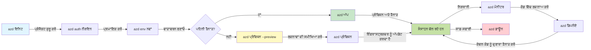
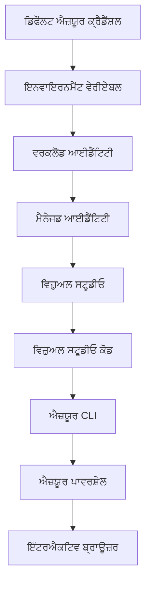

# AZD ਬੇਸਿਕਸ - Azure Developer CLI ਨੂੰ ਸਮਝਣਾ

# AZD ਬੇਸਿਕਸ - ਮੁੱਖ ਧਾਰਣਾਵਾਂ ਅਤੇ ਬੁਨਿਆਦੀ ਗੱਲਾਂ

**ਅਧਿਆਇ ਨੈਵੀਗੇਸ਼ਨ:**
- **📚 ਕੋਰਸ ਹੋਮ**: [AZD For Beginners](../../README.md)
- **📖 ਮੌਜੂਦਾ ਅਧਿਆਇ**: ਅਧਿਆਇ 1 - ਫਾਊਂਡੇਸ਼ਨ ਅਤੇ ਤੁਰੰਤ ਸ਼ੁਰੂਆਤ
- **⬅️ ਪਹਿਲਾਂ**: [Course Overview](../../README.md#-chapter-1-foundation--quick-start)
- **➡️ ਅਗਲਾ**: [Installation & Setup](installation.md)
- **🚀 ਅਗਲਾ ਅਧਿਆਇ**: [Chapter 2: AI-First Development](../chapter-02-ai-development/microsoft-foundry-integration.md)

## ਪਰਿਚਯ

ਇਸ ਲੈਸਨ ਵਿੱਚ ਅਸੀਂ ਤੁਹਾਨੂੰ Azure Developer CLI (azd) ਨਾਲ ਰੁਬਰੂ ਕਰਵਾਵਾਂਗੇ, ਇੱਕ শক্তিশালী ਕਮਾਂਡ-ਲਾਈਨ ਟੂਲ ਜੋ ਤੁਹਾਡੇ ਲੋਕਲ ਡਿਵੈਲਪਮੈਂਟ ਤੋਂ Azure ਡਿਪਲੋਇਮੈਂਟ ਤੱਕ ਦੇ Safar ਨੂੰ ਤੇਜ਼ ਕਰਦਾ ਹੈ। ਤੁਸੀਂ ਮੁੱਖ ਧਾਰਣਾਵਾਂ, ਕੋਰ ਫੀਚਰਾਂ ਬਾਰੇ ਸਿੱਖੋਗੇ ਅਤੇ ਸਮਝੋਗੇ ਕਿ azd ਕਿਵੇਂ ਕਲਾਉਡ-ਨੈਟਿਵ ਐਪਲੀਕੇਸ਼ਨ ਡਿਪਲੋਇਮੈਂਟ ਨੂੰ ਸੁਗਮ ਬਣਾਉਂਦਾ ਹੈ।

## ਸਿੱਖਣ ਦੇ ਟੀਚੇ

ਇਸ ਲੈਸਨ ਦੇ ਅੰਤ ਤੱਕ, ਤੁਸੀਂ:
- ਸਮਝੋਗੇ ਕਿ Azure Developer CLI ਕੀ ਹੈ ਅਤੇ ਇਸਦਾ ਮੁੱਖ ਮਕਸਦ ਕੀ ਹੈ
- ਟੈਂਪਲੇਟ, ਵਾਤਾਵਰਣ ਅਤੇ ਸੇਵਾਵਾਂ ਦੀਆਂ ਮੁੱਖ ਧਾਰਣਾਵਾਂ ਬਾਰੇ ਜਾਣੋਗੇ
- ਟੈਂਪਲੇਟ-ਡਰਾਈਵਨ ਡਿਵੈਲਪਮੈਂਟ ਅਤੇ Infrastructure as Code ਸਮੇਤ ਮੁੱਖ ਫੀਚਰਾਂ ਦੀ ਖੋਜ ਕਰੋਗੇ
- azd ਪ੍ਰੋਜੈਕਟ ਸਟ੍ਰਕਚਰ ਅਤੇ ਵਰਕਫਲੋ ਨੂੰ ਸਮਝੋਗੇ
- ਆਪਣੇ ਵਿਕਾਸ ਵਾਤਾਵਰਣ ਲਈ azd ਇੰਸਟਾਲ ਅਤੇ ਸੰਰਚਿਤ ਕਰਨ ਲਈ ਤਿਆਰ ਹੋਵੋਗੇ

## ਸਿੱਖਣ ਦੇ ਨਤੀਜੇ

ਇਸ ਲੈਸਨ ਨੂੰ ਪੂਰਾ ਕਰਨ ਤੋਂ ਬਾਅਦ, ਤੁਸੀਂ ਸਮਰੱਥ ਹੋਵੋਗੇ:
- ਆਧੁਨਿਕ ਕਲਾਉਡ ਡਿਵੈਲਪਮੈਂਟ ਵਰਕਫਲੋਜ਼ ਵਿੱਚ azd ਦੀ ਭੂਮਿਕਾ ਦੀ ਵਿਆਖਿਆ ਕਰਨ ਲਈ
- azd ਪ੍ਰੋਜੈਕਟ ਸਟ੍ਰਕਚਰ ਦੇ ਘਟਕਾਂ ਦੀ ਪਛਾਣ ਕਰਨ ਲਈ
- ਵਰਣਨ ਕਰਨ ਲਈ ਕਿ ਟੈਂਪਲੇਟ, ਵਾਤਾਵਰਣ ਅਤੇ ਸੇਵਾਵਾਂ ਇਕੱਠੇ ਕਿਵੇਂ ਕੰਮ ਕਰਦੀਆਂ ਹਨ
- azd ਨਾਲ Infrastructure as Code ਦੇ ਫਾਇਦੇ ਸਮਝਣ ਲਈ
- ਵੱਖ-ਵੱਖ azd ਕਮਾਂਡਾਂ ਅਤੇ ਉਹਨਾਂ ਦੇ ਮਕਸਦਾਂ ਨੂੰ ਪਛਾਣਨ ਲਈ

## Azure Developer CLI (azd) ਕੀ ਹੈ?

Azure Developer CLI (azd) ਇੱਕ ਕਮਾਂਡ-ਲਾਈਨ ਟੂਲ ਹੈ ਜੋ ਤੁਹਾਡੇ ਲੋਕਲ ਵਿਕਾਸ ਤੋਂ Azure ਡਿਪਲੋਇਮੈਂਟ ਤੱਕ ਦੇ Safar ਨੂੰ ਤੇਜ਼ ਕਰਨ ਲਈ ਡਿਜ਼ਾਇਨ ਕੀਤਾ ਗਿਆ ਹੈ। ਇਹ Azure 'ਤੇ ਕਲਾਉਡ-ਨੈਟਿਵ ਐਪਲੀਕੇਸ਼ਨਾਂ ਨੂੰ ਬਣਾਉਣ, ਡਿਪਲੋਇਟ ਕਰਨ ਅਤੇ ਪ੍ਰਬੰਧਿਤ ਕਰਨ ਦੀ ਪ੍ਰਕਿਰਿਆ ਨੂੰ ਸਾਦਾ ਬਣਾਉਂਦਾ ਹੈ।

### ਤੁਸੀਂ azd ਨਾਲ ਕੀ ਡਿਪਲੋਇਟ ਕਰ ਸਕਦੇ ਹੋ?

azd ਵਿਆਪਕ ਵਰਕਲੋਡਸ ਦੀ ਸਮਰਥਨ ਕਰਦਾ ਹੈ—ਅਤੇ ਇਹ ਸੂਚੀ ਵਧਦੇ ਰਹਿੰਦੀ ਹੈ। ਅੱਜ, ਤੁਸੀਂ azd ਦੀ ਵਰਤੋਂ ਕਰਕੇ ਡਿਪਲੋਇਟ ਕਰ ਸਕਦੇ ਹੋ:

| Workload Type | Examples | Same Workflow? |
|---------------|----------|----------------|
| **ਪਾਰੰਪਰਿਕ ਐਪਲੀਕੇਸ਼ਨਾਂ** | ਵੇਬ ਐਪਸ, REST APIs, ਸਟੈਟਿਕ ਸਾਈਟਾਂ | ✅ `azd up` |
| **ਸੇਵਾਵਾਂ ਅਤੇ ਮਾਈਕ੍ਰੋਸੇਵਾਵਾਂ** | Container Apps, Function Apps, ਬਹੁ-ਸੇਵਾ ਬੈਕਐਂਡ | ✅ `azd up` |
| **AI-ਸਹਿਤ ਐਪਲੀਕੇਸ਼ਨ** | Microsoft Foundry ਮਾਡਲਾਂ ਵਾਲੇ ਚੈਟ ਐਪਸ, AI Search ਨਾਲ RAG ਹੱਲ | ✅ `azd up` |
| **ਸਮਾਰਟ ਏਜੰਟ** | Foundry-ਹੋਸਟਡ ਏਜੰਟ, ਬਹੁ-ਏਜੰਟ ਓਰਕੇਸਟਰੇਸ਼ਨ | ✅ `azd up` |

ਮੁੱਖ ਨੁਕਤਾ ਇਹ ਹੈ ਕਿ **azd ਲਾਈਫਸਾਇਕਲ ਜੋ ਤੁਸੀਂ ਡਿਪਲੋਇਟ ਕਰ ਰਹੇ ਹੋ ਉਸ ਤੋਂ ਬਿਨਾਂ ਇਕੋ ਜਿਹਾ ਰਹਿੰਦਾ ਹੈ**। ਤੁਸੀਂ ਇੱਕ ਪ੍ਰੋਜੈਕਟ ਸ਼ੁਰੂ ਕਰਦੇ ਹੋ, ਢਾਂਚਾ ਪ੍ਰੋਵਿਜਨ ਕਰਦੇ ਹੋ, ਆਪਣਾ ਕੋਡ ਡਿਪਲੋਇਟ ਕਰਦੇ ਹੋ, ਅਪਲੀਕੇਸ਼ਨ ਦੀ ਨਿਗਰਾਨੀ ਕਰਦੇ ਹੋ, ਅਤੇ ਸਾਫ-ਸੁਥਰਾ ਕਰਦੇ ਹੋ—ਚਾਹੇ ਉਹ ਸਾਦਾ ਵੈਬਸਾਈਟ ਹੋਵੇ ਜਾਂ ਜਟਿਲ AI ਏਜੰਟ।

ਇਹ ਲਗਾਤਾਰਤਾ ਡਿਜ਼ਾਇਨ ਦੁਆਰਾ ਹੈ। azd AI ਸਮਰੱਥਾਵਾਂ ਨੂੰ ਤੁਹਾਡੇ ਐਪਲੀਕੇਸ਼ਨ ਲਈ ਇੱਕ ਹੋਰ ਕਿਸਮ ਦੀ ਸੇਵਾ ਵਜੋਂ ਵੇਖਦਾ ਹੈ, ਕੋਈ ਬੁਨਿਆਦੀ ਤੌਰ 'ਤੇ ਵੱਖਰਾ ਚੀਜ਼ ਨਹੀਂ। Microsoft Foundry ਮਾਡਲਾਂ ਨਾਲ ਬੈਕ ਕੀਤੀ ਗਈ ਚੈਟ ਐਂਡਪੌਇੰਟ azd ਦੇ ਨਜ਼ਰੀਏ ਤੋਂ ਸਿਰਫ਼ ਇੱਕ ਹੋਰ ਸੇਵਾ ਹੈ ਜਿਸਨੂੰ ਕਨਫ਼ਿਗਰ ਅਤੇ ਡਿਪਲੋਇਟ ਕਰਨਾ ਹੁੰਦਾ ਹੈ।

### 🎯 AZD ਕਿਉਂ ਵਰਤੋ? ਇੱਕ ਵਾਸਤਵਿਕ-ਦੁਨੀਆ ਤੁਲਨਾ

ਚੱਲੋ ਇੱਕ ਸਧਾਰਣ ਵੈਬ ਐਪ ਨਾਲ ਡੇਟਾਬੇਸ ਡਿਪਲੋਇਟ ਕਰਨ ਦੀ ਤੁਲਨਾ ਕਰਦੇ ਹਾਂ:

#### ❌ AZD ਦੇ ਬਿਨਾਂ: ਮੈਨੁਅਲ Azure ਡਿਪਲੋਇਮੈਂਟ (30+ ਮਿੰਟ)

```bash
# ਕਦਮ 1: ਰਿਸੋਰਸ ਗਰੁੱਪ ਬਣਾਓ
az group create --name myapp-rg --location eastus

# ਕਦਮ 2: ਐਪ ਸਰਵਿਸ ਯੋਜਨਾ ਬਣਾਓ
az appservice plan create --name myapp-plan \
  --resource-group myapp-rg \
  --sku B1 --is-linux

# ਕਦਮ 3: ਵੈੱਬ ਐਪ ਬਣਾਓ
az webapp create --name myapp-web-unique123 \
  --resource-group myapp-rg \
  --plan myapp-plan \
  --runtime "NODE:18-lts"

# ਕਦਮ 4: ਕੋਸਮੋਸ DB ਖਾਤਾ ਬਣਾਓ (10-15 ਮਿੰਟ)
az cosmosdb create --name myapp-cosmos-unique123 \
  --resource-group myapp-rg \
  --kind MongoDB

# ਕਦਮ 5: ਡੇਟਾਬੇਸ ਬਣਾਓ
az cosmosdb mongodb database create \
  --account-name myapp-cosmos-unique123 \
  --resource-group myapp-rg \
  --name tododb

# ਕਦਮ 6: ਕਲੇਕਸ਼ਨ ਬਣਾਓ
az cosmosdb mongodb collection create \
  --account-name myapp-cosmos-unique123 \
  --resource-group myapp-rg \
  --database-name tododb \
  --name todos

# ਕਦਮ 7: ਕਨੈਕਸ਼ਨ ਸਟ੍ਰਿੰਗ ਪ੍ਰਾਪਤ ਕਰੋ
CONN_STR=$(az cosmosdb keys list \
  --name myapp-cosmos-unique123 \
  --resource-group myapp-rg \
  --type connection-strings \
  --query "connectionStrings[0].connectionString" -o tsv)

# ਕਦਮ 8: ਐਪ ਸੈਟਿੰਗਜ਼ ਕਨਫ਼ਿਗਰ ਕਰੋ
az webapp config appsettings set \
  --name myapp-web-unique123 \
  --resource-group myapp-rg \
  --settings MONGODB_URI="$CONN_STR"

# ਕਦਮ 9: ਲੌਗਿੰਗ ਚਾਲੂ ਕਰੋ
az webapp log config --name myapp-web-unique123 \
  --resource-group myapp-rg \
  --application-logging filesystem \
  --detailed-error-messages true

# ਕਦਮ 10: ਅਪਲੀਕੇਸ਼ਨ ਇਨਸਾਈਟਸ ਸੈੱਟਅੱਪ ਕਰੋ
az monitor app-insights component create \
  --app myapp-insights \
  --location eastus \
  --resource-group myapp-rg

# ਕਦਮ 11: ਐਪ ਇਨਸਾਈਟਸ ਨੂੰ ਵੈੱਬ ਐਪ ਨਾਲ ਜੋੜੋ
INSTRUMENTATION_KEY=$(az monitor app-insights component show \
  --app myapp-insights \
  --resource-group myapp-rg \
  --query "instrumentationKey" -o tsv)

az webapp config appsettings set \
  --name myapp-web-unique123 \
  --resource-group myapp-rg \
  --settings APPINSIGHTS_INSTRUMENTATIONKEY="$INSTRUMENTATION_KEY"

# ਕਦਮ 12: ਐਪਲੀਕੇਸ਼ਨ ਨੂੰ ਸਥਾਨਕ ਤੌਰ 'ਤੇ ਬਿਲਡ ਕਰੋ
npm install
npm run build

# ਕਦਮ 13: ਡਿਪਲੋਇਮੈਂਟ ਪੈਕੇਜ ਬਣਾਓ
zip -r app.zip . -x "*.git*" "node_modules/*"

# ਕਦਮ 14: ਐਪਲੀਕੇਸ਼ਨ ਡਿਪਲੋਇ ਕਰੋ
az webapp deployment source config-zip \
  --resource-group myapp-rg \
  --name myapp-web-unique123 \
  --src app.zip

# ਕਦਮ 15: ਉਡੀਕ ਕਰੋ ਅਤੇ ਦੋਆ ਕਰੋ ਕਿ ਇਹ ਕੰਮ ਕਰੇ 🙏
# (ਕੋਈ ਆਟੋਮੇਟਿਕ ਵੈਰੀਫਿਕੇਸ਼ਨ ਨਹੀਂ, ਮੈਨੁਅਲ ਟੈਸਟਿੰਗ ਲੋੜੀਂਦੀ ਹੈ)
```

**ਸਮੱਸਿਆਵਾਂ:**
- ❌ 15+ ਕਮਾਂਡਾਂ ਨੂੰ ਯਾਦ ਰੱਖਣਾ ਅਤੇ ਕ੍ਰਮ ਵਿੱਚ ਚਲਾਉਣਾ
- ❌ 30-45 ਮਿੰਟ ਦਾ ਮੈਨੁਅਲ ਕੰਮ
- ❌ ਗਲਤੀਆਂ ਕਰਨਾ ਆਸਾਨ (ਟਾਈਪੋਜ਼, ਗਲਤ ਪੈਰਾਮੀਟਰ)
- ❌ ਟਰਮੀਨਲ ਹਿਸਟਰੀ ਵਿੱਚ ਕੁਨੈਕਸ਼ਨ ਸਟਰਿੰਗਸ ਪ੍ਰਗਟ ਹੋ ਸਕਦੀਆਂ ਹਨ
- ❌ ਕੁਝ ਨੁਕਸਾਨ ਹੋਣ 'ਤੇ ਆਟੋਮੇਟਿਕ ਰੋਲਬੈਕ ਨਹੀਂ
- ❌ ਟੀਮ ਮੈਂਬਰਾਂ ਲਈ ਨਕਲ ਕਰਨਾ ਮੁਸ਼ਕਲ
- ❌ ਹਰ ਵਾਰੀ ਵੱਖਰਾ (ਪੁਨਰੁਤਪਾਦਯੋਗ ਨਹੀਂ)

#### ✅ AZD ਨਾਲ: ਆਟੋਮੇਟਿਡ ਡਿਪਲੋਇਮੈਂਟ (5 ਕਮਾਂਡਾਂ, 10-15 ਮਿੰਟ)

```bash
# ਕਦਮ 1: ਟੈਂਪਲੇਟ ਤੋਂ ਆਰੰਭ ਕਰੋ
azd init --template todo-nodejs-mongo

# ਕਦਮ 2: ਪ੍ਰਮਾਣੀਕਰਨ ਕਰੋ
azd auth login

# ਕਦਮ 3: ਮਾਹੌਲ ਬਣਾਓ
azd env new dev

# ਕਦਮ 4: ਬਦਲਾਅ ਦਾ ਪ੍ਰੀਵਿਊ (ਵਿਕਲਪਿਕ ਪਰ ਸੁਝਾਇਆ ਜਾਂਦਾ ਹੈ)
azd provision --preview

# ਕਦਮ 5: ਸਭ ਕੁਝ ਤਾਇਨਾਤ ਕਰੋ
azd up

# ✨ ਹੋ ਗਿਆ! ਸਭ ਕੁਝ ਤਾਇਨਾਤ, ਸੰਰਚਿਤ ਅਤੇ ਨਿਗਰਾਨੀ ਕੀਤੀ ਗਈ ਹੈ
```

**ਫਾਇਦੇ:**
- ✅ **5 ਕਮਾਂਡਾਂ** ਬਨਾਮ 15+ ਮੈਨੁਅਲ ਕਦਮ
- ✅ ਕੁੱਲ **10-15 ਮਿੰਟ** (ਵੱਧਤਰ ਸਮਾਂ Azure ਲਈ ਉਡੀਕ ਵਿੱਚ)
- ✅ **ਘੱਟ ਮੈਨੁਅਲ ਗਲਤੀਆਂ** - ਸੰਘਟਿਤ, ਟੈਂਪਲੇਟ-ਡਰਾਈਵਨ ਵਰਕਫਲੋ
- ✅ **ਸੁਰੱਖਿਅਤ ਸੀਕ੍ਰਟ ਹੈਂਡਲਿੰਗ** - ਬਹੁਤੋਂ ਟੈਂਪਲੇਟ Azure-ਮੈਨੇਜਡ ਸੀਕ੍ਰਟ ਸਟੋਰੇਜ ਵਰਤਦੇ ਹਨ
- ✅ **ਦੋਹਰਾਏ ਜਾ ਸਕਣ ਵਾਲੇ ਡਿਪਲੋਇਮੈਂਟ** - ਹਰ ਵਾਰੀ ਇੱਕੋ ਵਰਕਫਲੋ
- ✅ **ਪੂਰੀ ਤਰ੍ਹਾਂ ਪੁਨਰੁਤਪਾਦਯੋਗ** - ਹਮੇਸ਼ਾ ਇੱਕੋ ਨਤੀਜਾ
- ✅ **ਟੀਮ-ਰੇਡੀ** - ਕੋਈ ਵੀ ਇੱਕੋ ਕਮਾਂਡਾਂ ਨਾਲ ਡਿਪਲੋਇਟ ਕਰ ਸਕਦਾ ਹੈ
- ✅ **Infrastructure as Code** - ਵਰਜਨ ਕੰਟਰੋਲ ਕੀਤੇ Bicep ਟੈਂਪਲੇਟ
- ✅ **ਬਿਲਟ-ਇਨ ਮਾਨੀਟਰਿੰਗ** - Application Insights ਆਪੇ-ਆਪਣੇ ਕਨਫਿਗਰ ਹੋ ਜਾਂਦੀ ਹੈ

### 📊 ਸਮਾਂ ਅਤੇ ਗਲਤੀ ਮੋਟੇ ਤੌਰ ਤੇ ਘਟਾਉਣਾ

| Metric | Manual Deployment | AZD Deployment | Improvement |
|:-------|:------------------|:---------------|:------------|
| **ਕਮਾਂਡਾਂ** | 15+ | 5 | 67% ਘੱਟ |
| **ਸਮਾਂ** | 30-45 ਮਿੰਟ | 10-15 ਮਿੰਟ | 60% ਤੇਜ਼ |
| **ਗਲਤੀ ਦਰ** | ~40% | <5% | 88% ਘਟਾਓ |
| **ਸੰਗਤੀ** | ਘੱਟ (ਮੈਨੁਅਲ) | 100% (ਆਟੋਮੇਟਿਡ) | ਉੱਤਮ |
| **ਟੀਮ ਔਨਬੋਰਡਿੰਗ** | 2-4 ਘੰਟੇ | 30 ਮਿੰਟ | 75% ਤੇਜ਼ |
| **ਰੋਲਬੈਕ ਸਮਾਂ** | 30+ ਮਿੰਟ (ਮੈਨੁਅਲ) | 2 ਮਿੰਟ (ਆਟੋਮੇਟਿਡ) | 93% ਤੇਜ਼ |

## ਮੁੱਖ ਧਾਰਣਾਵਾਂ

### ਟੈਮਪਲੇਟ
ਟੈਮਪਲੇਟ azd ਦੀ ਬੁਨਿਆਦ ਹਨ। ਇਹ ਸ਼ਾਮਲ ਕਰਦੇ ਹਨ:
- **ਐਪਲੀਕੇਸ਼ਨ ਕੋਡ** - ਤੁਹਾਡਾ ਸੋਰਸ ਕੋਡ ਅਤੇ ਡੀਪੈਂਡੰਸੀਜ਼
- **Infrastructure definitions** - Bicep ਜਾਂ Terraform ਵਿੱਚ ਪਰਿਭਾਸ਼ਿਤ Azure ਰਿਸੋਰਸ
- **ਕਨਫਿਗਰੇਸ਼ਨ ਫਾਈਲਾਂ** - ਸੈਟਿੰਗਜ਼ ਅਤੇ ਵਾਤਾਵਰਣ ਵੈਰੀਏਬਲ
- **ਡਿਪਲੋਇਮੈਂਟ ਸਕ੍ਰਿਪਟਸ** - ਆਟੋਮੇਟਿਡ ਡਿਪਲੋਇਮੈਂਟ ਵਰਕਫਲੋਜ਼

### ਵਾਤਾਵਰਣ
ਵਾਤਾਵਰਣ ਵੱਖ-ਵੱਖ ਡਿਪਲੋਇਮੈਂਟ ਟਾਰਗਿਟਾਂ ਦੀ ਨੁਮਾਇੰਦਗੀ ਕਰਦੇ ਹਨ:
- **ਡਿਵੈਲਪਮੈਂਟ** - ਟੈਸਟਿੰਗ ਅਤੇ ਵਿਕਾਸ ਲਈ
- **ਸਟੇਜਿੰਗ** - ਪ੍ਰੀ-ਪ੍ਰੋਡਕਸ਼ਨ ਵਾਤਾਵਰਣ
- **ਪ੍ਰੋਡਕਸ਼ਨ** - ਲਾਈਵ ਉਤਪਾਦਕ ਵਾਤਾਵਰਣ

ਹਰ ਵਾਤਾਵਰਣ ਆਪਣੀ ਆਪਣੀ ਰੱਖ-ਰਖਾਅ ਰੱਖਦਾ ਹੈ:
- Azure ਰਿਸੋਰਸ ਗਰੁੱਪ
- ਕਨਫਿਗਰੇਸ਼ਨ ਸੈਟਿੰਗਜ਼
- ਡਿਪਲੋਇਮੈਂਟ ਸਥਿਤੀ

### ਸੇਵਾਵਾਂ
ਸੇਵਾਵਾਂ ਤੁਹਾਡੇ ਐਪਲੀਕੇਸ਼ਨ ਦੇ ਬਿਲਡਿੰਗ ਬਲੌਕ ਹਨ:
- **ਫਰੰਟਐਂਡ** - ਵੈਬ ਐਪਲੀਕੇਸ਼ਨ, SPA
- **ਬੈਕਐਂਡ** - APIs, ਮਾਈਕ੍ਰੋਸੇਵਾਵਾਂ
- **ਡੇਟਾਬੇਸ** - ਡੇਟਾ ਸਟੋਰੇਜ ਹੱਲ
- **ਸਟੋਰੇਜ** - ਫਾਇਲ ਅਤੇ ਬਲਾਬ ਸਟੋਰੇਜ

## ਮੁੱਖ ਵਿਸ਼ੇਸ਼ਤਾਵਾਂ

### 1. ਟੈਂਪਲੇਟ-ਡਰਾਈਵਨ ਡਿਵੈਲਪਮੈਂਟ
```bash
# ਉਪਲਬਧ ਟੈਮਪਲੇਟ ਵੇਖੋ
azd template list

# ਇੱਕ ਟੈਮਪਲੇਟ ਤੋਂ ਸ਼ੁਰੂ ਕਰੋ
azd init --template <template-name>
```

### 2. Infrastructure as Code
- **Bicep** - Azure ਦੀ ਡੋਮੇਨ-ਨਿਰਧਾਰਿਤ ਭਾਸ਼ਾ
- **Terraform** - ਮਲਟੀ-ਕਲਾਉਡ Infrastructure ਟੂਲ
- **ARM Templates** - Azure Resource Manager ਟੈਂਪਲੇਟ

### 3. ਚੁਕਾਇਤਾ ਵਰਕਫਲੋ
```bash
# ਪੂਰਾ ਤਾਇਨਾਤ ਵਰਕਫਲੋ
azd up            # ਪ੍ਰੋਵਿਜ਼ਨ + ਡਿਪਲੌਇ — ਇਹ ਪਹਿਲੀ ਵਾਰ ਸੈਟਅਪ ਲਈ ਬਿਨਾਂ ਦਖਲ ਦੇ ਹੈ

# 🧪 ਨਵਾਂ: ਤਾਇਨਾਤ ਤੋਂ ਪਹਿਲਾਂ ਇੰਫ੍ਰਾਸਟ੍ਰਕਚਰ ਬਦਲਾਵਾਂ ਦੀ ਪੂਰਵ-ਜਾਂਚ (ਸੁਰੱਖਿਅਤ)
azd provision --preview    # ਬਦਲਾਅ ਕੀਤੇ ਬਿਨਾਂ ਇੰਫ੍ਰਾਸਟ੍ਰਕਚਰ ਦੀ ਤਾਇਨਾਤ ਦਾ ਅਨੁਕਰਨ ਕਰੋ

azd provision     # ਜੇ ਤੁਸੀਂ ਇੰਫ੍ਰਾਸਟ੍ਰਕਚਰ ਅਪਡੇਟ ਕਰ ਰਹੇ ਹੋ ਤਾਂ Azure ਰਿਸੋਰਸ ਬਣਾਉਣ ਲਈ ਇਹ ਵਰਤੋ
azd deploy        # ਐਪਲੀਕੇਸ਼ਨ ਕੋਡ ਨੂੰ ਤਾਇਨਾਤ ਕਰੋ ਜਾਂ ਅਪਡੇਟ ਹੋਣ 'ਤੇ ਕੋਡ ਨੂੰ ਦੁਬਾਰਾ ਤਾਇਨਾਤ ਕਰੋ
azd down          # ਸੰਸਾਧਨਾਂ ਨੂੰ ਸਾਫ਼ ਕਰੋ
```

#### 🛡️ ਪ੍ਰੀਵਿਊ ਨਾਲ ਸੁਰੱਖਿਅਤ Infrastructure ਯੋਜਨਾ
`azd provision --preview` ਕਮਾਂਡ ਸੁਰੱਖਿਅਤ ਡਿਪਲੋਇਮੈਂਟ ਲਈ ਇੱਕ ਗੇਮ-ਚੇਂਜਰ ਹੈ:
- **ਡ੍ਰਾਈ-ਰਨ ਵਿਸ਼ਲੇਸ਼ਣ** - ਦਿਖਾਉਂਦਾ ਹੈ ਕਿ ਕੀ ਬਣਾਇਆ, ਬਦਲਿਆ ਜਾਂ ਮਿਟਾਇਆ ਜਾਵੇਗਾ
- **ਜੀਰੋ ਰਿਸਕ** - ਤੁਹਾਡੇ Azure ਵਾਤਾਵਰਣ ਵਿੱਚ ਕੋਈ ਅਸਲ ਬਦਲਾਅ ਨਹੀਂ ਹੁੰਦਾ
- **ਟੀਮ ਸਹਿਯੋਗ** - ਡਿਪਲੋਇਮੈਂਟ ਤੋਂ ਪਹਿਲਾਂ ਪ੍ਰੀਵਿਊ ਨਤੀਜੇ ਸਾਂਝੇ ਕਰੋ
- **ਲਾਗਤ ਅੰਦਾਜ਼ਾ** - ਵਾਧੂ ਰਿਸੋਰਸਾਂ ਦੀ ਲਾਗਤ ਸਮਝੋ ਪਹਿਲਾਂ ਹੀ

```bash
# ਉਦਾਹਰਣ ਪ੍ਰੀਵਿਊ ਵਰਕਫਲੋ
azd provision --preview           # ਵੇਖੋ ਕਿ ਕੀ ਬਦਲੇਗਾ
# ਆਉਟਪੁੱਟ ਦੀ ਸਮੀਖਿਆ ਕਰੋ, ਟੀਮ ਨਾਲ ਚਰਚਾ ਕਰੋ
azd provision                     # ਭਰੋਸੇ ਨਾਲ ਤਬਦੀਲੀਆਂ ਲਾਗੂ ਕਰੋ
```

### 📊 ਵਿਜ਼ੂਅਲ: AZD ਡਿਵੈਲਪਮੈਂਟ ਵਰਕਫਲੋ



**ਵਰਕਫਲੋ ਵਿਆਖਿਆ:**
1. **Init** - ਟੈਂਪਲੇਟ ਜਾਂ ਨਵੇਂ ਪ੍ਰੋਜੈਕਟ ਨਾਲ ਸ਼ੁਰੂ ਕਰੋ
2. **Auth** - Azure ਨਾਲ ਪ੍ਰਮਾਣੀਕਰਣ ਕਰੋ
3. **Environment** - ਇਕ ਅਲੱਗ ਡਿਪਲੋਇਮੈਂਟ ਵਾਤਾਵਰਣ ਬਣਾਓ
4. **Preview** - 🆕 ਹਮੇਸ਼ਾ ਪਹਿਲਾਂ Infrastructure ਬਦਲਾਵਾਂ ਦਾ ਪ੍ਰੀਵਿਊ ਕਰੋ (ਸੁਰੱਖਿਅਤ ਅਭਿਆਸ)
5. **Provision** - Azure ਰਿਸੋਰਸ ਬਣਾਓ/ਅਪਡੇਟ ਕਰੋ
6. **Deploy** - ਆਪਣੇ ਐਪਲੀਕੇਸ਼ਨ ਕੋਡ ਨੂੰ ਧੱਕੋ
7. **Monitor** - ਐਪਲੀਕੇਸ਼ਨ ਪੂਰਨਤਾ/ਪ੍ਰਦਰਸ਼ਨ ਨੋਟ ਕਰੋ
8. **Iterate** - ਬਦਲਾਅ ਕਰੋ ਅਤੇ ਕੋਡ ਮੁੜ ਡਿਪਲੋਇਟ ਕਰੋ
9. **Cleanup** - ਜਦੋਂ ਖਤਮ ਹੋ ਜਾਵੇ ਤਾਂ ਰਿਸੋਰਸ ਹਟਾਓ

### 4. ਵਾਤਾਵਰਣ ਪ੍ਰਬੰਧਨ
```bash
# ਵਾਤਾਵਰਣ ਬਣਾਓ ਅਤੇ ਪ੍ਰਬੰਧ ਕਰੋ
azd env new <environment-name>
azd env select <environment-name>
azd env list
```

### 5. ਐਕਸਟੈਂਸ਼ਨ ਅਤੇ AI ਕਮਾਂਡਾਂ

azd ਕੋਰ CLI ਤੋਂ ਪਰੇ ਸਮਰੱਥਾਵਾਂ ਸ਼ਾਮਲ ਕਰਨ ਲਈ ਇੱਕ ਐਕਸਟੈਂਸ਼ਨ ਸਿਸਟਮ ਦੀ ਵਰਤੋਂ ਕਰਦਾ ਹੈ। ਇਹ ਖਾਸ ਕਰਕੇ AI ਵਰਕਲੋਡ ਲਈ ਲਾਭਦਾਇਕ ਹੈ:

```bash
# ਉਪਲਬਧ ਐਕਸਟੈਂਸ਼ਨਾਂ ਦੀ ਸੂਚੀ
azd extension list

# Foundry agents ਐਕਸਟੈਂਸ਼ਨ ਨੂੰ ਇੰਸਟਾਲ ਕਰੋ
azd extension install azure.ai.agents

# ਮੈਨੀਫੈਸਟ ਤੋਂ ਇੱਕ AI ਏਜੰਟ ਪ੍ਰੋਜੈਕਟ ਆਰੰਭ ਕਰੋ
azd ai agent init -m agent-manifest.yaml

# ਇੱਕ ਡਿਪਲੋਇਡ ਏਜੰਟ ਦੀ ਜਾਂਚ ਕਰੋ (ਲੈਟੈਂਸੀ ਅਤੇ ਟਾਈਮ-ਟੂ-ਫਰਸਟ-ਬਾਈਟ ਦਿਖਾਉਂਦਾ ਹੈ)
azd ai agent invoke

# AI-ਸਹਾਇਤ ਵਿਕਾਸ ਲਈ MCP ਸਰਵਰ ਸ਼ੁਰੂ ਕਰੋ (ਅਲਫਾ)
azd mcp start
```

**ਏਜੰਟ ਲਾਈਫਸਾਇਕਲ, ਸ਼ੁਰੂ ਤੋਂ ਅੰਤ ਤੱਕ।** ਜਦੋਂ ਤੁਸੀਂ `azure.ai.agents` ਇੰਸਟਾਲ ਕਰ ਲੈਂਦੇ ਹੋ, ਇੱਕ ਇਕੱਲਾ ਵਰਕਫਲੋ ਤੁਹਾਨੂੰ ਵਿਚਾਰ ਤੋਂ ਚਲਦੇ, ਨਿਗਰਾਨ ਕੀਤੇ ਹਏ ਏਜੰਟ ਤੱਕ ਲੈ ਜਾਂਦਾ ਹੈ। ਤੁਹਾਨੂੰ ਦਿਨ ਇੱਕ ਤੇ ਇਹ ਸਾਰਾ ਕੁਝ ਲੋੜੀਂਦਾ ਨਹੀਂ—ਸਿਰਫ ਜਾਣੋ ਕਿ ਏਹ ਮੌਜੂਦ ਹਨ:

| Stage | Command | What it does |
|-------|---------|--------------|
| **Scaffold** | `azd ai agent init -m <manifest>` | Generate an agent project from a manifest |
| **Test** | `azd ai agent invoke` | Call the agent and view response timing |
| **Measure** | `azd ai agent eval generate` | Create an evaluation dataset for the agent |
| **Improve** | `azd ai agent optimize` | Optimize agent instructions against your data |
| **Inspect** | `azd ai agent endpoint show` | View the live endpoint configuration |
| **Clean up** | `azd ai agent delete` | Delete a hosted agent and all its versions |

> ਐਕਸਟੈਂਸ਼ਨਾਂ ਨੂੰ ਵਿਸਥਾਰ ਨਾਲ [Chapter 2: AI-First Development](../chapter-02-ai-development/agents.md) ਅਤੇ [AZD AI CLI Commands](../chapter-08-production/production-ai-practices.md#azd-ai-cli-commands-and-extensions) ਰেফਰੰਸ ਵਿੱਚ ਕਵਰ ਕੀਤਾ ਗਿਆ ਹੈ।

## 📁 ਪ੍ਰੋਜੈਕਟ ਸਟ੍ਰਕਚਰ

ਇੱਕ ਆਮ azd ਪ੍ਰੋਜੈਕਟ ਸਟ੍ਰਕਚਰ:
```
my-app/
├── .azd/                    # azd configuration
│   └── config.json
├── .azure/                  # Azure deployment artifacts
├── .devcontainer/          # Development container config
├── .github/workflows/      # GitHub Actions
├── .vscode/               # VS Code settings
├── infra/                 # Infrastructure code
│   ├── main.bicep        # Main infrastructure template
│   ├── main.parameters.json
│   └── modules/          # Reusable modules
├── src/                  # Application source code
│   ├── api/             # Backend services
│   └── web/             # Frontend application
├── azure.yaml           # azd project configuration
└── README.md
```

## 🔧 ਕਨਫਿਗਰੇਸ਼ਨ ਫਾਈਲਾਂ

### azure.yaml
ਮੁੱਖ ਪ੍ਰੋਜੈਕਟ ਕਨਫਿਗਰੇਸ਼ਨ ਫਾਈਲ:
```yaml
name: my-awesome-app
metadata:
  template: my-template@1.0.0

services:
  web:
    project: ./src/web
    language: js
    host: appservice
  api:
    project: ./src/api
    language: js
    host: appservice

hooks:
  preprovision:
    shell: pwsh
    run: echo "Preparing to provision..."
```

### .azure/config.json
ਵਾਤਾਵਰਣ-ਨਿਰਧਾਰਿਤ ਕਨਫਿਗਰੇਸ਼ਨ:
```json
{
  "version": 1,
  "defaultEnvironment": "dev",
  "environments": {
    "dev": {
      "subscriptionId": "your-subscription-id",
      "location": "eastus"
    }
  }
}
```

## 🎪 ਆਮ ਵਰਕਫਲੋਜ਼ ਹੱਥ-ਵਲ ਅਭਿਆਸਾਂ ਦੇ ਨਾਲ

> **💡 ਸਿੱਖਣ ਟਿਪ:** ਆਪਣੇ AZD ਸਕਿਲਜ਼ ਨੂੰ ਪ੍ਰਗਟੌਤੀ ਰੂਪ ਵਿੱਚ ਬਣਾਉਣ ਲਈ ਇਨ੍ਹਾਂ ਅਭਿਆਸਾਂ ਨੂੰ ਕ੍ਰਮਵਾਰ ਅਨੁਸਰਣ ਕਰੋ।

### 🎯 ਅਭਿਆਸ 1: ਆਪਣਾ ਪਹਿਲਾ ਪ੍ਰੋਜੈਕਟ ਇਨੀਸ਼ੀਅਲਾਈਜ਼ ਕਰੋ

**ਉਦੇਸ਼:** ਇੱਕ AZD ਪ੍ਰੋਜੈਕਟ ਬਣਾਓ ਅਤੇ ਇਸ ਦੀ ਬਣਤਰ ਦੀ ਖੋਜ ਕਰੋ

**ਕਦਮ:**
```bash
# ਇੱਕ ਪਰਖਿਆ ਹੋਇਆ ਟੈਮਪਲੇਟ ਵਰਤੋ
azd init --template todo-nodejs-mongo

# ਜਨਰੇਟ ਕੀਤੀਆਂ ਫਾਇਲਾਂ ਖੋਜੋ
ls -la  # ਛੁਪੀਆਂ ਸਮੇਤ ਸਾਰੀਆਂ ਫਾਇਲਾਂ ਵੇਖੋ

# ਮੁੱਖ ਬਣਾਈਆਂ ਫਾਇਲਾਂ:
# - azure.yaml (ਮੁੱਖ ਸੰਰਚਨਾ)
# - infra/ (ਬੁਨਿਆਦੀ ਢਾਂਚਾ ਕੋਡ)
# - src/ (ਐਪਲੀਕੇਸ਼ਨ ਕੋਡ)
```

**✅ ਕਾਮਯਾਬੀ:** ਤੁਹਾਡੇ ਕੋਲ azure.yaml, infra/, ਅਤੇ src/ ਡਾਇਰੈਕਟਰੀਆਂ ਹਨ

---

### 🎯 ਅਭਿਆਸ 2: Azure ਤੇ ਡਿਪਲੋਇਟ ਕਰੋ

**ਉਦੇਸ਼:** ਮੁਕੰਮਲ ਐਂਡ-ਟੂ-ਐਂਡ ਡਿਪਲੋਇਮੈਂਟ

**ਕਦਮ:**
```bash
# 1. ਪ੍ਰਮਾਣਿਤ ਕਰੋ
az login && azd auth login

# 2. ਮਾਹੌਲ ਬਣਾਓ
azd env new dev
azd env set AZURE_LOCATION eastus

# 3. ਤਬਦੀਲੀਆਂ ਦਾ ਪ੍ਰੀਵਿਊ (ਸਿਫਾਰਸ਼ ਕੀਤੀ ਜਾਂਦੀ ਹੈ)
azd provision --preview

# 4. ਸਭ ਕੁਝ ਤੈਨਾਤ ਕਰੋ
azd up

# 5. ਤੈਨਾਤੀ ਦੀ ਪੁਸ਼ਟੀ ਕਰੋ
azd show    # ਆਪਣੇ ਐਪ ਦਾ URL ਵੇਖੋ
```

**ਉਮੀਦ ਕੀਤਾ ਸਮਾਂ:** 10-15 ਮਿੰਟ  
**✅ ਕਾਮਯਾਬੀ:** ਐਪਲੀਕੇਸ਼ਨ URL ਬਰਾਊਜ਼ਰ ਵਿੱਚ ਖੁਲ ਜਾਂਦਾ ਹੈ

---

### 🎯 ਅਭਿਆਸ 3: ਕਈ ਵਾਤਾਵਰਣ

**ਉਦੇਸ਼:** dev ਅਤੇ staging ਵਿੱਚ ਡਿਪਲੋਇਟ ਕਰੋ

**ਕਦਮ:**
```bash
# ਡੈਵ ਪਹਿਲਾਂ ਹੀ ਮੌਜੂਦ ਹੈ, ਸਟੇਜਿੰਗ ਬਣਾਓ
azd env new staging
azd env set AZURE_LOCATION westus2
azd up

# ਉਹਨਾਂ ਦੇ ਵਿਚਕਾਰ ਬਦਲੋ
azd env list
azd env select dev
```

**✅ ਕਾਮਯਾਬੀ:** Azure Portal ਵਿੱਚ ਦੋ ਵੱਖ-ਵੱਖ ਰਿਸੋਰਸ ਗਰੁੱਪ ਹਨ

---

### 🛡️ ਸਾਫ ਸ਼ੁਰੂਆਤ: `azd down --force --purge`

ਜਦੋਂ ਤੁਹਾਨੂੰ ਪੂਰੀ ਤਰ੍ਹਾਂ ਰੀਸੈਟ ਕਰਨ ਦੀ ਲੋੜ ਹੋਵੇ:

```bash
azd down --force --purge
```

**ਇਹ ਕੀ ਕਰਦਾ ਹੈ:**
- `--force`: ਕੋਈ ਪੁਸ਼ਟੀਕਰਨ ਪ੍ਰਾਂਪਟ ਨਹੀਂ
- `--purge`: ਸਾਰੇ ਲੋਕਲ ਸਟੇਟ ਅਤੇ Azure ਰਿਸੋਰਸ ਮਿਟਾ ਦਿੰਦਾ ਹੈ

**ਇਹ ਵਰਤੋਂ ਕਰਨੇ ਵੇਲੇ:**
- ਡਿਪਲੋਇਮੈਂਟ ਮੱਧ ਵਿੱਚ ਫੇਲ ਹੋ ਗਿਆ
- ਪ੍ਰੋਜੈਕਟ ਬਦਲ ਰਹੇ ਹੋ
- ਨਵਾਂ ਸ਼ੁਰੂਆਤ ਚਾਹੀਦੀ ਹੋਵੇ

---

## 🎪 ਅਸਲ ਵਰਕਫਲੋ ਰੈਫਰੰਸ

### ਨਵਾਂ ਪ੍ਰੋਜੈਕਟ ਸ਼ੁਰੂ ਕਰਨਾ
```bash
# ਤਰੀਕਾ 1: ਮੌਜੂਦਾ ਟੈਂਪਲੇਟ ਦੀ ਵਰਤੋਂ ਕਰੋ
azd init --template todo-nodejs-mongo

# ਤਰੀਕਾ 2: ਸਿਰੇ ਤੋਂ ਸ਼ੁਰੂ ਕਰੋ
azd init

# ਤਰੀਕਾ 3: ਮੌਜੂਦਾ ਡਾਇਰੈਕਟਰੀ ਦੀ ਵਰਤੋਂ ਕਰੋ
azd init .
```

### ਵਿਕਾਸ ਚੱਕਰ
```bash
# ਡਿਵੈਲਪਮੈਂਟ ਮਾਹੌਲ ਤਿਆਰ ਕਰੋ
azd auth login
azd env new dev
azd env select dev

# ਸਭ ਕੁਝ ਡਿਪਲੋਇ ਕਰੋ
azd up

# ਤਬਦੀਲੀਆਂ ਕਰੋ ਅਤੇ ਮੁੜ ਡਿਪਲੋਇ ਕਰੋ
azd deploy

# ਜਦੋਂ ਮੁਕੰਮਲ ਹੋ ਜਾਵੇ ਤਾਂ ਸਾਫ਼ ਕਰੋ
azd down --force --purge # Azure Developer CLI ਵਿੱਚ ਦਿੱਤੀ ਕਮਾਂਡ ਤੁਹਾਡੇ ਵਾਤਾਵਰਨ ਲਈ ਇੱਕ **ਹਾਰਡ ਰੀਸੈਟ** ਹੈ—ਖਾਸ ਕਰਕੇ ਜਦੋਂ ਤੁਸੀਂ ਫੇਲ ਹੋਈਆਂ ਡਿਪਲੋਇਮੈਂਟਸ ਦੀ ਸਮੱਸਿਆ ਹੱਲ ਕਰ ਰਹੇ ਹੋ, ਛੱਡੇ ਹੋਏ ਸਰੋਤਾਂ ਨੂੰ ਸਾਫ਼ ਕਰ ਰਹੇ ਹੋ, ਜਾਂ ਨਵੇਂ ਸਿਰੇ ਤੋਂ ਮੁੜ ਡਿਪਲੋਇ ਕਰਨ ਲਈ ਤਿਆਰ ਕਰ ਰਹੇ ਹੋ।
```

## `azd down --force --purge` ਨੂੰ ਸਮਝਣਾ
`azd down --force --purge` ਕਮਾਂਡ ਤੁਹਾਡੇ azd ਵਾਤਾਵਰਣ ਅਤੇ ਸਾਰੇ ਸੰਬੰਧਤ ਰਿਸੋਰਸਜ਼ ਨੂੰ ਪੂਰੀ ਤਰ੍ਹਾਂ ਤੋੜਣ ਦਾ ਇੱਕ ਸ਼ਕਤੀਸ਼ਾਲੀ ਤਰੀਕਾ ਹੈ। ਹੇਠਾਂ ਹਰ ਫਲੈਗ ਕੀ ਕਰਦਾ ਹੈ ਦੀ ਵਿਸਥਾਰਤ ਵਿਆਖਿਆ ਹੈ:
```
--force
```
- Skips confirmation prompts.
- Useful for automation or scripting where manual input isn’t feasible.
- Ensures the teardown proceeds without interruption, even if the CLI detects inconsistencies.

```
--purge
```
Deletes **all associated metadata**, including:
Environment state
Local `.azure` folder
Cached deployment info
Prevents azd from "remembering" previous deployments, which can cause issues like mismatched resource groups or stale registry references.


### ਦੋਹਾਂ ਨੂੰ ਕਿਉਂ ਵਰਤਣਾ?
ਜਦੋਂ ਤੁਸੀਂ `azd up` ਨਾਲ ਬਹਿੜੇ ਹੋ ਜਾਂ ਅਧੂਰੇ ਡਿਪਲੋਇਮੈਂਟ ਹੋਣ ਕਾਰਨ ਰੁਕਾਅ ਆ ਜਾਂਦਾ ਹੈ, ਇਹ ਜੋੜਾ ਇੱਕ **ਸਾਫ਼ ਓਟ** ਸੁਨਿਸ਼ਚਿਤ ਕਰਦਾ ਹੈ।

ਇਹ ਖ਼ਾਸ ਤੌਰ 'ਤੇ ਮਦਦਗਾਰ ਹੁੰਦਾ ਹੈ ਜਦੋਂ Azure ਪੋਰਟਲ ਵਿੱਚ ਮੈਨੁਅਲ ਰਿਸੋਰਸ ਹਟਾਏ ਗਏ ਹੋਣ ਜਾਂ ਟੈਂਪਲੇਟ, ਵਾਤਾਵਰਣ, ਜਾਂ ਰਿਸੋਰਸ ਗਰੁੱਪ ਨਾਂਕਰਨ কਨਵੇਂਸ਼ਨਾਂ ਨੂੰ ਬਦਲਦੇ ਹੋ।

### ਕਈ ਵਾਤਾਵਰਣਾਂ ਦਾ ਪ੍ਰਬੰਧਨ
```bash
# ਸਟੇਜਿੰਗ ਵਾਤਾਵਰਨ ਬਣਾਓ
azd env new staging
azd env select staging
azd up

# ਡੈਵ 'ਤੇ ਵਾਪਸ ਜਾਓ
azd env select dev

# ਵਾਤਾਵਰਨਾਂ ਦੀ ਤੁਲਨਾ ਕਰੋ
azd env list
```

## 🔐 ਪ੍ਰਮਾਣੀਕਰਣ ਅਤੇ ਸਰਟੀਫਿਕੇਟ

ਪ੍ਰਮਾਣੀਕਰਣ ਨੂੰ ਸਮਝਣਾ azd ਡਿਪਲੋਇਮੈਂਟਾਂ ਵਿੱਚ ਕਾਮਯਾਬੀ ਲਈ ਬਹੁਤ ਜ਼ਰੂਰੀ ਹੈ। Azure ਕਈ ਪ੍ਰਮਾਣੀਕਰਣ ਵਿਧੀਆਂ ਦੀ ਵਰਤੋਂ ਕਰਦਾ ਹੈ, ਅਤੇ azd ਉਹੀ ਕ੍ਰੈਡੈਂਸ਼ਲ ਚੇਨ ਵਰਤਦਾ ਹੈ ਜੋ ਹੋਰ Azure ਟੂਲ ਵੀ ਵਰਤਦੇ ਹਨ।

### Azure CLI Authentication (`az login`)

azd ਦੀ ਵਰਤੋਂ ਕਰਨ ਤੋਂ ਪਹਿਲਾਂ, ਤੁਹਾਨੂੰ Azure ਨਾਲ ਪ੍ਰਮਾਣੀਕਰਣ ਕਰਨ ਦੀ ਲੋੜ ਹੁੰਦੀ ਹੈ। ਸਭ ਤੋਂ ਆਮ ਤਰੀਕਾ Azure CLI ਦੀ ਵਰਤੋਂ ਹੈ:

```bash
# ਇੰਟਰਐਕਟਿਵ ਲੌਗਇਨ (ਬ੍ਰਾਊਜ਼ਰ ਖੋਲ੍ਹਦਾ ਹੈ)
az login

# ਖਾਸ ਟੇਨੰਟ ਨਾਲ ਲੌਗਇਨ
az login --tenant <tenant-id>

# ਸਰਵਿਸ ਪ੍ਰਿੰਸੀਪਲ ਨਾਲ ਲੌਗਇਨ
az login --service-principal -u <app-id> -p <password> --tenant <tenant-id>

# ਮੌਜੂਦਾ ਲੌਗਇਨ ਦੀ ਸਥਿਤੀ ਜਾਂਚੋ
az account show

# ਉਪਲਬਧ ਸਬਸਕ੍ਰਿਪਸ਼ਨਾਂ ਦੀ ਸੂਚੀ ਦਿਖਾਓ
az account list --output table

# ਡਿਫਾਲਟ ਸਬਸਕ੍ਰਿਪਸ਼ਨ ਸੈਟ ਕਰੋ
az account set --subscription <subscription-id>
```

### ਪ੍ਰਮਾਣੀਕਰਣ ਫਲੋ
1. **ਇੰਟਰਐਕਟਿਵ ਲੌਗਿਨ**: ਪ੍ਰਮਾਣੀਕਰਣ ਲਈ ਤੁਹਾਡੇ ਡਿਫਾਲਟ ਬ੍ਰਾਊਜ਼ਰ ਨੂੰ ਖੋਲ੍ਹਦਾ ਹੈ
2. **ਡਿਵਾਈਸ ਕੋਡ ਫਲੋ**: ਉਹਨਾਂ ਵਾਤਾਵਰਣਾਂ ਲਈ ਜਿੱਥੇ ਬ੍ਰਾਊਜ਼ਰ ਦੀ ਪਹੁੰਚ ਨਹੀਂ
3. **Service Principal**: ਆਟੋਮੇਸ਼ਨ ਅਤੇ CI/CD ਸਨੈਰੀਓਜ਼ ਲਈ
4. **Managed Identity**: Azure-ਹੋਸਟਡ ਐਪਲੀਕੇਸ਼ਨਾਂ ਲਈ

### DefaultAzureCredential Chain

`DefaultAzureCredential` ਇੱਕ ਕ੍ਰੈਡੈਂਸ਼ਲ ਟਾਈਪ ਹੈ ਜੋ ਨਿਰਧਾਰਤ ਕ੍ਰਮ ਵਿੱਚ ਕਈ ਕ੍ਰੈਡੈਂਸ਼ਲ ਸਰੋਤਾਂ ਦੀ ਪ੍ਰਯੋਗ ਕਰਕੇ ਇੱਕ ਸਧਾਰਤੀ ਪ੍ਰਮਾਣੀਕਰਣ ਅਨੁਭਵ ਦਿੰਦਾ ਹੈ:

#### Credential Chain Order


#### 1. Environment Variables
```bash
# ਸਰਵਿਸ ਪ੍ਰਿੰਸੀਪਲ ਲਈ ਵਾਤਾਵਰਣ ਵੈਰੀਏਬਲ ਸੈੱਟ ਕਰੋ
export AZURE_CLIENT_ID="<app-id>"
export AZURE_CLIENT_SECRET="<password>"
export AZURE_TENANT_ID="<tenant-id>"
```

#### 2. Workload Identity (Kubernetes/GitHub Actions)
ਆਟੋਮੈਟੀਕ ਤੌਰ 'ਤੇ ਵਰਤਿਆ ਜਾਂਦਾ ਹੈ:
- Azure Kubernetes Service (AKS) ਨਾਲ Workload Identity
- GitHub Actions ਨਾਲ OIDC ਫੈਡਰੇਸ਼ਨ
- ਹੋਰ ਫੈਡਰੇਟਿਡ ਆਈਡੈਂਟੀਟੀ ਸਨੈਰੀਓਜ਼

#### 3. Managed Identity
ਹੇਠਾਂ ਦਿੱਤੇ Azure ਰਿਸੋਰਸਾਂ ਲਈ:
- Virtual Machines
- App Service
- Azure Functions
- Container Instances

```bash
# ਪੜਤਾਲ ਕਰੋ ਕਿ ਕੀ ਇਹ ਮੈਨੇਜਡ ਆਈਡੈਂਟੀਟੀ ਵਾਲੇ Azure ਸਰੋਤ ਤੇ ਚੱਲ ਰਿਹਾ ਹੈ
az account show --query "user.type" --output tsv
# ਵਾਪਸੀ: "servicePrincipal" ਜੇ ਮੈਨੇਜਡ ਆਈਡੈਂਟੀਟੀ ਵਰਤੀ ਜਾ ਰਹੀ ਹੋਵੇ
```

#### 4. Developer Tools Integration
- **Visual Studio**: ਆਟੋਮੈਟਿਕ ਤੌਰ 'ਤੇ ਸਾਈਨ-ਇਨ ਕੀਤੇ ਖਾਤੇ ਦੀ ਵਰਤੋਂ ਕਰਦਾ ਹੈ
- **VS Code**: Azure Account ਐਕਸਟੈਂਸ਼ਨ ਕ੍ਰੈਡੈਂਸ਼ਲ ਦੀ ਵਰਤੋਂ ਕਰਦਾ ਹੈ
- **Azure CLI**: `az login` ਕ੍ਰੈਡੈਂਸ਼ਲ ਵਰਤਦਾ ਹੈ (ਲੋਕਲ ਵਿਕਾਸ ਲਈ ਸਭ ਤੋਂ ਆਮ)

### AZD Authentication Setup

```bash
# ਵਿਧੀ 1: Azure CLI ਦੀ ਵਰਤੋਂ ਕਰੋ (ਵਿਕਾਸ ਲਈ ਸੁਝਾਇਆ ਜਾਂਦਾ ਹੈ)
az login
azd auth login  # ਮੌਜੂਦਾ Azure CLI ਕ੍ਰੈਡੈਂਸ਼ਲ ਦੀ ਵਰਤੋਂ ਕਰਦਾ ਹੈ

# ਵਿਧੀ 2: ਸਿੱਧੀ azd ਪ੍ਰਮਾਣਿਕਤਾ
azd auth login --use-device-code  # ਬਿਨਾਂ UI ਵਾਲੇ ਮਾਹੌਲਾਂ ਲਈ

# ਵਿਧੀ 3: ਪ੍ਰਮਾਣਿਕਤਾ ਦੀ ਸਥਿਤੀ ਜਾਂਚੋ
azd auth login --check-status

# ਵਿਧੀ 4: ਲੋਗਆਊਟ ਕਰੋ ਅਤੇ ਦੁਬਾਰਾ ਪ੍ਰਮਾਣਿਕਤਾ ਕਰੋ
azd auth logout
azd auth login
```

### ਪ੍ਰਮਾਣੀਕਰਣ ਲਈ ਸਭ ਤੋਂ ਵਧੀਆ ਅਭਿਆਸ

#### For Local Development
```bash
# 1. Azure CLI ਨਾਲ ਲੌਗਿਨ ਕਰੋ
az login

# 2. ਸਹੀ ਸਬਸਕ੍ਰਿਪਸ਼ਨ ਦੀ ਪੁਸ਼ਟੀ ਕਰੋ
az account show
az account set --subscription "Your Subscription Name"

# 3. ਮੌਜੂਦਾ ਕ੍ਰੈਡੈਂਸ਼ਲ ਨਾਲ azd ਵਰਤੋ
azd auth login
```

#### CI/CD ਪਾਇਪਲਾਈਨਾਂ ਲਈ
```yaml
# GitHub Actions example
- name: Azure Login
  uses: azure/login@v1
  with:
    creds: ${{ secrets.AZURE_CREDENTIALS }}

- name: Deploy with azd
  run: |
    azd auth login --client-id ${{ secrets.AZURE_CLIENT_ID }} \
                    --client-secret ${{ secrets.AZURE_CLIENT_SECRET }} \
                    --tenant-id ${{ secrets.AZURE_TENANT_ID }}
    azd up --no-prompt
```

#### ਉਤਪਾਦਨ ਵਾਤਾਵਰਣਾਂ ਲਈ
- Azure resources 'ਤੇ ਚਲਾਉਂਦੇ ਸਮੇਂ **Managed Identity** ਦੀ ਵਰਤੋਂ ਕਰੋ
- ਆਟੋਮੇਸ਼ਨ ਪਰਿਸਥਿਤੀਆਂ ਲਈ **Service Principal** ਦੀ ਵਰਤੋਂ ਕਰੋ
- ਕੋਡ ਜਾਂ ਸੰਰਚਨਾ ਫਾਇਲਾਂ ਵਿਚ ਕ੍ਰੈਡੈਂਸ਼ੀਅਲਸ ਨੂੰ ਸਟੋਰ ਕਰਨ ਤੋਂ ਬਚੋ
- ਸੰਵੇਦਨਸ਼ੀਲ ਸੰਰਚਨਾ ਲਈ **Azure Key Vault** ਦੀ ਵਰਤੋਂ ਕਰੋ

### ਆਮ ਪ੍ਰਮਾਣੀਕਰਨ ਸਮੱਸਿਆਵਾਂ ਅਤੇ ਹੱਲ

#### ਸਮੱਸਿਆ: "No subscription found"
```bash
# ਹੱਲ: ਡਿਫਾਲਟ ਸਬਸਕ੍ਰਿਪਸ਼ਨ ਸੈੱਟ ਕਰੋ
az account list --output table
az account set --subscription "<subscription-id>"
azd env set AZURE_SUBSCRIPTION_ID "<subscription-id>"
```

#### ਸਮੱਸਿਆ: "Insufficient permissions"
```bash
# ਹੱਲ: ਲੋੜੀਂਦੇ ਰੋਲਾਂ ਦੀ ਜਾਂਚ ਕਰੋ ਅਤੇ ਸੌਂਪੋ
az role assignment list --assignee $(az account show --query user.name --output tsv)

# ਆਮ ਤੌਰ ਤੇ ਲੋੜੀਂਦੇ ਰੋਲ:
# - Contributor (ਸਰੋਤ ਪ੍ਰਬੰਧਨ ਲਈ)
# - User Access Administrator (ਰੋਲ ਸੌਂਪਣ ਲਈ)
```

#### ਸਮੱਸਿਆ: "Token expired"
```bash
# ਸਮਾਧਾਨ: ਦੁਬਾਰਾ ਪ੍ਰਮਾਣੀਕਰਨ ਕਰੋ
az logout
az login
azd auth logout
azd auth login
```

### ਵੱਖ-ਵੱਖ ਪਰਿਸਥਿਤੀਆਂ ਵਿੱਚ ਪ੍ਰਮਾਣੀਕਰਨ

#### ਸਥਾਨਕ ਵਿਕਾਸ
```bash
# ਨਿੱਜੀ ਵਿਕਾਸ ਖਾਤਾ
az login
azd auth login
```

#### ਟੀਮ ਵਿਕਾਸ
```bash
# ਸੰਗਠਨ ਲਈ ਨਿਰਧਾਰਤ ਟੈਨੈਂਟ ਵਰਤੋ
az login --tenant contoso.onmicrosoft.com
azd auth login
```

#### ਮਲਟੀ-ਟੈਨੈਂਟ ਪਰਿਸਥਿਤੀਆਂ
```bash
# ਟੈਨੈਂਟਾਂ ਵਿੱਚ ਬਦਲੋ
az login --tenant tenant1.onmicrosoft.com
# ਟੈਨੈਂਟ 1 ਤੇ ਤੈਨਾਤ ਕਰੋ
azd up

az login --tenant tenant2.onmicrosoft.com  
# ਟੈਨੈਂਟ 2 ਤੇ ਤੈਨਾਤ ਕਰੋ
azd up
```

### ਸੁਰੱਖਿਆ ਸਬੰਧੀ ਵਿਚਾਰ

1. **Credential Storage**: ਸੌਰਸ ਕੋਡ ਵਿਚ ਕਦੇ ਵੀ credentials ਨਾ ਰੱਖੋ
2. **Scope Limitation**: service principals ਲਈ ਘੱਟੋ-ਘੱਟ ਅਧਿਕਾਰ ਪ੍ਰਿੰਸੀਪਲ ਦੀ ਵਰਤੋਂ ਕਰੋ
3. **Token Rotation**: service principal ਦੇ secrets ਨੂੰ ਨਿਯਮਤ ਤੌਰ 'ਤੇ ਰੋਟੇਟ ਕਰੋ
4. **Audit Trail**: ਪ੍ਰਮਾਣੀਕਰਨ ਅਤੇ ਡਿਪਲੋਇਮੈਂਟ ਗਤਿਵਿਧੀਆਂ ਦੀ ਨਿਗਰਾਨੀ ਕਰੋ
5. **Network Security**: ਜਿੱਥੇ ਸੰਭਵ ਹੋਵੇ private endpoints ਦੀ ਵਰਤੋਂ ਕਰੋ

### ਪ੍ਰਮਾਣੀਕਰਨ ਟ੍ਰਬਲਸ਼ੂਟਿੰਗ

```bash
# ਪ੍ਰਮਾਣੀਕਰਨ ਸਬੰਧੀ ਸਮੱਸਿਆਵਾਂ ਡੀਬੱਗ ਕਰੋ
azd auth login --check-status
az account show
az account get-access-token

# ਆਮ ਡਾਇਗਨੋਸਟਿਕ ਕਮਾਂਡਾਂ
whoami                          # ਮੌਜੂਦਾ ਯੂਜ਼ਰ ਸੰਦਰਭ
az ad signed-in-user show      # Microsoft Entra ID ਯੂਜ਼ਰ ਵੇਰਵੇ
az group list                  # ਸਰੋਤ ਪਹੁੰਚ ਦੀ ਜਾਂਚ ਕਰੋ
```

## `azd down --force --purge` ਨੂੰ ਸਮਝਣਾ

### ਖੋਜ
```bash
azd template list              # ਟੈਂਪਲੇਟਾਂ ਵੇਖੋ
azd template show <template>   # ਟੈਂਪਲੇਟ ਵੇਰਵੇ
azd init --help               # ਆਰੰਭਿਕ ਵਿਕਲਪ
```

### ਪ੍ਰੋਜੈਕਟ ਪ੍ਰਬੰਧਨ
```bash
azd show                     # ਪ੍ਰੋਜੈਕਟ ਦਾ ਝਲਕ
azd env list                # ਉਪਲਬਧ ਵਾਤਾਵਰਣ ਅਤੇ ਚੁਣਿਆ ਹੋਇਆ ਡਿਫਾਲਟ
azd config show            # ਸੰਰਚਨਾ ਸੈਟਿੰਗਾਂ
```

### ਮੋਨિટਰਿੰਗ
```bash
azd monitor                  # ਅਜ਼ੁਰ ਪੋਰਟਲ ਦੀ ਨਿਗਰਾਨੀ ਖੋਲੋ
azd monitor --logs           # ਐਪਲੀਕੇਸ਼ਨ ਲੌਗ ਵੇਖੋ
azd monitor --live           # ਲਾਈਵ ਮੈਟਰਿਕਸ ਵੇਖੋ
azd pipeline config          # CI/CD ਸੈਟਅਪ ਕਰੋ
```

## ਵਧੀਆ ਅਭਿਆਸ

### 1. ਅਰਥਪੂਰਨ ਨਾਵਾਂ ਦੀ ਵਰਤੋਂ ਕਰੋ
```bash
# ਚੰਗਾ
azd env new production-east
azd init --template web-app-secure

# ਟਾਲੋ
azd env new env1
azd init --template template1
```

### 2. ਟੈਮਪਲੇਟਾਂ ਤੋਂ ਲਾਭ ਉਠਾਓ
- ਮੌਜੂਦਾ templates ਨਾਲ ਸ਼ੁਰੂ ਕਰੋ
- ਆਪਣੀਆਂ ਲੋੜਾਂ ਅਨੁਸਾਰ ਅਨੁਕੂਲ ਕਰੋ
- ਆਪਣੇ ਸੰਗਠਨ ਲਈ ਦੁਬਾਰਾ ਵਰਤੋਂਯੋਗ templates ਬਣਾਓ

### 3. ਵਾਤਾਵਰਣ ਅਲੱਗ-ਅਲੱਗ ਰੱਖੋ
- dev/staging/prod ਲਈ ਵੱਖਰੇ ਵਾਤਾਵਰਣ ਦੀ ਵਰਤੋਂ ਕਰੋ
- ਕਦੇ ਵੀ ਸਿੱਧਾ ਲੋਕਲ ਮਸ਼ੀਨ ਤੋਂ production ਵਿੱਚ ਡਿਪਲੋਇ ਨਾ ਕਰੋ
- production ਡਿਪਲੋਇਮੈਂਟ ਲਈ CI/CD ਪਾਇਪਲਾਈਨਾਂ ਦੀ ਵਰਤੋਂ ਕਰੋ

### 4. ਸੰਰਚਨਾ ਪ੍ਰਬੰਧਨ
- ਸੰਵੇਦਨਸ਼ੀਲ ਡਾਟਾ ਲਈ environment variables ਦੀ ਵਰਤੋਂ ਕਰੋ
- ਸੰਰਚਨਾ ਨੂੰ ਵਰਜ਼ਨ ਕੰਟਰੋਲ ਵਿੱਚ ਰੱਖੋ
- ਵਾਤਾਵਰਣ-ਨਿਰਦੇਸ਼ਿਤ ਸੈਟਿੰਗਜ਼ ਦਾ ਦਰਜ ਕਰੋ

## ਸਿੱਖਣ ਦੀ ਪ੍ਰਗਤੀ

### ਸ਼ੁਰੂਆਤੀ (ਹਫ਼ਤਾ 1-2)
1. azd ਇੰਸਟਾਲ ਕਰੋ ਅਤੇ ਪ੍ਰਮਾਣਿਕਤਾ ਕਰੋ
2. ਇੱਕ ਸਾਦਾ template ਡਿਪਲੋਇ ਕਰੋ
3. ਪ੍ਰੋਜੈਕਟ ਬਨਾਟ ਨੂੰ ਸਮਝੋ
4. ਮੁੱਢਲੇ ਕਮਾਂਡਾਂ ਸਿੱਖੋ (up, down, deploy)

### ਦਰਮਿਆਨਾ (ਹਫ਼ਤਾ 3-4)
1. ਟੈਮਪਲੇਟਾਂ ਨੂੰ ਕਸਟਮਾਈਜ਼ ਕਰੋ
2. ਕਈ ਵਾਤਾਵਰਣਾਂ ਦਾ ਪ੍ਰਬੰਧ ਕਰੋ
3. ਇੰਫ਼ਰਾਸਟਰਕਚਰ ਕੋਡ ਨੂੰ ਸਮਝੋ
4. CI/CD ਪਾਇਪਲਾਈਨਾਂ ਸੈੱਟअप ਕਰੋ

### ਉੱਨਤ (ਹਫ਼ਤਾ 5+)
1. ਕਸਟਮ ਟੈਮਪਲੇਟ ਬਣਾਓ
2. ਉੱਨਤ ਇੰਫ਼ਰਾਸਟਰਕਚਰ ਪੈਟਰਨ
3. ਮਲਟੀ-ਰੀਜਨ ਡਿਪਲੋਇਮੈਂਟ
4. ਐਨਟਰਪ੍ਰਾਈਜ਼-ਗਰੇਡ ਸੰਰਚਨਾਵਾਂ

## ਅਗਲੇ ਕਦਮ

**📖 ਚੈਪਟਰ 1 ਸਿੱਖਿਆ ਜਾਰੀ ਰੱਖੋ:**
- [Installation & Setup](installation.md) - azd ਨੂੰ ਇੰਸਟਾਲ ਅਤੇ ਸੰਰਚਿਤ ਕਰੋ
- [Your First Project](first-project.md) - ਹੱਥ-ਉੱਤੇ ਟਿਊਟੋਰਿਅਲ ਪੂਰਾ ਕਰੋ
- [Configuration Guide](configuration.md) - ਉन्नਤ ਸੰਰਚਨਾ ਵਿਕਲਪ

**🎯 ਅਗਲੇ ਚੈਪਟਰ ਲਈ ਤਿਆਰ?**
- [Chapter 2: AI-First Development](../chapter-02-ai-development/microsoft-foundry-integration.md) - AI ਐਪਲੀਕੇਸ਼ਨ ਬਣਾਉਣਾ ਸ਼ੁਰੂ ਕਰੋ

## ਵਧੂ ਸਰੋਤ

- [Azure Developer CLI Overview](https://learn.microsoft.com/en-us/azure/developer/azure-developer-cli/)
- [Template Gallery](https://azure.github.io/awesome-azd/)
- [Community Samples](https://github.com/Azure-Samples)

---

## 🙋 ਅਕਸਰ ਪੁੱਛੇ ਜਾਣ ਵਾਲੇ ਪ੍ਰਸ਼ਨ

### ਆਮ ਪ੍ਰਸ਼ਨ

**Q: AZD ਅਤੇ Azure CLI ਵਿੱਚ ਕੀ ਫਰਕ ਹੈ?**

A: Azure CLI (`az`) ਅਲੱਗ-ਅਲੱਗ Azure resources ਨੂੰ ਸੰਭਾਲਣ ਲਈ ਹੈ। AZD (`azd`) ਪੂਰੇ ਐਪਲੀਕੇਸ਼ਨਾਂ ਨੂੰ ਸੰਭਾਲਣ ਲਈ ਹੈ:

```bash
# Azure CLI - ਘੱਟ ਪੱਧਰੀ ਸੰਸਾਧਨ ਪ੍ਰਬੰਧਨ
az webapp create --name myapp --resource-group rg
az sql server create --name myserver --resource-group rg
# ...ਹੋਰ ਬਹੁਤ ਸਾਰੀਆਂ ਕਮਾਂਡਾਂ ਦੀ ਲੋੜ ਹੈ

# AZD - ਐਪਲੀਕੇਸ਼ਨ-ਪੱਧਰੀ ਪ੍ਰਬੰਧਨ
azd up  # ਸਾਰੇ ਸੰਸਾਧਨਾਂ ਸਮੇਤ ਪੂਰੇ ਐਪ ਨੂੰ ਤੈਨਾਤ ਕਰਦਾ ਹੈ
```

**ਇਸ ਤਰ੍ਹਾਂ ਸੋਚੋ:**
- `az` = ਵਿਅਕਤੀਗਤ ਲੈਗੋ ਇੱਟਾਂ 'ਤੇ ਕੰਮ ਕਰਨਾ
- `azd` = ਪੂਰੇ ਲੈਗੋ ਸੈੱਟਸ ਨਾਲ ਕੰਮ ਕਰਨਾ

---

**Q: AZD ਵਰਤਣ ਲਈ ਕੀ ਮੈਨੂੰ Bicep ਜਾਂ Terraform ਆਉਣੀ ਚਾਹੀਦੀ ਹੈ?**

A: ਨਹੀਂ! ਟੈਮਪਲੇਟਾਂ ਨਾਲ ਸ਼ੁਰੂ ਕਰੋ:
```bash
# ਮੌਜੂਦਾ ਟੇਮਪਲੇਟ ਦੀ ਵਰਤੋਂ ਕਰੋ - IaC ਦੀ ਜਾਣਕਾਰੀ ਦੀ ਲੋੜ ਨਹੀਂ
azd init --template todo-nodejs-mongo
azd up
```

ਤੁਸੀਂ ਬਾਅਦ ਵਿੱਚ Bicep ਸਿੱਖ ਕੇ ਇੰਫ਼ਰਾਸਟਰਕਚਰ ਨੂੰ ਕਸਟਮਾਈਜ਼ ਕਰ ਸਕਦੇ ਹੋ। ਟੈਮਪਲੇਟ ਕਾਮਯਾਬ ਉਦਾਹਰਣਾਂ ਪ੍ਰਦਾਨ ਕਰਦੇ ਹਨ ਜਿਨ੍ਹਾਂ ਤੋਂ ਸਿੱਖਿਆ ਜਾ ਸਕਦੀ ਹੈ।

---

**Q: AZD ਟੈਮਪਲੇਟ ਚਲਾਉਣ ਦੀ ਲਾਗਤ ਕਿੰਨੀ ਹੈ?**

A: ਲਾਗਤ ਟੈਮਪਲੇਟ ਦੇ ਅਨੁਸਾਰ ਵੱਖ-ਵੱਖ ਹੁੰਦੀ ਹੈ। ਜ਼ਿਆਦਾਤਰ ਵਿਕਾਸ ਟੈਮਪਲੇਟ $50-150/ਮਹੀਨਾ ਖਰਚ ਹੋ ਸਕਦੇ ਹਨ:

```bash
# ਤੈਨਾਤ ਕਰਨ ਤੋਂ ਪਹਿਲਾਂ ਖਰਚਾਂ ਦਾ ਪੂਰਵ-ਅਨੁਮਾਨ
azd provision --preview

# ਜਦੋਂ ਵਰਤੋਂ ਨਾ ਕੀਤਾ ਜਾ ਰਿਹਾ ਹੋਵੇ ਤਾਂ ਹਮੇਸ਼ਾਂ ਸਾਫ਼-ਸੁਥਰਾ ਕਰੋ
azd down --force --purge  # ਸਾਰੇ ਸਰੋਤ ਹਟਾਉਂਦਾ ਹੈ
```

**ਪ੍ਰੋ ਟਿਪ:** ਜਿੱਥੇ ਮੁਫ਼ਤ ਟੀਅਰ ਉਪਲਬਧ ਹੋਵੇ ਉਨ੍ਹਾਂ ਦੀ ਵਰਤੋਂ ਕਰੋ:
- App Service: F1 (Free) tier
- Microsoft Foundry Models: Azure OpenAI 50,000 tokens/month free
- Cosmos DB: 1000 RU/s free tier

---

**Q: ਕੀ ਮੈਂ ਮੌਜੂਦਾ Azure resources ਨਾਲ AZD ਵਰਤ ਸਕਦਾ/ਸਕਦੀ ਹਾਂ?**

A: ਹਾਂ, ਪਰ ਨਵੀਂ ਰਾਹੀਂ ਸ਼ੁਰੂ ਕਰਨਾ ਆਸਾਨ ਹੁੰਦਾ ਹੈ। AZD ਸਭ ਤੋਂ ਚੰਗਾ ਤਦੋਂ ਕੰਮ ਕਰਦਾ ਹੈ ਜਦੋਂ ਇਹ ਪੂਰਾ ਲਾਈਫਸਾਈਕਲ ਮੈਨੇਜ ਕਰ ਰਿਹਾ ਹੋਵੇ। ਮੌਜੂਦਾ resources ਲਈ:

```bash
# ਵਿਕਲਪ 1: ਮੌਜੂਦਾ ਸਰੋਤ ਆਯਾਤ ਕਰੋ (ਉੱਚ ਪੱਧਰ)
azd init
# ਫਿਰ infra/ ਨੂੰ ਮੌਜੂਦਾ ਸਰੋਤਾਂ ਦਾ ਹਵਾਲਾ ਦੇਣ ਲਈ ਸੋਧੋ

# ਵਿਕਲਪ 2: ਨਵੇਂ ਸਿਰੇ ਤੋਂ ਸ਼ੁਰੂ ਕਰੋ (ਸਿਫਾਰਸ਼ ਕੀਤੀ ਜਾਂਦੀ ਹੈ)
azd init --template matching-your-stack
azd up  # ਨਵਾਂ ਵਾਤਾਵਰਣ ਬਣਾਉਂਦਾ ਹੈ
```

---

**Q: ਮੈਂ ਆਪਣਾ ਪ੍ਰੋਜੈਕਟ ਟੀਮਮੇਟਸ ਨਾਲ ਕਿਵੇਂ ਸਾਂਝਾ ਕਰਾਂ?**

A: AZD ਪ੍ਰੋਜੈਕਟ ਨੂੰ Git ਵਿੱਚ ਕਮਿਟ ਕਰੋ (ਪਰ .azure ਫੋਲਡਰ ਨੂੰ NOT ਕਮਿਟ ਕਰੋ):

```bash
# ਡਿਫੌਲਟ ਰੂਪ ਵਿੱਚ ਪਹਿਲਾਂ ਹੀ .gitignore ਵਿੱਚ ਹੈ
.azure/        # ਇਸ ਵਿੱਚ ਗੁਪਤ ਜਾਣਕਾਰੀਆਂ ਅਤੇ ਵਾਤਾਵਰਣ ਸਬੰਧੀ ਡੇਟਾ ਸ਼ਾਮِل ਹੈ
*.env          # ਵਾਤਾਵਰਣ ਵੈਰੀਏਬਲ

# ਤਦ ਟੀਮ ਦੇ ਮੈਂਬਰ:
git clone <your-repo>
azd auth login
azd env new <their-name>-dev
azd up
```

ਹਰ ਕੋਈ ਇਕੋ ਜਿਹੀ ਇਨਫ੍ਰਾਸਟਰਕਚਰ ਇਕੋ ਟੈਮਪਲੇਟਾਂ ਤੋਂ ਪ੍ਰਾਪਤ ਕਰਦਾ ਹੈ।

---

### ਟ੍ਰਬਲਸ਼ੂਟਿੰਗ ਪ੍ਰਸ਼ਨ

**Q: "azd up" ਅੱਧਾ ਫੇਲ ਹੋ ਗਿਆ। ਮੈਂ ਕੀ ਕਰਾਂ?**

A: ਐਰਰ ਨੂੰ ਚੈੱਕ ਕਰੋ, ਉਸਨੂੰ ਠੀਕ ਕਰੋ, ਫਿਰ ਦੁਬਾਰਾ ਕੋਸ਼ਿਸ਼ ਕਰੋ:

```bash
# ਵਿਸਥਾਰਿਤ ਲੌਗ ਵੇਖੋ
azd show

# ਆਮ ਸੁਧਾਰ:

# 1. ਜੇ ਕੋਟਾ ਲੰਘ ਗਿਆ ਹੋਵੇ:
azd env set AZURE_LOCATION "westus2"  # ਹੋਰ ਖੇਤਰ ਦੀ ਕੋਸ਼ਿਸ਼ ਕਰੋ

# 2. ਜੇ ਸਰੋਤ ਨਾਂ ਦਾ ਟਕਰਾਅ ਹੋਵੇ:
azd down --force --purge  # ਸਾਫ ਸ਼ੁਰੂਆਤ
azd up  # ਦੋਬਾਰਾ ਕੋਸ਼ਿਸ਼ ਕਰੋ

# 3. ਜੇ ਪ੍ਰਮਾਣਿਕਤਾ ਸਮਾਪਤ ਹੋ ਗਈ ਹੋਵੇ:
az login
azd auth login
azd up
```

**ਸਭ ਤੋਂ ਆਮ ਸਮੱਸਿਆ:** ਗਲਤ Azure subscription ਚੁਣਿਆ ਗਿਆ ਹੈ
```bash
az account list --output table
az account set --subscription "<correct-subscription>"
```

---

**Q: ਮੈਂ ਸਿਰਫ ਕੋਡ ਬਦਲਾਵਾਂ ਨੂੰ ਕਿਵੇਂ ਡਿਪਲੋਇ ਕਰਾਂ ਬਿਨਾਂ ਰੀਪ੍ਰੋਵਿਜ਼ਨ ਕੀਤੇ?**

A: `azd deploy` ਦੀ ਵਰਤੋਂ ਕਰੋ `azd up` ਦੀ ਥਾਂ:

```bash
azd up          # ਪਹਿਲੀ ਵਾਰੀ: ਸੰਸਾਧਨਾਂ ਦੀ ਤਿਆਰੀ + ਤੈਨਾਤ (ਧੀਮਾ)

# ਕੋਡ ਵਿੱਚ ਤਬਦੀਲੀਆਂ ਕਰੋ...

azd deploy      # ਬਾਅਦ ਵਾਲੀਆਂ ਵਾਰਾਂ: ਕੇਵਲ ਤੈਨਾਤ (ਤੇਜ਼)
```

ਗਤੀ ਮੁਕਾਬਲਾ:
- `azd up`: 10-15 ਮਿੰਟ (ਇੰਫ਼ਰਾਸਟਰਕਚਰ ਪ੍ਰੋਵਿਜ਼ਨ ਕਰਦਾ ਹੈ)
- `azd deploy`: 2-5 ਮਿੰਟ (ਸਿਰਫ ਕੋਡ)

---

**Q: ਕੀ ਮੈਂ ਇੰਫ਼ਰਾਸਟਰਕਚਰ ਟੈਮਪਲੇਟ ਕਸਟਮਾਈਜ਼ ਕਰ ਸਕਦਾ/ਸਕਦੀ ਹਾਂ?**

A: ਹਾਂ! `infra/` ਵਿੱਚ Bicep ਫਾਇਲਾਂ ਸੋਧੋ:

```bash
# azd init ਦੇ ਬਾਅਦ
cd infra/
code main.bicep  # VS Code ਵਿੱਚ ਸੋਧੋ

# ਤਬਦੀਲੀਆਂ ਦਾ ਪੂਰਵ ਦਰਸ਼ਨ
azd provision --preview

# ਤਬਦੀਲੀਆਂ ਲਾਗੂ ਕਰੋ
azd provision
```

**ਟਿਪ:** ਛੋਟੇ ਤੋਂ ਸ਼ੁਰੂ ਕਰੋ - ਪਹਿਲਾਂ SKUs ਬਦਲੋ:
```bicep
// infra/main.bicep
sku: {
  name: 'B1'  // Change to 'P1V2' for production
}
```

---

**Q: ਮੈਂ AZD ਦੁਆਰਾ ਬਣਾਈਆਂ ਸਾਰੀਆਂ ਚੀਜ਼ਾਂ ਨੂੰ ਕਿਵੇਂ ਮਿਟਾ ਦਿਆਂ?**

A: ਇੱਕ ਕਮਾਂਡ ਸਾਰੇ ਰਿਸੋਰਸ ਹਟਾ ਦਿੰਦਾ ਹੈ:

```bash
azd down --force --purge

# ਇਹ ਹਟਾ ਦਿੰਦਾ ਹੈ:
# - ਸਾਰੇ Azure ਰਿਸੋਰਸ
# - ਰਿਸੋਰਸ ਗਰੁੱਪ
# - ਲੋਕਲ ਵਾਤਾਵਰਣ ਦੀ ਸਥਿਤੀ
# - ਕੈਸ਼ ਕੀਤੇ ਹੋਏ ਡਿਪਲੋਇਮੈਂਟ ਡੇਟਾ
```

**ਹਮੇਸ਼ਾ ਇਹ ਚਲਾਓ ਜਦੋਂ:**
- ਟੈਮਪਲੇਟ ਟੈਸਟ ਖਤਮ ਹੋ ਗਿਆ ਹੋਵੇ
- ਵੱਖਰੇ ਪ੍ਰੋਜੈਕਟ 'ਤੇ ਸਵਿੱਚ ਕਰ ਰਹੇ ਹੋਵੋ
- ਨਵਾਂ ਸ਼ੁਰੂ ਕਰਨਾ ਚਾਹੁੰਦੇ ਹੋ

**ਲਾਗਤ ਬਚਤ:** ਅਣਉਪਯੁਕਤ ਰਿਸੋਰਸ ਮਿਟਾਉਣ = $0 ਖਰਚ

---

**Q: ਜੇ ਮੈਂ ਗਲਤੀ ਨਾਲ Azure Portal ਵਿੱਚ ਰਿਸੋਰਸ ਮਿਟਾ ਦਿੱਤੇ ਤਾਂ ਕੀ ਕਰਨਾਂ?**

A: AZD ਦੀ ਸਥਿਤੀ ਆਊਟ-ਆਫ-ਸਿੰਕ ਹੋ ਸਕਦੀ ਹੈ। ਸਾਫ ਸਲੇਟ ਪਹੁੰਚ:

```bash
# 1. ਸਥਾਨਕ ਸਟੇਟ ਹਟਾਓ
azd down --force --purge

# 2. ਨਵੀਂ ਸ਼ੁਰੂਆਤ ਕਰੋ
azd up

# Alternative: AZD ਨੂੰ ਪਤਾ ਲਗਾਉਣ ਅਤੇ ਠੀਕ ਕਰਨ ਦਿਓ
azd provision  # ਗੈਰ-ਮੌਜੂਦ ਸਰੋਤ ਬਣਾਏਗਾ
```

---

### ਉੱਨਤ ਪ੍ਰਸ਼ਨ

**Q: ਕੀ ਮੈਂ CI/CD ਪਾਇਪਲਾਈਨਾਂ ਵਿੱਚ AZD ਵਰਤ ਸਕਦਾ/ਸਕਦੀ ਹਾਂ?**

A: ਹਾਂ! GitHub Actions ਉਦਾਹਰਣ:

```yaml
# .github/workflows/deploy.yml
name: Deploy with AZD

on:
  push:
    branches: [main]

jobs:
  deploy:
    runs-on: ubuntu-latest
    steps:
      - uses: actions/checkout@v2
      
      - name: Install azd
        run: curl -fsSL https://aka.ms/install-azd.sh | bash
      
      - name: Azure Login
        run: |
          azd auth login \
            --client-id ${{ secrets.AZURE_CLIENT_ID }} \
            --client-secret ${{ secrets.AZURE_CLIENT_SECRET }} \
            --tenant-id ${{ secrets.AZURE_TENANT_ID }}
      
      - name: Deploy
        run: azd up --no-prompt
```

---

**Q: ਮੈਂ ਗੁਪਤ ਜਾਣਕਾਰੀ ਅਤੇ ਸੰਵੇਦਨਸ਼ੀਲ ਡਾਟਾ ਕਿਵੇਂ ਸੰਭਾਲਾਂ?**

A: AZD ਆਟੋਮੈਟਿਕ ਤੌਰ 'ਤੇ Azure Key Vault ਨਾਲ ਇੰਟੀਗ੍ਰੇਟ ਹੁੰਦਾ ਹੈ:

```bash
# ਰਹੱਸ Key Vault ਵਿੱਚ ਸਟੋਰ ਕੀਤੇ ਜਾਂਦੇ ਹਨ, ਕੋਡ ਵਿੱਚ ਨਹੀਂ
azd env set DATABASE_PASSWORD "$(openssl rand -base64 32)"

# AZD ਆਟੋਮੈਟਿਕ ਤੌਰ 'ਤੇ:
# 1. Key Vault ਬਣਾਉਂਦਾ ਹੈ
# 2. ਰਹੱਸਾਂ ਨੂੰ ਸਟੋਰ ਕਰਦਾ ਹੈ
# 3. Managed Identity ਰਾਹੀਂ ਐਪ ਨੂੰ ਪਹੁੰਚ ਦਿੰਦਾ ਹੈ
# 4. ਰਨਟਾਈਮ ਦੌਰਾਨ ਇਨ੍ਹਾਂ ਨੂੰ ਇੰਜੈਕਟ ਕਰਦਾ ਹੈ
```

**ਕਦੇ ਵੀ ਕਮਿਟ ਨਾ ਕਰੋ:**
- `.azure/` ਫੋਲਡਰ (environment data ਸਮੇਤ)
- `.env` ਫਾਇਲਾਂ (ਲੋਕਲ secrets)
- Connection strings

---

**Q: ਕੀ ਮੈਂ ਕਈ ਖੇਤਰਾਂ ਵਿੱਚ ਡਿਪਲੋਇ ਕਰ ਸਕਦਾ/ਸਕਦੀ ਹਾਂ?**

A: ਹਾਂ, ਹਰ ਖੇਤਰ ਲਈ ਇੱਕ ਵਾਤਾਵਰਣ ਬਣਾਓ:

```bash
# ਯੂਐਸ ਦੇ ਪੂਰਬੀ ਮਾਹੌਲ
azd env new prod-eastus
azd env set AZURE_LOCATION eastus
azd up

# ਯੂਰਪ ਦੇ ਪੱਛਮੀ ਮਾਹੌਲ
azd env new prod-westeurope
azd env set AZURE_LOCATION westeurope
azd up

# ਹਰ ਮਾਹੌਲ ਸੁਤੰਤਰ ਹੈ
azd env list
```

ਸੱਚੇ ਮਲਟੀ-ਰੀਜਨ ਐਪਸ ਲਈ, Bicep ਟੈਮਪਲੇਟਾਂ ਨੂੰ ਕਸਟਮਾਈਜ਼ ਕਰੋ ਤਾਂ ਜੋ ਇੱਕੋ ਸਮੇਂ ਕਈ ਰੀਜਨਾਂ ਵਿੱਚ ਡਿਪਲੋਇ ਹੋ ਸਕੇ।

---

**Q: ਜੇ ਮੈਂ ਫਸ ਗਿਆ ਹਾਂ ਤਾਂ ਮਦਦ ਕਿੱਥੋਂ ਲੈ ਸਕਦਾ/ਸਕਦੀ ਹਾਂ?**

1. **AZD Documentation:** https://learn.microsoft.com/azure/developer/azure-developer-cli/
2. **GitHub Issues:** https://github.com/Azure/azure-dev/issues
3. **Discord:** [Azure Discord](https://discord.gg/microsoft-azure) - #azure-developer-cli ਚੈਨਲ
4. **Stack Overflow:** Tag `azure-developer-cli`
5. **This Course:** [Troubleshooting Guide](../chapter-07-troubleshooting/common-issues.md)

**ਪ੍ਰੋ ਟਿਪ:** ਪੁੱਛਣ ਤੋਂ ਪਹਿਲਾਂ ਚਲਾਓ:
```bash
azd show       # ਮੌਜੂਦਾ ਹਾਲਤ ਦਿਖਾਉਂਦਾ ਹੈ
azd version    # ਤੁਹਾਡਾ ਵਰਜਨ ਦਿਖਾਉਂਦਾ ਹੈ
```
ਇਸ ਜਾਣਕਾਰੀ ਨੂੰ ਆਪਣੇ ਪ੍ਰਸ਼ਨ ਵਿੱਚ ਸ਼ਾਮਿਲ ਕਰੋ ਤਾਂ ਜੋ ਤੇਜ਼ ਮਦਦ ਮਿਲੇ।

---

## 🎓 ਅਗਲਾ ਕੀ ਹੈ?

ਹੁਣ ਤੁਸੀਂ AZD ਦੀਆਂ ਬੁਨਿਆਦੀ ਗੱਲਾਂ ਸਮਝ ਲਿਆ ਹਨ। ਆਪਣਾ ਰਾਹ ਚੁਣੋ:

### 🎯 ਸ਼ੁਰੂਆਤੀਆਂ ਲਈ:
1. **ਅਗਲਾ:** [Installation & Setup](installation.md) - ਆਪਣੇ ਮਸ਼ੀਨ 'ਤੇ AZD ਇੰਸਟਾਲ ਕਰੋ
2. **ਫਿਰ:** [Your First Project](first-project.md) - ਆਪਣਾ ਪਹਿਲਾ ਐਪ ਡਿਪਲੋਇ ਕਰੋ
3. **ਅਭਿਆਸ:** ਇਸ ਪਾਠ ਦੇ ਸਾਰੇ 3 ਅਭਿਆਸ ਪੂਰੇ ਕਰੋ

### 🚀 AI ਡਿਵੈਲਪਰਾਂ ਲਈ:
1. **ਛਾਲ ਮਾਰੋ:** [Chapter 2: AI-First Development](../chapter-02-ai-development/microsoft-foundry-integration.md)
2. **ਡਿਪਲੋਇ ਕਰੋ:** `azd init --template get-started-with-ai-chat` ਨਾਲ ਸ਼ੁਰੂ ਕਰੋ
3. **ਸਿੱਖੋ:** ਡਿਪਲੋਇ ਕਰਦਿਆਂ ਬਣਾਉ

### 🏗️ ਅਨੁਭਵੀ ਡਿਵੈਲਪਰਾਂ ਲਈ:
1. **ਸਮੀਖਿਆ ਕਰੋ:** [Configuration Guide](configuration.md) - ਉन्नਤ ਸੈਟਿੰਗਜ਼
2. **ਖੋਜ ਕਰੋ:** [Infrastructure as Code](../chapter-04-infrastructure/provisioning.md) - Bicep ਡੀਪ ਡਾਈਵ
3. **ਬਣਾਓ:** ਆਪਣੇ ਸਕੱਤ ਲਈ ਕਸਟਮ ਟੈਮਪਲੇਟ ਬਣਾਓ

---

**ਚੈਪਟਰ ਨੈਵੀਗੇਸ਼ਨ:**
- **📚 ਕੋਰਸ ਹੋਮ**: [AZD For Beginners](../../README.md)
- **📖 ਮੌਜੂਦਾ ਚੈਪਟਰ**: Chapter 1 - Foundation & Quick Start  
- **⬅️ ਪਿਛਲਾ**: [Course Overview](../../README.md#-chapter-1-foundation--quick-start)
- **➡️ ਅੱਗੇ**: [Installation & Setup](installation.md)
- **🚀 ਅਗਲਾ ਚੈਪਟਰ**: [Chapter 2: AI-First Development](../chapter-02-ai-development/microsoft-foundry-integration.md)

---

<!-- CO-OP TRANSLATOR DISCLAIMER START -->
**ਅਸਵੀਕਾਰੋਪਣ**:
ਇਸ ਦਸਤਾਵੇਜ਼ ਦਾ ਅਨੁਵਾਦ ਏਆਈ ਅਨੁਵਾਦ ਸੇਵਾ [Co-op Translator](https://github.com/Azure/co-op-translator) ਦੀ ਵਰਤੋਂ ਕਰਕੇ ਕੀਤਾ ਗਿਆ ਹੈ। ਜਦੋਂ ਕਿ ਅਸੀਂ ਸਹੀਤਾਵਾਂ ਲਈ ਯਤਨਸ਼ੀਲ ਹਾਂ, ਕਿਰਪਾ ਕਰਕੇ ਧਿਆਨ ਰੱਖੋ ਕਿ ਸਵੈਚਾਲਿਤ ਅਨੁਵਾਦਾਂ ਵਿੱਚ ਗਲਤੀਆਂ ਜਾਂ ਅਸਮੱਤਿਆਵਾਂ ਹੋ ਸਕਦੀਆਂ ਹਨ। ਮੂਲ ਦਸਤਾਵੇਜ਼ ਆਪਣੀ ਮੂਲ ਭਾਸ਼ਾ ਵਿੱਚ ਅਧਿਕਾਰਕ ਸਰੋਤ ਮੰਨਿਆ ਜਾਣਾ ਚਾਹੀਦਾ ਹੈ। ਜਰੂਰੀ ਜਾਣਕਾਰੀ ਲਈ, ਪੇਸ਼ੇਵਰ ਮਨੁੱਖੀ ਅਨੁਵਾਦ ਦੀ ਸਿਫ਼ਾਰਸ਼ ਕੀਤੀ ਜਾਂਦੀ ਹੈ। ਅਸੀਂ ਇਸ ਅਨੁਵਾਦ ਦੇ ਉਪਯੋਗ ਤੋਂ ਪੈਦਾ ਹੋਣ ਵਾਲੀਆਂ ਕਿਸੇ ਵੀ ਗਲਤਫਹਿਮੀਆਂ ਜਾਂ ਗਲਤ ਵਿਆਖਿਆਵਾਂ ਲਈ ਜਵਾਬਦੇਹ ਨਹੀਂ ਹਾਂ।
<!-- CO-OP TRANSLATOR DISCLAIMER END -->