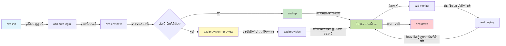
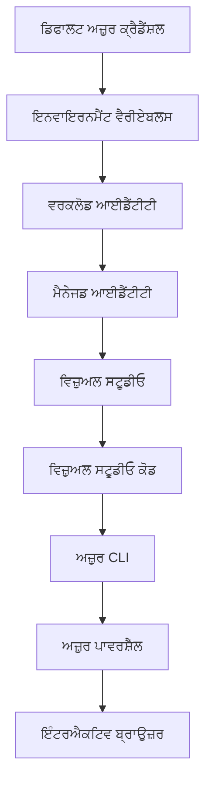

# AZD Basics - Azure Developer CLI ਨੂੰ ਸਮਝਣਾ

# AZD Basics - ਮੁੱਖ ਧਾਰਨਾਵਾਂ ਅਤੇ ਬੁਨਿਆਦੀ ਗੱਲਾਂ

**ਅਧਿਆਇ ਨੈਵੀਗੇਸ਼ਨ:**
- **📚 ਕੋਰਸ ਹੋਮ**: [AZD For Beginners](../../README.md)
- **📖 ਵਰਤਮਾਨ ਅਧਿਆਇ**: Chapter 1 - Foundation & Quick Start
- **⬅️ ਪਹਿਲਾ**: [Course Overview](../../README.md#-chapter-1-foundation--quick-start)
- **➡️ ਅੱਗੇ**: [Installation & Setup](installation.md)
- **🚀 ਅਗਲਾ ਅਧਿਆਇ**: [Chapter 2: AI-First Development](../chapter-02-ai-development/microsoft-foundry-integration.md)

## ਪਰਿਚਯ

ਇਹ ਪਾਠ ਤੁਹਾਨੂੰ Azure Developer CLI (azd) ਨਾਲ ਜਾਣੂ ਕਰਵਾਉਂਦਾ ਹੈ, ਜੋ ਇੱਕ ਸ਼ਕਤੀਸ਼ਾਲੀ ਕਮਾਂਡ-ਲਾਈਨ ਟੂਲ ਹੈ ਜੋ ਤੁਹਾਡੇ ਸਥਾਨਕ ਵਿਕਾਸ ਤੋਂ Azure ਡਿਪਲੋਇਮੈਂਟ ਤੱਕ ਦੀ ਯਾਤਰਾ ਨੂੰ ਤੇਜ਼ ਕਰਦਾ ਹੈ। ਤੁਸੀਂ ਬੁਨਿਆਦੀ ਧਾਰਨਾਵਾਂ, ਮੁੱਖ ਵਿਸ਼ੇਸ਼ਤਾਵਾਂ ਸਿੱਖੋਗੇ ਅਤੇ ਸਮਝੋਗੇ ਕਿ ਕਿਵੇਂ azd ਕਲਾਉਡ-ਨੈਟਿਵ ਐਪਲੀਕੇਸ਼ਨ ਡਿਪਲੋਇਮੈਂਟ ਨੂੰ ਸਰਲ ਬਣਾਉਂਦਾ ਹੈ।

## ਸਿੱਖਣ ਦੇ ਉਦੇਸ਼

ਇਸ ਪਾਠ ਦੇ ਅੰਤ ਤੱਕ, ਤੁਸੀਂ:
- ਸਮਝੋਗੇ ਕਿ Azure Developer CLI ਕੀ ਹੈ ਅਤੇ ਇਸਦਾ ਮੁੱਖ ਉਦੇਸ਼ ਕੀ ਹੈ
- ਟੈਂਪਲੇਟ, ਐਨਵਾਇਰਨਮੈਂਟ ਅਤੇ ਸੇਵਾਵਾਂ ਦੀਆਂ ਮੁੱਖ ਧਾਰਨਾਵਾਂ ਸਿੱਖੋਗੇ
- ਟੈਂਪਲੇਟ-ਚਲਿਤ ਵਿਕਾਸ ਅਤੇ Infrastructure as Code ਵਰਗੀਆਂ ਮੁੱਖ ਵਿਸ਼ੇਸ਼ਤਾਵਾਂ ਦੀ ਜਾਂਚ ਕਰੋਗੇ
- azd ਪਰੋਜੈਕਟ ਸਰਚਨਾ ਅਤੇ ਵਰਕਫਲੋ ਨੂੰ ਸਮਝੋਗੇ
- azd ਨੂੰ ਆਪਣੇ ਵਿਕਾਸ ਵਾਤਾਵਰਣ ਲਈ ਇੰਸਟਾਲ ਅਤੇ ਕਨਫ਼ਿਗਰ ਕਰਨ ਲਈ ਤਿਆਰ ਹੋਵੋਗੇ

## ਸਿੱਖਣ ਦੇ ਨਤੀਜੇ

ਇਸ ਪਾਠ ਨੂੰ ਮੁਕੰਮਲ ਕਰਨ ਤੋਂ ਬਾਅਦ, ਤੁਸੀਂ ਸਮਰੱਥ ਹੋਵੋਗੇ:
- ਆਧੁਨਿਕ ਕਲਾਉਡ ਵਿਕਾਸ ਵਰਕਫਲੋਜ਼ ਵਿੱਚ azd ਦੀ ਭੂਮਿਕਾ ਸਮਝਾਉਣਾ
- azd ਪ੍ਰੋਜੈਕਟ ਬਣਤਰ ਦੇ ਘਟਕਾਂ ਦੀ ਪਛਾਣ ਕਰਨਾ
- ਵੇਰਵਾ ਕਰਨਾ ਕਿ ਕਿਵੇਂ ਟੈਂਪਲੇਟ, ਐਨਵਾਇਰਨਮੈਂਟ ਅਤੇ ਸੇਵਾਵਾਂ ਇਕੱਠੇ ਕੰਮ ਕਰਦੀਆਂ ਹਨ
- azd ਨਾਲ Infrastructure as Code ਦੇ ਫਾਇਦੇ ਸਮਝਣਾ
- ਵੱਖ-ਵੱਖ azd ਕਮਾਂਡਾਂ ਅਤੇ ਉਨ੍ਹਾਂ ਦੇ ਉਦੇਸ਼ ਪਛਾਣਣਾ

## Azure Developer CLI (azd) ਕੀ ਹੈ?

Azure Developer CLI (azd) ਇੱਕ ਕਮਾਂਡ-ਲਾਈਨ ਟੂਲ ਹੈ ਜੋ ਤੁਹਾਡੀ ਸਥਾਨਕ ਵਿਕਾਸ ਤੋਂ Azure ਡਿਪਲੋਇਮੈਂਟ ਤੱਕ ਦੀ ਯਾਤਰਾ ਨੂੰ ਤੇਜ਼ ਕਰਨ ਲਈ ਡਿਜ਼ਾਇਨ ਕੀਤਾ ਗਿਆ ਹੈ। ਇਹ Azure 'ਤੇ ਕਲਾਉਡ-ਨੈਟਿਵ ਐਪਲੀਕੇਸ਼ਨਾਂ ਨੂੰ ਬਣਾਉਣ, ਤੈਨਾਤ ਕਰਨ ਅਤੇ ਪ੍ਰਬੰਧਿਤ ਕਰਨ ਦੀ ਪ੍ਰਕਿਰਿਆ ਨੂੰ ਸਰਲ ਬਣਾਉਂਦਾ ਹੈ।

### azd ਨਾਲ ਤੁਸੀਂ ਕੀ ਤੈਨਾਤ ਕਰ ਸਕਦੇ ਹੋ?

azd ਵਿਆਪਕ ਵਰਕਲੋਡਾਂ ਨੂੰ ਸਮਰਥਨ ਕਰਦਾ ਹੈ—ਅਤੇ ਇਹ ਸੂਚੀ ਲਗਾਤਾਰ ਵੱਧ ਰਹੀ ਹੈ। ਅੱਜ, ਤੁਸੀਂ azd ਵਰਤ ਕੇ ਤੈਨਾਤ ਕਰ ਸਕਦੇ ਹੋ:

| Workload Type | Examples | Same Workflow? |
|---------------|----------|----------------|
| **Traditional applications** | ਵੈੱਬ ਐਪਸ, REST APIs, ਸਟੈਟਿਕ ਸਾਈਟਸ | ✅ `azd up` |
| **Services and microservices** | Container Apps, Function Apps, ਮਲਟੀ-ਸੇਵਾ ਬੈਕਐਂਡ | ✅ `azd up` |
| **AI-powered applications** | Microsoft Foundry Models ਨਾਲ ਚੈਟ ਐਪ, AI Search ਨਾਲ RAG ਹੱਲ | ✅ `azd up` |
| **Intelligent agents** | Foundry-ਹੋਸਟ ਕੀਤੇ ਏਜੰਟ, ਮਲਟੀ-ਏਜੰਟ ਓਰਕੇਸਟ੍ਰੇਸ਼ਨਜ਼ | ✅ `azd up` |

ਮੁੱਖ ਗੱਲ ਇਹ ਹੈ ਕਿ **azd ਦਾ ਲਾਈਫਸਾਇਕਲ ਜੋ ਕੁਝ ਵੀ ਤੁਸੀਂ ਤੈਨਾਤ ਕਰ ਰਹੇ ਹੋ, ਇੱਕੋ ਹੀ ਰਹਿੰਦਾ ਹੈ**। ਤੁਸੀਂ ਇਕ ਪ੍ਰੋਜੈਕਟ ਸ਼ੁਰੂ ਕਰਦੇ ਹੋ, ਇੰਫਰਾਸਟ੍ਰਕਚਰ ਪ੍ਰੋਵਿਜ਼ਨ ਕਰਦੇ ਹੋ, ਆਪਣਾ ਕੋਡ ਤੈਨਾਤ ਕਰਦੇ ਹੋ, ਆਪਣੀ ਐਪ ਦੀ ਨਿਗਰਾਨੀ ਕਰਦੇ ਹੋ ਅਤੇ ਸਾਫ਼-ਸੁਥਰਾ ਕਰਦੇ ਹੋ—ਚਾਹੇ ਇਹ ਇੱਕ ਸਧਾਰਨ ਵੈੱਬਸਾਈਟ ਹੋਵੇ ਜਾਂ ਇੱਕ ਜਟਿਲ AI ਏਜੰਟ।

ਇਹ ਸਤਤਤਾ ਡਿਜ਼ਾਇਨ ਦੇ ਤਹਿਤ ਹੈ। azd AI ਸਮਰੱਥਾਵਾਂ ਨੂੰ ਤੁਹਾਡੇ ਐਪ ਲਈ ਇੱਕ ਹੋਰ ਕਿਸਮ ਦੀ ਸੇਵਾ ਵਜੋਂ ਦੇਖਦਾ ਹੈ, ਨਾ ਕਿ ਕਿਸੇ ਬੁਨਿਆਦੀ ਤੌਰ 'ਤੇ ਵੱਖ-ਵੱਖ ਚੀਜ਼ ਵਜੋਂ। Microsoft Foundry Models ਨਾਲ ਬੈਕ ਕੀਤੀ ਗਈ ਇੱਕ ਚੈਟ ਏਂਡਪੋਇੰਟ azd ਦੇ ਦ੍ਰਿਸ਼ਟੀਕੋਣ ਤੋਂ ਸਿਰਫ ਇੱਕ ਹੋਰ ਸੰਰਚਨਾ ਯੋਗ ਸੇਵਾ ਹੋਣੀ ਹੈ ਜਿਸ ਨੂੰ ਨਿਰਧਾਰਿਤ ਅਤੇ ਤੈਨਾਤ ਕੀਤਾ ਜਾ ਸਕਦਾ ਹੈ।

### 🎯 ਕਿਉਂ AZD ਵਰਤਣਾ? ਇਕ ਅਸਲੀ ਦੁਨੀਆ ਦੀ ਤੁਲਨਾ

ਆਓ ਇੱਕ ਸਧਾਰਨ ਵੈੱਬ ਐਪ ਨੂੰ ਡੇਟਾਬੇਸ ਨਾਲ ਤੈਨਾਤ ਕਰਨ ਦੀ ਤੁਲਨਾ ਕਰੀਏ:

#### ❌ AZD ਬਿਨਾਂ: ਮੈਨੂਅਲ Azure ਡਿਪਲੋਇਮੈਂਟ (30+ ਮਿੰਟ)

```bash
# ਕਦਮ 1: ਰਿਸੋਰਸ ਗਰੁੱਪ ਬਣਾਓ
az group create --name myapp-rg --location eastus

# ਕਦਮ 2: ਐਪ ਸਰਵਿਸ ਪਲੈਨ ਬਣਾਓ
az appservice plan create --name myapp-plan \
  --resource-group myapp-rg \
  --sku B1 --is-linux

# ਕਦਮ 3: ਵੈੱਬ ਐਪ ਬਣਾਓ
az webapp create --name myapp-web-unique123 \
  --resource-group myapp-rg \
  --plan myapp-plan \
  --runtime "NODE:18-lts"

# ਕਦਮ 4: ਕੋਸਮੋਸ DB ਖਾਤਾ ਬਣਾਓ (10-15 ਮਿੰਟ)
az cosmosdb create --name myapp-cosmos-unique123 \
  --resource-group myapp-rg \
  --kind MongoDB

# ਕਦਮ 5: ਡੇਟਾਬੇਸ ਬਣਾਓ
az cosmosdb mongodb database create \
  --account-name myapp-cosmos-unique123 \
  --resource-group myapp-rg \
  --name tododb

# ਕਦਮ 6: ਕਲੈਕਸ਼ਨ ਬਣਾਓ
az cosmosdb mongodb collection create \
  --account-name myapp-cosmos-unique123 \
  --resource-group myapp-rg \
  --database-name tododb \
  --name todos

# ਕਦਮ 7: ਕਨੈਕਸ਼ਨ ਸਟਰਿੰਗ ਪ੍ਰਾਪਤ ਕਰੋ
CONN_STR=$(az cosmosdb keys list \
  --name myapp-cosmos-unique123 \
  --resource-group myapp-rg \
  --type connection-strings \
  --query "connectionStrings[0].connectionString" -o tsv)

# ਕਦਮ 8: ਐਪ ਸੈਟਿੰਗਸ ਕਨਫਿਗਰ ਕਰੋ
az webapp config appsettings set \
  --name myapp-web-unique123 \
  --resource-group myapp-rg \
  --settings MONGODB_URI="$CONN_STR"

# ਕਦਮ 9: ਲੌਗਿੰਗ ਚਾਲੂ ਕਰੋ
az webapp log config --name myapp-web-unique123 \
  --resource-group myapp-rg \
  --application-logging filesystem \
  --detailed-error-messages true

# ਕਦਮ 10: ਐਪਲੀਕੇਸ਼ਨ ਇਨਸਾਈਟਸ ਸੈਟਅਪ ਕਰੋ
az monitor app-insights component create \
  --app myapp-insights \
  --location eastus \
  --resource-group myapp-rg

# ਕਦਮ 11: ਐਪ ਇਨਸਾਈਟਸ ਨੂੰ ਵੈੱਬ ਐਪ ਨਾਲ ਲਿੰਕ ਕਰੋ
INSTRUMENTATION_KEY=$(az monitor app-insights component show \
  --app myapp-insights \
  --resource-group myapp-rg \
  --query "instrumentationKey" -o tsv)

az webapp config appsettings set \
  --name myapp-web-unique123 \
  --resource-group myapp-rg \
  --settings APPINSIGHTS_INSTRUMENTATIONKEY="$INSTRUMENTATION_KEY"

# ਕਦਮ 12: ਐਪਲੀਕੇਸ਼ਨ ਨੂੰ ਸਥਾਨਕ ਤੌਰ 'ਤੇ ਬਿਲਡ ਕਰੋ
npm install
npm run build

# ਕਦਮ 13: ਡਿਪਲਾਇਮੈਂਟ ਪੈਕੇਜ ਬਣਾਓ
zip -r app.zip . -x "*.git*" "node_modules/*"

# ਕਦਮ 14: ਐਪਲੀਕੇਸ਼ਨ ਨੂੰ ਡਿਪਲੋਏ ਕਰੋ
az webapp deployment source config-zip \
  --resource-group myapp-rg \
  --name myapp-web-unique123 \
  --src app.zip

# ਕਦਮ 15: ਉਡੀਕ ਕਰੋ ਅਤੇ ਦੁਆ ਕਰੋ ਕਿ ਇਹ ਕੰਮ ਕਰੇ 🙏
# (ਕੋਈ ਆਟੋਮੇਟਿਕ ਵੈਰੀਫਿਕੇਸ਼ਨ ਨਹੀਂ, ਮੈਨੂਅਲ ਟੈਸਟਿੰਗ ਲੋੜੀਂਦੀ ਹੈ)
```

**ਸਮੱਸਿਆਵਾਂ:**
- ❌ 15+ ਕਮਾਂਡਾਂ ਨੂੰ ਯਾਦ ਰੱਖਣਾ ਅਤੇ ਕ੍ਰਮ ਵਿੱਚ ਚਲਾਉਣਾ
- ❌ 30-45 ਮਿੰਟ ਦਾ ਮੈਨੂਅਲ ਕੰਮ
- ❌ ਗਲਤੀਆਂ ਕਰਨਾ ਆਸਾਨ (ਟਾਈਪੋ, ਗਲਤ ਪੈਰਾਮੀਟਰ)
- ❌ ਟਰਮੀਨਲ ਇਤਿਹਾਸ ਵਿੱਚ ਕਨੈਕਸ਼ਨ ਸਟ੍ਰਿੰਗ ਪ੍ਰਭਾਸ਼ਤ
- ❌ ਜੇ ਕੁਝ ਫੇਲ ਹੋ ਜਾਏ ਤਾਂ ਆਟੋਮੇਟਿਕ ਰੋਲਬੈਕ ਨਹੀਂ
- ❌ ਟੀਮ ਮੈਂਬਰਾਂ ਲਈ ਦੁਹਰਾਉਣਾ ਔਖਾ
- ❌ ਹਰ ਵਾਰੀ ਵੱਖਰਾ (ਦੁਹਰਾਯੋਗ ਨਹੀਂ)

#### ✅ AZD ਨਾਲ: ਆਟੋਮੇਟਡ ਡਿਪਲੋਇਮੈਂਟ (5 ਕਮਾਂਡ, 10-15 ਮਿੰਟ)

```bash
# ਕਦਮ 1: ਟੈਂਪਲੇਟ ਤੋਂ ਆਰੰਭ ਕਰੋ
azd init --template todo-nodejs-mongo

# ਕਦਮ 2: ਪ੍ਰਮਾਣਿਤ ਕਰੋ
azd auth login

# ਕਦਮ 3: ਮਾਹੌਲ ਬਣਾਓ
azd env new dev

# ਕਦਮ 4: ਤਬਦੀਲੀਆਂ ਦਾ ਪਹਿਲਾ ਨਜ਼ਾਰਾ (ਵਿਕਲਪਿਕ ਪਰ ਸੁਝਾਇਆ ਜਾਂਦਾ ਹੈ)
azd provision --preview

# ਕਦਮ 5: ਸਭ ਕੁਝ ਤੈਨਾਤ ਕਰੋ
azd up

# ✨ ਹੋ ਗਿਆ! ਸਭ ਕੁਝ ਤੈਨਾਤ, ਸੰਰਚਿਤ ਅਤੇ ਨਿਗਰਾਨ ਕੀਤਾ ਗਿਆ ਹੈ
```

**ਫਾਇਦੇ:**
- ✅ **5 ਕਮਾਂਡ** ਬਨਾਮ 15+ ਮੈਨੂਅਲ ਕਦਮ
- ✅ **10-15 ਮਿੰਟ** ਕੁੱਲ ਸਮਾਂ (ਜਿਆਦਾਤਰ Azure ਦੀ ਪ੍ਰਤੀਖਿਆ)
- ✅ **ਘੱਟ ਮੈਨੂਅਲ ਗਲਤੀਆਂ** - ਲਗਾਤਾਰ, ਟੈਂਪਲੇਟ-ਚਲਿਤ ਵਰਕਫਲੋ
- ✅ **ਸੁਰੱਖਿਅਤ ਸੀਕ੍ਰੇਟ ਹੈਂਡਲਿੰਗ** - ਕਈ ਟੈਂਪਲੇਟ Azure-managed secret storage ਵਰਤਦੇ ਹਨ
- ✅ **ਦੁਹਰਾਏ ਜਾਣ ਯੋਗ ਡਿਪਲੋਇਮੈਂਟ** - ਹਰ ਵਾਰੀ ਇੱਕੋ ਵਰਕਫਲੋ
- ✅ **ਪੂਰੀ ਤਰ੍ਹਾਂ ਦੁਹਰਾਯੋਗ** - ਹਰ ਵਾਰੀ ਉਹੀ ਨਤੀਜਾ
- ✅ **ਟੀਮ-ਤਿਆਰ** - ਕੋਈ ਵੀ ਇੱਕੋ ਕਮਾਂਡਾਂ ਨਾਲ ਡਿਪਲੋਇ ਕਰ ਸਕਦਾ ਹੈ
- ✅ **Infrastructure as Code** - ਵਰਜ਼ਨ-ਕੰਟਰੋਲ Bicep ਟੈਂਪਲੇਟ
- ✅ **ਬਿਲਟ-ਇਨ ਮੋਨੀਟਰੀਂਗ** - Application Insights ਆਪਣੇ ਆਪ ਕਨਫਿਗਰ ਹੁੰਦਾ ਹੈ

### 📊 ਸਮਾਂ ਅਤੇ ਗਲਤੀ ਵਿੱਚ ਕਮੀ

| Metric | Manual Deployment | AZD Deployment | Improvement |
|:-------|:------------------|:---------------|:------------|
| **Commands** | 15+ | 5 | 67% ਘੱਟ |
| **Time** | 30-45 min | 10-15 min | 60% ਤੇਜ਼ |
| **Error Rate** | ~40% | <5% | 88% ਘਟੋਤਰੀ |
| **Consistency** | ਘੱਟ (ਮੈਨੂਅਲ) | 100% (ਆਟੋਮੇਟਿਕ) | ਪੂਰਨ |
| **Team Onboarding** | 2-4 hours | 30 minutes | 75% ਤੇਜ਼ |
| **Rollback Time** | 30+ min (ਮੈਨੂਅਲ) | 2 min (ਆਟੋਮੇਟਿਕ) | 93% ਤੇਜ਼ |

## ਮੁੱਖ ਧਾਰਨਾਵਾਂ

### ਟੈਂਪਲੇਟ
ਟੈਂਪਲੇਟ azd ਦੀ ਬੁਨਿਆਦ ਹਨ। ਇਹ ਸ਼ਾਮਲ ਕਰਦੇ ਹਨ:
- **Application code** - ਤੁਹਾਡਾ ਸਰੋਤ ਕੋਡ ਅਤੇ ਨਿਰਭਰਤਾਵਾਂ
- **Infrastructure definitions** - Bicep ਜਾਂ Terraform ਵਿੱਚ ਪਰਿਭਾਸ਼ਿਤ Azure ਰਿਸੋਰਸ
- **Configuration files** - ਸੈਟਿੰਗ ਅਤੇ ਐਨਵਾਇਰਨਮੈਂਟ ਵੈਰੀਏਬਲ
- **Deployment scripts** - ਆਟੋਮੇਟਡ ਡਿਪਲੋਇਮੈਂਟ ਵਰਕਫਲੋਜ਼

### ਐਨਵਾਇਰਨਮੈਂਟ
ਐਨਵਾਇਰਨਮੈਂਟ ਵੱਖ-ਵੱਖ ਡਿਪਲੋਇਮੈਂਟ ਟਾਰਗਟ ਨੂੰ ਦਰਸਾਉਂਦੇ ਹਨ:
- **Development** - ਟੈਸਟਿੰਗ ਅਤੇ ਵਿਕਾਸ ਲਈ
- **Staging** - ਪ੍ਰੀ-ਉਤਪਾਦਨ ਵਾਤਾਵਰਣ
- **Production** - ਲਾਈਵ ਪ੍ਰੋਡਕਸ਼ਨ ਵਾਤਾਵਰਣ

ਹਰ ਐਨਵਾਇਰਨਮੈਂਟ ਆਪਣਾ ਰੱਖਦਾ ਹੈ:
- Azure resource group
- ਕਨਫ਼ਿਗਰੇਸ਼ਨ ਸੈਟਿੰਗਜ਼
- ਡਿਪਲੋਇਮੈਂਟ ਸਥਿਤੀ

### ਸੇਵਾਵਾਂ
ਸੇਵਾਵਾਂ ਤੁਹਾਡੇ ਐਪਲੀਕੇਸ਼ਨ ਦੇ ਬਿਲਡਿੰਗ ਬਲਾਕ ਹਨ:
- **Frontend** - ਵੈੱਬ ਐਪਲੀਕੇਸ਼ਨ, SPAs
- **Backend** - APIs, ਮਾਈਕ੍ਰੋਸੇਵਾਵਾਂ
- **Database** - ਡੇਟਾ ਸਟੋਰੇਜ ਹੱਲ
- **Storage** - ਫਾਈਲ ਅਤੇ ਬਲੌਬ ਸਟੋਰੇਜ

## ਮੁੱਖ ਵਿਸ਼ੇਸ਼ਤਾਵਾਂ

### 1. ਟੈਂਪਲੇਟ-ਚਲਿਤ ਵਿਕਾਸ
```bash
# ਉਪਲਬਧ ਟੈਮਪਲੇਟ ਵੇਖੋ
azd template list

# ਟੈਮਪਲੇਟ ਤੋਂ ਸ਼ੁਰੂ ਕਰੋ
azd init --template <template-name>
```

### 2. Infrastructure as Code
- **Bicep** - Azure ਦੀ ਡੋਮੈਨ-ਨਿਸ਼ਚਿਤ ਭਾਸ਼ਾ
- **Terraform** - ਮਲਟੀ-ਕਲਾਉਡ ਇੰਫਰਾਸਟ੍ਰਕਚਰ ਟੂਲ
- **ARM Templates** - Azure Resource Manager ਟੈਂਪਲੇਟ

### 3. ਇੰਟਿਗ੍ਰੇਟਡ ਵਰਕਫਲੋਜ਼
```bash
# ਪੂਰਾ ਡਿਪਲੋਇਮੈਂਟ ਵਰਕਫਲੋ
azd up            # ਪ੍ਰੋਵਿਜ਼ਨ + ਡਿਪਲੋਏ — ਇਹ ਪਹਿਲੀ ਵਾਰੀ ਸੈੱਟਅਪ ਲਈ ਬਿਨਾਂ ਦਖਲ ਵਾਲਾ ਹੈ

# 🧪 ਨਵਾਂ: ਡਿਪਲੋਏ ਕਰਨ ਤੋਂ ਪਹਿਲਾਂ ਇੰਫਰਾਸਟ੍ਰੱਕਚਰ ਬਦਲਾਵਾਂ ਦੀ ਪੂਰਵ-ਝਲਕ (ਸੁਰੱਖਿਅਤ)
azd provision --preview    # ਬਦਲਾਅ ਕੀਤੇ ਬਿਨਾਂ ਇੰਫਰਾਸਟ੍ਰੱਕਚਰ ਦੀ ਤੈਨਾਤੀ ਦਾ ਅਨੁਕਰਣ ਕਰੋ

azd provision     # ਇੰਫਰਾਸਟ੍ਰੱਕਚਰ ਅਪਡੇਟ ਕਰਨ 'ਤੇ Azure ਰਿਸੋਰਸ ਬਣਾਉਣ ਲਈ ਇਸ ਨੂੰ ਵਰਤੋ
azd deploy        # ਐਪਲੀਕੇਸ਼ਨ ਕੋਡ ਨੂੰ ਤੈਨਾਤ ਕਰੋ ਜਾਂ ਅਪਡੇਟ ਹੋਣ 'ਤੇ ਮੁੜ ਤੈਨਾਤ ਕਰੋ
azd down          # ਰਿਸੋਰਸਾਂ ਨੂੰ ਸਾਫ਼ ਕਰੋ
```

#### 🛡️ ਪ੍ਰੀਵਿਊ ਨਾਲ ਸੁਰੱਖਿਅਤ ਇੰਫਰਾਸਟ੍ਰਕਚਰ ਯੋਜਨਾ
`azd provision --preview` ਕਮਾਂਡ ਸੁਰੱਖਿਅਤ ਡਿਪਲੋਇਮੈਂਟ ਲਈ ਇੱਕ ਖੇਡ-ਬਦਲਨ ਵਾਲੀ ਚੀਜ਼ ਹੈ:
- **ਡ੍ਰਾਈ-ਰਨ ਵਿਸ਼ਲੇਸ਼ਣ** - ਦਿਖਾਉਂਦਾ ਹੈ ਕਿ ਕੀ ਬਣਾਇਆ, ਬਦਲਿਆ ਜਾਂ ਮਿਟਾਇਆ ਜਾਵੇਗਾ
- **ਜ਼ੀਰੋ ਰਿਸਕ** - ਤੁਹਾਡੇ Azure ਵਾਤਾਵਰਣ ਵਿੱਚ ਕੋਈ ਅਸਲੀ ਬਦਲਾਅ ਨਹੀਂ ਹੁੰਦੇ
- **ਟੀਮ ਸਹਿਯੋਗ** - ਡਿਪਲੋਇਮੈਂਟ ਤੋਂ ਪਹਿਲਾਂ ਪ੍ਰੀਵਿਊ ਨਤੀਜੇ ਸਾਂਝਾ ਕਰੋ
- **ਲਾਗਤ ਅੰਦਾਜ਼ਾ** - ਕਮਿਟਮੈਂਟ ਤੋਂ ਪਹਿਲਾਂ ਰਿਸੋਰਸ ਲਾਗਤ ਸਮਝੋ

```bash
# ਉਦਾਹਰਨ ਪ੍ਰੀਵਿਊ ਵਰਕਫਲੋ
azd provision --preview           # ਵੇਖੋ ਕਿ ਕੀ ਬਦਲੇਗਾ
# ਆਉਟਪੁੱਟ ਦੀ ਸਮੀਖਿਆ ਕਰੋ, ਟੀਮ ਨਾਲ ਚਰਚਾ ਕਰੋ
azd provision                     # ਭਰੋਸੇ ਨਾਲ ਬਦਲਾਅ ਲਾਗੂ ਕਰੋ
```

### 📊 ਵੀਜ਼ੁਅਲ: AZD ਵਿਕਾਸ ਵਰਕਫਲੋ


**ਵਰਕਫਲੋ ਵਰਨਨ:**
1. **Init** - ਟੈਂਪਲੇਟ ਜਾਂ ਨਵੇਂ ਪ੍ਰੋਜੈਕਟ ਨਾਲ ਸ਼ੁਰੂ ਕਰੋ
2. **Auth** - Azure ਨਾਲ ਪ੍ਰਮਾਣਿਕਤਾ ਕਰੋ
3. **Environment** - ਇੱਕ ਅਲੱਗ ਡਿਪਲੋਇਮੈਂਟ ਐਨਵਾਇਰਨਮੈਂਟ ਬਣਾਓ
4. **Preview** - 🆕 ਸਦਾ ਪਹਿਲਾਂ ਇੰਫਰਾਸਟ੍ਰਕਚਰ ਬਦਲਾਅਾਂ ਦਾ ਪ੍ਰੀਵਿਊ ਕਰੋ (ਸੁਰੱਖਿਅਤ ਅਭਿਆਸ)
5. **Provision** - Azure ਰਿਸੋਰਸ ਬਣਾਓ/ਅਪਡੇਟ ਕਰੋ
6. **Deploy** - ਆਪਣਾ ਐਪਲੀਕੇਸ਼ਨ ਕੋਡ ਧੱਕੋ
7. **Monitor** - ਐਪਲੀਕੇਸ਼ਨ ਪ੍ਰਦਰਸ਼ਨ ਦੀ ਨਿਗਰਾਨੀ ਕਰੋ
8. **Iterate** - ਬਦਲਾਅ ਕਰੋ ਅਤੇ ਕੋਡ ਦੁਬਾਰਾ ਡਿਪਲੋਇ ਕਰੋ
9. **Cleanup** - ਜਦੋਂ ਮੁਕੰਮਲ ਹੋ ਜਾਵੇ ਤਾਂ ਰਿਸੋਰਸ ਹਟਾਓ

### 4. ਐਨਵਾਇਰਨਮੈਂਟ ਮੈਨੇਜਮੈਂਟ
```bash
# ਵਾਤਾਵਰਨ ਬਣਾਓ ਅਤੇ ਪ੍ਰਬੰਧ ਕਰੋ
azd env new <environment-name>
azd env select <environment-name>
azd env list
```

### 5. ਇਕਸਟੈਂਸ਼ਨਜ਼ ਅਤੇ AI ਕਮਾਂਡਸ

azd ਇੱਕ ਇਕਸਟੈਂਸ਼ਨ ਸਿਸਟਮ ਵਰਤਦਾ ਹੈ ਤਾ ਕਿ ਕੋਰ CLI ਤੋਂ ਪਰੇ ਸਮਰੱਥਾਵਾਂ ਜੋੜੀਆਂ ਜਾ ਸਕਣ। ਇਹ ਖਾਸ ਤੌਰ 'ਤੇ AI ਵਰਕਲੋਡਾਂ ਲਈ ਲਾਭਦਾਇਕ ਹੈ:

```bash
# ਉਪਲਬਧ ਐਕਸਟੇਸ਼ਨਾਂ ਦੀ ਸੂਚੀ
azd extension list

# Foundry ਏਜੰਟਸ ਐਕਸਟੇਸ਼ਨ ਨੂੰ ਇੰਸਟਾਲ ਕਰੋ
azd extension install azure.ai.agents

# ਇੱਕ ਮੈਨਿਫੈਸਟ ਤੋਂ AI ਏਜੰਟ ਪ੍ਰੋਜੈਕਟ ਆਰੰਭ ਕਰੋ
azd ai agent init -m agent-manifest.yaml

# AI ਦੀ ਸਹਾਇਤਾ ਨਾਲ ਵਿਕਾਸ ਲਈ MCP ਸਰਵਰ ਸ਼ੁਰੂ ਕਰੋ (ਅਲਫਾ)
azd mcp start
```

> ਇਕਸਟੈਂਸ਼ਨਜ਼ ਦੀ ਵਿਸਥਾਰਪੂਰਵਕ ਚਰਚਾ [Chapter 2: AI-First Development](../chapter-02-ai-development/agents.md) ਅਤੇ [AZD AI CLI Commands](../chapter-08-production/production-ai-practices.md#azd-ai-cli-commands-and-extensions) ਰੇਫ਼ਰੈਂਸ ਵਿੱਚ ਦਿੱਤੀ ਗਈ ਹੈ।

## 📁 ਪ੍ਰੋਜੈਕਟ ਢਾਂਚਾ

ਇੱਕ ਆਮ azd ਪ੍ਰੋਜੈਕਟ ਢਾਂਚਾ:
```
my-app/
├── .azd/                    # azd configuration
│   └── config.json
├── .azure/                  # Azure deployment artifacts
├── .devcontainer/          # Development container config
├── .github/workflows/      # GitHub Actions
├── .vscode/               # VS Code settings
├── infra/                 # Infrastructure code
│   ├── main.bicep        # Main infrastructure template
│   ├── main.parameters.json
│   └── modules/          # Reusable modules
├── src/                  # Application source code
│   ├── api/             # Backend services
│   └── web/             # Frontend application
├── azure.yaml           # azd project configuration
└── README.md
```

## 🔧 ਕੰਫਿਗਰੇਸ਼ਨ ਫਾਈਲਾਂ

### azure.yaml
ਮੁੱਖ ਪ੍ਰੋਜੈਕਟ ਕੰਫਿਗਰੇਸ਼ਨ ਫਾਈਲ:
```yaml
name: my-awesome-app
metadata:
  template: my-template@1.0.0

services:
  web:
    project: ./src/web
    language: js
    host: appservice
  api:
    project: ./src/api
    language: js
    host: appservice

hooks:
  preprovision:
    shell: pwsh
    run: echo "Preparing to provision..."
```

### .azure/config.json
ਐਨਵਾਇਰਨਮੈਂਟ-ਨਿਰਧਾਰਿਤ ਕੰਫਿਗਰੇਸ਼ਨ:
```json
{
  "version": 1,
  "defaultEnvironment": "dev",
  "environments": {
    "dev": {
      "subscriptionId": "your-subscription-id",
      "location": "eastus"
    }
  }
}
```

## 🎪 ਆਮ ਵਰਕਫਲੋਜ਼ ਹੱਥ-ਓਣ ਅਭਿਆਸਾਂ ਨਾਲ

> **💡 ਸਿੱਖਣ ਦੀ ਸਲਾਹ:** ਇਨ੍ਹਾਂ ਅਭਿਆਸਾਂ ਨੂੰ ਕ੍ਰਮ ਵਿੱਚ ਫਾਲੋ ਕਰੋ ਤਾਂ ਜੋ ਤੁਸੀਂ ਆਪਣੀਆਂ AZD ਕੁਸ਼ਲਤਾਵਾਂ ਪ੍ਰਗਟਾਵੀ ਤਰੀਕੇ ਨਾਲ ਵਿਕਸਿਤ ਕਰੋ।

### 🎯 ਅਭਿਆਸ 1: ਆਪਣਾ ਪਹਿਲਾ ਪ੍ਰੋਜੈਕਟ आरੰਭ ਕਰੋ

**ਉਦੇਸ਼:** ਇੱਕ AZD ਪ੍ਰੋਜੈਕਟ ਬਣਾਓ ਅਤੇ ਇਸ ਦੇ ਢਾਂਚੇ ਦੀ ਜਾਂਚ ਕਰੋ

**ਕਦਮ:**
```bash
# ਇੱਕ ਪਰਖਿਆ ਹੋਇਆ ਟੈਂਪਲੇਟ ਵਰਤੋ
azd init --template todo-nodejs-mongo

# ਜਨਰੇਟ ਕੀਤੀਆਂ ਫਾਈਲਾਂ ਨੂੰ ਖੋਜੋ
ls -la  # ਲੁਕੀਆਂ ਫਾਈਲਾਂ ਸਮੇਤ ਸਾਰੀਆਂ ਫਾਈਲਾਂ ਵੇਖੋ

# ਮੁੱਖ ਫਾਈਲਾਂ ਬਣਾਈਆਂ ਗਈਆਂ:
# - azure.yaml (ਮੁੱਖ ਸੰਰਚਨਾ)
# - infra/ (ਬੁਨਿਆਦੀ ਢਾਂਚਾ ਕੋਡ)
# - src/ (ਐਪਲੀਕੇਸ਼ਨ ਕੋਡ)
```

**✅ Success:** ਤੁਹਾਡੇ ਕੋਲ azure.yaml, infra/, ਅਤੇ src/ ਡਾਇਰੈਕਟਰੀਜ਼ ਹਨ

---

### 🎯 ਅਭਿਆਸ 2: Azure 'ਤੇ ਡਿਪਲੋਇ ਕਰੋ

**ਉਦੇਸ਼:** ਐਂਡ-ਟੂ-ਐਂਡ ਡਿਪਲੋਇਮੈਂਟ ਨੂੰ ਪੂਰਾ ਕਰੋ

**ਕਦਮ:**
```bash
# 1. ਪ੍ਰਮਾਣੀਕਰਨ ਕਰੋ
az login && azd auth login

# 2. ਮਾਹੌਲ ਬਣਾਓ
azd env new dev
azd env set AZURE_LOCATION eastus

# 3. ਬਦਲਾਵਾਂ ਦਾ ਪ੍ਰੀਵਿਊ (ਸੁਝਾਇਆ ਗਿਆ)
azd provision --preview

# 4. ਸਭ ਕੁਝ ਤੈਨਾਤ ਕਰੋ
azd up

# 5. ਤੈਨਾਤੀ ਦੀ ਜਾਂਚ ਕਰੋ
azd show    # ਆਪਣੇ ਐਪ ਦਾ URL ਵੇਖੋ
```

**ਉਮੀਦਿਤ ਸਮਾਂ:** 10-15 ਮਿੰਟ  
**✅ Success:** ਐਪਲੀਕੇਸ਼ਨ URL ਬਰਾਊਜ਼ਰ ਵਿੱਚ ਖੁਲਦਾ ਹੈ

---

### 🎯 ਅਭਿਆਸ 3: ਬਹੁਤ ਸਾਰੇ ਐਨਵਾਇਰਨਮੈਂਟ

**ਉਦੇਸ਼:** dev ਅਤੇ staging ਵਿੱਚ ਡਿਪਲੋਇ ਕਰੋ

**ਕਦਮ:**
```bash
# dev ਪਹਿਲਾਂ ਹੀ ਮੌਜੂਦ ਹੈ, staging ਬਣਾਓ
azd env new staging
azd env set AZURE_LOCATION westus2
azd up

# ਉਨ੍ਹਾਂ ਦੇ ਵਿਚਕਾਰ ਬਦਲੋ
azd env list
azd env select dev
```

**✅ Success:** Azure Portal ਵਿੱਚ ਦੋ ਵੱਖ-ਵੱਖ resource groups

---

### 🛡️ ਸਾਫ਼ ਸਲੇਟ: `azd down --force --purge`

ਜਦੋਂ ਤੁਹਾਨੂੰ ਪੂਰੀ ਤਰ੍ਹਾਂ ਰੀਸੈਟ ਕਰਨ ਦੀ ਲੋੜ ਹੋਵੇ:

```bash
azd down --force --purge
```

**ਇਹ ਕੀ ਕਰਦਾ ਹੈ:**
- `--force`: ਕੋਈ ਪੁਸ਼ਟੀ ਪ੍ਰੰਪਟ ਨਹੀਂ
- `--purge`: ਸਾਰੇ ਲੋਕਲ ਸਟੇਟ ਅਤੇ Azure ਰਿਸੋਰਸ ਮਿਟਾਉਂਦਾ ਹੈ

**ਕਦੋਂ ਵਰਤੋਂ:**
- ਡਿਪਲੋਇਮੈਂਟ ਮੱਧ ਵਿੱਚ ਫੇਲ ਹੋ ਗਿਆ ਹੋਵੇ
- ਪ੍ਰੋਜੈਕਟ ਬਦਲ ਰਹੇ ਹੋ
- ਇੱਕ ਤਾਜ਼ਾ ਸ਼ੁਰੂਆਤ ਦੀ ਲੋੜ ਹੋਵੇ

---

## 🎪 ਮੂਲ ਵਰਕਫਲੋ ਰੈਫਰੈਂਸ

### ਨਵਾਂ ਪ੍ਰੋਜੈਕਟ ਸ਼ੁਰੂ ਕਰਨਾ
```bash
# ਤਰੀਕਾ 1: ਮੌਜੂਦਾ ਟੈਮਪਲੇਟ ਵਰਤੋ
azd init --template todo-nodejs-mongo

# ਤਰੀਕਾ 2: ਸਿਰੇ ਤੋਂ ਸ਼ੁਰੂ ਕਰੋ
azd init

# ਤਰੀਕਾ 3: ਮੌਜੂਦਾ ਡਾਇਰੈਕਟਰੀ ਵਰਤੋ
azd init .
```

### ਵਿਕਾਸ ਚੱਕਰ
```bash
# ਡਿਵੈਲਪਮੈਂਟ ਵਾਤਾਵਰਣ ਸੈੱਟਅੱਪ ਕਰੋ
azd auth login
azd env new dev
azd env select dev

# ਸਭ ਕੁਝ ਡਿਪਲੋਏ ਕਰੋ
azd up

# ਬਦਲਾਅ ਕਰੋ ਅਤੇ ਦੁਬਾਰਾ ਡਿਪਲੋਏ ਕਰੋ
azd deploy

# ਕੰਮ ਮੁਕੰਮਲ ਹੋਣ 'ਤੇ ਸਾਫ਼ ਕਰੋ
azd down --force --purge # Azure Developer CLI ਵਿੱਚ ਇਹ ਕਮਾਂਡ ਤੁਹਾਡੇ ਵਾਤਾਵਰਣ ਲਈ ਇੱਕ **ਹਾਰਡ ਰੀਸੈੱਟ** ਹੈ—ਖਾਸ ਕਰਕੇ ਜਦੋਂ ਤੁਸੀਂ ਨਾਕਾਮ ਡਿਪਲੋਇਮੈਂਟਾਂ ਦੀ ਸਮੱਸਿਆ ਸੁਲਝਾ ਰਹੇ ਹੋ, ਛੱਡੇ ਹੋਏ ਸਰੋਤਾਂ ਨੂੰ ਸਾਫ਼ ਕਰ ਰਹੇ ਹੋ, ਜਾਂ ਨਵੇਂ ਦੁਬਾਰਾ ਡਿਪਲੋਇਮੈਂਟ ਲਈ ਤਿਆਰੀ ਕਰ ਰਹੇ ਹੋ।
```

## `azd down --force --purge` ਨੂੰ ਸਮਝਣਾ
`azd down --force --purge` ਕਮਾਂਡ ਤੁਹਾਡੇ azd ਐਨਵਾਇਰਨਮੈਂਟ ਅਤੇ ਸਾਰੇ ਜੁੜੇ ਹੋਏ ਰਿਸੋਰਸز ਨੂੰ ਪੂਰੀ ਤਰ੍ਹਾਂ ਤੋੜਨ ਦਾ ਇੱਕ ਸ਼ਕਤੀਸ਼ਾਲੀ ਤਰੀਕਾ ਹੈ। ਹੇਠਾਂ ਹਰ ਫ਼ਲੈਗ ਕੀ ਕਰਦਾ ਹੈ ਦਾ ਵਿਸਥਾਰ ਹੈ:
```
--force
```
- ਪੁਸ਼ਟੀ ਪ੍ਰੰਪਟਾਂ ਨੂੰ ਛੱਡਦਾ ਹੈ।
- ਆਟੋਮੇਸ਼ਨ ਜਾਂ ਸਕ੍ਰਿਪਟਿੰਗ ਲਈ ਲਾਭਦਾਇਕ ਜਿੱਥੇ ਮੈਨੂਅਲ ਇਨਪੁੱਟ ਥਾਂ ਨਹੀਂ ਰੱਖੀ ਜਾ ਸਕਦੀ।
- ਇਹ ਯਕੀਨੀ ਬਣਾਉਂਦਾ ਹੈ ਕਿ ਤਿਅਰੀ ਬਿਨਾਂ ਰੁਕਾਵਟ ਦੇ ਚੱਲਦੀ ਹੈ, ਭਾਵੇਂ CLI ਅਸਮਰੱਥਤਾਵਾਂ ਨੂੰ ਪਛਾਣੇ।

```
--purge
```
ਸਭ **ਸੰਬੰਧਤ ਮੈਟਾ ਡੇਟਾ** ਮਿਟਾਂਦਾ ਹੈ, ਜਿਸ ਵਿੱਚ ਸ਼ਾਮਲ ਹਨ:
ਐਨਵਾਇਰਨਮੈਂਟ ਸਥਿਤੀ
ਲੋਕਲ `.azure` ਫੋਲਡਰ
ਕੈਸ਼ ਕੀਤੀ ਡਿਪਲੋਇਮੈਂਟ ਜਾਣਕਾਰੀ
azd ਨੂੰ "ਯਾਦ ਰੱਖਣ" ਤੋਂ ਰੋਕਦਾ ਹੈ ਪਿਛਲੇ ਡਿਪਲੋਇਮੈਂਟਸ ਨੂੰ, ਜੋ ਕਿ ਅਜਿਹੇ ਮੁੱਦੇ ਪੈਦਾ ਕਰ ਸਕਦੇ ਹਨ ਜਿਵੇਂ ਕਿ ਬੇਮੈਚ ਹੋਏ resource groups ਜਾਂ ਪੁਰਾਣੇ registry ਰੈਫਰੈਂਸ।

### ਕਿਉਂ ਦੋਹਾਂ ਵਰਤਣ?
ਜਦੋਂ `azd up` ਵਿੱਚ ਜਮੀ ਰਹੀ ਸਥਿਤੀ ਜਾਂ ਆਧੀ-ਡਿਪਲੋਇਮੈਂਟ ਦੇ ਕਾਰਨ ਤੁਸੀਂ ਅੱਗੇ ਨਹੀਂ ਵਧ ਸਕਦੇ, ਇਹ ਕੰਬੋ ਇੱਕ **ਸਾਫ਼ ਸਲੇਟ** ਨੂੰ ਯਕੀਨੀ ਬਨਾਉਂਦਾ ਹੈ।

ਇਹ ਖਾਸ ਤੌਰ 'ਤੇ ਉਪਯੋਗੀ ਹੁੰਦਾ ਹੈ ਜਦੋਂ Azure ਪੋਰਟਲ ਵਿੱਚ ਹੱਥੋਂ ਰਿਸੋਰਸ ਮਿਟਾਏ ਗਏ ਹੋਣ ਜਾਂ ਜਦੋਂ ਟੈਂਪਲੇਟ, ਐਨਵਾਇਰਨਮੈਂਟ ਜਾਂ resource group ਨਾਂਕਰਨ ਪ੍ਰਥਾਵਾਂ ਬਦਲ ਰਹੀਆਂ ਹੋਣ।

### ਬਹੁਤ ਸਾਰੇ ਐਨਵਾਇਰਨਮੈਂਟ ਦੀ ਪ੍ਰਬੰਧਕੀ
```bash
# ਸਟੇਜਿੰਗ ਵਾਤਾਵਰਣ ਬਣਾਓ
azd env new staging
azd env select staging
azd up

# ਡੈਵ 'ਤੇ ਵਾਪਸ ਜਾਓ
azd env select dev

# ਵਾਤਾਵਰਣਾਂ ਦੀ ਤੁਲਨਾ ਕਰੋ
azd env list
```

## 🔐 ਪ੍ਰਮਾਣਿਕਤਾ ਅਤੇ ਕ੍ਰੈਡੈਂਸ਼ਲ

ਪ੍ਰਮਾਣਿਕਤਾ ਨੂੰ ਸਮਝਣਾ azd ਡਿਪਲੋਇਮੈਂਟਸ ਲਈ ਬਹੁਤ ਜਰੂਰੀ ਹੈ। Azure ਕਈ ਪ੍ਰਮਾਣਿਕਤਾ ਢੰਗ ਵਰਤਦਾ ਹੈ, ਅਤੇ azd ਉਹੀ ਕ੍ਰੈਡੈਂਸ਼ਲ ਚੇਨ ਵਰਤਦਾ ਹੈ ਜੋ ਹੋਰ Azure ਟੂਲ ਵਰਤਦੇ ਹਨ।

### Azure CLI Authentication (`az login`)

azd ਵਰਤਣ ਤੋਂ ਪਹਿਲਾਂ, ਤੁਹਾਨੂੰ Azure ਨਾਲ ਪ੍ਰਮਾਣਿਕਤਾ ਕਰਨ ਦੀ ਲੋੜ ਹੈ। ਸਭ ਤੋਂ ਆਮ ਤਰੀਕਾ Azure CLI ਵਰਤਣਾ ਹੈ:

```bash
# ਇੰਟਰਐਕਟਿਵ ਲੌਗਿਨ (ਬ੍ਰਾਊਜ਼ਰ ਖੋਲਦਾ ਹੈ)
az login

# ਕਿਸੇ ਨਿਰਧਾਰਿਤ ਟੇਨੈਂਟ ਨਾਲ ਲੌਗਿਨ
az login --tenant <tenant-id>

# ਸਰਵਿਸ ਪ੍ਰਿੰਸੀਪਲ ਨਾਲ ਲੌਗਿਨ
az login --service-principal -u <app-id> -p <password> --tenant <tenant-id>

# ਮੌਜੂਦਾ ਲੌਗਿਨ ਦੀ ਸਥਿਤੀ ਜਾਂਚੋ
az account show

# ਉਪਲਬਧ ਸਬਸਕ੍ਰਿਪਸ਼ਨਾਂ ਦੀ ਸੂਚੀ ਦਿਖਾਓ
az account list --output table

# ਡਿਫਾਲਟ ਸਬਸਕ੍ਰਿਪਸ਼ਨ ਸੈੱਟ ਕਰੋ
az account set --subscription <subscription-id>
```

### Authentication ਫਲੋ
1. **Interactive Login**: ਪ੍ਰਮਾਣਿਕਤਾ ਲਈ ਤੁਹਾਡਾ ਡਿਫਾਲਟ ਬ੍ਰਾਊਜ਼ਰ ਖੋਲਦਾ ਹੈ
2. **Device Code Flow**: ਉਨ੍ਹਾਂ ਵਾਤਾਵਰਣਾਂ ਲਈ ਜਿੱਥੇ ਬ੍ਰਾਊਜ਼ਰ ਦੀ ਪਹੁੰਚ ਨਹੀਂ ਹੈ
3. **Service Principal**: ਆਟੋਮੇਸ਼ਨ ਅਤੇ CI/CD ਸਿਨਾਰਿਓਜ਼ ਲਈ
4. **Managed Identity**: Azure-ਹੋਸਟ ਕੀਤੀਆਂ ਐਪਲੀਕੇਸ਼ਨਾਂ ਲਈ

### DefaultAzureCredential ਚੇਨ

`DefaultAzureCredential` ਇੱਕ ਕ੍ਰੈਡੈਂਸ਼ਲ ਕਿਸਮ ਹੈ ਜੋ ਕੁਝ ਵਿਸ਼ੇਸ਼ ਕ੍ਰਮ ਵਿੱਚ ਆਟੋਮੈਟਿਕ ਤੌਰ 'ਤੇ ਕਈ ਕ੍ਰੈਡੈਂਸ਼ਲ ਸੋਰਸਜ਼ ਦੀ ਕੋਸ਼ਿਸ਼ ਕਰਕੇ ਇੱਕ ਸਧਾਰਨ ਪ੍ਰਮਾਣਿਕਤਾ ਅਨੁਭਵ ਪ੍ਰਦਾਨ ਕਰਦੀ ਹੈ:

#### Credential Chain Order

#### 1. Environment Variables
```bash
# ਸੇਵਾ ਪ੍ਰਿੰਸੀਪਲ ਲਈ ਵਾਤਾਵਰਣ ਵੈਰੀਏਬਲ ਸੈੱਟ ਕਰੋ
export AZURE_CLIENT_ID="<app-id>"
export AZURE_CLIENT_SECRET="<password>"
export AZURE_TENANT_ID="<tenant-id>"
```

#### 2. Workload Identity (Kubernetes/GitHub Actions)
ਆਟੋਮੈਟਿਕ ਤੌਰ 'ਤੇ ਵਰਤਿਆ ਜਾਂਦਾ ਹੈ:
- Azure Kubernetes Service (AKS) with Workload Identity
- GitHub Actions with OIDC federation
- ਹੋਰ ਫੈਡਰੇਟਡ ਆਈਡੈਂਟੀਟੀ ਸਿਨਾਰਿਓਜ਼

#### 3. Managed Identity
Azure ਰਿਸੋਰਸਾਂ ਲਈ ਜਿਵੇਂ:
- Virtual Machines
- App Service
- Azure Functions
- Container Instances

```bash
# ਚੈੱਕ ਕਰੋ ਕਿ ਇਹ ਮੈਨੇਜਡ ਆਈਡੈਂਟਿਟੀ ਵਾਲੇ Azure ਰਿਸੋਰਸ 'ਤੇ ਚੱਲ ਰਿਹਾ ਹੈ ਜਾਂ ਨਹੀਂ
az account show --query "user.type" --output tsv
# ਵਾਪਸ ਕਰਦਾ ਹੈ: ਜੇ ਮੈਨੇਜਡ ਆਈਡੈਂਟਿਟੀ ਵਰਤੀ ਜਾ ਰਹੀ ਹੈ ਤਾਂ "servicePrincipal"
```

#### 4. Developer Tools Integration
- **Visual Studio**: ਸਇਨ-ਇਨ ਖਾਤੇ ਨੂੰ ਆਟੋਮੈਟਿਕ ਤੌਰ 'ਤੇ ਵਰਤਦਾ ਹੈ
- **VS Code**: Azure Account ਇਕਸਟੈਂਸ਼ਨ ਕ੍ਰੈਡੈਂਸ਼ਲ ਵਰਤਦਾ ਹੈ
- **Azure CLI**: `az login` ਕ੍ਰੈਡੈਂਸ਼ਲ ਵਰਤਦਾ ਹੈ (ਸਥਾਨਕ ਵਿਕਾਸ ਲਈ ਸਭ ਤੋਂ ਆਮ)

### AZD Authentication Setup

```bash
# ਵਿਧੀ 1: Azure CLI ਵਰਤੋ (ਵਿਕਾਸ ਲਈ ਸੁਝਾਇਆ ਗਿਆ)
az login
azd auth login  # ਮੌਜੂਦਾ Azure CLI ਪ੍ਰਮਾਣਿਕਤਾ ਵਰਤਦਾ ਹੈ

# ਵਿਧੀ 2: azd ਰਾਹੀਂ ਸਿੱਧੀ ਪ੍ਰਮਾਣਿਕਤਾ
azd auth login --use-device-code  # ਹੈਡਲੈੱਸ ਵਾਤਾਵਰਨਾਂ ਲਈ

# ਵਿਧੀ 3: ਪ੍ਰਮਾਣਿਕਤਾ ਦੀ ਸਥਿਤੀ ਜਾਂਚੋ
azd auth login --check-status

# ਵਿਧੀ 4: ਲੌਗਆਉਟ ਕਰੋ ਅਤੇ ਮੁੜ ਤੋਂ ਪ੍ਰਮਾਣਿਕ ਹੋਵੋ
azd auth logout
azd auth login
```

### Authentication ਲਈ ਚੰਗੇ ਅਭਿਆਸ

#### ਸਥਾਨਕ ਵਿਕਾਸ ਲਈ
```bash
# 1. Azure CLI ਨਾਲ ਲੌਗਇਨ ਕਰੋ
az login

# 2. ਸਹੀ ਸਬਸਕ੍ਰਿਪਸ਼ਨ ਦੀ ਤਸਦੀਕ ਕਰੋ
az account show
az account set --subscription "Your Subscription Name"

# 3. ਮੌਜੂਦਾ ਕ੍ਰੈਡੈਂਸ਼ੀਅਲਾਂ ਨਾਲ azd ਦੀ ਵਰਤੋਂ ਕਰੋ
azd auth login
```

#### CI/CD ਪਾਈਪਲਾਈਨਾਂ ਲਈ
```yaml
# GitHub Actions example
- name: Azure Login
  uses: azure/login@v1
  with:
    creds: ${{ secrets.AZURE_CREDENTIALS }}

- name: Deploy with azd
  run: |
    azd auth login --client-id ${{ secrets.AZURE_CLIENT_ID }} \
                    --client-secret ${{ secrets.AZURE_CLIENT_SECRET }} \
                    --tenant-id ${{ secrets.AZURE_TENANT_ID }}
    azd up --no-prompt
```

#### ਪ੍ਰੋਡਕਸ਼ਨ ਵਾਤਾਵਰਣਾਂ ਲਈ
- Azure ਉੱਤੇ ਚੱਲਦੇ ਸਮੇਂ **Managed Identity** ਵਰਤੋ
- ਆਟੋਮੇਸ਼ਨ ਸਿਨਾਰਿਓਜ਼ ਲਈ **Service Principal** ਵਰਤੋ
- ਕੋਡ ਜਾਂ ਕੰਫਿਗਰੇਸ਼ਨ ਫਾਈਲਾਂ ਵਿੱਚ ਕ੍ਰੈਡੈਂਸ਼ਲ ਨਾ ਸੰਭਾਲੋ
- ਸੰਵੇਦਨਸ਼ੀਲ ਕਨਫਿਗਰੇਸ਼ਨ ਲਈ **Azure Key Vault** ਵਰਤੋ

### ਆਮ ਪ੍ਰਮਾਣਿਕਤਾ ਸਮੱਸਿਆਵਾਂ ਅਤੇ ਹੱਲ

#### Issue: "No subscription found"
```bash
# ਹੱਲ: ਡਿਫਾਲਟ ਸਬਸਕ੍ਰਿਪਸ਼ਨ ਸੈਟ ਕਰੋ
az account list --output table
az account set --subscription "<subscription-id>"
azd env set AZURE_SUBSCRIPTION_ID "<subscription-id>"
```

#### Issue: "Insufficient permissions"
```bash
# ਸਮਾਧਾਨ: ਲੋੜੀਂਦੀਆਂ ਭੂਮਿਕਾਵਾਂ ਦੀ ਜਾਂਚ ਕਰੋ ਅਤੇ ਨਿਯੁਕਤ ਕਰੋ
az role assignment list --assignee $(az account show --query user.name --output tsv)

# ਆਮ ਜਰੂਰੀ ਭੂਮਿਕਾਵਾਂ:
# - ਯੋਗਦਾਨੀ (ਸਰੋਤ ਪ੍ਰਬੰਧਨ ਲਈ)
# - ਉਪਭੋਗਤਾ ਪਹੁੰਚ ਪ੍ਰਬੰਧਕ (ਭੂਮਿਕਾ ਸੌਂਪਣ ਲਈ)
```

#### Issue: "Token expired"
```bash
# ਹੱਲ: ਮੁੜ ਪ੍ਰਮਾਣਿਕ ਕਰੋ
az logout
az login
azd auth logout
azd auth login
```

### ਵੱਖ-ਵੱਖ ਸਿਨਾਰਿਓਜ਼ ਵਿੱਚ ਪ੍ਰਮਾਣਿਕਤਾ

#### ਸਥਾਨਕ ਵਿਕਾਸ
```bash
# ਨਿੱਜੀ ਵਿਕਾਸ ਖਾਤਾ
az login
azd auth login
```

#### ਟੀਮ ਵਿਕਾਸ
```bash
# ਸੰਗਠਨ ਲਈ ਨਿਰਧਾਰਤ ਟੈਨੈਂਟ ਦੀ ਵਰਤੋਂ ਕਰੋ
az login --tenant contoso.onmicrosoft.com
azd auth login
```

#### ਮਲਟੀ-ਟੈਨੈਂਟ ਸਿਨਾਰਿਓਜ਼
```bash
# ਟੈਨੈਂਟਾਂ ਦੇ ਵਿਚਕਾਰ ਬਦਲੋ
az login --tenant tenant1.onmicrosoft.com
# ਟੈਨੈਂਟ 1 ਤੇ ਤੈਨਾਤ ਕਰੋ
azd up

az login --tenant tenant2.onmicrosoft.com  
# ਟੈਨੈਂਟ 2 ਤੇ ਤੈਨਾਤ ਕਰੋ
azd up
```

### ਸੁਰੱਖਿਆ ਸੰਬੰਧੀ ਗੱਲਾਂ
1. **ਕ੍ਰੈਡੈਂਸ਼ਲ ਸਟੋਰੇਜ**: ਕਦੇ ਵੀ ਸਰੋਤ ਕੋਡ ਵਿੱਚ ਕ੍ਰੈਡੈਂਸ਼ਲ ਸਟੋਰ ਨਾ ਕਰੋ
2. **ਸਕੋਪ ਸੀਮਿਤਕਰਨ**: ਸਰਵਿਸ ਪ੍ਰਿੰਸੀਪਲਾਂ ਲਈ ਘੱਟੋ-ਘੱਟ ਅਧਿਕਾਰਾਂ ਦਾ ਸਿਧਾਂਤ ਵਰਤੋ
3. **ਟੋਕਨ ਰੋਟੇਸ਼ਨ**: ਨਿਯਮਤ ਤੌਰ 'ਤੇ ਸਰਵਿਸ ਪ੍ਰਿੰਸੀਪਲ ਸਿਕਰੇਟਸ ਰੋਟੇਟ ਕਰੋ
4. **ਆਡਿਟ ਟਰੇਲ**: ਪ੍ਰਮਾਣਿਕਤਾ ਅਤੇ ਡਿਪਲੋਇਮੈਂਟ ਗਤੀਵਿਧੀਆਂ ਦੀ ਨਿਗਰਾਨੀ ਕਰੋ
5. **ਨੈੱਟਵਰਕ ਸੁਰੱਖਿਆ**: ਸੰਭਵ ਹੋਵੇ ਤਾਂ ਨਿਜੀ ਐਂਡਪੌਇੰਟ ਵਰਤੋ

### ਪ੍ਰਮਾਣਿਕਤਾ ਸਮੱਸਿਆ ਨਿਵਾਰਣ

```bash
# ਪ੍ਰਮਾਣਿਕਤਾ ਸਮੱਸਿਆਵਾਂ ਨੂੰ ਡਿਬੱਗ ਕਰੋ
azd auth login --check-status
az account show
az account get-access-token

# ਆਮ ਤਸ਼ਖੀਸੀ ਕਮਾਂਡਾਂ
whoami                          # ਮੌਜੂਦਾ ਉਪਭੋਗਤਾ ਸੰਦਰਭ
az ad signed-in-user show      # Azure AD ਉਪਭੋਗਤਾ ਵੇਰਵੇ
az group list                  # ਸੰਸਾਧਨ ਦੀ ਪਹੁੰਚ ਦੀ ਜਾਂਚ ਕਰੋ
```

## `azd down --force --purge` ਬਾਰੇ ਸਮਝ

### ਖੋਜ
```bash
azd template list              # ਟੈਮਪਲੇਟਾਂ ਨੂੰ ਬ੍ਰਾਊਜ਼ ਕਰੋ
azd template show <template>   # ਟੈਮਪਲੇਟ ਵੇਰਵੇ
azd init --help               # ਸ਼ੁਰੂਆਤੀ ਵਿਕਲਪ
```

### ਪ੍ਰੋਜੈਕਟ ਪ੍ਰਬੰਧਨ
```bash
azd show                     # ਪ੍ਰੋਜੈਕਟ ਦਾ ਜਾਇਜ਼ਾ
azd env list                # ਉਪਲਬਧ ਇਨਵਾਇਰਨਮੈਂਟ ਅਤੇ ਚੁਣਿਆ ਗਿਆ ਡਿਫਾਲਟ
azd config show            # ਸੰਰਚਨਾ ਸੈਟਿੰਗਾਂ
```

### ਨਿਗਰਾਨੀ
```bash
azd monitor                  # Azure ਪੋਰਟਲ ਦੀ ਨਿਗਰਾਨੀ ਖੋਲੋ
azd monitor --logs           # ਐਪਲੀਕੇਸ਼ਨ ਦੇ ਲੌਗ ਵੇਖੋ
azd monitor --live           # ਲਾਈਵ ਮੈਟ੍ਰਿਕਸ ਵੇਖੋ
azd pipeline config          # CI/CD ਸੈਟਅਪ ਕਰੋ
```

## ਸਰਵੋਤਮ ਅਭਿਆਸ

### 1. ਅਰਥਪੂਰਨ ਨਾਮ ਵਰਤੋ
```bash
# ਚੰਗਾ
azd env new production-east
azd init --template web-app-secure

# ਟਾਲੋ
azd env new env1
azd init --template template1
```

### 2. ਟੈਂਪਲੇਟਾਂ ਦਾ ਲਾਭ ਉਠਾਓ
- ਮੌਜੂਦਾ ਟੈਂਪਲੇਟਾਂ ਤੋਂ ਸ਼ੁਰੂ ਕਰੋ
- ਆਪਣੀਆਂ ਜ਼ਰੂਰਤਾਂ ਮੁਤਾਬਕ ਕਸਟਮਾਈਜ਼ ਕਰੋ
- ਆਪਣੇ ਸੰਗਠਨ ਲਈ ਦੁਬਾਰਾ ਵਰਤੋਂ ਯੋਗ ਟੈਂਪਲੇਟ ਬਣਾਓ

### 3. ਵਾਤਾਵਰਣ ਨੂੰ ਅਲੱਗ ਰੱਖੋ
- ਡੇਵ/ਸਟੇਜਿੰਗ/ਪ੍ਰੋਡ ਲਈ ਵੱਖ-ਵੱਖ ਵਾਤਾਵਰਣ ਵਰਤੋ
- ਲੋਕਲ ਮਸ਼ੀਨ ਤੋਂ ਸਿੱਧਾ ਪ੍ਰੋਡਕਸ਼ਨ 'ਚ ਕਦੇ ਡਿਪਲੋਇ ਨਾ ਕਰੋ
- ਪ੍ਰੋਡਕਸ਼ਨ ਡਿਪਲੋਇਮੈਂਟ ਲਈ CI/CD ਪਾਈਪਲਾਈਨ ਵਰਤੋ

### 4. ਸੰਰਚਨਾ ਪ੍ਰਬੰਧਨ
- ਸੰਵੇਦਨਸ਼ੀਲ ਡੇਟਾ ਲਈ ਵਾਤਾਵਰਣ ਵੇਰੀਏਬਲ ਵਰਤੋ
- ਸੰਰਚਨਾ ਨੂੰ ਵਰਜਨ ਕੰਟਰੋਲ ਵਿੱਚ ਰੱਖੋ
- ਵਾਤਾਵਰਣ-ਨਿਰਧਾਰਿਤ ਸੈਟਿੰਗਾਂ ਦਾ ਦਸਤਾਵੇਜ਼ ਬਣਾਓ

## ਸਿੱਖਣ ਦੀ ਪ੍ਰਗਤੀ

### ਸ਼ੁਰੂਆਤੀ (ਹਫ਼ਤਾ 1-2)
1. azd ਇੰਸਟਾਲ ਕਰੋ ਅਤੇ ਪ੍ਰਮਾਣਿਕਕਰਨ ਕਰੋ
2. ਸਧਾਰਨ ਟੈਂਪਲੇਟ ਡਿਪਲੋਇ ਕਰੋ
3. ਪ੍ਰੋਜੈਕਟ ਢਾਂਚਾ ਸਮਝੋ
4. ਮੁਢਲੀ ਕਮਾਂਡਾਂ ਸਿੱਖੋ (up, down, deploy)

### ਦਰਮਿਆਨਾ (ਹਫ਼ਤਾ 3-4)
1. ਟੈਂਪਲੇਟ ਕਸਟਮਾਈਜ਼ ਕਰੋ
2. ਕਈ ਵਾਤਾਵਰਣਾਂ ਦਾ ਪ੍ਰਬੰਧ ਕਰੋ
3. ਇਨਫਰਾਸਟਰਕਚਰ ਕੋਡ ਨੂੰ ਸਮਝੋ
4. CI/CD ਪਾਈਪਲਾਈਨ ਸੈਟਅਪ ਕਰੋ

### ਉੱਨਤ (ਹਫ਼ਤਾ 5+)
1. ਕਸਟਮ ਟੈਂਪਲੇਟ ਬਣਾਓ
2. ਉੱਚ-ਪੱਧਰੀ ਇਨਫਰਾਸਟਰਕਚਰ ਪੈਟਰਨ
3. ਕਈ-ਰੀਜਨ ਡਿਪਲੋਇਮੈਂਟ
4. ਇੰਟਰਪ੍ਰਾਈਜ਼-ਗਰੇਡ ਸੰਰਚਨਾਵਾਂ

## ਅਗਲੇ ਕਦਮ

**📖 ਚੈਪਟਰ 1 ਦੀ ਸਿਖਿਆ ਜਾਰੀ ਰੱਖੋ:**
- [Installation & Setup](installation.md) - azd ਇੰਸਟਾਲ ਅਤੇ ਕਨਫ਼ਿਗਰ ਕਰੋ
- [Your First Project](first-project.md) - ਆਪਣਾ ਪਹਿਲਾ ਪ੍ਰੋਜੈਕਟ ਪੂਰਾ ਹੱਥ-ਨਾਲ ਟਿਊਟੋਰਿਯਲ
- [Configuration Guide](configuration.md) - ਉੱਨਤ ਸੰਰਚਨਾ ਵਿਕਲਪ

**🎯 ਅਗਲੇ ਚੈਪਟਰ ਲਈ ਤਿਆਰ?**
- [Chapter 2: AI-First Development](../chapter-02-ai-development/microsoft-foundry-integration.md) - AI ਐਪਲੀਕੇਸ਼ਨਾਂ ਬਣਾਉਣਾ ਸ਼ੁਰੂ ਕਰੋ

## ਵਾਧੂ ਸਰੋਤ

- [Azure Developer CLI Overview](https://learn.microsoft.com/en-us/azure/developer/azure-developer-cli/)
- [Template Gallery](https://azure.github.io/awesome-azd/)
- [Community Samples](https://github.com/Azure-Samples)

---

## 🙋 ਅਕਸਰ ਪੁੱਛੇ ਜਾਣ ਵਾਲੇ ਪ੍ਰਸ਼ਨ

### ਆਮ ਪ੍ਰਸ਼ਨ

**Q: AZD ਅਤੇ Azure CLI ਵਿੱਚ ਕੀ ਫ਼ਰਕ ਹੈ?**

A: Azure CLI (`az`) ਇੱਕ-ਇਕ Azure ਰਿਸੋਰਸਾਂ ਨੂੰ ਪ੍ਰਬੰਧਿਤ ਕਰਨ ਲਈ ਹੈ। AZD (`azd`) ਪੂਰੇ ਐਪਲੀਕੇਸ਼ਨਾਂ ਦਾ ਪ੍ਰਬੰਧ ਕਰਨ ਲਈ ਹੈ:

```bash
# Azure CLI - ਨਿਮ্ন-ਸਤਰ ਦਾ ਸੰਸਾਧਨ ਪ੍ਰਬੰਧਨ
az webapp create --name myapp --resource-group rg
az sql server create --name myserver --resource-group rg
# ...ਹੋਰ ਬਹੁਤ ਸਾਰੇ ਕਮਾਂਡਾਂ ਦੀ ਲੋੜ ਹੈ

# AZD - ਐਪਲੀਕੇਸ਼ਨ-ਪੱਧਰੀ ਪ੍ਰਬੰਧਨ
azd up  # ਪੂਰੇ ਐਪ ਨੂੰ ਸਾਰੇ ਸੰਸਾਧਨਾਂ ਦੇ ਨਾਲ ਤਾਇਨਾਤ ਕਰਦਾ ਹੈ
```

**ਇਸ ਤਰ੍ਹਾਂ ਸੋਚੋ:**
- `az` = ਇੰਡੀਵਿਜੂਅਲ ਲੇਗੋ ਇੱਟਾਂ 'ਤੇ ਕੰਮ ਕਰਨਾ
- `azd` = ਪੂਰੇ ਲੇਗੋ ਸੈਟਾਂ ਨਾਲ ਕੰਮ ਕਰਨਾ

---

**Q: AZD ਵਰਤਣ ਲਈ ਕੀ ਮੈਨੂੰ Bicep ਜਾਂ Terraform ਜਾਣਣਾ ਲਾਜ਼ਮੀ ਹੈ?**

A: ਨਹੀਂ! ਟੈਂਪਲੇਟਾਂ ਨਾਲ ਸ਼ੁਰੂ ਕਰੋ:
```bash
# ਮੌਜੂਦਾ ਟੈਂਪਲੇਟ ਦੀ ਵਰਤੋਂ ਕਰੋ - ਕਿਸੇ ਵੀ IaC ਗਿਆਨ ਦੀ ਲੋੜ ਨਹੀਂ
azd init --template todo-nodejs-mongo
azd up
```

ਤੁਸੀਂ ਬਾਅਦ ਵਿੱਚ Bicep ਸਿੱਖ ਕੇ ਇਨਫਰਾਸਟਰਕਚਰ ਨੂੰ ਕਸਟਮਾਈਜ਼ ਕਰ ਸਕਦੇ ਹੋ। ਟੈਂਪਲੇਟ ਕੰਮ ਕਰਨ ਵਾਲੇ ਉਦਾਹਰਣ ਦਿੰਦੇ ਹਨ ਜਿਨ੍ਹਾਂ ਤੋਂ ਸਿੱਖਿਆ ਜਾ ਸਕਦੀ ਹੈ।

---

**Q: AZD ਟੈਂਪਲੇਟਾਂ ਚਲਾਉਣ ਦੀ ਕੀ ਲਾਗਤ ਹੈ?**

A: ਖਰਚਾ ਟੈਂਪਲੇਟ ਮੁਤਾਬਕ ਵੱਖ-ਵੱਖ ਹੁੰਦਾ ਹੈ। ਜ਼ਿਆਦਾਤਰ ਡਿਵੈਲਪਮੈਂਟ ਟੈਂਪਲੇਟ $50-150/ਮਹੀਨਾ ਖਰਚ ਹੁੰਦੇ ਹਨ:
```bash
# ਡਿਪਲੋਇ ਕਰਨ ਤੋਂ ਪਹਿਲਾਂ ਲਾਗਤਾਂ ਵੇਖੋ
azd provision --preview

# ਜਦੋਂ ਵਰਤੋਂ ਨਹੀਂ ਕਰ ਰਹੇ ਹੋ ਤਾਂ ਹਮੇਸ਼ਾਂ ਸਾਫ਼ ਕਰੋ
azd down --force --purge  # ਸਾਰੇ ਸਰੋਤ ਹਟਾਉਂਦਾ ਹੈ
```

**ਪ੍ਰੋ ਟਿਪ:** ਜਿੱਥੇ ਉਪਲਬਧ ਹੋਵੇ ਮੁਫ਼ਤ ਟੀਅਰ ਵਰਤੋ:
- App Service: F1 (Free) ਟੀਅਰ
- Microsoft Foundry Models: Azure OpenAI 50,000 ਟੋਕਨ/ਮਹੀਨਾ ਮੁਫ਼ਤ
- Cosmos DB: 1000 RU/s ਮੁਫ਼ਤ ਟੀਅਰ

---

**Q: ਕੀ ਮੈਂ AZD ਨੂੰ ਮੌਜੂਦਾ Azure ਰਿਸੋਰਸਾਂ ਨਾਲ ਵਰਤ ਸਕਦਾ/ਸਕਦੀ ਹਾਂ?**

A: ਹਾਂ, ਪਰ ਨਵੀਂ ਸ਼ੁਰੂਆਤ ਕਰਨਾ ਆਸਾਨ ਹੁੰਦਾ ਹੈ। AZD ਸਭ ਤੋਂ ਵਧੀਆ ਤਦ ਹੀ ਕੰਮ ਕਰਦਾ ਹੈ ਜਦੋਂ ਇਹ ਪੂਰੇ ਲਾਈਫਸਾਇਕਲ ਨੂੰ ਪ੍ਰਬੰਧ ਕਰਦਾ ਹੈ। ਮੌਜੂਦਾ ਰਿਸੋਰਸਾਂ ਲਈ:
```bash
# ਵਿਕਲਪ 1: ਮੌਜੂਦਾ ਸਰੋਤਾਂ ਨੂੰ ਆਯਾਤ ਕਰੋ (ਉੱਨਤ)
azd init
# ਫਿਰ infra/ ਨੂੰ ਮੌਜੂਦਾ ਸਰੋਤਾਂ ਦਾ ਹਵਾਲਾ ਕਰਨ ਲਈ ਸੋਧੋ

# ਵਿਕਲਪ 2: ਨਵਾਂ ਸ਼ੁਰੂ ਕਰੋ (ਸੁਝਾਇਆ ਗਿਆ)
azd init --template matching-your-stack
azd up  # ਨਵਾਂ ਵਾਤਾਵਰਣ ਬਣਾਉਂਦਾ ਹੈ
```

---

**Q: ਮੈਂ ਆਪਣਾ ਪ੍ਰੋਜੈਕਟ ਟੀਮਮੈਟਸ ਨਾਲ ਕਿਵੇਂ ਸਾਂਝਾ ਕਰਾਂ?**

A: AZD ਪ੍ਰੋਜੈਕਟ ਨੂੰ Git ਵਿੱਚ ਕਮਿਟ ਕਰੋ (ਪਰ .azure ਫੋਲਡਰ ਨੂੰ ਨਹੀਂ):
```bash
# .gitignore ਵਿੱਚ ਡਿਫਾਲਟ ਤੌਰ ਤੇ ਪਹਿਲਾਂ ਹੀ ਹੈ
.azure/        # ਗੁਪਤ ਜਾਣਕਾਰੀਆਂ ਅਤੇ ਵਾਤਾਵਰਨ ਦਾ ਡੇਟਾ ਸ਼ਾਮਿਲ ਹੈ
*.env          # ਮਾਹੌਲ ਦੇ ਵੈਰੀਏਬਲ

# ਤਦ ਦੇ ਟੀਮ ਮੈਂਬਰ:
git clone <your-repo>
azd auth login
azd env new <their-name>-dev
azd up
```

ਹਰੇਕ ਨੂੰ ਉਹੀ ਸੰਰਚਨਾ ਮਿਲਦੀ ਹੈ ਜੋ ਇੱਕੋ ਟੈਂਪਲੇਟ ਤੋਂ ਬਣਦੀ ਹੈ।

---

### ਸਮੱਸਿਆ ਨਿਵਾਰਣ ਸਵਾਲ

**Q: "azd up" ਅੱਧੇ ਵਿੱਚ ਫੇਲ ਹੋ ਗਿਆ। ਮੈਂ ਕੀ ਕਰਾਂ?**

A: ਐਰਰ ਚੈੱਕ ਕਰੋ, ਉਸਨੂੰ ਠੀਕ ਕਰੋ, ਫਿਰ ਮੁੜ ਕੋਸ਼ਿਸ਼ ਕਰੋ:
```bash
# ਵੇਰਵੇ ਵਾਲੇ ਲੌਗ ਵੇਖੋ
azd show

# ਆਮ ਹੱਲ:

# 1. ਜੇ ਕੋਟਾ ਵੱਧ ਗਿਆ ਹੋਵੇ:
azd env set AZURE_LOCATION "westus2"  # ਕਿਸੇ ਹੋਰ ਰੀਜਨ ਦੀ ਕੋਸ਼ਿਸ਼ ਕਰੋ

# 2. ਜੇ ਰਿਸੋਰਸ ਨਾਮ ਟਕਰਾਅ ਹੋਵੇ:
azd down --force --purge  # ਸਾਫ਼ ਸ਼ੁਰੂਆਤ
azd up  # ਮੁੜ ਕੋਸ਼ਿਸ਼ ਕਰੋ

# 3. ਜੇ ਪ੍ਰਮਾਣਿਕਤਾ ਦੀ ਮਿਆਦ ਖਤਮ ਹੋ ਗਈ ਹੋਵੇ:
az login
azd auth login
azd up
```

**ਸਭ ਤੋਂ ਆਮ ਮੁੱਦਾ:** ਗਲਤ Azure ਸਬਸਕ੍ਰਿਪਸ਼ਨ ਚੁਣਿਆ ਗਿਆ ਹੈ
```bash
az account list --output table
az account set --subscription "<correct-subscription>"
```

---

**Q: ਮੈਂ ਕੇਵਲ ਕੋਡ ਬਦਲਾਵਾਂ ਕਿਵੇਂ ਡਿਪਲੋਇ ਕਰਾਂ ਬਿਨਾਂ ਪਰੋਵਿਜ਼ਨ ਫੇਰ ਕਰਨ ਦੇ?**

A: `azd up` ਦੀ ਥਾਂ `azd deploy` ਵਰਤੋ:
```bash
azd up          # ਪਹਿਲੀ ਵਾਰੀ: ਪ੍ਰੋਵੀਜ਼ਨ + ਡਿਪਲੋਇ (ਧੀਮਾ)

# ਕੋਡ ਵਿੱਚ ਤਬਦੀਲੀਆਂ ਕਰੋ...

azd deploy      # ਬਾਅਦ ਦੀਆਂ ਵਾਰਾਂ: ਸਿਰਫ਼ ਡਿਪਲੋਇ (ਤੇਜ਼)
```

ਗਤੀ ਦੀ ਤੁਲਨਾ:
- `azd up`: 10-15 ਮਿੰਟ (ਇਨਫਰਾਸਟਰਕਚਰ ਪ੍ਰੋਵਿਜਨ ਕਰਦਾ ਹੈ)
- `azd deploy`: 2-5 ਮਿੰਟ (ਸਿਰਫ਼ ਕੋਡ)

---

**Q: ਕੀ ਮੈਂ ਇਨਫਰਾਸਟਰਕਚਰ ਟੈਂਪਲੇਟ ਕਸਟਮਾਈਜ਼ ਕਰ ਸਕਦਾ/ਸਕਦੀ ਹਾਂ?**

A: ਹਾਂ! `infra/` ਵਿੱਚ Bicep ਫਾਇਲਾਂ ਸੋਧੋ:
```bash
# azd init ਤੋਂ ਬਾਅਦ
cd infra/
code main.bicep  # VS Code ਵਿੱਚ ਸੋਧੋ

# ਬਦਲਾਵਾਂ ਦਾ ਪ੍ਰੀਵਿਊ
azd provision --preview

# ਬਦਲਾਵਾਂ ਲਾਗੂ ਕਰੋ
azd provision
```

**ਟਿੱਪ:** ਛੋਟੇ ਤੋਂ ਸ਼ੁਰੂ ਕਰੋ - ਪਹਿਲਾਂ SKUs ਬਦਲੋ:
```bicep
// infra/main.bicep
sku: {
  name: 'B1'  // Change to 'P1V2' for production
}
```

---

**Q: ਮੈਂ AZD ਦੁਆਰਾ ਬਣਾਏ ਗਏ ਸਾਰੇ ਕੁਝ ਕਿਵੇਂ ਮਿਟਾ ਸਕਦਾ/ਸਕਦੀ ਹਾਂ?**

A: ਇੱਕ ਕਮਾਂਡ ਸਾਰੇ ਰਿਸੋਰਸ ਹਟਾਂਦੀ ਹੈ:
```bash
azd down --force --purge

# ਇਹ ਹਟਾ ਦਿੰਦਾ ਹੈ:
# - ਸਾਰੇ Azure ਸੰਸਾਧਨ
# - ਰਿਸੋਰਸ ਗਰੁੱਪ
# - ਸਥਾਨਕ ਵਾਤਾਵਰਨ ਦੀ ਸਥਿਤੀ
# - ਕੈਸ਼ ਕੀਤੇ ਡਿਪਲੋਇਮੈਂਟ ਡੇਟਾ
```

**ਇਸਨੂੰ ਹਮੇਸ਼ਾ ਚਲਾਓ ਜਦੋਂ:**
- ਇੱਕ ਟੈਂਪਲੇਟ ਦੀ ਟੈਸਟਿੰਗ ਖਤਮ ਹੋ ਗਈ ਹੋਵੇ
- ਕਿਸੇ ਹੋਰ ਪ੍ਰੋਜੈਕਟ 'ਤੇ ਸਵਿੱਚ ਕਰ ਰਹੇ ਹੋਵੋ
- ਨਵੀਂ ਸ਼ੁਰੂਆਤ ਕਰਨੀ ਹੋਵੇ

**ਖਰਚ ਬਚਤ:** ਅਨਉਪਯੋਗ ਰਿਸੋਰਸ ਹਟਾਉਣ ਨਾਲ $0 ਖ਼ਰਚ

---

**Q: ਜੇ ਮੈਂ ਗਲਤੀ ਨਾਲ Azure Portal ਵਿੱਚ ਰਿਸੋਰਸਾਂ ਮਿਟਾ ਦਿੱਤੀਆਂ ਤਾਂ ਕੀ ਹੋਵੇਗਾ?**

A: AZD ਦੀ ਸਥਿਤੀ ਸਿੰਕ ਤੋਂ ਬਾਹਰ ਹੋ ਸਕਦੀ ਹੈ। ਸਟੇਟ ਨੂੰ ਮੁੜ ਸੈੱਟ ਕਰਨ ਦੀ ਪদ্ধਤੀ:
```bash
# 1. ਲੋਕਲ ਸਟੇਟ ਹਟਾਓ
azd down --force --purge

# 2. ਨਵੀਂ ਸ਼ੁਰੂਆਤ ਕਰੋ
azd up

# ਵਿਕਲਪ: AZD ਨੂੰ ਪਤਾ ਲਗਾਉਣ ਅਤੇ ਠੀਕ ਕਰਨ ਦਿਓ
azd provision  # ਗੁੰਮਸ਼ੁਦਾ ਸੰਸਾਧਨ ਬਣਾਏਗਾ
```

---

### ਅਡਵਾਂਸਡ ਪ੍ਰਸ਼ਨ

**Q: ਕੀ ਮੈਂ CI/CD ਪਾਈਪਲਾਈਨ ਵਿੱਚ AZD ਵਰਤ ਸਕਦਾ/ਸਕਦੀ ਹਾਂ?**

A: ਹਾਂ! GitHub Actions ਉਦਾਹਰਣ:
```yaml
# .github/workflows/deploy.yml
name: Deploy with AZD

on:
  push:
    branches: [main]

jobs:
  deploy:
    runs-on: ubuntu-latest
    steps:
      - uses: actions/checkout@v2
      
      - name: Install azd
        run: curl -fsSL https://aka.ms/install-azd.sh | bash
      
      - name: Azure Login
        run: |
          azd auth login \
            --client-id ${{ secrets.AZURE_CLIENT_ID }} \
            --client-secret ${{ secrets.AZURE_CLIENT_SECRET }} \
            --tenant-id ${{ secrets.AZURE_TENANT_ID }}
      
      - name: Deploy
        run: azd up --no-prompt
```

---

**Q: ਮੈਂ ਸਿਕ੍ਰੇਟਸ ਅਤੇ ਸੰਵੇਦਨਸ਼ੀਲ ਡੇਟਾ ਨੂੰ ਕਿਵੇਂ ਸੰਭਾਲਾਂ?**

A: AZD ਆਟੋਮੈਟਿਕ ਤੌਰ 'ਤੇ Azure Key Vault ਨਾਲ ਇਨਟੀਗ੍ਰੇਟ ਹੋ ਜਾਂਦਾ ਹੈ:
```bash
# ਰਹੱਸ Key Vault ਵਿੱਚ ਸਟੋਰ ਕੀਤੇ ਜਾਂਦੇ ਹਨ, ਕੋਡ ਵਿੱਚ ਨਹੀਂ
azd env set DATABASE_PASSWORD "$(openssl rand -base64 32)"

# AZD ਆਟੋਮੈਟਿਕ ਤੌਰ 'ਤੇ:
# 1. Key Vault ਬਣਾਉਂਦਾ ਹੈ
# 2. ਰਹੱਸ ਸਟੋਰ ਕਰਦਾ ਹੈ
# 3. Managed Identity ਰਾਹੀਂ ਐਪ ਨੂੰ ਪਹੁੰਚ ਦਿੰਦਾ ਹੈ
# 4. ਰਨਟਾਈਮ ਦੌਰਾਨ ਇੰਜੈਕਟ ਕਰਦਾ ਹੈ
```

**ਕਦੇ ਵੀ ਕਮਿਟ ਨਾ ਕਰੋ:**
- `.azure/` folder (contains environment data)
- `.env` files (local secrets)
- Connection strings

---

**Q: ਕੀ ਮੈਂ ਕਈ ਰੀਜਨਾਂ ਵਿੱਚ ਡਿਪਲੋਇ ਕਰ ਸਕਦਾ/ਸਕਦੀ ਹਾਂ?**

A: ਹਾਂ, ਹਰ ਰੀਜਨ ਲਈ ਵਾਤਾਵਰਣ ਬਣਾਓ:
```bash
# ਪੂਰਬੀ ਯੂਐਸ ਮਾਹੌਲ
azd env new prod-eastus
azd env set AZURE_LOCATION eastus
azd up

# ਪੱਛਮੀ ਯੂਰਪ ਮਾਹੌਲ
azd env new prod-westeurope
azd env set AZURE_LOCATION westeurope
azd up

# ਹਰ ਮਾਹੌਲ ਸਵਤੰਤਰ ਹੈ
azd env list
```

ਅਸਲ ਕਈ-ਰੀਜਨ ਐਪ ਲਈ, ਬਹੁ-ਰੀਜਨ ਸਮੇਂ ਸਾਥ ਹੀ ਡਿਪਲੋਇ ਕਰਨ ਲਈ Bicep ਟੈਂਪਲੇਟ ਕਸਟਮਾਈਜ਼ ਕਰੋ।

---

**Q: ਜੇ ਮੈਂ ਫਸ ਗਿਆ/ਗਈ ਹਾਂ ਤਾਂ ਮਦਦ ਕਿੱਥੋਂ ਲੈ ਸਕਦਾ/ਸਕਦੀ ਹਾਂ?**

1. **AZD Documentation:** https://learn.microsoft.com/azure/developer/azure-developer-cli/
2. **GitHub Issues:** https://github.com/Azure/azure-dev/issues
3. **Discord:** [Azure Discord](https://discord.gg/microsoft-azure) - #azure-developer-cli channel
4. **Stack Overflow:** Tag `azure-developer-cli`
5. **ਇਹ ਕੋਰਸ:** [ਟ੍ਰਬਲਸ਼ੂਟਿੰਗ ਗਾਈਡ](../chapter-07-troubleshooting/common-issues.md)

**ਪ੍ਰੋ ਟਿਪ:** ਪੁੱਛਣ ਤੋਂ ਪਹਿਲਾਂ, ਚਲਾਓ:
```bash
azd show       # ਮੌਜੂਦਾ ਸਥਿਤੀ ਦਿਖਾਉਂਦਾ ਹੈ
azd version    # ਤੁਹਾਡਾ ਵਰਜ਼ਨ ਦਿਖਾਉਂਦਾ ਹੈ
```
ਇਸ ਜਾਣਕਾਰੀ ਨੂੰ ਤੇਜ਼ੀ ਨਾਲ ਮਦਦ ਲਈ ਆਪਣੇ ਸਵਾਲ ਵਿੱਚ ਸ਼ਾਮਲ ਕਰੋ।

---

## 🎓 ਅਗਲਾ ਕੀ ਹੈ?

ਹੁਣ ਤੁਸੀਂ AZD ਦੇ ਮੁੱਢਲੇ ਸਿਧਾਂਤ ਸਮਝ ਲਏ ਹੋ। ਆਪਣਾ ਰਾਹ ਚੁਣੋ:

### 🎯 ਸ਼ੁਰੂਆਤੀਆਂ ਲਈ:
1. **ਅਗਲਾ:** [Installation & Setup](installation.md) - ਆਪਣੇ ਮਸ਼ੀਨ 'ਤੇ AZD ਇੰਸਟਾਲ ਕਰੋ
2. **ਫਿਰ:** [Your First Project](first-project.md) - ਆਪਣੀ ਪਹਿਲੀ ਐਪ ਡਿਪਲੋਇ ਕਰੋ
3. **ਅਭਿਆਸ:** ਇਸ ਪਾਠ ਦੇ ਸਾਰੇ 3 ਅਭਿਆਸ ਪੂਰੇ ਕਰੋ

### 🚀 AI ਡਿਵੈਲਪਰਾਂ ਲਈ:
1. **ਸਿੱਧਾ ਜਾਓ:** [Chapter 2: AI-First Development](../chapter-02-ai-development/microsoft-foundry-integration.md)
2. **ਡਿਪਲੋਇ:** `azd init --template get-started-with-ai-chat` ਨਾਲ ਸ਼ੁਰੂ ਕਰੋ
3. **ਸਿੱਖੋ:** ਡਿਪਲੋਇ ਕਰਦਿਆਂ ਬਣਾਓ

### 🏗️ ਤਜਰਬੇਕਾਰ ਡਿਵੈਲਪਰਾਂ ਲਈ:
1. **ਸਮੀਖਿਆ ਕਰੋ:** [Configuration Guide](configuration.md) - ਉੱਨਤ ਸੈਟਿੰਗਾਂ
2. **ਖੋਜ ਕਰੋ:** [Infrastructure as Code](../chapter-04-infrastructure/provisioning.md) - Bicep ਡੂੰਘੀ ਜਾਣਕਾਰੀ
3. **ਬਨਾਓ:** ਆਪਣੀ ਸਟੈਕ ਲਈ ਕਸਟਮ ਟੈਂਪਲੇਟ ਬਣਾਓ

---

**ਚੈਪਟਰ ਨੈਵੀਗੇਸ਼ਨ:**
- **📚 ਕੋਰਸ ਮੁੱਖ ਪੰਨਾ**: [AZD For Beginners](../../README.md)
- **📖 ਵਰਤਮਾਨ ਚੈਪਟਰ**: ਚੈਪਟਰ 1 - ਬੁਨਿਆਦ ਅਤੇ ਤੁਰੰਤ ਸ਼ੁਰੂਆਤ  
- **⬅️ Previous**: [Course Overview](../../README.md#-chapter-1-foundation--quick-start)
- **➡️ Next**: [Installation & Setup](installation.md)
- **🚀 Next Chapter**: [Chapter 2: AI-First Development](../chapter-02-ai-development/microsoft-foundry-integration.md)

---

<!-- CO-OP TRANSLATOR DISCLAIMER START -->
**Disclaimer**:
ਇਹ ਦਸਤਾਵੇਜ਼ AI ਅਨੁਵਾਦ ਸੇਵਾ [Co-op Translator](https://github.com/Azure/co-op-translator) ਦੀ ਵਰਤੋਂ ਕਰਕੇ ਅਨੁਵਾਦ ਕੀਤਾ ਗਿਆ ਹੈ। ਅਸੀਂ ਸਹੀਤਾ ਲਈ ਕੋਸ਼ਿਸ਼ ਕਰਦੇ ਹਾਂ, ਪਰ ਕਿਰਪਾ ਕਰਕੇ ਧਿਆਨ ਰੱਖੋ ਕਿ ਆਟੋਮੇਟਿਕ ਅਨੁਵਾਦਾਂ ਵਿੱਚ ਗਲਤੀਆਂ ਜਾਂ ਅਣਸਹੀਤਤਾਵਾਂ ਹੋ ਸਕਦੀਆਂ ਹਨ। ਮੂਲ ਦਸਤਾਵੇਜ਼ ਆਪਣੀ ਮੂਲ ਭਾਸ਼ਾ ਵਿੱਚ ਹੀ ਅਧਿਕਾਰਿਕ ਸਰੋਤ ਮੰਨਿਆ ਜਾਣਾ ਚਾਹੀਦਾ ਹੈ। ਮਹੱਤਵਪੂਰਨ ਜਾਣਕਾਰੀ ਲਈ, ਪੇਸ਼ੇਵਰ ਮਨੁੱਖੀ ਅਨੁਵਾਦ ਦੀ ਸਿਫਾਰਿਸ਼ ਕੀਤੀ ਜਾਂਦੀ ਹੈ। ਅਸੀਂ ਇਸ ਅਨੁਵਾਦ ਦੀ ਵਰਤੋਂ ਕਰਕੇ ਹੋਣ ਵਾਲੀਆਂ ਕਿਸੇ ਵੀ ਗਲਤਫਹਿਮੀਆਂ ਜਾਂ ਗਲਤ ਵਿਆਖਿਆਵਾਂ ਲਈ ਜ਼ਿੰਮੇਵਾਰ ਨਹੀਂ ਹਾਂ।
<!-- CO-OP TRANSLATOR DISCLAIMER END -->