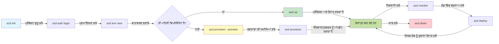
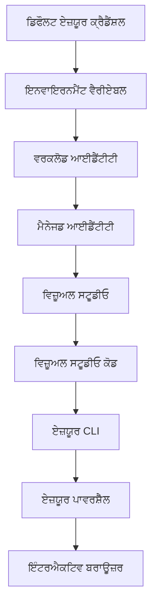

# AZD ਮੂਲ - Azure Developer CLI ਨੂੰ ਸਮਝਣਾ

# AZD ਮੂਲ - ਮੁੱਖ ਧਾਰਣਾਵਾਂ ਅਤੇ ਬੁਨਿਆਦੀ ਤੱਤ

**ਅਧਿਆਇ ਨੈਵੀਗੇਸ਼ਨ:**
- **📚 ਕੋਰਸ ਹੋਮ**: [AZD ਸ਼ੁਰੂਆਤੀਆਂ ਲਈ](../../README.md)
- **📖 ਮੌਜੂਦਾ ਅਧਿਆਇ**: ਅਧਿਆਇ 1 - ਬੁਨਿਆਦ ਅਤੇ ਤੁਰੰਤ ਸ਼ੁਰੂਆਤ
- **⬅️ ਪਿਛਲਾ**: [ਕੋਰਸ ਦਾ ਸਰਵੇਖਣ](../../README.md#-chapter-1-foundation--quick-start)
- **➡️ ਅਗਲਾ**: [ਇੰਸਟਾਲੇਸ਼ਨ ਅਤੇ ਸੈਟਅੱਪ](installation.md)
- **🚀 ਅਗਲਾ ਅਧਿਆਇ**: [ਅਧਿਆਇ 2: AI-ਪਹਿਲਾ ਵਿਕਾਸ](../chapter-02-ai-development/microsoft-foundry-integration.md)

## ਜਾਣ-ਪਹਿਚਾਣ

ਇਸ ਪਾਠ ਵਿੱਚ ਤੁਹਾਨੂੰ Azure Developer CLI (azd) ਨਾਲ ਜਾਣੂ ਕਰਵਾਇਆ ਜਾਵੇਗਾ, ਇੱਕ ਸ਼ਕਤੀਸ਼ਾਲੀ ਕਮਾਂਡ-ਲਾਈਨ ਟੂਲ ਜੋ ਤੁਹਾਡੇ ਸਥਾਨਕ ਵਿਕਾਸ ਤੋਂ Azure ਡਿਪਲੋਇਮੈਂਟ ਤੱਕ ਦੇ ਸਫ਼ਰ ਨੂੰ ਤੇਜ਼ ਕਰਦਾ ਹੈ। ਤੁਸੀਂ ਬੁਨਿਆਦੀ ਧਾਰਣਾਵਾਂ, ਮੁੁੱਖ ਫੀਚਰ, ਅਤੇ azd ਕਿਵੇਂ ਕਲਾਉਡ-ਨੇਟਿਵ ਐਪਲਿਕੇਸ਼ਨ ਡਿਪਲੋਇਮੈਂਟ ਨੂੰ ਸਧਾਰਨ ਕਰਦਾ ਹੈ, ਸਿੱਖੋਗੇ।

## ਸਿੱਖਣ ਦੇ ਲਕਸ਼

ਪਾਠ ਖਤਮ ਹੋਣ ਤੱਕ, ਤੁਸੀਂ:
- ਸਮਝੋਗੇ ਕਿ Azure Developer CLI ਕੀ ਹੈ ਅਤੇ ਇਸਦਾ ਪ੍ਰਮੁੱਖ ਉਦੇਸ਼ ਕੀ ਹੈ
- ਟੈਮਪਲੇਟ, ਵਾਤਾਵਰਣ ਅਤੇ ਸਰਵਿਸਾਂ ਦੇ ਮੁੱਖ ਸੰਕਲਪ ਸਿੱਖੋਗੇ
- ਟੈਮਪਲੇਟ-ਚਾਲਿਤ ਵਿਕਾਸ ਅਤੇ Infrastructure as Code ਸਮੇਤ ਮੁੱਖ ਖੂਬੀਆਂ ਦੀ ਖੋਜ ਕਰੋਗੇ
- azd ਪ੍ਰੋਜੈਕਟ ਦੀ ਬਣਤਰ ਅਤੇ ਵਰਕਫਲੋ ਨੂੰ ਸਮਝੋਗੇ
- ਆਪਣੇ ਵਿਕਾਸ ਵਾਤਾਵਰਣ ਲਈ azd ਇੰਸਟਾਲ ਅਤੇ ਸੰਰਚਿਤ ਕਰਨ ਲਈ ਤਿਆਰ ਹੋਵੋਗੇ

## ਸਿੱਖਣ ਦੇ ਨਤੀਜੇ

ਇਸ ਪਾਠ ਨੂੰ ਪੂਰਾ ਕਰਨ ਤੋਂ ਬਾਦ, ਤੁਸੀਂ ਸਮਰੱਥ ਹੋਵੋਗੇ:
- ਆਧੁਨਿਕ ਕਲਾਉਡ ਵਿਕਾਸ ਵਰਕਫਲੋਜ਼ ਵਿੱਚ azd ਦੀ ਭੂਮਿਕਾ ਨੂੰ ਵਿਆਖਿਆ ਕਰਨਾ
- azd ਪ੍ਰੋਜੈਕਟ ਬਣਤਰ ਦੇ ਘਟਕਾਂ ਦੀ ਪਛਾਣ ਕਰਨਾ
- ਵੇਰਵਾ ਕਰਨਾ ਕਿ ਟੈਮਪਲੇਟ, ਵਾਤਾਵਰਣ, ਅਤੇ ਸਰਵਿਸਾਂ ਕਿਵੇਂ ਮਿਲ ਕੇ ਕੰਮ ਕਰਦੀਆਂ ਹਨ
- azd ਨਾਲ Infrastructure as Code ਦੇ ਫਾਇਦੇ ਸਮਝਣਾ
- ਵੱਖ-ਵੱਖ azd ਕਮਾਂਡਾਂ ਅਤੇ ਉਹਨਾਂ ਦੇ ਉਦੇਸ਼ਾਂ ਨੂੰ ਪਛਾਣਨਾ

## Azure Developer CLI (azd) ਕੀ ਹੈ?

Azure Developer CLI (azd) ਇੱਕ ਕਮਾਂਡ-ਲਾਈਨ ਟੂਲ ਹੈ ਜੋ ਤੁਹਾਡੇ ਸਥਾਨਕ ਵਿਕਾਸ ਤੋਂ Azure ਡਿਪਲੋਇਮੈਂਟ ਤੱਕ ਦੇ ਸਫ਼ਰ ਨੂੰ ਤੇਜ਼ ਕਰਦਾ ਹੈ। ਇਹ Azure 'ਤੇ ਕਲਾਉਡ-ਨੇਟਿਵ ਐਪਲੀਕੇਸ਼ਨਾਂ ਨੂੰ ਬਣਾਉਣ, ਡਿਪਲੋਇ ਕਰਨ ਅਤੇ ਪ੍ਰਬੰਧਿਤ ਕਰਨ ਦੀ ਪ੍ਰਕਿਰਿਆ ਨੂੰ ਸਧਾਰਨ ਕਰਦਾ ਹੈ।

### 🎯 AZD ਕਿਉਂ ਵਰਤਣਾ? ਇੱਕ ਅਸਲੀ ਦੁਨੀਆ ਦੀ ਤੁਲਨਾ

ਆਓ ਇੱਕ ਸਧਾਰਣ ਵੈਬ ਐਪ ਅਤੇ ਡੇਟਾਬੇਸ ਨੂੰ ਡਿਪਲਾਇ ਕਰਨ ਦੀ ਤੁਲਨਾ ਕਰੀਏ:

#### ❌ AZD ਦੇ ਬਗੈਰ: ਮੈਨੁਅਲ Azure ਡਿਪਲੋਇਮੈਂਟ (30+ minutes)

```bash
# ਕਦਮ 1: ਰਿਸੋਰਸ ਗਰੁੱਪ ਬਣਾਓ
az group create --name myapp-rg --location eastus

# ਕਦਮ 2: ਐਪ ਸਰਵਿਸ ਪਲਾਨ ਬਣਾਓ
az appservice plan create --name myapp-plan \
  --resource-group myapp-rg \
  --sku B1 --is-linux

# ਕਦਮ 3: ਵੈੱਬ ਐਪ ਬਣਾਓ
az webapp create --name myapp-web-unique123 \
  --resource-group myapp-rg \
  --plan myapp-plan \
  --runtime "NODE:18-lts"

# ਕਦਮ 4: Cosmos DB ਖਾਤਾ ਬਣਾਓ (10-15 ਮਿੰਟ)
az cosmosdb create --name myapp-cosmos-unique123 \
  --resource-group myapp-rg \
  --kind MongoDB

# ਕਦਮ 5: ਡੇਟਾਬੇਸ ਬਣਾਓ
az cosmosdb mongodb database create \
  --account-name myapp-cosmos-unique123 \
  --resource-group myapp-rg \
  --name tododb

# ਕਦਮ 6: ਕਲੈਕਸ਼ਨ ਬਣਾਓ
az cosmosdb mongodb collection create \
  --account-name myapp-cosmos-unique123 \
  --resource-group myapp-rg \
  --database-name tododb \
  --name todos

# ਕਦਮ 7: ਕਨੈਕਸ਼ਨ ਸਟ੍ਰਿੰਗ ਪ੍ਰਾਪਤ ਕਰੋ
CONN_STR=$(az cosmosdb keys list \
  --name myapp-cosmos-unique123 \
  --resource-group myapp-rg \
  --type connection-strings \
  --query "connectionStrings[0].connectionString" -o tsv)

# ਕਦਮ 8: ਐਪ ਸੈਟਿੰਗਜ਼ ਕੰਫਿਗਰ ਕਰੋ
az webapp config appsettings set \
  --name myapp-web-unique123 \
  --resource-group myapp-rg \
  --settings MONGODB_URI="$CONN_STR"

# ਕਦਮ 9: ਲੋਗਿੰਗ ਚਾਲੂ ਕਰੋ
az webapp log config --name myapp-web-unique123 \
  --resource-group myapp-rg \
  --application-logging filesystem \
  --detailed-error-messages true

# ਕਦਮ 10: Application Insights ਸੈਟਅੱਪ ਕਰੋ
az monitor app-insights component create \
  --app myapp-insights \
  --location eastus \
  --resource-group myapp-rg

# ਕਦਮ 11: App Insights ਨੂੰ ਵੈੱਬ ਐਪ ਨਾਲ ਲਿੰਕ ਕਰੋ
INSTRUMENTATION_KEY=$(az monitor app-insights component show \
  --app myapp-insights \
  --resource-group myapp-rg \
  --query "instrumentationKey" -o tsv)

az webapp config appsettings set \
  --name myapp-web-unique123 \
  --resource-group myapp-rg \
  --settings APPINSIGHTS_INSTRUMENTATIONKEY="$INSTRUMENTATION_KEY"

# ਕਦਮ 12: ਐਪਲੀਕੇਸ਼ਨ ਨੂੰ ਲੋਕਲ ਤੌਰ 'ਤੇ ਬਿਲਡ ਕਰੋ
npm install
npm run build

# ਕਦਮ 13: ਡਿਪਲੋਇਮੈਂਟ ਪੈਕੇਜ ਬਣਾਓ
zip -r app.zip . -x "*.git*" "node_modules/*"

# ਕਦਮ 14: ਐਪਲੀਕੇਸ਼ਨ ਡਿਪਲੋਇ ਕਰੋ
az webapp deployment source config-zip \
  --resource-group myapp-rg \
  --name myapp-web-unique123 \
  --src app.zip

# ਕਦਮ 15: ਉਡੀਕ ਕਰੋ ਅਤੇ ਦੂਆ ਕਰੋ ਕਿ ਇਹ ਕੰਮ ਕਰੇ 🙏
# (ਕੋਈ ਆਟੋਮੇਟਿਕ ਵੈਰੀਫਿਕੇਸ਼ਨ ਨਹੀਂ, ਮੈਨੂਅਲ ਟੈਸਟਿੰਗ ਲੋੜੀਂਦੀ ਹੈ)
```

**ਸਮੱਸਿਆਵਾਂ:**
- ❌ 15+ ਕਮਾਂਡਾਂ ਜਿਨ੍ਹਾਂ ਨੂੰ ਯਾਦ ਰੱਖਣਾ ਅਤੇ ਸਹੀ ਕ੍ਰਮ ਵਿੱਚ ਚਲਾਉਣਾ
- ❌ 30-45 ਮਿੰਟ ਦਾ ਮੈਨੁਅਲ ਕੰਮ
- ❌ ਗਲਤੀਆਂ ਆਸਾਨ (ਟਾਈਪੋ, ਗਲਤ ਪੈਰਾਮੀਟਰ)
- ❌ ਟਰਮੀਨਲ ਇਤਿਹਾਸ ਵਿੱਚ ਕਨੈਕਸ਼ਨ ਸਟ੍ਰਿੰਗ ਖੁਲਾਸਾ ਹੋ ਸਕਦੇ ਹਨ
- ❌ ਕੁਝ ਫੇਲ ਹੋਣ 'ਤੇ ਆਟੋਮੈਟਿਕ ਰੋਲਬੈਕ ਨਹੀਂ
- ❌ ਟੀਮ ਮੈਂਬਰਾਂ ਲਈ ਦੁਹਰਾਉਣਾ ਮੁਸ਼ਕਲ
- ❌ ਹਰ ਵਾਰੀ ਵੱਖਰਾ (ਪੁਨਰੁਤਪਾਦਨਯੋਗ ਨਹੀਂ)

#### ✅ AZD ਨਾਲ: ਆਟੋਮੇਟਿਡ ਡਿਪਲੋਇਮੈਂਟ (5 commands, 10-15 minutes)

```bash
# ਕਦਮ 1: ਟੈਮਪਲੇਟ ਤੋਂ ਸ਼ੁਰੂ ਕਰੋ
azd init --template todo-nodejs-mongo

# ਕਦਮ 2: ਪ੍ਰਮਾਣੀਕਰਨ ਕਰੋ
azd auth login

# ਕਦਮ 3: ਮਾਹੌਲ ਬਣਾਓ
azd env new dev

# ਕਦਮ 4: ਤਬਦੀਲੀਆਂ ਪਹਿਲਾਂ ਵੇਖੋ (ਵਿਕਲਪਿਕ ਪਰ ਸਿਫਾਰਸ਼ ਕੀਤੀ ਜਾਂਦੀ ਹੈ)
azd provision --preview

# ਕਦਮ 5: ਸਭ ਕੁਝ ਤੈਨਾਤ ਕਰੋ
azd up

# ✨ ਹੋ ਗਿਆ! ਸਭ ਕੁਝ ਤੈਨਾਤ, ਸੰਰਚਿਤ ਅਤੇ ਨਿਗਰਾਨੀ ਕੀਤਾ ਗਿਆ ਹੈ
```

**ਫਾਇਦੇ:**
- ✅ **5 ਕਮਾਂਡਾਂ** vs. 15+ ਮੈਨੁਅਲ ਕਦਮ
- ✅ **10-15 ਮਿੰਟ** ਕੁੱਲ ਸਮਾਂ (ਅਧਿਕਤਰ Azure ਲਈ ਉਡੀਕ)
- ✅ **ਜ਼ੀਰੋ ਗਲਤੀਆਂ** - ਆਟੋਮੇਟਿਡ ਅਤੇ ਟੈਸਟ ਕੀਤਾ ਹੋਇਆ
- ✅ **ਸੰਵੇਦਨਸ਼ੀਲ ਜਾਣਕਾਰੀ ਸੁਰੱਖਿਅਤ ਢੰਗ ਨਾਲ** Key Vault ਰਾਹੀਂ ਪ੍ਰਬੰਧਿਤ
- ✅ **ਆਟੋਮੈਟਿਕ ਰੋਲਬੈਕ** ਨੁਕਸਾਨ ਦੀ ਸੂਰਤ ਵਿੱਚ
- ✅ **ਪੂਰੀ ਤਰ੍ਹਾਂ ਦੁਹਰਾਉਣਯੋਗ** - ਹਰ ਵਾਰੀ ਇਕੋ ਨਤੀਜਾ
- ✅ **ਟੀਮ-ਰੇਡੀ** - ਕੋਈ ਵੀ ਵਰਕਫਲੋ ਨੂੰ ਇੱਕੋ ਕਮਾਂਡ ਨਾਲ ਡਿਪਲੋਇ ਕਰ ਸਕਦਾ ਹੈ
- ✅ **Infrastructure as Code** - ਵਰਜਨ-ਨਿਯੰਤ੍ਰਿਤ Bicep ਟੈਮਪਲੇਟ
- ✅ **ਬਿਲਟ-ਇਨ ਮਾਨੀਟਰਿੰਗ** - Application Insights ਸਵੈਚਾਲਿਤ ਰੂਪ ਵਿੱਚ ਸੰਰਚਿਤ

### 📊 ਸਮਾਂ ਅਤੇ ਗਲਤੀ ਘਟਾਉਣਾ

| ਮੈਟਰਿਕ | ਮੈਨੁਅਲ ਡਿਪਲੋਇਮੈਂਟ | AZD ਡਿਪਲੋਇਮੈਂਟ | ਸੁਧਾਰ |
|:-------|:------------------|:---------------|:------------|
| **ਕਮਾਂਡਾਂ** | 15+ | 5 | 67% ਘੱਟ |
| **ਸਮਾਂ** | 30-45 min | 10-15 min | 60% ਤੇਜ਼ |
| **ਗਲਤੀ ਦਰ** | ~40% | <5% | 88% ਘਟਾਈ |
| **ਨਿਰੰਤਰਤਾ** | ਘੱਟ (ਮੈਨੁਅਲ) | 100% (ਆਟੋਮੇਟਿਡ) | ਪੂਰਨ |
| **ਟੀਮ ਆਨਬੋਰਡਿੰਗ** | 2-4 hours | 30 minutes | 75% ਤੇਜ਼ |
| **ਰੋਲਬੈਕ ਸਮਾਂ** | 30+ min (manual) | 2 min (automated) | 93% ਤੇਜ਼ |

## ਮੁੱਖ ਸੰਕਲਪ

### ਟੈਮਪਲੇਟ
ਟੈਮਪਲੇਟ azd ਦਾ ਆਧਾਰ ਹੁੰਦੇ ਹਨ। ਇਨ੍ਹਾਂ ਵਿੱਚ ਸ਼ਾਮਿਲ ਹੁੰਦਾ ਹੈ:
- **ਐਪਲੀਕੇਸ਼ਨ ਕੋਡ** - ਤੁਹਾਡਾ ਸੋਰਸ ਕੋਡ ਅਤੇ ਨਿਰਭਰਤਾਵਾਂ
- **ਇੰਫਰਾਸਟ੍ਰਕਚਰ ਪਰਿਭਾਸ਼ਾਵਾਂ** - Bicep ਜਾਂ Terraform ਵਿੱਚ ਪਰਿਭਾਸ਼ਿਤ Azure ਰਿਸੋਰਸਜ਼
- **ਕੰਫਿਗਰੇਸ਼ਨ ਫਾਈਲਾਂ** - ਸੈਟਿੰਗਜ਼ ਅਤੇ ਵਾਤਾਵਰਣ ਵੇਰੀਏਬਲ
- **ਡਿਪਲੋਇਮੈਂਟ ਸਕ੍ਰਿਪਟ** - ਆਟੋਮੇਟਿਡ ਡਿਪਲੋਇਮੈਂਟ ਵਰਕਫਲੋ

### ਵਾਤਾਵਰਣ
ਵਾਤਾਵਰਣ ਵੱਖ-ਵੱਖ ਡਿਪਲੋਇਮੈਂਟ ਟਾਰਗੇਟ ਦਾ ਪ੍ਰਤੀਨਿਧਿਤਵ ਕਰਦੇ ਹਨ:
- **Development** - ਟੈਸਟਿੰਗ ਅਤੇ ਵਿਕਾਸ ਲਈ
- **Staging** - ਪ੍ਰੀ-ਪ੍ਰੋਡਕਸ਼ਨ ਵਾਤਾਵਰਣ
- **Production** - ਲਾਈਵ ਪ੍ਰੋਡਕਸ਼ਨ ਵਾਤਾਵਰਣ

ਹਰ ਵਾਤਾਵਰਣ ਆਪਣਾ ਰੱਖਦਾ ਹੈ:
- Azure ਰਿਸੋਰਸ ਗਰੁੱਪ
- ਕੰਫਿਗਰੇਸ਼ਨ ਸੈਟਿੰਗਜ਼
- ਡਿਪਲੋਇਮੈਂਟ ਸਥਿਤੀ

### ਸੇਵਾਵਾਂ
ਸੇਵਾਵਾਂ ਤੁਹਾਡੇ ਐਪਲੀਕੇਸ਼ਨ ਦੇ ਬੁਨਿਆਦੀ ਹਿੱਸੇ ਹਨ:
- **Frontend** - ਵੈੱਬ ਐਪਲੀਕੇਸ਼ਨ, SPAs
- **Backend** - APIs, ਮਾਈਕਰੋਸਰਵਿਸਜ਼
- **Database** - ਡੇਟਾ ਸਟੋਰੇਜ ਹੱਲ
- **Storage** - ਫਾਇਲ ਅਤੇ ਬਲੌਬ ਸਟੋਰੇਜ

## ਮੁੱਖ ਵਿਸ਼ੇਸ਼ਤਾਵਾਂ

### 1. ਟੈਮਪਲੇਟ-ਚਾਲਿਤ ਵਿਕਾਸ
```bash
# ਉਪਲਬਧ ਟੈਂਪਲੇਟਾਂ ਵੇਖੋ
azd template list

# ਟੈਂਪਲੇਟ ਤੋਂ ਸ਼ੁਰੂ ਕਰੋ
azd init --template <template-name>
```

### 2. Infrastructure as Code
- **Bicep** - Azure ਦੀ ਡੋਮੇਨ-ਸਪੈਸੀਫਿਕ ਭਾਸ਼ਾ
- **Terraform** - ਮਲਟੀ-ਕਲਾਉਡ ਇੰਫਰਾਸਟ੍ਰਕਚਰ ਟੂਲ
- **ARM Templates** - Azure Resource Manager ਟੈਮਪਲੇਟ

### 3. ਇੰਟੀਗਰੇਟਿਡ ਵਰਕਫਲੋਜ਼
```bash
# ਪੂਰਾ ਤੈਨਾਤੀ ਕਾਰਜ ਪ੍ਰਵਾਹ
azd up            # ਸੰਸਾਧਨ ਤਿਆਰ + ਤੈਨਾਤੀ — ਇਹ ਪਹਿਲੀ ਵਾਰੀ ਸੈੱਟਅਪ ਲਈ ਬਿਨਾਂ ਦਖਲ ਦੇ ਹੈ

# 🧪 ਨਵਾਂ: ਤੈਨਾਤੀ ਤੋਂ ਪਹਿਲਾਂ ਬੁਨਿਆਦੀ ਢਾਂਚੇ ਦੇ ਬਦਲਾਵਾਂ ਦਾ ਪ੍ਰੀਵਿਊ (ਸੁਰੱਖਿਅਤ)
azd provision --preview    # ਬਦਲਾਵ ਕੀਤੇ ਬਿਨਾਂ ਬੁਨਿਆਦੀ ਢਾਂਚੇ ਦੀ ਤੈਨਾਤੀ ਦਾ ਅਨੁਕਰਣ ਕਰੋ

azd provision     # Azure ਸਰੋਤ ਬਣਾਓ — ਜੇ ਤੁਸੀਂ ਬੁਨਿਆਦੀ ਢਾਂਚੇ ਨੂੰ ਅਪਡੇਟ ਕਰਦੇ ਹੋ ਤਾਂ ਇਸ ਦਾ ਇਸਤੇਮਾਲ ਕਰੋ
azd deploy        # ਐਪਲੀਕੇਸ਼ਨ ਕੋਡ ਤੈਨਾਤ ਕਰੋ ਜਾਂ ਜਦੋਂ ਅਪਡੇਟ ਹੋਵੇ ਤਾਂ ਕੋਡ ਨੂੰ ਦੁਬਾਰਾ ਤੈਨਾਤ ਕਰੋ
azd down          # ਸਰੋਤਾਂ ਨੂੰ ਸਾਫ ਕਰੋ
```

#### 🛡️ ਪ੍ਰੀਵਿਊ ਨਾਲ ਸੁਰੱਖਿਅਤ ਇੰਫਰਾਸਟ੍ਰਕਚਰ ਯੋਜਨਾ ਬਣਾਉਣਾ
The `azd provision --preview` command is a game-changer for safe deployments:
- **ਡ੍ਰਾਈ-ਰਨ ਵਿਸ਼ਲੇਸ਼ਣ** - ਦਿਖਾਉਂਦਾ ਹੈ ਕਿ ਕੀ ਬਣਾਇਆ, ਸੋਧਿਆ ਜਾਂ ਮਿਟਾਇਆ ਜਾਵੇਗਾ
- **ਜ਼ੀਰੋ ਰਿਸਕ** - ਤੁਹਾਡੇ Azure ਵਾਤਾਵਰਣ ਵਿੱਚ ਕੋਈ ਵਾਸਤਵਿਕ ਬਦਲਾਅ ਨਹੀਂ ਹੁੰਦੇ
- **ਟੀਮ ਸਹਿਯੋਗ** - ਡਿਪਲੋਇਮੈਂਟ ਤੋਂ ਪਹਿਲਾਂ ਪ੍ਰੀਵਿਊ ਨਤੀਜੇ ਸਾਂਝੇ ਕਰੋ
- **ਲਾਗਤ ਅੰਦਾਜ਼ਾ** - ਪ੍ਰਤੀਬੱਧਤਾ ਤੋਂ ਪਹਿਲਾਂ ਰਿਸੋਰਸ ਲਾਗਤਾਂ ਸਮਝੋ

```bash
# ਉਦਾਹਰਨ ਪ੍ਰੀਵਿਊ ਵਰਕਫਲੋ
azd provision --preview           # ਵੇਖੋ ਕਿ ਕੀ ਬਦਲੇਗਾ
# ਆਉਟਪੁਟ ਦੀ ਸਮੀਖਿਆ ਕਰੋ, ਟੀਮ ਨਾਲ ਚਰਚਾ ਕਰੋ
azd provision                     # ਭਰੋਸੇ ਨਾਲ ਬਦਲਾਵ ਲਾਗੂ ਕਰੋ
```

### 📊 ਵਿਜ਼ੂਅਲ: AZD ਵਿਕਾਸ ਵਰਕਫਲੋ


**ਵਰਕਫਲੋ ਵਿਆਖਿਆ:**
1. **Init** - ਟੈਮਪਲੇਟ ਜਾਂ ਨਵੇਂ ਪ੍ਰੋਜੈਕਟ ਨਾਲ ਸ਼ੁਰੂ ਕਰੋ
2. **Auth** - Azure ਨਾਲ ਪ੍ਰਮਾਣਿਕਕਰਨ ਕਰੋ
3. **Environment** - ਇਕ ਅਲੱਗ ਡਿਪਲੋਇਮੈਂਟ ਵਾਤਾਵਰਣ ਬਣਾਓ
4. **Preview** - 🆕 ਹਮੇਸ਼ਾ ਪਹਿਲਾਂ ਇੰਫਰਾਸਟ੍ਰਕਚਰ ਤਬਦੀਲੀਆਂ ਦਾ ਪ੍ਰੀਵਿਊ ਕਰੋ (ਸੁਰੱਖਿਅਤ ਅਭਿਆਸ)
5. **Provision** - Azure ਰਿਸੋਰਸ ਬਣਾਓ/ਅਪਡੇਟ ਕਰੋ
6. **Deploy** - ਆਪਣਾ ਐਪਲੀਕੇਸ਼ਨ ਕੋਡ ਪুশ ਕਰੋ
7. **Monitor** - ਐਪਲੀਕੇਸ਼ਨ ਦਾ ਪ੍ਰਦਰਸ਼ਨ ਨਿਰੀਖਣ ਕਰੋ
8. **Iterate** - ਤਬਦੀਲੀਆਂ ਕਰੋ ਅਤੇ ਕੋਡ ਮੁੜ ਡਿਪਲੋਇ ਕਰੋ
9. **Cleanup** - ਖਤਮ ਹੋਣ 'ਤੇ ਰਿਸੋਰਸ ਹਟਾਓ

### 4. ਵਾਤਾਵਰਣ ਪ੍ਰਬੰਧਨ
```bash
# ਵਾਤਾਵਰਣ ਬਣਾਓ ਅਤੇ ਪ੍ਰਬੰਧ ਕਰੋ
azd env new <environment-name>
azd env select <environment-name>
azd env list
```

## 📁 ਪ੍ਰੋਜੈਕਟ ਦੀ ਬਣਤਰ

A typical azd project structure:
```
my-app/
├── .azd/                    # azd configuration
│   └── config.json
├── .azure/                  # Azure deployment artifacts
├── .devcontainer/          # Development container config
├── .github/workflows/      # GitHub Actions
├── .vscode/               # VS Code settings
├── infra/                 # Infrastructure code
│   ├── main.bicep        # Main infrastructure template
│   ├── main.parameters.json
│   └── modules/          # Reusable modules
├── src/                  # Application source code
│   ├── api/             # Backend services
│   └── web/             # Frontend application
├── azure.yaml           # azd project configuration
└── README.md
```

## 🔧 ਕੰਫਿਗਰੇਸ਼ਨ ਫਾਈਲਾਂ

### azure.yaml
ਮੁੱਖ ਪ੍ਰੋਜੈਕਟ ਕੰਫਿਗਰੇਸ਼ਨ ਫਾਈਲ:
```yaml
name: my-awesome-app
metadata:
  template: my-template@1.0.0

services:
  web:
    project: ./src/web
    language: js
    host: appservice
  api:
    project: ./src/api
    language: js
    host: appservice

hooks:
  preprovision:
    shell: pwsh
    run: echo "Preparing to provision..."
```

### .azure/config.json
ਵਾਤਾਵਰਣ-ਖਾਸ ਕੰਫਿਗਰੇਸ਼ਨ:
```json
{
  "version": 1,
  "defaultEnvironment": "dev",
  "environments": {
    "dev": {
      "subscriptionId": "your-subscription-id",
      "location": "eastus"
    }
  }
}
```

## 🎪 ਆਮ ਵਰਕਫਲੋਜ਼ ਅਤੇ ਹੱਥ-ਅਭਿਆਸ

> **💡 ਸਿੱਖਣ ਸੁਝਾਅ:** ਇਨ੍ਹਾਂ ਅਭਿਆਸਾਂ ਨੂੰ ਕ੍ਰਮ ਵਿੱਚ ਫੋਲੋ ਕਰੋ ਤਾਂ ਜੋ ਤੁਸੀਂ ਆਪਣੇ AZD ਹੁਨਰਾਂ ਨੂੰ ਕ੍ਰਮਬੱਧ ਤੌਰ 'ਤੇ ਵਿਕਸਤ ਕਰ ਸਕੋ।

### 🎯 ਅਭਿਆਸ 1: ਆਪਣਾ ਪਹਿਲਾ ਪ੍ਰੋਜੈਕਟ ਸ਼ੁਰੂ ਕਰੋ

**ਲਕਸ਼:** ਇੱਕ AZD ਪ੍ਰੋਜੈਕਟ ਬਣਾਓ ਅਤੇ ਇਸ ਦੀ ਬਣਤਰ ਦੀ ਜਾਂਚ ਕਰੋ

**ਕਦਮ:**
```bash
# ਇੱਕ ਪ੍ਰਮਾਣਿਤ ਟੈਮਪਲੇਟ ਵਰਤੋ
azd init --template todo-nodejs-mongo

# ਤਿਆਰ ਕੀਤੀਆਂ ਫਾਇਲਾਂ ਦੀ ਖੋਜ ਕਰੋ
ls -la  # ਲੁਕੇ ਹੋਏ ਸਮੇਤ ਸਾਰੀਆਂ ਫਾਇਲਾਂ ਵੇਖੋ

# ਬਣਾਈਆਂ ਮੁੱਖ ਫਾਇਲਾਂ:
# - azure.yaml (ਮੁੱਖ ਸੰਰਚਨਾ)
# - infra/ (ਬੁਨਿਆਦੀ ਢਾਂਚੇ ਦਾ ਕੋਡ)
# - src/ (ਐਪਲੀਕੇਸ਼ਨ ਦਾ ਕੋਡ)
```

**✅ ਸਫਲਤਾ:** ਤੁਹਾਡੇ ਕੋਲ azure.yaml, infra/, ਅਤੇ src/ ਡਾਇਰੈਕਟਰੀਜ਼ ਹਨ

---

### 🎯 ਅਭਿਆਸ 2: Azure 'ਤੇ ਡਿਪਲੋਇ ਕਰੋ

**ਲਕਸ਼:** ਏਂਡ-ਟੂ-ਏਂਡ ਡਿਪਲੋਇਮੈਂਟ ਪੂਰਾ ਕਰੋ

**ਕਦਮ:**
```bash
# 1. ਪ੍ਰਮਾਣੀਕਰਨ ਕਰੋ
az login && azd auth login

# 2. ਵਾਤਾਵਰਣ ਬਣਾਓ
azd env new dev
azd env set AZURE_LOCATION eastus

# 3. ਬਦਲਾਵਾਂ ਦੀ ਪੂਰਵ-ਸਮੀਖਿਆ ਕਰੋ (ਸਿਫਾਰਸ਼ ਕੀਤੀ ਜਾਂਦੀ ਹੈ)
azd provision --preview

# 4. ਸਭ ਕੁਝ ਤੈਨਾਤ ਕਰੋ
azd up

# 5. ਤੈਨਾਤੀ ਦੀ ਪੁਸ਼ਟੀ ਕਰੋ
azd show    # ਆਪਣੇ ਐਪ ਦਾ URL ਵੇਖੋ
```

**ਉਮੀਦਿਤ ਸਮਾਂ:** 10-15 ਮਿੰਟ  
**✅ ਸਫਲਤਾ:** ਐਪਲੀਕੇਸ਼ਨ URL ਬਰਾਉਜ਼ਰ 'ਚ ਖੁਲਦਾ ਹੈ

---

### 🎯 ਅਭਿਆਸ 3: ਕਈ ਵਾਤਾਵਰਣ

**ਲਕਸ਼:** dev ਅਤੇ staging 'ਤੇ ਡਿਪਲੋਇ ਕਰੋ

**ਕਦਮ:**
```bash
# ਜੇ ਪਹਿਲਾਂ ਹੀ ਡੈਵ ਮੌਜੂਦ ਹੈ ਤਾਂ ਸਟੇਜਿੰਗ ਬਣਾਓ
azd env new staging
azd env set AZURE_LOCATION westus2
azd up

# ਉਹਨਾਂ ਦੇ ਵਿਚਕਾਰ ਬਦਲੋ
azd env list
azd env select dev
```

**✅ ਸਫਲਤਾ:** Azure Portal ਵਿੱਚ ਦੋ ਵੱਖਰੇ ਰਿਸੋਰਸ ਗਰੁੱਪ

---

### 🛡️ Clean Slate: `azd down --force --purge`

When you need to completely reset:

```bash
azd down --force --purge
```

**ਇਹ ਕੀ ਕਰਦਾ ਹੈ:**
- `--force`: ਕੋਈ ਪੁਸ਼ਟੀ ਪ੍ਰੰਪਟ ਨਹੀਂ
- `--purge`: ਸਾਰਾ ਲੋਕਲ ਸਟੇਟ ਅਤੇ Azure ਰਿਸੋਰਸ ਮਿਟਾ ਦਿੰਦਾ ਹੈ

**ਇਸਦਾ ਇਸਤੇਮਾਲ ਜਦੋਂ ਕਰੋ:**
- ਡਿਪਲੋਇਮੈਂਟ ਮੱਧ ਵਿੱਚ ਫੇਲ੍ਹ ਹੋ ਗਿਆ
- ਪ੍ਰੋਜੈਕਟ ਬਦਲ ਰਹੇ ਹੋ
- ਨਵਾਂ ਸ਼ੁਰੂਆਤ ਚਾਹੀਦੀ ਹੋ

---

## 🎪 ਅਸਲੀ ਵਰਕਫਲੋ ਸੁਝਾਅ

### ਨਵਾਂ ਪ੍ਰੋਜੈਕਟ ਸ਼ੁਰੂ ਕਰਨਾ
```bash
# ਤਰੀਕਾ 1: ਮੌਜੂਦਾ ਟੈਂਪਲੇਟ ਵਰਤੋ
azd init --template todo-nodejs-mongo

# ਤਰੀਕਾ 2: ਸਿਰੇ ਤੋਂ ਸ਼ੁਰੂ ਕਰੋ
azd init

# ਤਰੀਕਾ 3: ਮੌਜੂਦਾ ਡਾਇਰੈਕਟਰੀ ਵਰਤੋ
azd init .
```

### ਵਿਕਾਸ ਚੱਕਰ
```bash
# ਡਿਵੈਲਪਮੈਂਟ ਵਾਤਾਵਰਣ ਸੈੱਟ ਕਰੋ
azd auth login
azd env new dev
azd env select dev

# ਸਭ ਕੁਝ ਡਿਪਲੋਏ ਕਰੋ
azd up

# ਤਬਦੀਲੀਆਂ ਕਰੋ ਅਤੇ ਮੁੜ ਡਿਪਲੋਏ ਕਰੋ
azd deploy

# ਕੰਮ ਮੁਕੰਮਲ ਹੋਣ 'ਤੇ ਸਾਫ਼ ਕਰੋ
azd down --force --purge # Azure Developer CLI ਵਿੱਚ ਇਹ ਕਮਾਂਡ ਤੁਹਾਡੇ ਵਾਤਾਵਰਣ ਲਈ ਇੱਕ **ਪੂਰਨ ਰੀਸੈਟ** ਹੈ — ਖਾਸ ਤੌਰ 'ਤੇ ਜਦੋਂ ਤੁਸੀਂ ਅਸਫਲ ਡਿਪਲੋਇਮੈਂਟਸ ਦੀ ਤਕਦੀਰ-ਪੜਤਾਲ ਕਰ ਰਹੇ ਹੋ, ਛੱਡੇ ਹੋਏ/ਔਰਫੈਨ ਰਿਸੋਰਸਾਂ ਨੂੰ ਸਾਫ਼ ਕਰ ਰਹੇ ਹੋ, ਜਾਂ ਨਵੇਂ ਮੁੜ-ਡਿਪਲੋਇ ਲਈ ਤਿਆਰੀ ਕਰ ਰਹੇ ਹੋ।
```

## `azd down --force --purge` ਨੂੰ ਸਮਝਣਾ
The `azd down --force --purge` command is a powerful way to completely tear down your azd environment and all associated resources. Here's a breakdown of what each flag does:
```
--force
```
- ਪੁਸ਼ਟੀ ਪ੍ਰੰਪਟਾਂ ਨੂੰ ਛੱਡਦਾ ਹੈ.
- ਜਿੱਥੇ ਮੈਨੁਅਲ ਇਨਪੁੱਟ ਸੰਭਵ ਨਹੀਂ, ਓਥੇ ਆਟੋਮੇਸ਼ਨ ਜਾਂ ਸਕ੍ਰਿਪਟਿੰਗ ਲਈ ਲਾਭਦਾਇਕ ਹੈ।
- ਇਹ ਸੁਨਿਸ਼ਚਿਤ ਕਰਦਾ ਹੈ ਕਿ ਟੀਅਰਡਾਊਨ ਬਿਨਾਂ ਰੁਕਾਵਟ ਦੇ ਜਾਰੀ ਰਹੇ, ਭਾਵੇਂ CLI ਅਸੰਗਤੀਆਂ ਖੋਜੇ।

```
--purge
```
ਮਿਟਾਂਦਾ ਹੈ **ਸਾਰੇ ਸਬੰਧਤ ਮੈਟਾਡੇਟਾ**, ਜਿਸ ਵਿੱਚ ਸ਼ਾਮਿਲ ਹਨ:
ਵਾਤਾਵਰਣ ਸਥਿਤੀ
ਲੋਕਲ `.azure` ਫੋਲਡਰ
ਕੈਸ਼ ਕੀਤੀ ਡਿਪਲੋਇਮੈਂਟ ਜਾਣਕਾਰੀ
ਇਹ azd ਨੂੰ ਪਿਛਲੇ ਡਿਪਲੋਇਮੈਂਟ 'ਯਾਦ' ਕਰਨ ਤੋਂ ਰੋਕਦਾ ਹੈ, ਜੋ ਕਿ ਗਲਤ ਮਿਲਦੇ ਜੁਲਦੇ ਰਿਸੋਰਸ ਗਰੁੱਪ ਜਾਂ ਪੁਰਾਣੇ ਰਜਿਸਟਰੀ ਸੰਦਰਭ ਵਰਗੀਆਂ ਸਮੱਸਿਆਵਾਂ ਪੈਦਾ ਕਰ ਸਕਦੇ ਹਨ।

### ਦੋਵਾਂ ਕਿਉਂ ਵਰਤਣ?
When you've hit a wall with `azd up` due to lingering state or partial deployments, this combo ensures a **clean slate**.

It’s especially helpful after manual resource deletions in the Azure portal or when switching templates, environments, or resource group naming conventions.

### ਕਈ ਵਾਤਾਵਰਣਾਂ ਦਾ ਪ੍ਰਬੰਧਨ
```bash
# ਸਟੇਜਿੰਗ ਵਾਤਾਵਰਣ ਬਣਾਓ
azd env new staging
azd env select staging
azd up

# ਫਿਰ ਡੈਵ ਤੇ ਵਾਪਸ ਜਾਓ
azd env select dev

# ਵਾਤਾਵਰਣਾਂ ਦੀ ਤੁਲਨਾ ਕਰੋ
azd env list
```

## 🔐 ਪ੍ਰਮਾਣਿਕਤਾ ਅਤੇ ਕ੍ਰੈਡੈਂਸ਼ਲ

ਪ੍ਰਮਾਣਿਕਤਾ ਨੂੰ ਸਮਝਣਾ azd ਡਿਪਲੋਇਮੈਂਟ ਦੀ ਸਫਲਤਾ ਲਈ ਬਹੁਤ ਜ਼ਰੂਰੀ ਹੈ। Azure ਕਈ ਪ੍ਰਮਾਣਿਕਤਾ ਢੰਗ ਵਰਤਦਾ ਹੈ, ਅਤੇ azd ਉਨ੍ਹਾਂ ਹੀ ਕ੍ਰੈਡੈਂਸ਼ਲ ਚੇਨਾਂ ਦੀ ਵਰਤੋਂ ਕਰਦਾ ਹੈ ਜੋ ਹੋਰ Azure ਟੂਲਾਂ ਦੁਆਰਾ ਵਰਤੀ ਜਾਂਦੀ ਹੈ।

### Azure CLI ਪ੍ਰਮਾਣਿਕਤਾ (`az login`)

azd ਵਰਤਣ ਤੋਂ ਪਹਿਲਾਂ, ਤੁਹਾਨੂੰ Azure ਨਾਲ ਪ੍ਰਮਾਣਿਕਕਰਨ ਕਰਨ ਦੀ ਲੋੜ ਹੈ। ਸਭ ਤੋਂ ਆਮ ਤਰੀਕਾ Azure CLI ਵਰਤਣਾ ਹੈ:

```bash
# ਇੰਟਰਐਕਟਿਵ ਲਾਗਿਨ (ਬਰਾਊਜ਼ਰ ਖੋਲ੍ਹਦਾ ਹੈ)
az login

# ਕਿਸੇ ਨਿਰਦਿਸ਼ਟ ਟੇਨੈਂਟ ਨਾਲ ਲਾਗਿਨ
az login --tenant <tenant-id>

# ਸਰਵਿਸ ਪ੍ਰਿੰਸੀਪਲ ਨਾਲ ਲਾਗਿਨ
az login --service-principal -u <app-id> -p <password> --tenant <tenant-id>

# ਮੌਜੂਦਾ ਲਾਗਿਨ ਦੀ ਸਥਿਤੀ ਜਾਂਚੋ
az account show

# ਉਪਲਬਧ ਸਬਸਕ੍ਰਿਪਸ਼ਨਾਂ ਦੀ ਸੂਚੀ
az account list --output table

# ਡਿਫਾਲਟ ਸਬਸਕ੍ਰਿਪਸ਼ਨ ਸੈੱਟ ਕਰੋ
az account set --subscription <subscription-id>
```

### ਪ੍ਰਮਾਣਿਕਤਾ ਫਲੋ
1. **ਇੰਟਰਐਕਟਿਵ ਲੌਗਿਨ**: ਤੁਹਾਡੇ ਡੀਫਾਲਟ ਬਰਾਊਜ਼ਰ ਨੂੰ ਪ੍ਰਮਾਣਿਕਤਾ ਲਈ ਖੋਲ੍ਹਦਾ ਹੈ
2. **ਡਿਵਾਈਸ ਕੋਡ ਫਲੋ**: ਉਹਨਾਂ ਵਾਤਾਵਰਣਾਂ ਲਈ ਜਿੱਥੇ ਬਰਾਊਜ਼ਰ ਪਹੁੰਚ ਨਹੀਂ
3. **Service Principal**: ਆਟੋਮੇਸ਼ਨ ਅਤੇ CI/CD ਸਿਨਾਰਿਓ ਲਈ
4. **Managed Identity**: Azure-ਮਿਜਬਾਨ ਐਪਲੀਕੇਸ਼ਨਾਂ ਲਈ

### DefaultAzureCredential ਚੇਨ

`DefaultAzureCredential` ਇੱਕ ਕ੍ਰੈਡੈਂਸ਼ਲ ਕਿਸਮ ਹੈ ਜੋ ਖੁਦਕਾਰ ਤੌਰ 'ਤੇ ਕਈ ਕ੍ਰੈਡੈਂਸ਼ਲ ਸਰੋਤਾਂ ਦੀ ਕੋਸ਼ਿਸ਼ ਕਰਕੇ ਸਧਾਰਿਤ ਪ੍ਰਮਾਣਿਕਤਾ ਅਨੁਭਵ ਦਿੰਦਾ ਹੈ:

#### ਕ੍ਰੈਡੈਂਸ਼ਲ ਚੇਨ ਕ੍ਰਮ

#### 1. ਵਾਤਾਵਰਣ ਵੇਰੀਏਬਲ
```bash
# ਸਰਵਿਸ ਪ੍ਰਿੰਸੀਪਲ ਲਈ ਵਾਤਾਵਰਣ ਵੇਰੀਏਬਲ ਸੈੱਟ ਕਰੋ
export AZURE_CLIENT_ID="<app-id>"
export AZURE_CLIENT_SECRET="<password>"
export AZURE_TENANT_ID="<tenant-id>"
```

#### 2. Workload Identity (Kubernetes/GitHub Actions)
ਆਪਣੇ ਆਪ ਵਰਤਿਆ ਜਾਂਦਾ ਹੈ:
- Azure Kubernetes Service (AKS) with Workload Identity
- GitHub Actions with OIDC federation
- ਹੋਰ ਫੈਡਰੇਟਡ ਆਈਡੈਂਟਿਟੀ ਸਿਨਾਰਿਓ

#### 3. Managed Identity
Azure ਰਿਸੋਰਸਾਂ ਲਈ ਜਿਵੇਂ:
- Virtual Machines
- App Service
- Azure Functions
- Container Instances

```bash
# ਜਾਂਚੋ ਕਿ ਕੀ ਇਹ ਪ੍ਰਬੰਧਿਤ ਆਈਡੈਂਟੀਟੀ ਵਾਲੇ Azure ਸਰੋਤ ਤੇ ਚੱਲ ਰਿਹਾ ਹੈ
az account show --query "user.type" --output tsv
# ਵਾਪਸ: "servicePrincipal" ਜੇ ਪ੍ਰਬੰਧਿਤ ਆਈਡੈਂਟੀਟੀ ਵਰਤੀ ਜਾ ਰਹੀ ਹੋਵੇ
```

#### 4. Developer Tools Integration
- **Visual Studio**: ਆਟੋਮੈਟਿਕ ਤੌਰ 'ਤੇ ਸਾਇਨ-ਇਨ ਖਾਤੇ ਦਾ ਉਪਯੋਗ ਕਰਦਾ ਹੈ
- **VS Code**: Azure Account ਐਕਸਟੇੰਸ਼ਨ ਦੇ ਕ੍ਰੈਡੈਂਸ਼ਲ ਵਰਤਦਾ ਹੈ
- **Azure CLI**: `az login` ਕ੍ਰੈਡੈਂਸ਼ਲ ਵਰਤਦਾ ਹੈ (ਸਥਾਨਕ ਵਿਕਾਸ ਲਈ ਸਭ ਤੋਂ ਆਮ)

### AZD Authentication Setup

```bash
# ਤਰੀਕਾ 1: Azure CLI ਦੀ ਵਰਤੋਂ ਕਰੋ (ਵਿਕਾਸ ਲਈ ਸਿਫਾਰਸ਼ ਕੀਤੀ ਜਾਂਦੀ ਹੈ)
az login
azd auth login  # ਮੌਜੂਦਾ Azure CLI ਕ੍ਰੈਡੈਂਸ਼ੀਅਲ ਦੀ ਵਰਤੋਂ ਕਰਦਾ ਹੈ

# ਤਰੀਕਾ 2: azd ਦੀ ਸਿੱਧੀ ਪ੍ਰਮਾਣਿਕਤਾ
azd auth login --use-device-code  # ਹੈੱਡਲੈੱਸ ਮਾਹੌਲਾਂ ਲਈ

# ਤਰੀਕਾ 3: ਪ੍ਰਮਾਣਿਕਤਾ ਦੀ ਸਥਿਤੀ ਜਾਂਚੋ
azd auth login --check-status

# ਤਰੀਕਾ 4: ਲੌਗਆਊਟ ਕਰੋ ਅਤੇ ਦੁਬਾਰਾ ਪ੍ਰਮਾਣਿਕਤਾ ਕਰੋ
azd auth logout
azd auth login
```

### ਪ੍ਰਮਾਣਿਕਤਾ ਲਈ ਵਧੀਆ ਅਭਿਆਸ

#### ਸਥਾਨਕ ਵਿਕਾਸ ਲਈ
```bash
# 1. Azure CLI ਨਾਲ ਲੌਗਿਨ ਕਰੋ
az login

# 2. ਸਹੀ ਸਬਸਕ੍ਰਿਪਸ਼ਨ ਦੀ ਪੁਸ਼ਟੀ ਕਰੋ
az account show
az account set --subscription "Your Subscription Name"

# 3. ਮੌਜੂਦਾ ਪ੍ਰਮਾਣ-ਪੱਤਰਾਂ ਨਾਲ azd ਵਰਤੋ
azd auth login
```

#### CI/CD ਪਾਇਪਲਾਈਨਾਂ ਲਈ
```yaml
# GitHub Actions example
- name: Azure Login
  uses: azure/login@v1
  with:
    creds: ${{ secrets.AZURE_CREDENTIALS }}

- name: Deploy with azd
  run: |
    azd auth login --client-id ${{ secrets.AZURE_CLIENT_ID }} \
                    --client-secret ${{ secrets.AZURE_CLIENT_SECRET }} \
                    --tenant-id ${{ secrets.AZURE_TENANT_ID }}
    azd up --no-prompt
```

#### ਪ੍ਰੋਡਕਸ਼ਨ ਵਾਤਾਵਰਣ ਲਈ
- Azure ਰਿਸੋਰਸਾਂ 'ਤੇ ਚਲਦੇ ਸਮੇਂ **Managed Identity** ਵਰਤੋ
- ਆਟੋਮੇਸ਼ਨ ਸਿਨਾਰਿਓ ਲਈ **Service Principal** ਵਰਤੋਂ
- ਕੋਡ ਜਾਂ ਕੰਫਿਗਰੇਸ਼ਨ ਫਾਈਲਾਂ ਵਿੱਚ ਕ੍ਰੈਡੈਂਸ਼ਲ ਸਟੋਰ ਕਰਨ ਤੋਂ ਬਚੋ
- ਸੰਵੇਦਨਸ਼ੀਲ ਕੰਫਿਗਰੇਸ਼ਨ ਲਈ **Azure Key Vault** ਵਰਤੋਂ

### ਆਮ ਪ੍ਰਮਾਣਿਕਤਾ ਸਮੱਸਿਆਵਾਂ ਅਤੇ ਉਨ੍ਹਾਂ ਦੇ ਹੱਲ

#### ਸਮੱਸਿਆ: "No subscription found"
```bash
# ਹੱਲ: ਡਿਫੌਲਟ ਸਬਸਕ੍ਰਿਪਸ਼ਨ ਸੈੱਟ ਕਰੋ
az account list --output table
az account set --subscription "<subscription-id>"
azd env set AZURE_SUBSCRIPTION_ID "<subscription-id>"
```

#### ਸਮੱਸਿਆ: "Insufficient permissions"
```bash
# ਹੱਲ: ਲੋੜੀਂਦੇ ਰੋਲਾਂ ਦੀ ਜਾਂਚ ਕਰੋ ਅਤੇ ਉਹਨਾਂ ਨੂੰ ਅਸਾਈਨ ਕਰੋ
az role assignment list --assignee $(az account show --query user.name --output tsv)

# ਆਮ ਲੋੜੀਂਦੇ ਰੋਲ:
# - Contributor (ਸੰਸਾਧਨ ਪ੍ਰਬੰਧਨ ਲਈ)
# - User Access Administrator (ਭੂਮਿਕਾ ਸੌਂਪਣਾਂ ਲਈ)
```

#### ਸਮੱਸਿਆ: "Token expired"
```bash
# ਸਮਾਧਾਨ: ਮੁੜ ਪ੍ਰਮਾਣੀਕਰਨ ਕਰੋ
az logout
az login
azd auth logout
azd auth login
```

### ਵੱਖ-ਵੱਖ ਸਿਨਾਰਿਓ ਵਿੱਚ ਪ੍ਰਮਾਣਿਕਤਾ

#### ਸਥਾਨਕ ਵਿਕਾਸ
```bash
# ਨਿੱਜੀ ਵਿਕਾਸ ਖਾਤਾ
az login
azd auth login
```

#### ਟੀਮ ਵਿਕਾਸ
```bash
# ਸੰਗਠਨ ਲਈ ਨਿਰਧਾਰਿਤ ਟੇਨੈਂਟ ਦੀ ਵਰਤੋਂ ਕਰੋ
az login --tenant contoso.onmicrosoft.com
azd auth login
```

#### ਬਹੁ-ਕਿਰਾਏਦਾਰ ਸਿਨਾਰਿਓ
```bash
# ਟੈਨੈਂਟਾਂ ਵਿਚਕਾਰ ਬਦਲੋ
az login --tenant tenant1.onmicrosoft.com
# ਟੈਨੈਂਟ 1 ਤੇ ਤੈਨਾਤ ਕਰੋ
azd up

az login --tenant tenant2.onmicrosoft.com  
# ਟੈਨੈਂਟ 2 ਤੇ ਤੈਨਾਤ ਕਰੋ
azd up
```

### ਸੁਰੱਖਿਆ ਸੰਬੰਧੀ ਵਿਚਾਰ

1. **ਕ੍ਰੈਡੈਂਸ਼ਲ ਸਟੋਰੇਜ**: ਕਦੇ ਵੀ ਕ੍ਰੈਡੈਂਸ਼ਲ ਨੂੰ ਸੋਰਸ ਕੋਡ ਵਿੱਚ ਸਟੋਰ ਨਾ ਕਰੋ
2. **ਸਕੋਪ ਸੀਮਿਤੀ**: Service Principal ਲਈ ਘੱਟ-ਅਧਿਕਾਰ ਸਿਧਾਂਤ ਵਰਤੋ
3. **ਟੋਕਨ ਰੋਟੇਸ਼ਨ**: ਨਿਯਮਤ ਤੌਰ 'ਤੇ service principal ਸਿਕ੍ਰੇਟ ਰੋਟੇਟ ਕਰੋ
4. **ਆਡਿਟ ਟ੍ਰੇਲ**: ਪ੍ਰਮਾਣਿਕਤਾ ਅਤੇ ਡਿਪਲੋਇਮੈਂਟ ਗਤਿਵਿਧੀਆਂ ਦੀ ਨਿਗਰਾਨੀ ਕਰੋ
5. **ਨੈਟਵਰਕ ਸੁਰੱਖਿਆ**: ਸੰਭਵ ਹੋਵੇ ਤਾਂ ਪ੍ਰਾਈਵੇਟ ਐਂਡਪਾਇੰਟ ਵਰਤੋ

### ਪ੍ਰਮਾਣਿਕਤਾ ਟ੍ਰਬਲਸ਼ੂਟਿੰਗ

```bash
# ਪ੍ਰਮਾਣੀਕਰਨ ਸਮੱਸਿਆਵਾਂ ਨੂੰ ਡਿਬੱਗ ਕਰੋ
azd auth login --check-status
az account show
az account get-access-token

# ਆਮ ਤਸ਼ਖੀਸੀ ਕਮਾਂਡਾਂ
whoami                          # ਮੌਜੂਦਾ ਉਪਭੋਗਤਾ ਸੰਦਰਭ
az ad signed-in-user show      # Azure AD ਉਪਭੋਗਤਾ ਵੇਰਵੇ
az group list                  # ਸੰਸਾਧਨ ਤੱਕ ਪਹੁੰਚ ਦੀ ਜਾਂਚ ਕਰੋ
```

## `azd down --force --purge` ਨੂੰ ਸਮਝਣਾ

### ਖੋਜ
```bash
azd template list              # ਟੈਮਪਲੇਟਾਂ ਵੇਖੋ
azd template show <template>   # ਟੈਮਪਲੇਟ ਵੇਰਵਾ
azd init --help               # ਆਰੰਭਣ ਵਿਕਲਪ
```

### ਪ੍ਰੋਜੈਕਟ ਪ੍ਰਬੰਧਨ
```bash
azd show                     # ਪ੍ਰੋਜੈਕਟ ਦਾ ਝਲਕ
azd env show                 # ਮੌਜੂਦਾ ਵਾਤਾਵਰਣ
azd config list             # ਕੰਫਿਗਰੇਸ਼ਨ ਸੈਟਿੰਗਾਂ
```

### ਮਾਨੀਟਰਿੰਗ
```bash
azd monitor                  # Azure ਪੋਰਟਲ ਦੀ ਮਾਨੀਟਰਿੰਗ ਖੋਲ੍ਹੋ
azd monitor --logs           # ਐਪਲੀਕੇਸ਼ਨ ਲੌਗ ਵੇਖੋ
azd monitor --live           # ਲਾਈਵ ਮੈਟ੍ਰਿਕਸ ਵੇਖੋ
azd pipeline config          # CI/CD ਸੈਟਅਪ ਕਰੋ
```

## ਵਧੀਆ ਅਭਿਆਸ

### 1. ਅਰਥਪੂਰਨ ਨਾਂ ਵਰਤੋ
```bash
# ਚੰਗਾ
azd env new production-east
azd init --template web-app-secure

# ਟਾਲੋ
azd env new env1
azd init --template template1
```

### 2. ਟੈਮਪਲੇਟਾਂ ਦੀ ਵਰਤੋਂ ਕਰੋ
- ਮੌਜੂਦ ਟੈਮਪਲੇਟ ਨਾਲ ਸ਼ੁਰੂ ਕਰੋ
- ਆਪਣੀਆਂ ਲੋੜਾਂ ਲਈ ਅਨੁਕੂਲ ਕਰੋ
- ਆਪਣੇ ਸੰਸਥਾਨ ਲਈ ਦੁਹਰਾਉਣਯੋਗ ਟੈਮਪਲੇਟ ਬਣਾਓ

### 3. ਵਾਤਾਵਰਣ ਅਲੱਗ ਰੱਖੋ
- dev/staging/prod ਲਈ ਵੱਖ-ਵੱਖ ਵਾਤਾਵਰਣ ਵਰਤੋ
- ਸਥਾਨਕ ਮਸ਼ੀਨ ਤੋਂ ਸਿੱਧਾ ਪ੍ਰੋਡਕਸ਼ਨ 'ਤੇ ਕਦੇ ਵੀ ਡਿਪਲੋਇ ਨਾ ਕਰੋ
- ਪ੍ਰੋਡਕਸ਼ਨ ਡਿਪਲੋਇਮੈਂਟ ਲਈ CI/CD ਪਾਇਪਲਾਈਨ ਵਰਤੋ

### 4. ਕੰਫਿਗਰੇਸ਼ਨ ਪ੍ਰਬੰਧਨ
- ਸੰਵੇਦਨਸ਼ੀਲ ਡੇਟਾ ਲਈ ਵਾਤਾਵਰਣ ਵੇਰੀਏਬਲ ਵਰਤੋ
- ਕੰਫਿਗਰੇਸ਼ਨ ਨੂੰ ਵਰਜਨ ਕੰਟਰੋਲ ਵਿੱਚ ਰੱਖੋ
- ਵਾਤਾਵਰਣ-ਖਾਸ ਸੈਟਿੰਗਜ਼ ਨੂੰ ਦਸਤਾਵੇਜ਼ੀਕ੍ਰਿਤ ਕਰੋ

## ਸਿੱਖਣ ਪ੍ਰਗਤੀ

### ਬਿਲਕੁਲ ਸ਼ੁਰੂਆਤੀ (ਹਫਤਾ 1-2)
1. azd ਇੰਸਟਾਲ ਕਰੋ ਅਤੇ ਪ੍ਰਮਾਣਿਕਕਰਨ ਕਰੋ
2. ਇੱਕ ਸਧਾਰਣ ਟੈਮਪਲੇਟ ਡਿਪਲੋਇ ਕਰੋ
3. ਪ੍ਰੋਜੈਕਟ ਬਣਤਰ ਸਮਝੋ
4. ਮੂਲ ਕਮਾਂਡਾਂ ਸਿੱਖੋ (up, down, deploy)

### ਮੱਧਵਰਗੀ (ਹਫਤਾ 3-4)
1. ਟੈਮਪਲੇਟ ਅਨੁਕੂਲ ਕਰੋ
2. ਕਈ ਵਾਤਾਵਰਣ ਪ੍ਰਬੰਧਿਤ ਕਰੋ
3. ਇੰਫਰਾਸਟਰਕਚਰ ਕੋਡ ਸਮਝੋ
4. CI/CD ਪਾਇਪਲਾਈਨਾਂ ਸੈਟਅੱਪ ਕਰੋ

### ਉੱਨਤ (ਹਫਤਾ 5+)
1. ਕਸਟਮ ਟੈਮਪਲੇਟ ਬਣਾਓ
2. ਉੱਨਤ ਇੰਫਰਾਸਟਰਕਚਰ ਪੈਟਰਨ
3. ਬਹੁ-ਰੀਜਨ ਡਿਪਲੋਇਮੈਂਟ
4. ਐਂਟਰਪ੍ਰਾਈਜ਼-ਗਰੇਡ ਕੰਫਿਗਰੇਸ਼ਨ

## ਅਗਲੇ ਕਦਮ

**📖 ਅਧਿਆਇ 1 ਸਿੱਖਣਾ ਜਾਰੀ ਰੱਖੋ:**
- [ਇੰਸਟਾਲੇਸ਼ਨ ਅਤੇ ਸੈਟਅਪ](installation.md) - azd ਨੂੰ ਇੰਸਟਾਲ ਅਤੇ ਸੰਰਚਿਤ ਕਰੋ
- [ਤੁਹਾਡਾ ਪਹਿਲਾ ਪ੍ਰੋਜੈਕਟ](first-project.md) - ਪੂਰਾ ਪ੍ਰਯੋਗਾਤਮਕ ਟਿਊਟੋਰੀਅਲ
- [ਕੰਫਿਗਰੇਸ਼ਨ ਗਾਈਡ](configuration.md) - ਉੱਨਤ ਸੰਰਚਨਾ ਵਿਕਲਪ

**🎯 ਅਗਲੇ ਅਧਿਆਇ ਲਈ ਤਿਆਰ?**
- [ਅਧਿਆਇ 2: AI-ਪਹਿਲਾਂ ਵਿਕਾਸ](../chapter-02-ai-development/microsoft-foundry-integration.md) - AI ਐਪਲੀਕੇਸ਼ਨਾਂ ਬਣਾਉਣਾ ਸ਼ੁਰੂ ਕਰੋ

## ਅਤਿਰਿਕਤ ਸਾਧਨ

- [Azure Developer CLI ਓਵਰਵਿਊ](https://learn.microsoft.com/en-us/azure/developer/azure-developer-cli/)
- [ਟੈਮਪਲੇਟ ਗੈਲਰੀ](https://azure.github.io/awesome-azd/)
- [ਕਮਿਊਨਿਟੀ ਨਮੂਨੇ](https://github.com/Azure-Samples)

---

## 🙋 ਅਕਸਰ ਪੁੱਛੇ ਜਾਣ ਵਾਲੇ ਪ੍ਰਸ਼ਨ

### ਸਧਾਰਨ ਪ੍ਰਸ਼ਨ

**Q: AZD ਅਤੇ Azure CLI ਵਿੱਚ ਕੀ ਫ਼ਰਕ ਹੈ?**

A: Azure CLI (`az`) ਵਿਅਕਤੀਗਤ Azure ਰਿਸੋਰਸਾਂ ਨੂੰ ਮੈਨੇਜ ਕਰਨ ਲਈ ਹੈ। AZD (`azd`) ਪੂਰੇ ਐਪਲੀਕੇਸ਼ਨਾਂ ਨੂੰ ਮੈਨੇਜ ਕਰਨ ਲਈ ਹੈ:

```bash
# Azure CLI - ਨਿਮਨ-ਪੱਧਰੀ ਸਰੋਤ ਪ੍ਰਬੰਧন
az webapp create --name myapp --resource-group rg
az sql server create --name myserver --resource-group rg
# ...ਹੋਰ ਬਹੁਤ ਸਾਰੀਆਂ ਕਮਾਂਡਾਂ ਦੀ ਲੋੜ

# AZD - ਐਪਲੀਕੇਸ਼ਨ-ਪੱਧਰੀ ਪ੍ਰਬੰਧਨ
azd up  # ਸਾਰੇ ਸਰੋਤਾਂ ਸਮੇਤ ਪੂਰੇ ਐਪ ਨੂੰ ਤੈਨਾਤ ਕਰਦਾ ਹੈ
```

**ਇਸ ਤਰ੍ਹਾਂ ਸੋਚੋ:**
- `az` = ਵੱਖ-ਵੱਖ ਲੇਗੋ ਇੱਟਾਂ 'ਤੇ ਕੰਮ ਕਰਨਾ
- `azd` = ਪੂਰੇ ਲੇਗੋ ਸੈਟਾਂ ਨਾਲ ਕੰਮ ਕਰਨਾ

---

**Q: ਕੀ ਮੈਨੂੰ AZD ਵਰਤਣ ਲਈ Bicep ਜਾਂ Terraform ਆਉਣੇ ਚਾਹੀਦੇ ਹਨ?**

A: ਨਹੀਂ! ਟੈਮਪਲੇਟਾਂ ਨਾਲ ਸ਼ੁਰੂ ਕਰੋ:
```bash
# ਮੌਜੂਦਾ ਟੈਮਪਲੈਟ ਵਰਤੋ - IaC ਦੀ ਕੋਈ ਜਾਣਕਾਰੀ ਲੋੜੀਂਦੀ ਨਹੀਂ
azd init --template todo-nodejs-mongo
azd up
```

ਤੁਸੀਂ ਬਾਅਦ ਵਿੱਚ Bicep ਸਿੱਖ ਸਕਦੇ ਹੋ ਤਾਂ ਜੋ ਇੰਫਰਾਸਟਰਕਚਰ ਨੂੰ ਕਸਟਮਾਈਜ਼ ਕਰ ਸਕੋ। ਟੈਮਪਲੇਟ ਕਾਮਯਾਬ ਉਦਾਹਰਣਾਂ ਦਿੰਦੇ ਹਨ ਜਿਨ੍ਹਾਂ ਤੋਂ ਸਿੱਖਿਆ ਜਾ ਸਕਦੀ ਹੈ।

---

**Q: AZD ਟੈਮਪਲੇਟ ਚਲਾਉਣ ਦੀ ਲਾਗਤ ਕਿੰਨੀ ਹੈ?**

A: ਲਾਗਤ ਟੈਮਪਲੇਟ ਦੇ ਅਨੁਸਾਰ ਵੱਖ-ਵੱਖ ਹੁੰਦੀ ਹੈ। ਜਿਆਦਾਤਰ ਡਿਵੈਲਪਮੈਂਟ ਟੈਮਪਲੇਟ $50-150/ਮਹੀਨਾ ਖਰਚ ਹੁੰਦੇ ਹਨ:

```bash
# ਤੈਨਾਤ ਕਰਨ ਤੋਂ ਪਹਿਲਾਂ ਲਾਗਤਾਂ ਦੀ ਪੂਰਵ-ਜਾਂਚ
azd provision --preview

# ਜਦੋਂ ਵਰਤੋਂ ਨਾ ਕਰ ਰਹੇ ਹੋ ਤਾਂ ਹਮੇਸ਼ਾ ਸਾਫ਼-ਸਫਾਈ ਕਰੋ
azd down --force --purge  # ਸਾਰੇ ਸਰੋਤਾਂ ਨੂੰ ਹਟਾਉਂਦਾ ਹੈ
```

**ਪ੍ਰੋ ਟਿਪ:** ਉਪਲਬਧ ਫ੍ਰੀ ਟੀਅਰ ਵਰਤੋ:
- App Service: F1 (Free) ਟੀਅਰ
- Azure OpenAI: 50,000 ਟੋਕਨ/ਮਹੀਨਾ ਮੁਫ਼ਤ
- Cosmos DB: 1000 RU/s ਮੁਫ਼ਤ ਟੀਅਰ

---

**Q: ਕੀ ਮੈਂ ਮੌਜੂਦਾ Azure ਰਿਸੋਰਸਾਂ ਨਾਲ AZD ਵਰਤ ਸਕਦਾ ਹਾਂ?**

A: ਹਾਂ, ਪਰ ਨਵੀਂ ਸ਼ੁਰੂਆਤ ਕਰਨੀ ਆਸਾਨ ਹੁੰਦੀ ਹੈ। AZD ਸਭ ਤੋਂ ਵਧੀਆ ਕੰਮ ਕਰਦਾ ਹੈ ਜਦੋਂ ਇਹ ਪੂਰੇ ਲਾਈਫਸਾਈਕਲ ਨੂੰ ਮੈਨੇਜ ਕਰਦਾ ਹੈ। ਮੌਜੂਦਾ ਰਿਸੋਰਸਾਂ ਲਈ:
```bash
# ਵਿਕਲਪ 1: ਮੌਜੂਦਾ ਸੰਸਾਧਨਾਂ ਨੂੰ ਆਯਾਤ ਕਰੋ (ਉੱਨਤ)
azd init
# ਫਿਰ infra/ ਨੂੰ ਮੌਜੂਦਾ ਸੰਸਾਧਨਾਂ ਦਾ ਹਵਾਲਾ ਦੇਣ ਲਈ ਸੋਧੋ

# ਵਿਕਲਪ 2: ਨਵੀਂ ਸ਼ੁਰੂਆਤ ਕਰੋ (ਸਿਫਾਰਸ਼ ਕੀਤੀ)
azd init --template matching-your-stack
azd up  # ਨਵਾਂ ਮਾਹੌਲ ਬਣਾਉਂਦਾ ਹੈ
```

---

**Q: ਮੈਂ ਆਪਣਾ ਪ੍ਰੋਜੈਕਟ ਟੀਮ-ਮੇਬਰਾਂ ਨਾਲ ਕਿਵੇਂ ਸਾਂਝਾ ਕਰਾਂ?**

A: AZD ਪ੍ਰੋਜੈਕਟ ਨੂੰ Git 'ਤੇ commit ਕਰੋ (ਪਰ .azure ਫੋਲਡਰ ਨੂੰ ਨਹੀਂ):
```bash
# .gitignore ਵਿੱਚ ਪਹਿਲਾਂ ਤੋਂ ਹੀ ਡਿਫੌਲਟ ਹੈ
.azure/        # ਇਸ ਵਿੱਚ ਰਾਜ਼ ਅਤੇ ਵਾਤਾਵਰਣ ਡੇਟਾ ਸ਼ਾਮਲ ਹੈ
*.env          # ਵਾਤਾਵਰਣ ਵੈਰੀਏਬਲ

# ਫਿਰ ਟੀਮ ਦੇ ਮੈਂਬਰ:
git clone <your-repo>
azd auth login
azd env new <their-name>-dev
azd up
```

ਹਰ ਕਿਸੇ ਨੂੰ ਉਹੇ ਟੈਮਪਲੇਟਾਂ ਤੋਂ ਇੱਕੋ-ਜਿਹਾ ਇੰਫਰਾਸਟਰਕਚਰ ਮਿਲਦਾ ਹੈ।

---

### ਟ੍ਰਬਲਸ਼ੂਟਿੰਗ ਪ੍ਰਸ਼ਨ

**Q: "azd up" ਅੱਧ ਰਸਤੇ 'ਤੇ ਫੇਲ ਹੋ ਗਿਆ। ਮੈਂ ਕੀ ਕਰਾਂ?**

A: ਐਰਰ ਚੈੱਕ ਕਰੋ, ਉਸਨੂੰ ਠੀਕ ਕਰੋ, ਫਿਰ ਦੁਬਾਰਾ ਕੋਸ਼ਿਸ਼ ਕਰੋ:
```bash
# ਵਿਸਤਾਰਿਤ ਲੌਗ ਵੇਖੋ
azd show

# ਆਮ ਹੱਲ:

# 1. ਜੇ ਕੋਟਾ ਪਾਰ ਹੋ ਗਿਆ:
azd env set AZURE_LOCATION "westus2"  # ਕਿਸੇ ਹੋਰ ਰੀਜਨ ਦੀ ਕੋਸ਼ਿਸ਼ ਕਰੋ

# 2. ਜੇ ਰਿਸੋਰਸ ਨਾਮ ਟਕਰਾਅ ਹੋਵੇ:
azd down --force --purge  # ਸਾਫ਼ ਸ਼ੁਰੂਆਤ
azd up  # ਦੋਬਾਰਾ ਕੋਸ਼ਿਸ਼ ਕਰੋ

# 3. ਜੇ ਪ੍ਰਮਾਣਿਕਤਾ ਮਿਆਦ ਖਤਮ ਹੋ ਗਈ:
az login
azd auth login
azd up
```

**ਸਭ ਤੋਂ ਆਮ ਸਮੱਸਿਆ:** ਗਲਤ Azure subscription ਚੁਣਿਆ ਗਿਆ
```bash
az account list --output table
az account set --subscription "<correct-subscription>"
```

---

**Q: ਮੈਂ ਕੇਵਲ ਕੋਡ ਬਦਲਾਵਾਂ ਬਿਨਾਂ ਦੁਬਾਰਾ ਪ੍ਰੋਵਿਜ਼ਨ ਕੀਤੇ ਕਿਵੇਂ ਡਿਪਲੌਅ ਕਰਾਂ?**

A: `azd up` ਦੀ ਥਾਂ `azd deploy` ਵਰਤੋ:
```bash
azd up          # ਪਹਿਲੀ ਵਾਰੀ: ਪ੍ਰੋਵਿਜ਼ਨ + ਡਿਪਲੋਏ (ਧੀਮਾ)

# ਕੋਡ ਵਿੱਚ ਬਦਲਾਅ ਕਰੋ...

azd deploy      # ਅਗਲੀ ਵਾਰਾਂ: ਸਿਰਫ਼ ਡਿਪਲੋਏ (ਤੇਜ਼)
```

ਗਤੀ ਦੀ ਤੁਲਨਾ:
- `azd up`: 10-15 ਮਿੰਟ (ਇੰਫਰਾਸਟਰਕਚਰ ਪ੍ਰੋਵਾਈਜ਼ ਕਰਦਾ ਹੈ)
- `azd deploy`: 2-5 ਮਿੰਟ (ਕੇਵਲ ਕੋਡ)

---

**Q: ਕੀ ਮੈਂ ਇੰਫਰਾਸਟਰਕਚਰ ਟੈਮਪਲੇਟਾਂ ਨੂੰ ਕਸਟਮਾਈਜ਼ ਕਰ ਸਕਦਾ ਹਾਂ?**

A: ਹਾਂ! `infra/` ਵਿੱਚ Bicep ਫਾਇਲਾਂ ਸਾਂਪਾਦਿਤ ਕਰੋ:
```bash
# azd init ਦੇ ਬਾਅਦ
cd infra/
code main.bicep  # VS Code ਵਿੱਚ ਸੋਧੋ

# ਤਬਦੀਲੀਆਂ ਦਾ ਪ੍ਰੀਵਿਊ
azd provision --preview

# ਤਬਦੀਲੀਆਂ ਲਾਗੂ ਕਰੋ
azd provision
```

**ਟਿਪ:** ਛੋਟੇ ਤੋਂ ਸ਼ੁਰੂ ਕਰੋ - ਪਹਿਲਾਂ SKUs ਬਦਲੋ:
```bicep
// infra/main.bicep
sku: {
  name: 'B1'  // Change to 'P1V2' for production
}
```

---

**Q: ਮੈਂ AZD ਨਾਲ ਬਣਾਈਆਂ ਸਾਰੀਆਂ ਚੀਜ਼ਾਂ ਕਿਵੇਂ ਮਿਟਾਵਾਂ?**

A: ਇੱਕ ਕਮਾਂਡ ਸਭ ਰਿਸੋਰਸਾਂ ਨੂੰ ਹਟਾ ਦਿੰਦੀ ਹੈ:
```bash
azd down --force --purge

# ਇਹ ਹਟਾਉਂਦਾ ਹੈ:
# - ਸਾਰੇ Azure ਸੰਸਾਧਨ
# - ਸੰਸਾਧਨ ਗਰੁੱਪ
# - ਸਥਾਨਕ ਵਾਤਾਵਰਣ ਦੀ ਸਥਿਤੀ
# - ਕੈਸ਼ ਕੀਤੇ ਡਿਪਲੋਇਮੈਂਟ ਡਾਟਾ
```

**ਇਸਨੂੰ ਹਮੇਸ਼ਾਂ ਚਲਾਓ ਜਦੋਂ:**
- ਟੈਮਪਲੇਟ ਦੀ ਟੈਸਟਿੰਗ ਮੁਕੰਮਲ ਹੋਣ 'ਤੇ
- ਕਿਸੇ ਹੋਰ ਪ੍ਰੋਜੈਕਟ 'ਤੇ ਸਵਿੱਚ ਕਰਨ 'ਤੇ
- ਨਵੀਂ ਸ਼ੁਰੂਆਤ ਕਰਨੀ ਹੋਵੇ

**ਲਾਗਤ ਬਚਤ:** ਅਣਉਪਯੋਗ ਰਿਸੋਰਸਾਂ ਨੂੰ ਮਿਟਾਉਣਾ = $0 ਖਰਚ

---

**Q: ਜੇ ਮੈਂ ਗਲਤੀ ਨਾਲ Azure Portal ਵਿੱਚ ਰਿਸੋਰਸਾਂ ਮਿਟਾ ਦਿੱਤੀਆਂ ਤਾਂ ਕੀ ਹੋਵੇਗਾ?**

A: AZD ਦੀ ਸਥਿਤੀ ਸਿੰਕ ਤੋਂ ਬਾਹਰ ਹੋ ਸਕਦੀ ਹੈ। ਸਾਫ਼ ਸ਼ੁਰੂਆਤ ਵਿਧੀ:
```bash
# 1. ਸਥਾਨਕ ਸਟੇਟ ਹਟਾਓ
azd down --force --purge

# 2. ਨਵੇਂ ਸਿਰੇ ਤੋਂ ਸ਼ੁਰੂ ਕਰੋ
azd up

# ਵਿਕਲਪ: AZD ਨੂੰ ਪਤਾ ਲਗਾਉਣ ਅਤੇ ਠੀਕ ਕਰਨ ਦਿਓ
azd provision  # ਲਾਪਤਾ ਸਰੋਤ ਬਣਾਏਗਾ
```

---

### ਅਡਵਾਂਸਡ ਪ੍ਰਸ਼ਨ

**Q: ਕੀ ਮੈਂ CI/CD ਪਾਈਪਲਾਈਨਾਂ ਵਿੱਚ AZD ਵਰਤ ਸਕਦਾ ਹਾਂ?**

A: ਹਾਂ! GitHub Actions ਦਾ ਉਦਾਹਰਣ:
```yaml
# .github/workflows/deploy.yml
name: Deploy with AZD

on:
  push:
    branches: [main]

jobs:
  deploy:
    runs-on: ubuntu-latest
    steps:
      - uses: actions/checkout@v2
      
      - name: Install azd
        run: curl -fsSL https://aka.ms/install-azd.sh | bash
      
      - name: Azure Login
        run: |
          azd auth login \
            --client-id ${{ secrets.AZURE_CLIENT_ID }} \
            --client-secret ${{ secrets.AZURE_CLIENT_SECRET }} \
            --tenant-id ${{ secrets.AZURE_TENANT_ID }}
      
      - name: Deploy
        run: azd up --no-prompt
```

---

**Q: ਮੈਂ ਗੁਪਤ ਜਾਣਕਾਰੀਆਂ ਅਤੇ ਸੰਵੇਦਨਸ਼ੀਲ ਡੇਟਾ ਨੂੰ ਕਿਵੇਂ ਸੰਭਾਲਾਂ?**

A: AZD ਆਟੋਮੈਟਿਕ ਤੌਰ 'ਤੇ Azure Key Vault ਨਾਲ ਇੰਟੀਗਰੇਟ ਹੁੰਦਾ ਹੈ:
```bash
# ਗੁਪਤ ਜਾਣਕਾਰੀਆਂ Key Vault ਵਿੱਚ ਸਟੋਰ ਕੀਤੀਆਂ ਜਾਂਦੀਆਂ ਹਨ, ਕੋਡ ਵਿੱਚ ਨਹੀਂ
azd env set DATABASE_PASSWORD "$(openssl rand -base64 32)"

# AZD ਆਟੋਮੈਟਿਕ ਤੌਰ 'ਤੇ:
# 1. Key Vault ਬਣਾਉਂਦਾ ਹੈ
# 2. ਗੁਪਤ ਜਾਣਕਾਰੀ ਸਟੋਰ ਕਰਦਾ ਹੈ
# 3. Managed Identity ਰਾਹੀਂ ਐਪ ਨੂੰ ਪਹੁੰਚ ਦਿੰਦਾ ਹੈ
# 4. ਰੰਟਾਈਮ 'ਤੇ ਇੰਜੈਕਟ ਕਰਦਾ ਹੈ
```

**ਕਦੇ ਵੀ commit ਨਾ ਕਰੋ:**
- `.azure/` ਫੋਲਡਰ (ਵਾਤਾਵਰਣ ਡੇਟਾ ਸਮੇਤ)
- `.env` ਫਾਇਲਾਂ (ਲੋਕਲ ਗੁਪਤ)
- ਕਨੈਕਸ਼ਨ ਸਟ੍ਰਿੰਗਜ਼

---

**Q: ਕੀ ਮੈਂ ਕਈ ਰੀਜਨਾਂ ਵਿੱਚ ਡਿਪਲੌਇ ਕਰ ਸਕਦਾ ਹਾਂ?**

A: ਹਾਂ, ਹਰ ਰੀਜਨ ਲਈ ਵਾਤਾਵਰਣ ਬਣਾਓ:
```bash
# ਅਮਰੀਕਾ ਦੇ ਪੂਰਬੀ ਵਾਤਾਵਰਨ
azd env new prod-eastus
azd env set AZURE_LOCATION eastus
azd up

# ਯੂਰਪ ਦੇ ਪੱਛਮੀ ਵਾਤਾਵਰਨ
azd env new prod-westeurope
azd env set AZURE_LOCATION westeurope
azd up

# ਹਰ ਵਾਤਾਵਰਨ ਸਵਤੰਤਰ ਹੈ
azd env list
```

ਅਸਲ ਮਲਟੀ-ਰੀਜਨ ਐਪਸ ਲਈ, Bicep ਟੈਮਪਲੇਟਾਂ ਨੂੰ ਕਸਟਮਾਈਜ਼ ਕਰੋ ਤਾਂ ਜੋ ਇਕੱਠੇ ਕਈ ਰੀਜਨਾਂ ਵਿੱਚ ਡਿਪਲੌਇ ਕੀਤਾ ਜਾ ਸਕੇ।

---

### ਜੇ ਤੁਸੀਂ ਫਸ ਜਾਓ ਤਾਂ ਮਦਦ ਕਿੱਥੇ ਮਿਲੇਗੀ?

1. **AZD ਡੌਕਯੂਮੈਂਟੇਸ਼ਨ:** https://learn.microsoft.com/azure/developer/azure-developer-cli/
2. **GitHub Issues:** https://github.com/Azure/azure-dev/issues
3. **Discord:** [Azure ਡਿਸਕੋਰਡ](https://discord.gg/microsoft-azure) - #azure-developer-cli ਚੈਨਲ
4. **Stack Overflow:** ਟੈਗ `azure-developer-cli`
5. **ਇਹ ਕੋਰਸ:** [ਟ੍ਰਬਲਸ਼ੂਟਿੰਗ ਗਾਈਡ](../chapter-07-troubleshooting/common-issues.md)

**ਪ੍ਰੋ ਟਿਪ:** ਪੁੱਛਣ ਤੋਂ ਪਹਿਲਾਂ, ਚਲਾਓ:
```bash
azd show       # ਮੌਜੂਦਾ ਸਥਿਤੀ ਦਿਖਾਉਂਦਾ ਹੈ
azd version    # ਤੁਹਾਡਾ ਸੰਸਕਰਣ ਦਿਖਾਉਂਦਾ ਹੈ
```
ਤੇਜ਼ ਮਦਦ ਲਈ ਆਪਣੇ ਸਵਾਲ ਵਿੱਚ ਇਹ ਜਾਣਕਾਰੀ ਸ਼ਾਮਲ ਕਰੋ।

---

## 🎓 ਅਗਲਾ ਕੀ ਹੈ?

ਹੁਣ ਤੁਸੀਂ AZD ਦੇ ਮੂਲ ਤੱਤ ਸਮਝ ਲਏ ਹੋ। ਆਪਣਾ ਰਾਸਤਾ ਚੁਣੋ:

### 🎯 ਸ਼ੁਰੂਆਤ ਕਰਨ ਵਾਲਿਆਂ ਲਈ:
1. **Next:** [ਇੰਸਟਾਲੇਸ਼ਨ ਅਤੇ ਸੈਟਅਪ](installation.md) - ਆਪਣੇ ਮਸ਼ੀਨ 'ਤੇ AZD ਇੰਸਟਾਲ ਕਰੋ
2. **Then:** [ਤੁਹਾਡਾ ਪਹਿਲਾ ਪ੍ਰੋਜੈਕਟ](first-project.md) - ਆਪਣੀ ਪਹਿਲੀ ਐਪ ਡਿਪਲੌਇ ਕਰੋ
3. **Practice:** ਇਸ ਪਾਠ ਵਿੱਚ ਸਾਰੇ 3 ਅਭਿਆਸ ਪੂਰੇ ਕਰੋ

### 🚀 AI ਡਿਵੈਲਪਰਾਂ ਲਈ:
1. **Skip to:** [ਅਧਿਆਇ 2: AI-ਪਹਿਲਾਂ ਵਿਕਾਸ](../chapter-02-ai-development/microsoft-foundry-integration.md)
2. **Deploy:** `azd init --template get-started-with-ai-chat` ਨਾਲ ਸ਼ੁਰੂ ਕਰੋ
3. **Learn:** ਡਿਪਲੌਇ ਕਰਦਿਆਂ ਬਣਾਓ

### 🏗️ ਅਨੁਭਵੀ ਡਿਵੈਲਪਰਾਂ ਲਈ:
1. **Review:** [ਕੰਫਿਗਰੇਸ਼ਨ ਗਾਈਡ](configuration.md) - ਉੱਨਤ ਸੈਟਿੰਗਜ਼
2. **Explore:** [Infrastructure as Code](../chapter-04-infrastructure/provisioning.md) - Bicep ਦੀ ਡੂੰਘੀ ਜਾਣਕਾਰੀ
3. **Build:** ਆਪਣੀ ਸਟੈਕ ਲਈ ਕਸਟਮ ਟੈਮਪਲੇਟ ਬਣਾਓ

---

**ਅਧਿਆਇ ਨੈਵੀਗੇਸ਼ਨ:**
- **📚 ਕੋਰਸ ਮੁੱਖ ਪੰਨਾ**: [AZD For Beginners](../../README.md)
- **📖 ਮੌਜੂਦਾ ਅਧਿਆਇ**: ਅਧਿਆਇ 1 - ਬੁਨਿਆਦ ਅਤੇ ਤੁਰੰਤ ਸ਼ੁਰੂਆਤ  
- **⬅️ ਪਿਛਲਾ**: [ਕੋਰਸ ਓਵਰਵਿਊ](../../README.md#-chapter-1-foundation--quick-start)
- **➡️ ਅਗਲਾ**: [ਇੰਸਟਾਲੇਸ਼ਨ ਅਤੇ ਸੈਟਅਪ](installation.md)
- **🚀 ਅਗਲਾ ਅਧਿਆਇ**: [ਅਧਿਆਇ 2: AI-ਪਹਿਲਾਂ ਵਿਕਾਸ](../chapter-02-ai-development/microsoft-foundry-integration.md)

---

<!-- CO-OP TRANSLATOR DISCLAIMER START -->
ਅਸਵੀਕਾਰਨ:
ਇਸ ਦਸਤਾਵੇਜ਼ ਦਾ ਅਨੁਵਾਦ ਏ.ਆਈ. ਅਨੁਵਾਦ ਸੇਵਾ [Co-op Translator](https://github.com/Azure/co-op-translator) ਦੀ ਵਰਤੋਂ ਨਾਲ ਕੀਤਾ ਗਿਆ ਹੈ। ਅਸੀਂ ਸ਼ੁੱਧਤਾ ਲਈ ਕੋਸ਼ਿਸ਼ ਕਰਦੇ ਹਾਂ, ਪਰ ਕਿਰਪਾ ਕਰਕੇ ਧਿਆਨ ਰੱਖੋ ਕਿ ਸਵੈਚਾਲਿਤ ਅਨੁਵਾਦਾਂ ਵਿੱਚ ਗਲਤੀਆਂ ਜਾਂ ਅਣਸਹੀਤੀਆਂ ਹੋ ਸਕਦੀਆਂ ਹਨ। ਮੂਲ ਦਸਤਾਵੇਜ਼ ਨੂੰ ਉਸ ਦੀ ਮੂਲ ਭਾਸ਼ਾ ਵਿੱਚ ਪ੍ਰਮਾਣਿਕ ਸਰੋਤ ਮੰਨਿਆ ਜਾਣਾ ਚਾਹੀਦਾ ਹੈ। ਨਾਜ਼ੁਕ ਜਾਂ ਅਹਿਮ ਜਾਣਕਾਰੀ ਲਈ ਪ੍ਰੋਫੈਸ਼ਨਲ ਮਨੁੱਖੀ ਅਨੁਵਾਦ ਦੀ ਸਿਫਾਰਸ਼ ਕੀਤੀ ਜਾਂਦੀ ਹੈ। ਇਸ ਅਨੁਵਾਦ ਦੀ ਵਰਤੋਂ ਕਾਰਨ ਹੋਣ ਵਾਲੀਆਂ ਕਿਸੇ ਵੀ ਗਲਤਫ਼ਹਿਮੀਆਂ ਜਾਂ ਭ੍ਰਮਾਂ ਲਈ ਅਸੀਂ ਜ਼ਿੰਮੇਵਾਰ ਨਹੀਂ ਹਾਂ।
<!-- CO-OP TRANSLATOR DISCLAIMER END -->