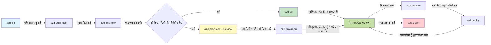
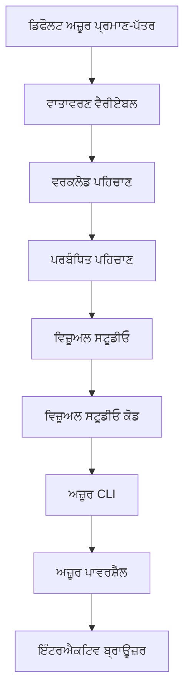

# AZD ਬੁਨਿਆਦੀਆਂ - Azure Developer CLI ਨੂੰ ਸਮਝਣਾ

# AZD ਬੁਨਿਆਦੀਆਂ - ਮੁੱਖ ਧਾਰਨਾਵਾਂ ਅਤੇ ਮੂਲ ਤੱਤ

**ਚੈਪਟਰ ਨੈਵੀਗੇਸ਼ਨ:**
- **📚 ਕੋਰਸ ਹੋਮ**: [AZD For Beginners](../../README.md)
- **📖 ਮੌਜੂਦਾ ਚੈਪਟਰ**: ਚੈਪਟਰ 1 - ਨੀਂਹ ਅਤੇ ਤੇਜ਼ ਸ਼ੁਰੂਆਤ
- **⬅️ ਪਿਛਲਾ**: [Course Overview](../../README.md#-chapter-1-foundation--quick-start)
- **➡️ ਅੱਗੇ**: [Installation & Setup](installation.md)
- **🚀 ਅਗਲਾ ਚੈਪਟਰ**: [Chapter 2: AI-First Development](../chapter-02-ai-development/microsoft-foundry-integration.md)

## ਰੂਪਰੇਖਾ

ਇਹ ਪਾਠ ਤੁਹਾਨੂੰ Azure Developer CLI (azd) ਨਾਲ ਜਾਣੂ ਕਰਵਾਉਂਦਾ ਹੈ, ਇੱਕ శਕਤੀਸ਼ਾਲੀ ਕਮਾਂਡ-ਲਾਈਨ ਟੂਲ ਜੋ ਸਥਾਨਕ ਵਿਕਾਸ ਤੋਂ Azure ਡਿਪਲੋਇਮੈਂਟ ਤੱਕ ਤੁਹਾਡੇ ਸਫਰ ਨੂੰ ਤੇਜ਼ ਕਰਦਾ ਹੈ। ਤੁਸੀਂ ਮੂਲ ਧਾਰਨਾਵਾਂ, ਮੁੱਖ ਵਿਸ਼ੇਸ਼ਤਾਵਾਂ ਸਿੱਖੋਗੇ ਅਤੇ ਸਮਝੋਂਗੇ ਕਿ azd ਕਿਵੇਂ ਕਲਾਉਡ-ਨੇਟਿਵ ਐਪਲੀਕੇਸ਼ਨ ਡਿਪਲੋਇਮੈਂਟ ਨੂੰ ਅਸਾਨ ਬਣਾਉਂਦਾ ਹੈ।

## ਸਿੱਖਣ ਦੇ ਲਕੜ

ਇਸ ਪਾਠ ਦੇ ਆਖਿਰ ਤੱਕ, ਤੁਸੀਂ:
- ਸਮਝ ਪਾਉਂਗੇ ਕਿ Azure Developer CLI ਕੀ ਹੈ ਅਤੇ इसका ਮੁੱਖ ਮਕਸਦ ਕੀ ਹੈ
- ਟੈmplੇਟ, ਵਾਤਾਵਰਣ ਅਤੇ ਸੇਵਾਵਾਂ ਦੀਆਂ ਮੁੱਖ ਰਾਹਤਾਂ ਸਿੱਖੋਗੇ
- ਟੈmplੇਟ-ਡ੍ਰਾਈਵਨ ਡਿਵੈਲਪਮੈਂਟ ਅਤੇ Infrastructure as Code ਸਮੇਤ ਮੁੱਖ ਫੀਚਰਾਂ ਦੀ ਪੜਚੋਲ ਕਰੋਗੇ
- azd ਪ੍ਰਾਜੈਕਟ ਢਾਂਚਾ ਅਤੇ ਵਰਕਫਲੋ ਨੂੰ ਸਮਝੋਗੇ
- ਆਪਣੀ ਵਿਕਾਸੀ ਵਾਤਾਵਰਣ ਲਈ azd ਇੰਸਟਾਲ ਅਤੇ ਸੰਰਚਿਤ ਕਰਨ ਲਈ ਤਿਆਰ ਹੋਵੋਗੇ

## ਸਿੱਖਣ ਦੇ ਨਤੀਜੇ

ਇਸ ਪਾਠ ਨੂੰ ਮੁਕੰਮਲ ਕਰਨ ਤੋਂ ਬਾਅਦ, ਤੁਸੀਂ ਸਮਰੱਥ ਹੋਵੋਗੇ:
- ਆਧੁਨਿਕ ਕਲਾਉਡ ਵਿਕਾਸ ਵਰਕਫਲੋਜ਼ ਵਿੱਚ azd ਦੀ ਭੂਮਿਕਾ ਸਮਝਾਉਣ ਲਈ
- azd ਪ੍ਰਾਜੈਕਟ ਢਾਂਚੇ ਦੇ ਘਟਕਾਂ ਦੀ ਪਛਾਣ ਕਰਨ ਲਈ
- ਬਿਆਨ ਕਰਨ ਲਈ ਕਿ ਟੈmplੇਟ, ਵਾਤਾਵਰਣ ਅਤੇ ਸੇਵਾਵਾਂ ਕਿਵੇਂ ਇਕੱਠੇ ਕੰਮ ਕਰਦੀਆਂ ਹਨ
- azd ਨਾਲ Infrastructure as Code ਦੇ ਫਾਇਦੇ ਸਮਝਣ ਲਈ
- ਵੱਖ-ਵੱਖ azd ਕਮਾਂਡਾਂ ਅਤੇ ਉਨ੍ਹਾਂ ਦੇ ਉਦੇਸ਼ਾਂ ਨੂੰ ਸਮਝਣ ਲਈ

## Azure Developer CLI (azd) ਕੀ ਹੈ?

Azure Developer CLI (azd) ਇੱਕ ਕਮਾਂਡ-ਲਾਈਨ ਟੂਲ ਹੈ ਜੋ ਸਥਾਨਕ ਵਿਕਾਸ ਤੋਂ Azure ਡਿਪਲੋਇਮੈਂਟ ਤੱਕ ਤੁਹਾਡੇ ਸਫਰ ਨੂੰ ਤੇਜ਼ ਕਰਣ ਲਈ ਡਿਜ਼ਾਇਨ ਕੀਤਾ ਗਿਆ ਹੈ। ਇਹ Azure 'ਤੇ ਕਲਾਉਡ-ਨੇਟਿਵ ਐਪਲੀਕੇਸ਼ਨਾਂ ਨੂੰ ਬਣਾਉਣ, ਡਿਪਲੋਇਮੈਂਟ ਅਤੇ ਪ੍ਰਬੰਧਨ ਕਰਨ ਦੀ ਪ੍ਰਕਿਰਿਆ ਨੂੰ ਸਧਾਰਨ ਬਣਾਉਂਦਾ ਹੈ।

### ਤੁਸੀਂ azd ਨਾਲ ਕੀ ਡਿਪਲੋਇਮੈਂਟ ਕਰ ਸਕਦੇ ਹੋ?

azd ਵਿਆਪਕ ਵਰਕਲੋਡਾਂ ਨੂੰ ਸਪੋਰਟ ਕਰਦਾ ਹੈ—ਅਤੇ ਸੂਚੀ ਵਧਦੀ ਰਹਿੰਦੀ ਹੈ। ਅੱਜ, ਤੁਸੀਂ azd ਦੀ ਵਰਤੋਂ ਕਰਕੇ ਡਿਪਲੋਇਮੈਂਟ ਕਰ ਸਕਦੇ ਹੋ:

| Workload Type | Examples | Same Workflow? |
|---------------|----------|----------------|
| **Traditional applications** | Web apps, REST APIs, static sites | ✅ `azd up` |
| **Services and microservices** | Container Apps, Function Apps, multi-service backends | ✅ `azd up` |
| **AI-powered applications** | Chat apps with Microsoft Foundry Models, RAG solutions with AI Search | ✅ `azd up` |
| **Intelligent agents** | Foundry-hosted agents, multi-agent orchestrations | ✅ `azd up` |

ਮੁੱਖ ਨਤੀਜਾ ਇਹ ਹੈ ਕਿ **azd ਦਾ ਲਾਈਫਸਾਇਕਲ ਇਸ ਗੱਲ ਤੋਂ ਅਲੱਗ ਨਹੀਂ ਹੁੰਦਾ ਕਿ ਤੁਸੀਂ ਕੀ ਡਿਪਲੋਇਮੈਂਟ ਕਰ ਰਹੇ ਹੋ**। ਤੁਸੀਂ ਇੱਕ ਪ੍ਰਾਜੈਕਟ ਸ਼ੁਰੂ ਕਰਦੇ ਹੋ, ਇੰਫਰਾਸਟ੍ਰਕਚਰ ਪ੍ਰੋਵੀਜ਼ਨ ਕਰਦੇ ਹੋ, ਆਪਣਾ ਕੋਡ ਡਿਪਲੋਇਮੈਂਟ ਕਰਦੇ ਹੋ, ਆਪਣੀ ਐਪ ਨੂੰ ਮਾਨੀਟਰ ਕਰਦੇ ਹੋ, ਅਤੇ ਸਾਫ਼-ਸੁਥਰਾ ਕਰਦੇ ਹੋ—ਚਾਹੇ ਉਹ ਇੱਕ ਸਧਾਰਣ ਵੈਬਸਾਈਟ ਹੋਵੇ ਜਾਂ ਇੱਕ ਉੱਚ-ਪੱਧਰੀ AI ਏਜੰਟ।

ਇਹ ਲਗਾਤਾਰਤਾ ਉਦੇਸ਼ੀ ਤੌਰ 'ਤੇ ਹੈ। azd AI ਸਮਰੱਥਾਵਾਂ ਨੂੰ ਤੁਹਾਡੀ ਐਪਲੀਕੇਸ਼ਨ ਵੱਲੋਂ ਵਰਤੀ ਜਾਣ ਵਾਲੀ ਇੱਕ ਹੋਰ ਕਿਸਮ ਦੀ ਸੇਵਾ ਵਜੋਂ ਦੇਖਦਾ ਹੈ, ਇਸਨੂੰ ਕੁਝ ਮੂਲ ਤੌਰ 'ਤੇ ਵੱਖਰਾ ਸਮਝਦਾ ਨਹੀਂ। Microsoft Foundry Models ਨਾਲ ਬੈਕ ਕੀਤੇ chat endpoint azd ਦੀ ਨਜ਼ਰ ਵਿੱਚ, ਸਿਰਫ਼ ਹੋਰ ਇੱਕ ਸੇਵਾ ਹੈ ਜਿਸਨੂੰ ਸੰਰਚਿਤ ਅਤੇ ਡਿਪਲੋਇਮੈਂਟ ਕਰਨ ਦੀ ਲੋੜ ਹੈ।

### 🎯 AZD ਕਿਉਂ ਵਰਤਣਾ? ਇੱਕ ਹਕੀਕਤੀ ਤੁਲਨਾ

ਚਲੋ ਇੱਕ ਸਧਾਰਣ ਵੈਬ ਐਪ ਅਤੇ ਡੇਟਾਬੇਸ ਨੂੰ ਡਿਪਲੋਇਮੈਂਟ ਕਰਨ ਦੀ ਤੁਲਨਾ ਕਰੀਏ:

#### ❌ AZD ਦੇ ਬਿਨਾਂ: ਮੈਨੁਅਲ Azure ਡਿਪਲੋਇਮੈਂਟ (30+ ਮਿੰਟ)

```bash
# ਕਦਮ 1: ਰਿਸੋਰਸ ਗਰੁੱਪ ਬਣਾਓ
az group create --name myapp-rg --location eastus

# ਕਦਮ 2: ਐਪ ਸਰਵਿਸ ਪਲੈਨ ਬਣਾਓ
az appservice plan create --name myapp-plan \
  --resource-group myapp-rg \
  --sku B1 --is-linux

# ਕਦਮ 3: ਵੈੱਬ ਐਪ ਬਣਾਓ
az webapp create --name myapp-web-unique123 \
  --resource-group myapp-rg \
  --plan myapp-plan \
  --runtime "NODE:18-lts"

# ਕਦਮ 4: ਕੋਸਮੋਸ DB ਖਾਤਾ ਬਣਾਓ (10-15 ਮਿੰਟ)
az cosmosdb create --name myapp-cosmos-unique123 \
  --resource-group myapp-rg \
  --kind MongoDB

# ਕਦਮ 5: ਡੇਟਾਬੇਸ ਬਣਾਓ
az cosmosdb mongodb database create \
  --account-name myapp-cosmos-unique123 \
  --resource-group myapp-rg \
  --name tododb

# ਕਦਮ 6: ਕਲੈਕਸ਼ਨ ਬਣਾਓ
az cosmosdb mongodb collection create \
  --account-name myapp-cosmos-unique123 \
  --resource-group myapp-rg \
  --database-name tododb \
  --name todos

# ਕਦਮ 7: ਕਨੈਕਸ਼ਨ ਸਟਰਿੰਗ ਪ੍ਰਾਪਤ ਕਰੋ
CONN_STR=$(az cosmosdb keys list \
  --name myapp-cosmos-unique123 \
  --resource-group myapp-rg \
  --type connection-strings \
  --query "connectionStrings[0].connectionString" -o tsv)

# ਕਦਮ 8: ਐਪ ਸੈਟਿੰਗਾਂ ਕੰਫਿਗਰ ਕਰੋ
az webapp config appsettings set \
  --name myapp-web-unique123 \
  --resource-group myapp-rg \
  --settings MONGODB_URI="$CONN_STR"

# ਕਦਮ 9: ਲੌਗਿੰਗ ਚਾਲੂ ਕਰੋ
az webapp log config --name myapp-web-unique123 \
  --resource-group myapp-rg \
  --application-logging filesystem \
  --detailed-error-messages true

# ਕਦਮ 10: Application Insights ਸੈਟਅਪ ਕਰੋ
az monitor app-insights component create \
  --app myapp-insights \
  --location eastus \
  --resource-group myapp-rg

# ਕਦਮ 11: App Insights ਨੂੰ ਵੈੱਬ ਐਪ ਨਾਲ ਜੋੜੋ
INSTRUMENTATION_KEY=$(az monitor app-insights component show \
  --app myapp-insights \
  --resource-group myapp-rg \
  --query "instrumentationKey" -o tsv)

az webapp config appsettings set \
  --name myapp-web-unique123 \
  --resource-group myapp-rg \
  --settings APPINSIGHTS_INSTRUMENTATIONKEY="$INSTRUMENTATION_KEY"

# ਕਦਮ 12: ਐਪਲੀਕੇਸ਼ਨ ਨੂੰ ਲੋਕਲ ਤੌਰ 'ਤੇ ਬਿਲਡ ਕਰੋ
npm install
npm run build

# ਕਦਮ 13: ਡਿਪਲਾਇਮੈਂਟ ਪੈਕੇਜ ਬਣਾਓ
zip -r app.zip . -x "*.git*" "node_modules/*"

# ਕਦਮ 14: ਐਪਲੀਕੇਸ਼ਨ ਨੂੰ ਡਿਪਲੋਏ ਕਰੋ
az webapp deployment source config-zip \
  --resource-group myapp-rg \
  --name myapp-web-unique123 \
  --src app.zip

# ਕਦਮ 15: ਉਡੀਕ ਕਰੋ ਅਤੇ ਦੁਆ ਕਰੋ ਕਿ ਇਹ ਕੰਮ ਕਰੇ 🙏
# (ਕੋਈ ਆਟੋਮੇਟਿਕ ਵੈਰੀਫਿਕੇਸ਼ਨ ਨਹੀਂ, ਮੈਨੁਅਲ ਟੈਸਟਿੰਗ ਲਾਜ਼ਮੀ ਹੈ)
```

**ਸਮੱਸਿਆਵਾਂ:**
- ❌ ਯਾਦ ਰੱਖਣ ਅਤੇ ਕ੍ਰਮ ਵਿੱਚ ਚਲਾਉਣ ਲਈ 15+ ਕਮਾਂਡਾਂ
- ❌ 30-45 ਮਿੰਟ ਦਾ ਮੈਨੁਅਲ ਕੰਮ
- ❌ ਗਲਤੀਆਂ ਕਰਨਾ ਆਸਾਨ (ਟਾਇਪੋਜ਼, ਗਲਤ ਪੈਰਾਮੀਟਰ)
- ❌ ਟਰਮੀਨਲ ਇਤਿਹਾਸ ਵਿੱਚ ਕਨੈਕਸ਼ਨ ਸਟਰਿੰਗ ਜ਼ਾਹਰ ਹੋ ਸਕਦੀਆਂ ਹਨ
- ❌ ਜੇ ਕੁਝ ਫੇਲ ਹੋਵੇ ਤਾਂ ਕੋਈ ਆਟੋਮੈਟਿਕ ਰੋਲਬੈਕ ਨਹੀਂ
- ❌ ਟੀਮ ਮੈਂਬਰਾਂ ਲਈ ਦੁਹਰਾਉਣਾ ਔਖਾ
- ❌ ਹਰ ਵਾਰੀ ਵੱਖਰਾ ਹੁੰਦਾ (ਰਿਪ੍ਰੋਡਿਊਸਬਲ ਨਹੀਂ)

#### ✅ AZD ਨਾਲ: ਆਟੋਮੇਟਿਕ ਡਿਪਲੋਇਮੈਂਟ (5 ਕਮਾਂਡਾਂ, 10-15 ਮਿੰਟ)

```bash
# ਕਦਮ 1: ਟੈਮਪਲੇਟ ਤੋਂ ਸ਼ੁਰੂ ਕਰੋ
azd init --template todo-nodejs-mongo

# ਕਦਮ 2: ਪ੍ਰਮਾਣੀਕਰਣ ਕਰੋ
azd auth login

# ਕਦਮ 3: ਵਾਤਾਵਰਨ ਬਣਾਓ
azd env new dev

# ਕਦਮ 4: ਬਦਲਾਵਾਂ ਦਾ ਪ੍ਰੀਵਿਊ (ਵਿਕਲਪਿਕ ਪਰ ਸਿਫਾਰਸ਼ੀ)
azd provision --preview

# ਕਦਮ 5: ਸਭ ਕੁਝ ਤੈਨਾਤ ਕਰੋ
azd up

# ✨ ਮੁਕੰਮਲ! ਸਭ ਕੁਝ ਤੈਨਾਤ, ਸੰਰਚਿਤ ਅਤੇ ਨਿਗਰਾਨ ਕੀਤਾ ਗਿਆ ਹੈ
```

**ਫਾਇਦੇ:**
- ✅ **5 ਕਮਾਂਡਾਂ** ਬਨਾਮ 15+ ਮੈਨੁਅਲ ਕਦਮ
- ✅ **10-15 ਮਿੰਟ** ਕੁੱਲ ਸਮਾਂ (ਜ਼ਿਆਦਾਤਰ Azure ਦੀ ਉਡੀਕ)
- ✅ **ਗਲਤੀਆਂ ਨੂੰ ਖ਼ਤਮ** ਕੀਤਾ ਗਿਆ - ਆਟੋਮੇਟਿਕ ਅਤੇ ਟੈਸਟ ਕੀਤਾ ਹੋਇਆ
- ✅ **ਸੀਕ੍ਰੇਟਸ ਸੁਰੱਖਿਅਤ ਤਰੀਕੇ ਨਾਲ ਪ੍ਰਬੰਧਿਤ** ਕੀਤੇ ਜਾਂਦੇ ਹਨ (Key Vault ਰਾਹੀਂ)
- ✅ **ਫੇਲਿਅਰ 'ਤੇ ਆਟੋਮੈਟਿਕ ਰੋਲਬੈਕ**
- ✅ **ਪੂਰੀ ਤਰ੍ਹਾਂ ਦੁਹਰਾਉਣਯੋਗ** - ਹਰ ਵਾਰੀ ਇਕੋ ਨਤੀਜਾ
- ✅ **ਟੀਮ-ਤਿਆਰ** - ਕੋਈ ਵੀ ਇਕੋ ਕਮਾਂਡਾਂ ਨਾਲ ਡਿਪਲੋਇਮੈਂਟ ਕਰ ਸਕਦਾ ਹੈ
- ✅ **Infrastructure as Code** - ਵਰਜ਼ਨ-ਕੰਟਰੋਲ ਕੀਤੇ Bicep ਟੈmplੇਟ
- ✅ **ਬਿਲਟ-ਇਨ ਮਾਨੀਟਰਿੰਗ** - Application Insights ਸਵੈਚਲਿਤ ਤੌਰ 'ਤੇ ਸੰਰਚਿਤ

### 📊 ਸਮਾਂ ਅਤੇ ਗਲਤੀ ਦੀ ਘਟੌਤ

| Metric | Manual Deployment | AZD Deployment | Improvement |
|:-------|:------------------|:---------------|:------------|
| **Commands** | 15+ | 5 | 67% fewer |
| **Time** | 30-45 min | 10-15 min | 60% faster |
| **Error Rate** | ~40% | <5% | 88% reduction |
| **Consistency** | Low (manual) | 100% (automated) | Perfect |
| **Team Onboarding** | 2-4 hours | 30 minutes | 75% faster |
| **Rollback Time** | 30+ min (manual) | 2 min (automated) | 93% faster |

## ਮੁੱਖ ਧਾਰਨਾਵਾਂ

### ਟੈmplੇਟ
ਟੈmplੇਟ azd ਦੀ ਨੀਂਹ ਹਨ। ਇਹ ਵਿੱਚ ਸ਼ਾਮਲ ਹੁੰਦਾ ਹੈ:
- **ਐਪਲੀਕੇਸ਼ਨ ਕੋਡ** - ਤੁਹਾਡਾ ਸੋഴ് ਕੋਡ ਅਤੇ ਡਿਪੈਂਡੈਂਸੀਜ਼
- **ਇੰਫਰਾਸਟ੍ਰਕਚਰ ਪਰਿਭਾਸ਼ਾਵਾਂ** - Bicep ਜਾਂ Terraform ਵਿੱਚ ਪਰਿਭਾਸ਼ਿਤ Azure ਸਰੋਤ
- **ਸੰਰਚਨਾ ਫਾਇਲਾਂ** - ਸੈਟਿੰਗਾਂ ਅਤੇ ਵਾਤਾਵਰਣ ਵੇਰੀਏਬਲ
- **ਡਿਪਲੋਇਮੈਂਟ ਸਕ੍ਰਿਪਟਸ** - ਆਟੋਮੇਟਿਕ ਡਿਪਲੋਇਮੈਂਟ ਵਰਕਫਲੋਜ਼

### ਵਾਤਾਵਰਣ
ਵਾਤਾਵਰਣ ਵੱਖ-ਵੱਖ ਡਿਪਲੋਇਮੈਂਟ ਟਾਰਗਿਟਾਂ ਦੀ ਨੁਮਾਇੰਦਗੀ ਕਰਦੇ ਹਨ:
- **Development** - ਟੈਸਟਿੰਗ ਅਤੇ ਵਿਕਾਸ ਲਈ
- **Staging** - ਪ੍ਰੀ-ਪ੍ਰੋਡਕਸ਼ਨ ਵਾਤਾਵਰਣ
- **Production** - ਲਾਈਵ ਪ੍ਰੋਡਕਸ਼ਨ ਵਾਤਾਵਰਣ

ਹਰ ਵਾਤਾਵਰਣ ਆਪਣਾ ਖੂਦ ਦਾ ਰੱਖਦਾ ਹੈ:
- Azure resource group
- ਸੰਰਚਨਾ ਸੈਟਿੰਗਾਂ
- ਡਿਪਲੋਇਮੈਂਟ ਸਟੇਟ

### ਸੇਵਾਵਾਂ
ਸੇਵਾਵਾਂ ਤੁਹਾਡੀ ਐਪਲੀਕੇਸ਼ਨ ਦੇ ਨਿਰਮਾਣ ਬਲਾਕ ਹੁੰਦੇ ਹਨ:
- **Frontend** - ਵੈਬ ਐਪਲੀਕੇਸ਼ਨ, SPAs
- **Backend** - APIs, ਮਾਈਕਰੋਸੇਵਾਵਾਂ
- **Database** - ਡੇਟਾ ਸਟੋਰੇਜ ਹੱਲ
- **Storage** - ਫਾਇਲ ਅਤੇ ਬਲਾਬ ਸਟੋਰੇਜ

## ਮੁੱਖ ਵਿਸ਼ੇਸ਼ਤਾਵਾਂ

### 1. ਟੈmplੇਟ-ਡ੍ਰਾਈਵਨ ਡਿਵੈਲਪਮੈਂਟ
```bash
# ਉਪਲਬਧ ਟੈਮਪਲੇਟ ਵੇਖੋ
azd template list

# ਟੈਮਪਲੇਟ ਤੋਂ ਆਰੰਭ ਕਰੋ
azd init --template <template-name>
```

### 2. Infrastructure as Code
- **Bicep** - Azure ਦੀ ਡੋਮੇਨ-ਨਿਰਧਾਰਿਤ ਭਾਸ਼ਾ
- **Terraform** - ਬਹੁ-ਕਲਾਉਡ ਇੰਫਰਾਸਟ੍ਰਕਚਰ ਟੂਲ
- **ARM Templates** - Azure Resource Manager ਟੈmplੇਟ

### 3. ਇੰਟੀਗਰੇਟਡ ਵਰਕਫਲੋਜ਼
```bash
# ਪੂਰਾ ਤੈਨਾਤੀ ਵਰਕਫਲੋ
azd up            # ਪ੍ਰੋਵਿਜ਼ਨ + ਤੈਨਾਤੀ — ਪਹਿਲੀ ਵਾਰੀ ਸੈਟਅਪ ਲਈ ਇਹ ਬਿਨਾਂ ਦਖਲ ਵਾਲਾ ਹੈ

# 🧪 ਨਵਾਂ: ਤੈਨਾਤੀ ਤੋਂ ਪਹਿਲਾਂ ਢਾਂਚੇ ਵਿੱਚ ਹੋਣ ਵਾਲੇ ਬਦਲਾਵਾਂ ਦਾ ਪੂਰਵਦਰਸ਼ਨ ਕਰੋ (ਸੁਰੱਖਿਅਤ)
azd provision --preview    # ਬਦਲਾਅ ਕੀਤੇ ਬਿਨਾਂ ਢਾਂਚੇ ਦੀ ਤੈਨਾਤੀ ਦਾ ਅਨੁਕਰਣ ਕਰੋ

azd provision     # ਜੇ ਤੁਸੀਂ ਢਾਂਚਾ ਅੱਪਡੇਟ ਕਰਦੇ ਹੋ ਤਾਂ ਇਹ Azure ਸਰੋਤ ਬਣਾਉਣ ਲਈ ਵਰਤੋਂ
azd deploy        # ਐਪਲੀਕੇਸ਼ਨ ਕੋਡ ਤੈਨਾਤ ਕਰੋ ਜਾਂ ਅੱਪਡੇਟ ਹੋਣ 'ਤੇ ਕੋਡ ਨੂੰ ਦੁਬਾਰਾ ਤੈਨਾਤ ਕਰੋ
azd down          # ਸਰੋਤਾਂ ਨੂੰ ਸਾਫ਼ ਕਰੋ
```

#### 🛡️ Preview ਨਾਲ ਸੁਰੱਖਿਅਤ ਇੰਫਰਾਸਟ੍ਰਕਚਰ ਯੋਜਨਾ
`azd provision --preview` ਕਮਾਂਡ ਸੁਰੱਖਿਅਤ ਡਿਪਲੋਇਮੈਂਟ ਲਈ ਖੇਡ-ਬਦਲਣ ਵਾਲੀ ਹੈ:
- **ਡ੍ਰਾਈ-ਰਨ ਵਿਸ਼ਲੇਸ਼ਣ** - ਦਿਖਾਉਂਦਾ ਹੈ ਕਿ ਕੀ ਬਣਾਇਆ, ਸੋਧਿਆ ਜਾਂ ਮਿਟਾਇਆ ਜਾਵੇਗਾ
- **ਜ਼ੀਰੋ ਰਿਸਕ** - ਤੁਹਾਡੇ Azure ਵਾਤਾਵਰਣ ਵਿੱਚ ਕੋਈ ਅਸਲ ਬਦਲਾਅ ਨਹੀਂ ਕੀਤਾ ਜਾਂਦਾ
- **ਟੀਮ ਸਹਯੋਗ** - ਡਿਪਲੋਇਮੈਂਟ ਤੋਂ ਪਹਿਲਾਂ ਪ੍ਰੀਵਿਊ ਨਤੀਜਿਆਂ ਨੂੰ ਸਾਂਝਾ ਕਰੋ
- **ਲਾਗਤ ਅਨੁਮਾਨ** - ਵਚਨਬੱਧਤਾ ਤੋਂ ਪਹਿਲਾਂ ਸਰੋਤਾਂ ਦੀ ਲਾਗਤ ਸਮਝੋ

```bash
# ਉਦਾਹਰਨ ਪ੍ਰੀਵਿਊ ਵਰਕਫਲੋ
azd provision --preview           # ਦੇਖੋ ਕਿ ਕੀ ਬਦਲੇਗਾ
# ਆਉਟਪੁੱਟ ਦੀ ਸਮੀਖਿਆ ਕਰੋ, ਟੀਮ ਨਾਲ ਚਰਚਾ ਕਰੋ
azd provision                     # ਪੂਰੇ ਭਰੋਸੇ ਨਾਲ ਬਦਲਾਅ ਲਾਗੂ ਕਰੋ
```

### 📊 ਵਿਜ਼ੂਅਲ: AZD ਵਿਕਾਸ ਵਰਕਫਲੋ


**ਵਰਕਫਲੋ ਵਿਆਖਿਆ:**
1. **Init** - ਟੈmplੇਟ ਜਾਂ ਨਵੇਂ ਪ੍ਰਾਜੈਕਟ ਨਾਲ ਸ਼ੁਰੂ ਕਰੋ
2. **Auth** - Azure ਨਾਲ ਪ੍ਰਮਾਣਿਕਤਾ ਕਰੋ
3. **Environment** - ਅਲੱਗ ਡਿਪਲੋਇਮੈਂਟ ਵਾਤਾਵਰਣ ਬਣਾਓ
4. **Preview** - 🆕 ਹਮੇਸ਼ਾਂ ਪਹਿਲਾਂ ਇੰਫਰਾਸਟ੍ਰਕਚਰ ਬਦਲਾਅ ਦਾ ਪ੍ਰੀਵਿਊ ਕਰੋ (ਸੁਰੱਖਿਅਤ ਅਭਿਆਸ)
5. **Provision** - Azure ਸਰੋਤ ਬਣਾਓ/ਅਪਡੇਟ ਕਰੋ
6. **Deploy** - ਆਪਣਾ ਐਪਲੀਕੇਸ਼ਨ ਕੋਡ ਪਸ਼ ਕਰੋ
7. **Monitor** - ਐਪਲੀਕੇਸ਼ਨ ਪ੍ਰਦਰਸ਼ਨ ਦਾ ਨਿਰੀਖਣ ਕਰੋ
8. **Iterate** - ਬਦਲਾਅ ਕਰੋ ਅਤੇ ਕੋਡ ਨੂੰ ਦੁਬਾਰਾ ਡਿਪਲੋਇਮੈਂਟ ਕਰੋ
9. **Cleanup** - ਜਦੋਂ ਮੁਕੰਮਲ ਹੋ ਜਾਵੇ ਤਾਂ ਸਰੋਤ ਹਟਾਓ

### 4. ਵਾਤਾਵਰਣ ਪ੍ਰਬੰਧਨ
```bash
# ਵਾਤਾਵਰਣਾਂ ਬਣਾਓ ਅਤੇ ਪ੍ਰਬੰਧ ਕਰੋ
azd env new <environment-name>
azd env select <environment-name>
azd env list
```

### 5. ਐਕਸਟੇਂਸ਼ਨ ਅਤੇ AI ਕਮਾਂਡ

azd ਇੱਕ ਐਕਸਟੇਂਸ਼ਨ ਸਿਸਟਮ ਦੀ ਵਰਤੋਂ ਕਰਦਾ ਹੈ ਤਾਂ ਜੋ ਕੋਰ CLI ਤੋਂ ਬਾਹਰ ਸਮਰੱਥਾਵਾਂ ਜੋੜ ਸਕੇ। ਇਹ ਖਾਸ ਕਰਕੇ AI ਵਰਕਲੋਡਾਂ ਲਈ ਲਾਭਦਾਇਕ ਹੈ:

```bash
# ਉਪਲਬਧ ਐਕਸਟੇਂਸ਼ਨਾਂ ਦੀ ਸੂਚੀ
azd extension list

# Foundry agents ਐਕਸਟੇਸ਼ਨ ਨੂੰ ਇੰਸਟਾਲ ਕਰੋ
azd extension install azure.ai.agents

# ਮੇਨਿਫੈਸਟ ਤੋਂ ਇੱਕ AI ਏਜੰਟ ਪ੍ਰੋਜੈਕਟ ਸ਼ੁਰੂ ਕਰੋ
azd ai agent init -m agent-manifest.yaml

# AI-ਸਹਾਇਤਾ ਵਾਲੇ ਵਿਕਾਸ ਲਈ MCP ਸਰਵਰ ਸ਼ੁਰੂ ਕਰੋ (ਅਲਫਾ)
azd mcp start
```

> ਐਕਸਟੇਂਸ਼ਨਾਂ ਨੂੰ ਵਿਸਥਾਰ ਨਾਲ [Chapter 2: AI-First Development](../chapter-02-ai-development/agents.md) ਅਤੇ [AZD AI CLI Commands](../chapter-08-production/production-ai-practices.md#azd-ai-cli-commands-and-extensions) ਰੇਫਰੈਂਸ ਵਿੱਚ ਕਵਰ ਕੀਤਾ ਗਿਆ ਹੈ।

## 📁 ਪ੍ਰਾਜੈਕਟ ਦਾ ਢਾਂਚਾ

ਇੱਕ ਆਮ azd ਪ੍ਰਾਜੈਕਟ ਢਾਂਚਾ:
```
my-app/
├── .azd/                    # azd configuration
│   └── config.json
├── .azure/                  # Azure deployment artifacts
├── .devcontainer/          # Development container config
├── .github/workflows/      # GitHub Actions
├── .vscode/               # VS Code settings
├── infra/                 # Infrastructure code
│   ├── main.bicep        # Main infrastructure template
│   ├── main.parameters.json
│   └── modules/          # Reusable modules
├── src/                  # Application source code
│   ├── api/             # Backend services
│   └── web/             # Frontend application
├── azure.yaml           # azd project configuration
└── README.md
```

## 🔧 ਸੰਰਚਨਾ ਫਾਇਲਾਂ

### azure.yaml
ਮੁੱਖ ਪ੍ਰਾਜੈਕਟ ਸੰਰਚਨਾ ਫਾਇਲ:
```yaml
name: my-awesome-app
metadata:
  template: my-template@1.0.0

services:
  web:
    project: ./src/web
    language: js
    host: appservice
  api:
    project: ./src/api
    language: js
    host: appservice

hooks:
  preprovision:
    shell: pwsh
    run: echo "Preparing to provision..."
```

### .azure/config.json
ਵਾਤਾਵਰਣ-ਨਿਰਧਾਰਿਤ ਸੰਰਚਨਾ:
```json
{
  "version": 1,
  "defaultEnvironment": "dev",
  "environments": {
    "dev": {
      "subscriptionId": "your-subscription-id",
      "location": "eastus"
    }
  }
}
```

## 🎪 ਆਮ ਵਰਕਫਲੋਜ਼ ਨਾਲ ਹੈਂਡਸ-ਆਨ ਅਭਿਆਸ

> **💡 ਸਿੱਖਣ ਦੀ ਟਿਪ:** ਆਪਣੇ AZD ਹੁਨਰਾਂ ਨੂੰ ਕ੍ਰਮਬੱਧ ਤਰੀਕੇ ਨਾਲ ਤਿਆਰ ਕਰਨ ਲਈ ਅਭਿਆਸਾਂ ਨੂੰ ਇਸ ਕ੍ਰਮ ਵਿੱਚ ਫਾਲੋ ਕਰੋ।

### 🎯 ਅਭਿਆਸ 1: ਆਪਣਾ ਪਹਿਲਾ ਪ੍ਰਾਜੈਕਟ ਸ਼ੁਰੂ ਕਰੋ

**ਲਕੜ:** ਇੱਕ AZD ਪ੍ਰਾਜੈਕਟ ਬਣਾਓ ਅਤੇ ਇਸ ਦੇ ਢਾਂਚੇ ਦੀ ਪੜਚੋਲ ਕਰੋ

**ਕਦਮ:**
```bash
# ਇੱਕ ਪ੍ਰਮਾਣਿਤ ਟੈਂਪਲੇਟ ਵਰਤੋ
azd init --template todo-nodejs-mongo

# ਤਿਆਰ ਕੀਤੀਆਂ ਫਾਇਲਾਂ ਖੰਗਾਲੋ
ls -la  # ਲੁਕੀਆਂ ਫਾਇਲਾਂ ਸਮੇਤ ਸਾਰੀਆਂ ਫਾਇਲਾਂ ਵੇਖੋ

# ਮੁੱਖ ਫਾਇਲਾਂ ਬਣਾਈਆਂ ਗਈਆਂ:
# - azure.yaml (ਮੁੱਖ ਕੰਫਿਗ)
# - infra/ (ਇੰਫ੍ਰਾਸਟ੍ਰਕਚਰ ਕੋਡ)
# - src/ (ਐਪਲੀਕੇਸ਼ਨ ਕੋਡ)
```

**✅ ਸਫਲਤਾ:** ਤੁਹਾਡੇ ਕੋਲ azure.yaml, infra/, ਅਤੇ src/ ਡਾਇਰੈਕਟਰੀਆਂ ਹਨ

---

### 🎯 ਅਭਿਆਸ 2: Azure 'ਤੇ ਡਿਪਲੋਇਮੈਂਟ

**ਲਕੜ:** ਐਂਡ-ਟੂ-ਐਂਡ ਡਿਪਲੋਇਮੈਂਟ ਪੂਰਾ ਕਰੋ

**ਕਦਮ:**
```bash
# 1. ਪ੍ਰਮਾਣਿਤ ਕਰੋ
az login && azd auth login

# 2. ਵਾਤਾਵਰਣ ਬਣਾਓ
azd env new dev
azd env set AZURE_LOCATION eastus

# 3. ਤਬਦੀਲੀਆਂ ਦਾ ਪੂਰਵ ਦਰਸ਼ਨ (ਸਿਫਾਰਸ਼ ਕੀਤੀ ਜਾਂਦੀ ਹੈ)
azd provision --preview

# 4. ਸਭ ਕੁਝ ਤੈਨਾਤ ਕਰੋ
azd up

# 5. ਤੈਨਾਤ ਦੀ ਜਾਂਚ ਕਰੋ
azd show    # ਆਪਣੇ ਐਪ ਦਾ URL ਵੇਖੋ
```

**ਉਮੀਦ ਕੀਤੀ ਸਮਾਂ:** 10-15 ਮਿੰਟ  
**✅ ਸਫਲਤਾ:** ਐਪਲੀਕੇਸ਼ਨ URL ਬਰਾਊਜ਼ਰ ਵਿੱਚ ਖੁਲਦਾ ਹੈ

---

### 🎯 ਅਭਿਆਸ 3: ਇੱਕ ਤੋਂ ਵੱਧ ਵਾਤਾਵਰਣ

**ਲਕੜ:** dev ਅਤੇ staging 'ਤੇ ਡਿਪਲੋਇਮੈਂਟ ਕਰੋ

**ਕਦਮ:**
```bash
# ਪਹਿਲਾਂ ਹੀ dev ਮੌਜੂਦ ਹੈ, staging ਬਣਾਓ
azd env new staging
azd env set AZURE_LOCATION westus2
azd up

# ਉਹਨਾਂ ਦੇ ਵਿਚਕਾਰ ਬਦਲੋ
azd env list
azd env select dev
```

**✅ ਸਫਲਤਾ:** Azure ਪੋਰਟਲ ਵਿੱਚ ਦੋ ਅਲੱਗ resource groups

---

### 🛡️ ਸਾਫ਼ ਸ਼ੁਰੂਆਤ: `azd down --force --purge`

ਜਦੋਂ ਤੁਹਾਨੂੰ ਪੂਰੀ ਤਰ੍ਹਾਂ ਰੀਸੈਟ ਕਰਨ ਦੀ ਲੋੜ ਹੋਵੇ:

```bash
azd down --force --purge
```

**ਇਹ ਕੀ ਕਰਦਾ ਹੈ:**
- `--force`: ਕੋਈ ਪੁਸ਼ਟੀਕਰਨ ਪ੍ਰੰਪਟ ਨਹੀਂ
- `--purge`: ਸਾਰੇ ਸਥਾਨਕ ਸਟੇਟ ਅਤੇ Azure ਸਰੋਤ ਮਿਟਾਉਂਦਾ ਹੈ

**ਕਦੋਂ ਵਰਤਣਾ:**
- ਡਿਪਲੋਇਮੈਂਟ ਮੱਧ ਰਾਹ ਵਿੱਚ ਫੇਲ ਹੋ ਗਿਆ
- ਪ੍ਰਾਜੈਕਟ ਬਦਲ ਰਹੇ ਹੋ
- ਤਾਜ਼ਾ ਸ਼ੁਰੂਆਤ ਦੀ ਲੋੜ

---

## 🎪 ਮੂਲ ਵਰਕਫਲੋ ਰੇਫਰੈਂਸ

### ਨਵਾਂ ਪ੍ਰਾਜੈਕਟ ਸ਼ੁਰੂ ਕਰਨਾ
```bash
# ਤਰੀਕਾ 1: ਮੌਜੂਦਾ ਟੈਂਪਲੇਟ ਦੀ ਵਰਤੋਂ ਕਰੋ
azd init --template todo-nodejs-mongo

# ਤਰੀਕਾ 2: ਸਿਰੇ ਤੋਂ ਸ਼ੁਰੂ ਕਰੋ
azd init

# ਤਰੀਕਾ 3: ਮੌਜੂਦਾ ਡਾਇਰੈਕਟਰੀ ਦੀ ਵਰਤੋਂ ਕਰੋ
azd init .
```

### ਵਿਕਾਸ ਚੱਕਰ
```bash
# ਡਿਵੈਲਪਮੈਂਟ ਵਾਤਾਵਰਣ ਸੈਟਅੱਪ ਕਰੋ
azd auth login
azd env new dev
azd env select dev

# ਹਰ ਚੀਜ਼ ਨੂੰ ਤੈਨਾਤ ਕਰੋ
azd up

# ਤਬਦੀਲੀਆਂ ਕਰੋ ਅਤੇ ਮੁੜ ਤੈਨਾਤ ਕਰੋ
azd deploy

# ਮੁਕੰਮਲ ਹੋਣ 'ਤੇ ਸਾਫ਼ ਕਰੋ
azd down --force --purge # Azure Developer CLI ਵਿੱਚ ਇਹ ਕਮਾਂਡ ਤੁਹਾਡੇ ਵਾਤਾਵਰਣ ਲਈ ਇੱਕ **ਹਾਰਡ ਰੀਸੈਟ** ਹੈ—ਖਾਸ ਕਰਕੇ ਜਦੋਂ ਤੁਸੀਂ ਅਸਫਲ ਡਿਪਲੋਇਮੈਂਟਾਂ ਦੀ ਜਾਂਚ ਕਰ ਰਹੇ ਹੋ, ਛੱਡੇ ਹੋਏ ਸਰੋਸਾਂ ਨੂੰ ਸਾਫ਼ ਕਰ ਰਹੇ ਹੋ, ਜਾਂ ਨਵੀਂ ਮੁੜ-ਤੈਨਾਤ ਲਈ ਤਿਆਰੀ ਕਰ ਰਹੇ ਹੋ।
```

## `azd down --force --purge` ਨੂੰ ਸਮਝਣਾ
`azd down --force --purge` ਕਮਾਂਡ ਤੁਹਾਡੇ azd ਵਾਤਾਵਰਣ ਅਤੇ ਉਸ ਨਾਲ ਜੁੜੇ ਸਾਰੇ ਸਰੋਤਾਂ ਨੂੰ ਪੂਰੀ ਤਰ੍ਹਾਂ ਤੋੜ ਦੇਣ ਦਾ ਇੱਕ ਸ਼ਕਤੀਸ਼ਾਲੀ ਤਰੀਕਾ ਹੈ। ਇਹ ਰਹਿੰਦਿਆਂ ਹਰ ਫਲੈਗ ਕੀ ਕਰਦਾ ਹੈ, ਇਹਦਾ ਵਰਣਨ ਇਸ ਪ੍ਰਕਾਰ ਹੈ:
```
--force
```
- ਪੁਸ਼ਟੀਕਰਨ ਪ੍ਰੰਪਟਾਂ ਨੂੰ ਛੱਡ ਦਿੰਦਾ ਹੈ।
- ਆਟੋਮੇਸ਼ਨ ਜਾਂ ਸਕ੍ਰਿਪਟਿੰਗ ਲਈ ਲਾਭਦਾਇਕ ਜਿੱਥੇ ਮੈਨੂੰਅਲ ਇਨਪੁਟ ਸੰਭਵ ਨਹੀਂ ਹੁੰਦਾ।
- ਇਹ ਯਕੀਨੀ ਬਣਾਉਂਦਾ ਹੈ ਕਿ CLI ਕੋਈ ਰੁਕਾਵਟ ਤੋਂ ਬਿਨਾਂ ਟੀਅਰਡਾਊਨ ਜਾਰੀ ਰੱਖੇ, ਭਾਵੇਂ CLI ਅਸਮਰੱਥਾਵਾਂ ਨੂੰ ਮਹਿਸੂਸ ਕਰੇ।

```
--purge
```
Deletes **all associated metadata**, including:
Environment state
Local `.azure` folder
Cached deployment info
Prevents azd from "remembering" previous deployments, which can cause issues like mismatched resource groups or stale registry references.


### ਦੋਹਾਂ ਨੂੰ ਕਿਉਂ ਵਰਤਣਾ?
ਜਦੋਂ ਤੁਸੀਂ `azd up` ਨਾਲ ਰੁਕਾਵਟ ਜਾਂ ਅਧੂਰੇ ਡਿਪਲੋਇਮੈਂਟਾਂ ਕਾਰਨ ਫਸ ਜਾਂਦੇ ਹੋ, ਤਾਂ ਇਹ ਜੋੜ ਹਰ ਚੀਜ਼ ਨੂੰ ਇੱਕ **ਸਾਫ਼ ਸ਼ੁਰੂਆਤ** ਯਕੀਨੀ ਬਣਾਉਂਦਾ ਹੈ।

ਇਹ ਖਾਸ ਕਰਕੇ ਮਦਦਗਾਰ ਹੈ ਜਦੋਂ Azure ਪੋਰਟਲ ਵਿੱਚ ਮੈਨੁਅਲ ਤੌਰ 'ਤੇ ਸਰੋਤ ਹਟਾਏ ਗਏ ਹੋਣ ਜਾਂ ਜਦੋਂ ਟੈmplੇਟ, ਵਾਤਾਵਰਣ ਜਾਂ resource group ਨਾਂ ਨਿਯਮ ਬਦਲੇ ਜਾ ਰਹੇ ਹੋਣ।

### ਇੱਕ ਤੋਂ ਵੱਧ ਵਾਤਾਵਰਣਾਂ ਦਾ ਪ੍ਰਬੰਧਨ
```bash
# ਸਟੇਜਿੰਗ ਵਾਤਾਵਰਨ ਬਣਾਓ
azd env new staging
azd env select staging
azd up

# ਡੈਵ 'ਤੇ ਵਾਪਸ ਜਾਓ
azd env select dev

# ਵਾਤਾਵਰਣਾਂ ਦੀ ਤੁਲਨਾ ਕਰੋ
azd env list
```

## 🔐 ਪ੍ਰਮਾਣਿਕਤਾ ਅਤੇ ਪ੍ਰਮਾਣ ਪੱਤਰ

ਪ੍ਰਮਾਣਿਕਤਾ ਨੂੰ ਸਮਝਣਾ azd ਡਿਪਲੋਇਮੈਂਟਸ ਲਈ ਬਹੁਤ ਜਰੂਰੀ ਹੈ। Azure ਕਈ ਪ੍ਰਮਾਣਿਕਤਾ ਤਰੀਕੇ ਵਰਤਦਾ ਹੈ, ਅਤੇ azd ਉਹੀ ਕਰੈਡੇੰਸ਼ਲ ਚੇਨ ਵਰਤਦਾ ਹੈ ਜੋ ਹੋਰ Azure ਟੂਲ ਵੀ ਵਰਤਦੇ ਹਨ।

### Azure CLI ਪ੍ਰਮਾਣਿਕਤਾ (`az login`)

azd ਦੀ ਵਰਤੋਂ ਕਰਨ ਤੋਂ ਪਹਿਲਾਂ, ਤੁਹਾਨੂੰ Azure ਨਾਲ ਪ੍ਰਮਾਣਿਕਤਾ ਕਰਨ ਦੀ ਲੋੜ ਹੈ। ਸਭ ਤੋਂ ਆਮ ਤਰੀਕਾ Azure CLI ਦੀ ਵਰਤੋਂ ਹੈ:

```bash
# ਇੰਟਰਐਕਟਿਵ ਲੌਗਇਨ (ਬ੍ਰਾਊਜ਼ਰ ਖੋਲ੍ਹਦਾ ਹੈ)
az login

# ਨਿਰਧਾਰਤ ਟੇਨੈਂਟ ਨਾਲ ਲੌਗਇਨ
az login --tenant <tenant-id>

# ਸਰਵਿਸ ਪ੍ਰਿੰਸੀਪਲ ਨਾਲ ਲੌਗਇਨ
az login --service-principal -u <app-id> -p <password> --tenant <tenant-id>

# ਮੌਜੂਦਾ ਲੌਗਇਨ ਸਥਿਤੀ ਜਾਂਚੋ
az account show

# ਉਪਲਬਧ ਸਬਸਕ੍ਰਿਪਸ਼ਨਾਂ ਦੀ ਸੂਚੀ
az account list --output table

# ਡਿਫੌਲਟ ਸਬਸਕ੍ਰਿਪਸ਼ਨ ਸੈਟ ਕਰੋ
az account set --subscription <subscription-id>
```

### ਪ੍ਰਮਾਣਿਕਤਾ ਫਲੋ
1. **Interactive Login**: ਤੁਹਾਡੇ ਡਿਫੌਲਟ ਬਰਾਊਜ਼ਰ ਨੂੰ ਖੋਲ੍ਹਦਾ ਹੈ ਪ੍ਰਮਾਣਿਕਤਾ ਲਈ
2. **Device Code Flow**: ਉਨ੍ਹਾਂ ਵਾਤਾਵਰਣਾਂ ਲਈ ਜਿੱਥੇ ਬਰਾਊਜ਼ਰ ਦੀ ਪਹੁੰਚ ਨਹੀਂ ਹੈ
3. **Service Principal**: ਆਟੋਮੇਸ਼ਨ ਅਤੇ CI/CD ਸਥਿਤੀਆਂ ਲਈ
4. **Managed Identity**: Azure-ਹੋਸਟ ਕੀਤੀਆਂ ਐਪਲੀਕੇਸ਼ਨਾਂ ਲਈ

### DefaultAzureCredential ਚੇਨ

`DefaultAzureCredential` ਇੱਕ ਕਰੈਡੇੰਸ਼ਲ ਕਿਸਮ ਹੈ ਜੋ ਵਿਸ਼ੇਸ਼ ਕਰਕੇ ਕਈ ਕਰੈਡੇੰਸ਼ਲ ਸਰੋਤਾਂ ਨੂੰ ਇੱਕ ਨਿਰਧਾਰਤ ਕ੍ਰਮ ਵਿੱਚ ਆਟੋਮੈਟਿਕ ਤੌਰ 'ਤੇ ਕੋਸ਼ਿਸ਼ ਕਰਕੇ ਇੱਕ ਸਰਲ ਪ੍ਰਮਾਣਿਕਤਾ ਅਨੁਭਵ ਦਿੰਦੀ ਹੈ:

#### ਕਰੈਡੇੰਸ਼ਲ ਚੇਨ ਕ੍ਰਮ

#### 1. Environment Variables
```bash
# ਸੇਵਾ ਪ੍ਰਿੰਸੀਪਲ ਲਈ ਵਾਤਾਵਰਣ ਵੈਰੀਏਬਲ ਸੈਟ ਕਰੋ
export AZURE_CLIENT_ID="<app-id>"
export AZURE_CLIENT_SECRET="<password>"
export AZURE_TENANT_ID="<tenant-id>"
```

#### 2. Workload Identity (Kubernetes/GitHub Actions)
ਆਪਣਾ ਆਪ ਵਰਤਿਆ ਜਾਂਦਾ ਹੈ:
- Azure Kubernetes Service (AKS) ਵਿੱਚ Workload Identity ਨਾਲ
- GitHub Actions ਵਿੱਚ OIDC federation ਨਾਲ
- ਹੋਰ ਫੈਡਰੇਟਿਡ ਆਈਡੈਂਟਿਟੀ ਪ੍ਰਸੰਗ

#### 3. Managed Identity
Azure ਸਰੋਤਾਂ ਲਈ ਜਿਵੇਂ:
- Virtual Machines
- App Service
- Azure Functions
- Container Instances

```bash
# ਚੈੱਕ ਕਰੋ ਕਿ ਕੀ ਇਹ Azure ਰਿਸੋਰਸ ਉੱਤੇ ਮੈਨੇਜਡ ਆਈਡੈਂਟਿਟੀ ਨਾਲ ਚੱਲ ਰਿਹਾ ਹੈ
az account show --query "user.type" --output tsv
# ਵਾਪਸ: "servicePrincipal" ਜੇ ਮੈਨੇਜਡ ਆਈਡੈਂਟਿਟੀ ਵਰਤੀ ਜਾ ਰਹੀ ਹੋਵੇ
```

#### 4. Developer Tools Integration
- **Visual Studio**: ਸਵੈਚਲਿਤ ਤੌਰ 'ਤੇ ਸਾਈਨ-ਇਨ ਖਾਤੇ ਦੀ ਵਰਤੋਂ ਕਰਦਾ ਹੈ
- **VS Code**: Azure Account ਐਕਸਟੈਨਸ਼ਨ ਕਰੈਡੇੰਸ਼ਲ ਦੀ ਵਰਤੋਂ ਕਰਦਾ ਹੈ
- **Azure CLI**: `az login` ਕਰੈਡੇੰਸ਼ਲ ਦੀ ਵਰਤੋਂ ਕਰਦਾ ਹੈ (ਸਥਾਨਕ ਵਿਕਾਸ ਲਈ ਸਭ ਤੋਂ ਆਮ)

### AZD ਪ੍ਰਮਾਣਿਕਤਾ ਸੈੱਟਅਪ

```bash
# ਤਰੀਕਾ 1: Azure CLI ਦੀ ਵਰਤੋਂ ਕਰੋ (ਵਿਕਾਸ ਲਈ ਸਿਫਾਰਸ਼ ਕੀਤੀ ਜਾਂਦੀ ਹੈ)
az login
azd auth login  # ਮੌਜੂਦਾ Azure CLI ਪ੍ਰਮਾਣਪੱਤਰਾਂ ਦੀ ਵਰਤੋਂ ਕਰਦਾ ਹੈ

# ਤਰੀਕਾ 2: azd ਨਾਲ ਸਿੱਧਾ ਪ੍ਰਮਾਣਿਕਰਨ
azd auth login --use-device-code  # UI ਰਹਿਤ ਵਾਤਾਵਰਣਾਂ ਲਈ

# ਤਰੀਕਾ 3: ਪ੍ਰਮਾਣਿਕਤਾ ਦੀ ਸਥਿਤੀ ਜਾਂਚੋ
azd auth login --check-status

# ਤਰੀਕਾ 4: ਲੌਗਆਊਟ ਕਰੋ ਅਤੇ ਦੁਬਾਰਾ ਪ੍ਰਮਾਣਿਕਤਾ ਕਰੋ
azd auth logout
azd auth login
```

### ਪ੍ਰਮਾਣਿਕਤਾ ਲਈ ਭਲੀਆਂ ਪ੍ਰਥਾਵਾਂ

#### ਸਥਾਨਕ ਵਿਕਾਸ ਲਈ
```bash
# 1. Azure CLI ਨਾਲ ਲਾਗਿਨ ਕਰੋ
az login

# 2. ਸਹੀ ਸਬਸਕ੍ਰਿਪਸ਼ਨ ਦੀ ਪੁਸ਼ਟੀ ਕਰੋ
az account show
az account set --subscription "Your Subscription Name"

# 3. ਮੌਜੂਦਾ ਪ੍ਰਮਾਣਪੱਤਰਾਂ ਨਾਲ azd ਦੀ ਵਰਤੋਂ ਕਰੋ
azd auth login
```

#### CI/CD ਪਾਈਪਲਾਈਨ ਲਈ
```yaml
# GitHub Actions example
- name: Azure Login
  uses: azure/login@v1
  with:
    creds: ${{ secrets.AZURE_CREDENTIALS }}

- name: Deploy with azd
  run: |
    azd auth login --client-id ${{ secrets.AZURE_CLIENT_ID }} \
                    --client-secret ${{ secrets.AZURE_CLIENT_SECRET }} \
                    --tenant-id ${{ secrets.AZURE_TENANT_ID }}
    azd up --no-prompt
```

#### ਪ੍ਰੋਡਕਸ਼ਨ ਵਾਤਾਵਰਣਾਂ ਲਈ
- ਜਦੋਂ Azure ਸਰੋਤਾਂ 'ਤੇ ਚੱਲ ਰਿਹਾ ਹੋਵੇ ਤਾਂ **Managed Identity** ਦੀ ਵਰਤੋਂ ਕਰੋ
- ਆਟੋਮੇਸ਼ਨ ਸਥਿਤੀਆਂ ਲਈ **Service Principal** ਦੀ ਵਰਤੋਂ ਕਰੋ
- ਕੋਡ ਜਾਂ ਸੰਰਚਨਾ ਫਾਇਲਾਂ ਵਿੱਚ ਕਰੈਡੇੰਸ਼ਲ ਸਟੋਰ ਕਰਨ ਤੋਂ ਬਚੋ
- ਸੰਵੇਦਨਸ਼ੀਲ ਸੰਰਚਨਾਵਾਂ ਲਈ **Azure Key Vault** ਦੀ ਵਰਤੋਂ ਕਰੋ

### ਆਮ ਪ੍ਰਮਾਣਿਕਤਾ ਸਮੱਸਿਆਵਾਂ ਅਤੇ ਹੱਲ

#### ਸਮੱਸਿਆ: "No subscription found"
```bash
# ਸਮਾਧਾਨ: ਡਿਫਾਲਟ ਸਬਸਕ੍ਰਿਪਸ਼ਨ ਸੈੱਟ ਕਰੋ
az account list --output table
az account set --subscription "<subscription-id>"
azd env set AZURE_SUBSCRIPTION_ID "<subscription-id>"
```

#### ਸਮੱਸਿਆ: "Insufficient permissions"
```bash
# ਹੱਲ: ਲੋੜੀਂਦੇ ਰੋਲਾਂ ਦੀ ਜਾਂਚ ਕਰੋ ਅਤੇ ਉਹਨਾਂ ਨੂੰ ਸੌਂਪੋ
az role assignment list --assignee $(az account show --query user.name --output tsv)

# ਆਮ ਲੋੜੀਂਦੇ ਰੋਲ:
# - ਯੋਗਦਾਨਕਰਤਾ (ਸਰੋਤ ਪ੍ਰਬੰਧਨ ਲਈ)
# - ਉਪਭੋਗਤਾ ਪਹੁੰਚ ਪ੍ਰਸ਼ਾਸਕ (ਰੋਲ ਸੌਂਪਣ ਲਈ)
```

#### ਸਮੱਸਿਆ: "Token expired"
```bash
# ਹੱਲ: ਦੁਬਾਰਾ ਪ੍ਰਮਾਣਿਕ ਕਰੋ
az logout
az login
azd auth logout
azd auth login
```

### ਵੱਖ-ਵੱਖ ਸਥਿਤੀਆਂ ਵਿੱਚ ਪ੍ਰਮਾਣਿਕਤਾ

#### ਸਥਾਨਕ ਵਿਕਾਸ
```bash
# ਨਿੱਜੀ ਵਿਕਾਸ ਖਾਤਾ
az login
azd auth login
```

#### ਟੀਮ ਵਿਕਾਸ
```bash
# ਸੰਗਠਨ ਲਈ ਖਾਸ ਟੇਨੈਂਟ ਵਰਤੋ
az login --tenant contoso.onmicrosoft.com
azd auth login
```

#### ਮੱਲਟੀ-ਟੇਨੈਂਟ ਸਥਿਤੀਆਂ
```bash
# ਟੇਨੈਂਟਾਂ ਵਿਚਕਾਰ ਬਦਲੋ
az login --tenant tenant1.onmicrosoft.com
# ਟੇਨੈਂਟ 1 ਤੇ ਤੈਨਾਤ ਕਰੋ
azd up

az login --tenant tenant2.onmicrosoft.com  
# ਟੇਨੈਂਟ 2 ਤੇ ਤੈਨਾਤ ਕਰੋ
azd up
```

### ਸੁਰੱਖਿਆ ਪਰਵਿਚਾਰ
1. **ਕ੍ਰੈਡੈਂਸ਼ਲ ਸਟੋਰੇਜ**: ਕਦੇ ਵੀ ਸਰੋਤ ਕੋਡ ਵਿੱਚ ਕ੍ਰੈਡੈਂਸ਼ਲ ਨਾ ਸਟੋਰ ਕਰੋ
2. **ਸਕੋਪ ਸੀਮਿਤੀकरण**: ਸੇਵਾ ਪ੍ਰਿੰਸੀਪਲਾਂ ਲਈ ਘੱਟ-ਪ੍ਰਿਵਿਲੇਜ ਸਿਧਾਂਤ ਵਰਤੋ
3. **ਟੋਕਨ ਰੋਟੇਸ਼ਨ**: ਨਿਯਮਤ ਤੌਰ 'ਤੇ ਸੇਵਾ ਪ੍ਰਿੰਸੀਪਲ ਦੇ ਸੀਕ੍ਰੇਟ ਰੋਟੇਟ ਕਰੋ
4. **ਆਡਿਟ ਟਰੇਲ**: ਪ੍ਰਮਾਣਿਕਰਨ ਅਤੇ ਡਿਪਲੋਇਮੈਂਟ ਗਤਿਵਿਧੀਆਂ ਦੀ ਨਿਗਰਾਨੀ ਕਰੋ
5. **ਨੈੱਟਵਰਕ ਸੁਰੱਖਿਆ**: ਜਿੱਥੇ ਸੰਭਵ ਹੋਵੇ ਪ੍ਰਾਈਵੇਟ ਐਂਡਪੋਇੰਟ ਵਰਤੋ

### ਪ੍ਰਮਾਣਿਕਰਨ ਸਮੱਸਿਆ-ਨਿਵਾਰਣ

```bash
# ਪ੍ਰਮਾਣਿਕਤਾ ਦੀਆਂ ਸਮੱਸਿਆਵਾਂ ਡੀਬੱਗ ਕਰੋ
azd auth login --check-status
az account show
az account get-access-token

# ਆਮ ਡਾਇਗਨੋਸਟਿਕ ਕਮਾਂਡਾਂ
whoami                          # ਮੌਜੂਦਾ ਉਪਭੋਗਤਾ ਸੰਦਰਭ
az ad signed-in-user show      # Azure AD ਉਪਭੋਗਤਾ ਵੇਰਵੇ
az group list                  # ਰਿਸੋਰਸ ਪਹੁੰਚ ਦੀ ਜਾਂਚ ਕਰੋ
```

## ਸਮਝਣਾ `azd down --force --purge`

### ਖੋਜ
```bash
azd template list              # ਟੈਮਪਲੇਟਾਂ ਵੇਖੋ
azd template show <template>   # ਟੈਮਪਲੇਟ ਵੇਰਵੇ
azd init --help               # ਆਰੰਭਿਕ ਵਿਕਲਪ
```

### ਪ੍ਰਾਜੈਕਟ ਪ੍ਰਬੰਧਨ
```bash
azd show                     # ਪ੍ਰੋਜੈਕਟ ਦਾ ਜਾਇਜ਼ਾ
azd env show                 # ਮੌਜੂਦਾ ਵਾਤਾਵਰਣ
azd config list             # ਸੰਰਚਨਾ ਸੈਟਿੰਗਾਂ
```

### ਨਿਗਰਾਨੀ
```bash
azd monitor                  # Azure ਪੋਰਟਲ ਦੀ ਨਿਗਰਾਨੀ ਖੋਲ੍ਹੋ
azd monitor --logs           # ਐਪਲੀਕੇਸ਼ਨ ਲਾਗਾਂ ਵੇਖੋ
azd monitor --live           # ਲਾਈਵ ਮੈਟ੍ਰਿਕਸ ਵੇਖੋ
azd pipeline config          # CI/CD ਸੈਟਅਪ ਕਰੋ
```

## ਬਿਹਤਰ ਅਭਿਆਸ

### 1. ਅਰਥਪੂਰਨ ਨਾਮ ਵਰਤੋ
```bash
# ਚੰਗਾ
azd env new production-east
azd init --template web-app-secure

# ਟਾਲੋ
azd env new env1
azd init --template template1
```

### 2. ਟੈਂਪਲੇਟਾਂ ਦਾ ਫਾਇਦਾ ਲਵੋ
- ਮੌਜੂਦਾ ਟੈਂਪਲੇਟਾਂ ਨਾਲ ਸ਼ੁਰੂ ਕਰੋ
- ਆਪਣੀਆਂ ਲੋੜਾਂ ਲਈ ਅਨੁਕੂਲ ਕਰੋ
- ਆਪਣੇ ਸੰਸਥਾ ਲਈ ਦੁਬਾਰਾ-ਵਰਤੋਂਯੋਗ ਟੈਂਪਲੇਟ ਤਿਆਰ ਕਰੋ

### 3. ਵਾਤਾਵਰਣ ਅਲੱਗ-ਅਲੱਗ ਰੱਖੋ
- dev/staging/prod ਲਈ ਵੱਖ-ਵੱਖ ਵਾਤਾਵਰਣ ਵਰਤੋ
- ਕਦੇ ਵੀ ਸਿੱਧਾ ਆਪਣੀ ਲੋਕਲ ਮਸ਼ੀਨ ਤੋਂ ਪ੍ਰੋਡੈਕਸ਼ਨ 'ਤੇ ਡਿਪਲੋਇ ਨਾ ਕਰੋ
- ਪ੍ਰੋਡੈਕਸ਼ਨ ਡਿਪਲੋਇਮੈਂਟ ਲਈ CI/CD ਪਾਈਪਲਾਈਨ ਵਰਤੋ

### 4. ਕਨਫਿਗਰੇਸ਼ਨ ਪ੍ਰਬੰਧਨ
- ਨਜ਼ੁਕ ਡਾਟਾ ਲਈ ਇਨਵਾਇਰਨਮੈਂਟ ਵੇਰੀਏਬਲ ਵਰਤੋ
- ਕਨਫਿਗਰੇਸ਼ਨ ਨੂੰ ਵਰਜ਼ਨ ਕੰਟ੍ਰੋਲ ਵਿੱਚ ਰੱਖੋ
- ਵਾਤਾਵਰਣ-ਖਾਸ ਸੈਟਿੰਗਜ਼ ਦੀ ਦਸਤਾਵੇਜ਼ੀ ਕਰੋ

## ਸਿੱਖਣ ਦੀ ਪ੍ਰਗਤੀ

### ਨਵੇਂ (ਹਫ਼ਤਾ 1-2)
1. azd ਇੰਸਟਾਲ ਕਰੋ ਅਤੇ ਪ੍ਰਮਾਣਿਕਰਣ ਕਰੋ
2. ਇੱਕ ਸਧਾਰਨ ਟੈਂਪਲੇਟ ਡਿਪਲੋਇ ਕਰੋ
3. ਪ੍ਰਾਜੈਕਟ ਸਟਰਕਚਰ ਨੂੰ ਸਮਝੋ
4. ਬੁਨਿਆਦੀ ਕਮਾਂਡਾਂ ਸਿੱਖੋ (up, down, deploy)

### ਦਰਮਿਆਨਾ (ਹਫ਼ਤਾ 3-4)
1. ਟੈਂਪਲੇਟ ਨੂੰ ਅਨੁਕੂਲ ਕਰੋ
2. ਕਈ ਵਾਤਾਵਰਣਾਂ ਨੂੰ ਪ੍ਰਬੰਧਿਤ ਕਰੋ
3. ਇੰਫਰਾਸਟ੍ਰੱਕਚਰ ਕੋਡ ਨੂੰ ਸਮਝੋ
4. CI/CD ਪਾਈਪਲਾਈਨ ਸੈਟਅਪ ਕਰੋ

### ਉੱਨਤ (ਹਫ਼ਤਾ 5+)
1. ਖੁਦ ਦੇ ਟੈਂਪਲੇਟ ਬਣਾਓ
2. ਉੱਨਤ ਇੰਫਰਾਸਟ੍ਰੱਕਚਰ ਪੈਟਰਨ
3. ਮਲਟੀ-ਰੀਜਨ ਡਿਪਲੋਇਮੈਂਟ
4. ਏਂਟਰਪ੍ਰਾਈਜ਼-ਗਰੇਡ ਕਨਫਿਗਰੇਸ਼ਨ

## ਅਗਲੇ ਕਦਮ

**📖 ਚੈਪਟਰ 1 ਸਿੱਖਣਾ ਜਾਰੀ ਰੱਖੋ:**
- [ਇੰਸਟਾਲੇਸ਼ਨ ਅਤੇ ਸੈਟਅਪ](installation.md) - azd ਨੂੰ ਇੰਸਟਾਲ ਅਤੇ ਕਨਫਿਗਰ ਕਰੋ
- [ਤੁਹਾਡਾ ਪਹਿਲਾ ਪ੍ਰਾਜੈਕਟ](first-project.md) - ਹੱਥ-ਅਨ ਟਿਊਟੋਰਿਅਲ ਪੂਰਾ ਕਰੋ
- [ਕਨਫਿਗਰੇਸ਼ਨ ਗਾਈਡ](configuration.md) - ਉੱਨਤ ਕਨਫਿਗਰੇਸ਼ਨ ਵਿਕਲਪ

**🎯 ਅਗਲੇ ਚੈਪਟਰ ਲਈ ਤਿਆਰ?**
- [ਚੈਪਟਰ 2: AI-ਪਹਿਲਾ ਵਿਕਾਸ](../chapter-02-ai-development/microsoft-foundry-integration.md) - AI ਐਪਲੀਕੇਸ਼ਨ ਬਣਾਉਣਾ ਸ਼ੁਰੂ ਕਰੋ

## ਵਾਧੂ ਸਰੋਤ

- [Azure Developer CLI ਓਵਰਵਿਊ](https://learn.microsoft.com/en-us/azure/developer/azure-developer-cli/)
- [ਟੈਂਪਲੇਟ ਗੈਲਰੀ](https://azure.github.io/awesome-azd/)
- [ਕਮਿਊਨਿਟੀ ਸੈਂਪਲ](https://github.com/Azure-Samples)

---

## 🙋 ਅਕਸਰ ਪੁੱਛੇ ਜਾਂਦੇ ਪ੍ਰਸ਼ਨ

### ਆਮ ਪ੍ਰਸ਼ਨ

**Q: AZD ਅਤੇ Azure CLI ਵਿੱਚ ਕੀ ਫਰਕ ਹੈ?**

A: Azure CLI (`az`) ਇੱਕ-ਇਕ Azure ਰਿਸੋਰਸ ਨੂੰ ਪ੍ਰਬੰਧਿਤ ਕਰਨ ਲਈ ਹੈ। AZD (`azd`) ਸਾਰੀ ਐਪਲੀਕੇਸ਼ਨਾਂ ਨੂੰ ਪ੍ਰਬੰਧਿਤ ਕਰਨ ਲਈ ਹੈ:

```bash
# Azure CLI - ਨੀਵੀਂ ਪੱਧਰੀ ਸਰੋਤਾਂ ਦਾ ਪ੍ਰਬੰਧਨ
az webapp create --name myapp --resource-group rg
az sql server create --name myserver --resource-group rg
# ...ਹੋਰ ਬਹੁਤ ਸਾਰੀਆਂ ਕਮਾਂਡਾਂ ਦੀ ਲੋੜ

# AZD - ਐਪਲੀਕੇਸ਼ਨ ਪੱਧਰ ਦਾ ਪ੍ਰਬੰਧਨ
azd up  # ਸਾਰੇ ਸਰੋਤਾਂ ਸਮੇਤ ਪੂਰੇ ਐਪ ਨੂੰ ਤੈਨਾਤ ਕਰਦਾ ਹੈ
```

**ਇਸ ਤਰ੍ਹਾਂ ਸੋਚੋ:**
- `az` = ਇੱਕ-ਇੱਕ ਲੇਗੋ ਬ੍ਰਿਕ 'ਤੇ ਕੰਮ ਕਰਨਾ
- `azd` = ਪੂਰੇ ਲੇਗੋ ਸੈੱਟਾਂ ਨਾਲ ਕੰਮ ਕਰਨਾ

---

**Q: ਕੀ ਮੈਨੂੰ Bicep ਜਾਂ Terraform ਜਾਣਨਾ ਲਾਜ਼ਮੀ ਹੈ AZD ਵਰਤਣ ਲਈ?**

A: ਨਹੀਂ! ਟੈਂਪਲੇਟਾਂ ਨਾਲ ਸ਼ੁਰੂ ਕਰੋ:
```bash
# ਮੌਜੂਦਾ ਟੈਮਪਲੇਟ ਦੀ ਵਰਤੋਂ ਕਰੋ - IaC ਦੀ ਕੋਈ ਜਾਣਕਾਰੀ ਲੋੜੀਂਦੀ ਨਹੀਂ
azd init --template todo-nodejs-mongo
azd up
```

ਤੁਸੀਂ ਬਾਅਦ ਵਿੱਚ Bicep ਸਿੱਖ ਕੇ ਇੰਫਰਾਸਟ੍ਰੱਕਚਰ ਨੂੰ ਅਨੁਕੂਲ ਕਰ ਸਕਦੇ ਹੋ। ਟੈਂਪਲੇਟ ਕੰਮ ਕਰਨ ਵਾਲੇ ਉਦਾਹਰਣ ਪ੍ਰਦਾਨ ਕਰਦੇ ਹਨ ਜਿਹਨਾਂ ਤੋਂ ਸਿੱਖਿਆ ਜਾ ਸਕਦਾ ਹੈ।

---

**Q: AZD ਟੈਂਪਲੇਟ ਚਲਾਉਣ ਦੀ ਲਾਗਤ ਕਿੰਨੀ ਹੈ?**

A: ਖਰਚਾ ਟੈਂਪਲੇਟ ਮੁਤਾਬਕ ਵੱਖ-ਵੱਖ ਹੁੰਦਾ ਹੈ। ਜ਼ਿਆਦਾਤਰ ਡਿਵੈਲਪਮੈਂਟ ਟੈਂਪਲੇਟ $50-150/ਮਹੀਨਾ ਲਗਦੇ ਹਨ:
```bash
# ਤੈਨਾਤੀ ਕਰਨ ਤੋਂ ਪਹਿਲਾਂ ਲਾਗਤਾਂ ਦਾ ਜਾਇਜ਼ਾ ਲਵੋ
azd provision --preview

# ਵਰਤੋਂ ਨਾ ਕਰਨ ਤੇ ਹਮੇਸ਼ਾਂ ਸਾਫ਼-ਸੁਥਰਾ ਕਰੋ
azd down --force --purge  # ਸਾਰੇ ਸੰਸਾਧਨ ਹਟਾ ਦਿੰਦਾ ਹੈ
```

**ਪ੍ਰੋ ਟਿੱਪ:** ਜਿੱਥੇ ਮੁਫ਼ਤ ਟੀਅਰ ਉਪਲਬਧ ਹੋਣ, ਉਹ ਵਰਤੋਂ:
- App Service: F1 (Free) ਟੀਅਰ
- Microsoft Foundry Models: Azure OpenAI 50,000 ਟੋਕਨ/ਮਹੀਨਾ ਮੁਫ਼ਤ
- Cosmos DB: 1000 RU/s ਮੁਫ਼ਤ ਟੀਅਰ

---

**Q: ਕੀ ਮੈਂ ਮੌਜੂਦਾ Azure ਰਿਸੋਰਸز ਨਾਲ AZD ਵਰਤ ਸਕਦਾ/ਸਕਦੀ ਹਾਂ?**

A: ਹਾਂ, ਪਰ ਨਵੇਂ ਤੋਂ ਸ਼ੁਰੂ ਕਰਨਾ ਆਸਾਨ ਹੁੰਦਾ ਹੈ। AZD ਸਭ ਤੋਂ ਵਧੀਆ ਤਦੋਂ ਕੰਮ ਕਰਦਾ ਹੈ ਜਦੋਂ ਇਹ ਪੂਰੇ ਲਾਈਫਸਾਈਕਲ ਨੂੰ ਮੈਨੇਜ ਕਰਦਾ ਹੈ। ਮੌਜੂਦਾ ਰਿਸੋਰਸਜ਼ ਲਈ:
```bash
# ਵਿਕਲਪ 1: ਮੌਜੂਦਾ ਸਰੋਤ ਆਯਾਤ ਕਰੋ (ਉੱਨਤ)
azd init
# ਫਿਰ infra/ ਨੂੰ ਮੌਜੂਦਾ ਸਰੋਤਾਂ ਦਾ ਹਵਾਲਾ ਦੇਣ ਲਈ ਸੋਧੋ

# ਵਿਕਲਪ 2: ਨਵੀਂ ਸ਼ੁਰੂਆਤ ਕਰੋ (ਸਿਫਾਰਸ਼ੀ)
azd init --template matching-your-stack
azd up  # ਨਵਾਂ ਵਾਤਾਵਰਣ ਬਣਾਉਂਦਾ ਹੈ
```

---

**Q: ਮੈਂ ਆਪਣਾ ਪ੍ਰੋਜੈਕਟ ਟੀਮ ਦੇ ਮੈਂਬਰਾਂ ਨਾਲ ਕਿਵੇਂ ਸਾਂਝਾ ਕਰਾਂ?**

A: AZD ਪ੍ਰੋਜੈਕਟ ਨੂੰ Git 'ਚ ਕਮਿਟ ਕਰੋ (ਪਰ .azure ਫੋਲਡਰ ਨਹੀਂ):
```bash
# ਡਿਫਾਲਟ ਤੌਰ ਤੇ ਪਹਿਲਾਂ ਹੀ .gitignore ਵਿੱਚ ਹੈ
.azure/        # ਇਸ ਵਿੱਚ ਰਾਜ਼ ਅਤੇ ਮਾਹੌਲ-ਸੰਬੰਧੀ ਡੇਟਾ ਹੁੰਦਾ ਹੈ
*.env          # ਮਾਹੌਲਿਕ ਵੈਰੀਏਬਲ

# ਉਸ ਸਮੇਂ ਦੀ ਟੀਮ ਦੇ ਮੈਂਬਰ:
git clone <your-repo>
azd auth login
azd env new <their-name>-dev
azd up
```

ਹਰ ਕੋਈ ਇਕੋ ਟੈਂਪਲੇਟਸ ਤੋਂ ਇੱਕੋ ਜਿਹਾ ਇੰਫਰਾਸਟ੍ਰੱਕਚਰ ਪ੍ਰਾਪਤ ਕਰਦਾ ਹੈ।

---

### ਸਮੱਸਿਆ-ਨਿਵਾਰਣ ਪ੍ਰਸ਼ਨ

**Q: "azd up" ਆਧਾ ਰਸਤੇ ਫੇਲ੍ਹ ਹੋ ਗਿਆ। ਮੈਂ ਕੀ ਕਰਾਂ?**

A: ਐਰਰ ਚੈੱਕ ਕਰੋ, ਠੀਕ ਕਰੋ, ਫਿਰ ਦੁਬਾਰਾ ਕੋਸ਼ਿਸ਼ ਕਰੋ:
```bash
# ਵਿਸਤਾਰਤ ਲੌਗ ਵੇਖੋ
azd show

# ਆਮ ਹੱਲ:

# 1. ਜੇ ਕੋਟਾ ਲੰਘ ਗਿਆ ਹੋਵੇ:
azd env set AZURE_LOCATION "westus2"  # ਕਿਸੇ ਹੋਰ ਖੇਤਰ ਦੀ ਕੋਸ਼ਿਸ਼ ਕਰੋ

# 2. ਜੇ ਸਰੋਤ ਨਾਮ ਟਕਰਾਅ ਹੋਵੇ:
azd down --force --purge  # ਸਾਫ਼ ਸ਼ੁਰੂਆਤ
azd up  # ਮੁੜ ਕੋਸ਼ਿਸ਼ ਕਰੋ

# 3. ਜੇ ਪ੍ਰਮਾਣੀਕਰਨ ਮਿਆਦ ਖਤਮ ਹੋ ਗਿਆ ਹੋਵੇ:
az login
azd auth login
azd up
```

**ਸਭ ਤੋਂ ਆਮ ਸਮੱਸਿਆ:** ਗਲਤ Azure ਸਬਸਕ੍ਰਿਪਸ਼ਨ ਚੁਣਿਆ ਗਿਆ
```bash
az account list --output table
az account set --subscription "<correct-subscription>"
```

---

**Q: ਮੈਂ ਕੋਡ ਦੇ ਬਦਲਾਅ ਸਿਰਫ਼ ਕਿਵੇਂ ਡਿਪਲੋਇ ਕਰਾਂ ਬਿਨਾਂ ਦੁਬਾਰਾ ਪ੍ਰੋਵਿਜ਼ਨ ਕੀਤੇ?**

A: `azd up` ਦੀ ਥਾਂ `azd deploy` ਵਰਤੋਂ:
```bash
azd up          # ਪਹਿਲੀ ਵਾਰ: ਪ੍ਰੋਵਿਜ਼ਨ + ਡਿਪਲੋਇ (ਧੀਮਾ)

# ਕੋਡ ਵਿੱਚ ਤਬਦੀਲੀਆਂ ਕਰੋ...

azd deploy      # ਬਾਅਦ ਦੀਆਂ ਵਾਰਾਂ: ਸਿਰਫ਼ ਡਿਪਲੋਇ (ਤੇਜ਼)
```

ਗਤੀ ਦੀ ਤੁਲਨਾ:
- `azd up`: 10-15 ਮਿੰਟ (ਇੰਫਰਾਸਟ੍ਰੱਕਚਰ ਪ੍ਰੋਵੀਜ਼ਨ ਕਰਦਾ ਹੈ)
- `azd deploy`: 2-5 ਮਿੰਟ (ਕੇਵਲ ਕੋਡ)

---

**Q: ਕੀ ਮੈਂ ਇੰਫਰਾਸਟ੍ਰੱਕਚਰ ਟੈਂਪਲੇਟਾਂ ਨੂੰ ਅਨੁਕੂਲ ਕਰ ਸਕਦਾ/ਸਕਦੀ ਹਾਂ?**

A: ਹਾਂ! `infra/` ਵਿੱਚ Bicep ਫਾਇਲਾਂ ਨੂੰ ਐਡਿਟ ਕਰੋ:
```bash
# azd init ਤੋਂ ਬਾਅਦ
cd infra/
code main.bicep  # VS Code ਵਿੱਚ ਸੋਧੋ

# ਬਦਲਾਵਾਂ ਵੇਖੋ
azd provision --preview

# ਬਦਲਾਵਾਂ ਨੂੰ ਲਾਗੂ ਕਰੋ
azd provision
```

**ਟਿੱਪ:** ਛੋਟੇ ਤੋਂ ਸ਼ੁਰੂ ਕਰੋ - ਪਹਿਲਾਂ SKUs ਬਦਲੋ:
```bicep
// infra/main.bicep
sku: {
  name: 'B1'  // Change to 'P1V2' for production
}
```

---

**Q: ਮੈਂ AZD ਦੁਆਰਾ ਬਣਾਏ ਸਾਰੇ ਕੰਮ ਕਿਵੇਂ ਹਟਾ ਸਕਦਾ/ਸਕਦੀ ਹਾਂ?**

A: ਇੱਕ ਕਮਾਂਡ ਸਾਰੇ ਰਿਸੋਰਸ ਹਟਾ ਦਿੰਦੀ ਹੈ:
```bash
azd down --force --purge

# ਇਹ ਹਟਾ ਦਿੰਦਾ ਹੈ:
# - ਸਾਰੇ ਐਜ਼ਰ ਸੰਸਾਧਨ
# - ਰਿਸੋਰਸ ਗਰੁੱਪ
# - ਸਥਾਨਕ ਵਾਤਾਵਰਣ ਦੀ ਸਥਿਤੀ
# - ਕੈਸ਼ ਕੀਤੇ ਡਿਪਲੋਇਮੈਂਟ ਡੇਟਾ
```

**ਇਸ ਨੂੰ ਹਮੇਸ਼ਾ ਚਲਾਓ ਜਦੋਂ:**
- ਕਿਸੇ ਟੈਂਪਲੇਟ ਦੀ ਟੈਸਟਿੰਗ ਮੁਕੰਮਲ ਹੋ ਗਈ ਹੋਵੇ
- ਵੱਖ-ਵੱਖ ਪ੍ਰੋਜੈਕਟ 'ਤੇ ਸਵਿੱਚ ਕਰ ਰਹੇ ਹੋ
- ਤੁਸੀਂ ਨਵੀਂ ਸ਼ੁਰੂਆਤ ਕਰਨਾ ਚਾਹੁੰਦੇ ਹੋ

**ਲਾਗਤ ਬਚਤ:** ਅਣਉਪਯੋਗ ਰਿਸੋਰਸ ਹਟਾਉਣ = $0 ਖਰਚ

---

**Q: ਜੇ ਮੈਂ ਗਲਤੀ ਨਾਲ Azure Portal ਵਿੱਚ ਰਿਸੋਰਸਜ਼ ਮਿਟਾ ਦਿੱਤੇ ਤਾਂ ਕੀ ਹੋਵੇਗਾ?**

A: AZD ਦੀ ਸਥਿਤੀ ਅਨ-ਸਿੰਕ ਹੋ ਸਕਦੀ ਹੈ। ਸਾਫ਼ ਸਲੇਟ ਪਹੁੰਚ:
```bash
# 1. ਸਥਾਨਕ ਸਟੇਟ ਹਟਾਓ
azd down --force --purge

# 2. ਨਵੀਂ ਸ਼ੁਰੂਆਤ ਕਰੋ
azd up

# ਵਿਕਲਪ: AZD ਨੂੰ ਪਛਾਣਨ ਅਤੇ ਠੀਕ ਕਰਨ ਦਿਓ
azd provision  # ਗੁੰਮਸ਼ੁਦਾ ਰਿਸੋਰਸ ਬਣਾਏਗਾ
```

---

### ਉੱਨਤ ਪ੍ਰਸ਼ਨ

**Q: ਕੀ ਮੈਂ CI/CD ਪਾਈਪਲਾਈਨਾਂ ਵਿੱਚ AZD ਵਰਤ ਸਕਦਾ/ਸਕਦੀ ਹਾਂ?**

A: ਹਾਂ! GitHub Actions ਉਦਾਹਰਣ:
```yaml
# .github/workflows/deploy.yml
name: Deploy with AZD

on:
  push:
    branches: [main]

jobs:
  deploy:
    runs-on: ubuntu-latest
    steps:
      - uses: actions/checkout@v2
      
      - name: Install azd
        run: curl -fsSL https://aka.ms/install-azd.sh | bash
      
      - name: Azure Login
        run: |
          azd auth login \
            --client-id ${{ secrets.AZURE_CLIENT_ID }} \
            --client-secret ${{ secrets.AZURE_CLIENT_SECRET }} \
            --tenant-id ${{ secrets.AZURE_TENANT_ID }}
      
      - name: Deploy
        run: azd up --no-prompt
```

---

**Q: ਮੈਂ ਸੀਕ੍ਰੇਟ ਅਤੇ ਨਜ਼ੁਕ ਡਾਟਾ ਕਿਵੇਂ ਸੰਭਾਲਾਂ?**

A: AZD ਆਪਣੇ ਆਪ Azure Key Vault ਨਾਲ ਇੰਟੈਗਰੇਟ ਹੋ ਜਾਂਦਾ ਹੈ:
```bash
# ਸੀਕਰੇਟਾਂ ਨੂੰ ਕੋਡ ਵਿੱਚ ਨਹੀਂ ਰੱਖਿਆ ਜਾਂਦਾ, ਬਲਕਿ Key Vault ਵਿੱਚ ਰੱਖਿਆ ਜਾਂਦਾ ਹੈ
azd env set DATABASE_PASSWORD "$(openssl rand -base64 32)"

# AZD ਆਟੋਮੈਟਿਕ ਤੌਰ 'ਤੇ:
# 1. Key Vault ਬਣਾਉਂਦਾ ਹੈ
# 2. ਸੀਕਰੇਟ ਨੂੰ ਸਟੋਰ ਕਰਦਾ ਹੈ
# 3. Managed Identity ਰਾਹੀਂ ਐਪ ਨੂੰ ਪਹੁੰਚ ਦਿੰਦਾ ਹੈ
# 4. ਚਲਣ ਸਮੇਂ 'ਤੇ ਇੰਜੈਕਟ ਕਰਦਾ ਹੈ
```

**ਕਦੇ ਵੀ ਕਮਿਟ ਨਾ ਕਰੋ:**
- `.azure/` ਫੋਲਡਰ (ਵਾਤਾਵਰਣ ਡਾਟਾ ਰੱਖਦਾ ਹੈ)
- `.env` ਫਾਇਲਾਂ (ਲੋਕਲ ਸੀਕ੍ਰੇਟ)
- ਕਨੈਕਸ਼ਨ ਸਟਰਿੰਗਜ਼

---

**Q: ਕੀ ਮੈਂ ਕਈ ਰੀਜਨਾਂ 'ਤੇ ਡਿਪਲੋਇ ਕਰ ਸਕਦਾ/ਸਕਦੀ ਹਾਂ?**

A: ਹਾਂ, ਹਰ ਰੀਜਨ ਲਈ ਵਾਤਾਵਰਣ ਬਣਾਓ:
```bash
# ਪੂਰਬੀ ਅਮਰੀਕਾ ਵਾਤਾਵਰਨ
azd env new prod-eastus
azd env set AZURE_LOCATION eastus
azd up

# ਪੱਛਮੀ ਯੂਰਪ ਵਾਤਾਵਰਨ
azd env new prod-westeurope
azd env set AZURE_LOCATION westeurope
azd up

# ਹਰ ਵਾਤਾਵਰਨ ਸਵਤੰਤਰ ਹੈ
azd env list
```

ਵਾਸਤਵਿਕ ਮਲਟੀ-ਰੀਜਨ ਐਪ ਲਈ, ਇੱਕਸਮੇਂ ਵਿੱਚ ਕਈ ਰੀਜਨਾਂ 'ਤੇ ਡਿਪਲੋਇ ਕਰਨ ਲਈ Bicep ਟੈਂਪਲੇਟਾਂ ਨੂੰ ਅਨੁਕੂਲ ਕਰੋ।

---

**Q: ਜੇ ਮੈਂ ਅਟਕ ਗਿਆ/ਗਈ ਹਾਂ ਤਾਂ ਮਦਦ ਕਿੱਥੋਂ ਲੈ ਸਕਦਾ/ਸਕਦੀ ਹਾਂ?**

1. **AZD ਦਸਤਾਵੇਜ਼ੀकरण:** https://learn.microsoft.com/azure/developer/azure-developer-cli/
2. **GitHub Issues:** https://github.com/Azure/azure-dev/issues
3. **Discord:** [Azure Discord](https://discord.gg/microsoft-azure) - #azure-developer-cli ਚੈਨਲ
4. **Stack Overflow:** ਟੈਗ `azure-developer-cli`
5. **ਇਹ ਕੋਰਸ:** [ਸਮੱਸਿਆ-ਨਿਵਾਰਣ ਗਾਈਡ](../chapter-07-troubleshooting/common-issues.md)

**ਪ੍ਰੋ ਟਿੱਪ:** ਪੁੱਛਣ ਤੋਂ ਪਹਿਲਾਂ, ਚਲਾਓ:
```bash
azd show       # ਮੌਜੂਦਾ ਸਥਿਤੀ ਦਿਖਾਉਂਦਾ ਹੈ
azd version    # ਤੁਹਾਡਾ ਸੰਸਕਰਣ ਦਿਖਾਉਂਦਾ ਹੈ
```
Include this info in your question for faster help.

---

## 🎓 ਅਗਲਾ ਕੀ ਹੈ?

ਹੁਣ ਤੁਸੀਂ AZD ਮੁਲ-ਸਿਧਾਂਤ ਸਮਝ ਗਏ ਹੋ। ਆਪਣਾ ਰਸਤਾ ਚੁਣੋ:

### 🎯 ਸ਼ੁਰੂਆਤੀਆਂ ਲਈ:
1. **ਅਗਲਾ:** [ਇੰਸਟਾਲੇਸ਼ਨ ਅਤੇ ਸੈਟਅਪ](installation.md) - ਆਪਣੇ ਮਸ਼ੀਨ 'ਤੇ AZD ਇੰਸਟਾਲ ਕਰੋ
2. **ਫਿਰ:** [ਤੁਹਾਡਾ ਪਹਿਲਾ ਪ੍ਰਾਜੈਕਟ](first-project.md) - ਆਪਣੀ ਪਹਿਲੀ ਐਪ ਡਿਪਲੋਇ ਕਰੋ
3. **ਅਭਿਆਸ:** ਇਸ ਪਾਠ ਵਿੱਚ ਸਾਰੇ 3 ਅਭਿਆਸ ਪੂਰੇ ਕਰੋ

### 🚀 AI ਵਿਕਾਸਕਾਰਾਂ ਲਈ:
1. **ਸਿੱਧਾ ਜਾਓ:** [ਚੈਪਟਰ 2: AI-ਪਹਿਲਾ ਵਿਕਾਸ](../chapter-02-ai-development/microsoft-foundry-integration.md)
2. **ਡਿਪਲੋਇ:** `azd init --template get-started-with-ai-chat` ਤੋਂ ਸ਼ੁਰੂ ਕਰੋ
3. **ਸਿੱਖੋ:** ਡਿਪਲੋਇ ਕਰਦਿਆਂ ਬਣਾਓ

### 🏗️ ਤਜ਼ਰਬੇਕਾਰ ਵਿਕਾਸਕਾਰਾਂ ਲਈ:
1. **ਸਮੀਖਿਆ ਕਰੋ:** [ਕਨਫਿਗਰੇਸ਼ਨ ਗਾਈਡ](configuration.md) - ਉੱਨਤ ਸੈਟਿੰਗਜ਼
2. **ਖੋਜੋ:** [Infrastructure as Code](../chapter-04-infrastructure/provisioning.md) - Bicep ਡੀਪ-ਡਾਈਵ
3. **ਬਣਾਉ:** ਆਪਣੇ ਸਟੈਕ ਲਈ ਕਸਟਮ ਟੈਂਪਲੇਟ ਬਣਾਓ

---

**ਚੈਪਟਰ ਨੇਵੀਗੇਸ਼ਨ:**
- **📚 ਕੋਰਸ ਮੁੱਖ ਸਫ਼ਾ**: [AZD For Beginners](../../README.md)
- **📖 ਵਰਤਮਾਨ ਚੈਪਟਰ**: Chapter 1 - Foundation & Quick Start  
- **⬅️ ਪਿਛਲਾ**: [ਕੋਰਸ ਓਵਰਵਿਊ](../../README.md#-chapter-1-foundation--quick-start)
- **➡️ ਅਗਲਾ**: [ਇੰਸਟਾਲੇਸ਼ਨ ਅਤੇ ਸੈਟਅਪ](installation.md)
- **🚀 ਅਗਲਾ ਚੈਪਟਰ**: [ਚੈਪਟਰ 2: AI-ਪਹਿਲਾ ਵਿਕਾਸ](../chapter-02-ai-development/microsoft-foundry-integration.md)

---

<!-- CO-OP TRANSLATOR DISCLAIMER START -->
**Disclaimer**:
ਇਸ ਦਸਤਾਵੇਜ਼ ਦਾ ਅਨੁਵਾਦ ਏਆਈ ਅਨੁਵਾਦ ਸੇਵਾ [Co-op Translator](https://github.com/Azure/co-op-translator) ਦੀ ਵਰਤੋਂ ਕਰਕੇ ਕੀਤਾ ਗਿਆ ਹੈ। ਅਸੀਂ ਸਹੀਤਾ ਲਈ ਕੋਸ਼ਿਸ਼ ਕਰਦੇ ਹਾਂ, ਪਰ ਕਿਰਪਾ ਕਰਕੇ ਧਿਆਨ ਰੱਖੋ ਕਿ ਸਵਚਾਲਿਤ ਅਨੁਵਾਦਾਂ ਵਿੱਚ ਗਲਤੀਆਂ ਜਾਂ ਭੁੱਲਾਂ ਹੋ ਸਕਦੀਆਂ ਹਨ। ਮੂਲ ਦਸਤਾਵੇਜ਼ ਨੂੰ ਇਸ ਦੀ ਮੂਲ ਭਾਸ਼ਾ ਵਿੱਚ ਅਧਿਕਾਰਕ ਸਰੋਤ ਵਜੋਂ ਮੰਨਿਆ ਜਾਣਾ ਚਾਹੀਦਾ ਹੈ। ਮਹੱਤਵਪੂਰਨ ਜਾਣਕਾਰੀ ਲਈ, ਪੇਸ਼ੇਵਰ ਮਨੁੱਖੀ ਅਨੁਵਾਦ ਦੀ ਸਿਫਾਰਸ਼ ਕੀਤੀ ਜਾਂਦੀ ਹੈ। ਅਸੀਂ ਇਸ ਅਨੁਵਾਦ ਦੇ ਉਪਯੋਗ ਤੋਂ ਉਭਰਣ ਵਾਲੀਆਂ ਕਿਸੇ ਵੀ ਗਲਤਫਹਿਮੀਆਂ ਜਾਂ ਗਲਤ ਵਿਆਖਿਆਵਾਂ ਲਈ ਜ਼ਿੰਮੇਵਾਰ ਨਹੀਂ ਹਾਂ।
<!-- CO-OP TRANSLATOR DISCLAIMER END -->