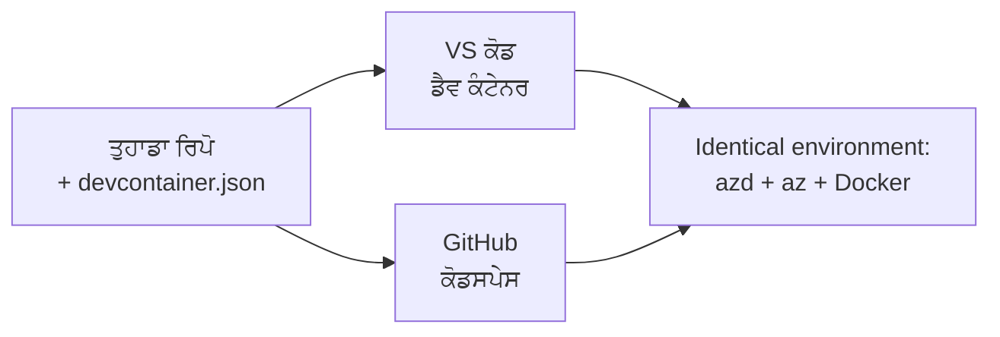

# azd ਲਈ Дев ਕੰਟੇਨਰ ਅਤੇ GitHub ਕੋਡਸਪੇਸ

**ਅਧਿਆਇ ਨੇਵੀਗੇਸ਼ਨ:**
- **📚 ਕੋਰਸ ਹੋਮ**: [AZD For Beginners](../../README.md)
- **📖 ਮੌਜੂਦਾ ਅਧਿਆਇ**: ਅਧਿਆਇ 1 - ਬੁਨਿਆਦ ਅਤੇ ਤੁਰੰਤ ਸ਼ੁਰੂਆਤ
- **⬅️ ਪਿਛਲਾ**: [ਆਪਣੀ ਐਪ ਲਿਆਓ](bring-your-own-app.md)
- **🚀 ਅਗਲਾ ਅਧਿਆਇ**: [ਅਧਿਆਇ 2: AI-ਪਹਿਲਾ ਵਿਕਾਸ](../chapter-02-ai-development/README.md)

> `azd 1.27.1` ਵਿੱੱਚ ਜੁਲਾਈ 2026 ਵਿੱਚ ਪ੍ਰਮਾਣਿਤ ਕੀਤਾ ਗਿਆ।

## ਪਰਿਚਯ

ਹਰ ਮਸ਼ੀਨ ਤੇ azd, ਸਹੀ ਭਾਸ਼ਾ ਰਨਟਾਈਮ, ਡੋਕਰ, ਅਤੇ ਐਜ਼ੂਰ CLI ਇੰਸਟਾਲ ਕਰਨਾ ਜਟਿਲ ਕੰਮ ਹੁੰਦਾ ਹੈ — ਅਤੇ ਇਹੀ ਸਭ ਤੋਂ ਵੱਡਾ ਕਾਰਨ ਹੈ ਕਿ جو ਟਿਊਟੋਰਿਅਲ "ਮੇਰੀ ਮਸ਼ੀਨ ਤੇ ਕੰਮ ਕਰਦਾ ਹੈ", ਉਹ ਕਿਸੇ ਹੋਰ ਲਈ ਫੇਲ੍ਹ ਹੋ ਜਾਂਦਾ ਹੈ। ਇੱਕ **ਡਿਵ ਕੰਟੇਨਰ** ਇਹ ਸਮੱਸਿਆ ਹੱਲ ਕਰਦਾ ਹੈ ਜੋ ਤੁਹਾਡੇ ਸਾਰੇ ਟੂਲਚੇਨ ਨੂੰ ਇੱਕ ਫਾਇਲ ਵਿਚ ਵੇਰਵਾ ਕਰਦਾ ਹੈ। ਜੋ ਵੀ ਪ੍ਰੋਜੈਕਟ ਨੂੰ VS ਕੋਡ ਜਾਂ GitHub ਕੋਡਸਪੇਸ ਵਿਚ ਖੋਲ੍ਹਦਾ ਹੈ ਉਹ ਬਿਲਕੁਲ ਇੱਕੋ ਵਰਕਿੰਗ ਇਨਵਾਇਰਨਮੈਂਟ ਵਿਚ ਹੁੰਦਾ ਹੈ, ਜਿਸ ਵਿਚ azd ਪਹਿਲਾਂ ਹੀ ਇੰਸਟਾਲ ਹੁੰਦਾ ਹੈ। ਇਹ ਪਾਠ ਤੁਹਾਨੂੰ ਦਿਖਾਏਗਾ ਕਿ ਇਹ ਕਿਵੇਂ ਜੋੜਿਆ ਜਾਂਦਾ ਹੈ।

## ਸਿੱਖਣ ਦੇ ਟੀਚੇ

ਇਸ ਪਾਠ ਦੇ ਅੰਤ ਤੇ, ਤੁਸੀਂ:
- ਸਮਝੋਂਗੇ ਕਿ ਡਿਵ ਕੰਟੇਨਰ ਕੀ ਹੈ ਅਤੇ azd ਲਈ ਇਹ ਕਿਵੇਂ ਮਦਦਗਾਰ ਹੈ
- ਕਿਸੇ ਪ੍ਰੋਜੈਕਟ ਨੂੰ ਘੱਟੋ-ਘੱਟ `.devcontainer/devcontainer.json` ਕਿਵੇਂ ਜੋੜਨਾ ਹੈ
- Dev Container *ਫੀਚਰਜ਼* ਰਾਹੀਂ azd, ਐਜ਼ੂਰ CLI, ਅਤੇ ਡੋਕਰ ਸ਼ਾਮਲ ਕਰਨਾ
- ਪ੍ਰੋਜੈਕਟ ਨੂੰ GitHub Codespaces ਜਾਂ VS ਕੋਡ ਵਿਚ ਖੋਲ੍ਹਣਾ

## ਸਿੱਖਣ ਦੇ ਨਤੀਜੇ

ਇਹ ਪਾਠ ਪੂਰਾ ਕਰਨ ਮਗਰੋਂ, ਤੁਸੀਂ ਸਮਰੱਥ ਹੋਵੋਗੇ:
- ਇੱਕ azd ਪ੍ਰੋਜੈਕਟ ਲਈ `devcontainer.json` ਲਿਖਣਾ
- ਬਿਨਾਂ ਮੈਨੂਅਲ ਇੰਸਟਾਲਾਂ ਦੇ azd ਅਤੇ ਐਜ਼ੂਰ ਟੂਲਿੰਗ ਸ਼ਾਮਲ ਕਰਨਾ
- ਕੰਟੇਨਰ ਜਾਂ ਕੋਡਸਪੇਸ ਅੰਦਰੋਂ `azd up` ਚਲਾਉਣਾ

---

## ਡਿਵ ਕੰਟੇਨਰ ਕੀ ਹੈ?

ਡਿਵ ਕੰਟੇਨਰ ਇੱਕ ਡੋਕਰ ਆਧਾਰਿਤ ਵਿਕਾਸ ਵਾਤਾਵਰਨ ਹੁੰਦਾ ਹੈ ਜੋ ਤੁਹਾਡੇ ਰਿਪੋਜ਼ਿਟਰੀ ਵਿੱਚ `.devcontainer/devcontainer.json` ਫਾਇਲ ਦੁਆਰਾ ਪਰਿਭਾਸ਼ਿਤ ਹੁੰਦਾ ਹੈ। ਜਦੋਂ ਤੁਸੀਂ ਪ੍ਰੋਜੈਕਟ ਖੋਲ੍ਹਦੇ ਹੋ:

- **VS ਕੋਡ** (Dev Containers ਐਕਸਟੈਂਸ਼ਨ ਦੇ ਨਾਲ) ਕੰਟੇਨਰ ਬਣਾਂਦਾ ਹੈ ਅਤੇ ਇਸ ਨਾਲ ਜੁੜਦਾ ਹੈ।
- **GitHub ਕੋਡਸਪੇਸ** ਇੱਕੋ ਕੰਟੇਨਰ ਕਲਾਉਡ ਵਿੱਚ ਬਣਾਂਦਾ ਹੈ ਅਤੇ ਤੁਹਾਨੂੰ ਬ੍ਰਾਊਜ਼ਰ ਅਧਾਰਿਤ ਐਡੀਟਰ ਦਿੰਦਾ ਹੈ।

ਦੋਹਾਂ ਹਾਲਤਾਂ ਵਿੱਚ, ਹਰ ਯੋਗਦਾਨਕਾਰਤਾ ਇੱਕੋ ਵਰਗੇ ਟੂਲਸ ਪ੍ਰਾਪਤ ਕਰਦਾ ਹੈ — ਕੋਈ "ਕੀ ਤੁਸੀਂ azd ਇੰਸਟਾਲ ਕੀਤਾ?" ਦੀ ਸਮੱਸਿਆ ਨਹੀਂ ਹੁੰਦੀ।



---

## ਕਦਮ 1: devcontainer ਫਾਇਲ ਬਣਾਓ

ਆਪਣੇ ਪ੍ਰੋਜੈਕਟ ਦੀ ਜੜ੍ਹ ਵਿੱਚ `.devcontainer/devcontainer.json` ਬਣਾਓ:

```json
{
  "name": "azd-project",
  "image": "mcr.microsoft.com/devcontainers/base:bookworm",
  "features": {
    "ghcr.io/devcontainers/features/azure-cli:1": {},
    "ghcr.io/azure/azure-dev/azd:latest": {},
    "ghcr.io/devcontainers/features/docker-in-docker:2": {},
    "ghcr.io/devcontainers/features/node:1": {}
  },
  "customizations": {
    "vscode": {
      "extensions": [
        "ms-azuretools.azure-dev",
        "ms-azuretools.vscode-bicep"
      ]
    }
  },
  "forwardPorts": [3000],
  "postCreateCommand": "azd version"
}
```

ਹਰ ਹਿੱਸਾ ਕੀ ਕਰਦਾ ਹੈ:

| ਕੁੰਜੀ | ਉਦੇਸ਼ |
|-----|---------|
| `image` | ਕੰਟੇਨਰ ਲਈ ਬੇਸ ਓਐਸ |
| `features` | ਪਹਿਲਾਂ ਬਨਾਏ ਗਏ ਇੰਸਟਾਲਰ — ਇੱਥੇ: ਐਜ਼ੂਰ CLI, **azd**, ਡੋਕਰ, ਅਤੇ Node.js |
| `customizations.vscode.extensions` | azd ਅਤੇ ਬਾਈਸਪ VS ਕੋਡ ਐਕਸਟੈਂਸ਼ਨ ਆਪੋ-ਆਪਣੇ ਇੰਸਟਾਲ ਕਰਦਾ ਹੈ |
| `forwardPorts` | ਤੁਹਾਡੇ ਐਪ ਦਾ ਪੋਰਟ ਬ੍ਰਾਊਜ਼ਰ ਤੱਕ ਖੋਲ੍ਹਦਾ ਹੈ |
| `postCreateCommand` | ਕੰਟੇਨਰ ਬਣਨ ਮਗਰੋਂ ਇੱਕ ਵਾਰੀ ਚਲਦਾ ਹੈ (ਇੱਥੇ, ਸਿਹਤ ਜਾਂਚ) |

> `ghcr.io/azure/azure-dev/azd:latest` ਫੀਚਰ azd ਨੂੰ ਕੰਟੇਨਰ ਵਿੱਚ ਲੈਣ ਦਾ ਅਧਿਕਾਰਕ ਤਰੀਕਾ ਹੈ। ਜੇ ਤੁਹਾਨੂੰ ਲਗਾਤਾਰਤਾ ਚਾਹੀਦੀ ਹੈ ਤਾਂ ਖ਼ਾਸ ਵਰਜਨ ਪਿੰਨ ਕਰੋ (ਜਿਵੇਂ `azd:1.27.1`)।

---

## ਕਦਮ 2: ਆਪਣੇ ਐਪ ਦੀ ਭਾਸ਼ਾ ਨਾਲ ਫੀਚਰ ਨੂੰ ਮੇਲ کھਾਓ

ਜੋ ਭਾਸ਼ਾ ਤੁਹਾਡੀ ਐਪ ਵਰਤੀ ਹੈ, ਉਸ ਲਈ `node` ਫੀਚਰ ਬਦਲੋ:

```jsonc
// Python project
"ghcr.io/devcontainers/features/python:1": {},

// .NET project
"ghcr.io/devcontainers/features/dotnet:2": {},

// Java project
"ghcr.io/devcontainers/features/java:1": {},

// Go project
"ghcr.io/devcontainers/features/go:1": {}
```

ਜੇ ਤੁਹਾਡਾ `host` `containerapp`, `aks` ਜਾਂ ਕੋਈ ਹੋਰ ਕੰਟੇਨਰ ਇਮੇਜ ਬਣਾਉਣ ਵਾਲਾ ਹੈ ਤਾਂ `docker-in-docker` ਰੱਖੋ — azd ਨੂੰ ਇਮੇਜਾਂ ਬਣਾਉਣ ਅਤੇ ਧੱਕਣ ਲਈ ਡੋਕਰ ਦੀ ਲੋੜ ਹੁੰਦੀ ਹੈ।

---

## ਕਦਮ 3: ਇਸਨੂੰ ਖੋਲ੍ਹੋ

**VS ਕੋਡ ਵਿੱਚ:**
1. **Dev Containers** ਐਕਸਟੈਂਸ਼ਨ ਇੰਸਟਾਲ ਕਰੋ।
2. ਪ੍ਰੋਜੈਕਟ ਫੋਲਡਰ ਖੋਲ੍ਹੋ।
3. ਜਦੋਂ ਪੁੱਛਿਆ ਜਾਵੇ ਤਾਂ **Reopen in Container** 'ਤੇ ਕਲਿੱਕ ਕਰੋ (ਜਾਂ *Dev Containers: Reopen in Container* ਚਲਾਓ)।

**GitHub ਕੋਡਸਪੇਸ ਵਿੱਚ:**
1. ਰਿਪੋ ਨੂੰ GitHub 'ਤੇ ਪੁਸ਼ ਕਰੋ।
2. **Code → Codespaces → Create codespace on main** 'ਤੇ ਕਲਿੱਕ ਕਰੋ।
3. ਕੰਟੇਨਰ ਬਣਨ ਦਾ ਇੰਤਜ਼ਾਰ ਕਰੋ—azd ਟਰਮੀਨਲ ਵਿੱਚ ਤਿਆਰ ਹੈ।

---

## ਕਦਮ 4: ਕੰਟੇਨਰ ਅੰਦਰੋਂ ਡਿਪਲੋਇ ਕਰੋ

ਕੰਟੇਨਰ ਵਿੱਚ azd ਪਹਿਲਾਂ ਤੋਂ ਇਂਸਟਾਲ ਹੁੰਦਾ ਹੈ, ਇਸ ਲਈ ਨਾਰਮਲ ਵਰਕਫਲੋ ਚੱਲਦਾ ਹੈ:

```bash
azd auth login --use-device-code   # ਕੋਡਸਪੇਸ ਵਿੱਚ ਡਿਵਾਈਸ ਕੋਡ ਸਹੂਲਤ ਵਾਲਾ ਹੈ
azd up
```

> **`--use-device-code` ਕਿਉਂ?** ਰਿਮੋਟ ਕੰਟੇਨਰ ਜਾਂ ਕੋਡਸਪੇਸ ਵਿੱਚ ਕੋਈ ਲੋਕਲ ਬ੍ਰਾਊਜ਼ਰ ਨਹੀਂ ਹੁੰਦਾ Redirect ਕਰਨ ਲਈ, ਇਸ ਲਈ ਡਿਵਾਈਸ-ਕੋਡ ਲੌਗਿਨ ਸਥਿਰ ਰਾਹ ਹੈ। ਤੁਸੀਂ ਸਾਈਨ-ਇਨ ਨੂੰ ਪੂਰਾ ਕਰਨ ਲਈ ਬ੍ਰਾਊਜ਼ਰ ਟੈਬ 'ਤੇ ਕੋਡ ਚਿਪਕਾਉਣੇ ਹੋਵੋਗੇ।

---

## ਸਧਾਰਣ ਗਲਤੀਆਂ

| ਗਲਤੀ | ਹੱਲ |
|---------|-----|
| `azd up` ਇਮੇਜ ਬਣਾਉਂਦਾ ਨਹੀਂ | `docker-in-docker` ਫੀਚਰ ਸ਼ਾਮਲ ਕਰੋ |
| ਕੋਡਸਪੇਸ ਵਿੱਚ ਬ੍ਰਾਊਜ਼ਰ ਲੌਗਿਨ ਟਿਕਿਆ ਹੋਇਆ | `azd auth login --use-device-code` ਵਰਤੋਂ |
| ਟੀਮ ਮੈਂਬਰਾਂ ਵਿਚ ਟੂਲਸ ਫਰਕ | ਫੀਚਰ ਵਰਜਨ ਪਿੰਨ ਕਰੋ (ਜਿਵੇਂ `azd:1.27.1`) |
| ਐਪ ਬ੍ਰਾਊਜ਼ਰ ਵਿੱਚ ਪਹੁੰਚਯੋਗ ਨਹੀਂ | `forwardPorts` ਵਿੱਚ ਪੋਰਟ ਜੋੜੋ |

---

## ਸਰਮਾਇ ਸੰਗ੍ਰਹਿ

- ਇੱਕ ਡਿਵ ਕੰਟੇਨਰ ਤੁਹਾਡੇ azd ਟੂਲਚੇਨ ਨੂੰ ਸਭ ਲਈ ਦੁਹਰਾਯੋਗ ਬਣਾਉਂਦਾ ਹੈ।
- Dev Container *ਫੀਚਰਜ਼* ਰਾਹੀਂ azd, ਐਜ਼ੂਰ CLI, ਅਤੇ ਡੋਕਰ ਸ਼ਾਮਲ ਕਰੋ।
- ਆਪਣੀ ਐਪ ਦੀ ਭਾਸ਼ਾ ਨਾਲ ਫੀਚਰ ਮੇਲ ਕਰੋ ਅਤੇ ਕੰਟੇਨਰ ਹੋਸਟਾਂ ਲਈ `docker-in-docker` ਰੱਖੋ।
- ਕੋਡਸਪੇਸ ਵਿੱਚ ਚਲਾਉਂਦੇ ਸਮੇਂ ਡਿਵਾਈਸ-ਕੋਡ ਲੌਗਿਨ ਵਰਤੋਂ।

---

## 🔗 ਨੇਵੀਗੇਸ਼ਨ

| ਦਿਸ਼ਾ | ਸਰੋਤ |
|-----------|----------|
| **ਪਿਛਲਾ** | [ਆਪਣੀ ਐਪ ਲਿਆਓ](bring-your-own-app.md) |
| **ਅਧਿਆਇ ਹੋਮ** | [ਅਧਿਆਇ 1: ਬੁਨਿਆਦ ਅਤੇ ਤੁਰੰਤ ਸ਼ੁੁਰੂਆਤ](README.md) |
| **ਅਗਲਾ ਅਧਿਆਇ** | [ਅਧਿਆਇ 2: AI-ਪਹਿਲਾ ਵਿਕਾਸ](../chapter-02-ai-development/README.md) |

## 📖 ਸੰਬੰਧਿਤ ਸਰੋਤ

- [ਇੰਸਟਾਲੇਸ਼ਨ ਅਤੇ ਸੈਟਅਪ](installation.md)
- [ਕਮਾਂਡ ਚੀਟਸ਼ੀਟ](../../resources/cheat-sheet.md)
- [ਅਧਿਕਾਰਿਕ Dev Containers ਵਿਸ਼ੇਸ਼ਤਾ](https://containers.dev/)
- [azd Dev Container ਫੀਚਰ](https://github.com/Azure/azure-dev/tree/main/ext/devcontainer)

---

<!-- CO-OP TRANSLATOR DISCLAIMER START -->
**ਅਸਵੀਕਾਰੋਪਣ**:
ਇਸ ਦਸਤਾਵੇਜ਼ ਦਾ ਅਨੁਵਾਦ ਏਆਈ ਅਨੁਵਾਦ ਸੇਵਾ [Co-op Translator](https://github.com/Azure/co-op-translator) ਦੀ ਵਰਤੋਂ ਕਰਕੇ ਕੀਤਾ ਗਿਆ ਹੈ। ਜਦੋਂ ਕਿ ਅਸੀਂ ਸਹੀਤਾਵਾਂ ਲਈ ਯਤਨਸ਼ੀਲ ਹਾਂ, ਕਿਰਪਾ ਕਰਕੇ ਧਿਆਨ ਰੱਖੋ ਕਿ ਸਵੈਚਾਲਿਤ ਅਨੁਵਾਦਾਂ ਵਿੱਚ ਗਲਤੀਆਂ ਜਾਂ ਅਸਮੱਤਿਆਵਾਂ ਹੋ ਸਕਦੀਆਂ ਹਨ। ਮੂਲ ਦਸਤਾਵੇਜ਼ ਆਪਣੀ ਮੂਲ ਭਾਸ਼ਾ ਵਿੱਚ ਅਧਿਕਾਰਕ ਸਰੋਤ ਮੰਨਿਆ ਜਾਣਾ ਚਾਹੀਦਾ ਹੈ। ਜਰੂਰੀ ਜਾਣਕਾਰੀ ਲਈ, ਪੇਸ਼ੇਵਰ ਮਨੁੱਖੀ ਅਨੁਵਾਦ ਦੀ ਸਿਫ਼ਾਰਸ਼ ਕੀਤੀ ਜਾਂਦੀ ਹੈ। ਅਸੀਂ ਇਸ ਅਨੁਵਾਦ ਦੇ ਉਪਯੋਗ ਤੋਂ ਪੈਦਾ ਹੋਣ ਵਾਲੀਆਂ ਕਿਸੇ ਵੀ ਗਲਤਫਹਿਮੀਆਂ ਜਾਂ ਗਲਤ ਵਿਆਖਿਆਵਾਂ ਲਈ ਜਵਾਬਦੇਹ ਨਹੀਂ ਹਾਂ।
<!-- CO-OP TRANSLATOR DISCLAIMER END -->