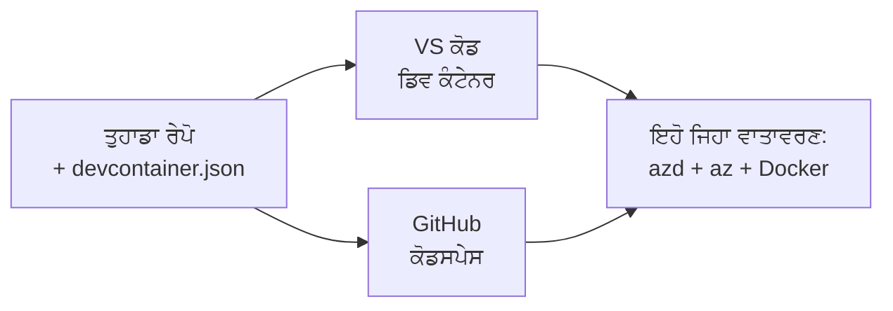

# Dev Containers & GitHub Codespaces ਲਈ azd

**Chapter Navigation:**
- **📚 Course Home**: [AZD ਬੇਗਿਨਰਾਂ ਲਈ](../../README.md)
- **📖 Current Chapter**: Chapter 1 - Foundation & Quick Start
- **⬅️ Previous**: [Bring Your Own App](bring-your-own-app.md)
- **🚀 Next Chapter**: [Chapter 2: AI-First Development](../chapter-02-ai-development/README.md)

> Validated against `azd 1.25.6` in June 2026.

## ਪਰਿਚਯ

ਹਰ ਮਸ਼ੀਨ 'ਤੇ azd, ਸਹੀ ਭਾਸ਼ਾ ਰਨਟਾਈਮ, Docker, ਅਤੇ Azure CLI ਇੰਸਟਾਲ ਕਰਨਾ ਝੰਝਟਭਰਾ ਕੰਮ ਹੈ—ਅਤੇ ਇਹ ਸਭ ਤੋਂ ਵੱਡੀ ਕਾਰਨ ਹੈ ਕਿ "ਮੇਰੀ ਮਸ਼ੀਨ ਤੇ ਚੱਲਦਾ ਹੈ" ਵਾਲਾ ਟਿਊਟੋਰਿਅਲ ਕਿਸੇ ਹੋਰ ਲਈ ਫੇਲ ਹੋ ਜਾਂਦਾ ਹੈ। ਇੱਕ **dev container** ਇਸ ਨੂੰ ਇੱਕ ਫਾਇਲ ਵਿੱਚ ਤੁਹਾਡੇ ਪੂਰੇ ਟੂਲਚੇਨ ਨੂੰ ਵਰਣਨ ਕਰਕੇ ਸੁਲਝਾਉਂਦਾ ਹੈ। ਜੋ ਕੋਈ ਵੀ ਪ੍ਰਾਜੈਕਟ ਨੂੰ VS Code ਜਾਂ GitHub Codespaces ਵਿੱਚ ਖੋਲ੍ਹਦਾ ਹੈ, ਉਹੀ ਇੱਕੋ ਜਿਹਾ ਮਾਹੌਲ ਪਾਉਂਦਾ ਹੈ, ਜਿਸ ਵਿੱਚ azd ਪਹਿਲਾਂ ਹੀ ਇੰਸਟਾਲ ਹੁੰਦਾ ਹੈ। ਇਹ ਪਾਠ ਤੁਹਾਨੂੰ ਦਿਖਾਉਂਦਾ ਹੈ ਕਿ ਇਕੋ ਨੂੰ ਕਿਵੇਂ ਜੋੜਨਾ ਹੈ।

## ਸਿੱਖਣ ਦੇ ਲਕੜੀ ਟੀਚੇ

ਇਸ ਪਾਠ ਦੇ ਅੰਤ ਤੱਕ, ਤੁਸੀਂ:
- ਸਮਝ ਪਾੋਂਗੇ ਕਿ dev container ਕੀ ਹੈ ਅਤੇ azd ਲਈ ਇਹ ਕਿਵੇਂ ਮਦਦ ਕਰਦਾ ਹੈ
- ਇੱਕ ਨਿਊਨਤਮ `.devcontainer/devcontainer.json` ਫਾਇਲ ਪ੍ਰਾਜੈਕਟ ਵਿੱਚ ਸ਼ਾਮِل ਕਰਨਗੇ
- Dev Container *features* ਰਾਹੀਂ azd, Azure CLI, ਅਤੇ Docker ਸ਼ਾਮِل ਕਰਨਗੇ
- ਪ੍ਰਾਜੈਕਟ ਨੂੰ GitHub Codespaces ਜਾਂ VS Code ਵਿੱਚ ਖੋਲ੍ਹਣਗੇ

## ਸਿੱਖਣ ਦੇ ਨਤੀਜੇ

ਇਸ ਪਾਠ ਨੂੰ ਪੂਰਾ ਕਰਨ ਤੋਂ ਬਾਅਦ, ਤੁਸੀਂ ਸਮਰੱਥ ਹੋਵੋਗੇ:
- azd ਪ੍ਰਾਜੈਕਟ ਲਈ `devcontainer.json` ਲਿਖਣ
- ਮੈਨੂਅਲ ਇੰਸਟਾਲਾਂ ਦੇ ਬਗੈਰ azd ਅਤੇ Azure ਟੂਲਿੰਗ ਸ਼ਾਮِل ਕਰਨ
- ਕੰਟੇਨਰ ਜਾਂ Codespace ਦੇ ਅੰਦਰੋਂ `azd up` ਚਲਾਉਣ

---

## Dev Container ਕੀ ਹੈ?

Dev container ਇੱਕ Docker-ਅਧਾਰਿਤ ਡਿਵੈਲਪਮੈਂਟ ਮਾਹੌਲ ਹੈ ਜੋ ਤੁਹਾਡੇ ਰਿਪੋਜ਼ਟਰੀ ਵਿੱਚ `.devcontainer/devcontainer.json` ਫਾਇਲ ਦੁਆਰਾ ਪਰਿਭਾਸ਼ਿਤ ਕੀਤਾ ਜਾਂਦਾ ਹੈ। ਜਦੋਂ ਤੁਸੀਂ ਪ੍ਰਾਜੈਕਟ ਖੋਲ੍ਹਦੇ ਹੋ:

- **VS Code** (Dev Containers ਐਕਸਟੈਂਸ਼ਨ ਨਾਲ) ਕਾਂਟੇਨਰ ਬਿਲਡ ਕਰਦਾ ਹੈ ਅਤੇ ਉਸ ਨਾਲ ਜੁੜਦਾ ਹੈ।
- **GitHub Codespaces** ਕਲਾਉਡ ਵਿੱਚ ਉਹੀ ਕਾਂਟੇਨਰ ਬਿਲਡ ਕਰਦਾ ਹੈ ਅਤੇ ਤੁਹਾਨੂੰ ਬ੍ਰਾਉਜ਼ਰ-ਆਧਾਰਿਤ ਐਡੀਟਰ ਦਿੰਦਾ ਹੈ।

ਕਿਸੇ ਵੀ ਤਰ੍ਹਾਂ, ਹਰ ਯੋਗਦਾਨਕਾਰਤਾ ਨੂੰ ਇੱਕੋ ਜਿਹੇ ਟੂਲ ਮਿਲਦੇ ਹਨ—ਕੋਈ "ਕੀ ਤੁਸੀਂ azd ਇੰਸਟਾਲ ਕੀਤਾ?" ਵਾਲੀ ਟ੍ਰਬਲਸ਼ੂਟਿੰਗ ਨਹੀਂ।



---

## ਕਦਮ 1: devcontainer ਫਾਇਲ ਬਣਾਓ

ਤੁਹਾਡੇ ਪ੍ਰਾਜੈਕਟ ਦੇ ਰੂਟ ਵਿੱਚ `.devcontainer/devcontainer.json` ਬਣਾਓ:

```json
{
  "name": "azd-project",
  "image": "mcr.microsoft.com/devcontainers/base:bookworm",
  "features": {
    "ghcr.io/devcontainers/features/azure-cli:1": {},
    "ghcr.io/azure/azure-dev/azd:latest": {},
    "ghcr.io/devcontainers/features/docker-in-docker:2": {},
    "ghcr.io/devcontainers/features/node:1": {}
  },
  "customizations": {
    "vscode": {
      "extensions": [
        "ms-azuretools.azure-dev",
        "ms-azuretools.vscode-bicep"
      ]
    }
  },
  "forwardPorts": [3000],
  "postCreateCommand": "azd version"
}
```

ਹਰ ਹਿੱਸਾ ਕੀ ਕਰਦਾ ਹੈ:

| Key | Purpose |
|-----|---------|
| `image` | The base OS for the container |
| `features` | Prebuilt installers—here: Azure CLI, **azd**, Docker, and Node.js |
| `customizations.vscode.extensions` | Auto-installs the azd and Bicep VS Code extensions |
| `forwardPorts` | Exposes your app's port to your browser |
| `postCreateCommand` | Runs once after the container is built (here, a sanity check) |

> The `ghcr.io/azure/azure-dev/azd:latest` feature is the official way to get azd in a container. Pin a specific version (for example `azd:1.25.6`) if you need reproducibility.

---

## ਕਦਮ 2: ਫੀਚਰ ਨੂੰ ਆਪਣੇ ਐਪ ਦੀ ਭਾਸ਼ਾ ਨਾਲ ਮਿਲਾਓ

ਆਪਣੇ ਐਪ ਜੋ ਵਰਤਦਾ ਹੈ ਉਸ ਦੇ ਮੁਤਾਬਕ `node` ਫੀਚਰ ਨੂੰ ਬਦਲੋ:

```jsonc
// Python project
"ghcr.io/devcontainers/features/python:1": {},

// .NET project
"ghcr.io/devcontainers/features/dotnet:2": {},

// Java project
"ghcr.io/devcontainers/features/java:1": {},

// Go project
"ghcr.io/devcontainers/features/go:1": {}
```

ਜੇ ਤੁਹਾਡਾ `host` `containerapp`, `aks`, ਜਾਂ ਕੋਈ ਐਸਾ ਹੈ ਜੋ ਇੱਕ ਕੰਟੇਨਰ ਇਮੇਜ ਬਿਲਡ ਕਰਦਾ ਹੈ ਤਾਂ `docker-in-docker` ਰੱਖੋ—azd ਨੂੰ ਇਮੇਜ ਬਿਲਡ ਅਤੇ ਪੁਸ਼ ਕਰਨ ਲਈ Docker ਦੀ ਲੋੜ ਹੁੰਦੀ ਹੈ।

---

## ਕਦਮ 3: ਇਸ ਨੂੰ ਖੋਲ੍ਹੋ

**VS Code ਵਿੱਚ:**
1. **Dev Containers** ਐਕਸਟੈਂਸ਼ਨ ਇੰਸਟਾਲ ਕਰੋ।
2. ਪ੍ਰਾਜੈਕਟ ਫੋਲਡਰ ਖੋਲ੍ਹੋ।
3. ਜਦੋਂ ਪ੍ਰਾਂਪਟ ਆਵੇ ਤਾਂ **Reopen in Container** 'ਤੇ ਕਲਿੱਕ ਕਰੋ (ਜਾਂ *Dev Containers: Reopen in Container* ਚਲਾਓ)।

**GitHub Codespaces ਵਿੱਚ:**
1. ਰਿਪੋ ਨੂੰ GitHub 'ਤੇ ਪੁਸ਼ ਕਰੋ।
2. **Code → Codespaces → Create codespace on main** 'ਤੇ ਕਲਿੱਕ ਕਰੋ।
3. ਕਾਂਟੇਨਰ ਦੇ ਬਣਨ ਦੀ ਉਡੀਕ ਕਰੋ—ਟਰਮੀਨਲ ਵਿੱਚ azd ਤਿਆਰ ਹੋਵੇਗਾ।

---

## ਕਦਮ 4: ਕੰਟੇਨਰ ਦੇ ਅੰਦਰੋਂ ਡਿਪਲੌਇ ਕਰੋ

ਕਾਂਟੇਨਰ ਵਿੱਚ azd ਪਹਿਲਾਂ ਤੋਂ ਇੰਸਟਾਲ ਹੁੰਦਾ ਹੈ, ਇਸ ਲਈ ਮਾਮੂਲੀ workflow ਵਰਕ ਕਰਦੀ ਹੈ:

```bash
azd auth login --use-device-code   # Codespaces ਦੇ ਅੰਦਰ ਡਿਵਾਈਸ ਕੋਡ ਸਹੂਲਤਜਨਕ ਹੈ
azd up
```

> **ਕਿਉਂ `--use-device-code`?** ਇੱਕ ਰਿਮੋਟ ਕਾਂਟੇਨਰ ਜਾਂ Codespace ਵਿੱਚ ਕੋਈ ਲੋਕਲ ਬ੍ਰਾਊਜ਼ਰ ਨਹੀਂ ਹੁੰਦਾ ਜਿਸ 'ਤੇ ਰੀਡਾਇਰੈਕਟ ਕੀਤਾ ਜਾ ਸਕੇ, ਇਸ ਲਈ ਡਿਵਾਈਸ-ਕੋਡ ਲਾਗਿਨ ਭਰੋਸੇਯੋਗ ਰਾਹ ਹੈ। ਤੁਸੀਂ ਸਾਈਨ-ਇਨ ਪੂਰਾ ਕਰਨ ਲਈ ਬ੍ਰਾਊਜ਼ਰ ਟੈਬ ਵਿੱਚ ਇੱਕ ਕੋਡ ਪੇਸਟ ਕਰੋਗੇ।

---

## ਆਮ ਗਲਤੀਆਂ

| Pitfall | Fix |
|---------|-----|
| `azd up` can't build an image | Add the `docker-in-docker` feature |
| Browser login hangs in Codespaces | Use `azd auth login --use-device-code` |
| Tools differ between teammates | Pin feature versions (e.g. `azd:1.25.6`) |
| App not reachable in browser | Add the port to `forwardPorts` |

---

## ਸੰਖੇਪ

- ਇੱਕ dev container ਤੁਹਾਡੇ azd ਟੂਲਚੇਨ ਨੂੰ ਹਰ ਕਿਸੇ ਲਈ ਦੁਹਰਾਯੋਗ ਬਣਾਉਂਦਾ ਹੈ।
- Dev Container *features* ਰਾਹੀਂ azd, Azure CLI, ਅਤੇ Docker ਸ਼ਾਮِل ਕਰੋ।
- ਆਪਣੀ ਐਪ ਨਾਲ ਭਾਸ਼ਾ ਫੀਚਰ ਮੈਚ ਕਰੋ ਅਤੇ container hosts ਲਈ `docker-in-docker` ਰੱਖੋ।
- Codespaces ਦੇ ਅੰਦਰ ਚਲਾਉਂਦੇ ਸਮੇਂ ਡਿਵਾਈਸ-ਕੋਡ ਲੋਗਿਨ ਵਰਤੋ।

---

## 🔗 Navigation

| Direction | Resource |
|-----------|----------|
| **Previous** | [Bring Your Own App](bring-your-own-app.md) |
| **Chapter Home** | [Chapter 1: Foundation & Quick Start](README.md) |
| **Next Chapter** | [Chapter 2: AI-First Development](../chapter-02-ai-development/README.md) |

## 📖 ਸੰਬੰਧਤ ਸਰੋਤ

- [Installation & Setup](installation.md)
- [Command Cheat Sheet](../../resources/cheat-sheet.md)
- [Official Dev Containers specification](https://containers.dev/)
- [azd Dev Container feature](https://github.com/Azure/azure-dev/tree/main/ext/devcontainer)

---

<!-- CO-OP TRANSLATOR DISCLAIMER START -->
**ਅਸਵੀਕਾਰੋਪਣ**:
ਇਸ ਦਸਤਾਵੇਜ਼ ਦਾ ਅਨੁਵਾਦ ਏਆਈ ਅਨੁਵਾਦ ਸੇਵਾ [Co-op Translator](https://github.com/Azure/co-op-translator) ਦੀ ਵਰਤੋਂ ਕਰਕੇ ਕੀਤਾ ਗਿਆ ਹੈ। ਜਦੋਂ ਕਿ ਅਸੀਂ ਸਹੀਤਾਵਾਂ ਲਈ ਯਤਨਸ਼ੀਲ ਹਾਂ, ਕਿਰਪਾ ਕਰਕੇ ਧਿਆਨ ਰੱਖੋ ਕਿ ਸਵੈਚਾਲਿਤ ਅਨੁਵਾਦਾਂ ਵਿੱਚ ਗਲਤੀਆਂ ਜਾਂ ਅਸਮੱਤਿਆਵਾਂ ਹੋ ਸਕਦੀਆਂ ਹਨ। ਮੂਲ ਦਸਤਾਵੇਜ਼ ਆਪਣੀ ਮੂਲ ਭਾਸ਼ਾ ਵਿੱਚ ਅਧਿਕਾਰਕ ਸਰੋਤ ਮੰਨਿਆ ਜਾਣਾ ਚਾਹੀਦਾ ਹੈ। ਜਰੂਰੀ ਜਾਣਕਾਰੀ ਲਈ, ਪੇਸ਼ੇਵਰ ਮਨੁੱਖੀ ਅਨੁਵਾਦ ਦੀ ਸਿਫ਼ਾਰਸ਼ ਕੀਤੀ ਜਾਂਦੀ ਹੈ। ਅਸੀਂ ਇਸ ਅਨੁਵਾਦ ਦੇ ਉਪਯੋਗ ਤੋਂ ਪੈਦਾ ਹੋਣ ਵਾਲੀਆਂ ਕਿਸੇ ਵੀ ਗਲਤਫਹਿਮੀਆਂ ਜਾਂ ਗਲਤ ਵਿਆਖਿਆਵਾਂ ਲਈ ਜਵਾਬਦੇਹ ਨਹੀਂ ਹਾਂ।
<!-- CO-OP TRANSLATOR DISCLAIMER END -->