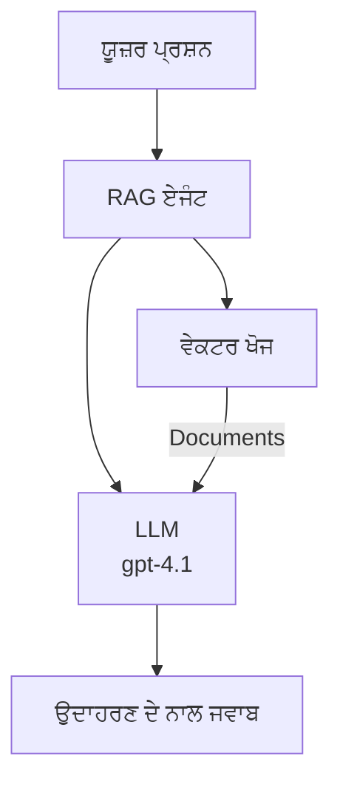
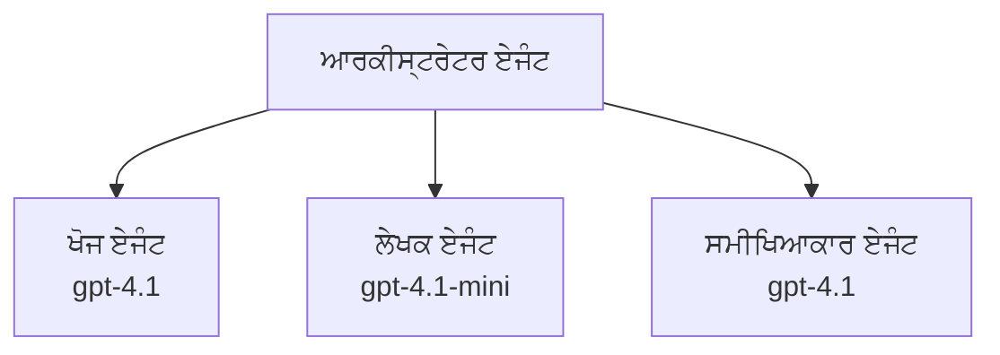

# AI ਏਜੰਟਸ ਅਜ਼ੂਰ ਡਿਵੈਲਪਰ CLI ਨਾਲ

**ਅਧਿਆਇ ਨੈਵੀਗੇਸ਼ਨ:**
- **📚 ਕੋਰਸ ਹੋਮ**: [AZD ਬਿਲਕੁਲ ਸ਼ੁਰੂਆਤੀ ਲਈ](../../README.md)
- **📖 ਮੌਜੂਦਾ ਅਧਿਆਇ**: ਅਧਿਆਇ 2 - AI-ਪਹਿਲਾ ਵਿਕਾਸ
- **⬅️ ਪਿਛਲਾ**: [ਮਾਇਕ੍ਰੋਸੌਫਟ ਫਾਉਂਡਰੀ ਇੰਟਿਗ੍ਰੇਸ਼ਨ](microsoft-foundry-integration.md)
- **➡️ ਅਗਲਾ**: [AI ਮਾਡਲ ਡਿਪਲੌਯਮੈਂਟ](ai-model-deployment.md)
- **🚀 ਉੱਨਤ**: [ਬਹੁ-ਏਜੰਟ ਹੱਲ](../../examples/retail-scenario.md)

---

## ਜਾਣ ਪਛਾਣ

AI ਏਜੰਟ ਆਪਣੇ ਆਲੇ-ਦੁਆਲੇ ਦੇ ਮਾਹੌਲ ਨੂੰ ਮਹਿਸੂਸ ਕਰ ਸਕਦੇ ਹਨ, ਫੈਸਲੇ ਲੈ ਸਕਦੇ ਹਨ ਅਤੇ ਵਿਸ਼ੇਸ਼ ਲਕੜੇ ਹਾਸਲ ਕਰਨ ਲਈ ਕਦਮ ਚੁੱਕ ਸਕਦੇ ਹਨ। ਸਧਾਰਣ ਚੈਟਬੋਟਾਂ ਤੋਂ ਵੱਖਰਾ, ਜੋ ਪਰੰਪਰਾ ਦੀ ਜਵਾਬ ਦੇਣਗੇ, ਏਜੰਟ:

- **ਉਪਕਰਣ ਵਰਤਦੇ ਹਨ** - APIs ਕਾਲ ਕਰਦੇ ਹਨ, ਡਾਟਾਬੇਸ ਖੋਜਦੇ ਹਨ, ਕੋਡ ਚਲਾਉਂਦੇ ਹਨ
- **ਯੋਜਨਾ ਅਤੇ ਵਿਚਾਰ ਕਰਦੇ ਹਨ** - ਜਟਿਲ ਕੰਮਾਂ ਨੂੰ ਕਦਮਾਂ ਵਿੱਚ ਤੋੜਦੇ ਹਨ
- **ਸੰਦਰਭ ਤੋਂ ਸਿੱਖਦੇ ਹਨ** - ਯਾਦਦਾਸ਼ਤ ਰੱਖਦੇ ਹਨ ਅਤੇ ਵਿਤਰਣ ਵਿੱਚ ਫ਼ਰਕ ਲਿਆਉਂਦੇ ਹਨ
- **ਸਹਿਯੋਗ ਕਰਦੇ ਹਨ** - ਹੋਰ ਏਜੰਟਾਂ ਨਾਲ ਮਿਲ ਕੇ ਕੰਮ ਕਰਦੇ ਹਨ (ਬਹੁ-ਏਜੰਟ ਸਿਸਟਮ)

ਇਹ ਗਾਈਡ ਤੁਹਾਨੂੰ ਦਿਖਾਉਂਦਾ ਹੈ ਕਿ ਅਜ਼ੂਰ ਤੇ AI ਏਜੰਟ ਕਿਸ ਤਰ੍ਹਾਂ ਤਿਆਰ ਕਰਨ ਲਈ ਅਜ਼ੂਰ ਡਿਵੈਲਪਰ CLI (azd) ਵਰਤੇ ਜਾਂਦੇ ਹਨ।

> **ਵੈਰੀਫਿਕੇਸ਼ਨ ਨੋਟ (2026-07-13):** ਇਹ ਗਾਈਡ `azd` `1.27.1` ਅਤੇ `azure.ai.agents` `1.0.0-beta.5` ਖਿਲਾਫ ਜਾਂਚਿਆ ਗਿਆ ਸੀ। `azd ai` ਅਨੁਭਵ ਅਜੇ ਵੀ ਪ੍ਰੀਵਿਊ-ਅਧਾਰਿਤ ਹੈ, ਇਸ ਲਈ ਜੇ ਤੁਹਾਡੇ ਇੰਸਟਾਲ ਕੀਤੇ ਫਲੈਗ ਵੱਖਰੇ ਹਨ ਤਾਂ ਐਕਸਟੈਂਸ਼ਨ ਮਦਦ ਵੇਖੋ।

## ਸਿੱਖਣ ਦੇ ਲਕੜੇ

ਇਸ ਗਾਈਡ ਨੂੰ ਪੂਰਾ ਕਰਕੇ, ਤੁਸੀਂ:
- ਜਾਣੋਗੇ ਕਿ AI ਏਜੰਟ ਕੀ ਹਨ ਅਤੇ ਉਹਨਾਂ ਦਾ ਚੈਟਬੋਟਾਂ ਨਾਲ ਕੀ ਅੰਤਰ ਹੈ
- AZD ਵਰਤ ਕੇ ਪਹਿਲਾਂ ਤਿਆਰ ਕੀਤੇ AI ਏਜੰਟ ਟੈਮਪਲੇਟ ਡਿਪਲੌਏ ਕਰਨਾ ਸਿੱਖੋ
- ਕਸਟਮ ਏਜੰਟਾਂ ਲਈ ਫਾਉਂਡਰੀ ਏਜੰਟ ਸੰਰਚਨਾ ਕਰਨਾ ਸਿੱਖੋ
- ਮੂਲ ਏਜੰਟ ਪੈਟਰਨਸ ਨੂੰ ਲਾਗੂ ਕਰੋ (ਉਪਕਰਣ ਵਰਤੋਂ, RAG, ਬਹੁ-ਏਜੰਟ)
- ਡਿਪਲੌਏ ਕੀਤੇ ਏਜੰਟਾਂ ਦੀ ਨਿਗਰਾਨੀ ਅਤੇ ਡਿਬੱਗਿੰਗ ਕਰੋ

## ਸਿੱਖਣ ਦੇ ਨਤੀਜੇ

ਪੂਰਾ ਕਰਨ ਉੱਤੇ, ਤੁਸੀਂ ਕਰ ਸਕੋਗੇ:
- ਇੱਕ ਕਮਾਂਡ ਨਾਲ AI ਏਜੰਟ ਐਪਲੀਕੇਸ਼ਨ ਨੂੰ ਅਜ਼ੂਰ ਤੇ ਡਿਪਲੌਏ ਕਰੋ
- ਏਜੰਟ ਦੇ ਉਪਕਰਣ ਅਤੇ ਸਮਰੱਥਤਾਵਾਂ ਨੂੰ ਸੰਰਚਿਤ ਕਰੋ
- ਏਜੰਟਾਂ ਨਾਲ ਰੀਟਰੀਵਲ-ਓਗਮੈਂਟੇਡ ਜਨਰੇਸ਼ਨ (RAG) ਲਾਗੂ ਕਰੋ
- ਜਟਿਲ ਕੰਮਾਂ ਲਈ ਬਹੁ-ਏਜੰਟ ਆਰਕੀਟੈਕਚਰ ਡਿਜ਼ਾਈਨ ਕਰੋ
- ਆਮ ਏਜੰਟ ਡਿਪਲੌਯਮੈਂਟ ਸਮੱਸਿਆਵਾਂ ਦਾ ਹੱਲ ਕਰੋ

---

## 🤖 ਏਜੰਟ ਇਕ ਚੈਟਬੋਟ ਤੋਂ ਕਿਵੇਂ ਵੱਖਰਾ ਹੈ?

| ਫੀਚਰ | ਚੈਟਬੋਟ | AI ਏਜੰਟ |
|---------|---------|----------|
| **ਵਿਵਹਾਰ** | ਪ੍ਰੰਪਟ ਦਾ ਜਵਾਬ ਦਿੰਦਾ ਹੈ | ਸੁਤੰਤਰ ਕਾਰਵਾਈ ਕਰਦਾ ਹੈ |
| **ਉਪਕਰਣ** | ਕੋਈ ਨਹੀਂ | APIs ਕਾਲ ਕਰ ਸਕਦਾ ਹੈ, ਖੋਜ ਅਤੇ ਕੋਡ ਚਲਾ ਸਕਦਾ ਹੈ |
| **ਯਾਦਦਾਸ਼ਤ** | ਸੈਸ਼ਨ ਆਧਾਰਿਤ ਸਿਰਫ਼ | ਸੈਸ਼ਨਾਂ ਵਿਚ ਲਗਾਤਾਰ ਯਾਦਦਾਸ਼ਤ |
| **ਯੋਜਨਾ** | ਇਕੱਲਾ ਜਵਾਬ | ਕਈ ਕਦਮਾਂ ਤੇ ਵਿਚਾਰ |
| **ਸਹਿਯੋਗ** | ਇਕ ਇਕਾਈ | ਹੋਰ ਏਜੰਟਾਂ ਨਾਲ ਕੰਮ ਕਰ ਸਕਦਾ ਹੈ |

### ਸਧਾਰਣ ਤੁਲਨਾ

- **ਚੈਟਬੋਟ** = ਸੂਚਨਾ ਡੈਸਕ ਤੇ ਸਵਾਲਾਂ ਦਾ ਮਦਦਗਾਰ ਜਵਾਬਦੇਹ
- **AI ਏਜੰਟ** = ਇੱਕ ਨਿੱਜੀ ਸਹਾਇਕ ਜੋ ਕਾਲ ਕਰਦਾ ਹੈ, ملاقاتਾਂ ਬੁੱਕ ਕਰਦਾ ਹੈ ਅਤੇ ਤੁਹਾਡੇ ਲਈ ਕੰਮ ਪੂਰੇ ਕਰਦਾ ਹੈ

---

## 🚀 ਤੇਜ਼ ਸ਼ੁਰੂਆਤ: ਆਪਣਾ ਪਹਿਲਾ ਏਜੰਟ ਡਿਪਲੌਏ ਕਰੋ

### ਵਿਕਲਪ 1: ਫਾਉਂਡਰੀ ਏਜੰਟਸ ਟੈਮਪਲੇਟ (ਸਿਫ਼ਾਰਸੀ)

```bash
# AI ਏਜੰਟਾਂ ਟੈంపਲੇਟ ਦੀ ਸ਼ੁਰੂਆਤ ਕਰੋ
azd init --template get-started-with-ai-agents

# ਏਜ਼ੂਰ 'ਤੇ ਤਾਇਨਾਤ ਕਰੋ
azd up
```

**ਕੀ ਤਿਆਰ ਹੋਵੇਗਾ:**
- ✅ ਫਾਉਂਡਰੀ ਏਜੰਟਸ
- ✅ ਮਾਇਕ੍ਰੋਸੌਫਟ ਫਾਉਂਡਰੀ ਮਾਡਲ (gpt-4.1)
- ✅ ਅਜ਼ੂਰ AI ਖੋਜ (RAG ਲਈ)
- ✅ ਅਜ਼ੂਰ ਕੰਟੇਨਰ ਐਪਸ (ਵੈੱਬ ਇੰਟਰਫੇਸ)
- ✅ ਐਪਲੀਕੇਸ਼ਨ ਇੰਸਾਈਟਸ (ਮਾਨਟਰਿੰਗ)

**ਸਮਾਂ:** ~15-20 ਮਿੰਟ
**ਲਾਗਤ:** ~ $100-150/ਮਹੀਨਾ (ਵਿਕਾਸ ਲਈ)

### ਵਿਕਲਪ 2: Prompty ਨਾਲ OpenAI ਏਜੰਟ

```bash
# ਪ੍ਰਾਂਪਟੀ-ਆਧਾਰਿਤ ਏਜੰਟ ਟੇਮਪਲੇਟ ਨੂੰ ਸ਼ੁਰੂ ਕਰੋ
azd init --template agent-openai-python-prompty

# Azure 'ਤੇ ਤਾਇਨਾਤ ਕਰੋ
azd up
```

**ਕੀ ਤਿਆਰ ਹੋਵੇਗਾ:**
- ✅ ਅਜ਼ੂਰ ਫੰਕਸ਼ਨ (ਸਰਵਰਲੈੱਸ ਏਜੰਟ ਚਲਾਉਣ ਲਈ)
- ✅ ਮਾਇਕ੍ਰੋਸੌਫਟ ਫਾਉਂਡਰੀ ਮਾਡਲ
- ✅ Prompty ਸੰਰਚਨਾ ਫਾਈਲਾਂ
- ✅ ਸੈਂਪਲ ਏਜੰਟ ਲਾਗੂ ਕਰਨਾ

**ਸਮਾਂ:** ~10-15 ਮਿੰਟ
**ਲਾਗਤ:** ~ $50-100/ਮਹੀਨਾ (ਵਿਕਾਸ ਲਈ)

### ਵਿਕਲਪ 3: RAG ਚੈਟ ਏਜੰਟ

```bash
# RAG ਚੈਟ ਟੈਂਪਲੇਟ ਨੂੰ ਸ਼ੁਰੂ ਕਰੋ
azd init --template azure-search-openai-demo

# ਐਜੁਰ 'ਤੇ ਤਾਇਨਾਤ ਕਰੋ
azd up
```

**ਕੀ ਤਿਆਰ ਹੋਵੇਗਾ:**
- ✅ ਮਾਇਕ੍ਰੋਸੌਫਟ ਫਾਉਂਡਰੀ ਮਾਡਲ
- ✅ ਅਜ਼ੂਰ AI ਖੋਜ ਸੈਂਪਲ ਡਾਟਾ ਨਾਲ
- ✅ ਡੌਕੂਮੈਂਟ ਪ੍ਰੋਸੈਸਿੰਗ ਪਾਈਪਲਾਈਨ
- ✅ ਹਵਾਲਿਆਂ ਨਾਲ ਚੈਟ ਇੰਟਰਫੇਸ

**ਸਮਾਂ:** ~15-25 ਮਿੰਟ
**ਲਾਗਤ:** ~ $80-150/ਮਹੀਨਾ (ਵਿਕਾਸ ਲਈ)

### ਵਿਕਲਪ 4: AZD AI ਏਜੰਟ ਇਨੀਸ਼ਲਾਈਜ਼ (ਮੈਨਿਫੈਸਟ ਜਾਂ ਟੈਮਪਲੇਟ ਅਧਾਰਿਤ ਪ੍ਰੀਵਿਊ)

ਜੇ ਤੁਹਾਡੇ ਕੋਲ ਏਜੰਟ ਮੈਨਿਫੈਸਟ ਫਾਈਲ ਹੈ, ਤਾਂ ਤੁਸੀਂ `azd ai` ਕਮਾਂਡ ਨਾਲ ਸਿੱਧਾ ਫਾਉਂਡਰੀ ਏਜੰਟ ਸਰਵਿਸ ਪ੍ਰੋਜੈਕਟ ਬਣਾਉਣ ਲਈ ਵਰਤ ਸਕਦੇ ਹੋ। ਹਾਲ ਹੀ ਦੇ ਪ੍ਰੀਵਿਊ ਰਿਲੀਜ਼ਾਂ ਵਿੱਚ ਟੈਮਪਲੇਟ-ਅਧਾਰਿਤ ਸ਼ੁਰੂਆਤ ਦਾ ਸਹਾਰਾ ਵੀ ਸ਼ਾਮਿਲ ਕੀਤਾ ਗਿਆ ਹੈ, ਇਸ ਲਈ ਸਹੀ ਪ੍ਰੰਪਟ ਪ੍ਰਵਾਹ ਤੁਹਾਡੇ ਇੰਸਟਾਲ ਕੀਤੇ ਐਕਸਟੈਂਸ਼ਨ ਸੰਸਕਰਨ ਦੇ ਅਨੁਸਾਰ ਥੋੜ੍ਹਾ ਵੱਖਰਾ ਹੋ ਸਕਦਾ ਹੈ।

```bash
# ਏਆਈ ਏਜੰਟਸ ਐਕਸਟੇਂਸ਼ਨ ਇੰਸਟਾਲ ਕਰੋ
azd extension install azure.ai.agents

# ਵਿਕਲਪਿਕ: ਇੰਸਟਾਲ ਕੀਤੀ ਗਈ ਪ੍ਰੀਵਿਊ ਵਰਜਨ ਦੀ ਜਾਂਚ ਕਰੋ
azd extension show azure.ai.agents

# ਇੱਕ ਏਜੰਟ ਮੈਨਿਫੈਸਟ ਤੋਂ ਸ਼ੁਰੂਆਤ ਕਰੋ
azd ai agent init -m agent-manifest.yaml

# ਐਜ਼ੂਅਰ 'ਤੇ ਤਾਇਨਾਤ ਕਰੋ
azd up

# ਤਾਇਨਾਤ ਕੀਤੇ ਏਜੰਟ ਦੀ ਪਰਖ ਕਰੋ (ਲੇਟੈਂਸੀ + ਪਹਿਲੇ ਬਾਈਟ ਤੱਕ ਦਾ ਸਮਾਂ ਦਿਖਾਉਂਦਾ ਹੈ)
azd ai agent invoke
```

**ਕਦੋਂ `azd ai agent init` ਬਨਾਮ `azd init --template` ਵਰਤਣਾ ਹੈ:**

| ਢੰਗ | ਸਭ ਤੋਂ ਵਧੀਆ | ਇਹ ਕਿਵੇਂ ਕੰਮ ਕਰਦਾ ਹੈ |
|----------|----------|------|
| `azd init --template` | ਕੰਮ ਕਰਨ ਵਾਲੀ ਸੈਂਪਲ ਐਪ ਤੋਂ ਸ਼ੁਰੂ | ਪੂਰਾ ਟੈਮਪਲੇਟ ਰੇਪੋ ਕੋਡ + ਇੰਫਰਾਸਟ੍ਰੱਕਚਰ ਸਮੇਤ ਕਲੋਨ ਕਰਦਾ ਹੈ |
| `azd ai agent init -m` | ਆਪਣੀ ਏਜੰਟ ਮੈਨਿਫੈਸਟ ਤੋਂ ਬਣਾਉਣਾ | ਆਪਣੇ ਏਜੰਟ ਪਰਿਭਾਸ਼ਾ ਤੋਂ ਪ੍ਰੋਜੈਕਟ ਸੰਜੋਇਆ ਲੈਂਦਾ ਹੈ |

> **ਟਿੱਪ:** ਸਿੱਖਣ ਲਈ `azd init --template` ਵਰਤੋ (ਉਪਰ ਦਿੱਤੇ ਵਿਕਲਪ 1-3)। ਆਪਣੇ ਮੈਨਿਫੈਸਟ ਨਾਲ ਉਤਪਾਦਨ ਏਜੰਟ ਬਣਾਉਣ ਲਈ `azd ai agent init` ਵਰਤੋ।

`azd up` ਤੋਂ ਬਾਅਦ, ਓਹੀ ਐਕਸਟੈਂਸ਼ਨ ਤੁਸੀਂ ਬਾਕੀ ਏਜੰਟ ਜੀਵਨ ਚੱਕਰ ਰਾਹੀਂ ਲੈ ਜਾਂਦਾ ਹੈ: ਟੈਸਟ ਕਰਨ ਲਈ `azd ai agent invoke`, ਗੁਣਵੱਤਾ ਮਾਪਣ ਅਤੇ ਸੁਧਾਰ ਕਰਨ ਲਈ `azd ai agent eval generate` ਅਤੇ `azd ai agent optimize`, ਅਤੇ ਸਾਫ਼-ਸੁਥਰਾ ਕਰਨ ਲਈ `azd ai agent delete`। ਪੂਰਾ ਸੰਦਰਭ ਲਈ [AZD AI CLI ਕਮਾਂਡਾਂ](../chapter-08-production/production-ai-practices.md#azd-ai-cli-commands-and-extensions) ਵੇਖੋ।

---

## 🏗️ ਏਜੰਟ ਆਰਕੀ ਟੈਕਚਰ ਪੈਟਰਨਸ

### ਪੈਟਰਨ 1: ਸਿੰਗਲ ਏਜੰਟ ਉਪਕਰਣਾਂ ਨਾਲ

ਸਭ ਤੋਂ ਸਧਾਰਣ ਏਜੰਟ ਪੈਟਰਨ - ਇੱਕ ਏਜੰਟ ਜੋ ਕਈ ਤਰ੍ਹਾਂ ਦੇ ਉਪਕਰਣ ਵਰਤ ਸਕਦਾ ਹੈ।


**ਸਭ ਤੋਂ ਵਧੀਆ:**
- ਗ੍ਰਾਹਕ ਸਹਾਇਤਾ ਬੋਟ
- ਖੋਜ ਸਹਾਇਕ
- ਡਾਟਾ ਵਿਸ਼ਲੇਸ਼ਣ ਏਜੰਟ

**AZD ਟੈਮਪਲੇਟ:** `azure-search-openai-demo`

### ਪੈਟਰਨ 2: RAG ਏਜੰਟ (ਰੀਟਰੀਵਲ-ਓਗਮੈਂਟੇਡ ਜਨਰੇਸ਼ਨ)

ਇੱਕ ਏਜੰਟ ਜੋ ਜਵਾਬ ਬਣਾਉਣ ਤੋਂ ਪਹਿਲਾਂ ਸੰਬੰਧਿਤ ਦਸਤਾਵੇਜ਼ ਲੱਭਦਾ ਹੈ।



**ਸਭ ਤੋਂ ਵਧੀਆ:**
- ਉਦਯੋਗ ਗਿਆਨ ਬੇਸ
- ਦਸਤਾਵੇਜ਼ Q&A ਸਿਸਟਮ
- ਅਨੁਕੂਲਤਾ ਅਤੇ ਕਾਨੂੰਨੀ ਖੋਜ

**AZD ਟੈਮਪਲੇਟ:** `azure-search-openai-demo`

### ਪੈਟਰਨ 3: ਬਹੁ-ਏਜੰਟ ਸਿਸਟਮ

ਜਟਿਲ ਕੰਮਾਂ ਲਈ ਕਈ ਵਿਸ਼ੇਸ਼ਾਗਤ ਏਜੰਟਾਂ ਦਾ ਮਿਲ ਕੇ ਕੰਮ ਕਰਨਾ।



**ਸਭ ਤੋਂ ਵਧੀਆ:**
- ਜਟਿਲ ਸਮਗਰੀ ਜਨਰੇਸ਼ਨ
- ਕਈ ਕਦਮਾਂ ਵਾਲੇ ਵਰਕਫਲੋਜ਼
- ਅਜਿਹੇ ਕੰਮ ਜੋ ਵੱਖਰੇ ਕੌਸ਼ਲਾਂ ਦੀ ਮੰਗ ਕਰਦੇ ਹਨ

**ਹੋਰ ਸਿੱਖੋ:** [ਬਹੁ-ਏਜੰਟ ਸਹਿਯੋਗ ਪੈਟਰਨ](../chapter-06-pre-deployment/coordination-patterns.md)

---

## ⚙️ ਏਜੰਟ ਉਪਕਰਣ ਸੰਰਚਨਾ

ਏਜੰਟ ਤਾਕਤਵਰ ਬਣ ਜਾਂਦੇ ਹਨ ਜਦੋਂ ਉਹ ਉਪਕਰਣ ਵਰਤ ਸਕਦੇ ਹਨ। ਆਓ ਰਹਿਣ ਵਾਲੀ ਆਮ ਉਪਕਰਣਾਂ ਨੂੰ ਕਿਵੇਂ ਸੰਰਚਿਤ ਕਰਨਾ ਹੈ ਵੇਖੀਏ:

### ਫਾਉਂਡਰੀ ਏਜੰਟਾਂ ਵਿੱਚ ਉਪਕਰਣ ਸੰਰਚਨਾ

```python
# agent_config.py
from azure.ai.projects import AIProjectClient
from azure.ai.projects.models import FunctionTool, CodeInterpreterTool

# ਕਸਟਮ ਟੂਲਸ ਨੂੰ ਪਰਿਭਾਸ਼ਿਤ ਕਰੋ
search_tool = FunctionTool(
    name="search_knowledge_base",
    description="Search the company knowledge base for relevant documents",
    parameters={
        "type": "object",
        "properties": {
            "query": {
                "type": "string",
                "description": "The search query"
            }
        },
        "required": ["query"]
    }
)

# ਟੂਲਸ ਨਾਲ ਏਜੰਟ ਬਣਾਓ
agent = project_client.agents.create_agent(
    model="gpt-4.1",
    name="Support Agent",
    instructions="You are a helpful support agent. Use the search tool to find relevant information.",
    tools=[search_tool, CodeInterpreterTool()]
)
```

### ਵਾਤਾਵਰਣ ਸੰਰਚਨਾ

```bash
# ਏਜੰਟ-ਨਿਰਧਾਰਤ ਵਾਤਾਵਰਣ ਵੇਰੀਏਬਲ ਸੈੱਟ ਕਰੋ
azd env set AZURE_OPENAI_MODEL "gpt-4.1"
azd env set AGENT_INSTRUCTIONS "You are a helpful assistant..."
azd env set ENABLE_CODE_INTERPRETER "true"
azd env set ENABLE_FILE_SEARCH "true"

# ਅੱਪਡੇਟ ਕੀਤੀ ਗਈ ਸੰਰਚਨਾ ਨਾਲ ਤਾਇਨਾਤ ਕਰੋ
azd deploy
```

---

## 📊 ਏਜੰਟਾਂ ਦੀ ਨਿਗਰਾਨੀ

### ਐਪਲੀਕੇਸ਼ਨ ਇੰਸਾਈਟਸ ਇੰਟਿਗ੍ਰੇਸ਼ਨ

ਸਾਰੇ AZD ਏਜੰਟ ਟੈਮਪਲੇਟਾਂ ਵਿੱਚ ਮਾਨਟਰਿੰਗ ਲਈ ਐਪਲੀਕੇਸ਼ਨ ਇੰਸਾਈਟਸ ਸ਼ਾਮਲ ਹੈ:

```bash
# ਮਾਨੀਟਰਿੰਗ ਡੈਸ਼ਬੋਰਡ ਖੋਲ੍ਹੋ
azd monitor --overview

# ਲਾਈਵ ਲੋਗ ਵੇਖੋ
azd monitor --logs

# ਲਾਈਵ ਮੈਟਰਿਕਸ ਵੇਖੋ
azd monitor --live
```

### ਟਰੈਕ ਕਰਨ ਲਈ ਮੁੱਖ ਮਾਪਦੰਡ

| ਮਾਪਦੰਡ | ਵੇਰਵਾ | ਲਕੜਾ |
|--------|-------------|--------|
| ਜਵਾਬ ਦੇਣ ਦੀ ਦੇਰੀ | ਜਵਾਬ ਬਣਾਉਣ ਦਾ ਸਮਾਂ | < 5 ਸੈਕਿੰਡ |
| ਟੋਕਨ ਦੀ ਵਰਤੋਂ | ਹਰ ਬੇਨਤੀ ਲਈ ਟੋਕਨ | ਲਾਗਤ ਦੇਖੋ |
| ਉਪਕਰਣ ਕਾਲ ਸਫਲਤਾ ਦਰ | ਸਫਲ ਉਪਕਰਣ ਚਲਾਉਣ ਦਾ % | > 95% |
| ਗਲਤੀ ਦਰ | ਫੇਲ ਹੋਏ ਏਜੰਟ ਬੇਨਤੀਆਂ | < 1% |
| ਉਪਭੋਗਤਾ ਸੰਤੁਸ਼ਟੀ | ਫੀਡਬੈਕ ਅੰਕ | > 4.0/5.0 |

### ਏਜੰਟਾਂ ਲਈ ਕਸਟਮ ਲੌਗਿੰਗ

```python
import os
from azure.monitor.opentelemetry import configure_azure_monitor
from opentelemetry import trace

# Azure Monitor ਨੂੰ OpenTelemetry ਨਾਲ ਸੰਰਚਿਤ ਕਰੋ
configure_azure_monitor(
    connection_string=os.environ["APPLICATIONINSIGHTS_CONNECTION_STRING"]
)

tracer = trace.get_tracer(__name__)

def log_agent_interaction(user_query, agent_response, tools_used, latency_ms):
    with tracer.start_as_current_span("agent_interaction") as span:
        span.set_attributes({
            "user_query": user_query,
            "response_length": len(agent_response),
            "tools_used": tools_used,
            "latency_ms": latency_ms
        })
```

> **ਨੋਟ:** ਲੋੜੀਂਦੇ ਪੈਕੇਜਾਂ ਇੰਸਟਾਲ ਕਰੋ: `pip install azure-monitor-opentelemetry opentelemetry`

---

## 💰 ਲਾਗਤ ਬਾਰੇ ਵਿਚਾਰ

### ਪੈਟਰਨ ਮੁਤਾਬਕ ਅੰਦਾਜ਼ੀ ਮਹੀਨਾਵਾਰ ਲਾਗਤ

| ਪੈਟਰਨ | ਵਿਕਾਸ ਵਾਤਾਵਰਣ | ਪ੍ਰੋਡਕਸ਼ਨ |
|---------|-----------------|------------|
| ਸਿੰਗਲ ਏਜੰਟ | $50-100 | $200-500 |
| RAG ਏਜੰਟ | $80-150 | $300-800 |
| ਬਹੁ-ਏਜੰਟ (2-3 ਏਜੰਟ) | $150-300 | $500-1,500 |
| ਉਦਯੋਗ ਬਹੁ-ਏਜੰਟ | $300-500 | $1,500-5,000+ |

### ਲਾਗਤ ਬਚਾਉਣ ਦੇ ਟਿੱਪਸ

1. **ਸਧਾਰਣ ਕੰਮਾਂ ਲਈ gpt-4.1-mini ਵਰਤੋ**
   ```bash
   azd env set AZURE_OPENAI_MODEL "gpt-4.1-mini"
   ```

2. **ਦੋਹਰਾਏ ਗਏ ਪ੍ਰਸ਼ਨਾਂ ਲਈ ਕੈਸ਼ਿੰਗ ਲਾਗੂ ਕਰੋ**
   ```python
   from functools import lru_cache
   
   @lru_cache(maxsize=1000)
   def get_cached_response(query_hash):
       return agent.run(query_hash)
   ```

3. **ਹਰ ਦੌੜ ਲਈ ਟੋਕਨ ਸੀਮਾਵਾਂ ਨਿਰਧਾਰਿਤ ਕਰੋ**
   ```python
   # ਏਜੰਟ ਚਲਾਉਂਦੇ ਸਮੇਂ max_completion_tokens ਸੈਟ ਕਰੋ, ਬਣਾਉਂਦੇ ਸਮੇਂ ਨਹੀਂ
   run = project_client.agents.create_run(
       thread_id=thread.id,
       agent_id=agent.id,
       max_completion_tokens=1000  # ਜਵਾਬ ਦੀ ਲੰਬਾਈ ਸੀਮਿਤ ਕਰੋ
   )
   ```

4. **ਜਦੋਂ ਵਰਤੋਂ ਨਾ ਹੋਵੇ ਤਾਂ ਸਕੇਲ ਟੂ ਜ਼ੀਰੋ**
   ```bash
   # ਕਨਟੇਨਰ ਐਪਸ ਆਪਣੇ ਆਪ ਸਿਫ਼ਰ ਤੱਕ ਵਧਦੇ ਹਨ
   azd env set MIN_REPLICAS "0"
   ```

---

## 🔧 ਏਜੰਟ ਟ੍ਰਬਰਸ਼ੂਟਿੰਗ

### ਆਮ ਸਮੱਸਿਆਵਾਂ ਅਤੇ ਹੱਲ

<details>
<summary><strong>❌ ਏਜੰਟ ਉਪਕਰਣ ਕਾਲਾਂ ਦਾ ਜਵਾਬ ਨਹੀਂ ਦੇ ਰਹਾ</strong></summary>

```bash
# ਇਹ ਸਿਆਣਪ ਸ਼ੈਲੀ ਨੂੰ ਠੀਕ ਤਰ੍ਹਾਂ ਦਰਜ ਕੀਤਾ ਗਿਆ ਹੈ ਜਾਂ ਨਹੀਂ ਜਾਂਚੋ
azd show

# OpenAI ਡਿਪਲੋਇਮੈਂਟ ਦੀ ਪੁਸ਼ਟੀ ਕਰੋ
az cognitiveservices account deployment list \
  --name $AZURE_OPENAI_NAME \
  --resource-group $RG_NAME

# ਏਜੰਟ ਲਾਗਜ਼ ਦੀ ਜਾਂਚ ਕਰੋ
azd monitor --logs
```

**ਆਮ ਕਾਰਣ:**
- ਉਪਕਰਣ ਫੰਕਸ਼ਨ ਸਿਗਨੇਚਰ ਮੈਲ ਨਹੀਂ ਖਾਂਦਾ
- ਲੋੜੀਂਦੇ ਅਧਿਕਾਰ ਗੁੰਮ ਹਨ
- API ਐਂਡਪੋਇੰਟ ਲਭ ਨਹੀਂ ਰਿਹਾ
</details>

<details>
<summary><strong>❌ ਏਜੰਟ ਜਵਾਬ ਵਿੱਚ ਉੱਚ ਲੈਟੈਂਸੀ</strong></summary>

```bash
# ਬੋਟਲਨੇਕਾਂ ਲਈ ਐਪਲੀਕੇਸ਼ਨ ਇਨਸਾਈਟਸ ਚੈੱਕ ਕਰੋ
azd monitor --live

# ਇੱਕ ਤੇਜ਼ ਮਾਡਲ ਦੀ ਵਰਤੋਂ ਕਰਨ ਬਾਰੇ ਸੋਚੋ
azd env set AZURE_OPENAI_MODEL "gpt-4.1-mini"
azd deploy
```

**ਅਪਟਾਈਮ ਸੁਧਾਰ ਟਿਪਸ:**
- ਸਟ੍ਰੀਮਿੰਗ ਜਵਾਬ ਵਰਤੋ
- ਜਵਾਬ ਕੈਸ਼ਿੰਗ ਲਾਗੂ ਕਰੋ
- ਸੰਦਰਭ ਵਿੰਡੋ ਆਕਾਰ ਘਟਾਓ
</details>

<details>
<summary><strong>❌ ਏਜੰਟ ਗ਼ਲਤ ਜਾਂ ਭਰਮਪੈਦ ਜਾਣਕਾਰੀ ਦੇ ਰਿਹਾ ਹੈ</strong></summary>

```python
# ਬਿਹਤਰ ਸਿਸਟਮ ਪ੍ਰੰਪਟਾਂ ਨਾਲ ਸੁਧਾਰ ਕਰੋ
instructions = """
You are a helpful assistant. IMPORTANT:
- Only answer based on provided context
- If you don't know, say "I don't know"
- Always cite your sources
- Never make up information
"""

# ਗਰਾਉਂਡਿੰਗ ਲਈ ਪ੍ਰਾਪਤੀ ਸ਼ਾਮਲ ਕਰੋ
agent = project_client.agents.create_agent(
    model="gpt-4.1",
    instructions=instructions,
    tools=[FileSearchTool()]  # ਜਵਾਬ ਕਾਗਜ਼ਾਤ ਵਿੱਚ ਗਰਾਉਂਡ ਕਰੋ
)
```
</details>

<details>
<summary><strong>❌ ਟੋਕਨ ਸੀਮਾ ਤੋਂ ਵੱਧ ਹੋਣ ਵਾਲੀਆਂ ਗਲਤੀਆਂ</strong></summary>

```python
# ਸੰਦਰਭ ਵਿੰਡੋ ਪ੍ਰਬੰਧਨ ਨੂੰ ਲਾਗੂ ਕਰੋ
def truncate_context(messages, max_tokens=8000, model="gpt-4.1"):
    """Keep only recent messages within token limit."""
    import tiktoken
    encoding = tiktoken.encoding_for_model(model)
    total_tokens = 0
    truncated = []
    
    for msg in reversed(messages):
        msg_tokens = len(encoding.encode(msg.content))
        if total_tokens + msg_tokens > max_tokens:
            break
        truncated.insert(0, msg)
        total_tokens += msg_tokens
    
    return truncated
```
</details>

---

## 🎓 ਹੱਥ-ਅਮਾਲ ਅਭਿਆਸ

### ਅਭਿਆਸ 1: ਇੱਕ ਮੂਲ ਏਜੰਟ ਡਿਪਲੌਏ ਕਰੋ (20 ਮਿੰਟ)

**ਲਕੜਾ:** AZD ਵਰਤ ਕੇ ਆਪਣਾ ਪਹਿਲਾ AI ਏਜੰਟ ਡਿਪਲੌਏ ਕਰੋ

```bash
# ਕਦਮ 1: ਟੈਂਪਲੇਟ ਸ਼ੁਰੂ ਕਰੋ
azd init --template get-started-with-ai-agents

# ਕਦਮ 2: ਅਜ਼ੂਰ ਵਿੱਚ ਲੌਗਿਨ ਕਰੋ
azd auth login
# ਜੇ ਤੁਸੀਂ ਕਈ ਟੇਨੈਂਟਾਂ ਉੱਤੇ ਕੰਮ ਕਰਦੇ ਹੋ, ਤਾਂ --tenant-id <tenant-id> ਸ਼ਾਮਲ ਕਰੋ

# ਕਦਮ 3: ਤਾਇਨਾਤ ਕਰੋ
azd up

# ਕਦਮ 4: ਏਜੰਟ ਦੀ ਜਾਂਚ ਕਰੋ
# ਤਾਇਨਾਤی ਤੋਂ ਬਾਅਦ ਉਮੀਦ ਕੀਤੀ ਗਈ ਨਤੀਜਾ:
#   ਤਾਇਨਾਤੀ ਮੁਕੰਮਲ!
#   ਐਂਡਪੌਇੰਟ: https://<app-name>.<region>.azurecontainerapps.io
# ਨਤੀਜੇ ਵਿੱਚ ਦਿੱਤਾ ਗਿਆ URL ਖੋਲ੍ਹੋ ਅਤੇ ਸਵਾਲ ਪੁੱਛਣ ਦੀ ਕੋਸ਼ਿਸ਼ ਕਰੋ

# ਕਦਮ 5: ਮਾਨੀਟਰਿੰਗ ਵੇਖੋ
azd monitor --overview

# ਕਦਮ 6: ਸਫਾਈ ਕਰੋ
azd down --force --purge
```

**ਕਾਮਯਾਬੀ ਦੇ ਮਾਪਦੰਡ:**
- [ ] ਏਜੰਟ ਸਵਾਲਾਂ ਦਾ ਜਵਾਬ ਦੇਵੇ
- [ ] `azd monitor` ਰਾਹੀਂ ਮਾਨੀਟਰਿੰਗ ਡੈਸ਼ਬੋਰਡ ਤੱਕ ਪਹੁੰਚ ਹੋਵੇ
- [ ] ਸਰੋਤ ਸਫਾਈ ਨਾਲ ਹਟਾਏ ਗਏ

### ਅਭਿਆਸ 2: ਇੱਕ ਕਸਟਮ ਉਪਕਰਣ ਸ਼ਾਮਲ ਕਰੋ (30 ਮਿੰਟ)

**ਲਕੜਾ:** ਏਜੰਟ ਨੂੰ ਇੱਕ ਨਵਾਂ ਕਸਟਮ ਉਪਕਰਣ ਦੇ ਨਾਲ ਵਿਸਤਾਰ ਕਰੋ

1. ਏਜੰਟ ਟੈਮਪਲੇਟ ਡਿਪਲੌਏ ਕਰੋ:
   ```bash
   azd init --template get-started-with-ai-agents
   azd up
   ```
2. ਆਪਣੇ ਏਜੰਟ ਕੋਡ ਵਿੱਚ ਨਵਾਂ ਉਪਕਰਣ ਫੰਕਸ਼ਨ ਬਣਾਓ:
   ```python
   def get_weather(location: str) -> str:
       """Get current weather for a location."""
       # ਮੌਸਮ ਸੇਵਾ ਲਈ ਏਪੀਆਈ ਕਾਲ
       return f"Weather in {location}: Sunny, 72°F"
   ```
3. ਉਪਕਰਣ ਨੂੰ ਏਜੰਟ ਨਾਲ ਦਰਜ ਕਰੋ:
   ```python
   from azure.ai.projects.models import FunctionTool

   weather_tool = FunctionTool(
       name="get_weather",
       description="Get current weather for a location",
       parameters={
           "type": "object",
           "properties": {
               "location": {"type": "string", "description": "City name"}
           },
           "required": ["location"]
       }
   )

   agent = project_client.agents.create_agent(
       model="gpt-4.1",
       name="Weather Agent",
       tools=[weather_tool]
   )
   ```
4. ਮੁੜ ਡਿਪਲੌਏ ਕਰੋ ਅਤੇ ਟੈਸਟ ਕਰੋ:
   ```bash
   azd deploy
   # ਪੁੱਛੋ: "ਸੀਏਟਲ ਵਿੱਚ ਮੌਸਮ ਕਿਵੇਂ ਹੈ?"
   # ਉਮੀਦ ਕੀਤੀ ਗਈ: ਏਜੰਟ get_weather("Seattle") ਨੂੰ ਕਾਲ ਕਰਦਾ ਹੈ ਅਤੇ ਮੌਸਮ ਦੀ ਜਾਣਕਾਰੀ ਵਾਪਸ ਕਰਦਾ ਹੈ
   ```

**ਕਾਮਯਾਬੀ ਦੇ ਮਾਪਦੰਡ:**
- [ ] ਏਜੰਟ ਮੌਸਮ ਸਬੰਧੀ ਪ੍ਰਸ਼ਨਾਂ ਨੂੰ ਸਨੁੰਦਾ ਹੈ
- [ ] ਉਪਕਰਣ ਸਹੀ ਤਰੀਕੇ ਨਾਲ ਕਾਲ ਹੁੰਦਾ ਹੈ
- [ ] ਜਵਾਬ ਵਿੱਚ ਮੌਸਮ ਜਾਣਕਾਰੀ ਸ਼ਾਮਲ ਹੈ

### ਅਭਿਆਸ 3: ਇੱਕ RAG ਏਜੰਟ ਬਣਾਓ (45 ਮਿੰਟ)

**ਲਕੜਾ:** ਇੱਕ ਐਜੰਟ ਬਣਾਓ ਜੋ ਤੁਹਾਡੇ ਦਸਤਾਵੇਜ਼ਾਂ ਵਿੱਚੋਂ ਸਵਾਲਾਂ ਦਾ ਜਵਾਬ ਦੇ ਸਕਦਾ ਹੈ

```bash
# ਕਦਮ 1: RAG ਟੈਂਪਲੇਟ ਤਿਆਰ ਕਰੋ
azd init --template azure-search-openai-demo
azd up

# ਕਦਮ 2: ਆਪਣੇ ਦਸਤਾਵੇਜ਼ ਅਪਲੋਡ ਕਰੋ
# PDF/TXT ਫਾਇਲਾਂ ਨੂੰ data/ ਫੋਲਡਰ ਵਿੱਚ ਰੱਖੋ, ਫਿਰ ਚਲਾਓ:
python scripts/prepdocs.py

# ਕਦਮ 3: ਖੇਤਰ-ਵਿਸ਼ੇਸ਼ ਸਵਾਲਾਂ ਨਾਲ ਟੈਸਟ ਕਰੋ
# azd up ਦੇ ਨਤੀਜੇ ਵਿੱਚੋਂ ਵੈੱਬ ਐਪ URL ਖੋਲ੍ਹੋ
# ਆਪਣੇ ਅਪਲੋਡ ਕੀਤੇ ਦਸਤਾਵੇਜ਼ਾਂ ਬਾਰੇ ਸਵਾਲ ਪੁੱਛੋ
# ਜਵਾਬਾਂ ਵਿੱਚ ਹਵਾਲਾ ਰਿਫਰੰਸ ਜਿਵੇਂ [doc.pdf] ਸ਼ਾਮਲ ਹੋਣੇ ਚਾਹੀਦੇ ਹਨ
```

**ਕਾਮਯਾਬੀ ਦੇ ਮਾਪਦੰਡ:**
- [ ] ਏਜੰਟ ਅਪਲੋਡ ਕੀਤੇ ਦਸਤਾਵੇਜ਼ਾਂ ਤੋਂ ਜਵਾਬ ਦਿੰਦਾ ਹੈ
- [ ] ਜਵਾਬਾਂ ਵਿੱਚ ਹਵਾਲੇ ਸ਼ਾਮਲ ਹਨ
- [ ] ਬਾਹਰਲੇ ਸਵਾਲਾਂ 'ਤੇ ਭਰਮ ਨਹੀਂ ਹੈ

---

## 📚 ਅਗਲੇ ਕਦਮ

ਹੁਣ ਜਦੋਂ ਕਿ ਤੁਸੀਂ AI ਏਜੰਟਸ ਬਾਰੇ ਸਮਝ ਗਏ ਹੋ, ਇਹ ਉੱਨਤ ਮੋਖਿਆਂ ਦੀ ਪੜਚੋਲ ਕਰੋ:

| ਵਿਸ਼ਾ | ਵੇਰਵਾ | ਲਿੰਕ |
|-------|-------------|------|
| **ਬਹੁ-ਏਜੰਟ ਸਿਸਟਮ** | ਕਈ ਸਹਿਯੋਗੀ ਏਜੰਟਾਂ ਨਾਲ ਸਿਸਟਮ ਬਣਾਓ | [ਖੁਦਰਾ ਬਹੁ-ਏਜੰਟ ਉਦਾਹਰਨ](../../examples/retail-scenario.md) |
| **ਸਹਿਕਾਰੀ ਪੈਟਰਨ** | ਓਰਚੇਸਟਰੈਸ਼ਨ ਅਤੇ ਸੰਚਾਰ ਪੈਟਰਨ ਸਿੱਖੋ | [ਸਹਿਕਾਰੀ ਪੈਟਰਨ](../chapter-06-pre-deployment/coordination-patterns.md) |
| **ਉਤਪਾਦਨ ਡਿਪਲੌਯਮੈਂਟ** | ਉਦਯੋਗ-ਤਿਆਰ ਏਜੰਟ ਡਿਪਲੌਯਮੈਂਟ | [ਉਤਪਾਦਨ AI ਅਭਿਆਸ](../chapter-08-production/production-ai-practices.md) |
| **ਏਜੰਟ ਮੁਲਾਂਕਣ** | ਏਜੰਟ ਪ੍ਰਦਰਸ਼ਨ ਦੀ ਜਾਂਚ ਅਤੇ ਮੁਲਾਂਕਣ | [AI ਟ੍ਰਬਰਸ਼ੂਟਿੰਗ](../chapter-07-troubleshooting/ai-troubleshooting.md) |
| **AI ਵਰਕਸ਼ਾਪ ਲੈਬ** | ਹੱਥ-ਅਮਾਲ: ਆਪਣੀ AI ਸੋਲੂਸ਼ਨ ਨੂੰ AZD-ਤਿਆਰ ਬਣਾਓ | [AI ਵਰਕਸ਼ਾਪ ਲੈਬ](ai-workshop-lab.md) |

---

## 📖 ਵਧੀਕ ਸਾਧਨ

### ਅਧਿਕਾਰਿਤ ਦਸਤਾਵੇਜ਼ੀ
- [ਮਾਇਕ੍ਰੋਸੌਫਟ ਫਾਉਂਡਰੀ ਏਜੰਟ ਸਰਵਿਸ](https://learn.microsoft.com/azure/ai-services/agents/)
- [ਮਾਇਕ੍ਰੋਸੌਫਟ ਫਾਉਂਡਰੀ ਏਜੰਟ ਸਰਵਿਸ ਕਵਿਕਸਟਾਰਟ](https://learn.microsoft.com/azure/ai-services/agents/quickstart)
- [ਸੈਮਾਂਟਿਕ ਕਰਨਲ ਏਜੰਟ ਫਰੇਮਵਰਕ](https://learn.microsoft.com/semantic-kernel/)

### ਏਜੰਟਾਂ ਲਈ AZD ਟੈਮਪਲੇਟ
- [AI ਏਜੰਟਾਂ ਨਾਲ ਸ਼ੁਰੂ ਕਰੋ](https://github.com/Azure-Samples/get-started-with-ai-agents)
- [ਏਜੰਟ OpenAI ਪਾਇਥਨ Prompty](https://github.com/Azure-Samples/agent-openai-python-prompty)
- [ਅਜ਼ੂਰ ਖੋਜ OpenAI ਡੈਮੋ](https://github.com/Azure-Samples/azure-search-openai-demo)

### ਕਮਿਊਨਿਟੀ ਸਾਧਨ
- [ਸ਼ਾਨਦਾਰ AZD - ਏਜੰਟ ਟੈਮਪਲੇਟ](https://azure.github.io/awesome-azd/?tags=ai-agents)
- [ਅਜ਼ੂਰ AI ਡਿਸਕੋਰਡ](https://discord.gg/microsoft-azure)
- [ਮਾਇਕ੍ਰੋਸੌਫਟ ਫਾਉਂਡਰੀ ਡਿਸਕੋਰਡ](https://discord.gg/nTYy5BXMWG)

### ਤੁਹਾਡੇ ਸੰਪਾਦਕ ਲਈ ਏਜੰਟ ਕੌਸ਼ਲ
- [**ਮਾਇਕ੍ਰੋਸੌਫਟ ਅਜ਼ੂਰ ਏਜੰਟ ਕੌਸ਼ਲ**](https://skills.sh/microsoft/github-copilot-for-azure) - GitHub ਕੋਪਾਇਲਟ, ਕਰਸਰ ਜਾਂ ਕਿਸੇ ਸਮਰਥਿਤ ਏਜੰਟ ਵਿੱਚ ਅਜ਼ੂਰ ਵਿਕਾਸ ਲਈ ਦੁਬਾਰਾ ਵਰਤਣਯੋਗ AI ਏਜੰਟ ਕੌਸ਼ਲ ਇੰਸਟਾਲ ਕਰੋ। ਇਨ੍ਹਾਂ ਵਿੱਚ [ਅਜ਼ੂਰ AI](https://skills.sh/microsoft/github-copilot-for-azure/azure-ai), [ਮਾਇਕ੍ਰੋਸੌਫਟ ਫਾਉਂਡਰੀ](https://skills.sh/microsoft/github-copilot-for-azure/microsoft-foundry), [ਡਿਪਲੌਯਮੈਂਟ](https://skills.sh/microsoft/github-copilot-for-azure/azure-deploy) ਅਤੇ [ਨਿਧਾਨ](https://skills.sh/microsoft/github-copilot-for-azure/azure-diagnostics) ਦੀਆਂ ਕੌਸ਼ਲ ਸ਼ਾਮਿਲ ਹਨ:
  ```bash
  npx skills add microsoft/github-copilot-for-azure
  ```

---

**ਨੈਵੀਗੇਸ਼ਨ**
- **ਪਿਛਲਾ ਪਾਠ**: [ਮਾਇਕ੍ਰੋਸੌਫਟ ਫਾਉਂਡਰੀ ਇੰਟਿਗ੍ਰੇਸ਼ਨ](microsoft-foundry-integration.md)
- **ਅਗਲਾ ਪਾਠ**: [AI ਮਾਡਲ ਡਿਪਲੌਯਮੈਂਟ](ai-model-deployment.md)

---

<!-- CO-OP TRANSLATOR DISCLAIMER START -->
**ਅਸਵੀਕਾਰੋਪਣ**:
ਇਸ ਦਸਤਾਵੇਜ਼ ਦਾ ਅਨੁਵਾਦ ਏਆਈ ਅਨੁਵਾਦ ਸੇਵਾ [Co-op Translator](https://github.com/Azure/co-op-translator) ਦੀ ਵਰਤੋਂ ਕਰਕੇ ਕੀਤਾ ਗਿਆ ਹੈ। ਜਦੋਂ ਕਿ ਅਸੀਂ ਸਹੀਤਾਵਾਂ ਲਈ ਯਤਨਸ਼ੀਲ ਹਾਂ, ਕਿਰਪਾ ਕਰਕੇ ਧਿਆਨ ਰੱਖੋ ਕਿ ਸਵੈਚਾਲਿਤ ਅਨੁਵਾਦਾਂ ਵਿੱਚ ਗਲਤੀਆਂ ਜਾਂ ਅਸਮੱਤਿਆਵਾਂ ਹੋ ਸਕਦੀਆਂ ਹਨ। ਮੂਲ ਦਸਤਾਵੇਜ਼ ਆਪਣੀ ਮੂਲ ਭਾਸ਼ਾ ਵਿੱਚ ਅਧਿਕਾਰਕ ਸਰੋਤ ਮੰਨਿਆ ਜਾਣਾ ਚਾਹੀਦਾ ਹੈ। ਜਰੂਰੀ ਜਾਣਕਾਰੀ ਲਈ, ਪੇਸ਼ੇਵਰ ਮਨੁੱਖੀ ਅਨੁਵਾਦ ਦੀ ਸਿਫ਼ਾਰਸ਼ ਕੀਤੀ ਜਾਂਦੀ ਹੈ। ਅਸੀਂ ਇਸ ਅਨੁਵਾਦ ਦੇ ਉਪਯੋਗ ਤੋਂ ਪੈਦਾ ਹੋਣ ਵਾਲੀਆਂ ਕਿਸੇ ਵੀ ਗਲਤਫਹਿਮੀਆਂ ਜਾਂ ਗਲਤ ਵਿਆਖਿਆਵਾਂ ਲਈ ਜਵਾਬਦੇਹ ਨਹੀਂ ਹਾਂ।
<!-- CO-OP TRANSLATOR DISCLAIMER END -->