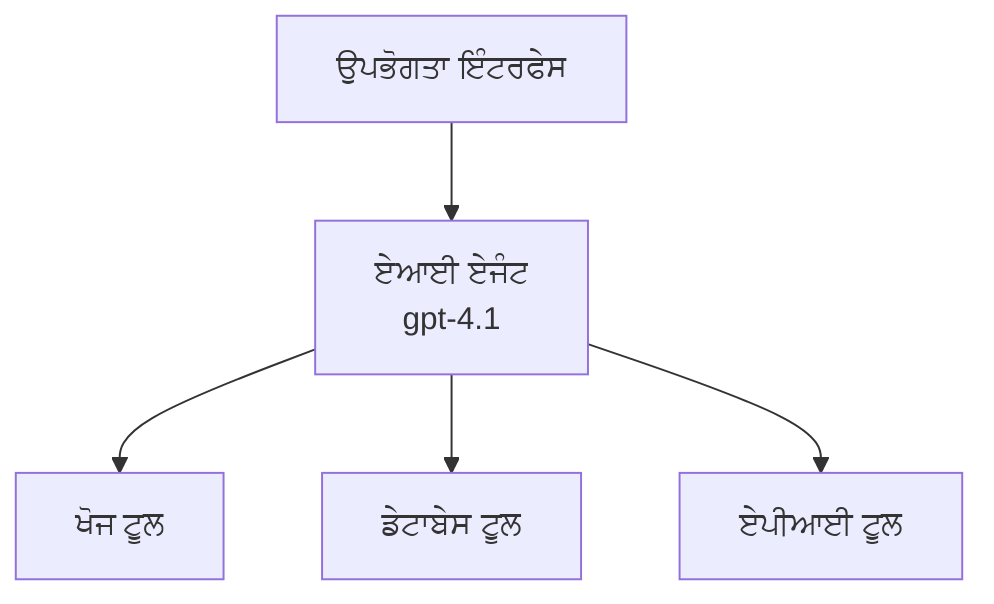
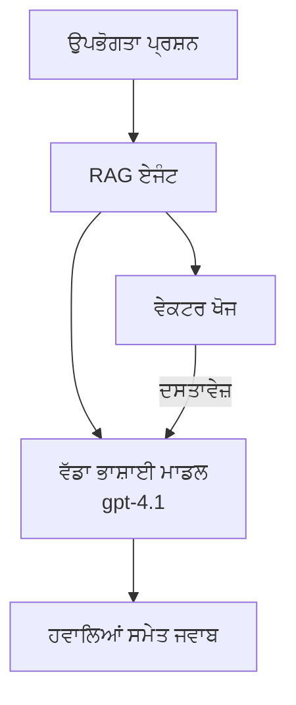
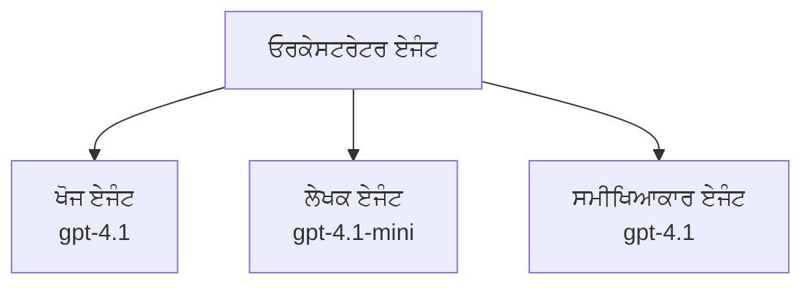

# Azure Developer CLI ਨਾਲ AI ਏਜੰਟਸ

**ਅਧਿਆਇ ਨੈਵੀਗੇਸ਼ਨ:**
- **📚 ਕੋਰਸ ਮੁੱਖ**: [AZD ਸ਼ੁਰੂਆਤ ਲਈ](../../README.md)
- **📖 ਮੌਜੂਦਾ ਅਧਿਆਇ**: ਅਧਿਆਇ 2 - AI-ਪਹਿਲਾ ਵਿਕਾਸ
- **⬅️ ਪਹਿਲਾ**: [Microsoft Foundry ਇੰਟਿਗ੍ਰੇਸ਼ਨ](microsoft-foundry-integration.md)
- **➡️ ਅਗਲਾ**: [AI ਮਾਡਲ ਤੈਨਾਤੀ](ai-model-deployment.md)
- **🚀 ਅਡਵਾਂਸਡ**: [ਮਲਟੀ-ਏਜੰਟ ਹੱਲ](../../examples/retail-scenario.md)

---

## ਪਰਿਚਯ

AI ਏਜੰਟ ਆਪ ਆਪ ਚਲਨ ਵਾਲੇ ਪ੍ਰੋਗਰਾਮ ਹੁੰਦੇ ਹਨ ਜੋ ਆਪਣੇ ਆਸਪਾਸ ਦੇ ਮਾਹੌਲ ਨੂੰ ਮਹਿਸੂਸ ਕਰ ਸਕਦੇ ਹਨ, ਫੈਸਲੇ ਲੈ ਸਕਦੇ ਹਨ, ਅਤੇ ਨਿਰਧਾਰਤ ਲਕੜਾਂ ਹਾਸਲ ਕਰਨ ਲਈ ਕਾਰਵਾਈ ਕਰ ਸਕਦੇ ਹਨ। ਸਧਾਰਨ ਚੈਟਬੋਟਸ ਜੋ ਪ੍ਰਾਂਪਟਾਂ ਦਾ ਜਵਾਬ ਦਿੰਦੀਆਂ ਹਨ, ਦੇ ਮੁਕਾਬਲੇ ਏਜੰਟ:

- **ਟੂਲ ਵਰਤਦੇ ਹਨ** - APIs ਨੂੰ ਕਾਲ ਕਰਨਾ, ਡੇਟਾਬੇਸ ਖੋਜਣਾ, ਕੋਡ ਚਲਾਉਣਾ
- **ਯੋਜਨਾ ਬਣਾਉਂਦੇ ਅਤੇ ਤਰਕ ਕਰਦੇ ਹਨ** - ਜਟਿਲ ਕੰਮਾਂ ਨੂੰ ਕਦਮਾਂ ਵਿੱਚ ਵੰਡਦੇ ਹਨ
- **ਸੰਦਰਭ ਤੋਂ ਸਿੱਖਦੇ ਹਨ** - ਮੈਮੋਰੀ ਬਣਾਈ ਰੱਖਦੇ ਅਤੇ ਵਿਵਹਾਰ ਨੂੰ ਅਨੁਕੂਲ ਕਰਦੇ ਹਨ
- **ਸਹਿਯੋਗ ਕਰਦੇ ਹਨ** - ਹੋਰ ਏਜੰਟਸ ਨਾਲ ਕੰਮ ਕਰਦੇ ਹਨ (ਮਲਟੀ-ਏਜੰਟ ਸਿਸਟਮ)

ਇਹ ਗਾਈਡ ਦਿਖਾਉਂਦੀ ਹੈ ਕਿ Azure Developer CLI (azd) ਦੀ ਵਰਤੋਂ ਕਰਕੇ Azure 'ਤੇ AI ਏਜੰਟ ਕਿਵੇਂ ਤੈਨਾਤ ਕਰਨੇ ਹਨ।

## ਸਿੱਖਣ ਦੇ ਲਕੜ

ਇਸ ਗਾਈਡ ਨੂੰ ਪੂਰਾ ਕਰਨ ਦੇ ਬਾਅਦ, ਤੁਸੀਂ:
- ਸਮਝੋਗੇ ਕਿ AI ਏਜੰਟ ਕੀ ਹਨ ਅਤੇ ਉਹ ਚੈਟਬੋਟਸ ਤੋਂ ਕਿਵੇਂ ਵੱਖਰੇ ਹਨ
- AZD ਦੀ ਵਰਤੋਂ ਕਰਕੇ ਪ੍ਰੀ-बਿਲਟ AI ਏਜੰਟ ਟੈਂਪਲੇਟ ਤੈਨਾਤ ਕਰੋਗੇ
- ਕਸਟਮ ਏਜੰਟਸ ਲਈ Foundry ਏਜੰਟਸ ਨੂੰ ਕੰਫਿਗਰ ਕਰੋਗੇ
- ਮੂਲ ਏਜੰਟ ਪੈਟਰਨ (ਟੂਲ ਵਰਤੋਂ, RAG, ਮਲਟੀ-ਏਜੰਟ) ਲਾਗੂ ਕਰੋਗੇ
- ਤੈਨਾਤ ਕੀਤੇ ਏਜੰਟਸ ਦੀ ਨਿਗਰਾਨੀ ਅਤੇ ਡੀਬੱਗਿੰਗ ਕਰੋਗੇ

## ਸਿੱਖਣ ਦੇ ਨਤੀਜੇ

ਪੂਰਾ ਕਰਨ 'ਤੇ, ਤੁਸੀਂ ਸਮਰੱਥ ਹੋਵੋਗੇ:
- ਇੱਕ ਹੀ ਕਮਾਂਡ ਨਾਲ Azure 'ਤੇ AI ਏਜੰਟ ਐਪਲੀਕੇਸ਼ਨ ਤੈਨਾਤ ਕਰਨਾ
- ਏਜੰਟ ਟੂਲ ਅਤੇ ਸਮਰੱਥਾਵਾਂ ਕੰਫਿਗਰ ਕਰਨਾ
- ਏਜੰਟਸ ਨਾਲ ਰੀਟਰੀਵਲ-ਅੱਗਮੈਂਟਡ ਜਨਰੇਸ਼ਨ (RAG) ਲਾਗੂ ਕਰਨਾ
- ਜਟਿਲ ਵਰਕਫ਼ਲੋਜ਼ ਲਈ ਮਲਟੀ-ਏਜੰਟ ਆਰਕੀਟੈਕਚਰ ਡਿਜ਼ਾਈਨ ਕਰਨਾ
- ਆਮ ਏਜੰਟ ਤੈਨਾਤੀ ਸਮੱਸਿਆਵਾਂ ਦਾ ਨਿਰਾਕਰਨ ਕਰਨਾ

---

## 🤖 ਏਜੰਟ ਇੱਕ ਚੈਟਬੋਟ ਤੋਂ ਕਿਵੇਂ ਵੱਖਰਾ ਹੈ?

| ਫੀਚਰ | ਚੈਟਬੋਟ | AI ਏਜੰਟ |
|---------|---------|----------|
| **ਵਿਹਾਰ** | ਪ੍ਰਾਂਪਟਾਂ ਦਾ ਜਵਾਬ ਦਿੰਦਾ ਹੈ | ਸੁਤੰਤਰ ਕਾਰਵਾਈਆਂ ਕਰਦਾ ਹੈ |
| **ਟੂਲਸ** | ਕੋਈ ਨਹੀਂ | APIs ਨੂੰ ਕਾਲ ਕਰ ਸਕਦਾ ਹੈ, ਖੋਜ ਕਰ ਸਕਦਾ ਹੈ, ਕੋਡ ਚਲਾ ਸਕਦਾ ਹੈ |
| **ਮੇਮੋਰੀ** | ਸਿਰਫ ਸੈਸ਼ਨ-ਆਧਾਰਿਤ | ਸੈਸ਼ਨਾਂ ਵਿੱਚ ਲਗਾਤਾਰ ਮੈਮੋਰੀ |
| **ਯੋਜਨਾ ਬਣਾਉਣਾ** | ਇਕ ਹੀ ਜਵਾਬ | ਬਹੁ-ਕਦਮ ਤਰਕਸ਼ੀਲਤਾ |
| **ਸਹਿਯੋਗ** | ਇਕ ਹੀ ਇਕਾਈ | ਹੋਰ ਏਜੰਟਸ ਨਾਲ ਮਿਲ ਕੇ ਕੰਮ ਕਰ ਸਕਦਾ ਹੈ |

### ਸਧਾਰਣ ਤੁਲਨਾ

- **ਚੈਟਬੋਟ** = ਇੱਕ ਸਹਾਇਕ ਵਿਅਕਤੀ ਜੋ ਜਾਣਕਾਰੀ ਦੇ ਡੈਸਕ ਤੇ ਸਵਾਲਾਂ ਦੇ ਜਵਾਬ ਦਿੰਦਾ ਹੈ
- **AI ਏਜੰਟ** = ਇੱਕ ਨਿੱਜੀ ਸਹਾਇਕ ਜੋ ਕਾਲ ਕਰ ਸਕਦਾ ਹੈ, ਅਪਾਇੰਟਮੈਂਟ ਬੁੱਕ ਕਰ ਸਕਦਾ ਹੈ, ਅਤੇ ਤੁਹਾਡੇ ਲਈ ਕੰਮ ਮੁਕੰਮਲ ਕਰ ਸਕਦਾ ਹੈ

---

## 🚀 ਤੁਰੰਤ ਸ਼ੁਰੂਆਤ: ਆਪਣਾ ਪਹਿਲਾ ਏਜੰਟ ਤੈਨਾਤ ਕਰੋ

### ਵਿਕਲਪ 1: Foundry Agents ਟੈਂਪਲੇਟ (ਸਿਫ਼ਾਰਸ਼ੀ)

```bash
# AI ਏਜੰਟਸ ਟੈਮਪਲੇਟ ਨੂੰ ਆਰੰਭ ਕਰੋ
azd init --template get-started-with-ai-agents

# Azure ਉੱਤੇ ਤੈਨਾਤ ਕਰੋ
azd up
```

**ਕੀ ਤੈਨਾਤ ਹੁੰਦਾ ਹੈ:**
- ✅ Foundry ਏਜੰਟਸ
- ✅ Microsoft Foundry ਮਾਡਲ (gpt-4.1)
- ✅ Azure AI Search (RAG ਲਈ)
- ✅ Azure Container Apps (ਵੈੱਬ ਇੰਟਰਫੇਸ)
- ✅ Application Insights (ਨਿਗਰਾਨੀ)

**ਸਮਾਂ:** ~15-20 ਮਿੰਟ
**ਲਾਗਤ:** ~$100-150/ਮਹੀਨਾ (ਵਿਕਾਸ ਲਈ)

### ਵਿਕਲਪ 2: OpenAI Agent with Prompty

```bash
# Prompty-ਅਧਾਰਤ ਏਜੰਟ ਟੈਂਪਲੇਟ ਨੂੰ ਆਰੰਭ ਕਰੋ
azd init --template agent-openai-python-prompty

# Azure ਤੇ ਤੈਨਾਤ ਕਰੋ
azd up
```

**ਕੀ ਤੈਨਾਤ ਹੁੰਦਾ ਹੈ:**
- ✅ Azure Functions (ਸਰਵਰਲੈਸ ਏਜੰਟ ਐਗਜ਼ਿਕਿਊਸ਼ਨ)
- ✅ Microsoft Foundry ਮਾਡਲ
- ✅ Prompty ਕੰਫਿਗਰੇਸ਼ਨ ਫਾਇਲਾਂ
- ✅ ਨਮੂਨਾ ਏਜੰਟ ਇੰਪਲਿਮੇਂਟੇਸ਼ਨ

**ਸਮਾਂ:** ~10-15 ਮਿੰਟ
**ਲਾਗਤ:** ~$50-100/ਮਹੀਨਾ (ਵਿਕਾਸ ਲਈ)

### ਵਿਕਲਪ 3: RAG ਚੈਟ ਏਜੰਟ

```bash
# RAG ਚੈਟ ਟੈਂਪਲੇਟ ਨੂੰ ਆਰੰਭ ਕਰੋ
azd init --template azure-search-openai-demo

# ਅਜ਼ਿਊਰ ਤੇ ਤੈਨਾਤ ਕਰੋ
azd up
```

**ਕੀ ਤੈਨਾਤ ਹੁੰਦਾ ਹੈ:**
- ✅ Microsoft Foundry ਮਾਡਲ
- ✅ ਨਮੂਨਾ ਡੇਟਾ ਨਾਲ Azure AI Search
- ✅ ਦਸਤਾਵੇਜ਼ ਪ੍ਰੋਸੈਸਿੰਗ ਪਾਈਪਲਾਈਨ
- ✅ ਹਵਾਲਿਆਂ ਨਾਲ ਚੈਟ ਇੰਟਰਫੇਸ

**ਸਮਾਂ:** ~15-25 ਮਿੰਟ
**ਲਾਗਤ:** ~$80-150/ਮਹੀਨਾ (ਵਿਕਾਸ ਲਈ)

### ਵਿਕਲਪ 4: AZD AI Agent Init (ਮੈਨਿਫੈਸਟ-ਆਧਾਰਿਤ)

ਜੇ ਤੁਹਾਡੇ ਕੋਲ ਏਜੰਟ ਮੈਨਿਫੈਸਟ ਫਾਇਲ ਹੈ, ਤੁਸੀਂ `azd ai` ਕਮਾਂਡ ਦੀ ਵਰਤੋਂ ਕਰਕੇ ਸਿੱਧਾ Foundry Agent Service ਪ੍ਰੋਜੈਕਟ ਸਕੈਫੋਲਡ ਕਰ ਸਕਦੇ ਹੋ:

```bash
# AI ਏਜੰਟਸ ਐਕਸਟੈਂਸ਼ਨ ਇੰਸਟਾਲ ਕਰੋ
azd extension install azure.ai.agents

# ਏਜੰਟ ਮੈਨਿਫੈਸਟ ਤੋਂ ਆਰੰਭ ਕਰੋ
azd ai agent init -m agent-manifest.yaml

# ਐਜ਼ੂਰ ਤੇ ਤੈਨਾਤ ਕਰੋ
azd up
```

**ਕਦੋਂ `azd ai agent init` ਚਲਾਉਣਾ ਹੈ ਅਤੇ ਕਦੋਂ `azd init --template` ਹੈ:**

| ਅਪ੍ਰੋਚ | ਸਭ ਤੋਂ ਵਧੀਆ ਲਈ | ਇਹ ਕਿਵੇਂ ਕੰਮ ਕਰਦਾ ਹੈ |
|----------|----------|------|
| `azd init --template` | ਇਕ ਕਾਰਜਕ ਸਮਪਲ ਐਪ ਤੋਂ ਸ਼ੁਰੂ ਕਰਨ ਲਈ | ਕੋਡ + ਇਨਫਰਾ ਵਾਲੇ ਪੂਰੇ ਟੈਂਪਲੇਟ ਰੇਪੋ ਨੂੰ ਕਲੋਨ ਕਰਦਾ ਹੈ |
| `azd ai agent init -m` | ਆਪਣੀ ਖ਼ੁਦ ਦੀ ਏਜੰਟ ਮੈਨਿਫੈਸਟ ਤੋਂ ਬਣਾਉਣ ਲਈ | ਤੁਹਾਡੇ ਏਜੰਟ ਪਰਿਭਾਸ਼ਾ ਤੋਂ ਪ੍ਰੋਜੈਕਟ ਡਾਇਰੈਕਟਰੀ ਸਕੈਫੋਲਡ ਕਰਦਾ ਹੈ |

> **ਟਿੱਪ:** ਸਿੱਖਣ ਵੇਲੇ `azd init --template` ਦੀ ਵਰਤੋਂ ਕਰੋ (ਉਪਰ ਦਿੱਤੇ ਵਿਕਲਪ 1-3)। ਉਤਪਾਦਨ ਏਜੰਟਸ ਬਣਾਉਂਦੇ ਸਮੇਂ ਆਪਣੇ ਮੈਨਿਫੈਸਟ ਨਾਲ `azd ai agent init` ਦੀ ਵਰਤੋਂ ਕਰੋ। ਪੂਰੇ ਰੇਫਰੰਸ ਲਈ ਵੇਖੋ [AZD AI CLI Commands](../chapter-08-production/production-ai-practices.md#azd-ai-cli-commands-and-extensions)।

---

## 🏗️ ਏਜੰਟ ਆਰਕੀਟੈਕਚਰ ਪੈਟਰਨ

### ਪੈਟਰਨ 1: ਇੱਕਲ-ਏਜੰਟ ਟੂਲਸ ਨਾਲ

ਸਭ ਤੋਂ ਸਧਾਰਣ ਏਜੰਟ ਪੈਟਰਨ - ਇੱਕ ਏਜੰਟ ਜੋ ਕਈ ਟੂਲ ਵਰਤ ਸਕਦਾ ਹੈ।


**ਸਭ ਤੋਂ ਵਧੀਆ ਲਈ:**
- ਕਸਟਮਰ ਸਪੋਰਟ ਬੋਟ
- ਰਿਸਰਚ ਅਸਿਸਟੈਂਟ
- ਡੇਟਾ ਵਿਸ਼ਲੇਸ਼ਣ ਏਜੰਟ

**AZD ਟੈਂਪਲੇਟ:** `azure-search-openai-demo`

### ਪੈਟਰਨ 2: RAG ਏਜੰਟ (ਰੀਟਰੀਵਲ-ਅੱਗਮੈਂਟਡ ਜਨਰੇਸ਼ਨ)

ਇੱਕ ਏਜੰਟ ਜੋ ਜਵਾਬ ਬਣਾਉਣ ਤੋਂ ਪਹਿਲਾਂ ਸੰਬੰਧਿਤ ਦਸਤਾਵੇਜ਼ ਲੱਭਦਾ ਹੈ।


**ਸਭ ਤੋਂ ਵਧੀਆ ਲਈ:**
- ਐਨਟਰਪ੍ਰਾਈਜ਼ ਗਿਆਨ ਬੇਸ
- ਦਸਤਾਵੇਜ਼ Q&A ਸਿਸਟਮ
- ਅਨੁਕੂਲਤਾ ਅਤੇ ਕਾਨੂੰਨੀ ਰਿਸਰਚ

**AZD ਟੈਂਪਲੇਟ:** `azure-search-openai-demo`

### ਪੈਟਰਨ 3: ਮਲਟੀ-ਏਜੰਟ ਸਿਸਟਮ

ਕਈ ਵਿਸ਼ੇਸ਼ਜਾਣੇ ਏਜੰਟ ਮਿਲ ਕੇ ਜਟਿਲ ਕੰਮ ਕਰਦੇ ਹਨ।


**ਸਭ ਤੋਂ ਵਧੀਆ ਲਈ:**
- ਜਟਿਲ ਸਮਗਰੀ ਉਤਪੱਤੀ
- ਬਹੁ-ਕਦਮ ਵਰਕਫ਼ਲੋਜ਼
- ਉਹ ਕੰਮ ਜਿਹਨਾਂ ਲਈ ਵੱਖ-ਵੱਖ ਕੌਸ਼ਲ ਲੋੜਦੇ ਹਨ

**ਹੋਰ ਜਾਣੋ:** [Multi-Agent Coordination Patterns](../chapter-06-pre-deployment/coordination-patterns.md)

---

## ⚙️ ਏਜੰਟ ਟੂਲਸ ਦੀ ਸੰਰਚਨਾ

ਏਜੰਟ ਉਹ ਸਮਰੱਥ ਬਣ ਜਾਂਦੇ ਹਨ ਜਦੋਂ ਉਹ ਟੂਲ ਵਰਤ ਸਕਦੇ ਹਨ। ਇੱਥੇ ਆਮ ਟੂਲਸ ਨੂੰ ਕੰਫਿਗਰ ਕਰਨ ਦਾ ਤਰੀਕਾ ਦਿੱਤਾ ਗਿਆ ਹੈ:

### Foundry ਏਜੰਟਸ ਵਿੱਚ ਟੂਲ ਕੰਫਿਗਰੇਸ਼ਨ

```python
# agent_config.py
from azure.ai.projects import AIProjectClient
from azure.ai.projects.models import FunctionTool, CodeInterpreterTool

# ਕਸਟਮ ਟੂਲ ਪਰਿਭਾਸ਼ਿਤ ਕਰੋ
search_tool = FunctionTool(
    name="search_knowledge_base",
    description="Search the company knowledge base for relevant documents",
    parameters={
        "type": "object",
        "properties": {
            "query": {
                "type": "string",
                "description": "The search query"
            }
        },
        "required": ["query"]
    }
)

# ਟੂਲਾਂ ਨਾਲ ਏਜੰਟ ਬਣਾਓ
agent = project_client.agents.create_agent(
    model="gpt-4.1",
    name="Support Agent",
    instructions="You are a helpful support agent. Use the search tool to find relevant information.",
    tools=[search_tool, CodeInterpreterTool()]
)
```

### ਵਾਤਾਵਰਣ ਕੰਫਿਗਰੇਸ਼ਨ

```bash
# ਏਜੰਟ-ਖ਼ਾਸ ਵਾਤਾਵਰਣ ਵੈਰੀਏਬਲ ਸੈੱਟ ਕਰੋ
azd env set AZURE_OPENAI_MODEL "gpt-4.1"
azd env set AGENT_INSTRUCTIONS "You are a helpful assistant..."
azd env set ENABLE_CODE_INTERPRETER "true"
azd env set ENABLE_FILE_SEARCH "true"

# ਅਪਡੇਟ ਕੀਤੀ ਸੰਰਚਨਾ ਨਾਲ ਤੈਨਾਤ ਕਰੋ
azd deploy
```

---

## 📊 ਏਜੰਟਸ ਦੀ ਨਿਗਰਾਨੀ

### Application Insights ਇੰਟੀਗ੍ਰੇਸ਼ਨ

ਸਭ AZD ਏਜੰਟ ਟੈਂਪਲੇਟਸ ਨਿਗਰਾਨੀ ਲਈ Application Insights ਸ਼ਾਮਲ ਕਰਦੇ ਹਨ:

```bash
# ਨਿਗਰਾਨੀ ਡੈਸ਼ਬੋਰਡ ਖੋਲ੍ਹੋ
azd monitor --overview

# ਲਾਈਵ ਲਾਗਾਂ ਵੇਖੋ
azd monitor --logs

# ਲਾਈਵ ਮੈਟ੍ਰਿਕਸ ਵੇਖੋ
azd monitor --live
```

### ਟਰੈੱਕ ਕਰਨ ਲਈ ਮੁੱਖ ਮੈਟ੍ਰਿਕਸ

| ਮੈਟ੍ਰਿਕ | ਵਰਣਨ | ਟਾਰਗਟ |
|--------|-------------|--------|
| ਰਿਸਪਾਂਸ ਲੇਟਸੀ | ਜਵਾਬ ਬਣਨ ਵਿੱਚ ਲੱਗਣ ਵਾਲਾ ਸਮਾਂ | < 5 ਸਕਿੰਟ |
| ਟੋਕਨ ਵਰਤੋਂ | ਹਰ ਬੇਨਤੀ ਲਈ ਟੋਕਨ | ਲਾਗਤ ਲਈ ਨਿਗਰਾਨੀ |
| ਟੂਲ ਕਾਲ ਸਫ਼ਲਤਾ ਦਰ | ਟੂਲ ਐਗਜ਼ਿਕਿਊਸ਼ਨਾਂ ਦੀ % ਸਫ਼ਲਤਾ | > 95% |
| ਐਰਰ ਰੇਟ | ਨਾਕਾਮ ਏਜੰਟ ਬੇਨਤੀਆਂ | < 1% |
| ਯੂਜ਼ਰ ਸੰਤੁਸ਼ਟੀ | ਫੀਡਬੈਕ ਸਕੋਰ | > 4.0/5.0 |

### ਏਜੰਟਸ ਲਈ ਕਸਟਮ ਲੋਗਿੰਗ

```python
import os
from azure.monitor.opentelemetry import configure_azure_monitor
from opentelemetry import trace

# Azure Monitor ਨੂੰ OpenTelemetry ਨਾਲ ਸੰਰਚਿਤ ਕਰੋ
configure_azure_monitor(
    connection_string=os.environ["APPLICATIONINSIGHTS_CONNECTION_STRING"]
)

tracer = trace.get_tracer(__name__)

def log_agent_interaction(user_query, agent_response, tools_used, latency_ms):
    with tracer.start_as_current_span("agent_interaction") as span:
        span.set_attributes({
            "user_query": user_query,
            "response_length": len(agent_response),
            "tools_used": tools_used,
            "latency_ms": latency_ms
        })
```

> **ਟਿੱਪਣੀ:** ਲੋੜੀਂਦੇ ਪੈਕੇਜ ਇੰਸਟਾਲ ਕਰੋ: `pip install azure-monitor-opentelemetry opentelemetry`

---

## 💰 ਲਾਗਤ ਪਰਵਿਚਾਰ

### ਪੈਟਰਨ ਮੁਤਾਬਕ ਅੰਦਾਜ਼ਤ ਮਹੀਨਾਵਾਰ ਲਾਗਤ

| ਪੈਟਰਨ | ਡੈਵ ਵਾਤਾਵਰਣ | ਉਤਪਾਦਨ |
|---------|-----------------|------------|
| ਇੱਕਲ ਏਜੰਟ | $50-100 | $200-500 |
| RAG ਏਜੰਟ | $80-150 | $300-800 |
| ਮਲਟੀ-ਏਜੰਟ (2-3 ਏਜੰਟ) | $150-300 | $500-1,500 |
| ਐਨਟਰਪ੍ਰਾਈਜ਼ ਮਲਟੀ-ਏਜੰਟ | $300-500 | $1,500-5,000+ |

### ਲਾਗਤ ਘਟਾਉਣ ਦੇ ਸੁਝਾਅ

1. **ਸਧਾਰਨ ਕੰਮਾਂ ਲਈ gpt-4.1-mini ਦੀ ਵਰਤੋਂ ਕਰੋ**
   ```bash
   azd env set AZURE_OPENAI_MODEL "gpt-4.1-mini"
   ```

2. **ਦੁਹਰਾਈਆਂ ਪੁੱਛਗਿੱਛਾਂ ਲਈ ਕੈਸ਼ਿੰਗ ਲਾਗੂ ਕਰੋ**
   ```python
   from functools import lru_cache
   
   @lru_cache(maxsize=1000)
   def get_cached_response(query_hash):
       return agent.run(query_hash)
   ```

3. **ਹਰ ਦੌਰ ਲਈ ਟੋਕਨ ਸੀਮਾਵਾਂ ਸੈਟ ਕਰੋ**
   ```python
   # ਏਜੰਟ ਚਲਾਉਂਦੇ ਸਮੇਂ max_completion_tokens ਸੈੱਟ ਕਰੋ, ਬਣਾਉਣ ਦੌਰਾਨ ਨਹੀਂ
   run = project_client.agents.create_run(
       thread_id=thread.id,
       agent_id=agent.id,
       max_completion_tokens=1000  # ਜਵਾਬ ਦੀ ਲੰਬਾਈ ਸੀਮਿਤ ਕਰੋ
   )
   ```

4. **ਨਾ ਵਰਤਦੇ ਸਮੇਂ ਸਕੇਲ ਟੂ ਜ਼ੀਰੋ ਕਰੋ**
   ```bash
   # Container Apps ਆਪਣੇ-ਆਪ ਸਿਫ਼ਰ ਤੱਕ ਆਟੋਮੈਟਿਕ ਤੌਰ 'ਤੇ ਸਕੇਲ ਹੋ ਜਾਂਦੇ ਹਨ
   azd env set MIN_REPLICAS "0"
   ```

---

## 🔧 ਏਜੰਟਸ ਦੀਆਂ ਸਮੱਸਿਆਵਾਂ ਦਾ ਨਿਰਾਕਰਨ

### ਆਮ ਸਮੱਸਿਆਵਾਂ ਅਤੇ ਉਨ੍ਹਾਂ ਦੇ ਹੱਲ

<details>
<summary><strong>❌ ਟੂਲ ਕਾਲਾਂ ਦਾ ਏਜੰਟ ਨੂੰ ਜਵਾਬ ਨਹੀਂ ਦੇਣਾ</strong></summary>

```bash
# ਚੈੱਕ ਕਰੋ ਕਿ ਟੂਲ ਸਹੀ ਤਰ੍ਹਾਂ ਰਜਿਸਟਰ ਹੋਏ ਹਨ
azd show

# OpenAI ਡਿਪਲੋਇਮੈਂਟ ਦੀ ਪੁਸ਼ਟੀ ਕਰੋ
az cognitiveservices account deployment list \
  --name $AZURE_OPENAI_NAME \
  --resource-group $RG_NAME

# ਏਜੰਟ ਲੌਗ ਦੀ ਜਾਂਚ ਕਰੋ
azd monitor --logs
```

**ਆਮ ਕਾਰਨ:**
- ਟੂਲ ਫੰਕਸ਼ਨ ਸਿਗਨੇਚਰ ਵਿੱਚ ਮਿਲਾਪ ਨਹੀਂ
- ਲੋੜੀਂਦੀਆਂ ਪਰਮਿਸ਼ਨਾਂ ਦੀ ਘਾਟ
- API ਐਂਡਪੋਇੰਟ ਪਹੁੰਚਯੋਗ ਨਹੀਂ
</details>

<details>
<summary><strong>❌ ਏਜੰਟ ਜਵਾਬਾਂ ਵਿੱਚ ਉੱਚ ਲੇਟਸੀ</strong></summary>

```bash
# ਰੁਕਾਵਟਾਂ ਲਈ Application Insights ਦੀ ਜਾਂਚ ਕਰੋ
azd monitor --live

# ਇੱਕ ਤੇਜ਼ ਮਾਡਲ ਵਰਤਣ ਤੇ ਵਿਚਾਰ ਕਰੋ
azd env set AZURE_OPENAI_MODEL "gpt-4.1-mini"
azd deploy
```

**ਇਮਪਟਾਈਜ਼ੇਸ਼ਨ ਸੁਝਾਅ:**
- ਸਟ੍ਰੀਮਿੰਗ ਜਵਾਬਾਂ ਦੀ ਵਰਤੋਂ ਕਰੋ
- ਰਿਸਪਾਂਸ ਕੈਸ਼ਿੰਗ ਲਾਗੂ ਕਰੋ
- ਸੰਦਰਭ ਖਿੜਕੀ ਆਕਾਰ ਘਟਾਓ
</details>

<details>
<summary><strong>❌ ਏਜੰਟ ਗਲਤ ਜਾਂ ਹੈਲੂਸੀਨੇਟਡ ਜਾਣਕਾਰੀ ਵਾਪਸ ਕਰ ਰਿਹਾ ਹੈ</strong></summary>

```python
# ਵਧੀਆ ਸਿਸਟਮ ਪ੍ਰਾਂਪਟਸ ਨਾਲ ਸੁਧਾਰ ਕਰੋ
instructions = """
You are a helpful assistant. IMPORTANT:
- Only answer based on provided context
- If you don't know, say "I don't know"
- Always cite your sources
- Never make up information
"""

# ਅਧਾਰ ਲਈ ਖੋਜ ਸ਼ਾਮਲ ਕਰੋ
agent = project_client.agents.create_agent(
    model="gpt-4.1",
    instructions=instructions,
    tools=[FileSearchTool()]  # ਜਵਾਬਾਂ ਨੂੰ ਦਸਤਾਵੇਜ਼ਾਂ ਵਿੱਚ ਅਧਾਰਿਤ ਕਰੋ
)
```
</details>

<details>
<summary><strong>❌ ਟੋਕਨ ਸੀਮਾ ਪਾਰ ਹੋਣ ਦੀਆਂ ਗਲਤੀਆਂ</strong></summary>

```python
# ਕੰਟੈਕਸਟ ਵਿਂਡੋ ਪ੍ਰਬੰਧਨ ਲਾਗੂ ਕਰੋ
def truncate_context(messages, max_tokens=8000, model="gpt-4.1"):
    """Keep only recent messages within token limit."""
    import tiktoken
    encoding = tiktoken.encoding_for_model(model)
    total_tokens = 0
    truncated = []
    
    for msg in reversed(messages):
        msg_tokens = len(encoding.encode(msg.content))
        if total_tokens + msg_tokens > max_tokens:
            break
        truncated.insert(0, msg)
        total_tokens += msg_tokens
    
    return truncated
```
</details>

---

## 🎓 ਹੈਂਡਸ-ਆਨ ਅਭਿਆਸ

### ਅਭਿਆਸ 1: ਇੱਕ ਬੇਸਿਕ ਏਜੰਟ ਤੈਨਾਤ ਕਰੋ (20 ਮਿੰਟ)

**ਲਕੜ:** AZD ਦੀ ਵਰਤੋਂ ਕਰਕੇ ਆਪਣਾ ਪਹਿਲਾ AI ਏਜੰਟ ਤੈਨਾਤ ਕਰੋ

```bash
# ਕਦਮ 1: ਟੈਂਪਲੇਟ ਨੂੰ ਸ਼ੁਰੂ ਕਰੋ
azd init --template get-started-with-ai-agents

# ਕਦਮ 2: Azure ਵਿੱਚ ਲੌਗਿਨ ਕਰੋ
azd auth login

# ਕਦਮ 3: ਡਿਪਲੋਏ ਕਰੋ
azd up

# ਕਦਮ 4: ਏਜੰਟ ਦੀ ਜਾਂਚ ਕਰੋ
# ਡਿਪਲੋਇਮੈਂਟ ਤੋਂ ਬਾਅਦ ਦੀ ਉਮੀਦ ਕੀਤੀ ਆਉਟਪੁੱਟ:
#   ਡਿਪਲੋਇਮੈਂਟ ਮੁਕੰਮਲ!
#   ਐਂਡਪੋਇੰਟ: https://<app-name>.<region>.azurecontainerapps.io
# ਆਉਟਪੁੱਟ ਵਿੱਚ ਦਿਖਾਈ ਗਈ URL ਖੋਲ੍ਹੋ ਅਤੇ ਇੱਕ ਪ੍ਰਸ਼ਨ ਪੁੱਛ ਕੇ ਦੇਖੋ

# ਕਦਮ 5: ਨਿਗਰਾਨੀ ਵੇਖੋ
azd monitor --overview

# ਕਦਮ 6: ਸਾਫ਼-ਸਫਾਈ ਕਰੋ
azd down --force --purge
```

**ਸਫਲਤਾ ਮਾਪਦੰਡ:**
- [ ] ਏਜੰਟ ਸਵਾਲਾਂ ਦਾ ਜਵਾਬ ਦੇਂਦਾ ਹੈ
- [ ] `azd monitor` ਰਾਹੀਂ ਮਾਨੀਟਰਨਿੰਗ ਡੈਸ਼ਬੋਰਡ ਤੱਕ ਪਹੁੰਚ ਹੋ ਸਕਦੀ ਹੈ
- [ ] ਰਿਸੋਰਸਸ ਸਫਲਤਾਪੂਰਵਕ ਸਾਫ਼ ਹੋ ਗਏ

### ਅਭਿਆਸ 2: ਇੱਕ ਕਸਟਮ ਟੂਲ ਸ਼ਾਮਲ ਕਰੋ (30 ਮਿੰਟ)

**ਲਕੜ:** ਏਜੰਟ ਨੂੰ ਇੱਕ ਕਸਟਮ ਟੂਲ ਨਾਲ ਵਧਾਓ

1. ਏਜੰਟ ਟੈਂਪਲੇਟ ਤੈਨਾਤ ਕਰੋ:
   ```bash
   azd init --template get-started-with-ai-agents
   azd up
   ```
2. ਆਪਣੇ ਏਜੰਟ ਕੋਡ ਵਿੱਚ ਇੱਕ ਨਵੀਂ ਟੂਲ ਫੰਕਸ਼ਨ ਬਣਾਓ:
   ```python
   def get_weather(location: str) -> str:
       """Get current weather for a location."""
       # ਮੌਸਮ ਸੇਵਾ ਲਈ API ਕਾਲ
       return f"Weather in {location}: Sunny, 72°F"
   ```
3. ਏਜੰਟ ਨਾਲ ਟੂਲ ਰਜਿਸਟਰ ਕਰੋ:
   ```python
   from azure.ai.projects.models import FunctionTool

   weather_tool = FunctionTool(
       name="get_weather",
       description="Get current weather for a location",
       parameters={
           "type": "object",
           "properties": {
               "location": {"type": "string", "description": "City name"}
           },
           "required": ["location"]
       }
   )

   agent = project_client.agents.create_agent(
       model="gpt-4.1",
       name="Weather Agent",
       tools=[weather_tool]
   )
   ```
4. ਰੀਡਿਪਲੋਇ ਅਤੇ ਟੈਸਟ ਕਰੋ:
   ```bash
   azd deploy
   # ਪੁੱਛੋ: "ਸੀਏਟਲ ਵਿੱਚ ਮੌਸਮ ਕੀ ਹੈ?"
   # ਉਮੀਦ ਕੀਤੀ ਜਾਂਦੀ ਹੈ: ਏਜੰਟ get_weather("Seattle") ਨੂੰ ਕਾਲ ਕਰਦਾ ਹੈ ਅਤੇ ਮੌਸਮ ਦੀ ਜਾਣਕਾਰੀ ਵਾਪਸ ਕਰਦਾ ਹੈ
   ```

**ਸਫਲਤਾ ਮਾਪਦੰਡ:**
- [ ] ਏਜੰਟ ਮੌਸਮ-ਸੰਬੰਧੀ ਪ੍ਰਸ਼ਨਾਂ ਨੂੰ ਪਛਾਣਦਾ ਹੈ
- [ ] ਟੂਲ ਸਹੀ ਤਰੀਕੇ ਨਾਲ ਕਾਲ ਹੁੰਦਾ ਹੈ
- [ ] ਜਵਾਬ ਵਿੱਚ ਮੌਸਮ ਜਾਣਕਾਰੀ ਸ਼ਾਮਲ ਹੈ

### ਅਭਿਆਸ 3: ਇੱਕ RAG ਏਜੰਟ ਬਣਾਓ (45 ਮਿੰਟ)

**ਲਕੜ:** ਇੱਕ ਐਜੰਟ ਬਣਾਓ ਜੋ ਤੁਹਾਡੇ ਦਸਤਾਵੇਜ਼ਾਂ ਤੋਂ ਸਵਾਲਾਂ ਦਾ ਜਵਾਬ ਦੇਵੇ

```bash
# ਕਦਮ 1: RAG ਟੈਂਪਲੇਟ ਡਿਪਲੋਏ ਕਰੋ
azd init --template azure-search-openai-demo
azd up

# ਕਦਮ 2: ਆਪਣੇ ਦਸਤਾਵੇਜ਼ ਅੱਪਲੋਡ ਕਰੋ
# PDF/TXT ਫਾਈਲਾਂ ਨੂੰ data/ ਡਾਇਰੈਕਟਰੀ ਵਿੱਚ ਰੱਖੋ, ਫਿਰ ਚਲਾਓ:
python scripts/prepdocs.py

# ਕਦਮ 3: ਡੋਮੇਨ-ਵਿਸ਼ੇਸ਼ ਸਵਾਲਾਂ ਨਾਲ ਟੈਸਟ ਕਰੋ
# azd up ਆਉਟਪੁੱਟ ਤੋਂ ਵੈੱਬ ਐਪ URL ਖੋਲ੍ਹੋ
# ਆਪਣੇ ਅੱਪਲੋਡ ਕੀਤੇ ਦਸਤਾਵੇਜ਼ਾਂ ਬਾਰੇ ਸਵਾਲ ਪੁੱਛੋ
# ਜਵਾਬਾਂ ਵਿੱਚ [doc.pdf] ਵਰਗੇ ਹਵਾਲੇ ਸ਼ਾਮਲ ਹੋਣੇ ਚਾਹੀਦੇ ਹਨ
```

**ਸਫਲਤਾ ਮਾਪਦੰਡ:**
- [ ] ਏਜੰਟ ਅੱਪਲੋਡ ਕੀਤੇ ਦਸਤਾਵੇਜ਼ਾਂ ਤੋਂ ਜਵਾਬ ਦਿੰਦਾ ਹੈ
- [ ] ਜਵਾਬਾਂ ਵਿੱਚ ਹਵਾਲੇ ਸ਼ਾਮਲ ਹਨ
- [ ] ਆਊਟ-ਆਫ-ਸਕੋਪ ਪ੍ਰਸ਼ਨਾਂ 'ਤੇ ਹੈਲੂਸੀਨੇਸ਼ਨ ਨਹੀਂ

---

## 📚 ਅਗਲੇ ਕਦਮ

ਹੁਣ ਜਦੋਂ ਕਿ ਤੁਸੀਂ AI ਏਜੰਟਸ ਨੂੰ ਸਮਝ ਲਿਆ ਹੈ, ਇਨ੍ਹਾਂ ਅਡਵਾਂਸਡ ਵਿਸ਼ਿਆਂ ਦੀ ਖੋਜ ਕਰੋ:

| ਵਿਸ਼ਾ | ਵਰਣਨ | ਲਿੰਕ |
|-------|-------------|------|
| **ਮਲਟੀ-ਏਜੰਟ ਸਿਸਟਮ** | ਕਈ ਸਹਿਯੋਗੀ ਏਜੰਟਸ ਨਾਲ ਸਿਸਟਮ ਬਣਾਓ | [Retail Multi-Agent Example](../../examples/retail-scenario.md) |
| **ਕੋਆਰਡੀਨੇਸ਼ਨ ਪੈਟਰਨ** | ਓਰਕੇਸਟਰੇਸ਼ਨ ਅਤੇ ਸੰਚਾਰ ਪੈਟਰਨ ਸਿੱਖੋ | [Coordination Patterns](../chapter-06-pre-deployment/coordination-patterns.md) |
| **ਉਤਪਾਦਨ ਤੈਨਾਤੀ** | ਐਨਟਰਪ੍ਰਾਈਜ਼-ਤਿਆਰ ਏਜੰਟ ਤੈਨਾਤੀ | [Production AI Practices](../chapter-08-production/production-ai-practices.md) |
| **ਏਜੰਟ ਮੂਲਿਆਂਕਨ** | ਏਜੰਟ ਪ੍ਰਦਰਸ਼ਨ ਦੀ ਟੈਸਟਿੰਗ ਅਤੇ ਮੂਲਿਆਂਕਨ ਕਰੋ | [AI Troubleshooting](../chapter-07-troubleshooting/ai-troubleshooting.md) |
| **AI ਵਰਕਸ਼ਾਪ ਲੈਬ** | ਹੈਂਡਸ-ਆਨ: ਆਪਣੀ AI ਸਲੂਸ਼ਨ ਨੂੰ AZD-ਤਿਆਰ ਬਣਾਉ | [AI Workshop Lab](ai-workshop-lab.md) |

---

## 📖 ਵਾਧੂ ਸਰੋਤ

### ਅਧਿਕਾਰਿਕ ਦਸਤਾਵੇਜ਼ੀਕਰਨ
- [Azure AI Agent Service](https://learn.microsoft.com/azure/ai-services/agents/)
- [Azure AI Foundry Agent Service Quickstart](https://learn.microsoft.com/azure/ai-services/agents/quickstart)
- [Semantic Kernel Agent Framework](https://learn.microsoft.com/semantic-kernel/)

### ਏਜੰਟਸ ਲਈ AZD ਟੈਂਪਲੇਟਸ
- [Get Started with AI Agents](https://github.com/Azure-Samples/get-started-with-ai-agents)
- [Agent OpenAI Python Prompty](https://github.com/Azure-Samples/agent-openai-python-prompty)
- [Azure Search OpenAI Demo](https://github.com/Azure-Samples/azure-search-openai-demo)

### ਕਮਿਊਨਿਟੀ ਸਰੋਤ
- [Awesome AZD - Agent Templates](https://azure.github.io/awesome-azd/?tags=ai-agents)
- [Azure AI Discord](https://discord.gg/microsoft-azure)
- [Microsoft Foundry Discord](https://discord.gg/nTYy5BXMWG)

### ਤੁਹਾਡੇ ਐਡੀਟਰ ਲਈ ਏਜੰਟ ਸਕਿਲਜ਼
- [**Microsoft Azure Agent Skills**](https://skills.sh/microsoft/github-copilot-for-azure) - GitHub Copilot, Cursor, ਜਾਂ ਕਿਸੇ ਵੀ ਸਮਰਥਿਤ ਏਜੰਟ ਲਈ Azure ਵਿਕਾਸ ਲਈ ਰੀਯੂਜ਼ੇਬਲ AI ਏਜੰਟ ਸਕਿਲਜ਼ ਇੰਸਟਾਲ ਕਰੋ। ਇੱਸ ਵਿੱਚ [Azure AI](https://skills.sh/microsoft/github-copilot-for-azure/azure-ai), [Microsoft Foundry](https://skills.sh/microsoft/github-copilot-for-azure/microsoft-foundry), [deployment](https://skills.sh/microsoft/github-copilot-for-azure/azure-deploy), ਅਤੇ [diagnostics](https://skills.sh/microsoft/github-copilot-for-azure/azure-diagnostics) ਲਈ ਸਕਿਲਜ਼ ਸ਼ਾਮਲ ਹਨ:
  ```bash
  npx skills add microsoft/github-copilot-for-azure
  ```

---

**ਨੈਵੀਗੇਸ਼ਨ**
- **ਪਿਛਲਾ ਪਾਠ**: [Microsoft Foundry ਇੰਟਿਗ੍ਰੇਸ਼ਨ](microsoft-foundry-integration.md)
- **ਅਗਲਾ ਪਾਠ**: [AI ਮਾਡਲ ਤੈਨਾਤੀ](ai-model-deployment.md)

---

<!-- CO-OP TRANSLATOR DISCLAIMER START -->
**ਅਸਵੀਕਾਰਤਾ**:
ਇਸ ਦਸਤਾਵੇਜ਼ ਨੂੰ AI ਅਨੁਵਾਦ ਸੇਵਾ [Co-op Translator](https://github.com/Azure/co-op-translator) ਦੀ ਵਰਤੋਂ ਕਰਕੇ ਅਨੁਵਾਦ ਕੀਤਾ ਗਿਆ ਹੈ। ਅਸੀਂ ਸ਼ੁੱਧਤਾ ਲਈ ਕੋਸ਼ਿਸ਼ ਕਰਦੇ ਹਾਂ, ਪਰ ਕਿਰਪਾ ਕਰਕੇ ਧਿਆਨ ਦਿਓ ਕਿ ਸਵੈਚਲਿਤ ਅਨੁਵਾਦਾਂ ਵਿੱਚ ਗਲਤੀਆਂ ਜਾਂ ਅਣਸ਼ੁੱਧਤੀਆਂ ਹੋ ਸਕਦੀਆਂ ਹਨ। ਮੂਲ ਦਸਤਾਵੇਜ਼ ਨੂੰ ਇਸ ਦੀ ਮੂਲ ਭਾਸ਼ਾ ਵਿੱਚ ਅਧਿਕਾਰਿਕ ਸਰੋਤ ਵਜੋਂ ਮੰਨਿਆ ਜਾਣਾ ਚਾਹੀਦਾ ਹੈ। ਮਹੱਤਵਪੂਰਨ ਜਾਣਕਾਰੀ ਲਈ, ਪੇਸ਼ੇਵਰ ਮਨੁੱਖੀ ਅਨੁਵਾਦ ਦੀ ਸਿਫ਼ਾਰਸ਼ ਕੀਤੀ ਜਾਂਦੀ ਹੈ। ਅਸੀਂ ਇਸ ਅਨੁਵਾਦ ਦੀ ਵਰਤੋਂ ਕਾਰਨ ਹੋਣ ਵਾਲੀਆਂ ਕਿਸੇ ਵੀ ਗਲਤਫਹਮੀ ਜਾਂ ਗਲਤ ਵਿਆਖਿਆਵਾਂ ਲਈ ਜ਼ਿੰਮੇਵਾਰ ਨਹੀਂ ਹਾਂ।
<!-- CO-OP TRANSLATOR DISCLAIMER END -->