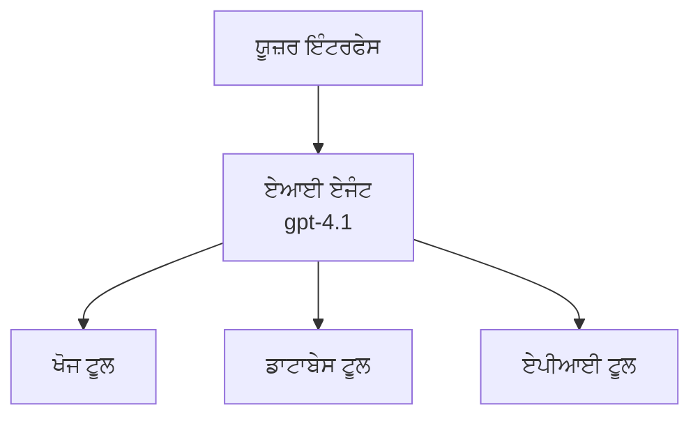
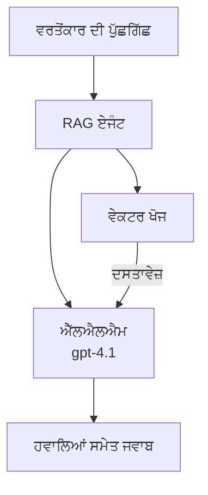
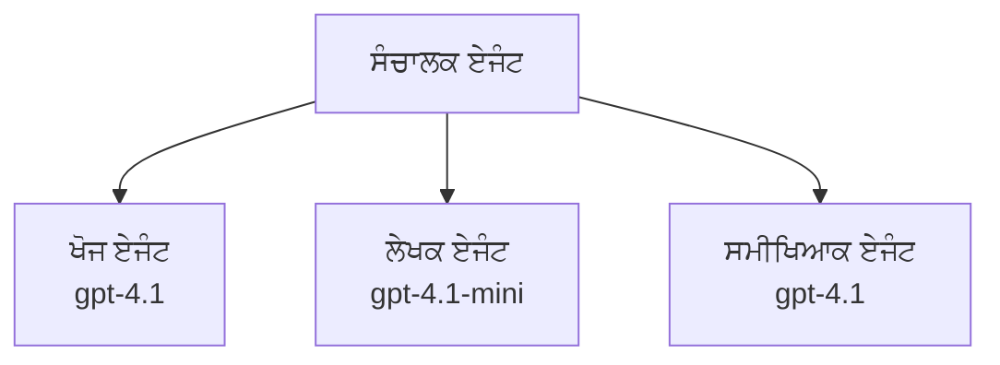

# AI Agents with Azure Developer CLI

**Chapter Navigation:**
- **📚 ਕੋਰਸ ਮੁੱਖ**: [AZD For Beginners](../../README.md)
- **📖 ਮੌਜੂਦਾ ਚੈਪਟਰ**: Chapter 2 - AI-First Development
- **⬅️ ਪਿਛਲਾ**: [Microsoft Foundry Integration](microsoft-foundry-integration.md)
- **➡️ ਅਗਲਾ**: [AI Model Deployment](ai-model-deployment.md)
- **🚀 ਉੱਨਤ**: [Multi-Agent Solutions](../../examples/retail-scenario.md)

---

## ਰੂਪਰੇਖਾ

AI ਏਜੰਟ ਸਵੈ-ਚਾਲਿਤ ਪ੍ਰੋਗਰਾਮ ਹੁੰਦੇ ਹਨ ਜੋ ਆਪਣੇ ਵਾਤਾਵਰਣ ਨੂੰ ਮਹਿਸੂਸ ਕਰ ਸਕਦੇ ਹਨ, ਫੈਸਲੇ ਲੈ ਸਕਦੇ ਹਨ, ਅਤੇ ਖਾਸ ਲਕੜੀਆਂ ਹਾਸਲ ਕਰਨ ਲਈ ਕਾਰਵਾਈ ਕਰ ਸਕਦੇ ਹਨ। ਸਧਾਰਨ ਚੈਟਬੋਟਾਂ ਤੋਂ ਵੱਖ-ਵੱਖ, ਏਜੰਟ ਕਰ ਸਕਦੇ ਹਨ:

- **ਟੂਲ ਵਰਤਣਾ** - API ਕਾਲ ਕਰਨਾ, ਡੇਟਾਬੇਸ ਖੋਜਣਾ, ਕੋਡ ਚਲਾਉਣਾ
- **ਯੋਜਨਾ ਅਤੇ ਤਰਕ** - ਜਟਿਲ ਕੰਮਾਂ ਨੂੰ ਕਦਮ-ਬ-ਕਦਮ ਤੋੜਨਾ
- **ਸੰਦਰਭ ਤੋਂ ਸਿੱਖਣਾ** - ਮੈਮੋਰੀ ਰੱਖਣਾ ਅਤੇ ਵਿਹਾਰ ਨੂੰ ਅਨੁਕੂਲ ਕਰਨਾ
- **ਸਹਿਯੋਗ** - ਹੋਰ ਏਜੰਟਾਂ (ਮਲਟੀ-ਏਜੰਟ ਪ੍ਰਣਾਲੀਆਂ) ਨਾਲ ਕੰਮ ਕਰਨਾ

ਇਹ ਗਾਈਡ ਤੁਹਾਨੂੰ ਦਿਖਾਵੇਗੀ ਕਿ Azure Developer CLI (azd) ਦੀ ਵਰਤੋਂ ਕਰਕੇ Azure 'ਤੇ AI ਏਜੰਟ ਕਿਵੇਂ ਡਿਪਲੌਇ ਕਰਨੇ ਹਨ।

> **ਮਾਨਤਾ ਨੋਟ (2026-03-25):** ਇਸ ਗਾਈਡ ਦੀ ਸਮੀਖਿਆ `azd` `1.23.12` ਅਤੇ `azure.ai.agents` `0.1.18-preview` ਦੇ ਖਿਲਾਫ ਕੀਤੀ ਗਈ ਸੀ। `azd ai` ਅਨੁਭਵ ਹਾਲੇ ਵੀ ਪ੍ਰਿਵਿ੍ਯੂ-ਚਲਿਤ ਹੈ, ਇਸ ਲਈ ਜੇ ਤੁਹਾਡੇ ਇੰਸਟਾਲ ਕੀਤੇ ਝੰਡੇ ਵੱਖਰੇ ਹਨ ਤਾਂ ਐਕਸਟੈਂਸ਼ਨ ਸਹਾਇਤਾ ਦੀ ਜਾਂਚ ਕਰੋ।

## ਸਿੱਖਣ ਦੇ ਲਕੜੀ

ਇਸ ਗਾਈਡ ਨੂੰ ਪੂਰਾ ਕਰਨ ਦੇ ਬਾਅਦ, ਤੁਸੀਂ:
- ਸਮਝੋਗੇ ਕਿ AI ਏਜੰਟ ਕੀ ਹਨ ਅਤੇ ਉਹ ਚੈਟਬੋਟਾਂ ਤੋਂ ਕਿਵੇਂ ਵੱਖਰੇ ਹਨ
- AZD ਦੀ ਵਰਤੋਂ ਕਰਕੇ ਪਹਿਲਾਂ ਤੋਂ ਬਣਾਏ ਗਏ AI ਏਜੰਟ ਟੈਂਪਲੇਟ ਡਿਪਲੌਇ ਕਰੋਗੇ
- ਕਸਟਮ ਏਜੰਟਾਂ ਲਈ Foundry Agents ਨੂੰ ਕੰਫਿਗਰ ਕਰੋਗੇ
- ਮੁੱਢਲੇ ਏਜੰਟ ਪੈਟਰਨ (ਟੂਲ ਵਰਤੋਂ, RAG, ਮਲਟੀ-ਏਜੰਟ) ਲਾਗੂ ਕਰੋਗੇ
- ਡਿਪਲੌਇ ਕੀਤੇ ਏਜੰਟਾਂ ਨੂੰ ਮੋਨਿਟਰ ਅਤੇ ਡੀਬੱਗ ਕਰੋਗੇ

## ਸਿੱਖਣ ਦੇ ਨਤੀਜੇ

ਪੂਰਾ ਕਰਨ 'ਤੇ, ਤੁਸੀਂ ਸਮਰੱਥ ਹੋਵੋਗੇ:
- ਇਕੋ ਅਦੇਸ਼ ਨਾਲ Azure 'ਤੇ AI ਏਜੰਟ ਐਪਲਿਕੇਸ਼ਨ ਡਿਪਲੌਇ ਕਰਨਾ
- ਏਜੰਟ ਟੂਲ ਅਤੇ ਸਮਰੱਥਾਵਾਂ ਨੂੰ ਕੰਫਿਗਰ ਕਰਨਾ
- ਏਜੰਟਾਂ ਨਾਲ ਰੀਟ੍ਰੀਵਲ-ਓਗਮੈਂਟਿਡ ਜਨਰੇਸ਼ਨ (RAG) ਲਾਗੂ ਕਰਨਾ
- ਜਟਿਲ ਵਰਕਫਲੋਜ਼ ਲਈ ਮਲਟੀ-ਏਜੰਟ ਆਰਕੀਟੈਕਚਰ ਡਿਜ਼ਾਈਨ ਕਰਨਾ
- ਆਮ ਏਜੰਟ ਡਿਪਲੌਇਮੈਂਟ ਸਮੱਸਿਆਵਾਂ ਦਾ ਟ੍ਰਬਲਸ਼ੂਟ ਕਰਨਾ

---

## 🤖 ਏਜੰਟ ਨੂੰ ਚੈਟਬੋਟ ਨਾਲੋਂ ਵੱਖਰਾ ਕੀ ਬਣਾਂਦਾ ਹੈ?

| Feature | Chatbot | AI Agent |
|---------|---------|----------|
| **Behavior** | Responds to prompts | Takes autonomous actions |
| **Tools** | None | Can call APIs, search, execute code |
| **Memory** | Session-based only | Persistent memory across sessions |
| **Planning** | Single response | Multi-step reasoning |
| **Collaboration** | Single entity | Can work with other agents |

### ਸਰਲ ਤਰਕ-ਸਮੇਤਕ ਉਦਾਹਰਨ

- **ਚੈਟਬੋਟ** = ਜਾਣਕਾਰੀ ਡੈਸਕ ’ਤੇ ਪ੍ਰਸ਼ਨਾਂ ਦੇ ਉੱਤਰ ਦੇਣ ਵਾਲਾ ਇਕ ਮਦਦਗਾਰ ਵਿਅਕਤੀ
- **AI ਏਜੰਟ** = ਇਕ ਨਿੱਜੀ ਸਹਾਇਕ ਜੋ ਕਾਲਾਂ ਕਰ ਸਕਦਾ ਹੈ, ਨਿਯੁਕਤੀਆਂ ਬੁੱਕ ਕਰ ਸਕਦਾ ਹੈ, ਅਤੇ ਤੁਹਾਡੇ ਚਾਹੇ ਕੰਮ ਮੁਕੰਮਲ ਕਰ ਸਕਦਾ ਹੈ

---

## 🚀 ਤੁਰੰਤ ਸ਼ੁਰੂਆਤ: ਆਪਣਾ ਪਹਿਲਾ ਏਜੰਟ ਡਿਪਲੌਇ ਕਰੋ

### ਵਿਕਲਪ 1: Foundry Agents Template (ਸਿਫਾਰਸ਼ੀ)

```bash
# ਏਆਈ ਏਜੰਟਾਂ ਦਾ ਟੈਂਪਲੇਟ ਆਰੰਭ ਕਰੋ
azd init --template get-started-with-ai-agents

# Azure ਤੇ ਤੈਨਾਤ ਕਰੋ
azd up
```

**ਕੀ ਡਿਪਲੌਇ ਹੁੰਦਾ ਹੈ:**
- ✅ Foundry Agents
- ✅ Microsoft Foundry Models (gpt-4.1)
- ✅ Azure AI Search (RAG ਲਈ)
- ✅ Azure Container Apps (ਵੈੱਬ ਇੰਟਰਫੇਸ)
- ✅ Application Insights (ਮੋਨਿਟਰਿੰਗ)

**ਸਮਾਂ:** ~15-20 ਮਿੰਟ
**ਲਾਗਤ:** ~$100-150/ਮਹੀਨਾ (ਡਿਵੈਲਪਮੈਂਟ)

### ਵਿਕਲਪ 2: OpenAI Agent with Prompty

```bash
# Prompty-ਅਧਾਰਿਤ ਏਜੰਟ ਟੈਮਪਲੇਟ ਨੂੰ ਆਰੰਭ ਕਰੋ
azd init --template agent-openai-python-prompty

# Azure 'ਤੇ ਤੈਨਾਤ ਕਰੋ
azd up
```

**ਕੀ ਡਿਪਲੌਇ ਹੁੰਦਾ ਹੈ:**
- ✅ Azure Functions (ਸਰਵਰਲੈਸ ਏਜੰਟ ਐਗਜ਼ੈਕਿਊਸ਼ਨ)
- ✅ Microsoft Foundry Models
- ✅ Prompty ਕੰਫਿਗਰੇਸ਼ਨ ਫਾਈਲਾਂ
- ✅ ਨਮੂਨਾ ਏਜੰਟ ਇੰਪਲਿਮੈਂਟੇਸ਼ਨ

**ਸਮਾਂ:** ~10-15 ਮਿੰਟ
**ਲਾਗਤ:** ~$50-100/ਮਹੀਨਾ (ਡਿਵੈਲਪਮੈਂਟ)

### ਵਿਕਲਪ 3: RAG ਚੈਟ ਏਜੰਟ

```bash
# RAG ਚੈਟ ਟੈਮਪਲੇਟ ਨੂੰ ਆਰੰਭ ਕਰੋ
azd init --template azure-search-openai-demo

# Azure ਤੇ ਤੈਨਾਤ ਕਰੋ
azd up
```

**ਕੀ ਡਿਪਲੌਇ ਹੁੰਦਾ ਹੈ:**
- ✅ Microsoft Foundry Models
- ✅ ਨਮੂਨਾ ਡੇਟਾ ਨਾਲ Azure AI Search
- ✅ ਦਸਤਾਵੇਜ਼ ਪ੍ਰੋਸੈਸਿੰਗ ਪਾਈਪਲਾਈਨ
- ✅ ਹਵਾਲਿਆਂ ਦੇ ਨਾਲ ਚੈਟ ਇੰਟਰਫੇਸ

**ਸਮਾਂ:** ~15-25 ਮਿੰਟ
**ਲਾਗਤ:** ~$80-150/ਮਹੀਨਾ (ਡਿਵੈਲਪਮੈਂਟ)

### ਵਿਕਲਪ 4: AZD AI Agent Init (ਮੈਨਿਫੈਸਟ ਜਾਂ ਟੈਂਪਲੇਟ-ਅਧਾਰਿਤ ਪ੍ਰਿਵਿਊ)

ਜੇ ਤੁਹਾਡੇ ਕੋਲ ਏਜੰਟ ਮੈਨਿਫੈਸਟ ਫਾਈਲ ਹੈ, ਤਾਂ ਤੁਸੀਂ `azd ai` ਕਮਾਂਡ ਦੀ ਵਰਤੋਂ ਕਰਕੇ Foundry Agent Service ਪ੍ਰੋਜੈਕਟ ਸੀਫੋਲਡ ਕਰ ਸਕਦੇ ਹੋ। ਹਾਲੀਆ ਪ੍ਰਿਵਿਊ ਰਿਲੀਜ਼ਾਂ ਨੇ ਟੈਂਪਲੇਟ-ਅਧਾਰਿਤ ਇਨੀਸ਼ੀਅਲਾਈਜ਼ੇਸ਼ਨ ਸਹਾਇਤਾ ਵੀ ਜੋੜੀ ਹੈ, ਇਸ ਲਈ ਸਹੀ ਪ੍ਰਾਂਪਟ ਫਲੋ ਤੁਹਾਡੇ ਇੰਸਟਾਲ ਕੀਤੇ ਐਕਸਟੈਂਸ਼ਨ ਵਰਜ਼ਨ ਦੇ ਆਧਾਰ 'ਤੇ ਥੋੜ੍ਹ੍ਹਾ ਬਦਲ ਸਕਦਾ ਹੈ।

```bash
# AI ਏਜੰਟਸ ਐਕਸਟੇੰਸ਼ਨ ਇੰਸਟਾਲ ਕਰੋ
azd extension install azure.ai.agents

# ਵਿਕਲਪਿਕ: ਇੰਸਟਾਲ ਕੀਤੇ ਪ੍ਰੀਵਿਊ ਵਰਜ਼ਨ ਦੀ ਪੁਸ਼ਟੀ ਕਰੋ
azd extension show azure.ai.agents

# ਏਜੰਟ ਮੈਨਿਫੈਸਟ ਤੋਂ ਸ਼ੁਰੂਆਤ ਕਰੋ
azd ai agent init -m agent-manifest.yaml

# Azure ਤੇ ਤੈਨਾਤ ਕਰੋ
azd up
```

**ਜਦੋਂ `azd ai agent init` ਵਰਤਣਾ ਹੈ ਬਨਾਮ `azd init --template`:**

| Approach | Best For | How It Works |
|----------|----------|------|
| `azd init --template` | ਇੱਕ ਕੰਮਕਾਜ਼ ਨਮੂਨਾ ਐਪ ਤੋਂ ਸ਼ੁਰੂ ਕਰਨਾ | ਕੋਡ + ਇੰਫਰਾ ਦੇ ਨਾਲ ਪੂਰਾ ਟੈਂਪਲੇਟ ਰਿਪੋ ਕਲੋਨ ਕਰਦਾ ਹੈ |
| `azd ai agent init -m` | ਆਪਣੇ ਐਜੰਟ ਮੈਨਿਫੈਸਟ ਤੋਂ ਬਣਾਉਣਾ | ਤੁਹਾਡੇ ਏਜੰਟ ਪਰਿਭਾਸ਼ਾ ਤੋਂ ਪ੍ਰੋਜੈਕਟ ਸਟ੍ਰਕਚਰ ਸੀਫੋਲਡ ਕਰਦਾ ਹੈ |

> **ਟਿੱਪ:** ਸਿੱਖਣ ਵਾਲੀ ਹਾਲਤ ਵਿੱਚ `azd init --template` ਵਰਤੋ (ਉਪਰ ਦਿੱਤੇ ਵਿਕਲਪ 1-3)। ਉਤਪਾਦਨ ਏਜੰਟ ਬਣਾਉਂਦੇ ਸਮੇਂ ਆਪਣੀ ਮੈਨਿਫੈਸਟ ਵਰਤ ਕੇ `azd ai agent init` ਵਰਤੋ। ਪੂਰੇ ਰੈਫਰੈਂਸ ਲਈ ਦੇਖੋ [AZD AI CLI Commands](../chapter-08-production/production-ai-practices.md#azd-ai-cli-commands-and-extensions)।

---

## 🏗️ ਏਜੰਟ ਆਰਕੀਟੈਕਚਰ ਪੈਟਰਨ

### ਪੈਟਰਨ 1: ਸਿੰਗਲ ਏਜੰਟ ਨਾਲ ਟੂਲ

ਸਭ ਤੋਂ ਸਰਲ ਏਜੰਟ ਪੈਟਰਨ - ਇਕ ਏਜੰਟ ਜੋ ਕਈ ਟੂਲ ਵਰਤ ਸਕਦਾ ਹੈ।


**ਸਭ ਤੋਂ ਵਧੀਆ ਲਈ:**
- ਕਸਟਮਰ ਸਪੋਰਟ ਬੋਟ
- ਰਿਸਰਚ ਸਹਾਇਕ
- ਡੇਟਾ ਵਿਸ਼ਲੇਸ਼ਣ ਏਜੰਟ

**AZD ਟੈਂਪਲੇਟ:** `azure-search-openai-demo`

### ਪੈਟਰਨ 2: RAG ਏਜੰਟ (ਰੀਟ੍ਰੀਵਲ-ਓਗਮੈਂਟਿਡ ਜਨਰੇਸ਼ਨ)

ਇੱਕ ਏਜੰਟ ਜੋ ਜਵਾਬ ਬਣਾਉਣ ਤੋਂ ਪਹਿਲਾਂ ਸਬੰਧਤ ਦਸਤਾਵੇਜ਼ ਰੀਟ੍ਰੀਵ ਕਰਦਾ ਹੈ।


**ਸਭ ਤੋਂ ਵਧੀਆ ਲਈ:**
- ਐਂਟਰਪ੍ਰਾਈਜ਼ ਨੋਲੇਜ ਬੇਸ
- ਦਸਤਾਵੇਜ਼ Q&A ਸਿਸਟਮ
- ਕੰਪਲਾਇੰਸ ਅਤੇ ਕਾਨੂੰਨੀ ਖੋਜ

**AZD ਟੈਂਪਲੇਟ:** `azure-search-openai-demo`

### ਪੈਟਰਨ 3: ਮਲਟੀ-ਏਜੰਟ ਪ੍ਰਣਾਲੀ

ਕਈ ਵਿਸ਼ੇਸ਼ਤਾਅ ਵਾਲੇ ਏਜੰਟ ਇੱਕੱਠੇ ਮਿਲਕੇ ਜਟਿਲ ਕੰਮਾਂ 'ਤੇ ਕੰਮ ਕਰਦੇ ਹਨ।


**ਸਭ ਤੋਂ ਵਧੀਆ ਲਈ:**
- ਜਟਿਲ ਸਮੱਗਰੀ ਬਣਾਉਣਾ
- ਬਹੁ-ਕਦਮੀ ਵਰਕਫਲੋਜ਼
- ਵੱਖ-ਵੱਖ ਮਾਹਿਰਤਾਂ ਦੀ ਲੋੜ ਵਾਲੇ ਕੰਮ

**ਹੋਰ ਜਾਣੋ:** [Multi-Agent Coordination Patterns](../chapter-06-pre-deployment/coordination-patterns.md)

---

## ⚙️ ਏਜੰਟ ਟੂਲਾਂ ਦੀ ਕੰਫਿਗਰੇਸ਼ਨ

ਏਜੰਟ ਸ਼ਕਤੀਸ਼ਾਲੀ ਬਣਦੇ ਹਨ ਜਦੋਂ ਉਹ ਟੂਲ ਵਰਤ ਸਕਦੇ ਹਨ। ਇਥੇ ਆਮ ਟੂਲਾਂ ਨੂੰ ਕੰਫਿਗਰ ਕਰਨ ਦਾ ਤਰੀਕਾ ਦਿੱਤਾ ਗਿਆ ਹੈ:

### Foundry Agents ਵਿੱਚ ਟੂਲ ਕੰਫਿਗਰੇਸ਼ਨ

```python
# ਏਜੰਟ_ਕਨਫਿਗ.py
from azure.ai.projects import AIProjectClient
from azure.ai.projects.models import FunctionTool, CodeInterpreterTool

# ਕਸਟਮ ਟੂਲ ਪਰਿਭਾਸ਼ਿਤ ਕਰੋ
search_tool = FunctionTool(
    name="search_knowledge_base",
    description="Search the company knowledge base for relevant documents",
    parameters={
        "type": "object",
        "properties": {
            "query": {
                "type": "string",
                "description": "The search query"
            }
        },
        "required": ["query"]
    }
)

# ਟੂਲਾਂ ਨਾਲ ਏਜੰਟ ਬਣਾਓ
agent = project_client.agents.create_agent(
    model="gpt-4.1",
    name="Support Agent",
    instructions="You are a helpful support agent. Use the search tool to find relevant information.",
    tools=[search_tool, CodeInterpreterTool()]
)
```

### ਐਨਵਾਇਰਨਮੈਂਟ ਕੰਫਿਗਰੇਸ਼ਨ

```bash
# ਏਜੰਟ-ਖ਼ਾਸ ਇਨਵਾਇਰਨਮੈਂਟ ਵੈਰੀਏਬਲ ਸੈੱਟ ਕਰੋ
azd env set AZURE_OPENAI_MODEL "gpt-4.1"
azd env set AGENT_INSTRUCTIONS "You are a helpful assistant..."
azd env set ENABLE_CODE_INTERPRETER "true"
azd env set ENABLE_FILE_SEARCH "true"

# ਅਪਡੇਟ ਕੀਤੀ ਗਈ ਸੰਰਚਨਾ ਨਾਲ ਤੈਨਾਤ ਕਰੋ
azd deploy
```

---

## 📊 ਏਜੰਟਾਂ ਦੀ ਮੋਨਿਟਰਿੰਗ

### Application Insights ਇੰਟੀਗ੍ਰੇਸ਼ਨ

ਸਾਰੀਆਂ AZD ਏਜੰਟ ਟੈਂਪਲੇਟਾਂ ਵਿੱਚ ਮੋਨਿਟਰਿੰਗ ਲਈ Application Insights ਸ਼ਾਮਲ ਹੁੰਦੀ ਹੈ:

```bash
# ਨਿਗਰਾਨੀ ਡੈਸ਼ਬੋਰਡ ਖੋਲ੍ਹੋ
azd monitor --overview

# ਲਾਈਵ ਲੌਗਾਂ ਵੇਖੋ
azd monitor --logs

# ਲਾਈਵ ਮੈਟ੍ਰਿਕਸ ਵੇਖੋ
azd monitor --live
```

### ਟ੍ਰੈਕ ਕਰਨ ਲਈ ਮੁੱਖ ਮੈਟ੍ਰਿਕਸ

| Metric | Description | Target |
|--------|-------------|--------|
| Response Latency | Time to generate response | < 5 seconds |
| Token Usage | Tokens per request | Monitor for cost |
| Tool Call Success Rate | % of successful tool executions | > 95% |
| Error Rate | Failed agent requests | < 1% |
| User Satisfaction | Feedback scores | > 4.0/5.0 |

### ਏਜੰਟਾਂ ਲਈ ਕਸਟਮ ਲੌਗਿੰਗ

```python
import os
from azure.monitor.opentelemetry import configure_azure_monitor
from opentelemetry import trace

# OpenTelemetry ਨਾਲ Azure Monitor ਨੂੰ ਸੰਰਚਿਤ ਕਰੋ
configure_azure_monitor(
    connection_string=os.environ["APPLICATIONINSIGHTS_CONNECTION_STRING"]
)

tracer = trace.get_tracer(__name__)

def log_agent_interaction(user_query, agent_response, tools_used, latency_ms):
    with tracer.start_as_current_span("agent_interaction") as span:
        span.set_attributes({
            "user_query": user_query,
            "response_length": len(agent_response),
            "tools_used": tools_used,
            "latency_ms": latency_ms
        })
```

> **ਨੋਟ:** ਲੋੜੀਂਦੇ ਪੈਕੇਜਸ ਇੰਸਟਾਲ ਕਰੋ: `pip install azure-monitor-opentelemetry opentelemetry`

---

## 💰 ਲਾਗਤ ਬਾਰੇ ਵਿਚਾਰ

### ਪੈਟਰਨ ਅਨੁਸਾਰ ਅੰਦਾਜ਼ਿਤ ਮਹੀਨਾਵਾਰ ਲਾਗਤ

| Pattern | Dev Environment | Production |
|---------|-----------------|------------|
| Single Agent | $50-100 | $200-500 |
| RAG Agent | $80-150 | $300-800 |
| Multi-Agent (2-3 agents) | $150-300 | $500-1,500 |
| Enterprise Multi-Agent | $300-500 | $1,500-5,000+ |

### ਲਾਗਤ ਘਟਾਉਣ ਲਈ ਸੁਝਾਅ

1. **ਸਧਾਰਨ ਕਾਰਜਾਂ ਲਈ gpt-4.1-mini ਵਰਤੋ**
   ```bash
   azd env set AZURE_OPENAI_MODEL "gpt-4.1-mini"
   ```

2. **ਦੋਹਰਾਏ ਗਏ ਪ੍ਰਸ਼ਨਾਂ ਲਈ ਕੈਸ਼ਿੰਗ ਲਾਗੂ ਕਰੋ**
   ```python
   from functools import lru_cache
   
   @lru_cache(maxsize=1000)
   def get_cached_response(query_hash):
       return agent.run(query_hash)
   ```

3. **ਹਰ ਰਨ ਲਈ ਟੋਕਨ ਸੀਮਾਵਾਂ ਰੱਖੋ**
   ```python
   # ਏਜੈਂਟ ਚਲਾਉਂਦੇ ਸਮੇਂ max_completion_tokens ਸੈੱਟ ਕਰੋ, ਬਣਾਉਣ ਵੇਲੇ ਨਹੀਂ
   run = project_client.agents.create_run(
       thread_id=thread.id,
       agent_id=agent.id,
       max_completion_tokens=1000  # ਜਵਾਬ ਦੀ ਲੰਬਾਈ ਸੀਮਤ ਕਰੋ
   )
   ```

4. **ਉਪਯੋਗ ਨਹੀਂ ਹੋਣ ਵੇਲੇ ਸੇਟ ਸਕੇਲ-ਟੂ-ਜ਼ੀਰੋ ਕਰੋ**
   ```bash
   # Container Apps ਆਪ-ਬ-ਆਪ ਜ਼ੀਰੋ ਤੱਕ ਸਕੇਲ ਹੋ ਜਾਂਦੇ ਹਨ
   azd env set MIN_REPLICAS "0"
   ```

---

## 🔧 ਏਜੰਟਾਂ ਦੀ ਟ੍ਰਬਲਸ਼ੂਟਿੰਗ

### ਆਮ ਸਮੱਸਿਆਵਾਂ ਅਤੇ ਹੱਲ

<details>
<summary><strong>❌ ਏਜੰਟ ਟੂਲ ਕਾਲਾਂ ਦਾ ਜਵਾਬ ਨਹੀਂ ਦੇ ਰਿਹਾ</strong></summary>

```bash
# ਜਾਂਚੋ ਕਿ ਟੂਲ ਸਹੀ ਤਰ੍ਹਾਂ ਦਰਜ ਕੀਤੇ ਗਏ ਹਨ
azd show

# OpenAI ਡਿਪਲੌਇਮੈਂਟ ਦੀ ਪੁਸ਼ਟੀ ਕਰੋ
az cognitiveservices account deployment list \
  --name $AZURE_OPENAI_NAME \
  --resource-group $RG_NAME

# ਏਜੰਟ ਲੌਗਸ ਦੀ ਜਾਂਚ ਕਰੋ
azd monitor --logs
```

**ਆਮ ਕਾਰਨ:**
- ਟੂਲ ਫੰਕਸ਼ਨ ਦਾ ਸਿਗਨੇਚਰ ਮਿਲਦਾ-ਜੁਲਦਾ ਨਹੀਂ ਹੈ
- ਲੋੜੀਂਦੇ ਅਨੁਮਤੀਆਂ ਮੌਜੂਦ ਨਹੀਂ ਹਨ
- API ਐਂਡਪੌਇੰਟ ਪਹੁੰਚ ਯੋਗ ਨਹੀਂ ਹੈ
</details>

<details>
<summary><strong>❌ ਏਜੰਟ ਜਵਾਬਾਂ ਵਿੱਚ ਉੱਚ ਲੇਟੈਂਸੀ</strong></summary>

```bash
# Application Insights ਵਿੱਚ ਰੁਕਾਵਟਾਂ ਲਈ ਜਾਂਚ ਕਰੋ
azd monitor --live

# ਇੱਕ ਤੇਜ਼ ਮਾਡਲ ਵਰतਣ ਬਾਰੇ ਵਿਚਾਰ ਕਰੋ
azd env set AZURE_OPENAI_MODEL "gpt-4.1-mini"
azd deploy
```

**ਸੁਧਾਰ ਲਈ ਸੁਝਾਅ:**
- ਸਟ੍ਰੀਮਿੰਗ ਜਵਾਬ ਵਰਤੋ
- ਜਵਾਬ ਕੈਸ਼ਿੰਗ ਲਾਗੂ ਕਰੋ
- ਕੰਟੈਕਸਟ ਵਿੰਡੋ ਦਾ ਆਕਾਰ ਘਟਾਓ
</details>

<details>
<summary><strong>❌ ਏਜੰਟ ਗਲਤ ਜਾਂ ਹਾਲੂਸੀਨੇਟਿੰਗ ਜਾਣਕਾਰੀ ਵਾਪਸ ਕਰ ਰਿਹਾ ਹੈ</strong></summary>

```python
# ਸਿਸਟਮ ਪ੍ਰਾਂਪਟਾਂ ਨੂੰ ਬਿਹਤਰ ਬਣਾ ਕੇ ਸੁਧਾਰ ਕਰੋ
instructions = """
You are a helpful assistant. IMPORTANT:
- Only answer based on provided context
- If you don't know, say "I don't know"
- Always cite your sources
- Never make up information
"""

# ਗ੍ਰਾਉਂਡਿੰਗ ਲਈ ਰੀਟਰੀਵਲ ਸ਼ਾਮਲ ਕਰੋ
agent = project_client.agents.create_agent(
    model="gpt-4.1",
    instructions=instructions,
    tools=[FileSearchTool()]  # ਜਵਾਬਾਂ ਨੂੰ ਦਸਤਾਵੇਜ਼ਾਂ ਵਿੱਚ ਆਧਾਰਿਤ ਕਰੋ
)
```
</details>

<details>
<summary><strong>❌ ਟੋਕਨ ਸੀਮਾ ਅਤਿਕਰਮ ਤ੍ਰੁੱਟੀਆਂ</strong></summary>

```python
# ਸੰਦਰਭ ਖਿੜਕੀ ਪ੍ਰਬੰਧਨ ਨੂੰ ਲਾਗੂ ਕਰੋ
def truncate_context(messages, max_tokens=8000, model="gpt-4.1"):
    """Keep only recent messages within token limit."""
    import tiktoken
    encoding = tiktoken.encoding_for_model(model)
    total_tokens = 0
    truncated = []
    
    for msg in reversed(messages):
        msg_tokens = len(encoding.encode(msg.content))
        if total_tokens + msg_tokens > max_tokens:
            break
        truncated.insert(0, msg)
        total_tokens += msg_tokens
    
    return truncated
```
</details>

---

## 🎓 ਹੱਥੋਂ-ਅਭਿਆਸ

### ਅਭਿਆਸ 1: ਇੱਕ ਬੇਸਿਕ ਏਜੰਟ ਡਿਪਲੌਇ ਕਰੋ (20 ਮਿੰਟ)

**ਲਕੜੀ:** AZD ਦੀ ਵਰਤੋਂ ਕਰਕੇ ਆਪਣਾ ਪਹਿਲਾ AI ਏਜੰਟ ਡਿਪਲੌਇ ਕਰੋ

```bash
# ਕਦਮ 1: ਟੈਮਪਲੇਟ ਨੂੰ ਆਰੰਭ ਕਰੋ
azd init --template get-started-with-ai-agents

# ਕਦਮ 2: Azure ਵਿੱਚ ਲੌਗਿਨ ਕਰੋ
azd auth login
# ਜੇ ਤੁਸੀਂ ਵੱਖ-ਵੱਖ ਟੇਨੈਂਟਾਂ ਵਿੱਚ ਕੰਮ ਕਰਦੇ ਹੋ, ਤਾਂ --tenant-id <tenant-id> ਸ਼ਾਮਲ ਕਰੋ

# ਕਦਮ 3: ਤਾਇਨਾਤ ਕਰੋ
azd up

# ਕਦਮ 4: ਏਜੰਟ ਦੀ ਜਾਂਚ ਕਰੋ
# ਤਾਇਨਾਤ ਹੋਣ ਤੋਂ ਬਾਅਦ ਉਮੀਦ ਕੀਤੀ ਆਉਟਪੁੱਟ:
#   ਤਾਇਨਾਤ ਪੂਰੀ ਹੋ ਗਈ!
#   ਐਂਡਪੋਇੰਟ: https://<app-name>.<region>.azurecontainerapps.io
# ਆਉਟਪੁੱਟ ਵਿੱਚ ਦਿਖਾਈ ਗਈ URL ਖੋਲ੍ਹੋ ਅਤੇ ਇੱਕ ਸਵਾਲ ਪੁੱਛ ਕੇ ਵੇਖੋ

# ਕਦਮ 5: ਮਾਨੀਟਰਿੰਗ ਵੇਖੋ
azd monitor --overview

# ਕਦਮ 6: ਸਾਫ਼-ਸੁਥਰਾ ਕਰੋ
azd down --force --purge
```

**ਸਫਲਤਾ ਦੇ ਮਾਪਦੰਡ:**
- [ ] ਏਜੰਟ ਪ੍ਰਸ਼ਨਾਂ ਦਾ ਜਵਾਬ ਦਿੰਦਾ ਹੈ
- [ ] `azd monitor` ਰਾਹੀਂ ਮੋਨਿਟਰਿੰਗ ਡੈਸ਼ਬੋਰਡ ਤੱਕ ਪਹੁੰਚ ਹੋ ਸਕਦੀ ਹੈ
- [ ] ਰਿਸੋর্সਸ ਸਫਲਤਾਪੂਰਵਕ ਸਾਫ ਕੀਤੇ ਗਏ

### ਅਭਿਆਸ 2: ਇੱਕ ਕਸਟਮ ਟੂਲ ਜੋੜੋ (30 ਮਿੰਟ)

**ਲਕੜੀ:** ਆਪਣੇ ਏਜੰਟ ਵਿੱਚ ਇੱਕ ਕਸਟਮ ਟੂਲ ਸ਼ਾਮਲ ਕਰੋ

1. ਏਜੰਟ ਟੈਂਪਲੇਟ ਡਿਪਲੌਇ ਕਰੋ:
   ```bash
   azd init --template get-started-with-ai-agents
   azd up
   ```
2. ਆਪਣੇ ਏਜੰਟ ਕੋਡ ਵਿੱਚ ਨਵਾਂ ਟੂਲ ਫੰਕਸ਼ਨ ਬਣਾਓ:
   ```python
   def get_weather(location: str) -> str:
       """Get current weather for a location."""
       # ਮੌਸਮ ਸੇਵਾ ਲਈ API ਕਾਲ
       return f"Weather in {location}: Sunny, 72°F"
   ```
3. ਏਜੰਟ ਨਾਲ ਟੂਲ ਰਜਿਸਟਰ ਕਰੋ:
   ```python
   from azure.ai.projects.models import FunctionTool

   weather_tool = FunctionTool(
       name="get_weather",
       description="Get current weather for a location",
       parameters={
           "type": "object",
           "properties": {
               "location": {"type": "string", "description": "City name"}
           },
           "required": ["location"]
       }
   )

   agent = project_client.agents.create_agent(
       model="gpt-4.1",
       name="Weather Agent",
       tools=[weather_tool]
   )
   ```
4. ਮੁੜ-ਡਿਪਲੌਇ ਅਤੇ ਟੈਸਟ ਕਰੋ:
   ```bash
   azd deploy
   # ਪ੍ਰਸ਼ਨ: "ਸੀਏਟਲ ਵਿੱਚ ਮੌਸਮ ਕਿਹੜਾ ਹੈ?"
   # ਉਮੀਦ ਕੀਤੀ ਗਈ: ਏਜੰਟ get_weather("Seattle") ਨੂੰ ਕਾਲ ਕਰਦਾ ਹੈ ਅਤੇ ਮੌਸਮ ਦੀ ਜਾਣਕਾਰੀ ਵਾਪਸ ਕਰਦਾ ਹੈ
   ```

**ਸਫਲਤਾ ਦੇ ਮਾਪਦੰਡ:**
- [ ] ਏਜੰਟ ਮੌਸਮ-ਸਬੰਧੀ ਪ੍ਰਸ਼ਨਾਂ ਨੂੰ ਪਛਾਣਦਾ ਹੈ
- [ ] ਟੂਲ ਸਹੀ ਤਰੀਕੇ ਨਾਲ ਕਾਲ ਹੁੰਦਾ ਹੈ
- [ ] ਜਵਾਬ ਵਿੱਚ ਮੌਸਮ ਜਾਣਕਾਰੀ ਸ਼ਾਮਲ ਹੈ

### ਅਭਿਆਸ 3: ਇੱਕ RAG ਏਜੰਟ ਬਣਾਓ (45 ਮਿੰਟ)

**ਲਕੜੀ:** ਇੱਕ ਐਜੰਟ ਬਣਾਓ ਜੋ ਤੁਹਾਡੇ ਦਸਤਾਵੇਜ਼ਾਂ ਤੋਂ ਪ੍ਰਸ਼ਨਾਂ ਦੇ ਜਵਾਬ ਦਿੰਦਾ ਹੈ

```bash
# ਕਦਮ 1: RAG ਟੈਮਪਲੇਟ ਤਾਇਨਾਤ ਕਰੋ
azd init --template azure-search-openai-demo
azd up

# ਕਦਮ 2: ਆਪਣੇ ਦਸਤਾਵੇਜ਼ ਅਪਲੋਡ ਕਰੋ
# PDF/TXT ਫਾਇਲਾਂ ਨੂੰ data/ ਡਾਇਰੈਕਟਰੀ ਵਿੱਚ ਰੱਖੋ, ਫਿਰ ਚਲਾਓ:
python scripts/prepdocs.py

# ਕਦਮ 3: ਖੇਤਰ-ਨਿਰਧਾਰਤ ਸਵਾਲਾਂ ਨਾਲ ਟੈਸਟ ਕਰੋ
# azd up ਦੇ ਆਉਟਪੁੱਟ ਤੋਂ ਵੈਬ ਐਪ URL ਖੋਲ੍ਹੋ
# ਆਪਣੇ ਅਪਲੋਡ ਕੀਤੇ ਦਸਤਾਵੇਜ਼ਾਂ ਬਾਰੇ ਸਵਾਲ ਪੁੱਛੋ
# ਜਵਾਬਾਂ ਵਿੱਚ ਹਵਾਲੇ ਸ਼ਾਮਲ ਹੋਣੇ ਚਾਹੀਦੇ ਹਨ, ਉਦਾਹਰਣ ਵੱਜੋਂ [doc.pdf]
```

**ਸਫਲਤਾ ਦੇ ਮਾਪਦੰਡ:**
- [ ] ਏਜੰਟ ਅਪਲੋਡ ਕੀਤੀਆਂ ਦਸਤਾਵੇਜ਼ਾਂ ਤੋਂ ਜਵਾਬ ਦਿੰਦਾ ਹੈ
- [ ] ਜਵਾਬਾਂ ਵਿੱਚ ਹਵਾਲੇ ਸ਼ਾਮਲ ਹਨ
- [ ] ਆਉਟ-ਆਫ-ਸਕੋਪ ਪ੍ਰਸ਼ਨਾਂ 'ਤੇ ਹਾਲੂਸinareਸ਼ਨ ਨਹੀਂ ਹੁੰਦੀ

---

## 📚 ਅਗਲੇ ਕਦਮ

ਹੁਣ ਜਦੋਂ ਕਿ ਤੁਸੀਂ AI ਏਜੰਟਾਂ ਨੂੰ ਸਮਝ ਲਿਆ ਹੈ, ਇਨ੍ਹਾਂ ਉੱਨਤ ਵਿਸ਼ਿਆਂ ਦੀ ਖੋਜ ਕਰੋ:

| Topic | Description | Link |
|-------|-------------|------|
| **Multi-Agent Systems** | ਕਈ ਸਹਿਯੋਗੀ ਏਜੰਟਾਂ ਨਾਲ ਪ੍ਰਣਾਲੀਆਂ ਬਣਾਓ | [Retail Multi-Agent Example](../../examples/retail-scenario.md) |
| **Coordination Patterns** | ਓਰਕੈਸ्ट्रੇਸ਼ਨ ਅਤੇ ਸੰਚਾਰ ਪੈਟਰਨ ਸਿੱਖੋ | [Coordination Patterns](../chapter-06-pre-deployment/coordination-patterns.md) |
| **Production Deployment** | ਐਂਟਰਪ੍ਰਾਈਜ਼-ਤਿਆਰ ਏਜੰਟ ਡਿਪਲੌਇਮੈਂਟ | [Production AI Practices](../chapter-08-production/production-ai-practices.md) |
| **Agent Evaluation** | ਏਜੰਟ ਪ੍ਰਦਰਸ਼ਨ ਦੀ ਟੈਸਟਿੰਗ ਅਤੇ ਮੁਲਾਂਕਣ | [AI Troubleshooting](../chapter-07-troubleshooting/ai-troubleshooting.md) |
| **AI Workshop Lab** | ਹੱਥ-ਅਨ: ਆਪਣਾ AI ਹੱਲ AZD-ਤਿਆਰ ਬਣਾਓ | [AI Workshop Lab](ai-workshop-lab.md) |

---

## 📖 ਵਾਧੂ ਸਰੋਤ

### ਅਧਿਕਾਰਿਕ ਦਸਤਾਵੇਜ਼ੀਕਰਨ
- [Azure AI Agent Service](https://learn.microsoft.com/azure/ai-services/agents/)
- [Azure AI Foundry Agent Service Quickstart](https://learn.microsoft.com/azure/ai-services/agents/quickstart)
- [Semantic Kernel Agent Framework](https://learn.microsoft.com/semantic-kernel/)

### ਏਜੰਟਾਂ ਲਈ AZD ਟੈਂਪਲੇਟ
- [Get Started with AI Agents](https://github.com/Azure-Samples/get-started-with-ai-agents)
- [Agent OpenAI Python Prompty](https://github.com/Azure-Samples/agent-openai-python-prompty)
- [Azure Search OpenAI Demo](https://github.com/Azure-Samples/azure-search-openai-demo)

### ਭਾਈਚਾਰਾ ਸਰੋਤ
- [Awesome AZD - Agent Templates](https://azure.github.io/awesome-azd/?tags=ai-agents)
- [Azure AI Discord](https://discord.gg/microsoft-azure)
- [Microsoft Foundry Discord](https://discord.gg/nTYy5BXMWG)

### ਤੁਹਾਡੇ ਸੰਪਾਦਕ ਲਈ ਏਜੰਟ ਸਕਿਲਜ਼
- [**Microsoft Azure Agent Skills**](https://skills.sh/microsoft/github-copilot-for-azure) - GitHub Copilot, Cursor ਜਾਂ ਕਿਸੇ ਵੀ ਸਹਾਇਤ ਕਿੱਤੇ ਏਜੰਟ ਲਈ Azure ਵਿਕਾਸ ਲਈ ਦੁਬਾਰਾ ਵਰਤਣ ਯੋਗ AI ਏਜੰਟ ਸਕਿਲਜ਼ ਇੰਸਟਾਲ ਕਰੋ। ਇਸ ਵਿੱਚ [Azure AI](https://skills.sh/microsoft/github-copilot-for-azure/azure-ai), [Microsoft Foundry](https://skills.sh/microsoft/github-copilot-for-azure/microsoft-foundry), [deployment](https://skills.sh/microsoft/github-copilot-for-azure/azure-deploy), ਅਤੇ [diagnostics](https://skills.sh/microsoft/github-copilot-for-azure/azure-diagnostics) ਲਈ ਸਕਿਲਜ਼ ਸ਼ਾਮਲ ਹਨ:
  ```bash
  npx skills add microsoft/github-copilot-for-azure
  ```

---

**Navigation**
- **Previous Lesson**: [Microsoft Foundry Integration](microsoft-foundry-integration.md)
- **Next Lesson**: [AI Model Deployment](ai-model-deployment.md)

---

<!-- CO-OP TRANSLATOR DISCLAIMER START -->
**ਸਪਸ਼ਟੀਕਰਨ**:
ਇਸ ਦਸਤਾਵੇਜ਼ ਦਾ ਅਨੁਵਾਦ AI ਅਨੁਵਾਦ ਸੇਵਾ [Co-op Translator](https://github.com/Azure/co-op-translator) ਦੀ ਵਰਤੋਂ ਨਾਲ ਕੀਤਾ ਗਿਆ ਹੈ। ਜਦੋਂ ਕਿ ਅਸੀਂ ਸਹੀਅਤ ਲਈ ਕੋਸ਼ਿਸ਼ ਕਰਦੇ ਹਾਂ, ਕਿਰਪਾ ਧਿਆਨ ਰੱਖੋ ਕਿ ਸਵੈਚਾਲਿਤ ਅਨੁਵਾਦਾਂ ਵਿੱਚ ਗਲਤੀਆਂ ਜਾਂ ਗਲਤ ਜਾਣਕਾਰੀਆਂ ਹੋ ਸਕਦੀਆਂ ਹਨ। ਮੂਲ ਦਸਤਾਵੇਜ਼ ਨੂੰ ਇਸ ਦੀ ਮੂਲ ਭਾਸ਼ਾ ਵਿੱਚ ਅਧਿਕਾਰਕ ਸਰੋਤ ਮੰਨਿਆ ਜਾਣਾ ਚਾਹੀਦਾ ਹੈ। ਮਹੱਤਵਪੂਰਨ ਜਾਣਕਾਰੀ ਲਈ ਪੇਸ਼ੇਵਰ ਮਨੁੱਖੀ ਅਨੁਵਾਦ ਦੀ ਸਿਫਾਰਿਸ਼ ਕੀਤੀ ਜਾਂਦੀ ਹੈ। ਅਸੀਂ ਇਸ ਅਨੁਵਾਦ ਦੇ ਉਪਯੋਗ ਤੋਂ ਉਪਜਣ ਵਾਲੀਆਂ ਕਿਸੇ ਵੀ ਗਲਤ-ਫਹਿਮੀਆਂ ਜਾਂ ਭੁੱਲ-ਵਿਆਖਿਆਵਾਂ ਲਈ ਜ਼ਿੰਮੇਵਾਰ ਨਹੀਂ ਹਾਂ।
<!-- CO-OP TRANSLATOR DISCLAIMER END -->