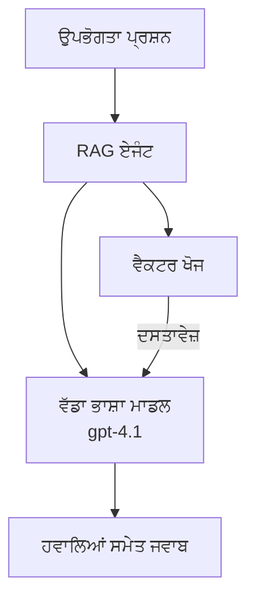
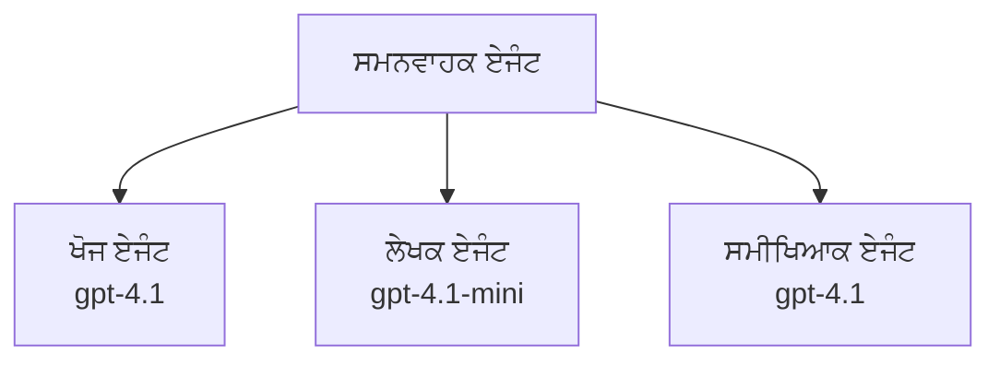

# Azure Developer CLI ਨਾਲ AI ਏਜੰਟ

**ਅਧਿਆਇ-ਨੈਵੀਗੇਸ਼ਨ:**
- **📚 ਕੋਰਸ ਮੁੱਖ ਪੰਨਾ**: [AZD For Beginners](../../README.md)
- **📖 ਵਰਤਮਾਨ ਅਧਿਆਇ**: ਅਧਿਆਇ 2 - AI-ਪਹਿਲਾ ਵਿਕਾਸ
- **⬅️ ਪਿਛਲਾ**: [Microsoft Foundry Integration](microsoft-foundry-integration.md)
- **➡️ ਅਗਲਾ**: [AI Model Deployment](ai-model-deployment.md)
- **🚀 ਐਡਵਾਂਸਡ**: [Multi-Agent Solutions](../../examples/retail-scenario.md)

---

## ਪਰਿਚਯ

AI ਏਜੰਟ ਸਵੈਚਾਲਿਤ ਪ੍ਰੋਗਰਾਮ ਹੁੰਦੇ ਹਨ ਜੋ ਆਪਣੇ ਮਾਹੌਲ ਨੂੰ ਮਹਿਸੂਸ ਕਰ ਸਕਦੇ, ਫੈਸਲੇ ਲੈ ਸਕਦੇ ਅਤੇ ਨਿਰਧਾਰਤ ਲਕਸ਼ਾਂ ਨੂੰ ਹਾਸਲ ਕਰਨ ਲਈ ਕਾਰਵਾਈ ਕਰ ਸਕਦੇ ਹਨ। ਸਧਾਰਨ ਚੈਟਬੋਟਸ ਤੋਂ ਵੱਖ, ਏਜੰਟ:

- **ਟੂਲ ਵਰਤਦੇ ਹਨ** - APIs ਕਾਲ ਕਰਨਾ, ਡੇਟਾਬੇਸ ਖੋਜਣਾ, ਕੋਡ ਚਲਾਉਣਾ
- **ਯੋਜਨਾ ਅਤੇ ਤਰਕਸ਼ੀਲ ਸੋਚ** - ਜਟਿਲ ਟਾਸਕਾਂ ਨੂੰ ਕਦਮਾਂ ਵਿੱਚ ਵੰਡਣਾ
- **ਸੰਦਰਭ ਤੋਂ ਸਿੱਖਦੇ ਹਨ** - ਮੈਮੋਰੀ ਰਖਦੇ ਹਨ ਅਤੇ ਵਿਹਾਰ ਨੂੰ ਅਨੁਕੂਲ ਬਣਾਉਂਦੇ ਹਨ
- **ਸਹਿਕਾਰ ਕਰਦੇ ਹਨ** - ਹੋਰ ਏਜੰਟਾਂ ਨਾਲ ਕੰਮ ਕਰਨਾ (ਮਲਟੀ-ਏਜੰਟ ਸਿਸਟਮ)

ਇਹ ਮਾਰਗਦਰਸ਼ਕ ਤੁਹਾਨੂੰ ਦਿਖਾਏਗਾ ਕਿ Azure ਤੇ Azure Developer CLI (azd) ਦੀ ਵਰਤੋਂ ਕਰਕੇ AI ਏਜੰਟ ਕਿਵੇਂ ਤੈਨਾਤ ਕਰਨੇ ਹਨ।

> **Validation note (2026-03-25):** ਇਹ ਮਾਰਗਦਰਸ਼ਕ `azd` `1.23.12` ਅਤੇ `azure.ai.agents` `0.1.18-preview` ਦੇ ਖਿਲਾਫ ਸਮੀਖਿਆ ਕੀਤੀ ਗਈ ਸੀ। `azd ai` ਅਨੁਭਵ ਹਾਲੇ ਵੀ ਪ੍ਰੀਵਿਊ-ਚਲਿਤ ਹੈ, ਇਸ ਲਈ ਆਪਣੇ ਇੰਸਟਾਲ ਕੀਤੇ ਫਲੈਗ ਵੱਖਰੇ ਹੋਣ 'ਤੇ extension help ਚੈੱਕ ਕਰੋ।

## ਸਿੱਖਣ ਦੇ ਲਕਸ਼

ਇਸ ਮਾਰਗਦਰਸ਼ਕ ਨੂੰ ਪੂਰਾ ਕਰਨ ਤੋਂ ਬਾਅਦ, ਤੁਸੀਂ:
- ਸਮਝੋਗੇ ਕਿ AI ਏਜੰਟ ਕੀ ਹਨ ਅਤੇ ਇਹ ਚੈਟਬੋਟਸ ਤੋਂ ਕਿਸ ਤਰ੍ਹਾਂ ਵੱਖਰੇ ਹਨ
- AZD ਦੀ ਵਰਤੋਂ ਕਰਕੇ ਤਿਆਰ-ਬਣੇ ਏਜੰਟ ਟੇਮਪਲੇਟ ਤੈਨਾਤ ਕਰਨਾ
- ਕਸਟਮ ਏਜੰਟਾਂ ਲਈ Foundry Agents ਨੂੰ ਸੰਰਚਿਤ ਕਰਨਾ
- ਬੁਨਿਆਦੀ ਏਜੰਟ ਪੈਟਰਨ (ਟੂਲ ਵਰਤੋਂ, RAG, ਮਲਟੀ-ਏਜੰਟ) ਲਾਗੂ ਕਰਨਾ
- ਤੈਨਾਤ ਕੀਤੇ ਗਏ ਏਜੰਟਾਂ ਦੀ ਨਿਗਰਾਨੀ ਅਤੇ ਡੀਬੱਗ ਕਰਨਾ

## ਸਿੱਖਣ ਦੇ ਨਤੀਜੇ

पूरا ਕਰਨ 'ਤੇ, ਤੁਸੀਂ ਸਮਰੱਥ ਹੋਵੋਗੇ:
- ਇੱਕ ਕਮਾਂਡ ਨਾਲ Azure 'ਤੇ AI ਏਜੰਟ ਐਪਲੀਕੇਸ਼ਨ ਤੈਨਾਤ ਕਰਨਾ
- ਏਜੰਟ ਟੂਲਾਂ ਅਤੇ ਸਮਰੱਥਾਵਾਂ ਨੂੰ ਸੰਰਚਿਤ ਕਰਨਾ
- ਏਜੰਟਾਂ ਨਾਲ retrieval-augmented generation (RAG) ਲਾਗੂ ਕਰਨਾ
- ਜਟਿਲ ਵਰਕਫਲੋਜ਼ ਲਈ ਮਲਟੀ-ਏਜੰਟ ਆਰਕੀਟੈਕਚਰ ਡਿਜ਼ਾਈਨ ਕਰਨਾ
- ਆਮ ਏਜੰਟ ਤੈਨਾਤ ਸਮੱਸਿਆਵਾਂ ਨੂੰ ਸਮਝਣਾ ਅਤੇ ਹੱਲ ਕਰਨਾ

---

## 🤖 ਏਜੰਟ ਨੂੰ ਚੈਟਬੋਟ ਤੋਂ ਵੱਖ ਕੀ ਬਣਾਉਂਦਾ ਹੈ?

| Feature | Chatbot | AI Agent |
|---------|---------|----------|
| **Behavior** | ਪ੍ਰੋੰਪਟਾਂ ਦਾ ਜਵਾਬ ਦਿੰਦਾ ਹੈ | ਸਵੈਚਾਲਿਤ ਕਾਰਵਾਈਆਂ ਕਰਦਾ ਹੈ |
| **Tools** | ਕੋਈ ਨਹੀਂ | APIs ਕਾਲ ਕਰ ਸਕਦਾ ਹੈ, ਖੋਜ ਕਰ ਸਕਦਾ ਹੈ, ਕੋਡ ਚਲਾ ਸਕਦਾ ਹੈ |
| **Memory** | ਸਿਰਫ ਸੈਸ਼ਨ-ਅਧਾਰਿਤ | ਸੈਸ਼ਨਾਂ ਵਿਚ ਪਾਇਦਾਰ ਮੈਮੋਰੀ |
| **Planning** | ਇੱਕੋ ਜਵਾਬ | ਬਹੁ-ਕਦਮੀ ਤਰਕਸ਼ੀਲਤਾ |
| **Collaboration** | ਇਕ ਇਕਾਈ | ਹੋਰ ਏਜੰਟਾਂ ਨਾਲ ਕੰਮ ਕਰ ਸਕਦਾ ਹੈ |

### ਸਧਾਰਨ ਤੁਲਨਾ

- **ਚੈਟਬੋਟ** = ਜਾਣਕਾਰੀ ਡੈਸਕ 'ਤੇ ਸੁਲਝਾਉਂਦਾ ਹੋਇਆ ਇੱਕ ਮਦਦਗਾਰ ਵਿਅਕਤੀ
- **AI ਏਜੰਟ** = ਇੱਕ ਨਿੱਜੀ ਸਹਾਇਕ ਜੋ ਕਾਲਾਂ ਕਰ ਸਕਦਾ, ملاقاتਾਂ ਬੁੱਕ ਕਰ ਸਕਦਾ ਅਤੇ ਤੁਹਾਡੇ ਲਈ ਕੰਮ ਮੁਕੰਮਲ ਕਰ ਸਕਦਾ ਹੈ

---

## 🚀 ਤੁਰੰਤ ਸ਼ੁਰੂਆਤ: ਆਪਣਾ ਪਹਿਲਾ ਏਜੰਟ ਤੈਨਾਤ ਕਰੋ

### ਵਿਕਲਪ 1: Foundry Agents ਟੇਮਪਲੇਟ (ਸੁਝਾਏ ਗਿਆ)

```bash
# AI ਏਜੰਟਾਂ ਦਾ ਟੈਂਪਲੇਟ ਸ਼ੁਰੂ ਕਰੋ
azd init --template get-started-with-ai-agents

# Azure ਉੱਤੇ ਤਾਇਨਾਤ ਕਰੋ
azd up
```

**ਕੀ ਤੈਨਾਤ ਕੀਤਾ ਜਾਂਦਾ ਹੈ:**
- ✅ Foundry Agents
- ✅ Microsoft Foundry Models (gpt-4.1)
- ✅ Azure AI Search (RAG ਲਈ)
- ✅ Azure Container Apps (ਵੈੱਬ ਇੰਟਰਫੇਸ)
- ✅ Application Insights (ਨਿਗਰਾਨੀ)

**ਸਮਾਂ:** ~15-20 ਮਿੰਟ
**ਲਾਗਤ:** ~$100-150/ਮਹੀਨਾ (development)

### ਵਿਕਲਪ 2: Prompty ਨਾਲ OpenAI ਏਜੰਟ

```bash
# Prompty-ਆਧਾਰਿਤ ਏਜੰਟ ਟੈਮਪਲੇਟ ਨੂੰ ਸ਼ੁਰੂ ਕਰੋ
azd init --template agent-openai-python-prompty

# Azure ਉੱਤੇ ਤਾਇਨਾਤ ਕਰੋ
azd up
```

**ਕੀ ਤੈਨਾਤ ਕੀਤਾ ਜਾਂਦਾ ਹੈ:**
- ✅ Azure Functions (ਸਰਵਰਲੈਸ ਏਜੰਟ ਕਾਰਜਾਨਵੀ)
- ✅ Microsoft Foundry Models
- ✅ Prompty ਸੰਰਚਨਾ ਫਾਇਲਾਂ
- ✅ ਨਮੂਨਾ ਏਜੰਟ ਇੰਪਲੀਮੇੰਟੇਸ਼ਨ

**ਸਮਾਂ:** ~10-15 ਮਿੰਟ
**ਲਾਗਤ:** ~$50-100/ਮਹੀਨਾ (development)

### ਵਿਕਲਪ 3: RAG ਚੈਟ ਏਜੰਟ

```bash
# RAG ਚੈਟ ਟੈਮਪਲੇਟ ਨੂੰ ਆਰੰਭ ਕਰੋ
azd init --template azure-search-openai-demo

# Azure ਤੇ ਤੈਨਾਤ ਕਰੋ
azd up
```

**ਕੀ ਤੈਨਾਤ ਕੀਤਾ ਜਾਂਦਾ ਹੈ:**
- ✅ Microsoft Foundry Models
- ✅ Azure AI Search ਨਾਲ ਨਮੂਨਾ ਡੇਟਾ
- ✅ ਦਸਤਾਵੇਜ਼ ਪ੍ਰੋਸੈਸਿੰਗ ਪਾਈਪਲਾਈਨ
- ✅ ਹਵਾਲੇ ਸਮੇਤ ਚੈਟ ਇੰਟਰਫੇਸ

**ਸਮਾਂ:** ~15-25 ਮਿੰਟ
**ਲਾਗਤ:** ~$80-150/ਮਹੀਨਾ (development)

### ਵਿਕਲਪ 4: AZD AI Agent Init (Manifest- ਜਾਂ Template-ਆਧਾਰਿਤ ਪ੍ਰੀਵਿਊ)

ਜੇ ਤੁਹਾਡੇ ਕੋਲ ਏਜੰਟ ਮੈਨਿਫੈਸਟ ਫਾਇਲ ਹੈ, ਤਾਂ ਤੁਸੀਂ `azd ai` ਕਮਾਂਡ ਦੀ ਵਰਤੋਂ ਕਰਕੇ ਸਿੱਧੇ Foundry Agent Service ਪ੍ਰੋਜੈਕਟ ਸਕੈਫੋਲਡ ਕਰ ਸਕਦੇ ਹੋ। ਹਾਲੀਆ ਪ੍ਰੀਵਿਊ ਰਿਲੀਜ਼ਾਂ ਨੇ ਟੇਮਪਲੇਟ-ਆਧਾਰਿਤ ਸ਼ੁਰੂਆਤ ਸਮਰਥਨ ਵੀ ਸ਼ਾਮਲ ਕੀਤਾ ਹੈ, ਇਸ ਲਈ ਤੁਹਾਡੇ ਇੰਸਟਾਲ ਕੀਤੇ ਗਏ extension ਵਰਜ਼ਨ ਦੇ ਅਧਾਰ 'ਤੇ ਪ੍ਰੋੰਪਟ ਫਲੋ ਥੋੜ੍ਹਾ ਵੱਖਰਾ ਹੋ ਸਕਦਾ ਹੈ।

```bash
# AI ਏਜੰਟਸ ਐਕਸਟੇੰਸ਼ਨ ਇੰਸਟਾਲ ਕਰੋ
azd extension install azure.ai.agents

# ਵਿਕਲਪਿਕ: ਇੰਸਟਾਲ ਕੀਤੀ ਗਈ ਪ੍ਰੀਵਿਊ ਵਰਜ਼ਨ ਦੀ ਜਾਂਚ ਕਰੋ
azd extension show azure.ai.agents

# ਏਜੰਟ ਮੈਨਿਫੈਸਟ ਤੋਂ ਇਨੀਸ਼ੀਅਲਾਈਜ਼ ਕਰੋ
azd ai agent init -m agent-manifest.yaml

# Azure 'ਤੇ ਤੈਨਾਤ ਕਰੋ
azd up

# ਤੈਨਾਤ ਕੀਤੇ ਏਜੰਟ ਦੀ ਜਾਂਚ ਕਰੋ (ਲੇਟੈਂਸੀ ਅਤੇ ਪਹਿਲੀ ਬਾਈਟ ਤੱਕ ਦਾ ਸਮਾਂ ਦਿਖਾਉਂਦਾ ਹੈ)
azd ai agent invoke
```

**ਕਦੋਂ `azd ai agent init` ਵਰਤਣਾ ਹੈ ਬਨਾਮ `azd init --template`:**

| Approach | Best For | How It Works |
|----------|----------|------|
| `azd init --template` | ਇੱਕ ਕੰਮ ਕਰ ਰਹੇ ਨਮੂਨਾ ਐਪ ਤੋਂ ਸ਼ੁਰੂ ਕਰਨਾ | ਕੋਡ + ਇੰਫਰਾ ਨਾਲ ਪੂਰਾ ਟੇਮਪਲੇਟ ਰੇਪੋ ਕਲੋਨ ਕਰਦਾ ਹੈ |
| `azd ai agent init -m` | ਆਪਣੀ ਏਜੰਟ ਮੈਨਿਫੈਸਟ ਤੋਂ ਬਣਾਉਣਾ | ਤੁਹਾਡੇ ਏਜੰਟ ਡਿਫ਼ਿਨੀਸ਼ਨ ਤੋਂ ਪ੍ਰੋਜੈਕਟ ਸਟ੍ਰਕਚਰ ਸਕੈਫੋਲਡ ਕਰਦਾ ਹੈ |

> **Tip:** ਸਿੱਖਣ ਸਮੇਂ `azd init --template` ਵਰਤੋਂ (ਉਪਰ ਦਿੱਤੇ ਵਿਕਲਪ 1-3)। ਆਪਣੇ ਮੈਨਿਫੈਸਟਾਂ ਨਾਲ ਪ੍ਰੋਡਕਸ਼ਨ ਏਜੰਟ ਬਣਾਉਂਦੇ ਸਮੇਂ `azd ai agent init` ਵਰਤੋਂ।

`azd up` ਦੇ ਬਾਅਦ, ਉਹੀ extension ਤੁਹਾਨੂੰ ਏਜੰਟ ਲਾਈਫਸਾਇਕਲ ਦੇ ਬਾਕੀ ਹਿੱਸੇ ਰਾਹੀਂ ਲੈ ਜਾਵੇਗਾ: ਟੈਸਟ ਕਰਨ ਲਈ `azd ai agent invoke`, ਗੁਣਵੱਤਾ ਮਾਪਣ ਅਤੇ ਸੁਧਾਰ ਲਈ `azd ai agent eval generate` ਅਤੇ `azd ai agent optimize`, ਅਤੇ ਸਾਫ਼-ਸੂੱਥਰਾ ਕਰਨ ਲਈ `azd ai agent delete`। ਪੂਰੇ ਰੈਫਰੈਂਸ ਲਈ ਵੇਖੋ [AZD AI CLI Commands](../chapter-08-production/production-ai-practices.md#azd-ai-cli-commands-and-extensions)।

---

## 🏗️ ਏਜੰਟ ਆਰਕੀਟੈਕਚਰ ਪੈਟਰਨ

### ਪੈਟਰਨ 1: ਟੂਲਾਂ ਵਾਲਾ ਇੱਕਲਾਂ ਏਜੰਟ

ਸਭ ਤੋਂ ਸਰਲ ਏਜੰਟ ਪੈਟਰਨ - ਇੱਕ ਏਜੰਟ ਜੋ ਕਈ ਟੂਲ ਵਰਤ ਸਕਦਾ ਹੈ।


**ਸਭ ਤੋਂ ਵਧੀਆ ਲਈ:**
- ਗਾਹਕ ਸਹਾਇਤਾ ਬੋਟ
- ਖੋਜ ਸਹਾਇਕ
- ਡੇਟਾ ਵਿਸ਼ਲੇਸ਼ਣ ਏਜੰਟ

**AZD ਟੇਮਪਲੇਟ:** `azure-search-openai-demo`

### ਪੈਟਰਨ 2: RAG ਏਜੰਟ (Retrieval-Augmented Generation)

ਇੱਕ ਏਜੰਟ ਜੋ ਜਵਾਬ ਬਣਾਉਣ ਤੋਂ ਪਹਿਲਾਂ ਪ੍ਰਸੰਗਿਕ ਦਸਤਾਵੇਜ਼ ਲਿਆਉਂਦਾ ਹੈ।



**ਸਭ ਤੋਂ ਵਧੀਆ ਲਈ:**
- ਐਂਟਰਪ੍ਰਾਈਜ਼ ਗਿਆਨ ਬੇਸ
- ਦਸਤਾਵੇਜ਼ Q&A ਸਿਸਟਮ
- ਅਨੁਕੂਲਤਾ ਅਤੇ ਕਾਨੂੰਨੀ ਖੋਜ

**AZD ਟੇਮਪਲੇਟ:** `azure-search-openai-demo`

### ਪੈਟਰਨ 3: ਮਲਟੀ-ਏਜੰਟ ਸਿਸਟਮ

ਕਈ ਵਿਸ਼ੇਸ਼ਤਾਵਾਂ ਵਾਲੇ ਏਜੰਟ ਇੱਕਠੇ ਮਿਲ ਕੇ ਜਟਿਲ ਟਾਸਕਾਂ 'ਤੇ ਕੰਮ ਕਰਦੇ ਹਨ।



**ਸਭ ਤੋਂ ਵਧੀਆ ਲਈ:**
- ਜਟਿਲ ਸਮੱਗਰੀ ਜਨਰੇਸ਼ਨ
- ਬਹੁ-ਕਦਮੀ ਵਰਕਫਲੋਜ਼
- వੱਖ-ਵੱਖ ਮਾਹਿਰਤਾ ਵਾਲੇ ਟਾਸਕ

**ਹੋਰ ਜਾਣੋ:** [Multi-Agent Coordination Patterns](../chapter-06-pre-deployment/coordination-patterns.md)

---

## ⚙️ ਏਜੰਟ ਟੂਲਾਂ ਦੀ ਸੰਰਚਨਾ

ਜਦੋਂ ਏਜੰਟ ਟੂਲ ਵਰਤ ਸਕਦੇ ਹਨ ਤਾਂ ਉਹ ਸ਼ਕਤੀਸ਼ਾਲੀ ਬਣ ਜਾਂਦੇ ਹਨ। ਇੱਥੇ ਆਮ ਟੂਲਾਂ ਨੂੰ ਸੰਰਚਿਤ ਕਰਨ ਦਾ ਤਰੀਕਾ ਹੈ:

### Foundry Agents ਵਿੱਚ ਟੂਲ ਸੰਰਚਨਾ

```python
# agent_config.py
from azure.ai.projects import AIProjectClient
from azure.ai.projects.models import FunctionTool, CodeInterpreterTool

# ਕਸਟਮ ਟੂਲ ਪਰਿਭਾਸ਼ਿਤ ਕਰੋ
search_tool = FunctionTool(
    name="search_knowledge_base",
    description="Search the company knowledge base for relevant documents",
    parameters={
        "type": "object",
        "properties": {
            "query": {
                "type": "string",
                "description": "The search query"
            }
        },
        "required": ["query"]
    }
)

# ਟੂਲਾਂ ਨਾਲ ਏਜੰਟ ਬਣਾਓ
agent = project_client.agents.create_agent(
    model="gpt-4.1",
    name="Support Agent",
    instructions="You are a helpful support agent. Use the search tool to find relevant information.",
    tools=[search_tool, CodeInterpreterTool()]
)
```

### Environment ਸੰਰਚਨਾ

```bash
# ਏਜੰਟ-ਨਿਰਧਾਰਿਤ ਇਨਵਾਇਰਨਮੈਂਟ ਵੇਰੀਏਬਲ ਸੈਟ ਕਰੋ
azd env set AZURE_OPENAI_MODEL "gpt-4.1"
azd env set AGENT_INSTRUCTIONS "You are a helpful assistant..."
azd env set ENABLE_CODE_INTERPRETER "true"
azd env set ENABLE_FILE_SEARCH "true"

# ਅਪਡੇਟ ਕੀਤੀ ਗਈ ਸੰਰਚਨਾ ਨਾਲ ਤਾਇਨਾਤ ਕਰੋ
azd deploy
```

---

## 📊 ਏਜੰਟਾਂ ਦੀ ਨਿਗਰਾਨੀ

### Application Insights ਇੰਟੇਗਰੇਸ਼ਨ

ਸਾਰੇ AZD ਏਜੰਟ ਟੇਮਪਲੇਟ ਨਿਗਰਾਨੀ ਲਈ Application Insights ਸ਼ਾਮਲ ਕਰਦੇ ਹਨ:

```bash
# ਮਾਨੀਟਰਿੰਗ ਡੈਸ਼ਬੋਰਡ ਖੋਲ੍ਹੋ
azd monitor --overview

# ਲਾਈਵ ਲੌਗ ਵੇਖੋ
azd monitor --logs

# ਲਾਈਵ ਮੈਟ੍ਰਿਕਸ ਵੇਖੋ
azd monitor --live
```

### ਟਰੈਕ ਕਰਨ ਲਈ ਮੁੱਖ ਮੈਟ੍ਰਿਕਸ

| Metric | Description | Target |
|--------|-------------|--------|
| Response Latency | ਜਵਾਬ ਬਣਾਉਣ ਦਾ ਸਮਾਂ | < 5 seconds |
| Token Usage | ਪ੍ਰਤੀ ਬੇਨਤੀ ਟੋਕਨ | ਲਾਗਤ ਲਈ ਨਿਗਰਾਨੀ ਕਰੋ |
| Tool Call Success Rate | ਟੂਲ ਕਾਰਜਾਂ ਦੀ ਸਫਲਤਾ ਦੀ ਦਰ | > 95% |
| Error Rate | ਨਾਕਾਮ ਏਜੰਟ ਬੇਨਤੀਆਂ | < 1% |
| User Satisfaction | ਫੀਡਬੈਕ ਸਕੋਰ | > 4.0/5.0 |

### ਏਜੰਟਾਂ ਲਈ ਕਸਟਮ ਲਾਗਿੰਗ

```python
import os
from azure.monitor.opentelemetry import configure_azure_monitor
from opentelemetry import trace

# OpenTelemetry ਨਾਲ Azure Monitor ਨੂੰ ਸੰਰਚਿਤ ਕਰੋ
configure_azure_monitor(
    connection_string=os.environ["APPLICATIONINSIGHTS_CONNECTION_STRING"]
)

tracer = trace.get_tracer(__name__)

def log_agent_interaction(user_query, agent_response, tools_used, latency_ms):
    with tracer.start_as_current_span("agent_interaction") as span:
        span.set_attributes({
            "user_query": user_query,
            "response_length": len(agent_response),
            "tools_used": tools_used,
            "latency_ms": latency_ms
        })
```

> **ਨੋਟ:** ਲੋੜੀਂਦੇ ਪੈਕੇਜ ਇੰਸਟਾਲ ਕਰੋ: `pip install azure-monitor-opentelemetry opentelemetry`

---

## 💰 ਲਾਗਤ ਸੰਬੰਧੀ ਵਿਚਾਰ

### ਪੈਟਰਨ ਅਨੁਸਾਰ ਅਨੁਮਾਨਤ ਮਹੀਨਾਵਾਰ ਲਾਗਤ

| Pattern | Dev Environment | Production |
|---------|-----------------|------------|
| Single Agent | $50-100 | $200-500 |
| RAG Agent | $80-150 | $300-800 |
| Multi-Agent (2-3 agents) | $150-300 | $500-1,500 |
| Enterprise Multi-Agent | $300-500 | $1,500-5,000+ |

### ਲਾਗਤ ਘਟਾਉਣ ਦੇ ਸੁਝਾਅ

1. ਸਧਾਰਨ ਕਾਰਜਾਂ ਲਈ gpt-4.1-mini ਦੀ ਵਰਤੋਂ ਕਰੋ
   ```bash
   azd env set AZURE_OPENAI_MODEL "gpt-4.1-mini"
   ```

2. ਦੁਹਰਾਏ ਜਾਂਦੇ ਪ੍ਰਸ਼ਨਾਂ ਲਈ ਕੈਸ਼ਿੰਗ ਲਾਗੂ ਕਰੋ
   ```python
   from functools import lru_cache
   
   @lru_cache(maxsize=1000)
   def get_cached_response(query_hash):
       return agent.run(query_hash)
   ```

3. ਪ੍ਰਤੀ ਚਲਾਉਣ ਟੋਕਨ ਸੀਮਾਵਾਂ ਸੈਟ ਕਰੋ
   ```python
   # ਏਜੰਟ ਚਲਾਉਂਦੇ ਸਮੇਂ max_completion_tokens ਸੈੱਟ ਕਰੋ, ਬਣਾਉਣ ਸਮੇਂ ਨਹੀਂ
   run = project_client.agents.create_run(
       thread_id=thread.id,
       agent_id=agent.id,
       max_completion_tokens=1000  # ਜਵਾਬ ਦੀ ਲੰਬਾਈ ਸੀਮਿਤ ਕਰੋ
   )
   ```

4. ਜਦੋਂ ਵਰਤੋਂ ਵਿੱਚ ਨਾ ਹੋਵੇ ਤਾਂ scale to zero ਕਰੋ
   ```bash
   # ਕੰਟੇਨਰ ਐਪਸ ਆਪਣੇ ਆਪ ਜ਼ੀਰੋ ਤੱਕ ਸਕੇਲ ਹੋ ਜਾਂਦੀਆਂ ਹਨ
   azd env set MIN_REPLICAS "0"
   ```

---

## 🔧 ਏਜੰਟ ਸਮੱਸਿਆਵਾਂ ਦਾ ਨਿਵਾਰਣ

### ਆਮ ਸਮੱਸਿਆਵਾਂ ਅਤੇ ਹੱਲ

<details>
<summary><strong>❌ ਏਜੰਟ ਟੂਲ ਕਾਲਾਂ ਲਈ ਜਵਾਬ ਨਹੀਂ ਦੇ ਰਿਹਾ</strong></summary>

```bash
# ਜਾਂਚੋ ਕਿ ਟੂਲ ਸਹੀ ਢੰਗ ਨਾਲ ਰਜਿਸਟਰ ਕੀਤੇ ਹੋਏ ਹਨ
azd show

# OpenAI ਤੈਨਾਤੀ ਦੀ ਪੁਸ਼ਟੀ ਕਰੋ
az cognitiveservices account deployment list \
  --name $AZURE_OPENAI_NAME \
  --resource-group $RG_NAME

# ਏਜੰਟ ਲੌਗਜ਼ ਦੀ ਜਾਂਚ ਕਰੋ
azd monitor --logs
```

**ਆਮ ਕਾਰਨ:**
- ਟੂਲ ਫੰਕਸ਼ਨ ਸਿਗਨੇਚਰ ਮਿਲੋ-ਨਹੀਂ
- ਲੋੜੀਂਦੇ ਅਧਿਕਾਰ ਗਾਇਬ
- API ਐਂਡਪੌਇੰਟ ਪਹੁੰਚ ਯੋਗ ਨਹੀਂ
</details>

<details>
<summary><strong>❌ ਏਜੰਟ ਜਵਾਬਾਂ ਵਿੱਚ ਉੱਚ ਲੈਟੈਂਸੀ</strong></summary>

```bash
# ਐਪਲੀਕੇਸ਼ਨ ਇਨਸਾਈਟਸ ਵਿੱਚ ਰੁਕਾਵਟਾਂ ਲਈ ਜਾਂਚ ਕਰੋ
azd monitor --live

# ਇੱਕ ਤੇਜ਼ ਮਾਡਲ ਵਰਤਣ ਬਾਰੇ ਵਿਚਾਰ ਕਰੋ
azd env set AZURE_OPENAI_MODEL "gpt-4.1-mini"
azd deploy
```

**ਵਧੀਆ ਕਰਨ ਦੇ ਸੁਝਾਅ:**
- ਸਟ੍ਰੀਮਿੰਗ ਜਵਾਬਾਂ ਦੀ ਵਰਤੋਂ ਕਰੋ
- ਜਵਾਬ ਕੈਸ਼ਿੰਗ ਲਾਗੂ ਕਰੋ
- ਸੰਦਰਭ ਵਿੰਡੋ ਆਕਾਰ ਘੱਟ ਕਰੋ
</details>

<details>
<summary><strong>❌ ਏਜੰਟ ਗਲਤ ਜਾਂ ਹਾਲੂਸੀਨੇਟ ਕੀਤੀ ਜਾਣਕਾਰੀ ਵਾਪਸ ਕਰ ਰਿਹਾ ਹੈ</strong></summary>

```python
# ਬਿਹਤਰ ਸਿਸਟਮ ਪ੍ਰਾਂਪਟਾਂ ਨਾਲ ਸੁਧਾਰ ਕਰੋ
instructions = """
You are a helpful assistant. IMPORTANT:
- Only answer based on provided context
- If you don't know, say "I don't know"
- Always cite your sources
- Never make up information
"""

# ਗ੍ਰਾਊਂਡਿੰਗ ਲਈ ਰੀਟ੍ਰੀਵਲ ਜੋੜੋ
agent = project_client.agents.create_agent(
    model="gpt-4.1",
    instructions=instructions,
    tools=[FileSearchTool()]  # ਜਵਾਬਾਂ ਨੂੰ ਦਸਤਾਵੇਜ਼ਾਂ 'ਤੇ ਅਧਾਰਿਤ ਕਰੋ
)
```
</details>

<details>
<summary><strong>❌ ਟੋਕਨ ਸੀਮਾ ਵੱਦੀ ਹੋਣ ਦੀਆਂ ਗਲਤੀਆਂ</strong></summary>

```python
# ਸੰਦਰਭ ਖਿੜਕੀ ਪ੍ਰਬੰਧਨ ਲਾਗੂ ਕਰੋ
def truncate_context(messages, max_tokens=8000, model="gpt-4.1"):
    """Keep only recent messages within token limit."""
    import tiktoken
    encoding = tiktoken.encoding_for_model(model)
    total_tokens = 0
    truncated = []
    
    for msg in reversed(messages):
        msg_tokens = len(encoding.encode(msg.content))
        if total_tokens + msg_tokens > max_tokens:
            break
        truncated.insert(0, msg)
        total_tokens += msg_tokens
    
    return truncated
```
</details>

---

## 🎓 ਹੱਥ-ਬਿੱਠੀ ਅਭਿਆਸ

### ਅਭਿਆਸ 1: ਇੱਕ ਬੇਸਿਕ ਏਜੰਟ ਤੈਨਾਤ ਕਰੋ (20 ਮਿੰਟ)

**ਲਕਸ਼:** AZD ਦੀ ਵਰਤੋਂ ਕਰਕੇ ਆਪਣਾ ਪਹਿਲਾ AI ਏਜੰਟ ਤੈਨਾਤ ਕਰੋ

```bash
# ਕਦਮ 1: ਟੈਮਪਲੇਟ ਨੂੰ ਸ਼ੁਰੂ ਕਰੋ
azd init --template get-started-with-ai-agents

# ਕਦਮ 2: Azure ਵਿੱਚ ਲੌਗਿਨ ਕਰੋ
azd auth login
# ਜੇ ਤੁਸੀਂ ਕਈ ਟੇਨੈਂਟਾਂ 'ਤੇ ਕੰਮ ਕਰ ਰਹੇ ਹੋ, ਤਾਂ --tenant-id <tenant-id> ਸ਼ਾਮਲ ਕਰੋ

# ਕਦਮ 3: ਡਿਪਲੌਇ ਕਰੋ
azd up

# ਕਦਮ 4: ਏਜੰਟ ਦੀ ਜਾਂਚ ਕਰੋ
# ਡਿਪਲੋਇਮੈਂਟ ਤੋਂ ਬਾਅਦ ਉਮੀਦ ਕੀਤੀ ਆਉਟਪੁੱਟ:
#   ਡਿਪਲੋਇਮੈਂਟ ਮੁਕੰਮਲ!
#   ਐਂਡਪੌਇੰਟ: https://<app-name>.<region>.azurecontainerapps.io
# ਆਉਟਪੁੱਟ ਵਿੱਚ ਦਿਖਾਏ ਗਏ URL ਨੂੰ ਖੋਲ੍ਹੋ ਅਤੇ ਇੱਕ ਸਵਾਲ ਪੁੱਛ ਕੇ ਦੇਖੋ

# ਕਦਮ 5: ਨਿਗਰਾਨੀ ਵੇਖੋ
azd monitor --overview

# ਕਦਮ 6: ਸਾਫ਼-ਸਫਾਈ ਕਰੋ
azd down --force --purge
```

**ਸਫਲਤਾ ਮਾਪਦੰਡ:**
- [ ] ਏਜੰਟ ਸਵਾਲਾਂ ਦਾ ਜਵਾਬ ਦਿੰਦਾ ਹੈ
- [ ] `azd monitor` ਰਾਹੀਂ ਨਿਗਰਾਨੀ ਡੈਸ਼ਬੋਰਡ ਤੱਕ ਪਹੁੰਚ ਹੋ ਸਕਦੀ ਹੈ
- [ ] ਸਰੋਤ ਸਫਲਤਾਪੂਰਵਕ ਸਾਫ਼ ਕੀਤੇ ਗਏ

### ਅਭਿਆਸ 2: ਇੱਕ ਕਸਟਮ ਟੂਲ ਸ਼ਾਮਲ ਕਰੋ (30 ਮਿੰਟ)

**ਲਕਸ਼:** ਇੱਕ ਏਜੰਟ ਨੂੰ ਇਕ ਕਸਟਮ ਟੂਲ ਨਾਲ ਵਿਸਥਾਰ ਕਰੋ

1. ਏਜੰਟ ਟੇਮਪਲੇਟ ਤੈਨਾਤ ਕਰੋ:
   ```bash
   azd init --template get-started-with-ai-agents
   azd up
   ```
2. ਆਪਣੇ ਏਜੰਟ ਕੋਡ ਵਿੱਚ ਇੱਕ ਨਵੀਂ ਟੂਲ ਫੰਕਸ਼ਨ ਬਣਾਓ:
   ```python
   def get_weather(location: str) -> str:
       """Get current weather for a location."""
       # ਮੌਸਮ ਸੇਵਾ ਲਈ API ਕਾਲ
       return f"Weather in {location}: Sunny, 72°F"
   ```
3. ਟੂਲ ਨੂੰ ਏਜੰਟ ਨਾਲ ਰਜਿਸਟਰ ਕਰੋ:
   ```python
   from azure.ai.projects.models import FunctionTool

   weather_tool = FunctionTool(
       name="get_weather",
       description="Get current weather for a location",
       parameters={
           "type": "object",
           "properties": {
               "location": {"type": "string", "description": "City name"}
           },
           "required": ["location"]
       }
   )

   agent = project_client.agents.create_agent(
       model="gpt-4.1",
       name="Weather Agent",
       tools=[weather_tool]
   )
   ```
4. ਮੁੜ-ਤੈਨਾਤ ਕਰੋ ਅਤੇ ਟੈਸਟ ਕਰੋ:
   ```bash
   azd deploy
   # ਪੁੱਛੋ: "ਸੀਅਟਲ ਵਿੱਚ ਮੌਸਮ ਕਿਵੇਂ ਹੈ?"
   # ਉਮੀਦ: ਏਜੰਟ get_weather("Seattle") ਨੂੰ ਕਾਲ ਕਰਦਾ ਹੈ ਅਤੇ ਮੌਸਮ ਦੀ ਜਾਣਕਾਰੀ ਵਾਪਸ ਕਰਦਾ ਹੈ
   ```

**ਸਫਲਤਾ ਮਾਪਦੰਡ:**
- [ ] ਏਜੰਟ ਮੌਸਮ-ਸੰਬੰਧੀ ਪ੍ਰਸ਼ਨਾਂ ਨੂੰ ਪਛਾਣਦਾ ਹੈ
- [ ] ਟੂਲ ਸਹੀ ਤਰੀਕੇ ਨਾਲ ਕਾਲ ਹੁੰਦਾ ਹੈ
- [ ] ਜਵਾਬ ਵਿੱਚ ਮੌਸਮ ਜਾਣਕਾਰੀ ਸ਼ਾਮਲ ਹੈ

### ਅਭਿਆਸ 3: ਇੱਕ RAG ਏਜੰਟ ਬਣਾਓ (45 ਮਿੰਟ)

**ਲਕਸ਼:** ਐਜੰਟ ਬਣਾਓ ਜੋ ਤੁਹਾਡੇ ਦਸਤਾਵੇਜ਼ਾਂ ਤੋਂ ਪ੍ਰਸ਼ਨਾਂ ਦੇ ਜਵਾਬ ਦੇਵੇ

```bash
# ਕਦਮ 1: RAG ਟੈਮਪਲੇਟ ਤੈਨਾਤ ਕਰੋ
azd init --template azure-search-openai-demo
azd up

# ਕਦਮ 2: ਆਪਣੇ ਦਸਤਾਵੇਜ਼ ਅਪਲੋਡ ਕਰੋ
# PDF/TXT ਫਾਈਲਾਂ ਨੂੰ data/ ਡਾਇਰੈਕਟਰੀ ਵਿੱਚ ਰੱਖੋ, ਫਿਰ ਚਲਾਓ:
python scripts/prepdocs.py

# ਕਦਮ 3: ਡੋਮੇਨ-ਵਿਸ਼ੇਸ਼ ਸਵਾਲਾਂ ਨਾਲ ਟੈਸਟ ਕਰੋ
# azd up ਆਉਟਪੁੱਟ ਵਿੱਚੋਂ ਵੈੱਬ ਐਪ URL ਖੋਲ੍ਹੋ
# ਆਪਣੇ ਅਪਲੋਡ ਕੀਤੇ ਦਸਤਾਵੇਜ਼ਾਂ ਬਾਰੇ ਸਵਾਲ ਪੁੱਛੋ
# ਜਵਾਬਾਂ ਵਿੱਚ [doc.pdf] ਵਰਗੇ ਹਵਾਲੇ ਸ਼ਾਮਿਲ ਹੋਣੇ ਚਾਹੀਦੇ ਹਨ
```

**ਸਫਲਤਾ ਮਾਪਦੰਡ:**
- [ ] ਏਜੰਟ ਅਪਲੋਡ ਕੀਤੀਆਂ ਦਸਤਾਵੇਜ਼ਾਂ ਤੋਂ ਜਵਾਬ ਦਿੰਦਾ ਹੈ
- [ ] ਜਵਾਬਾਂ ਵਿੱਚ ਹਵਾਲੇ ਸ਼ਾਮਲ ਹਨ
- [ ] ਬਾਹਰ-ਦੇ-ਦਾਇਰੇ ਦੇ ਪ੍ਰਸ਼ਨਾਂ 'ਤੇ ਕੋਈ ਹਾਲੂਸੀਨੇਸ਼ਨ ਨਹੀਂ

---

## 📚 ਅਗਲੇ ਕਦਮ

ਹੁਣ ਜਦੋਂ ਕਿ ਤੁਸੀਂ AI ਏਜੰਟਾਂ ਨੂੰ ਸਮਝ ਗਏ ਹੋ, ਇਹ ਉੱਨਤ ਵਿਸ਼ਿਆਂ ਦੀ ਖੋਜ ਕਰੋ:

| Topic | Description | Link |
|-------|-------------|------|
| **Multi-Agent Systems** | ਕਈ ਮਿਲ ਕੇ ਕੰਮ ਕਰਨ ਵਾਲੇ ਏਜੰਟਾਂ ਨਾਲ ਸਿਸਟਮ ਬਣਾਓ | [Retail Multi-Agent Example](../../examples/retail-scenario.md) |
| **Coordination Patterns** | ਅਪਰੇਸ਼ਨ ਅਤੇ ਸੰਚਾਰ ਪੈਟਰਨ ਸਿੱਖੋ | [Coordination Patterns](../chapter-06-pre-deployment/coordination-patterns.md) |
| **Production Deployment** | ਐਂਟਰਪ੍ਰਾਈਜ਼-ਤਿਆਰ ਏਜੰਟ ਤੈਨਾਤੀ | [Production AI Practices](../chapter-08-production/production-ai-practices.md) |
| **Agent Evaluation** | ਏਜੰਟ ਪ੍ਰਦਰਸ਼ਨ ਦੀ ਜਾਂਚ ਅਤੇ ਮੁਲਾਂਕਣ | [AI Troubleshooting](../chapter-07-troubleshooting/ai-troubleshooting.md) |
| **AI Workshop Lab** | ਹੱਥ-ਬਿੱਠੀ: ਆਪਣੀ AI ਸੁਝਾਅਨੂੰ AZD-ਰੈਡੀ ਬਣਾਓ | [AI Workshop Lab](ai-workshop-lab.md) |

---

## 📖 ਵਾਧੂ ਸਰੋਤ

### ਅਧਿਕਾਰਿਕ ਦਸਤਾਵੇਜ਼
- [Microsoft Foundry Agent Service](https://learn.microsoft.com/azure/ai-services/agents/)
- [Microsoft Foundry Agent Service Quickstart](https://learn.microsoft.com/azure/ai-services/agents/quickstart)
- [Semantic Kernel Agent Framework](https://learn.microsoft.com/semantic-kernel/)

### AZD ਏਜੰਟਾਂ ਲਈ ਟੇਮਪਲੇਟ
- [Get Started with AI Agents](https://github.com/Azure-Samples/get-started-with-ai-agents)
- [Agent OpenAI Python Prompty](https://github.com/Azure-Samples/agent-openai-python-prompty)
- [Azure Search OpenAI Demo](https://github.com/Azure-Samples/azure-search-openai-demo)

### Community ਸਰੋਤ
- [Awesome AZD - Agent Templates](https://azure.github.io/awesome-azd/?tags=ai-agents)
- [Azure AI Discord](https://discord.gg/microsoft-azure)
- [Microsoft Foundry Discord](https://discord.gg/nTYy5BXMWG)

### ਤੁਹਾਡੇ ਐਡੀਟਰ ਲਈ ਏਜੰਟ ਸਕਿਲਜ਼
- [**Microsoft Azure Agent Skills**](https://skills.sh/microsoft/github-copilot-for-azure) - GitHub Copilot, Cursor, ਜਾਂ ਕਿਸੇ ਵੀ ਸਮਰਥਿਤ ਏਜੰਟ ਵਿੱਚ Azure ਵਿਕਾਸ ਲਈ ਦੁਬਾਰਾ ਵਰਤੇ ਜਾ ਸਕਣ ਵਾਲੇ AI ਏਜੰਟ ਸਕਿਲਜ਼ ਇੰਸਟਾਲ ਕਰੋ। ਇਸ ਵਿੱਚ [Azure AI](https://skills.sh/microsoft/github-copilot-for-azure/azure-ai), [Microsoft Foundry](https://skills.sh/microsoft/github-copilot-for-azure/microsoft-foundry), [deployment](https://skills.sh/microsoft/github-copilot-for-azure/azure-deploy), ਅਤੇ [diagnostics](https://skills.sh/microsoft/github-copilot-for-azure/azure-diagnostics) ਲਈ ਸਕਿਲਜ਼ ਸ਼ਾਮਲ ਹਨ:
  ```bash
  npx skills add microsoft/github-copilot-for-azure
  ```

---

**ਨੈਵੀਗੇਸ਼ਨ**
- **ਪਿਛਲਾ ਪਾਠ**: [Microsoft Foundry Integration](microsoft-foundry-integration.md)
- **ਅਗਲਾ ਪਾਠ**: [AI Model Deployment](ai-model-deployment.md)

---

<!-- CO-OP TRANSLATOR DISCLAIMER START -->
**ਅਸਵੀਕਾਰੋਪਣ**:
ਇਸ ਦਸਤਾਵੇਜ਼ ਦਾ ਅਨੁਵਾਦ ਏਆਈ ਅਨੁਵਾਦ ਸੇਵਾ [Co-op Translator](https://github.com/Azure/co-op-translator) ਦੀ ਵਰਤੋਂ ਕਰਕੇ ਕੀਤਾ ਗਿਆ ਹੈ। ਜਦੋਂ ਕਿ ਅਸੀਂ ਸਹੀਤਾਵਾਂ ਲਈ ਯਤਨਸ਼ੀਲ ਹਾਂ, ਕਿਰਪਾ ਕਰਕੇ ਧਿਆਨ ਰੱਖੋ ਕਿ ਸਵੈਚਾਲਿਤ ਅਨੁਵਾਦਾਂ ਵਿੱਚ ਗਲਤੀਆਂ ਜਾਂ ਅਸਮੱਤਿਆਵਾਂ ਹੋ ਸਕਦੀਆਂ ਹਨ। ਮੂਲ ਦਸਤਾਵੇਜ਼ ਆਪਣੀ ਮੂਲ ਭਾਸ਼ਾ ਵਿੱਚ ਅਧਿਕਾਰਕ ਸਰੋਤ ਮੰਨਿਆ ਜਾਣਾ ਚਾਹੀਦਾ ਹੈ। ਜਰੂਰੀ ਜਾਣਕਾਰੀ ਲਈ, ਪੇਸ਼ੇਵਰ ਮਨੁੱਖੀ ਅਨੁਵਾਦ ਦੀ ਸਿਫ਼ਾਰਸ਼ ਕੀਤੀ ਜਾਂਦੀ ਹੈ। ਅਸੀਂ ਇਸ ਅਨੁਵਾਦ ਦੇ ਉਪਯੋਗ ਤੋਂ ਪੈਦਾ ਹੋਣ ਵਾਲੀਆਂ ਕਿਸੇ ਵੀ ਗਲਤਫਹਿਮੀਆਂ ਜਾਂ ਗਲਤ ਵਿਆਖਿਆਵਾਂ ਲਈ ਜਵਾਬਦੇਹ ਨਹੀਂ ਹਾਂ।
<!-- CO-OP TRANSLATOR DISCLAIMER END -->