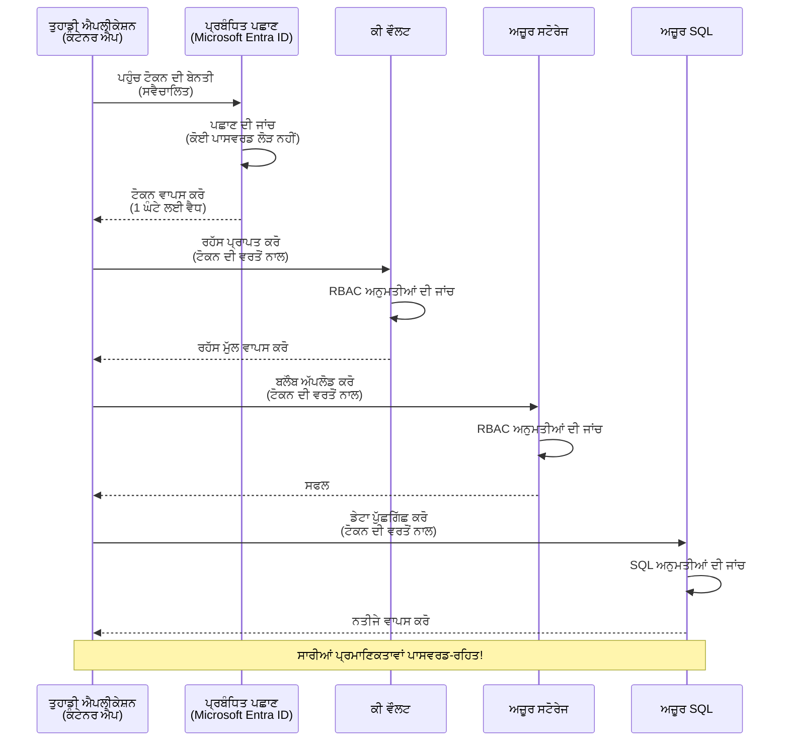
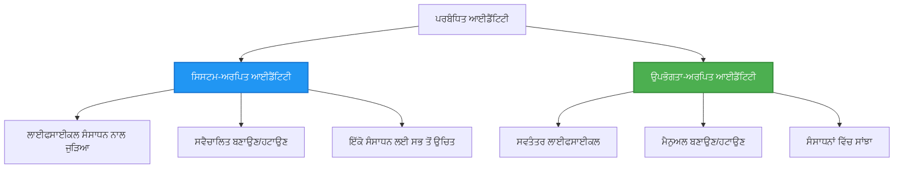

# Authentication Patterns and Managed Identity

⏱️ **Estimated Time**: 45-60 minutes | 💰 **Cost Impact**: Free (no additional charges) | ⭐ **Complexity**: Intermediate

**📚 Learning Path:**
- ← Previous: [ਕਨਫਿਗਰੇਸ਼ਨ ਮੈਨੇਜਮੈਂਟ](configuration.md) - ਮਾਹੌਲ ਵੈਰੀਏਬਲ ਅਤੇ ਸੀਕ੍ਰੇਟਸ ਦਾ ਪ੍ਰਬੰਧ
- 🎯 **You Are Here**: Authentication & Security (Managed Identity, Key Vault, secure patterns)
- → Next: [ਪਹਿਲਾ ਪ੍ਰੋਜੈਕਟ](first-project.md) - ਆਪਣਾ ਪਹਿਲਾ AZD ਐਪਲੀਕੇਸ਼ਨ ਬਣਾਓ
- 🏠 [ਕੋਰਸ ਮੁੱਖ ਪੰਨਾ](../../README.md)

---

## What You'll Learn

By completing this lesson, you will:
- Azure ਪ੍ਰਮਾਣਿਕਤਾ ਪੈਟਰਨ (keys, connection strings, managed identity) ਨੂੰ ਸਮਝਣਾ
- ਪਾਸਵਰਡ-ਰਹਿਤ ਪਰਮਾਣਿਕਤਾ ਲਈ **Managed Identity** ਨੂੰ ਲਾਗੂ ਕਰਨਾ
- **Azure Key Vault** ਇੰਟੀਗ੍ਰੇਸ਼ਨ ਨਾਲ ਸੀਕ੍ਰੇਟਸ ਨੂੰ ਸੁਰੱਖਿਅਤ ਕਰਨਾ
- AZD ਡਿਪਲੋਇਮੈਂਟਸ ਲਈ **role-based access control (RBAC)** ਸੰਰਚਨਾ ਕਰਨਾ
- Container Apps ਅਤੇ Azure ਸੇਵਾਵਾਂ ਵਿੱਚ ਸੁਰੱਖਿਆ ਦੀਆਂ ਸਭ ਤੋਂ ਵਧੀਆ ਪ੍ਰਥਾਵਾਂ ਲਾਗੂ ਕਰਨੀ
- ਕੀ-ਅਧਾਰਿਤ ਤੋਂ identity-ਅਧਾਰਿਤ ਪ੍ਰਮਾਣਿਕਤਾ ਵੱਲ ਮਾਈਗਰੇਟ ਕਰਨਾ

## Why Managed Identity Matters

### The Problem: Traditional Authentication

**Before Managed Identity:**
```javascript
// ❌ ਸੁਰੱਖਿਆ ਖ਼ਤਰਾ: ਕੋਡ ਵਿੱਚ ਹਾਰਡਕੋਡ ਕੀਤੀਆਂ ਗੁਪਤ ਜਾਣਕਾਰੀਆਂ
const connectionString = "Server=mydb.database.windows.net;User=admin;Password=P@ssw0rd123";
const storageKey = "xK7mN9pQ2wR5tY8uI0oP3aS6dF1gH4jK...";
const cosmosKey = "C2x7B9n4M1p8Q5w3E6r0T2y5U8i1O4p7...";
```

**Problems:**
- 🔴 **ਕੋਡ, ਕਾਨਫਿਗ ਫਾਇਲਾਂ, ਮਾਹੌਲ ਵੈਰੀਏਬਲਾਂ ਵਿੱਚ ਖੁੱਲ੍ਹੇ ਸੀਕ੍ਰੇਟਸ**
- 🔴 **ਕ੍ਰੈਡੈਂਸ਼ਲ ਘੁਟਾਲਾ** ਲਈ ਕੋਡ ਬਦਲਣਾ ਅਤੇ ਮੁੜ ਡਿਪਲੋਇਮੈਂਟ ਦੀ ਲੋੜ
- 🔴 **ਆਡਿਟ ਦੇ ਰੋਕੜੇ** - ਕਿਸ ਨੇ ਕਿਹੜੀ ਚੀਜ਼ ਐਕਸੈੱਸ ਕੀਤੀ, ਕਦੋਂ?
- 🔴 **ਫੈਲਾਅ** - ਸੀਕ੍ਰੇਟਸ ਵੱਖ-ਵੱਖ ਪ੍ਰਣਾਲੀਆਂ ਵਿੱਚ ਫੈਲੇ ਹੋਏ
- 🔴 **ਕੰਪਲਾਇੰਸ ਖਤਰੇ** - ਸੁਰੱਖਿਆ ਆਡਿਟ ਫੇਲ ਹੋ ਸਕਦੇ ਹਨ

### The Solution: Managed Identity

**After Managed Identity:**
```javascript
// ✅ ਸੁਰੱਖਿਅਤ: ਕੋਡ ਵਿੱਚ ਕੋਈ ਗੁਪਤ ਜਾਣਕਾਰੀ ਨਹੀਂ
const credential = new DefaultAzureCredential();
const client = new BlobServiceClient(
  "https://mystorageaccount.blob.core.windows.net",
  credential  // Azure ਸਵੈਚਾਲਿਤ ਤੌਰ 'ਤੇ ਪ੍ਰਮਾਣਿਕਤਾ ਦੀ ਸੰਭਾਲ ਕਰਦਾ ਹੈ
);
```

**Benefits:**
- ✅ **ਕੋਡ ਜਾਂ ਕਾਨਫਿਗ ਵਿੱਚ ਕੋਈ ਸੀਕ੍ਰੇਟ ਨਹੀਂ**
- ✅ **ਆਟੋਮੈਟਿਕ ਰੋਟੇਸ਼ਨ** - Azure ਇਸ ਨੂੰ ਹੈਂਡਲ ਕਰਦਾ ਹੈ
- ✅ **Microsoft Entra ID ਲੌਗਸ ਵਿੱਚ ਪੂਰਾ ਆਡਿਟ ਟਰੇਲ**
- ✅ **ਕੇਂਦਰੀਕ੍ਰਿਤ ਸੁਰੱਖਿਆ** - Azure ਪੋਰਟਲ ਵਿੱਚ ਮੇਨਜ ਕਰੋ
- ✅ **ਕੰਪਲਾਇੰਸ-ਤਾਇਰ** - ਸੁਰੱਖਿਆ ਮਿਆਰਾਂ ਨੂੰ ਮਿਲਦਾ ਹੈ

**ਉਪਮਾ**: ਰਵਾਇਤੀ ਪ੍ਰਮਾਣਿਕਤਾ ਉਹੋ ਜਿਹਾ ਹੈ ਜਿਵੇਂ ਵੱਖ-ਵੱਖ ਦਰਵਾਜਿਆਂ ਲਈ ਕਈ ਫਿਜ਼ਿਕਲ ਚਾਬੀਆਂ ਲੈ ਕੇ ਫਿਰਨਾ। Managed Identity ਉਹੋ ਜਿਹਾ ਹੈ ਜਿਵੇਂ ਇੱਕ ਸੁਰੱਖਿਆ ਬੈਜ ਹੋਵੇ ਜੋ ਆਪਣੇ ਆਪ ਹੀ ਤੁਹਾਡੇ ਅਧਾਰ 'ਤੇ ਦਾਖਲਾ ਦਿੰਦਾ ਹੈ—ਕੋਈ ਚਾਬੀ ਖੋਣ, ਨਕਲ ਕਰਨ ਜਾਂ ਘੁਮਾਉਣ ਦੀ ਲੋੜ ਨਹੀਂ।

---

## Architecture Overview

### Authentication Flow with Managed Identity



### Types of Managed Identities



| Feature | System-Assigned | User-Assigned |
|---------|----------------|---------------|
| **Lifecycle** | ਸੰਸਾਧਨ ਨਾਲ ਜੁੜਿਆ | ਸੁਤੰਤਰ |
| **Creation** | ਸੰਸਾਧਨ ਦੇ ਨਾਲ ਆਟੋਮੈਟਿਕ | ਹੱਥੋਂ ਬਣਾਉਣਾ |
| **Deletion** | ਸੰਸਾਧਨ ਦੇ ਨਾਲ ਮਿਟ ਜਾਂਦੀ ਹੈ | ਸੰਸਾਧਨ ਮਿਟਣ ਤੋਂ ਬਾਅਦ ਵੀ ਕਾਇਮ ਰਹਿੰਦੀ ਹੈ |
| **Sharing** | ਸਿਰਫ ਇੱਕ ਸੰਸਾਧਨ | ਕਈ ਸੰਸਾਧਨ |
| **Use Case** | ਸਧਾਰਣ ਸਥਿਤੀਆਂ | ਜਟਿਲ ਕਈ-ਸੰਸਾਧਨ ਸਥਿਤੀਆਂ |
| **AZD Default** | ✅ ਸਿਫਾਰਸ਼ | ਵਿਕਲਪਿਕ |

---

## Prerequisites

### Required Tools

You should already have these installed from previous lessons:

```bash
# Azure Developer CLI ਦੀ ਪੁਸ਼ਟੀ ਕਰੋ
azd version
# ✅ ਉਮੀਦ ਕੀਤੀ ਗਈ: azd ਸੰਸਕਰਣ 1.0.0 ਜਾਂ ਉਸ ਤੋਂ ਉੱਪਰ

# Azure CLI ਦੀ ਪੁਸ਼ਟੀ ਕਰੋ
az --version
# ✅ ਉਮੀਦ ਕੀਤੀ ਗਈ: azure-cli ਸੰਸਕਰਣ 2.50.0 ਜਾਂ ਉਸ ਤੋਂ ਉੱਪਰ
```

### Azure Requirements

- ਐਕਟਿਵ Azure subscription
- ਹੇਠਾਂ ਦੀਆਂ ਇਜਾਜ਼ਤਾਂ:
  - managed identities ਬਣਾਉਣ ਦੀ
  - RBAC ਰੋਲ ਅਸਾਈਨ ਕਰਨ ਦੀ
  - Key Vault ਰਿਸੋਰਸ ਬਣਾਉਣ ਦੀ
  - Container Apps ਡਿਪਲੋਏ ਕਰਨ ਦੀ

### Knowledge Prerequisites

You should have completed:
- [ਇੰਸਟਾਲੇਸ਼ਨ ਗਾਈਡ](installation.md) - AZD ਸੈਟਅਪ
- [AZD ਦੇ ਬੁਨਿਆਦੀ](azd-basics.md) - ਮੁੱਖ ਨਿਯਮ
- [ਕਨਫਿਗਰੇਸ਼ਨ ਮੈਨੇਜਮੈਂਟ](configuration.md) - ਮਾਹੌਲ ਵੈਰੀਏਬਲ

---

## Lesson 1: Understanding Authentication Patterns

### Pattern 1: Connection Strings (Legacy - Avoid)

**How it works:**
```bash
# ਕਨੈਕਸ਼ਨ ਸਟਰਿੰਗ ਵਿੱਚ ਲਾਗਇਨ ਵੇਰਵੇ ਸ਼ਾਮਲ ਹਨ
STORAGE_CONNECTION_STRING="DefaultEndpointsProtocol=https;AccountName=myaccount;AccountKey=xK7mN9pQ2wR5..."
COSMOS_CONNECTION_STRING="AccountEndpoint=https://myaccount.documents.azure.com:443/;AccountKey=C2x7..."
SQL_CONNECTION_STRING="Server=myserver.database.windows.net;User=admin;Password=P@ssw0rd..."
```

**Problems:**
- ❌ ਸੀਕ੍ਰੇਟਸ ਮਾਹੌਲ ਵੈਰੀਏਬਲਾਂ ਵਿੱਚ ਦਿੱਸ ਰਹੇ ਹਨ
- ❌ ਡਿਪਲੋਇਮੈਂਟ ਸਿਸਟਮਾਂ ਵਿੱਚ ਲੌਗ ਹੋ ਸਕਦੇ ਹਨ
- ❌ ਘੁਮਾਉਣਾ ਮੁਸ਼ਕਲ ਹੈ
- ❌ ਕੋਈ ਆਡਿਟ ਟਰੇਲ ਨਹੀਂ

**When to use:** ਸਿਰਫ ਲੋਕਲ ਡਿਵੈਲਪਮੈਂਟ ਲਈ; ਪ੍ਰੋਡਕਸ਼ਨ ਵਿੱਚ ਕਦੇ ਵੀ ਨਹੀਂ।

---

### Pattern 2: Key Vault References (Better)

**How it works:**
```bicep
// Store secret in Key Vault
resource keyVault 'Microsoft.KeyVault/vaults@2023-02-01' = {
  name: 'mykv'
  properties: {
    enableRbacAuthorization: true
  }
}

// Reference in Container App
env: [
  {
    name: 'STORAGE_KEY'
    secretRef: 'storage-key'  // References Key Vault
  }
]
```

**Benefits:**
- ✅ ਸੀਕ੍ਰੇਟਸ Key Vault ਵਿੱਚ ਸੁਰੱਖਿਅਤ ਤਰੀਕੇ ਨਾਲ ਸਟੋਰ ਹੁੰਦੇ ਹਨ
- ✅ ਸੀਕ੍ਰੇਟ ਮੈਨੇਜਮੈਂਟ ਕੇਂਦਰੀਕ੍ਰਿਤ ਹੁੰਦੀ ਹੈ
- ✅ ਕੋਡ ਬਦਲੇ ਬਿਨਾਂ ਰੋਟੇਸ਼ਨ

**Limitations:**
- ⚠️ ਅਜੇ ਵੀ keys/passwords ਵਰਤੇ ਜਾ ਰਹੇ ਹਨ
- ⚠️ Key Vault ਐਕਸੈੱਸ ਦਾ ਪ੍ਰਬੰਧ ਕਰਨਾ ਪੈਂਦਾ ਹੈ

**When to use:** connection strings ਤੋਂ managed identity ਵੱਲ ਟ੍ਰਾਂਜ਼ਿਸ਼ਨ ਲਈ ਇੱਕ ਕਦਮ।

---

### Pattern 3: Managed Identity (Best Practice)

**How it works:**
```bicep
// Enable managed identity
resource containerApp 'Microsoft.App/containerApps@2023-05-01' = {
  name: 'myapp'
  identity: {
    type: 'SystemAssigned'  // Automatically creates identity
  }
}

// Grant permissions
resource roleAssignment 'Microsoft.Authorization/roleAssignments@2022-04-01' = {
  scope: storageAccount
  properties: {
    roleDefinitionId: storageBlobDataContributorRole
    principalId: containerApp.identity.principalId
  }
}
```

**Application code:**
```javascript
// ਕੋਈ ਰਾਜ ਦੀ ਲੋੜ ਨਹੀਂ!
const { DefaultAzureCredential } = require('@azure/identity');
const { BlobServiceClient } = require('@azure/storage-blob');

const credential = new DefaultAzureCredential();
const blobServiceClient = new BlobServiceClient(
  'https://mystorageaccount.blob.core.windows.net',
  credential
);
```

**Benefits:**
- ✅ ਕੋਡ/ਕਾਨਫਿਗ ਵਿੱਚ ਕੋਈ ਸੀਕ੍ਰੇਟ ਨਹੀਂ
- ✅ ਆਟੋਮੈਟਿਕ ਕ੍ਰੈਡੈਂਸ਼ਲ ਰੋਟੇਸ਼ਨ
- ✅ ਪੂਰਾ ਆਡਿਟ ਟਰੇਲ
- ✅ RBAC-ਅਧਾਰਤ ਪਰਮਿਸ਼ਨ
- ✅ ਕੰਪਲਾਇੰਸ ਤਿਆਰ

**When to use:** ਹਮੇਸ਼ਾਂ, ਪ੍ਰੋਡਕਸ਼ਨ ਐਪਲੀਕੇਸ਼ਨਾਂ ਲਈ।

---

### Pattern 4: Service Principals (CI/CD & Automation)

Managed identity Azure ਅੰਦਰ ਚੱਲ ਰਹੇ resources ਲਈ ਸੋਨੇ ਦਾ ਮਿਆਰ ਹੈ। ਪਰ ਜੇ ਕੁਝ Azure ਦੇ ਬਹਿਰ ਚੱਲ ਰਿਹਾ ਹੈ—ਜਿਵੇਂ ਕਿ ਇੱਕ CI/CD ਪਾਈਪਲਾਈਨ ਬਿਲਡ ਏਜੰਟ 'ਤੇ, ਜਾਂ ਤੁਹਾਡੇ ਲੈਪਟਾਪ 'ਤੇ ਇਕ ਸਕ੍ਰਿਪਟ ਜੋ ਇੰਟਰਐਕਟਿਵ ਲੌਗਇਨ ਵਰਤ ਨਹੀਂ ਸਕਦਾ—ਤਾਂ ਉੱਥੇ ਇੱਕ **service principal** ਵਰਤੀ ਜਾਂਦੀ ਹੈ: ਇੱਕ ਗੈਰ-ਮਾਨਵ ਪਰਚਏ ਜੋ ਆਪਣੀਆਂ ਖੁਦ ਦੀਆਂ ਕ੍ਰੈਡੈਂਸ਼ਲਸ ਨਾਲ automated ਪ੍ਰਕਿਰਿਆ ਵੱਲੋਂ ਸਾਇਨ ਇਨ ਕੀਤਾ ਜਾ ਸਕਦਾ ਹੈ।

**How it works:**

Create a service principal scoped to a resource group (least privilege):

```bash
az ad sp create-for-rbac \
  --name "myapp-cicd" \
  --role contributor \
  --scopes /subscriptions/<sub-id>/resourceGroups/<rg-name>
```

This prints a client ID, client secret, and tenant ID. azd can sign in with them non-interactively:

```bash
azd auth login \
  --client-id "<appId>" \
  --client-secret "<password>" \
  --tenant-id "<tenant>"
```

**Prefer federated credentials (OIDC) over secrets.** ਇੱਕ ਲੰਮੇ ਸਮੇਂ ਵਾਲੇ client secret ਦੀ ਥਾਂ, federated credential ਕੰਫਿਗਰ ਕਰੋ ਤਾਂ ਕਿ pipeline ਇੱਕ ਛੋਟੀ-ਅਵਧੀ ਵਾਲਾ ਟੋਕਨ ਐਕਸਚੇੰਜ ਕਰੇ—ਕੋਈ ਸੀਕ੍ਰੇਟ ਲੀਕ ਹੋਣ ਜਾਂ ਘੁਮਾਉਣ ਲਈ ਨਹੀਂ:

```bash
azd auth login \
  --client-id "<appId>" \
  --federated-credential-provider "github" \
  --tenant-id "<tenant>"
```

> `azd pipeline config` ਇਸਨੂੰ ਆਪਣੇ ਆਪ ਤੁਹਾਡੇ ਲਈ ਸੈੱਟ ਕਰ ਦਿੰਦਾ ਹੈ। CI/CD ਵਾਲੇ ਚਲਣ-ਕਰਨ ਦੇ ਲਈ [ਚੈਪਟਰ 8](../chapter-08-production/production-ai-practices.md) ਦੇ ਵਾਕਥਰੂ ਵੇਖੋ।

**Benefits:**
- ✅ Azure ਦੇ ਬਾਹਰ ਵੀ ਕੰਮ ਕਰਦਾ ਹੈ (ਬਿਲਡ ਏਜੰਟ, ਆਨ-ਪ੍ਰੈਮ, ਹੋਰ ਕਲਾਊਡ)
- ✅ ਇੱਕ ਰੋਲ ਨਾਲ ਇੱਕ ਸਿੰਗਲ ਰਿਸੋਰਸ ਗਰੂਪ ਤੱਕ ਸਕੋਪ ਕੀਤਾ ਜਾ ਸਕਦਾ ਹੈ
- ✅ Federated (OIDC) ਵਰਜਨ ਵਿੱਚ ਕੋਈ ਸਟੋਰ ਕੀਤਾ ਗਿਆ ਸੀਕ੍ਰੇਟ ਨਹੀਂ ਹੁੰਦਾ

**Trade-offs:**
- ⚠️ ਸੀਕ੍ਰੇਟ-ਅਧਾਰਤ ਵਰਜਨ ਨੂੰ ਸਾਵਧਾਨੀ ਨਾਲ ਸੰਭਾਲਣਾ ਅਤੇ ਘੁਮਾਉਣਾ ਪੈਂਦਾ ਹੈ
- ⚠️ ਇੱਕ ਲੀਕ ਹੋਇਆ ਸੀਕ੍ਰੇਟ SP ਜੋ ਵੀ ਕਰ ਸਕਦਾ ਹੈ ਉਹ ਸਭ ਕਰਨ ਦੇ ਯੋਗ ਹੁੰਦਾ ਹੈ—ਸਕੋਪ ਨੂੰ ਤਿੱਖਾ ਰੱਖੋ

**When to use:** CI/CD ਪਾਈਪਲਾਈਨ ਅਤੇ ਆਟੋਮੇਸ਼ਨ ਲਈ ਜਿੱਥੇ managed identity ਵਰਤੀ ਨਹੀਂ ਜਾ ਸਕਦੀ। ਹਮੇਸ਼ਾਂ client secret ਦੀ ਥਾਂ **federated/OIDC** ਵਰਜਨ ਦੀ ਨਿਊਨਤਾ ਕਰੋ, ਅਤੇ ਜਿੱਥੇ ਵਰਕਲੋਡ Azure ਅੰਦਰ ਚਲੇ ਉੱਥੇ managed identity ਨੂੰ ਤਰਜੀਹ ਦਿਓ।

**Storing credentials safely:**
- ਸੀਕ੍ਰੇਟਸ ਕਦੇ commit ਨਾ ਕਰੋ—ਆਪਣੀ pipeline ਦੇ ਸੀਕ੍ਰੇਟ ਸਟੋਰ (GitHub Actions secrets, Azure DevOps variable groups / Key Vault) ਦੀ ਵਰਤੋਂ ਕਰੋ।
- SP ਨੂੰ ਸਭ ਤੋਂ ਛੋਟੇ ਰੋਲ ਅਤੇ ਰਿਸੋਰਸ ਗਰੂਪ ਤੱਕ ਹੀ ਸਕੋਪ ਕਰੋ।
- ਮਿਆਦ ਨਿਰਧਾਰਤ ਕਰੋ ਅਤੇ ਰੋਟੇਟ ਕਰੋ, ਜਾਂ OIDC ਨਾਲ ਸੀਕ੍ਰੇਟ ਪੂਰੀ ਤਰ੍ਹਾਂ ਖਤਮ ਕਰੋ।

---

## Lesson 2: Implementing Managed Identity with AZD

### Step-by-Step Implementation

ਆਓ ਇੱਕ ਸੁਰੱਖਿਅਤ Container App ਬਣਾਈਏ ਜੋ Managed Identity ਦੀ ਵਰਤੋਂ ਕਰਕੇ Azure Storage ਅਤੇ Key Vault ਤੱਕ ਐਕਸੈੱਸ ਕਰੇ।

### Project Structure

```
secure-app/
├── azure.yaml                 # AZD configuration
├── infra/
│   ├── main.bicep            # Main infrastructure
│   ├── core/
│   │   ├── identity.bicep    # Managed identity setup
│   │   ├── keyvault.bicep    # Key Vault configuration
│   │   └── storage.bicep     # Storage with RBAC
│   └── app/
│       └── container-app.bicep
└── src/
    ├── app.js                # Application code
    ├── package.json
    └── Dockerfile
```

### 1. Configure AZD (azure.yaml)

```yaml
name: secure-app
metadata:
  template: secure-app@1.0.0

services:
  api:
    project: ./src
    language: js
    host: containerapp

# Enable managed identity (AZD handles this automatically)
```

### 2. Infrastructure: Enable Managed Identity

**File: `infra/main.bicep`**

```bicep
targetScope = 'subscription'

param environmentName string
param location string = 'eastus'

var tags = { 'azd-env-name': environmentName }

// Resource group
resource rg 'Microsoft.Resources/resourceGroups@2021-04-01' = {
  name: 'rg-${environmentName}'
  location: location
  tags: tags
}

// Storage Account
module storage './core/storage.bicep' = {
  name: 'storage'
  scope: rg
  params: {
    name: 'st${uniqueString(rg.id)}'
    location: location
    tags: tags
  }
}

// Key Vault
module keyVault './core/keyvault.bicep' = {
  name: 'keyvault'
  scope: rg
  params: {
    name: 'kv-${uniqueString(rg.id)}'
    location: location
    tags: tags
  }
}

// Container App with Managed Identity
module containerApp './app/container-app.bicep' = {
  name: 'container-app'
  scope: rg
  params: {
    name: 'ca-${environmentName}'
    location: location
    tags: tags
    storageAccountName: storage.outputs.name
    keyVaultName: keyVault.outputs.name
  }
}

// Grant Container App access to Storage
module storageRoleAssignment './core/role-assignment.bicep' = {
  name: 'storage-role'
  scope: rg
  params: {
    principalId: containerApp.outputs.identityPrincipalId
    roleDefinitionId: 'ba92f5b4-2d11-453d-a403-e96b0029c9fe'  // Storage Blob Data Contributor
    targetResourceId: storage.outputs.id
  }
}

// Grant Container App access to Key Vault
module kvRoleAssignment './core/role-assignment.bicep' = {
  name: 'kv-role'
  scope: rg
  params: {
    principalId: containerApp.outputs.identityPrincipalId
    roleDefinitionId: '4633458b-17de-408a-b874-0445c86b69e6'  // Key Vault Secrets User
    targetResourceId: keyVault.outputs.id
  }
}

// Outputs
output AZURE_STORAGE_ACCOUNT_NAME string = storage.outputs.name
output AZURE_KEY_VAULT_NAME string = keyVault.outputs.name
output APP_URL string = containerApp.outputs.url
```

### 3. Container App with System-Assigned Identity

**File: `infra/app/container-app.bicep`**

```bicep
param name string
param location string
param tags object = {}
param storageAccountName string
param keyVaultName string

resource containerApp 'Microsoft.App/containerApps@2023-05-01' = {
  name: name
  location: location
  tags: tags
  identity: {
    type: 'SystemAssigned'  // 🔑 Enable managed identity
  }
  properties: {
    configuration: {
      ingress: {
        external: true
        targetPort: 3000
      }
    }
    template: {
      containers: [
        {
          name: 'api'
          image: 'myregistry.azurecr.io/api:latest'
          resources: {
            cpu: json('0.5')
            memory: '1Gi'
          }
          env: [
            {
              name: 'AZURE_STORAGE_ACCOUNT_NAME'
              value: storageAccountName
            }
            {
              name: 'AZURE_KEY_VAULT_NAME'
              value: keyVaultName
            }
            // 🔑 No secrets - managed identity handles authentication!
          ]
        }
      ]
    }
  }
}

// Output the identity for RBAC assignments
output identityPrincipalId string = containerApp.identity.principalId
output id string = containerApp.id
output url string = 'https://${containerApp.properties.configuration.ingress.fqdn}'
```

### 4. RBAC Role Assignment Module

**File: `infra/core/role-assignment.bicep`**

```bicep
param principalId string
param roleDefinitionId string  // Azure built-in role ID
param targetResourceId string

resource roleAssignment 'Microsoft.Authorization/roleAssignments@2022-04-01' = {
  name: guid(principalId, roleDefinitionId, targetResourceId)
  scope: resourceId('Microsoft.Resources/resourceGroups', resourceGroup().name)
  properties: {
    roleDefinitionId: subscriptionResourceId('Microsoft.Authorization/roleDefinitions', roleDefinitionId)
    principalId: principalId
    principalType: 'ServicePrincipal'
  }
}

output id string = roleAssignment.id
```

### 5. Application Code with Managed Identity

**File: `src/app.js`**

```javascript
const express = require('express');
const { DefaultAzureCredential } = require('@azure/identity');
const { BlobServiceClient } = require('@azure/storage-blob');
const { SecretClient } = require('@azure/keyvault-secrets');

const app = express();
const PORT = process.env.PORT || 3000;

// 🔑 ਕ੍ਰੈਡੈਂਸ਼ਲ ਸ਼ੁਰੂ ਕਰੋ (ਮੈਨੇਜਡ ਆਈਡੈਂਟੀਟੀ ਨਾਲ ਆਪਣੇ ਆਪ ਕੰਮ ਕਰਦਾ ਹੈ)
const credential = new DefaultAzureCredential();

// Azure ਸਟੋਰੇਜ ਸੈਟਅਪ
const storageAccountName = process.env.AZURE_STORAGE_ACCOUNT_NAME;
const blobServiceClient = new BlobServiceClient(
  `https://${storageAccountName}.blob.core.windows.net`,
  credential  // ਕੋਈ ਕੁੰਜੀਆਂ ਲੋੜੀਂਦੀਆਂ ਨਹੀਂ!
);

// Key Vault ਸੈਟਅਪ
const keyVaultName = process.env.AZURE_KEY_VAULT_NAME;
const secretClient = new SecretClient(
  `https://${keyVaultName}.vault.azure.net`,
  credential  // ਕੋਈ ਕੁੰਜੀਆਂ ਲੋੜੀਂਦੀਆਂ ਨਹੀਂ!
);

// ਸਿਹਤ ਦੀ ਜਾਂਚ
app.get('/health', (req, res) => {
  res.json({ status: 'healthy', authentication: 'managed-identity' });
});

// ਫਾਈਲ ਨੂੰ ਬਲੌਬ ਸਟੋਰੇਜ ਵਿੱਚ ਅਪਲੋਡ ਕਰੋ
app.post('/upload', async (req, res) => {
  try {
    const containerClient = blobServiceClient.getContainerClient('uploads');
    await containerClient.createIfNotExists();
    
    const blobName = `file-${Date.now()}.txt`;
    const blockBlobClient = containerClient.getBlockBlobClient(blobName);
    
    await blockBlobClient.upload('Hello from managed identity!', 30);
    
    res.json({
      success: true,
      blobName: blobName,
      message: 'File uploaded using managed identity!'
    });
  } catch (error) {
    console.error('Upload error:', error);
    res.status(500).json({ error: error.message });
  }
});

// Key Vault ਤੋਂ ਸੀਕ੍ਰੇਟ ਪ੍ਰਾਪਤ ਕਰੋ
app.get('/secret/:name', async (req, res) => {
  try {
    const secretName = req.params.name;
    const secret = await secretClient.getSecret(secretName);
    
    res.json({
      name: secretName,
      value: secret.value,
      message: 'Secret retrieved using managed identity!'
    });
  } catch (error) {
    console.error('Secret error:', error);
    res.status(500).json({ error: error.message });
  }
});

// ਬਲੌਬ ਕੰਟੇਨਰਾਂ ਦੀ ਸੂਚੀ (ਪੜ੍ਹਨ ਦੀ ਪਹੁੰਚ ਦਿਖਾਉਂਦਾ ਹੈ)
app.get('/containers', async (req, res) => {
  try {
    const containers = [];
    for await (const container of blobServiceClient.listContainers()) {
      containers.push(container.name);
    }
    
    res.json({
      containers: containers,
      count: containers.length,
      message: 'Containers listed using managed identity!'
    });
  } catch (error) {
    console.error('List error:', error);
    res.status(500).json({ error: error.message });
  }
});

app.listen(PORT, () => {
  console.log(`Secure API listening on port ${PORT}`);
  console.log('Authentication: Managed Identity (passwordless)');
});
```

**File: `src/package.json`**

```json
{
  "name": "secure-app",
  "version": "1.0.0",
  "dependencies": {
    "express": "^4.18.2",
    "@azure/identity": "^4.0.0",
    "@azure/storage-blob": "^12.17.0",
    "@azure/keyvault-secrets": "^4.7.0"
  },
  "scripts": {
    "start": "node app.js"
  }
}
```

### 6. Deploy and Test

```bash
# AZD ਵਾਤਾਵਰਣ ਨੂੰ ਸ਼ੁਰੂ ਕਰੋ
azd init

# ਬੁਨਿਆਦੀ ਢਾਂਚਾ ਅਤੇ ਐਪਲੀਕੇਸ਼ਨ ਨੂੰ ਤਾਇਨਾਤ ਕਰੋ
azd up

# ਐਪ ਦਾ URL ਪ੍ਰਾਪਤ ਕਰੋ
APP_URL=$(azd env get-values | grep APP_URL | cut -d '=' -f2 | tr -d '"')

# ਹੈਲਥ ਚੈੱਕ ਦੀ ਜਾਂਚ ਕਰੋ
curl $APP_URL/health
```

**✅ Expected output:**
```json
{
  "status": "healthy",
  "authentication": "managed-identity"
}
```

**Test blob upload:**
```bash
curl -X POST $APP_URL/upload
```

**✅ Expected output:**
```json
{
  "success": true,
  "blobName": "file-1700404800000.txt",
  "message": "File uploaded using managed identity!"
}
```

**Test container listing:**
```bash
curl $APP_URL/containers
```

**✅ Expected output:**
```json
{
  "containers": ["uploads"],
  "count": 1,
  "message": "Containers listed using managed identity!"
}
```

---

## Common Azure RBAC Roles

### Built-in Role IDs for Managed Identity

| Service | Role Name | Role ID | Permissions |
|---------|-----------|---------|-------------|
| **Storage** | Storage Blob Data Reader | `2a2b9908-6b94-4a3d-8e5a-a7d8f8cc8a12` | ਬਲੌਬ ਅਤੇ ਕੰਟੇਨਰਾਂ ਨੂੰ ਪੜ੍ਹੋ |
| **Storage** | Storage Blob Data Contributor | `ba92f5b4-2d11-453d-a403-e96b0029c9fe` | ਬਲੌਬ ਪੜ੍ਹੋ, ਲਿਖੋ, ਮਿਟਾਓ |
| **Storage** | Storage Queue Data Contributor | `974c5e8b-45b9-4653-ba55-5f855dd0fb88` | ਕਿਊ ਮੈਸੇਜ ਪੜ੍ਹੋ, ਲਿਖੋ, ਮਿਟਾਓ |
| **Key Vault** | Key Vault Secrets User | `4633458b-17de-408a-b874-0445c86b69e6` | ਸੀਕ੍ਰੇਟ ਪੜ੍ਹੋ |
| **Key Vault** | Key Vault Secrets Officer | `b86a8fe4-44ce-4948-aee5-eccb2c155cd7` | ਸੀਕ੍ਰੇਟ ਪੜ੍ਹੋ, ਲਿਖੋ, ਮਿਟਾਓ |
| **Cosmos DB** | Cosmos DB Built-in Data Reader | `00000000-0000-0000-0000-000000000001` | Cosmos DB ਡੇਟਾ ਪੜ੍ਹੋ |
| **Cosmos DB** | Cosmos DB Built-in Data Contributor | `00000000-0000-0000-0000-000000000002` | Cosmos DB ਡੇਟਾ ਪੜ੍ਹੋ ਅਤੇ ਲਿਖੋ |
| **SQL Database** | SQL DB Contributor | `9b7fa17d-e63e-47b0-bb0a-15c516ac86ec` | SQL ਡੇਟਾਬੇਸ ਦਾ ਪ੍ਰਬੰਧ ਕਰੋ |
| **Service Bus** | Azure Service Bus Data Owner | `090c5cfd-751d-490a-894a-3ce6f1109419` | ਸੁਨੇ, ਰਸੀਵ, ਅਤੇ ਮੈਸੇਜ ਦਾ ਪ੍ਰਬੰਧ ਕਰੋ |

### How to Find Role IDs

```bash
# ਸਾਰੇ ਬਿਲਟ-ਇਨ ਰੋਲਾਂ ਦੀ ਸੂਚੀ ਦਿਖਾਓ
az role definition list --query "[].{Name:roleName, ID:name}" --output table

# ਕਿਸੇ ਵਿਸ਼ੇਸ਼ ਰੋਲ ਦੀ ਖੋਜ ਕਰੋ
az role definition list --query "[?contains(roleName, 'Storage Blob')].{Name:roleName, ID:name}" --output table

# ਰੋਲ ਦੇ ਵੇਰਵੇ ਪ੍ਰਾਪਤ ਕਰੋ
az role definition list --name "Storage Blob Data Contributor"
```

---

## Practical Exercises

### Exercise 1: Enable Managed Identity for Existing App ⭐⭐ (Medium)

**Goal**: ਮੌਜੂਦਾ Container App ਡਿਪਲੋਇਮੈਂਟ ਲਈ managed identity ਸ਼ਾਮਲ ਕਰੋ

**Scenario**: ਤੁਹਾਡੇ ਕੋਲ ਇੱਕ Container App ਹੈ ਜੋ connection strings ਵਰਤ ਰਿਹਾ ਹੈ। ਇਸਨੂੰ managed identity ਵਿੱਚ ਬਦਲੋ।

**Starting Point**: Container App ਜਿਸ ਦੀ ਕਨਫਿਗ ਇਹ ਹੈ:

```bicep
// ❌ Current: Using connection string
env: [
  {
    name: 'STORAGE_CONNECTION_STRING'
    secretRef: 'storage-connection'
  }
]
```

**Steps**:

1. **Bicep ਵਿੱਚ managed identity ਚਾਲੂ ਕਰੋ:**

```bicep
resource containerApp 'Microsoft.App/containerApps@2023-05-01' = {
  name: 'myapp'
  identity: {
    type: 'SystemAssigned'  // Add this
  }
  // ... rest of configuration
}
```

2. **Storage ਐਕਸੈੱਸ ਦਿਓ:**

```bicep
// Get storage account reference
resource storageAccount 'Microsoft.Storage/storageAccounts@2023-01-01' existing = {
  name: storageAccountName
}

// Assign role
resource roleAssignment 'Microsoft.Authorization/roleAssignments@2022-04-01' = {
  name: guid(containerApp.id, 'ba92f5b4-2d11-453d-a403-e96b0029c9fe', storageAccount.id)
  scope: storageAccount
  properties: {
    roleDefinitionId: subscriptionResourceId('Microsoft.Authorization/roleDefinitions', 'ba92f5b4-2d11-453d-a403-e96b0029c9fe')
    principalId: containerApp.identity.principalId
    principalType: 'ServicePrincipal'
  }
}
```

3. **ਐਪਲੀਕੇਸ਼ਨ ਕੋਡ ਅਪਡੇਟ ਕਰੋ:**

**Before (connection string):**
```javascript
const { BlobServiceClient } = require('@azure/storage-blob');

const blobServiceClient = BlobServiceClient.fromConnectionString(
  process.env.STORAGE_CONNECTION_STRING
);
```

**After (managed identity):**
```javascript
const { DefaultAzureCredential } = require('@azure/identity');
const { BlobServiceClient } = require('@azure/storage-blob');

const credential = new DefaultAzureCredential();
const blobServiceClient = new BlobServiceClient(
  `https://${process.env.STORAGE_ACCOUNT_NAME}.blob.core.windows.net`,
  credential
);
```

4. **ਮਾਹੌਲ ਵੈਰੀਏਬਲ ਅਪਡੇਟ ਕਰੋ:**

```bicep
env: [
  {
    name: 'STORAGE_ACCOUNT_NAME'
    value: storageAccountName  // Just the name, no secrets!
  }
  // Remove STORAGE_CONNECTION_STRING
]
```

5. **ਡਿਪਲੋਏ ਅਤੇ ਟੈਸਟ ਕਰੋ:**

```bash
# ਮੁੜ ਤਾਇਨਾਤ ਕਰੋ
azd up

# ਇਹ ਜਾਂਚੋ ਕਿ ਇਹ ਅਜੇ ਵੀ ਕੰਮ ਕਰਦਾ ਹੈ
curl https://myapp.azurecontainerapps.io/upload
```

**✅ Success Criteria:**
- ✅ ਐਪਲੀਕੇਸ਼ਨ ਬਿਨਾਂ errors ਦੇ ਡਿਪਲੋਏ ਹੋਵੇ
- ✅ Storage ਆਪਰੇਸ਼ਨਸ ਕੰਮ ਕਰਨ (upload, list, download)
- ✅ ਮਾਹੌਲ ਵੈਰੀਏਬਲਾਂ ਵਿੱਚ ਕੋਈ connection strings ਨਹੀਂ
- ✅ Azure Portal ਵਿੱਚ "Identity" ਬਲੇਡ ਹੇਠਾਂ identity ਦਿਖਾਈ ਦੇਵੇ

**Verification:**

```bash
# ਮੈਨੇਜਡ ਆਈਡੈਂਟਿਟੀ ਚਾਲੂ ਹੈ ਜਾਂ ਨਹੀਂ ਚੈੱਕ ਕਰੋ
az containerapp show \
  --name myapp \
  --resource-group rg-myapp \
  --query "identity.type"
# ✅ ਉਮੀਦ: "SystemAssigned"

# ਰੋਲ ਅਸਾਈਨਮੈਂਟ ਚੈੱਕ ਕਰੋ
az role assignment list \
  --assignee $(az containerapp show --name myapp --resource-group rg-myapp --query "identity.principalId" -o tsv) \
  --scope /subscriptions/{sub-id}/resourceGroups/rg-myapp/providers/Microsoft.Storage/storageAccounts/mystorageaccount
# ✅ ਉਮੀਦ: "Storage Blob Data Contributor" ਰੋਲ ਦਿਖਾਉਂਦਾ ਹੈ
```

**Time**: 20-30 minutes

---

### Exercise 2: Multi-Service Access with User-Assigned Identity ⭐⭐⭐ (Advanced)

**Goal**: ਇੱਕ user-assigned identity ਬਣਾਓ ਜੋ ਕਈ Container Apps ਵਿੱਚ ਸਾਂਝੀ ਹੋਵੇ

**Scenario**: ਤੁਹਾਡੇ ਕੋਲ 3 ਮਾਈਕ੍ਰੋਸਰਵਿਸز ਹਨ ਜਿਨ੍ਹਾਂ ਨੂੰ ਇੱਕੋ Storage account ਅਤੇ Key Vault ਤੱਕ ਐਕਸੈੱਸ ਦੀ ਲੋੜ ਹੈ।

**Steps**:

1. **user-assigned identity ਬਣਾਓ:**

**File: `infra/core/identity.bicep`**

```bicep
param name string
param location string
param tags object = {}

resource userAssignedIdentity 'Microsoft.ManagedIdentity/userAssignedIdentities@2023-01-31' = {
  name: name
  location: location
  tags: tags
}

output id string = userAssignedIdentity.id
output principalId string = userAssignedIdentity.properties.principalId
output clientId string = userAssignedIdentity.properties.clientId
```

2. **user-assigned identity ਨੂੰ ਰੋਲ ਅਸਾਈਨ ਕਰੋ:**

```bicep
// In main.bicep
module userIdentity './core/identity.bicep' = {
  name: 'user-identity'
  scope: rg
  params: {
    name: 'id-${environmentName}'
    location: location
    tags: tags
  }
}

// Grant Storage access
resource storageRoleAssignment 'Microsoft.Authorization/roleAssignments@2022-04-01' = {
  name: guid(userIdentity.outputs.principalId, 'storage-contributor')
  scope: storageAccount
  properties: {
    roleDefinitionId: subscriptionResourceId('Microsoft.Authorization/roleDefinitions', 'ba92f5b4-2d11-453d-a403-e96b0029c9fe')
    principalId: userIdentity.outputs.principalId
    principalType: 'ServicePrincipal'
  }
}

// Grant Key Vault access
resource kvRoleAssignment 'Microsoft.Authorization/roleAssignments@2022-04-01' = {
  name: guid(userIdentity.outputs.principalId, 'kv-secrets-user')
  scope: keyVault
  properties: {
    roleDefinitionId: subscriptionResourceId('Microsoft.Authorization/roleDefinitions', '4633458b-17de-408a-b874-0445c86b69e6')
    principalId: userIdentity.outputs.principalId
    principalType: 'ServicePrincipal'
  }
}
```

3. **ਕਈ Container Apps ਨੂੰ identity ਅਸਾਈਨ ਕਰੋ:**

```bicep
resource apiGateway 'Microsoft.App/containerApps@2023-05-01' = {
  name: 'api-gateway'
  identity: {
    type: 'UserAssigned'
    userAssignedIdentities: {
      '${userIdentity.outputs.id}': {}
    }
  }
  // ... rest of config
}

resource productService 'Microsoft.App/containerApps@2023-05-01' = {
  name: 'product-service'
  identity: {
    type: 'UserAssigned'
    userAssignedIdentities: {
      '${userIdentity.outputs.id}': {}
    }
  }
  // ... rest of config
}

resource orderService 'Microsoft.App/containerApps@2023-05-01' = {
  name: 'order-service'
  identity: {
    type: 'UserAssigned'
    userAssignedIdentities: {
      '${userIdentity.outputs.id}': {}
    }
  }
  // ... rest of config
}
```

4. **ਐਪਲੀਕੇਸ਼ਨ ਕੋਡ (ਸਭ ਸੇਵਾਵਾਂ ਇੱਕੋ ਪੈਟਰਨ ਵਰਤਦੀਆਂ ਹਨ):**

```javascript
const { DefaultAzureCredential, ManagedIdentityCredential } = require('@azure/identity');

// ਉਪਭੋਗਤਾ-ਨਿਰਧਾਰਿਤ ਪਛਾਣ ਲਈ, ਕਲਾਇੰਟ ID ਦਰਜ ਕਰੋ
const credential = new ManagedIdentityCredential(
  process.env.AZURE_CLIENT_ID  // ਉਪਭੋਗਤਾ-ਨਿਰਧਾਰਿਤ ਪਛਾਣ ਕਲਾਇੰਟ ID
);

// ਜਾਂ DefaultAzureCredential ਦੀ ਵਰਤੋਂ ਕਰੋ (ਆਪੇ-ਆਪ ਪਛਾਣ ਕਰਦਾ ਹੈ)
const credential = new DefaultAzureCredential();

const blobServiceClient = new BlobServiceClient(
  `https://${process.env.STORAGE_ACCOUNT_NAME}.blob.core.windows.net`,
  credential
);
```

5. **ਡਿਪਲੋਏ ਅਤੇ ਸਹੀਅਤ ਪੱਲਤੂ ਕਰੋ:**

```bash
azd up

# ਟੈਸਟ ਕਰੋ ਕਿ ਸਾਰੀਆਂ ਸੇਵਾਵਾਂ ਸਟੋਰੇਜ ਤੱਕ ਪਹੁੰਚ ਸਕਦੀਆਂ ਹਨ
curl https://api-gateway.azurecontainerapps.io/upload
curl https://product-service.azurecontainerapps.io/upload
curl https://order-service.azurecontainerapps.io/upload
```

**✅ Success Criteria:**
- ✅ ਇਕ(identity) 3 ਸਰਵਿਸਜ਼ ਵਿੱਚ ਸਾਂਝੀ ਕੀਤੀ ਗਈ
- ✅ ਸਾਰੀਆਂ ਸਰਵਿਸਜ਼ Storage ਅਤੇ Key Vault ਤੱਕ ਪਹੁੰਚ ਸਕਦੀਆਂ ਹਨ
- ✅ ਇੱਕ ਸਰਵਿਸ ਹਟਾਉਣ 'ਤੇ identity ਕਾਇਮ ਰਹਿੰਦੀ ਹੈ
- ✅ ਕੇਂਦਰੀਕ੍ਰਿਤ ਪਰਮਿਸ਼ਨ ਪ੍ਰਬੰਧਨ

**Benefits of User-Assigned Identity:**
- ਇੱਕ identity ਦਾ ਪ੍ਰਬੰਧਨ
- ਸਰਵਿਸਜ਼ ਵਿੱਚ ਲਗਾਤਾਰ ਪਰਮਿਸ਼ਨ
- ਸਰਵਿਸ ਮਿਟਣ 'ਤੇ identity ਸਟੇਬਲ ਰਹਿੰਦੀ ਹੈ
- ਜਟਿਲ ਆਰਕੀਟੈਕਚਰ ਲਈ ਬਿਹਤਰ

**Time**: 30-40 minutes

---

### Exercise 3: Implement Key Vault Secret Rotation ⭐⭐⭐ (Advanced)

**Goal**: ਤੀਜੀ-ਪੱਖੀ API ਕੁੰਜੀਆਂ ਨੂੰ Key Vault ਵਿੱਚ ਸਟੋਰ ਕਰੋ ਅਤੇ managed identity ਦੀ ਵਰਤੋਂ ਨਾਲ ਉਹਨਾਂ ਤੱਕ ਪਹੁੰਚ ਕਰੋ

**Scenario**: ਤੁਹਾਡੀ ਐਪ ਨੂੰ ਇਕ ਬਾਹਰੀ API (OpenAI, Stripe, SendGrid) ਨੂੰ ਕਾਲ ਕਰਨ ਲਈ API ਕੁੰਜੀਆਂ ਦੀ ਲੋੜ ਹੈ।

**Steps**:

1. **RBAC ਨਾਲ Key Vault ਬਣਾਓ:**

**File: `infra/core/keyvault.bicep`**

```bicep
param name string
param location string
param tags object = {}

resource keyVault 'Microsoft.KeyVault/vaults@2023-02-01' = {
  name: name
  location: location
  tags: tags
  properties: {
    enableRbacAuthorization: true  // Use RBAC instead of access policies
    sku: {
      family: 'A'
      name: 'standard'
    }
    tenantId: subscription().tenantId
    enableSoftDelete: true
    softDeleteRetentionInDays: 90
  }
}

// Allow Container App to read secrets
output id string = keyVault.id
output name string = keyVault.name
output uri string = keyVault.properties.vaultUri
```

2. **Key Vault ਵਿੱਚ ਸੀਕ੍ਰੇਟ ਸਟੋਰ ਕਰੋ:**

```bash
# ਕੀ ਵੌਲਟ ਦਾ ਨਾਮ ਲਵੋ
KV_NAME=$(azd env get-values | grep AZURE_KEY_VAULT_NAME | cut -d '=' -f2 | tr -d '"')

# ਤੀਜੇ ਪੱਖ ਦੀਆਂ API ਕੁੰਜੀਆਂ ਸਟੋਰ ਕਰੋ
az keyvault secret set \
  --vault-name $KV_NAME \
  --name "OpenAI-ApiKey" \
  --value "sk-proj-xxxxxxxxxxxxx"

az keyvault secret set \
  --vault-name $KV_NAME \
  --name "Stripe-ApiKey" \
  --value "sk_live_xxxxxxxxxxxxx"

az keyvault secret set \
  --vault-name $KV_NAME \
  --name "SendGrid-ApiKey" \
  --value "SG.xxxxxxxxxxxxx"
```

3. **ਸੀਕ੍ਰੇਟ ਪ੍ਰਾਪਤ ਕਰਨ ਲਈ ਐਪਲੀਕੇਸ਼ਨ ਕੋਡ:**

**File: `src/config.js`**

```javascript
const { DefaultAzureCredential } = require('@azure/identity');
const { SecretClient } = require('@azure/keyvault-secrets');

class Config {
  constructor() {
    this.credential = new DefaultAzureCredential();
    this.secretClient = new SecretClient(
      `https://${process.env.AZURE_KEY_VAULT_NAME}.vault.azure.net`,
      this.credential
    );
    this.cache = {};
  }

  async getSecret(secretName) {
    // ਸਭ ਤੋਂ ਪਹਿਲਾਂ ਕੈਸ਼ ਦੀ ਜਾਂਚ ਕਰੋ
    if (this.cache[secretName]) {
      return this.cache[secretName];
    }

    try {
      const secret = await this.secretClient.getSecret(secretName);
      this.cache[secretName] = secret.value;
      console.log(`✅ Retrieved secret: ${secretName}`);
      return secret.value;
    } catch (error) {
      console.error(`❌ Failed to get secret ${secretName}:`, error.message);
      throw error;
    }
  }

  async getOpenAIKey() {
    return this.getSecret('OpenAI-ApiKey');
  }

  async getStripeKey() {
    return this.getSecret('Stripe-ApiKey');
  }

  async getSendGridKey() {
    return this.getSecret('SendGrid-ApiKey');
  }
}

module.exports = new Config();
```

4. **ਐਪਲੀਕੇਸ਼ਨ ਵਿੱਚ ਸੀਕ੍ਰੇਟ ਦੀ ਵਰਤੋਂ:**

**File: `src/app.js`**

```javascript
const express = require('express');
const config = require('./config');
const { OpenAI } = require('openai');

const app = express();

// Key Vault ਤੋਂ ਕੁੰਜੀ ਦੀ ਵਰਤੋਂ ਕਰਕੇ OpenAI ਨੂੰ ਸ਼ੁਰੂ ਕਰੋ
let openaiClient;

async function initializeServices() {
  const openaiKey = await config.getOpenAIKey();
  openaiClient = new OpenAI({ apiKey: openaiKey });
  console.log('✅ Services initialized with secrets from Key Vault');
}

// ਸ਼ੁਰੂਆত 'ਤੇ ਕਾਲ ਕਰੋ
initializeServices().catch(console.error);

app.post('/chat', async (req, res) => {
  try {
    const completion = await openaiClient.chat.completions.create({
      model: 'gpt-4.1',
      messages: [{ role: 'user', content: 'Hello!' }]
    });
    
    res.json({
      response: completion.choices[0].message.content,
      authentication: 'Key from Key Vault via Managed Identity'
    });
  } catch (error) {
    res.status(500).json({ error: error.message });
  }
});

app.listen(3000, () => {
  console.log('Secure API with Key Vault integration running');
});
```

5. **ਡਿਪਲੋਏ ਅਤੇ ਟੈਸਟ ਕਰੋ:**

```bash
azd up

# ਟੈਸਟ ਕਰੋ ਕਿ API ਕੁੰਜੀਆਂ ਕੰਮ ਕਰਦੀਆਂ ਹਨ
curl -X POST https://myapp.azurecontainerapps.io/chat \
  -H "Content-Type: application/json" \
  -d '{"message":"Hello AI"}'
```

**✅ Success Criteria:**
- ✅ ਕੋਡ ਜਾਂ ਮਾਹੌਲ ਦੇ ਵੈਰੀਏਬਲਾਂ ਵਿੱਚ ਕੋਈ API ਕੀਜ਼ ਨਹੀਂ
- ✅ ਐਪਲੀਕੇਸ਼ਨ Key Vault ਤੋਂ ਕੁੰਜੀਆਂ ਪ੍ਰਾਪਤ ਕਰਦੀ ਹੈ
- ✅ ਤੀਸਰੇ-ਪੱਖ ਦੇ APIs ਸਹੀ ਤਰ੍ਹਾਂ ਕੰਮ ਕਰਦੇ ਹਨ
- ✅ ਕੋਡ ਬਦਲਣ ਦੇ ਬਿਨਾਂ ਕੁੰਜੀਆਂ ਰੋਟੇਟ ਕੀਤੀਆਂ ਜਾ ਸਕਦੀਆਂ ਹਨ

**ਸੀਕ੍ਰਿਟ ਰੋਟੇਟ ਕਰੋ:**

```bash
# ਕੀ ਵੌਲਟ ਵਿੱਚ ਰਾਜ ਅਪਡੇਟ ਕਰੋ
az keyvault secret set \
  --vault-name $KV_NAME \
  --name "OpenAI-ApiKey" \
  --value "sk-proj-NEW_KEY_HERE"

# ਨਵੀਂ ਕੀ ਲੈਣ ਲਈ ਐਪ ਨੂੰ ਰੀਸਟਾਰਟ ਕਰੋ
az containerapp revision restart \
  --name myapp \
  --resource-group rg-myapp
```

**ਸਮਾਂ**: 25-35 ਮਿੰਟ

---

## ਗਿਆਨ ਜਾਂਚ

### 1. ਪ੍ਰਮਾਣੀਕਰਣ ਪੈਟਰਨ ✓

ਆਪਣੀ ਸਮਝ ਦੀ ਜਾਂਚ ਕਰੋ:

- [ ] **Q1**: ਤਿੰਨ ਮੁੱਖ ਪ੍ਰਮਾਣੀਕਰਣ ਪੈਟਰਨ ਕੀ ਹਨ? 
  - **A**: Connection strings (ਲੈਗਸੀ), Key Vault references (ਟ੍ਰਾਂਜ਼ੀਸ਼ਨ), Managed Identity (ਸਰਵੋਤਮ)

- [ ] **Q2**: Managed identity ਕਿਉਂ connection strings ਨਾਲੋਂ ਵਧੀਆ ਹੈ?
  - **A**: ਕੋਡ ਵਿੱਚ ਕੋਈ ਸੀਕ੍ਰਿਟ ਨਹੀਂ, ਆਟੋਮੈਟਿਕ ਰੋਟੇਸ਼ਨ, ਪੂਰਾ ਆਡਿਟ ਟ੍ਰੇਲ, RBAC ਅਨੁਮਤੀਆਂ

- [ ] **Q3**: ਤੁਸੀਂ user-assigned identity ਨੂੰ system-assigned ਦੀ ਥਾਂ ਕਦੋਂ ਵਰਤੋਗੇ?
  - **A**: ਜਦੋਂ identity ਨੂੰ ਕਈ ਰਿਸੋਰਸਾਂ ਵਿੱਚ ਸਾਂਝਾ ਕਰਨਾ ਹੋਵੇ ਜਾਂ ਜਦੋਂ identity ਦੀ ਜੀਵਨਚੱਕਰ ਰਿਸੋਰਸ ਦੀ ਜੀਵਨਚੱਕਰ ਤੋਂ ਅਜ਼ਾਦ ਹੋਵੇ

**ਹੈਂਡਸ-ਔਨ ਵੈਰੀਫਿਕੇਸ਼ਨ:**
```bash
# ਜਾਂਚ ਕਰੋ ਕਿ ਤੁਹਾਡੀ ਐਪ ਕਿਸ ਕਿਸਮ ਦੀ ਪਛਾਣ ਵਰਤਦੀ ਹੈ
az containerapp show \
  --name myapp \
  --resource-group rg-myapp \
  --query "identity.type"

# ਉਸ ਪਛਾਣ ਲਈ ਸਾਰੇ ਰੋਲ ਨਿਯੁਕਤੀਆਂ ਦੀ ਸੂਚੀ ਬਣਾਓ
az role assignment list \
  --assignee $(az containerapp show --name myapp --resource-group rg-myapp --query "identity.principalId" -o tsv)
```

---

### 2. RBAC ਅਤੇ ਅਨੁਮਤੀਆਂ ✓

ਆਪਣੀ ਸਮਝ ਦੀ ਜਾਂਚ ਕਰੋ:

- [ ] **Q1**: "Storage Blob Data Contributor" ਲਈ ਰੋਲ ID ਕੀ ਹੈ?
  - **A**: `ba92f5b4-2d11-453d-a403-e96b0029c9fe`

- [ ] **Q2**: "Key Vault Secrets User" ਕਿਹੜੀਆਂ ਅਨੁਮਤੀਆਂ ਦਿੰਦਾ ਹੈ?
  - **A**: ਸੀਕ੍ਰਿਟਾਂ ਲਈ ਸਿਰਫ-ਪੜ੍ਹਨ ਪਹੁੰਚ (ਬਣਾ, ਅੱਪਡੇਟ ਜਾਂ ਹਟਾ ਨਹੀਂ ਸਕਦਾ)

- [ ] **Q3**: ਤੁਸੀਂ Container App ਨੂੰ Azure SQL ਤੱਕ ਪਹੁੰਚ ਕਿਵੇਂ ਦੇ ਸਕਦੇ ਹੋ?
  - **A**: "SQL DB Contributor" ਰੋਲ ਨਿਯੁਕਤ ਕਰੋ ਜਾਂ SQL ਲਈ Microsoft Entra ID ਪ੍ਰਮਾਣੀਕਰਣ ਸੈੱਟ ਕਰੋ

**ਹੈਂਡਸ-ਔਨ ਵੈਰੀਫਿਕੇਸ਼ਨ:**
```bash
# ਖਾਸ ਭੂਮਿਕਾ ਲੱਭੋ
az role definition list --name "Storage Blob Data Contributor"

# ਜਾਂਚੋ ਕਿ ਤੁਹਾਡੀ ਪਛਾਣ ਨੂੰ ਕਿਹੜੀਆਂ ਭੂਮਿਕਾਵਾਂ ਸੌਂਪੀਆਂ ਗਈਆਂ ਹਨ
PRINCIPAL_ID=$(az containerapp show --name myapp --resource-group rg-myapp --query "identity.principalId" -o tsv)
az role assignment list --assignee $PRINCIPAL_ID --output table
```

---

### 3. Key Vault ਇੰਟੀਗ੍ਰੇਸ਼ਨ ✓

ਆਪਣੀ ਸਮਝ ਦੀ ਜਾਂਚ ਕਰੋ:

- [ ] **Q1**: Access policies ਦੀ ਥਾਂ Key Vault ਲਈ RBAC ਕਿਵੇਂ ਯੋਗ ਕਰਦੇ ਹੋ?
  - **A**: Bicep ਵਿੱਚ `enableRbacAuthorization: true` ਸੈੱਟ ਕਰੋ

- [ ] **Q2**: ਕਿਹੜੀ Azure SDK ਲਾਇਬ੍ਰੇਰੀ managed identity ਪ੍ਰਮਾਣੀਕਰਣ ਨੂੰ ਸੰਭਾਲਦੀ ਹੈ?
  - **A**: `@azure/identity` `DefaultAzureCredential` ਕਲਾਸ ਨਾਲ

- [ ] **Q3**: Key Vault ਸੀਕ੍ਰਿਟ ਕੈਸ਼ ਵਿੱਚ ਕਿੰਨੀ ਦੇਰ ਰਹਿੰਦੇ ਹਨ?
  - **A**: ਐਪਲੀਕੇਸ਼ਨ-ਨਿਰਭਰ; ਆਪਣੀ ਕੈਸ਼ਿੰਗ ਰਣਨੀਤੀ ਲਾਗੂ ਕਰੋ

**ਹੈਂਡਸ-ਔਨ ਵੈਰੀਫਿਕੇਸ਼ਨ:**
```bash
# ਕੀ-ਵਾਲਟ ਪਹੁੰਚ ਦੀ ਜਾਂਚ
az keyvault secret show \
  --vault-name $KV_NAME \
  --name "OpenAI-ApiKey" \
  --query "value"

# ਚੈੱਕ ਕਰੋ ਕਿ RBAC ਚਾਲੂ ਹੈ
az keyvault show \
  --name $KV_NAME \
  --query "properties.enableRbacAuthorization"
# ✅ ਉਮੀਦ: true
```

---

## ਸੁਰੱਖਿਆ ਲਈ ਸਰਵੋਤਮ ਅਭਿਆਸ

### ✅ ਕੀ ਕਰੋ:

1. **ਹਮੇਸ਼ਾ ਪ੍ਰੋਡਕਸ਼ਨ ਵਿੱਚ managed identity ਵਰਤੋ**
   ```bicep
   identity: {
     type: 'SystemAssigned'
   }
   ```

2. **ਘੱਟ-ਅਧਿਕਾਰ ਵਾਲੇ RBAC ਰੋਲ ਵਰਤੋ**
   - ਜਿੱਥੇ ਸੰਭਵ ਹੋਵੇ "Reader" ਰੋਲ ਵਰਤੋ
   - ਜੇ ਜ਼ਰੂਰੀ ਨਾ ਹੋਵੇ ਤਾਂ "Owner" ਜਾਂ "Contributor" ਤੋਂ ਬਚੋ

3. **ਤੀਸਰੇ-ਪੱਖ ਕੁੰਜੀਆਂ Key Vault ਵਿੱਚ ਸਟੋਰ ਕਰੋ**
   ```javascript
   const apiKey = await secretClient.getSecret('ThirdPartyApiKey');
   ```

4. **ਆਡਿਟ ਲੌਗਿੰਗ ਯੋਗ ਕਰੋ**
   ```bicep
   diagnosticSettings: {
     logs: [{ category: 'AuditEvent', enabled: true }]
   }
   ```

5. **ਡੈਵ/ਸਟੇਜਿੰਗ/ਪ੍ਰੋਡ ਲਈ ਵੱਖ-ਵੱਖ ਆਈਡੈਂਟੀਟੀਆਂ ਵਰਤੋ**
   ```bash
   azd env new dev
   azd env new staging
   azd env new prod
   ```

6. **ਸੀਕ੍ਰਿਟਾਂ ਨਿਯਮਤ ਤੌਰ 'ਤੇ ਰੋਟੇਟ ਕਰੋ**
   - Key Vault ਸੀਕ੍ਰਿਟਾਂ 'ਤੇ ਮਿਆਦ-ਅੰਤ ਤਾਰੀਖਾਂ ਸੈੱਟ ਕਰੋ
   - Azure Functions ਨਾਲ ਰੋਟੇਸ਼ਨ ਆਟੋਮੇਟ ਕਰੋ

### ❌ ਨਾ ਕਰੋ:

1. **ਕਦੇ ਵੀ ਸੀਕ੍ਰਿਟਾਂ ਨੂੰ ਕੋਡ ਵਿੱਚ ਹਾਰਡਕੋਡ ਨਾ ਕਰੋ**
   ```javascript
   // ❌ ਖਰਾਬ
   const apiKey = "sk-proj-xxxxxxxxxxxxx";
   ```

2. **ਪ੍ਰੋਡਕਸ਼ਨ ਵਿੱਚ connection strings ਨਾ ਵਰਤੋ**
   ```javascript
   // ❌ ਖਰਾਬ
   BlobServiceClient.fromConnectionString(process.env.STORAGE_CONNECTION_STRING)
   ```

3. **ਅਤਿ-ਵਧ ਅਨੁਮਤੀਆਂ ਨਾ ਦਿਓ**
   ```bicep
   // ❌ BAD - too much access
   roleDefinitionId: 'Owner'
   
   // ✅ GOOD - least privilege
   roleDefinitionId: 'Storage Blob Data Reader'
   ```

4. **ਸੀਕ੍ਰਿਟਾਂ ਨੂੰ ਲੌਗ ਨਾ ਕਰੋ**
   ```javascript
   // ❌ ਖਰਾਬ
   console.log('API Key:', apiKey);
   
   // ✅ ਚੰਗਾ
   console.log('API Key retrieved successfully');
   ```

5. **ਪ੍ਰੋਡਕਸ਼ਨ ਆਈਡੈਂਟੀਟੀਆਂ ਨੂੰ ਵਾਤਾਵਰਣਾਂ ਵਿੱਚ ਸਾਂਝਾ ਨਾ ਕਰੋ**
   ```bicep
   // ❌ BAD - same identity for dev and prod
   // ✅ GOOD - separate identities per environment
   ```

---

## ਸਮੱਸਿਆ ਨਿਵਾਰਣ ਗਾਈਡ

### ਸਮੱਸਿਆ: Azure Storage ਤੱਕ ਪਹੁੰਚਦਿਆਂ "Unauthorized"

**ਲੱਛਣ:**
```
Error: Unauthorized (403)
AuthorizationPermissionMismatch: This request is not authorized to perform this operation
```

**ਨਿਧਾਨ:**

```bash
# ਜਾਂਚੋ ਕਿ ਮੈਨੇਜਡ ਆਈਡੈਂਟਿਟੀ ਚਾਲੂ ਹੈ
az containerapp show \
  --name myapp \
  --resource-group rg-myapp \
  --query "identity.type"
# ✅ ਉਮੀਦ: "SystemAssigned" ਜਾਂ "UserAssigned"

# ਭੂਮਿਕਾ ਨਿਯੁਕਤੀਆਂ ਜਾਂਚੋ
PRINCIPAL_ID=$(az containerapp show --name myapp --resource-group rg-myapp --query "identity.principalId" -o tsv)
az role assignment list --assignee $PRINCIPAL_ID

# ਉਮੀਦ: ਤੁਹਾਨੂੰ "Storage Blob Data Contributor" ਜਾਂ ਇਸੇ ਜਿਹੀ ਭੂਮਿਕਾ ਦੇਖਣ ਨੂੰ ਮਿਲੇਗੀ
```

**ਹੱਲ:**

1. **ਸਹੀ RBAC ਰੋਲ ਦਿਓ:**
```bash
STORAGE_ID=$(az storage account show --name mystorageaccount --resource-group rg-myapp --query "id" -o tsv)
az role assignment create \
  --assignee $PRINCIPAL_ID \
  --role "Storage Blob Data Contributor" \
  --scope $STORAGE_ID
```

2. **ਪ੍ਰਸਾਰਿਤ ਹੋਣ ਲਈ ਇੰਤਜ਼ਾਰ ਕਰੋ (5-10 ਮਿੰਟ ਲੱਗ ਸਕਦੇ ਹਨ):**
```bash
# ਰੋਲ ਨਿਯੁਕਤੀ ਦੀ ਸਥਿਤੀ ਜਾਂਚੋ
az role assignment list --assignee $PRINCIPAL_ID --scope $STORAGE_ID
```

3. **ਪਕੈ ਕਰੋ ਕਿ ਐਪਲੀਕੇਸ਼ਨ ਕੋਡ ਸਹੀ ਕ੍ਰੈਡੇਂਸ਼ਲ ਵਰਤ ਰਿਹਾ ਹੈ:**
```javascript
// ਇਹ ਪੱਕਾ ਕਰੋ ਕਿ ਤੁਸੀਂ DefaultAzureCredential ਵਰਤ ਰਹੇ ਹੋ
const credential = new DefaultAzureCredential();
```

---

### ਸਮੱਸਿਆ: Key Vault ਪਹੁੰਚ ਅਸਵੀਕਾਰ

**ਲੱਛਣ:**
```
Error: Forbidden (403)
The user, group or application does not have secrets get permission
```

**ਨਿਧਾਨ:**

```bash
# ਜਾਂਚੋ ਕਿ Key Vault RBAC ਚਾਲੂ ਹੈ
az keyvault show \
  --name $KV_NAME \
  --query "properties.enableRbacAuthorization"
# ✅ ਉਮੀਦ: true

# ਰੋਲ ਅਸਾਈਨਮੈਂਟਾਂ ਦੀ ਜਾਂਚ ਕਰੋ
az role assignment list \
  --assignee $PRINCIPAL_ID \
  --scope /subscriptions/{sub-id}/resourceGroups/rg-myapp/providers/Microsoft.KeyVault/vaults/$KV_NAME
```

**ਹੱਲ:**

1. **Key Vault 'ਤੇ RBAC ਯੋਗ ਕਰੋ:**
```bash
az keyvault update \
  --name $KV_NAME \
  --enable-rbac-authorization true
```

2. **Key Vault Secrets User ਰੋਲ ਦਿਓ:**
```bash
KV_ID=$(az keyvault show --name $KV_NAME --query "id" -o tsv)
az role assignment create \
  --assignee $PRINCIPAL_ID \
  --role "Key Vault Secrets User" \
  --scope $KV_ID
```

---

### ਸਮੱਸਿਆ: DefaultAzureCredential ਲੋਕਲ ਤੇ ਫੇਲ ਹੋ ਰਿਹਾ ਹੈ

**ਲੱਛਣ:**
```
Error: DefaultAzureCredential failed to retrieve a token
CredentialUnavailableError: No credential available
```

**ਨਿਧਾਨ:**

```bash
# ਜਾਂਚੋ ਕਿ ਤੁਸੀਂ ਲੌਗਇਨ ਹੋਏ ਹੋ
az account show

# Azure CLI ਦੀ ਪ੍ਰਮਾਣੀਕਰਨ ਜਾਂਚੋ
az ad signed-in-user show
```

**ਹੱਲ:**

1. **Azure CLI ਵਿੱਚ ਲੌਗਿਨ ਕਰੋ:**
```bash
az login
```

2. **Azure subscription ਸੈੱਟ ਕਰੋ:**
```bash
az account set --subscription "Your Subscription Name"
```

3. **ਲੋਕਲ ਵਿਕਾਸ ਲਈ ਵਾਤਾਵਰਣ ਵੈਰੀਏਬਲ ਵਰਤੋ:**
```bash
export AZURE_TENANT_ID="your-tenant-id"
export AZURE_CLIENT_ID="your-client-id"
export AZURE_CLIENT_SECRET="your-client-secret"
```

4. **ਜਾਂ ਲੋਕਲ ਲਈ ਵੱਖਰਾ ਕ੍ਰੈਡੇਂਸ਼ਲ ਵਰਤੋ:**
```javascript
const { DefaultAzureCredential, AzureCliCredential } = require('@azure/identity');

// ਲੋਕਲ ਵਿਕਾਸ ਲਈ AzureCliCredential ਦੀ ਵਰਤੋਂ ਕਰੋ
const credential = process.env.NODE_ENV === 'production' 
  ? new DefaultAzureCredential()
  : new AzureCliCredential();
```

---

### ਸਮੱਸਿਆ: ਰੋਲ ਨਿਯੁਕਤੀ ਪ੍ਰਸਾਰਿਤ ਹੋਣ ਵਿੱਚ ਬਹੁਤ ਸਮਾਂ ਲੈਂਦੀ ਹੈ

**ਲੱਛਣ:**
- ਰੋਲ ਸਫਲਤਾਪੂਰਵਕ ਨਿਯੁਕਤ ਕੀਤਾ ਗਿਆ
- ਹੁਣ ਵੀ 403 ਗਲਤੀਆਂ ਆ ਰਹੀਆਂ ਹਨ
- ਅਕਸਰ ਪਹੁੰਚ ਬਦਲਦੀ ਰਹਿੰਦੀ ਹੈ (ਕਦੇ ਕੰਮ ਕਰਦਾ ਹੈ, ਕਦੇ ਨਹੀਂ)

**ਵਿਆਖਿਆ:**
Azure RBAC ਬਦਲਾਅ ਗਲੋਬਲ ਤੌਰ ਤੇ ਪ੍ਰਸਾਰਿਤ ਹੋਣ ਵਿੱਚ 5-10 ਮਿੰਟ ਲੱਗ ਸਕਦੇ ਹਨ।

**ਹੱਲ:**

```bash
# ਰੁਕੋ ਅਤੇ ਮੁੜ ਕੋਸ਼ਿਸ਼ ਕਰੋ
echo "Waiting for RBAC propagation..."
sleep 300  # 5 ਮਿੰਟ ਰੁਕੋ

# ਪਹੁੰਚ ਦੀ ਜਾਂਚ ਕਰੋ
curl https://myapp.azurecontainerapps.io/upload

# ਜੇ ਅਜੇ ਵੀ ਨਾਕਾਮ ਹੋ ਰਿਹਾ ਹੈ, ਐਪ ਨੂੰ ਮੁੜ ਸ਼ੁਰੂ ਕਰੋ
az containerapp revision restart \
  --name myapp \
  --resource-group rg-myapp
```

---

## ਲਾਗਤ ਸੰਬੰਧੀ ਵਿਚਾਰ

### Managed Identity ਦੀਆਂ ਲਾਗਤਾਂ

| ਰਿਸੋਰਸ | ਲਾਗਤ |
|----------|------|
| **Managed Identity** | 🆓 **ਮੁਫ਼ਤ** - ਕੋਈ ਸ਼ੁਲਕ ਨਹੀਂ |
| **RBAC Role Assignments** | 🆓 **ਮੁਫ਼ਤ** - ਕੋਈ ਸ਼ੁਲਕ ਨਹੀਂ |
| **Microsoft Entra ID Token Requests** | 🆓 **ਮੁਫ਼ਤ** - ਸ਼ਾਮਿਲ |
| **Key Vault Operations** | $0.03 ਪ੍ਰਤੀ 10,000 ਓਪਰੇਸ਼ਨ |
| **Key Vault Storage** | $0.024 ਪ੍ਰਤੀ ਸੀਕ੍ਰਿਟ ਪ੍ਰਤੀ ਮਹੀਨਾ |

**Managed identity ਨਾਲ ਪੈਸਾ ਇਸ ਤਰ੍ਹਾਂ ਬਚਦਾ ਹੈ:**
- ✅ ਸੇਵਾ-ਤੋਂ-ਸੇਵਾ ਪ੍ਰਮਾਣੀਕਰਣ ਲਈ Key Vault ਓਪਰੇਸ਼ਨਾਂ ਨੂੰ ਖਤਮ ਕਰਨਾ
- ✅ ਸੁਰੱਖਿਆ ਘਟਨਾਵਾਂ ਘਟਾਉਣਾ (ਕੋਈ ਲਿੱਕ ਹੋਏ ਕ੍ਰੈਡੇਂਸ਼ਲ ਨਹੀਂ)
- ✅ ਆਪਰੇਸ਼ਨਲ ਓਵਰਹੈੱਡ ਘਟਾਉਣਾ (ਕੋਈ ਮੈਨੁਅਲ ਰੋਟੇਸ਼ਨ ਨਹੀਂ)

**ਉਦਾਹਰਨ ਲਾਗਤ ਤੁਲਨਾ (ਮਹੀਨਾਵਾਰ):**

| ਸਕੈਰੀਓ | Connection Strings | Managed Identity | ਬਚਤ |
|----------|-------------------|-----------------|---------|
| ਛੋਟਾ ਐਪ (1M requests) | ~$50 (Key Vault + ops) | ~$0 | $50/ਮਹੀਨਾ |
| ਮੱਧਮ ਆਕਾਰ ਐਪ (10M requests) | ~$200 | ~$0 | $200/ਮਹੀਨਾ |
| ਵੱਡਾ ਐਪ (100M requests) | ~$1,500 | ~$0 | $1,500/ਮਹੀਨਾ |

---

## ਹੋਰ ਜਾਣਕਾਰੀ

### ਅਧਿਕਾਰਿਕ ਦਸਤਾਵੇਜ਼
- [Azure Managed Identity](https://learn.microsoft.com/entra/identity/managed-identities-azure-resources/overview)
- [Azure RBAC](https://learn.microsoft.com/azure/role-based-access-control/overview)
- [Azure Key Vault](https://learn.microsoft.com/azure/key-vault/general/overview)
- [DefaultAzureCredential](https://learn.microsoft.com/dotnet/api/azure.identity.defaultazurecredential)

### SDK ਦਸਤਾਵੇਜ਼
- [@azure/identity (Node.js)](https://www.npmjs.com/package/@azure/identity)
- [Azure.Identity (C#)](https://www.nuget.org/packages/Azure.Identity/)
- [azure-identity (Python)](https://pypi.org/project/azure-identity/)

### ਇਸ ਕੋਰਸ ਵਿੱਚ ਅਗਲੇ ਕਦਮ
- ← ਪਿਛਲਾ: [Configuration Management](configuration.md)
- → ਅਗਲਾ: [First Project](first-project.md)
- 🏠 [Course Home](../../README.md)

### ਸਬੰਧਤ ਉਦਾਹਰਨਾਂ
- [Microsoft Foundry Models Chat Example](../../../../examples/azure-openai-chat) - Microsoft Foundry Models ਲਈ managed identity ਵਰਤਦਾ ਹੈ
- [Microservices Example](../../../../examples/microservices) - ਬਹੁ-ਸੇਵਾ ਪ੍ਰਮਾਣੀਕਰਣ ਪੈਟਰਨ

---

## ਸੰਖੇਪ

**ਤੁਸੀਂ ਸਿੱਖਿਆ:**
- ✅ ਤਿੰਨ ਪ੍ਰਮਾਣੀਕਰਣ ਪੈਟਰਨ (connection strings, Key Vault, managed identity)
- ✅ AZD ਵਿੱਚ managed identity ਨੂੰ ਕਿਵੇਂ ਯੋਗ ਅਤੇ ਸੰਰਚਿਤ ਕਰਨਾ
- ✅ Azure ਸੇਵਾਵਾਂ ਲਈ RBAC ਰੋਲ ਨਿਯੁਕਤੀਆਂ
- ✅ ਤੀਸਰੇ-ਪੱਖ ਸੀਕ੍ਰਿਟ ਲਈ Key Vault ਇੰਟੀਗ੍ਰੇਸ਼ਨ
- ✅ User-assigned بمੁਕਾਬਲਾ System-assigned ਆਈਡੈਂਟਿਟੀਆਂ
- ✅ ਸੁਰੱਖਿਆ ਦੇ ਸਰਵੋਤਮ ਅਭਿਆਸ ਅਤੇ ਤ੍ਰੁੱਟੀ-ਨਿਵਾਰਣ

**ਮੁੱਖ ਨੁਕਤੇ:**
1. **ਹਮੇਸ਼ਾ ਪ੍ਰੋਡਕਸ਼ਨ ਵਿੱਚ managed identity ਵਰਤੋ** - ਕੋਈ ਸੀਕ੍ਰਿਟ ਨਹੀਂ, ਆਟੋਮੈਟਿਕ ਰੋਟੇਸ਼ਨ
2. **ਘੱਟ-ਅਧਿਕਾਰ ਵਾਲੇ RBAC ਰੋਲ ਵਰਤੋ** - ਸਿਰਫ਼ ਜਰੂਰੀ ਅਨੁਮਤੀਆਂ ਦਿਓ
3. **ਤੀਸਰੇ-ਪੱਖ ਕੁੰਜੀਆਂ Key Vault ਵਿੱਚ ਸਟੋਰ ਕਰੋ** - ਕੇਂਦਰੀ ਸੀਕ੍ਰਿਟ ਪ੍ਰਬੰਧਨ
4. **ਹਰ ਵਾਤਾਵਰਣ ਲਈ ਆਈਡੈਂਟਿਟੀਆਂ ਨੂੰ ਵੱਖ-ਵੱਖ ਰੱਖੋ** - Dev, staging, prod ਅਲੱਗਤਾ
5. **ਆਡਿਟ ਲੌਗਿੰਗ ਯੋਗ ਕਰੋ** - ਕਿਸ ਨੇ ਕੀ ਐਕਸੈਸ ਕੀਤਾ ਇਹ ਟਰੈਕ ਕਰੋ

**ਅਗਲੇ ਕਦਮ:**
1. ਉਪਰ ਦਿੱਤੇ ਪ੍ਰਾਇਕਟਿਕਲ ਅਭਿਆਸ ਪੂਰੇ ਕਰੋ
2. ਮੌਜੂਦਾ ਐਪ ਨੂੰ connection strings ਤੋਂ managed identity ਵੱਲ ਮਾਈਗਰੇਟ ਕਰੋ
3. ਪਹਿਲੇ ਦਿਨ ਤੋਂ ਹੀ ਸੁਰੱਖਿਆ ਨਾਲ ਆਪਣਾ ਪਹਿਲਾ AZD ਪ੍ਰੋਜੈਕਟ ਬਣਾਓ: [First Project](first-project.md)

---

<!-- CO-OP TRANSLATOR DISCLAIMER START -->
**ਅਸਵੀਕਾਰੋਪਣ**:
ਇਸ ਦਸਤਾਵੇਜ਼ ਦਾ ਅਨੁਵਾਦ ਏਆਈ ਅਨੁਵਾਦ ਸੇਵਾ [Co-op Translator](https://github.com/Azure/co-op-translator) ਦੀ ਵਰਤੋਂ ਕਰਕੇ ਕੀਤਾ ਗਿਆ ਹੈ। ਜਦੋਂ ਕਿ ਅਸੀਂ ਸਹੀਤਾਵਾਂ ਲਈ ਯਤਨਸ਼ੀਲ ਹਾਂ, ਕਿਰਪਾ ਕਰਕੇ ਧਿਆਨ ਰੱਖੋ ਕਿ ਸਵੈਚਾਲਿਤ ਅਨੁਵਾਦਾਂ ਵਿੱਚ ਗਲਤੀਆਂ ਜਾਂ ਅਸਮੱਤਿਆਵਾਂ ਹੋ ਸਕਦੀਆਂ ਹਨ। ਮੂਲ ਦਸਤਾਵੇਜ਼ ਆਪਣੀ ਮੂਲ ਭਾਸ਼ਾ ਵਿੱਚ ਅਧਿਕਾਰਕ ਸਰੋਤ ਮੰਨਿਆ ਜਾਣਾ ਚਾਹੀਦਾ ਹੈ। ਜਰੂਰੀ ਜਾਣਕਾਰੀ ਲਈ, ਪੇਸ਼ੇਵਰ ਮਨੁੱਖੀ ਅਨੁਵਾਦ ਦੀ ਸਿਫ਼ਾਰਸ਼ ਕੀਤੀ ਜਾਂਦੀ ਹੈ। ਅਸੀਂ ਇਸ ਅਨੁਵਾਦ ਦੇ ਉਪਯੋਗ ਤੋਂ ਪੈਦਾ ਹੋਣ ਵਾਲੀਆਂ ਕਿਸੇ ਵੀ ਗਲਤਫਹਿਮੀਆਂ ਜਾਂ ਗਲਤ ਵਿਆਖਿਆਵਾਂ ਲਈ ਜਵਾਬਦੇਹ ਨਹੀਂ ਹਾਂ।
<!-- CO-OP TRANSLATOR DISCLAIMER END -->