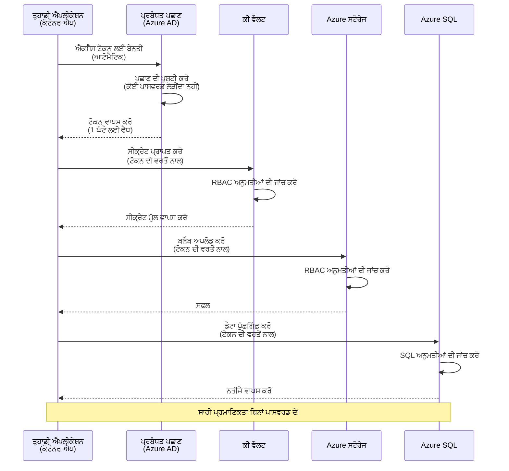

# ਪ੍ਰਮਾਣਿਕਤਾ ਪੈਟਰਨ ਅਤੇ ਮੈਨੇਜਡ ਆਈਡੈਂਟਿਟੀ

⏱️ **ਅੰਦਾਜ਼ਾ ਸਮਾਂ**: 45-60 ਮਿੰਟ | 💰 **ਲਾਗਤ ਪ੍ਰਭਾਵ**: ਮੁਫ਼ਤ (ਕੋਈ ਵਾਧੂ ਖਰਚੇ ਨਹੀਂ) | ⭐ **ਜਟਿਲਤਾ**: ਦਰਮਿਆਨਾ

**📚 ਸਿੱਖਣ ਪਾਥ:**
- ← ਪਿਛਲਾ: [ਕੰਫਿਗਰੇਸ਼ਨ ਮੈਨੇਜਮੈਂਟ](configuration.md) - ਵਾਤਾਵਰਣ ਚਲ ਅਤੇ ਸिक्रੇਟਸ ਦਾ ਪ੍ਰਬੰਧਨ
- 🎯 **ਤੁਸੀਂ ਇੱਥੇ ਹੋ**: ਪ੍ਰਮਾਣਿਕਤਾ ਅਤੇ ਸੁਰੱਖਿਆ (ਮੈਨੇਜਡ ਆਈਡੈਂਟਿਟੀ, Key Vault, ਸੁਰੱਖਿਅਤ ਪੈਟਰਨ)
- → ਅਗਲਾ: [ਪਹਿਲਾ ਪ੍ਰੋਜੈਕਟ](first-project.md) - ਆਪਣਾ ਪਹਿਲਾ AZD ਐਪ ਬਣਾਓ
- 🏠 [ਕੋਰਸ ਮੁੱਖ-ਪੰਨਾ](../../README.md)

---

## ਤੁਸੀਂ ਕੀ ਸਿੱਖੋਗੇ

ਇਸ ਪਾਠ ਨੂੰ ਪੂਰਾ ਕਰਕੇ, ਤੁਸੀਂ:
- Azure ਪ੍ਰਮਾਣਿਕਤਾ ਪੈਟਰਨ ਸਮਝੋਂਗੇ (ਕੀਜ਼, ਕਨੈਕਸ਼ਨ ਸਟਰਿੰਗਜ਼, ਮੈਨੇਜਡ ਆਈਡੈਂਟਿਟੀ)
- ਪਾਸਵਰਡ-ਰਹਿਤ ਪ੍ਰਮਾਣਿਕਤਾ ਲਈ **ਮੈਨੇਜਡ ਆਈਡੈਂਟਿਟੀ** ਲਾਗੂ ਕਰੋਗੇ
- **Azure Key Vault** ਇੰਟਿਗ੍ਰੇਸ਼ਨ ਨਾਲ ਸਿਕ੍ਰੇਟਸ ਸੁਰੱਖਿਅਤ ਕਰੋਗੇ
- AZD ਡਿਪਲੋਇਮੈਂਟ ਲਈ **ਰੋਲ-ਅਧਾਰਿਤ ਐਕਸੈੱਸ ਕੰਟ੍ਰੋਲ (RBAC)** ਸੰਰਚਨਾ ਕਰੋਗੇ
- Container Apps ਅਤੇ Azure ਸੇਵਾਵਾਂ ਵਿੱਚ ਸੁਰੱਖਿਆ ਦੀਆਂ ਸਰੋਤਰੀਆਂ ਅਮਲ ਕਰੋਗੇ
- ਕੀ-ਅਧਾਰਿਤ ਤੋਂ ਆਈਡੈਂਟਿਟੀ-ਅਧਾਰਿਤ ਪ੍ਰਮਾਣਿਕਤਾ ਵਲ ਮਾਈਗ੍ਰੇਟ ਕਰੋਗੇ

## ਕਿਉਂ ਮੈਨੇਜਡ ਆਈਡੈਂਟਿਟੀ ਮਹੱਤਵ ਰੱਖਦੀ ਹੈ

### ਸਮੱਸਿਆ: ਰਵਾਇਤੀ ਪ੍ਰਮਾਣਿਕਤਾ

**ਮੈਨੇਜਡ ਆਈਡੈਂਟਿਟੀ ਤੋਂ ਪਹਿਲਾਂ:**
```javascript
// ❌ ਸੁਰੱਖਿਆ ਖਤਰਾ: ਕੋਡ ਵਿੱਚ ਹਾਰਡਕੋਡ ਕੀਤੀਆਂ ਗੁਪਤ ਜਾਣਕਾਰੀਆਂ
const connectionString = "Server=mydb.database.windows.net;User=admin;Password=P@ssw0rd123";
const storageKey = "xK7mN9pQ2wR5tY8uI0oP3aS6dF1gH4jK...";
const cosmosKey = "C2x7B9n4M1p8Q5w3E6r0T2y5U8i1O4p7...";
```

**ਸਮੱਸਿਆਵਾਂ:**
- 🔴 **ਕੋਡ, ਕਨਫਿਗ ਫਾਇਲਾਂ, ਵਾਤਾਵਰਣ ਚਲ ਵਿੱਚ ਖੁਲਾਸਾ ਹੋਏ ਸਿਕ੍ਰੇਟਸ**
- 🔴 **ਕ੍ਰੈਡੈਂਸ਼ਲ ਘੁੰਮਾਉਣਾ** ਕੋਡ ਬਦਲਣ ਅਤੇ ਦੁਬਾਰਾ ਡਿਪਲੋਇ ਕਰਨ ਦੀ ਲੋੜ
- 🔴 **ਆਡਿਟ ਦੇ ਸਿਰਦਰਦ** - ਕਿਸ ਨੇ ਕੀ, ਕਦੋਂ ਐਕਸੈੱਸ ਕੀਤਾ?
- 🔴 **ਫੈਲਾਅ** - ਸਿਕ੍ਰੇਟਸ ਕਈ ਸਿਸਟਮਾਂ ਵਿੱਚ ਫੈਲੇ ਹੋਏ
- 🔴 **ਕੋਮਪਲਾਇੰਸ ਖ਼ਤਰੇ** - ਸੁਰੱਖਿਆ ਆਡੀਟਾਂ ਵਿੱਚ ਫੇਲ

### ਹੱਲ: ਮੈਨੇਜਡ ਆਈਡੈਂਟਿਟੀ

**ਮੈਨੇਜਡ ਆਈਡੈਂਟਿਟੀ ਤੋਂ ਬਾਅਦ:**
```javascript
// ✅ ਸੁਰੱਖਿਅਤ: ਕੋਡ ਵਿੱਚ ਕੋਈ ਰਾਜ਼ ਨਹੀਂ
const credential = new DefaultAzureCredential();
const client = new BlobServiceClient(
  "https://mystorageaccount.blob.core.windows.net",
  credential  // Azure ਆਪਣੇ ਆਪ ਪ੍ਰਮਾਣਿਕਤਾ ਸੰਭਾਲਦਾ ਹੈ
);
```

**ਫਾਇਦੇ:**
- ✅ **ਕੋਡ ਜਾਂ ਕਨਫਿਗ ਵਿੱਚ ਸਿਕ੍ਰੇਟਸ ਨਹੀਂ**
- ✅ **ਆਟੋਮੈਟਿਕ ਰੋਟੇਸ਼ਨ** - Azure ਇਸਨੂੰ ਸੰਭਾਲਦਾ ਹੈ
- ✅ **Azure AD ਲੌਗਾਂ ਵਿੱਚ ਪੂਰਾ ਆਡਿਟ ਟ੍ਰੇਲ**
- ✅ **ਕੇਂਦਰੀਕ੍ਰਿਤ ਸੁਰੱਖਿਆ** - Azure ਪੋਰਟਲ 'ਚ ਪ੍ਰਬੰਧਿਤ ਕਰੋ
- ✅ **ਕੋਮਪਲਾਇੰਸ-ਤਿਆਰ** - ਸੁਰੱਖਿਆ ਮਿਆਰ ਪੂਰੇ ਹੋਦੇ ਹਨ

**ਉਪਮਾ**: ਰਵਾਇਤੀ ਪ੍ਰਮਾਣਿਕਤਾ ਵੱਖ-ਵੱਖ ਦਰਵਾਜ਼ਿਆਂ ਲਈ ਕਈ ਫਿਜ਼ੀਕਲ ਚਾਬੀਆਂ ਲਿਜਾਣ ਵਰਗੀ ਹੈ। ਮੈਨੇਜਡ ਆਈਡੈਂਟਿਟੀ ਇੱਕ ਸੁਰੱਖਿਆ ਬੈਜ ਵਰਗੀ ਹੈ ਜੋ ਆਪਣੇ-ਆਪ ਨੂੰ ਆਪ ਅਧਾਰਿਤ ਪ੍ਰਵੇਸ਼ ਦਿੰਦੀ — ਕੋਈ ਚਾਬੀ ਖੋਣ ਜਾਂ ਨਕਲ ਜਾਂ ਰੋਟੇਟ ਕਰਨ ਦੀ ਲੋੜ ਨਹੀਂ।

---

## ਆਰਕੀਟੈਕਚਰ ਓਵਰਵਿਊ

### ਮੈਨੇਜਡ ਆਈਡੈਂਟਿਟੀ ਨਾਲ ਪ੍ਰਮਾਣਿਕਤਾ ਪ੍ਰਵਾਹ


### ਮੈਨੇਜਡ ਆਈਡੈਂਟਿਟੀਆਂ ਦੇ ਪ੍ਰਕਾਰ


| ਖਾਸੀਅਤ | ਸਿਸਟਮ-ਨਿਰਧਾਰਿਤ | ਯੂਜ਼ਰ-ਨਿਰਧਾਰਿਤ |
|---------|----------------|---------------|
| **ਲਾਈਫਸਾਈਕਲ** | ਸੰਸਾਧਨ ਨਾਲ ਜੁੜਿਆ | ਸੁਤੰਤਰ |
| **ਸਿਰਜਣਾ** | ਸੰਸਾਧਨ ਨਾਲ ਆਟੋਮੈਟਿਕ | ਮੈਨੂਅਲ ਸਿਰਜਣਾ |
| **ਮਿਟਾਉਣਾ** | ਸੰਸਾਧਨ ਦੇ ਨਾਲ ਮਿਟਾਇਆ ਜਾਂਦਾ ਹੈ | ਸੰਸਾਧਨ ਮਿਟਣ ਤੋਂ ਬਾਦ ਵੀ ਬਣਿਆ ਰਹਿੰਦਾ ਹੈ |
| **ਸ਼ੇਅਰਿੰਗ** | ਸਿਰਫ ਇੱਕ ਸੰਸਾਧਨ | ਕਈ ਸੰਸਾਧਨ |
| **ਵਰਤੋਂ ਦਾ ਕੇਸ** | ਸਾਦੇ ਸਿਨਾਰਿਓਜ਼ | ਜਟਿਲ ਬਹੁ-ਸੰਸਾਧਨ ਸਿਨਾਰਿਓਜ਼ |
| **AZD ਪੂਰਵ-ਨਿਰਧਾਰਿਤ** | ✅ ਸਿਫਾਰਸ਼ ਕੀਤੀ | ਵਿਕਲਪਿਕ |

---

## ਪੂਰਵ-ਆਵਸ਼ਕਤਾਵਾਂ

### ਲੋੜੀਂਦੇ ਟੂਲ

ਤੁਹਾਡੇ ਕੋਲ ਪਹਿਲਾਂ ਦੇ ਸਬਕਾਂ ਤੋਂ ਇਹ ਇੰਸਟਾਲ ਹੋਣੇ ਚਾਹੀਦੇ ਹਨ:

```bash
# Azure Developer CLI ਦੀ ਜਾਂਚ ਕਰੋ
azd version
# ✅ ਉਮੀਦ ਕੀਤੀ ਗਈ: azd ਸੰਸਕਰਨ 1.0.0 ਜਾਂ ਇਸ ਤੋਂ ਉੱਪਰ

# Azure CLI ਦੀ ਜਾਂਚ ਕਰੋ
az --version
# ✅ ਉਮੀਦ ਕੀਤੀ ਗਈ: azure-cli ਸੰਸਕਰਨ 2.50.0 ਜਾਂ ਇਸ ਤੋਂ ਉੱਪਰ
```

### Azure ਲਈ ਲੋੜਾਂ

- ਸਕ੍ਰਿਯ Azure ਸਬਸਕ੍ਰਿਪਸ਼ਨ
- ਅਨੁਮਤੀਆਂ:
  - ਮੈਨੇਜਡ ਆਈਡੈਂਟਿਟੀਆਂ ਬਣਾਉਣ ਦੀ
  - RBAC ਰੋਲ ਅਸਾਈਨ ਕਰਨ ਦੀ
  - Key Vault ਸਰੋਤ ਬਣਾਉਣ ਦੀ
  - Container Apps ਡਿਪਲੋਇ ਕਰਨ ਦੀ

### ਜਾਣਕਾਰੀ ਲਈ ਪੂਰਵ-ਆਵਸ਼ਕਤਾਵਾਂ

ਤੁਹਾਨੂੰ ਇਹ ਮੁਕੰਮਲ ਕਰਨੇ ਚਾਹੀਦੇ ਹਨ:
- [ਇੰਸਟਾਲੇਸ਼ਨ ਗਾਈਡ](installation.md) - AZD ਸੈਟਅੱਪ
- [AZD ਬੇਸਿਕਸ](azd-basics.md) - ਮੁੱਖ ਧਾਰਣਾਵਾਂ
- [ਕੰਫਿਗਰੇਸ਼ਨ ਮੈਨੇਜਮੈਂਟ](configuration.md) - ਵਾਤਾਵਰਣ ਚਲ

---

## ਪਾਠ 1: ਪ੍ਰਮਾਣਿਕਤਾ ਪੈਟਰਨ ਨੂੰ ਸਮਝਣਾ

### ਪੈਟਰਨ 1: ਕਨੈਕਸ਼ਨ ਸਟਰਿੰਗਜ਼ (ਪੁਰਾਣਾ - ਬਚੋ)

**ਇਹ ਕਿਵੇਂ ਕੰਮ ਕਰਦਾ ਹੈ:**
```bash
# ਕਨੈਕਸ਼ਨ ਸਟਰਿੰਗ ਵਿੱਚ ਲਾਗਇਨ ਜਾਣਕਾਰੀ ਸ਼ਾਮِل ਹੈ
STORAGE_CONNECTION_STRING="DefaultEndpointsProtocol=https;AccountName=myaccount;AccountKey=xK7mN9pQ2wR5..."
COSMOS_CONNECTION_STRING="AccountEndpoint=https://myaccount.documents.azure.com:443/;AccountKey=C2x7..."
SQL_CONNECTION_STRING="Server=myserver.database.windows.net;User=admin;Password=P@ssw0rd..."
```

**ਸਮੱਸਿਆਵਾਂ:**
- ❌ ਵਾਤਾਵਰਣ ਚਲ ਵਿੱਚ ਸਿਕ੍ਰੇਟਸ ਦਿੱਖਦੇ ਹਨ
- ❌ ਡਿਪਲੋਇਮੈਂਟ ਸਿਸਟਮਾਂ ਵਿੱਚ ਲੌਗ ਹੋ ਸਕਦੇ ਹਨ
- ❌ ਘੁੰਮਾਉਣਾ ਮੁਸ਼ਕਲ
- ❌ ਐਕਸੈੱਸ ਦਾ ਕੋਈ ਆਡਿਟ ਟਰੇਲ ਨਹੀਂ

**ਕਦੋਂ ਵਰਤਣਾ:** ਸਿਰਫ ਲੋਕਲ ਵਿਕਾਸ ਲਈ, ਪ੍ਰੋਡਕਸ਼ਨ ਲਈ ਕਦੇ ਨਹੀਂ.

---

### ਪੈਟਰਨ 2: Key Vault References (ਵਧੀਆ)

**ਇਹ ਕਿਵੇਂ ਕੰਮ ਕਰਦਾ ਹੈ:**
```bicep
// Store secret in Key Vault
resource keyVault 'Microsoft.KeyVault/vaults@2023-02-01' = {
  name: 'mykv'
  properties: {
    enableRbacAuthorization: true
  }
}

// Reference in Container App
env: [
  {
    name: 'STORAGE_KEY'
    secretRef: 'storage-key'  // References Key Vault
  }
]
```

**ਫਾਇਦੇ:**
- ✅ ਸਿਕ੍ਰੇਟਸ Key Vault ਵਿੱਚ ਸੁਰੱਖਿਅਤ ਤੌਰ 'ਤੇ ਸਟੋਰ ਕੀਤੇ ਜਾਂਦੇ ਹਨ
- ✅ ਕੇਂਦਰਿਕ੍ਰਿਤ ਸਿਕ੍ਰੇਟ ਪ੍ਰਬੰਧਨ
- ✅ ਕੋਡ ਬਦਲੇ ਬਿਨਾਂ ਰੋਟੇਸ਼ਨ

**ਸੀਮਾਵਾਂ:**
- ⚠️ ਹਾਲੇ ਵੀ ਕੀਜ਼/ਪਾਸਵਰਡ ਵਰਤ ਰਹੇ ਹੋ
- ⚠️ Key Vault ਐਕਸੈੱਸ ਦਾ ਪ੍ਰਬੰਧਨ ਕਰਨ ਦੀ ਲੋੜ

**ਕਦੋਂ ਵਰਤਣਾ:** ਕਨੈਕਸ਼ਨ ਸਟਰਿੰਗਜ਼ ਤੋਂ ਮੈਨੇਜਡ ਆਈਡੈਂਟਿਟੀ ਵੱਲ ਜਾਨ ਦਾ ਟ੍ਰਾਂਜ਼ਿਸ਼ਨ ਕਦਮ।

---

### ਪੈਟਰਨ 3: ਮੈਨੇਜਡ ਆਈਡੈਂਟਿਟੀ (ਸਭ ਤੋਂ ਵਧੀਆ ਅਭਿਆਸ)

**ਇਹ ਕਿਵੇਂ ਕੰਮ ਕਰਦਾ ਹੈ:**
```bicep
// Enable managed identity
resource containerApp 'Microsoft.App/containerApps@2023-05-01' = {
  name: 'myapp'
  identity: {
    type: 'SystemAssigned'  // Automatically creates identity
  }
}

// Grant permissions
resource roleAssignment 'Microsoft.Authorization/roleAssignments@2022-04-01' = {
  scope: storageAccount
  properties: {
    roleDefinitionId: storageBlobDataContributorRole
    principalId: containerApp.identity.principalId
  }
}
```

**ਐਪਲੀਕੇਸ਼ਨ ਕੋਡ:**
```javascript
// ਕਿਸੇ ਰਾਜ਼ ਦੀ ਲੋੜ ਨਹੀਂ!
const { DefaultAzureCredential } = require('@azure/identity');
const { BlobServiceClient } = require('@azure/storage-blob');

const credential = new DefaultAzureCredential();
const blobServiceClient = new BlobServiceClient(
  'https://mystorageaccount.blob.core.windows.net',
  credential
);
```

**ਫਾਇਦੇ:**
- ✅ ਕੋਡ/ਕਨਫਿਗ ਵਿੱਚ ਸਿਫ਼ਰ ਸਿਕ੍ਰੇਟਸ
- ✅ ਆਟੋਮੈਟਿਕ ਕ੍ਰੈਡੈਂਸ਼ਲ ਰੋਟੇਸ਼ਨ
- ✅ ਪੂਰਾ ਆਡਿਟ ਟਰੇਲ
- ✅ RBAC-ਅਧਾਰਿਤ ਅਨੁਮਤੀਆਂ
- ✅ ਕੋਮਪਲਾਇੰਸ-ਤਿਆਰ

**ਕਦੋਂ ਵਰਤਣਾ:** ਹਮੇਸ਼ਾਂ, ਪ੍ਰੋਡਕਸ਼ਨ ਐਪਲੀਕੇਸ਼ਨਾਂ ਲਈ.

---

## ਪਾਠ 2: AZD ਨਾਲ ਮੈਨੇਜਡ ਆਈਡੈਂਟਿਟੀ ਲਾਗੂ ਕਰਨਾ

### ਕਦਮ-ਬਾਈ-ਕਦਮ ਲਾਗੂਕਰਨ

ਆਓ ਇੱਕ ਸੁਰੱਖਿਅਤ Container App ਬਣਾਈਏ ਜੋ Azure Storage ਅਤੇ Key Vault ਤੱਕ ਪਹੁੰਚ ਲਈ ਮੈਨੇਜਡ ਆਈਡੈਂਟਿਟੀ ਵਰਤਦਾ ਹੈ।

### ਪ੍ਰੋਜੈਕਟ ਰਚਨਾ

```
secure-app/
├── azure.yaml                 # AZD configuration
├── infra/
│   ├── main.bicep            # Main infrastructure
│   ├── core/
│   │   ├── identity.bicep    # Managed identity setup
│   │   ├── keyvault.bicep    # Key Vault configuration
│   │   └── storage.bicep     # Storage with RBAC
│   └── app/
│       └── container-app.bicep
└── src/
    ├── app.js                # Application code
    ├── package.json
    └── Dockerfile
```

### 1. AZD ਨੂੰ ਸੰਰਚਿਤ ਕਰੋ (azure.yaml)

```yaml
name: secure-app
metadata:
  template: secure-app@1.0.0

services:
  api:
    project: ./src
    language: js
    host: containerapp

# Enable managed identity (AZD handles this automatically)
```

### 2. ਇੰਫਰਾਸਟਰਕਚਰ: ਮੈਨੇਜਡ ਆਈਡੈਂਟਿਟੀ ਯੋਗ ਕਰੋ

**ਫਾਇਲ: `infra/main.bicep`**

```bicep
targetScope = 'subscription'

param environmentName string
param location string = 'eastus'

var tags = { 'azd-env-name': environmentName }

// Resource group
resource rg 'Microsoft.Resources/resourceGroups@2021-04-01' = {
  name: 'rg-${environmentName}'
  location: location
  tags: tags
}

// Storage Account
module storage './core/storage.bicep' = {
  name: 'storage'
  scope: rg
  params: {
    name: 'st${uniqueString(rg.id)}'
    location: location
    tags: tags
  }
}

// Key Vault
module keyVault './core/keyvault.bicep' = {
  name: 'keyvault'
  scope: rg
  params: {
    name: 'kv-${uniqueString(rg.id)}'
    location: location
    tags: tags
  }
}

// Container App with Managed Identity
module containerApp './app/container-app.bicep' = {
  name: 'container-app'
  scope: rg
  params: {
    name: 'ca-${environmentName}'
    location: location
    tags: tags
    storageAccountName: storage.outputs.name
    keyVaultName: keyVault.outputs.name
  }
}

// Grant Container App access to Storage
module storageRoleAssignment './core/role-assignment.bicep' = {
  name: 'storage-role'
  scope: rg
  params: {
    principalId: containerApp.outputs.identityPrincipalId
    roleDefinitionId: 'ba92f5b4-2d11-453d-a403-e96b0029c9fe'  // Storage Blob Data Contributor
    targetResourceId: storage.outputs.id
  }
}

// Grant Container App access to Key Vault
module kvRoleAssignment './core/role-assignment.bicep' = {
  name: 'kv-role'
  scope: rg
  params: {
    principalId: containerApp.outputs.identityPrincipalId
    roleDefinitionId: '4633458b-17de-408a-b874-0445c86b69e6'  // Key Vault Secrets User
    targetResourceId: keyVault.outputs.id
  }
}

// Outputs
output AZURE_STORAGE_ACCOUNT_NAME string = storage.outputs.name
output AZURE_KEY_VAULT_NAME string = keyVault.outputs.name
output APP_URL string = containerApp.outputs.url
```

### 3. ਸਿਸਟਮ-ਨਿਰਧਾਰਿਤ ਆਈਡੈਂਟਿਟੀ ਨਾਲ Container App

**ਫਾਇਲ: `infra/app/container-app.bicep`**

```bicep
param name string
param location string
param tags object = {}
param storageAccountName string
param keyVaultName string

resource containerApp 'Microsoft.App/containerApps@2023-05-01' = {
  name: name
  location: location
  tags: tags
  identity: {
    type: 'SystemAssigned'  // 🔑 Enable managed identity
  }
  properties: {
    configuration: {
      ingress: {
        external: true
        targetPort: 3000
      }
    }
    template: {
      containers: [
        {
          name: 'api'
          image: 'myregistry.azurecr.io/api:latest'
          resources: {
            cpu: json('0.5')
            memory: '1Gi'
          }
          env: [
            {
              name: 'AZURE_STORAGE_ACCOUNT_NAME'
              value: storageAccountName
            }
            {
              name: 'AZURE_KEY_VAULT_NAME'
              value: keyVaultName
            }
            // 🔑 No secrets - managed identity handles authentication!
          ]
        }
      ]
    }
  }
}

// Output the identity for RBAC assignments
output identityPrincipalId string = containerApp.identity.principalId
output id string = containerApp.id
output url string = 'https://${containerApp.properties.configuration.ingress.fqdn}'
```

### 4. RBAC ਰੋਲ ਅਸਾਈਨਮੈਂਟ ਮੋਡੀਊਲ

**ਫਾਇਲ: `infra/core/role-assignment.bicep`**

```bicep
param principalId string
param roleDefinitionId string  // Azure built-in role ID
param targetResourceId string

resource roleAssignment 'Microsoft.Authorization/roleAssignments@2022-04-01' = {
  name: guid(principalId, roleDefinitionId, targetResourceId)
  scope: resourceId('Microsoft.Resources/resourceGroups', resourceGroup().name)
  properties: {
    roleDefinitionId: subscriptionResourceId('Microsoft.Authorization/roleDefinitions', roleDefinitionId)
    principalId: principalId
    principalType: 'ServicePrincipal'
  }
}

output id string = roleAssignment.id
```

### 5. ਮੈਨੇਜਡ ਆਈਡੈਂਟਿਟੀ ਨਾਲ ਐਪਲੀਕੇਸ਼ਨ ਕੋਡ

**ਫਾਇਲ: `src/app.js`**

```javascript
const express = require('express');
const { DefaultAzureCredential } = require('@azure/identity');
const { BlobServiceClient } = require('@azure/storage-blob');
const { SecretClient } = require('@azure/keyvault-secrets');

const app = express();
const PORT = process.env.PORT || 3000;

// 🔑 ਪ੍ਰਮਾਣ ਪੱਤਰ ਸ਼ੁਰੂ ਕਰੋ (ਮੈਨੇਜਡ ਆਈਡੈਂਟਿਟੀ ਨਾਲ ਆਟੋਮੈਟਿਕ ਤੌਰ ਤੇ ਕੰਮ ਕਰਦਾ ਹੈ)
const credential = new DefaultAzureCredential();

// Azure ਸਟੋਰੇਜ ਸੈਟਅੱਪ
const storageAccountName = process.env.AZURE_STORAGE_ACCOUNT_NAME;
const blobServiceClient = new BlobServiceClient(
  `https://${storageAccountName}.blob.core.windows.net`,
  credential  // ਕੋਈ ਕੁੰਜੀਆਂ ਦੀ ਲੋੜ ਨਹੀਂ!
);

// Key Vault ਸੈਟਅੱਪ
const keyVaultName = process.env.AZURE_KEY_VAULT_NAME;
const secretClient = new SecretClient(
  `https://${keyVaultName}.vault.azure.net`,
  credential  // ਕੋਈ ਕੁੰਜੀਆਂ ਦੀ ਲੋੜ ਨਹੀਂ!
);

// ਸਿਹਤ ਜਾਂਚ
app.get('/health', (req, res) => {
  res.json({ status: 'healthy', authentication: 'managed-identity' });
});

// ਫਾਈਲ ਨੂੰ ਬਲੌਬ ਸਟੋਰੇਜ ਵਿੱਚ ਅਪਲੋਡ ਕਰੋ
app.post('/upload', async (req, res) => {
  try {
    const containerClient = blobServiceClient.getContainerClient('uploads');
    await containerClient.createIfNotExists();
    
    const blobName = `file-${Date.now()}.txt`;
    const blockBlobClient = containerClient.getBlockBlobClient(blobName);
    
    await blockBlobClient.upload('Hello from managed identity!', 30);
    
    res.json({
      success: true,
      blobName: blobName,
      message: 'File uploaded using managed identity!'
    });
  } catch (error) {
    console.error('Upload error:', error);
    res.status(500).json({ error: error.message });
  }
});

// Key Vault ਤੋਂ ਗੁਪਤ ਜਾਣਕਾਰੀ ਪ੍ਰਾਪਤ ਕਰੋ
app.get('/secret/:name', async (req, res) => {
  try {
    const secretName = req.params.name;
    const secret = await secretClient.getSecret(secretName);
    
    res.json({
      name: secretName,
      value: secret.value,
      message: 'Secret retrieved using managed identity!'
    });
  } catch (error) {
    console.error('Secret error:', error);
    res.status(500).json({ error: error.message });
  }
});

// ਬਲੌਬ ਕੰਟੇਨਰਾਂ ਦੀ ਸੂਚੀ (ਪੜ੍ਹਨ ਦੀ ਪਹੁੰჩ ਦਿਖਾਉਂਦਾ ਹੈ)
app.get('/containers', async (req, res) => {
  try {
    const containers = [];
    for await (const container of blobServiceClient.listContainers()) {
      containers.push(container.name);
    }
    
    res.json({
      containers: containers,
      count: containers.length,
      message: 'Containers listed using managed identity!'
    });
  } catch (error) {
    console.error('List error:', error);
    res.status(500).json({ error: error.message });
  }
});

app.listen(PORT, () => {
  console.log(`Secure API listening on port ${PORT}`);
  console.log('Authentication: Managed Identity (passwordless)');
});
```

**ਫਾਇਲ: `src/package.json`**

```json
{
  "name": "secure-app",
  "version": "1.0.0",
  "dependencies": {
    "express": "^4.18.2",
    "@azure/identity": "^4.0.0",
    "@azure/storage-blob": "^12.17.0",
    "@azure/keyvault-secrets": "^4.7.0"
  },
  "scripts": {
    "start": "node app.js"
  }
}
```

### 6. ਡਿਪਲੋਇ ਅਤੇ ਟੈਸਟ ਕਰੋ

```bash
# AZD ਮਾਹੌਲ ਨੂੰ ਸ਼ੁਰੂ ਕਰੋ
azd init

# ਬੁਨਿਆਦੀ ਢਾਂਚਾ ਅਤੇ ਐਪਲੀਕੇਸ਼ਨ ਨੂੰ ਤੈਨਾਤ ਕਰੋ
azd up

# ਐਪ ਦਾ ਯੂਆਰਐੱਲ ਪ੍ਰਾਪਤ ਕਰੋ
APP_URL=$(azd env get-values | grep APP_URL | cut -d '=' -f2 | tr -d '"')

# ਹੈਲਥ ਚੈੱਕ ਦੀ ਜਾਂਚ ਕਰੋ
curl $APP_URL/health
```

**✅ ਉਮੀਦ ਕੀਤੀ ਨਤੀਜਾ:**
```json
{
  "status": "healthy",
  "authentication": "managed-identity"
}
```

**ਬਲੌਬ ਅਪਲੋਡ ਟੈਸਟ:**
```bash
curl -X POST $APP_URL/upload
```

**✅ ਉਮੀਦ ਕੀਤੀ ਨਤੀਜਾ:**
```json
{
  "success": true,
  "blobName": "file-1700404800000.txt",
  "message": "File uploaded using managed identity!"
}
```

**ਕੰਟੇਨਰ ਲਿਸਟ ਕਰਨ ਦੀ ਟੈਸਟ:**
```bash
curl $APP_URL/containers
```

**✅ ਉਮੀਦ ਕੀਤੀ ਨਤੀਜਾ:**
```json
{
  "containers": ["uploads"],
  "count": 1,
  "message": "Containers listed using managed identity!"
}
```

---

## ਆਮ Azure RBAC ਰੋਲ

### ਮੈਨੇਜਡ ਆਈਡੈਂਟਿਟੀ ਲਈ ਬਿਲਟ-ਇਨ ਰੋਲ ID

| ਸੇਵਾ | ਰੋਲ ਨਾਂ | ਰੋਲ ID | ਅਨੁਮਤੀਆਂ |
|---------|-----------|---------|-------------|
| **ਸਟੋਰੇਜ** | Storage Blob Data Reader | `2a2b9908-6b94-4a3d-8e5a-a7d8f8cc8a12` | ਬਲੌਬ ਅਤੇ ਕੰਟੇਨਰ ਪੜ੍ਹੋ |
| **ਸਟੋਰੇਜ** | Storage Blob Data Contributor | `ba92f5b4-2d11-453d-a403-e96b0029c9fe` | ਬਲੌਬ ਪੜ੍ਹੋ, ਲਿਖੋ, ਮਿਟਾਓ |
| **ਸਟੋਰੇਜ** | Storage Queue Data Contributor | `974c5e8b-45b9-4653-ba55-5f855dd0fb88` | ਕਤਾਰ ਮੈਸੇਜ ਪੜ੍ਹੋ, ਲਿਖੋ, ਮਿਟਾਓ |
| **Key Vault** | Key Vault Secrets User | `4633458b-17de-408a-b874-0445c86b69e6` | ਸਿਕ੍ਰੇਟਸ ਪੜ੍ਹੋ |
| **Key Vault** | Key Vault Secrets Officer | `b86a8fe4-44ce-4948-aee5-eccb2c155cd7` | ਸਿਕ੍ਰੇਟਸ ਪੜ੍ਹੋ, ਲਿਖੋ, ਮਿਟਾਓ |
| **Cosmos DB** | Cosmos DB Built-in Data Reader | `00000000-0000-0000-0000-000000000001` | Cosmos DB ਦੇ ਡੇਟਾ ਨੂੰ ਪੜ੍ਹੋ |
| **Cosmos DB** | Cosmos DB Built-in Data Contributor | `00000000-0000-0000-0000-000000000002` | Cosmos DB ਡੇਟਾ ਪੜ੍ਹੋ, ਲਿਖੋ |
| **SQL Database** | SQL DB Contributor | `9b7fa17d-e63e-47b0-bb0a-15c516ac86ec` | SQL ਡੇਟਾਬੇਸ ਪ੍ਰਬੰਧਿਤ ਕਰੋ |
| **Service Bus** | Azure Service Bus Data Owner | `090c5cfd-751d-490a-894a-3ce6f1109419` | ਮੈਸੇਜ ਭੇਜੋ, ਪ੍ਰਾਪਤ ਕਰੋ, ਪ੍ਰਬੰਧਿਤ ਕਰੋ |

### ਰੋਲ ID ਕਿਵੇਂ ਲੱਭਣੇ ਹਨ

```bash
# ਸਾਰੇ ਬਿਲਟ-ਇਨ ਰੋਲ ਲਿਸਟ ਕਰੋ
az role definition list --query "[].{Name:roleName, ID:name}" --output table

# ਕਿਸੇ ਵਿਸ਼ੇਸ਼ ਰੋਲ ਦੀ ਖੋਜ ਕਰੋ
az role definition list --query "[?contains(roleName, 'Storage Blob')].{Name:roleName, ID:name}" --output table

# ਰੋਲ ਦੇ ਵੇਰਵੇ ਪ੍ਰਾਪਤ ਕਰੋ
az role definition list --name "Storage Blob Data Contributor"
```

---

## ਵਿਆਵਹਾਰਿਕ ਅਭਿਆਸ

### ਐਕਸਰਸਾਈਜ਼ 1: ਮੌਜੂਦਾ ਐਪ ਲਈ ਮੈਨੇਜਡ ਆਈਡੈਂਟਿਟੀ ਯੋਗ ਕਰੋ ⭐⭐ (ਮੱਧਮ)

**ਮਕਸਦ**: ਮੌਜੂਦਾ Container App ਡਿਪਲੋਇਮੈਂਟ ਵਿੱਚ ਮੈਨੇਜਡ ਆਈਡੈਂਟਿਟੀ ਜੋੜੋ

**ਪੇਸ਼-ਦ੍ਰਿਸ਼**: ਤੁਹਾਡੇ ਕੋਲ ਇੱਕ Container App ਹੈ ਜੋ ਕਨੈਕਸ਼ਨ ਸਟਰਿੰਗਜ਼ ਵਰਤਦਾ ਹੈ। ਇਸਨੂੰ ਮੈਨੇਜਡ ਆਈਡੈਂਟਿਟੀ ਵੱਲ ਬਦਲੋ।

**ਸ਼ੁਰੂਆਤੀ ਬਿੰਦੂ**: ਇਸ ਕੁਨਫਿਗਰੇਸ਼ਨ ਵਾਲਾ Container App:

```bicep
// ❌ Current: Using connection string
env: [
  {
    name: 'STORAGE_CONNECTION_STRING'
    secretRef: 'storage-connection'
  }
]
```

**ਕਦਮ**:

1. **Bicep ਵਿੱਚ ਮੈਨੇਜਡ ਆਈਡੈਂਟਿਟੀ ਯੋਗ ਕਰੋ:**

```bicep
resource containerApp 'Microsoft.App/containerApps@2023-05-01' = {
  name: 'myapp'
  identity: {
    type: 'SystemAssigned'  // Add this
  }
  // ... rest of configuration
}
```

2. **ਸਟੋਰੇਜ ਐਕਸੈੱਸ ਦਿਓ:**

```bicep
// Get storage account reference
resource storageAccount 'Microsoft.Storage/storageAccounts@2023-01-01' existing = {
  name: storageAccountName
}

// Assign role
resource roleAssignment 'Microsoft.Authorization/roleAssignments@2022-04-01' = {
  name: guid(containerApp.id, 'ba92f5b4-2d11-453d-a403-e96b0029c9fe', storageAccount.id)
  scope: storageAccount
  properties: {
    roleDefinitionId: subscriptionResourceId('Microsoft.Authorization/roleDefinitions', 'ba92f5b4-2d11-453d-a403-e96b0029c9fe')
    principalId: containerApp.identity.principalId
    principalType: 'ServicePrincipal'
  }
}
```

3. **ਐਪਲੀਕੇਸ਼ਨ ਕੋਡ ਅਪਡੇਟ ਕਰੋ:**

**ਪਹਿਲਾਂ (ਕਨੈਕਸ਼ਨ ਸਟਰਿੰਗ):**
```javascript
const { BlobServiceClient } = require('@azure/storage-blob');

const blobServiceClient = BlobServiceClient.fromConnectionString(
  process.env.STORAGE_CONNECTION_STRING
);
```

**ਬਾਅਦ (ਮੈਨੇਜਡ ਆਈਡੈਂਟਿਟੀ):**
```javascript
const { DefaultAzureCredential } = require('@azure/identity');
const { BlobServiceClient } = require('@azure/storage-blob');

const credential = new DefaultAzureCredential();
const blobServiceClient = new BlobServiceClient(
  `https://${process.env.STORAGE_ACCOUNT_NAME}.blob.core.windows.net`,
  credential
);
```

4. **ਵਾਤਾਵਰਣ ਚਲ ਅਪਡੇਟ ਕਰੋ:**

```bicep
env: [
  {
    name: 'STORAGE_ACCOUNT_NAME'
    value: storageAccountName  // Just the name, no secrets!
  }
  // Remove STORAGE_CONNECTION_STRING
]
```

5. **ਡਿਪਲੋਇ ਅਤੇ ਟੈਸਟ ਕਰੋ:**

```bash
# ਫਿਰ ਤੋਂ ਤਾਇਨਾਤ ਕਰੋ
azd up

# ਜਾਂਚ ਕਰੋ ਕਿ ਇਹ ਅਜੇ ਵੀ ਕੰਮ ਕਰਦਾ ਹੈ
curl https://myapp.azurecontainerapps.io/upload
```

**✅ ਸਫਲਤਾ ਮਾਪਦੰਡ:**
- ✅ ਐਪ ਬਿਨਾਂ ਐਰਰ ਦੇ ਡਿਪਲੋਇ ਹੋ ਜਾਂਦੀ ਹੈ
- ✅ ਸਟੋਰੇਜ ਓਪਰੇਸ਼ਨਾਂ ਕੰਮ ਕਰਦੀਆਂ ਹਨ (ਅਪਲੋਡ, ਲਿਸਟ, ਡਾਊਨਲੋਡ)
- ✅ ਵਾਤਾਵਰਣ ਚਲ ਵਿੱਚ ਕੋਈ ਕਨੈਕਸ਼ਨ ਸਟਰਿੰਗ ਨਹੀਂ
- ✅ Azure ਪੋਰਟਲ 'Identity' ਬਲੇਡ ਵਿੱਚ ਆਈਡੈਂਟਿਟੀ ਦਿਖਾਈ ਦੇ ਰਹੀ ਹੈ

**ਤਸਦੀਕ:**

```bash
# ਜਾਂਚੋ ਕਿ ਪ੍ਰਬੰਧਿਤ ਪਛਾਣ ਯੋਗ ਹੈ
az containerapp show \
  --name myapp \
  --resource-group rg-myapp \
  --query "identity.type"
# ✅ ਉਮੀਦ: "SystemAssigned"

# ਰੋਲ ਅਸਾਈਨਮੈਂਟ ਦੀ ਜਾਂਚ ਕਰੋ
az role assignment list \
  --assignee $(az containerapp show --name myapp --resource-group rg-myapp --query "identity.principalId" -o tsv) \
  --scope /subscriptions/{sub-id}/resourceGroups/rg-myapp/providers/Microsoft.Storage/storageAccounts/mystorageaccount
# ✅ ਉਮੀਦ: "Storage Blob Data Contributor" ਰੋਲ ਦਿਖਾਉਂਦਾ ਹੈ
```

**ਸਮਾਂ**: 20-30 ਮਿੰਟ

---

### ਐਕਸਰਸਾਈਜ਼ 2: ਯੂਜ਼ਰ-ਨਿਰਧਾਰਿਤ ਆਈਡੈਂਟਿਟੀ ਨਾਲ ਬਹੁ-ਸੇਵਾ ਐਕਸੈੱਸ ⭐⭐⭐ (ਉੱਨਤ)

**ਮਕਸਦ**: ਕਈ Container Apps ਵਿੱਚ ਸਾਂਝਾ ਕਰਨ ਲਈ ਇੱਕ ਯੂਜ਼ਰ-ਨਿਰਧਾਰਿਤ ਆਈਡੈਂਟਿਟੀ ਬਣਾਓ

**ਪੇਸ਼-ਦ੍ਰਿਸ਼**: ਤੁਹਾਡੇ ਕੋਲ 3 ਮਾਈਕ੍ਰੋਸਰਵਿਸ ਹਨ ਜੋ ਸਾਰੇ ਇੱਕੋ Storage ਅਕਾਊਂਟ ਅਤੇ Key Vault ਤੱਕ ਪਹੁੰਚ ਦੀ ਲੋੜ ਰੱਖਦੇ ਹਨ।

**ਕਦਮ**:

1. **ਯੂਜ਼ਰ-ਨਿਰਧਾਰਿਤ ਆਈਡੈਂਟਿਟੀ ਬਣਾਉ:**

**ਫਾਇਲ: `infra/core/identity.bicep`**

```bicep
param name string
param location string
param tags object = {}

resource userAssignedIdentity 'Microsoft.ManagedIdentity/userAssignedIdentities@2023-01-31' = {
  name: name
  location: location
  tags: tags
}

output id string = userAssignedIdentity.id
output principalId string = userAssignedIdentity.properties.principalId
output clientId string = userAssignedIdentity.properties.clientId
```

2. **ਯੂਜ਼ਰ-ਨਿਰਧਾਰਿਤ ਆਈਡੈਂਟਿਟੀ ਨੂੰ ਰੋਲ ਅਸਾਈਨ ਕਰੋ:**

```bicep
// In main.bicep
module userIdentity './core/identity.bicep' = {
  name: 'user-identity'
  scope: rg
  params: {
    name: 'id-${environmentName}'
    location: location
    tags: tags
  }
}

// Grant Storage access
resource storageRoleAssignment 'Microsoft.Authorization/roleAssignments@2022-04-01' = {
  name: guid(userIdentity.outputs.principalId, 'storage-contributor')
  scope: storageAccount
  properties: {
    roleDefinitionId: subscriptionResourceId('Microsoft.Authorization/roleDefinitions', 'ba92f5b4-2d11-453d-a403-e96b0029c9fe')
    principalId: userIdentity.outputs.principalId
    principalType: 'ServicePrincipal'
  }
}

// Grant Key Vault access
resource kvRoleAssignment 'Microsoft.Authorization/roleAssignments@2022-04-01' = {
  name: guid(userIdentity.outputs.principalId, 'kv-secrets-user')
  scope: keyVault
  properties: {
    roleDefinitionId: subscriptionResourceId('Microsoft.Authorization/roleDefinitions', '4633458b-17de-408a-b874-0445c86b69e6')
    principalId: userIdentity.outputs.principalId
    principalType: 'ServicePrincipal'
  }
}
```

3. **ਕਈ Container Apps ਨੂੰ ਆਈਡੈਂਟਿਟੀ ਅਸਾਈਨ ਕਰੋ:**

```bicep
resource apiGateway 'Microsoft.App/containerApps@2023-05-01' = {
  name: 'api-gateway'
  identity: {
    type: 'UserAssigned'
    userAssignedIdentities: {
      '${userIdentity.outputs.id}': {}
    }
  }
  // ... rest of config
}

resource productService 'Microsoft.App/containerApps@2023-05-01' = {
  name: 'product-service'
  identity: {
    type: 'UserAssigned'
    userAssignedIdentities: {
      '${userIdentity.outputs.id}': {}
    }
  }
  // ... rest of config
}

resource orderService 'Microsoft.App/containerApps@2023-05-01' = {
  name: 'order-service'
  identity: {
    type: 'UserAssigned'
    userAssignedIdentities: {
      '${userIdentity.outputs.id}': {}
    }
  }
  // ... rest of config
}
```

4. **ਐਪਲੀਕੇਸ਼ਨ ਕੋਡ (ਸਾਰੇ ਸੇਵਾਵਾਂ ਇਕੋ ਪੈਟਰਨ ਵਰਤਦੀਆਂ ਹਨ):**

```javascript
const { DefaultAzureCredential, ManagedIdentityCredential } = require('@azure/identity');

// ਉਪਭੋਗਤਾ-ਨਿਰਧਾਰਤ ਪਛਾਣ ਲਈ, ਕਲਾਇੰਟ ID ਦਰਜ ਕਰੋ
const credential = new ManagedIdentityCredential(
  process.env.AZURE_CLIENT_ID  // ਉਪਭੋਗਤਾ-ਨਿਰਧਾਰਤ ਪਛਾਣ ਦਾ ਕਲਾਇੰਟ ID
);

// ਜਾਂ DefaultAzureCredential ਵਰਤੋ (ਆਪੋ-ਆਪ ਪਛਾਣ ਕਰਦਾ ਹੈ)
const credential = new DefaultAzureCredential();

const blobServiceClient = new BlobServiceClient(
  `https://${process.env.STORAGE_ACCOUNT_NAME}.blob.core.windows.net`,
  credential
);
```

5. **ਡਿਪਲੋਇ ਅਤੇ ਜਾਂਚ ਕਰੋ:**

```bash
azd up

# ਟੈਸਟ ਕਰੋ ਕਿ ਸਾਰੀਆਂ ਸੇਵਾਵਾਂ ਸਟੋਰੇਜ ਤੱਕ ਪਹੁੰਚ ਕਰ ਸਕਦੀਆਂ ਹਨ
curl https://api-gateway.azurecontainerapps.io/upload
curl https://product-service.azurecontainerapps.io/upload
curl https://order-service.azurecontainerapps.io/upload
```

**✅ ਸਫਲਤਾ ਮਾਪਦੰਡ:**
- ✅ ਇਕ ਆਈਡੈਂਟਿਟੀ 3 ਸੇਵਾਵਾਂ ਵਿੱਚ ਸਾਂਝੀ ਕੀਤੀ ਗਈ
- ✅ ਸਾਰੀਆਂ ਸੇਵਾਵਾਂ Storage ਅਤੇ Key Vault ਤੱਕ ਪਹੁੰਚ ਸਕਦੀਆਂ ਹਨ
- ✅ ਜੇ ਤੁਸੀਂ ਇਕ ਸੇਵਾ ਮਿਟਾਉਂਦੇ ਹੋ ਤਾਂ ਆਈਡੈਂਟਿਟੀ ਬਚੀ ਰਹਿੰਦੀ ਹੈ
- ✅ ਕੇਂਦਰੀਕ੍ਰਿਤ ਅਨੁਮਤੀ ਪ੍ਰਬੰਧਨ

**ਯੂਜ਼ਰ-ਨਿਰਧਾਰਿਤ ਆਈਡੈਂਟਿਟੀ ਦੇ ਫਾਇਦੇ:**
- ਇਕਲੌਤੀ ਆਈਡੈਂਟਿਟੀ ਪ੍ਰਬੰਧਨ ਲਈ
- ਸੇਵਾਵਾਂ ਵਿੱਚ ਸਥਿਰ ਅਨੁਮਤੀਆਂ
- ਸੇਵਾ ਮਿਟਣ 'ਤੇ ਜਿਓਂਦੀ ਰਹਿੰਦੀ ਹੈ
- ਜਟਿਲ ਆਰਕੀਟੈਕਚਰ ਲਈ ਵਧੀਆ

**ਸਮਾਂ**: 30-40 ਮਿੰਟ

---

### ਐਕਸਰਸਾਈਜ਼ 3: Key Vault ਸੀਕ੍ਰੇਟ ਰੋਟੇਸ਼ਨ ਲਾਗੂ ਕਰੋ ⭐⭐⭐ (ਉੱਨਤ)

**ਮਕਸਦ**: ਤੀਜੀ-ਪੱਖੀ API ਕੁੰਜੀਆਂ Key Vault ਵਿੱਚ ਸਟੋਰ ਕਰੋ ਅਤੇ ਮੈਨੇਜਡ ਆਈਡੈਂਟਿਟੀ ਨਾਲ ਐਕਸੈੱਸ ਕਰੋ

**ਪੇਸ਼-ਦ੍ਰਿਸ਼**: ਤੁਹਾਡੇ ਐਪ ਨੂੰ ਬਾਹਰੀ API (OpenAI, Stripe, SendGrid) ਨੂੰ ਕਾਲ ਕਰਨ ਲਈ API ਕੁੰਜੀਆਂ ਦੀ ਲੋੜ ਹੈ।

**ਕਦਮ**:

1. **RBAC ਨਾਲ Key Vault ਬਣਾਓ:**

**ਫਾਇਲ: `infra/core/keyvault.bicep`**

```bicep
param name string
param location string
param tags object = {}

resource keyVault 'Microsoft.KeyVault/vaults@2023-02-01' = {
  name: name
  location: location
  tags: tags
  properties: {
    enableRbacAuthorization: true  // Use RBAC instead of access policies
    sku: {
      family: 'A'
      name: 'standard'
    }
    tenantId: subscription().tenantId
    enableSoftDelete: true
    softDeleteRetentionInDays: 90
  }
}

// Allow Container App to read secrets
output id string = keyVault.id
output name string = keyVault.name
output uri string = keyVault.properties.vaultUri
```

2. **Key Vault ਵਿੱਚ ਸਿਕ੍ਰੇਟਸ ਸਟੋਰ ਕਰੋ:**

```bash
# ਕੀ ਵੌਲਟ ਦਾ ਨਾਮ ਪ੍ਰਾਪਤ ਕਰੋ
KV_NAME=$(azd env get-values | grep AZURE_KEY_VAULT_NAME | cut -d '=' -f2 | tr -d '"')

# ਤੀਸਰੇ ਪੱਖ ਦੀਆਂ API ਕੁੰਜੀਆਂ ਭੰਡਾਰ ਕਰੋ
az keyvault secret set \
  --vault-name $KV_NAME \
  --name "OpenAI-ApiKey" \
  --value "sk-proj-xxxxxxxxxxxxx"

az keyvault secret set \
  --vault-name $KV_NAME \
  --name "Stripe-ApiKey" \
  --value "sk_live_xxxxxxxxxxxxx"

az keyvault secret set \
  --vault-name $KV_NAME \
  --name "SendGrid-ApiKey" \
  --value "SG.xxxxxxxxxxxxx"
```

3. **ਸਿਕ੍ਰੇਟਸ ਪ੍ਰਾਪਤ ਕਰਨ ਲਈ ਐਪ ਕੋਡ:**

**ਫਾਇਲ: `src/config.js`**

```javascript
const { DefaultAzureCredential } = require('@azure/identity');
const { SecretClient } = require('@azure/keyvault-secrets');

class Config {
  constructor() {
    this.credential = new DefaultAzureCredential();
    this.secretClient = new SecretClient(
      `https://${process.env.AZURE_KEY_VAULT_NAME}.vault.azure.net`,
      this.credential
    );
    this.cache = {};
  }

  async getSecret(secretName) {
    // ਪਹਿਲਾਂ ਕੈਸ਼ ਜਾਂਚੋ
    if (this.cache[secretName]) {
      return this.cache[secretName];
    }

    try {
      const secret = await this.secretClient.getSecret(secretName);
      this.cache[secretName] = secret.value;
      console.log(`✅ Retrieved secret: ${secretName}`);
      return secret.value;
    } catch (error) {
      console.error(`❌ Failed to get secret ${secretName}:`, error.message);
      throw error;
    }
  }

  async getOpenAIKey() {
    return this.getSecret('OpenAI-ApiKey');
  }

  async getStripeKey() {
    return this.getSecret('Stripe-ApiKey');
  }

  async getSendGridKey() {
    return this.getSecret('SendGrid-ApiKey');
  }
}

module.exports = new Config();
```

4. **ਐਪ ਵਿੱਚ ਸਿਕ੍ਰੇਟਸ ਵਰਤੋਂ:**

**ਫਾਇਲ: `src/app.js`**

```javascript
const express = require('express');
const config = require('./config');
const { OpenAI } = require('openai');

const app = express();

// Key Vault ਤੋਂ ਲਿਆ ਗਿਆ ਕੀ ਵਰਤ ਕੇ OpenAI ਨੂੰ ਆਰੰਭ ਕਰੋ
let openaiClient;

async function initializeServices() {
  const openaiKey = await config.getOpenAIKey();
  openaiClient = new OpenAI({ apiKey: openaiKey });
  console.log('✅ Services initialized with secrets from Key Vault');
}

// ਸ਼ੁਰੂ ਹੋਣ 'ਤੇ ਕਾਲ ਕਰੋ
initializeServices().catch(console.error);

app.post('/chat', async (req, res) => {
  try {
    const completion = await openaiClient.chat.completions.create({
      model: 'gpt-4.1',
      messages: [{ role: 'user', content: 'Hello!' }]
    });
    
    res.json({
      response: completion.choices[0].message.content,
      authentication: 'Key from Key Vault via Managed Identity'
    });
  } catch (error) {
    res.status(500).json({ error: error.message });
  }
});

app.listen(3000, () => {
  console.log('Secure API with Key Vault integration running');
});
```

5. **ਡਿਪਲੋਇ ਅਤੇ ਟੈਸਟ ਕਰੋ:**

```bash
azd up

# ਟੈਸਟ ਕਰੋ ਕਿ API ਕੁੰਜੀਆਂ ਕੰਮ ਕਰਦੀਆਂ ਹਨ
curl -X POST https://myapp.azurecontainerapps.io/chat \
  -H "Content-Type: application/json" \
  -d '{"message":"Hello AI"}'
```

**✅ ਸਫਲਤਾ ਮਾਪਦੰਡ:**
- ✅ ਕੋਡ ਜਾਂ ਵਾਤਾਵਰਣ ਚਲ ਵਿੱਚ ਕੋਈ API ਕੀਜ਼ ਨਹੀਂ
- ✅ ਐਪ Key Vault ਤੋਂ ਕੁੰਜੀਆਂ ਪ੍ਰਾਪਤ ਕਰਦੀ ਹੈ
- ✅ ਤੀਜੀ-ਪੱਖੀ APIs ਠੀਕ ਕੰਮ ਕਰਦੀਆਂ ਹਨ
- ✅ ਕੁੰਜੀਆਂ ਨੂੰ ਕੋਡ ਬਦਲੇ ਬਿਨਾਂ ਰੋਟ ਕੀਤਾ ਜਾ ਸਕਦਾ ਹੈ

**ਇੱਕ ਸੀਕ੍ਰੇਟ ਘੁਮਾਓ:**

```bash
# ਕੀ ਵੌਲਟ ਵਿੱਚ ਸੀਕ੍ਰੇਟ ਅਪਡੇਟ ਕਰੋ
az keyvault secret set \
  --vault-name $KV_NAME \
  --name "OpenAI-ApiKey" \
  --value "sk-proj-NEW_KEY_HERE"

# ਨਵੀਂ ਕੀ ਲੈਣ ਲਈ ਐਪ ਨੂੰ ਦੁਬਾਰਾ ਸ਼ੁਰੂ ਕਰੋ
az containerapp revision restart \
  --name myapp \
  --resource-group rg-myapp
```

**ਸਮਾਂ**: 25-35 ਮਿੰਟ

---

## ਗਿਆਨ ਚੈੱਕਪੋਇੰਟ

### 1. ਪ੍ਰਮਾਣਿਕਤਾ ਪੈਟਰਨ ✓

ਆਪਣੀ ਸਮਝ ਦੀ ਜਾਂਚ ਕਰੋ:

- [ ] **Q1**: ਤਿੰਨ ਮੁੱਖ ਪ੍ਰਮਾਣਿਕਤਾ ਪੈਟਰਨ ਕਿਹੜੇ ਹਨ? 
  - **A**: ਕਨੈਕਸ਼ਨ ਸਟਰਿੰਗਜ਼ (ਪੁਰਾਣਾ), Key Vault ਰੈਫਰੰਸ (ਟ੍ਰਾਂਜ਼ਿਸ਼ਨ), ਮੈਨੇਜਡ ਆਈਡੈਂਟਿਟੀ (ਸਭ ਤੋਂ ਵਧੀਆ)

- [ ] **Q2**: ਮੈਨੇਜਡ ਆਈਡੈਂਟਿਟੀ ਕਨੈਕਸ਼ਨ ਸਟਰਿੰਗਜ਼ ਨਾਲੋਂ ਕਿਉਂ ਵਧੀਆ ਹੈ?
  - **A**: ਕੋਡ ਵਿੱਚ ਕੋਈ ਸਿਕ੍ਰੇਟ ਨਹੀਂ, ਆਟੋਮੈਟਿਕ ਰੋਟੇਸ਼ਨ, ਪੂਰਾ ਆਡਿਟ ਟਰੇਲ, RBAC ਅਨੁਮਤੀਆਂ

- [ ] **Q3**: ਤੁਸੀਂ ਸਿਸਟਮ-ਨਿਰਧਾਰਿਤ ਦੇ ਬਦਲੇ ਯੂਜ਼ਰ-ਨਿਰਧਾਰਿਤ ਆਈਡੈਂਟਿਟੀ ਕਦੋਂ ਵਰਤੋਗੇ?
  - **A**: ਜਦੋਂ ਆਈਡੈਂਟਿਟੀ ਨੂੰ ਕਈ ਸੰਸਾਧਨਾਂ ਵਿੱਚ ਸਾਂਝਾ ਕਰਨਾ ਹੋਵੇ ਜਾਂ ਜਦੋਂ ਆਈਡੈਂਟਿਟੀ ਦੀ ਲਾਈਫਸਾਈਕਲ ਸੰਸਾਧਨ ਤੋਂ ਸੁਤੰਤਰ ਹੋਵੇ

**ਹੈਂਡਸ-ਆਨ ਤਸਦੀਕ:**
```bash
# ਪਤਾ ਲਗਾਓ ਕਿ ਤੁਹਾਡੀ ਐਪ ਕਿਹੜੀ ਕਿਸਮ ਦੀ ਪਛਾਣ ਵਰਤਦੀ ਹੈ
az containerapp show \
  --name myapp \
  --resource-group rg-myapp \
  --query "identity.type"

# ਉਸ ਪਛਾਣ ਲਈ ਸਾਰੇ ਭੂਮਿਕਾ-ਨਿਯੁਕਤੀਆਂ ਸੂਚੀਬੱਧ ਕਰੋ
az role assignment list \
  --assignee $(az containerapp show --name myapp --resource-group rg-myapp --query "identity.principalId" -o tsv)
```

---

### 2. RBAC ਅਤੇ ਅਨੁਮਤੀਆਂ ✓

ਆਪਣੀ ਸਮਝ ਦੀ ਜਾਂਚ ਕਰੋ:

- [ ] **Q1**: "Storage Blob Data Contributor" ਲਈ ਰੋਲ ID ਕੀ ਹੈ?
  - **A**: `ba92f5b4-2d11-453d-a403-e96b0029c9fe`

- [ ] **Q2**: "Key Vault Secrets User" ਕਿਹੜੀਆਂ ਅਨੁਮਤੀਆਂ ਦਿੰਦਾ ਹੈ?
  - **A**: ਸਿਰਫ-ਪੜ੍ਹਨ ਦੀ ਐਕਸੈੱਸ ਸਿਕ੍ਰੇਟਸ ਲਈ (ਬਣਾਉਣ, ਅਪਡੇਟ, ਜਾਂ ਮਿਟਾਉਣ ਨਹੀਂ ਕਰ ਸਕਦਾ)

- [ ] **Q3**: ਤੁਸੀਂ ਇੱਕ Container App ਨੂੰ Azure SQL ਤੱਕ ਪਹੁੰਚ ਕਿਵੇਂ ਦਿੰਦੇ ਹੋ?
  - **A**: "SQL DB Contributor" ਰੋਲ ਅਸਾਈਨ ਕਰੋ ਜਾਂ SQL ਲਈ Azure AD ਪ੍ਰਮਾਣਿਕਤਾ ਸੰਰਚਿਤ ਕਰੋ

**ਹੈਂਡਸ-ਆਨ ਤਸਦੀਕ:**
```bash
# ਨਿਰਧਾਰਿਤ ਭੂਮਿਕਾ ਲੱਭੋ
az role definition list --name "Storage Blob Data Contributor"

# ਜਾਂਚੋ ਕਿ ਤੁਹਾਡੀ ਪਛਾਣ ਨੂੰ ਕਿਹੜੀਆਂ ਭੂਮਿਕਾਵਾਂ ਸੌਂਪੀਆਂ ਗਈਆਂ ਹਨ
PRINCIPAL_ID=$(az containerapp show --name myapp --resource-group rg-myapp --query "identity.principalId" -o tsv)
az role assignment list --assignee $PRINCIPAL_ID --output table
```

---

### 3. Key Vault ਇੰਟਿਗ੍ਰੇਸ਼ਨ ✓
- [ ] **Q1**: Key Vault ਲਈ access policies ਦੀ ਥਾਂ RBAC ਕਿਵੇਂ ਐਨਾਬਲ ਕਰਦੇ ਹੋ?
  - **A**: Bicep ਵਿੱਚ `enableRbacAuthorization: true` ਸੈੱਟ ਕਰੋ

- [ ] **Q2**: ਕਿਹੜੀ Azure SDK ਲਾਇਬ੍ਰੇਰੀ ਮੈਨੇਜਡ ਆਈਡੈਂਟਿਟੀ ਪ੍ਰਮਾਣੀਕਰਨ ਨੂੰ ਸੰਭਾਲਦੀ ਹੈ?
  - **A**: `@azure/identity` ਜਿਸ ਵਿੱਚ `DefaultAzureCredential` ਕਲਾਸ ਹੈ

- [ ] **Q3**: Key Vault secrets cache ਵਿੱਚ ਕਿੰਨੇ ਸਮੇਂ ਰਹਿੰਦੇ ਹਨ?
  - **A**: ਐਪਲੀਕੇਸ਼ਨ-ਨਿਰਭਰ; ਆਪਣੀ ਕੈਸ਼ਿੰਗ ਰਣਨੀਤੀ ਲਾਗੂ ਕਰੋ

**ਹੱਥ-ਅਨੁਭਵ ਤਸਦੀਕ:**
```bash
# Key Vault ਪਹੁੰਚ ਦੀ ਜਾਂਚ
az keyvault secret show \
  --vault-name $KV_NAME \
  --name "OpenAI-ApiKey" \
  --query "value"

# ਚੈੱਕ ਕਰੋ ਕਿ RBAC ਸਰਗਰਮ ਹੈ
az keyvault show \
  --name $KV_NAME \
  --query "properties.enableRbacAuthorization"
# ✅ ਉਮੀਦ: ਸੱਚ
```

---

## ਸੁਰੱਖਿਆ ਸਰਵੋਤਮ ਅਭਿਆਸ

### ✅ ਕਰੋ:

1. **ਹਮੇਸ਼ਾ ਪ੍ਰੋਡਕਸ਼ਨ ਵਿੱਚ ਮੈਨੇਜਡ ਆਈਡੈਂਟਿਟੀ ਦੀ ਵਰਤੋਂ ਕਰੋ**
   ```bicep
   identity: {
     type: 'SystemAssigned'
   }
   ```

2. **ਘੱਟ-ਅਧਿਕਾਰ ਵਾਲੇ RBAC ਰੋਲ ਵਰਤੋਂ**
   - ਸੰਭਵ ਹੋਵੇ ਤਾਂ "Reader" ਰੋਲ ਵਰਤੋਂ
   - ਜਰੂਰੀ ਨਾ ਹੋਵੇ ਤਾਂ "Owner" ਜਾਂ "Contributor" ਤੋਂ ਬਚੋ

3. **ਤੀਜੇ-ਪਾਰਟੀ ਕੁੰਜੀਆਂ ਨੂੰ Key Vault ਵਿੱਚ ਸਟੋਰ ਕਰੋ**
   ```javascript
   const apiKey = await secretClient.getSecret('ThirdPartyApiKey');
   ```

4. **ਆਡਿਟ ਲੋਗਿੰਗ ਚਾਲੂ ਕਰੋ**
   ```bicep
   diagnosticSettings: {
     logs: [{ category: 'AuditEvent', enabled: true }]
   }
   ```

5. **dev/staging/prod ਲਈ ਵੱਖ-ਵੱਖ ਆਈਡੈਂਟਿਟੀਆਂ ਵਰਤੋਂ**
   ```bash
   azd env new dev
   azd env new staging
   azd env new prod
   ```

6. **ਸੈਕਰੇਟਸ ਨੂੰ ਨਿਯਮਤ ਤੌਰ 'ਤੇ ਰੋਟੇਟ ਕਰੋ**
   - Key Vault secrets 'ਤੇ ਸਮਾਪਤੀ ਤਾਰੀਖਾਂ ਸੈੱਟ ਕਰੋ
   - Azure Functions ਨਾਲ ਰੋਟੇਸ਼ਨ ਆਟੋਮੇਟ ਕਰੋ

### ❌ ਨਾ ਕਰੋ:

1. **ਕਦੇ ਵੀ secrets ਨੂੰ hardcode ਨਾ ਕਰੋ**
   ```javascript
   // ❌ ਖ਼ਰਾਬ
   const apiKey = "sk-proj-xxxxxxxxxxxxx";
   ```

2. **ਪ੍ਰੋਡਕਸ਼ਨ ਵਿੱਚ connection strings ਦੀ ਵਰਤੋਂ ਨਾ ਕਰੋ**
   ```javascript
   // ❌ ਖਰਾਬ
   BlobServiceClient.fromConnectionString(process.env.STORAGE_CONNECTION_STRING)
   ```

3. **ਜ਼ਰੂਰਤ ਤੋਂ ਵੱਧ ਅਧਿਕਾਰ ਨਾ ਦਿਓ**
   ```bicep
   // ❌ BAD - too much access
   roleDefinitionId: 'Owner'
   
   // ✅ GOOD - least privilege
   roleDefinitionId: 'Storage Blob Data Reader'
   ```

4. **secrets ਨੂੰ ਲੌਗ ਨਾ ਕਰੋ**
   ```javascript
   // ❌ ਖਰਾਬ
   console.log('API Key:', apiKey);
   
   // ✅ ਚੰਗਾ
   console.log('API Key retrieved successfully');
   ```

5. **ਪ੍ਰੋਡਕਸ਼ਨ ਆਈਡੈਂਟਿਟੀਆਂ ਨੂੰ ਵਾਤਾਵਰਣਾਂ ਵਿੱਚ ਸਾਂਝਾ ਨਾ ਕਰੋ**
   ```bicep
   // ❌ BAD - same identity for dev and prod
   // ✅ GOOD - separate identities per environment
   ```

---

## ਸਮੱਸਿਆ-ਨਿਵਾਰਣ ਗਾਈਡ

### ਸਮੱਸਿਆ: Azure Storage ਨੂੰ ਐਕਸੈੱਸ ਕਰਦਿਆਂ "Unauthorized"

**ਲੱਛਣ:**
```
Error: Unauthorized (403)
AuthorizationPermissionMismatch: This request is not authorized to perform this operation
```

**ਨਿਧਾਨ:**

```bash
# ਜाँचੋ ਕਿ ਮੈਨੇਜਡ ਆਈਡੈਂਟਿਟੀ ਚਾਲੂ ਹੈ ਜਾਂ ਨਹੀਂ
az containerapp show \
  --name myapp \
  --resource-group rg-myapp \
  --query "identity.type"
# ✅ ਉਮੀਦ: "SystemAssigned" ਜਾਂ "UserAssigned"

# ਰੋਲ ਨਿਯੁਕਤੀਆਂ ਦੀ ਜਾਂਚ ਕਰੋ
PRINCIPAL_ID=$(az containerapp show --name myapp --resource-group rg-myapp --query "identity.principalId" -o tsv)
az role assignment list --assignee $PRINCIPAL_ID

# ਉਮੀਦ: ਤੁਹਾਨੂੰ "Storage Blob Data Contributor" ਜਾਂ ਸਮਾਨ ਰੋਲ ਦਿਖਾਈ ਦੇਣਾ ਚਾਹੀਦਾ ਹੈ
```

**ਹੱਲ:**

1. **ਸਹੀ RBAC ਰੋਲ ਦਿਓ:**
```bash
STORAGE_ID=$(az storage account show --name mystorageaccount --resource-group rg-myapp --query "id" -o tsv)
az role assignment create \
  --assignee $PRINCIPAL_ID \
  --role "Storage Blob Data Contributor" \
  --scope $STORAGE_ID
```

2. **Propagation ਲਈ ਇੰਤਜ਼ਾਰ ਕਰੋ (5-10 ਮਿੰਟ ਲੱਗ ਸਕਦੇ ਹਨ):**
```bash
# ਭੂਮਿਕਾ ਸੌਂਪਣ ਦੀ ਸਥਿਤੀ ਜਾਂਚੋ
az role assignment list --assignee $PRINCIPAL_ID --scope $STORAGE_ID
```

3. **ਪ੍ਰਯੋਗਕ ਕੋਡ ਦੀ ਪੁਸ਼ਟੀ ਕਰੋ ਕਿ ਠੀਕ ਕ੍ਰੈਡੈਂਸ਼ੀਅਲ ਵਰਤ ਰਿਹਾ ਹੈ:**
```javascript
// ਇਹ ਯਕੀਨੀ ਬਣਾਓ ਕਿ ਤੁਸੀਂ DefaultAzureCredential ਦੀ ਵਰਤੋਂ ਕਰ ਰਹੇ ਹੋ
const credential = new DefaultAzureCredential();
```

---

### ਸਮੱਸਿਆ: Key Vault 'ਤੇ ਪਹੁੰਚ ਇਨਕਾਰ

**ਲੱਛਣ:**
```
Error: Forbidden (403)
The user, group or application does not have secrets get permission
```

**ਨਿਧਾਨ:**

```bash
# ਜਾਂਚੋ ਕਿ Key Vault RBAC ਚਾਲੂ ਹੈ
az keyvault show \
  --name $KV_NAME \
  --query "properties.enableRbacAuthorization"
# ✅ ਉਮੀਦ: ਸੱਚ

# ਰੋਲ ਨਿਯੁਕਤੀਆਂ ਦੀ ਜਾਂਚ ਕਰੋ
az role assignment list \
  --assignee $PRINCIPAL_ID \
  --scope /subscriptions/{sub-id}/resourceGroups/rg-myapp/providers/Microsoft.KeyVault/vaults/$KV_NAME
```

**ਹੱਲ:**

1. **Key Vault 'ਤੇ RBAC ਚਾਲੂ ਕਰੋ:**
```bash
az keyvault update \
  --name $KV_NAME \
  --enable-rbac-authorization true
```

2. **Key Vault Secrets User ਰੋਲ ਦਿਓ:**
```bash
KV_ID=$(az keyvault show --name $KV_NAME --query "id" -o tsv)
az role assignment create \
  --assignee $PRINCIPAL_ID \
  --role "Key Vault Secrets User" \
  --scope $KV_ID
```

---

### ਸਮੱਸਿਆ: DefaultAzureCredential ਲੋਕਲ 'ਤੇ ਫੇਲ ਹੋ ਰਿਹਾ ਹੈ

**ਲੱਛਣ:**
```
Error: DefaultAzureCredential failed to retrieve a token
CredentialUnavailableError: No credential available
```

**ਨਿਧਾਨ:**

```bash
# ਚੈੱਕ ਕਰੋ ਕਿ ਤੁਸੀਂ ਲੌਗਇਨ ਹੋਏ ਹੋ ਕਿ ਨਹੀਂ
az account show

# Azure CLI ਪ੍ਰਮਾਣੀਕਰਨ ਦੀ ਜਾਂਚ ਕਰੋ
az ad signed-in-user show
```

**ਹੱਲ:**

1. **Azure CLI ਵਿੱਚ ਲੌਗਿਨ ਕਰੋ:**
```bash
az login
```

2. **Azure subscription ਸੈੱਟ ਕਰੋ:**
```bash
az account set --subscription "Your Subscription Name"
```

3. **ਲੋਕਲ ਵਿਕਾਸ ਲਈ environment variables ਵਰਤੋਂ:**
```bash
export AZURE_TENANT_ID="your-tenant-id"
export AZURE_CLIENT_ID="your-client-id"
export AZURE_CLIENT_SECRET="your-client-secret"
```

4. **ਜਾਂ ਲੋਕਲ ਲਈ ਵੱਖਰਾ credential ਵਰਤੋਂ:**
```javascript
const { DefaultAzureCredential, AzureCliCredential } = require('@azure/identity');

// ਲੋਕਲ ਵਿਕਾਸ ਲਈ AzureCliCredential ਦੀ ਵਰਤੋਂ ਕਰੋ
const credential = process.env.NODE_ENV === 'production' 
  ? new DefaultAzureCredential()
  : new AzureCliCredential();
```

---

### ਸਮੱਸਿਆ: Role assignment ਨੂੰ propagate ਹੋਣ ਵਿੱਚ ਬਹੁਤ ਸਮਾਂ ਲੱਗਦਾ ਹੈ

**ਲੱਛਣ:**
- ਰੋਲ ਸਫਲਤਾਪੂਰਵਕ ਸੌਂਪਿਆ ਗਿਆ
- ਫਿਰ ਵੀ 403 errors ਆ ਰਹੇ ਹਨ
- ਕਦੇ-ਕਦੇ ਪਹੁੰਚ (ਕਈ ਵਾਰੀ ਕੰਮ ਕਰਦਾ ਹੈ, ਕਈ ਵਾਰੀ ਨਹੀਂ)

**ਵਿਆਖਿਆ:**
Azure RBAC ਬਦਲਾਵਾਂ ਨੂੰ ਗਲੋਬਲ ਤੌਰ 'ਤੇ propagate ਹੋਣ ਵਿੱਚ 5-10 ਮਿੰਟ ਲੱਗ ਸਕਦੇ ਹਨ।

**ਹੱਲ:**

```bash
# رੁਕੋ ਅਤੇ ਦੁਬਾਰਾ ਕੋਸ਼ਿਸ਼ ਕਰੋ
echo "Waiting for RBAC propagation..."
sleep 300  # 5 ਮਿੰਟ ਇੰਤਜ਼ਾਰ ਕਰੋ

# ਪਹੁੰਚ ਦੀ ਜਾਂਚ ਕਰੋ
curl https://myapp.azurecontainerapps.io/upload

# ਜੇ ਫਿਰ ਵੀ ਨਾਕਾਮ ਹੈ ਤਾਂ ਐਪ ਨੂੰ ਰੀਸਟਾਰਟ ਕਰੋ
az containerapp revision restart \
  --name myapp \
  --resource-group rg-myapp
```

---

## ਲਾਗਤ ਦੇ ਵਿਚਾਰ

### ਮੈਨੇਜਡ ਆਈਡੈਂਟਿਟੀ ਦੀ ਲਾਗਤ

| ਸਰੋਤ | ਲਾਗਤ |
|----------|------|
| **ਮੈਨੇਜਡ ਆਈਡੈਂਟਿਟੀ** | 🆓 **ਮੁਫ਼ਤ** - ਕੋਈ ਚਾਰਜ ਨਹੀਂ |
| **RBAC ਰੋਲ ਅਸਾਈਨਮੈਂਟ** | 🆓 **ਮੁਫ਼ਤ** - ਕੋਈ ਚਾਰਜ ਨਹੀਂ |
| **Azure AD ਟੋਕਨ ਬੇਨਤੀਆਂ** | 🆓 **ਮੁਫ਼ਤ** - ਸ਼ਾਮਿਲ |
| **Key Vault ਓਪਰੇਸ਼ਨ** | $0.03 ਪ੍ਰਤੀ 10,000 ਓਪਰੇਸ਼ਨ |
| **Key Vault ਸਟੋਰੇਜ਼** | $0.024 ਪ੍ਰਤੀ secret ਪ੍ਰਤੀ ਮਹੀਨਾ |

**ਮੈਨੇਜਡ ਆਈਡੈਂਟਿਟੀ ਪੈਸਾ ਬਚਾਉਂਦੀ ਹੈ ਕਿਉਂਕਿ:**
- ✅ ਸਰਵਿਸ-ਟੁ-ਸਰਵਿਸਾਪ੍ਰਮਾਣੀਕਰਨ ਲਈ Key Vault ਓਪਰੇਸ਼ਨ ਨੂੰ ਖਤਮ ਕਰਕੇ
- ✅ ਸੁਰੱਖਿਆ ਘਟਨਾਵਾਂ ਘਟਾਉਂਦੀ ਹੈ (ਕੋਈ leaked credentials ਨਹੀਂ)
- ✅ ਓਪਰੇਸ਼ਨਲ ਓਵਰਹੈੱਡ ਘਟਾਉਂਦੀ ਹੈ (ਕੋਈ ਮੈਨੂਅਲ ਰੋਟੇਸ਼ਨ ਨਹੀਂ)

**ਉਦਾਹਰਣ ਲਾਗਤ ਤੁਲਨਾ (ਮਹੀਨਾਵਾਰ):**

| ਸਿਟੁਏਸ਼ਨ | Connection Strings | Managed Identity | ਬਚਤ |
|----------|-------------------|-----------------|---------|
| ਛੋਟਾ ਐਪ (1M ਬੇਨਤੀਆਂ) | ~$50 (Key Vault + ops) | ~$0 | $50/ਮਹੀਨਾ |
| ਮੱਧਮ ਐਪ (10M ਬੇਨਤੀਆਂ) | ~$200 | ~$0 | $200/ਮਹੀਨਾ |
| ਵੱਡਾ ਐਪ (100M ਬੇਨਤੀਆਂ) | ~$1,500 | ~$0 | $1,500/ਮਹੀਨਾ |

---

## ਹੋਰ ਜਾਣਕਾਰੀ

### ਅਧਿਕਾਰਕ ਦਸਤਾਵੇਜ਼
- [Azure ਮੈਨੇਜਡ ਆਈਡੈਂਟਿਟੀ](https://learn.microsoft.com/entra/identity/managed-identities-azure-resources/overview)
- [Azure RBAC](https://learn.microsoft.com/azure/role-based-access-control/overview)
- [Azure Key Vault](https://learn.microsoft.com/azure/key-vault/general/overview)
- [DefaultAzureCredential](https://learn.microsoft.com/dotnet/api/azure.identity.defaultazurecredential)

### SDK ਦਸਤਾਵੇਜ਼
- [@azure/identity (Node.js)](https://www.npmjs.com/package/@azure/identity)
- [Azure.Identity (C#)](https://www.nuget.org/packages/Azure.Identity/)
- [azure-identity (Python)](https://pypi.org/project/azure-identity/)

### ਕੋਰਸ ਵਿੱਚ ਅਗਲੇ ਕਦਮ
- ← ਪਿਛਲਾ: [ਸੰਰਚਨਾ ਪ੍ਰਬੰਧਨ](configuration.md)
- → ਅਗਲਾ: [ਪਹਿਲਾ ਪ੍ਰੋਜੈਕਟ](first-project.md)
- 🏠 [ਕੋਰਸ ਹੋਮ](../../README.md)

### ਸੰਬੰਧਤ ਉਦਾਹਰਣ
- [Microsoft Foundry Models Chat Example](../../../../examples/azure-openai-chat) - Microsoft Foundry Models ਲਈ ਮੈਨੇਜਡ ਆਈਡੈਂਟਿਟੀ ਦੀ ਵਰਤੋਂ
- [Microservices Example](../../../../examples/microservices) - ਬਹੁ-ਸੇਵਾ ਪ੍ਰਮਾਣੀਕਰਨ ਪੈਟਰਨ

---

## ਸੰਖੇਪ

**ਤੁਸੀਂ ਸਿੱਖਿਆ:**
- ✅ ਤਿੰਨ ਪ੍ਰਮਾਣੀਕਰਨ ਪੈਟਰਨ (connection strings, Key Vault, managed identity)
- ✅ AZD ਵਿੱਚ managed identity ਨੂੰ enable ਅਤੇ configure ਕਰਨ ਦਾ ਤਰੀਕਾ
- ✅ Azure ਸੇਵਾਵਾਂ ਲਈ RBAC ਰੋਲ ਅਸਾਈਨਮੈਂਟ
- ✅ ਤੀਜੇ-ਪਾਰਟੀ secrets ਲਈ Key Vault ਇੰਟਿਗਰੇਸ਼ਨ
- ✅ User-assigned ਅਤੇ system-assigned identities
- ✅ ਸੁਰੱਖਿਆ ਬਿਹਤਰ ਅਭਿਆਸ ਅਤੇ ਸਮੱਸਿਆ-ਨਿਵਾਰਣ

**ਮੁੱਖ ਨੁਕਤੇ:**
1. **ਹਮੇਸ਼ਾ ਪ੍ਰੋਡਕਸ਼ਨ ਵਿੱਚ ਮੈਨੇਜਡ ਆਈਡੈਂਟਿਟੀ ਦੀ ਵਰਤੋਂ ਕਰੋ** - ਕੋਈ secrets ਨਹੀਂ, ਆਟੋਮੈਟਿਕ ਰੋਟੇਸ਼ਨ
2. **ਘੱਟ-ਅਧਿਕਾਰ ਵਾਲੇ RBAC ਰੋਲ ਵਰਤੋਂ** - ਸਿਰਫ਼ ਜਰੂਰੀ ਅਧਿਕਾਰ ਦਿਓ
3. **ਤੀਜੇ-ਪਾਰਟੀ ਕੁੰਜੀਆਂ ਨੂੰ Key Vault ਵਿੱਚ ਸਟੋਰ ਕਰੋ** - ਕੇਂਦਰੀਕ੍ਰਿਤ ਸੀਕਰਟ ਮੈਨੇਜਮੈਂਟ
4. **ਹਰ ਵਾਤਾਵਰਣ ਲਈ ਵੱਖ-ਵੱਖ ਆਈਡੈਂਟਿਟੀਆਂ ਰੱਖੋ** - Dev, staging, prod ਅਲੱਗ-ਅਲੱਗ
5. **ਆਡਿਟ ਲੋਗਿੰਗ ਚਾਲੂ ਕਰੋ** - ਇਹ ਦੇਖੋ ਕਿ ਕਿਸਨੇ ਕੀ ਐਕਸੈੱਸ ਕੀਤਾ

**ਅਗਲੇ ਕਦਮ:**
1. ਉਪਰ ਦਿੱਤੇ ਵਿਹਾਰਕ ਅਭਿਆਸ ਪੂਰੇ ਕਰੋ
2. ਮੌਜੂਦਾ ਐਪ ਨੂੰ connection strings ਤੋਂ managed identity ਵੱਲ ਮਾਈਗਰੇਟ ਕਰੋ
3. ਆਪਣਾ ਪਹਿਲਾ AZD ਪ੍ਰੋਜੈਕਟ ਬਣਾਓ ਅਤੇ ਪਹਿਲੇ ਹੀ ਦਿਨ ਤੋਂ ਸੁਰੱਖਿਆ ਲਾਗੂ ਕਰੋ: [ਪਹਿਲਾ ਪ੍ਰੋਜੈਕਟ](first-project.md)

---

<!-- CO-OP TRANSLATOR DISCLAIMER START -->
**ਅਸਵੀਕਾਰ**:
ਇਹ ਦਸਤਾਵੇਜ਼ AI ਅਨੁਵਾਦ ਸੇਵਾ [Co-op Translator](https://github.com/Azure/co-op-translator) ਦੀ ਵਰਤੋਂ ਨਾਲ ਅਨੁਵਾਦ ਕੀਤਾ ਗਿਆ ਹੈ। ਹਾਲਾਂਕਿ ਅਸੀਂ ਸਹੀਅਤਾ ਲਈ ਕੋਸ਼ਿਸ਼ ਕਰਦੇ ਹਾਂ, ਕਿਰਪਾ ਕਰਕੇ ਧਿਆਨ ਰੱਖੋ ਕਿ ਆਟੋਮੇਟਿਕ ਅਨੁਵਾਦਾਂ ਵਿੱਚ ਗਲਤੀਆਂ ਜਾਂ ਤ੍ਰੁਟੀਆਂ ਹੋ ਸਕਦੀਆਂ ਹਨ। ਮੂਲ ਦਸਤਾਵੇਜ਼ ਨੂੰ ਇਸ ਦੀ ਮੂਲ ਭਾਸ਼ਾ ਵਿੱਚ ਅਧਿਕਾਰਿਤ ਸਰੋਤ ਮੰਨਿਆ ਜਾਣਾ ਚਾਹੀਦਾ ਹੈ। ਮਹੱਤਵਪੂਰਨ ਜਾਣਕਾਰੀ ਲਈ, ਪੇਸ਼ੇਵਰ ਮਨੁੱਖੀ ਅਨੁਵਾਦ ਦੀ ਸਿਫਾਰਿਸ਼ ਕੀਤੀ ਜਾਂਦੀ ਹੈ। ਅਸੀਂ ਇਸ ਅਨੁਵਾਦ ਦੀ ਵਰਤੋਂ ਨਾਲ ਉਤਪੰਨ ਹੋਣ ਵਾਲੀਆਂ ਕਿਸੇ ਵੀ ਗਲਤਫਹਿਮੀਆਂ ਜਾਂ ਗਲਤ ਵਿਆਖਿਆਵਾਂ ਲਈ ਜ਼ਿੰਮੇਵਾਰ ਨਹੀਂ ਹਾਂ।
<!-- CO-OP TRANSLATOR DISCLAIMER END -->