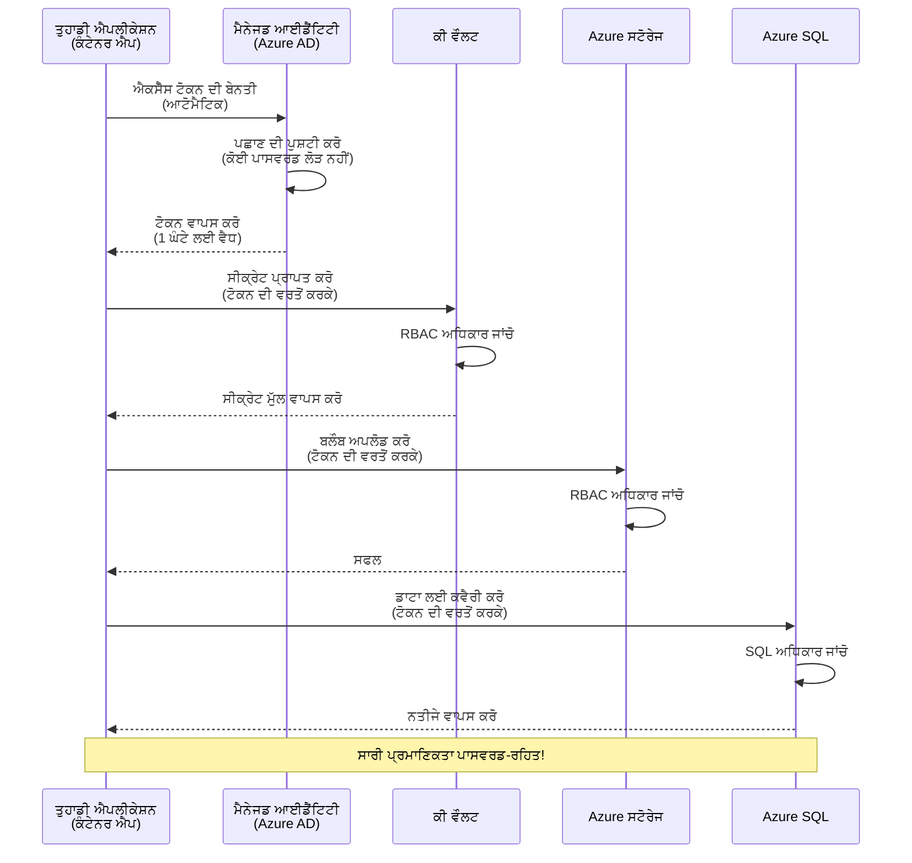

# ਪ੍ਰਮਾਣਿਕਤਾ ਪੈਟਰਨ ਅਤੇ ਮੈਨੇਜਡ ਆਈਡੈਂਟਿਟੀ

⏱️ **ਅੰਦਾਜ਼ਾ ਸਮਾਂ**: 45-60 ਮਿੰਟ | 💰 **ਲਾਗਤ ਪ੍ਰਭਾਵ**: ਮੁਫ਼ਤ (ਕੋਈ ਵਾਧੂ ਖਰਚ ਨਹੀਂ) | ⭐ **ਜਟਿਲਤਾ**: ਦਰਮਿਆਨਾ

**📚 ਸਿੱਖਣ ਰਾਹ:**
- ← ਪਿਛਲਾ: [Configuration Management](configuration.md) - ਪਰਿਵੇਸ਼ ਵੈਰੀਏਬਲ ਅਤੇ ਗੁਪਤ ਜਾਣਕਾਰੀਆਂ ਦਾ ਪ੍ਰਬੰਧਨ
- 🎯 **ਤੁਸੀਂ ਇੱਥੇ ਹੋ**: ਪ੍ਰਮਾਣਿਕਤਾ ਅਤੇ ਸੁਰੱਖਿਆ (ਮੈਨੇਜਡ ਆਈਡੈਂਟਿਟੀ, Key Vault, ਸੁਰੱਖਿਅਤ ਪੈਟਰਨ)
- → ਅਗਲਾ: [First Project](first-project.md) - ਆਪਣੀ ਪਹਿਲੀ AZD ਐਪਲੀਕੇਸ਼ਨ ਬਣਾਓ
- 🏠 [Course Home](../../README.md)

---

## ਤੁਸੀਂ ਕੀ ਸਿੱਖੋਗੇ

ਇਸ ਪਾਠ ਨੂੰ ਪੂਰਾ ਕਰਕੇ, ਤੁਸੀਂ:
- Azure ਪ੍ਰਮਾਣਿਕਤਾ ਪੈਟਰਨ (keys, connection strings, ਮੈਨੇਜਡ ਆਈਡੈਂਟਿਟੀ) ਨੂੰ ਸਮਝੋਗੇ
- ਬਿਨਾਂ ਪਾਸਵਰਡ ਵਾਲੀ ਪ੍ਰਮਾਣਿਕਤਾ ਲਈ **ਮੈਨੇਜਡ ਆਈਡੈਂਟਿਟੀ** ਲਾਗੂ ਕਰੋਗੇ
- **Azure Key Vault** ਇਕਤੀਕਰਨ ਨਾਲ ਗੁਪਤ ਜਾਣਕਾਰੀਆਂ ਨੂੰ ਸੁਰੱਖਿਅਤ ਰੱਖੋਗੇ
- AZD ਡਿਪਲੌਇਮੈਂਟ ਲਈ **ਰੋਲ-ਅਧਾਰਤ ਐਕਸੈਸ ਕੰਟਰੋਲ (RBAC)** ਸੰਰਚਿਤ ਕਰੋਗੇ
- Container Apps ਅਤੇ Azure ਸਰਵਿਸز ਵਿੱਚ ਸੁਰੱਖਿਆ ਦੀਆਂ ਸਰਵੋਤਮ ਪ੍ਰਥਾਵਾਂ ਲਾਗੂ ਕਰੋਗੇ
- ਕੁੰਜੀ-ਆਧਾਰਿਤ ਤੋਂ ਆਈਡੈਂਟਿਟੀ-ਆਧਾਰਿਤ ਪ੍ਰਮਾਣਿਕਤਾ ਵੱਲ ਮਾਈਗਰੇਟ ਕਰੋਗੇ

## ਮੈਨੇਜਡ ਆਈਡੈਂਟਿਟੀ ਕਿਉਂ ਮਹੱਤਵਪੂਰਨ ਹੈ

### ਸਮੱਸਿਆ: ਪਰੰਪਰਾਗਤ ਪ੍ਰਮਾਣਿਕਤਾ

**Managed Identity ਤੋਂ ਪਹਿਲਾਂ:**
```javascript
// ❌ ਸੁਰੱਖਿਆ ਖਤਰਾ: ਕੋਡ ਵਿੱਚ ਹਾਰਡਕੋਡ ਕੀਤੀਆਂ ਗੁਪਤ ਜਾਣਕਾਰੀਆਂ
const connectionString = "Server=mydb.database.windows.net;User=admin;Password=P@ssw0rd123";
const storageKey = "xK7mN9pQ2wR5tY8uI0oP3aS6dF1gH4jK...";
const cosmosKey = "C2x7B9n4M1p8Q5w3E6r0T2y5U8i1O4p7...";
```

**ਸਮੱਸਿਆਵਾਂ:**
- 🔴 ਕੋਡ, ਕਨਫਿਗ ਫਾਈਲਾਂ, ਪਰਿਵੇਸ਼ ਵੈਰੀਏਬਲ ਵਿੱਚ ਗੁਪਤ ਜਾਣਕਾਰੀਆਂ ਖੁਲ੍ਹੀਆਂ ਹੋਈਆਂ
- 🔴 ਕ੍ਰੈਡੈਂਸ਼ਅਲ ਰੋਟੇਸ਼ਨ ਲਈ ਕੋਡ ਵਿੱਚ ਬਦਲਾਅ ਅਤੇ ਮੁੜ-ਡਿਪਲੌਇ ਕਰਨ ਦੀ ਲੋੜ
- 🔴 ਆਡਿਟ ਲਈ ਦਿਖਦੀਂ ਸਮੱਸਿਆਵਾਂ - ਕਿਸਨੇ ਕਿਸ ਨੂੰ, ਕਦੋਂ ਐਕਸੈਸ ਕੀਤਾ?
- 🔴 ਫੈਲਾਅ - ਗੁਪਤ ਜਾਣਕਾਰੀਆਂ ਕਈ ਸਿਸਟਮਾਂ ਵਿੱਚ ਵਿਖਰੀ ਹੋਈਆਂ
- 🔴 ਅਨੁਕੂਲਤਾ ਖ਼ਤਰੇ - ਸੁਰੱਖਿਆ ਆਡਿਟ ਫੇਲ ਹੋ ਸਕਦਾ ਹੈ

### ਹੱਲ: ਮੈਨੇਜਡ ਆਈਡੈਂਟਿਟੀ

**Managed Identity ਤੋਂ ਬਾਅਦ:**
```javascript
// ✅ ਸੁਰੱਖਿਅਤ: ਕੋਡ ਵਿੱਚ ਕੋਈ ਰਾਜ਼ ਨਹੀਂ
const credential = new DefaultAzureCredential();
const client = new BlobServiceClient(
  "https://mystorageaccount.blob.core.windows.net",
  credential  // Azure ਆਟੋਮੈਟਿਕ ਤੌਰ 'ਤੇ ਪ੍ਰਮਾਣਿਕਤਾ ਨੂੰ ਸੰਭਾਲਦਾ ਹੈ
);
```

**ਲਾਭ:**
- ✅ ਕੋਡ ਜਾਂ ਸੰਰਚਨਾ ਵਿੱਚ **ਕੋई ਗੁਪਤ ਜਾਣਕਾਰੀ ਨਹੀਂ**
- ✅ ਆਟੋਮੈਟਿਕ ਰੋਟੇਸ਼ਨ - Azure ਇਸਨੂੰ ਸੰਭਾਲਦਾ ਹੈ
- ✅ Azure AD ਲਾਗਾਂ ਵਿੱਚ ਪੂਰਾ ਆਡਿਟ ਟਰੇਲ
- ✅ ਕੇਂਦਰੀਕ੍ਰਿਤ ਸੁਰੱਖਿਆ - Azure ਪੋਰਟਲ ਤੋਂ ਪ੍ਰਬੰਧਨ
- ✅ ਅਨੁਕੂਲਤਾ-ਤਿਆਰ - ਸੁਰੱਖਿਆ ਮਿਆਰਾਂ ਨਾਲ ਮੀਟ

**ਉਪਮਾ**: ਪਰੰਪਰਾਗਤ ਪ੍ਰਮਾਣਿਕਤਾ ਅਨੇਕ ਦਰਵਾਜ਼ਿਆਂ ਲਈ ਕਈ ਫ਼ਿਜ਼ੀਕਲ ਕੁੰਜੀਆਂ ਨਾਲ ਘੁੰਮਣ ਵਰਗੀ ਹੈ। ਮੈਨੇਜਡ ਆਈਡੈਂਟਿਟੀ ਉਸਿਰਾ ਇੱਕ ਸੁਰੱਖਿਆ ਬੈੱਜ਼ ਵਰਗੀ ਹੈ ਜੋ ਆਪਣੇ ਹੋਣ ਦੇ ਅਧਾਰ 'ਤੇ ਆਟੋਮੈਟਿਕ ਤੌਰ 'ਤੇ ਐਕਸੈਸ ਦਿੰਦੀ ਹੈ—ਕੋਈ ਕੁੰਜੀਆਂ ਗੁੰਮਣ, ਨਕਲ ਕਰਨ ਜਾਂ ਰੋਟੇਟ ਕਰਨ ਦੀ ਲੋੜ ਨਹੀਂ।

---

## ਆਰਕੀਟੈਕਚਰ ਓਵਰਵਿਊ

### ਮੈਨੇਜਡ ਆਈਡੈਂਟਿਟੀ ਨਾਲ ਪ੍ਰਮਾਣਿਕਤਾ ਫਲੋ


### ਮੈਨੇਜਡ ਆਈਡੈਂਟਿਟੀਆਂ ਦੇ ਪ੍ਰਕਾਰ


| ਵਿਸ਼ੇਸ਼ਤਾ | System-Assigned | User-Assigned |
|---------|----------------|---------------|
| **ਲਾਈਫਸਾਈਕਲ** | ਰਿਸੋਰਸ ਨਾਲ ਜੁੜਿਆ | ਸਵਤੰਤਰ |
| **ਸਿਰਜਣਾ** | ਰਿਸੋਰਸ ਦੇ ਨਾਲ ਆਟੋਮੈਟਿਕ | ਹੱਥੋਂ ਬਣਾਉਣਾ |
| **ਹਟਾਉਣਾ** | ਰਿਸੋਰਸ ਦੇ ਹਟਾਏ ਜਾਣ ਤੇ ਮਿਟਾਇਆ ਜਾਂਦਾ | ਰਿਸੋਰਸ ਮਿਟਣ ਤੋਂ ਬਾਅਦ ਵੀ ਰਹਿੰਦਾ ਹੈ |
| **ਸਾਂਝਾ ਕਰਨ ਦੀ ਯੋਗਤਾ** | ਸਿਰਫ ਇੱਕ ਰਿਸੋਰਸ ਲਈ | ਬਹੁਤ ਸਾਰੇ ਰਿਸੋਰਸਾਂ ਵਿੱਚ |
| **ਵਰਤੋਂ ਮਾਮਲਾ** | ਸਧਾਰਣ ਸੀਨਾਰਿਓਜ਼ | ਜਟਿਲ ਬਹੁ-ਰਿਸੋਰਸ ਸੀਨਾਰਿਓਜ਼ |
| **AZD ਡਿਫੌਲਟ** | ✅ ਸੁਝਾਇਆ ਗਿਆ | ਵਿਕਲਪਿਕ |

---

## ਪਹਿਲਾਂ ਤੋਂ ਲੋੜੀਂਦਾ

### ਲੋੜੀਂਦੇ ਟੂਲ

ਤੁਹਾਡੇ ਕੋਲ ਪਹਿਲਾਂ ਤੋਂ ਇਨ੍ਹਾਂ ਨੂੰ ਪਿਛਲੇ ਪਾਠਾਂ ਤੋਂ ਇੰਸਟਾਲ ਕੀਤਾ ਹੋਣਾ ਚਾਹੀਦਾ ਹੈ:

```bash
# Azure Developer CLI ਦੀ ਜਾਂਚ ਕਰੋ
azd version
# ✅ ਉਮੀਦ: azd ਵਰਜਨ 1.0.0 ਜਾਂ ਇਸ ਤੋਂ ਉੱਪਰ

# Azure CLI ਦੀ ਜਾਂਚ ਕਰੋ
az --version
# ✅ ਉਮੀਦ: azure-cli 2.50.0 ਜਾਂ ਇਸ ਤੋਂ ਉੱਪਰ
```

### Azure ਲੋੜਾਂ

- ਸਰਗਰਮ Azure ਸਬਸਕ੍ਰਿਪਸ਼ਨ
- ਅਧਿਕਾਰ:
  - ਮੈਨੇਜਡ ਆਈਡੈਂਟਿਟੀਆਂ ਬਣਾਉਣ
  - RBAC ਰੋਲਾਂ ਸੌਂਪਣ
  - Key Vault ਰਿਸੋਰਸ ਬਣਾਉਣ
  - Container Apps ਡਿਪਲੌਇ ਕਰਨ

### ਗਿਆਨ ਦੀਆਂ ਲੋੜਾਂ

ਤੁਹਾਨੂੰ ਇਹ ਕੁਝ ਪਾਠ ਮੁਕੰਮਲ ਕੀਤੇ ਹੋਣੇ ਚਾਹੀਦੇ ਹਨ:
- [Installation Guide](installation.md) - AZD ਸੈੱਟਅਪ
- [AZD Basics](azd-basics.md) - ਮੁੱਖ ਧਾਰਣਾਵਾਂ
- [Configuration Management](configuration.md) - ਪਰਿਵੇਸ਼ ਵੈਰੀਏਬਲ

---

## ਪਾਠ 1: ਪ੍ਰਮਾਣਿਕਤਾ ਪੈਟਰਨ ਨੂੰ ਸਮਝਣਾ

### ਪੈਟਰਨ 1: Connection Strings (ਪੁਲਾਨਕਾਲੀਨ - ਬਚੋ)

**ਇਹ ਕਿਵੇਂ ਕੰਮ ਕਰਦਾ ਹੈ:**
```bash
# ਕਨੈਕਸ਼ਨ ਸਟਰਿੰਗ ਵਿੱਚ ਪ੍ਰਮਾਣ-ਪੱਤਰ ਸ਼ਾਮਿਲ ਹਨ
STORAGE_CONNECTION_STRING="DefaultEndpointsProtocol=https;AccountName=myaccount;AccountKey=xK7mN9pQ2wR5..."
COSMOS_CONNECTION_STRING="AccountEndpoint=https://myaccount.documents.azure.com:443/;AccountKey=C2x7..."
SQL_CONNECTION_STRING="Server=myserver.database.windows.net;User=admin;Password=P@ssw0rd..."
```

**ਸਮੱਸਿਆਵਾਂ:**
- ❌ ਪਰਿਵੇਸ਼ ਵੈਰੀਏਬਲ ਵਿੱਚ ਗੁਪਤ ਜਾਣਕਾਰੀਆਂ ਨਜ਼ਰ ਆਉਂਦੀਆਂ ਹਨ
- ❌ ਡਿਪਲੌਇਮੈਂਟ ਸਿਸਟਮਾਂ ਵਿੱਚ ਲੌਗ ਹੋ ਸਕਦੇ ਹਨ
- ❌ ਰੋਟੇਟ ਕਰਨਾ ਮੁਸ਼ਕਲ
- ❌ ਕੋਈ ਆਡਿਟ ਟਰੇਲ ਨਹੀਂ

**ਕਦੋਂ ਵਰਤਣਾ ਹੈ:** ਸਿਰਫ਼ ਲੋਕਲ ਵਿਕਾਸ ਲਈ, ਪ੍ਰੋਡਕਸ਼ਨ ਵਿੱਚ ਕਦੇ ਨਹੀਂ।

---

### ਪੈਟਰਨ 2: Key Vault References (ਵਧੀਆ)

**ਇਹ ਕਿਵੇਂ ਕੰਮ ਕਰਦਾ ਹੈ:**
```bicep
// Store secret in Key Vault
resource keyVault 'Microsoft.KeyVault/vaults@2023-02-01' = {
  name: 'mykv'
  properties: {
    enableRbacAuthorization: true
  }
}

// Reference in Container App
env: [
  {
    name: 'STORAGE_KEY'
    secretRef: 'storage-key'  // References Key Vault
  }
]
```

**ਲਾਭ:**
- ✅ ਗੁਪਤ ਜਾਣਕਾਰੀਆਂ Key Vault ਵਿੱਚ ਸੁਰੱਖਿਅਤ ਤਰੀਕੇ ਨਾਲ ਸਟੋਰ ਹੁੰਦੀਆਂ ਹਨ
- ✅ ਕੇਂਦਰੀਕ੍ਰਿਤ ਗੁਪਤ ਪ੍ਰਬੰਧਨ
- ✅ ਕੋਡ ਬਿਨਾਂ ਬਦਲੇ ਰੋਟੇਸ਼ਨ

**ਸੀਮਾਵਾਂ:**
- ⚠️ ਅਜੇ ਵੀ keys/passwords ਵਰਤੇ ਜਾ ਰਹੇ ਹਨ
- ⚠️ Key Vault ਐਕਸੈਸ ਦਾ ਪ੍ਰਬੰਧਨ ਕਰਨ ਦੀ ਲੋੜ

**ਕਦੋਂ ਵਰਤਣਾ ਹੈ:** connection strings ਤੋਂ managed identity ਵੱਲ ਰੁਖ ਕਰਨ ਦਾ ਮਧ੍ਰ-ਕਦਮ।

---

### ਪੈਟਰਨ 3: Managed Identity (ਸਰਵੋਤਮ ਅਭਿਆਸ)

**ਇਹ ਕਿਵੇਂ ਕੰਮ ਕਰਦਾ ਹੈ:**
```bicep
// Enable managed identity
resource containerApp 'Microsoft.App/containerApps@2023-05-01' = {
  name: 'myapp'
  identity: {
    type: 'SystemAssigned'  // Automatically creates identity
  }
}

// Grant permissions
resource roleAssignment 'Microsoft.Authorization/roleAssignments@2022-04-01' = {
  scope: storageAccount
  properties: {
    roleDefinitionId: storageBlobDataContributorRole
    principalId: containerApp.identity.principalId
  }
}
```

**ਐਪਲੀਕੇਸ਼ਨ ਕੋਡ:**
```javascript
// ਕੋਈ ਰਾਜ਼ ਦੀ ਲੋੜ ਨਹੀਂ!
const { DefaultAzureCredential } = require('@azure/identity');
const { BlobServiceClient } = require('@azure/storage-blob');

const credential = new DefaultAzureCredential();
const blobServiceClient = new BlobServiceClient(
  'https://mystorageaccount.blob.core.windows.net',
  credential
);
```

**ਲਾਭ:**
- ✅ ਕੋਡ/ਸੰਰਚਨਾ ਵਿੱਚ ਕੋਈ ਗੁਪਤ ਨਹੀਂ
- ✅ ਆਟੋਮੈਟਿਕ ਕ੍ਰੈਡੈਂਸ਼ਅਲ ਰੋਟੇਸ਼ਨ
- ✅ ਪੂਰਾ ਆਡਿਟ ਟਰੇਲ
- ✅ RBAC ਆਧਾਰਿਤ ਅਨੁਮਤੀਆਂ
- ✅ ਅਨੁਕੂਲਤਾ-ਤਿਆਰ

**ਕਦੋਂ ਵਰਤਣਾ ਹੈ:** ਹਮੇਸ਼ਾ, ਪ੍ਰੋਡਕਸ਼ਨ ਐਪਲੀਕੇਸ਼ਨਾਂ ਲਈ।

---

## ਪਾਠ 2: AZD ਨਾਲ ਮੈਨੇਜਡ ਆਈਡੈਂਟਿਟੀ ਲਾਗੂ ਕਰਨਾ

### ਕਦਮ-ਦਰ-ਕਦਮ ਲਾਗੂਕਰਨ

ਅਸੀਂ ਇੱਕ ਸੁਰੱਖਿਅਤ Container App ਬਣਾਵਾਂਗੇ ਜੋ ਮੈਨੇਜਡ ਆਈਡੈਂਟਿਟੀ ਦੀ ਵਰਤੋਂ ਕਰਕੇ Azure Storage ਅਤੇ Key Vault ਤੱਕ ਐਕਸੈਸ ਕਰਦਾ ਹੈ।

### ਪ੍ਰੋਜੈਕਟ ਸੰਰਚਨਾ

```
secure-app/
├── azure.yaml                 # AZD configuration
├── infra/
│   ├── main.bicep            # Main infrastructure
│   ├── core/
│   │   ├── identity.bicep    # Managed identity setup
│   │   ├── keyvault.bicep    # Key Vault configuration
│   │   └── storage.bicep     # Storage with RBAC
│   └── app/
│       └── container-app.bicep
└── src/
    ├── app.js                # Application code
    ├── package.json
    └── Dockerfile
```

### 1. AZD ਸੰਰਚਨਾ (azure.yaml)

```yaml
name: secure-app
metadata:
  template: secure-app@1.0.0

services:
  api:
    project: ./src
    language: js
    host: containerapp

# Enable managed identity (AZD handles this automatically)
```

### 2. ਇੰਫਰਾਸਟਰੱਕਚਰ: ਮੈਨੇਜਡ ਆਈਡੈਂਟਿਟੀ ਯੋਗ ਕਰੋ

**ਫਾਇਲ: `infra/main.bicep`**

```bicep
targetScope = 'subscription'

param environmentName string
param location string = 'eastus'

var tags = { 'azd-env-name': environmentName }

// Resource group
resource rg 'Microsoft.Resources/resourceGroups@2021-04-01' = {
  name: 'rg-${environmentName}'
  location: location
  tags: tags
}

// Storage Account
module storage './core/storage.bicep' = {
  name: 'storage'
  scope: rg
  params: {
    name: 'st${uniqueString(rg.id)}'
    location: location
    tags: tags
  }
}

// Key Vault
module keyVault './core/keyvault.bicep' = {
  name: 'keyvault'
  scope: rg
  params: {
    name: 'kv-${uniqueString(rg.id)}'
    location: location
    tags: tags
  }
}

// Container App with Managed Identity
module containerApp './app/container-app.bicep' = {
  name: 'container-app'
  scope: rg
  params: {
    name: 'ca-${environmentName}'
    location: location
    tags: tags
    storageAccountName: storage.outputs.name
    keyVaultName: keyVault.outputs.name
  }
}

// Grant Container App access to Storage
module storageRoleAssignment './core/role-assignment.bicep' = {
  name: 'storage-role'
  scope: rg
  params: {
    principalId: containerApp.outputs.identityPrincipalId
    roleDefinitionId: 'ba92f5b4-2d11-453d-a403-e96b0029c9fe'  // Storage Blob Data Contributor
    targetResourceId: storage.outputs.id
  }
}

// Grant Container App access to Key Vault
module kvRoleAssignment './core/role-assignment.bicep' = {
  name: 'kv-role'
  scope: rg
  params: {
    principalId: containerApp.outputs.identityPrincipalId
    roleDefinitionId: '4633458b-17de-408a-b874-0445c86b69e6'  // Key Vault Secrets User
    targetResourceId: keyVault.outputs.id
  }
}

// Outputs
output AZURE_STORAGE_ACCOUNT_NAME string = storage.outputs.name
output AZURE_KEY_VAULT_NAME string = keyVault.outputs.name
output APP_URL string = containerApp.outputs.url
```

### 3. System-Assigned Identity ਵਾਲਾ Container App

**ਫਾਇਲ: `infra/app/container-app.bicep`**

```bicep
param name string
param location string
param tags object = {}
param storageAccountName string
param keyVaultName string

resource containerApp 'Microsoft.App/containerApps@2023-05-01' = {
  name: name
  location: location
  tags: tags
  identity: {
    type: 'SystemAssigned'  // 🔑 Enable managed identity
  }
  properties: {
    configuration: {
      ingress: {
        external: true
        targetPort: 3000
      }
    }
    template: {
      containers: [
        {
          name: 'api'
          image: 'myregistry.azurecr.io/api:latest'
          resources: {
            cpu: json('0.5')
            memory: '1Gi'
          }
          env: [
            {
              name: 'AZURE_STORAGE_ACCOUNT_NAME'
              value: storageAccountName
            }
            {
              name: 'AZURE_KEY_VAULT_NAME'
              value: keyVaultName
            }
            // 🔑 No secrets - managed identity handles authentication!
          ]
        }
      ]
    }
  }
}

// Output the identity for RBAC assignments
output identityPrincipalId string = containerApp.identity.principalId
output id string = containerApp.id
output url string = 'https://${containerApp.properties.configuration.ingress.fqdn}'
```

### 4. RBAC ਰੋਲ ਅਸਾਈਨਮੈਂਟ ਮੋਡੀਊਲ

**ਫਾਇਲ: `infra/core/role-assignment.bicep`**

```bicep
param principalId string
param roleDefinitionId string  // Azure built-in role ID
param targetResourceId string

resource roleAssignment 'Microsoft.Authorization/roleAssignments@2022-04-01' = {
  name: guid(principalId, roleDefinitionId, targetResourceId)
  scope: resourceId('Microsoft.Resources/resourceGroups', resourceGroup().name)
  properties: {
    roleDefinitionId: subscriptionResourceId('Microsoft.Authorization/roleDefinitions', roleDefinitionId)
    principalId: principalId
    principalType: 'ServicePrincipal'
  }
}

output id string = roleAssignment.id
```

### 5. ਮੈਨੇਜਡ ਆਈਡੈਂਟਿਟੀ ਵਾਲਾ ਐਪਲੀਕੇਸ਼ਨ ਕੋਡ

**ਫਾਇਲ: `src/app.js`**

```javascript
const express = require('express');
const { DefaultAzureCredential } = require('@azure/identity');
const { BlobServiceClient } = require('@azure/storage-blob');
const { SecretClient } = require('@azure/keyvault-secrets');

const app = express();
const PORT = process.env.PORT || 3000;

// 🔑 ਕ੍ਰੈਡੈਂਸ਼ਲ ਸ਼ੁਰੂ ਕਰੋ (ਮੈਨੇਜਡ ਆਈਡੈਂਟਿਟੀ ਨਾਲ ਆਟੋਮੈਟਿਕ ਤੌਰ ਤੇ ਕੰਮ ਕਰਦਾ ਹੈ)
const credential = new DefaultAzureCredential();

// Azure ਸਟੋਰੇਜ ਸੈਟਅੱਪ
const storageAccountName = process.env.AZURE_STORAGE_ACCOUNT_NAME;
const blobServiceClient = new BlobServiceClient(
  `https://${storageAccountName}.blob.core.windows.net`,
  credential  // ਕੋਈ ਕੁੰਜੀ ਲੋੜੀਂਦੀ ਨਹੀਂ!
);

// Key Vault ਸੈਟਅੱਪ
const keyVaultName = process.env.AZURE_KEY_VAULT_NAME;
const secretClient = new SecretClient(
  `https://${keyVaultName}.vault.azure.net`,
  credential  // ਕੋਈ ਕੁੰਜੀ ਲੋੜੀਂਦੀ ਨਹੀਂ!
);

// ਹੈਲਥ ਚੈਕ
app.get('/health', (req, res) => {
  res.json({ status: 'healthy', authentication: 'managed-identity' });
});

// ਫਾਇਲ ਨੂੰ ਬਲੌਬ ਸਟੋਰੇਜ ਵਿੱਚ ਅੱਪਲੋਡ ਕਰੋ
app.post('/upload', async (req, res) => {
  try {
    const containerClient = blobServiceClient.getContainerClient('uploads');
    await containerClient.createIfNotExists();
    
    const blobName = `file-${Date.now()}.txt`;
    const blockBlobClient = containerClient.getBlockBlobClient(blobName);
    
    await blockBlobClient.upload('Hello from managed identity!', 30);
    
    res.json({
      success: true,
      blobName: blobName,
      message: 'File uploaded using managed identity!'
    });
  } catch (error) {
    console.error('Upload error:', error);
    res.status(500).json({ error: error.message });
  }
});

// Key Vault ਤੋਂ ਸਿਕ੍ਰੇਟ ਪ੍ਰਾਪਤ ਕਰੋ
app.get('/secret/:name', async (req, res) => {
  try {
    const secretName = req.params.name;
    const secret = await secretClient.getSecret(secretName);
    
    res.json({
      name: secretName,
      value: secret.value,
      message: 'Secret retrieved using managed identity!'
    });
  } catch (error) {
    console.error('Secret error:', error);
    res.status(500).json({ error: error.message });
  }
});

// ਬਲੌਬ ਕੰਟੇਨਰਾਂ ਦੀ ਸੂਚੀ (ਪੜ੍ਹਨ ਦੀ ਪਹੁੰਚ ਦਿਖਾਉਂਦਾ ਹੈ)
app.get('/containers', async (req, res) => {
  try {
    const containers = [];
    for await (const container of blobServiceClient.listContainers()) {
      containers.push(container.name);
    }
    
    res.json({
      containers: containers,
      count: containers.length,
      message: 'Containers listed using managed identity!'
    });
  } catch (error) {
    console.error('List error:', error);
    res.status(500).json({ error: error.message });
  }
});

app.listen(PORT, () => {
  console.log(`Secure API listening on port ${PORT}`);
  console.log('Authentication: Managed Identity (passwordless)');
});
```

**ਫਾਇਲ: `src/package.json`**

```json
{
  "name": "secure-app",
  "version": "1.0.0",
  "dependencies": {
    "express": "^4.18.2",
    "@azure/identity": "^4.0.0",
    "@azure/storage-blob": "^12.17.0",
    "@azure/keyvault-secrets": "^4.7.0"
  },
  "scripts": {
    "start": "node app.js"
  }
}
```

### 6. ਡਿਪਲੌਇ ਅਤੇ ਟੈਸਟ

```bash
# AZD ਵਾਤਾਵਰਣ ਆਰੰਭ ਕਰੋ
azd init

# ਬੁਨਿਆਦੀ ਢਾਂਚਾ ਅਤੇ ਐਪਲੀਕੇਸ਼ਨ ਨੂੰ ਤੈਨਾਤ ਕਰੋ
azd up

# ਐਪ ਦੀ URL ਪ੍ਰਾਪਤ ਕਰੋ
APP_URL=$(azd env get-values | grep APP_URL | cut -d '=' -f2 | tr -d '"')

# ਹੈਲਥ ਚੈਕ ਦੀ ਜਾਂਚ ਕਰੋ
curl $APP_URL/health
```

**✅ ਉਮੀਦ ਕੀਤੀ ਆਉਟਪੁੱਟ:**
```json
{
  "status": "healthy",
  "authentication": "managed-identity"
}
```

**ਟੈਸਟ ਬਲੌਬ ਅਪਲੋਡ:**
```bash
curl -X POST $APP_URL/upload
```

**✅ ਉਮੀਦ ਕੀਤੀ ਆਉਟਪੁੱਟ:**
```json
{
  "success": true,
  "blobName": "file-1700404800000.txt",
  "message": "File uploaded using managed identity!"
}
```

**ਟੈਸਟ ਕੰਟੇਨਰ ਲਿਸਟਿੰਗ:**
```bash
curl $APP_URL/containers
```

**✅ ਉਮੀਦ ਕੀਤੀ ਆਉਟਪੁੱਟ:**
```json
{
  "containers": ["uploads"],
  "count": 1,
  "message": "Containers listed using managed identity!"
}
```

---

## ਆਮ Azure RBAC ਰੋਲ

### ਮੈਨੇਜਡ ਆਈਡੈਂਟਿਟੀ ਲਈ ਬਿਲਟ-ਇਨ ਰੋਲ IDs

| Service | Role Name | Role ID | Permissions |
|---------|-----------|---------|-------------|
| **Storage** | Storage Blob Data Reader | `2a2b9908-6b94-4a3d-8e5a-a7d8f8cc8a12` | ਬਲਾਬ ਅਤੇ ਕੰਟੇਨਰ ਪੜ੍ਹੋ |
| **Storage** | Storage Blob Data Contributor | `ba92f5b4-2d11-453d-a403-e96b0029c9fe` | ਬਲਾਬ ਪੜ੍ਹੋ, ਲਿਖੋ, ਮਿਟਾਓ |
| **Storage** | Storage Queue Data Contributor | `974c5e8b-45b9-4653-ba55-5f855dd0fb88` | ਕਿਊ ਸੁਨੇਹਿਆਂ ਨੂੰ ਪੜ੍ਹੋ, ਲਿਖੋ, ਮਿਟਾਓ |
| **Key Vault** | Key Vault Secrets User | `4633458b-17de-408a-b874-0445c86b69e6` | ਸਿਰਫ਼ ਗੁਪਤ ਜਾਣਕਾਰੀਆਂ ਪੜ੍ਹਨ ਦੀ ਆਗਿਆ |
| **Key Vault** | Key Vault Secrets Officer | `b86a8fe4-44ce-4948-aee5-eccb2c155cd7` | ਗੁਪਤ ਜਾਣਕਾਰੀਆਂ ਪੜ੍ਹੋ, ਲਿਖੋ, ਮਿਟਾਓ |
| **Cosmos DB** | Cosmos DB Built-in Data Reader | `00000000-0000-0000-0000-000000000001` | Cosmos DB ਡੇਟਾ ਪੜ੍ਹੋ |
| **Cosmos DB** | Cosmos DB Built-in Data Contributor | `00000000-0000-0000-0000-000000000002` | Cosmos DB ਡੇਟਾ ਪੜ੍ਹੋ ਅਤੇ ਲਿਖੋ |
| **SQL Database** | SQL DB Contributor | `9b7fa17d-e63e-47b0-bb0a-15c516ac86ec` | SQL ਡੇਟਾਬੇਸਾਂ ਦਾ ਪ੍ਰਬੰਧ ਕਰੋ |
| **Service Bus** | Azure Service Bus Data Owner | `090c5cfd-751d-490a-894a-3ce6f1109419` | ਸੁਨੇਹੇ ਭੇਜੋ, ਪ੍ਰਾਪਤ ਕਰੋ, ਅਤੇ ਪ੍ਰਬੰਧਨ ਕਰੋ |

### ਰੋਲ IDs ਕਿਵੇਂ ਲੱਭੇ ਜਾਣ

```bash
# ਸਾਰੇ ਬਿਲਟ-ਇਨ ਰੋਲਾਂ ਦੀ ਸੂਚੀ ਦਿਖਾਓ
az role definition list --query "[].{Name:roleName, ID:name}" --output table

# ਕਿਸੇ ਖਾਸ ਰੋਲ ਦੀ ਖੋਜ ਕਰੋ
az role definition list --query "[?contains(roleName, 'Storage Blob')].{Name:roleName, ID:name}" --output table

# ਰੋਲ ਦੇ ਵੇਰਵੇ ਪ੍ਰਾਪਤ ਕਰੋ
az role definition list --name "Storage Blob Data Contributor"
```

---

## ਪ੍ਰਾਇਕਟਿਕਲ ਅਭਿਆਸ

### ਅਭਿਆਸ 1: ਮੌਜੂਦਾ ਐਪ ਲਈ ਮੈਨੇਜਡ ਆਈਡੈਂਟਿਟੀ ਯੋਗ ਕਰੋ ⭐⭐ (ਦਰਮਿਆਨਾ)

**ਮਕਸਦ**: ਮੌਜੂਦਾ Container App ਡਿਪਲੌਇਮੈਂਟ ਵਿੱਚ ਮੈਨੇਜਡ ਆਈਡੈਂਟਿਟੀ ਸ਼ਾਮਲ ਕਰੋ

**ਪਰਿਦ੍ਰਿਸ਼**: ਤੁਹਾਡੇ ਕੋਲ ਇੱਕ Container App ਹੈ ਜੋ connection strings ਵਰਤ ਰਿਹਾ ਹੈ। ਇਸਨੂੰ ਮੈਨੇਜਡ ਆਈਡੈਂਟਿਟੀ 'ਤੇ ਬਦਲੋ।

**ਸ਼ੁਰੂਆਤੀ ਬਿੰਦੂ**: ਇਸ ਸੰਰਚਨਾ ਵਾਲਾ Container App:

```bicep
// ❌ Current: Using connection string
env: [
  {
    name: 'STORAGE_CONNECTION_STRING'
    secretRef: 'storage-connection'
  }
]
```

**ਕਦਮ**:

1. **Bicep ਵਿੱਚ ਮੈਨੇਜਡ ਆਈਡੈਂਟਿਟੀ ਯੋਗ ਕਰੋ:**

```bicep
resource containerApp 'Microsoft.App/containerApps@2023-05-01' = {
  name: 'myapp'
  identity: {
    type: 'SystemAssigned'  // Add this
  }
  // ... rest of configuration
}
```

2. **Storage ਐਕਸੈਸ ਦਿਓ:**

```bicep
// Get storage account reference
resource storageAccount 'Microsoft.Storage/storageAccounts@2023-01-01' existing = {
  name: storageAccountName
}

// Assign role
resource roleAssignment 'Microsoft.Authorization/roleAssignments@2022-04-01' = {
  name: guid(containerApp.id, 'ba92f5b4-2d11-453d-a403-e96b0029c9fe', storageAccount.id)
  scope: storageAccount
  properties: {
    roleDefinitionId: subscriptionResourceId('Microsoft.Authorization/roleDefinitions', 'ba92f5b4-2d11-453d-a403-e96b0029c9fe')
    principalId: containerApp.identity.principalId
    principalType: 'ServicePrincipal'
  }
}
```

3. **ਐਪਲੀਕੇਸ਼ਨ ਕੋਡ ਅੱਪਡੇਟ ਕਰੋ:**

**ਪਹਿਲਾਂ (connection string):**
```javascript
const { BlobServiceClient } = require('@azure/storage-blob');

const blobServiceClient = BlobServiceClient.fromConnectionString(
  process.env.STORAGE_CONNECTION_STRING
);
```

**ਬਾਅਦ (managed identity):**
```javascript
const { DefaultAzureCredential } = require('@azure/identity');
const { BlobServiceClient } = require('@azure/storage-blob');

const credential = new DefaultAzureCredential();
const blobServiceClient = new BlobServiceClient(
  `https://${process.env.STORAGE_ACCOUNT_NAME}.blob.core.windows.net`,
  credential
);
```

4. **ਪਰਿਵੇਸ਼ ਵੈਰੀਏਬਲ ਅੱਪਡੇਟ ਕਰੋ:**

```bicep
env: [
  {
    name: 'STORAGE_ACCOUNT_NAME'
    value: storageAccountName  // Just the name, no secrets!
  }
  // Remove STORAGE_CONNECTION_STRING
]
```

5. **ਡਿਪਲੌਇ ਅਤੇ ਟੈਸਟ ਕਰੋ:**

```bash
# ਮੁੜ ਤੈਨਾਤ ਕਰੋ
azd up

# ਜਾਂਚੋ ਕਿ ਇਹ ਅਜੇ ਵੀ ਕੰਮ ਕਰਦਾ ਹੈ
curl https://myapp.azurecontainerapps.io/upload
```

**✅ ਸਫਲਤਾ ਮਾਪਦੰਡ:**
- ✅ ਐਪਲੀਕੇਸ਼ਨ ਬਿਨਾਂ ਗਲਤੀਆਂ ਦੇ ਡਿਪਲੌਇ ਹੁੰਦਾ ਹੈ
- ✅ Storage ਕਾਰਵਾਈਆਂ ਕੰਮ ਕਰਦੀਆਂ ਹਨ (ਅਪਲੋਡ, ਲਿਸਟ, ਡਾਊਨਲੋਡ)
- ✅ ਪਰਿਵੇਸ਼ ਵੈਰੀਏਬਲ ਵਿੱਚ ਕੋਈ connection strings ਨਹੀਂ
- ✅ Azure ਪੋਰਟਲ 'ਚ "Identity" ਬਲੇਡ ਤਹਿਤ ਆਈਡੈਂਟਿਟੀ ਦਿੱਸੀ ਜਾ ਸਕਦੀ ਹੈ

**ਜਾਂਚ:**

```bash
# ਮੈਨੇਜਡ ਆਈਡੈਂਟੀਟੀ ਚਾਲੂ ਹੈ ਜਾਂ ਨਹੀਂ ਜਾਂਚ ਕਰੋ
az containerapp show \
  --name myapp \
  --resource-group rg-myapp \
  --query "identity.type"
# ✅ ਉਮੀਦ: "SystemAssigned"

# ਰੋਲ ਅਸਾਈਨਮੈਂਟ ਦੀ ਜਾਂਚ ਕਰੋ
az role assignment list \
  --assignee $(az containerapp show --name myapp --resource-group rg-myapp --query "identity.principalId" -o tsv) \
  --scope /subscriptions/{sub-id}/resourceGroups/rg-myapp/providers/Microsoft.Storage/storageAccounts/mystorageaccount
# ✅ ਉਮੀਦ: "Storage Blob Data Contributor" ਰੋਲ ਦਿਖਾਈ ਦੇਂਦਾ ਹੈ
```

**ਸਮਾਂ**: 20-30 ਮਿੰਟ

---

### ਅਭਿਆਸ 2: ਯੂਜ਼ਰ-ਅਸਾਈਂਡ ਆਈਡੈਂਟਿਟੀ ਨਾਲ ਬਹੁ-ਸੇਵਾ ਐਕਸੈਸ ⭐⭐⭐ (ਉੱਨਤ)

**ਮਕਸਦ**: ਕਈ Container Apps ਵਿੱਚ ਸਾਂਝੇ ਯੂਜ਼ਰ-ਅਸਾਈਂਡ ਆਈਡੈਂਟਿਟੀ ਬਣਾਓ

**ਪਰਿਦ੍ਰਿਸ਼**: ਤੁਹਾਡੇ ਕੋਲ 3 ਮਾਈਕਰੋਸਰਵਿਸ ਹਨ ਜੋ ਸਾਰੇ ਇੱਕੋ ਹੀ Storage ਖਾਤੇ ਅਤੇ Key Vault ਤੱਕ ਐਕਸੈਸ ਕਰਨੇ ਹਨ।

**ਕਦਮ**:

1. **ਯੂਜ਼ਰ-ਅਸਾਈਂਡ ਆਈਡੈਂਟਿਟੀ ਬਣਾਓ:**

**ਫਾਇਲ: `infra/core/identity.bicep`**

```bicep
param name string
param location string
param tags object = {}

resource userAssignedIdentity 'Microsoft.ManagedIdentity/userAssignedIdentities@2023-01-31' = {
  name: name
  location: location
  tags: tags
}

output id string = userAssignedIdentity.id
output principalId string = userAssignedIdentity.properties.principalId
output clientId string = userAssignedIdentity.properties.clientId
```

2. **ਯੂਜ਼ਰ-ਅਸਾਈਂਡ ਆਈਡੈਂਟਿਟੀ ਨੂੰ ਰੋਲ ਸੌਂਪੋ:**

```bicep
// In main.bicep
module userIdentity './core/identity.bicep' = {
  name: 'user-identity'
  scope: rg
  params: {
    name: 'id-${environmentName}'
    location: location
    tags: tags
  }
}

// Grant Storage access
resource storageRoleAssignment 'Microsoft.Authorization/roleAssignments@2022-04-01' = {
  name: guid(userIdentity.outputs.principalId, 'storage-contributor')
  scope: storageAccount
  properties: {
    roleDefinitionId: subscriptionResourceId('Microsoft.Authorization/roleDefinitions', 'ba92f5b4-2d11-453d-a403-e96b0029c9fe')
    principalId: userIdentity.outputs.principalId
    principalType: 'ServicePrincipal'
  }
}

// Grant Key Vault access
resource kvRoleAssignment 'Microsoft.Authorization/roleAssignments@2022-04-01' = {
  name: guid(userIdentity.outputs.principalId, 'kv-secrets-user')
  scope: keyVault
  properties: {
    roleDefinitionId: subscriptionResourceId('Microsoft.Authorization/roleDefinitions', '4633458b-17de-408a-b874-0445c86b69e6')
    principalId: userIdentity.outputs.principalId
    principalType: 'ServicePrincipal'
  }
}
```

3. **ਕਈ Container Apps ਨੂੰ ਆਈਡੈਂਟਿਟੀ ਸੌਂਪੋ:**

```bicep
resource apiGateway 'Microsoft.App/containerApps@2023-05-01' = {
  name: 'api-gateway'
  identity: {
    type: 'UserAssigned'
    userAssignedIdentities: {
      '${userIdentity.outputs.id}': {}
    }
  }
  // ... rest of config
}

resource productService 'Microsoft.App/containerApps@2023-05-01' = {
  name: 'product-service'
  identity: {
    type: 'UserAssigned'
    userAssignedIdentities: {
      '${userIdentity.outputs.id}': {}
    }
  }
  // ... rest of config
}

resource orderService 'Microsoft.App/containerApps@2023-05-01' = {
  name: 'order-service'
  identity: {
    type: 'UserAssigned'
    userAssignedIdentities: {
      '${userIdentity.outputs.id}': {}
    }
  }
  // ... rest of config
}
```

4. **ਐਪਲੀਕੇਸ਼ਨ ਕੋਡ (ਸਾਰੇ ਸਰਵਿਸ ਉਹੀ ਪੈਟਰਨ ਵਰਤਦੇ ਹਨ):**

```javascript
const { DefaultAzureCredential, ManagedIdentityCredential } = require('@azure/identity');

// ਉਪਭੋਗਤਾ-ਨਿਰਧਾਰਤ ਪਛਾਣ ਲਈ, ਕਲਾਇਂਟ ID ਨਿਰਧਾਰਤ ਕਰੋ
const credential = new ManagedIdentityCredential(
  process.env.AZURE_CLIENT_ID  // ਉਪਭੋਗਤਾ-ਨਿਰਧਾਰਤ ਪਛਾਣ ਦਾ ਕਲਾਇਂਟ ID
);

// ਜਾਂ DefaultAzureCredential ਵਰਤੋ (ਆਪੇ ਹੀ ਪਤਾ ਲਗਾਉਂਦਾ ਹੈ)
const credential = new DefaultAzureCredential();

const blobServiceClient = new BlobServiceClient(
  `https://${process.env.STORAGE_ACCOUNT_NAME}.blob.core.windows.net`,
  credential
);
```

5. **ਡਿਪਲੌਇ ਅਤੇ ਜਾਂਚ ਕਰੋ:**

```bash
azd up

# ਟੈਸਟ ਕਰੋ ਕਿ ਸਾਰੀਆਂ ਸੇਵਾਵਾਂ ਸਟੋਰੇਜ ਤੱਕ ਪਹੁੰਚ ਸਕਦੀਆਂ ਹਨ
curl https://api-gateway.azurecontainerapps.io/upload
curl https://product-service.azurecontainerapps.io/upload
curl https://order-service.azurecontainerapps.io/upload
```

**✅ ਸਫਲਤਾ ਮਾਪਦੰਡ:**
- ✅ ਇੱਕ ਆਈਡੈਂਟਿਟੀ 3 ਸਰਵਿਸਾਂ ਵਿੱਚ ਸਾਂਝੀ
- ✅ ਸਾਰੇ ਸਰਵਿਸ Storage ਅਤੇ Key Vault ਤੱਕ ਐਕਸੈਸ ਕਰ ਸਕਦੇ ਹਨ
- ✅ ਜੇ ਤੁਸੀਂ ਇੱਕ ਸਰਵਿਸ ਮਿਟਾ ਦਿਓ ਤਾਂ ਆਈਡੈਂਟਿਟੀ ਬਚ ਜਾਂਦੀ ਹੈ
- ✅ ਕੇਂਦਰੀਕ੍ਰਿਤ ਪਢ਼ਤਾਲੀ ਪ੍ਰਬੰਧਨ

ਯੂਜ਼ਰ-ਅਸਾਈਂਡ ਆਈਡੈਂਟਿਟੀ ਦੇ ਲਾਭ:
- ਇੱਕ ਆਈਡੈਂਟਿਟੀ ਦਾ ਪ੍ਰਬੰਧਨ
- ਸਰਵਿਸਾਂ ਵਿੱਚ ਲਗਾਤਾਰ ਅਨੁਮਤੀਆਂ
- ਸਰਵਿਸ ਮਿਟਾਉਣ 'ਤੇ ਜੀਵਤ ਰਹਿੰਦੀ ਹੈ
- ਜਟਿਲ ਆਰਕੀਟੈਕਚਰ ਲਈ ਬਿਹਤਰ

**ਸਮਾਂ**: 30-40 ਮਿੰਟ

---

### ਅਭਿਆਸ 3: Key Vault ਸੈਕ੍ਰੇਟ ਰੋਟੇਸ਼ਨ ਲਾਗੂ ਕਰੋ ⭐⭐⭐ (ਉੱਨਤ)

**ਮਕਸਦ**: ਤੀਜੇ-ਪੱਖੀ API ਕੁੰਜੀਆਂ ਨੂੰ Key Vault ਵਿੱਚ ਸਟੋਰ ਕਰੋ ਅਤੇ ਮੈਨੇਜਡ ਆਈਡੈਂਟਿਟੀ ਨਾਲ ਐਕਸੈਸ ਕਰੋ

**ਪਰਿਦ੍ਰਿਸ਼**: ਤੁਹਾਡੀ ਐਪ ਨੂੰ ਬਾਹਰੀ API (OpenAI, Stripe, SendGrid) ਨੂੰ ਕਾਲ ਕਰਨਾ ਹੈ ਜਿਸ ਲਈ API ਕੁੰਜੀਆਂ ਚਾਹੀਦੀਆਂ ਹਨ।

**ਕਦਮ**:

1. **RBAC ਨਾਲ Key Vault ਬਣਾਓ:**

**ਫਾਇਲ: `infra/core/keyvault.bicep`**

```bicep
param name string
param location string
param tags object = {}

resource keyVault 'Microsoft.KeyVault/vaults@2023-02-01' = {
  name: name
  location: location
  tags: tags
  properties: {
    enableRbacAuthorization: true  // Use RBAC instead of access policies
    sku: {
      family: 'A'
      name: 'standard'
    }
    tenantId: subscription().tenantId
    enableSoftDelete: true
    softDeleteRetentionInDays: 90
  }
}

// Allow Container App to read secrets
output id string = keyVault.id
output name string = keyVault.name
output uri string = keyVault.properties.vaultUri
```

2. **Key Vault ਵਿੱਚ ਸੈਕ੍ਰੇਟ ਸਟੋਰ ਕਰੋ:**

```bash
# ਕੀ ਵੌਲਟ ਦਾ ਨਾਮ ਪ੍ਰਾਪਤ ਕਰੋ
KV_NAME=$(azd env get-values | grep AZURE_KEY_VAULT_NAME | cut -d '=' -f2 | tr -d '"')

# ਤੀਜੀ ਪੱਖ ਦੀਆਂ API ਕੁੰਜੀਆਂ ਭੰਡਾਰਿਤ ਕਰੋ
az keyvault secret set \
  --vault-name $KV_NAME \
  --name "OpenAI-ApiKey" \
  --value "sk-proj-xxxxxxxxxxxxx"

az keyvault secret set \
  --vault-name $KV_NAME \
  --name "Stripe-ApiKey" \
  --value "sk_live_xxxxxxxxxxxxx"

az keyvault secret set \
  --vault-name $KV_NAME \
  --name "SendGrid-ApiKey" \
  --value "SG.xxxxxxxxxxxxx"
```

3. **ਸੈਕ੍ਰੇਟ ਪ੍ਰਾਪਤ ਕਰਨ ਲਈ ਐਪਲੀਕੇਸ਼ਨ ਕੋਡ:**

**ਫਾਇਲ: `src/config.js`**

```javascript
const { DefaultAzureCredential } = require('@azure/identity');
const { SecretClient } = require('@azure/keyvault-secrets');

class Config {
  constructor() {
    this.credential = new DefaultAzureCredential();
    this.secretClient = new SecretClient(
      `https://${process.env.AZURE_KEY_VAULT_NAME}.vault.azure.net`,
      this.credential
    );
    this.cache = {};
  }

  async getSecret(secretName) {
    // ਸਭ ਤੋਂ ਪਹਿਲਾਂ ਕੈਸ਼ ਦੀ ਜਾਂਚ ਕਰੋ
    if (this.cache[secretName]) {
      return this.cache[secretName];
    }

    try {
      const secret = await this.secretClient.getSecret(secretName);
      this.cache[secretName] = secret.value;
      console.log(`✅ Retrieved secret: ${secretName}`);
      return secret.value;
    } catch (error) {
      console.error(`❌ Failed to get secret ${secretName}:`, error.message);
      throw error;
    }
  }

  async getOpenAIKey() {
    return this.getSecret('OpenAI-ApiKey');
  }

  async getStripeKey() {
    return this.getSecret('Stripe-ApiKey');
  }

  async getSendGridKey() {
    return this.getSecret('SendGrid-ApiKey');
  }
}

module.exports = new Config();
```

4. **ਐਪਲੀਕੇਸ਼ਨ ਵਿੱਚ ਸੈਕ੍ਰੇਟ ਵਰਤੋ:**

**ਫਾਇਲ: `src/app.js`**

```javascript
const express = require('express');
const config = require('./config');
const { OpenAI } = require('openai');

const app = express();

// Key Vault ਤੋਂ ਕੁੰਜੀ ਲੈ ਕੇ OpenAI ਨੂੰ ਸ਼ੁਰੂ ਕਰੋ
let openaiClient;

async function initializeServices() {
  const openaiKey = await config.getOpenAIKey();
  openaiClient = new OpenAI({ apiKey: openaiKey });
  console.log('✅ Services initialized with secrets from Key Vault');
}

// ਅਰੰਭ ਹੋਣ 'ਤੇ ਕਾਲ ਕਰੋ
initializeServices().catch(console.error);

app.post('/chat', async (req, res) => {
  try {
    const completion = await openaiClient.chat.completions.create({
      model: 'gpt-4',
      messages: [{ role: 'user', content: 'Hello!' }]
    });
    
    res.json({
      response: completion.choices[0].message.content,
      authentication: 'Key from Key Vault via Managed Identity'
    });
  } catch (error) {
    res.status(500).json({ error: error.message });
  }
});

app.listen(3000, () => {
  console.log('Secure API with Key Vault integration running');
});
```

5. **ਡਿਪਲੌਇ ਅਤੇ ਟੈਸਟ ਕਰੋ:**

```bash
azd up

# ਟੈਸਟ ਕਰੋ ਕਿ API ਕੁੰਜੀਆਂ ਸਹੀ ਤਰੀਕੇ ਨਾਲ ਕੰਮ ਕਰਦੀਆਂ ਹਨ
curl -X POST https://myapp.azurecontainerapps.io/chat \
  -H "Content-Type: application/json" \
  -d '{"message":"Hello AI"}'
```

**✅ ਸਫਲਤਾ ਮਾਪਦੰਡ:**
- ✅ ਕੋਈ API ਕੁੰਜੀ ਕੋਡ ਜਾਂ ਪਰਿਵੇਸ਼ ਵੈਰੀਏਬਲ ਵਿੱਚ ਨਹੀਂ
- ✅ ਐਪ Key Vault ਤੋਂ ਕੁੰਜੀਆਂ ਪ੍ਰਾਪਤ ਕਰਦੀ ਹੈ
- ✅ ਤੀਸਰੇ-ਪੱਖ API ਸਹੀ ਤਰੀਕੇ ਨਾਲ ਕੰਮ ਕਰਦੇ ਹਨ
- ✅ ਬਿਨਾਂ ਕੋਡ ਬਦਲੇ ਕੁੰਜੀਆਂ ਰੋਟੇਟ ਕੀਤੀਆਂ ਜਾ ਸਕਦੀਆਂ ਹਨ

**ਕੁੰਜੀ ਰੋਟੇਟ ਕਰੋ:**

```bash
# ਕੀ ਵੌਲਟ ਵਿੱਚ ਸੀਕ੍ਰੇਟ ਅੱਪਡੇਟ ਕਰੋ
az keyvault secret set \
  --vault-name $KV_NAME \
  --name "OpenAI-ApiKey" \
  --value "sk-proj-NEW_KEY_HERE"

# ਨਵੀਂ ਕੁੰਜੀ ਲੋਡ ਕਰਨ ਲਈ ਐਪ ਨੂੰ ਰੀਸਟਾਰਟ ਕਰੋ
az containerapp revision restart \
  --name myapp \
  --resource-group rg-myapp
```

**ਸਮਾਂ**: 25-35 ਮਿੰਟ

---

## ਗਿਆਨ ਚੈੱਕਪੌਇੰਟ

### 1. ਪ੍ਰਮਾਣਿਕਤਾ ਪੈਟਰਨ ✓

ਆਪਣੀ ਸਮਝ ਦੀ ਪਰਖ ਕਰੋ:

- [ ] **Q1**: ਮੁੱਖ ਤੌਰ 'ਤੇ ਤਿੰਨ ਪ੍ਰਮਾਣਿਕਤਾ ਪੈਟਰਨ ਕਿਹੜੇ ਹਨ? 
  - **A**: Connection strings (ਪੁਰਾਤਨ), Key Vault references (ਬਦਲਾਅ-ਕਦਮ), Managed Identity (ਸਰਵੋਤਮ)
  
- [ ] **Q2**: Managed identity ਕਿਉਂ connection strings ਨਾਲੋਂ ਵਧੀਆ ਹੈ?
  - **A**: ਕੋਡ ਵਿੱਚ ਕੋਈ ਗੁਪਤ ਨਹੀਂ, ਆਟੋਮੈਟਿਕ ਰੋਟੇਸ਼ਨ, ਪੂਰਾ ਆਡਿਟ ਟਰੇਲ, RBAC ਅਨੁਮਤੀਆਂ

- [ ] **Q3**: System-assigned ਦੀ ਬਜਾਏ user-assigned ਕਦੋਂ ਵਰਤੋਗੇ?
  - **A**: ਜਦੋਂ ਇੱਕ ਆਈਡੈਂਟਿਟੀ ਨੂੰ ਕਈ ਰਿਸੋਰਸਾਂ ਵਿੱਚ ਸਾਂਝਾ ਕਰਨਾ ਹੋਵੇ ਜਾਂ ਆਈਡੈਂਟਿਟੀ ਦਾ ਲਾਈਫਸਾਇਕਲ ਰਿਸੋਰਸ ਤੋਂ ਅਲੱਗ ਹੋਵੇ

**Hands-On Verification:**
```bash
# ਪਤਾ ਕਰੋ ਕਿ ਤੁਹਾਡੀ ਐਪ ਕਿਹੜੀ ਕਿਸਮ ਦੀ ਪਛਾਣ ਵਰਤਦੀ ਹੈ
az containerapp show \
  --name myapp \
  --resource-group rg-myapp \
  --query "identity.type"

# ਉਸ ਪਛਾਣ ਲਈ ਸਾਰੀਆਂ ਭੂਮਿਕਾ ਨਿਯੁਕਤੀਆਂ ਦੀ ਸੂਚੀ ਦਿਖਾਓ
az role assignment list \
  --assignee $(az containerapp show --name myapp --resource-group rg-myapp --query "identity.principalId" -o tsv)
```

---

### 2. RBAC ਅਤੇ ਅਨੁਮਤੀਆਂ ✓

ਆਪਣੀ ਸਮਝ ਦੀ ਪਰਖ ਕਰੋ:

- [ ] **Q1**: "Storage Blob Data Contributor" ਲਈ ਰੋਲ ID ਕੀ ਹੈ?
  - **A**: `ba92f5b4-2d11-453d-a403-e96b0029c9fe`

- [ ] **Q2**: "Key Vault Secrets User" ਕਿਹੜੀਆਂ ਅਨੁਮਤੀਆਂ ਦਿੰਦਾ ਹੈ?
  - **A**: ਗੁਪਤ ਜਾਣਕਾਰੀਆਂ ਪੜ੍ਹਨ ਦੀ ਸਿਰਫ-ਪੜ੍ਹਾਈ ਅਨੁਮਤੀ (ਬਣਾਉਣ, ਅਪਡੇਟ ਜਾਂ ਮਿਟਾਉਣ ਨਹੀਂ)

- [ ] **Q3**: ਤੁਸੀਂ Container App ਨੂੰ Azure SQL ਤੱਕ ਐਕਸੈਸ ਕਿਵੇਂ ਦਿਓਗੇ?
  - **A**: "SQL DB Contributor" ਰੋਲ ਸੌਂਪੋ ਜਾਂ SQL ਲਈ Azure AD ਪ੍ਰਮਾਣਿਕਤਾ ਸੰਰਚਿਤ ਕਰੋ

**Hands-On Verification:**
```bash
# ਨਿਰਧਾਰਿਤ ਭੂਮਿਕਾ ਲੱਭੋ
az role definition list --name "Storage Blob Data Contributor"

# ਚੈੱਕ ਕਰੋ ਕਿ ਤੁਹਾਡੀ ਪਛਾਣ ਨੂੰ ਕਿਹੜੀਆਂ ਭੂਮਿਕਾਵਾਂ ਸੌਂਪੀਆਂ ਗਈਆਂ ਹਨ
PRINCIPAL_ID=$(az containerapp show --name myapp --resource-group rg-myapp --query "identity.principalId" -o tsv)
az role assignment list --assignee $PRINCIPAL_ID --output table
```

---

### 3. Key Vault ਇਕਤੀਕਰਨ ✓
- [ ] **Q1**: ਤੁਸੀਂ Key Vault ਲਈ access policies ਦੀ ਥਾਂ RBAC ਕਿਵੇਂ ਯੋਗ ਕਰਦੇ ਹੋ?
  - **A**: Bicep ਵਿੱਚ `enableRbacAuthorization: true` ਸੈੱਟ ਕਰੋ

- [ ] **Q2**: ਕਿਹੜੀ Azure SDK ਲਾਇਬਰੇਰੀ ਮੈਨੇਜਡ ਆਈਡੈਂਟਿਟੀ ਪ੍ਰਮਾਣੀਕਰਨ ਨੂੰ ਸੰਭਾਲਦੀ ਹੈ?
  - **A**: `@azure/identity` ਅਤੇ `DefaultAzureCredential` ਕਲਾਸ

- [ ] **Q3**: Key Vault secrets cache ਵਿੱਚ ਕਿੰਨਾ ਸਮਾਂ ਰਹਿੰਦੇ ਹਨ?
  - **A**: ਐਪਲੀਕੇਸ਼ਨ-ਨਿਰਭਰ; ਆਪਣੀ ਖੁਦ ਦੀ ਕੈਸ਼ਿੰਗ ਰਣਨੀਤੀ ਲਾਗੂ ਕਰੋ

**ਹੱਥ-ਅਨੁਭਵ ਜਾਂਚ:**
```bash
# Key Vault ਦੀ ਐਕਸੈਸ ਦੀ ਜਾਂਚ
az keyvault secret show \
  --vault-name $KV_NAME \
  --name "OpenAI-ApiKey" \
  --query "value"

# ਜਾਂਚੋ ਕਿ RBAC ਚਾਲੂ ਹੈ
az keyvault show \
  --name $KV_NAME \
  --query "properties.enableRbacAuthorization"
# ✅ ਉਮੀਦ: ਸੱਚ
```

---

## ਸੁਰੱਖਿਆ ਦੀਆਂ ਸਰਵੋਤਮ ਪ੍ਰਥਾਵਾਂ

### ✅ ਕਰੋ:

1. **ਉਤਪਾਦਨ ਵਿੱਚ ਹਮੇਸ਼ਾ ਮੈਨੇਜਡ ਆਈਡੈਂਟਿਟੀ ਵਰਤੋ**
   ```bicep
   identity: {
     type: 'SystemAssigned'
   }
   ```

2. **ਘੱਟੋ-ਘੱਟ ਅਧਿਕਾਰ ਵਾਲੇ RBAC ਰੋਲ ਵਰਤੋ**
   - ਸੰਭਵ ਹੋਵੇ ਤਾਂ "Reader" ਰੋਲ ਵਰਤੋ
   - ਲੋੜ ਨਾ ਹੋਵੇ ਤਾਂ "Owner" ਜਾਂ "Contributor" ਤੋਂ ਬਚੋ

3. **ਤੀਸਰੇ ਪੱਖ ਦੀਆਂ ਕੁੰਜੀਆਂ Key Vault ਵਿੱਚ ਸਟੋਰ ਕਰੋ**
   ```javascript
   const apiKey = await secretClient.getSecret('ThirdPartyApiKey');
   ```

4. **ਆਡਿਟ ਲੌਗਿੰਗ ਯੋਗ ਕਰੋ**
   ```bicep
   diagnosticSettings: {
     logs: [{ category: 'AuditEvent', enabled: true }]
   }
   ```

5. **dev/staging/prod ਲਈ ਵੱਖ-ਵੱਖ ਆਈਡੈਂਟਿਟੀਆਂ ਵਰਤੋ**
   ```bash
   azd env new dev
   azd env new staging
   azd env new prod
   ```

6. **ਗੁਪਤਕੀਆਂ ਨੂੰ ਨਿਯਮਤ ਤੌਰ 'ਤੇ ਰੋਟੇਟ ਕਰੋ**
   - Key Vault ਗੁਪਤਕੀਆਂ ਲਈ ਮਿਆਦ-ਖਤਮ ਦੀ ਤਾਰੀਖ ਨਿਰਧਾਰਤ ਕਰੋ
   - Azure Functions ਨਾਲ ਰੋਟੇਸ਼ਨ ਨੂੰ ਆਟੋਮੇਟ ਕਰੋ

### ❌ ਨਾ ਕਰੋ:

1. **ਕਦੇ ਵੀ ਗੁਪਤਕੀਆਂ ਨੂੰ ਹਾਰਡਕੋਡ ਨਾ ਕਰੋ**
   ```javascript
   // ❌ ਖਰਾਬ
   const apiKey = "sk-proj-xxxxxxxxxxxxx";
   ```

2. **ਉਤਪਾਦਨ ਵਿੱਚ connection strings ਵਰਤੋਂ ਨਾ ਕਰੋ**
   ```javascript
   // ❌ ਖਰਾਬ
   BlobServiceClient.fromConnectionString(process.env.STORAGE_CONNECTION_STRING)
   ```

3. **ਜ਼ਿਆਦਾ ਅਧਿਕਾਰ ਨਾ ਦੇਵੋ**
   ```bicep
   // ❌ BAD - too much access
   roleDefinitionId: 'Owner'
   
   // ✅ GOOD - least privilege
   roleDefinitionId: 'Storage Blob Data Reader'
   ```

4. **ਗੁਪਤਕੀਆਂ ਨੂੰ ਲੌਗ ਨਾ ਕਰੋ**
   ```javascript
   // ❌ ਬੁਰਾ
   console.log('API Key:', apiKey);
   
   // ✅ ਚੰਗਾ
   console.log('API Key retrieved successfully');
   ```

5. **ਉਤਪਾਦਨ ਆਈਡੈਂਟਿਟੀਆਂ ਨੂੰ ਵਾਤਾਵਰਣਾਂ ਵਿੱਚ ਸਾਂਝਾ ਨਾ ਕਰੋ**
   ```bicep
   // ❌ BAD - same identity for dev and prod
   // ✅ GOOD - separate identities per environment
   ```

---

## ਸਮੱਸਿਆ ਨਿਵਾਰਣ ਗਾਈਡ

### ਸਮੱਸਿਆ: Azure Storage ਤੱਕ ਪਹੁੰਚ ਦੌਰਾਨ "Unauthorized"

**ਲੱਛਣ:**
```
Error: Unauthorized (403)
AuthorizationPermissionMismatch: This request is not authorized to perform this operation
```

**ਨਿਧਾਨ:**

```bash
# ਜਾਂਚ ਕਰੋ ਕਿ ਮੈਨੇਜਡ ਆਈਡੈਂਟਿਟੀ ਚਾਲੂ ਹੈ
az containerapp show \
  --name myapp \
  --resource-group rg-myapp \
  --query "identity.type"
# ✅ ਉਮੀਦ: "SystemAssigned" ਜਾਂ "UserAssigned"

# ਰੋਲ ਅਸਾਈਨਮੈਂਟਸ ਦੀ ਜਾਂਚ ਕਰੋ
PRINCIPAL_ID=$(az containerapp show --name myapp --resource-group rg-myapp --query "identity.principalId" -o tsv)
az role assignment list --assignee $PRINCIPAL_ID

# ਉਮੀਦ: ਤੁਹਾਨੂੰ "Storage Blob Data Contributor" ਜਾਂ ਇਸੇ ਤਰ੍ਹਾਂ ਦੀ ਭੂਮਿਕਾ ਦਿਖਾਈ ਦੇਣੀ ਚਾਹੀਦੀ ਹੈ
```

**ਸਮਾਧਾਨ:**

1. **ਸਹੀ RBAC ਰੋਲ ਦੇਵੋ:**
```bash
STORAGE_ID=$(az storage account show --name mystorageaccount --resource-group rg-myapp --query "id" -o tsv)
az role assignment create \
  --assignee $PRINCIPAL_ID \
  --role "Storage Blob Data Contributor" \
  --scope $STORAGE_ID
```

2. **ਪ੍ਰਸਾਰਣ ਲਈ ਉਡੀਕ ਕਰੋ (5-10 ਮਿੰਟ ਲੱਗ ਸਕਦੇ ਹਨ):**
```bash
# ਰੋਲ ਅਸਾਈਨਮੈਂਟ ਦੀ ਸਥਿਤੀ ਜਾਂਚੋ
az role assignment list --assignee $PRINCIPAL_ID --scope $STORAGE_ID
```

3. **ਪ੍ਰਮਾਣਿਤ ਕਰੋ ਕਿ ਐਪਲੀਕੇਸ਼ਨ ਕੋਡ ਸਹੀ ਕ੍ਰੈਡੈਂਸ਼ਲ ਵਰਤ ਰਿਹਾ ਹੈ:**
```javascript
// ਇਹ ਯਕੀਨੀ ਬਣਾਓ ਕਿ ਤੁਸੀਂ DefaultAzureCredential ਦੀ ਵਰਤੋਂ ਕਰ ਰਹੇ ਹੋ
const credential = new DefaultAzureCredential();
```

---

### ਸਮੱਸਿਆ: Key Vault ਤੱਕ ਪਹੁੰਚ ਇਨਕਾਰ

**ਲੱਛਣ:**
```
Error: Forbidden (403)
The user, group or application does not have secrets get permission
```

**ਨਿਧਾਨ:**

```bash
# ਪੁਸ਼ਟੀ ਕਰੋ ਕਿ Key Vault RBAC ਚਾਲੂ ਹੈ
az keyvault show \
  --name $KV_NAME \
  --query "properties.enableRbacAuthorization"
# ✅ ਉਮੀਦ: true

# ਰੋਲ ਅਸਾਈਨਮੈਂਟਸ ਦੀ ਜਾਂਚ ਕਰੋ
az role assignment list \
  --assignee $PRINCIPAL_ID \
  --scope /subscriptions/{sub-id}/resourceGroups/rg-myapp/providers/Microsoft.KeyVault/vaults/$KV_NAME
```

**ਸਮਾਧਾਨ:**

1. **Key Vault 'ਤੇ RBAC ਯੋਗ ਕਰੋ:**
```bash
az keyvault update \
  --name $KV_NAME \
  --enable-rbac-authorization true
```

2. **Key Vault Secrets User ਰੋਲ ਦਿਓ:**
```bash
KV_ID=$(az keyvault show --name $KV_NAME --query "id" -o tsv)
az role assignment create \
  --assignee $PRINCIPAL_ID \
  --role "Key Vault Secrets User" \
  --scope $KV_ID
```

---

### ਸਮੱਸਿਆ: DefaultAzureCredential ਲੋਕਲ ਤੌਰ 'ਤੇ ਅਸਫਲ

**ਲੱਛਣ:**
```
Error: DefaultAzureCredential failed to retrieve a token
CredentialUnavailableError: No credential available
```

**ਨਿਧਾਨ:**

```bash
# ਜਾਂਚੋ ਕਿ ਤੁਸੀਂ ਲੌਗਇਨ ਹੋਏ ਹੋ
az account show

# Azure CLI ਦੀ ਪ੍ਰਮਾਣਿਕਤਾ ਜਾਂਚੋ
az ad signed-in-user show
```

**ਸਮਾਧਾਨ:**

1. **Azure CLI ਵਿੱਚ ਲੌਗਇਨ ਕਰੋ:**
```bash
az login
```

2. **Azure subscription ਸੈੱਟ ਕਰੋ:**
```bash
az account set --subscription "Your Subscription Name"
```

3. **ਲੋਕਲ ਵਿਕਾਸ ਲਈ, environment variables ਵਰਤੋ:**
```bash
export AZURE_TENANT_ID="your-tenant-id"
export AZURE_CLIENT_ID="your-client-id"
export AZURE_CLIENT_SECRET="your-client-secret"
```

4. **ਜਾਂ ਲੋਕਲ ਤੌਰ 'ਤੇ ਵੱਖਰਾ ਕ੍ਰੈਡੈਂਸ਼ਲ ਵਰਤੋ:**
```javascript
const { DefaultAzureCredential, AzureCliCredential } = require('@azure/identity');

// ਲੋਕਲ ਵਿਕਾਸ ਲਈ AzureCliCredential ਵਰਤੋ
const credential = process.env.NODE_ENV === 'production' 
  ? new DefaultAzureCredential()
  : new AzureCliCredential();
```

---

### ਸਮੱਸਿਆ: ਰੋਲ ਅਸਾਈਨਮੈਂਟ ਦਾ ਪ੍ਰਸਾਰਣ ਹੋਣ ਵਿੱਚ ਜ਼ਿਆਦਾ ਸਮਾਂ ਲੱਗਦਾ ਹੈ

**ਲੱਛਣ:**
- ਰੋਲ ਸਫਲਤਾਪੂਰਵਕ ਅਸਾਇਨ ਕੀਤਾ ਗਿਆ
- ਫਿਰ ਵੀ 403 errors ਆ ਰਹੇ ਹਨ
- ਅੰਤਰਾਲਿਕ ਪਹੁੰਚ (ਕਈ ਵਾਰੀ ਕੰਮ ਕਰਦਾ ਹੈ, ਕਈ ਵਾਰੀ ਨਹੀਂ)

**ਸਪਸ਼ਟੀਕਰਨ:**
Azure RBAC ਵਿੱਚ ਪਰੇਵਰਤਨ ਗਲੋਬਲੀ ਪ੍ਰਸਾਰਣ ਹੋਣ ਵਿੱਚ 5-10 ਮਿੰਟ ਲੱਗ ਸਕਦੇ ਹਨ।

**ਹੱਲ:**

```bash
# ਉਡੀਕ ਕਰੋ ਅਤੇ ਦੁਬਾਰਾ ਕੋਸ਼ਿਸ਼ ਕਰੋ
echo "Waiting for RBAC propagation..."
sleep 300  # 5 ਮਿੰਟ ਉਡੀਕ ਕਰੋ

# ਪਹੁੰਚ ਦੀ ਜਾਂਚ ਕਰੋ
curl https://myapp.azurecontainerapps.io/upload

# ਜੇ ਫਿਰ ਵੀ ਫੇਲ ਹੋ ਰਿਹਾ ਹੈ, ਐਪ ਨੂੰ ਦੁਬਾਰਾ ਰੀਸਟਾਰਟ ਕਰੋ
az containerapp revision restart \
  --name myapp \
  --resource-group rg-myapp
```

---

## ਲਾਗਤ ਸੰਬੰਧੀ ਗੱਲਾਂ

### ਮੈਨੇਜਡ ਆਈਡੈਂਟਿਟੀ ਦੀ ਲਾਗਤ

| ਸਰੋਤ | ਲਾਗਤ |
|----------|------|
| **ਮੈਨੇਜਡ ਆਈਡੈਂਟਿਟੀ** | 🆓 **FREE** - ਕੋਈ ਚਾਰਜ ਨਹੀਂ |
| **RBAC ਰੋਲ ਅਸਾਈਨਮੈਂਟ** | 🆓 **FREE** - ਕੋਈ ਚਾਰਜ ਨਹੀਂ |
| **Azure AD Token Requests** | 🆓 **FREE** - ਸ਼ਾਮਿਲ |
| **Key Vault Operations** | $0.03 ਹਰ 10,000 ਓਪਰੇਸ਼ਨਾਂ ਲਈ |
| **Key Vault Storage** | $0.024 ਹਰ ਗੁਪਤਕ ਲਈ ਪ੍ਰਤੀ ਮਹੀਨਾ |

**ਮੈਨੇਜਡ ਆਈਡੈਂਟਿਟੀ ਪੈਸਾ ਬਚਾਉਂਦੀ ਹੈ ਕਿਵੇਂ:**
- ✅ ਸੇਵਾ-ਟੁ-ਸੇਵਾ ਪ੍ਰਮਾਣੀਕਰਨ ਲਈ Key Vault ਓਪਰੇਸ਼ਨਾਂ ਨੂੰ ਹਟਾਉਣਾ
- ✅ ਸੁਰੱਖਿਆ ਘਟਨਾਵਾਂ ਨੂੰ ਘਟਾਉਣਾ (ਕੋਈ ਲੀਕ ਹੋਏ ਕ੍ਰੈਡੈਂਸ਼ਲ ਨਹੀਂ)
- ✅ ਪਰਚਾਲਨਲ ਓਵਰਹੈੱਡ ਘਟਾਉਣਾ (ਕੋਈ ਮੈਨੂਅਲ ਰੋਟੇਸ਼ਨ ਨਹੀਂ)

**ਉਦਾਹਰਨ ਲਾਗਤ ਮੁਕਾਬਲਾ (ਮਹੀਨਾਵਾਰ):**

| Scenario | Connection Strings | Managed Identity | Savings |
|----------|-------------------|-----------------|---------|
| ਛੋਟਾ ਐਪ (1M ਰਿਕਵੇਸਟ) | ~$50 (Key Vault + ਓਪਸ) | ~$0 | $50/ਮਹੀਨਾ |
| ਮਧ્યਮ ਐਪ (10M ਰਿਕਵੇਸਟ) | ~$200 | ~$0 | $200/ਮਹੀਨਾ |
| ਵੱਡਾ ਐਪ (100M ਰਿਕਵੇਸਟ) | ~$1,500 | ~$0 | $1,500/ਮਹੀਨਾ |

---

## ਹੋਰ ਜਾਣੋ

### ਅਧਿਕਾਰਕ ਦਸਤਾਵੇਜ਼
- [Azure ਮੈਨੇਜਡ ਆਈਡੈਂਟਿਟੀ](https://learn.microsoft.com/entra/identity/managed-identities-azure-resources/overview)
- [Azure RBAC](https://learn.microsoft.com/azure/role-based-access-control/overview)
- [Azure Key Vault](https://learn.microsoft.com/azure/key-vault/general/overview)
- [DefaultAzureCredential](https://learn.microsoft.com/dotnet/api/azure.identity.defaultazurecredential)

### SDK ਦਸਤਾਵੇਜ਼
- [@azure/identity (Node.js)](https://www.npmjs.com/package/@azure/identity)
- [Azure.Identity (C#)](https://www.nuget.org/packages/Azure.Identity/)
- [azure-identity (Python)](https://pypi.org/project/azure-identity/)

### ਕੋਰਸ ਵਿੱਚ ਅਗਲੇ ਕਦਮ
- ← ਪਿਛਲਾ: [ਕੰਫ਼ਿਗਰੇਸ਼ਨ ਪ੍ਰਬੰਧਨ](configuration.md)
- → ਅਗਲਾ: [ਪਹਿਲਾ ਪ੍ਰਾਜੈਕਟ](first-project.md)
- 🏠 [ਕੋਰਸ ਹੋਮ](../../README.md)

### ਸਬੰਧਿਤ ਉਦਾਹਰਨਾਂ
- [Azure OpenAI Chat Example](../../../../examples/azure-openai-chat) - Azure OpenAI ਲਈ ਮੈਨੇਜਡ ਆਈਡੈਂਟਿਟੀ ਵਰਤਦਾ ਹੈ
- [Microservices Example](../../../../examples/microservices) - ਬਹੁ-ਸੇਵਾ ਪ੍ਰਮਾਣੀਕਰਨ ਨਮੂਨੇ

---

## ਸਾਰ

**ਤੁਸੀਂ ਸਿੱਖਿਆ:**
- ✅ ਤਿੰਨ ਪ੍ਰਮਾਣੀਕਰਨ ਪੈਟਰਨ (connection strings, Key Vault, ਮੈਨੇਜਡ ਆਈਡੈਂਟਿਟੀ)
- ✅ AZD ਵਿੱਚ ਮੈਨੇਜਡ ਆਈਡੈਂਟਿਟੀ ਨੂੰ ਕਿਵੇਂ ਯੋਗ ਅਤੇ ਸੰਰਚਿਤ ਕਰਨਾ
- ✅ Azure ਸੇਵਾਵਾਂ ਲਈ RBAC ਰੋਲ ਅਸਾਈਨਮੈਂਟ
- ✅ ਤੀਸਰੇ ਪੱਖ ਦੀਆਂ ਗੁਪਤਕੀਆਂ ਲਈ Key Vault ਇੰਟੀਗ੍ਰੇਸ਼ਨ
- ✅ User-assigned ਅਤੇ system-assigned ਆਈਡੈਂਟਿਟੀਆਂ
- ✅ ਸੁਰੱਖਿਆ ਸਰਵੋਤਮ ਅਭਿਆਸ ਅਤੇ ਸਮੱਸਿਆ ਨਿਵਾਰਣ

**ਮੁੱਖ ਨਤੀਜੇ:**
1. **ਉਤਪਾਦਨ ਵਿੱਚ ਹਮੇਸ਼ਾ ਮੈਨੇਜਡ ਆਈਡੈਂਟਿਟੀ ਵਰਤੋ** - ਕੋਈ ਵੀ ਗੁਪਤਕ ਨਹੀਂ, ਆਟੋਮੈਟਿਕ ਰੋਟੇਸ਼ਨ
2. **ਘੱਟੋ-ਘੱਟ ਅਧਿਕਾਰ ਵਾਲੇ RBAC ਰੋਲ ਵਰਤੋ** - ਸਿਰਫ਼ ਲੋੜੀਂਦੇ ਅਧਿਕਾਰ ਦਿਓ
3. **ਤੀਸਰੇ ਪੱਖ ਦੀਆਂ ਕੁੰਜੀਆਂ ਨੂੰ Key Vault ਵਿੱਚ ਸਟੋਰ ਕਰੋ** - ਕੇਂਦਰੀਕ੍ਰਿਤ ਗੁਪਤ ਪ੍ਰਬੰਧਨ
4. **ਹਰ ਵਾਤਾਵਰਣ ਲਈ ਆਈਡੈਂਟਿਟੀਆਂ ਵੱਖ-ਵੱਖ ਰੱਖੋ** - Dev, staging, prod ਵਿੱਚ ਵੱਖਰਾ ਇਜ਼ੋਲੇਸ਼ਨ
5. **ਆਡਿਟ ਲੌਗਿੰਗ ਯੋਗ ਕਰੋ** - ਪਤਾ ਲਗਾਓ ਕਿ ਕਿਸਨੇ ਕੀ ਪਹੁੰਚ ਕੀਤੀ

**ਅਗਲੇ ਕਦਮ:**
1. ਉਪਰ ਦਿੱਤੇ ਪ੍ਰਯੋਗਤਮਕ ਅਭਿਆਸ ਪੂਰੇ ਕਰੋ
2. ਮੌਜੂਦਾ ਐਪ ਨੂੰ connection strings ਤੋਂ ਮੈਨੇਜਡ ਆਈਡੈਂਟਿਟੀ ਵੱਲ ਮਾਈਗਰੇਟ ਕਰੋ
3. ਪਹਿਲਾ AZD ਪ੍ਰਾਜੈਕਟ ਬਣਾਓ ਜਿਹੜਾ ਦਿਨ ਨੰਬਰ ਇੱਕ ਤੋਂ ਹੀ ਸੁਰੱਖਿਆ ਰੱਖਦਾ ਹੋਵੇ: [ਪਹਿਲਾ ਪ੍ਰਾਜੈਕਟ](first-project.md)

---

<!-- CO-OP TRANSLATOR DISCLAIMER START -->
ਇਨਕਾਰਨਾਮਾ:
ਇਸ ਦਸਤਾਵੇਜ਼ ਦਾ ਅਨੁਵਾਦ ਏਆਈ ਅਨੁਵਾਦ ਸੇਵਾ [Co-op Translator](https://github.com/Azure/co-op-translator) ਦੀ ਵਰਤੋਂ ਨਾਲ ਕੀਤਾ ਗਿਆ ਹੈ। ਅਸੀਂ ਸ਼ੁੱਧਤਾ ਲਈ ਕੋਸ਼ਿਸ਼ ਕਰਦੇ ਹਾਂ, ਪਰ ਕਿਰਪਾ ਕਰਕੇ ਧਿਆਨ ਰੱਖੋ ਕਿ ਆਟੋਮੈਟਿਕ ਅਨੁਵਾਦਾਂ ਵਿੱਚ ਗਲਤੀਆਂ ਜਾਂ ਅਸਪਸ਼ਟਤਾਵਾਂ ਹੋ ਸਕਦੀਆਂ ਹਨ। ਮੂਲ ਭਾਸ਼ਾ ਵਿੱਚ ਮੌਜੂਦ ਦਸਤਾਵੇਜ਼ ਨੂੰ ਅਧਿਕਾਰਿਕ ਸਰੋਤ ਮੰਨਿਆ ਜਾਣਾ ਚਾਹੀਦਾ ਹੈ। ਮਹੱਤਵਪੂਰਨ ਜਾਣਕਾਰੀ ਲਈ, ਪੇਸ਼ੇਵਰ ਮਨੁੱਖੀ ਅਨੁਵਾਦ ਦੀ ਸਿਫਾਰਿਸ਼ ਕੀਤੀ ਜਾਂਦੀ ਹੈ। ਅਸੀਂ ਇਸ ਅਨੁਵਾਦ ਦੀ ਵਰਤੋਂ ਕਾਰਨ ਪੈਦਾ ਹੋਈਆਂ ਕਿਸੇ ਵੀ ਗਲਤ ਸਮਝਾਂ ਜਾਂ ਭਰਮਾਂ ਲਈ ਜ਼ਿੰਮੇਵਾਰ ਨਹੀਂ ਹਾਂ।
<!-- CO-OP TRANSLATOR DISCLAIMER END -->