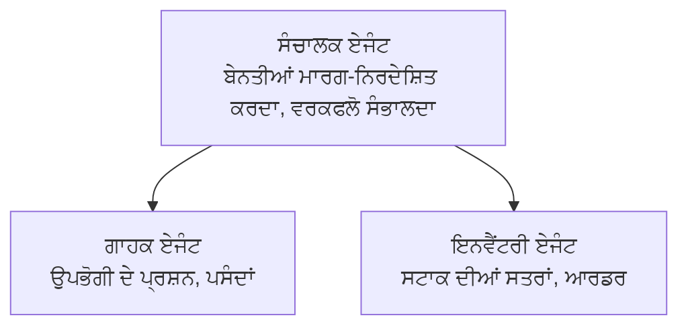

# ਅਧਿਆਇ 5: ਮਲਟੀ-ਏਜੰਟ ਏਆਈ ਸਮਾਧਾਨ

**📚 ਕੋਰਸ**: [AZD ਸ਼ੁਰੂਆਤੀਆਂ ਲਈ](../../README.md) | **⏱️ ਅਵਧੀ**: 2-3 ਘੰਟੇ | **⭐ ਜਟਿਲਤਾ**: ਉੱਨਤ

---

## ਵੇਰਵਾ

This chapter covers advanced multi-agent architecture patterns, agent orchestration, and production-ready AI deployments for complex scenarios.

> ਜੂਨ 2026 ਵਿੱਚ `azd 1.25.6` ਦੇ ਖਿਲਾਫ ਵੈਰੀਫਾਈ ਕੀਤਾ ਗਿਆ।

## ਸਿੱਖਣ ਦੇ ਉਦੇਸ਼

By completing this chapter, you will:
- ਸਮਝੋ ਮਲਟੀ-ਏਜੰਟ ਆਰਕੀਟੈਕਚਰ ਪੈਟਰਨ
- ਤਾਇਨਾਤ ਕਰੋ ਸਮਨ્વਿਤ ਏਆਈ ਏਜੰਟ ਸਿਸਟਮ
- ਲਾਗੂ ਕਰੋ ਏਜੰਟ-ਤੋਂ-ਏਜੰਟ ਸੰਚਾਰ
- ਬਣਾਓ ਉਤਪਾਦਨ-ਤਈ ਤਿਆਰ ਮਲਟੀ-ਏਜੰਟ ਸਮਾਧਾਨ

---

## 📚 ਪਾਠ

| # | Lesson | Description | Time |
|---|--------|-------------|------|
| 1 | [Multi-Agent Basics](multi-agent-basics.md) | Hands-on: deploy a working multi-agent app with `azd up` | 45 ਮਿੰਟ |
| 2 | [Coordination Patterns](../chapter-06-pre-deployment/coordination-patterns.md) | ਏਜੰਟ ਆਰਕੀਸਟ੍ਰੇਸ਼ਨ ਰਣਨੀਤੀਆਂ (ਅਧਿਆਇ 6 ਵਿੱਚ ਜਾਰੀ) | 30 ਮਿੰਟ |
| 3 | [ARM Template Deployment](../../examples/retail-multiagent-arm-template/README.md) | ਇੱਕ-ਕਲਿੱਕ ਤਾਇਨਾਤ ਉਦਾਹਰਣ | 30 ਮਿੰਟ |

> **ਪਾਠ 1 ਨਾਲ ਸ਼ੁਰੂ ਕਰੋ।** ਇਹ ਇਸ ਅਧਿਆਇ ਦਾ ਇੱਕੋ ਹੀ ਪੂਰੀ ਤਰ੍ਹਾਂ ਹੈਂਡਸ-ਆਨ, ਤਾਇਨਾਤ ਕੀਤਿਆਂ ਯੋਗ ਪਾਠ ਹੈ। ਪਾਠ 2 ਅਧਿਆਇ 6 ਵਿੱਚ ਹੈ (ਇਹ ਪ੍ਰੀ-ਡਿਪਲਾਏਮੈਂਟ ਯੋਜਨਾ ਨਾਲ ਸਾਂਝਾ ਕੀਤਾ ਗਿਆ ਹੈ), ਅਤੇ [ਰਿਟੇਲ ਮਲਟੀ-ਏਜੰਟ ਸਮਾਧਾਨ](../../examples/retail-scenario.md) ਇੱਕ ਆਰਕੀਟੈਕਚਰ ਬਲੂਪ੍ਰਿੰਟ ਹੈ—ਡਿਜ਼ਾਇਨ ਸੰਦਰਭ, ਇੱਕ-ਕਮਾਂਡ ਟੈਂਪਲੇਟ ਨਹੀਂ।

---

## 🚀 ਤੁਰੰਤ ਸ਼ੁਰੂਆਤ

```bash
# ਵਿਕਲਪ 1: ਟੈਮਪਲੇਟ ਤੋਂ ਤੈਨਾਤ ਕਰੋ
azd init --template agent-openai-python-prompty
azd up

# ਵਿਕਲਪ 2: ਏਜੈਂਟ ਮੈਨੀਫੈਸਟ ਤੋਂ ਤੈਨात ਕਰੋ (azure.ai.agents ਐਕਸਟੇਸ਼ਨ ਦੀ ਲੋੜ ਹੈ)
azd extension install azure.ai.agents
azd ai agent init -m agent-manifest.yaml
azd up
```

> **ਕਿਹੜਾ ਤਰੀਕਾ?** Use `azd init --template` to start from a working sample. Use `azd ai agent init` when you have your own agent manifest. ਪੂਰੀ ਜਾਣਕਾਰੀ ਲਈ ਦੇਖੋ [AZD AI CLI ਸੰਦਰਭ](../chapter-08-production/production-ai-practices.md#azd-ai-cli-commands-and-extensions)।

---

## 🤖 ਮਲਟੀ-ਏਜੰਟ ਆਰਕੀਟੈਕਚਰ



---

## 🎯 ਪ੍ਰਮੁੱਖ ਸਮਾਧਾਨ: ਰਿਟੇਲ ਮਲਟੀ-ਏਜੰਟ

The [ਰਿਟੇਲ ਮਲਟੀ-ਏਜੰਟ ਸਮਾਧਾਨ](../../examples/retail-scenario.md) ਦਿਖਾਉਂਦਾ ਹੈ:

- **ਗਾਹਕ ਏਜੰਟ**: ਉਪਭੋਗਤਾ ਇੰਟਰੈਕਸ਼ਨ ਅਤੇ ਪਸੰਦ-ਨਾਪਸੰਦ ਸੰਭਾਲਦਾ ਹੈ
- **ਇਨਵੈਂਟਰੀ ਏਜੰਟ**: ਸਟਾਕ ਅਤੇ ਆਰਡਰ ਪ੍ਰੋਸੈਸਿੰਗ ਪ੍ਰਬੰਧ ਕਰਦਾ ਹੈ
- **ਆਰਕੀਸਟਰੇਟਰ**: ਏਜੰਟਾਂ ਦੇ ਵਿਚਕਾਰ ਸਮਨ੍ਵਯ ਕਰਦਾ ਹੈ
- **ਸਾਂਝੀ ਮੈਮੋਰੀ**: ਏਜੰਟ-ਪਾਰ ਸੰਦਰਭ ਪ੍ਰਬੰਧਨ

### ਵਰਤੀਆਂ ਗਈਆਂ ਸੇਵਾਵਾਂ

| Service | Purpose |
|---------|---------|
| Microsoft Foundry Models | ਭਾਸ਼ਾ ਸਮਝ |
| Azure AI Search | ਉਤਪਾਦ ਕੈਟਾਲੌਗ |
| Cosmos DB | ਏਜੰਟ ਸਥਿਤੀ ਅਤੇ ਮੈਮੋਰੀ |
| Container Apps | ਏਜੰਟ ਹੋਸਟਿੰਗ |
| Application Insights | ਨਿਗਰਾਨੀ |

---

## 🔗 ਨੈਵੀਗੇਸ਼ਨ

| Direction | Chapter |
|-----------|---------|
| **Previous** | [ਅਧਿਆਇ 4: ਬੁਨਿਆਦੀ ਢਾਂਚਾ](../chapter-04-infrastructure/README.md) |
| **Next** | [ਅਧਿਆਇ 6: ਪ੍ਰੀ-ਡਿਪਲਾਏਮੈਂਟ](../chapter-06-pre-deployment/README.md) |

---

## 📖 ਸੰਬੰਧਿਤ ਸਰੋਤ

- [AI ਏਜੰਟ ਗਾਈਡ](../chapter-02-ai-development/agents.md)
- [ਉਤਪਾਦਨ ਏਆਈ ਅਭਿਆਸ](../chapter-08-production/production-ai-practices.md)
- [ਏਆਈ ਟ੍ਰਬਲਸ਼ੂਟਿੰਗ](../chapter-07-troubleshooting/ai-troubleshooting.md)

---

<!-- CO-OP TRANSLATOR DISCLAIMER START -->
**ਅਸਵੀਕਾਰੋਪਣ**:
ਇਸ ਦਸਤਾਵੇਜ਼ ਦਾ ਅਨੁਵਾਦ ਏਆਈ ਅਨੁਵਾਦ ਸੇਵਾ [Co-op Translator](https://github.com/Azure/co-op-translator) ਦੀ ਵਰਤੋਂ ਕਰਕੇ ਕੀਤਾ ਗਿਆ ਹੈ। ਜਦੋਂ ਕਿ ਅਸੀਂ ਸਹੀਤਾਵਾਂ ਲਈ ਯਤਨਸ਼ੀਲ ਹਾਂ, ਕਿਰਪਾ ਕਰਕੇ ਧਿਆਨ ਰੱਖੋ ਕਿ ਸਵੈਚਾਲਿਤ ਅਨੁਵਾਦਾਂ ਵਿੱਚ ਗਲਤੀਆਂ ਜਾਂ ਅਸਮੱਤਿਆਵਾਂ ਹੋ ਸਕਦੀਆਂ ਹਨ। ਮੂਲ ਦਸਤਾਵੇਜ਼ ਆਪਣੀ ਮੂਲ ਭਾਸ਼ਾ ਵਿੱਚ ਅਧਿਕਾਰਕ ਸਰੋਤ ਮੰਨਿਆ ਜਾਣਾ ਚਾਹੀਦਾ ਹੈ। ਜਰੂਰੀ ਜਾਣਕਾਰੀ ਲਈ, ਪੇਸ਼ੇਵਰ ਮਨੁੱਖੀ ਅਨੁਵਾਦ ਦੀ ਸਿਫ਼ਾਰਸ਼ ਕੀਤੀ ਜਾਂਦੀ ਹੈ। ਅਸੀਂ ਇਸ ਅਨੁਵਾਦ ਦੇ ਉਪਯੋਗ ਤੋਂ ਪੈਦਾ ਹੋਣ ਵਾਲੀਆਂ ਕਿਸੇ ਵੀ ਗਲਤਫਹਿਮੀਆਂ ਜਾਂ ਗਲਤ ਵਿਆਖਿਆਵਾਂ ਲਈ ਜਵਾਬਦੇਹ ਨਹੀਂ ਹਾਂ।
<!-- CO-OP TRANSLATOR DISCLAIMER END -->