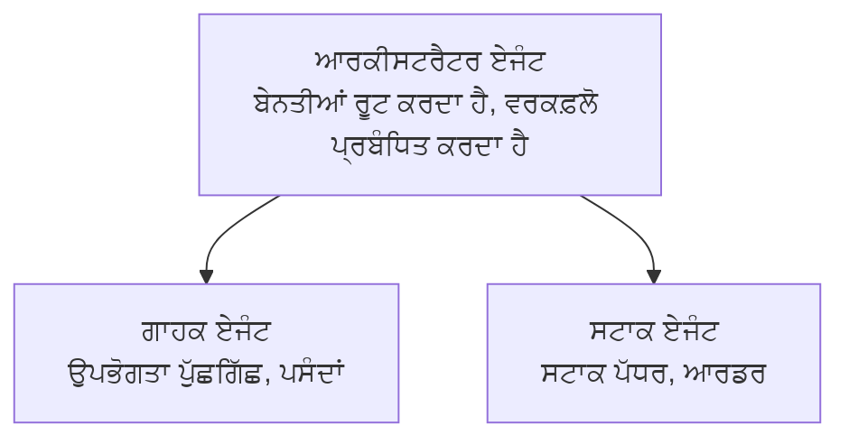

# ਅਧਿਆਇ 5: ਬਹੁ-ਏਜੰਟ ਏਆਈ ਹੱਲ

**📚 ਕੋਰਸ**: [AZD ਸਿਖਰਾਂ ਲਈ](../../README.md) | **⏱️ ਮਿਆਦ**: 2-3 ਘੰਟੇ | **⭐ ਜਟਿਲਤਾ**: ਉੱਚ ਦਰਜੇ ਦੀ

---

## ਝਲਕ

ਇਹ ਅਧਿਆਇ ਉੱਚ ਦਰਜੇ ਦੇ ਬਹੁ-ਏਜੰਟ ਆਰਕੀਟੈਕਚਰ ਦੇ ਪੈਟਰਨ, ਏਜੰਟ ਆਰਕੀਸਟ੍ਰੇਸ਼ਨ, ਅਤੇ ਕਠਿਨ ਸਥਿਤੀਆਂ ਲਈ ਉਤਪਾਦਨ-ਤਯਾਰ ਏਆਈ ਡਿਪਲਾਇਮੈਂਟ ਕਵਰ ਕਰਦਾ ਹੈ।

> ਜੁਲਾਈ 2026 ਵਿੱਚ `azd 1.27.1` ਨਾਲ ਪ੍ਰਮਾਣਿਤ।

## ਸਿੱਖਣ ਦੇ ਉਦੇਸ਼

ਇਸ ਅਧਿਆਇ ਨੂੰ ਪੂਰਾ ਕਰਕੇ, ਤੁਸੀਂ:
- ਬਹੁ-ਏਜੰਟ ਆਰਕੀਟੈਕਚਰ ਪੈਟਰਨ ਸ理解 ਕਰੋगे
- ਸਹਿ-ਸੰਯੁਕਤ ਏਆਈ ਏਜੰਟ ਸਿਸਟਮ ਡਿਪਲੋ ਕਰੋਂਗੇ
- ਏਜੰਟ-ਟੂ-ਏਜੰਟ ਸੰਚਾਰ ਲਾਗੂ ਕਰਨਗੇ
- ਉਤਪਾਦਨ-ਤਯਾਰ ਬਹੁ-ਏਜੰਟ ਹੱਲ ਬਣਾਓਗੇ

---

## 📚 ਪਾਠ

| # | ਪਾਠ | ਵੇਰਵਾ | ਸਮਾਂ |
|---|--------|-------------|------|
| 1 | [ਬਹੁ-ਏਜੰਟ ਬੁਨਿਆਦੀ ਜਾਣਕਾਰੀ](multi-agent-basics.md) | ਹੱਥ-ਵਾਲਾ: `azd up` ਨਾਲ ਕਾਰਜਕਾਰੀ ਬਹੁ ਏਜੰਟ ਐਪ ਡਿਪਲੋ ਕਰੋ | 45 ਮਿੰਟ |
| 2 | [ਸਹੀ-ਸੰਯੋਜਨ ਪੈਟਰਨ](../chapter-06-pre-deployment/coordination-patterns.md) | ਏਜੰਟ ਆਰਕੀਸਟ੍ਰੇਸ਼ਨ ਦੀਆਂ ਰਣਨੀਤੀਆਂ (ਅੱਗੇ ਅਧਿਆਇ 6 ਵਿੱਚ ਜਾਰੀ) | 30 ਮਿੰਟ |
| 3 | [ARM ਟੈਮਪਲੇਟ ਡਿਪਲੋਇਮੈਂਟ](../../examples/retail-multiagent-arm-template/README.md) | ਇਕ-ਕਲਿੱਕ ਡਿਪਲੋਇਮੈਂਟ ਉਦਾਹਰਨ | 30 ਮਿੰਟ |

> **ਪਾਠ 1 ਨਾਲ ਸ਼ੁਰੂ ਕਰੋ।** ਇਸ ਅਧਿਆਇ ਵਿੱਚ ਇਹ ਇਕੋ ਇੱਕ ਪੂਰੀ ਤਰ੍ਹਾਂ ਹੱਥ-ਵਾਲਾ, ਡਿਪਲੋਇਮੈਂਟਯੋਗ ਪਾਠ ਹੈ। ਪਾਠ 2 ਅਧਿਆਇ 6 ਵਿੱਚ ਹੈ (ਇਹ ਪੂਰਵ-ਡਿਪਲੋਇਮੈਂਟ ਯੋਜਨਾ ਨਾਲ ਸਾਂਝਾ ਕੀਤਾ ਗਿਆ ਹੈ), ਅਤੇ [ਰਿਟੇਲ ਬਹੁ-ਏਜੰਟ ਹੱਲ](../../examples/retail-scenario.md) ਇੱਕ ਆਰਕੀਟੈਕਚਰ ਨਕਸ਼ਾ ਹੈ—ਇੱਕ ਡਿਜ਼ਾਇਨ ਸੰਦਰਭ, ਨਾ ਕਿ ਇਕ-ਕਮਾਂਡ ਟੈਮਪਲੇਟ।

---

## 🚀 ਤੇਜ਼ ਸ਼ੁਰੂਆਤ

```bash
# ਵਿਕਲਪ 1: ਇੱਕ ਟੈਮਪਲੇਟ ਤੋਂ ਤਾਇਨਾਤ ਕਰੋ
azd init --template agent-openai-python-prompty
azd up

# ਵਿਕਲਪ 2: ਇੱਕ ਏਜੰਟ ਮੈਨਿਫੈਸਟ ਤੋਂ ਤਾਇਨਾਤ ਕਰੋ (azure.ai.agents ਐਕਸਟੇਂਸ਼ਨ ਦੀ ਲੋੜ ਹੈ)
azd extension install azure.ai.agents
azd ai agent init -m agent-manifest.yaml
azd up
```

> **ਕਿਹੜਾ ਤਰੀਕਾ?** ਵਰਤੀ ਕਰੋ `azd init --template` ਕਿਸੇ ਕਾਰਜਕਾਰੀ ਨਮੂਨੇ ਤੋਂ ਸ਼ੁਰੂ ਕਰਨ ਲਈ। ਜਦੋਂ ਤੁਹਾਡੇ ਕੋਲ ਆਪਣਾ ਏਜੰਟ ਮੈਨਿਫੈਸਟ ਹੋਵੇ ਤਾਂ ਵਰਤੀ ਕਰੋ `azd ai agent init`। ਪੂਰੇ ਵੇਰਵੇ ਲਈ ਵੇਖੋ [AZD AI CLI ਸੰਦਰਭ](../chapter-08-production/production-ai-practices.md#azd-ai-cli-commands-and-extensions)।

---

## 🤖 ਬਹੁ-ਏਜੰਟ ਆਰਕੀਟੈਕਚਰ



---

## 🎯 ਵਿਸ਼ੇਸ਼ ਹੱਲ: ਰਿਟੇਲ ਬਹੁ-ਏਜੰਟ

[ਰਿਟੇਲ ਬਹੁ-ਏਜੰਟ ਹੱਲ](../../examples/retail-scenario.md) ਦਰਸਾਉਂਦਾ ਹੈ:

- **ਗਾਹਕ ਏਜੰਟ**: ਯੂਜ਼ਰ ਵਿਆਪਾਰ ਅਤੇ ਪਸੰਦਾਂ ਨੂੰ ਸੰਭਾਲਦਾ ਹੈ
- **ਸਟਾਕ ਏਜੰਟ**: ਸਟਾਕ ਅਤੇ ਆਰਡਰ ਪ੍ਰਕਿਰਿਆ ਦਾ ਪ੍ਰਬੰਧ ਕਰਦਾ ਹੈ
- **ਆਰਕੀਸਟ੍ਰੇਟਰ**: ਏਜੰਟਾਂ ਵਿਚਕਾਰ ਸਹਿ-ਸੰਯੋਜਨ ਕਰਦਾ ਹੈ
- **ਸ਼ੇਅਰ ਕੀਤੀ ਯਾਦਦਾਸ਼ਤ**: ਬਹੁ-ਏਜੰਟ ਪ੍ਰਸੰਗ ਪ੍ਰਬੰਧਨ

### ਵਰਤੇ ਜਾਣ ਵਾਲੇ ਸੇਵਾ

| ਸੇਵਾ | ਮਕਸਦ |
|---------|---------|
| Microsoft Foundry Models | ਭਾਸ਼ਾ ਸਮਝਣ |
| Azure AI Search | ਉਤਪਾਦ ਕੈਟਾਲੌਗ |
| Cosmos DB | ਏਜੰਟ ਦੀ ਸਥਿਤੀ ਅਤੇ ਯਾਦਦਾਸ਼ਤ |
| Container Apps | ਏਜੰਟ ਹੋਸਟਿੰਗ |
| Application Insights | ਨਿਗਰਾਨੀ |

---

## 🔗 ਨੈਵੀਗੇਸ਼ਨ

| ਦਿਸ਼ਾ | ਅਧਿਆਇ |
|-----------|---------|
| **ਪਿਛਲਾ** | [ਅਧਿਆਇ 4: ਢਾਂਚਾ](../chapter-04-infrastructure/README.md) |
| **ਅਗਲਾ** | [ਅਧਿਆਇ 6: ਪੂਰਵਿਤ ਤਿਆਰੀ](../chapter-06-pre-deployment/README.md) |

---

## 📖 ਸਬੰਧਿਤ ਸਰੋਤ

- [ਏਆਈ ਏਜੰਟ ਗਾਈਡ](../chapter-02-ai-development/agents.md)
- [ਉਤਪਾਦਨ ਏਆਈ ਅਭ್ಯಾಸ](../chapter-08-production/production-ai-practices.md)
- [ਏਆਈ ਟ੍ਰਬਲਸ਼ੂਟਿੰਗ](../chapter-07-troubleshooting/ai-troubleshooting.md)

---

<!-- CO-OP TRANSLATOR DISCLAIMER START -->
**ਅਸਵੀਕਾਰੋਪਣ**:
ਇਸ ਦਸਤਾਵੇਜ਼ ਦਾ ਅਨੁਵਾਦ ਏਆਈ ਅਨੁਵਾਦ ਸੇਵਾ [Co-op Translator](https://github.com/Azure/co-op-translator) ਦੀ ਵਰਤੋਂ ਕਰਕੇ ਕੀਤਾ ਗਿਆ ਹੈ। ਜਦੋਂ ਕਿ ਅਸੀਂ ਸਹੀਤਾਵਾਂ ਲਈ ਯਤਨਸ਼ੀਲ ਹਾਂ, ਕਿਰਪਾ ਕਰਕੇ ਧਿਆਨ ਰੱਖੋ ਕਿ ਸਵੈਚਾਲਿਤ ਅਨੁਵਾਦਾਂ ਵਿੱਚ ਗਲਤੀਆਂ ਜਾਂ ਅਸਮੱਤਿਆਵਾਂ ਹੋ ਸਕਦੀਆਂ ਹਨ। ਮੂਲ ਦਸਤਾਵੇਜ਼ ਆਪਣੀ ਮੂਲ ਭਾਸ਼ਾ ਵਿੱਚ ਅਧਿਕਾਰਕ ਸਰੋਤ ਮੰਨਿਆ ਜਾਣਾ ਚਾਹੀਦਾ ਹੈ। ਜਰੂਰੀ ਜਾਣਕਾਰੀ ਲਈ, ਪੇਸ਼ੇਵਰ ਮਨੁੱਖੀ ਅਨੁਵਾਦ ਦੀ ਸਿਫ਼ਾਰਸ਼ ਕੀਤੀ ਜਾਂਦੀ ਹੈ। ਅਸੀਂ ਇਸ ਅਨੁਵਾਦ ਦੇ ਉਪਯੋਗ ਤੋਂ ਪੈਦਾ ਹੋਣ ਵਾਲੀਆਂ ਕਿਸੇ ਵੀ ਗਲਤਫਹਿਮੀਆਂ ਜਾਂ ਗਲਤ ਵਿਆਖਿਆਵਾਂ ਲਈ ਜਵਾਬਦੇਹ ਨਹੀਂ ਹਾਂ।
<!-- CO-OP TRANSLATOR DISCLAIMER END -->