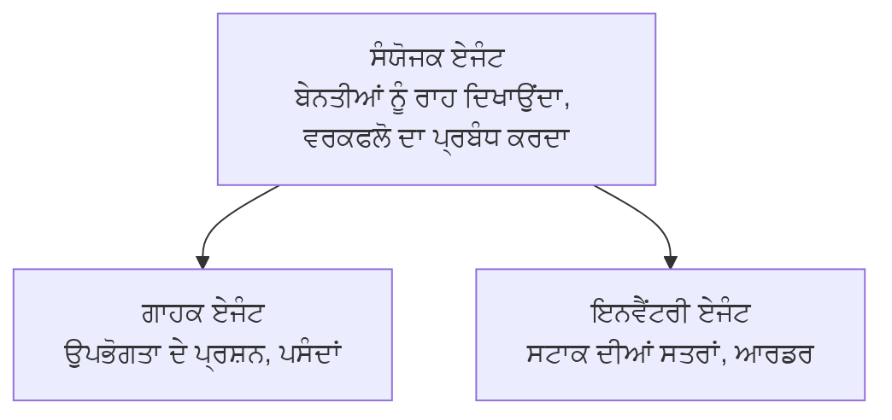

# Chapter 5: ਮਲਟੀ-ਏਜੰਟ AI ਹੱਲ

**📚 ਕੋਰਸ**: [AZD ਬਿਗਿਨਰਾਂ ਲਈ](../../README.md) | **⏱️ ਸਮਾਂ**: 2-3 hours | **⭐ ਕੁਠਿਨਾਈ**: ਉੱਨਤ

---

## ਸਾਰਾਂਸ਼

ਇਸ ਅਧਿਆਇ ਵਿੱਚ ਉੱਨਤ ਮਲਟੀ-ਏਜੰਟ ਆਰਕੀਟੈਕਚਰ ਪੈਟਰਨ, ਏਜੰਟ ਆਰਕੇਸਟਰੇਸ਼ਨ, ਅਤੇ ਜਟਿਲ ਸਨਦਰਭਾਂ ਲਈ ਉਤਪਾਦਨ-ਤਿਆਰ AI ਡਿਪਲੋਇਮੈਂਟ ਕਵਰ ਕੀਤੇ ਜਾਣਗੇ।

## ਸਿੱਖਣ ਦੇ ਉਦੇਸ਼

ਇਸ ਅਧਿਆਇ ਨੂੰ ਪੂਰਾ ਕਰਨ ਦੇ ਬਾਅਦ, ਤੁਸੀਂ:
- ਮਲਟੀ-ਏਜੰਟ ਆਰਕੀਟੈਕਚਰ ਪੈਟਰਨ ਸਮਝੋਗੇ
- ਸਮਨ্বਿਤ AI ਏਜੰਟ ਪ੍ਰਣਾਲੀਆਂ ਡਿਪਲੋਇ ਕਰਨਾ ਸਿੱਖੋਗੇ
- ਏਜੰਟ-ਤੋਂ-ਏਜੰਟ ਸੰਚਾਰ ਲਾਗੂ ਕਰਨਾ
- ਉਤਪਾਦਨ-ਤਿਆਰ ਮਲਟੀ-ਏਜੰਟ ਹੱਲ ਬਣਾਉਣਾ

---

## 📚 ਪਾਠ

| # | ਪਾਠ | ਵੇਰਵਾ | ਸਮਾਂ |
|---|--------|-------------|------|
| 1 | [ਰਿਟੇਲ ਮਲਟੀ-ਏਜੰਟ ਹੱਲ](../../examples/retail-scenario.md) | ਪੂਰੀ ਇੰਪਲੀਮੇਨਟੇਸ਼ਨ ਦਾ ਵਾਕਥਰੂ | 90 min |
| 2 | [ਸੰਯੋਜਨ ਪੈਟਰਨ](../chapter-06-pre-deployment/coordination-patterns.md) | ਏਜੰਟ ਆਰਕੇਸਟਰੇਸ਼ਨ ਰਣਨੀਤੀਆਂ | 30 min |
| 3 | [ARM ਟੈਮਪਲੇਟ ਡਿਪਲੋਇਮੈਂਟ](../../examples/retail-multiagent-arm-template/README.md) | ਇੱਕ-ਕਲਿੱਕ ਡਿਪਲੋਇਮੈਂਟ | 30 min |

---

## 🚀 ਤੁਰੰਤ ਸ਼ੁਰੂਆਤ

```bash
# ਵਿਕਲਪ 1: ਟੈਮਪਲੇਟ ਤੋਂ ਤੈਨਾਤ ਕਰੋ
azd init --template agent-openai-python-prompty
azd up

# ਵਿਕਲਪ 2: ਏਜੰਟ ਮੈਨਿਫੈਸਟ ਤੋਂ ਤੈਨਾਤ ਕਰੋ (ਜਿਸ ਲਈ azure.ai.agents ਐਕਸਟੈਂਸ਼ਨ ਦੀ ਲੋੜ ਹੈ)
azd extension install azure.ai.agents
azd ai agent init -m agent-manifest.yaml
azd up
```

> **ਕਿਹੜਾ ਤਰੀਕਾ?** `azd init --template` ਵਰਤੋਂ ਇੱਕ ਕਾਰਗਰ ਨਮੂਨੇ ਤੋਂ ਸ਼ੁਰੂ ਕਰਨ ਲਈ। ਜਦੋਂ ਤੁਹਾਡੇ ਕੋਲ ਆਪਣਾ ਏਜੰਟ ਮੈਨਿਫੈਸਟ ਹੋਵੇ ਤਾਂ `azd ai agent init` ਵਰਤੋਂ। ਪੂਰੇ ਵੇਰਵਿਆਂ ਲਈ ਵੇਖੋ [AZD AI CLI ਸੰਦਰਭ](../chapter-08-production/production-ai-practices.md#azd-ai-cli-commands-and-extensions)।

---

## 🤖 ਮਲਟੀ-ਏਜੰਟ ਆਰਕੀਟੈਕਚਰ


---

## 🎯 ਪ੍ਰਮੁੱਖ ਹੱਲ: ਰਿਟੇਲ ਮਲਟੀ-ਏਜੰਟ

[ਰਿਟੇਲ ਮਲਟੀ-ਏਜੰਟ ਹੱਲ](../../examples/retail-scenario.md) ਇਹ ਦਿਖਾਉਂਦਾ ਹੈ:

- **ਗਾਹਕ ਏਜੰਟ**: ਉਪਭੋਗਤਾ ਇੰਟਰੈਕਸ਼ਨ ਅਤੇ ਪਸੰਦਾਂ ਨੂੰ ਸੰਭਾਲਦਾ ਹੈ
- **ਇਨਵੈਂਟਰੀ ਏਜੰਟ**: ਸਟਾਕ ਅਤੇ ਆਰਡਰ ਪ੍ਰੋਸੈਸਿੰਗ ਦਾ ਪ੍ਰਬੰਧ ਕਰਦਾ ਹੈ
- **ਆਰਕੇਸਟਰੇਟਰ**: ਏਜੰਟਾਂ ਵਿਚਕਾਰ ਸੰਯੋਜਨ ਕਰਦਾ ਹੈ
- **ਸ਼ੇਅਰ ਕੀਤੀ ਯਾਦاشت**: ਏਜੰਟ-ਪਾਰ ਪ੍ਰਸੰਗ ਪ੍ਰਬੰਧਨ

### ਵਰਤੀ ਗਈਆਂ ਸੇਵਾਵਾਂ

| Service | Purpose |
|---------|---------|
| Microsoft Foundry Models | ਭਾਸ਼ਾ ਸਮਝ |
| Azure AI Search | ਉਤਪਾਦ ਕੈਟਾਲੌਗ |
| Cosmos DB | ਏਜੰਟ ਸਥਿਤੀ ਅਤੇ ਮੈਮੋਰੀ |
| Container Apps | ਏਜੰਟ ਹੋਸਟਿੰਗ |
| Application Insights | ਨਿਗਰਾਨੀ |

---

## 🔗 ਨੈਵੀਗੇਸ਼ਨ

| ਦਿਸ਼ਾ | ਅਧਿਆਇ |
|-----------|---------|
| **ਪਿਛਲਾ** | [ਅਧਿਆਇ 4: ਢਾਂਚਾ](../chapter-04-infrastructure/README.md) |
| **ਅਗਲਾ** | [ਅਧਿਆਇ 6: ਪ੍ਰੀ-ਡਿਪਲੋਇਮੈਂਟ](../chapter-06-pre-deployment/README.md) |

---

## 📖 ਸੰਬੰਧਿਤ ਸਰੋਤ

- [AI ਏਜੰਟਸ ਰਾਹਨੁਮਾ](../chapter-02-ai-development/agents.md)
- [ਉਤਪਾਦਨ AI ਅਭਿਆਸ](../chapter-08-production/production-ai-practices.md)
- [AI ਸਮੱਸਿਆ ਨਿਪਟਾਰਾ](../chapter-07-troubleshooting/ai-troubleshooting.md)

---

<!-- CO-OP TRANSLATOR DISCLAIMER START -->
**Disclaimer**:
ਇਸ ਦਸਤਾਵੇਜ਼ ਨੂੰ AI ਅਨੁਵਾਦ ਸੇਵਾ [Co-op Translator](https://github.com/Azure/co-op-translator) ਦੀ ਵਰਤੋਂ ਕਰਕੇ ਅਨੁਵਾਦ ਕੀਤਾ ਗਿਆ ਹੈ। ਅਸੀਂ ਸਹੀਅਤ ਲਈ ਕੋਸ਼ਿਸ਼ ਕਰਦੇ ਹਾਂ, ਪਰ ਕਿਰਪਾ ਕਰਕੇ ਧਿਆਨ ਰੱਖੋ ਕਿ ਆਟੋਮੇਟਿਕ ਅਨੁਵਾਦਾਂ ਵਿੱਚ ਗਲਤੀਆਂ ਜਾਂ ਅਣਸਹੀਤਤਾ ਹੋ ਸਕਦੀ ਹੈ। ਮੂਲ ਦਸਤਾਵੇਜ਼ ਨੂੰ ਇਸ ਦੀ ਮੂਲ ਭਾਸ਼ਾ ਵਿੱਚ ਅਧਿਕਾਰਿਕ ਸਰੋਤ ਹੀ ਮੰਨਿਆ ਜਾਣਾ ਚਾਹੀਦਾ ਹੈ। ਮਹੱਤਵਪੂਰਨ ਜਾਣਕਾਰੀ ਲਈ, ਪੇਸ਼ੇਵਰ ਮਨੁੱਖੀ ਅਨੁਵਾਦ ਦੀ ਸਿਫ਼ਾਰਸ਼ ਕੀਤੀ ਜਾਂਦੀ ਹੈ। ਅਸੀਂ ਇਸ ਅਨੁਵਾਦ ਦੀ ਵਰਤੋਂ ਨਾਲ ਹੋਣ ਵਾਲੀਆਂ ਕਿਸੇ ਵੀ ਗਲਤਫਹਮੀਆਂ ਜਾਂ ਗਲਤ ਵਿਆਖਿਆਵਾਂ ਲਈ ਜ਼ਿੰਮੇਵਾਰ ਨਹੀਂ ਹਾਂ।
<!-- CO-OP TRANSLATOR DISCLAIMER END -->