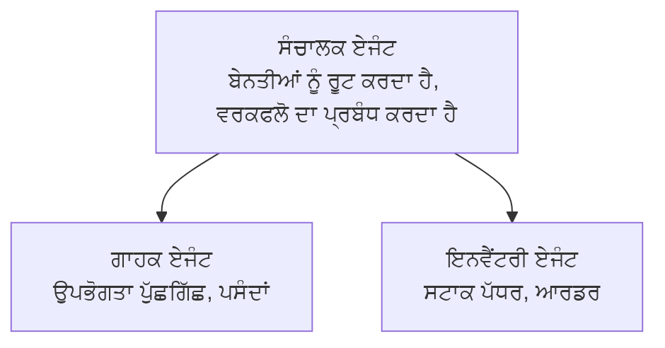

# ਅਧਿਆਇ 5: ਬਹੁ-ਏਜੰਟ ਏਆਈ ਸਮਾਧਾਨ

**📚 ਕੋਰਸ**: [AZD ਸ਼ੁਰੂਆਤੀਆਂ ਲਈ](../../README.md) | **⏱️ ਸਮਾਂ**: 2-3 ਘੰਟੇ | **⭐ ਕਠਿਨਾਈ**: ਉੱਚ

---

## ਜਾਇਜ਼ਾ

ਇਸ ਅਧਿਆਇ ਵਿੱਚ ਉੱਨਤ ਬਹੁ-ਏਜੰਟ ਆਰਕੀਟੈਕਚਰ ਪੈਟਰਨ, ਏਜੰਟ ਔਰਕੈਸਟ੍ਰੇਸ਼ਨ, ਅਤੇ ਜਟਿਲ ਸਥਿਤੀਆਂ ਲਈ ਪ੍ਰੋਡਕਸ਼ਨ-ਰੇਡੀ ਏਆਈ ਡਿਪਲੋਇਮੈਂਟ ਦਿੱਤੇ ਗਏ ਹਨ।

> `azd 1.23.12` ਦੇ ਖਿਲਾਫ ਮਾਰਚ 2026 ਵਿੱਚ ਪੁਸ਼ਟੀ ਕੀਤੀ ਗਈ।

## ਸਿੱਖਣ ਦੇ ਉਦੇਸ਼

ਇਸ ਅਧਿਆਇ ਨੂੰ ਪੂਰਾ ਕਰਨ ਤੋਂ ਬਾਦ, ਤੁਸੀਂ:
- ਬਹੁ-ਏਜੰਟ ਆਰਕੀਟੈਕਚਰ ਪੈਟਰਨ ਨੂੰ ਸਮਝੋਗੇ
- ਸਮਨ੍ਵੀ ਏਜੰਟ ਸਿਸਟਮ ਤੈਅਨਾਤ ਕਰੋਗੇ
- ਏਜੰਟ-ਤੋਂ-ਏਜੰਟ ਸੰਚਾਰ ਲਾਗੂ ਕਰੋਗੇ
- ਪ੍ਰੋਡਕਸ਼ਨ-ਰੇਡੀ ਬਹੁ-ਏਜੰਟ ਸਮਾਧਾਨ ਬਣਾਉਗੇ

---

## 📚 ਸਬਕ

| # | ਸਬਕ | ਵੇਰਵਾ | ਸਮਾਂ |
|---|--------|-------------|------|
| 1 | [ਰੀਟੇਲ ਮਲਟੀ-ਏਜੰਟ ਸਮਾਧਾਨ](../../examples/retail-scenario.md) | ਪੂਰੀ ਤਰ੍ਹਾਂ ਲਾਗੂ ਕਰਨ ਦੀ ਰਾਹਦਰਸ਼ਨ | 90 min |
| 2 | [ਸਮਨ੍ਵੀ ਪੈਟਰਨ](../chapter-06-pre-deployment/coordination-patterns.md) | ਏਜੰਟ ਸਮਨਵੇਂ ਰਣਨੀਤੀਆਂ | 30 min |
| 3 | [ARM ਟੈਮਪਲੇਟ ਡਿਪਲੋਇਮੈਂਟ](../../examples/retail-multiagent-arm-template/README.md) | ਇੱਕ-ਕਲਿੱਕ ਤैनਾਤੀ | 30 min |

---

## 🚀 ਤੁਰੰਤ ਸ਼ੁਰੂਆਤ

```bash
# ਚੋਣ 1: ਟੈਂਪਲੇਟ ਤੋਂ ਤੈਨਾਤ ਕਰੋ
azd init --template agent-openai-python-prompty
azd up

# ਚੋਣ 2: ਏਜੰਟ ਮੈਨਿਫੈਸਟ ਤੋਂ ਤੈਨਾਤ ਕਰੋ (azure.ai.agents ਐਕਸਟੈਂਸ਼ਨ ਦੀ ਲੋੜ)
azd extension install azure.ai.agents
azd ai agent init -m agent-manifest.yaml
azd up
```

> **ਕਿਹੜਾ ਰੁਖ?** ਵਰਕਿੰਗ ਸੈਂਪਲ ਤੋਂ ਸ਼ੁਰੂ ਕਰਨ ਲਈ `azd init --template` ਵਰਤੋ। ਜਦੋਂ ਤੁਹਾਡੇ ਕੋਲ ਆਪਣਾ ਏਜੰਟ ਮੈਨਿਫੈਸਟ ਹੋਵੇ ਤਾਂ `azd ai agent init` ਵਰਤੋ। ਪੂਰੀ ਜਾਣਕਾਰੀ ਲਈ ਵੇਖੋ [AZD ਏਆਈ CLI ਸੰਦਰਭ](../chapter-08-production/production-ai-practices.md#azd-ai-cli-commands-and-extensions)।

---

## 🤖 ਬਹੁ-ਏਜੰਟ ਆਰਕੀਟੈਕਚਰ


---

## 🎯 ਵਿਸ਼ੇਸ਼ ਸਮਾਧਾਨ: ਰੀਟੇਲ ਮਲਟੀ-ਏਜੰਟ

[ਰੀਟੇਲ ਮਲਟੀ-ਏਜੰਟ ਸਮਾਧਾਨ](../../examples/retail-scenario.md) ਦਰਸਾਉਂਦਾ ਹੈ:

- **ਗਾਹਕ ਏਜੰਟ**: ਉਪਭੋਗਤਾ ਇੰਟਰੇਕਸ਼ਨਾਂ ਅਤੇ ਪਸੰਦਾਂ ਨੂੰ ਸੰਭਾਲਦਾ ਹੈ
- **ਇਨਵੈਂਟਰੀ ਏਜੰਟ**: ਸਟਾਕ ਅਤੇ ਆਰਡਰ ਪ੍ਰੋਸੈਸਿੰਗ ਦਾ ਪ੍ਰਬੰਧ ਕਰਦਾ ਹੈ
- **ਆਰਕੈਸਟਰੇਟਰ**: ਏਜੰਟਾਂ ਦੇ ਵਿਚਕਾਰ ਤਾਲਮੇਲ ਕਰਦਾ ਹੈ
- **ਸਾਂਝੀ ਮੈਮੋਰੀ**: ਕ੍ਰਾਸ-ਏਜੰਟ ਸੰਦਰਭ ਪ੍ਰਬੰਧ

### ਵਰਤੇ ਗਏ ਸੇਵਾਵਾਂ

| ਸੇਵਾ | ਮਕਸਦ |
|---------|---------|
| Microsoft Foundry Models | ਭਾਸ਼ਾ ਸਮਝ |
| Azure AI Search | ਉਤਪਾਦ ਕੈਟਲੌਗ |
| Cosmos DB | ਏਜੰਟ ਸਥਿਤੀ ਅਤੇ ਮੈਮੋਰੀ |
| Container Apps | ਏਜੰਟ ਹੋਸਟਿੰਗ |
| Application Insights | ਨਿਗਰਾਨੀ |

---

## 🔗 ਨੈਵੀਗੇਸ਼ਨ

| ਦਿਸ਼ਾ | ਅਧਿਆਇ |
|-----------|---------|
| **ਪਿਛਲਾ** | [ਅਧਿਆਇ 4: ਢਾਂਚਾ](../chapter-04-infrastructure/README.md) |
| **ਅਗਲਾ** | [ਅਧਿਆਇ 6: ਪੂਰਵ-ਤੈਨਾਤੀ](../chapter-06-pre-deployment/README.md) |

---

## 📖 ਸੰਬੰਧਤ ਸਰੋਤ

- [ਏਆਈ ਏਜੰਟਸ ਗਾਈਡ](../chapter-02-ai-development/agents.md)
- [ਪ੍ਰੋਡਕਸ਼ਨ ਏਆਈ ਅਭਿਆਸ](../chapter-08-production/production-ai-practices.md)
- [ਏਆਈ ਸਮੱਸਿਆ-ਨਿਰਾਕਰਨ](../chapter-07-troubleshooting/ai-troubleshooting.md)

---

<!-- CO-OP TRANSLATOR DISCLAIMER START -->
**ਅਸਵੀਕਰਨ**:
ਇਹ ਦਸਤਾਵੇਜ਼ AI ਅਨੁਵਾਦ ਸੇਵਾ [Co-op Translator](https://github.com/Azure/co-op-translator) ਦੀ ਵਰਤੋਂ ਕਰਕੇ ਅਨੁਵਾਦ ਕੀਤਾ ਗਿਆ ਹੈ। ਅਸੀਂ ਸ਼ੁੱਧਤਾ ਲਈ ਕੋਸ਼ਿਸ਼ ਕਰਦੇ ਹਾਂ, ਪਰ ਕਿਰਪਾ ਕਰਕੇ ਧਿਆਨ ਦਿਓ ਕਿ ਸਵਚਾਲਿਤ ਅਨੁਵਾਦਾਂ ਵਿੱਚ ਗਲਤੀਆਂ ਜਾਂ ਅਸਥਿਰਤਾਵਾਂ ਹੋ ਸਕਦੀਆਂ ਹਨ। ਮੂਲ ਦਸਤਾਵੇਜ਼ ਨੂੰ ਇਸ ਦੀ ਮੂਲ ਭਾਸ਼ਾ ਵਿੱਚ ਪ੍ਰਮਾਣਿਕ ਸੂਤਰ ਮੰਨਿਆ ਜਾਣਾ ਚਾਹੀਦਾ ਹੈ। ਮਹੱਤਵਪੂਰਨ ਜਾਣਕਾਰੀ ਲਈ, ਪੇਸ਼ੇਵਰ ਮਨੁੱਖੀ ਅਨੁਵਾਦ ਦੀ ਸਿਫ਼ਾਰਸ਼ ਕੀਤੀ ਜਾਂਦੀ ਹੈ। ਅਸੀਂ ਇਸ ਅਨੁਵਾਦ ਦੇ ਉਪਯੋਗ ਤੋਂ ਉਤਪੰਨ ਕਿਸੇ ਵੀ ਗਲਤਫਹਮੀ ਜਾਂ ਭ੍ਰਮ ਲਈ ਜ਼ਿੰਮੇਵਾਰ ਨਹੀਂ ਹਾਂ।
<!-- CO-OP TRANSLATOR DISCLAIMER END -->