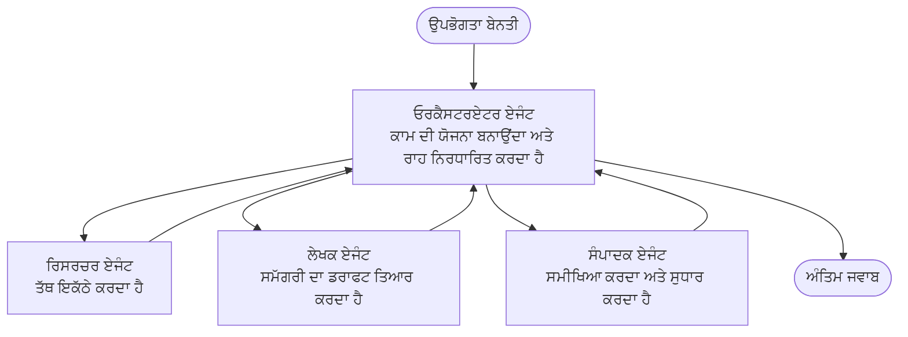

# ਬਹੁ-ਏਜੰਟ ਬੁਨਿਆਦੀ - ਆਪਣੀ ਪਹਿਲੀ ਸੁਮੇਲਿਤ AI ਸਿਸਟਮ ਡਿਪਲਾਇ ਕਰੋ

**ਅਧਿਆਇ ਨੈਵੀਗੇਸ਼ਨ:**
- **📚 ਕੋਰਸ ਮੁੱਖ ਪੰਨਾ**: [AZD For Beginners](../../README.md)
- **📖 ਇਸ ਸਮੇਂ ਦਾ ਅਧਿਆਇ**: ਅਧਿਆਇ 5 - ਬਹੁ-ਏਜੰਟ AI ਹੱਲ
- **⬅️ ਪਿਛਲਾ**: [ਅਧਿਆਇ 4: ਢਾਂਚਾ](../chapter-04-infrastructure/README.md)
- **➡️ ਅਗਲਾ**: [ਸਮਨਵਯ ਪੈਟਰਨ](../chapter-06-pre-deployment/coordination-patterns.md)

> ਜੁਲਾਈ 2026 ਵਿੱਚ `azd 1.27.1` ਦੇ ਨਾਲ ਪ੍ਰਮਾਣਿਤ.

## ਪਰਿਚਯ

ਪਹਿਲਾਂ ਦੇ ਅਧਿਆਇਆਂ ਵਿੱਚ ਤੁਸੀਂ ਇੱਕ ਇਕੱਲੀ ਐਪਲੀਕੇਸ਼ਨ ਡਿਪਲਾਇ ਕੀਤੀ—ਅਤੇ ਅਧਿਆਇ 2 ਵਿੱਚ ਤੁਸੀਂ ਇੱਕ ਇਕੱਲਾ AI ਏਜੰਟ ਡਿਪਲਾਇ ਕੀਤਾ। ਇਹ ਪਾਠ ਅਗਲਾ ਕਦਮ ਹੈ: ਇੱਕ **ਬਹੁ-ਏਜੰਟ ਸਿਸਟਮ** ਡਿਪਲਾਇ ਕਰਨਾ, ਜਿੱਥੇ ਕਈ ਵਿਸ਼ੇਸ਼ਗੀ ਏਜੰਟ ਇੱਕਠੇ ਮਿਲਕੇ ਅਜਿਹਾ ਸਮੱਸਿਆ ਹੱਲ ਕਰਦੇ ਹਨ ਜੋ ਕੋਈ ਵੀ ਇਕੱਲਾ ਏਜੰਟ ਆਪਣੇ ਆਪ ਤੇ ਠੀਕ ਨਹੀਂ ਕਰ ਸਕਦਾ।

ਨਵੇਂ ਸਿਖਣ ਵਾਲਿਆਂ ਲਈ ਚੰਗੀ ਖ਼ਬਰ: **ਤੁਹਾਨੂੰ ਨਵੇਂ ਹੁਕਮਾਂ ਦੀ ਲੋੜ ਨਹੀਂ ਹੈ।** ਇੱਕ ਬਹੁ-ਏਜੰਟ ਹੱਲ ਫਿਰ ਵੀ ਇੱਕ azd ਪ੍ਰਾਜੈਕਟ ਹੈ। ਤੁਸੀਂ `azd init`, `azd up`, ਟੈਸਟ, ਅਤੇ `azd down` ਕਰੋਗੇ—ਬਿਲਕੁਲ ਵਾਹੀ ਵਰਕਫਲੋ ਜੋ ਤੁਸੀਂ ਪਹਿਲਾਂ ਹੀ ਜਾਣਦੇ ਹੋ। ਜੋ ਬਦਲਦਾ ਹੈ ਉਹ ਅੰਦਰੂਨੀ ਐਪ ਦੀ *ਆਕਾਰ* ਹੈ।

## ਸਿਖਣ ਦੇ ਲਕਸ਼

ਇਸ ਪਾਠ ਦੇ ਅੰਤ ਵਿੱਚ, ਤੁਸੀਂ:
- ਸਮਝੋ ਕਿ "ਬਹੁ-ਏਜੰਟ" ਦਾ ਕੀ ਮਤਲਬ ਹੈ ਅਤੇ ਕਦੋਂ ਇਹ ਵਾਧੂ ਜਟਿਲਤਾ ਲਾਇਕ ਹੁੰਦਾ ਹੈ
- ਬਹੁ-ਏਜੰਟ ਸਿਸਟਮ ਵਿੱਚ ਆਮ ਭੂਮਿਕਾਵਾਂ ਦੀ ਪਛਾਣ ਕਰੋ (ਆਰਕੈਸਟਰ + ਵਿਸ਼ੇਸ਼ਗੀ)
- `azd up` ਨਾਲ ਇੱਕ ਅਸਲੀ, ਕਾਰਗਰ ਬਹੁ-ਏਜੰਟ ਟੈਂਪਲੇਟ ਡਿਪਲਾਇ ਕਰੋ
- Azure ਦੇ ਸਰੋਤਾਂ ਨੂੰ ਸਮਝੋ ਜੋ ਇੱਕ ਬਹੁ-ਏਜੰਟ ਐਪ ਨੂੰ ਸਮਰਥਿਤ ਕਰਦੇ ਹਨ
- ਹੱਲ ਨੂੰ ਸੁਰੱਖਿਅਤ ਤਰੀਕੇ ਨਾਲ ਵੈਰੀਫਾਈ, ਕਸਟਮਾਈਜ਼ ਅਤੇ ਹਟਾਉਣ ਦੇ ਤਰੀਕੇ ਜਾਣੋ

## ਸਿਖਣ ਦੇ ਨਤੀਜੇ

ਇਸ ਪਾਠ ਨੂੰ ਸਮਾਪਤ ਕਰਨ ਦੇ ਬਾਅਦ, ਤੁਸੀਂ ਸਮਰੱਥ ਹੋਵੋਗੇ:
- ਇੱਕ ਇਕੱਲੇ ਏਜੰਟ ਅਤੇ ਬਹੁ-ਏਜੰਟ ਸਿਸਟਮ ਵਿਚਕਾਰ ਫਰਕ ਸਮਝਾਉਣ ਲਈ
- ਔਰਜੰਟ (ਇਕੱਲਾ ਏਜੰਟ) ਅਤੇ ਸੱਚੀ ਬਹੁ-ਏਜੰਟ ਡਿਜ਼ਾਈਨ ਵਿੱਚ ਚੋਣ ਕਰਨ ਲਈ
- azd ਨਾਲ ਪੂਰੇ ਤੌਰ 'ਤੇ ਬਹੁ-ਏਜੰਟ ਟੈਂਪਲੇਟ ਡਿਪਲਾਇ ਅਤੇ ਟੈਸਟ ਕਰਨ ਲਈ
- ਪਛਾਣ ਕਰੋ ਕਿ ਹਰ ਏਜੰਟ ਕਿੱਥੇ ਚਲਦਾ ਹੈ ਅਤੇ ਉਨ੍ਹਾਂ ਦੀ ਸੰਚਾਰ ਕਿਵੇਂ ਹੁੰਦੀ ਹੈ
- ਸਾਰੀਆਂ ਸਰੋਤਾਂ ਨੂੰ ਸਾਫ ਕਰੋ ਤਾਂ ਜੋ ਜਾਰੀ ਖਰਚ ਤੋਂ ਬਚਿਆ ਜਾ ਸਕੇ

---

## ਬਹੁ-ਏਜੰਟ ਸਿਸਟਮ ਕੀ ਹੈ?

ਇੱਕ ਇਕੱਲਾ AI ਏਜੰਟ ਇੱਕ ਮਾਡਲ ਹੁੰਦਾ ਹੈ ਜਿਸ ਵਿੱਚ ਹੁਕਮਾਂ ਦਾ ਇੱਕ ਸੈੱਟ ਹੁੰਦਾ ਹੈ ਅਤੇ (ਚਾਹੁੰਦੇ ਹੋਵੇ ਤਾਂ) ਕੁਝ ਟੂਲ। ਇਹ ਧਿਆਨ ਕੇਂਦਰਿਤ ਟਾਸਕਾਂ ਲਈ ਵਧੀਆ ਕੰਮ ਕਰਦਾ ਹੈ। ਪਰ ਜਿਵੇਂ ਟਾਸਕ ਵਧਦਾ ਹੈ—ਰਿਸਰਚ, ਫਿਰ ਲਿਖਣਾ, ਫਿਰ ਸੋਧਣਾ, ਫਿਰ ਤੱਥ-ਜਾਂਚ—ਸਭ ਕੁਝ ਇੱਕ ਪ੍ਰਾਰੰਭਿਕ ਵਿੱਚ ਰੱਖਣਾ ਏਜੰਟ ਨੂੰ ਧੀਮਾ, ਘੱਟ ਭਰੋਸੇਯੋਗ ਅਤੇ ਡਿਬੱਗ ਕਰਨ ਵਿੱਚ ਮੁਸ਼ਕਲ ਬਣਾਉਂਦਾ ਹੈ।

ਇੱਕ **ਬਹੁ-ਏਜੰਟ ਸਿਸਟਮ** ਕੰਮ ਨੂੰ ਵਿਸ਼ੇਸ਼ਗੀ ਵਿੱਚ ਵੰਡਦਾ ਹੈ ਜੋ ਹਰ ਇੱਕ ਇੱਕ ਕੰਮ ਚੰਗੀ ਤਰ੍ਹਾਂ ਕਰਦਾ ਹੈ, ਇੱਕ ਆਰਕੈਸਟਰ ਦੁਆਰਾ ਕੋਆਰਡੀਨੇਟ ਕੀਤਾ ਗਿਆ:



### ਦੋ ਭੂਮਿਕਾਵਾਂ ਜੋ ਤੁਸੀਂ ਹਮੇਸ਼ਾਂ ਵੇਖੋਗੇ

| ਭੂਮਿਕਾ | ਕੰਮ | ਉਦਾਹਰਣ |
|------|-----|---------|
| **ਆਰਕੈਸਟਰ** | ਫੈਸਲਾ ਕਰਦਾ ਹੈ *ਅਗਲਾ ਕੀ ਹੋਵੇਗਾ* ਅਤੇ ਏਜੰਟਾਂ ਵਿਚਕਾਰ ਕੰਮ ਭੇਜਦਾ ਹੈ | "ਸਭ ਤੋਂ ਪਹਿਲਾਂ ਰਿਸਰਚ, ਫਿਰ ਲਿਖੋ, ਫਿਰ ਸੋਧੋ" |
| **ਵਿਸ਼ੇਸ਼ਗੀ** | ਇੱਕ ਕੇਂਦਰਿਤ ਕੰਮ ਕਰਦਾ ਹੈ ਅਤੇ ਨਤੀਜਾ ਦਿੰਦਾ ਹੈ | ਇੱਕ "ਰਿਸਰਚਰ" ਜੋ ਸਿਰਫ ਤੱਥ ਇਕੱਠੇ ਕਰਦਾ ਹੈ |

### ਕੀ ਤੁਹਾਨੂੰ ਵਾਕਈ ਬਹੁ-ਏਜੰਟਾਂ ਦੀ ਲੋੜ ਹੈ?

ਸਧਾਰਨ ਸ਼ੁਰੂ ਕਰੋ। ਬਹੁ-ਏਜੰਟ **ਤਦ ਹੀ** ਚੁਣੋ ਜਦੋਂ ਇਹਨਾਂ ਵਿੱਚੋਂ ਕੋਈ ਇੱਕ ਸਚ ਹੋਵੇ:

- ✅ ਟਾਸਕ ਵਿੱਚ **ਅਲੱਗ-ਅਲੱਗ ਪੜਾਅ** ਹਨ ਜੋ ਵੱਖ-ਵੱਖ ਹੁਕਮਾਂ ਨਾਲ ਲਾਭਦਾਇਕ ਹਨ (ਰਿਸਰਚ ਬਣਾਮ ਲਿਖਣਾ ਬਣਾਮ ਸਮੀਖਿਆ)
- ✅ ਤੁਸੀਂ ਚਾਹੁੰਦੇ ਹੋ ਕਿ ਵਿਸ਼ੇਸ਼ਗੀ **ਸਮਾਂ ਬਚਾਉਣ ਲਈ ਇੱਕਸਾਂਥ ਚਲਣ**
- ✅ ਵੱਖ-ਵੱਖ ਕਦਮਾਂ ਲਈ **ਵੱਖ-ਵੱਖ ਟੂਲ ਜਾਂ ਡੇਟਾ ਸਰੋਤਾਂ ਦੀ ਲੋੜ**
- ✅ ਹਰ ਕਦਮ **ਸਵਤੰਤਰ ਸਵੀਕਾਰਯੋਗ ਅਤੇ ਡਿਬੱਗ ਕਰਨਯੋਗ** ਹੋਵੇ

ਜੇ ਤੁਹਾਡਾ ਟਾਸਕ ਇੱਕ ਸਵਾਲ-ਜਵਾਬ ਜਾਂ ਇੱਕ ਸਧਾਰਣ ਟੂਲ ਕਾਲ ਹੈ, ਤਾਂ ਇੱਕ **ਇੱਕ ਕੁੱਲ ਏਜੰਟ ਟੂਲਾਂ ਨਾਲ** (ਅਧਿਆਇ 2) ਜ਼ਿਆਦਾ ਸੌਖਾ, ਸਸਤਾ ਅਤੇ ਚਾਲੂ ਕਰਨ ਲਈ ਆਸਾਨ ਹੈ।

> **ਨਵੀਂ ਸਿਖਣ ਵਾਲੇ ਲਈ ਸੁਝਾਅ:** "ਵੱਧ ਏਜੰਟ" ਦਾ ਮਤਲਬ "ਢੇਰ ਚੰਗਾ" ਨਹੀਂ ਹੈ। ਹਰ ਏਜੰਟ ਨਾਲ ਦੇਰੀ, ਲਾਗਤ ਅਤੇ ਨਵੀਂ ਨਿਗਰਾਨੀ ਵੱਧਦੀ ਹੈ। ਕੇਵਲ ਉਸ ਸਮੱਸਿਆ ਲਈ ਏਜੰਟ ਸ਼ਾਮਲ ਕਰੋ ਜੋ ਸਪਸ਼ਟ ਤੌਰ 'ਤੇ ਹਿੱਸਿਆਂ ਵਿੱਚ ਵੰਡੇ ਹੋਵੇ।

---

## Azure 'ਤੇ ਬਹੁ-ਏਜੰਟ ਦਾ ਬਣਾਉਣ ਦੇ ਦੋ ਤਰੀਕੇ

| ਤਰੀਕਾ | ਇਹ ਕੀ ਹੈ | ਸਭ ਤੋਂ ਵਧੀਆ ਹੈ |
|----------|-----------|----------|
| **ਇੱਕ ਇਕੱਲਾ ਏਜੰਟ + ਟੂਲ** | ਇੱਕ Foundry ਏਜੰਟ ਜੋ ਫੰਕਸ਼ਨਾਂ/ਟੂਲਾਂ ਨੂੰ ਕਾਲ ਕਰਦਾ ਹੈ | ਸਧਾਰਣ ਵਰਕਫਲੋਜ਼, ਸ਼ੁਰੂਆਤ ਕਰਨ ਲਈ |
| **ਕਈ ਸੂਮੇਲਿਤ ਏਜੰਟ** | ਕਈ ਏਜੰਟ ਇੱਕ ਆਰਕੈਸਟਰ ਨਾਲ | ਵੱਖ-ਵੱਖ ਪੜਾਅ, ਸਮਾਂ ਬਚਾਉਣ ਵਾਲਾ ਕੰਮ, ਵਿਸ਼ੇਸ਼ਗੀ |

ਇਹ ਪਾਠ ਦੂਜੇ ਤਰੀਕੇ 'ਤੇ ਧਿਆਨ ਕੇਂਦਰਿਤ ਕਰਦਾ ਹੈ ਇੱਕ **ਤੈਅਾਰ-ਤਿਆਰ ਟੈਂਪਲੇਟ** ਦੀ ਵਰਤੋਂ ਨਾਲ, ਤਾਂ ਜੋ ਤੁਸੀਂ ਆਪਣਾ ਖ਼ੁਦ ਦਾ ਸੰਚਾਲਨ ਤੋਂ ਪਹਿਲਾਂ ਇੱਕ ਅਸਲੀ ਬਹੁ-ਏਜੰਟ ਸਿਸਟਮ ਚਲਦਾ ਵੇਖ ਸਕੋ।

---

## ਕਾਰਗਰ ਬਹੁ-ਏਜੰਟ ਐਪ ਡਿਪਲਾਇ ਕਰੋ - ਕਰਮ-ਨਿਰਦੇਸ਼

ਅਸੀਂ ਡਿਪਲਾਇ ਕਰਾਂਗੇ **Contoso Creative Writer**, ਇੱਕ ਅਧਿਕਾਰਤ Azure ਨਮੂਨਾ ਜੋ ਕਈ ਏਜੰਟਾਂ (ਰਿਸਰਚਰ, ਲੇਖਕ, ਸੰਪਾਦਕ) ਦੀ ਵਰਤੋਂ ਕਰਦਾ ਹੈ ਜੋ ਇੱਕ ਲੇਖ ਤਿਆਰ ਕਰਨ ਲਈ ਸੁਮੇਲਿਤ ਕੀਤੇ ਗਏ ਹਨ। ਇਹ ਇੱਕ ਵਧੀਆ ਪਹਿਲਾ ਬਹੁ-ਏਜੰਟ ਐਪ ਹੈ ਕਿਉਂਕਿ ਭੂਮਿਕਾਵਾਂ ਸਮਝਣ ਵਿੱਚ ਅਸਾਨ ਹਨ।

### ਕਦਮ 1: ਟੈਂਪਲੇਟ ਸ਼ੁਰੂ ਕਰੋ

```bash
# ਇੱਕ ਕੰਮ ਕਰਨ ਵਾਲਾ ਫੋਲਡਰ ਬਣਾਓ
mkdir creative-writer && cd creative-writer

# ਅਧਿਕਾਰਤ ਮਲਟੀ-ਏਜੰਟ ਟੈਂਪਲੇਟ ਤੋਂ ਸ਼ੁਰੂ ਕਰੋ
azd init --template contoso-creative-writer
```

> ਹੋਰ ਬਹੁ-ਏਜੰਟ ਟੈਂਪਲੇਟਾਂ ਲਈ [Awesome AZD AI ਗੈਲਰੀ](https://azure.github.io/awesome-azd/?tags=ai) ਵਿੱਚ ਕਿਸੇ ਵੀ ਸਮੇਂ ਖੋਜ ਕਰੋ। ਹੋਰ ਨਵੀਂ ਸਿਖਣ ਵਾਲਿਆਂ ਲਈ ਸੌਖੇ ਵਿਕਲਪਾਂ ਵਿੱਚ `get-started-with-ai-agents` ਅਤੇ `azure-ai-travel-agents` ਸ਼ਾਮਲ ਹਨ।

### ਕਦਮ 2: ਪ੍ਰਮਾਣਿਕਤਾ

```bash
# azd ਵਰਕਫਲੋਜ਼ ਲਈ ਲੋੜੀਂਦਾ
azd auth login
```

### ਕਦਮ 3: ਇਕ ਵਾਤਾਵਰਣ ਬਣਾਓ

```bash
azd env new dev
```

### ਕਦਮ 4: ਪ੍ਰੀਵਿਊ ਕਰੋ, ਫਿਰ ਡਿਪਲਾਇ ਕਰੋ

```bash
# ਕੁਝ ਖਰਚ ਕਰਨ ਤੋਂ ਪਹਿਲਾਂ ਵੇਖੋ ਕਿ ਕੀ ਬਣਾਇਆ ਜਾਵੇਗਾ (ਸਿਫਾਰਸ਼ ਕੀਤੀ ਜਾਂਦੀ ਹੈ)
azd provision --preview

# ਇੱਕ ਕਦਮ ਵਿੱਚ ਬੁਨਿਆਦੀ ਢਾਂਚਾ ਪ੍ਰਦਾਨ ਕਰੋ ਅਤੇ ਸਾਰੇ ਏਜੰਟ ਤੈਨਾਤ ਕਰੋ
azd up
```

`azd up` ਤੁਹਾਨੂੰ ਇੱਕ ਸਬਸਕ੍ਰਿਪਸ਼ਨ ਅਤੇ ਖੇਤਰ ਲਈ ਪੁੱਛੇਗਾ, ਫਿਰ Azure ਸਰੋਤ ਪ੍ਰਦਾਨ ਕਰੇਗਾ ਅਤੇ ਐਪਲੀਕੇਸ਼ਨ ਡਿਪਲਾਇ ਕਰੇਗਾ। AI ਡਿਪਲਾਇਮੈਂਟ ਸਧਾਰਣ ਵੈੱਬ ਐਪ ਨਾਲੋਂ ਵੱਧ ਸਮਾਂ ਲੈ ਸਕਦੇ ਹਨ—ਜੇ ਤੁਸੀਂ ਵੱਡੇ ਮਾਡਲ ਡਿਪਲਾਇ ਕਰ ਰਹੇ ਹੋ, ਤਾਂ ਤੁਸੀਂ ਡਿਪਲਾਇ ਟਾਈਮਆਊਟ ਵਧਾ ਸਕਦੇ ਹੋ:

```bash
azd deploy --timeout 1800
```

> **ਲਾਗਤ ਅਤੇ ਯੋਗਤਾ ਲਈ ਸੂਚਨਾ:** ਬਹੁ-ਏਜੰਟ ਐਪ AI ਮਾਡਲ ਡਿਪਲਾਇ ਕਰਦੇ ਹਨ ਜੋ ਕੋਟਾ ਵਰਤਦੇ ਹਨ ਅਤੇ ਲਾਗਤ ਲਾਉਂਦੇ ਹਨ। ਜੇ `azd up` ਮਾਡਲ ਕੋਟਾ 'ਤੇ ਫੇਲ੍ਹ ਹੁੰਦਾ ਹੈ, ਤਾਂ ਖੇਤਰ ਅਤੇ ਕੋਟਾ ਸੁਧਾਰਾਂ ਲਈ [AI Troubleshooting](../chapter-07-troubleshooting/ai-troubleshooting.md) ਵੇਖੋ, ਅਤੇ ਅਧਿਆਇ 6 [Capacity Planning](../chapter-06-pre-deployment/capacity-planning.md)।

---

## ਤੁਸੀਂ ਜੋ ਡਿਪਲਾਇ ਕੀਤਾ ਹੈ ਉਸ ਨੂੰ ਸਮਝਣਾ

ਇਸ ਤਰ੍ਹਾਂ ਦਾ ਇੱਕ ਆਮ ਬਹੁ-ਏਜੰਟ ਐਪ Azure ਸਰੋਤਾਂ ਦਾ ਇੱਕ ਸੈਟ ਪ੍ਰਦਾਨ ਕਰਦਾ ਹੈ ਜੋ ਨਕਸ਼ੇ 'ਤੇ ਉੱਪਰ ਦਿੱਤੀਆਂ ਜ਼ਿੰਮੇਵਾਰੀਆਂ ਨੂੰ ਸਿੱਧਾ ਮਿਲਦਾ ਹੈ:

| ਸਰੋਤ | ਇਹ ਕਿਉਂ ਹੈ |
|----------|----------------|
| **Microsoft Foundry / ਮਾਡਲ** | ਹਰ ਏਜੰਟ ਵੱਲੋਂ ਵਰਤੇ ਜਾਣ ਵਾਲੇ ਭਾਸ਼ਾ ਮਾਡਲਾਂ ਨੂੰ ਹੋਸਟ ਕਰਦਾ ਹੈ |
| **Azure AI Search** | ਰਿਸਰਚਰ ਏਜੰਟ ਨੂੰ ਅਧਾਰਿਤ ਡੇਟਾ ਖੋਜਨ ਲਈ ਮੌਕੇ ਦਿੰਦਾ ਹੈ |
| **ਕੰਟੇਨਰ ਐਪਸ** (ਜਾਂ ਐਪ ਸਰਵਿਸ) | ਆਰਕੈਸਟਰ ਅਤੇ ਏਜੰਟ ਕੋਡ ਨੂੰ ਹੋਸਟ ਕਰਦਾ ਹੈ |
| **ਕੋਸਮੋਸ DB** (ਕੁਝ ਨਮੂਨਾਂ ਵਿੱਚ) | ਏਜੰਟਾਂ ਵਿਚਕਾਰ ਸਾਂਝੀ ਕੀਤੀ ਗਈ ਸਥਿਤੀ/ਯਾਦਾਰਾਸ਼ ਨੂੰ ਸੰਭਾਲਦਾ ਹੈ |
| **ਐਪਲੀਕੇਸ਼ਨ ਇਨਸਾਈਟਸ** | ਏਜੰਟਾਂ *ਦਰਮਿਆਨ* ਦੀਆਂ ਬੇਨਤੀਆਂ ਦਾ ਪਤਾ ਲਗਾਉਂਦਾ ਹੈ ਤਾਂ ਜੋ ਤੁਸੀਂ ਫਲੋ ਨੂੰ ਡਿਬੱਗ ਕਰ ਸਕੋ |

### ਏਜੰਟ ਇੱਕ ਦੂਜੇ ਨਾਲ ਕਿਵੇਂ ਗੱਲ ਕਰਦੇ ਹਨ

ਜਿਆਦਾਤਰ azd ਬਹੁ-ਏਜੰਟ ਨਮੂਨਿਆਂ ਵਿੱਚ, **ਆਰਕੈਸਟਰ ਤੁਹਾਡੇ ਐਪਲੀਕੇਸ਼ਨ ਕੋਡ ਵਿੱਚ ਚਲਦਾ ਹੈ** (ਉਦਾਹਰਨ ਵਜੋਂ, Semantic Kernel ਜਾਂ Microsoft Agent Framework ਵਰਗੇ ਫਰੇਮਵਰਕ ਨਾਲ)। ਆਰਕੈਸਟਰ ਇੱਕ-ਇੱਕ ਕਰਕੇ ਹਰ ਵਿਸ਼ੇਸ਼ਗੀ ਏਜੰਟ ਨੂੰ ਕਾਲ ਕਰਦਾ ਹੈ, ਨਤੀਜੇ ਭੇਜਦਾ ਹੈ, ਅਤੇ ਅੰਤਿਮ ਜਵਾਬ ਇਕੱਠਾ ਕਰਦਾ ਹੈ। ਏਜੰਟ ਸੰਦਰਭ ਸਾਂਝਾ ਕਰਦੇ ਹਨ:

- **ਫੰਕਸ਼ਨ/ਟੂਲ ਕਾਲ** — ਆਰਕੈਸਟਰ ਇੱਕ ਵਿਸ਼ੇਸ਼ਗੀ ਨੂੰ ਕਾਲ ਕਰਦਾ ਹੈ ਅਤੇ ਨਤੀਜਾ ਪ੍ਰਾਪਤ ਕਰਦਾ ਹੈ
- **ਸਾਂਝੀ ਯਾਦਦਾਸ਼ਤ** — ਇੱਕ ਡੇਟਾਬੇਸ (ਅਕਸਰ ਕੋਸਮੋਸ DB) ਸਥਿਤੀ ਰੱਖਦਾ ਹੈ ਜੋ ਦੋਹਾਂ ਏਜੰਟਾਂ ਲਈ ਪੜ੍ਹਨਯੋਗ ਹੁੰਦੀ ਹੈ
- **ਸੰਦਸ਼/ਘਟਨਾ** — ਢਿੱਲਾ ਤਾਲਮੇਲ ਲਈ, ਏਜੰਟ ਇੱਕ ਕਯੂ ਜਾਂ ਸਰਵਿਸ ਬੱਸ ਰਾਹੀਂ ਸੰਚਾਰ ਕਰਦੇ ਹਨ

> **ਡਿਬੱਗਿੰਗ ਲਈ ਇਹ ਮਹੱਤਵਪੂਰਣ ਹੈ:** ਕਿਉਂਕਿ ਹਰ ਕਦਮ ਵੱਖਰਾ ਹੁੰਦਾ ਹੈ, ਐਪਲੀਕੇਸ਼ਨ ਇਨਸਾਈਟਸ ਤੁਹਾਨੂੰ ਦੱਸਦਾ ਹੈ ਕਿ *ਕੌਣ* ਏਜੰਟ ਹੌਲੀ ਜਾਂ ਫੇਲ੍ਹ ਹੋਇਆ। ਇਹ ਬਹੁ-ਏਜੰਟ ਕੰਮ ਵੰਡਣ ਦਾ ਇੱਕ ਮੁੱਖ ਕਾਰਨ ਹੈ।

---

## ਡਿਪਲਾਇਮੈਂਟ ਦੀ ਪੜਤਾਲ ਕਰੋ

ਸਿਸਟਮ ਵਾਕਈ ਕਾਰਗਰ ਹੈ ਇਸ ਨੂੰ ਤੁਸ਼ਤ ਕਰਨ ਤੋਂ ਪਹਿਲਾਂ:

```bash
# ਤਾਇਨਾਤ ਕੀਤੇ ਐਂਡਪੋਇੰਟਸ ਦਿਖਾਓ
azd show

# ਐਪ ਦੀ ਮਾਨੀਟਰਿੰਗ ਡੈਸ਼ਬੋਰਡ ਖੋਲ੍ਹੋ
azd monitor

# ਜੇ ਕੁਝ ਗਲਤ ਲੱਗੇ ਤਾਂ ਲੌਗਜ਼ ਨੂੰ ਟੇਲ ਕਰੋ
azd monitor --logs
```

ਫਿਰ `azd show` ਤੋਂ ਐਪ URL ਖੋਲ੍ਹੋ ਅਤੇ ਐਸਾ ਬੇਨਤੀ ਕਰੋ ਜੋ ਸਾਰੇ ਏਜੰਟਾਂ ਨੂੰ ਵਰਤਦਾ ਹੋਵੇ (Creative Writer ਵਿੱਚ, ਇਸਨੂੰ ਕਿਸੇ ਵਿਸ਼ੇ 'ਤੇ ਇੱਕ ਛੋਟੀ ਲੇਖ ਲਿਖਣ ਲਈ ਕਹੋ)। ਐਪਲੀਕੇਸ਼ਨ ਇਨਸਾਈਟਸ ਵਿੱਚ **ਟ੍ਰਾਂਜ਼ੈਕਸ਼ਨ ਖੋਜ** ਵਿੱਚ, ਤੁਹਾਨੂੰ ਬੇਨਤੀ ਨੂੰ ਰਿਸਰਚਰ, ਲੇਖਕ ਅਤੇ ਸੰਪਾਦਕ ਪੜਾਅ ਵਿੱਚ ਵੰਡਿਆ ਹੋਇਆ ਦਿੱਖੇਗਾ।

**ਸਫਲਤਾ ਦੇ ਮਾਪਦੰਡ:**
- ✅ `azd show` ਇੱਕ ਪਹੁੰਚਯੋਗ ਐਂਡਪੋਇੰਟ ਸੂਚੀਬੱਧ ਕਰਦਾ ਹੈ
- ✅ ਇੱਕ ਬੇਨਤੀ ਇੱਕ ਨਤੀਜਾ ਦਿੰਦਾ ਹੈ ਜੋ ਸਪਸ਼ਟ ਤੌਰ 'ਤੇ ਕਈ ਪੜਾਅ ਤੋਂ ਲੰਘ ਚੁੱਕੀ ਹੈ
- ✅ ਐਪਲੀਕੇਸ਼ਨ ਇਨਸਾਈਟਸ ਇੱਕ ਤੋਂ ਵੱਧ ਏਜੰਟ ਪੜਾਅ ਲਈ ਟ੍ਰੇਸ ਦਿਖਾਉਂਦਾ ਹੈ

---

## ਕਸਟਮਾਈਜ਼ ਕਰੋ: ਇੱਕ ਏਜੰਟ ਸ਼ਾਮਲ ਕਰੋ ਜਾਂ ਸਧਾਰੋ

ਕਿਉਂਕਿ ਹਰ ਏਜੰਟ ਸਿਰਫ ਹੁਕਮਾਂ ਅਤੇ ਟੂਲਾਂ ਦਾ ਗਠਜੋੜ ਹੁੰਦਾ ਹੈ, ਕਸਟਮਾਈਜ਼ ਕਰਨਾ ਅਸਾਨ ਹੈ:

1. **ਟੈਂਪਲੇਟ ਵਿੱਚ ਏਜੰਟ ਪਰਿਭਾਸ਼ਾਵਾਂ ਲੱਭੋ** (ਅਕਸਰ `prompts/`, `agents/` ਜਾਂ `*.prompty` ਫਾਈਲਾਂ ਦਾ ਗਰੁੱਪ)
2. **ਏਜੰਟ ਦੇ ਹੁਕਮਾਂ ਨੂੰ ਟਿਊਨ ਕਰੋ** — ਉਦਾਹਰਨ ਵਜੋਂ, ਸੰਪਾਦਕ ਏਜੰਟ ਨੂੰ ਇੱਕ ਵੱਖ-ਵੱਖ ਸੁਆਦ ਜਾਂ ਸ਼ਬਦ ਗਿਣਤੀ ਲਾਗੂ ਕਰਨ ਲਈ ਦੱਸੋ।
3. **ਕੇਵਲ ਕੋਡ ਨੂੰ ਮੁੜ ਡਿਪਲਾਇ ਕਰੋ** (ਭੂਮਿਕਾ ਬਦਲੀ ਨਹੀਂ):

   ```bash
   azd deploy
   ```

ਆਪਣੀ *ਆਪਣੀ* ਪ੍ਰਤੀਕੂਲਤਾ ਤੋਂ ਏਜੰਟ ਬਨਾਉਣ ਲਈ, ਏਜੰਟ ਐਕਸਟੈਂਸ਼ਨ ਅਤੇ ਇਸਦੇ ਪੂਰੇ ਜੀਵਨਚੱਕਰ ਦੀ ਵਰਤੋਂ ਕਰੋ:

```bash
azd extension install azure.ai.agents
azd ai agent init -m agent-manifest.yaml
azd up
azd ai agent invoke      # ਟੈਸਟ, ਜਵਾਬ ਦੇ ਸਮੇਂ ਦੇ ਨਾਲ
```

ਪੂਰਾ ਏਜੰਟ ਜੀਵਨਚੱਕਰ (`invoke`, `eval generate`, `optimize`, `delete`) ਲਈ [ਅਧਿਆਇ 2: ਏਜੰਟ](../chapter-02-ai-development/agents.md) ਅਤੇ [AZD AI CLI ਸੰਦਰਭ](../chapter-08-production/production-ai-practices.md#azd-ai-cli-commands-and-extensions) ਵੇਖੋ।

---

## ਸਾਫ-ਸਫਾਈ ਕਰੋ

ਬਹੁ-ਏਜੰਟ ਐਪ ਕਈ ਪੇਮਾਨੇ ਵਾਲੀਆਂ ਸੇਵਾਵਾਂ ਚਲਾਉਂਦਾ ਹੈ। ਜਦੋਂ ਤੁਸੀਂ ਸਾਰਾ ਕੰਮ ਕਰ ਲਿਆ ਤਾਂ ਸਭ ਕੁਝ ਹਟਾ ਦਿਓ:

```bash
azd down --force --purge
```

`--purge` ਝੰਡਾ ਨਰਮ-ਹਟਾਏ ਗਏ AI ਸਰੋਤਾਂ (ਜਿਵੇਂ Foundry/Azure AI Services ਖਾਤੇ) ਨੂੰ ਵੀ ਹਟਾਉਂਦਾ ਹੈ ਤਾਂ ਜੋ ਉਹ ਭਵਿੱਖ ਵਿੱਚ ਮੁੜ ਡਿਪਲਾਇ ਜਾਂ ਲਗਤਰ ਲਾਗਤ ਨਾ ਬਣਨ।

---

## ਪ੍ਰੋਡਕਸ਼ਨ ਬਹੁ-ਏਜੰਟ ਸਿਸਟਮ ਬਾਰੇ ਇੱਕ ਨੋਟ

ਇਸ ਰਿਪੋ ਵਿੱਚ ਮੌਜੂਦ [Retail Multi-Agent Solution](../../examples/retail-scenario.md) ਇੱਕ **ਆਰਕੀਟੈਕਚਰ ਖਾਕਾ** ਹੈ, ਨਾ ਕਿ ਇੱਕ ਕਮਾਂਡ ਟੈਂਪਲੇਟ—ਇਹ ਦਰਸਾਉਂਦਾ ਹੈ ਕਿ ਪ੍ਰੋਡਕਸ਼ਨ ਰਿਟੇਲ ਸਿਸਟਮ *ਕਿਵੇਂ* ਬਣਾਇਆ ਜਾਂਦਾ (ਅਤੇ ਸਪਸ਼ਟ ਹੈ ਕਿ ਪੂਰਾ ਨਿਰਮਾਣ ਇੱਕ ਵੱਡੀ ਕੋਸ਼ਿਸ਼ ਹੈ)। ਇਸਨੂੰ ਇੱਕ ਡਿਜ਼ਾਈਨ ਰਿਫ਼ਰੰਸ ਵਜੋਂ ਵਰਤੋਂ *ਜਿਸ ਤੋਂ ਬਾਅਦ* ਤੁਸੀਂ ਇੱਥੇ ਇੱਕ ਕਾਰਗਰ ਨਮੂਨਾ ਡਿਪਲਾਇ ਕਰ ਚੁੱਕੇ ਹੋ। ਪ੍ਰੋਡਕਸ਼ਨ ਸੰਬੰਧੀ ਚਿੰਤਾਵਾਂ (ਸਹਿਣਸ਼ੀਲਤਾ, ਲਾਗਤ, ਨਿਗਰਾਨੀ, ਸਰਕਾਰ) ਲਈ, ਅੱਗੇ ਬਣਕੇ [ਅਧਿਆਇ 8: ਪ੍ਰੋਡਕਸ਼ਨ AI ਅਮਲ](../chapter-08-production/production-ai-practices.md) ਵੇਖੋ।

---

## ਸਾਰ

- ਇੱਕ ਬਹੁ-ਏਜੰਟ ਸਿਸਟਮ ਕਾਮ ਨੂੰ ਵਿਸ਼ੇਸ਼ਗੀ ਵਿੱਚ ਵੰਡਦਾ ਹੈ ਜੋ ਇੱਕ ਆਰਕੈਸਟਰ ਦੁਆਰਾ ਸਮਨਵਿਤ ਹੁੰਦੇ ਹਨ।
- ਇਸਦਾ ਇਸਤਮਾਲ ਫਕਤ ਉਸ ਵੇਲੇ ਕਰੋ ਜਦੋਂ ਟਾਸਕ ਵਿੱਚ ਅਲੱਗ-ਅਲੱਗ ਪੜਾਅ, ਸੰਮਿਲਤ ਕਾਮ, ਜਾਂ ਹਰ ਕਦਮ ਲਈ ਵੱਖ-ਵੱਖ ਟੂਲ ਹੋਣ—ਇਲਾਵਾ ਇੱਕ ਇਕੱਲੇ ਏਜੰਟ ਨੂੰ ਤਰਜੀਹ ਦਿਓ।
- azd ਵਰਕਫਲੋ ਬਦਲਾ ਨਹੀਂ: `azd init` → `azd up` → ਟੈਸਟ → `azd down`.
- ਇੱਕ ਅਸਲੀ ਟੈਂਪਲੇਟ ਜਿਵੇਂ `contoso-creative-writer` ਅੱਜ ਤੁਹਾਨੂੰ ਕਾਰਗਰ ਬਹੁ-ਏਜੰਟ ਐਪ ਦੇਖਣ ਅਤੇ ਕਸਟਮਾਈਜ਼ ਕਰਨ ਦੀ ਆਗਿਆ ਦਿੰਦਾ ਹੈ।
- ਬਹੁ-ਏਜੰਟ ਡਿਜ਼ਾਈਨ ਦਾ ਸਭ ਤੋਂ ਵੱਡਾ ਪ੍ਰਯੋਗਕਾਰੀ ਲਾਭ ਐਪਲੀਕੇਸ਼ਨ ਇਨਸਾਈਟਸ ਟ੍ਰੇਸਿੰਗ ਹੈ ਜੋ ਏਜੰਟਾਂ ਦੇ ਵਿਚਕਾਰ ਹੁੰਦੀ ਹੈ।

---

## 🔗 ਨੇਵੀਗੇਸ਼ਨ

| ਦਿਸ਼ਾ | ਪਾਠ |
|-----------|--------|
| **ਪਿਛਲਾ** | [ਅਧਿਆਇ 4: ਢਾਂਚਾ](../chapter-04-infrastructure/README.md) |
| **ਅਗਲਾ** | [ਸਮਨਵਯ ਪੈਟਰਨ](../chapter-06-pre-deployment/coordination-patterns.md) |

## 📖 ਸੰਬੰਧਿਤ ਸਰੋਤ

- [AI ਏਜੰਟ ਗਾਈਡ](../chapter-02-ai-development/agents.md)
- [ਸਮਨਵਯ ਪੈਟਰਨ](../chapter-06-pre-deployment/coordination-patterns.md)
- [ਪ੍ਰੋਡਕਸ਼ਨ AI ਅਮਲ](../chapter-08-production/production-ai-practices.md)
- [AI ਟਰਬਲਸ਼ੂਟਿੰਗ](../chapter-07-troubleshooting/ai-troubleshooting.md)

---

<!-- CO-OP TRANSLATOR DISCLAIMER START -->
**ਅਸਵੀਕਾਰੋਪਣ**:
ਇਸ ਦਸਤਾਵੇਜ਼ ਦਾ ਅਨੁਵਾਦ ਏਆਈ ਅਨੁਵਾਦ ਸੇਵਾ [Co-op Translator](https://github.com/Azure/co-op-translator) ਦੀ ਵਰਤੋਂ ਕਰਕੇ ਕੀਤਾ ਗਿਆ ਹੈ। ਜਦੋਂ ਕਿ ਅਸੀਂ ਸਹੀਤਾਵਾਂ ਲਈ ਯਤਨਸ਼ੀਲ ਹਾਂ, ਕਿਰਪਾ ਕਰਕੇ ਧਿਆਨ ਰੱਖੋ ਕਿ ਸਵੈਚਾਲਿਤ ਅਨੁਵਾਦਾਂ ਵਿੱਚ ਗਲਤੀਆਂ ਜਾਂ ਅਸਮੱਤਿਆਵਾਂ ਹੋ ਸਕਦੀਆਂ ਹਨ। ਮੂਲ ਦਸਤਾਵੇਜ਼ ਆਪਣੀ ਮੂਲ ਭਾਸ਼ਾ ਵਿੱਚ ਅਧਿਕਾਰਕ ਸਰੋਤ ਮੰਨਿਆ ਜਾਣਾ ਚਾਹੀਦਾ ਹੈ। ਜਰੂਰੀ ਜਾਣਕਾਰੀ ਲਈ, ਪੇਸ਼ੇਵਰ ਮਨੁੱਖੀ ਅਨੁਵਾਦ ਦੀ ਸਿਫ਼ਾਰਸ਼ ਕੀਤੀ ਜਾਂਦੀ ਹੈ। ਅਸੀਂ ਇਸ ਅਨੁਵਾਦ ਦੇ ਉਪਯੋਗ ਤੋਂ ਪੈਦਾ ਹੋਣ ਵਾਲੀਆਂ ਕਿਸੇ ਵੀ ਗਲਤਫਹਿਮੀਆਂ ਜਾਂ ਗਲਤ ਵਿਆਖਿਆਵਾਂ ਲਈ ਜਵਾਬਦੇਹ ਨਹੀਂ ਹਾਂ।
<!-- CO-OP TRANSLATOR DISCLAIMER END -->