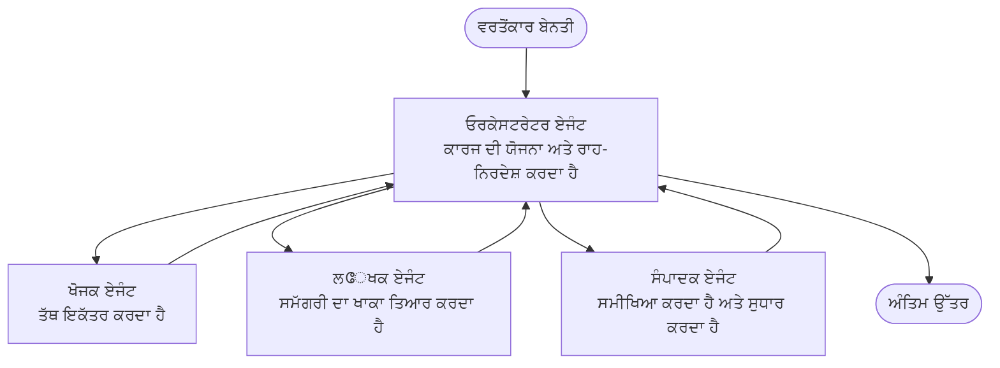

# ਮਲਟੀ-ਏਜੰਟ ਬੇਸਿਕਸ - ਆਪਣੀ ਪਹਿਲੀ ਸੰਯੋਜਿਤ ਏਆਈ ਪ੍ਰਣਾਲੀ ਡਿਪਲੋਏ ਕਰੋ

**ਅਧਿਆਇ ਨੈਵੀਗੇਸ਼ਨ:**
- **📚 ਕੋਰਸ ਹੋਮ**: [AZD For Beginners](../../README.md)
- **📖 ਮੌਜੂਦਾ ਅਧਿਆਇ**: ਚੈਪਟਰ 5 - ਮਲਟੀ-ਏਜੰਟ ਏਆਈ ਹੱਲ
- **⬅️ ਪਿਛਲਾ**: [Chapter 4: Infrastructure](../chapter-04-infrastructure/README.md)
- **➡️ ਅਗਲਾ**: [Coordination Patterns](../chapter-06-pre-deployment/coordination-patterns.md)

> ਜੂਨ 2026 ਵਿੱਚ `azd 1.25.6` ਨਾਲ ਵੈਰੀਫਾਈ ਕੀਤਾ ਗਿਆ।

## ਪ੍ਰਸਤਾਵਨਾ

ਪਿਛਲੇ ਅਧਿਆਇਆਂ ਵਿੱਚ ਤੁਸੀਂ ਇੱਕ single ਐਪਲੀਕੇਸ਼ਨ ਡਿਪਲੋਏ ਕੀਤਾ—ਅਤੇ ਚੈਪਟਰ 2 ਵਿੱਚ ਤੁਸੀਂ ਇੱਕ ਹੀ ਏਜੰਟ ਡਿਪਲੋਏ ਕੀਤਾ। ਇਹ ਪਾਠ ਅਗਲਾ ਕਦਮ ਲੈਂਦਾ ਹੈ: ਇੱਕ **ਮਲਟੀ-ਏਜੰਟ ਸਿਸਟਮ** ਡਿਪਲੋਏ ਕਰਨਾ, ਜਿੱਥੇ ਕਈ ਵਿਸ਼ੇਸ਼ ਏਜੰਟ ਇਕੱਠੇ ਕੰਮ ਕਰਦੇ ਹਨ ਤਾਂ ਜੋ ਉਹ ਸਮੱਸਿਆ ਹੱਲ ਕੀਤੀ ਜਾ ਸਕੇ ਜੋ ਇੱਕ ਏਜੰਟ ਅਕੇਲਾ ਵਧੀਆ ਤਰੀਕੇ ਨਾਲ ਨਹੀਂ ਕਰ ਸਕਦਾ।

ਸ਼ੁਰੂਆਤ ਕਰਨ ਵਾਲਿਆਂ ਲਈ ਚੰਗੀ ਗੱਲ: **ਤੁਹਾਨੂੰ ਨਵੇਂ ਕਮਾਂਡਾਂ ਦੀ ਲੋੜ ਨਹੀਂ।** ਇੱਕ ਮਲਟੀ-ਏਜੰਟ ਹੱਲ ਫਿਰ ਵੀ ਇੱਕ azd ਪ੍ਰਾਜੈਕਟ ਹੁੰਦਾ ਹੈ। ਤੁਸੀਂ `azd init`, `azd up`, ਟੈਸਟ, ਅਤੇ `azd down` ਕਰੋਗੇ—ਉਹੀ ਵਰਕਫਲੋ ਜੋ ਤੁਸੀਂ ਪਹਿਲਾਂ ਹੀ ਜਾਣਦੇ ਹੋ। ਜੋ ਚੀਜ਼ ਬਦਲਦੀ ਹੈ, ਉਹ ਐਪ ਦੇ ਅੰਦਰ ਦਾ ਆਕਾਰ/ਅਕਾਰ ਹੈ।

## ਸਿੱਖਣ ਦੇ ਲਕਸ਼

ਇਸ ਪਾਠ ਦੇ ਅੰਤ ਤੱਕ, ਤੁਸੀਂ:
- ਸਮਝੋਂਗੇ ਕਿ "ਮਲਟੀ-ਏਜੰਟ" ਦਾ ਕੀ ਮਤਲਬ ਹੈ ਅਤੇ ਕਦੋਂ ਇਹ ਵਾਧੂ ਜਟਿਲਤਾ ਦੇ ਯੋਗ ਹੈ
- ਇੱਕ ਮਲਟੀ-ਏਜੰਟ ਸਿਸਟਮ ਵਿਚ ਆਮ ਭੂਮਿਕਾਵਾਂ (ਸੰਚਾਲਕ + ਮਾਹਿਰ) ਨੂੰ ਪਛਾਣ ਸਕੋਗੇ
- `azd up` ਨਾਲ ਇੱਕ ਅਸਲ, ਕੰਮ ਕਰਨ ਯੋਗ ਮਲਟੀ-ਏਜੰਟ ਟੈਮਪਲੇਟ ਡਿਪਲੋਏ ਕਰ ਸਕੋਗੇ
- ਸਮਝੋਂਗੇ ਕਿ ਕਿਹੜੇ Azure ਸਾਧਨ ਇੱਕ ਮਲਟੀ-ਏਜੰਟ ਐਪ ਨੂੰ ਬੈਕ ਕਰਦੇ ਹਨ
- ਜਾਣੋਗੇ ਕਿ ਹੱਲ ਨੂੰ ਕਿਸ ਤਰ੍ਹਾਂ ਸੁਰੱਖਿਅਤ ਤਰੀਕੇ ਨਾਲ ਸਾਰਥਕਤਾ, ਕਸਟਮਾਈਜ਼ ਅਤੇ teardown ਕਰਨਾ ਹੈ

## ਸਿੱਖਣ ਦੇ ਨਤੀਜੇ

ਇਸ ਪਾਠ ਨੂੰ ਪੂਰਾ ਕਰਨ ਤੋਂ ਬਾਅਦ, ਤੁਸੀਂ ਯੋਗ ਹੋਵੋਗੇ:
- ਇੱਕ single ਏਜੰਟ ਅਤੇ ਇੱਕ ਮਲਟੀ-ਏਜੰਟ ਸਿਸਟਮ ਵਿਚ ਫਰਕ ਵਿਆਖਿਆ ਕਰਨ ਲਈ
- ਟੂਲਾਂ ਦੇ ਨਾਲ ਇੱਕ single ਏਜੰਟ ਅਤੇ ਸੱਚਾ ਮਲਟੀ-ਏਜੰਟ ਡਿਜ਼ਾਈਨ ਵਿਚੋਂ ਚੋਣ ਕਰਨ ਲਈ
- azd ਨਾਲ ਇੱਕ ਮਲਟੀ-ਏਜੰਟ ਟੈਮਪਲੇਟ ਨੂੰ ਐਂਡ-ਟੂ-ਐਂਡ ਡਿਪਲੋਏ ਅਤੇ ਟੈਸਟ ਕਰਨ ਲਈ
- ਪਛਾਣ ਕਰਨ ਲਈ ਕਿ ਹਰ ਏਜੰਟ ਕਿੱਥੇ ਚੱਲਦਾ ਹੈ ਅਤੇ ਉਹ ਇਕ ਦੂਜੇ ਨਾਲ ਕਿਵੇਂ ਸੰਚਾਰ ਕਰਦੇ ਹਨ
- ਸਾਰੇ ਰਿਸੋਰਸਾਂ ਨੂੰ ਸਾਫ਼ ਕਰਨ ਲਈ ਤਾਂ ਕਿ ਲਗਾਤਾਰ ਖਰਚ ਨਾ ਹੋਵੇ

---

## ਮਲਟੀ-ਏਜੰਟ ਸਿਸਟਮ ਕੀ ਹੈ?

ਇੱਕ single ਏਆਈ ਏਜੰਟ ਇੱਕ ਮਾਡਲ ਹੈ ਜਿਸਦੇ ਕੋਲ ਨਿਰਦੇਸ਼ਾਂ ਦਾ ਇੱਕ ਸੈੱਟ ਹੁੰਦਾ ਹੈ ਅਤੇ (ਚਾਹੇ ਤਾਂ) ਕੁਝ ਟੂਲ ਹੁੰਦੇ ਹਨ। ਇਹ ਧਿਆਨ ਕੇਂਦਰਿਤ ਟਾਸਕਾਂ ਲਈ ਚੰਗਾ ਹੁੰਦਾ ਹੈ। ਪਰ ਜਿਵੇਂ ਜਦੋਂ ਟਾਸਕ ਵਧਦਾ ਹੈ—ਖੋਜ, ਫਿਰ ਲਿਖਣਾ, ਫਿਰ ਸੋਧ, ਫਿਰ ਤਥਿਆ-ਜਾਂਚ—ਸਭ ਕੁਝ ਇੱਕ ਪ੍ਰਿੰਪਟ ਵਿੱਚ ਪੈਕ ਕਰਨਾ ਏਜੰਟ ਨੂੰ ਹੌਲਾ, ਘੱਟ ਭਰੋਸੇਯੋਗ ਅਤੇ ਡੀਬੱਗ ਕਰਨ ਵਿੱਚ ਮੁਸ਼ਕਲ ਬਣਾਉਂਦਾ ਹੈ।

ਇੱਕ **ਮਲਟੀ-ਏਜੰਟ ਸਿਸਟਮ** ਕੰਮ ਨੂੰ ਮਾਹਿਰਾਂ ਵਿੱਚ ਵੰਡਦਾ ਹੈ ਜੋ ਹਰ ਇੱਕ ਇੱਕ ਕੰਮ ਨੂੰ ਚੰਗੀ ਤਰ੍ਹਾਂ ਕਰਦੇ ਹਨ, ਅਤੇ ਇੱਕ ਸੰਚਾਲਕ ਦੁਆਰਾ ਕੋਆਰਡੀਨੇਟ ਕੀਤਾ ਜਾਂਦਾ ਹੈ:



### ਉਹ ਦੋ ਭੂਮਿਕਾਵਾਂ ਜੋ ਤੁਸੀਂ ਹਮੇਸ਼ਾ ਵੇਖੋਗੇ

| Role | Job | Example |
|------|-----|---------|
| **ਸੰਚਾਲਕ** | ਫੈਸਲਾ ਕਰਦਾ ਹੈ *ਅਗਲਾ ਕੀ ਹੋਵੇਗਾ* ਅਤੇ ਏਜੰਟਾਂ ਵਿਚਕਾਰ ਕੰਮ ਰੂਟ ਕਰਦਾ ਹੈ | "ਪਹਿਲਾਂ ਖੋਜ, ਫਿਰ ਲਿਖੋ, ਫਿਰ ਸੋਧ" |
| **ਮਾਹਿਰ** | ਇੱਕ ਕੇਂਦਰਿਤ ਕੰਮ ਕਰਦਾ ਹੈ ਅਤੇ ਨਤੀਜਾ ਵਾਪਸ ਕਰਦਾ ਹੈ | ਇੱਕ "ਖੋਜ ਕਰਨ ਵਾਲਾ" ਜੋ ਸਿਰਫ ਤੱਥ ਇਕੱਠੇ ਕਰਦਾ ਹੈ |

### ਕੀ ਤੁਹਾਨੂੰ ਵਾਕਈ ਕਈ ਏਜੰਟਾਂ ਦੀ ਲੋੜ ਹੈ?

ਸਧਾਰਨ ਤਰੀਕੇ ਨਾਲ ਸ਼ੁਰੂ ਕਰੋ। ਕੇਵਲ ਉਸ ਵੇਲੇ ਮਲਟੀ-ਏਜੰਟ ਦੀ ਓਰੀਆਂ ਕਰੋ ਜਦੋਂ ਹੇਠਾਂੋਂ ਕਿਸੇ ਇੱਕ ਨਾਲੋਂ ਸਹੀ ਹੋਵੇ:

- ✅ ਟਾਸਕ ਵਿੱਚ **ਵੱਖ-ਵੱਖ ਪੜਾਅ** ਹਨ ਜਿਨ੍ਹਾਂ ਨੂੰ ਵੱਖਰੇ ਨਿਰਦੇਸ਼ਾਂ ਦੀ ਲੋੜ ਹੈ (ਖੋਜ ਵਿਰੁੱਧ ਲਿਖਣਾ ਵਿਰੁੱਧ ਸਮੀਖਿਆ)
- ✅ ਤੁਸੀਂ ਚਾਹੁੰਦੇ ਹੋ ਕਿ ਮਾਹਿਰ **ਪੈਰੈਲਲ** ਤੌਰ 'ਤੇ ਚਲਣ ਤਾਂ ਕਿ ਸਮਾਂ ਬਚੇ
- ✅ ਵੱਖ-ਵੱਖ ਕਦਮਾਂ ਨੂੰ **ਵੱਖਰੇ ਟੂਲ ਜਾਂ ਡੇਟਾ ਸਰੋਤ** ਦੀ ਲੋੜ ਹੈ
- ✅ ਤੁਹਾਨੂੰ ਹਰ ਕਦਮ ਨੂੰ **ਅਜ਼ਾਦ ਤੌਰ 'ਤੇ ਟੈਸਟ ਅਤੇ ਡੀਬੱਗ ਕਰਨ ਯੋਗ** ਹੋਣਾ ਚਾਹੀਦਾ ਹੈ

ਜੇ ਤੁਹਾਡਾ ਟਾਸਕ ਇੱਕ ਸਿੰਗਲ ਪ੍ਰਸ਼ਨ-ਉੱਤਰ ਜਾਂ ਇੱਕ ਸਧਾਰਣ ਟੂਲ ਕਾਲ ਹੈ, ਤਾਂ ਇੱਕ **ਟੂਲਾਂ ਵਾਲਾ single ਏਜੰਟ** (ਚੈਪਟਰ 2) ਸਧਾਰਨ, ਸਸਤਾ, ਅਤੇ ਚਲਾਉਣ ਵਿੱਚ ਆਸਾਨ ਹੈ।

> **ਸ਼ੁਰੂਆਤੀ ਸੁਝਾਅ:** "ਜ਼ਿਆਦਾ ਏਜੰਟ" ਦਾ ਮਤਲਬ "ਚੰਗਾ" ਨਹੀਂ ਹੁੰਦਾ। ਹਰ ਏਜੰਟ ਲੈਟੈਂਸੀ, ਲਾਗਤ, ਅਤੇ ਨਿਗਰਾਨੀ ਦਾ ਇੱਕ ਨਵਾਂ ਪੱਖ ਜੋੜਦਾ ਹੈ। ਕੇਵਲ ਉਹਨਾਂ ਸਮੱਸਿਆਵਾਂ ਲਈ ਏਜੰਟ ਜੋੜੋ ਜਦੋਂ ਸਮੱਸਿਆ ਸਪਸ਼ਟ ਤੌਰ 'ਤੇ ਹਿੱਸਿਆਂ ਵਿੱਚ ਵੰਡਦੀ ਹੋਵੇ।

---

## ਏਜ਼ੂਰ 'ਤੇ ਮਲਟੀ-ਏਜੰਟ ਬਣਾਉਣ ਦੇ ਦੋ ਤਰੀਕੇ

| Approach | What it is | Best for |
|----------|-----------|----------|
| **Single agent + tools** | ਇੱਕ Foundry ਏਜੰਟ ਜੋ ਫੰਕਸ਼ਨਾਂ/ਟੂਲਾਂ ਨੂੰ ਕਾਲ ਕਰਦਾ ਹੈ | ਸਧਾਰਨ ਵਰਕਫਲੋ, ਸ਼ੁਰੂਆਤ ਲਈ |
| **Multiple coordinated agents** | ਕਈ ਏਜੰਟਾਂ ਨਾਲ ਇੱਕ ਸੰਚਾਲਕ | ਵੱਖ-ਵੱਖ ਪੜਾਅ, ਪੈਰੈਲਲ ਕੰਮ, ਵਿਸ਼ੇਸ਼ਤਾ |

ਇਹ ਪਾਠ ਦੂਜੇ ਤਰੀਕੇ 'ਤੇ ਧਿਆਨ ਕੇਂਦ੍ਰਿਤ ਕਰਦਾ ਹੈ ਜੋ ਕਿ ਇੱਕ **ਤਿਆਰ-ਕੀਆ ਗਿਆ ਟੈਮਪਲੇਟ** ਵਰਤਦਾ ਹੈ, ਤਾਂ ਜੋ ਤੁਸੀਂ ਆਪਣੇ ਆਪਣਾ ਬਣਾਉਣ ਤੋਂ ਪਹਿਲਾਂ ਇੱਕ ਅਸਲ ਮਲਟੀ-ਏਜੰਟ ਸਿਸਟਮ ਚੱਲਦੇ ਹੋਏ ਦੇਖ ਸਕੋ।

---

## ਪ੍ਰਯੋਗ: ਇੱਕ ਕੰਮ ਕਰਨ ਵਾਲਾ ਮਲਟੀ-ਏਜੰਟ ਐਪ ਡਿਪਲੋਏ ਕਰੋ

ਅਸੀਂ **Contoso Creative Writer** ਡਿਪਲੋਏ ਕਰਾਂਗੇ, ਜੋ ਕਿ ਇੱਕ ਅਧਿਕਾਰਿਕ Azure ਸੈਂਪਲ ਹੈ ਅਤੇ ਕਈ ਏਜੰਟ (ਖੋਜਕਾਰ, ਲੇਖਕ, ਸੰਪਾਦਕ) ਦੀ ਵਰਤੋਂ ਕਰਦਾ ਹੈ ਜੋ ਲੇਖ ਬਣਾਉਣ ਲਈ ਕੋਆਰਡੀਨੇਟ ਕੀਤੇ ਜਾਂਦੇ ਹਨ। ਇਹ ਪਹਿਲਾ ਮਲਟੀ-ਏਜੰਟ ਐਪ ਲਈ ਵਧੀਆ ਹੈ ਕਿਉਂਕਿ ਭੂਮਿਕਾਵਾਂ ਸਮਝਣ ਵਿੱਚ ਆਸਾਨ ਹਨ।

### ਕਦਮ 1: ਟੈਮਪਲੇਟ ਨੂੰ ਇਨਿਸ਼ਿਆਲਾਈਜ਼ ਕਰੋ

```bash
# ਇੱਕ ਵਰਕਿੰਗ ਫੋਲਡਰ ਬਣਾਓ
mkdir creative-writer && cd creative-writer

# ਆਧਿਕਾਰਿਕ ਮਲਟੀ-ਏਜੰਟ ਟੈਂਪਲੇਟ ਤੋਂ ਸ਼ੁਰੂ ਕਰੋ
azd init --template contoso-creative-writer
```

> ਜਦੋਂ ਵੀ ਹੋਰ ਮਲਟੀ-ਏਜੰਟ ਟੈਮਪਲੇਟ ਵੇਖਣੇ ਹੋਵੇ ਤਾਂ [Awesome AZD AI gallery](https://azure.github.io/awesome-azd/?tags=ai) 'ਚ ਬ੍ਰਾਉਜ਼ ਕਰੋ। ਹੋਰ ਸ਼ੁਰੂਆਤੀ-ਮਿੱਤਰ ਵਿਕਲਪਾਂ ਵਿੱਚ `get-started-with-ai-agents` ਅਤੇ `azure-ai-travel-agents` ਸ਼ਾਮਲ ਹਨ।

### ਕਦਮ 2: ਪ੍ਰਮਾਣਿਕਤਾ ਕਰੋ

```bash
# azd ਵਰਕਫਲੋਜ਼ ਲਈ ਲਾਜ਼ਮੀ
azd auth login
```

### ਕਦਮ 3: ਇੱਕ ਵਾਤਾਵਰਣ ਬਣਾਓ

```bash
azd env new dev
```

### ਕਦਮ 4: ਪਹਿਲਾਂ ਪ੍ਰੀਵਿਊ, ਫਿਰ ਡਿਪਲੋਏ ਕਰੋ

```bash
# ਕੋਈ ਵੀ ਖਰਚ ਕਰਨ ਤੋਂ ਪਹਿਲਾਂ ਦੇਖੋ ਕਿ ਕੀ ਬਣਾਇਆ ਜਾਵੇਗਾ (ਸਿਫ਼ਾਰਸ਼ ਕੀਤੀ ਜਾਂਦੀ ਹੈ)
azd provision --preview

# ਇੱਕ ਹੀ ਕਦਮ ਵਿੱਚ ਬੁਨਿਆਦੀ ਢਾਂਚਾ ਪ੍ਰਦਾਨ ਕਰੋ ਅਤੇ ਸਾਰੇ ਏਜੰਟ ਤਾਇਨਾਤ ਕਰੋ
azd up
```

`azd up` ਇੱਕ ਸਬਸਕ੍ਰਿਪਸ਼ਨ ਅਤੇ ਖੇਤਰ ਲਈ ਪ੍ਰਾਂਪਟ ਕਰੇਗਾ, ਫਿਰ Azure ਰਿਸੋਰਸ ਪ੍ਰੋਵਿਜ਼ਨ ਕਰੇਗਾ ਅਤੇ ਐਪਲੀਕੇਸ਼ਨ ਡਿਪਲੋਏ ਕਰੇਗਾ। ਏਆਈ ਡਿਪਲੋਏਮੈਂਟ ਇੱਕ ਸਧਾਰਨ ਵੈੱਬ ਐਪ ਨਾਲੋਂ ਵੱਧ ਸਮਾਂ ਲੈ ਸਕਦੇ ਹਨ—ਜੇ ਤੁਸੀਂ ਵੱਡੇ ਮਾਡਲ ਡਿਪਲੋਏ ਕਰ ਰਹੇ ਹੋ, ਤਾਂ ਤੁਸੀਂ ਡਿਪਲੋਇ ਟਾਈਮਆਉਟ ਵਧਾ ਸਕਦੇ ਹੋ:

```bash
azd deploy --timeout 1800
```

> **ਲਾਗਤ ਅਤੇ ਸਮਰੱਥਾ ਬਾਰੇ ਸੁਚੇਤਨਾ:** ਮਲਟੀ-ਏਜੰਟ ਐਪ ਏਆਈ ਮਾਡਲਾਂ ਨੂੰ ਡਿਪਲੋਏ ਕਰਦੇ ਹਨ ਜੋ ਕੋਟਾ ਵਰਤਦੇ ਹਨ ਅਤੇ ਖਰਚਾ ਲਾਗੂ ਹੁੰਦਾ ਹੈ। ਜੇ `azd up` ਮਾਡਲ ਕੋਟਾ 'ਤੇ ਫੇਲ ਹੋ ਜਾਂਦਾ ਹੈ, ਤਾਂ ਖੇਤਰ ਅਤੇ ਕੋਟਾ ਸੁਧਾਰਾਂ ਲਈ ਦੇਖੋ [AI Troubleshooting](../chapter-07-troubleshooting/ai-troubleshooting.md) ਅਤੇ ਚੈਪਟਰ 6 [Capacity Planning](../chapter-06-pre-deployment/capacity-planning.md)।

---

## ਤੁਸੀਂ ਜੋ ਡਿਪਲੋਏ ਕੀਤਾ ਹੈ ਉਹ ਸਮਝਣਾ

ਇੱਕ ਆਮ ਮਲਟੀ-ਏਜੰਟ ਐਪ ਐਸਾ ਕੁਝ Azure ਰਿਸੋਰਸ ਪ੍ਰੋਵਾਈਜ਼ਨ ਕਰਦੀ ਹੈ ਜੋ ਉੱਪਰ ਦਿੱਤੇ ਡਾਇਗ੍ਰਾਮ ਵਿਚਲੇ ਜਿੰਮੇਵਾਰੀਆਂ ਨਾਲ ਸਿੱਧਾ ਮੈਪ ਹੁੰਦੇ ਹਨ:

| Resource | Why it's there |
|----------|----------------|
| **Microsoft Foundry / Models** | ਹਰ ਏਜੰਟ ਵੱਲੋਂ ਵਰਤੇ ਜਾਣ ਵਾਲੇ ਭਾਸ਼ਾ ਮਾਡਲਾਂ ਦੀ ਹੋਸਟਿੰਗ |
| **Azure AI Search** | ਖੋਜਕਾਰ ਏਜੰਟ ਨੂੰ ਮੂਲਭੂਤ ਡੇਟਾ ਖੋਜਣ ਲਈ ਦਿੰਦਾ ਹੈ |
| **Container Apps** (or App Service) | ਸੰਚਾਲਕ ਅਤੇ ਏਜੰਟ ਕੋਡ ਹੋਸਟ ਕਰਦਾ ਹੈ |
| **Cosmos DB** (in some samples) | ਏਜੰਟਾਂ ਵਿਚਕਾਰ ਸਾਂਝੀ ਸਥਿਤੀ/ਮੇਮੋਰੀ ਸੰਭਾਲਦਾ ਹੈ |
| **Application Insights** | ਏਜੰਟਾਂ 'ਦੇ ਪਾਰ' ਬੇਨਤੀਆਂ ਨੂੰ ਟਰੇਸ ਕਰਦਾ ਹੈ ਤਾਂ ਕਿ ਤੁਸੀਂ ਫਲੋ ਨੂੰ ਡੀਬੱਗ ਕਰ ਸਕੋ |

### ਏਜੰਟ ਇਕ ਦੂਜੇ ਨਾਲ ਕਿਵੇਂ ਗੱਲ ਕਰਦੇ ਹਨ

ਜਿਆਦਾਤਰ azd ਮਲਟੀ-ਏਜੰਟ ਸੈਂਪਲਾਂ ਵਿੱਚ, **ਸੰਚਾਲਕ ਤੁਹਾਡੇ ਐਪਲੀਕੇਸ਼ਨ ਕੋਡ ਵਿੱਚ ਚੱਲਦਾ ਹੈ** (ਉਦਾਹਰਣ ਲਈ Semantic Kernel ਜਾਂ Microsoft Agent Framework ਵਰਗੇ ਫਰੇਮਵਰਕ ਦੀ ਵਰਤੋਂ ਕਰਕੇ)। ਸੰਚਾਲਕ ਹਰ ਮਾਹਿਰ ਏਜੰਟ ਨੂੰ ਬਾਰੀ-ਬਾਰੀ ਕਾਲ ਕਰਦਾ ਹੈ, ਨਤੀਜੇ ਪਾਸ ਕਰਦਾ ਹੈ, ਅਤੇ ਅੰਤਮ ਜਵਾਬ ਇਕਠਾ ਕਰਦਾ ਹੈ। ਏਜੰਟ ਸੰਦਰਭ ਸਾਂਝਾ ਕਰਨ ਲਈ ਹੇਠਾਂ ਦਿੱਤੇ ਤਰੀਕੇ ਵਰਤਦੇ ਹਨ:

- **ਫੰਕਸ਼ਨ/ਟੂਲ ਕਾਲਾਂ** — ਸੰਚਾਲਕ ਇੱਕ ਮਾਹਿਰ ਨੂੰ ਕਾਲ ਕਰਦਾ ਹੈ ਅਤੇ ਨਤੀਜਾ ਪ੍ਰਾਪਤ ਕਰਦਾ ਹੈ
- **ਸਾਂਝੀ ਮੈਮੋਰੀ** — ਇੱਕ ਡੇਟਾਬੇਸ (ਅਕਸਰ Cosmos DB) ਵਿੱਚ ਸਟੇਟ ਹੁੰਦਾ ਹੈ ਜਿਸ ਨੂੰ ਦੋਹਾਂ ਏਜੰਟ ਪੜ੍ਹ ਸਕਦੇ ਹਨ
- **ਸੁਨੇਹੇ/ਇਵੰਟਸ** — ਢੀਲੇ coupling ਲਈ, ਏਜੰਟ ਕਿਊ ਜਾਂ Service Bus ਰਾਹੀਂ ਸੰਚਾਰ ਕਰਦੇ ਹਨ

> **ਡੀਬੱਗਿੰਗ ਲਈ ਇਹ ਕਿਉਂ ਮਹੱਤਵਪੂਰਨ ਹੈ:** ਕਿਉਂਕਿ ਹਰ ਕਦਮ ਵੱਖਰਾ ਹੁੰਦਾ ਹੈ, Application Insights ਤੁਹਾਨੂੰ ਦਿਖਾਉਂਦਾ ਹੈ ਕਿ ਕਿਹੜਾ ਏਜੰਟ ਹੌਲਾ ਸੀ ਜਾਂ ਫੇਲ ਹੋਇਆ। ਇਹੀ ਮੱਖੀ ਕਾਰਨ ਹੈ ਕਿ ਕੰਮ ਨੂੰ ਏਜੰਟਾਂ ਵਿੱਚ ਵੰਡਿਆ ਜਾਂਦਾ ਹੈ।

---

## ਡਿਪਲੋਇਮੈਂਟ ਦੀ ਪੁਸ਼ਟੀ ਕਰੋ

ਸਿਸਟਮ ਸੱਚਮੁਚ ਕੰਮ ਕਰ ਰਿਹਾ ਹੈ ਜਾਂ ਨਹੀਂ, ਇਸਦੀ ਪੁਸ਼ਟੀ ਕਰੋ:

```bash
# ਤੈਨਾਤ ਕੀਤੇ ਗਏ ਐਂਡਪੌਇੰਟ ਦਿਖਾਓ
azd show

# ਐਪ ਦਾ ਨਿਗਰਾਨੀ ਡੈਸ਼ਬੋਰਡ ਖੋਲ੍ਹੋ
azd monitor

# ਜੇ ਕੁਝ ਠੀਕ ਨਹੀਂ ਲੱਗਦਾ ਤਾਂ ਲੋਗਾਂ ਨੂੰ ਟੇਲ ਕਰੋ
azd monitor --logs
```

ਫਿਰ `azd show` ਤੋਂ ਐਪ URL ਖੋਲ੍ਹੋ ਅਤੇ ਇੱਕ ਐਸੀ ਬੇਨਤੀ ਕੋਸ਼ਿਸ਼ ਕਰੋ ਜੋ ਸਾਰੇ ਏਜੰਟਾਂ ਨੂੰ ਵਰਤੇ (Creative Writer ਲਈ, ਇਸਨੂੰ ਕਿਸੇ ਵਿਸ਼ੇ 'ਤੇ ਇੱਕ ਛੋਟੀ ਲੇਖ ਲਿਖਣ ਲਈ ਕਹੋ)। Application Insights ਦੀ **transaction search** ਵਿੱਚ, ਤੁਸੀਂ ਦੇਖ ਸਕਦੇ ਹੋ ਕਿ ਬੇਨਤੀ ਖੋਜਕਾਰ, ਲੇਖਕ, ਅਤੇ ਸੰਪਾਦਕ ਕਦਮਾਂ ਵਿੱਚ ਕਿਵੇਂ ਫੈਨ ਆਊਟ ਹੋਈ।

**ਸਫਲਤਾ ਦੀਆਂ ਮਾਪਦੰਡ:**
- ✅ `azd show` ਇੱਕ ਪਹੁੰਚਯੋਗ ਐਂਡਪੋਇੰਟ ਲਿਸਟ ਕਰਦਾ ਹੈ
- ✅ ਇੱਕ ਬੇਨਤੀ ਇੱਕ ਐਸਾ ਨਤੀਜਾ ਪੈਦਾ ਕਰਦੀ ਹੈ ਜੋ ਸਪਸ਼ਟ ਤੌਰ 'ਤੇ ਕਈ ਪੜਾਅਾਂ ਤੋਂ ਗੁਜ਼ਰੀ ਹੋਈ ਹੈ
- ✅ Application Insights ਇੱਕ ਤੋਂ ਵੱਧ ਏਜੰਟ ਕਦਮਾਂ ਲਈ ਟਰੇਸ ਦਿਖਾਉਂਦਾ ਹੈ

---

## ਕਸਟਮਾਈਜ਼: ਇੱਕ ਏਜੰਟ ਜੋੜੋ ਜਾਂ ਸੰਸ਼ੋਧਨ ਕਰੋ

ਕਿਉਂਕਿ ਹਰ ਏਜੰਟ ਸਿਰਫ ਨਿਰਦੇਸ਼ਾਂ ਅਤੇ ਟੂਲਾਂ ਹਨ, ਇਸ ਨੂੰ ਕਸਟਮਾਈਜ਼ ਕਰਨਾ ਪਹੁੰਚਯੋਗ ਹੈ:

1. ਟੈਮਪਲੇਟ ਵਿੱਚ ਏਜੰਟ ਪਰਿਭਾਸ਼ਾਵਾਂ ਲੱਭੋ (ਅਕਸਰ `prompts/`, `agents/`, ਜਾਂ `*.prompty` ਫਾਈਲਾਂ ਦਾ ਸੈੱਟ).
2. ਇੱਕ ਏਜੰਟ ਦੇ ਨਿਰਦੇਸ਼ ਟਿਊਨ ਕਰੋ — ਉਦਾਹਰਣ ਲਈ, ਸੰਪਾਦਕ ਏਜੰਟ ਨੂੰ ਇੱਕ ਨਿਰਧਾਰਤ ਸੁਰੀਲਾ ਟੋਨ ਜਾਂ ਸ਼ਬਦ ਗਿਣਤੀ ਲਾਗੂ ਕਰਨ ਲਈ ਦੱਸੋ।
3. ਸਿਰਫ ਕੋਡ ਨੂੰ ਫਿਰ ਡਿਪਲੋਏ ਕਰੋ (ਇਨਫਰਾਸਟ੍ਰਕਚਰ ਬਦਲਿਆ ਨਹੀਂ ਜਾਂਦਾ):

   ```bash
   azd deploy
   ```

ਆਪਣੇ *ਆਪਣੇ* ਮੈਨਿਫੈਸਟ ਤੋਂ ਏਜੰਟ ਬਣਾਉਣ ਲਈ ਅਤੇ ਉਸ ਦਾ ਪੂਰਾ ਲਾਈਫਸਾਈਕਲ ਵਰਤਣ ਲਈ, ਏਜੰਟ ਐਕਸਟੈਂਸ਼ਨ ਅਤੇ ਉਸਦੇ ਪੂਰੇ ਲਾਈਫਸਾਈਕਲ ਦੀ ਵਰਤੋਂ ਕਰੋ:

```bash
azd extension install azure.ai.agents
azd ai agent init -m agent-manifest.yaml
azd up
azd ai agent invoke      # ਟੈਸਟ, ਜਵਾਬ ਦੇ ਸਮੇਂ ਨਾਲ
```

ਮੁਕੰਮਲ ਏਜੰਟ ਲਾਈਫਸਾਈਕਲ (`invoke`, `eval generate`, `optimize`, `delete`) ਲਈ ਦੇਖੋ [Chapter 2: Agents](../chapter-02-ai-development/agents.md) ਅਤੇ [AZD AI CLI reference](../chapter-08-production/production-ai-practices.md#azd-ai-cli-commands-and-extensions)।

---

## ਸਾਫ਼-ਸਫਾਈ

ਮਲਟੀ-ਏਜੰਟ ਐਪ ਕਈ ਬਿੱਲ-ਯੋਗ ਸਰਵਿਸਸ ਚਲਾਉਂਦੇ ਹਨ। ਜਦੋਂ ਤੁਸੀਂ ਖਤਮ ਕਰ ਲਓ ਤਾਂ ਸਭ ਕੁਝ ਤੋੜੋ:

```bash
azd down --force --purge
```

`--purge` ਫਲੈਗ ਨਰਮ-ਡਿਲੀਟ ਕੀਤੀਆਂ ਏਆਈ ਰਿਸੋਰਸਾਂ (ਜਿਵੇਂ Foundry/Azure AI Services ਅਕਾਊਂਟ) ਨੂੰ ਵੀ ਹਟਾ ਦਿੰਦਾ ਹੈ ਤਾਂ ਜੋ ਉਹ ਭਵਿੱਖ ਦੀ ਰੀ-ਡਿਪਲੋਏ ਨੂੰ ਬਲਾਕ ਨਾ ਕਰਨ ਜਾਂ ਲਗਾਤਾਰ ਖਰਚ ਨਾ ਕਰਦੇ ਰਹਿਣ।

---

## ਪ੍ਰੋਡakਸ਼ਨ ਮਲਟੀ-ਏਜੰਟ ਸਿਸਟਮ ਬਾਰੇ ਇੱਕ ਨੋਟ

ਇਸ ਰਿਪੋ ਵਿੱਚ [Retail Multi-Agent Solution](../../examples/retail-scenario.md) ਇੱਕ **ਆਰਕੀਟੈਕਚਰ ਬਲੂਪ੍ਰਿੰਟ** ਹੈ, ਨਾ ਕਿ ਇੱਕ ਇੱਕ-ਕਮਾਂਡ ਟੈਮਪਲੇਟ—ਇਹ ਦਸਤਾਵੇਜ਼ ਕਰਦਾ ਹੈ ਕਿ ਪ੍ਰੋਡakਸ਼ਨ ਰਿਟੇਲ ਸਿਸਟਮ ਕਿਵੇਂ ਬਣਾਇਆ ਜਾਵੇਗਾ (ਅਤੇ ਸਪਸ਼ਟ ਤੌਰ 'ਤੇ ਦੱਸਿਆ ਗਿਆ ਹੈ ਕਿ ਪੂਰਾ ਨਿਰਮਾਣ ਇਕ ਮਹੱਤਵਪੂਰਨ ਕੋਸ਼ਿਸ਼ ਹੈ)। ਇਸਨੂੰ ਇੱਕ ਡਿਜ਼ਾਈਨ ਰੈਫਰੰਸ ਵਜੋਂ ਵਰਤੋਂ ਬਾਅਦ ਵਿੱਚ ਜਦੋਂ ਤੁਸੀਂ ਇੱਥੇ ਇੱਕ ਕੰਮ ਕਰਨ ਯੋਗ ਸੈਂਪਲ ਡਿਪਲੋਏ ਕਰ ਚੁکے ਹੋ। ਪ੍ਰੋਡakਸ਼ਨ ਚਿੰਤਾਵਾਂ (ਰੋਬਸਟੀ, ਲਾਗਤ, ਮਾਨੀਟਰਿੰਗ, ਗਵਰਨੈਂਸ) ਲਈ ਜਾਰੀ ਰਹੋ [Chapter 8: Production AI Practices](../chapter-08-production/production-ai-practices.md) ਨੂੰ।

---

## ਸਾਰ

- ਇੱਕ ਮਲਟੀ-ਏਜੰਟ ਸਿਸਟਮ ਕੰਮ ਨੂੰ ਮਾਹਿਰਾਂ ਵਿੱਚ ਵੰਡਦਾ ਹੈ ਜੋ ਇੱਕ ਸੰਚਾਲਕ ਦੁਆਰਾ ਕੋਆਰਡੀਨੇਟ ਕੀਤੇ ਜਾਂਦੇ ਹਨ।
- ਕੇਵਲ ਉਸ ਵੇਲੇ ਇਸਦਾ ਉਪਯੋਗ ਕਰੋ ਜਦੋਂ ਟਾਸਕ ਵਿੱਚ ਵੱਖ-ਵੱਖ ਪੜਾਅ, ਪੈਰੈਲਲਿਜ਼ਮ, ਜਾਂ ਹਰ ਕਦਮ ਲਈ ਵੱਖਰੇ ਟੂਲ ਲੋੜੀਂਦੇ ਹੋਣ—ਨਹੀਂ ਤਾਂ ਇੱਕ single ਏਜੰਟ ਨੂੰ ਤਰਜੀਹ ਦਿਓ।
- azd ਵਰਕਫਲੋ ਅਣਬਦਲ ਹੈ: `azd init` → `azd up` → ਟੈਸਟ → `azd down`।
- `contoso-creative-writer` ਵਰਗਾ ਇੱਕ ਅਸਲੀ ਟੈਮਪਲੇਟ ਤੁਹਾਨੂੰ ਅੱਜ ਇੱਕ ਕੰਮ ਕਰਨ ਵਾਲਾ ਮਲਟੀ-ਏਜੰਟ ਐਪ ਵੇਖਣ ਅਤੇ ਕਸਟਮਾਈਜ਼ ਕਰਨ ਦਿੰਦਾ ਹੈ।
- ਏਜੰਟਾਂ 'ਦੇ ਪਾਰ Application Insights ਟਰੇਸਿੰਗ ਮਲਟੀ-ਏਜੰਟ ਡਿਜ਼ਾਈਨ ਦੇ ਸਭ ਤੋਂ ਵੱਡੇ ਪ੍ਰਯੋਗੀ ਲਾਭਾਂ ਵਿੱਚੋਂ ਇੱਕ ਹੈ।

---

## 🔗 ਨੈਵੀਗੇਸ਼ਨ

| Direction | Lesson |
|-----------|--------|
| **ਪਿਛਲਾ** | [Chapter 4: Infrastructure](../chapter-04-infrastructure/README.md) |
| **ਅਗਲਾ** | [Coordination Patterns](../chapter-06-pre-deployment/coordination-patterns.md) |

## 📖 ਸੰਬੰਧਿਤ ਸਰੋਤ

- [AI Agents Guide](../chapter-02-ai-development/agents.md)
- [Coordination Patterns](../chapter-06-pre-deployment/coordination-patterns.md)
- [Production AI Practices](../chapter-08-production/production-ai-practices.md)
- [AI Troubleshooting](../chapter-07-troubleshooting/ai-troubleshooting.md)

---

<!-- CO-OP TRANSLATOR DISCLAIMER START -->
**ਅਸਵੀਕਾਰੋਪਣ**:
ਇਸ ਦਸਤਾਵੇਜ਼ ਦਾ ਅਨੁਵਾਦ ਏਆਈ ਅਨੁਵਾਦ ਸੇਵਾ [Co-op Translator](https://github.com/Azure/co-op-translator) ਦੀ ਵਰਤੋਂ ਕਰਕੇ ਕੀਤਾ ਗਿਆ ਹੈ। ਜਦੋਂ ਕਿ ਅਸੀਂ ਸਹੀਤਾਵਾਂ ਲਈ ਯਤਨਸ਼ੀਲ ਹਾਂ, ਕਿਰਪਾ ਕਰਕੇ ਧਿਆਨ ਰੱਖੋ ਕਿ ਸਵੈਚਾਲਿਤ ਅਨੁਵਾਦਾਂ ਵਿੱਚ ਗਲਤੀਆਂ ਜਾਂ ਅਸਮੱਤਿਆਵਾਂ ਹੋ ਸਕਦੀਆਂ ਹਨ। ਮੂਲ ਦਸਤਾਵੇਜ਼ ਆਪਣੀ ਮੂਲ ਭਾਸ਼ਾ ਵਿੱਚ ਅਧਿਕਾਰਕ ਸਰੋਤ ਮੰਨਿਆ ਜਾਣਾ ਚਾਹੀਦਾ ਹੈ। ਜਰੂਰੀ ਜਾਣਕਾਰੀ ਲਈ, ਪੇਸ਼ੇਵਰ ਮਨੁੱਖੀ ਅਨੁਵਾਦ ਦੀ ਸਿਫ਼ਾਰਸ਼ ਕੀਤੀ ਜਾਂਦੀ ਹੈ। ਅਸੀਂ ਇਸ ਅਨੁਵਾਦ ਦੇ ਉਪਯੋਗ ਤੋਂ ਪੈਦਾ ਹੋਣ ਵਾਲੀਆਂ ਕਿਸੇ ਵੀ ਗਲਤਫਹਿਮੀਆਂ ਜਾਂ ਗਲਤ ਵਿਆਖਿਆਵਾਂ ਲਈ ਜਵਾਬਦੇਹ ਨਹੀਂ ਹਾਂ।
<!-- CO-OP TRANSLATOR DISCLAIMER END -->