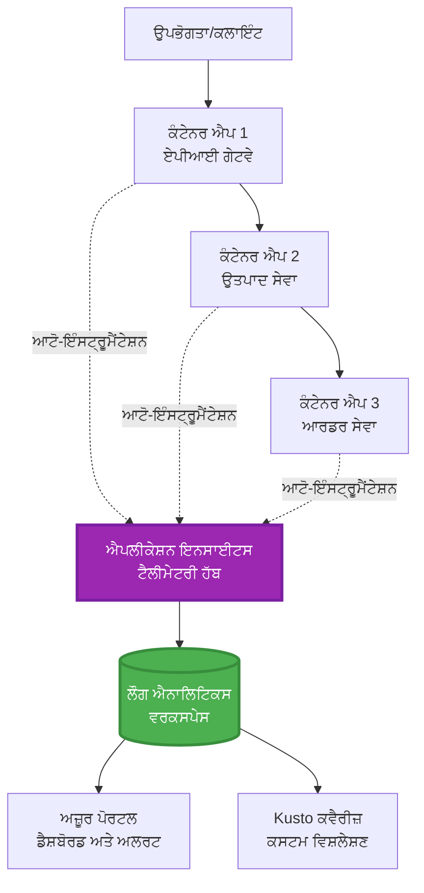
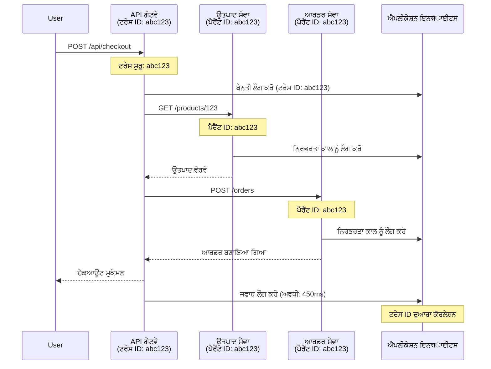

# Application Insights ਇੰਟੀਗ੍ਰੇਸ਼ਨ AZD ਨਾਲ

⏱️ **ਅੰਦਾਜ਼ਾ ਸਮਾਂ**: 40-50 ਮਿੰਟ | 💰 **ਲਾਗਤ ਪ੍ਰਭਾਵ**: ~$5-15/ਮਹੀਨਾ | ⭐ **ਕਠਨਾਈ**: ਮਧਿਅਮ

**📚 ਸਿੱਖਣ ਦਾ ਰਾਹ:**
- ← ਪਹਿਲਾਂ: [Preflight Checks](preflight-checks.md) - ਪ੍ਰੀ-ਡਿਪਲੋਇਮੈਂਟ ਵੈਰੀਫਿਕੇਸ਼ਨ
- 🎯 **ਤੁਸੀਂ ਇਥੇ ਹੋ**: Application Insights ਇੰਟੀਗ੍ਰੇਸ਼ਨ (ਮਾਨੀਟਰਨਗ, ਟੈਲੀਮੇਟਰੀ, ਡੀਬੱਗਿੰਗ)
- → ਅੱਗੇ: [Deployment Guide](../chapter-04-infrastructure/deployment-guide.md) - Azure 'ਤੇ ਡਿਪਲੋਯ
- 🏠 [Course Home](../../README.md)

---

## ਤੁਸੀਂ ਕੀ ਸਿਖੋਗੇ

ਇਸ ਪਾਠ ਨੂੰ ਪੂਰਾ ਕਰਕੇ, ਤੁਸੀਂ:
- AZD ਪ੍ਰੋਜੈਕਟਸ ਵਿੱਚ **Application Insights** ਆਟੋਮੈਟਿਕ ਤੌਰ 'ਤੇ ਇੰਟੀਗ੍ਰੇਟ ਕਰਨਾ
- ਮਾਇਕਰੋਸਰਵਿਸز ਲਈ **ਡਿਸਟ੍ਰਿਬਿਊਟਡ ਟ੍ਰੇਸਿੰਗ** ਕੌਂਫਿਗਰ ਕਰਨਾ
- **ਕਸਟਮ ਟੈਲੀਮੇਟਰੀ** (ਮੇਟਰਿਕਸ, ਇਵੈਂਟ, ਡਿਪੈਂਡੈਂਸੀਜ਼) ਲਾਗੂ ਕਰਨਾ
- ਰੀਅਲ-ਟਾਈਮ ਨਿਰੀਖਣ ਲਈ **ਲਾਈਵ ਮੈਟਰਿਕਸ** ਸੈੱਟ ਕਰਨਾ
- AZD ਡਿਪਲੋਇਮੈਂਟ ਤੋਂ **ਅਲਰਟਸ ਅਤੇ ਡੈਸ਼ਬੋਰਡ** ਬਣਾਉਣਾ
- **ਟੈਲੀਮੇਟਰੀ ਕਵੈਰੀਜ਼** ਨਾਲ ਪ੍ਰੋਡਕਸ਼ਨ ਮੁੱਦਿਆਂ ਨੂੰ ਡੀਬੱਗ ਕਰਨਾ
- **ਲਾਗਤ ਅਤੇ ਸੈਂਪਲਿੰਗ** ਰਣਨੀਤੀਆਂ ਨੂੰ ਅਪਟੀਮਾਈਜ਼ ਕਰਨਾ
- **AI/LLM ਐਪਲੀਕੇਸ਼ਨਜ਼** ਨੂੰ ਮਾਨਟਰ ਕਰਨਾ (ਟੋਕਨ, ਲੈਟੈਂਸੀ, ਲਾਗਤ)

## AZD ਨਾਲ Application Insights ਕਿਉਂ ਮਹੱਤਵਪੂਰਨ ਹੈ

### ਚੁਣੌਤੀ: ਪ੍ਰੋਡਕਸ਼ਨ ਨਿਰੀਖਣਯੋਗਤਾ

**Application Insights ਬਿਨਾਂ:**
```
❌ No visibility into production behavior
❌ Manual log aggregation across services
❌ Reactive debugging (wait for customer complaints)
❌ No performance metrics
❌ Cannot trace requests across services
❌ Unknown failure rates and bottlenecks
```

**Application Insights + AZD ਨਾਲ:**
```
✅ Automatic telemetry collection
✅ Centralized logs from all services
✅ Proactive issue detection
✅ End-to-end request tracing
✅ Performance metrics and insights
✅ Real-time dashboards
✅ AZD provisions everything automatically
```

**ਉਪਮਾ**: Application Insights ਤੁਹਾਡੇ ਐਪਲੀਕੇਸ਼ਨ ਲਈ "ਬਲੈਕ ਬਾਕਸ" ਫਲਾਈਟ ਰਿਕਾਰਡਰ + ਕਾਕਪਿਟ ਡੈਸ਼ਬੋਰਡ ਵਰਗਾ ਹੈ। ਤੁਸੀਂ ਰੀਅਲ-ਟਾਈਮ ਵਿੱਚ ਸਭ ਕੁਝ ਵੇਖਦੇ ਹੋ ਅਤੇ ਕਿਸੇ ਵੀ ਘਟਨਾ ਨੂੰ ਰੀਪਲੇ ਕਰ ਸਕਦੇ ਹੋ।

---

## ਆਰਕੀਟੈਕਚਰ ਓਵਰਵਿਊ

### AZD ਆਰਕੀਟੈਕਚਰ ਵਿੱਚ Application Insights


### ਕੀ-ਕੀ ਆਟੋਮੈਟਿਕ ਤੌਰ 'ਤੇ ਨਿਰੀਖਣ ਕੀਤਾ ਜਾਂਦਾ ਹੈ

| ਟੈਲੀਮੇਟਰੀ ਕਿਸਮ | ਇਹ ਕੀ ਕੈਪਚਰ ਕਰਦਾ ਹੈ | ਉਪਯੋਗ ਮਾਮਲਾ |
|----------------|------------------|----------|
| **Requests** | HTTP ਬੇਨਤੀਆਂ, ਸਥਿਤੀ ਕੋਡ, ਅਵਧੀ | API ਕਾਰਗੁਜ਼ਾਰੀ ਨਿਰੀਖਣ |
| **Dependencies** | ਬਾਹਰੀ ਕਾਲਾਂ (DB, APIs, storage) | ਬੋਤਲਨੇਕ ਪਛਾਣਨਾ |
| **Exceptions** | ਅਣਹੈਂਡਲ ਕੀਤੀਆਂ ਗਲਤੀਆਂ ਸਟੈਕ ਟਰੇਸਾਂ ਨਾਲ | ਫੇਲਿਊਰ ਡੀਬੱਗਿੰਗ |
| **Custom Events** | ਬਿਜ਼ਨਸ ਇਵੈਂਟ (signup, purchase) | ਐਨਾਲਿਟਿਕਸ ਅਤੇ ਫਨਲਜ਼ |
| **Metrics** | ਪਰਫਾਰਮੈਂਸ ਕਾਊਂਟਰਨਾਂ, ਕਸਟਮ ਮੈਟਰਿਕਸ | ਕੈਪੈਸਿਟੀ ਯੋਜਨਾ |
| **Traces** | ਗੰਭੀਰਤਾ ਦੇ ਨਾਲ ਲੌਗ ਸੁਨੇਹੇ | ਡੀਬੱਗਿੰਗ ਅਤੇ ਆਡੀਟਿੰਗ |
| **Availability** | ਅਪਟਾਈਮ ਅਤੇ ਜਵਾਬ ਸਮੇਂ ਟੈਸਟ | SLA ਨਿਰੀਖਣ |

---

## ਪਹਿਲਾਂ ਦੀਆਂ ਲੋੜਾਂ

### ਜ਼ਰੂਰੀ ਟੂਲ

```bash
# Azure Developer CLI ਦੀ ਜਾਂਚ ਕਰੋ
azd version
# ✅ ਉਮੀਦ ਕੀਤੀ ਜਾਂਦੀ: azd ਵਰਜਨ 1.0.0 ਜਾਂ ਵੱਧ

# Azure CLI ਦੀ ਜਾਂਚ ਕਰੋ
az --version
# ✅ ਉਮੀਦ ਕੀਤੀ ਜਾਂਦੀ: azure-cli ਵਰਜਨ 2.50.0 ਜਾਂ ਵੱਧ
```

### Azure ਦੀਆਂ ਲੋੜਾਂ

- ਸਰਗਰਮ Azure subscription
- ਨਿਰਮਾਣ ਕਰਨ ਲਈ ਅਨੁਮਤੀਆਂ:
  - Application Insights resources
  - Log Analytics workspaces
  - Container Apps
  - Resource groups

### ਗਿਆਨ ਲੋੜ

ਤੁਹਾਨੂੰ ਇਹ ਮੁਕੰਮਲ ਕਰ ਲਿਆ ਹੋਣਾ ਚਾਹੀਦਾ ਹੈ:
- [AZD Basics](../chapter-01-foundation/azd-basics.md) - AZD ਮੁੱਢਲੇ ਕਾਨਸੈਪਟ
- [Configuration](../chapter-03-configuration/configuration.md) - ਇਨਵਾਇਰਨਮੈਂਟ ਸੈਟਅਪ
- [First Project](../chapter-01-foundation/first-project.md) - ਮੁੱਢਲਾ ਡਿਪਲੋਇਮੈਂਟ

---

## ਪਾਠ 1: AZD ਨਾਲ ਆਟੋਮੈਟਿਕ Application Insights

### AZD ਕਿਵੇਂ Application Insights ਪ੍ਰੋਵਾਈਜ਼ਨ ਕਰਦਾ ਹੈ

AZD ਤੁਹਾਡੇ ਡਿਪਲੋਇਮੈਂਟ ਵੇਲੇ ਆਟੋਮੈਟਿਕ ਤੌਰ 'ਤੇ Application Insights ਬਣਾਉਂਦਾ ਅਤੇ ਕੌਂਫਿਗਰ ਕਰਦਾ ਹੈ। ਆਓ ਦੇਖੀਏ ਇਹ ਕਿਵੇਂ ਕੰਮ ਕਰਦਾ ਹੈ।

### ਪ੍ਰੋਜੈਕਟ ਢਾਂਚਾ

```
monitored-app/
├── azure.yaml                     # AZD configuration
├── infra/
│   ├── main.bicep                # Main infrastructure
│   ├── core/
│   │   └── monitoring.bicep      # Application Insights + Log Analytics
│   └── app/
│       └── api.bicep             # Container App with monitoring
└── src/
    ├── app.py                    # Application with telemetry
    ├── requirements.txt
    └── Dockerfile
```

---

### ਕਦਮ 1: AZD ਸੈਟ ਕਰੋ (azure.yaml)

**ਫ਼ਾਇਲ: `azure.yaml`**

```yaml
name: monitored-app
metadata:
  template: monitored-app@1.0.0

services:
  api:
    project: ./src
    language: python
    host: containerapp

# AZD automatically provisions monitoring!
```

**ਬਸ ਇਹੀ!** AZD ਮੂਲਭੂਤ ਮਾਨੀਟਰਨਗ ਲਈ ਡਿਫਾਲਟ ਤੌਰ 'ਤੇ Application Insights ਬਣਾਏਗਾ। ਕੋਈ ਵਾਧੂ ਕੌਂਫਿਗਰੇਸ਼ਨ ਜ਼ਰੂਰੀ ਨਹੀਂ।

---

### ਕਦਮ 2: ਮਾਨੀਟਰਨਗ ਢਾਂਚਾ (Bicep)

**ਫ਼ਾਇਲ: `infra/core/monitoring.bicep`**

```bicep
param logAnalyticsName string
param applicationInsightsName string
param location string = resourceGroup().location
param tags object = {}

// Log Analytics Workspace (required for Application Insights)
resource logAnalytics 'Microsoft.OperationalInsights/workspaces@2022-10-01' = {
  name: logAnalyticsName
  location: location
  tags: tags
  properties: {
    sku: {
      name: 'PerGB2018'  // Pay-as-you-go pricing
    }
    retentionInDays: 30  // Keep logs for 30 days
    features: {
      enableLogAccessUsingOnlyResourcePermissions: true
    }
  }
}

// Application Insights
resource applicationInsights 'Microsoft.Insights/components@2020-02-02' = {
  name: applicationInsightsName
  location: location
  tags: tags
  kind: 'web'
  properties: {
    Application_Type: 'web'
    WorkspaceResourceId: logAnalytics.id
    IngestionMode: 'LogAnalytics'
    publicNetworkAccessForIngestion: 'Enabled'
    publicNetworkAccessForQuery: 'Enabled'
  }
}

// Outputs for Container Apps
output logAnalyticsWorkspaceId string = logAnalytics.id
output logAnalyticsWorkspaceName string = logAnalytics.name
output applicationInsightsConnectionString string = applicationInsights.properties.ConnectionString
output applicationInsightsInstrumentationKey string = applicationInsights.properties.InstrumentationKey
output applicationInsightsName string = applicationInsights.name
```

---

### ਕਦਮ 3: Container App ਨੂੰ Application Insights ਨਾਲ ਜੋੜੋ

**ਫ਼ਾਇਲ: `infra/app/api.bicep`**

```bicep
param name string
param location string
param tags object = {}
param containerAppsEnvironmentName string
param applicationInsightsConnectionString string

resource containerApp 'Microsoft.App/containerApps@2023-05-01' = {
  name: name
  location: location
  tags: tags
  properties: {
    configuration: {
      ingress: {
        external: true
        targetPort: 8000
      }
      secrets: [
        {
          name: 'appinsights-connection-string'
          value: applicationInsightsConnectionString
        }
      ]
    }
    template: {
      containers: [
        {
          name: 'api'
          image: 'myregistry.azurecr.io/api:latest'
          resources: {
            cpu: json('0.5')
            memory: '1Gi'
          }
          env: [
            {
              name: 'APPLICATIONINSIGHTS_CONNECTION_STRING'
              secretRef: 'appinsights-connection-string'
            }
            {
              name: 'APPLICATIONINSIGHTS_ENABLED'
              value: 'true'
            }
          ]
        }
      ]
    }
  }
}

output uri string = 'https://${containerApp.properties.configuration.ingress.fqdn}'
```

---

### ਕਦਮ 4: ਟੈਲੀਮੇਟਰੀ ਨਾਲ ਅਪਲੀਕੇਸ਼ਨ ਕੋਡ

**ਫ਼ਾਇਲ: `src/app.py`**

```python
from flask import Flask, request, jsonify
from opencensus.ext.azure.log_exporter import AzureLogHandler
from opencensus.ext.azure.trace_exporter import AzureExporter
from opencensus.ext.flask.flask_middleware import FlaskMiddleware
from opencensus.trace.samplers import ProbabilitySampler
import logging
import os

app = Flask(__name__)

# Application Insights ਕਨੈਕਸ਼ਨ ਸਟ੍ਰਿੰਗ ਪ੍ਰਾਪਤ ਕਰੋ
connection_string = os.environ.get('APPLICATIONINSIGHTS_CONNECTION_STRING')

if connection_string:
    # ਵੰਡੇ ਹੋਏ ਟਰੇਸਿੰਗ ਨੂੰ ਕਨਫਿਗਰ ਕਰੋ
    middleware = FlaskMiddleware(
        app,
        exporter=AzureExporter(connection_string=connection_string),
        sampler=ProbabilitySampler(rate=1.0)  # ਡਿਵ ਲਈ 100% ਸੈਂਪਲਿੰਗ
    )
    
    # ਲੌਗਿੰਗ ਨੂੰ ਕਨਫਿਗਰ ਕਰੋ
    logger = logging.getLogger(__name__)
    logger.addHandler(AzureLogHandler(connection_string=connection_string))
    logger.setLevel(logging.INFO)
    
    print("✅ Application Insights enabled")
else:
    logger = logging.getLogger(__name__)
    logger.setLevel(logging.INFO)
    print("⚠️ Application Insights not configured")

@app.route('/health')
def health():
    logger.info('Health check endpoint called')
    return jsonify({'status': 'healthy', 'monitoring': 'enabled'})

@app.route('/api/products')
def get_products():
    logger.info('Fetching products')
    
    # ਡਾਟਾਬੇਸ ਕਾਲ ਦੀ ਨਕਲ ਕਰੋ (ਆਟੋਮੈਟਿਕ ਤੌਰ ਤੇ ਨਿਰਭਰਤਾ ਵਜੋਂ ਟਰੈਕ ਕੀਤਾ ਜਾਂਦਾ ਹੈ)
    products = [
        {'id': 1, 'name': 'Laptop', 'price': 999.99},
        {'id': 2, 'name': 'Mouse', 'price': 29.99},
        {'id': 3, 'name': 'Keyboard', 'price': 79.99}
    ]
    
    logger.info(f'Returned {len(products)} products')
    return jsonify(products)

@app.route('/api/error-test')
def error_test():
    """Test error tracking"""
    logger.error('Testing error tracking')
    try:
        raise ValueError('This is a test exception')
    except Exception as e:
        logger.exception('Exception occurred in error-test endpoint')
        return jsonify({'error': str(e)}), 500

@app.route('/api/slow')
def slow_endpoint():
    """Test performance tracking"""
    import time
    logger.info('Slow endpoint called')
    time.sleep(3)  # ਧੀਮੀ ਕਾਰਵਾਈ ਦੀ ਨਕਲ ਕਰੋ
    logger.warning('Endpoint took 3 seconds to respond')
    return jsonify({'message': 'Slow operation completed'})

if __name__ == '__main__':
    app.run(host='0.0.0.0', port=8000)
```

**ਫ਼ਾਇਲ: `src/requirements.txt`**

```txt
Flask==3.0.0
opencensus-ext-azure==1.1.13
opencensus-ext-flask==0.8.1
gunicorn==21.2.0
```

---

### ਕਦਮ 5: ਡਿਪਲੋਯ ਅਤੇ ਜਾਂਚ ਕਰੋ

```bash
# AZD ਨੂੰ ਸ਼ੁਰੂ ਕਰੋ
azd init

# ਡਿਪਲੋਇ ਕਰੋ (Application Insights ਨੂੰ ਆਟੋਮੈਟਿਕ ਤੌਰ 'ਤੇ ਪ੍ਰੋਵਿਜ਼ਨ ਕਰਦਾ ਹੈ)
azd up

# ਐਪ ਦਾ URL ਪ੍ਰਾਪਤ ਕਰੋ
APP_URL=$(azd env get-values | grep API_URL | cut -d '=' -f2 | tr -d '"')

# ਟੈਲੀਮੇਟਰੀ ਬਣਾਓ
curl $APP_URL/health
curl $APP_URL/api/products
curl $APP_URL/api/error-test
curl $APP_URL/api/slow
```

**✅ ਉਮੀਦ ਕੀਤੀ ਆਉਟਪੁੱਟ:**
```json
{
  "status": "healthy",
  "monitoring": "enabled"
}
```

---

### ਕਦਮ 6: Azure ਪੋਰਟਲ ਵਿੱਚ ਟੈਲੀਮੇਟਰੀ ਵੇਖੋ

```bash
# ਐਪਲੀਕੇਸ਼ਨ ਇੰਸਾਈਟਸ ਦੇ ਵੇਰਵੇ ਪ੍ਰਾਪਤ ਕਰੋ
azd env get-values | grep APPLICATIONINSIGHTS

# ਏਜ਼ਰ ਪੋਰਟਲ ਵਿੱਚ ਖੋਲ੍ਹੋ
az monitor app-insights component show \
  --app $(azd env get-values | grep APPLICATIONINSIGHTS_NAME | cut -d '=' -f2 | tr -d '"') \
  --resource-group $(azd env get-values | grep AZURE_RESOURCE_GROUP | cut -d '=' -f2 | tr -d '"') \
  --query "appId" -o tsv
```

**Azure ਪੋਰਟਲ → Application Insights → Transaction Search 'ਤੇ ਜਾਓ**

ਤੁਹਾਨੂੰ ਇਹ ਦੇਖਣਾ ਚਾਹੀਦਾ ਹੈ:
- ✅ HTTP ਬੇਨਤੀਆਂ ਸਥਿਤੀ ਕੋਡਾਂ ਨਾਲ
- ✅ `/api/slow` ਲਈ ਬੇਨਤੀ ਦੀ ਮਿਆਦ (3+ ਸਕਿੰਟ)
- ✅ `/api/error-test` ਤੋਂ ਐਕਸਪਸ਼ਨ ਵੇਰਵੇ
- ✅ ਕਸਟਮ ਲੌਗ ਸੁਨੇਹੇ

---

## ਪਾਠ 2: ਕਸਟਮ ਟੈਲੀਮੇਟਰੀ ਅਤੇ ਇਵੈਂਟ

### ਬਿਜ਼ਨਸ ਇਵੈਂਟ ਟਰੈਕ ਕਰੋ

ਆਓ ਬਿਜ਼ਨਸ-ਮਹੱਤਵਪੂਰਨ ਇਵੈਂਟ ਲਈ ਕਸਟਮ ਟੈਲੀਮੇਟਰੀ ਜੋੜੀਏ।

**ਫ਼ਾਇਲ: `src/telemetry.py`**

```python
from opencensus.ext.azure import metrics_exporter
from opencensus.stats import aggregation as aggregation_module
from opencensus.stats import measure as measure_module
from opencensus.stats import stats as stats_module
from opencensus.stats import view as view_module
from opencensus.tags import tag_map as tag_map_module
from opencensus.ext.azure.log_exporter import AzureLogHandler
from opencensus.ext.azure.trace_exporter import AzureExporter
from opencensus.trace import tracer as tracer_module
import logging
import os

class TelemetryClient:
    """Custom telemetry client for Application Insights"""
    
    def __init__(self, connection_string=None):
        self.connection_string = connection_string or os.environ.get('APPLICATIONINSIGHTS_CONNECTION_STRING')
        
        if not self.connection_string:
            print("⚠️ Application Insights connection string not found")
            return
        
        # ਲੌਗਰ ਸੈੱਟਅਪ ਕਰੋ
        self.logger = logging.getLogger(__name__)
        self.logger.addHandler(AzureLogHandler(connection_string=self.connection_string))
        self.logger.setLevel(logging.INFO)
        
        # ਮੈਟ੍ਰਿਕਸ ਐਕਸਪੋਰਟਰ ਸੈੱਟਅਪ ਕਰੋ
        self.stats = stats_module.stats
        self.view_manager = self.stats.view_manager
        self.stats_recorder = self.stats.stats_recorder
        
        exporter = metrics_exporter.new_metrics_exporter(
            connection_string=self.connection_string
        )
        self.view_manager.register_exporter(exporter)
        
        # ਟ੍ਰੇਸਰ ਸੈੱਟਅਪ ਕਰੋ
        self.tracer = tracer_module.Tracer(
            exporter=AzureExporter(connection_string=self.connection_string)
        )
        
        print("✅ Custom telemetry client initialized")
    
    def track_event(self, event_name: str, properties: dict = None):
        """Track custom business event"""
        properties = properties or {}
        self.logger.info(
            f"CustomEvent: {event_name}",
            extra={
                'custom_dimensions': {
                    'event_name': event_name,
                    **properties
                }
            }
        )
    
    def track_metric(self, metric_name: str, value: float, properties: dict = None):
        """Track custom metric"""
        properties = properties or {}
        self.logger.info(
            f"CustomMetric: {metric_name} = {value}",
            extra={
                'custom_dimensions': {
                    'metric_name': metric_name,
                    'value': value,
                    **properties
                }
            }
        )
    
    def track_dependency(self, name: str, dependency_type: str, duration: float, success: bool):
        """Track external dependency call"""
        with self.tracer.span(name=name) as span:
            span.add_attribute('dependency.type', dependency_type)
            span.add_attribute('duration', duration)
            span.add_attribute('success', success)

# ਗਲੋਬਲ ਟੈਲੀਮੀਟਰੀ ਕਲਾਇੰਟ
telemetry = TelemetryClient()
```

### ਕਸਟਮ ਇਵੈਂਟ ਨਾਲ ਅਪਲੀਕੇਸ਼ਨ ਨੂੰ ਅੱਪਡੇਟ ਕਰੋ

**ਫ਼ਾਇਲ: `src/app.py` (वਧੀਆ ਕੀਤਾ ਗਿਆ)**

```python
from flask import Flask, request, jsonify
from telemetry import telemetry
import time
import random

app = Flask(__name__)

@app.route('/api/purchase', methods=['POST'])
def purchase():
    """Track purchase event with custom telemetry"""
    data = request.json
    product_id = data.get('product_id')
    quantity = data.get('quantity', 1)
    price = data.get('price', 0)
    
    # ਕਾਰੋਬਾਰੀ ਘਟਨਾ ਨੂੰ ਟਰੈਕ ਕਰੋ
    telemetry.track_event('Purchase', {
        'product_id': product_id,
        'quantity': quantity,
        'total_amount': price * quantity,
        'user_id': request.headers.get('X-User-Id', 'anonymous')
    })
    
    # ਆਮਦਨੀ ਮਾਪਦੰਡ ਨੂੰ ਟਰੈਕ ਕਰੋ
    telemetry.track_metric('Revenue', price * quantity, {
        'product_id': product_id,
        'currency': 'USD'
    })
    
    return jsonify({
        'order_id': f'ORD-{random.randint(1000, 9999)}',
        'status': 'confirmed',
        'total': price * quantity
    })

@app.route('/api/search')
def search():
    """Track search queries"""
    query = request.args.get('q', '')
    
    start_time = time.time()
    
    # ਖੋਜ ਦੀ ਨਕਲ ਕਰੋ (ਅਸਲ ਵਿੱਚ ਇਹ ਡੇਟਾਬੇਸ ਕਵੈਰੀ ਹੋਵੇਗੀ)
    results = [{'id': 1, 'name': f'Result for {query}'}]
    
    duration = (time.time() - start_time) * 1000  # ਮਿਲੀਸੈਕਿੰਡ ਵਿੱਚ ਬਦਲੋ
    
    # ਖੋਜ ਘਟਨਾ ਨੂੰ ਟਰੈਕ ਕਰੋ
    telemetry.track_event('Search', {
        'query': query,
        'results_count': len(results),
        'duration_ms': duration
    })
    
    # ਖੋਜ ਦੀ ਕਾਰਗੁਜ਼ਾਰੀ ਮਾਪਦੰਡ ਨੂੰ ਟਰੈਕ ਕਰੋ
    telemetry.track_metric('SearchDuration', duration, {
        'query_length': len(query)
    })
    
    return jsonify({'results': results, 'count': len(results)})

@app.route('/api/external-call')
def external_call():
    """Track external API dependency"""
    import requests
    
    start_time = time.time()
    success = True
    
    try:
        # ਬਾਹਰੀ ਏਪੀਆਈ ਕਾਲ ਦੀ ਨਕਲ ਕਰੋ
        response = requests.get('https://api.example.com/data', timeout=5)
        result = response.json()
    except Exception as e:
        success = False
        result = {'error': str(e)}
    
    duration = (time.time() - start_time) * 1000
    
    # ਨਿਰਭਰਤਾ ਨੂੰ ਟਰੈਕ ਕਰੋ
    telemetry.track_dependency(
        name='ExternalAPI',
        dependency_type='HTTP',
        duration=duration,
        success=success
    )
    
    return jsonify(result)

if __name__ == '__main__':
    app.run(host='0.0.0.0', port=8000)
```

### ਕਸਟਮ ਟੈਲੀਮੇਟਰੀ ਟੈਸਟ ਕਰੋ

```bash
# ਖਰੀਦਾਰੀ ਇਵੈਂਟ ਨੂੰ ਟਰੈਕ ਕਰੋ
curl -X POST $APP_URL/api/purchase \
  -H "Content-Type: application/json" \
  -H "X-User-Id: user123" \
  -d '{"product_id": 1, "quantity": 2, "price": 29.99}'

# ਖੋਜ ਇਵੈਂਟ ਨੂੰ ਟਰੈਕ ਕਰੋ
curl "$APP_URL/api/search?q=laptop"

# ਬਾਹਰੀ ਨਿਰਭਰਤਾ ਨੂੰ ਟਰੈਕ ਕਰੋ
curl $APP_URL/api/external-call
```

**Azure ਪੋਰਟਲ ਵਿੱਚ ਵੇਖੋ:**

Azure ਪੋਰਟਲ → Application Insights → Logs 'ਤੇ ਜਾਓ, ਫਿਰ ਚਲਾਓ:

```kusto
// View purchase events
traces
| where customDimensions.event_name == "Purchase"
| project 
    timestamp,
    product_id = tostring(customDimensions.product_id),
    total_amount = todouble(customDimensions.total_amount),
    user_id = tostring(customDimensions.user_id)
| order by timestamp desc

// View revenue metrics
traces
| where customDimensions.metric_name == "Revenue"
| summarize TotalRevenue = sum(todouble(customDimensions.value)) by bin(timestamp, 1h)
| render timechart

// View search performance
traces
| where customDimensions.event_name == "Search"
| summarize 
    AvgDuration = avg(todouble(customDimensions.duration_ms)),
    SearchCount = count()
  by bin(timestamp, 5m)
| render timechart
```

---

## ਪਾਠ 3: ਮਾਇਕਰੋਸਰਵਿਸਜ਼ ਲਈ ਡਿਸਟ੍ਰਿਬਿਊਟਡ ਟ੍ਰੇਸਿੰਗ

### کراਸ-ਸਰਵਿਸ ਟ੍ਰੇਸਿੰਗ ਚਾਲੂ ਕਰੋ

ਮਾਇਕਰੋਸਰਵਿਸਜ਼ ਲਈ, Application Insights ਆਟੋਮੈਟਿਕ ਤੌਰ 'ਤੇ ਸਰਵਿਸਾਂ ਵਿਚਕਾਰ ਬੇਨਤੀਆਂ ਨੂੰ ਕੋਰਲੇਟ ਕਰਦਾ ਹੈ।

**ਫ਼ਾਇਲ: `infra/main.bicep`**

```bicep
targetScope = 'subscription'

param environmentName string
param location string = 'eastus'

var tags = { 'azd-env-name': environmentName }

resource rg 'Microsoft.Resources/resourceGroups@2021-04-01' = {
  name: 'rg-${environmentName}'
  location: location
  tags: tags
}

// Monitoring (shared by all services)
module monitoring './core/monitoring.bicep' = {
  name: 'monitoring'
  scope: rg
  params: {
    logAnalyticsName: 'log-${environmentName}'
    applicationInsightsName: 'appi-${environmentName}'
    location: location
    tags: tags
  }
}

// API Gateway
module apiGateway './app/api-gateway.bicep' = {
  name: 'api-gateway'
  scope: rg
  params: {
    name: 'ca-gateway-${environmentName}'
    location: location
    tags: union(tags, { 'azd-service-name': 'gateway' })
    applicationInsightsConnectionString: monitoring.outputs.applicationInsightsConnectionString
  }
}

// Product Service
module productService './app/product-service.bicep' = {
  name: 'product-service'
  scope: rg
  params: {
    name: 'ca-products-${environmentName}'
    location: location
    tags: union(tags, { 'azd-service-name': 'products' })
    applicationInsightsConnectionString: monitoring.outputs.applicationInsightsConnectionString
  }
}

// Order Service
module orderService './app/order-service.bicep' = {
  name: 'order-service'
  scope: rg
  params: {
    name: 'ca-orders-${environmentName}'
    location: location
    tags: union(tags, { 'azd-service-name': 'orders' })
    applicationInsightsConnectionString: monitoring.outputs.applicationInsightsConnectionString
  }
}

output APPLICATIONINSIGHTS_CONNECTION_STRING string = monitoring.outputs.applicationInsightsConnectionString
output GATEWAY_URL string = apiGateway.outputs.uri
```

### ਐਂਡ-ਟੁ-ਐਂਡ ਟ੍ਰਾਂਜ਼ੈਕਸ਼ਨ ਵੇਖੋ


**ਐਂਡ-ਟੁ-ਐਂਡ ਟ੍ਰੇਸ ਦੀ ਕੁਐਰੀ ਕਰੋ:**

```kusto
// Find complete request flow
let traceId = "abc123...";  // Get from response header
dependencies
| union requests
| where operation_Id == traceId
| project 
    timestamp,
    type = itemType,
    name,
    duration,
    success,
    cloud_RoleName
| order by timestamp asc
```

---

## ਪਾਠ 4: ਲਾਈਵ ਮੈਟਰਿਕਸ ਅਤੇ ਰੀਅਲ-ਟਾਈਮ ਨਿਰੀਖਣ

### ਲਾਈਵ ਮੈਟਰਿਕਸ ਸਟ੍ਰੀਮ ਚਾਲੂ ਕਰੋ

ਲਾਈਵ ਮੈਟਰਿਕਸ ਰੀਅਲ-ਟਾਈਮ ਟੈਲੀਮੇਟਰੀ ਪ੍ਰਦਾਨ ਕਰਦਾ ਹੈ ਜਿਸ ਦੀ ਲੈਟੈਂਸੀ <1 ਸਕਿੰਟ ਹੈ।

**ਲਾਈਵ ਮੈਟਰਿਕਸ ਤੱਕ ਪਹੁੰਚ:**

```bash
# Application Insights ਰਿਸੋਰਸ ਪ੍ਰਾਪਤ ਕਰੋ
APPI_NAME=$(azd env get-values | grep APPLICATIONINSIGHTS_NAME | cut -d '=' -f2 | tr -d '"')

# ਰਿਸੋਰਸ ਗਰੁੱਪ ਪ੍ਰਾਪਤ ਕਰੋ
RG_NAME=$(azd env get-values | grep AZURE_RESOURCE_GROUP | cut -d '=' -f2 | tr -d '"')

echo "Navigate to: Azure Portal → Resource Groups → $RG_NAME → $APPI_NAME → Live Metrics"
```

**ਤੁਸੀਂ ਰੀਅਲ-ਟਾਈਮ ਵਿੱਚ ਜੋ ਦੇਖਦੇ ਹੋ:**
- ✅ ਆਉਂਦੀਆਂ ਬੇਨਤੀਆਂ ਦੀ ਦਰ (ਬੇਨਤੀਆਂ/ਸੈਕੰਡ)
- ✅ ਬਾਹਰ ਜਾਣ ਵਾਲੀਆਂ ਡਿਪੈਂਡੈਂਸੀ ਕਾਲਾਂ
- ✅ ਐਕਸਪਸ਼ਨ ਗਿਣਤੀ
- ✅ CPU ਅਤੇ ਮੈਮਰੀ ਵਰਤੋਂ
- ✅ ਸਰਵਰਾਂ ਦੀ ਗਿਣਤੀ
- ✅ ਸੈਂਪਲ ਟੈਲੀਮੇਟਰੀ

### ਟੈਸਟਿੰਗ ਲਈ ਲੋਡ ਪੈਦਾ ਕਰੋ

```bash
# ਲਾਈਵ ਮੈਟ੍ਰਿਕਸ ਵੇਖਣ ਲਈ ਲੋਡ ਤਿਆਰ ਕਰੋ
for i in {1..100}; do
  curl $APP_URL/api/products &
  curl $APP_URL/api/search?q=test$i &
done

# Azure ਪੋਰਟਲ ਵਿੱਚ ਲਾਈਵ ਮੈਟ੍ਰਿਕਸ ਵੇਖੋ
# ਤੁਹਾਨੂੰ ਬੇਨਤੀ ਦੀ ਦਰ ਵਿੱਚ ਤੇਜ਼ੀ ਦਿਖਾਈ ਦੇਵੇਗੀ
```

---

## ਪ੍ਰੈਕਟਿਕਲ ਅਭਿਆਸ

### ਅਭਿਆਸ 1: ਅਲਰਟ ਸੈਟ ਕਰੋ ⭐⭐ (ਮਧਿਅਮ)

**ਹਦਫ਼**: ਉੱਚ ਗਲਤੀ ਦਰਾਂ ਅਤੇ ਸੁਸਤ ਪ੍ਰਤੀਕਿਰਿਆਵਾਂ ਲਈ ਅਲਰਟ ਬਣਾਓ।

**ਕਦਮ:**

1. **ਗਲਤੀ ਦਰ ਲਈ ਅਲਰਟ ਬਣਾਓ:**

```bash
# Application Insights ਰਿਸੋਰਸ ID ਪ੍ਰਾਪਤ ਕਰੋ
APPI_ID=$(az monitor app-insights component show \
  --app $APPI_NAME \
  --resource-group $RG_NAME \
  --query "id" -o tsv)

# ਫੇਲ ਹੋਏ ਰਿਕਵੈਸਟਾਂ ਲਈ ਮੈਟ੍ਰਿਕ ਅਲਰਟ ਬਣਾਓ
az monitor metrics alert create \
  --name "High-Error-Rate" \
  --resource-group $RG_NAME \
  --scopes $APPI_ID \
  --condition "count requests/failed > 10" \
  --window-size 5m \
  --evaluation-frequency 1m \
  --description "Alert when error rate exceeds 10 per 5 minutes"
```

2. **ਸੁਸਤ ਪ੍ਰਤੀਕਿਰਿਆਵਾਂ ਲਈ ਅਲਰਟ ਬਣਾਓ:**

```bash
az monitor metrics alert create \
  --name "Slow-Responses" \
  --resource-group $RG_NAME \
  --scopes $APPI_ID \
  --condition "avg requests/duration > 3000" \
  --window-size 5m \
  --evaluation-frequency 1m \
  --description "Alert when average response time exceeds 3 seconds"
```

3. **Bicep ਰਾਹੀਂ ਅਲਰਟ ਬਣਾਓ (AZD ਲਈ ਤਰਜੀਹੀ):**

**ਫ਼ਾਇਲ: `infra/core/alerts.bicep`**

```bicep
param applicationInsightsId string
param actionGroupId string = ''
param location string = resourceGroup().location

// High error rate alert
resource errorRateAlert 'Microsoft.Insights/metricAlerts@2018-03-01' = {
  name: 'high-error-rate'
  location: 'global'
  properties: {
    description: 'Alert when error rate exceeds threshold'
    severity: 2
    enabled: true
    scopes: [
      applicationInsightsId
    ]
    evaluationFrequency: 'PT1M'
    windowSize: 'PT5M'
    criteria: {
      'odata.type': 'Microsoft.Azure.Monitor.SingleResourceMultipleMetricCriteria'
      allOf: [
        {
          name: 'Error rate'
          metricName: 'requests/failed'
          operator: 'GreaterThan'
          threshold: 10
          timeAggregation: 'Count'
        }
      ]
    }
    actions: actionGroupId != '' ? [
      {
        actionGroupId: actionGroupId
      }
    ] : []
  }
}

// Slow response alert
resource slowResponseAlert 'Microsoft.Insights/metricAlerts@2018-03-01' = {
  name: 'slow-responses'
  location: 'global'
  properties: {
    description: 'Alert when response time is too high'
    severity: 3
    enabled: true
    scopes: [
      applicationInsightsId
    ]
    evaluationFrequency: 'PT1M'
    windowSize: 'PT5M'
    criteria: {
      'odata.type': 'Microsoft.Azure.Monitor.SingleResourceMultipleMetricCriteria'
      allOf: [
        {
          name: 'Response duration'
          metricName: 'requests/duration'
          operator: 'GreaterThan'
          threshold: 3000
          timeAggregation: 'Average'
        }
      ]
    }
  }
}

output errorAlertId string = errorRateAlert.id
output slowResponseAlertId string = slowResponseAlert.id
```

4. **ਅਲਰਟ ਟੈਸਟ ਕਰੋ:**

```bash
# ਗਲਤੀਆਂ ਪੈਦਾ ਕਰੋ
for i in {1..20}; do
  curl $APP_URL/api/error-test
done

# ਧੀਮੇ ਜਵਾਬ ਪੈਦਾ ਕਰੋ
for i in {1..10}; do
  curl $APP_URL/api/slow
done

# ਅਲਰਟ ਸਥਿਤੀ ਦੀ ਜਾਂਚ ਕਰੋ (5-10 ਮਿੰਟ ਇੰਤਜ਼ਾਰ ਕਰੋ)
az monitor metrics alert list \
  --resource-group $RG_NAME \
  --query "[].{Name:name, Enabled:enabled, State:properties.enabled}" \
  --output table
```

**✅ ਸਫਲਤਾ ਮਾਪਦੰਡ:**
- ✅ ਅਲਰਟਾਂ ਸਫਲਤਾਪੂਰਵਕ ਬਣ ਗਈਆਂ
- ✅ ਸੀਮਾਵਾਂ ਵੱਧਣ 'ਤੇ ਅਲਰਟ ਫਾਇਰ ਹੁੰਦੇ ਹਨ
- ✅ Azure ਪੋਰਟਲ ਵਿੱਚ ਅਲਰਟ ਇਤਿਹਾਸ ਦੇਖ ਸਕਦੇ ਹੋ
- ✅ AZD ਡਿਪਲੋਇਮੈਂਟ ਨਾਲ ਇੰਟੀਗਰੇਟ ਹੋਇਆ

**ਸਮਾਂ**: 20-25 ਮਿੰਟ

---

### ਅਭਿਆਸ 2: ਕਸਟਮ ਡੈਸ਼ਬੋਰਡ ਬਣਾਓ ⭐⭐ (ਮਧਿਅਮ)

**ਹਦਫ਼**: ਮਹੱਤਵਪੂਰਨ ਅਪਲੀਕੇਸ਼ਨ ਮੈਟਰਿਕਸ ਦਿਖਾਉਂਦਾ ਡੈਸ਼ਬੋਰਡ ਬਣਾਉ।

**ਕਦਮ:**

1. **Azure ਪੋਰਟਲ ਰਾਹੀਂ ਡੈਸ਼ਬੋਰਡ ਬਣਾਓ:**

ਜਾਓ: Azure ਪੋਰਟਲ → Dashboards → New Dashboard

2. **ਮੁੱਖ ਮੈਟਰਿਕਸ ਲਈ ਟਾਇਲਾਂ ਸ਼ਾਮਿਲ ਕਰੋ:**

- ਬੇਨਤੀ ਗਿਣਤੀ (ਆਖਰੀ 24 ਘੰਟੇ)
- ਔਸਤ ਪ੍ਰਤੀਕਿਰਿਆ ਸਮਾਂ
- ਗਲਤੀ ਦਰ
- ਦਿਨ ਦੇ ਸਭ ਤੋਂ ਢੀਲੇ 5 ਓਪਰੇਸ਼ਨਾਂ
- ਉਪਭੋਗਤਿਆਂ ਦੀ ਭੂਗੋਲਿਕ ਵੰਡ

3. **Bicep ਰਾਹੀਂ ਡੈਸ਼ਬੋਰਡ ਬਣਾਓ:**

**ਫ਼ਾਇਲ: `infra/core/dashboard.bicep`**

```bicep
param dashboardName string
param applicationInsightsId string
param location string = resourceGroup().location

resource dashboard 'Microsoft.Portal/dashboards@2020-09-01-preview' = {
  name: dashboardName
  location: location
  properties: {
    lenses: [
      {
        order: 0
        parts: [
          // Request count
          {
            position: { x: 0, y: 0, rowSpan: 4, colSpan: 6 }
            metadata: {
              type: 'Extension/Microsoft_OperationsManagementSuite_Workspace/PartType/LogsDashboardPart'
              inputs: [
                {
                  name: 'resourceId'
                  value: applicationInsightsId
                }
                {
                  name: 'query'
                  value: '''
                    requests
                    | summarize RequestCount = count() by bin(timestamp, 1h)
                    | render timechart
                  '''
                }
              ]
            }
          }
          // Error rate
          {
            position: { x: 6, y: 0, rowSpan: 4, colSpan: 6 }
            metadata: {
              type: 'Extension/Microsoft_OperationsManagementSuite_Workspace/PartType/LogsDashboardPart'
              inputs: [
                {
                  name: 'resourceId'
                  value: applicationInsightsId
                }
                {
                  name: 'query'
                  value: '''
                    requests
                    | summarize 
                        Total = count(),
                        Failed = countif(success == false)
                    | extend ErrorRate = (Failed * 100.0) / Total
                    | project ErrorRate
                  '''
                }
              ]
            }
          }
        ]
      }
    ]
  }
}

output dashboardId string = dashboard.id
```

4. **ਡੈਸ਼ਬੋਰਡ ਡਿਪਲੋਯ ਕਰੋ:**

```bash
# main.bicep ਵਿੱਚ ਜੋੜੋ
module dashboard './core/dashboard.bicep' = {
  name: 'dashboard'
  scope: rg
  params: {
    dashboardName: 'dashboard-${environmentName}'
    applicationInsightsId: monitoring.outputs.applicationInsightsId
    location: location
  }
}

# ਤੈਨਾਤ ਕਰੋ
azd up
```

**✅ ਸਫਲਤਾ ਮਾਪਦੰਡ:**
- ✅ ਡੈਸ਼ਬੋਰਡ ਮੁੱਖ ਮੈਟਰਿਕਸ ਦਿਖਾਉਂਦਾ ਹੈ
- ✅ Azure ਪੋਰਟਲ ਹੋਮ 'ਤੇ ਪਿਨ ਕੀਤਾ ਜਾ ਸਕਦਾ ਹੈ
- ✅ ਰੀਅਲ-ਟਾਈਮ ਵਿੱਚ ਅਪਡੇਟ ਹੁੰਦਾ ਹੈ
- ✅ AZD ਰਾਹੀਂ ਡਿਪਲੋਯੇਬਲ

**ਸਮਾਂ**: 25-30 ਮਿੰਟ

---

### ਅਭਿਆਸ 3: AI/LLM ਐਪਲੀਕੇਸ਼ਨ ਨੂੰ ਮਾਨਟਰ ਕਰੋ ⭐⭐⭐ (ਅਡਵਾਂਸਡ)

**ਹਦਫ਼**: Azure OpenAI ਉਪਯੋਗ (ਟੋਕਨ, ਲਾਗਤ, ਲੈਟੈਂਸੀ) ਨੂੰ ਟਰੈਕ ਕਰੋ।

**ਕਦਮ:**

1. **AI ਮਾਨੀਟਰਨਗ ਰੈਪਰ ਬਣਾਓ:**

**ਫ਼ਾਇਲ: `src/ai_telemetry.py`**

```python
from telemetry import telemetry
from openai import AzureOpenAI
import time

class MonitoredAzureOpenAI:
    """Azure OpenAI client with automatic telemetry"""
    
    def __init__(self, api_key, endpoint, api_version="2024-02-01"):
        self.client = AzureOpenAI(
            api_key=api_key,
            api_version=api_version,
            azure_endpoint=endpoint
        )
    
    def chat_completion(self, model: str, messages: list, **kwargs):
        """Track chat completion with telemetry"""
        start_time = time.time()
        
        try:
            # Azure OpenAI ਨੂੰ ਕਾਲ ਕਰੋ
            response = self.client.chat.completions.create(
                model=model,
                messages=messages,
                **kwargs
            )
            
            duration = (time.time() - start_time) * 1000  # ਮਿਲੀਸੈਕਿੰਡ
            
            # ਵਰਤੋਂ ਨਿਕਾਲੋ
            usage = response.usage
            prompt_tokens = usage.prompt_tokens
            completion_tokens = usage.completion_tokens
            total_tokens = usage.total_tokens
            
            # ਲਾਗਤ ਦੀ ਗਣਨਾ ਕਰੋ (GPT-4 ਦੀਆਂ ਕੀਮਤਾਂ)
            prompt_cost = (prompt_tokens / 1000) * 0.03  # $0.03 ਪ੍ਰਤੀ 1K ਟੋਕਨ
            completion_cost = (completion_tokens / 1000) * 0.06  # $0.06 ਪ੍ਰਤੀ 1K ਟੋਕਨ
            total_cost = prompt_cost + completion_cost
            
            # ਕਸਟਮ ਇਵੈਂਟ ਟਰੈਕ ਕਰੋ
            telemetry.track_event('OpenAI_Request', {
                'model': model,
                'prompt_tokens': prompt_tokens,
                'completion_tokens': completion_tokens,
                'total_tokens': total_tokens,
                'duration_ms': duration,
                'cost_usd': total_cost,
                'success': True
            })
            
            # ਮੈਟ੍ਰਿਕਸ ਟਰੈਕ ਕਰੋ
            telemetry.track_metric('OpenAI_Tokens', total_tokens, {
                'model': model,
                'type': 'total'
            })
            
            telemetry.track_metric('OpenAI_Cost', total_cost, {
                'model': model,
                'currency': 'USD'
            })
            
            telemetry.track_metric('OpenAI_Duration', duration, {
                'model': model
            })
            
            return response
            
        except Exception as e:
            duration = (time.time() - start_time) * 1000
            
            telemetry.track_event('OpenAI_Request', {
                'model': model,
                'duration_ms': duration,
                'success': False,
                'error': str(e)
            })
            
            raise
```

2. **ਮਾਨਟਰ ਕੀਤੇ ਗਾਹਕ ਨੂੰ ਵਰਤੋ:**

```python
from flask import Flask, request, jsonify
from ai_telemetry import MonitoredAzureOpenAI
import os

app = Flask(__name__)

# ਨਿਗਰਾਨੀ ਵਾਲੇ OpenAI ਕਲਾਇੰਟ ਨੂੰ ਸ਼ੁਰੂ ਕਰੋ
openai_client = MonitoredAzureOpenAI(
    api_key=os.environ['AZURE_OPENAI_API_KEY'],
    endpoint=os.environ['AZURE_OPENAI_ENDPOINT']
)

@app.route('/api/chat', methods=['POST'])
def chat():
    data = request.json
    user_message = data.get('message')
    
    # ਸਵੈਚਾਲਿਤ ਨਿਗਰਾਨੀ ਨਾਲ ਕਾਲ ਕਰੋ
    response = openai_client.chat_completion(
        model='gpt-4',
        messages=[
            {'role': 'user', 'content': user_message}
        ]
    )
    
    return jsonify({
        'response': response.choices[0].message.content,
        'tokens': response.usage.total_tokens
    })
```

3. **AI ਮੈਟਰਿਕਸ ਕਵੈਰੀ ਕਰੋ:**

```kusto
// Total AI spend over time
traces
| where customDimensions.event_name == "OpenAI_Request"
| where customDimensions.success == "True"
| summarize TotalCost = sum(todouble(customDimensions.cost_usd)) by bin(timestamp, 1h)
| render timechart

// Token usage by model
traces
| where customDimensions.event_name == "OpenAI_Request"
| summarize 
    TotalTokens = sum(toint(customDimensions.total_tokens)),
    RequestCount = count()
  by Model = tostring(customDimensions.model)

// Average latency
traces
| where customDimensions.event_name == "OpenAI_Request"
| summarize AvgDuration = avg(todouble(customDimensions.duration_ms))
| project AvgDurationSeconds = AvgDuration / 1000

// Cost per request
traces
| where customDimensions.event_name == "OpenAI_Request"
| extend Cost = todouble(customDimensions.cost_usd)
| summarize 
    TotalCost = sum(Cost),
    RequestCount = count(),
    AvgCostPerRequest = avg(Cost)
```

**✅ ਸਫਲਤਾ ਮਾਪਦੰਡ:**
- ✅ ਹਰ OpenAI ਕਾਲ ਆਟੋਮੈਟਿਕ ਤੌਰ 'ਤੇ ਟਰੈਕ ਹੋ ਰਹੀ ਹੈ
- ✅ ਟੋਕਨ ਉਪਯੋਗ ਅਤੇ ਲਾਗਤ ਦਿੱਖ ਰਹੀ ਹੈ
- ✅ ਲੈਟੈਂਸੀ ਮਾਨੀਟਰ ਕੀਤੀ ਜਾ ਰਹੀ ਹੈ
- ✅ ਬਜਟ ਅਲਰਟ ਸੈੱਟ ਕੀਤੇ ਜਾ ਸਕਦੇ ਹਨ

**ਸਮਾਂ**: 35-45 ਮਿੰਟ

---

## ਲਾਗਤ ਅਪਟੀਮਾਈਜ਼ੇਸ਼ਨ

### ਸੈਂਪਲਿੰਗ ਰਣਨੀਤੀਆਂ

ਟੈਲੀਮੇਟਰੀ ਨੂੰ ਸੈਂਪਲ ਕਰਕੇ ਲਾਗਤਾਂ ਨੂੰ ਕੰਟਰੋਲ ਕਰੋ:

```python
from opencensus.trace.samplers import ProbabilitySampler

# ਡਿਵੈਲਪਮੈਂਟ: 100% ਸੈਂਪਲਿੰਗ
sampler = ProbabilitySampler(rate=1.0)

# ਪ੍ਰੋਡਕਸ਼ਨ: 10% ਸੈਂਪਲਿੰਗ (ਖਰਚਿਆਂ ਨੂੰ 90% ਤਕ ਘਟਾਉਂਦਾ ਹੈ)
sampler = ProbabilitySampler(rate=0.1)

# ਅਨੁਕੂਲ ਸੈਂਪਲਿੰਗ (ਆਪਣੇ ਆਪ ਅਨੁਕੂਲ ਹੋ ਜਾਂਦੀ ਹੈ)
from opencensus.trace.samplers import AdaptiveSampler
sampler = AdaptiveSampler()
```

**Bicep ਵਿੱਚ:**

```bicep
resource applicationInsights 'Microsoft.Insights/components@2020-02-02' = {
  name: applicationInsightsName
  properties: {
    SamplingPercentage: 10  // 10% sampling
  }
}
```

### ਡੇਟਾ ਰਖਰਖਾਅ

```bicep
resource logAnalytics 'Microsoft.OperationalInsights/workspaces@2022-10-01' = {
  name: logAnalyticsName
  properties: {
    retentionInDays: 30  // Minimum (cheapest)
    // Options: 30, 31, 60, 90, 120, 180, 270, 365, 550, 730
  }
}
```

### ਮਹੀਨਾਵਾਰ ਲਾਗਤ ਅਨੁਮਾਨ

| ਡੇਟਾ ਦੀ ਮਾਤਰਾ | ਰਖਰਖਾਅ | ਮਹੀਨਾਵਾਰ ਲਾਗਤ |
|-------------|-----------|--------------|
| 1 GB/ਮਹੀਨਾ | 30 ਦਿਨ | ~$2-5 |
| 5 GB/ਮਹੀਨਾ | 30 ਦਿਨ | ~$10-15 |
| 10 GB/ਮਹੀਨਾ | 90 ਦਿਨ | ~$25-40 |
| 50 GB/ਮਹੀਨਾ | 90 ਦਿਨ | ~$100-150 |

**ਮੁਫ਼ਤ ਟੀਅਰ**: 5 GB/ਮਹੀਨਾ ਸ਼ਾਮਲ

---

## ਗਿਆਨ ਪੜਾਅ

### 1. ਬੁਨਿਆਦੀ ਇੰਟੀਗ੍ਰੇਸ਼ਨ ✓

ਆਪਣੀ ਸਮਝ ਦੀ ਪੜਤਾਲ ਕਰੋ:

- [ ] **Q1**: AZD ਕਿਵੇਂ Application Insights ਪ੍ਰੋਵਾਈਜ਼ਨ ਕਰਦਾ ਹੈ?
  - **A**: ਆਟੋਮੈਟਿਕ ਤੌਰ 'ਤੇ Bicep ਟੈਂਪਲੇਟਾਂ ਰਾਹੀਂ `infra/core/monitoring.bicep`

- [ ] **Q2**: ਕਿਹੜਾ ਇਨਵਾਇਰਨਮੈਂਟ ਵੈਰੀਏਬਲ Application Insights ਨੂੰ ਚਾਲੂ ਕਰਦਾ ਹੈ?
  - **A**: `APPLICATIONINSIGHTS_CONNECTION_STRING`

- [ ] **Q3**: ਤਿੰਨ ਮੁੱਖ ਟੈਲੀਮੇਟਰੀ ਕਿਸਮਾਂ ਕਿਹੜੀਆਂ ਹਨ?
  - **A**: Requests (HTTP ਕਾਲਾਂ), Dependencies (ਬਾਹਰੀ ਕਾਲਾਂ), Exceptions (ਗਲਤੀਆਂ)

**Hands-On Verification:**
```bash
# ਜਾਂਚੋ ਕਿ Application Insights ਕੰਫਿਗਰ ਕੀਤਾ ਗਿਆ ਹੈ
azd env get-values | grep APPLICATIONINSIGHTS

# ਪੁਸ਼ਟੀ ਕਰੋ ਕਿ ਟੈਲੀਮੈਟਰੀ ਆ ਰਹੀ ਹੈ
az monitor app-insights metrics show \
  --app $APPI_NAME \
  --resource-group $RG_NAME \
  --metric "requests/count"
```

---

### 2. ਕਸਟਮ ਟੈਲੀਮੇਟਰੀ ✓

ਆਪਣੀ ਸਮਝ ਦੀ ਪੜਤਾਲ ਕਰੋ:

- [ ] **Q1**: ਤੁਸੀਂ ਕਸਟਮ ਬਿਜ਼ਨਸ ਇਵੈਂਟ ਕਿਵੇਂ ਟਰੈਕ ਕਰਦੇ ਹੋ?
  - **A**: ਲਾਗਰ ਵਰਤੋ `custom_dimensions` ਨਾਲ ਜਾਂ `TelemetryClient.track_event()` ਨੂੰ ਕਾਲ ਕਰੋ

- [ ] **Q2**: ਇਵੈਂਟ ਅਤੇ ਮੈਟਰਿਕ ਵਿਚ ਕੀ ਫਰਕ ਹੈ?
  - **A**: ਇਵੈਂਟ ਵੱਖ-ਵੱਖ ਘਟਨਾਵਾਂ ਹਨ, ਮੈਟਰਿਕਸ ਗਿਣਤੀਮਾਤਮਕ ਮਾਪ ਹਨ

- [ ] **Q3**: ਤੁਸੀਂ ਸਰਵਿਸਾਂ ਵਿੱਚ ਟੈਲੀਮੇਟਰੀ ਨੂੰ ਕਿਵੇਂ ਕੋਰਲੇਟ ਕਰਦੇ ਹੋ?
  - **A**: Application Insights ਆਟੋਮੈਟਿਕ ਤੌਰ 'ਤੇ ਕੋਰਲੇਸ਼ਨ ਲਈ `operation_Id` ਵਰਤਦਾ ਹੈ

**Hands-On Verification:**
```kusto
// Verify custom events
traces
| where customDimensions.event_name != ""
| summarize count() by tostring(customDimensions.event_name)
```

---

### 3. ਪ੍ਰੋਡਕਸ਼ਨ ਮਾਨੀਟਰਨਗ ✓

ਆਪਣੀ ਸਮਝ ਦੀ ਪੜਤਾਲ ਕਰੋ:

- [ ] **Q1**: ਸੈਂਪਲਿੰਗ ਕੀ ਹੈ ਅਤੇ ਇਸ ਨੂੰ ਕਿਉਂ ਵਰਤਣਾ ਹੈ?
  - **A**: ਸੈਂਪਲਿੰਗ ਡੇਟਾ ਮਾਤਰਾ (ਅਤੇ ਲਾਗਤ) ਘਟਾਉਂਦੀ ਹੈ ਕਿਉਂਕਿ ਇਹ ਸਿਰਫ ਇੱਕ ਨਿਰਧਾਰਤ ਪ੍ਰਤੀਸ਼ਤ ਟੈਲੀਮੇਟਰੀ ਕੈਪਚਰ ਕਰਦੀ ਹੈ

- [ ] **Q2**: ਤੁਸੀਂ ਅਲਰਟ ਕਿਵੇਂ ਸੈਟ ਅਪ ਕਰਦੇ ਹੋ?
  - **A**: Application Insights ਮੈਟਰਿਕਸ ਅਧਾਰਿਤ Bicep ਜਾਂ Azure ਪੋਰਟਲ ਵਿੱਚ ਮੈਟਰਿਕ ਅਲਰਟ ਵਰਤੋਂ

- [ ] **Q3**: Log Analytics ਅਤੇ Application Insights ਵਿੱਚ ਕੀ ਫਰਕ ਹੈ?
  - **A**: Application Insights ਡੇਟਾ ਨੂੰ Log Analytics ਵਰਕਸਪੇਸ ਵਿੱਚ ਸਟੋਰ ਕਰਦਾ ਹੈ; App Insights ਐਪਲੀਕੇਸ਼ਨ-ਨਿਰਧਾਰਤ ਨਜ਼ਰਿਆਏ ਮੁਹੱਈਆ ਕਰਦਾ ਹੈ

**Hands-On Verification:**
```bash
# ਸੈਂਪਲਿੰਗ ਸੰਰਚਨਾ ਦੀ ਜਾਂਚ ਕਰੋ
az monitor app-insights component show \
  --app $APPI_NAME \
  --resource-group $RG_NAME \
  --query "properties.SamplingPercentage"
```

---

## ਚੰਗੇ ਅਭਿਆਸ

### ✅ ਕਰੋ:

1. **ਕੋਰਲੇਸ਼ਨ IDs ਦੀ ਵਰਤੋਂ ਕਰੋ**
   ```python
   logger.info('Processing order', extra={
       'custom_dimensions': {
           'order_id': order_id,
           'user_id': user_id
       }
   })
   ```

2. **ਮਹੱਤਵਪੂਰਣ ਮੈਟਰਿਕਸ ਲਈ ਅਲਰਟ ਸੈੱਟ ਕਰੋ**
   ```bicep
   // Error rate, slow responses, availability
   ```

3. **ਸੰਰਚਿਤ ਲੌਗਿੰਗ ਵਰਤੋ**
   ```python
   # ✅ ਚੰਗਾ: ਸੰਰਚਿਤ
   logger.info('User signup', extra={'custom_dimensions': {'user_id': 123}})
   
   # ❌ ਬੁਰਾ: ਅਸੰਰਚਿਤ
   logger.info(f'User 123 signed up')
   ```

4. **ਡਿਪੈਂਡੈਂਸੀਜ਼ ਨੂੰ ਮਾਨੀਟਰ ਕਰੋ**
   ```python
   # ਸਵੈਚਾਲਿਤ ਤੌਰ ਤੇ ਡੇਟਾਬੇਸ ਕਾਲਾਂ, HTTP ਬੇਨਤੀਆਂ ਆਦਿ ਨੂੰ ਟਰੈਕ ਕਰੋ.
   ```

5. **ਡਿਪਲੋਇਮੈਂਟ ਦੌਰਾਨ ਲਾਈਵ ਮੈਟਰਿਕਸ ਵਰਤੋ**

### ❌ ਨਾ ਕਰੋ:

1. **ਸੰਵੇਦਨਸ਼ੀਲ ਡੇਟਾ ਲੌਗ ਨਾ ਕਰੋ**
   ```python
   # ❌ ਖਰਾਬ
   logger.info(f'Login: {username}:{password}')
   
   # ✅ ਚੰਗਾ
   logger.info('Login attempt', extra={'custom_dimensions': {'username': username}})
   ```

2. **ਪ੍ਰੋਡਕਸ਼ਨ ਵਿੱਚ 100% ਸੈਂਪਲਿੰਗ ਨਾ ਵਰਤੋਂ**
   ```python
   # ❌ ਮਹਿੰਗਾ
   sampler = ProbabilitySampler(rate=1.0)
   
   # ✅ ਲਾਗਤ-ਲਾਭਦਾਇਕ
   sampler = ProbabilitySampler(rate=0.1)
   ```

3. **ਡੈਡ ਲੇਟਰ ਕਿਊਜ਼ ਨੂੰ ਨਜ਼ਰਅੰਦਾਜ਼ ਨਾ ਕਰੋ**

4. **ਡੇਟਾ ਰਿਟੇੰਸ਼ਨ ਸੀਮਾਵਾਂ ਸੈੱਟ ਕਰਨ ਨੂੰ ਨਾ ਭੁੱਲੋ**

---

## ਸਮੱਸਿਆ ਨਿਵਾਰਣ

### ਸਮੱਸਿਆ: ਕੋਈ ਟੈਲੀਮੇਟਰੀ ਨਹੀਂ ਦਿਖਾਈ ਦੇ ਰਹੀ

**ਨਿਧਾਨ:**
```bash
# ਜਾਂਚੋ ਕਿ ਕਨੈਕਸ਼ਨ ਸਟ੍ਰਿੰਗ ਸੈੱਟ ਕੀਤੀ ਗਈ ਹੈ
azd env get-values | grep APPLICATIONINSIGHTS

# Azure Monitor ਰਾਹੀਂ ਐਪਲੀਕੇਸ਼ਨ ਲੌਗ ਜਾਂਚੋ
azd monitor --logs

# ਜਾਂ Container Apps ਲਈ Azure CLI ਵਰਤੋ:
az containerapp logs show --name $APP_NAME --resource-group $RG_NAME --tail 50
```

**ਹੱਲ:**
```bash
# ਕੰਟੇਨਰ ਐਪ ਵਿੱਚ ਕਨੈਕਸ਼ਨ ਸਟ੍ਰਿੰਗ ਦੀ ਜਾਂਚ ਕਰੋ
az containerapp show \
  --name $APP_NAME \
  --resource-group $RG_NAME \
  --query "properties.template.containers[0].env" \
  | grep -i applicationinsights
```

---

### ਸਮੱਸਿਆ: ਉੱਚ ਲਾਗਤ

**ਨਿਧਾਨ:**
```bash
# ਡੇਟਾ ਇਨਜੈਸ਼ਨ ਦੀ ਜਾਂਚ ਕਰੋ
az monitor app-insights metrics show \
  --app $APPI_NAME \
  --resource-group $RG_NAME \
  --metric "availabilityResults/count"
```

**ਹੱਲ:**
- ਸੈਂਪਲਿੰਗ ਦਰ ਘਟਾਓ
- ਰਿਟੇੰਸ਼ਨ ਪੀਰਿਯਡ ਘਟਾਓ
-Verbose ਲੌਗਿੰਗ ਹਟਾਓ

---

## ਹੋਰ ਜਾਣੋ

### ਅਧਿਕਾਰਿਕ ਦਸਤਾਵੇਜ਼
- [Application Insights ਓਵਰਵਿਊ](https://learn.microsoft.com/azure/azure-monitor/app/app-insights-overview)
- [Application Insights for Python](https://learn.microsoft.com/azure/azure-monitor/app/opencensus-python)
- [Kusto Query Language](https://learn.microsoft.com/azure/data-explorer/kusto/query/)
- [AZD Monitoring](https://learn.microsoft.com/azure/developer/azure-developer-cli/monitor-your-app)

### ਕੋਰਸ ਵਿੱਚ ਅਗਲੇ ਕਦਮ
- ← ਪਹਿਲਾਂ: [Preflight Checks](preflight-checks.md)
- → ਅੱਗੇ: [Deployment Guide](../chapter-04-infrastructure/deployment-guide.md)
- 🏠 [Course Home](../../README.md)

### ਸਬੰਧਤ ਉਦਾਹਰਣ
- [Azure OpenAI Example](../../../../examples/azure-openai-chat) - AI ਟੈਲੀਮੇਟਰੀ
- [Microservices Example](../../../../examples/microservices) - ਡਿਸਟ੍ਰਿਬਿਊਟਡ ਟ੍ਰੇਸਿੰਗ

---

## ਸਾਰ

**ਤੁਸੀਂ ਸਿੱਖਿਆ:**
- ✅ AZD ਨਾਲ ਆਟੋਮੈਟਿਕ Application Insights ਪ੍ਰੋਵਿਜ਼ਨ
- ✅ ਕਸਟਮ ਟੈਲੀਮੇਟਰੀ (ਇਵੈਂਟਸ, ਮੈਟਰਿਕਸ, ਡਿਪੈਂਡੈਂਸੀਜ਼)
- ✅ ਮਾਇਕਰੋਸਰਵਿਸਜ਼ ਵਿੱਚ ਡਿਸਟ੍ਰਿਬਿਊਟਡ ਟ੍ਰੇਸਿੰਗ
- ✅ ਲਾਈਵ ਮੈਟ੍ਰਿਕਸ ਅਤੇ ਰੀਅਲ-ਟਾਈਮ ਨਿਗਰਾਨੀ
- ✅ ਅਲਰਟ ਅਤੇ ਡੈਸ਼ਬੋਰਡ
- ✅ AI/LLM ਐਪਲਿਕੇਸ਼ਨ ਨਿਗਰਾਨੀ
- ✅ ਲਾਗਤ ਅਨੁਕੂਲਣ ਰਣਨੀਤੀਆਂ

**ਮੁੱਖ ਨੁਕਤੇ:**
1. **AZD ਸਵੈਚਾਲਿਤ ਤੌਰ 'ਤੇ ਨਿਗਰਾਨੀ ਪ੍ਰਦਾਨ ਕਰਦਾ ਹੈ** - ਕੋਈ ਹੱਥੋਂ ਸੈਟਅਪ ਨਹੀਂ
2. **ਸੰਰਚਿਤ ਲੌਗਿੰਗ ਦੀ ਵਰਤੋਂ ਕਰੋ** - ਕਵੈਰੀ ਕਰਨ ਨੂੰ ਆਸਾਨ ਬਣਾਉਂਦਾ ਹੈ
3. **ਬਿਜ਼ਨਸ ਘਟਨਾਵਾਂ ਦਾ ਟ੍ਰੈਕ ਰੱਖੋ** - ਸਿਰਫ ਤਕਨੀਕੀ ਮੈਟ੍ਰਿਕਸ ਨਹੀਂ
4. **AI ਖਰਚਿਆਂ ਦੀ ਨਿਗਰਾਨੀ ਕਰੋ** - ਟੋਕਨ ਅਤੇ ਖਰਚਿਆਂ ਦਾ ਟਰੈਕ ਰੱਖੋ
5. **ਅਲਰਟ ਸੈਟ ਕਰੋ** - ਪਹਿਲਾਂ ਹੀ ਕਾਰਵਾਈ ਕਰੋ, ਬਾਅਦ ਵਿੱਚ ਪ੍ਰਤੀਕਿਰਿਆਸ਼ੀਲ ਨਾ ਹੋਵੋ
6. **ਲਾਗਤਾਂ ਨੂੰ ਅਨੁਕੂਲ ਕਰੋ** - ਸੈਂਪਲਿੰਗ ਅਤੇ ਰੱਖ-ਰਖਾਅ ਸੀਮਾਵਾਂ ਦੀ ਵਰਤੋਂ ਕਰੋ

**ਅਗਲੇ ਕਦਮ:**
1. ਪ੍ਰਯੋਗਾਤਮਕ ਅਭਿਆਸ ਪੂਰੇ ਕਰੋ
2. ਆਪਣੇ AZD ਪ੍ਰੋਜੈਕਟਾਂ ਵਿੱਚ Application Insights ਸ਼ਾਮਲ ਕਰੋ
3. ਆਪਣੀ ਟੀਮ ਲਈ ਕਸਟਮ ਡੈਸ਼ਬੋਰਡ ਬਣਾਓ
4. ਸਿੱਖੋ [ਡਿਪਲੋਿਯਮੈਂਟ ਗਾਈਡ](../chapter-04-infrastructure/deployment-guide.md)

---

<!-- CO-OP TRANSLATOR DISCLAIMER START -->
ਅਸਵੀਕਾਰਤਾ:
ਇਸ ਦਸਤਾਵੇਜ਼ ਦਾ ਅਨੁਵਾਦ AI ਅਨੁਵਾਦ ਸੇਵਾ [Co-op Translator](https://github.com/Azure/co-op-translator) ਦੀ ਵਰਤੋਂ ਨਾਲ ਕੀਤਾ ਗਿਆ ਹੈ। ਹਾਲਾਂਕਿ ਅਸੀਂ ਸ਼ੁੱਧਤਾ ਲਈ ਯਤਨ ਕਰਦੇ ਹਾਂ, ਮਿਹਰਬਾਨੀ ਕਰਕੇ ਧਿਆਨ ਰੱਖੋ ਕਿ ਆਟੋਮੈਟਿਕ ਅਨੁਵਾਦਾਂ ਵਿੱਚ ਗਲਤੀਆਂ ਜਾਂ ਅਸੁੱਚਤੀਆਂ ਹੋ ਸਕਦੀਆਂ ਹਨ। ਮੂਲ ਦਸਤਾਵੇਜ਼, ਜਿਸ ਦੀ ਭਾਸ਼ਾ ਮੂਲ ਹੈ, ਨੂੰ ਅਧਿਕਾਰਿਕ ਸਰੋਤ ਮੰਨਿਆ ਜਾਣਾ ਚਾਹੀਦਾ ਹੈ। ਸੰਵੇਦਨਸ਼ੀਲ ਜਾਂ ਜਰੂਰੀ ਜਾਣਕਾਰੀ ਲਈ ਪੇਸ਼ੇਵਰ ਮਨੁੱਖੀ ਅਨੁਵਾਦ ਦੀ ਸਿਫ਼ਾਰਿਸ਼ ਕੀਤੀ ਜਾਂਦੀ ਹੈ। ਅਸੀਂ ਇਸ ਅਨੁਵਾਦ ਦੇ ਉਪਯੋਗ ਨਾਲ ਪੈਦਾ ਹੋਣ ਵਾਲੀਆਂ ਕਿਸੇ ਵੀ ਗਲਤਫਹਿਮੀ ਜਾਂ ਭੁਲੇਖੇ ਲਈ ਜ਼ਿੰਮੇਵਾਰ ਨਹੀਂ ਹਾਂ।
<!-- CO-OP TRANSLATOR DISCLAIMER END -->