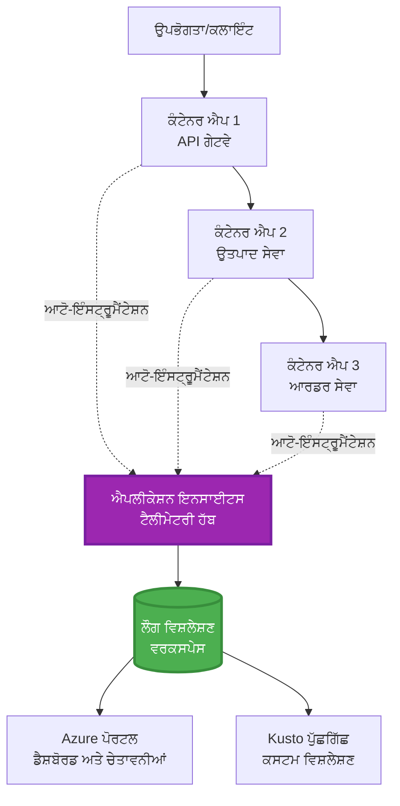
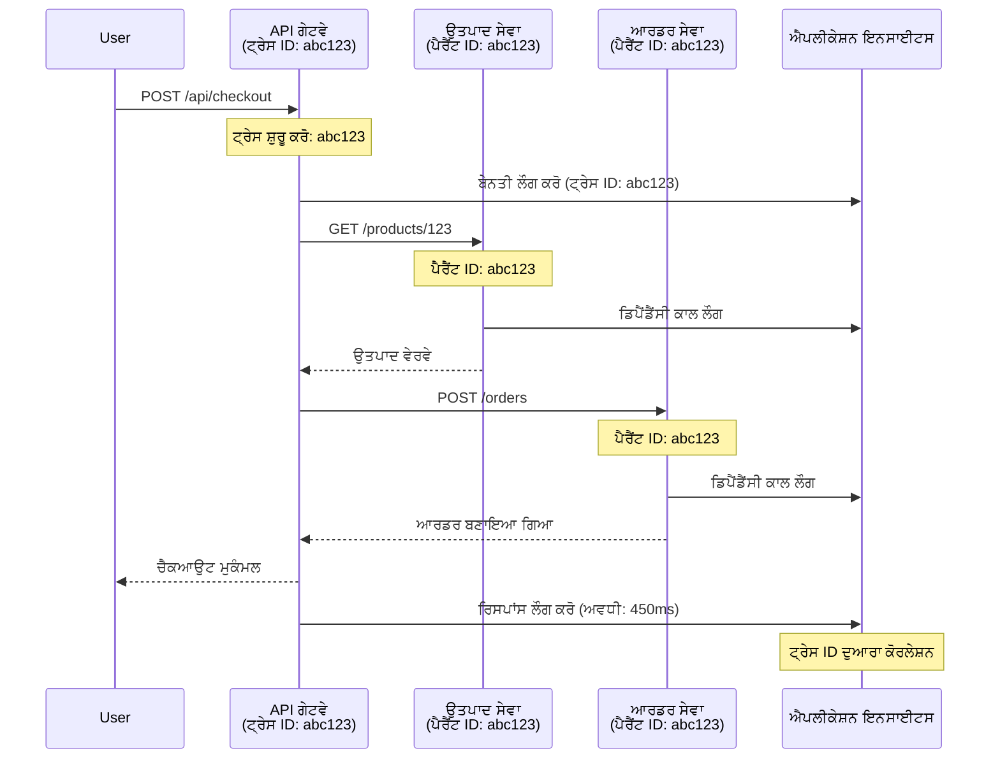

# Application Insights Integration with AZD

⏱️ **ਅੰਦਾਜ਼ਾ ਸਮਾਂ**: 40-50 ਮਿੰਟ | 💰 **ਲਾਗਤ ਪ੍ਰਭਾਵ**: ~$5-15/ਮਹੀਨਾ | ⭐ **ਜਟਿਲਤਾ**: ਦਰਮਿਆਨੀ

**📚 ਸਿੱਖਣ ਦਾ ਰਸਤਾ:**
- ← Previous: [ਪ੍ਰੀਫਲਾਈਟ ਚੈੱਕਸ](preflight-checks.md) - ਪ੍ਰਭਾਵ ਤੈਅ ਕਰਨ ਤੋਂ ਪਹਿਲਾਂ ਦੀ ਜਾਂਚ
- 🎯 **ਤੁਸੀਂ ਇੱਥੇ ਹੋ**: Application Insights Integration (ਮਾਨੀਟਰਿੰਗ, ਟੈਲੀਮੀਟਰੀ, ਡੀਬੱਗਿੰਗ)
- → Next: [Deployment Guide](../chapter-04-infrastructure/deployment-guide.md) - Azure 'ਤੇ ਡਿਪਲੌਇ ਕਰੋ
- 🏠 [Course Home](../../README.md)

---

## ਤੁਸੀਂ ਕੀ ਸਿੱਖੋਗੇ

ਇਸ ਪਾਠ ਨੂੰ مکمل ਕਰਨ ਨਾਲ, ਤੁਸੀਂ:
- AZD ਪ੍ਰੋਜੈਕਟਾਂ ਵਿੱਚ ਆਟੋਮੈਟਿਕ ਤੌਰ 'ਤੇ **Application Insights** ਨੂੰ ਇੰਟੀਗ੍ਰੇਟ ਕਰਨਾ ਸਿੱਖੋਗੇ
- ਮਾਇਕਰੋਸਰਵਿਸਿਜ਼ ਲਈ **distributed tracing** ਸੰਰਚਿਤ ਕਰਨਾ
- **ਕਸਟਮ ਟੈਲੀਮੀਟਰੀ** ਲਾਗੂ ਕਰਨਾ (ਮੀਟਰਿਕਸ, ਇਵੈਂਟਸ, ਡਿਪੈਂਡੇਨਸੀਜ਼)
- ਰੀਅਲ-ਟਾਈਮ ਮਾਨੀਟਰਿੰਗ ਲਈ **ਲਾਈਵ ਮੀਟਰਿਕਸ** ਸੈਟਅਪ ਕਰਨਾ
- AZD ਡਿਪਲੌਇਮੈਂਟ ਤੋਂ **ਅਲਰਟ ਅਤੇ ਡੈਸ਼ਬੋਰਡ** ਬਣਾਉਣਾ
- **ਟੈਲੀਮੀਟਰੀ ਕੁਐਰੀਜ਼** ਨਾਲ ਪ੍ਰੋਡਕਸ਼ਨ ਸਮੱਸਿਆਵਾਂ ਦੀ ਡੀਬੱਗਿੰਗ ਕਰਨੀ
- **ਲਾਗਤ ਅਤੇ ਸੈਂਪਲਿੰਗ** ਰਣਨੀਤੀਆਂ ਨੂੰ ਅਨੁਕੂਲਤ ਕਰਨਾ
- **AI/LLM ਐਪਲੀਕੇਸ਼ਨਾਂ** (ਟੋਕਨਸ, ਲੇਟੈਂਸੀ, ਲਾਗਤ) ਦੀ ਨਿਗਰਾਨੀ ਕਰਨੀ

## ਕਿਉਂ AZD ਨਾਲ Application Insights ਮਹੱਤਵਪੂਰਨ ਹੈ

### ਚੁਣੌਤੀ: ਪ੍ਰੋਡਕਸ਼ਨ ਅਬਜ਼ਰਵੇਬਿਲਟੀ

**Application Insights ਬਗੈਰ:**
```
❌ No visibility into production behavior
❌ Manual log aggregation across services
❌ Reactive debugging (wait for customer complaints)
❌ No performance metrics
❌ Cannot trace requests across services
❌ Unknown failure rates and bottlenecks
```

**Application Insights + AZD ਨਾਲ:**
```
✅ Automatic telemetry collection
✅ Centralized logs from all services
✅ Proactive issue detection
✅ End-to-end request tracing
✅ Performance metrics and insights
✅ Real-time dashboards
✅ AZD provisions everything automatically
```

**ਉਪਮਾ**: Application Insights ਤੁਹਾਡੇ ਐਪਲੀਕੇਸ਼ਨ ਲਈ ਇੱਕ "ਬਲੈਕ ਬਾਕਸ" ਫਲਾਈਟ ਰਿਕਾਰਡਰ + ਕਾਕਪਿਟ ਡੈਸ਼ਬੋਰਡ ਵਾਂਗ ਹੈ। ਤੁਸੀਂ ਹਰ ਚੀਜ਼ ਰੀਅਲ-ਟਾਈਮ ਵੇਖ ਸਕਦੇ ਹੋ ਅਤੇ ਕਿਸੇ ਵੀ ਘਟਨਾ ਨੂੰ ਰੀਪਲੇ ਕਰ ਸਕਦੇ ਹੋ।

---

## ਆਰਕੀਟੈਕਚਰ ਓਵਰਵਿਊ

### AZD ਆਰਕੀਟੈਕਚਰ ਵਿੱਚ Application Insights


### ਕੀ ਆਟੋਮੈਟਿਕ ਤੌਰ 'ਤੇ ਮਾਨੀਟਰ ਕੀਤਾ ਜਾਂਦਾ ਹੈ

| Telemetry Type | What It Captures | Use Case |
|----------------|------------------|----------|
| **Requests** | HTTP requests, status codes, duration | API ਦੀ ਕਾਰਗੁਜ਼ਾਰੀ ਦੀ ਨਿਗਰਾਨੀ |
| **Dependencies** | External calls (DB, APIs, storage) | ਬੋਟਲਨੇਕ ਦੀ ਪਛਾਣ |
| **Exceptions** | Unhandled errors with stack traces | ਫੇਲ੍ਹਰਾਂ ਦੀ ਡੀਬੱਗਿੰਗ |
| **Custom Events** | Business events (signup, purchase) | ਐਨਾਲਿਟਿਕਸ ਅਤੇ ਫਨਲਜ਼ |
| **Metrics** | Performance counters, custom metrics | ਕੁੰਪੂਟਿੰਗ ਸਮਰੱਥਾ ਦੀ ਯੋਜਨਾ |
| **Traces** | Log messages with severity | ਡੀਬੱਗਿੰਗ ਅਤੇ ਆਡਿਟਿੰਗ |
| **Availability** | Uptime and response time tests | SLA ਨਿਗਰਾਨੀ |

---

## ਪਹਿਲੀਂਆਂ ਲੋੜਾਂ

### ਲਾਜ਼ਮੀ ਸੰਦ

```bash
# Azure Developer CLI ਦੀ ਜਾਂਚ ਕਰੋ
azd version
# ✅ ਉਮੀਦ ਕੀਤੀ: azd ਵਰਜ਼ਨ 1.0.0 ਜਾਂ ਉਸ ਤੋਂ ਉੱਪਰ

# Azure CLI ਦੀ ਜਾਂਚ ਕਰੋ
az --version
# ✅ ਉਮੀਦ ਕੀਤੀ: azure-cli 2.50.0 ਜਾਂ ਉਸ ਤੋਂ ਉੱਪਰ
```

### Azure ਲੋੜਾਂ

- ਸਰਗਰਮ Azure ਸਬਸਕ੍ਰਿਪਸ਼ਨ
- ਬਣਾਉਣ ਦੀਆਂ ਅਨੁਮਤੀਆਂ:
  - Application Insights ਸਰੋਤਾਂ
  - Log Analytics workspaces
  - Container Apps
  - Resource groups

### ਗਿਆਨ ਦੀਆਂ ਲੋੜਾਂ

ਤੁਹਾਨੂੰ ਇਹ ਮੁਕੰਮਲ ਹੋਣਾ ਚਾਹੀਦਾ ਹੈ:
- [AZD ਬੇਸਿਕਸ](../chapter-01-foundation/azd-basics.md) - ਮੁੱਖ AZD ਸੰਕਲਪ
- [Configuration](../chapter-03-configuration/configuration.md) - ਵਾਤਾਵਰਣ ਸੈਟਅਪ
- [First Project](../chapter-01-foundation/first-project.md) - ਮੂਲ ਡਿਪਲੌਇਮੈਂਟ

---

## ਪਾਠ 1: AZD ਨਾਲ ਸਵੈਚਾਲਿਤ Application Insights

### AZD ਕਿਵੇਂ Application Insights ਪ੍ਰੋਵਿਸ਼ਨ ਕਰਦਾ ਹੈ

AZD ਤੁਹਾਡੇ ਡਿਪਲੌਇਮੈਂਟ ਵੇਲੇ ਆਟੋਮੈਟਿਕ ਤੌਰ 'ਤੇ Application Insights ਬਣਾਉਂਦਾ ਅਤੇ ਕੰਫਿਗਰ ਕਰਦਾ ਹੈ। ਆਓ ਦੇਖੀਏ ਇਹ ਕਿਵੇਂ ਕੰਮ ਕਰਦਾ ਹੈ।

### ਪ੍ਰੋਜੈਕਟ ਸਰਚਨਾ

```
monitored-app/
├── azure.yaml                     # AZD configuration
├── infra/
│   ├── main.bicep                # Main infrastructure
│   ├── core/
│   │   └── monitoring.bicep      # Application Insights + Log Analytics
│   └── app/
│       └── api.bicep             # Container App with monitoring
└── src/
    ├── app.py                    # Application with telemetry
    ├── requirements.txt
    └── Dockerfile
```

---

### ਕਦਮ 1: AZD ਕੰਫਿਗਰ ਕਰੋ (azure.yaml)

**File: `azure.yaml`**

```yaml
name: monitored-app
metadata:
  template: monitored-app@1.0.0

services:
  api:
    project: ./src
    language: python
    host: containerapp

# AZD automatically provisions monitoring!
```

**बस ਇਸੇ ਨਾਲ!** ਮੁੱਢਲੀ ਮਾਨੀਟਰਿੰਗ ਲਈ AZD ਡਿਫੌਲਟ ਰੂਪ ਵਿੱਚ Application Insights ਬਣਾਉਂਦਾ। ਹੋਰ ਕੋਈ ਵਾਧੂ ਕੰਫਿਗਰੇਸ਼ਨ ਲੋੜ ਨਹੀਂ।

---

### ਕਦਮ 2: ਮਾਨੀਟਰਿੰਗ ਇੰਫ੍ਰਾਸਟਰਕਚਰ (Bicep)

**File: `infra/core/monitoring.bicep`**

```bicep
param logAnalyticsName string
param applicationInsightsName string
param location string = resourceGroup().location
param tags object = {}

// Log Analytics Workspace (required for Application Insights)
resource logAnalytics 'Microsoft.OperationalInsights/workspaces@2022-10-01' = {
  name: logAnalyticsName
  location: location
  tags: tags
  properties: {
    sku: {
      name: 'PerGB2018'  // Pay-as-you-go pricing
    }
    retentionInDays: 30  // Keep logs for 30 days
    features: {
      enableLogAccessUsingOnlyResourcePermissions: true
    }
  }
}

// Application Insights
resource applicationInsights 'Microsoft.Insights/components@2020-02-02' = {
  name: applicationInsightsName
  location: location
  tags: tags
  kind: 'web'
  properties: {
    Application_Type: 'web'
    WorkspaceResourceId: logAnalytics.id
    IngestionMode: 'LogAnalytics'
    publicNetworkAccessForIngestion: 'Enabled'
    publicNetworkAccessForQuery: 'Enabled'
  }
}

// Outputs for Container Apps
output logAnalyticsWorkspaceId string = logAnalytics.id
output logAnalyticsWorkspaceName string = logAnalytics.name
output applicationInsightsConnectionString string = applicationInsights.properties.ConnectionString
output applicationInsightsInstrumentationKey string = applicationInsights.properties.InstrumentationKey
output applicationInsightsName string = applicationInsights.name
```

---

### ਕਦਮ 3: Container App ਨੂੰ Application Insights ਨਾਲ ਜੋੜੋ

**File: `infra/app/api.bicep`**

```bicep
param name string
param location string
param tags object = {}
param containerAppsEnvironmentName string
param applicationInsightsConnectionString string

resource containerApp 'Microsoft.App/containerApps@2023-05-01' = {
  name: name
  location: location
  tags: tags
  properties: {
    configuration: {
      ingress: {
        external: true
        targetPort: 8000
      }
      secrets: [
        {
          name: 'appinsights-connection-string'
          value: applicationInsightsConnectionString
        }
      ]
    }
    template: {
      containers: [
        {
          name: 'api'
          image: 'myregistry.azurecr.io/api:latest'
          resources: {
            cpu: json('0.5')
            memory: '1Gi'
          }
          env: [
            {
              name: 'APPLICATIONINSIGHTS_CONNECTION_STRING'
              secretRef: 'appinsights-connection-string'
            }
            {
              name: 'APPLICATIONINSIGHTS_ENABLED'
              value: 'true'
            }
          ]
        }
      ]
    }
  }
}

output uri string = 'https://${containerApp.properties.configuration.ingress.fqdn}'
```

---

### ਕਦਮ 4: ਐਪਲੀਕੇਸ਼ਨ ਕੋਡ ਬੱਚੇ ਟੈਲੀਮੀਟਰੀ

**File: `src/app.py`**

```python
from flask import Flask, request, jsonify
from opencensus.ext.azure.log_exporter import AzureLogHandler
from opencensus.ext.azure.trace_exporter import AzureExporter
from opencensus.ext.flask.flask_middleware import FlaskMiddleware
from opencensus.trace.samplers import ProbabilitySampler
import logging
import os

app = Flask(__name__)

# Application Insights ਕਨੈਕਸ਼ਨ ਸਟਰਿੰਗ ਪ੍ਰਾਪਤ ਕਰੋ
connection_string = os.environ.get('APPLICATIONINSIGHTS_CONNECTION_STRING')

if connection_string:
    # ਵੰਡੇ ਹੋਏ ਟ੍ਰੇਸਿੰਗ ਨੂੰ ਸੰਰਚਿਤ ਕਰੋ
    middleware = FlaskMiddleware(
        app,
        exporter=AzureExporter(connection_string=connection_string),
        sampler=ProbabilitySampler(rate=1.0)  # ਡੈਵ ਲਈ 100% ਸੈਂਪਲਿੰਗ
    )
    
    # ਲੌਗਿੰਗ ਨੂੰ ਸੰਰਚਿਤ ਕਰੋ
    logger = logging.getLogger(__name__)
    logger.addHandler(AzureLogHandler(connection_string=connection_string))
    logger.setLevel(logging.INFO)
    
    print("✅ Application Insights enabled")
else:
    logger = logging.getLogger(__name__)
    logger.setLevel(logging.INFO)
    print("⚠️ Application Insights not configured")

@app.route('/health')
def health():
    logger.info('Health check endpoint called')
    return jsonify({'status': 'healthy', 'monitoring': 'enabled'})

@app.route('/api/products')
def get_products():
    logger.info('Fetching products')
    
    # ਡੇਟਾਬੇਸ ਕਾਲ ਦੀ ਨਕਲ ਕਰੋ (ਆਟੋਮੈਟਿਕ ਤੌਰ 'ਤੇ ਡਿਪੈਂਡੇਸੀ ਵਜੋਂ ਟ੍ਰੈਕ ਕੀਤਾ ਜਾਂਦਾ ਹੈ)
    products = [
        {'id': 1, 'name': 'Laptop', 'price': 999.99},
        {'id': 2, 'name': 'Mouse', 'price': 29.99},
        {'id': 3, 'name': 'Keyboard', 'price': 79.99}
    ]
    
    logger.info(f'Returned {len(products)} products')
    return jsonify(products)

@app.route('/api/error-test')
def error_test():
    """Test error tracking"""
    logger.error('Testing error tracking')
    try:
        raise ValueError('This is a test exception')
    except Exception as e:
        logger.exception('Exception occurred in error-test endpoint')
        return jsonify({'error': str(e)}), 500

@app.route('/api/slow')
def slow_endpoint():
    """Test performance tracking"""
    import time
    logger.info('Slow endpoint called')
    time.sleep(3)  # ਧੀਮੀ ਕਾਰਵਾਈ ਦੀ ਨਕਲ ਕਰੋ
    logger.warning('Endpoint took 3 seconds to respond')
    return jsonify({'message': 'Slow operation completed'})

if __name__ == '__main__':
    app.run(host='0.0.0.0', port=8000)
```

**File: `src/requirements.txt`**

```txt
Flask==3.0.0
opencensus-ext-azure==1.1.13
opencensus-ext-flask==0.8.1
gunicorn==21.2.0
```

---

### ਕਦਮ 5: ਡਿਪਲੋਇ ਅਤੇ ਜਾਂਚੋ

```bash
# AZD ਨੂੰ ਸ਼ੁਰੂ ਕਰੋ
azd init

# ਤੈਨਾਤ ਕਰੋ (ਆਟੋਮੈਟਿਕ ਤੌਰ ਤੇ Application Insights ਨੂੰ ਪ੍ਰੋਵਿਜ਼ਨ ਕਰਦਾ ਹੈ)
azd up

# ਐਪ ਦਾ URL ਪ੍ਰਾਪਤ ਕਰੋ
APP_URL=$(azd env get-values | grep API_URL | cut -d '=' -f2 | tr -d '"')

# ਟੈਲੀਮੇਟਰੀ ਤਿਆਰ ਕਰੋ
curl $APP_URL/health
curl $APP_URL/api/products
curl $APP_URL/api/error-test
curl $APP_URL/api/slow
```

**✅ ਉਮੀਦ ਕੀਤੀ ਨਤੀਜਾ:**
```json
{
  "status": "healthy",
  "monitoring": "enabled"
}
```

---

### ਕਦਮ 6: Azure ਪੋਰਟਲ ਵਿੱਚ ਟੈਲੀਮੀਟਰੀ ਵੇਖੋ

```bash
# ਐਪਲੀਕੇਸ਼ਨ ਇਨਸਾਈਟਸ ਦੇ ਵੇਰਵੇ ਪ੍ਰਾਪਤ ਕਰੋ
azd env get-values | grep APPLICATIONINSIGHTS

# ਐਜ਼ੂਰ ਪੋਰਟਲ ਵਿੱਚ ਖੋਲ੍ਹੋ
az monitor app-insights component show \
  --app $(azd env get-values | grep APPLICATIONINSIGHTS_NAME | cut -d '=' -f2 | tr -d '"') \
  --resource-group $(azd env get-values | grep AZURE_RESOURCE_GROUP | cut -d '=' -f2 | tr -d '"') \
  --query "appId" -o tsv
```

**Navigate to Azure Portal → Application Insights → Transaction Search**

ਤੁਹਾਨੂੰ ਦਿਖਾਈ ਦੇਵੇਗਾ:
- ✅ HTTP requests ਸਥਿਤੀ ਕੋਡਾਂ ਸਮੇਤ
- ✅ Request ਦੀ ਮਿਆਦ ( `/api/slow` ਲਈ 3+ ਸਕਿੰਟ)
- ✅ `/api/error-test` ਤੋਂ Exception ਵੇਰਵੇ
- ✅ ਕਸਟਮ ਲੌਗ ਸੁਨੇਹੇ

---

## ਪਾਠ 2: ਕਸਟਮ ਟੈਲੀਮੀਟਰੀ ਅਤੇ ਇਵੈਂਟਸ

### ਬਿਜ਼ਨਸ ਇਵੈਂਟਸ ਟਰੈਕ ਕਰੋ

ਆਓ ਬਿਜ਼ਨਸ-ਨਿਰਣਾ ਯੋਗ ਇਵੈਂਟਸ ਲਈ ਕਸਟਮ ਟੈਲੀਮੀਟਰੀ ਸ਼ਾਮਲ ਕਰੀਏ।

**File: `src/telemetry.py`**

```python
from opencensus.ext.azure import metrics_exporter
from opencensus.stats import aggregation as aggregation_module
from opencensus.stats import measure as measure_module
from opencensus.stats import stats as stats_module
from opencensus.stats import view as view_module
from opencensus.tags import tag_map as tag_map_module
from opencensus.ext.azure.log_exporter import AzureLogHandler
from opencensus.ext.azure.trace_exporter import AzureExporter
from opencensus.trace import tracer as tracer_module
import logging
import os

class TelemetryClient:
    """Custom telemetry client for Application Insights"""
    
    def __init__(self, connection_string=None):
        self.connection_string = connection_string or os.environ.get('APPLICATIONINSIGHTS_CONNECTION_STRING')
        
        if not self.connection_string:
            print("⚠️ Application Insights connection string not found")
            return
        
        # ਲੌਗਰ ਸੈਟਅੱਪ ਕਰੋ
        self.logger = logging.getLogger(__name__)
        self.logger.addHandler(AzureLogHandler(connection_string=self.connection_string))
        self.logger.setLevel(logging.INFO)
        
        # ਮੀਟ੍ਰਿਕਸ ਐਕਸਪੋਰਟਰ ਸੈਟਅੱਪ ਕਰੋ
        self.stats = stats_module.stats
        self.view_manager = self.stats.view_manager
        self.stats_recorder = self.stats.stats_recorder
        
        exporter = metrics_exporter.new_metrics_exporter(
            connection_string=self.connection_string
        )
        self.view_manager.register_exporter(exporter)
        
        # ਟ੍ਰੇਸਰ ਸੈਟਅੱਪ ਕਰੋ
        self.tracer = tracer_module.Tracer(
            exporter=AzureExporter(connection_string=self.connection_string)
        )
        
        print("✅ Custom telemetry client initialized")
    
    def track_event(self, event_name: str, properties: dict = None):
        """Track custom business event"""
        properties = properties or {}
        self.logger.info(
            f"CustomEvent: {event_name}",
            extra={
                'custom_dimensions': {
                    'event_name': event_name,
                    **properties
                }
            }
        )
    
    def track_metric(self, metric_name: str, value: float, properties: dict = None):
        """Track custom metric"""
        properties = properties or {}
        self.logger.info(
            f"CustomMetric: {metric_name} = {value}",
            extra={
                'custom_dimensions': {
                    'metric_name': metric_name,
                    'value': value,
                    **properties
                }
            }
        )
    
    def track_dependency(self, name: str, dependency_type: str, duration: float, success: bool):
        """Track external dependency call"""
        with self.tracer.span(name=name) as span:
            span.add_attribute('dependency.type', dependency_type)
            span.add_attribute('duration', duration)
            span.add_attribute('success', success)

# ਗਲੋਬਲ ਟੈਲੀਮੇਟਰੀ ਕਲਾਇੰਟ
telemetry = TelemetryClient()
```

### ਐਪ ਨੂੰ ਕਸਟਮ ਇਵੈਂਟਸ ਨਾਲ ਅਪਡੇਟ ਕਰੋ

**File: `src/app.py` (enhanced)**

```python
from flask import Flask, request, jsonify
from telemetry import telemetry
import time
import random

app = Flask(__name__)

@app.route('/api/purchase', methods=['POST'])
def purchase():
    """Track purchase event with custom telemetry"""
    data = request.json
    product_id = data.get('product_id')
    quantity = data.get('quantity', 1)
    price = data.get('price', 0)
    
    # ਕਾਰੋਬਾਰੀ ਘਟਨਾ ਨੂੰ ਟ੍ਰੈਕ ਕਰੋ
    telemetry.track_event('Purchase', {
        'product_id': product_id,
        'quantity': quantity,
        'total_amount': price * quantity,
        'user_id': request.headers.get('X-User-Id', 'anonymous')
    })
    
    # ਆਮਦਨ ਮੈਟ੍ਰਿਕ ਨੂੰ ਟ੍ਰੈਕ ਕਰੋ
    telemetry.track_metric('Revenue', price * quantity, {
        'product_id': product_id,
        'currency': 'USD'
    })
    
    return jsonify({
        'order_id': f'ORD-{random.randint(1000, 9999)}',
        'status': 'confirmed',
        'total': price * quantity
    })

@app.route('/api/search')
def search():
    """Track search queries"""
    query = request.args.get('q', '')
    
    start_time = time.time()
    
    # ਖੋਜ ਦੀ ਨਕਲ ਕਰੋ (ਅਸਲ ਵਿੱਚ ਡੇਟਾਬੇਸ ਕਵੈਰੀ ਹੋਵੇਗੀ)
    results = [{'id': 1, 'name': f'Result for {query}'}]
    
    duration = (time.time() - start_time) * 1000  # ਮਿਲੀਸੈਕਿੰਡਾਂ ਵਿੱਚ ਬਦਲੋ
    
    # ਖੋਜ ਘਟਨਾ ਨੂੰ ਟ੍ਰੈਕ ਕਰੋ
    telemetry.track_event('Search', {
        'query': query,
        'results_count': len(results),
        'duration_ms': duration
    })
    
    # ਖੋਜ ਪ੍ਰਦਰਸ਼ਨ ਮੈਟ੍ਰਿਕ ਨੂੰ ਟ੍ਰੈਕ ਕਰੋ
    telemetry.track_metric('SearchDuration', duration, {
        'query_length': len(query)
    })
    
    return jsonify({'results': results, 'count': len(results)})

@app.route('/api/external-call')
def external_call():
    """Track external API dependency"""
    import requests
    
    start_time = time.time()
    success = True
    
    try:
        # ਬਾਹਰੀ API ਕਾਲ ਦੀ ਨਕਲ ਕਰੋ
        response = requests.get('https://api.example.com/data', timeout=5)
        result = response.json()
    except Exception as e:
        success = False
        result = {'error': str(e)}
    
    duration = (time.time() - start_time) * 1000
    
    # ਨਿਰਭਰਤਾ ਨੂੰ ਟ੍ਰੈਕ ਕਰੋ
    telemetry.track_dependency(
        name='ExternalAPI',
        dependency_type='HTTP',
        duration=duration,
        success=success
    )
    
    return jsonify(result)

if __name__ == '__main__':
    app.run(host='0.0.0.0', port=8000)
```

### ਕਸਟਮ ਟੈਲੀਮੀਟਰੀ ਦੀ ਟੈਸਟਿੰਗ

```bash
# ਖਰੀਦ ਘਟਨਾ ਨੂੰ ਟ੍ਰੈਕ ਕਰੋ
curl -X POST $APP_URL/api/purchase \
  -H "Content-Type: application/json" \
  -H "X-User-Id: user123" \
  -d '{"product_id": 1, "quantity": 2, "price": 29.99}'

# ਖੋਜ ਘਟਨਾ ਨੂੰ ਟ੍ਰੈਕ ਕਰੋ
curl "$APP_URL/api/search?q=laptop"

# ਬਾਹਰੀ ਨਿਰਭਰਤਾ ਨੂੰ ਟ੍ਰੈਕ ਕਰੋ
curl $APP_URL/api/external-call
```

**Azure Portal ਵਿੱਚ ਵੇਖੋ:**

Navigate to Application Insights → Logs, ਫਿਰ ਚਲਾਓ:

```kusto
// View purchase events
traces
| where customDimensions.event_name == "Purchase"
| project 
    timestamp,
    product_id = tostring(customDimensions.product_id),
    total_amount = todouble(customDimensions.total_amount),
    user_id = tostring(customDimensions.user_id)
| order by timestamp desc

// View revenue metrics
traces
| where customDimensions.metric_name == "Revenue"
| summarize TotalRevenue = sum(todouble(customDimensions.value)) by bin(timestamp, 1h)
| render timechart

// View search performance
traces
| where customDimensions.event_name == "Search"
| summarize 
    AvgDuration = avg(todouble(customDimensions.duration_ms)),
    SearchCount = count()
  by bin(timestamp, 5m)
| render timechart
```

---

## ਪਾਠ 3: ਮਾਇਕਰੋਸਰਵਿਸਿਜ਼ ਲਈ ਡਿਸਟ੍ਰੀਬਿਊਟਡ ਟਰੇਸਿੰਗ

### ਕ੍ਰਾਸ-ਸਰਵਿਸ ਟਰੇਸਿੰਗ ਯੋਗ ਕਰੋ

ਮਾਇਕਰੋਸਰਵਿਸਿਜ਼ ਲਈ, Application Insights ਆਟੋਮੈਟਿਕ ਤੌਰ 'ਤੇ ਸਰਵਿਸਾਂ ਦਰਮਿਆਨ ਬੇਨਤੀ ਨੂੰ ਕੋਰਿਲੇਟ ਕਰਦਾ ਹੈ।

**File: `infra/main.bicep`**

```bicep
targetScope = 'subscription'

param environmentName string
param location string = 'eastus'

var tags = { 'azd-env-name': environmentName }

resource rg 'Microsoft.Resources/resourceGroups@2021-04-01' = {
  name: 'rg-${environmentName}'
  location: location
  tags: tags
}

// Monitoring (shared by all services)
module monitoring './core/monitoring.bicep' = {
  name: 'monitoring'
  scope: rg
  params: {
    logAnalyticsName: 'log-${environmentName}'
    applicationInsightsName: 'appi-${environmentName}'
    location: location
    tags: tags
  }
}

// API Gateway
module apiGateway './app/api-gateway.bicep' = {
  name: 'api-gateway'
  scope: rg
  params: {
    name: 'ca-gateway-${environmentName}'
    location: location
    tags: union(tags, { 'azd-service-name': 'gateway' })
    applicationInsightsConnectionString: monitoring.outputs.applicationInsightsConnectionString
  }
}

// Product Service
module productService './app/product-service.bicep' = {
  name: 'product-service'
  scope: rg
  params: {
    name: 'ca-products-${environmentName}'
    location: location
    tags: union(tags, { 'azd-service-name': 'products' })
    applicationInsightsConnectionString: monitoring.outputs.applicationInsightsConnectionString
  }
}

// Order Service
module orderService './app/order-service.bicep' = {
  name: 'order-service'
  scope: rg
  params: {
    name: 'ca-orders-${environmentName}'
    location: location
    tags: union(tags, { 'azd-service-name': 'orders' })
    applicationInsightsConnectionString: monitoring.outputs.applicationInsightsConnectionString
  }
}

output APPLICATIONINSIGHTS_CONNECTION_STRING string = monitoring.outputs.applicationInsightsConnectionString
output GATEWAY_URL string = apiGateway.outputs.uri
```

### ਏਂਡ-ਟੂ-ਏਂਡ ਟਰਾਂਜ਼ੈਕਸ਼ਨ ਵੇਖੋ


**ਏਂਡ-ਟੂ-ਏਂਡ ਟਰੇਸ ਦੀ ਕੁਐਰੀ:**

```kusto
// Find complete request flow
let traceId = "abc123...";  // Get from response header
dependencies
| union requests
| where operation_Id == traceId
| project 
    timestamp,
    type = itemType,
    name,
    duration,
    success,
    cloud_RoleName
| order by timestamp asc
```

---

## ਪਾਠ 4: ਲਾਈਵ ਮੀਟਰਿਕਸ ਅਤੇ ਰੀਅਲ-ਟਾਈਮ ਮਾਨੀਟਰਿੰਗ

### ਲਾਈਵ ਮੀਟਰਿਕਸ ਸਟਰੀਮ ਯੋਗ ਕਰੋ

ਲਾਈਵ ਮੀਟਰਿਕਸ <1 ਸਕਿੰਟ ਦੇ ਲੇਟੈਂਸੀ ਨਾਲ ਰੀਅਲ-ਟਾਈਮ ਟੈਲੀਮੀਟਰੀ ਦਿੰਦਾ ਹੈ।

**ਲਾਈਵ ਮੀਟਰਿਕਸ ਤੱਕ ਪਹੁੰਚ:**

```bash
# Application Insights ਸੰਸਾਧਨ ਪ੍ਰਾਪਤ ਕਰੋ
APPI_NAME=$(azd env get-values | grep APPLICATIONINSIGHTS_NAME | cut -d '=' -f2 | tr -d '"')

# ਸੰਸਾਧਨ ਗਰੁੱਪ ਪ੍ਰਾਪਤ ਕਰੋ
RG_NAME=$(azd env get-values | grep AZURE_RESOURCE_GROUP | cut -d '=' -f2 | tr -d '"')

echo "Navigate to: Azure Portal → Resource Groups → $RG_NAME → $APPI_NAME → Live Metrics"
```

**ਤੁਹਾਨੂੰ ਜੋ ਰੀਅਲ-ਟਾਈਮ ਵਿੱਚ ਦਿਖਾਈ ਦੇਵੇਗਾ:**
- ✅ ਆ ਰਹੀਆਂ ਬੇਨਤੀਆਂ ਦੀ ਦਰ (requests/sec)
- ✅ ਜਾ ਰਹੀਆਂ ਡਿਪੈਂਡੇਨਸੀ ਕਾਲਾਂ
- ✅ Exception ਗਿਣਤੀ
- ✅ CPU ਅਤੇ ਮੈਮੋਰੀ ਦੀ ਵਰਤੋਂ
- ✅ ਸਰਵਰਾਂ ਦੀ ਸਰਗਰਮ ਗਿਣਤੀ
- ✅ ਨਮੂਨਾ ਟੈਲੀਮੀਟਰੀ

### ਟੈਸਟਿੰਗ ਲਈ ਲੋਡ ਜਨਰੇਟ ਕਰੋ

```bash
# ਲਾਈਵ ਮੈਟ੍ਰਿਕਸ ਵੇਖਣ ਲਈ ਲੋਡ ਜਨਰੇਟ ਕਰੋ
for i in {1..100}; do
  curl $APP_URL/api/products &
  curl $APP_URL/api/search?q=test$i &
done

# Azure Portal ਵਿੱਚ ਲਾਈਵ ਮੈਟ੍ਰਿਕਸ ਵੇਖੋ
# ਤੁਹਾਨੂੰ ਬੇਨਤੀ ਦਰ ਵਿੱਚ ਉਛਾਲ ਦੇਖਣਾ ਚਾਹੀਦਾ ਹੈ
```

---

## ਪ੍ਰੈਕਟਿਕਲ ਅਭਿਆਸ

### ਅਭਿਆਸ 1: ਅਲਰਟ ਸੈਟਅਪ ਕਰੋ ⭐⭐ (ਦਰਮਿਆਨੀ)

**ਉਦੇਸ਼**: ਉੱਚ error ਦਰਾਂ ਅਤੇ ਧੀਮੀ ਪ੍ਰਤੀਕ੍ਰਿਆਵਾਂ ਲਈ ਅਲਰਟ ਬਣਾਓ।

**ਕਦਮ:**

1. **Error ਦਰ ਲਈ ਅਲਰਟ ਬਣਾਓ:**

```bash
# Application Insights ਰਿਸੋਰਸ ID ਪ੍ਰਾਪਤ ਕਰੋ
APPI_ID=$(az monitor app-insights component show \
  --app $APPI_NAME \
  --resource-group $RG_NAME \
  --query "id" -o tsv)

# ਫੇਲ ਹੋਈਆਂ ਰਿਕਵੇਸਟਾਂ ਲਈ ਮੀਟਰਿਕ ਅਲਰਟ ਬਣਾਓ
az monitor metrics alert create \
  --name "High-Error-Rate" \
  --resource-group $RG_NAME \
  --scopes $APPI_ID \
  --condition "count requests/failed > 10" \
  --window-size 5m \
  --evaluation-frequency 1m \
  --description "Alert when error rate exceeds 10 per 5 minutes"
```

2. **ਧੀਮੀ ਪ੍ਰਤੀਕ੍ਰਿਆਵਾਂ ਲਈ ਅਲਰਟ ਬਣਾਓ:**

```bash
az monitor metrics alert create \
  --name "Slow-Responses" \
  --resource-group $RG_NAME \
  --scopes $APPI_ID \
  --condition "avg requests/duration > 3000" \
  --window-size 5m \
  --evaluation-frequency 1m \
  --description "Alert when average response time exceeds 3 seconds"
```

3. **Bicep ਰਾਹੀਂ ਅਲਰਟ ਬਣਾਓ (AZD ਲਈ ਪਸੰਦੀਦਾ):**

**File: `infra/core/alerts.bicep`**

```bicep
param applicationInsightsId string
param actionGroupId string = ''
param location string = resourceGroup().location

// High error rate alert
resource errorRateAlert 'Microsoft.Insights/metricAlerts@2018-03-01' = {
  name: 'high-error-rate'
  location: 'global'
  properties: {
    description: 'Alert when error rate exceeds threshold'
    severity: 2
    enabled: true
    scopes: [
      applicationInsightsId
    ]
    evaluationFrequency: 'PT1M'
    windowSize: 'PT5M'
    criteria: {
      'odata.type': 'Microsoft.Azure.Monitor.SingleResourceMultipleMetricCriteria'
      allOf: [
        {
          name: 'Error rate'
          metricName: 'requests/failed'
          operator: 'GreaterThan'
          threshold: 10
          timeAggregation: 'Count'
        }
      ]
    }
    actions: actionGroupId != '' ? [
      {
        actionGroupId: actionGroupId
      }
    ] : []
  }
}

// Slow response alert
resource slowResponseAlert 'Microsoft.Insights/metricAlerts@2018-03-01' = {
  name: 'slow-responses'
  location: 'global'
  properties: {
    description: 'Alert when response time is too high'
    severity: 3
    enabled: true
    scopes: [
      applicationInsightsId
    ]
    evaluationFrequency: 'PT1M'
    windowSize: 'PT5M'
    criteria: {
      'odata.type': 'Microsoft.Azure.Monitor.SingleResourceMultipleMetricCriteria'
      allOf: [
        {
          name: 'Response duration'
          metricName: 'requests/duration'
          operator: 'GreaterThan'
          threshold: 3000
          timeAggregation: 'Average'
        }
      ]
    }
  }
}

output errorAlertId string = errorRateAlert.id
output slowResponseAlertId string = slowResponseAlert.id
```

4. **ਅਲਰਟਾਂ ਦੀ ਟੈਸਟਿੰਗ:**

```bash
# ਤ੍ਰੁਟੀਆਂ ਪੈਦਾ ਕਰੋ
for i in {1..20}; do
  curl $APP_URL/api/error-test
done

# ਧੀਮੇ ਜਵਾਬ ਪੈਦਾ ਕਰੋ
for i in {1..10}; do
  curl $APP_URL/api/slow
done

# چੇਤਾਵਨੀ ਦੀ ਸਥਿਤੀ ਦੀ ਜਾਂਚ ਕਰੋ (5-10 ਮਿੰਟ ਉਡੀਕ ਕਰੋ)
az monitor metrics alert list \
  --resource-group $RG_NAME \
  --query "[].{Name:name, Enabled:enabled, State:properties.enabled}" \
  --output table
```

**✅ ਸਫਲਤਾ ਮਾਪਦੰਡ:**
- ✅ ਅਲਰਟ ਸਫਲਤਾਪੂਰਵਕ ਬਣ ਗਈਆਂ
- ✅ ਥ੍ਰੇਸ਼ਹੋਲਡ ਪਾਰ ਹੋਣ 'ਤੇ ਅਲਰਟ ਚਲ੍ਹਦੇ ਹਨ
- ✅ Azure Portal ਵਿੱਚ ਅਲਰਟ ਇਤਿਹਾਸ ਵੇਖਿਆ ਜਾ ਸਕਦਾ ਹੈ
- ✅ AZD ਡਿਪਲੌਇਮੈਂਟ ਨਾਲ ਇੰਟੀਗਰੇਟ ਕੀਤਾ ਗਿਆ

**ਸਮਾਂ**: 20-25 ਮਿੰਟ

---

### ਅਭਿਆਸ 2: ਕਸਟਮ ਡੈਸ਼ਬੋਰਡ ਬਣਾਓ ⭐⭐ (ਦਰਮਿਆਨੀ)

**ਉਦੇਸ਼**: ਕੁੰਜੀ ਐਪਲੀਕੇਸ਼ਨ ਮੀਟਰਿਕਸ ਦਰਸਾਉਂਦਾ ਡੈਸ਼ਬੋਰਡ ਬਣਾਓ।

**ਕਦਮ:**

1. **Azure Portal ਰਾਹੀਂ ਡੈਸ਼ਬੋਰਡ ਬਣਾਓ:**

Navigate to: Azure Portal → Dashboards → New Dashboard

2. **ਮੁੱਖ ਮੀਟਰਿਕਸ ਲਈ ਟਾਈਲਾਂ ਸ਼ਾਮਲ ਕਰੋ:**

- ਬੇਨਤੀ ਗਿਣਤੀ (ਆਖਰੀ 24 ਘੰਟੇ)
- ਔਸਤ ਪ੍ਰਤੀਕ੍ਰਿਆ ਸਮਾਂ
- Error ਦਰ
- Top 5 ਸਭ ਤੋਂ ਧੀਮੇ ਓਪਰੇਸ਼ਨ
- ਉਪਭੋਗਤਿਆਂ ਦਾ ਭੂਗੋਲਿਕ ਵੰਡ

3. **Bicep ਰਾਹੀਂ ਡੈਸ਼ਬੋਰਡ ਬਣਾਓ:**

**File: `infra/core/dashboard.bicep`**

```bicep
param dashboardName string
param applicationInsightsId string
param location string = resourceGroup().location

resource dashboard 'Microsoft.Portal/dashboards@2020-09-01-preview' = {
  name: dashboardName
  location: location
  properties: {
    lenses: [
      {
        order: 0
        parts: [
          // Request count
          {
            position: { x: 0, y: 0, rowSpan: 4, colSpan: 6 }
            metadata: {
              type: 'Extension/Microsoft_OperationsManagementSuite_Workspace/PartType/LogsDashboardPart'
              inputs: [
                {
                  name: 'resourceId'
                  value: applicationInsightsId
                }
                {
                  name: 'query'
                  value: '''
                    requests
                    | summarize RequestCount = count() by bin(timestamp, 1h)
                    | render timechart
                  '''
                }
              ]
            }
          }
          // Error rate
          {
            position: { x: 6, y: 0, rowSpan: 4, colSpan: 6 }
            metadata: {
              type: 'Extension/Microsoft_OperationsManagementSuite_Workspace/PartType/LogsDashboardPart'
              inputs: [
                {
                  name: 'resourceId'
                  value: applicationInsightsId
                }
                {
                  name: 'query'
                  value: '''
                    requests
                    | summarize 
                        Total = count(),
                        Failed = countif(success == false)
                    | extend ErrorRate = (Failed * 100.0) / Total
                    | project ErrorRate
                  '''
                }
              ]
            }
          }
        ]
      }
    ]
  }
}

output dashboardId string = dashboard.id
```

4. **ਡਿਪਲੌਇ ਡੈਸ਼ਬੋਰਡ:**

```bash
# main.bicep ਵਿੱਚ ਸ਼ਾਮਿਲ ਕਰੋ
module dashboard './core/dashboard.bicep' = {
  name: 'dashboard'
  scope: rg
  params: {
    dashboardName: 'dashboard-${environmentName}'
    applicationInsightsId: monitoring.outputs.applicationInsightsId
    location: location
  }
}

# ਤੈਨਾਤ ਕਰੋ
azd up
```

**✅ ਸਫਲਤਾ ਮਾਪਦੰਡ:**
- ✅ ਡੈਸ਼ਬੋਰਡ ਮੁੱਖ ਮੀਟਰਿਕਸ ਦਿਖਾਉਂਦਾ ਹੈ
- ✅ Azure Portal ਹੋਮ 'ਤੇ ਪਿਨ ਕੀਤਾ ਜਾ ਸਕਦਾ ਹੈ
- ✅ ਰੀਅਲ-ਟਾਈਮ ਵਿੱਚ ਅਪਡੇਟ ਹੁੰਦਾ ਹੈ
- ✅ AZD ਰਾਹੀਂ ਡਿਪਲੋਏਬਲ

**ਸਮਾਂ**: 25-30 ਮਿੰਟ

---

### ਅਭਿਆਸ 3: AI/LLM ਐਪਲੀਕੇਸ਼ਨ ਮਾਨੀਟਰ ਕਰੋ ⭐⭐⭐ (ਅਡਵਾਂਸਡ)

**ਉਦੇਸ਼**: Microsoft Foundry Models ਦੀ ਵਰਤੋਂ (ਟੋਕਨਸ, ਲਾਗਤ, ਲੇਟੈਂਸੀ) ਟਰੈਕ ਕਰੋ।

**ਕਦਮ:**

1. **AI ਮਾਨੀਟਰਿੰਗ ਰੈਪਰ ਬਣਾਓ:**

**File: `src/ai_telemetry.py`**

```python
from telemetry import telemetry
from openai import AzureOpenAI
import time

class MonitoredAzureOpenAI:
    """Microsoft Foundry Models client with automatic telemetry"""
    
    def __init__(self, api_key, endpoint, api_version="2024-02-01"):
        self.client = AzureOpenAI(
            api_key=api_key,
            api_version=api_version,
            azure_endpoint=endpoint
        )
    
    def chat_completion(self, model: str, messages: list, **kwargs):
        """Track chat completion with telemetry"""
        start_time = time.time()
        
        try:
            # ਮਾਇਕ੍ਰੋਸਾਫਟ ਫਾਊਂਡਰੀ ਮਾਡਲਾਂ ਨੂੰ ਕਾਲ ਕਰੋ
            response = self.client.chat.completions.create(
                model=model,
                messages=messages,
                **kwargs
            )
            
            duration = (time.time() - start_time) * 1000  # ms
            
            # ਵਰਤੋਂ ਨਿਕਾਲੋ
            usage = response.usage
            prompt_tokens = usage.prompt_tokens
            completion_tokens = usage.completion_tokens
            total_tokens = usage.total_tokens
            
            # ਲਾਗਤ ਦੀ ਗਣਨਾ ਕਰੋ (gpt-4.1 ਦੀ ਕੀਮਤ)
            prompt_cost = (prompt_tokens / 1000) * 0.03  # $0.03 ਪ੍ਰਤੀ 1K ਟੋਕਨ
            completion_cost = (completion_tokens / 1000) * 0.06  # $0.06 ਪ੍ਰਤੀ 1K ਟੋਕਨ
            total_cost = prompt_cost + completion_cost
            
            # ਕਸਟਮ ਇਵੈਂਟ ਨੂੰ ਟ੍ਰੈਕ ਕਰੋ
            telemetry.track_event('OpenAI_Request', {
                'model': model,
                'prompt_tokens': prompt_tokens,
                'completion_tokens': completion_tokens,
                'total_tokens': total_tokens,
                'duration_ms': duration,
                'cost_usd': total_cost,
                'success': True
            })
            
            # ਮਾਪਦੰਡਾਂ ਨੂੰ ਟ੍ਰੈਕ ਕਰੋ
            telemetry.track_metric('OpenAI_Tokens', total_tokens, {
                'model': model,
                'type': 'total'
            })
            
            telemetry.track_metric('OpenAI_Cost', total_cost, {
                'model': model,
                'currency': 'USD'
            })
            
            telemetry.track_metric('OpenAI_Duration', duration, {
                'model': model
            })
            
            return response
            
        except Exception as e:
            duration = (time.time() - start_time) * 1000
            
            telemetry.track_event('OpenAI_Request', {
                'model': model,
                'duration_ms': duration,
                'success': False,
                'error': str(e)
            })
            
            raise
```

2. **ਨਿਗਰਾਨ ਕੀਤੇ ਕਲਾਇੰਟ ਦੀ ਵਰਤੋਂ ਕਰੋ:**

```python
from flask import Flask, request, jsonify
from ai_telemetry import MonitoredAzureOpenAI
import os

app = Flask(__name__)

# ਨਿਗਰਾਨ ਕੀਤੇ OpenAI ਕਲਾਇੰਟ ਨੂੰ ਆਰੰਭ ਕਰੋ
openai_client = MonitoredAzureOpenAI(
    api_key=os.environ['AZURE_OPENAI_API_KEY'],
    endpoint=os.environ['AZURE_OPENAI_ENDPOINT']
)

@app.route('/api/chat', methods=['POST'])
def chat():
    data = request.json
    user_message = data.get('message')
    
    # ਸਵੈਚਾਲਿਤ ਨਿਗਰਾਨੀ ਨਾਲ ਕਾਲ
    response = openai_client.chat_completion(
        model='gpt-4.1',
        messages=[
            {'role': 'user', 'content': user_message}
        ]
    )
    
    return jsonify({
        'response': response.choices[0].message.content,
        'tokens': response.usage.total_tokens
    })
```

3. **AI ਮੀਟਰਿਕਸ ਦੀ ਕੁਐਰੀ ਕਰੋ:**

```kusto
// Total AI spend over time
traces
| where customDimensions.event_name == "OpenAI_Request"
| where customDimensions.success == "True"
| summarize TotalCost = sum(todouble(customDimensions.cost_usd)) by bin(timestamp, 1h)
| render timechart

// Token usage by model
traces
| where customDimensions.event_name == "OpenAI_Request"
| summarize 
    TotalTokens = sum(toint(customDimensions.total_tokens)),
    RequestCount = count()
  by Model = tostring(customDimensions.model)

// Average latency
traces
| where customDimensions.event_name == "OpenAI_Request"
| summarize AvgDuration = avg(todouble(customDimensions.duration_ms))
| project AvgDurationSeconds = AvgDuration / 1000

// Cost per request
traces
| where customDimensions.event_name == "OpenAI_Request"
| extend Cost = todouble(customDimensions.cost_usd)
| summarize 
    TotalCost = sum(Cost),
    RequestCount = count(),
    AvgCostPerRequest = avg(Cost)
```

**✅ ਸਫਲਤਾ ਮਾਪਦੰਡ:**
- ✅ ਹਰ OpenAI ਕਾਲ ਆਪਣੇ ਆਪ ਟਰੈਕ ਕੀਤੀ ਜਾਂਦੀ ਹੈ
- ✅ ਟੋਕਨ ਵਰਤੋਂ ਅਤੇ ਲਾਗਤ ਦਿਖਾਈ ਦਿੰਦੇ ਹਨ
- ✅ ਲੇਟੈਂਸੀ ਮਾਨੀਟਰ ਕੀਤੀ ਜਾਂਦੀ ਹੈ
- ✅ ਬਜਟ ਅਲਰਟ ਸੈਟ ਕੀਤੇ ਜਾ ਸਕਦੇ ਹਨ

**ਸਮਾਂ**: 35-45 ਮਿੰਟ

---

## ਲਾਗਤ ਅਨੁਕੂਲਨ

### ਸੈਂਪਲਿੰਗ ਰਣਨੀਤੀਆਂ

ਟੈਲੀਮੀਟਰੀ ਨੂੰ ਸੈਂਪਲ ਕਰਕੇ ਲਾਗਤ ਨੂੰ ਨਿਯੰਤਰਿਤ ਕਰੋ:

```python
from opencensus.trace.samplers import ProbabilitySampler

# ਵਿਕਾਸ: 100% ਸੈਂਪਲਿੰਗ
sampler = ProbabilitySampler(rate=1.0)

# ਉਤਪਾਦਨ: 10% ਸੈਂਪਲਿੰਗ (ਖ਼ਰਚੇ 90% ਘਟਾਓ)
sampler = ProbabilitySampler(rate=0.1)

# ਅਨੁਕੂਲ ਸੈਂਪਲਿੰਗ (ਆਪੋ-ਆਪ ਢਲ ਜਾਂਦੀ ਹੈ)
from opencensus.trace.samplers import AdaptiveSampler
sampler = AdaptiveSampler()
```

**Bicep ਵਿੱਚ:**

```bicep
resource applicationInsights 'Microsoft.Insights/components@2020-02-02' = {
  name: applicationInsightsName
  properties: {
    SamplingPercentage: 10  // 10% sampling
  }
}
```

### ਡੈਟਾ ਰਿਟੈਨਸ਼ਨ

```bicep
resource logAnalytics 'Microsoft.OperationalInsights/workspaces@2022-10-01' = {
  name: logAnalyticsName
  properties: {
    retentionInDays: 30  // Minimum (cheapest)
    // Options: 30, 31, 60, 90, 120, 180, 270, 365, 550, 730
  }
}
```

### ਮਹੀਨਾਵਾਰ ਲਾਗਤ ਅੰਦਾਜ਼ੇ

| Data Volume | Retention | Monthly Cost |
|-------------|-----------|--------------|
| 1 GB/month | 30 days | ~$2-5 |
| 5 GB/month | 30 days | ~$10-15 |
| 10 GB/month | 90 days | ~$25-40 |
| 50 GB/month | 90 days | ~$100-150 |

**ਫ੍ਰੀ ਟੀਅਰ**: 5 GB/month ਸ਼ਾਮਲ

---

## ਗਿਆਨ ਚੈਕਪੌਇੰਟ

### 1. ਮੂਲ ਇੰਟੀਗ੍ਰੇਸ਼ਨ ✓

ਆਪਣੀ ਸਮਝ ਦੀ ਜਾਂਚ ਕਰੋ:

- [ ] **Q1**: AZD Application Insights ਕਿਵੇਂ ਪ੍ਰੋਵਾਈਡ ਕਰਦਾ ਹੈ?
  - **A**: `infra/core/monitoring.bicep` ਵਿੱਚ Bicep ਟੈਂਪਲੇਟਾਂ ਰਾਹੀਂ ਆਟੋਮੈਟਿਕ ਤੌਰ 'ਤੇ

- [ ] **Q2**: ਕਿਹੜਾ ਐਨਵਾਇਰਨਮੈਂਟ ਵੈਰੀਏਬਲ Application Insights ਨੂੰ ਯੋਗ ਕਰਦਾ ਹੈ?
  - **A**: `APPLICATIONINSIGHTS_CONNECTION_STRING`

- [ ] **Q3**: ਤਿੰਨ ਮੁੱਖ ਟੈਲੀਮੀਟਰੀ ਕਿਸਮਾਂ ਕਿਹੜੀਆਂ ਹਨ?
  - **A**: Requests (HTTP calls), Dependencies (external calls), Exceptions (errors)

**Hands-On Verification:**
```bash
# ਜਾਂਚ ਕਰੋ ਕਿ Application Insights ਕੰਫਿਗਰ ਕੀਤਾ ਗਿਆ ਹੈ
azd env get-values | grep APPLICATIONINSIGHTS

# ਪੁਸ਼ਟੀ ਕਰੋ ਕਿ ਟੈਲੀਮੇਟਰੀ ਆ ਰਹੀ ਹੈ
az monitor app-insights metrics show \
  --app $APPI_NAME \
  --resource-group $RG_NAME \
  --metric "requests/count"
```

---

### 2. ਕਸਟਮ ਟੈਲੀਮੀਟਰੀ ✓

ਆਪਣੀ ਸਮਝ ਦੀ ਜਾਂਚ ਕਰੋ:

- [ ] **Q1**: ਤੁਸੀਂ ਕਸਟਮ ਬਿਜ਼ਨਸ ਇਵੈਂਟਸ ਕਿਵੇਂ ਟਰੈਕ ਕਰਦੇ ਹੋ?
  - **A**: `custom_dimensions` ਨਾਲ ਲੌਗਰ ਦੀ ਵਰਤੋਂ ਜਾਂ `TelemetryClient.track_event()` ਦੀ ਵਰਤੋਂ

- [ ] **Q2**: ਇਵੈਂਟਸ ਅਤੇ ਮੀਟਰਿਕਸ ਵਿੱਚ ਕੀ ਫਰਕ ਹੈ?
  - **A**: ਇਵੈਂਟਸ ਵਿਭਿੰਨ ਘਟਨਾਵਾਂ ਹਨ, ਮੀਟਰਿਕਸ ਗਿਣਤੀਯੋਗ ਮਾਪਦੰਡ ਹਨ

- [ ] **Q3**: ਤੁਸੀਂ ਸਰਵਿਸਾਂ ਦਰਮਿਆਨ ਟੈਲੀਮੀਟਰੀ ਨੂੰ ਕਿਵੇਂ ਕੋਰਿਲੇਟ ਕਰਦੇ ਹੋ?
  - **A**: Application Insights ਆਟੋਮੈਟਿਕ ਤੌਰ 'ਤੇ ਕੋਰਿਲੇਸ਼ਨ ਲਈ `operation_Id` ਦੀ ਵਰਤੋਂ ਕਰਦਾ ਹੈ

**Hands-On Verification:**
```kusto
// Verify custom events
traces
| where customDimensions.event_name != ""
| summarize count() by tostring(customDimensions.event_name)
```

---

### 3. ਪ੍ਰੋਡਕਸ਼ਨ ਮਾਨੀਟਰਿੰਗ ✓

ਆਪਣੀ ਸਮਝ ਦੀ ਜਾਂਚ ਕਰੋ:

- [ ] **Q1**: ਸੈਂਪਲਿੰਗ ਕੀ ਹੈ ਅਤੇ ਇਸ ਦੀ ਵਰਤੋਂ ਕਿਉਂ ਕਰੋ?
  - **A**: ਸੈਂਪਲਿੰਗ ਡਾਟਾ ਵਾਲੀਅਮ (ਅਤੇ ਲਾਗਤ) ਘਟਾਉਂਦੀ ਹੈ by ਸਿਰਫ਼ ਕੁਝ ਪ੍ਰਤੀਸ਼ਤ ਟੈਲੀਮੀਟਰੀ ਕੀਪ ਕਰਕੇ

- [ ] **Q2**: ਤੁਸੀਂ ਅਲਰਟ ਕਿਵੇਂ ਸੈਟਅਪ ਕਰਦੇ ਹੋ?
  - **A**: Bicep ਜਾਂ Azure Portal 'ਚ Application Insights ਮੀਟਰਿਕਸ 'ਤੇ ਆਧਾਰਿਤ ਮੈਟਰਿਕ ਅਲਰਟ ਦੀ ਵਰਤੋਂ

- [ ] **Q3**: Log Analytics ਅਤੇ Application Insights ਵਿੱਚ ਕੀ ਫਰਕ ਹੈ?
  - **A**: Application Insights ਡਾਟਾ ਨੂੰ Log Analytics workspace ਵਿੱਚ ਸਟੋਰ ਕਰਦਾ ਹੈ; App Insights ਐਪਲਿਕੇਸ਼ਨ-ਖਾਸ ਨਜ਼ਾਰੇ ਦਿੰਦਾ ਹੈ

**Hands-On Verification:**
```bash
# ਸੈਂਪਲਿੰਗ ਸੰਰਚਨਾ ਦੀ ਜਾਂਚ ਕਰੋ
az monitor app-insights component show \
  --app $APPI_NAME \
  --resource-group $RG_NAME \
  --query "properties.SamplingPercentage"
```

---

## ਸ੍ਰੇਸ਼ਠ ਅਭਿਆਸ

### ✅ ਕਰੋ:

1. **ਕੋਰੇਲੇਸ਼ਨ IDs ਦੀ ਵਰਤੋਂ ਕਰੋ**
   ```python
   logger.info('Processing order', extra={
       'custom_dimensions': {
           'order_id': order_id,
           'user_id': user_id
       }
   })
   ```

2. **ਮਹੱਤਵਪੂਰਨ ਮੀਟਰਿਕਸ ਲਈ ਅਲਰਟ ਸੈਟਅਪ ਕਰੋ**
   ```bicep
   // Error rate, slow responses, availability
   ```

3. **ਸਟ੍ਰਕਚਰਡ ਲੋਗਿੰਗ ਦੀ ਵਰਤੋਂ ਕਰੋ**
   ```python
   # ✅ ਚੰਗਾ: ਸੰਰਚਿਤ
   logger.info('User signup', extra={'custom_dimensions': {'user_id': 123}})
   
   # ❌ ਖਰਾਬ: ਅਸੰਰਚਿਤ
   logger.info(f'User 123 signed up')
   ```

4. **ਡਿਪੈਂਡੇਨਸੀਜ਼ ਦੀ ਨਿਗਰਾਨੀ ਕਰੋ**
   ```python
   # ਆਟੋਮੈਟਿਕ ਤੌਰ ਤੇ ਡੇਟਾਬੇਸ ਕਾਲਾਂ, HTTP ਬੇਨਤੀਆਂ ਆਦਿ ਨੂੰ ਟ੍ਰੈਕ ਕਰੋ.
   ```

5. **ਡਿਪਲੌਇਮੈਂਟ ਦੌਰਾਨ ਲਾਈਵ ਮੀਟਰਿਕਸ ਦੀ ਵਰਤੋਂ ਕਰੋ**

### ❌ ਨਾ ਕਰੋ:

1. **ਸੰਵੇਦਨਸ਼ੀਲ ਡਾਟਾ ਲੌਗ ਨਾ ਕਰੋ**
   ```python
   # ❌ ਬੁਰਾ
   logger.info(f'Login: {username}:{password}')
   
   # ✅ ਚੰਗਾ
   logger.info('Login attempt', extra={'custom_dimensions': {'username': username}})
   ```

2. **ਪ੍ਰੋਡਕਸ਼ਨ ਵਿੱਚ 100% ਸੈਂਪਲਿੰਗ ਨਾ ਵਰਤੋਂ**
   ```python
   # ❌ ਮਹਿੰਗਾ
   sampler = ProbabilitySampler(rate=1.0)
   
   # ✅ ਲਾਗਤ-ਫਾਇਦੇਮੰਦ
   sampler = ProbabilitySampler(rate=0.1)
   ```

3. **ਡੈਡ ਲੈਟਰ ਕਿਊਜ਼ ਨੂੰ ਨਜ਼ਰਅੰਦਾਜ਼ ਨਾ ਕਰੋ**

4. **ਡੈਟਾ ਰਿਟੈਨਸ਼ਨ ਲਿਮਿਟਾਂ ਸੈਟ ਕਰਨਾ ਨਾ ਭੁੱਲੋ**

---

## ਸਮੱਸਿਆ ਸਮਾਧਾਨ

### ਸਮੱਸਿਆ: ਕੋਈ ਟੈਲੀਮੀਟਰੀ ਨਹੀਂ ਆ ਰਹੀ

**ਨਿਧਾਨ:**
```bash
# ਚੈੱਕ ਕਰੋ ਕਿ ਕਨੈਕਸ਼ਨ ਸਟਰਿੰਗ ਸੈੱਟ ਕੀਤੀ ਗਈ ਹੈ
azd env get-values | grep APPLICATIONINSIGHTS

# Azure Monitor ਰਾਹੀਂ ਐਪਲੀਕੇਸ਼ਨ ਲੌਗਾਂ ਚੈੱਕ ਕਰੋ
azd monitor --logs

# ਜਾਂ Container Apps ਲਈ Azure CLI ਵਰਤੋਂ:
az containerapp logs show --name $APP_NAME --resource-group $RG_NAME --tail 50
```

**ਹੱਲ:**
```bash
# ਕੰਟੇਨਰ ਐਪ ਵਿੱਚ ਕਨੈਕਸ਼ਨ ਸਟ੍ਰਿੰਗ ਦੀ ਜਾਂਚ ਕਰੋ
az containerapp show \
  --name $APP_NAME \
  --resource-group $RG_NAME \
  --query "properties.template.containers[0].env" \
  | grep -i applicationinsights
```

---

### ਸਮੱਸਿਆ: ਉੱਚ ਲਾਗਤ

**ਨਿਧਾਨ:**
```bash
# ਡੇਟਾ ਇੰਜੈਸ਼ਨ ਦੀ ਜਾਂਚ ਕਰੋ
az monitor app-insights metrics show \
  --app $APPI_NAME \
  --resource-group $RG_NAME \
  --metric "availabilityResults/count"
```

**ਹੱਲ:**
- ਸੈਂਪਲਿੰਗ ਰੇਟ ਘਟਾਓ
- ਰਿਟੈਨਸ਼ਨ ਪੀਰੀਅਡ ਘਟਾਓ
-.verbose ਲੌਗਿੰਗ ਹਟਾਓ

---

## ਹੋਰ ਜਾਣੋ

### ਅਧਿਕਾਰਿਕ ਦਸਤਾਵੇਜ਼
- [Application Insights Overview](https://learn.microsoft.com/azure/azure-monitor/app/app-insights-overview)
- [Application Insights for Python](https://learn.microsoft.com/azure/azure-monitor/app/opencensus-python)
- [Kusto Query Language](https://learn.microsoft.com/azure/data-explorer/kusto/query/)
- [AZD Monitoring](https://learn.microsoft.com/azure/developer/azure-developer-cli/monitor-your-app)

### ਕੋਰਸ ਵਿੱਚ ਅੱਗੇ ਦੇ ਕਦਮ
- ← Previous: [ਪ੍ਰੀਫਲਾਈਟ ਚੈੱਕਸ](preflight-checks.md)
- → Next: [Deployment Guide](../chapter-04-infrastructure/deployment-guide.md)
- 🏠 [Course Home](../../README.md)

### ਸੰਬੰਧਿਤ ਉਦਾਹਰਣ
- [Microsoft Foundry Models Example](../../../../examples/azure-openai-chat) - AI ਟੈਲੀਮੀਟਰੀ
- [Microservices Example](../../../../examples/microservices) - ਡਿਸਟ੍ਰੀਬਿਊਟਡ ਟਰੇਸਿੰਗ

---

## ਸਾਰ

**ਤੁਸੀਂ ਸਿੱਖਿਆ:**
- ✅ AZD ਨਾਲ Automatic Application Insights ਪ੍ਰੋਵਿਜ਼ਨਿੰਗ
- ✅ ਕਸਟਮ ਟੈਲੀਮੀਟਰੀ (ਇਵੈਂਟਸ, ਮੀਟਰਿਕਸ, ਡਿਪੈਂਡੇਨਸੀਜ਼)
- ✅ ਮਾਇਕਰੋਸਰਵਿਸਿਜ਼ ਵਿੱਚ ਡਿਸਟ੍ਰੀਬਿਊਟਡ ਟਰੇਸਿੰਗ
- ✅ ਲਾਈਵ ਮੀਟਰਿਕਸ ਅਤੇ ਰੀਅਲ-ਟਾਈਮ ਮਾਨੀਟਰਿੰਗ
- ✅ ਅਲਰਟ ਅਤੇ ਡੈਸ਼ਬੋਰਡ
- ✅ AI/LLM ਐਪਲੀਕੇਸ਼ਨ ਮਾਨੀਟਰਿੰਗ
- ✅ ਲਾਗਤ ਅਨੁਕੂਲਣ ਰਣਨੀਤੀਆਂ

**ਮੁੱਖ ਨਕ্ਸ਼ੇ:**
1. **AZD ਨਿਗਰਾਨੀ ਸਵੈਚਾਲਿਤ ਤੌਰ 'ਤੇ ਪ੍ਰਦਾਨ ਕਰਦਾ ਹੈ** - ਕੋਈ ਮੈਨੁਅਲ ਸੈਟਅਪ ਨਹੀਂ
2. **ਸੰਰਚਿਤ ਲਾਗਿੰਗ ਵਰਤੋ** - ਕੁਇਰੀ ਕਰਨਾ ਆਸਾਨ ਬਣਾਉਂਦਾ ਹੈ
3. **ਕਾਰੋਬਾਰੀ ਘਟਨਾਵਾਂ ਨੂੰ ਟਰੈਕ ਕਰੋ** - ਸਿਰਫ ਤਕਨੀਕੀ ਮੈਟ੍ਰਿਕਸ ਹੀ ਨਹੀਂ
4. **AI ਖਰਚਾਂ ਦੀ ਨਿਗਰਾਨੀ ਕਰੋ** - ਟੋਕਨ ਅਤੇ ਖਰਚਾਂ ਨੂੰ ਟਰੈਕ ਕਰੋ
5. **ਅਲਰਟ ਸੈਟ ਕਰੋ** - ਪ੍ਰਤੀਕ੍ਰਿਆਕਾਰੀ ਨਾ ਬਣੋ, ਪਹਿਲਾਂ ਕਦਮ ਚੁੱਕੋ
6. **ਖਰਚਾਂ ਨੂੰ ਅਪਟੀਮਾਈਜ਼ ਕਰੋ** - ਸੈਂਪਲਿੰਗ ਅਤੇ ਰਿਟੇਨਸ਼ਨ ਸੀਮਾਵਾਂ ਵਰਤੋ

**ਅਗਲੇ ਕਦਮ:**
1. ਵਿਆਵਹਾਰਿਕ ਅਭਿਆਸ ਪੂਰੇ ਕਰੋ
2. ਆਪਣੇ AZD ਪ੍ਰੋਜੈਕਟਾਂ ਵਿੱਚ Application Insights ਸ਼ਾਮਲ ਕਰੋ
3. ਆਪਣੀ ਟੀਮ ਲਈ ਕਸਟਮ ਡੈਸ਼ਬੋਰਡ ਬਣਾਓ
4. ਸਿੱਖੋ [ਡਿਪਲੋਇਮੈਂਟ ਗਾਈਡ](../chapter-04-infrastructure/deployment-guide.md)

---

<!-- CO-OP TRANSLATOR DISCLAIMER START -->
**ਅਸਵੀਕਾਰਨ**:
ਇਹ ਦਸਤਾਵੇਜ਼ AI ਅਨੁਵਾਦ ਸੇਵਾ [Co-op Translator](https://github.com/Azure/co-op-translator) ਦੀ ਵਰਤੋਂ ਕਰਕੇ ਅਨੁਵਾਦ ਕੀਤਾ ਗਿਆ ਹੈ। ਅਸੀਂ ਸ਼ੁੱਧਤਾ ਲਈ ਕੋਸ਼ਿਸ਼ ਕਰਦੇ ਹਾਂ, ਪਰ ਕਿਰਪਾ ਕਰਕੇ ਧਿਆਨ ਰੱਖੋ ਕਿ ਸਵਚਲਿਤ ਅਨੁਵਾਦਾਂ ਵਿੱਚ ਗਲਤੀਆਂ ਜਾਂ ਅਣਸ਼ੁੱਧੀਆਂ ਹੋ ਸਕਦੀਆਂ ਹਨ। ਮੂਲ ਦਸਤਾਵੇਜ਼ ਆਪਣੀ ਮੂਲ ਭਾਸ਼ਾ ਵਿੱਚ ਹੀ ਪ੍ਰਮਾਣਿਕ ਸਰੋਤ ਮੰਨਿਆ ਜਾਣਾ ਚਾਹੀਦਾ ਹੈ। ਮਹੱਤਵਪੂਰਣ ਜਾਣਕਾਰੀ ਲਈ ਪੇਸ਼ੇਵਰ ਮਨੁੱਖੀ ਅਨੁਵਾਦ ਦੀ ਸਿਫ਼ਾਰਿਸ਼ ਕੀਤੀ ਜਾਂਦੀ ਹੈ। ਅਸੀਂ ਇਸ ਅਨੁਵਾਦ ਦੇ ਉਪਯੋਗ ਤੋਂ ਪੈਦਾ ਹੋਣ ਵਾਲੀਆਂ ਕਿਸੇ ਵੀ ਗਲਤਫ਼ਹਮੀਆਂ ਜਾਂ ਗਲਤ ਵਿਆਖਿਆਵਾਂ ਲਈ ਜਿੰਮੇਵਾਰ ਨਹੀਂ ਹਾਂ।
<!-- CO-OP TRANSLATOR DISCLAIMER END -->