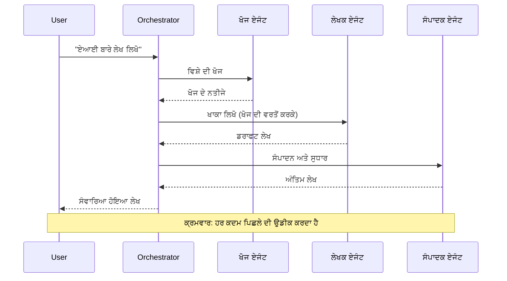
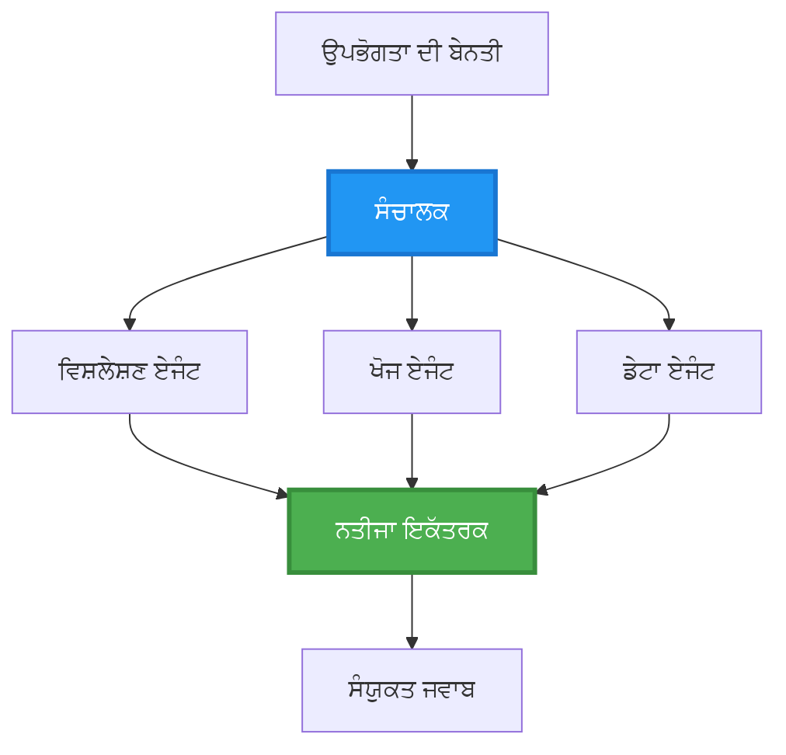
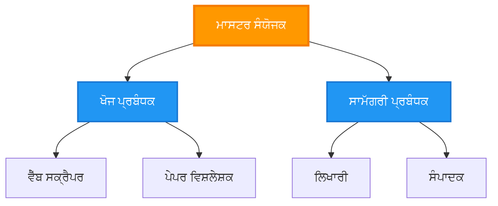
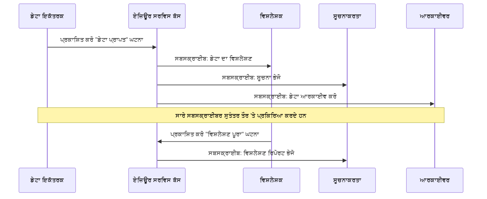
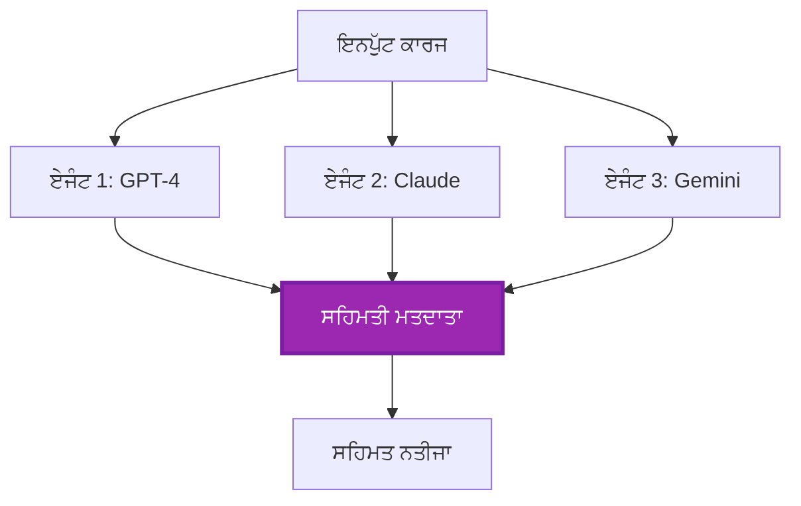
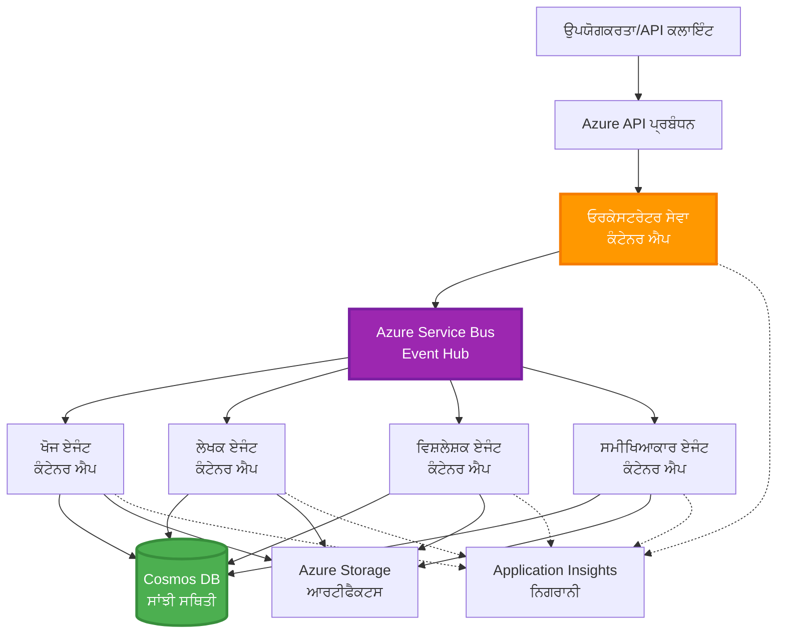

# ਮਲਟੀ-ਏਜੰਟ ਕੋਆਰਡੀਨੇਸ਼ਨ ਪੈਟਰਨ

⏱️ **ਅੰਦਾਜ਼ਾ ਸਮਾਂ**: 60-75 minutes | 💰 **ਅੰਦਾਜ਼ਾ ਲਾਗਤ**: ~$100-300/month | ⭐ **ਜਟਿਲਤਾ**: ਉੱਨਤ

**📚 ਸਿੱਖਣ ਦਾ ਪਾਥ:**
- ← Previous: [ਛਮਤਾ ਯੋਜਨਾ](capacity-planning.md) - ਰਿਸੋਰਸ ਆਕਾਰ ਨਿਰਧਾਰਣ ਅਤੇ ਸਕੇਲਿੰਗ ਰਣਨੀਤੀਆਂ
- 🎯 **ਤੁਸੀਂ ਇੱਥੇ ਹੋ**: ਮਲਟੀ-ਏਜੰਟ ਕੋਆਰਡੀਨੇਸ਼ਨ ਪੈਟਰਨ (Orchestration, communication, state management)
- → Next: [SKU ਚੋਣ](sku-selection.md) - ਠੀਕ Azure ਸੇਵਾਵਾਂ ਚੁਣਣਾ
- 🏠 [ਕੋਰਸ ਹੋਮ](../../README.md)

---

## ਤੁਸੀਂ ਕੀ ਸਿੱਖੋਗੇ

ਇਸ ਪਾਠ ਨੂੰ ਪੂਰਾ ਕਰਨ 'ਤੇ, ਤੁਸੀਂ:
- ਸਮਝੋਗੇ **ਮਲਟੀ-ਏਜੰਟ ਆਰਕੀਟੈਕਚਰ** ਪੈਟਰਨ ਅਤੇ ਕਦੋਂ ਇਹਨਾਂ ਨੂੰ ਵਰਤਣਾ ਹੈ
- ਲਾਗੂ ਕਰੋਗੇ **ਓਰਕੇਸਟਰਸ਼ਨ ਪੈਟਰਨ** (ਕੇਂਦਰੀ, ਡੀਸੈਂਟਰਲਾਈਜ਼ਡ, ਹਾਇਰਾਰਕੀਕਲ)
- ਡਿਜ਼ਾਈਨ ਕਰੋਗੇ **ਏਜੰਟ ਸੰਚਾਰ** ਰਣਨੀਤੀਆਂ (ਸਿੰਕਰੋਨਸ, ਅਸਿੰਕਰੋਨਸ, ਇਵੈਂਟ-ਚਾਲਿਤ)
- ਵੰਡੇ ਹੋਏ ਏਜੰਟਾਂ ਵਿੱਚ **ਸਾਂਝਾ ਸਟੇਟ** ਦਾ ਪ੍ਰਬੰਧ ਕਰੋਗੇ
- AZD ਨਾਲ Azure 'ਤੇ **ਮਲਟੀ-ਏਜੰਟ ਸਿਸਟਮ** ਤੈਨਾਤ ਕਰੋਗੇ
- ਅਸਲੀ ਦੁਨੀਆ ਦੇ AI ਸੇਟਿੰਗਾਂ ਲਈ **ਕੋਆਰਡੀਨੇਸ਼ਨ ਪੈਟਰਨ** ਲਾਗੂ ਕਰੋਗੇ
- ਵੰਡੇ ਹੋਏ ਏਜੰਟ ਸਿਸਟਮਾਂ ਦੀ ਨਿਗਰਾਨੀ ਅਤੇ ਡੀਬੱਗਿੰਗ ਕਰੋਗੇ

## ਕਿਉਂ ਮਲਟੀ-ਏਜੰਟ ਕੋਆਰਡੀਨੇਸ਼ਨ ਮਹੱਤਵਪੂਰਨ ਹੈ

### ਵਿਕਾਸ: ਸਿੰਗਲ ਏਜੰਟ ਤੋਂ ਮਲਟੀ-ਏਜੰਟ ਤੱਕ

**ਸਿੰਗਲ ਏਜੰਟ (ਸਰਲ):**
```
User → Agent → Response
```
- ✅ ਸਮਝਣ ਅਤੇ ਲਾਗੂ ਕਰਨ ਵਿੱਚ ਆਸਾਨ
- ✅ ਸਧਾਰਨ ਕਾਰਜਾਂ ਲਈ ਤੇਜ਼
- ❌ ਇਕਲੈ ਮਾਡਲ ਦੀਆਂ ਸਮਰੱਥਾਵਾਂ ਦੁਆਰਾ ਸੀਮਿਤ
- ❌ ਜਟਿਲ ਕਾਰਜਾਂ ਨੂੰ ਪੈਰਲੇਲ ਨਹੀਂ ਕਰ ਸਕਦਾ
- ❌ ਕੋਈ ਵਿਸ਼ੇਸ਼ੀਕਰਨ ਨਹੀਂ

**ਮਲਟੀ-ਏਜੰਟ ਸਿਸਟਮ (ਉੱਨਤ):**
```
           ┌─────────────┐
           │ Orchestrator│
           └──────┬──────┘
        ┌─────────┼─────────┐
        │         │         │
    ┌───▼──┐  ┌──▼───┐  ┌──▼────┐
    │Agent1│  │Agent2│  │Agent3 │
    │(Plan)│  │(Code)│  │(Review)│
    └──────┘  └──────┘  └───────┘
```
- ✅ ਖਾਸ ਕਾਰਜਾਂ ਲਈ ਵਿਸ਼ੇਸ਼ ਏਜੰਟ
- ✅ ਤੇਜ਼ੀ ਲਈ ਪੈਰਲੇਲ ਐਕਜ਼ਿਕਿਊਸ਼ਨ
- ✅ ਮੋਡੀਊਲਰ ਅਤੇ ਰੱਖ-ਰਖਾਅ ਯੋਗ
- ✅ ਜਟਿਲ ਵਰਕਫਲੋਜ਼ ਵਿੱਚ ਬਿਹਤਰ
- ⚠️ ਕੋਆਰਡੀਨੇਸ਼ਨ ਲਾਜਿਕ ਦੀ ਲੋੜ

**ਉਪਮਾ**: ਸਿੰਗਲ ਏਜੰਟ ਇੱਕ ਵਿਅਕਤੀ ਵਾਂਗ ਹੈ ਜੋ ਸਾਰੇ ਕੰਮ ਕਰ ਰਿਹਾ ਹੈ। ਮਲਟੀ-ਏਜੰਟ ਇੱਕ ਟੀਮ ਵਾਂਗ ਹੈ ਜਿਸ ਵਿੱਚ ਹਰ ਮੈਂਬਰ ਕੋਲ ਵਿਸ਼ੇਸ਼ ਹੁਨਰ ਹੁੰਦੇ ਹਨ (ਖੋਜਕਰਤਾ, ਕੋਡਰ, ਸਮੀਖਿਆਕਾਰ, ਲੇਖਕ) ਜੋ ਮਿਲ ਕੇ ਕੰਮ ਕਰਦੇ ਹਨ।

---

## ਮੁੱਖ ਕੋਆਰਡੀਨੇਸ਼ਨ ਪੈਟਰਨ

### ਪੈਟਰਨ 1: ਕ੍ਰਮਵਾਰ ਕੋਆਰਡੀਨੇਸ਼ਨ (ਜ਼ਿੰਮੇਵਾਰੀ ਦੀ ਲੜੀ)

**ਕਦੋਂ ਵਰਤਣਾ ਹੈ**: ਟਾਸਕ ਖਾਸ ਕ੍ਰਮ ਵਿੱਚ ਪੂਰੇ ਹੋਣੇ ਚਾਹੀਦੇ ਹਨ, ਹਰ ਏਜੰਟ ਪਿਛਲੇ ਆਊਟਪੁੱਟ 'ਤੇ ਨਿਰਭਰ ਕਰਦਾ ਹੈ।


**ਫਾਇਦੇ:**
- ✅ ਸਪਸ਼ਟ ਡੇਟਾ ਫਲੋ
- ✅ ਡੀਬੱਗ ਕਰਨ ਵਿੱਚ ਆਸਾਨ
- ✅ ਪੂਰਵ ਅਨੁਮਾਨਯੋਗ ਚਲਾਉਣ ਕ੍ਰਮ

**ਸੀਮਾਵਾਂ:**
- ❌ ਧੀਮਾ (ਕੋਈ ਪੈਰਲੇਲਿਜ਼ਮ ਨਹੀਂ)
- ❌ ਇੱਕ ਫੇਲ੍ਹ ਸਾਰੀ ਲੜੀ ਨੂੰ ਰੋਕਦਾ ਹੈ
- ❌ ਆਪਸੀ ਨਿਰਭਰ ਟਾਸਕਾਂ ਨੂੰ ਸੰਭਾਲ ਨਹੀਂ ਸਕਦਾ

**ਉਦਾਹਰਣ ਵਰਤੋਂ ਕੇਸ:**
- Content creation pipeline (research → write → edit → publish)
- Code generation (plan → implement → test → deploy)
- Report generation (data collection → analysis → visualization → summary)

---

### ਪੈਟਰਨ 2: ਪੈਰਲੇਲ ਕੋਆਰਡੀਨੇਸ਼ਨ (Fan-Out/Fan-In)

**ਕਦੋਂ ਵਰਤਣਾ ਹੈ**: ਸੁਤੰਤਰ ਕਾਰਜ ਇਕੱਠੇ ਇੱਕ ਨਾਲ ਚਲ ਸਕਦੇ ਹਨ, ਨਤੀਜੇ ਅੰਤ ਵਿੱਚ ਮਿਲਾ ਦਿੱਤੇ ਜਾਂਦੇ ਹਨ।


**ਫਾਇਦੇ:**
- ✅ ਤੇਜ਼ (ਪੈਰਲੇਲ ਐਕਜ਼ਿਕਿਊਸ਼ਨ)
- ✅ ਫਾਲਟ-ਟੋਲਰੈਂਟ (ਅੰਸ਼ਿਕ ਨਤੀਜੇ ਸਵੀਕਾਰਯੋਗ)
- ✅ ਹੋਰਾਈਜ਼ਾਂਟਲ ਤੌਰ 'ਤੇ ਸਕੇਲ ਹੁੰਦਾ ਹੈ

**ਸੀਮਾਵਾਂ:**
- ⚠️ ਨਤੀਜੇ ਅਕਸਰ ਕ੍ਰਮ ਤੋਂ ਬਾਹਰ ਆ ਸਕਦੇ ਹਨ
- ⚠️ ਇਕੱਠਾ ਕਰਨ ਦੀ ਲਾਜਿਕ ਦੀ ਲੋੜ
- ⚠️ ਜਟਿਲ ਸਟੇਟ ਪ੍ਰਬੰਧਨ

**ਉਦਾਹਰਣ ਵਰਤੋਂ ਕੇਸ:**
- Multi-source data gathering (APIs + databases + web scraping)
- Competitive analysis (multiple models generate solutions, best selected)
- Translation services (translate to multiple languages simultaneously)

---

### ਪੈਟਰਨ 3: ਹਾਇਰਾਰਕੀਕਲ ਕੋਆਰਡੀਨੇਸ਼ਨ (Manager-Worker)

**ਕਦੋਂ ਵਰਤਣਾ ਹੈ**: ਉਪ-ਟਾਸਕਾਂ ਵਾਲੇ ਜਟਿਲ ਵਰਕਫਲੋ, ਡੈਲੀਗੇਸ਼ਨ ਦੀ ਲੋੜ ਹੋਵੇ।


**ਫਾਇਦੇ:**
- ✅ ਜਟਿਲ ਵਰਕਫਲੋਜ਼ ਨੂੰ ਸੰਭਾਲਦਾ ਹੈ
- ✅ ਮੋਡੀਊਲਰ ਅਤੇ ਰੱਖ-ਰਖਾਅ ਯੋਗ
- ✅ ਜ਼ਿੰਮੇਵਾਰੀ ਦੀਆਂ ਸਪਸ਼ਟ ਹੱਦਾਂ

**ਸੀਮਾਵਾਂ:**
- ⚠️ ਵੱਧ ਜਟਿਲ ਆਰਕੀਟੈਕਚਰ
- ⚠️ ਵੱਧ ਲੇਟੇਸੀ (ਕਈ ਕੋਆਰਡੀਨੇਸ਼ਨ ਲੇਅਰਜ਼)
- ⚠️ ਬਹੁਤ ਪਰੇਖਸ਼ਿਤ ਓਰਕੇਸਟਰਸ਼ਨ ਦੀ ਲੋੜ

**ਉਦਾਹਰਣ ਵਰਤੋਂ ਕੇਸ:**
- Enterprise document processing (classify → route → process → archive)
- Multi-stage data pipelines (ingest → clean → transform → analyze → report)
- Complex automation workflows (planning → resource allocation → execution → monitoring)

---

### ਪੈਟਰਨ 4: ਇਵੈਂਟ-ਚਾਲਿਤ ਕੋਆਰਡੀਨੇਸ਼ਨ (Publish-Subscribe)

**ਕਦੋਂ ਵਰਤਣਾ ਹੈ**: ਏਜੰਟਾਂ ਨੂੰ ਘਟਨਾਵਾਂ 'ਤੇ ਪ੍ਰਤੀਕ੍ਰਿਆ ਦੇਣੀ ਚਾਹੀਦੀ ਹੈ, ਢਿੱਲਾ ਕਪਲਿੰਗ ਚਾਹੀਦਾ ਹੋਵੇ।


**ਫਾਇਦੇ:**
- ✅ ਏਜੰਟਾਂ ਦਰਮਿਆਨ ਢਿੱਲਾ ਕਪਲਿੰਗ
- ✅ ਨਵੇਂ ਏਜੰਟਾਂ ਜੋੜਨਾ ਆਸਾਨ (ਸਿਰਫ਼ ਸਬਸਕ੍ਰਾਈਬ ਕਰੋ)
- ✅ ਅਸਿੰਕਰੋਨਸ ਪ੍ਰਕਿਰਿਆ
- ✅ ਲਚਕੀਲਾ (ਮੇਸੇਜ ਪਿਰਸਿਸਟੈਂਸ)

**ਸੀਮਾਵਾਂ:**
- ⚠️ ਅੰਤਿਮ ਸਮਰੂਪਤਾ
- ⚠️ ਜਟਿਲ ਡੀਬੱਗਿੰਗ
- ⚠️ ਮੈਸੇਜ ਦੀ ਕ੍ਰਮਬੱਧਤਾ ਵਿੱਚ ਚੁਣੌਤੀਆਂ

**ਉਦਾਹਰਣ ਵਰਤੋਂ ਕੇਸ:**
- Real-time monitoring systems (alerts, dashboards, logs)
- Multi-channel notifications (email, SMS, push, Slack)
- Data processing pipelines (multiple consumers of same data)

---

### ਪੈਟਰਨ 5: ਸਹਿਮਤੀ-ਅਧਾਰਿਤ ਕੋਆਰਡੀਨੇਸ਼ਨ (Voting/Quorum)

**ਕਦੋਂ ਵਰਤਣਾ ਹੈ**: ਅੱਗੇ ਵਧਣ ਤੋਂ ਪਹਿਲਾਂ ਕਈ ਏਜੰਟਾਂ ਦੀ ਸਹਿਮਤੀ ਦੀ ਲੋੜ ਹੋਵੇ।



**ਫਾਇਦੇ:**
- ✅ ਉੱਚੀ ਸਹੀਤਾ (ਕਈ ਰਾਏਆਂ)
- ✅ ਫਾਲਟ-ਟੋਲਰੈਂਟ (ਛੋਟੀ ਗਿਣਤੀ ਦੀ ਅਸਫਲਤਾ ਮਨਜ਼ੂਰ)
- ✅ ਗੁਣਵੱਤਾ ਯਕੀਨ ਨਿਰਮਿਤ

**ਸੀਮਾਵਾਂ:**
- ❌ ਮਹਿੰਗਾ (ਕਈ ਮਾਡਲ ਕਾਲਾਂ)
- ❌ ਧੀਮਾ (ਸਾਰੇ ਏਜੰਟਾਂ ਦੀ ਉਡੀਕ)
- ⚠️ ਸੰਘਰਸ਼ ਨਿਪਟਾਰਾ ਲੋੜੀਂਦਾ

**ਉਦਾਹਰਣ ਵਰਤੋਂ ਕੇਸ:**
- Content moderation (multiple models review content)
- Code review (multiple linters/analyzers)
- Medical diagnosis (multiple AI models, expert validation)

---

## ਆਰਕੀਟੈਕਚਰ ਦਾ ਓਵਰਵਿਊ

### Complete Multi-Agent System on Azure


**ਮੁੱਖ ਭਾਗ:**

| Component | Purpose | Azure Service |
|-----------|---------|---------------|
| **API Gateway** | ਐਂਟ੍ਰੀ ਪਾਇੰਟ, ਰੇਟ ਲਿਮਿਟਿੰਗ, ਪ੍ਰਮਾਣਕਰਨ | API Management |
| **Orchestrator** | ਏਜੰਟ ਵਰਕਫਲੋਜ਼ ਦੀ ਕੋਆਰਡੀਨੇਸ਼ਨ | Container Apps |
| **Message Queue** | ਅਸਿੰਕਰੋਨਸ ਸੰਚਾਰ | Service Bus / Event Hubs |
| **Agents** | ਖਾਸ AI ਵਰਕਰ | Container Apps / Functions |
| **State Store** | ਸਾਂਝਾ ਸਟੇਟ, ਟਾਸਕ ਟਰੈਕਿੰਗ | Cosmos DB |
| **Artifact Storage** | ਦਸਤਾਵੇਜ਼, ਨਤੀਜੇ, ਲੋਗ | Blob Storage |
| **Monitoring** | ਵੰਡਿਆ ਹੋਇਆ ਟਰੇਸਿੰਗ, ਲੋਗ | Application Insights |

---

## ਪਹਿਲਾਂ ਦੀਆਂ ਲੋੜਾਂ

### ਜ਼ਰੂਰੀ ਟੂਲ

```bash
# Azure Developer CLI ਦੀ ਪੁਸ਼ਟੀ ਕਰੋ
azd version
# ✅ ਉਮੀਦ: azd ਵਰਜਨ 1.0.0 ਜਾਂ ਵੱਧ

# Azure CLI ਦੀ ਪੁਸ਼ਟੀ ਕਰੋ
az --version
# ✅ ਉਮੀਦ: azure-cli ਵਰਜન 2.50.0 ਜਾਂ ਵੱਧ

# Docker ਦੀ ਪੁਸ਼ਟੀ ਕਰੋ (ਸਥਾਨਕ ਟੈਸਟਿੰਗ ਲਈ)
docker --version
# ✅ ਉਮੀਦ: Docker ਵਰਜਨ 20.10 ਜਾਂ ਵੱਧ
```

### Azure ਦੀਆਂ ਲੋੜਾਂ

- ਐਕਟਿਵ Azure subscription
- ਬਣਾਉਣ ਲਈ ਅਧਿਕਾਰ:
  - Container Apps
  - Service Bus namespaces
  - Cosmos DB accounts
  - Storage accounts
  - Application Insights

### ਜ਼ਰੂਰੀ ਗਿਆਨ

ਤੁਹਾਨੂੰ ਹੇਠ ਲਿਖੇ ਪਾਠ ਪੂਰੇ ਕੀਤੇ ਹੋਣੇ ਚਾਹੀਦੇ ਹਨ:
- [ਕਨਫਿਗਰੇਸ਼ਨ ਪ੍ਰਬੰਧਨ](../chapter-03-configuration/configuration.md)
- [ਪ੍ਰਮਾਣਿਕਤਾ ਅਤੇ ਸੁਰੱਖਿਆ](../chapter-03-configuration/authsecurity.md)
- [Microservices Example](../../../../examples/microservices)

---

## ਲਾਗੂ ਕਰਨ ਲਈ ਮਾਰਗਦਰਸ਼ਨ

### ਪ੍ਰੋਜੈਕਟ ਰਚਨਾ

```
multi-agent-system/
├── azure.yaml                    # AZD configuration
├── infra/
│   ├── main.bicep               # Main infrastructure
│   ├── core/
│   │   ├── servicebus.bicep     # Message queue
│   │   ├── cosmos.bicep         # State store
│   │   ├── storage.bicep        # Artifact storage
│   │   └── monitoring.bicep     # Application Insights
│   └── app/
│       ├── orchestrator.bicep   # Orchestrator service
│       └── agent.bicep          # Agent template
└── src/
    ├── orchestrator/            # Orchestration logic
    │   ├── app.py
    │   ├── workflows.py
    │   └── Dockerfile
    ├── agents/
    │   ├── research/            # Research agent
    │   ├── writer/              # Writer agent
    │   ├── analyst/             # Analyst agent
    │   └── reviewer/            # Reviewer agent
    └── shared/
        ├── state_manager.py     # Shared state logic
        └── message_handler.py   # Message handling
```

---

## ਪਾਠ 1: ਕ੍ਰਮਵਾਰ ਕੋਆਰਡੀਨੇਸ਼ਨ ਪੈਟਰਨ

### ਲਾਗੂ ਕਰਨ: ਕੰਟੈਂਟ ਬਣਾਉਣ ਪਾਈਪਲਾਈਨ

ਆਓ ਇੱਕ ਕ੍ਰਮਵਾਰ ਪਾਈਪਲਾਈਨ ਬਣਾਈਏ: ਖੋਜ → ਲਿਖੋ → ਸੰਪਾਦਨ → ਪ੍ਰਕਾਸ਼ਿਤ

### 1. AZD ਕੰਫਿਗਰੇਸ਼ਨ

**ਫਾਈਲ: `azure.yaml`**

```yaml
name: content-pipeline
metadata:
  template: multi-agent-sequential@1.0.0

services:
  orchestrator:
    project: ./src/orchestrator
    language: python
    host: containerapp
  
  research-agent:
    project: ./src/agents/research
    language: python
    host: containerapp
  
  writer-agent:
    project: ./src/agents/writer
    language: python
    host: containerapp
  
  editor-agent:
    project: ./src/agents/editor
    language: python
    host: containerapp
```

### 2. Infrastructure: Service Bus for Coordination

**ਫਾਈਲ: `infra/core/servicebus.bicep`**

```bicep
param name string
param location string
param tags object = {}

resource serviceBusNamespace 'Microsoft.ServiceBus/namespaces@2022-10-01-preview' = {
  name: name
  location: location
  tags: tags
  sku: {
    name: 'Standard'
    tier: 'Standard'
  }
  properties: {
    minimumTlsVersion: '1.2'
  }
}

// Queue for orchestrator → research agent
resource researchQueue 'Microsoft.ServiceBus/namespaces/queues@2022-10-01-preview' = {
  parent: serviceBusNamespace
  name: 'research-tasks'
  properties: {
    maxDeliveryCount: 3
    lockDuration: 'PT5M'
    deadLetteringOnMessageExpiration: true
  }
}

// Queue for research agent → writer agent
resource writerQueue 'Microsoft.ServiceBus/namespaces/queues@2022-10-01-preview' = {
  parent: serviceBusNamespace
  name: 'writer-tasks'
  properties: {
    maxDeliveryCount: 3
    lockDuration: 'PT5M'
  }
}

// Queue for writer agent → editor agent
resource editorQueue 'Microsoft.ServiceBus/namespaces/queues@2022-10-01-preview' = {
  parent: serviceBusNamespace
  name: 'editor-tasks'
  properties: {
    maxDeliveryCount: 3
    lockDuration: 'PT5M'
  }
}

output namespace string = serviceBusNamespace.name
output connectionString string = listKeys('${serviceBusNamespace.id}/AuthorizationRules/RootManageSharedAccessKey', serviceBusNamespace.apiVersion).primaryConnectionString
```

### 3. Shared State Manager

**ਫਾਈਲ: `src/shared/state_manager.py`**

```python
from azure.cosmos import CosmosClient, PartitionKey
from datetime import datetime
import os

class StateManager:
    """Manages shared state across agents using Cosmos DB"""
    
    def __init__(self):
        endpoint = os.environ['COSMOS_ENDPOINT']
        key = os.environ['COSMOS_KEY']
        
        self.client = CosmosClient(endpoint, key)
        self.database = self.client.get_database_client('agent-state')
        self.container = self.database.get_container_client('tasks')
    
    def create_task(self, task_id: str, task_type: str, input_data: dict):
        """Create a new task"""
        task = {
            'id': task_id,
            'type': task_type,
            'status': 'pending',
            'input': input_data,
            'created_at': datetime.utcnow().isoformat(),
            'steps': []
        }
        self.container.create_item(task)
        return task
    
    def update_task_step(self, task_id: str, step_name: str, result: dict):
        """Update task with completed step"""
        task = self.container.read_item(task_id, partition_key=task_id)
        
        task['steps'].append({
            'name': step_name,
            'completed_at': datetime.utcnow().isoformat(),
            'result': result
        })
        
        self.container.replace_item(task_id, task)
        return task
    
    def complete_task(self, task_id: str, final_result: dict):
        """Mark task as complete"""
        task = self.container.read_item(task_id, partition_key=task_id)
        task['status'] = 'completed'
        task['result'] = final_result
        task['completed_at'] = datetime.utcnow().isoformat()
        self.container.replace_item(task_id, task)
        return task
    
    def get_task(self, task_id: str):
        """Retrieve task state"""
        return self.container.read_item(task_id, partition_key=task_id)
```

### 4. Orchestrator Service

**ਫਾਈਲ: `src/orchestrator/app.py`**

```python
from flask import Flask, request, jsonify
from azure.servicebus import ServiceBusClient, ServiceBusMessage
import json
import uuid
import os
from shared.state_manager import StateManager

app = Flask(__name__)
state_manager = StateManager()

# ਸਰਵਿਸ ਬਸ ਕਨੈਕਸ਼ਨ
servicebus_connection_str = os.environ['SERVICEBUS_CONNECTION_STRING']
servicebus_client = ServiceBusClient.from_connection_string(servicebus_connection_str)

@app.route('/health', methods=['GET'])
def health():
    return jsonify({'status': 'healthy', 'service': 'orchestrator'})

@app.route('/create-content', methods=['POST'])
def create_content():
    """
    Sequential workflow: Research → Write → Edit → Publish
    """
    data = request.json
    topic = data.get('topic')
    
    if not topic:
        return jsonify({'error': 'Topic required'}), 400
    
    # ਸਟੇਟ ਸਟੋਰ ਵਿੱਚ ਟਾਸਕ ਬਣਾਓ
    task_id = str(uuid.uuid4())
    task = state_manager.create_task(
        task_id=task_id,
        task_type='content_creation',
        input_data={'topic': topic}
    )
    
    # ਰਿਸਰਚ ਏਜੰਟ ਨੂੰ ਸੁਨੇਹਾ ਭੇਜੋ (ਪਹਿਲਾ ਕਦਮ)
    sender = servicebus_client.get_queue_sender('research-tasks')
    message = ServiceBusMessage(
        body=json.dumps({
            'task_id': task_id,
            'topic': topic,
            'next_queue': 'writer-tasks'  # ਨਤੀਜੇ ਕਿੱਥੇ ਭੇਜੇ ਜਾਣ?
        }),
        content_type='application/json'
    )
    
    with sender:
        sender.send_messages(message)
    
    return jsonify({
        'task_id': task_id,
        'status': 'started',
        'workflow': 'sequential',
        'steps': ['research', 'write', 'edit', 'publish'],
        'message': 'Content creation pipeline initiated'
    }), 202

@app.route('/task/<task_id>', methods=['GET'])
def get_task_status(task_id):
    """Check task status"""
    try:
        task = state_manager.get_task(task_id)
        return jsonify(task)
    except Exception as e:
        return jsonify({'error': str(e)}), 404

if __name__ == '__main__':
    app.run(host='0.0.0.0', port=8080)
```

### 5. Research Agent

**ਫਾਈਲ: `src/agents/research/app.py`**

```python
from azure.servicebus import ServiceBusClient, ServiceBusMessage
from openai import AzureOpenAI
import json
import os
import time
from shared.state_manager import StateManager

# ਕਲਾਇੰਟਾਂ ਨੂੰ ਸ਼ੁਰੂ ਕਰੋ
state_manager = StateManager()
servicebus_client = ServiceBusClient.from_connection_string(
    os.environ['SERVICEBUS_CONNECTION_STRING']
)

openai_client = AzureOpenAI(
    api_key=os.environ['AZURE_OPENAI_API_KEY'],
    api_version="2024-02-01",
    azure_endpoint=os.environ['AZURE_OPENAI_ENDPOINT']
)

def process_research_task(message_data):
    """Process research request and pass to writer"""
    task_id = message_data['task_id']
    topic = message_data['topic']
    next_queue = message_data['next_queue']
    
    print(f"🔬 Researching: {topic}")
    
    # ਖੋਜ ਲਈ Azure OpenAI ਨੂੰ ਕਾਲ ਕਰੋ
    response = openai_client.chat.completions.create(
        model="gpt-4",
        messages=[
            {"role": "system", "content": "You are a research assistant. Provide comprehensive research on the given topic."},
            {"role": "user", "content": f"Research this topic thoroughly: {topic}"}
        ],
        max_tokens=1500
    )
    
    research_results = response.choices[0].message.content
    
    # ਸਥਿਤੀ ਅੱਪਡੇਟ ਕਰੋ
    state_manager.update_task_step(
        task_id=task_id,
        step_name='research',
        result={'research': research_results}
    )
    
    # ਅਗਲੇ ਏਜੰਟ (ਲੇਖਕ) ਨੂੰ ਭੇਜੋ
    sender = servicebus_client.get_queue_sender(next_queue)
    message = ServiceBusMessage(
        body=json.dumps({
            'task_id': task_id,
            'topic': topic,
            'research': research_results,
            'next_queue': 'editor-tasks'
        }),
        content_type='application/json'
    )
    
    with sender:
        sender.send_messages(message)
    
    print(f"✅ Research complete for task {task_id}")

def main():
    """Listen to research queue"""
    receiver = servicebus_client.get_queue_receiver('research-tasks')
    
    print("🔬 Research Agent started, listening for tasks...")
    
    with receiver:
        while True:
            messages = receiver.receive_messages(max_wait_time=5)
            for message in messages:
                try:
                    message_data = json.loads(str(message))
                    process_research_task(message_data)
                    receiver.complete_message(message)
                except Exception as e:
                    print(f"❌ Error processing message: {e}")
                    receiver.abandon_message(message)

if __name__ == '__main__':
    main()
```

### 6. Writer Agent

**ਫਾਈਲ: `src/agents/writer/app.py`**

```python
from azure.servicebus import ServiceBusClient, ServiceBusMessage
from openai import AzureOpenAI
import json
import os
from shared.state_manager import StateManager

state_manager = StateManager()
servicebus_client = ServiceBusClient.from_connection_string(
    os.environ['SERVICEBUS_CONNECTION_STRING']
)

openai_client = AzureOpenAI(
    api_key=os.environ['AZURE_OPENAI_API_KEY'],
    api_version="2024-02-01",
    azure_endpoint=os.environ['AZURE_OPENAI_ENDPOINT']
)

def process_writing_task(message_data):
    """Write article based on research"""
    task_id = message_data['task_id']
    topic = message_data['topic']
    research = message_data['research']
    next_queue = message_data['next_queue']
    
    print(f"✍️ Writing article: {topic}")
    
    # ਲੇਖ ਲਿਖਣ ਲਈ Azure OpenAI ਨੂੰ ਕਾਲ ਕਰੋ
    response = openai_client.chat.completions.create(
        model="gpt-4",
        messages=[
            {"role": "system", "content": "You are a professional writer. Write engaging, well-structured articles."},
            {"role": "user", "content": f"Based on this research:\n\n{research}\n\nWrite a comprehensive article about: {topic}"}
        ],
        max_tokens=2000
    )
    
    article_draft = response.choices[0].message.content
    
    # ਸਟੇਟ ਅਪਡੇਟ ਕਰੋ
    state_manager.update_task_step(
        task_id=task_id,
        step_name='writing',
        result={'draft': article_draft}
    )
    
    # ਸੰਪਾਦਕ ਨੂੰ ਭੇਜੋ
    sender = servicebus_client.get_queue_sender(next_queue)
    message = ServiceBusMessage(
        body=json.dumps({
            'task_id': task_id,
            'topic': topic,
            'draft': article_draft
        }),
        content_type='application/json'
    )
    
    with sender:
        sender.send_messages(message)
    
    print(f"✅ Article draft complete for task {task_id}")

def main():
    """Listen to writer queue"""
    receiver = servicebus_client.get_queue_receiver('writer-tasks')
    
    print("✍️ Writer Agent started, listening for tasks...")
    
    with receiver:
        while True:
            messages = receiver.receive_messages(max_wait_time=5)
            for message in messages:
                try:
                    message_data = json.loads(str(message))
                    process_writing_task(message_data)
                    receiver.complete_message(message)
                except Exception as e:
                    print(f"❌ Error: {e}")
                    receiver.abandon_message(message)

if __name__ == '__main__':
    main()
```

### 7. Editor Agent

**ਫਾਈਲ: `src/agents/editor/app.py`**

```python
from azure.servicebus import ServiceBusClient
from openai import AzureOpenAI
import json
import os
from shared.state_manager import StateManager

state_manager = StateManager()
servicebus_client = ServiceBusClient.from_connection_string(
    os.environ['SERVICEBUS_CONNECTION_STRING']
)

openai_client = AzureOpenAI(
    api_key=os.environ['AZURE_OPENAI_API_KEY'],
    api_version="2024-02-01",
    azure_endpoint=os.environ['AZURE_OPENAI_ENDPOINT']
)

def process_editing_task(message_data):
    """Edit and finalize article"""
    task_id = message_data['task_id']
    topic = message_data['topic']
    draft = message_data['draft']
    
    print(f"📝 Editing article: {topic}")
    
    # ਸੋਧ ਕਰਨ ਲਈ Azure OpenAI ਨੂੰ ਕਾਲ ਕਰੋ
    response = openai_client.chat.completions.create(
        model="gpt-4",
        messages=[
            {"role": "system", "content": "You are an expert editor. Improve grammar, clarity, and structure."},
            {"role": "user", "content": f"Edit and improve this article:\n\n{draft}"}
        ],
        max_tokens=2000
    )
    
    final_article = response.choices[0].message.content
    
    # ਟਾਸਕ ਨੂੰ ਪੂਰਾ ਮੰਨੋ
    state_manager.complete_task(
        task_id=task_id,
        final_result={
            'topic': topic,
            'final_article': final_article,
            'word_count': len(final_article.split())
        }
    )
    
    print(f"✅ Article finalized for task {task_id}")

def main():
    """Listen to editor queue"""
    receiver = servicebus_client.get_queue_receiver('editor-tasks')
    
    print("📝 Editor Agent started, listening for tasks...")
    
    with receiver:
        while True:
            messages = receiver.receive_messages(max_wait_time=5)
            for message in messages:
                try:
                    message_data = json.loads(str(message))
                    process_editing_task(message_data)
                    receiver.complete_message(message)
                except Exception as e:
                    print(f"❌ Error: {e}")
                    receiver.abandon_message(message)

if __name__ == '__main__':
    main()
```

### 8. Deploy and Test

```bash
# ਆਰੰਭ ਕਰੋ ਅਤੇ ਤੈਨਾਤ ਕਰੋ
azd init
azd up

# ਓਰਕੇਸਟਰੇਟਰ URL ਪ੍ਰਾਪਤ ਕਰੋ
ORCHESTRATOR_URL=$(azd env get-values | grep ORCHESTRATOR_URL | cut -d '=' -f2 | tr -d '"')

# ਸਮੱਗਰੀ ਬਣਾਓ
curl -X POST $ORCHESTRATOR_URL/create-content \
  -H "Content-Type: application/json" \
  -d '{"topic": "The Future of AI in Healthcare"}'
```

**✅ ਉਮੀਦ ਕੀਤੀ ਆਉਟਪੁੱਟ:**
```json
{
  "task_id": "a1b2c3d4-e5f6-7890-abcd-ef1234567890",
  "status": "started",
  "workflow": "sequential",
  "steps": ["research", "write", "edit", "publish"],
  "message": "Content creation pipeline initiated"
}
```

**ਟਾਸਕ ਪ੍ਰਗਤੀ ਜਾਂਚੋ:**
```bash
TASK_ID="a1b2c3d4-e5f6-7890-abcd-ef1234567890"
curl $ORCHESTRATOR_URL/task/$TASK_ID
```

**✅ ਉਮੀਦ ਕੀਤੀ ਆਉਟਪੁੱਟ (ਪੂਰਾ):**
```json
{
  "id": "a1b2c3d4-e5f6-7890-abcd-ef1234567890",
  "type": "content_creation",
  "status": "completed",
  "steps": [
    {
      "name": "research",
      "completed_at": "2025-11-19T10:30:00Z",
      "result": {"research": "..."}
    },
    {
      "name": "writing",
      "completed_at": "2025-11-19T10:32:00Z",
      "result": {"draft": "..."}
    }
  ],
  "result": {
    "topic": "The Future of AI in Healthcare",
    "final_article": "...",
    "word_count": 1500
  }
}
```

---

## ਪਾਠ 2: ਪੈਰਲੇਲ ਕੋਆਰਡੀਨੇਸ਼ਨ ਪੈਟਰਨ

### ਲਾਗੂ ਕਰਨ: ਬਹੁ-ਸਰੋਤ ਖੋਜ ਐਗਰੀਗੇਟਰ

ਆਓ ਇੱਕ ਪੈਰਲੇਲ ਸਿਸਟਮ ਬਣਾਈਏ ਜੋ ਇੱਕੇ ਸਮੇਂ ਕਈ ਸਰੋਤਾਂ ਤੋਂ ਜਾਣਕਾਰੀ ਇਕੱਠੀ ਕਰਦਾ ਹੈ।

### Parallel Orchestrator

**ਫਾਈਲ: `src/orchestrator/parallel_workflow.py`**

```python
from flask import Flask, request, jsonify
from azure.servicebus import ServiceBusClient, ServiceBusMessage
import json
import uuid
import os
from shared.state_manager import StateManager

app = Flask(__name__)
state_manager = StateManager()

servicebus_client = ServiceBusClient.from_connection_string(
    os.environ['SERVICEBUS_CONNECTION_STRING']
)

@app.route('/research-parallel', methods=['POST'])
def research_parallel():
    """
    Parallel workflow: Multiple agents work simultaneously
    """
    data = request.json
    query = data.get('query')
    
    task_id = str(uuid.uuid4())
    task = state_manager.create_task(
        task_id=task_id,
        task_type='parallel_research',
        input_data={
            'query': query,
            'agents': ['web', 'academic', 'news', 'social']
        }
    )
    
    # ਫੈਨ-ਆਊਟ: ਇੱਕੋ ਸਮੇਂ ਸਾਰੇ ਏਜੰਟਾਂ ਨੂੰ ਭੇਜੋ
    agents = [
        ('web-research-queue', 'web'),
        ('academic-research-queue', 'academic'),
        ('news-research-queue', 'news'),
        ('social-research-queue', 'social')
    ]
    
    for queue_name, agent_type in agents:
        sender = servicebus_client.get_queue_sender(queue_name)
        message = ServiceBusMessage(
            body=json.dumps({
                'task_id': task_id,
                'query': query,
                'agent_type': agent_type,
                'result_queue': 'aggregation-queue'
            }),
            content_type='application/json'
        )
        
        with sender:
            sender.send_messages(message)
    
    return jsonify({
        'task_id': task_id,
        'status': 'started',
        'workflow': 'parallel',
        'agents_dispatched': 4,
        'message': 'Parallel research initiated'
    }), 202

if __name__ == '__main__':
    app.run(host='0.0.0.0', port=8080)
```

### Aggregation Logic

**ਫਾਈਲ: `src/agents/aggregator/app.py`**

```python
from azure.servicebus import ServiceBusClient
import json
import os
from collections import defaultdict
from shared.state_manager import StateManager

state_manager = StateManager()
servicebus_client = ServiceBusClient.from_connection_string(
    os.environ['SERVICEBUS_CONNECTION_STRING']
)

# ਨਤੀਜਿਆਂ ਨੂੰ ਹਰ ਕੰਮ ਲਈ ਟ੍ਰੈਕ ਕਰੋ
task_results = defaultdict(list)
expected_agents = 4  # ਵੈੱਬ, ਅਕਾਦਮਿਕ, ਖਬਰਾਂ, ਸੋਸ਼ਲ

def process_result(message_data):
    """Aggregate results from parallel agents"""
    task_id = message_data['task_id']
    agent_type = message_data['agent_type']
    result = message_data['result']
    
    # ਨਤੀਜਾ ਸਟੋਰ ਕਰੋ
    task_results[task_id].append({
        'agent': agent_type,
        'data': result
    })
    
    print(f"📊 Received result from {agent_type} agent ({len(task_results[task_id])}/{expected_agents})")
    
    # ਜਾਂਚੋ ਕਿ ਕੀ ਸਾਰੇ ਏਜੰਟ ਮੁਕੰਮਲ ਹੋ ਗਏ ਹਨ (ਫੈਨ-ਇਨ)
    if len(task_results[task_id]) == expected_agents:
        print(f"✅ All agents completed for task {task_id}. Aggregating...")
        
        # ਨਤੀਜਿਆਂ ਨੂੰ ਜੋੜੋ
        aggregated = {
            'query': message_data['query'],
            'sources': task_results[task_id],
            'summary': generate_summary(task_results[task_id])
        }
        
        # ਮੁਕੰਮਲ ਨਿਸ਼ਾਨ ਲਗਾਓ
        state_manager.complete_task(task_id, aggregated)
        
        # ਸਾਫ਼ ਕਰੋ
        del task_results[task_id]
        
        print(f"✅ Aggregation complete for task {task_id}")

def generate_summary(results):
    """Generate summary from all sources"""
    summaries = [r['data'].get('summary', '') for r in results]
    return '\n\n'.join(summaries)

def main():
    """Listen to aggregation queue"""
    receiver = servicebus_client.get_queue_receiver('aggregation-queue')
    
    print("📊 Aggregator started, listening for results...")
    
    with receiver:
        while True:
            messages = receiver.receive_messages(max_wait_time=5)
            for message in messages:
                try:
                    message_data = json.loads(str(message))
                    process_result(message_data)
                    receiver.complete_message(message)
                except Exception as e:
                    print(f"❌ Error: {e}")
                    receiver.abandon_message(message)

if __name__ == '__main__':
    main()
```

**ਪੈਰਲੇਲ ਪੈਟਰਨ ਦੇ ਫਾਇਦੇ:**
- ⚡ **4x ਤੇਜ਼** (ਏਜੰਟ ਇੱਕ ਸਮੇਂ ਚਲਦੇ ਹਨ)
- 🔄 **ਫਾਲਟ-ਟੋਲਰੈਂਟ** (ਅੰਸ਼ਿਕ ਨਤੀਜੇ ਮੰਨਯੋਗ)
- 📈 **ਸਕੇਲ ਕਰਨ ਯੋਗ** (ਅਸਾਨੀ ਨਾਲ ਹੋਰ ਏਜੰਟ ਜੋੜੋ)

---

## ਪ੍ਰਯੋਗਿਕ ਅਭਿਆਸ

### ਅਭਿਆਸ 1: ਟਾਈਮਆਉਟ ਹੈਂਡਲਿੰਗ ਜੋੜੋ ⭐⭐ (ਮੱਧਮ)

**ਮਕਸਦ**: ਟਾਈਮਆਉਟ ਲਾਜਿਕ ਲਾਗੂ ਕਰੋ ਤਾਂ ਜੋ ਐਗਰੀਗੇਟਰ ਧੀਮੇ ਏਜੰਟਾਂ ਲਈ ਸਦਾ ਉਡੀਕ ਨਾ ਕਰੇ।

**ਕਦਮ:**

1. **ਐਗਰੀਗੇਟਰ ਵਿੱਚ ਟਾਈਮਆਉਟ ਟਰੈਕਿੰਗ ਜੋੜੋ:**

```python
from datetime import datetime, timedelta

task_timeouts = {}  # task_id -> expiration_time

def process_result(message_data):
    task_id = message_data['task_id']
    
    # ਪਹਿਲੇ ਨਤੀਜੇ ਤੇ ਟਾਈਮਆਉਟ ਸੈੱਟ ਕਰੋ
    if task_id not in task_timeouts:
        task_timeouts[task_id] = datetime.utcnow() + timedelta(seconds=30)
    
    task_results[task_id].append({
        'agent': message_data['agent_type'],
        'data': message_data['result']
    })
    
    # ਚੈੱਕ ਕਰੋ ਕਿ ਇਹ ਪੂਰਾ ਹੋਇਆ ਹੈ ਜਾਂ ਟਾਈਮਆਉਟ ਹੋ ਗਿਆ ਹੈ
    if len(task_results[task_id]) == expected_agents or \
       datetime.utcnow() > task_timeouts[task_id]:
        
        print(f"📊 Aggregating with {len(task_results[task_id])}/{expected_agents} results")
        
        aggregated = {
            'query': message_data['query'],
            'sources': task_results[task_id],
            'completed_agents': len(task_results[task_id]),
            'timed_out': len(task_results[task_id]) < expected_agents
        }
        
        state_manager.complete_task(task_id, aggregated)
        
        # ਸਫਾਈ
        del task_results[task_id]
        del task_timeouts[task_id]
```

2. **ਕਲਪਿਤ ਦੇਰੀ ਨਾਲ ਟੈਸਟ ਕਰੋ:**

```python
# ਇੱਕ ਏਜੰਟ ਵਿੱਚ ਧੀਮੀ ਪ੍ਰਕਿਰਿਆ ਦੀ ਨਕਲ ਕਰਨ ਲਈ ਦੇਰੀ ਸ਼ਾਮਿਲ ਕਰੋ
import time
time.sleep(35)  # 30-ਸੈਕਿੰਡ ਦੀ ਟਾਈਮਆਉਟ ਤੋਂ ਵੱਧਦਾ ਹੈ
```

3. **ਡਿਪਲੌਇ ਅਤੇ ਪੁਸ਼ਟੀ ਕਰੋ:**

```bash
azd deploy aggregator

# ਟਾਸਕ ਜਮ੍ਹਾਂ ਕਰੋ
curl -X POST $ORCHESTRATOR_URL/research-parallel \
  -H "Content-Type: application/json" \
  -d '{"query": "AI safety research"}'

# 30 ਸਕਿੰਟ ਬਾਅਦ ਨਤੀਜੇ ਚੈੱਕ ਕਰੋ
curl $ORCHESTRATOR_URL/task/$TASK_ID
```

**✅ ਸਫ਼ਲਤਾ ਮਾਪਦੰਡ:**
- ✅ ਟਾਸਕ 30 ਸਕਿੰਟ ਵਿੱਚ ਪੂਰਾ ਹੋ ਜਾਂਦਾ ਹੈ ਭਾਵੇਂ ਏਜੰਟ ਅਧੂਰੇ ਹੋਣ
- ✅ ਜਵਾਬ ਵਿੱਚ ਅੰਸ਼ਿਕ ਨਤੀਜੇ ਦਰਸਾਏ ਜਾਣ (`"timed_out": true`)
- ✅ ਉਪਲੱਬਧ ਨਤੀਜੇ ਵਾਪਸ ਕੀਤੇ ਜਾਂਦੇ ਹਨ (4 ਵਿੱਚੋਂ 3 ਏਜੰਟ)

**ਸਮਾਂ**: 20-25 minutes

---

### ਅਭਿਆਸ 2: Retry Logic ਲਾਗੂ ਕਰੋ ⭐⭐⭐ (ਉੱਨਤ)

**ਮਕਸਦ**: ਫੇਲ ਹੋਏ ਏਜੰਟ ਟਾਸਕਾਂ ਨੂੰ ਅਟੋਮੈਟਿਕ ਤੌਰ 'ਤੇ ਰੀਟ੍ਰਾਈ ਕਰੋ ਪਹਿਲਾਂ ਕਿ ਹਾਰ ਮੰਨੋ।

**ਕਦਮ:**

1. **ਓਰਕੇਸਟਰ ਵਿੱਚ ਰੀਟ੍ਰਾਈ ਟਰੈਕਿੰਗ ਜੋੜੋ:**

```python
from dataclasses import dataclass
from typing import Dict

@dataclass
class RetryConfig:
    max_retries: int = 3
    backoff_seconds: int = 5

retry_counts: Dict[str, int] = {}  # ਸੁਨੇਹਾ_ਆਈਡੀ -> ਮੁੜ_ਕੋਸ਼ਿਸ਼_ਗਿਣਤੀ

def send_with_retry(queue_name: str, message_data: dict, retry_config: RetryConfig):
    """Send message with retry metadata"""
    message_id = message_data.get('message_id', str(uuid.uuid4()))
    message_data['message_id'] = message_id
    message_data['retry_count'] = retry_counts.get(message_id, 0)
    message_data['max_retries'] = retry_config.max_retries
    
    sender = servicebus_client.get_queue_sender(queue_name)
    message = ServiceBusMessage(
        body=json.dumps(message_data),
        content_type='application/json',
        message_id=message_id
    )
    
    with sender:
        sender.send_messages(message)
```

2. **ਏਜੰਟਾਂ ਵਿੱਚ ਰੀਟ੍ਰਾਈ ਹੈਂਡਲਰ ਜੋੜੋ:**

```python
def process_with_retry(message, receiver, process_func):
    """Process message with automatic retry on failure"""
    try:
        message_data = json.loads(str(message))
        
        # ਸੁਨੇਹੇ ਨੂੰ ਪ੍ਰਕਿਰਿਆ ਕਰੋ
        process_func(message_data)
        
        # ਸਫਲ - ਸਮਾਪਤ
        receiver.complete_message(message)
        
    except Exception as e:
        message_id = message.message_id
        retry_count = message_data.get('retry_count', 0)
        max_retries = message_data.get('max_retries', 3)
        
        if retry_count < max_retries:
            # ਮੁੜ ਕੋਸ਼ਿਸ਼: ਛੱਡ ਦਿਓ ਅਤੇ ਵਧਾਈ ਗਈ ਗਿਣਤੀ ਨਾਲ ਮੁੜ ਕਤਾਰ ਵਿੱਚ ਰੱਖੋ
            print(f"⚠️ Retry {retry_count + 1}/{max_retries} for message {message_id}")
            
            message_data['retry_count'] = retry_count + 1
            
            # ਉਹੀ ਕਤਾਰ ਵਿੱਚ ਦੇਰੀ ਨਾਲ ਵਾਪਸ ਭੇਜੋ
            time.sleep(5 * (retry_count + 1))  # ਐਕਸਪੋਨੈਂਸ਼ਲ ਬੈਕਆਫ
            send_with_retry(queue_name, message_data, RetryConfig())
            
            receiver.complete_message(message)  # ਮੂਲ ਨੂੰ ਹਟਾਓ
        else:
            # ਅਧਿਕਤਮ ਮੁੜ-ਕੋਸ਼ਿਸ਼ਾਂ ਪਾਰ ਹੋ ਗਈਆਂ - ਡੈੱਡ ਲੈਟਰ ਕਤਾਰ ਵਿੱਚ ਭੇਜੋ
            print(f"❌ Max retries exceeded for message {message_id}")
            receiver.dead_letter_message(
                message,
                reason="MaxRetriesExceeded",
                error_description=str(e)
            )
```

3. **ਡੈੱਡ ਲੈਟਰ ਕਿਊ ਦੀ ਨਿਗਰਾਨੀ ਕਰੋ:**

```python
def monitor_dead_letters():
    """Check dead letter queue for failed messages"""
    receiver = servicebus_client.get_queue_receiver(
        'research-queue',
        sub_queue='deadletter'
    )
    
    with receiver:
        messages = receiver.receive_messages(max_wait_time=5)
        for message in messages:
            print(f"☠️ Dead letter: {message.message_id}")
            print(f"Reason: {message.dead_letter_reason}")
            print(f"Description: {message.dead_letter_error_description}")
```

**✅ ਸਫ਼ਲਤਾ ਮਾਪਦੰਡ:**
- ✅ ਨਾਕਾਮ ਟਾਸਕ ਆਟੋਮੈਟਿਕ ਰੀਟ੍ਰਾਈ ਹੁੰਦੇ ਹਨ (ਵੱਧ ਤੋਂ ਵੱਧ 3 ਵਾਰੀ)
- ✅ ਰੀਟ੍ਰਾਈਜ਼ ਵਿੱਚ ਪ੍ਰਗਟਾਵਾ ਬੈਕਆਫ (5s, 10s, 15s)
- ✅ ਮੈਕਸ ਰੀਟ੍ਰਾਈ ਤੋਂ ਬਾਦ, ਮੇਸੇਜ ਡੈੱਡ ਲੈਟਰ ਕਿਊ ਵਿੱਚ ਜਾਂਦੇ ਹਨ
- ✅ ਡੈੱਡ ਲੈਟਰ ਕਿਊ ਦੀ ਨਿਗਰਾਨੀ ਅਤੇ ਰੀਪਲੇਅ ਸੰਭਵ ਹੈ

**ਸਮਾਂ**: 30-40 minutes

---

### ਅਭਿਆਸ 3: Circuit Breaker ਲਾਗੂ ਕਰੋ ⭐⭐⭐ (ਉੱਨਤ)

**ਮਕਸਦ**: ਅਸਫਲ ਏਜੰਟਾਂ ਨੂੰ ਬੇਅੰਤ ਰਿਕੁਐਸਟਾਂ ਤੋਂ ਰੋਕ ਕੇ cascading ਫੇਲ੍ਹ ਨੂੰ ਰੋਕੋ।

**ਕਦਮ:**

1. **Circuit breaker ਕਲਾਸ ਬਣਾਓ:**

```python
from enum import Enum
from datetime import datetime, timedelta

class CircuitState(Enum):
    CLOSED = "closed"      # ਸਧਾਰਨ ਚਾਲੂ ਹਾਲਤ
    OPEN = "open"          # ਅਸਫਲ ਹੋ ਰਿਹਾ ਹੈ, ਬੇਨਤੀਆਂ ਰੱਦ ਕਰੋ
    HALF_OPEN = "half_open"  # ਇਹ ਦੇਖਣ ਲਈ ਜਾਂਚ ਕੀਤੀ ਜਾ ਰਹੀ ਹੈ ਕਿ ਕੀ ਮੁੜ ਠੀਕ ਹੋ ਗਿਆ ਹੈ ਜਾਂ ਨਹੀਂ

class CircuitBreaker:
    def __init__(self, failure_threshold=5, timeout_seconds=60):
        self.failure_threshold = failure_threshold
        self.timeout_seconds = timeout_seconds
        self.failure_count = 0
        self.last_failure_time = None
        self.state = CircuitState.CLOSED
    
    def call(self, func):
        """Execute function with circuit breaker protection"""
        if self.state == CircuitState.OPEN:
            # ਜਾਂਚੋ ਕਿ ਟਾਈਮਆਉਟ ਖਤਮ ਹੋ ਗਿਆ ਹੈ ਜਾਂ ਨਹੀਂ
            if datetime.utcnow() - self.last_failure_time > timedelta(seconds=self.timeout_seconds):
                self.state = CircuitState.HALF_OPEN
                print("🔄 Circuit breaker: HALF_OPEN (testing)")
            else:
                raise Exception(f"Circuit breaker OPEN for agent. Try again in {self.timeout_seconds}s")
        
        try:
            result = func()
            
            # ਸਫਲਤਾ
            if self.state == CircuitState.HALF_OPEN:
                self.state = CircuitState.CLOSED
                self.failure_count = 0
                print("✅ Circuit breaker: CLOSED (recovered)")
            
            return result
            
        except Exception as e:
            self.failure_count += 1
            self.last_failure_time = datetime.utcnow()
            
            if self.failure_count >= self.failure_threshold:
                self.state = CircuitState.OPEN
                print(f"🔴 Circuit breaker: OPEN (too many failures)")
            
            raise e
```

2. **ਏਜੰਟ ਕਾਲਾਂ 'ਤੇ ਲਾਗੂ ਕਰੋ:**

```python
# ਆਰਕੈਸਟਰੇਟਰ ਵਿੱਚ
agent_circuits = {
    'web': CircuitBreaker(failure_threshold=5, timeout_seconds=60),
    'academic': CircuitBreaker(failure_threshold=5, timeout_seconds=60),
    'news': CircuitBreaker(failure_threshold=5, timeout_seconds=60),
    'social': CircuitBreaker(failure_threshold=5, timeout_seconds=60)
}

def send_to_agent(agent_type, message_data):
    """Send with circuit breaker protection"""
    circuit = agent_circuits[agent_type]
    
    try:
        circuit.call(lambda: send_message(agent_type, message_data))
    except Exception as e:
        print(f"⚠️ Skipping {agent_type} agent: {e}")
        # ਹੋਰ ਏਜੰਟਾਂ ਨਾਲ ਜਾਰੀ ਰੱਖੋ
```

3. **Circuit breaker ਦੀ ਟੈਸਟਿੰਗ ਕਰੋ:**

```bash
# ਬਾਰ ਬਾਰ ਦੀਆਂ ਨਾਕਾਮੀਆਂ ਦੀ ਨਕਲ ਕਰੋ (ਇੱਕ ਏਜੰਟ ਨੂੰ ਰੋਕੋ)
az containerapp stop --name web-research-agent --resource-group rg-agents

# ਕਈ ਬੇਨਤੀਆਂ ਭੇਜੋ
for i in {1..10}; do
  curl -X POST $ORCHESTRATOR_URL/research-parallel \
    -H "Content-Type: application/json" \
    -d '{"query": "test query '$i'"}'
  sleep 2
done

# ਲੌਗਾਂ ਦੀ ਜਾਂਚ ਕਰੋ - 5 ਨਾਕਾਮੀਆਂ ਤੋਂ ਬਾਅਦ ਸਰਕਿਟ ਖੁੱਲਿਆ ਹੋਣਾ ਚਾਹੀਦਾ ਹੈ
# ਕੰਟੇਨਰ ਐਪ ਦੇ ਲੌਗਾਂ ਲਈ Azure CLI ਵਰਤੋ:
az containerapp logs show --name orchestrator --resource-group $RG_NAME --tail 50
```

**✅ ਸਫ਼ਲਤਾ ਮਾਪਦੰਡ:**
- ✅ 5 ਫੇਲ੍ਹਾਂ ਤੋਂ ਬਾਅਦ, ਸਰਕਿਟ ਖੁਲ ਜਾਂਦਾ ਹੈ (ਬੇਨਤੀ ਮਨਾਫ਼)
- ✅ 60 ਸਕਿੰਟ ਬਾਅਦ, ਸਰਕਿਟ ਹਾਫ-ਓਪਨ ਹੁੰਦਾ ਹੈ (ਰਿਕਵਰੀ ਦੀ ਜਾਂਚ)
- ✅ ਹੋਰ ਏਜੰਟ ਸਾਧਾਰਨ ਰੂਪ ਵਿੱਚ ਕੰਮ ਜਾਰੀ ਰੱਖਦੇ ਹਨ
- ✅ ਜਦੋਂ ਏਜੰਟ ਬਹਾਲ ਹੋ ਜਾਂਦਾ ਹੈ, ਸਰਕਿਟ ਆਪਣੇ ਆਪ ਬੰਦ ਹੋ ਜਾਂਦਾ ਹੈ

**ਸਮਾਂ**: 40-50 minutes

---

## ਨਿਗਰਾਨੀ ਅਤੇ ਡੀਬੱਗਿੰਗ

### Application Insights ਨਾਲ ਵਿਤਰਿਤ ਟ੍ਰੇਸਿੰਗ

**ਫਾਈਲ: `src/shared/tracing.py`**

```python
from opencensus.ext.azure.log_exporter import AzureLogHandler
from opencensus.ext.azure.trace_exporter import AzureExporter
from opencensus.trace import config_integration
from opencensus.trace.tracer import Tracer
from opencensus.trace.samplers import AlwaysOnSampler
import logging
import os

# ਟ੍ਰੇਸਿੰਗ ਦੀ ਸੰਰਚਨਾ ਕਰੋ
config_integration.trace_integrations(['requests', 'logging'])

connection_string = os.environ.get('APPLICATIONINSIGHTS_CONNECTION_STRING')

# ਟ੍ਰੇਸਰ ਬਣਾਓ
tracer = Tracer(
    exporter=AzureExporter(connection_string=connection_string),
    sampler=AlwaysOnSampler()
)

# ਲੌਗਿੰਗ ਦੀ ਸੰਰਚਨਾ ਕਰੋ
logger = logging.getLogger(__name__)
logger.addHandler(AzureLogHandler(connection_string=connection_string))
logger.setLevel(logging.INFO)

def trace_agent_call(agent_name, task_id, operation):
    """Trace agent operations"""
    with tracer.span(name=f'{agent_name}.{operation}') as span:
        span.add_attribute('agent', agent_name)
        span.add_attribute('task_id', task_id)
        span.add_attribute('operation', operation)
        
        try:
            result = operation()
            span.add_attribute('status', 'success')
            return result
        except Exception as e:
            span.add_attribute('status', 'error')
            span.add_attribute('error', str(e))
            raise
```

### Application Insights ਪੁੱਛਗਿੱਛ

**ਮਲਟੀ-ਏਜੰਟ ਵਰਕਫਲੋਜ਼ ਟਰੈਕ ਕਰੋ:**

```kusto
// Trace complete workflow for a task
traces
| where customDimensions.task_id == "a1b2c3d4-..."
| project timestamp, message, customDimensions.agent, customDimensions.operation
| order by timestamp asc
```

**ਏਜੰਟ ਪ੍ਰਦਰਸ਼ਨ ਦੀ ਤੁਲਨਾ:**

```kusto
// Compare agent execution times
dependencies
| where name contains "agent"
| summarize 
    avg_duration = avg(duration),
    p95_duration = percentile(duration, 95),
    count = count()
  by agent = tostring(customDimensions.agent)
| order by avg_duration desc
```

**ਅਸਫਲਤਾ ਵਿਸ਼ਲੇਸ਼ਣ:**

```kusto
// Find which agents fail most
exceptions
| where customDimensions.agent != ""
| summarize 
    failure_count = count(),
    unique_errors = dcount(outerMessage)
  by agent = tostring(customDimensions.agent)
| order by failure_count desc
```

---

## ਲਾਗਤ ਵਿਸ਼ਲੇਸ਼ਣ

### ਮਲਟੀ-ਏਜੰਟ ਸਿਸਟਮ ਖ਼ਰਚੇ (ਮਾਸਿਕ ਅੰਦਾਜ਼ੇ)

| Component | Configuration | Cost |
|-----------|--------------|------|
| **Orchestrator** | 1 Container App (1 vCPU, 2GB) | $30-50 |
| **4 Agents** | 4 Container Apps (0.5 vCPU, 1GB each) | $60-120 |
| **Service Bus** | Standard tier, 10M messages | $10-20 |
| **Cosmos DB** | Serverless, 5GB storage, 1M RUs | $25-50 |
| **Blob Storage** | 10GB storage, 100K operations | $5-10 |
| **Application Insights** | 5GB ingestion | $10-15 |
| **Azure OpenAI** | GPT-4, 10M tokens | $100-300 |
| **Total** | | **$240-565/month** |

### ਲਾਗਤ ਓਪਟੀਮਾਈਜ਼ੇਸ਼ਨ ਰਣਨੀਤੀਆਂ

1. **Use serverless where possible:**
   ```bicep
   // Cosmos DB serverless (no minimum cost)
   properties: {
     databaseAccountOfferType: 'Standard'
     capabilities: [{ name: 'EnableServerless' }]
   }
   ```

2. **Scale agents to zero when idle:**
   ```bicep
   scale: {
     minReplicas: 0  // Scale to zero when no messages
     maxReplicas: 10
   }
   ```

3. **Use batching for Service Bus:**
   ```python
   # ਸੁਨੇਹੇ ਬੈਚਾਂ ਵਿੱਚ ਭੇਜੋ (ਸਸਤੇ)
   sender.send_messages([message1, message2, message3])
   ```

4. **Cache frequently used results:**
   ```python
   # Azure Cache for Redis ਦੀ ਵਰਤੋਂ ਕਰੋ
   if cache.exists(query_hash):
       return cache.get(query_hash)
   ```

---

## ਵਧੀਆ ਅਭਿਆਸ

### ✅ ਇਹ ਕਰੋ:

1. **Use idempotent operations**
   ```python
   # ਏਜੰਟ ਇੱਕੋ ਹੀ ਸੁਨੇਹੇ ਨੂੰ ਕਈ ਵਾਰੀ ਸੁਰੱਖਿਅਤ ਤਰੀਕੇ ਨਾਲ ਪ੍ਰਕਿਰਿਆ ਕਰ ਸਕਦਾ ਹੈ
   def process_task(task_id):
       if state_manager.task_exists(task_id):
           print(f"Task {task_id} already processed, skipping")
           return
       # ਟਾਸਕ ਨੂੰ ਪ੍ਰਕਿਰਿਆ ਕੀਤੀ ਜਾ ਰਹੀ ਹੈ...
   ```

2. **Implement comprehensive logging**
   ```python
   logger.info(f"Agent: {agent_name}, Task: {task_id}, Action: {action}")
   ```

3. **Use correlation IDs**
   ```python
   # task_id ਨੂੰ ਪੂਰੇ ਵਰਕਫਲੋ ਵਿੱਚ ਪਾਸ ਕਰੋ
   message_data = {
       'task_id': task_id,  # ਸਹਸੰਬੰਧ ID
       'timestamp': datetime.utcnow().isoformat()
   }
   ```

4. **Set message TTL (time-to-live)**
   ```bicep
   properties: {
     defaultMessageTimeToLive: 'PT1H'  // 1 hour max
   }
   ```

5. **Monitor dead letter queues**
   ```python
   # ਅਸਫਲ ਸੁਨੇਹਿਆਂ ਦੀ ਨਿਯਮਤ ਨਿਗਰਾਨੀ
   monitor_dead_letters()
   ```

### ❌ ਇਹ ਨਾ ਕਰੋ:

1. **Don't create circular dependencies**
   ```python
   # ❌ ਖ਼ਰਾਬ: ਏਜੰਟ A → ਏਜੰਟ B → ਏਜੰਟ A (ਅਨੰਤ ਲੂਪ)
   # ✅ ਚੰਗਾ: ਇੱਕ ਸਪੱਸ਼ਟ ਦਿਸ਼ਾਤਮਕ ਬੇ-ਚੱਕਰੀ ਗ੍ਰਾਫ (DAG) ਪਰਿਭਾਸ਼ਿਤ ਕਰੋ
   ```

2. **Don't block agent threads**
   ```python
   # ❌ ਖਰਾਬ: ਸਮਕਾਲੀ ਉਡੀਕ
   while not task_complete:
       time.sleep(1)
   
   # ✅ ਚੰਗਾ: ਸੁਨੇਹਾ ਕਤਾਰ ਦੇ ਕਾਲਬੈਕ ਵਰਤੋ
   ```

3. **Don't ignore partial failures**
   ```python
   # ❌ ਖ਼ਰਾਬ: ਜੇ ਇੱਕ ਏਜੰਟ ਫੇਲ ਹੋਵੇ ਤਾਂ ਪੂਰੇ ਵਰਕਫਲੋ ਨੂੰ ਨਾਕਾਮ ਕਰੋ
   # ✅ ਚੰਗਾ: ਤਰੁੱਟੀ ਸੰਕੇਤਾਂ ਨਾਲ ਭਾਗੀ ਨਤੀਜੇ ਵਾਪਸ ਕਰੋ
   ```

4. **Don't use infinite retries**
   ```python
   # ❌ ਖਰਾਬ: ਅਨੰਤ ਤੱਕ ਮੁੜ ਕੋਸ਼ਿਸ਼
   # ✅ ਚੰਗਾ: max_retries = 3, ਫਿਰ ਡੈੱਡ ਲੇਟਰ
   ```

---

## ਟ੍ਰਬਲਸ਼ੂਟਿੰਗ ਗਾਈਡ

### ਸਮੱਸਿਆ: ਸੁਨੇਹੇ ਕਤਾਰ ਵਿੱਚ ਫਸੇ ਹੋਏ ਹਨ

**ਲੱਛਣ:**
- ਸੁਨੇਹੇ ਕਤਾਰ ਵਿੱਚ ਇਕੱਠੇ ਹੋ ਰਹੇ ਹਨ
- ਏਜੰਟ ਪ੍ਰੋਸੈਸ ਨਹੀਂ ਕਰ ਰਹੇ
- ਟਾਸਕ ਦੀ ਸਥਿਤੀ "pending" 'ਤੇ ਫਸ ਗਈ ਹੈ

**ਤਸ਼ਖੀਸ:**
```bash
# ਕਤਾਰ ਦੀ ਗਹਿਰਾਈ ਜਾਂਚ ਕਰੋ
az servicebus queue show \
  --namespace-name mybus \
  --name research-tasks \
  --query "countDetails"

# Azure CLI ਦੀ ਵਰਤੋਂ ਕਰਕੇ ਏਜੰਟ ਲੌਗਾਂ ਦੀ ਜਾਂਚ ਕਰੋ
az containerapp logs show --name research-agent --resource-group $RG_NAME --tail 50
```

**ਸਮਾਧਾਨ:**

1. **ਏਜੰਟ ਨਕਲਾਂ ਵਧਾਓ:**
   ```bash
   az containerapp update \
     --name research-agent \
     --min-replicas 3 \
     --max-replicas 10
   ```

2. **ਡੈਡ ਲੈਟਰ ਕਤਾਰ ਦੀ ਜਾਂਚ ਕਰੋ:**
   ```bash
   az servicebus queue show \
     --namespace-name mybus \
     --name research-tasks \
     --query "countDetails.deadLetterMessageCount"
   ```

---

### ਸਮੱਸਿਆ: ਟਾਸਕ ਟਾਈਮਆਊਟ/ਕਦੇ ਪੂਰਾ ਨਹੀਂ ਹੁੰਦਾ

**ਲੱਛਣ:**
- ਟਾਸਕ ਦੀ ਸਥਿਤੀ "in_progress" ਰਹਿੰਦੀ ਹੈ
- ਕੁਝ ਏਜੰਟ ਪੂਰੇ ਹੋ ਜਾਂਦੇ ਹਨ, ਹੋਰ ਨਹੀਂ
- ਕੋਈ ਏਰਰ ਸੁਨੇਹੇ ਨਹੀਂ

**ਤਸ਼ਖੀਸ:**
```bash
# ਟਾਸਕ ਦੀ ਸਥਿਤੀ ਦੀ ਜਾਂਚ ਕਰੋ
curl $ORCHESTRATOR_URL/task/$TASK_ID

# Application Insights ਦੀ ਜਾਂਚ ਕਰੋ
# ਕੁਐਰੀ ਚਲਾਓ: traces | where customDimensions.task_id == "..."
```

**ਸਮਾਧਾਨ:**

1. **ਐਗਰੀਗੇਟਰ ਵਿੱਚ ਟਾਈਮਆਊਟ ਲਾਗੂ ਕਰੋ (Exercise 1)**

2. **Azure Monitor ਦੀ ਵਰਤੋਂ ਕਰਕੇ ਏਜੰਟ ਫੇਲਿਅਰ ਚੈੱਕ ਕਰੋ:**
   ```bash
   # azd monitor ਰਾਹੀਂ ਲੌਗ ਵੇਖੋ
   azd monitor --logs
   
   # ਜਾਂ ਖਾਸ ਕੰਟੇਨਰ ਐਪ ਦੇ ਲੌਗਾਂ ਦੀ ਜਾਂਚ ਕਰਨ ਲਈ Azure CLI ਵਰਤੋਂ ਕਰੋ
   az containerapp logs show --name <agent-name> --resource-group $RG_NAME --follow | grep "ERROR\|FAIL"
   ```

3. **ਪੁਸ਼ਟੀ ਕਰੋ ਕਿ ਸਾਰੇ ਏਜੰਟ ਚੱਲ ਰਹੇ ਹਨ:**
   ```bash
   az containerapp list \
     --resource-group rg-agents \
     --query "[].{name:name, status:properties.runningStatus}"
   ```

---

## ਹੋਰ ਜਾਣੋ

### ਅਧਿਕਾਰਿਕ ਦਸਤਾਵੇਜ਼
- [Azure Service Bus](https://learn.microsoft.com/azure/service-bus-messaging/service-bus-messaging-overview)
- [Cosmos DB](https://learn.microsoft.com/azure/cosmos-db/introduction)
- [Container Apps DAPR](https://learn.microsoft.com/azure/container-apps/dapr-overview)
- [Multi-Agent Design Patterns](https://learn.microsoft.com/azure/architecture/guide/ai/multi-agent-systems)

### ਇਸ ਕੋਰਸ ਵਿੱਚ ਅਗਲੇ ਕਦਮ
- ← ਪਿਛਲਾ: [ਸਮਰੱਥਾ ਯੋਜਨਾ](capacity-planning.md)
- → ਅਗਲਾ: [SKU ਚੋਣ](sku-selection.md)
- 🏠 [ਕੋਰਸ ਮੁੱਖ ਪੰਨਾ](../../README.md)

### ਸੰਬੰਧਤ ਉਦਾਹਰਣ
- [ਮਾਈਕਰੋਸਰਵਿਸਿਜ਼ ਉਦਾਹਰਣ](../../../../examples/microservices) - ਸਰਵਿਸ ਸੰਚਾਰ ਪੈਟਰਨ
- [Azure OpenAI ਉਦਾਹਰਣ](../../../../examples/azure-openai-chat) - AI ਇੰਟੀਗ੍ਰੇਸ਼ਨ

---

## ਸਾਰ

**ਤੁਸੀਂ ਸਿੱਖਿਆ:**
- ✅ ਪੰਜ ਕੋਆਰਡੀਨੇਸ਼ਨ ਪੈਟਰਨ (ਕ੍ਰਮਵਾਰ, ਸਮਕਾਲੀ, ਹਾਇਰਾਰਕੀਕਲ, ਇਵੈਂਟ-ਚਾਲਤ, ਸਹਿਮਤੀ)
- ✅ ਅਜ਼ੂਰ 'ਤੇ ਮਲਟੀ-ਏਜੰਟ ਆਰਕੀਟੈਕਚਰ (Service Bus, Cosmos DB, Container Apps)
- ✅ ਵੰਡੇ ਹੋਏ ਏਜੰਟਾਂ ਵਿੱਚ ਸਥਿਤੀ (state) ਪ੍ਰਬੰਧਨ
- ✅ ਟਾਈਮਆਊਟ ਹੈਂਡਲਿੰਗ, ਰੀਟ੍ਰਾਈਜ਼, ਅਤੇ ਸਰਕਿਟ ਬ੍ਰੇਕਰ
- ✅ ਵੰਡੇ ਹੋਏ ਸਿਸਟਮਾਂ ਦੀ ਨਿਗਰਾਨੀ ਅਤੇ ਡੀਬੱਗਿੰਗ
- ✅ ਲਾਗਤ ਅਪਟੀਮਾਈਜ਼ੇਸ਼ਨ ਰਣਨੀਤੀਆਂ

**ਮੁੱਖ ਨਤੀਜੇ:**
1. **ਸਹੀ ਪੈਟਰਨ ਚੁਣੋ** - ਆਰਡਰ ਵਾਲੇ ਵਰਕਫਲੋ ਲਈ ਕ੍ਰਮਵਾਰ, ਤੇਜ਼ੀ ਲਈ ਸਮਕਾਲੀ, ਲਚੀਲਾਪਣ ਲਈ ਇਵੈਂਟ-ਚਾਲਤ
2. **ਸਥਿਤੀ ਨੂੰ ਧਿਆਨ ਨਾਲ ਪ੍ਰਬੰਧਿਤ ਕਰੋ** - ਸਾਂਝੇ ਰਾਜ ਲਈ Cosmos DB ਜਾਂ ਸਮਾਨ ਵਰਤੋਂ
3. **ਫੇਲ੍ਹਨਾਂ ਨੂੰ ਸੁਚੱਜੇ ਢੰਗ ਨਾਲ ਸੰਭਾਲੋ** - ਟਾਈਮਆਊਟ, ਰੀਟ੍ਰਾਈਜ਼, ਸਰਕਿਟ ਬ੍ਰੇਕਰ, ਡੈਡ ਲੈਟਰ ਕਤਾਰਾਂ
4. **ਹਰ ਚੀਜ਼ ਦੀ ਨਿਗਰਾਨੀ ਕਰੋ** - ਡਿਸਟਰਿਬਿਊਟਿਡ ਟਰੇਸਿੰਗ ਡੀਬੱਗਿੰਗ ਲਈ ਅਹਮ ਹੈ
5. **ਲਾਗਤ ਘਟਾਓ** - Scale to zero, ਸਰਵਰਲੈਸ ਵਰਤੋ, ਕੈਸ਼ਿੰਗ ਲਾਗੂ ਕਰੋ

**ਅਗਲੇ ਕਦਮ:**
1. ਪ੍ਰਯੋਗਾਤਮਕ ਅਭਿਆਸ ਪੂਰੇ ਕਰੋ
2. ਆਪਣੇ ਉਪਯੋਗ ਕੇਸ ਲਈ ਇੱਕ ਮਲਟੀ-ਏਜੰਟ ਸਿਸਟਮ ਬਣਾਓ
3. [SKU ਚੋਣ](sku-selection.md) ਦਾ ਅਧਿਐਨ ਕਰੋ ਤਾਂ ਜੋ ਪ੍ਰਦਰਸ਼ਨ ਅਤੇ ਲਾਗਤ ਨੂੰ ਅਪਟੀਮਾਈਜ਼ ਕੀਤਾ ਜਾ ਸਕੇ

---

<!-- CO-OP TRANSLATOR DISCLAIMER START -->
ਸਪੱਸ਼ਟੀਕਰਨ:
ਇਸ ਦਸਤਾਵੇਜ਼ ਦਾ ਅਨੁਵਾਦ AI ਅਨੁਵਾਦ ਸੇਵਾ [Co-op Translator](https://github.com/Azure/co-op-translator) ਦੀ ਵਰਤੋਂ ਕਰਕੇ ਕੀਤਾ ਗਿਆ ਹੈ। ਅਸੀਂ ਸ਼ੁੱਧਤਾ ਲਈ ਕੋਸ਼ਿਸ਼ ਕਰਦੇ ਹਾਂ, ਪਰ ਕਿਰਪਾ ਕਰਕੇ ਧਿਆਨ ਰੱਖੋ ਕਿ ਸਵੈਚਾਲਿਤ ਅਨੁਵਾਦਾਂ ਵਿੱਚ ਗਲਤੀਆਂ ਜਾਂ ਅਸਥਿਰਤਾਵਾਂ ਹੋ ਸਕਦੀਆਂ ਹਨ। ਮੂਲ ਭਾਸ਼ਾ ਵਿੱਚ ਮੌਜੂਦ ਮੂਲ ਦਸਤਾਵੇਜ਼ ਨੂੰ ਅਧਿਕਾਰਕ ਸਰੋਤ ਸਮਝਿਆ ਜਾਣਾ ਚਾਹੀਦਾ ਹੈ। ਮਹੱਤਵਪੂਰਨ ਜਾਣਕਾਰੀ ਲਈ ਪੇਸ਼ੇਵਰ ਮਨੁੱਖੀ ਅਨੁਵਾਦ ਦੀ ਸਿਫ਼ਾਰਸ਼ ਕੀਤੀ ਜਾਂਦੀ ਹੈ। ਅਸੀਂ ਇਸ ਅਨੁਵਾਦ ਦੀ ਵਰਤੋਂ ਕਾਰਨ ਉੱਪਜਣ ਵਾਲੀਆਂ ਕਿਸੇ ਵੀ ਗਲਤਫਹਿਮੀਆਂ ਜਾਂ ਗਲਤ-ਵਿਆਖਿਆਵਾਂ ਲਈ ਜ਼ਿੰਮੇਵਾਰ ਨਹੀਂ ਹਾਂ।
<!-- CO-OP TRANSLATOR DISCLAIMER END -->