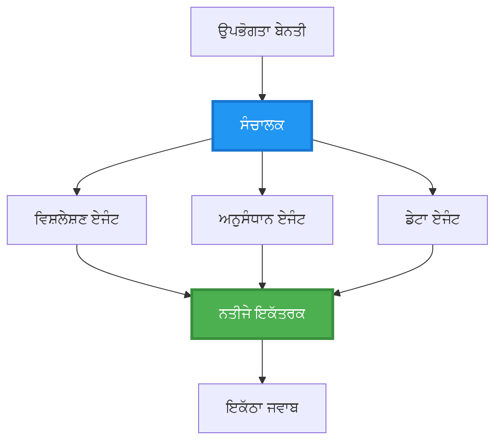
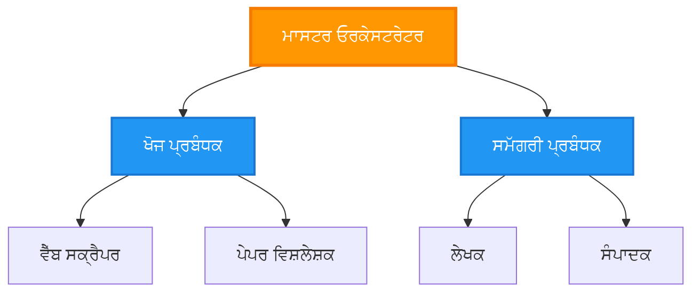
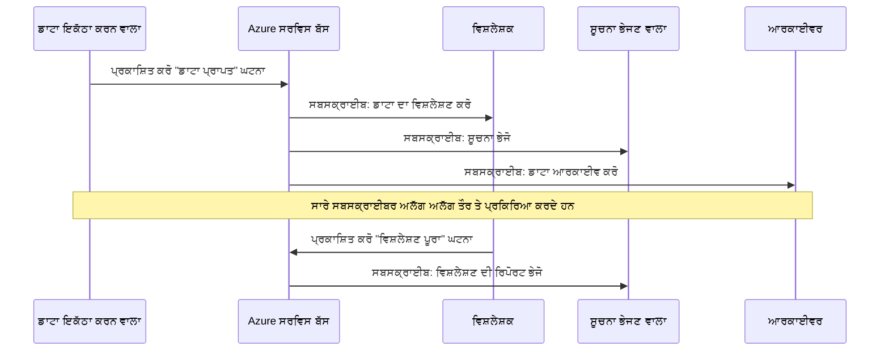
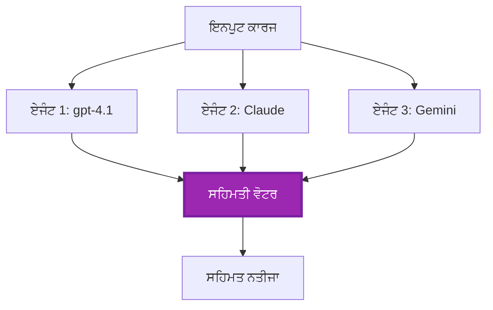
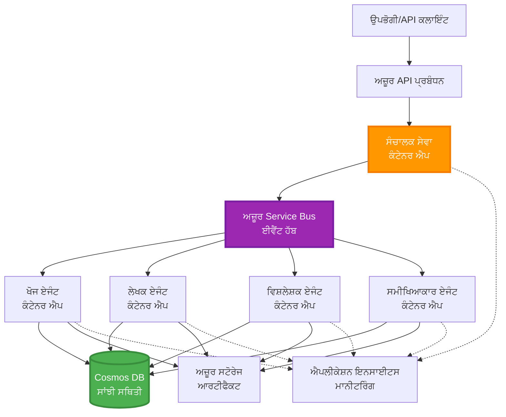

# ਮਲਟੀ-ਏਜੰਟ ਕੋਆਰਡੀਨੇਸ਼ਨ ਪੈਟਰਨਸ

⏱️ **ਅਨੁਮਾਨਿਤ ਸਮਾਂ**: 60-75 ਮਿੰਟ | 💰 **ਅਨੁਮਾਨਿਤ ਲਾਗਤ**: ~$100-300/ਮਹੀਨਾ | ⭐ **ਕਠਿਨਾਈ**: ਉੱਚ

**📚 ਲਰਨਿੰਗ ਪਾਥ:**
- ← ਪਿਛਲਾ: [ਕੈਪੇਸਿਟੀ ਪਲੈਨਿੰਗ](capacity-planning.md) - ਰਿਸੋਰਸ ਨਿਰਧਾਰਨ ਅਤੇ ਸਕੇਲਿੰਗ ਰਣਨੀਤੀਆਂ
- 🎯 **ਤੁਸੀਂ ਇੱਥੇ ਹੋ**: ਮਲਟੀ-ਏਜੰਟ ਕੋਆਰਡੀਨੇਸ਼ਨ ਪੈਟਰਨਸ (Orchestration, communication, state management)
- → ਅਗਲਾ: [SKU ਚੋਣ](sku-selection.md) - ਸਹੀ Azure ਸੇਵਾਵਾਂ ਦੀ ਚੋਣ
- 🏠 [ਕੋਰਸ ਹੋਮ](../../README.md)

---

## ਤੁਸੀਂ ਕੀ ਸਿੱਖੋਗੇ

ਇਸ ਲੈਸਨ ਨੂੰ ਪੂਰਾ ਕਰਨ ਨਾਲ, ਤੁਸੀਂ:
- ਸਮਝੋਗੇ **ਮਲਟੀ-ਏਜੰਟ ਆਰਕੀਟੈਕਚਰ** ਪੈਟਰਨਸ ਅਤੇ ਕਦੋਂ ਉਨ੍ਹਾਂ ਦਾ ਉਪਯੋਗ ਕਰਨਾ ਚਾਹੀਦਾ ਹੈ
- ਲਾਗੂ ਕਰੋਗੇ **orchestration ਪੈਟਰਨਸ** (ਕੇਂਦ੍ਰਿਤ, ਵਿਖੇੰਦਰਿਤ, ਆਰਗਨੀਕ)
- ਡਿਜ਼ਾਇਨ ਕਰੋਗੇ **ਏਜੰਟ ਸੰਚਾਰ** ਰਣਨੀਤੀਆਂ (ਸਿੰਕ੍ਰੋਨਸ, ਐਸਿੰਕ੍ਰੋਨਸ, ਇਵੈਂਟ-ਚਲਿਤ)
- ਪ੍ਰਬੰਧਨ ਕਰੋਗੇ **ਸ਼ੇਅਰ ਕੀਤਾ ਸਟੇਟ** ਵੰਡੇ ਹੋਏ ਏਜੰਟਾਂ ਵਿਚ
- ਡਿਪਲੌਇ ਕਰੋਗੇ **ਮਲਟੀ-ਏਜੰਟ ਸਿਸਟਮਜ਼** ਨੂੰ Azure ਤੇ AZD ਨਾਲ
- ਲਾਗੂ ਕਰੋਗੇ **ਕੋਆਰਡੀਨੇਸ਼ਨ ਪੈਟਰਨਸ** ਹਕੀਕਤੀ AI ਸਥਿਤੀਆਂ ਲਈ
- ਮਾਨੀਟਰ ਅਤੇ ਡੀਬੱਗ ਕਰੋਗੇ ਵੰਡੇ ਹੋਏ ਏਜੰਟ ਸਿਸਟਮਜ਼

## ਕਿਉਂ ਮਲਟੀ-ਏਜੰਟ ਕੋਆਰਡੀਨੇਸ਼ਨ ਮਹੱਤਵਪੂਰਨ ਹੈ

### ਵਿਕਾਸ: ਸਿੰਗਲ ਏਜੰਟ ਤੋਂ ਮਲਟੀ-ਏਜੰਟ ਤੱਕ

**ਸਿੰਗਲ ਏਜੰਟ (ਸਾਦਾ):**
```
User → Agent → Response
```
- ✅ ਸਮਝਣ ਅਤੇ ਲਾਗੂ ਕਰਨ ਵਿੱਚ ਆਸਾਨ
- ✅ ਸਧਾਰਣ ਕਾਮਾਂ ਲਈ ਤੇਜ਼
- ❌ ਇੱਕ ਹੀ ਮਾਡਲ ਦੀਆਂ ਸਮਰੱਥਾਵਾਂ ਨਾਲ ਸੀਮਤ
- ❌ ਜਟਿਲ ਕਾਰਜਾਂ ਨੂੰ ਪੈਰਲੇਲ ਨਹੀਂ ਕਰ ਸਕਦਾ
- ❌ ਕੋਈ ਵਿਸ਼ੇਸ਼ਤਾ ਨਹੀਂ

**ਮਲਟੀ-ਏਜੰਟ ਸਿਸਟਮ (ਅਡਵਾਂਸ):**
```mermaid
graph TD
    Orchestrator[ਆਰਕੀਸਟਰੇਟਰ] --> Agent1[ਏਜੰਟ1<br/>ਯੋਜਨਾ]
    Orchestrator --> Agent2[ਏਜੰਟ2<br/>ਕੋਡ]
    Orchestrator --> Agent3[ਏਜੰਟ3<br/>ਸਮੀਖਿਆ]
```- ✅ ਖਾਸ ਕਾਰਜਾਂ ਲਈ ਵਿਸ਼ੇਸ਼ ਏਜੰਟ
- ✅ ਗਤੀ ਲਈ ਪੈਰਲੇਲ ਐਕਜ਼ਿਕਿਊਸ਼ਨ
- ✅ ਮੋਡੀਊਲਰ ਅਤੇ ਮੈਨਟੇਨੇਬਲ
- ✅ ਜਟਿਲ ਵਰਕਫਲੋਜ਼ ਵਿੱਚ ਬਿਹਤਰ
- ⚠️ ਕੋਆਰਡੀਨੇਸ਼ਨ ਲਾਜਿਕ ਦੀ ਲੋੜ

**ਉਪਮਾ**: ਸਿੰਗਲ ਏਜੰਟ ਉਹਨਾਂ ਵੇਲੇ ਇੱਕ ਵਿਅਕਤੀ ਵਾਂਗ ਹੈ ਜੋ ਸਾਰੇ ਕੰਮ ਕਰਦਾ ਹੈ। ਮਲਟੀ-ਏਜੰਟ ਇੱਕ ਟੀਮ ਵਾਂਗ ਹੈ ਜਿੱਥੇ ਹਰ ਮੈਂਬਰ ਕੋਲ ਵਿਸ਼ੇਸ਼ ਕੌਸ਼ਲ ਹਨ (ਰਿਸਰਚਰ, ਕੋਡਰ, ਰਿਵਿਊਅਰ, ਲੇਖਕ) ਜੋ ਇਕੱਠੇ ਕੰਮ ਕਰਦੇ ਹਨ।

---

## ਮੁੱਖ ਕੋਆਰਡੀਨੇਸ਼ਨ ਪੈਟਰਨਸ

### ਪੈਟਰਨ 1: ਅਨੁਕ੍ਰਮਿਕ ਕੋਆਰਡੀਨੇਸ਼ਨ (Chain of Responsibility)

**ਕਦੋਂ ਵਰਤਣਾ**: ਕਾਰਜਾਂ ਨੂੰ ਨਿਰਧਾਰਤ ਕ੍ਰਮ ਵਿੱਚ ਪੂਰਾ ਹੋਣਾ ਲਾਜ਼ਮੀ ਹੈ, ਹਰ ਏਜੰਟ ਪਿਛਲੇ আੁਟਪੁੱਟ 'ਤੇ ਨਿਰਭਰ ਕਰਦਾ ਹੈ।

```mermaid
sequenceDiagram
    participant User as ਉਪਭੋਗਤਾ
    participant Orchestrator as ਸੰਚਾਲਕ
    participant Agent1 as ਖੋਜ ਏਜੰਟ
    participant Agent2 as ਲੇਖਕ ਏਜੰਟ
    participant Agent3 as ਸੰਪਾਦਕ ਏਜੰਟ
    
    User->>Orchestrator: "ਏਆਈ ਬਾਰੇ ਲੇਖ ਲਿਖੋ"
    Orchestrator->>Agent1: ਵਿਸ਼ੇ ਦੀ ਖੋਜ
    Agent1-->>Orchestrator: ਖੋਜ ਦੇ ਨਤੀਜੇ
    Orchestrator->>Agent2: ਡਰਾਫਟ ਲਿਖੋ (ਖੋਜ ਦੀ ਵਰਤੋਂ ਕਰਕੇ)
    Agent2-->>Orchestrator: ਖਾਕਾ ਲੇਖ
    Orchestrator->>Agent3: ਸੰਪਾਦਨ ਅਤੇ ਸੁਧਾਰ
    Agent3-->>Orchestrator: ਅੰਤਿਮ ਲੇਖ
    Orchestrator-->>User: ਸੰਵਾਰਿਆ ਲੇਖ
    
    Note over User,Agent3: ਕ੍ਰਮਵਾਰ: ਹਰ ਕਦਮ ਪਿਛਲੇ ਕਦਮ ਦੀ ਉਡੀਕ ਕਰਦਾ ਹੈ
```
**ਫਾਇਦੇ:**
- ✅ ਸਾਫ਼ ਡੇਟਾ ਫਲੋ
- ✅ ਡੀਬੱਗ ਕਰਨ ਵਿੱਚ ਆਸਾਨ
- ✅ ਅਨੁਮਾਨਯੋਗ ਐਕਜ਼ਿਕਿਊਸ਼ਨ ਆਰਡਰ

**ਸੀਮਾਵਾਂ:**
- ❌ ਧੀਮਾ (ਕੋਈ ਪੈਰਲੇਲਿਜ਼ਮ ਨਹੀਂ)
- ❌ ਇੱਕ ਵਿਫਲਤਾ ਸਾਰੀ ਚੇਨ ਨੂੰ ਬਲੌਕ ਕਰਦੀ ਹੈ
- ❌ ਆਪਸੀ ਨਿਰਭਰ ਕਾਰਜਾਂ ਨੂੰ ਸੰਭਾਲ ਨਹੀਂ ਸਕਦਾ

**ਉਦਾਹਰਨ ਵਰਤੋਂ ਕੇਸ:**
- ਸਮੱਗਰੀ ਬਣਾਉਣ ਦੀ ਪਾਈਪਲਾਈਨ (ਰਿਸਰਚ → ਲਿਖੋ → ਸੋਧੋ → ਪ੍ਰਕਾਸ਼ਿਤ)
- ਕੋਡ ਜਨਰੇਸ਼ਨ (ਯੋਜਨਾ → ਲਾਗੂ ਕਰੋ → ਟੈਸਟ → ਡਿਪਲੌਇ)
- ਰਿਪੋਰਟ ਜਨਰੇਸ਼ਨ (ਡੇਟਾ ਸੰਗ੍ਰਹਿ → ਵਿਸ਼ਲੇਸ਼ਣ → ਵਿਜ਼ੂਅਲਾਇਜ਼ੇਸ਼ਨ → ਸਾਰ)

---

### ਪੈਟਰਨ 2: ਪੈਰਲੇਲ ਕੋਆਰਡੀਨੇਸ਼ਨ (Fan-Out/Fan-In)

**ਕਦੋਂ ਵਰਤਣਾ**: ਸੁਤੰਤਰ ਕਾਰਜ ਇਕੱਠੇ ਸਮੇਂ ਚਲ ਸਕਦੇ ਹਨ, ਅੰਤ ਵਿੱਚ ਨਤੀਜੇ ਜੋੜੇ ਜਾਂਦੇ ਹਨ।


**ਫਾਇਦੇ:**
- ✅ ਤੇਜ਼ (ਪੈਰਲੇਲ ਐਕਜ਼ਿਕਿਊਸ਼ਨ)
- ✅ ਫੌਲਟ-ਟੋਲਰੈਂਟ (ਆংশਿਕ ਨਤੀਜੇ ਸਵੀਕਾਰਯੋਗ)
- ✅ ਹੋਰੀਜ਼ਾਂਟਲੀ ਸਕੇਲ ਕਰਦਾ ਹੈ

**ਸੀਮਾਵਾਂ:**
- ⚠️ ਨਤੀਜੇ ਆਉਟ-ਆਫ-ਆਰਡਰ ਆ ਸਕਦੇ ਹਨ
- ⚠️ ਐਗ੍ਰਿਗੇਸ਼ਨ ਲਾਜਿਕ ਦੀ ਲੋੜ
- ⚠️ ਸਟੇਟ ਪ੍ਰਬੰਧਨ ਜਟਿਲ

**ਉਦਾਹਰਨ ਵਰਤੋਂ ਕੇਸ:**
- ਮਲਟੀ-ਸੋਰਸ ਡੇਟਾ ਗੈਦਰਿੰਗ (APIs + ਡੇਟਾਬੇਸ + ਵੈੱਬ ਸਕ੍ਰੈਪਿੰਗ)
- ਮੁਕਾਬਲਾਤੀ ਵਿਸ਼ਲੇਸ਼ਣ (ਕਈ ਮਾਡਲ ਹੱਲ ਤਿਆਰ ਕਰਦੇ ਹਨ, ਸਭ ਤੋਂ ਵਧੀਆ ਚੁਣਿਆ ਜਾਂਦਾ ਹੈ)
- ਅਨੁਵਾਦ ਸੇਵਾਵਾਂ (ਇੱਕੋ ਸਮੇਂ ਕਈ ਭਾਸ਼ਾਵਾਂ ਵਿੱਚ ਅਨੁਵਾਦ)

---

### ਪੈਟਰਨ 3: ਹਾਇਰਾਰਕੀਕਲ ਕੋਆਰਡੀਨੇਸ਼ਨ (Manager-Worker)

**ਕਦੋਂ ਵਰਤਣਾ**: ਜਟਿਲ ਵਰਕਫਲੋਜ਼ ਜਿੰਨ੍ਹਾਂ ਵਿੱਚ ਸਭ-ਕਾਰਜ ਹਨ ਅਤੇ ਡੈਲੀਗੇਸ਼ਨ ਦੀ ਲੋੜ ਹੈ।


**ਫਾਇਦੇ:**
- ✅ ਜਟਿਲ ਵਰਕਫਲੋਜ਼ ਸੰਭਾਲਦਾ ਹੈ
- ✅ ਮੋਡੀਊਲਰ ਅਤੇ ਮੈਨਟੇਨੇਬਲ
- ✅ ਜੁਮੇਵਾਰੀ ਦੀਆਂ ਸਪਸ਼ਟ ਸੀਮਾਵਾਂ

**ਸੀਮਾਵਾਂ:**
- ⚠️ ਵਧੇਰੇ ਜਟਿਲ ਆਰਕੀਟੈਕਚਰ
- ⚠️ ਉੱਚ ਲੇਟেন্সੀ (ਕਈ ਕੋਆਰਡੀਨੇਸ਼ਨ ਲੇਅਰ)
- ⚠️ ਸੋਫਿਸਟਿਕੇਟਡ ਓਰਕੇਸਟ੍ਰੇਸ਼ਨ ਦੀ ਲੋੜ

**ਉਦਾਹਰਨ ਵਰਤੋਂ ਕੇਸ:**
- ਐਂਟਰਪ੍ਰਾਈਜ਼ ਡੌਕਯੂਮੈਂਟ ਪ੍ਰੋਸੈਸਿੰਗ (ਵਰਗੀਕਰਨ → ਰੂਟ → ਪ੍ਰੋਸੈਸ → ਆਰਕਾਈਵ)
- ਮਲਟੀ-ਸਟੇਜ਼ ਡੇਟਾ ਪਾਈਪਲਾਈਨਜ਼ (ਇਨਜੈਸਟ → ਕਲੀਨ → ਟ੍ਰਾਂਸਫਾਰਮ → ਵਿਸ਼ਲੇਸ਼ਣ → ਰਿਪੋਰਟ)
- ਜਟਿਲ ਆਟੋਮੇਸ਼ਨ ਵਰਕਫਲੋਜ਼ (ਯੋਜਨਾ → ਰਿਸੋਰਸ ਅਲੋਕੇਸ਼ਨ → ਐਕਜ਼ਿਕਿਊਸ਼ਨ → ਮਾਨੀਟਰਨਿੰਗ)

---

### ਪੈਟਰਨ 4: ਇਵੈਂਟ-ਚਲਿਤ ਕੋਆਰਡੀਨੇਸ਼ਨ (Publish-Subscribe)

**ਕਦੋਂ ਵਰਤਣਾ**: ਏਜੰਟਾਂ ਨੂੰ ਇਵੈਂਟਾਂ 'ਤੇ ਪ੍ਰਤੀਕਿਰਿਆ ਦੇਣੀ ਹੁੰਦੀ ਹੈ, ਅਤੇ ਢीਲਾ coupling ਚਾਹੀਦਾ ਹੈ।


**ਫਾਇਦੇ:**
- ✅ ਏਜੰਟਾਂ ਵਿਚਕਾਰ ਢੀਲਾ coupling
- ✅ ਨਵੇਂ ਏਜੰਟ ਅਸਾਨੀ ਨਾਲ ਜੋੜੇ ਜਾ ਸਕਦੇ ਹਨ (ਸਿਰਫ਼ subscribe ਕਰੋ)
- ✅ ਐਸਿੰਕ੍ਰੋਨਸ ਪ੍ਰੋਸੈਸਿੰਗ
- ✅ ਰੇਜ਼ੀਲਿਯੈਂਟ (ਮੇਸੇਜ ਪੇਰਸਿਸਟੈਂਸ)

**ਸੀਮਾਵਾਂ:**
- ⚠️ ਆਖ਼ਰੀ ਸਮੇਂ ਪਰਿਸਥਿਤੀ ਦਾ ਅਨੁਕੂਲ ਹੋ ਸਕਦਾ ਹੈ (Eventual consistency)
- ⚠️ ਡੀਬੱਗਿੰਗ ਜਟਿਲ
- ⚠️ ਮੇਸੇਜ ਆਰਡਰਿੰਗ ਚੈਲੰਜਿਜ਼

**ਉਦਾਹਰਨ ਵਰਤੋਂ ਕੇਸ:**
- ਰੀਅਲ-ਟਾਈਮ ਮਾਨੀਟਰਨਿੰਗ ਸਿਸਟਮ (ਅਲਰਟ, ਡੈਸ਼ਬੋਰਡ, ਲੌਗ)
- ਮਲਟੀ-ਚੈਨਲ ਨੋਟੀਫਿਕੇਸ਼ਨ (ਈਮੇਲ, SMS, ਪੁਸ਼, Slack)
- ਡੇਟਾ ਪ੍ਰੋਸੈਸਿੰਗ ਪਾਈਪਲਾਈਨਜ਼ (ਉਸੇ ਡੇਟਾ ਦੇ ਕਈ ਕਨਜ਼ਿਊਮਰ)

---

### ਪੈਟਰਨ 5: ਕਨਸੈਂਸਸ-ਆਧਾਰਤ ਕੋਆਰਡੀਨੇਸ਼ਨ (Voting/Quorum)

**ਕਦੋਂ ਵਰਤਣਾ**: ਅੱਗੇ ਵਧਣ ਤੋਂ ਪਹਿਲਾਂ ਕਈ ਏਜੰਟਾਂ ਤੋਂ ਸਹਿਮਤੀ ਦੀ ਲੋੜ ਹੋਵੇ।


**ਫਾਇਦੇ:**
- ✅ ਉੱਚ ਸਹੀਤਾ (ਕਈ ਰਾਏ)
- ✅ ਫੌਲਟ-ਟੋਲਰੈਂਟ (ਛੋਟੀ ਗਿਣਤੀ ਦੀਆਂ ਵਿਫਲਤਾਵਾਂ ਮਨਜ਼ੂਰ)
- ✅ ਕੁਆਲਿਟੀ ਅਸ਼ੋਰੈਂਸ ਹੇਠਾਂ-ਬਿਲਟ

**ਸੀਮਾਵਾਂ:**
- ❌ ਮਹਿੰਗਾ (ਕਈ ਮਾਡਲ ਕਾਲ)
- ❌ ਧੀਮਾ (ਸਭ ਏਜੰਟਾਂ ਦੀ ਉਡੀਕ)
- ⚠️ ਟਕਰਾਅ ਨਿਪਟਾਰਾ ਲੋੜੀਦਾ

**ਉਦਾਹਰਨ ਵਰਤੋਂ ਕੇਸ:**
- ਸਮੱਗਰੀ ਮਾਡਰੇਸ਼ਨ (ਕਈ ਮਾਡਲ ਸਮੱਗਰੀ ਦੀ ਸਮੀਖਿਆ)
- ਕੋਡ ਰਿਵਿਊ (ਕਈ ਲਿੰਟਰ/ਐਨਾਲਾਇਜ਼ਰ)
- ਮੈਡੀਕਲ ਡਾਇਗਨੋਸਿਸ (ਕਈ AI ਮਾਡਲ, ਵਿਸ਼ੇਸ਼ਗਿਆਨ ਸੰਗਿਆ)

---

## ਆਰਕੀਟੈਕਚਰ ਓਵਰਵਿਊ

### Azure 'ਤੇ ਪੂਰਾ ਮਲਟੀ-ਏਜੰਟ ਸਿਸਟਮ


**ਮੁੱਖ ਕੰਪੋਨੈਂਟਸ:**

| Component | Purpose | Azure Service |
|-----------|---------|---------------|
| **API Gateway** | ਐਂਟਰੀ ਪੁਆਇੰਟ, ਰੇਟ ਲਿਮਿਟਿੰਗ, auth | API Management |
| **Orchestrator** | ਏਜੰਟ ਵਰਕਫਲੋਜ਼ ਦਾ ਕੋਆਰਡੀਨੇਸ਼ਨ | Container Apps |
| **Message Queue** | ਐਸਿੰਕ੍ਰੋਨਸ ਸੰਚਾਰ | Service Bus / Event Hubs |
| **Agents** | ਵਿਸ਼ੇਸ਼ AI ਵਰਕਰ | Container Apps / Functions |
| **State Store** | ਸ਼ੇਅਰ ਕੀਤਾ ਸਟੇਟ, ਟਾਸਕ ਟ੍ਰੈਕਿੰਗ | Cosmos DB |
| **Artifact Storage** | ਡੌਕਯੂਮੈਂਟ, ਨਤੀਜੇ, ਲੌਗ | Blob Storage |
| **Monitoring** | ਵੰਡਿਆ ਟ੍ਰੇਸਿੰਗ, ਲੌਗ | Application Insights |

---

## পূর্বশর্ত (Prerequisites)

### ਲੋੜੀਂਦੇ ਟੂਲ

```bash
# Azure Developer CLI ਦੀ ਪੁਸ਼ਟੀ ਕਰੋ
azd version
# ✅ ਉਮੀਦ: azd ਵਰਜਨ 1.0.0 ਜਾਂ ਇਸ ਤੋਂ ਉੱਚਾ

# Azure CLI ਦੀ ਪੁਸ਼ਟੀ ਕਰੋ
az --version
# ✅ ਉਮੀਦ: azure-cli 2.50.0 ਜਾਂ ਇਸ ਤੋਂ ਉੱਚਾ

# Docker ਦੀ ਪੁਸ਼ਟੀ ਕਰੋ (ਲੋਕਲ ਟੈਸਟਿੰਗ ਲਈ)
docker --version
# ✅ ਉਮੀਦ: Docker ਵਰਜਨ 20.10 ਜਾਂ ਇਸ ਤੋਂ ਉੱਚਾ
```

### Azure ਦੀਆਂ ਲੋੜਾਂ

- ਸਰਗਰਮ Azure ਸਬਸਕ੍ਰਿਪਸ਼ਨ
- ਬਣਾਉਣ ਦੀਆਂ ਪਰਵਾਨਗੀਆਂ:
  - Container Apps
  - Service Bus namespaces
  - Cosmos DB accounts
  - Storage accounts
  - Application Insights

### ਜਾਣਕਾਰੀ ਦੇ ਪਹਿਲੇ ਅਧਿਐਨ

ਤੁਹਾਨੂੰ ਇਹ ਪੂਰਾ ਹੋ ਚੁੱਕਾ ਹੋਣਾ ਚਾਹੀਦਾ ਹੈ:
- [ਕਨਫਿਗਰੇਸ਼ਨ ਮੈਨੇਜਮੈਂਟ](../chapter-03-configuration/configuration.md)
- [ਅਥੈਂਟੀਕੇਸ਼ਨ ਅਤੇ ਸੁਰੱਖਿਆ](../chapter-03-configuration/authsecurity.md)
- [ਮਾਈਕਰੋਸਰਵਿਸਿਸ ਉਦਾਹਰਨ](../../../../examples/microservices)

---

## ਇੰਪਲੀਮੈਂਟੇਸ਼ਨ ਗਾਈਡ

### ਪ੍ਰੋਜੈਕਟ ਸਟ੍ਰਕਚਰ

```
multi-agent-system/
├── azure.yaml                    # AZD configuration
├── infra/
│   ├── main.bicep               # Main infrastructure
│   ├── core/
│   │   ├── servicebus.bicep     # Message queue
│   │   ├── cosmos.bicep         # State store
│   │   ├── storage.bicep        # Artifact storage
│   │   └── monitoring.bicep     # Application Insights
│   └── app/
│       ├── orchestrator.bicep   # Orchestrator service
│       └── agent.bicep          # Agent template
└── src/
    ├── orchestrator/            # Orchestration logic
    │   ├── app.py
    │   ├── workflows.py
    │   └── Dockerfile
    ├── agents/
    │   ├── research/            # Research agent
    │   ├── writer/              # Writer agent
    │   ├── analyst/             # Analyst agent
    │   └── reviewer/            # Reviewer agent
    └── shared/
        ├── state_manager.py     # Shared state logic
        └── message_handler.py   # Message handling
```

---

## ਲੈਸਨ 1: ਅਨੁਕ੍ਰਮਿਕ ਕੋਆਰਡੀਨੇਸ਼ਨ ਪੈਟਰਨ

### ਇੰਪਲੀਮੈਂਟੇਸ਼ਨ: ਸਮੱਗਰੀ ਬਣਾਉਣ ਦੀ ਪਾਈਪਲਾਈਨ

ਆਓ ਇੱਕ ਅਨੁਕ੍ਰਮਿਕ ਪਾਈਪਲਾਈਨ ਬਣਾਈਏ: Research → Write → Edit → Publish

### 1. AZD ਕੰਫਿਗਰੇਸ਼ਨ

**ਫਾਈਲ: `azure.yaml`**

```yaml
name: content-pipeline
metadata:
  template: multi-agent-sequential@1.0.0

services:
  orchestrator:
    project: ./src/orchestrator
    language: python
    host: containerapp
  
  research-agent:
    project: ./src/agents/research
    language: python
    host: containerapp
  
  writer-agent:
    project: ./src/agents/writer
    language: python
    host: containerapp
  
  editor-agent:
    project: ./src/agents/editor
    language: python
    host: containerapp
```

### 2. ਇਨਫ੍ਰਾਸਟ੍ਰਕਚਰ: ਕੋਆਰਡੀਨੇਸ਼ਨ ਲਈ Service Bus

**ਫਾਈਲ: `infra/core/servicebus.bicep`**

```bicep
param name string
param location string
param tags object = {}

resource serviceBusNamespace 'Microsoft.ServiceBus/namespaces@2022-10-01-preview' = {
  name: name
  location: location
  tags: tags
  sku: {
    name: 'Standard'
    tier: 'Standard'
  }
  properties: {
    minimumTlsVersion: '1.2'
  }
}

// Queue for orchestrator → research agent
resource researchQueue 'Microsoft.ServiceBus/namespaces/queues@2022-10-01-preview' = {
  parent: serviceBusNamespace
  name: 'research-tasks'
  properties: {
    maxDeliveryCount: 3
    lockDuration: 'PT5M'
    deadLetteringOnMessageExpiration: true
  }
}

// Queue for research agent → writer agent
resource writerQueue 'Microsoft.ServiceBus/namespaces/queues@2022-10-01-preview' = {
  parent: serviceBusNamespace
  name: 'writer-tasks'
  properties: {
    maxDeliveryCount: 3
    lockDuration: 'PT5M'
  }
}

// Queue for writer agent → editor agent
resource editorQueue 'Microsoft.ServiceBus/namespaces/queues@2022-10-01-preview' = {
  parent: serviceBusNamespace
  name: 'editor-tasks'
  properties: {
    maxDeliveryCount: 3
    lockDuration: 'PT5M'
  }
}

output namespace string = serviceBusNamespace.name
output connectionString string = listKeys('${serviceBusNamespace.id}/AuthorizationRules/RootManageSharedAccessKey', serviceBusNamespace.apiVersion).primaryConnectionString
```

### 3. ਸਾਂਝਾ ਸਟੇਟ ਮੈਨੇਜਰ

**ਫਾਈਲ: `src/shared/state_manager.py`**

```python
from azure.cosmos import CosmosClient, PartitionKey
from datetime import datetime
import os

class StateManager:
    """Manages shared state across agents using Cosmos DB"""
    
    def __init__(self):
        endpoint = os.environ['COSMOS_ENDPOINT']
        key = os.environ['COSMOS_KEY']
        
        self.client = CosmosClient(endpoint, key)
        self.database = self.client.get_database_client('agent-state')
        self.container = self.database.get_container_client('tasks')
    
    def create_task(self, task_id: str, task_type: str, input_data: dict):
        """Create a new task"""
        task = {
            'id': task_id,
            'type': task_type,
            'status': 'pending',
            'input': input_data,
            'created_at': datetime.utcnow().isoformat(),
            'steps': []
        }
        self.container.create_item(task)
        return task
    
    def update_task_step(self, task_id: str, step_name: str, result: dict):
        """Update task with completed step"""
        task = self.container.read_item(task_id, partition_key=task_id)
        
        task['steps'].append({
            'name': step_name,
            'completed_at': datetime.utcnow().isoformat(),
            'result': result
        })
        
        self.container.replace_item(task_id, task)
        return task
    
    def complete_task(self, task_id: str, final_result: dict):
        """Mark task as complete"""
        task = self.container.read_item(task_id, partition_key=task_id)
        task['status'] = 'completed'
        task['result'] = final_result
        task['completed_at'] = datetime.utcnow().isoformat()
        self.container.replace_item(task_id, task)
        return task
    
    def get_task(self, task_id: str):
        """Retrieve task state"""
        return self.container.read_item(task_id, partition_key=task_id)
```

### 4. ਓਰਕੇਸਟਰੇਟਰ ਸੇਵਾ

**ਫਾਈਲ: `src/orchestrator/app.py`**

```python
from flask import Flask, request, jsonify
from azure.servicebus import ServiceBusClient, ServiceBusMessage
import json
import uuid
import os
from shared.state_manager import StateManager

app = Flask(__name__)
state_manager = StateManager()

# Service Bus ਕਨੈਕਸ਼ਨ
servicebus_connection_str = os.environ['SERVICEBUS_CONNECTION_STRING']
servicebus_client = ServiceBusClient.from_connection_string(servicebus_connection_str)

@app.route('/health', methods=['GET'])
def health():
    return jsonify({'status': 'healthy', 'service': 'orchestrator'})

@app.route('/create-content', methods=['POST'])
def create_content():
    """
    Sequential workflow: Research → Write → Edit → Publish
    """
    data = request.json
    topic = data.get('topic')
    
    if not topic:
        return jsonify({'error': 'Topic required'}), 400
    
    # ਸਟੇਟ ਸਟੋਰ ਵਿੱਚ ਟਾਸਕ ਬਣਾਓ
    task_id = str(uuid.uuid4())
    task = state_manager.create_task(
        task_id=task_id,
        task_type='content_creation',
        input_data={'topic': topic}
    )
    
    # ਰਿਸਰਚ ਏਜੰਟ ਨੂੰ ਸੁਨੇਹਾ ਭੇਜੋ (ਪਹਿਲਾ ਕਦਮ)
    sender = servicebus_client.get_queue_sender('research-tasks')
    message = ServiceBusMessage(
        body=json.dumps({
            'task_id': task_id,
            'topic': topic,
            'next_queue': 'writer-tasks'  # ਨਤੀਜੇ ਕਿੱਥੇ ਭੇਜੇ ਜਾਣਗੇ
        }),
        content_type='application/json'
    )
    
    with sender:
        sender.send_messages(message)
    
    return jsonify({
        'task_id': task_id,
        'status': 'started',
        'workflow': 'sequential',
        'steps': ['research', 'write', 'edit', 'publish'],
        'message': 'Content creation pipeline initiated'
    }), 202

@app.route('/task/<task_id>', methods=['GET'])
def get_task_status(task_id):
    """Check task status"""
    try:
        task = state_manager.get_task(task_id)
        return jsonify(task)
    except Exception as e:
        return jsonify({'error': str(e)}), 404

if __name__ == '__main__':
    app.run(host='0.0.0.0', port=8080)
```

### 5. ਰਿਸਰਚ ਏਜੰਟ

**ਫਾਈਲ: `src/agents/research/app.py`**

```python
from azure.servicebus import ServiceBusClient, ServiceBusMessage
from openai import AzureOpenAI
import json
import os
import time
from shared.state_manager import StateManager

# ਕਲਾਇੰਟਾਂ ਨੂੰ ਸ਼ੁਰੂ ਕਰੋ
state_manager = StateManager()
servicebus_client = ServiceBusClient.from_connection_string(
    os.environ['SERVICEBUS_CONNECTION_STRING']
)

openai_client = AzureOpenAI(
    api_key=os.environ['AZURE_OPENAI_API_KEY'],
    api_version="2024-02-01",
    azure_endpoint=os.environ['AZURE_OPENAI_ENDPOINT']
)

def process_research_task(message_data):
    """Process research request and pass to writer"""
    task_id = message_data['task_id']
    topic = message_data['topic']
    next_queue = message_data['next_queue']
    
    print(f"🔬 Researching: {topic}")
    
    # ਖੋਜ ਲਈ Microsoft Foundry ਮਾਡਲਾਂ ਨੂੰ ਕਾਲ ਕਰੋ
    response = openai_client.chat.completions.create(
        model="gpt-4.1",
        messages=[
            {"role": "system", "content": "You are a research assistant. Provide comprehensive research on the given topic."},
            {"role": "user", "content": f"Research this topic thoroughly: {topic}"}
        ],
        max_tokens=1500
    )
    
    research_results = response.choices[0].message.content
    
    # ਹਾਲਤ ਨੂੰ ਅਪਡੇਟ ਕਰੋ
    state_manager.update_task_step(
        task_id=task_id,
        step_name='research',
        result={'research': research_results}
    )
    
    # ਅਗਲੇ ਏਜੰਟ (ਲੇਖਕ) ਨੂੰ ਭੇਜੋ
    sender = servicebus_client.get_queue_sender(next_queue)
    message = ServiceBusMessage(
        body=json.dumps({
            'task_id': task_id,
            'topic': topic,
            'research': research_results,
            'next_queue': 'editor-tasks'
        }),
        content_type='application/json'
    )
    
    with sender:
        sender.send_messages(message)
    
    print(f"✅ Research complete for task {task_id}")

def main():
    """Listen to research queue"""
    receiver = servicebus_client.get_queue_receiver('research-tasks')
    
    print("🔬 Research Agent started, listening for tasks...")
    
    with receiver:
        while True:
            messages = receiver.receive_messages(max_wait_time=5)
            for message in messages:
                try:
                    message_data = json.loads(str(message))
                    process_research_task(message_data)
                    receiver.complete_message(message)
                except Exception as e:
                    print(f"❌ Error processing message: {e}")
                    receiver.abandon_message(message)

if __name__ == '__main__':
    main()
```

### 6. ਲੇਖਕ ਏਜੰਟ

**ਫਾਈਲ: `src/agents/writer/app.py`**

```python
from azure.servicebus import ServiceBusClient, ServiceBusMessage
from openai import AzureOpenAI
import json
import os
from shared.state_manager import StateManager

state_manager = StateManager()
servicebus_client = ServiceBusClient.from_connection_string(
    os.environ['SERVICEBUS_CONNECTION_STRING']
)

openai_client = AzureOpenAI(
    api_key=os.environ['AZURE_OPENAI_API_KEY'],
    api_version="2024-02-01",
    azure_endpoint=os.environ['AZURE_OPENAI_ENDPOINT']
)

def process_writing_task(message_data):
    """Write article based on research"""
    task_id = message_data['task_id']
    topic = message_data['topic']
    research = message_data['research']
    next_queue = message_data['next_queue']
    
    print(f"✍️ Writing article: {topic}")
    
    # ਲੇਖ ਲਿਖਣ ਲਈ Microsoft Foundry Models ਨੂੰ ਕਾਲ ਕਰੋ
    response = openai_client.chat.completions.create(
        model="gpt-4.1",
        messages=[
            {"role": "system", "content": "You are a professional writer. Write engaging, well-structured articles."},
            {"role": "user", "content": f"Based on this research:\n\n{research}\n\nWrite a comprehensive article about: {topic}"}
        ],
        max_tokens=2000
    )
    
    article_draft = response.choices[0].message.content
    
    # ਅਵਸਥਾ ਅਪਡੇਟ ਕਰੋ
    state_manager.update_task_step(
        task_id=task_id,
        step_name='writing',
        result={'draft': article_draft}
    )
    
    # ਸੰਪਾਦਕ ਨੂੰ ਭੇਜੋ
    sender = servicebus_client.get_queue_sender(next_queue)
    message = ServiceBusMessage(
        body=json.dumps({
            'task_id': task_id,
            'topic': topic,
            'draft': article_draft
        }),
        content_type='application/json'
    )
    
    with sender:
        sender.send_messages(message)
    
    print(f"✅ Article draft complete for task {task_id}")

def main():
    """Listen to writer queue"""
    receiver = servicebus_client.get_queue_receiver('writer-tasks')
    
    print("✍️ Writer Agent started, listening for tasks...")
    
    with receiver:
        while True:
            messages = receiver.receive_messages(max_wait_time=5)
            for message in messages:
                try:
                    message_data = json.loads(str(message))
                    process_writing_task(message_data)
                    receiver.complete_message(message)
                except Exception as e:
                    print(f"❌ Error: {e}")
                    receiver.abandon_message(message)

if __name__ == '__main__':
    main()
```

### 7. ਐਡੀਟਰ ਏਜੰਟ

**ਫਾਈਲ: `src/agents/editor/app.py`**

```python
from azure.servicebus import ServiceBusClient
from openai import AzureOpenAI
import json
import os
from shared.state_manager import StateManager

state_manager = StateManager()
servicebus_client = ServiceBusClient.from_connection_string(
    os.environ['SERVICEBUS_CONNECTION_STRING']
)

openai_client = AzureOpenAI(
    api_key=os.environ['AZURE_OPENAI_API_KEY'],
    api_version="2024-02-01",
    azure_endpoint=os.environ['AZURE_OPENAI_ENDPOINT']
)

def process_editing_task(message_data):
    """Edit and finalize article"""
    task_id = message_data['task_id']
    topic = message_data['topic']
    draft = message_data['draft']
    
    print(f"📝 Editing article: {topic}")
    
    # ਸੰਪਾਦਨ ਕਰਨ ਲਈ Microsoft Foundry Models ਨੂੰ ਕਾਲ ਕਰੋ
    response = openai_client.chat.completions.create(
        model="gpt-4.1",
        messages=[
            {"role": "system", "content": "You are an expert editor. Improve grammar, clarity, and structure."},
            {"role": "user", "content": f"Edit and improve this article:\n\n{draft}"}
        ],
        max_tokens=2000
    )
    
    final_article = response.choices[0].message.content
    
    # ਟਾਸਕ ਨੂੰ ਮੁਕੰਮਲ ਵਜੋਂ ਨਿਸ਼ਾਨ ਲਗਾਓ
    state_manager.complete_task(
        task_id=task_id,
        final_result={
            'topic': topic,
            'final_article': final_article,
            'word_count': len(final_article.split())
        }
    )
    
    print(f"✅ Article finalized for task {task_id}")

def main():
    """Listen to editor queue"""
    receiver = servicebus_client.get_queue_receiver('editor-tasks')
    
    print("📝 Editor Agent started, listening for tasks...")
    
    with receiver:
        while True:
            messages = receiver.receive_messages(max_wait_time=5)
            for message in messages:
                try:
                    message_data = json.loads(str(message))
                    process_editing_task(message_data)
                    receiver.complete_message(message)
                except Exception as e:
                    print(f"❌ Error: {e}")
                    receiver.abandon_message(message)

if __name__ == '__main__':
    main()
```

### 8. ਡਿਪਲੌਇ ਅਤੇ ਟੈਸਟ

```bash
# ਵਿਕਲਪ A: ਟੈਂਪਲੇਟ-ਆਧਾਰਿਤ ਤੈਨਾਤੀ
azd init
azd up

# ਵਿਕਲਪ B: ਏਜੈਂਟ ਮੈਨਿਫੈਸਟ ਤੈਨਾਤੀ (ਐਕਸਟੈਂਸ਼ਨ ਦੀ ਲੋੜ ਹੈ)
azd extension install azure.ai.agents
azd ai agent init -m agent-manifest.yaml
azd up
```

> ਵੇਖੋ [AZD AI CLI Commands](../chapter-08-production/production-ai-practices.md#azd-ai-cli-commands-and-extensions) ਸਾਰੇ `azd ai` ਫਲੈਗ ਅਤੇ ਵਿਕਲਪਾਂ ਲਈ।

```bash
# ਓਰਕੇਸਟ੍ਰੇਟਰ URL ਪ੍ਰਾਪਤ ਕਰੋ
ORCHESTRATOR_URL=$(azd env get-values | grep ORCHESTRATOR_URL | cut -d '=' -f2 | tr -d '"')

# ਸਮੱਗਰੀ ਬਣਾਓ
curl -X POST $ORCHESTRATOR_URL/create-content \
  -H "Content-Type: application/json" \
  -d '{"topic": "The Future of AI in Healthcare"}'
```

**✅ ਉਮੀਦ ਕੀਤਾ ਨਤੀਜਾ:**
```json
{
  "task_id": "a1b2c3d4-e5f6-7890-abcd-ef1234567890",
  "status": "started",
  "workflow": "sequential",
  "steps": ["research", "write", "edit", "publish"],
  "message": "Content creation pipeline initiated"
}
```

**ਟਾਸਕ ਪ੍ਰਗਤੀ ਦੀ ਜਾਂਚ ਕਰੋ:**
```bash
TASK_ID="a1b2c3d4-e5f6-7890-abcd-ef1234567890"
curl $ORCHESTRATOR_URL/task/$TASK_ID
```

**✅ ਉਮੀਦ ਕੀਤਾ ਨਤੀਜਾ (ਪੂਰਾ):**
```json
{
  "id": "a1b2c3d4-e5f6-7890-abcd-ef1234567890",
  "type": "content_creation",
  "status": "completed",
  "steps": [
    {
      "name": "research",
      "completed_at": "2025-11-19T10:30:00Z",
      "result": {"research": "..."}
    },
    {
      "name": "writing",
      "completed_at": "2025-11-19T10:32:00Z",
      "result": {"draft": "..."}
    }
  ],
  "result": {
    "topic": "The Future of AI in Healthcare",
    "final_article": "...",
    "word_count": 1500
  }
}
```

---

## ਲੈਸਨ 2: ਪੈਰਲੇਲ ਕੋਆਰਡੀਨੇਸ਼ਨ ਪੈਟਰਨ

### ਇੰਪਲੀਮੈਂਟੇਸ਼ਨ: ਮਲਟੀ-ਸੋਰਸ ਰਿਸਰਚ ਐਗਰੀਗੇਟਰ

ਆਓ ਇੱਕ ਪੈਰਲੇਲ ਸਿਸਟਮ ਬਣਾਈਏ ਜੋ ਇਕੱਠੇ ਸਮੇਂ ਕਈ ਸਰੋਤਾਂ ਤੋਂ ਜਾਣਕਾਰੀ ਇਕੱਠੀ ਕਰਦਾ ਹੈ।

### ਪੈਰਲੇਲ ਓਰਕੇਸਟਰੇਟਰ

**ਫਾਈਲ: `src/orchestrator/parallel_workflow.py`**

```python
from flask import Flask, request, jsonify
from azure.servicebus import ServiceBusClient, ServiceBusMessage
import json
import uuid
import os
from shared.state_manager import StateManager

app = Flask(__name__)
state_manager = StateManager()

servicebus_client = ServiceBusClient.from_connection_string(
    os.environ['SERVICEBUS_CONNECTION_STRING']
)

@app.route('/research-parallel', methods=['POST'])
def research_parallel():
    """
    Parallel workflow: Multiple agents work simultaneously
    """
    data = request.json
    query = data.get('query')
    
    task_id = str(uuid.uuid4())
    task = state_manager.create_task(
        task_id=task_id,
        task_type='parallel_research',
        input_data={
            'query': query,
            'agents': ['web', 'academic', 'news', 'social']
        }
    )
    
    # ਫੈਨ-ਆਊਟ: ਸਾਰੇ ਏਜੰਟਾਂ ਨੂੰ ਇੱਕੋ ਹੀ ਸਮੇਂ ਭੇਜੋ
    agents = [
        ('web-research-queue', 'web'),
        ('academic-research-queue', 'academic'),
        ('news-research-queue', 'news'),
        ('social-research-queue', 'social')
    ]
    
    for queue_name, agent_type in agents:
        sender = servicebus_client.get_queue_sender(queue_name)
        message = ServiceBusMessage(
            body=json.dumps({
                'task_id': task_id,
                'query': query,
                'agent_type': agent_type,
                'result_queue': 'aggregation-queue'
            }),
            content_type='application/json'
        )
        
        with sender:
            sender.send_messages(message)
    
    return jsonify({
        'task_id': task_id,
        'status': 'started',
        'workflow': 'parallel',
        'agents_dispatched': 4,
        'message': 'Parallel research initiated'
    }), 202

if __name__ == '__main__':
    app.run(host='0.0.0.0', port=8080)
```

### ਐਗ੍ਰਿਗੇਸ਼ਨ ਲਾਜਿਕ

**ਫਾਈਲ: `src/agents/aggregator/app.py`**

```python
from azure.servicebus import ServiceBusClient
import json
import os
from collections import defaultdict
from shared.state_manager import StateManager

state_manager = StateManager()
servicebus_client = ServiceBusClient.from_connection_string(
    os.environ['SERVICEBUS_CONNECTION_STRING']
)

# ਹਰ ਟਾਸਕ ਲਈ ਨਤੀਜਿਆਂ ਨੂੰ ਟ੍ਰੈਕ ਕਰੋ
task_results = defaultdict(list)
expected_agents = 4  # ਵੈੱਬ, ਅਕਾਦਮਿਕ, ਖ਼ਬਰਾਂ, ਸੋਸ਼ਲ

def process_result(message_data):
    """Aggregate results from parallel agents"""
    task_id = message_data['task_id']
    agent_type = message_data['agent_type']
    result = message_data['result']
    
    # ਨਤੀਜਾ ਸਟੋਰ ਕਰੋ
    task_results[task_id].append({
        'agent': agent_type,
        'data': result
    })
    
    print(f"📊 Received result from {agent_type} agent ({len(task_results[task_id])}/{expected_agents})")
    
    # ਜਾਂਚ ਕਰੋ ਕਿ ਕੀ ਸਾਰੇ ਏਜੰਟ ਮੁਕੰਮਲ ਹੋ ਚੁੱਕੇ ਹਨ (ਫੈਨ-ਇਨ)
    if len(task_results[task_id]) == expected_agents:
        print(f"✅ All agents completed for task {task_id}. Aggregating...")
        
        # ਨਤੀਜਿਆਂ ਨੂੰ ਜੋੜੋ
        aggregated = {
            'query': message_data['query'],
            'sources': task_results[task_id],
            'summary': generate_summary(task_results[task_id])
        }
        
        # ਮੁਕੰਮਲ ਨਿਸ਼ਾਨ ਲਗਾਓ
        state_manager.complete_task(task_id, aggregated)
        
        # ਸਾਫ ਕਰੋ
        del task_results[task_id]
        
        print(f"✅ Aggregation complete for task {task_id}")

def generate_summary(results):
    """Generate summary from all sources"""
    summaries = [r['data'].get('summary', '') for r in results]
    return '\n\n'.join(summaries)

def main():
    """Listen to aggregation queue"""
    receiver = servicebus_client.get_queue_receiver('aggregation-queue')
    
    print("📊 Aggregator started, listening for results...")
    
    with receiver:
        while True:
            messages = receiver.receive_messages(max_wait_time=5)
            for message in messages:
                try:
                    message_data = json.loads(str(message))
                    process_result(message_data)
                    receiver.complete_message(message)
                except Exception as e:
                    print(f"❌ Error: {e}")
                    receiver.abandon_message(message)

if __name__ == '__main__':
    main()
```

**ਪੈਰਲੇਲ ਪੈਟਰਨ ਦੇ ਫਾਇਦੇ:**
- ⚡ **4x ਤੇਜ਼** (ਏਜੰਟ ਇੱਕੱਠੇ ਚਲਦੇ ਹਨ)
- 🔄 **ਫੌਲਟ-ਟੋਲਰੈਂਟ** (ਆंशਿਕ ਨਤੀਜੇ ਮਨਜ਼ੂਰ)
- 📈 **ਸਕੇਲਬਲ** (ਕਈ ਏਜੰਟ ਆਸਾਨੀ ਨਾਲ ਜੋੜੋ)

---

## ਵਿਹਾਰਿਕ ਅਭਿਆਸ

### ਅਭਿਆਸ 1: ਟਾਈਮਆਉਟ ਹੈਂਡਲਿੰਗ ਸ਼ਾਮਲ ਕਰੋ ⭐⭐ (ਦਰਮਿਆਨਾ)

**ਲਕਸ਼੍ਯ**: ਐਗਰੀਗੇਟਰ ਲਈ ਟਾਈਮਆਉਟ ਲਾਜਿਕ ਲਾਗੂ ਕਰੋ ਤਾਂ ਜੋ ਧੀਮੀ ਏਜੰਟਾਂ ਲਈ ਕਦੇ ਵੀ ਬੇਅੰਤ ਉਡੀਕ ਨਾ ਕਰੇ।

**ਕਦਮ**:

1. **ਐਗਰੀਗੇਟਰ ਵਿੱਚ ਟਾਈਮਆਉਟ ਟ੍ਰੈਕਿੰਗ ਜੋੜੋ:**

```python
from datetime import datetime, timedelta

task_timeouts = {}  # task_id -> expiration_time

def process_result(message_data):
    task_id = message_data['task_id']
    
    # ਪਹਿਲੇ ਨਤੀਜੇ 'ਤੇ ਟਾਈਮਆਉਟ ਸੈੱਟ ਕਰੋ
    if task_id not in task_timeouts:
        task_timeouts[task_id] = datetime.utcnow() + timedelta(seconds=30)
    
    task_results[task_id].append({
        'agent': message_data['agent_type'],
        'data': message_data['result']
    })
    
    # ਜਾਂਚੋ ਕਿ ਮੁਕੰਮਲ ਹੈ ਜਾਂ ਟਾਈਮਆਉਟ ਹੋ ਗਿਆ ਹੈ
    if len(task_results[task_id]) == expected_agents or \
       datetime.utcnow() > task_timeouts[task_id]:
        
        print(f"📊 Aggregating with {len(task_results[task_id])}/{expected_agents} results")
        
        aggregated = {
            'query': message_data['query'],
            'sources': task_results[task_id],
            'completed_agents': len(task_results[task_id]),
            'timed_out': len(task_results[task_id]) < expected_agents
        }
        
        state_manager.complete_task(task_id, aggregated)
        
        # ਸਫਾਈ
        del task_results[task_id]
        del task_timeouts[task_id]
```

2. **ਕੁਦਰਤੀ ਡਿਲੇਅਜ਼ ਨਾਲ ਟੈਸਟ ਕਰੋ:**

```python
# ਇੱਕ ਏਜੰਟ ਵਿੱਚ ਧੀਮੀ ਪ੍ਰਕਿਰਿਆ ਨੂੰ ਨਕਲ ਕਰਨ ਲਈ ਦੇਰੀ ਜੋੜੋ
import time
time.sleep(35)  # 30 ਸਕਿੰਟ ਦੇ ਟਾਇਮਆਉਟ ਨੂੰ ਪਾਰ ਕਰਦਾ ਹੈ
```

3. **ਡਿਪਲੌਇ ਅਤੇ ਪ੍ਰਮਾਣਕਿਤ ਕਰੋ:**

```bash
azd deploy aggregator

# ਟਾਸਕ ਭੇਜੋ
curl -X POST $ORCHESTRATOR_URL/research-parallel \
  -H "Content-Type: application/json" \
  -d '{"query": "AI safety research"}'

# 30 ਸਕਿੰਟ ਬਾਅਦ ਨਤੀਜੇ ਚੈੱਕ ਕਰੋ
curl $ORCHESTRATOR_URL/task/$TASK_ID
```

**✅ ਸਫਲਤਾ ਮਾਪਦੰਡ:**
- ✅ ਟਾਸਕ 30 ਸਕਿੰਟ ਬਾਅਦ ਪੂਰਾ ਹੋ ਜਾਂਦਾ ਹੈ ਭਾਵੇਂ ਕਿ ਏਜੰਟ ਅਪੂਰਨ ਹੋਣ
- ✅ ਰਿਸਪਾਂਸ ਆংশਿਕ ਨਤੀਜਿਆਂ ਨੂੰ ਦਰਸਾਉਂਦਾ ਹੈ (`"timed_out": true`)
- ✅ ਉਪਲਬਧ ਨਤੀਜੇ ਵਾਪਸ ਕੀਤੇ ਜਾਂਦੇ ਹਨ (4 ਵਿੱਚੋਂ 3 ਏਜੰਟ)

**ਸਮਾਂ**: 20-25 ਮਿੰਟ

---

### ਅਭਿਆਸ 2: ਰੀਟ੍ਰਾਈ ਲਾਜਿਕ ਲਾਗੂ ਕਰੋ ⭐⭐⭐ (ਅਡਵਾਂਸ)

**ਲਕਸ਼੍ਯ**: ਵਿਫਲ ਏਜੰਟ ਟਾਸਕਾਂ ਨੂੰ ਆਟੋਮੈਟਿਕ ਤੌਰ 'ਤੇ ਦੁਬਾਰਾ ਕੋਸ਼ਿਸ਼ ਕਰਵਾਉਣ ਤੋਂ ਪਹਿਲਾਂ ਹਾਰ ਨਾ ਮੰਨੀ ਜਾਵੇ।

**ਕਦਮ**:

1. **ਓਰਕੇਸਟਰੇਟਰ ਵਿੱਚ ਰੀਟ੍ਰਾਈ ਟ੍ਰੈਕਿੰਗ ਜੋੜੋ:**

```python
from dataclasses import dataclass
from typing import Dict

@dataclass
class RetryConfig:
    max_retries: int = 3
    backoff_seconds: int = 5

retry_counts: Dict[str, int] = {}  # ਸੁਨੇਹਾ_ਪਛਾਣ -> ਮੁੜ_ਕੋਸ਼ਿਸ਼_ਗਿਣਤੀ

def send_with_retry(queue_name: str, message_data: dict, retry_config: RetryConfig):
    """Send message with retry metadata"""
    message_id = message_data.get('message_id', str(uuid.uuid4()))
    message_data['message_id'] = message_id
    message_data['retry_count'] = retry_counts.get(message_id, 0)
    message_data['max_retries'] = retry_config.max_retries
    
    sender = servicebus_client.get_queue_sender(queue_name)
    message = ServiceBusMessage(
        body=json.dumps(message_data),
        content_type='application/json',
        message_id=message_id
    )
    
    with sender:
        sender.send_messages(message)
```

2. **ਏਜੰਟਾਂ ਵਿੱਚ ਰੀਟ੍ਰਾਈ ਹੈਂਡਲਰ ਜੋੜੋ:**

```python
def process_with_retry(message, receiver, process_func):
    """Process message with automatic retry on failure"""
    try:
        message_data = json.loads(str(message))
        
        # ਸੁਨੇਹੇ ਨੂੰ ਪ੍ਰਕਿਰਿਆ ਕਰੋ
        process_func(message_data)
        
        # ਸਫਲਤਾ - ਮੁਕੰਮਲ
        receiver.complete_message(message)
        
    except Exception as e:
        message_id = message.message_id
        retry_count = message_data.get('retry_count', 0)
        max_retries = message_data.get('max_retries', 3)
        
        if retry_count < max_retries:
            # ਮੁੜ ਕੋਸ਼ਿਸ਼: ਤਿਆਗੋ ਅਤੇ ਗਿਣਤੀ ਵਧਾ ਕੇ ਦੁਬਾਰਾ ਕਤਾਰ ਵਿੱਚ ਰੱਖੋ
            print(f"⚠️ Retry {retry_count + 1}/{max_retries} for message {message_id}")
            
            message_data['retry_count'] = retry_count + 1
            
            # ਉਹੀ ਕਤਾਰ ਵਿੱਚ ਦੇਰੀ ਨਾਲ ਵਾਪਸ ਭੇਜੋ
            time.sleep(5 * (retry_count + 1))  # ਐਕਸਪੋਨੈਂਸ਼ਿਅਲ ਬੈਕਆਫ
            send_with_retry(queue_name, message_data, RetryConfig())
            
            receiver.complete_message(message)  # ਮੂਲ ਨੂੰ ਹਟਾਓ
        else:
            # ਅਧਿਕਤਮ ਮੁੜ ਕੋਸ਼ਿਸ਼ਾਂ ਪਾਰ - ਡੈੱਡ ਲੈਟਰ ਕਤਾਰ ਵਿੱਚ ਭੇਜੋ
            print(f"❌ Max retries exceeded for message {message_id}")
            receiver.dead_letter_message(
                message,
                reason="MaxRetriesExceeded",
                error_description=str(e)
            )
```

3. **ਡੈਡ ਲੈਟਰ ਕਿਊ ਦੀ ਨਿਗਰਾਨੀ ਕਰੋ:**

```python
def monitor_dead_letters():
    """Check dead letter queue for failed messages"""
    receiver = servicebus_client.get_queue_receiver(
        'research-queue',
        sub_queue='deadletter'
    )
    
    with receiver:
        messages = receiver.receive_messages(max_wait_time=5)
        for message in messages:
            print(f"☠️ Dead letter: {message.message_id}")
            print(f"Reason: {message.dead_letter_reason}")
            print(f"Description: {message.dead_letter_error_description}")
```

**✅ ਸਫਲਤਾ ਮਾਪਦੰਡ:**
- ✅ ਵਿਫਲ ਟਾਸਕ ਆਟੋਮੈਟਿਕ ਤੌਰ 'ਤੇ ਰੀਟ੍ਰਾਈ ਹੁੰਦੇ ਹਨ (ਜ਼ਿਆਦਾ ਤੋਂ ਜ਼ਿਆਦਾ 3 ਵਾਰ)
- ✅ ਰੀਟ੍ਰਾਈਜ਼ ਵਿਚਕਾਰ ਘਟਨਾਤਮਕ ਬੈਕਆਫ (5s, 10s, 15s)
- ✅ ਮੈਕਸ ਰੀਟ੍ਰਾਈਜ਼ ਤੋਂ ਬਾਅਦ, ਮੇਸੇਜ ਡੈਡ ਲੈਟਰ ਕਿਊ ਵਿੱਚ ਜਾਂਦੇ ਹਨ
- ✅ ਡੈਡ ਲੈਟਰ ਕਿਊ ਦੀ ਨਿਗਰਾਨੀ ਅਤੇ ਰੀਪਲੇ ਕਰਨ ਯੋਗ ਹੈ

**ਸਮਾਂ**: 30-40 ਮਿੰਟ

---

### ਅਭਿਆਸ 3: ਸਰਕਿਟ ਬ੍ਰੇਕਰ ਲਾਗੂ ਕਰੋ ⭐⭐⭐ (ਅਡਵਾਂਸ)

**ਲਕਸ਼੍ਯ**: ਫੇਲ ਹੋ ਰਹੇ ਏਜੰਟਾਂ ਨੂੰ অনੁਰোধ ਬੰਦ ਕਰ ਕੇ cascading ਫੇਲਿਯਰ ਰੋਕੋ।

**ਕਦਮ**:

1. **ਸਰਕਿਟ ਬ੍ਰੇਕਰ ਕਲਾਸ ਬਣਾਓ:**

```python
from enum import Enum
from datetime import datetime, timedelta

class CircuitState(Enum):
    CLOSED = "closed"      # ਸਧਾਰਨ ਚਾਲੂ ਹਾਲਤ
    OPEN = "open"          # ਫੇਲ ਹੋ ਰਿਹਾ ਹੈ, ਬੇਨਤੀਆਂ ਰੱਦ ਕਰੋ
    HALF_OPEN = "half_open"  # ਬਹਾਲ ਹੋਣ ਦੀ ਜਾਂਚ

class CircuitBreaker:
    def __init__(self, failure_threshold=5, timeout_seconds=60):
        self.failure_threshold = failure_threshold
        self.timeout_seconds = timeout_seconds
        self.failure_count = 0
        self.last_failure_time = None
        self.state = CircuitState.CLOSED
    
    def call(self, func):
        """Execute function with circuit breaker protection"""
        if self.state == CircuitState.OPEN:
            # ਜਾਂਚੋ ਕਿ ਟਾਈਮਆਉਟ ਸਮਾਪਤ ਹੋ ਚੁੱਕਾ ਹੈ
            if datetime.utcnow() - self.last_failure_time > timedelta(seconds=self.timeout_seconds):
                self.state = CircuitState.HALF_OPEN
                print("🔄 Circuit breaker: HALF_OPEN (testing)")
            else:
                raise Exception(f"Circuit breaker OPEN for agent. Try again in {self.timeout_seconds}s")
        
        try:
            result = func()
            
            # ਸਫਲਤਾ
            if self.state == CircuitState.HALF_OPEN:
                self.state = CircuitState.CLOSED
                self.failure_count = 0
                print("✅ Circuit breaker: CLOSED (recovered)")
            
            return result
            
        except Exception as e:
            self.failure_count += 1
            self.last_failure_time = datetime.utcnow()
            
            if self.failure_count >= self.failure_threshold:
                self.state = CircuitState.OPEN
                print(f"🔴 Circuit breaker: OPEN (too many failures)")
            
            raise e
```

2. **ਏਜੰਟ ਕਾਲਾਂ 'ਤੇ ਲਗਾਓ:**

```python
# ਆਰਕੇਸਟਰੇਟਰ ਵਿੱਚ
agent_circuits = {
    'web': CircuitBreaker(failure_threshold=5, timeout_seconds=60),
    'academic': CircuitBreaker(failure_threshold=5, timeout_seconds=60),
    'news': CircuitBreaker(failure_threshold=5, timeout_seconds=60),
    'social': CircuitBreaker(failure_threshold=5, timeout_seconds=60)
}

def send_to_agent(agent_type, message_data):
    """Send with circuit breaker protection"""
    circuit = agent_circuits[agent_type]
    
    try:
        circuit.call(lambda: send_message(agent_type, message_data))
    except Exception as e:
        print(f"⚠️ Skipping {agent_type} agent: {e}")
        # ਹੋਰ ਏਜੰਟਾਂ ਨਾਲ ਜਾਰੀ ਰੱਖੋ
```

3. **ਸਰਕਿਟ ਬ੍ਰੇਕਰ ਟੈਸਟ ਕਰੋ:**

```bash
# ਬਾਰ-ਬਾਰ ਨਾਕਾਮੀਆਂ ਦੀ ਨਕਲ ਕਰੋ (ਇੱਕ ਏਜੰਟ ਨੂੰ ਰੋਕੋ)
az containerapp stop --name web-research-agent --resource-group rg-agents

# ਕਈ ਬੇਨਤੀਆਂ ਭੇਜੋ
for i in {1..10}; do
  curl -X POST $ORCHESTRATOR_URL/research-parallel \
    -H "Content-Type: application/json" \
    -d '{"query": "test query '$i'"}'
  sleep 2
done

# ਲੋਗ ਚੈੱਕ ਕਰੋ - 5 ਨਾਕਾਮੀਆਂ ਤੋਂ ਬਾਅਦ ਸਰਕਿਟ ਖੁਲਿਆ ਹੋਣਾ ਚਾਹੀਦਾ ਹੈ
# ਕੰਟੇਨਰ ਐਪ ਦੇ ਲੋਗਾਂ ਲਈ Azure CLI ਦੀ ਵਰਤੋਂ ਕਰੋ:
az containerapp logs show --name orchestrator --resource-group $RG_NAME --tail 50
```

**✅ ਸਫਲਤਾ ਮਾਪਦੰਡ:**
- ✅ 5 ਫੇਲਿਯਰਾਂ ਤੋਂ ਬਾਅਦ, ਸਰਕਿਟ ਖੁਲਦਾ ਹੈ (ਬੇਨਤੀ ਰੱਦ ਹੋਣ)
- ✅ 60 ਸਕਿੰਟ ਬਾਅਦ, ਸਰਕਿਟ ਹਾਫ-ਓਪਨ ਹੁੰਦਾ ਹੈ (ਰਿਕਵਰੀ ਟੈਸਟ)
- ✅ ਹੋਰ ਏਜੰਟ ਆਮ ਤਰ੍ਹਾਂ ਕੰਮ ਜਾਰੀ ਰੱਖਦੇ ਹਨ
- ✅ ਜਦੋਂ ਏਜੰਟ ਠੀਕ ਹੋ ਜਾਂਦਾ ਹੈ, ਸਰਕਿਟ ਆਪਣੇ ਆਪ ਬੰਦ ਹੋ ਜਾਂਦਾ ਹੈ

**ਸਮਾਂ**: 40-50 ਮਿੰਟ

---

## ਮਾਨੀਟਰਨਿੰਗ ਅਤੇ ਡੀਬੱਗਿੰਗ

### Distributed Tracing with Application Insights

**ਫਾਈਲ: `src/shared/tracing.py`**

```python
from opencensus.ext.azure.log_exporter import AzureLogHandler
from opencensus.ext.azure.trace_exporter import AzureExporter
from opencensus.trace import config_integration
from opencensus.trace.tracer import Tracer
from opencensus.trace.samplers import AlwaysOnSampler
import logging
import os

# ਟ੍ਰੇਸਿੰਗ ਸੰਰਚਿਤ ਕਰੋ
config_integration.trace_integrations(['requests', 'logging'])

connection_string = os.environ.get('APPLICATIONINSIGHTS_CONNECTION_STRING')

# ਟ੍ਰੇਸਰ ਬਣਾਓ
tracer = Tracer(
    exporter=AzureExporter(connection_string=connection_string),
    sampler=AlwaysOnSampler()
)

# ਲੌਗਿੰਗ ਸੰਰਚਿਤ ਕਰੋ
logger = logging.getLogger(__name__)
logger.addHandler(AzureLogHandler(connection_string=connection_string))
logger.setLevel(logging.INFO)

def trace_agent_call(agent_name, task_id, operation):
    """Trace agent operations"""
    with tracer.span(name=f'{agent_name}.{operation}') as span:
        span.add_attribute('agent', agent_name)
        span.add_attribute('task_id', task_id)
        span.add_attribute('operation', operation)
        
        try:
            result = operation()
            span.add_attribute('status', 'success')
            return result
        except Exception as e:
            span.add_attribute('status', 'error')
            span.add_attribute('error', str(e))
            raise
```

### Application Insights queries

**ਮਲਟੀ-ਏਜੰਟ ਵਰਕਫਲੋਜ਼ ਟ੍ਰੈਕ ਕਰੋ:**

```kusto
// Trace complete workflow for a task
traces
| where customDimensions.task_id == "a1b2c3d4-..."
| project timestamp, message, customDimensions.agent, customDimensions.operation
| order by timestamp asc
```

**ਏਜੰਟ ਪ੍ਰਦਰਸ਼ਨ ਤੁਲਨਾ:**

```kusto
// Compare agent execution times
dependencies
| where name contains "agent"
| summarize 
    avg_duration = avg(duration),
    p95_duration = percentile(duration, 95),
    count = count()
  by agent = tostring(customDimensions.agent)
| order by avg_duration desc
```

**ਫੇਲਿਯਰ ਵਿਸ਼ਲੇਸ਼ਣ:**

```kusto
// Find which agents fail most
exceptions
| where customDimensions.agent != ""
| summarize 
    failure_count = count(),
    unique_errors = dcount(outerMessage)
  by agent = tostring(customDimensions.agent)
| order by failure_count desc
```

---

## ਲਾਗਤ ਵਿਸ਼ਲੇਸ਼ਣ

### ਮਲਟੀ-ਏਜੰਟ ਸਿਸਟਮ ਲਾਗਤ (ਮਾਸਿਕ ਅਨੁਮਾਨ)

| Component | Configuration | Cost |
|-----------|--------------|------|
| **Orchestrator** | 1 Container App (1 vCPU, 2GB) | $30-50 |
| **4 Agents** | 4 Container Apps (0.5 vCPU, 1GB each) | $60-120 |
| **Service Bus** | Standard tier, 10M messages | $10-20 |
| **Cosmos DB** | Serverless, 5GB storage, 1M RUs | $25-50 |
| **Blob Storage** | 10GB storage, 100K operations | $5-10 |
| **Application Insights** | 5GB ingestion | $10-15 |
| **Microsoft Foundry Models** | gpt-4.1, 10M tokens | $100-300 |
| **Total** | | **$240-565/month** |

### ਲਾਗਤ ਅਪਟੀਮਾਈਜ਼ੇਸ਼ਨ ਰਣਨੀਤੀਆਂ

1. **ਜਿੱਥੇ ਸੰਭਵ ਹੋਵੇ, serverless ਵਰਤੋ:**
   ```bicep
   // Cosmos DB serverless (no minimum cost)
   properties: {
     databaseAccountOfferType: 'Standard'
     capabilities: [{ name: 'EnableServerless' }]
   }
   ```

2. **ਏਜੰਟਾਂ ਨੂੰ idle ਹੋਣ 'ਤੇ zero ਤੱਕ ਸਕੇਲ ਕਰੋ:**
   ```bicep
   scale: {
     minReplicas: 0  // Scale to zero when no messages
     maxReplicas: 10
   }
   ```

3. **Service Bus ਲਈ ਬੈਚਿੰਗ ਵਰਤੋ:**
   ```python
   # ਸੰਦੇਸ਼ਾਂ ਨੂੰ ਗੁੱਛਿਆਂ ਵਿੱਚ ਭੇਜੋ (ਸਸਤਾ)
   sender.send_messages([message1, message2, message3])
   ```

4. **ਅਕਸਰ ਵਰਤੇ ਜਾਣ ਵਾਲੇ ਨਤੀਜਿਆਂ ਨੂੰ cache ਕਰੋ:**
   ```python
   # Azure Cache for Redis ਦੀ ਵਰਤੋਂ ਕਰੋ
   if cache.exists(query_hash):
       return cache.get(query_hash)
   ```

---

## ਸਭ ਤੋਂ ਵਧੀਆ ਅਭਿਆਸ

### ✅ ਕਰੋ:

1. **Idempotent ਓਪਰੇਸ਼ਨਾਂ ਦਾ ਉਪਯੋਗ ਕਰੋ**
   ```python
   # ਏਜੰਟ ਇੱਕੋ ਹੀ ਸੁਨੇਹਾ ਕਈ ਵਾਰ ਸੁਰੱਖਿਅਤ ਢੰਗ ਨਾਲ ਪ੍ਰੋਸੈਸ ਕਰ ਸਕਦਾ ਹੈ
   def process_task(task_id):
       if state_manager.task_exists(task_id):
           print(f"Task {task_id} already processed, skipping")
           return
       # ਟਾਸਕ ਪ੍ਰੋਸੈਸ ਕੀਤਾ ਜਾ ਰਿਹਾ ਹੈ...
   ```

2. **ਵਿਆਪਕ ਲੋਗਿੰਗ ਲਾਗੂ ਕਰੋ**
   ```python
   logger.info(f"Agent: {agent_name}, Task: {task_id}, Action: {action}")
   ```

3. **ਕੋਰੇਲੇਸ਼ਨ IDs ਵਰਤੋ**
   ```python
   # task_id ਨੂੰ ਪੂਰੇ ਵਰਕਫਲੋ ਵਿੱਚ ਪਾਸ ਕਰੋ
   message_data = {
       'task_id': task_id,  # ਕੋਰਲੇਸ਼ਨ ID
       'timestamp': datetime.utcnow().isoformat()
   }
   ```

4. **ਮੇਸੇਜ TTL (time-to-live) ਸੈਟ ਕਰੋ**
   ```bicep
   properties: {
     defaultMessageTimeToLive: 'PT1H'  // 1 hour max
   }
   ```

5. **ਡੈਡ ਲੈਟਰ ਕਿਊਜ਼ ਦੀ ਨਿਗਰਾਨੀ ਕਰੋ**
   ```python
   # ਫੇਲ ਹੋਏ ਸੁਨੇਹਿਆਂ ਦੀ ਨਿਯਮਤ ਨਿਗਰਾਨੀ
   monitor_dead_letters()
   ```

### ❌ ਨਾ ਕਰੋ:

1. **ਸਰਕੁਲਰ ਨਿਰਭਰਤਾਵਾਂ ਨਾ ਬਣਾਓ**
   ```python
   # ❌ ਖ਼ਰਾਬ: ਏਜੰਟ A → ਏਜੰਟ B → ਏਜੰਟ A (ਅਨੰਤ ਲੂਪ)
   # ✅ ਵਧੀਆ: ਸਪਸ਼ਟ ਦਿਸ਼ਾਤਮਿਕ ਬੇ-ਚੱਕਰੀ ਗ੍ਰਾਫ (DAG) ਪਰਿਭਾਸ਼ਿਤ ਕਰੋ
   ```

2. **ਏਜੰਟ ਥ੍ਰੈੱਡਾਂ ਨੂੰ ਬਲੌਕ ਨਾ ਕਰੋ**
   ```python
   # ❌ ਖ਼ਰਾਬ: ਸਮਕਾਲੀ ਇੰਤਜ਼ਾਰ
   while not task_complete:
       time.sleep(1)
   
   # ✅ ਚੰਗਾ: ਸੁਨੇਹਾ ਕਤਾਰ ਦੇ ਕਾਲਬੈਕਸ ਦੀ ਵਰਤੋਂ ਕਰੋ
   ```

3. **ਆংশਿਕ ਫੇਲਿਯਰਾਂ ਨੂੰ ਨਜ਼ਰਅੰਦਾਜ਼ ਨਾ ਕਰੋ**
   ```python
   # ❌ ਖ਼ਰਾਬ: ਇੱਕ ਏਜੰਟ ਫੇਲ ਹੋਣ ਤੇ ਸਾਰੇ ਵਰਕਫਲੋ ਨੂੰ ਅਸਫਲ ਕਰ ਦਿਓ
   # ✅ ਵਧੀਆ: ਗਲਤੀ ਦੇ ਸੰਕੇਤਾਂ ਨਾਲ ਅੰਸ਼ਿਕ ਨਤੀਜੇ ਵਾਪਸ ਕਰੋ
   ```

4. **ਅਨੰਤ ਰਿਟ੍ਰਾਈਜ਼ ਨਾ ਵਰਤੋ**
   ```python
   # ❌ ਖਰਾਬ: ਸਦਾ ਲਈ ਮੁੜ ਕੋਸ਼ਿਸ਼ ਕਰਨਾ
   # ✅ ਚੰਗਾ: max_retries = 3, ਫਿਰ ਡੈਡ-ਲੈਟਰ
   ```

---

## ਟ੍ਰਬਲਸ਼ੂਟਿੰਗ ਗਾਈਡ

### ਸਮੱਸਿਆ: ਸੁਨੇਹੇ ਕਤਾਰ ਵਿੱਚ ਫੱਸ ਗਏ

**ਲੱਛਣ:**
- ਸੁਨੇਹੇ ਕਤਾਰ ਵਿੱਚ ਇਕੱਠੇ ਹੋ ਰਹੇ ਹਨ
- ਏਜੈਂਟ ਪ੍ਰੋਸੈਸਿੰਗ ਨਹੀਂ ਕਰ ਰਹੇ
- ਟਾਸਕ ਸਥਿਤੀ "pending" ਤੇ ਫਸੀ ਹੋਈ ਹੈ

**ਜਾਂਚ:**
```bash
# ਕਿਊ ਦੀ ਗਹਿਰਾਈ ਜਾਂਚ ਕਰੋ
az servicebus queue show \
  --namespace-name mybus \
  --name research-tasks \
  --query "countDetails"

# Azure CLI ਦੀ ਵਰਤੋਂ ਕਰਕੇ ਏਜੰਟ ਲੌਗਾਂ ਜਾਂਚ ਕਰੋ
az containerapp logs show --name research-agent --resource-group $RG_NAME --tail 50
```

**ਸਮਾਧਾਨ:**

1. **ਏਜੈਂਟ ਰੇਪਲਿਕਾਸ ਵਧਾਓ:**
   ```bash
   az containerapp update \
     --name research-agent \
     --min-replicas 3 \
     --max-replicas 10
   ```

2. **ਡੈੱਡ-ਲੇਟਰ ਕਤਾਰ ਦੀ ਜਾਂਚ ਕਰੋ:**
   ```bash
   az servicebus queue show \
     --namespace-name mybus \
     --name research-tasks \
     --query "countDetails.deadLetterMessageCount"
   ```

---

### ਸਮੱਸਿਆ: ਟਾਸਕ ਟਾਈਮਆਊਟ/ਕਦੇ ਪੂਰਾ ਨਹੀਂ ਹੁੰਦਾ

**ਲੱਛਣ:**
- ਟਾਸਕ ਸਥਿਤੀ "in_progress" ਰਹਿੰਦੀ ਹੈ
- ਕੁਝ ਏਜੈਂਟ ਕੰਮ ਪੂਰਾ ਕਰਦੇ ਹਨ, ਹੋਰ ਨਹੀਂ
- ਕੋਈ ਐਰਰ ਸੁਨੇਹੇ ਨਹੀਂ

**ਜਾਂਚ:**
```bash
# ਟਾਸਕ ਦੀ ਸਥਿਤੀ ਜਾਂਚੋ
curl $ORCHESTRATOR_URL/task/$TASK_ID

# Application Insights ਦੀ ਜਾਂਚ ਕਰੋ
# ਕੁਐਰੀ ਚਲਾਓ: traces | where customDimensions.task_id == "..."
```

**ਸਮਾਧਾਨ:**

1. **ਐਗਰੀਗੇਟਰ ਵਿੱਚ ਟਾਈਮਆਊਟ ਲਾਗੂ ਕਰੋ (ਅਭਿਆਸ 1)**

2. **Azure Monitor ਦੀ ਵਰਤੋਂ ਕਰਕੇ ਏਜੈਂਟ ਫੇਲਿਯਰ ਦੀ ਜਾਂਚ ਕਰੋ:**
   ```bash
   # azd monitor ਰਾਹੀਂ ਲੌਗ ਵੇਖੋ
   azd monitor --logs
   
   # ਜਾਂ ਕਿਸੇ ਖਾਸ ਕੰਟੇਨਰ ਐਪ ਦੇ ਲੌਗ ਚੈੱਕ ਕਰਨ ਲਈ Azure CLI ਦੀ ਵਰਤੋਂ ਕਰੋ
   az containerapp logs show --name <agent-name> --resource-group $RG_NAME --follow | grep "ERROR\|FAIL"
   ```

3. **ਸੁਨਿਸ਼ਚਿਤ ਕਰੋ ਕਿ ਸਾਰੇ ਏਜੈਂਟ ਚੱਲ ਰਹੇ ਹਨ:**
   ```bash
   az containerapp list \
     --resource-group rg-agents \
     --query "[].{name:name, status:properties.runningStatus}"
   ```

---

## ਹੋਰ ਜਾਣਕਾਰੀ

### ਆਧਿਕਾਰਿਕ ਡੌਕੂਮੈਂਟੇਸ਼ਨ
- [Azure Service Bus](https://learn.microsoft.com/azure/service-bus-messaging/service-bus-messaging-overview)
- [Cosmos DB](https://learn.microsoft.com/azure/cosmos-db/introduction)
- [Container Apps DAPR](https://learn.microsoft.com/azure/container-apps/dapr-overview)
- [Multi-Agent Design Patterns](https://learn.microsoft.com/azure/architecture/guide/ai/multi-agent-systems)

### ਇਸ ਕੋਰਸ ਵਿੱਚ ਅਗਲੇ ਕਦਮ
- ← ਪਿਛਲਾ: [Capacity Planning](capacity-planning.md)
- → ਅੱਗੇ: [SKU Selection](sku-selection.md)
- 🏠 [Course Home](../../README.md)

### ਸੰਬੰਧਿਤ ਉਦਾਹਰਨ
- [Microservices Example](../../../../examples/microservices) - ਸੇਵਾ-ਸੰਚਾਰ ਪੈਟਰਨ
- [Microsoft Foundry Models Example](../../../../examples/azure-openai-chat) - AI ਇੰਟੀਗ੍ਰੇਸ਼ਨ

---

## ਸੰਖੇਪ

**ਤੁਸੀਂ ਸਿੱਖਿਆ:**
- ✅ ਪੰਜ ਕੋਆਰਡੀਨੇਸ਼ਨ ਪੈਟਰਨ (ਕ੍ਰਮਵਾਰ, ਸਮਾਂਤਰੀ, ਹਾਇਰਾਰਕੀ, ਇਵੈਂਟ-ਚਲਿਤ, ਸਹਿਮਤੀ)
- ✅ Azure 'ਤੇ ਮਲਟੀ-ਏਜੈਂਟ ਆਰਕੀਟੈਕਚਰ (Service Bus, Cosmos DB, Container Apps)
- ✅ ਵੰਡੇ ਗਏ ਏਜੈਂਟਾਂ ਵਿੱਚ ਸਟੇਟ ਪ੍ਰਬੰਧਨ
- ✅ ਟਾਈਮਆਊਟ ਸੰਭਾਲਣਾ, ਦੁਬਾਰਾ ਕੋਸ਼ਿਸ਼ਾਂ, ਅਤੇ ਸਰਕਿਟ ਬ੍ਰੇਕਰ
- ✅ ਵੰਡੇ ਪ੍ਰਣਾਲੀਆਂ ਦੀ ਨਿਗਰਾਨੀ ਅਤੇ ਡੀਬੱਗਿੰਗ
- ✅ ਲਾਗਤ ਅਨੁਕੂਲਣ ਰਣਨੀਤੀਆਂ

**ਮੁੱਖ ਸਿੱਖਣ ਯੋਗ ਗੱਲਾਂ:**
1. **ਸਹੀ ਪੈਟਰਨ ਚੁਣੋ** - ਕ੍ਰਮਵਾਰ ਲਈ ਆਰਡਰਡ ਵਰਕਫਲੋਜ਼, ਤੇਜ਼ੀ ਲਈ ਸਮਾਂਤਰੀ, ਲਚਕੀਲਾਪਣ ਲਈ ਇਵੈਂਟ-ਚਲਿਤ
2. **ਸਟੇਟ ਨੂੰ ਧਿਆਨ ਨਾਲ ਪ੍ਰਬੰਧ ਕਰੋ** - ਸਾਂਝੇ ਸਟੇਟ ਲਈ Cosmos DB ਜਾਂ ਇਸਦੇ ਸਮਾਨ ਵਰਤੋਂ
3. **ਫੇਲਿਅਰ ਨੂੰ ਨਰਮੇ ਨਾਲ ਹੈਂਡਲ ਕਰੋ** - ਟਾਈਮਆਊਟ, ਰੀਟ੍ਰਾਈਜ਼/ਦੁਬਾਰਾ ਕੋਸ਼ਿਸ਼ਾਂ, ਸਰਕਿਟ ਬਰੇਕਰ, ਡੈੱਡ-ਲੈਟਰ ਕਤਾਰਾਂ
4. **ਹਰ ਚੀਜ਼ ਦੀ ਨਿਗਰਾਨੀ ਕਰੋ** - ਡੀਬੱਗਿੰਗ ਲਈ ਵੰਡਿਆ ਟਰੇਸਿੰਗ ਜਰੂਰੀ ਹੈ
5. **ਲਾਗਤ ਅਨੁਕੂਲ ਕਰੋ** - ਜ਼ੀਰੋ ਤੱਕ ਸਕੇਲ ਕਰੋ, ਸਰਵਰਲੈस ਵਰਤੋਂ, ਕੈਸ਼ਿੰਗ ਲਾਗੂ ਕਰੋ

**ਅਗਲੇ ਕਦਮ:**
1. ਵੈਵਹਾਰਿਕ ਅਭਿਆਸ ਪੂਰੇ ਕਰੋ
2. ਆਪਣੇ ਯੂਜ਼ਕੇਸ ਲਈ ਇਕ ਮਲਟੀ-ਏਜੈਂਟ ਪ੍ਰਣਾਲੀ ਬਣਾਓ
3. [SKU Selection](sku-selection.md) ਦਾ ਅਧਿਐਨ ਕਰੋ ਤਾਂ ਜੋ ਪ੍ਰਦਰਸ਼ਨ ਅਤੇ ਲਾਗਤ ਨੂੰ ਅਨੁਕੂਲ ਕੀਤਾ ਜਾ ਸਕੇ

---

<!-- CO-OP TRANSLATOR DISCLAIMER START -->
**ਅਸਵੀਕਾਰ**:
ਇਹ ਦਸਤਾਵੇਜ਼ ਇੱਕ AI ਅਨੁਵਾਦ ਸੇਵਾ [Co-op Translator](https://github.com/Azure/co-op-translator) ਦੀ ਵਰਤੋਂ ਕਰਕੇ ਅਨੁਵਾਦ ਕੀਤਾ ਗਿਆ ਹੈ। ਅਸੀਂ ਸਹੀਤਾ ਲਈ ਕੋਸ਼ਿਸ਼ ਕਰਦੇ ਹਾਂ, ਪਰ ਕਿਰਪਾ ਕਰਕੇ ਧਿਆਨ ਰੱਖੋ ਕਿ ਆਟੋਮੇਟਿਕ ਅਨੁਵਾਦਾਂ ਵਿੱਚ ਤ੍ਰੁਟੀਆਂ ਜਾਂ ਗਲਤੀਆਂ ਹੋ ਸਕਦੀਆਂ ਹਨ। ਮੂਲ ਦਸਤਾਵੇਜ਼ ਨੂੰ ਉਸ ਦੀ ਮੂਲ ਭਾਸ਼ਾ ਵਿੱਚ ਆਧਿਕਾਰਿਕ ਸਰੋਤ ਮੰਨਿਆ ਜਾਣਾ ਚਾਹੀਦਾ ਹੈ। ਮਹੱਤਵਪੂਰਣ ਜਾਣਕਾਰੀ ਲਈ, ਪੇਸ਼ੇਵਰ ਮਨੁੱਖੀ ਅਨੁਵਾਦ ਦੀ ਸਿਫ਼ਾਰਿਸ਼ ਕੀਤੀ ਜਾਂਦੀ ਹੈ। ਅਸੀਂ ਇਸ ਅਨੁਵਾਦ ਦੀ ਵਰਤੋਂ ਕਾਰਨ ਪੈਦਾ ਹੋਣ ਵਾਲੀਆਂ ਕਿਸੇ ਵੀ ਗਲਤਫਹਮੀਆਂ ਜਾਂ ਗਲਤ ਵਿਆਖਿਆਵਾਂ ਲਈ ਜ਼ਿੰਮੇਵਾਰ ਨਹੀਂ ਹਾਂ।
<!-- CO-OP TRANSLATOR DISCLAIMER END -->