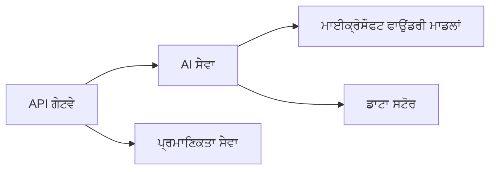

# ਅਧਿਆਇ 8: ਉਤਪਾਦਨ ਅਤੇ ਏਂਟਰਪ੍ਰਾਈਜ਼ ਪੈਟਰਨ

**📚 ਕੋਰਸ**: [AZD ਸ਼ੁਰੂਆਤੀਆਂ ਲਈ](../../README.md) | **⏱️ ਸਮਾਂ**: 2-3 ਘੰਟੇ | **⭐ ਜਟਿਲਤਾ**: ਉੱਚ ਪੱਧਰ

---

## ਜਾਇਜ਼ਾ

ਇਸ ਅਧਿਆਇ ਵਿੱਚ ਉਤਪਾਦਨ ਏਆਈ ਵਰਕਲੋਡਾਂ ਲਈ ਏਂਟਰਪ੍ਰਾਈਜ਼-ਤਿਆਰ ਤਾਇਨਾਤੀ ਪੈਟਰਨ, ਸੁਰੱਖਿਆ ਕਠੋਰਤਾ, ਮਾਨਟਰਿੰਗ ਅਤੇ ਲਾਗਤ ਅਨੁਕੂਲੀਕਰਨ ਨੂੰ ਕਵਰ ਕੀਤਾ ਗਿਆ ਹੈ।

## ਸਿੱਖਣ ਦੇ ਉਦੇਸ਼

ਇਸ ਅਧਿਆਇ ਨੂੰ ਪੂਰਾ ਕਰਨ 'ਤੇ, ਤੁਸੀਂ:
- ਕਈ ਰੀਜਿਯਨਾਂ ਵਿੱਚ ਰੈਜ਼ੀਲਿਯੰਟ ਐਪਲੀਕੇਸ਼ਨਾਂ ਤਾਇਨਾਤ ਕਰੋ
- ਏਂਟਰਪ੍ਰਾਈਜ਼ ਸੁਰੱਖਿਆ ਪੈਟਰਨ ਲਾਗੂ ਕਰੋ
- ਵਿਅਾਪਕ ਮਾਨਟਰਿੰਗ ਸੰਰਚਿਤ ਕਰੋ
- ਪੈਮਾਨੇ 'ਤੇ ਲਾਗਤਾਂ ਦਾ ਅਨੁਕੂਲਨ ਕਰੋ
- AZD ਨਾਲ CI/CD ਪਾਈਪਲਾਈਨ ਸੈਟਅੱਪ ਕਰੋ

---

## 📚 ਪਾਠ

| # | ਪਾਠ | ਵੇਰਵਾ | ਸਮਾਂ |
|---|--------|-------------|------|
| 1 | [ਪ੍ਰੋਡਕਸ਼ਨ AI ਅਭਿਆਸ](production-ai-practices.md) | ਏਂਟਰਪ੍ਰਾਈਜ਼ ਤਾਇਨਾਤੀ ਪੈਟਰਨ | 90 ਮਿੰਟ |

---

## 🚀 ਉਤਪਾਦਨ ਚੈੱਕਲਿਸਟ

- [ ] ਟਿਕਾਊਪਨ ਲਈ ਮਲਟੀ-ਰੀਜਨ ਤਾਇਨਾਤ
- [ ] ਪ੍ਰਮਾਣੀਕਰਨ ਲਈ ਪ੍ਰਬੰਧਿਤ ਆਈਡੈਂਟਟੀ (ਕੋਈ ਕੁੰਜੀਆਂ ਨਹੀਂ)
- [ ] ਮਾਨਟਰਿੰਗ ਲਈ Application Insights
- [ ] ਖਰਚ ਬਜਟ ਅਤੇ ਅਲਰਟਸ ਸੈੱਟ ਕੀਤੇ
- [ ] ਸੁਰੱਖਿਆ ਸਕੈਨਿੰਗ ਯੋਗ ਕੀਤੀ
- [ ] CI/CD ਪਾਈਪਲਾਈਨ ਇਕੀਕਰਨ
- [ ] ਡਿਜਾਸਟਰ ਰਿਕਵਰੀ ਯੋਜਨਾ

---

## 🏗️ ਆਰਕੀਟੈਕਚਰ ਪੈਟਰਨ

### ਪੈਟਰਨ 1: ਮਾਈਕਰੋਸਰਵਿਸ ਏਆਈ


### ਪੈਟਰਨ 2: ਇਵੈਂਟ-ਚਲਿਤ ਏਆਈ


---

## 🔐 ਸੁਰੱਖਿਆ ਸਰਵੋਤਮ ਅਭਿਆਸ

```bicep
// Use managed identity
identity: {
  type: 'SystemAssigned'
}

// Private endpoints for AI services
properties: {
  publicNetworkAccess: 'Disabled'
  networkAcls: {
    defaultAction: 'Deny'
  }
}
```

---

## 💰 ਲਾਗਤ ਅਨੁਕੂਲਤਾ

| ਰਣਨੀਤੀ | ਬਚਤ |
|----------|---------|
| ਜ਼ੀਰੋ ਤੱਕ ਸਕੇਲ (Container Apps) | 60-80% |
| ਡੈਵ ਲਈ consumption tiers ਵਰਤੋ | 50-70% |
| ਨਿਯਤ ਸਕੇਲਿੰਗ | 30-50% |
| ਰਿਜ਼ਰਵਡ ਸਮਰੱਥਾ | 20-40% |

```bash
# ਬਜਟ ਚੇਤਾਵਨੀਆਂ ਸੈੱਟ ਕਰੋ
az consumption budget create \
  --budget-name "AI-Budget" \
  --amount 500 \
  --category Cost \
  --time-grain Monthly
```

---

## 📊 ਮਾਨਟਰਿੰਗ ਸੈੱਟਅੱਪ

```bash
# ਲੌਗ ਸਟ੍ਰੀਮ ਕਰੋ
azd monitor --logs

# Application Insights ਦੀ ਜਾਂਚ ਕਰੋ
azd monitor

# ਮਾਪਦੰਡ ਵੇਖੋ
az monitor metrics list --resource <resource-id>
```

---

## 🔗 ਨੈਵੀਗੇਸ਼ਨ

| ਦਿਸ਼ਾ | ਅਧਿਆਇ |
|-----------|---------|
| **ਪਿਛਲਾ** | [ਅਧਿਆਇ 7: ਟਰਬਲਸ਼ੂਟਿੰਗ](../chapter-07-troubleshooting/README.md) |
| **ਕੋਰਸ ਸਮਾਪਤ** | [ਕੋਰਸ ਹੋਮ](../../README.md) |

---

## 📖 ਸੰਬੰਧਿਤ ਸਰੋਤ

- [AI ਏਜੰਟਸ ਗਾਈਡ](../chapter-02-ai-development/agents.md)
- [Application Insights](../chapter-06-pre-deployment/application-insights.md)
- [ਮਲਟੀ-ਏਜੰਟ ਹੱਲ](../chapter-05-multi-agent/README.md)
- [ਮਾਈਕਰੋਸਰਵਿਸ ਉਦਾਹਰਨ](../../examples/microservices/README.md)

---

<!-- CO-OP TRANSLATOR DISCLAIMER START -->
**Disclaimer**:
ਇਸ ਦਸਤਾਵੇਜ਼ ਦਾ ਅਨੁਵਾਦ AI ਅਨੁਵਾਦ ਸੇਵਾ [Co-op Translator](https://github.com/Azure/co-op-translator) ਦੀ ਵਰਤੋਂ ਕਰਕੇ ਕੀਤਾ ਗਿਆ ਹੈ। ਅਸੀਂ ਸਹੀਪਨ ਲਈ ਕੋਸ਼ਿਸ਼ ਕਰਦੇ ਹਾਂ, ਪਰ ਕਿਰਪਾ ਕਰਕੇ ਧਿਆਨ ਰੱਖੋ ਕਿ ਆਟੋਮੇਟਿਕ ਅਨੁਵਾਦਾਂ ਵਿੱਚ ਗਲਤੀਆਂ ਜਾਂ ਅਣਸ਼ੁੱਧੀਆਂ ਹੋ ਸਕਦੀਆਂ ਹਨ। ਮੁਲ਼ ਭਾਸ਼ਾ ਵਿੱਚ ਮੌਜੂਦ ਅਸਲ ਦਸਤਾਵੇਜ਼ ਨੂੰ ਹੀ ਅਧਿਕਾਰਿਕ ਸਰੋਤ ਮੰਨਿਆ ਜਾਣਾ ਚਾਹੀਦਾ ਹੈ। ਮਹੱਤਵਪੂਰਣ ਜਾਣਕਾਰੀ ਲਈ ਪੇਸ਼ੇਵਰ ਮਨੁੱਖੀ ਅਨੁਵਾਦ ਦੀ ਸਿਫ਼ਾਰਿਸ਼ ਕੀਤੀ ਜਾਂਦੀ ਹੈ। ਅਸੀਂ ਇਸ ਅਨੁਵਾਦ ਦੀ ਵਰਤੋਂ ਕਾਰਨ ਉਤਪੰਨ ਕਿਸੇ ਵੀ ਗਲਤਫਹਮੀਆਂ ਜਾਂ ਗਲਤ ਵਿਆਖਿਆਵਾਂ ਲਈ ਜ਼ਿੰਮੇਵਾਰ ਨਹੀਂ ਹਾਂ।
<!-- CO-OP TRANSLATOR DISCLAIMER END -->