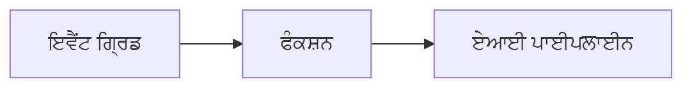

# ਅਧਿਆਇ 8: ਉਤਪਾਦਨ ਅਤੇ ਉਦਯੋਗ ਪੈਟਰਨ

**📚 ਕੋਰਸ**: [AZD ਸ਼ੁਰੂਆਤੀ ਲਈ](../../README.md) | **⏱️ ਸਮਾਂ**: 2-3 ਘੰਟੇ | **⭐ ਜਟਿਲਤਾ**: ਉੱਚ

---

## ਝਲਕ

ਇਹ ਅਧਿਆਇ ਉਦਯੋਗ-ਤਿਆਰ ਤैनਾਤੀ ਪੈਟਰਨਾਂ, ਸੁਰੱਖਿਆ ਨੂੰ ਮਜ਼ਬੂਤ ਕਰਨ, ਨਿਗਰਾਨੀ ਅਤੇ ਉਤਪਾਦਨ ਏਆਈ ਵਰਕਲੋਡਾਂ ਲਈ ਲਾਗਤ ਸੁਧਾਰਣ ਨੂੰ ਸਮਝਾਉਂਦਾ ਹੈ।

> `azd 1.27.1` ਨਾਲ ਜੁਲਾਈ 2026 ਵਿੱਚ ਪ੍ਰਮਾਣਿਤ ਕੀਤਾ ਗਿਆ।

## ਸਿੱਖਣ ਦੇ ਉਦੇਸ਼

ਇਸ ਅਧਿਆਇ ਨੂੰ ਪੂਰਾ ਕਰਕੇ, ਤੁਸੀਂ:
- ਬਹੁ-ਖੇਤਰੀ ਸਥਿਰ ਐਪਲੀਕੇਸ਼ਨਾਂ ਦੀ ਤੈਨਾਤੀ ਕਰੋਗੇ
- ਉਦਯੋਗ ਸੁਰੱਖਿਆ ਪੈਟਰਨ ਲਾਗੂ ਕਰੋਗੇ
- ਵਿਆਪਕ ਨਿਗਰਾਨੀ ਸੈਟਅਪ ਕਰੋਗੇ
- ਪੈਮਾਨੇ 'ਤੇ ਲਾਗਤ ਸੁਧਾਰੋਗੇ
- AZD ਨਾਲ CI/CD ਪਾਈਪਲਾਈਨ ਸੈਟਅਪ ਕਰੋਗੇ

---

## 📚 ਪਾਠ

| # | ਪਾਠ | ਵਰਣਨ | ਸਮਾਂ |
|---|--------|-------------|------|
| 1 | [ਉਤਪਾਦਨ ਏਆਈ ਅਭਿਆਸ](production-ai-practices.md) | ਉਦਯੋਗ ਤੈਨਾਤੀ ਪੈਟਰਨ | 90 ਮਿੰਟ |

---

## 🚀 ਉਤਪਾਦਨ ਚੈਕਲਿਸਟ

- [ ] ਸਥਿਰਤਾ ਲਈ ਬਹੁ-ਖੇਤਰੀ ਤੈਨਾਤੀ
- [ ] ਪ੍ਰਮਾਣਕਰਨ ਲਈ ਪ੍ਰਬੰਧਤ ਪਹਿਚਾਣ (ਕੋਈ ਚਾਬੀਆਂ ਨਹੀਂ)
- [ ] ਨਿਗਰਾਨੀ ਲਈ ਐਪਲੀਕੇਸ਼ਨ ਇਨਸਾਈਟਸ
- [ ] ਲਾਗਤ ਬਜਟ ਅਤੇ ਅਲਰਟ ਸੈੱਟ ਕੀਤੇ ਗਏ
- [ ] ਸੁਰੱਖਿਆ ਸਕੈਨਿੰਗ ਚਾਲੂ ਹੈ
- [ ] CI/CD ਪਾਈਪਲਾਈਨ ਇੰਟੀਗ੍ਰੇਸ਼ਨ
- [ ] ਆਪੱਤੀ ਪੁਰਵ ਰਿਕਵਰੀ ਯੋਜਨਾ

---

## 🏗️ ਵਾਸਤੂਕਲਾ ਪੈਟਰਨ

### ਪੈਟਰਨ 1: ਮਾਈਕ੍ਰੋਸਰਵਿਸਜ਼ ਏਆਈ


### ਪੈਟਰਨ 2: ਘਟਨਾ-ਚਾਲਤ ਏਆਈ



---

## 🔐 ਸੁਰੱਖਿਆ ਸ਼੍ਰੇਸ਼್ಠ ਅਭਿਆਸ

```bicep
// Use managed identity
identity: {
  type: 'SystemAssigned'
}

// Private endpoints for AI services
properties: {
  publicNetworkAccess: 'Disabled'
  networkAcls: {
    defaultAction: 'Deny'
  }
}
```

---

## 💰 ਲਾਗਤ ਸੁਧਾਰ

| ਰਣਨੀਤੀ | ਬਚਤ |
|----------|---------|
| ਜ਼ੀਰੋ ਤੱਕ ਸਪੇਦ (ਕੰਟੇਨਰ ਐਪਸ) | 60-80% |
| ਵਿਕਾਸ ਲਈ ਖਪਤ ਤਹਾਂ ਦਾ ਇਸਤੇਮਾਲ | 50-70% |
| ਨਿਯਮਤ ਅਨੁਪਾਤ ਬਦਲਾਅ | 30-50% |
| ਰਿਜ਼ਰਵਡ ਸਮਰੱਥਾ | 20-40% |

```bash
# ਬਜਟ ਅਲਰਟ ਸੈੱਟ ਕਰੋ
az consumption budget create \
  --budget-name "AI-Budget" \
  --amount 500 \
  --category Cost \
  --time-grain Monthly
```

---

## 📊 ਨਿਗਰਾਨੀ ਸੈਟਅਪ

```bash
# ਲਾਗ ਸਟਰੀਮ ਕਰੋ
azd monitor --logs

# ਐਪਲੀਕੇਸ਼ਨ ਇਨਸਾਈਟਸ ਦੀ ਜਾਂਚ ਕਰੋ
azd monitor --overview

# ਮੈਟ੍ਰਿਕਸ ਵੇਖੋ
az monitor metrics list --resource <resource-id>
```

---

## 🔗 ਨੈਵੀਗੇਸ਼ਨ

| ਦਿਸ਼ਾ | ਅਧਿਆਇ |
|-----------|---------|
| **ਪਿਛਲਾ** | [ਅਧਿਆਇ 7: ਸਮੱਸਿਆ ਸਮਾਧਾਨ](../chapter-07-troubleshooting/README.md) |
| **ਕੋਰਸ ਪੂਰਾ** | [ਕੋਰਸ ਮੁੱਖ ਪੰਨਾ](../../README.md) |

---

## 📖 ਸਬੰਧਤ ਸਰੋਤ

- [ਏਆਈ ਏਜੰਟਸ ਗਾਈਡ](../chapter-02-ai-development/agents.md)
- [ਐਪਲੀਕੇਸ਼ਨ ਇਨਸਾਈਟਸ](../chapter-06-pre-deployment/application-insights.md)
- [ਬਹੁ-ਏਜੰਟ ਹੱਲ](../chapter-05-multi-agent/README.md)
- [ਮਾਈਕ੍ਰੋਸਰਵਿਸਜ਼ ਉਦਾਹਰਨ](../../examples/microservices/README.md)

---

<!-- CO-OP TRANSLATOR DISCLAIMER START -->
**ਅਸਵੀਕਾਰੋਪਣ**:
ਇਸ ਦਸਤਾਵੇਜ਼ ਦਾ ਅਨੁਵਾਦ ਏਆਈ ਅਨੁਵਾਦ ਸੇਵਾ [Co-op Translator](https://github.com/Azure/co-op-translator) ਦੀ ਵਰਤੋਂ ਕਰਕੇ ਕੀਤਾ ਗਿਆ ਹੈ। ਜਦੋਂ ਕਿ ਅਸੀਂ ਸਹੀਤਾਵਾਂ ਲਈ ਯਤਨਸ਼ੀਲ ਹਾਂ, ਕਿਰਪਾ ਕਰਕੇ ਧਿਆਨ ਰੱਖੋ ਕਿ ਸਵੈਚਾਲਿਤ ਅਨੁਵਾਦਾਂ ਵਿੱਚ ਗਲਤੀਆਂ ਜਾਂ ਅਸਮੱਤਿਆਵਾਂ ਹੋ ਸਕਦੀਆਂ ਹਨ। ਮੂਲ ਦਸਤਾਵੇਜ਼ ਆਪਣੀ ਮੂਲ ਭਾਸ਼ਾ ਵਿੱਚ ਅਧਿਕਾਰਕ ਸਰੋਤ ਮੰਨਿਆ ਜਾਣਾ ਚਾਹੀਦਾ ਹੈ। ਜਰੂਰੀ ਜਾਣਕਾਰੀ ਲਈ, ਪੇਸ਼ੇਵਰ ਮਨੁੱਖੀ ਅਨੁਵਾਦ ਦੀ ਸਿਫ਼ਾਰਸ਼ ਕੀਤੀ ਜਾਂਦੀ ਹੈ। ਅਸੀਂ ਇਸ ਅਨੁਵਾਦ ਦੇ ਉਪਯੋਗ ਤੋਂ ਪੈਦਾ ਹੋਣ ਵਾਲੀਆਂ ਕਿਸੇ ਵੀ ਗਲਤਫਹਿਮੀਆਂ ਜਾਂ ਗਲਤ ਵਿਆਖਿਆਵਾਂ ਲਈ ਜਵਾਬਦੇਹ ਨਹੀਂ ਹਾਂ।
<!-- CO-OP TRANSLATOR DISCLAIMER END -->