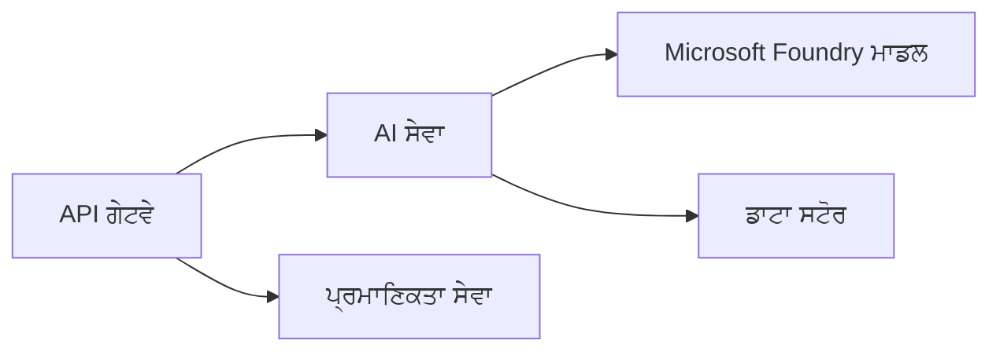

# ਅਧਿਆਇ 8: ਪ੍ਰੋਡਕਸ਼ਨ ਅਤੇ ਐਂਟਰਪ੍ਰਾਈਜ਼ ਪੈਟਰਨ

**📚 ਕੋਰਸ**: [AZD ਸ਼ੁਰੂਆਤੀਆਂ ਲਈ](../../README.md) | **⏱️ ਅਵਧੀ**: 2-3 ਘੰਟੇ | **⭐ ਜਟਿਲਤਾ**: ਉੱਚ ਪੱਧਰ

---

## ਝਲਕ

ਇਹ ਅਧਿਆਇ ਐਂਟਰਪ੍ਰਾਈਜ਼-ਤਿਆਰ ਤੈਨਾਤੀ ਪੈਟਰਨ, ਸੁਰੱਖਿਆ ਹਾਰਡਨਿੰਗ, ਮਾਨੀਟਰਿੰਗ ਅਤੇ ਪ੍ਰੋਡਕਸ਼ਨ AI ਵਰਕਲੋਡਸ ਲਈ ਲਾਗਤ ਅਨੁਕੂਲਤਾ ਨੂੰ ਕਵਰ ਕਰਦਾ ਹੈ।

> ਜੂਨ 2026 ਵਿੱਚ `azd 1.25.6` ਨਾਲ ਪੁਸ਼ਟੀ ਕੀਤੀ ਗਈ।

## ਸਿੱਖਣ ਦੇ ਉਦੇਸ਼

By completing this chapter, you will:
- ਬਹੁ-ਰੀਜਨ ਰੀਜ਼ੀਲੈਂਟ ਐਪਲੀਕੇਸ਼ਨਾਂ ਨੂੰ ਤੈਨਾਤ ਕਰੋ
- ਐਂਟਰਪ੍ਰਾਈਜ਼ ਸੁਰੱਖਿਆ ਪੈਟਰਨ ਲਾਗੂ ਕਰੋ
- ਵਿਆਪਕ ਮਾਨੀਟਰਿੰਗ ਕੰਫਿਗਰ ਕਰੋ
- ਪੈਮਾਣੇ 'ਤੇ ਲਾਗਤਾਂ ਨੂੰ ਅਨੁਕੂਲ ਕਰੋ
- AZD ਨਾਲ CI/CD ਪਾਈਪਲਾਈਨ ਸੈੱਟ ਕਰੋ

---

## 📚 ਪਾਠ

| # | ਪਾਠ | ਵੇਰਵਾ | ਸਮਾਂ |
|---|--------|-------------|------|
| 1 | [ਪ੍ਰੋਡਕਸ਼ਨ AI ਅਭਿਆਸ](production-ai-practices.md) | ਐਂਟਰਪ੍ਰਾਈਜ਼ ਤੈਨਾਤੀ ਪੈਟਰਨ | 90 ਮਿੰਟ |

---

## 🚀 ਪ੍ਰੋਡਕਸ਼ਨ ਚੈੱਕਲਿਸਟ

- [ ] ਟਿਕਾਊਪਣ ਲਈ ਬਹੁ-ਰੀਜਨ ਤੈਨਾਤੀ
- [ ] ਪ੍ਰਮਾਣਿਕਤਾ ਲਈ ਪ੍ਰਬੰਧਤ ਆਈਡੈਂਟੀਟੀ (ਕੋਈ ਕੀਜ਼ ਨਹੀਂ)
- [ ] ਮਾਨੀਟਰਿੰਗ ਲਈ Application Insights
- [ ] ਲਾਗਤ ਬਜਟ ਅਤੇ ਅਲਰਟ ਸੰਰਚਿਤ
- [ ] ਸੁਰੱਖਿਆ ਸਕੈਨਿੰਗ ਚਾਲੂ ਕੀਤੀ ਗਈ
- [ ] CI/CD ਪਾਈਪਲਾਈਨ ਸਮਾਬੇਸ਼
- [ ] ਆਪਦਾ ਰਿਕਵਰੀ ਯੋਜਨਾ

---

## 🏗️ ਆਰਕੀਟੈਕਚਰ ਪੈਟਰਨ

### ਪੈਟਰਨ 1: ਮਾਈਕ੍ਰੋਸਰਵਿਸੇਜ਼ AI



### ਪੈਟਰਨ 2: ਇਵੈਂਟ-ਚਲਿਤ AI


---

## 🔐 ਸੁਰੱਖਿਆ ਲਈ ਬਿਹਤਰ ਅਭਿਆਸ

```bicep
// Use managed identity
identity: {
  type: 'SystemAssigned'
}

// Private endpoints for AI services
properties: {
  publicNetworkAccess: 'Disabled'
  networkAcls: {
    defaultAction: 'Deny'
  }
}
```

---

## 💰 ਲਾਗਤ ਅਨੁਕੂਲਤਾ

| ਰਣਨੀਤੀ | ਬਚਤ |
|----------|---------|
| ਜ਼ੀਰੋ ਤੱਕ ਸਕੇਲ (Container Apps) | 60-80% |
| ਡੈਵ ਲਈ ਖਪਤ ਟੀਅਰ ਵਰਤੋ | 50-70% |
| ਨਿਯਤ ਸਮਾਂ ਅਨੁਸਾਰ ਸਕੇਲਿੰਗ | 30-50% |
| ਰਿਜ਼ਰਵਡ ਸਮਰੱਥਾ | 20-40% |

```bash
# ਬਜਟ ਚੇਤਾਵਨੀਆਂ ਸੈੱਟ ਕਰੋ
az consumption budget create \
  --budget-name "AI-Budget" \
  --amount 500 \
  --category Cost \
  --time-grain Monthly
```

---

## 📊 ਮਾਨੀਟਰਿੰਗ ਸੈੱਟਅਪ

```bash
# ਲੌਗ ਸਟ੍ਰੀਮ ਕਰੋ
azd monitor --logs

# Application Insights ਦੀ ਜਾਂਚ ਕਰੋ
azd monitor --overview

# ਮੇਟ੍ਰਿਕਸ ਵੇਖੋ
az monitor metrics list --resource <resource-id>
```

---

## 🔗 ਨੇਵੀਗੇਸ਼ਨ

| Direction | Chapter |
|-----------|---------|
| **ਪਿਛਲਾ** | [ਅਧਿਆਇ 7: ਸਮੱਸਿਆ ਨਿਵਾਰਣ](../chapter-07-troubleshooting/README.md) |
| **ਕੋਰਸ ਮੁਕੰਮਲ** | [ਕੋਰਸ ਮੁੱਖਪੰਨਾ](../../README.md) |

---

## 📖 ਸਬੰਧਿਤ ਸਰੋਤ

- [AI ਏਜੰਟਸ ਗਾਈਡ](../chapter-02-ai-development/agents.md)
- [Application Insights](../chapter-06-pre-deployment/application-insights.md)
- [ਮਲਟੀ-ਏਜੰਟ ਹੱਲ](../chapter-05-multi-agent/README.md)
- [ਮਾਈਕ੍ਰੋਸਰਵਿਸੇਜ਼ ਉਦਾਹਰਨ](../../examples/microservices/README.md)

---

<!-- CO-OP TRANSLATOR DISCLAIMER START -->
**ਅਸਵੀਕਾਰੋਪਣ**:
ਇਸ ਦਸਤਾਵੇਜ਼ ਦਾ ਅਨੁਵਾਦ ਏਆਈ ਅਨੁਵਾਦ ਸੇਵਾ [Co-op Translator](https://github.com/Azure/co-op-translator) ਦੀ ਵਰਤੋਂ ਕਰਕੇ ਕੀਤਾ ਗਿਆ ਹੈ। ਜਦੋਂ ਕਿ ਅਸੀਂ ਸਹੀਤਾਵਾਂ ਲਈ ਯਤਨਸ਼ੀਲ ਹਾਂ, ਕਿਰਪਾ ਕਰਕੇ ਧਿਆਨ ਰੱਖੋ ਕਿ ਸਵੈਚਾਲਿਤ ਅਨੁਵਾਦਾਂ ਵਿੱਚ ਗਲਤੀਆਂ ਜਾਂ ਅਸਮੱਤਿਆਵਾਂ ਹੋ ਸਕਦੀਆਂ ਹਨ। ਮੂਲ ਦਸਤਾਵੇਜ਼ ਆਪਣੀ ਮੂਲ ਭਾਸ਼ਾ ਵਿੱਚ ਅਧਿਕਾਰਕ ਸਰੋਤ ਮੰਨਿਆ ਜਾਣਾ ਚਾਹੀਦਾ ਹੈ। ਜਰੂਰੀ ਜਾਣਕਾਰੀ ਲਈ, ਪੇਸ਼ੇਵਰ ਮਨੁੱਖੀ ਅਨੁਵਾਦ ਦੀ ਸਿਫ਼ਾਰਸ਼ ਕੀਤੀ ਜਾਂਦੀ ਹੈ। ਅਸੀਂ ਇਸ ਅਨੁਵਾਦ ਦੇ ਉਪਯੋਗ ਤੋਂ ਪੈਦਾ ਹੋਣ ਵਾਲੀਆਂ ਕਿਸੇ ਵੀ ਗਲਤਫਹਿਮੀਆਂ ਜਾਂ ਗਲਤ ਵਿਆਖਿਆਵਾਂ ਲਈ ਜਵਾਬਦੇਹ ਨਹੀਂ ਹਾਂ।
<!-- CO-OP TRANSLATOR DISCLAIMER END -->