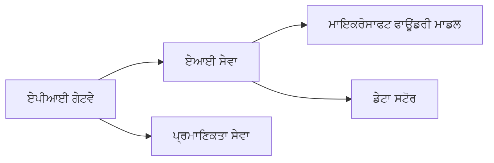

# Chapter 8: ਉਤਪਾਦਨ ਅਤੇ ਐਂਟਰਪ੍ਰਾਈਜ਼ ਪੈਟਰਨ

**📚 Course**: [AZD For Beginners](../../README.md) | **⏱️ Duration**: 2-3 hours | **⭐ Complexity**: ਉੱਨਤ

---

## ਜਾਇਜ਼ਾ

This chapter covers enterprise-ready deployment patterns, security hardening, monitoring, and cost optimization for production AI workloads.

> azd 1.23.12 ਦੇ ਖਿਲਾਫ਼ ਮਾਰਚ 2026 ਵਿੱਚ ਪ੍ਰਮਾਣਿਤ.

## ਸਿੱਖਣ ਦੇ ਉਦੇਸ਼

ਇਸ ਚੈਪਟਰ ਨੂੰ ਪੂਰਾ ਕਰਨ ਤੋਂ ਬਾਅਦ, ਤੁਸੀਂ:
- ਬਹੁ-ਰੀਜਨ ਰੇਜ਼ਿਲੀਐਂਟ ਐਪਲੀਕੇਸ਼ਨਾਂ ਨੂੰ ਡਿਪਲੋਏ ਕਰੋ
- ਐਂਟਰਪ੍ਰਾਈਜ਼ ਸੁਰੱਖਿਆ ਪੈਟਰਨ ਲਾਗੂ ਕਰੋ
- ਵਿਆਪਕ ਮਾਨੀਟਰਿੰਗ ਸੰਰਚਿਤ ਕਰੋ
- ਪੈਮਾਣੇ 'ਤੇ ਲਾਗਤਾਂ ਦਾ ਅਪਟੀਮਾਈਜ਼ੇਸ਼ਨ ਕਰੋ
- AZD ਨਾਲ CI/CD ਪਾਈਪਲਾਈਨ ਸੈਟਅਪ ਕਰੋ

---

## 📚 ਪਾਠ

| # | Lesson | Description | Time |
|---|--------|-------------|------|
| 1 | [Production AI Practices](production-ai-practices.md) | ਐਂਟਰਪ੍ਰਾਈਜ਼ ਡਿਪਲੋਇਮੈਂਟ ਪੈਟਰਨ | 90 min |

---

## 🚀 ਉਤਪਾਦਨ ਚੈੱਕਲਿਸਟ

- [ ] Multi-region deployment for resilience
- [ ] Managed identity for authentication (no keys)
- [ ] Application Insights for monitoring
- [ ] Cost budgets and alerts configured
- [ ] Security scanning enabled
- [ ] CI/CD pipeline integration
- [ ] Disaster recovery plan

---

## 🏗️ ਆਰਕੀਟੈਕਚਰ ਪੈਟਰਨ

### ਪੈਟਰਨ 1: ਮਾਈਕ੍ਰੋਸਰਵਿਸਜ਼ ਏਆਈ


### ਪੈਟਰਨ 2: ਇਵੈਂਟ-ਚਲਤ ਏਆਈ


---

## 🔐 ਸੁਰੱਖਿਆ ਸਰੋਤਮ ਅਭਿਆਸ

```bicep
// Use managed identity
identity: {
  type: 'SystemAssigned'
}

// Private endpoints for AI services
properties: {
  publicNetworkAccess: 'Disabled'
  networkAcls: {
    defaultAction: 'Deny'
  }
}
```

---

## 💰 ਲਾਗਤ ਅਪਟੀਮਾਈਜ਼ੇਸ਼ਨ

| Strategy | Savings |
|----------|---------|
| ਜ਼ੀਰੋ 'ਤੇ ਸਕੇਲ ਕਰੋ (Container Apps) | 60-80% |
| ਡੈਵ ਲਈ ਖਪਤ ਟੀਅਰ ਦੀ ਵਰਤੋਂ ਕਰੋ | 50-70% |
| ਨਿਯਤ ਕੀਤਾ ਸਕੇਲਿੰਗ | 30-50% |
| ਰਿਜ਼ਰਵ ਕੀਤੀ ਸਮਰੱਥਾ | 20-40% |

```bash
# ਬਜਟ ਚੇਤਾਵਨੀਆਂ ਸੈੱਟ ਕਰੋ
az consumption budget create \
  --budget-name "AI-Budget" \
  --amount 500 \
  --category Cost \
  --time-grain Monthly
```

---

## 📊 ਮਾਨੀਟਰਿੰਗ ਸੈਟਅਪ

```bash
# ਲੌਗ ਸਟ੍ਰੀਮ ਕਰੋ
azd monitor --logs

# Application Insights ਦੀ ਜਾਂਚ ਕਰੋ
azd monitor --overview

# ਮੀਟ੍ਰਿਕਸ ਵੇਖੋ
az monitor metrics list --resource <resource-id>
```

---

## 🔗 ਨੈਵੀਗੇਸ਼ਨ

| Direction | Chapter |
|-----------|---------|
| **ਪਿਛਲਾ** | [ਚੈਪਟਰ 7: ਟ੍ਰਬਲਸ਼ੂਟਿੰਗ](../chapter-07-troubleshooting/README.md) |
| **ਕੋਰਸ ਪੂਰਾ** | [ਕੋਰਸ ਹੋਮ](../../README.md) |

---

## 📖 ਸੰਬੰਧਤ ਸਾਧਨ

- [ਏਆਈ ਏਜੰਟਸ ਗਾਈਡ](../chapter-02-ai-development/agents.md)
- [Application Insights](../chapter-06-pre-deployment/application-insights.md)
- [ਮਲਟੀ-ਏਜੰਟ ਹੱਲ](../chapter-05-multi-agent/README.md)
- [ਮਾਈਕ੍ਰੋਸਰਵਿਸਜ਼ ਉਦਾਹਰਨ](../../examples/microservices/README.md)

---

<!-- CO-OP TRANSLATOR DISCLAIMER START -->
**ਅਸਵੀਕਾਰ-ਘੋਸ਼ਣਾ**:
ਇਹ ਦਸਤਾਵੇਜ਼ [Co-op Translator](https://github.com/Azure/co-op-translator) ਨਾਮਕ ਏ.ਆਈ. ਅਨੁਵਾਦ ਸੇਵਾ ਦੀ ਵਰਤੋਂ ਕਰਕੇ ਅਨੁਵਾਦ ਕੀਤਾ ਗਿਆ ਹੈ। ਅਸੀਂ ਸ਼ੁੱਧਤਾ ਲਈ ਕੋਸ਼ਿਸ਼ ਕਰਦੇ ਹਾਂ, ਪਰ ਕਿਰਪਾ ਕਰਕੇ ਧਿਆਨ ਰੱਖੋ ਕਿ ਸਵੈਚਾਲਿਤ ਅਨੁਵਾਦਾਂ ਵਿੱਚ ਗਲਤੀਆਂ ਜਾਂ ਅਣਸਹੀਤਾਵਾਂ ਹੋ ਸਕਦੀਆਂ ਹਨ। ਮੂਲ ਦਸਤਾਵੇਜ਼ ਨੂੰ ਇਸ ਦੀ ਮੂਲ ਭਾਸ਼ਾ ਵਿੱਚ ਪ੍ਰਮਾਣਿਕ ਸਰੋਤ ਮੰਨਿਆ ਜਾਣਾ ਚਾਹੀਦਾ ਹੈ। ਮਹੱਤਵਪੂਰਨ ਜਾਣਕਾਰੀ ਲਈ, ਪੇਸ਼ੇਵਰ ਮਨੁੱਖੀ ਅਨੁਵਾਦ ਦੀ ਸਿਫਾਰਿਸ਼ ਕੀਤੀ ਜਾਂਦੀ ਹੈ। ਅਸੀਂ ਇਸ ਅਨੁਵਾਦ ਦੇ ਉਪਯੋਗ ਤੋਂ ਉਪਜਣ ਵਾਲੀਆਂ ਕਿਸੇ ਵੀ ਗਲਤਫਹਿਮੀਆਂ ਜਾਂ ਗਲਤ ਵਿਆਖਿਆਵਾਂ ਲਈ ਜ਼ਿੰਮੇਵਾਰ ਨਹੀਂ ਹਾਂ।
<!-- CO-OP TRANSLATOR DISCLAIMER END -->