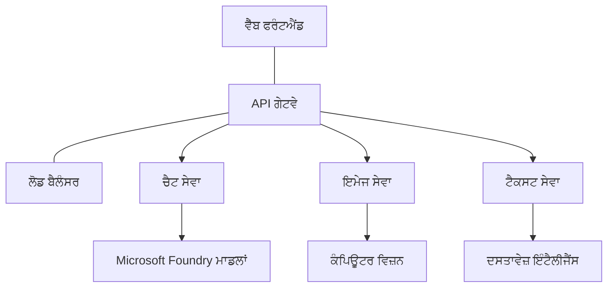

# ਪ੍ਰੋਡਕਸ਼ਨ AI ਵਰਕਲੋਡ ਲਈ ਬੈਸਟ ਪ੍ਰੈਕਟਿਸਜ਼ with AZD

**ਅਧਿਆਇ ਨੈਵੀਗੇਸ਼ਨ:**
- **📚 ਕੋਰਸ ਹੋਮ**: [AZD For Beginners](../../README.md)
- **📖 ਮੌਜੂਦਾ ਅਧਿਆਇ**: ਅਧਿਆਇ 8 - ਪ੍ਰੋਡਕਸ਼ਨ ਅਤੇ ਐਂਟਰਪ੍ਰਾਈਜ਼ ਪੈਟਰਨ
- **⬅️ ਪਿਛਲਾ ਅਧਿਆਇ**: [Chapter 7: Troubleshooting](../chapter-07-troubleshooting/debugging.md)
- **⬅️ ਸੰਬੰਧਿਤ**: [AI Workshop Lab](ai-workshop-lab.md)
- **🎯 ਕੋਰਸ ਪੂਰਾ**: [AZD For Beginners](../../README.md)

## ਓਵਰਵਿਊ

ਇਹ ਗਾਈਡ Azure Developer CLI (AZD) ਦੀ ਵਰਤੋਂ ਕਰਕੇ ਪ੍ਰੋਡਕਸ਼ਨ-ਤਿਆਰ AI ਵਰਕਲੋਡ ਤੈਨਾਤ ਕਰਨ ਲਈ ਵਿਆਪਕ ਬੈਸਟ ਪ੍ਰੈਕਟਿਸਜ਼ ਪ੍ਰਦਾਨ ਕਰਦੀ ਹੈ। Microsoft Foundry Discord ਕਮਿਊਨਿਟੀ ਅਤੇ ਵਾਸਤਵਿਕ ਗਾਹਕ ਤੈਨਾਤੀਆਂ ਤੋਂ ਪ੍ਰਾਪਤ ਫੀਡਬੈਕ ਦੇ ਆਧਾਰ 'ਤੇ, ਇਹ ਪ੍ਰੈਕਟਿਸਜ਼ ਪ੍ਰੋਡਕਸ਼ਨ AI ਸਿਸਟਮਾਂ ਵਿੱਚ ਆਮ ਚੁਣੌਤੀਆਂ ਨੂੰ ਹੱਲ ਕਰਦੀਆਂ ਹਨ।

## ਮੁੱਖ ਚੁਣੌਤੀਆਂ ਜਿਹਨਾਂ ਦਾ ਹੱਲ ਕੀਤਾ ਗਿਆ

ਸਾਡੇ ਕਮਿਊਨਿਟੀ ਪੋਲ ਨਤੀਜਿਆਂ ਦੇ ਆਧਾਰ 'ਤੇ, ਵਿਕਾਸਕਾਰਾਂ ਨੂੰ ਇਹ ਸਿਖਰਲੇ ਚੁਣੌਤੀਆਂ ਆਮ ਤੌਰ 'ਤੇ ਦਰਪੇਸ਼ ਹਨ:

- **45%** ਨੂੰ ਬਹੁਸੇਵਾ (multi-service) AI ਤੈਨਾਤੀਆਂ ਨਾਲ ਮੁਸ਼ਕਲ ਆਉਂਦੀ ਹੈ
- **38%** ਨੂੰ ਪ੍ਰਮਾਣ-ਪੱਤਰ ਅਤੇ ਸੀਕ੍ਰੇਟ ਪ੍ਰਬੰਧਨ ਵਿੱਚ ਸਮੱਸਿਆਵਾਂ ਹਨ  
- **35%** ਨੂੰ ਪ੍ਰੋਡਕਸ਼ਨ ਤਿਆਰੀ ਅਤੇ ਸਕੇਲਿੰਗ ਔਖਾ ਲਗਦਾ ਹੈ
- **32%** ਨੂੰ ਲਾਗਤ ਆਪਟੀਮਾਈਜ਼ੇਸ਼ਨ ਰਣਨੀਤੀਆਂ ਦੀ ਲੋੜ ਹੈ
- **29%** ਨੂੰ ਮੋਨੀਟਰਿੰਗ ਅਤੇ ਟ੍ਰਬਲਸ਼ੂਟਿੰਗ ਵਿੱਚ ਸੁਧਾਰ ਦੀ ਲੋੜ ਹੈ

## ਪ੍ਰੋਡਕਸ਼ਨ AI ਲਈ ਆਰਕੀਟੈਕਚਰ ਪੈਟਰਨ

### ਪੈਟਰਨ 1: ਮਾਇਕ੍ਰੋਸੇਵਾਵਾਂ AI ਆਰਕੀਟੈਕਚਰ

**ਕਦੋਂ ਵਰਤਣਾ**: ਕਈ ਯੋਗਤਾਵਾਂ ਵਾਲੀਆਂ ਜਟਿਲ AI ਐਪਲੀਕੇਸ਼ਨਾਂ ਲਈ


**AZD ਇੰਪਲੀਮੇਂਟੇਸ਼ਨ**:

```yaml
# azure.yaml
name: enterprise-ai-platform
services:
  web:
    project: ./web
    host: staticwebapp
  api-gateway:
    project: ./api-gateway
    host: containerapp
  chat-service:
    project: ./services/chat
    host: containerapp
  vision-service:
    project: ./services/vision
    host: containerapp
  text-service:
    project: ./services/text
    host: containerapp
```

### ਪੈਟਰਨ 2: ਇਵੈਂਟ-ਡ੍ਰਿਵਨ AI ਪ੍ਰੋਸੈਸਿੰਗ

**ਕਦੋਂ ਵਰਤਣਾ**: ਬੈਚ ਪ੍ਰੋਸੈਸਿੰਗ, ਡੌਕਯੂਮੈਂਟ ਵਿਸ਼ਲੇਸ਼ਣ, ਐਸਿੰਕ ਵਰਕਫ਼ਲੋਜ਼

```bicep
// Event Hub for AI processing pipeline
resource eventHub 'Microsoft.EventHub/namespaces@2023-01-01-preview' = {
  name: eventHubNamespaceName
  location: location
  sku: {
    name: 'Standard'
    tier: 'Standard'
    capacity: 1
  }
}

// Service Bus for reliable message processing
resource serviceBus 'Microsoft.ServiceBus/namespaces@2022-10-01-preview' = {
  name: serviceBusNamespaceName
  location: location
  sku: {
    name: 'Premium'
    tier: 'Premium'
    capacity: 1
  }
}

// Function App for processing
resource functionApp 'Microsoft.Web/sites@2023-01-01' = {
  name: functionAppName
  location: location
  kind: 'functionapp,linux'
  properties: {
    siteConfig: {
      appSettings: [
        {
          name: 'FUNCTIONS_EXTENSION_VERSION'
          value: '~4'
        }
        {
          name: 'AZURE_OPENAI_ENDPOINT'
          value: '@Microsoft.KeyVault(VaultName=${keyVault.name};SecretName=openai-endpoint)'
        }
      ]
    }
  }
}
```

## AI ਏਜੰਟ ਦੀ ਸਿਹਤ ਬਾਰੇ ਸੋਚਣਾ

ਜਦੋਂ ਇੱਕ ਰਵਾਇਤੀ ਵੈਬ ਐਪ੍ਹ ਟੁੱਟਦੀ ਹੈ, ਲੱਛਣ ਜਾਣੇ-ਪਹਚਾਣੇ ਹੁੰਦੇ ਹਨ: ਇੱਕ ਪੰਨਾ ਲੋਡ ਨਹੀਂ ਹੁੰਦਾ, ਇੱਕ API ਗਲਤੀ ਦਿੰਦਾ ਹੈ, ਜਾਂ ਇੱਕ ਡਿਪਲੋਇਮੈਂਟ ਫੇਲ ਹੁੰਦਾ ਹੈ। AI-ਸক্ষম ਐਪਲੀਕੇਸ਼ਨ ਉਹੀ ਤਰ੍ਹਾਂ ਟੁੱਟ ਸਕਦੀਆਂ ਹਨ—ਪਰ ਇਹ ਹੋਰ ਸੁਖ਼ਮ ਤਰੀਕਿਆਂ ਨਾਲ ਗਲਤ ਵਰਤਾਰ ਕਰ ਸਕਦੀਆਂ ਹਨ ਜਿਹੜਿਆਂ ਤੋਂ ਸਪਸ਼ਟ ਗਲਤੀ ਸੁਨੇਹੇ ਨਹੀਂ ਮਿਲਦੇ।

ਇਹ ਭਾਗ ਤੁਹਾਨੂੰ AI ਵਰਕਲੋਡਾਂ ਦੀ ਮਾਨੀਟਰਿੰਗ ਲਈ ਇੱਕ ਮਾਨਸਿਕ ਮਾਡਲ ਬਣਾਉਣ ਵਿੱਚ ਮਦਦ ਕਰਦਾ ਹੈ ਤਾਂ ਜੋ ਜਦੋਂ ਕੁਝ ਠੀਕ ਨਹੀਂ ਲੱਗੇ ਤਾਂ ਤੁਹਾਨੂੰ ਪਤਾ ਹੋਵੇ ਕਿ ਕਿੱਥੇ ਵੇਖਣਾ ਹੈ।

### ਏਜੰਟ ਸਿਹਤ ਰਵਾਇਤੀ ਐਪ ਸਿਹਤੋਂ ਕਿਵੇਂ ਵੱਖਰੀ ਹੁੰਦੀ ਹੈ

ਇੱਕ ਰਵਾਇਤੀ ਐਪ ਜਾਂ ਤਾਂ ਕੰਮ ਕਰਦੀ ਹੈ ਜਾਂ ਨਹੀਂ। ਇੱਕ AI ਏਜੰਟ ਕੰਮ ਕਰਦਾ ਹੋਇਆ ਦਿਸ ਸਕਦਾ ਹੈ ਪਰ ਗਲਤ ਨਤੀਜੇ ਦੇ ਸਕਦਾ ਹੈ। ਏਜੰਟ ਸਿਹਤ ਨੂੰ ਦੋ ਪਰਤਾਂ ਵਿੱਚ ਸੋਚੋ:

| ਪਰਤ | ਕੀ ਦੇਖਣਾ ਹੈ | ਕਿੱਥੇ ਦੇਖਣਾ ਹੈ |
|-------|--------------|---------------|
| **ਇਨਫਰਾਸਟ੍ਰਕਚਰ ਦੀ ਹਾਲਤ** | ਸੇਵਾ ਚੱਲ ਰਹੀ ਹੈ? ਕੀ ਰਿਸੋਰਸ ਪ੍ਰੋਵੀਜ਼ਨ ਹੋਏ ਹਨ? ਕੀ ਐਂਡਪੌਇੰਟ ਪਹੁੰਚ ਯੋਗ ਹਨ? | `azd monitor`, Azure Portal resource health, container/app logs |
| **ਵਿਹਾਰਕ ਸਿਹਤ** | ਕੀ ਏਜੰਟ ਸਹੀ ਤਰੀਕੇ ਨਾਲ ਜਵਾਬ ਦੇ ਰਿਹਾ ਹੈ? ਕੀ ਜਵਾਬ ਸਮੇਂ ਸਿਰ ਹਨ? ਕੀ ਮਾਡਲ ਨੂੰ ਸਹੀ ਤਰੀਕੇ ਨਾਲ ਕਾਲ ਕੀਤਾ ਜਾ ਰਿਹਾ ਹੈ? | Application Insights traces, model call latency metrics, response quality logs |

ਇਨਫਰਾਸਟ੍ਰਕਚਰ ਦੀ ਹਾਲਤ ਜਾਣੀ-ਪਹਚਾਣੀ ਹੈ—ਇਹ ਕਿਸੇ ਵੀ `azd` ਐਪ ਲਈ ਇੱਕੋ ਜਿਹੀ ਹੈ। ਵਿਹਾਰਕ ਸਿਹਤ ਉਹ ਨਵੀਂ ਪਰਤ ਹੈ ਜੋ AI ਵਰਕਲੋਡ ਲਿਆਉਂਦੇ ਹਨ।

### ਜਦੋਂ AI ਐਪ ਉਮੀਦ ਮੁਤਾਬਿਕ ਵਰਤਾਰ ਨਹੀਂ ਕਰਦੀਆਂ ਤਾਂ ਕਿੱਥੇ ਦੇਖਣਾ ਚਾਹੀਦਾ ਹੈ

ਜੇ ਤੁਹਾਡੀ AI ਐਪ ਉਹ ਨਤੀਜੇ ਨਹੀਂ ਦੇ ਰਹੀ ਜੋ ਤੁਸੀਂ ਉਮੀਦ ਕਰਦੇ ਹੋ, ਤਾਂ ਇਹ ਇੱਕ ਅਵਧਾਰਨ ਚੈੱਕਲਿਸਟ ਹੈ:

1. **ਬੁਨਿਆਦੀ ਗੱਲਾਂ ਤੋਂ ਸ਼ੁਰੂ ਕਰੋ।** ਕੀ ਐਪ ਚੱਲ ਰਹੀ ਹੈ? ਕੀ ਇਹ ਆਪਣੀਆਂ ਡਿਪੇਂਡੈਂਸੀਜ਼ ਤੱਕ ਪਹੁੰਚ سکتی ਹੈ? `azd monitor` ਅਤੇ resource health ਦੀ ਜਾਂਚ ਕਰੋ ਜਿਵੇਂ ਤੁਸੀਂ ਕਿਸੇ ਵੀ ਐਪ ਲਈ ਕਰਦੇ ਹੋ।
2. **ਮਾਡਲ ਕਨੈਕਸ਼ਨ ਦੀ ਜਾਂਚ ਕਰੋ।** ਕੀ ਤੁਹਾਡੀ ਐਪ ਸਫਲਤਾਪੂਰਵਕ AI ਮਾਡਲ ਨੂੰ ਕਾਲ ਕਰ ਰਹੀ ਹੈ? ਨਾਕਾਮ ਹੋਈਆਂ ਜਾਂ ਟਾਇਮਆਉਟ ਹੋਈਆਂ ਮਾਡਲ ਕਾਲਾਂ AI ਐਪ ਸਮੱਸਿਆਵਾਂ ਦਾ ਸਭ ਤੋਂ ਆਮ ਕਾਰਨ ਹਨ ਅਤੇ ਇਹ ਤੁਹਾਡੇ ਐਪ ਲੌਗਜ਼ ਵਿੱਚ ਨਜ਼ਰ ਆਉਂਦੀਆਂ ਹਨ।
3. **ਦੇਖੋ ਕਿ ਮਾਡਲ ਨੇ ਕੀ ਪ੍ਰਾਪਤ ਕੀਤਾ।** AI ਜਵਾਬ ਇਨਪੁਟ (ਪ੍ਰਾਮਪਟ ਅਤੇ ਕੋਈ ਵੀ ਰੀਟਰੀਵ ਕੀਤੀ ਗਈ ਸੰਦੇਭਾਵਨਾ) 'ਤੇ ਨਿਰਭਰ ਕਰਦੇ ਹਨ। ਜੇ ਆਉਟਪੁਟ ਗਲਤ ਹੈ, ਤਾਂ ਆਮ ਤੌਰ 'ਤੇ ਇਨਪੁਟ ਗਲਤ ਹੁੰਦਾ ਹੈ। ਜਾਂਚੋ ਕਿ ਕੀ ਤੁਹਾਡੀ ਐਪ ਮਾਡਲ ਨੂੰ ਸਹੀ ਡੇਟਾ ਭੇਜ ਰਹੀ ਹੈ।
4. **ਜਵਾਬ ਲੇਟੈਂਸੀ ਦੀ ਸਮੀਖਿਆ ਕਰੋ।** AI ਮਾਡਲ ਕਾਲਾਂ ਆਮ API ਕਾਲਾਂ ਨਾਲੋਂ ਧੀਮੀ ਹੁੰਦੀਆਂ ਹਨ। ਜੇ ਤੁਹਾਡੀ ਐਪ ਸੁਸਤ ਮਹਿਸੂਸ ਹੁੰਦੀ ਹੈ, ਤਾਂ ਜਾਂਚੋ ਕਿ ਮਾਡਲ ਰਿਸਪਾਂਸ ਟਾਈਮ ਬਢ਼ੇ ਹਨ—ਇਹ ਥਰੋਟਲਿੰਗ, ਸਮਰੱਥਾ ਸੀਮਾਵਾਂ, ਜਾਂ ਰੀਜਨ-ਸਤ੍ਹਰ ਦੀ ਭੀੜ ਦਾ ਸੰਕੇਤ ਹੋ ਸਕਦਾ ਹੈ।
5. **ਲਾਗਤ ਸੰਕੇਤਾਂ ਲਈ ਦੇਖੋ।** ਟੋਕਨ ਉਪਯੋਗ ਜਾਂ API ਕਾਲਾਂ ਵਿੱਚ ਅਚਾਨਕ ਵਾਧੇ ਇੱਕ ਲੂਪ, ਗਲਤ ਸੰਰਚਿਤ ਪ੍ਰਾਮਪਟ, ਜਾਂ ਅਤਿ-ਜਿਆਦਾ ਰੀਟ੍ਰਾਈਜ਼ ਦਾ ਸੰਕੇਤ ਹੋ ਸਕਦੇ ਹਨ।

ਤੁਹਾਨੂੰ ਅਬਜ਼ਰਵੇਬਿਲਟੀ ਟੂਲਿੰਗ ਵਿੱਚ ਫੌਰੀ ਤੌਰ 'ਤੇ ਮਾਹਿਰ ਹੋਣ ਦੀ ਲੋੜ ਨਹੀਂ ਹੈ। ਮੁੱਖ ਗੱਲ ਇਹ ਹੈ ਕਿ AI ਐਪਲੀਕੇਸ਼ਨਾਂ ਦੀ ਇੱਕ ਵਾਧੂ ਵਿਹਾਰਕ ਪਰਤ ਹੋਦੀ ਹੈ ਜਿਸਨੂੰ ਮਾਨੀਟਰ ਕਰਨ ਦੀ ਲੋੜ ਹੈ, ਅਤੇ `azd` ਵਿੱਚ ਬਣਿਆ ਮਾਨੀਟਰਿੰਗ (`azd monitor`) ਤੁਹਾਨੂੰ ਦੋਹਾਂ ਪਰਤਾਂ ਦੀ ਜਾਂਚ ਸ਼ੁਰੂ ਕਰਨ ਲਈ ਇਕ ਸ਼ੁਰੂਆਤੀ ਬਿੰਦੂ ਦਿੰਦਾ ਹੈ।

---

## ਸੁਰੱਖਿਆ ਬੈਸਟ ਪ੍ਰੈਕਟਿਸਜ਼

### 1. ਜੀਰੋ-ਟ੍ਰਸਟ ਸੁਰੱਖਿਆ ਮਾਡਲ

**ਇੰਪਲੀਮੇਂਟੇਸ਼ਨ ਰਣਨੀਤੀ**:
- ਪ੍ਰਮਾਣਿਕਤਾ ਦੇ ਬਿਨਾਂ ਕੋਈ ਸੇਵਾ-ਤੋਂ-ਸੇਵਾ ਸੰਚਾਰ ਨਹੀਂ
- ਸਾਰੇ API ਕਾਲ managed identities ਦੀ ਵਰਤੋਂ ਕਰਦੇ ਹਨ
- ਪ੍ਰਾਈਵੇਟ ਐਂਡਪੌਇੰਟਸ ਨਾਲ ਨੈਟਵਰਕ ਅਲੱਗ-ਥਲੱਗ
- ਘੱਟੋ-ਘੱਟ ਅਧਿਕਾਰ (least privilege) ਐਕਸੈਸ ਕੰਟਰੋਲ

```bicep
// Managed Identity for each service
resource chatServiceIdentity 'Microsoft.ManagedIdentity/userAssignedIdentities@2023-01-31' = {
  name: 'chat-service-identity'
  location: location
}

// Role assignments with minimal permissions
resource openAIUserRole 'Microsoft.Authorization/roleAssignments@2022-04-01' = {
  scope: openAIAccount
  name: guid(openAIAccount.id, chatServiceIdentity.id, openAIUserRoleDefinitionId)
  properties: {
    roleDefinitionId: subscriptionResourceId('Microsoft.Authorization/roleDefinitions', '5e0bd9bd-7b93-4f28-af87-19fc36ad61bd')
    principalId: chatServiceIdentity.properties.principalId
    principalType: 'ServicePrincipal'
  }
}
```

### 2. ਸੁਰੱਖਿਅਤ ਸੀਕ੍ਰੇਟ ਪ੍ਰਬੰਧਨ

**Key Vault ਇੰਟੀਗ੍ਰੇਸ਼ਨ ਪੈਟਰਨ**:

```bicep
// Key Vault with proper access policies
resource keyVault 'Microsoft.KeyVault/vaults@2023-02-01' = {
  name: keyVaultName
  location: location
  properties: {
    tenantId: tenant().tenantId
    sku: {
      family: 'A'
      name: 'premium'  // Use premium for production
    }
    enableRbacAuthorization: true  // Use RBAC instead of access policies
    enablePurgeProtection: true    // Prevent accidental deletion
    enableSoftDelete: true
    softDeleteRetentionInDays: 90
  }
}

// Store all AI service credentials
resource openAIKeySecret 'Microsoft.KeyVault/vaults/secrets@2023-02-01' = {
  parent: keyVault
  name: 'openai-api-key'
  properties: {
    value: openAIAccount.listKeys().key1
    attributes: {
      enabled: true
    }
  }
}
```

### 3. ਨੈਟਵਰਕ ਸੁਰੱਖਿਆ

**ਪ੍ਰਾਈਵੇਟ ਐਂਡਪੌਇੰਟ ਕਾਨਫ਼ਿਗਰੇਸ਼ਨ**:

```bicep
// Virtual Network for AI services
resource virtualNetwork 'Microsoft.Network/virtualNetworks@2023-04-01' = {
  name: vnetName
  location: location
  properties: {
    addressSpace: {
      addressPrefixes: ['10.0.0.0/16']
    }
    subnets: [
      {
        name: 'ai-services-subnet'
        properties: {
          addressPrefix: '10.0.1.0/24'
          privateEndpointNetworkPolicies: 'Disabled'
        }
      }
      {
        name: 'app-services-subnet'
        properties: {
          addressPrefix: '10.0.2.0/24'
          delegations: [
            {
              name: 'Microsoft.Web/serverFarms'
              properties: {
                serviceName: 'Microsoft.Web/serverFarms'
              }
            }
          ]
        }
      }
    ]
  }
}

// Private endpoints for all AI services
resource openAIPrivateEndpoint 'Microsoft.Network/privateEndpoints@2023-04-01' = {
  name: '${openAIAccountName}-pe'
  location: location
  properties: {
    subnet: {
      id: virtualNetwork.properties.subnets[0].id
    }
    privateLinkServiceConnections: [
      {
        name: 'openai-connection'
        properties: {
          privateLinkServiceId: openAIAccount.id
          groupIds: ['account']
        }
      }
    ]
  }
}
```

## ਪਰਫਾਰਮੈਂਸ ਅਤੇ ਸਕੇਲਿੰਗ

### 1. ਆਟੋ-ਸਕੇਲਿੰਗ ਰਣਨੀਤੀਆਂ

**Container Apps Auto-scaling**:

```bicep
resource containerApp 'Microsoft.App/containerApps@2023-05-01' = {
  name: containerAppName
  location: location
  properties: {
    configuration: {
      ingress: {
        external: true
        targetPort: 8000
        transport: 'http'
      }
    }
    template: {
      scale: {
        minReplicas: 2  // Always have 2 instances minimum
        maxReplicas: 50 // Scale up to 50 for high load
        rules: [
          {
            name: 'http-scaling'
            http: {
              metadata: {
                concurrentRequests: '20'  // Scale when >20 concurrent requests
              }
            }
          }
          {
            name: 'cpu-scaling'
            custom: {
              type: 'cpu'
              metadata: {
                type: 'Utilization'
                value: '70'  // Scale when CPU >70%
              }
            }
          }
        ]
      }
    }
  }
}
```

### 2. ਕੇਸ਼ਿੰਗ ਰਣਨੀਤੀਆਂ

**AI ਜਵਾਬਾਂ ਲਈ Redis Cache**:

```bicep
// Redis Premium for production workloads
resource redisCache 'Microsoft.Cache/redis@2023-04-01' = {
  name: redisCacheName
  location: location
  properties: {
    sku: {
      name: 'Premium'
      family: 'P'
      capacity: 1
    }
    enableNonSslPort: false
    minimumTlsVersion: '1.2'
    redisConfiguration: {
      'maxmemory-policy': 'allkeys-lru'
    }
    // Enable clustering for high availability
    redisVersion: '6.0'
    shardCount: 2
  }
}

// Cache configuration in application
var cacheConnectionString = '${redisCache.properties.hostName}:6380,password=${redisCache.listKeys().primaryKey},ssl=True,abortConnect=False'
```

### 3. ਲੋਡ ਬੈਲੈਂਸਿੰਗ ਅਤੇ ਟ੍ਰੈਫਿਕ ਮੈਨੇਜਮੈਂਟ

**Application Gateway ਨਾਲ WAF**:

```bicep
// Application Gateway with Web Application Firewall
resource applicationGateway 'Microsoft.Network/applicationGateways@2023-04-01' = {
  name: appGatewayName
  location: location
  properties: {
    sku: {
      name: 'WAF_v2'
      tier: 'WAF_v2'
      capacity: 2
    }
    webApplicationFirewallConfiguration: {
      enabled: true
      firewallMode: 'Prevention'
      ruleSetType: 'OWASP'
      ruleSetVersion: '3.2'
    }
    // Backend pools for AI services
    backendAddressPools: [
      {
        name: 'ai-services-pool'
        properties: {
          backendAddresses: [
            {
              fqdn: '${containerApp.properties.configuration.ingress.fqdn}'
            }
          ]
        }
      }
    ]
  }
}
```

## 💰 ਲਾਗਤ ਅਪਟੀਮਾਈਜ਼ੇਸ਼ਨ

### 1. ਰਿਸੋਰਸ ਦਾ ਸਹੀ-ਆਕਾਰ

**Environment-ਵਿਸ਼ੇਸ਼ ਸੰਰਚਨਾਵਾਂ**:

```bash
# ਵਿਕਾਸ ਮਾਹੌਲ
azd env new development
azd env set AZURE_OPENAI_SKU "S0"
azd env set AZURE_OPENAI_CAPACITY 10
azd env set AZURE_SEARCH_SKU "basic"
azd env set CONTAINER_CPU 0.5
azd env set CONTAINER_MEMORY 1.0

# ਉਤਪਾਦਨ ਮਾਹੌਲ
azd env new production
azd env set AZURE_OPENAI_SKU "S0"
azd env set AZURE_OPENAI_CAPACITY 100
azd env set AZURE_SEARCH_SKU "standard"
azd env set CONTAINER_CPU 2.0
azd env set CONTAINER_MEMORY 4.0
```

### 2. ਲਾਗਤ ਮਾਨੀਟਰਿੰਗ ਅਤੇ ਬਜਟ

```bicep
// Cost management and budgets
resource budget 'Microsoft.Consumption/budgets@2023-05-01' = {
  name: 'ai-workload-budget'
  properties: {
    timePeriod: {
      startDate: '2024-01-01'
      endDate: '2024-12-31'
    }
    timeGrain: 'Monthly'
    amount: 2000  // $2000 monthly budget
    category: 'Cost'
    notifications: {
      warning: {
        enabled: true
        operator: 'GreaterThan'
        threshold: 80
        contactEmails: [
          'finance@company.com'
          'engineering@company.com'
        ]
        contactRoles: [
          'Owner'
          'Contributor'
        ]
      }
      critical: {
        enabled: true
        operator: 'GreaterThan'
        threshold: 95
        contactEmails: [
          'cto@company.com'
        ]
      }
    }
  }
}
```

### 3. ਟੋਕਨ ਉਪਯੋਗ ਆਪਟੀਮਾਈਜ਼ੇਸ਼ਨ

**OpenAI ਲਾਗਤ ਪ੍ਰਬੰਧਨ**:

```typescript
// ਐਪਲੀਕੇਸ਼ਨ-ਪੱਧਰ ਤੇ ਟੋਕਨ ਦਾ ਅਨੁਕੂਲਨ
class TokenOptimizer {
  private readonly maxTokens = 4000;
  private readonly reserveTokens = 500;
  
  optimizePrompt(userInput: string, context: string): string {
    const availableTokens = this.maxTokens - this.reserveTokens;
    const estimatedTokens = this.estimateTokens(userInput + context);
    
    if (estimatedTokens > availableTokens) {
      // ਸੰਦਰਭ ਨੂੰ ਛੋਟਾ ਕਰੋ, ਉਪਭੋਗਤਾ ਦੇ ਇਨਪੁਟ ਨੂੰ ਨਹੀਂ
      context = this.truncateContext(context, availableTokens - this.estimateTokens(userInput));
    }
    
    return `${context}\n\nUser: ${userInput}`;
  }
  
  private estimateTokens(text: string): number {
    // ਲਗਭਗ ਅੰਦਾਜ਼ਾ: 1 ਟੋਕਨ ≈ 4 ਅੱਖਰ
    return Math.ceil(text.length / 4);
  }
}
```

## ਮਾਨੀਟਰਿੰਗ ਅਤੇ ਅਬਜ਼ਰਵੇਬਿਲਟੀ

### 1. ਵਿਸਤ੍ਰਿਤ Application Insights

```bicep
// Application Insights with advanced features
resource applicationInsights 'Microsoft.Insights/components@2020-02-02' = {
  name: applicationInsightsName
  location: location
  kind: 'web'
  properties: {
    Application_Type: 'web'
    WorkspaceResourceId: logAnalyticsWorkspace.id
    SamplingPercentage: 100  // Full sampling for AI apps
    DisableIpMasking: false  // Enable for security
  }
}

// Custom metrics for AI operations
resource aiMetricAlerts 'Microsoft.Insights/metricAlerts@2018-03-01' = {
  name: 'ai-high-error-rate'
  location: 'global'
  properties: {
    description: 'Alert when AI service error rate is high'
    severity: 2
    enabled: true
    scopes: [
      applicationInsights.id
    ]
    evaluationFrequency: 'PT1M'
    windowSize: 'PT5M'
    criteria: {
      'odata.type': 'Microsoft.Azure.Monitor.SingleResourceMultipleMetricCriteria'
      allOf: [
        {
          name: 'high-error-rate'
          metricName: 'requests/failed'
          operator: 'GreaterThan'
          threshold: 10
          timeAggregation: 'Count'
        }
      ]
    }
  }
}
```

### 2. AI-ਵਿਸ਼ੇਸ਼ ਮਾਨੀਟਰਿੰਗ

**AI ਮੈਟ੍ਰਿਕਸ ਲਈ ਕਸਟਮ ਡੈਸ਼ਬੋਰਡ**:

```json
// Dashboard configuration for AI workloads
{
  "dashboard": {
    "name": "AI Application Monitoring",
    "tiles": [
      {
        "name": "OpenAI Request Volume",
        "query": "requests | where name contains 'openai' | summarize count() by bin(timestamp, 5m)"
      },
      {
        "name": "AI Response Latency",
        "query": "requests | where name contains 'openai' | summarize avg(duration) by bin(timestamp, 5m)"
      },
      {
        "name": "Token Usage",
        "query": "customMetrics | where name == 'openai_tokens_used' | summarize sum(value) by bin(timestamp, 1h)"
      },
      {
        "name": "Cost per Hour",
        "query": "customMetrics | where name == 'openai_cost' | summarize sum(value) by bin(timestamp, 1h)"
      }
    ]
  }
}
```

### 3. ਹੈਲਥ ਚੈੱਕਸ ਅਤੇ ਅੱਪਟਾਈਮ ਮਾਨੀਟਰਿੰਗ

```bicep
// Application Insights availability tests
resource availabilityTest 'Microsoft.Insights/webtests@2022-06-15' = {
  name: 'ai-app-availability-test'
  location: location
  tags: {
    'hidden-link:${applicationInsights.id}': 'Resource'
  }
  properties: {
    SyntheticMonitorId: 'ai-app-availability-test'
    Name: 'AI Application Availability Test'
    Description: 'Tests AI application endpoints'
    Enabled: true
    Frequency: 300  // 5 minutes
    Timeout: 120    // 2 minutes
    Kind: 'ping'
    Locations: [
      {
        Id: 'us-east-2-azr'
      }
      {
        Id: 'us-west-2-azr'
      }
    ]
    Configuration: {
      WebTest: '''
        <WebTest Name="AI Health Check" 
                 Id="8d2de8d2-a2b0-4c2e-9a0d-8f9c9a0b8c8d" 
                 Enabled="True" 
                 CssProjectStructure="" 
                 CssIteration="" 
                 Timeout="120" 
                 WorkItemIds="" 
                 xmlns="http://microsoft.com/schemas/VisualStudio/TeamTest/2010" 
                 Description="" 
                 CredentialUserName="" 
                 CredentialPassword="" 
                 PreAuthenticate="True" 
                 Proxy="default" 
                 StopOnError="False" 
                 RecordedResultFile="" 
                 ResultsLocale="">
          <Items>
            <Request Method="GET" 
                     Guid="a5f10126-e4cd-570d-961c-cea43999a200" 
                     Version="1.1" 
                     Url="${webApp.properties.defaultHostName}/health" 
                     ThinkTime="0" 
                     Timeout="120" 
                     ParseDependentRequests="True" 
                     FollowRedirects="True" 
                     RecordResult="True" 
                     Cache="False" 
                     ResponseTimeGoal="0" 
                     Encoding="utf-8" 
                     ExpectedHttpStatusCode="200" 
                     ExpectedResponseUrl="" 
                     ReportingName="" 
                     IgnoreHttpStatusCode="False" />
          </Items>
        </WebTest>
      '''
    }
  }
}
```

## ਡਿਜਾਸਟਰ ਰਿਕਵਰੀ ਅਤੇ ਉੱਚ ਉਪਲਬਧਤਾ

### 1. ਬਹੁ-ਰੀਜਨ ਤੈਨਾਤੀ

```yaml
# azure.yaml - Multi-region configuration
name: ai-app-multiregion
services:
  api-primary:
    project: ./api
    host: containerapp
    env:
      - AZURE_REGION=eastus
  api-secondary:
    project: ./api
    host: containerapp
    env:
      - AZURE_REGION=westus2
```

```bicep
// Traffic Manager for global load balancing
resource trafficManager 'Microsoft.Network/trafficManagerProfiles@2022-04-01' = {
  name: trafficManagerProfileName
  location: 'global'
  properties: {
    profileStatus: 'Enabled'
    trafficRoutingMethod: 'Priority'
    dnsConfig: {
      relativeName: trafficManagerProfileName
      ttl: 30
    }
    monitorConfig: {
      protocol: 'HTTPS'
      port: 443
      path: '/health'
      intervalInSeconds: 30
      toleratedNumberOfFailures: 3
      timeoutInSeconds: 10
    }
    endpoints: [
      {
        name: 'primary-endpoint'
        type: 'Microsoft.Network/trafficManagerProfiles/azureEndpoints'
        properties: {
          targetResourceId: primaryAppService.id
          endpointStatus: 'Enabled'
          priority: 1
        }
      }
      {
        name: 'secondary-endpoint'
        type: 'Microsoft.Network/trafficManagerProfiles/azureEndpoints'
        properties: {
          targetResourceId: secondaryAppService.id
          endpointStatus: 'Enabled'
          priority: 2
        }
      }
    ]
  }
}
```

### 2. ਡੇਟਾ ਬੈਕਅਪ ਅਤੇ ਰਿਕਵਰੀ

```bicep
// Backup configuration for critical data
resource backupVault 'Microsoft.DataProtection/backupVaults@2023-05-01' = {
  name: backupVaultName
  location: location
  identity: {
    type: 'SystemAssigned'
  }
  properties: {
    storageSettings: [
      {
        datastoreType: 'VaultStore'
        type: 'LocallyRedundant'
      }
    ]
  }
}

// Backup policy for AI models and data
resource backupPolicy 'Microsoft.DataProtection/backupVaults/backupPolicies@2023-05-01' = {
  parent: backupVault
  name: 'ai-data-backup-policy'
  properties: {
    policyRules: [
      {
        backupParameters: {
          backupType: 'Full'
          objectType: 'AzureBackupParams'
        }
        trigger: {
          schedule: {
            repeatingTimeIntervals: [
              'R/2024-01-01T02:00:00+00:00/P1D'  // Daily at 2 AM
            ]
          }
          objectType: 'ScheduleBasedTriggerContext'
        }
        dataStore: {
          datastoreType: 'VaultStore'
          objectType: 'DataStoreInfoBase'
        }
        name: 'BackupDaily'
        objectType: 'AzureBackupRule'
      }
    ]
  }
}
```

## ਡੈਵਓਪਸ ਅਤੇ CI/CD ਇੰਟੀਗ੍ਰੇਸ਼ਨ

### 1. GitHub Actions ਵਰਕਫਲੋ

```yaml
# .github/workflows/deploy-ai-app.yml
name: Deploy AI Application

on:
  push:
    branches: [main]
  pull_request:
    branches: [main]

jobs:
  test:
    runs-on: ubuntu-latest
    steps:
      - uses: actions/checkout@v4
      
      - name: Setup Python
        uses: actions/setup-python@v4
        with:
          python-version: '3.11'
          
      - name: Install dependencies
        run: |
          pip install -r requirements.txt
          pip install pytest
          
      - name: Run tests
        run: pytest tests/
        
      - name: AI Safety Tests
        run: |
          python scripts/test_ai_safety.py
          python scripts/validate_prompts.py

  deploy-staging:
    needs: test
    if: github.event_name == 'pull_request'
    runs-on: ubuntu-latest
    steps:
      - uses: actions/checkout@v4
      
      - name: Setup AZD
        uses: Azure/setup-azd@v1.0.0
        
      - name: Login to Azure
        uses: azure/login@v1
        with:
          creds: ${{ secrets.AZURE_CREDENTIALS }}
          
      - name: Deploy to Staging
        run: |
          azd env select staging
          azd deploy

  deploy-production:
    needs: test
    if: github.ref == 'refs/heads/main'
    runs-on: ubuntu-latest
    steps:
      - uses: actions/checkout@v4
      
      - name: Setup AZD
        uses: Azure/setup-azd@v1.0.0
        
      - name: Login to Azure
        uses: azure/login@v1
        with:
          creds: ${{ secrets.AZURE_CREDENTIALS }}
          
      - name: Deploy to Production
        run: |
          azd env select production
          azd deploy
          
      - name: Run Production Health Checks
        run: |
          python scripts/health_check.py --env production
```

### 2. ਇਨਫ੍ਰਾਸਟ੍ਰਕਚਰ ਵੈਲੀਡੇਸ਼ਨ

```bash
# scripts/validate_infrastructure.sh
#!/bin/bash

echo "Validating AI infrastructure deployment..."

# ਜਾਂਚੋ ਕਿ ਸਾਰੀਆਂ ਲੋੜੀਂਦੀਆਂ ਸੇਵਾਵਾਂ ਚੱਲ ਰਹੀਆਂ ਹਨ
services=("openai" "search" "storage" "keyvault")
for service in "${services[@]}"; do
    echo "Checking $service..."
    if ! az resource list --resource-type "Microsoft.CognitiveServices/accounts" --query "[?contains(name, '$service')]" -o tsv; then
        echo "ERROR: $service not found"
        exit 1
    fi
done

# OpenAI ਮਾਡਲ ਡਿਪਲੋਇਮੈਂਟ ਦੀ ਪੁਸ਼ਟੀ ਕਰੋ
echo "Validating OpenAI model deployments..."
models=$(az cognitiveservices account deployment list --name $AZURE_OPENAI_NAME --resource-group $AZURE_RESOURCE_GROUP --query "[].name" -o tsv)
if [[ ! $models == *"gpt-35-turbo"* ]]; then
    echo "ERROR: Required model gpt-35-turbo not deployed"
    exit 1
fi

# AI ਸੇਵਾ ਦੀ ਕਨੈਕਟਿਵਿਟੀ ਦੀ ਜਾਂਚ ਕਰੋ
echo "Testing AI service connectivity..."
python scripts/test_connectivity.py

echo "Infrastructure validation completed successfully!"
```

## ਪ੍ਰੋਡਕਸ਼ਨ ਤਿਆਰੀ ਚੈੱਕਲਿਸਟ

### ਸੁਰੱਖਿਆ ✅
- [ ] ਸਾਰੀਆਂ ਸੇਵਾਵਾਂ managed identities ਵਰਤਦੀਆਂ ਹਨ
- [ ] ਸੀਕ੍ਰੇਟ Key Vault ਵਿੱਚ ਸਟੋਰ ਹਨ
- [ ] ਪ੍ਰਾਈਵੇਟ ਐਂਡਪੌਇੰਟ ਕਾਨਫ਼ਿਗਰ ਕੀਤੇ ਗਏ ਹਨ
- [ ] ਨੈਟਵਰਕ ਸੁਰੱਖਿਆ ਗਰੂਪ ਲਾਗੂ ਕੀਤੇ ਗਏ ਹਨ
- [ ] RBAC ਘੱਟੋ-ਘੱਟ ਅਧਿਕਾਰ ਨਾਲ
- [ ] ਪਬਲਿਕ ਐਂਡਪੌਇੰਟਸ 'ਤੇ WAF ਸਰਗਰਮ

### ਪਰਫਾਰਮੈਂਸ ✅
- [ ] ਆਟੋ-ਸਕੇਲਿੰਗ ਕਾਨਫ਼ਿਗਰ ਕੀਤੀ ਗਈ
- [ ] ਕੇਸ਼ਿੰਗ ਲਾਗੂ ਕੀਤੀ ਗਈ
- [ ] ਲੋਡ ਬੈਲੈਂਸਿੰਗ ਸੈਟਅਪ
- [ ] ਸਟੈਟਿਕ ਸਮੱਗਰੀ ਲਈ CDN
- [ ] ਡਾਟਾਬੇਸ ਕਨੈਕਸ਼ਨ ਪੂਲਿੰਗ
- [ ] ਟੋਕਨ ਉਪਯੋਗ ਆਪਟੀਮਾਈਜ਼ੇਸ਼ਨ

### ਮਾਨੀਟਰਿੰਗ ✅
- [ ] Application Insights ਕਾਨਫ਼ਿਗਰ ਕੀਤਾ ਗਿਆ
- [ ] ਕਸਟਮ ਮੈਟ੍ਰਿਕਸ ਪਰਿਭਾਸ਼ਿਤ
- [ ] ਅਲਰਟਿੰਗ ਨਿਯਮ ਸੈਟਅਪ
- [ ] ਡੈਸ਼ਬੋਰਡ ਬਣਾਇਆ ਗਿਆ
- [ ] ਹੈਲਥ ਚੈੱਕ ਲਾਗੂ ਕੀਤੇ ਗਏ
- [ ] ਲੌਗ ਰਿਟੇਨਸ਼ਨ ਨੀਤੀਆਂ

### ਭਰੋਸੇਯੋਗਤਾ ✅
- [ ] ਬਹੁ-ਰੀਜਨ ਤੈਨਾਤੀ
- [ ] ਬੈਕਅਪ ਅਤੇ ਰਿਕਵਰੀ ਯੋਜਨਾ
- [ ] ਸਰਕਿਟ ਬਰੇਕਰ ਲਾਗੂ ਕੀਤੇ ਗਏ
- [ ] ਰੀਟ੍ਰਾਈ ਨੀਤੀਆਂ ਕਾਨਫ਼ਿਗਰ ਕੀਤੀਆਂ ਗਈਆਂ
- [ ] ਨਰਮਵਾਰੀ ਘਟਾਅ (Graceful degradation)
- [ ] ਹੈਲਥ ਚੈੱਕ ਐਂਡਪੌਇੰਟਸ

### ਲਾਗਤ ਪ੍ਰਬੰਧਨ ✅
- [ ] ਬਜਟ ਅਲਰਟਸ ਕਾਨਫ਼ਿਗਰ ਕੀਤੇ ਗਏ
- [ ] ਰਿਸੋਰਸ ਸਹੀ-ਆਕਾਰ
- [ ] ਡੈਵ/ਟੈਸਟ ਡਿਸਕਾਊਂਟ ਲਾਗੂ
- [ ] ਰਿਜ਼ਰਵਡ ਇੰਸਟੈਂਸਜ਼ ਖਰੀਦੀਆਂ ਗਈਆਂ
- [ ] ਲਾਗਤ ਮਾਨੀਟਰਿੰਗ ਡੈਸ਼ਬੋਰਡ
- [ ] ਨਿਯਮਤ ਲਾਗਤ ਸਮੀਖਿਆਵਾਂ

### ਅਨੁਕੂਲਤਾ (Compliance) ✅
- [ ] ਡੇਟਾ ਰਿਹਾਇਸ਼ ਦੀਆਂ ਲੋੜਾਂ ਪੂਰੀਆਂ ਕੀਤੀਆਂ ਗਈਆਂ
- [ ] ਆਡਿਟ ਲੌਗਿੰਗ ਸਰਗਰਮ
- [ ] ਅਨੁਕੂਲਤਾ ਨੀਤੀਆਂ ਲਾਗੂ
- [ ] ਸੁਰੱਖਿਆ ਬੇਸਲਾਈਨ ਲਾਗੂ
- [ ] ਨਿਯਮਤ ਸੁਰੱਖਿਆ ਮੁਲਾਂਕਣ
- [ ] ਘਟਨਾ ਪ੍ਰਤੀਕਿਰਿਆ ਯੋਜਨਾ

## ਪ੍ਰਦਰਸ਼ਨ ਬੈਂਚਮਾਰਕ

### ਆਮ ਪ੍ਰੋਡਕਸ਼ਨ ਮੈਟ੍ਰਿਕਸ

| ਮੈਟ੍ਰਿਕ | ਲਕੜੀ | ਮਾਨੀਟਰਿੰਗ |
|--------|--------|------------|
| **Response Time** | < 2 seconds | Application Insights |
| **Availability** | 99.9% | Uptime monitoring |
| **Error Rate** | < 0.1% | Application logs |
| **Token Usage** | < $500/month | Cost management |
| **Concurrent Users** | 1000+ | Load testing |
| **Recovery Time** | < 1 hour | Disaster recovery tests |

### ਲੋਡ ਟੈਸਟਿੰਗ

```bash
# ਏਆਈ ਐਪਲੀਕੇਸ਼ਨਾਂ ਲਈ ਲੋਡ ਟੈਸਟਿੰਗ ਸਕ੍ਰਿਪਟ
python scripts/load_test.py \
  --endpoint https://your-ai-app.azurewebsites.net \
  --concurrent-users 100 \
  --duration 300 \
  --ramp-up 60
```

## 🤝 ਕਮਿਊਨਿਟੀ ਬੈਸਟ ਪ੍ਰੈਕਟਿਸਜ਼

Microsoft Foundry Discord ਕਮਿਊਨਿਟੀ ਫੀਡਬੈਕ ਦੇ ਆਧਾਰ 'ਤੇ:

### ਕਮਿਊਨਿਟੀ ਵੱਲੋਂ ਸਿਖਰਲੇ ਸਿਫ਼ਾਰਸ਼ਾਂ:

1. **ਛੋਟੇ ਤੋਂ ਸ਼ੁਰੂ ਕਰੋ, ਧੀਰੇ-ਧੀਰੇ ਸਕੇਲ ਕਰੋ**: ਬੁਨਿਆਦੀ SKUs ਨਾਲ ਸ਼ੁਰੂ ਕਰੋ ਅਤੇ ਅਸਲ ਉਪਯੋਗ ਦੇ ਆਧਾਰ 'ਤੇ ਸਕੇਲ ਕਰੋ
2. **ਹਰ ਚੀਜ਼ ਦੀ ਮਾਨੀਟਰਿੰਗ ਕਰੋ**: ਪਹਿਲੇ ਦਿਨ ਤੋਂ ਵਿਸਤ੍ਰਿਤ ਮਾਨੀਟਰਿੰਗ ਸੈਟਅਪ ਕਰੋ
3. **ਸੁਰੱਖਿਆ ਨੂੰ ਆਟੋਮੇਟ ਕਰੋ**: ਲਗਾਤਾਰ ਸੁਰੱਖਿਆ ਲਈ infrastructure as code ਵਰਤੋ
4. **ਠੀਕ ਤਰੀਕੇ ਨਾਲ ਟੈਸਟ ਕਰੋ**: ਆਪਣੇ ਪਾਈਪਲਾਈਨ ਵਿੱਚ AI-ਵਿਸ਼ੇਸ਼ ਟੈਸਟਿੰਗ ਸ਼ਾਮِل ਕਰੋ
5. **ਲਾਗਤਾਂ ਦੀ ਯੋਜਨਾ ਬਣਾਓ**: ਟੋਕਨ ਉਪਯੋਗ ਮਾਨੀਟਰ ਕਰੋ ਅਤੇ ਜਲਦੀ ਬਜਟ ਅਲਰਟਸ ਸੈਟ ਕਰੋ

### ਆਮ ਗਲਤੀਆਂ ਜਿਨ੍ਹਾਂ ਤੋਂ ਬਚਣਾ ਹੈ:

- ❌ API ਕੀਜ਼ ਕੋਡ ਵਿੱਚ ਹਾਰਡਕੋਡ ਕਰਨਾ
- ❌ ਠੀਕ ਮਾਨੀਟਰਿੰਗ ਨ ਲਗਾਉਣਾ
- ❌ ਲਾਗਤ ਆਪਟੀਮਾਈਜ਼ੇਸ਼ਨ ਨੂੰ ਅਣਡਿੱਠਾ ਕਰਨਾ
- ❌ ਫੇਲਿਯਰ ਸਿਨੇਰੀਓਜ਼ ਦੀ ਟੈਸਟਿੰਗ ਨਾ ਕਰਨਾ
- ❌ ਹੈਲਥ ਚੈੱਕਸ ਦੇ ਬਿਨਾਂ ਤੈਨਾਤੀ

## AZD AI CLI ਕਮਾਂਡਸ ਅਤੇ ਐਕਸਟੈਂਸ਼ਨਜ਼

AZD ਵਿੱਚ AI-ਵਿਸ਼ੇਸ਼ ਕਮਾਂਡਸ ਅਤੇ ਐਕਸਟੈਂਸ਼ਨਜ਼ ਦਾ ਇੱਕ ਵਧਦਾ ਸੈੱਟ ਸ਼ਾਮِل ਹੈ ਜੋ ਪ੍ਰੋਡਕਸ਼ਨ AI ਵਰਕਫਲੋਜ਼ ਨੂੰ ਸੁਗਮ ਬਣਾਉਂਦਾ ਹੈ। ਇਹ ਟੂਲ ਲੋਕਲ ਡਿਵੈਲਪਮੈਂਟ ਅਤੇ ਪ੍ਰੋਡਕਸ਼ਨ ਤੈਨਾਤੀ ਦੇ ਵਿਚਕਾਰ ਦਾ ਫ਼ਾਸਲਾ ਘਟਾਉਂਦੇ ਹਨ।

### AI ਲਈ AZD ਐਕਸਟੈਂਸ਼ਨਜ਼

AZD ਇੱਕ ਐਕਸਟੈਂਸ਼ਨ ਸਿਸਟਮ ਵਰਤਦਾ ਹੈ ਤਾਂ ਜੋ AI-ਵਿਸ਼ੇਸ਼ ਸਮਰੱਥਾਵਾਂ ਜੋੜੀਆਂ ਜਾ ਸਕਨ। ਐਕਸਟੈਂਸ਼ਨਜ਼ ਇੰਸਟਾਲ ਅਤੇ ਮੈਨੇਜ ਕਰਨ ਲਈ:

```bash
# ਸਾਰੇ ਉਪਲਬਧ ਐਕਸਟੈਂਸ਼ਨ (AI ਸਮੇਤ) ਸੂਚੀਬੱਧ ਕਰੋ
azd extension list

# Foundry agents ਐਕਸਟੈਂਸ਼ਨ ਇੰਸਟਾਲ ਕਰੋ
azd extension install azure.ai.agents

# ਫਾਈਨ-ਟਿਊਨਿੰਗ ਐਕਸਟੈਂਸ਼ਨ ਇੰਸਟਾਲ ਕਰੋ
azd extension install azure.ai.finetune

# ਕਸਟਮ ਮਾਡਲਾਂ ਦੀ ਐਕਸਟੈਂਸ਼ਨ ਇੰਸਟਾਲ ਕਰੋ
azd extension install azure.ai.models

# ਸਾਰੇ ਇੰਸਟਾਲ ਕੀਤੇ ਐਕਸਟੈਂਸ਼ਨ ਅਪਗਰੇਡ ਕਰੋ
azd extension upgrade --all
```

**ਉਪਲਬਧ AI ਐਕਸਟੈਂਸ਼ਨਜ਼:**

| ਐਕਸਟੈਂਸ਼ਨ | ਮਕਸਦ | ਸਥਿਤੀ |
|-----------|---------|--------|
| `azure.ai.agents` | Foundry Agent Service ਪ੍ਰਬੰਧਨ | ਪ੍ਰੀਵਿਊ |
| `azure.ai.finetune` | Foundry ਮਾਡਲ ਫਾਈਨ-ਟਿਊਨਿੰਗ | ਪ੍ਰੀਵਿਊ |
| `azure.ai.models` | Foundry ਕਸਟਮ ਮਾਡਲ | ਪ੍ਰੀਵਿਊ |
| `azure.coding-agent` | ਕੋਡਿੰਗ ਏਜੰਟ ਸੰਰਚਨਾ | ਉਪਲਬਧ |

### `azd ai agent init` ਨਾਲ ਏਜੰਟ ਪ੍ਰੋਜੈਕਟ ਸ਼ੁਰੂ ਕਰਨਾ

`azd ai agent init` ਕਮਾਂਡ Microsoft Foundry Agent Service ਨਾਲ ਇੰਟੀਗਰੇਟ ਕੀਤਾ ਹੋਇਆ ਇੱਕ ਪ੍ਰੋਡਕਸ਼ਨ-ਤਿਆਰ AI ਏਜੰਟ ਪ੍ਰੋਜੈਕਟ ਸਕੈਫੋਲਡ ਕਰਦੀ ਹੈ:

```bash
# ਏਜੰਟ ਮੈਨਿਫੈਸਟ ਤੋਂ ਇੱਕ ਨਵਾਂ ਏਜੰਟ ਪ੍ਰੋਜੈਕਟ ਆਰੰਭ ਕਰੋ
azd ai agent init -m <manifest-path-or-uri>

# ਇੱਕ ਨਿਰਧਾਰਿਤ Foundry ਪ੍ਰੋਜੈਕਟ ਆਰੰਭ ਕਰੋ ਅਤੇ ਉਸ ਨੂੰ ਨਿਸ਼ਾਨਾ ਬਣਾਓ
azd ai agent init -m agent-manifest.yaml --project-id <foundry-project-id>

# ਕਸਟਮ ਸੋর্স ਡਾਇਰੈਕਟਰੀ ਨਾਲ ਆਰੰਭ ਕਰੋ
azd ai agent init -m agent-manifest.yaml --src ./agents/my-agent

# Container Apps ਨੂੰ ਹੋਸਟ ਵਜੋਂ ਨਿਸ਼ਾਨਾ ਬਣਾਓ
azd ai agent init -m agent-manifest.yaml --host containerapp
```

**ਮੁੱਖ ਫਲੇਗਜ਼:**

| ਫਲੇਗ | ਵੇਰਵਾ |
|------|-------------|
| `-m, --manifest` | ਪ੍ਰੋਜੈਕਟ ਵਿੱਚ ਜੋੜਨ ਲਈ ਏਜੰਟ ਮੈਨਿਫੈਸਟ ਦਾ ਪਾਥ ਜਾਂ URI |
| `-p, --project-id` | ਤੁਹਾਡੇ azd ਇਨਵਾਇਰੋਨਮੈਂਟ ਲਈ ਮੌਜੂਦਾ Microsoft Foundry Project ID |
| `-s, --src` | ਏਜੰਟ ਡਿਫ਼ਿਨੀਸ਼ਨ ਡਾਊਨਲੋਡ ਕਰਨ ਲਈ ਡਾਇਰੈਕਟਰੀ (defaults to `src/<agent-id>`) |
| `--host` | ਡਿਫ਼ੌਲਟ ਹੋਸਟ (ਜਿਵੇਂ `containerapp`) ਨੂੰ ਓਵਰਰਾਈਡ ਕਰੋ |
| `-e, --environment` | ਵਰਤਣ ਲਈ azd ਇਨਵਾਇਰੋਨਮੈਂਟ |

**ਪ੍ਰੋਡਕਸ਼ਨ ਟਿਪ**: `--project-id` ਵਰਤ ਕੇ ਸਿੱਧਾ ਮੌਜੂਦਾ Foundry ਪ੍ਰੋਜੈਕਟ ਨਾਲ ਕਨੈਕਟ ਕਰੋ, ਇਸ ਨਾਲ ਤੁਹਾਡਾ ਏਜੰਟ ਕੋਡ ਅਤੇ ਕਲਾਊਡ ਰਿਸੋਰਸ ਸ਼ੁਰੂ ਤੋਂ ਹੀ ਲਿੰਕ ਰਹਿੰਦੇ ਹਨ।

### `azd mcp` ਨਾਲ ਮਾਡਲ ਕਾਂਟੈਕਸਟ ਪ੍ਰੋਟੋਕੋਲ (MCP)

AZD ਵਿੱਚ ਬਿਲਟ-ਇਨ MCP ਸਰਵਰ ਸਹਿਯੋਗ (Alpha) ਸ਼ਾਮِل ਹੈ, ਜੋ AI ਏਜੰਟਸ ਅਤੇ ਟੂਲਜ਼ ਨੂੰ ਇੱਕ ਮਾਨਕੀਕ੍ਰਿਤ ਪ੍ਰੋਟੋਕੋਲ ਰਾਹੀਂ ਤੁਹਾਡੇ Azure ਰਿਸੋਰਸਾਂ ਨਾਲ ਇੰਟਰਐਕਟ ਕਰਨ ਯੋਗ ਬਣਾਉਂਦਾ ਹੈ:

```bash
# ਆਪਣੇ ਪ੍ਰੋਜੈਕਟ ਲਈ MCP ਸਰਵਰ ਸ਼ੁਰੂ ਕਰੋ
azd mcp start

# MCP ਦੀਆਂ ਕਾਰਵਾਈਆਂ ਲਈ ਟੂਲ ਦੀ ਸਹਿਮਤੀ ਪ੍ਰਬੰਧਿਤ ਕਰੋ
azd mcp consent
```

MCP ਸਰਵਰ ਤੁਹਾਡੇ azd ਪ੍ਰੋਜੈਕਟ ਕਾਂਟੈਕਸਟ—ਇਨਵਾਇਰੋਨਮੈਂਟਸ, ਸੇਵਾਵਾਂ, ਅਤੇ Azure ਰਿਸੋਰਸز—ਨੂੰ AI-ਸক্ষম ਡਿਵੈਲਪਮੇੰਟ ਟੂਲਜ਼ ਲਈ ਇਕਸਪੋਜ਼ ਕਰਦਾ ਹੈ। ਇਹ ਇਹ ਸਭ ਯੋਗਤਾਵਾਂ ਸਹਾਇਕ ਬਣਾਉਂਦਾ ਹੈ:

- **AI-ਸਹਾਇਤ ਡਿਪਲੋਇਮੈਂਟ**: ਕੋਡਿੰਗ ਏਜੰਟਸ ਤੁਹਾਡੇ ਪ੍ਰੋਜੈਕਟ ਦੀ ਸਥਿਤੀ ਪੁੱਛ ਸਕਦੇ ਹਨ ਅਤੇ ਡਿਪਲੋਇਮੈਂਟਸ ਟ੍ਰਿਗਰ ਕਰ ਸਕਦੇ ਹਨ
- **ਰਿਸੋਰਸ ਖੋਜ**: AI ਟੂਲ ਤੁਹਾਡੇ ਪ੍ਰੋਜੈਕਟ ਦੁਆਰਾ ਵਰਤੇ ਜਾਂਦੇ Azure ਰਿਸੋਰਸز ਦੀ ਖੋਜ ਕਰ ਸਕਦੇ ਹਨ
- **ਇਨਵਾਇਰੋਨਮੈਂਟ ਪ੍ਰਬੰਧਨ**: ਏਜੰਟ ਡੈਵ/ਸਟੇਜਿੰਗ/ਪ੍ਰੋਡਕਸ਼ਨ ਇਨਵਾਇਰੋਨਮੈਂਟਸ ਦੇ ਵਿਚਕਾਰ ਸਵਿੱਚ ਕਰ ਸਕਦੇ ਹਨ

### `azd infra generate` ਨਾਲ ਇਨਫ੍ਰਾਸਟ੍ਰਕਚਰ ਜਨਰੇਸ਼ਨ

ਪ੍ਰੋਡਕਸ਼ਨ AI ਵਰਕਲੋਡਾਂ ਲਈ, ਤੁਸੀਂ automatic provisioning 'ਤੇ ਨਿਰਭਰ ਕਰਨ ਦੀ ਥਾਂ Infrastructure as Code ਜਨਰੇਟ ਅਤੇ ਕਸਟਮਾਈਜ਼ ਕਰ ਸਕਦੇ ਹੋ:

```bash
# ਤੁਹਾਡੇ ਪ੍ਰੋਜੈਕਟ ਦੀ ਪਰਿਭਾਸ਼ਾ ਤੋਂ Bicep/Terraform ਫਾਇਲਾਂ ਤਿਆਰ ਕਰੋ
azd infra generate
```

ਇਹ IaC ਡਿਸਕ 'ਤੇ ਲਿਖਦਾ ਹੈ ਤਾਂ ਜੋ ਤੁਸੀਂ:
- ਡਿਪਲੋਇਮੈਂਟ ਤੋਂ ਪਹਿਲਾਂ ਇਨਫ੍ਰਾਸਟ੍ਰਕਚਰ ਦੀ ਸਮੀਖਿਆ ਅਤੇ ਆਡਿਟ ਕਰ ਸਕੋ
- ਕਸਟਮ ਸੁਰੱਖਿਆ ਨੀਤੀਆਂ (ਨੈਟਵਰਕ ਨਿਯਮ, ਪ੍ਰਾਈਵੇਟ ਐਂਡਪੌਇੰਟ) ਜੋੜ ਸਕੋ
- ਮੌਜੂਦਾ IaC ਰਿਵਿਊ ਪ੍ਰਕਿਰਿਆਵਾਂ ਨਾਲ ਇੰਟੀਗਰੇਟ ਕਰ ਸਕੋ
- ਐਪਲੀਕੇਸ਼ਨ ਕੋਡ ਤੋਂ ਅਲੱਗ ਇਨਫ੍ਰਾਸਟ੍ਰਕਚਰ ਬਦਲਾਵਾਂ ਨੂੰ ਵਰਜ਼ਨ ਕੰਟਰੋਲ ਕਰ ਸਕੋ

### ਪ੍ਰੋਡਕਸ਼ਨ ਲਾਈਫਸਾਇਕਲ ਹੁਕਸ

AZD ਹੁਕਸ ਤੁਹਾਨੂੰ ਡਿਪਲੋਇਮੈਂਟ ਲਾਈਫਸਾਇਕਲ ਦੇ ਹਰ ਪੜਾਅ 'ਤੇ ਕਸਟਮ ਲੌਜਿਕ ਇੰਜੈਕਟ ਕਰਨ ਦਿੰਦੇ ਹਨ—ਜੋ ਪ੍ਰੋਡਕਸ਼ਨ AI ਵਰਕਫਲੋਜ਼ ਲਈ ਨਾਜ਼ੁਕ ਹਨ:

```yaml
# azure.yaml - Production hooks example
name: ai-production-app
hooks:
  preprovision:
    shell: sh
    run: scripts/validate-quotas.sh    # Check AI model quota before provisioning
  postprovision:
    shell: sh
    run: scripts/configure-networking.sh  # Set up private endpoints
  predeploy:
    shell: sh
    run: scripts/run-ai-safety-tests.sh  # Run prompt safety checks
  postdeploy:
    shell: sh
    run: scripts/smoke-test.sh           # Verify agent responses post-deploy
services:
  agent-api:
    project: ./src/agent
    host: containerapp
    hooks:
      predeploy:
        shell: sh
        run: scripts/validate-model-access.sh  # Per-service hook
```

```bash
# ਡਿਵੈਲਪਮੈਂਟ ਦੌਰਾਨ ਕਿਸੇ ਖਾਸ ਹੂਕ ਨੂੰ ਹੱਥੋਂ ਚਲਾਓ
azd hooks run predeploy
```

**AI ਵਰਕਲੋਡ ਲਈ ਸਿਫ਼ਾਰਸ਼ੀ ਪ੍ਰੋਡਕਸ਼ਨ ਹੁਕਸ:**

| Hook | ਉਪਯੋਗ ਕੇਸ |
|------|----------|
| `preprovision` | AI ਮਾਡਲ ਸਮਰੱਥਾ ਲਈ ਸਬਸਕ੍ਰਿਪਸ਼ਨ ਕੋਟਾਸ ਦੀ ਜਾਂਚ |
| `postprovision` | ਪ੍ਰਾਈਵੇਟ ਐਂਡਪੌਇੰਟਸ ਸੰਰਚਿਤ ਕਰੋ, ਮਾਡਲ ਵੈਟਸ ਡਿਪਲੋਇ ਕਰੋ |
| `predeploy` | AI ਸੁਰੱਖਿਆ ਟੈਸਟ ਚਲਾਓ, ਪ੍ਰਾਮਪਟ ਟੈਮਪਲੇਟ ਵੈਰੀਫਾਈ ਕਰੋ |
| `postdeploy` | ਏਜੰਟ ਜਵਾਬਾਂ ਦਾ ਸ్మੋਕ ਟੈਸਟ ਕਰੋ, ਮਾਡਲ ਕਨੈਕਟੀਵਿਟੀ ਵੈਰੀਫਾਈ ਕਰੋ |

### CI/CD ਪਾਈਪਲਾਈਨ ਕਾਨਫ਼ਿਗਰੇਸ਼ਨ

`azd pipeline config` ਵਰਤ ਕੇ ਆਪਣੇ ਪ੍ਰੋਜੈਕਟ ਨੂੰ GitHub Actions ਜਾਂ Azure Pipelines ਨਾਲ ਸੁਰੱਖਿਅਤ Azure ਪ੍ਰਮਾਣੀਕਰਨ ਦੇ ਨਾਲ ਕਨੈਕਟ ਕਰੋ:

```bash
# CI/CD ਪਾਈਪਲਾਈਨ (ਇੰਟਰਐਕਟਿਵ) ਸੰਰਚਨਾ ਕਰੋ
azd pipeline config

# ਕਿਸੇ ਨਿਰਦਿਸ਼ਟ ਪ੍ਰੋਵਾਈਡਰ ਨਾਲ ਸੰਰਚਨਾ ਕਰੋ
azd pipeline config --provider github
```

ਇਹ ਕਮਾਂਡ:
- ਘੱਟੋ-ਘੱਟ ਅਧਿਕਾਰ ਵਾਲਾ ਇੱਕ ਸਰਵਿਸ ਪ੍ਰਿੰਸੀਪਲ ਬਣਾਉਂਦੀ ਹੈ
- ਫੇਡਰੇਟਿਡ ਕਰੈਡੈਂਸ਼ਲਸ ਕਾਨਫ਼ਿਗਰ ਕਰਦੀ ਹੈ (ਕੋਈ ਸਟੋਰਡ ਸੀਕ੍ਰੇਟ ਨਹੀਂ)
- ਤੁਹਾਡੀ ਪਾਈਪਲਾਈਨ ਡਿਫ਼ਿਨੀਸ਼ਨ ਫਾਈਲ ਨੂੰ ਜਨਰੇਟ ਜਾਂ ਅਪਡੇਟ ਕਰਦੀ ਹੈ
- ਤੁਹਾਡੇ CI/CD ਸਿਸਟਮ ਵਿੱਚ ਲੋੜੀਂਦੇ ਇਨਵਾਇਰੋਨਮੈਂਟ ਵੈਰੀਏਬਲਸ ਸੈਟ ਕਰਦੀ ਹੈ

**ਪ੍ਰੋਡਕਸ਼ਨ ਵਰਕਫਲੋ ਪਾਈਪਲਾਈਨ ਕਾਨਫ਼ਿਗ ਨਾਲ:**

```bash
# 1. ਉਤਪਾਦਨ ਵਾਤਾਵਰਣ ਸੈੱਟ ਕਰੋ
azd env new production
azd env set AZURE_OPENAI_CAPACITY 100

# 2. ਪਾਈਪਲਾਈਨ ਨੂੰ ਕਨਫਿਗਰ ਕਰੋ
azd pipeline config --provider github

# 3. ਪਾਈਪਲਾਈਨ ਹਰ ਵਾਰੀ main 'ਤੇ push ਹੋਣ 'ਤੇ azd deploy ਚਲਾਉਂਦੀ ਹੈ
```

### `azd add` ਨਾਲ ਕੰਪੋਨੈਂਟ ਜੋੜਨਾ

ਮੌਜੂਦਾ ਪ੍ਰੋਜੈਕਟ ਵਿੱਚ ਕ੍ਰਮਵਾਰ Azure ਸੇਵਾਵਾਂ ਜੋੜੋ:

```bash
# ਇੰਟਰਐਕਟਿਵ ਤਰੀਕੇ ਨਾਲ ਇੱਕ ਨਵਾਂ ਸੇਵਾ ਕੰਪੋਨੈਂਟ ਜੋੜੋ
azd add
```

ਇਹ ਪ੍ਰੋਡਕਸ਼ਨ AI ਐਪਲੀਕੇਸ਼ਨਾਂ ਦਾ ਵਿਸਥਾਰ ਕਰਨ ਲਈ ਖਾਸ ਤੌਰ 'ਤੇ ਲਾਭਕਾਰੀ ਹੈ—ਉਦਾਹਰਨ ਲਈ, ਇੱਕ ਵੈਕਟਰ ਖੋਜ ਸੇਵਾ, ਨਵਾਂ ਏਜੰਟ ਐਂਡਪੌਇੰਟ, ਜਾਂ ਮੌਨੀਟਰਿੰਗ ਕੰਪੋਨੈਂਟ ਇੱਕ ਮੌਜੂਦਾ ਤੈਨਾਤੀ ਵਿੱਚ ਜੋੜਨਾ।

## ਵਾਧੂ ਸਾਧਨ (Additional Resources)
- **Azure ਵੈਲ-ਆਰਕੀਟਡ ਫਰੇਮਵਰਕ**: [AI ਵਰਕਲੋਡ ਦਿਸ਼ਾ-ਨਿਰਦੇਸ਼](https://learn.microsoft.com/azure/well-architected/ai/)
- **Microsoft Foundry ਦਸਤਾਵੇਜ਼**: [ਆਧਿਕਾਰਕ ਦਸਤਾਵੇਜ਼](https://learn.microsoft.com/azure/ai-studio/)
- **ਕਮਿਊਨਿਟੀ ਟੈਮਪਲੇਟ**: [Azure Samples](https://github.com/Azure-Samples)
- **Discord ਕਮਿਊਨਿਟੀ**: [#Azure ਚੈਨਲ](https://discord.gg/microsoft-azure)
- **Azure ਲਈ ਏਜੰਟ ਸਕਿਲਜ਼**: [microsoft/github-copilot-for-azure on skills.sh](https://skills.sh/microsoft/github-copilot-for-azure) - Azure AI, Foundry, ਡਿਪਲੋਇਮੈਂਟ, ਲਾਗਤ ਅਪਟੀਮਾਈਜੇਸ਼ਨ, ਅਤੇ ਡਾਇਗਨੋਸਟਿਕਸ ਲਈ 37 ਖੁੱਲ੍ਹੇ ਏਜੰਟ ਸਕਿਲਜ਼। ਆਪਣੇ ਐਡੀਟਰ ਵਿੱਚ ਇੰਸਟਾਲ ਕਰੋ:
  ```bash
  npx skills add microsoft/github-copilot-for-azure
  ```

---

**ਅਧਿਆਇ ਨੈਵੀਗੇਸ਼ਨ:**
- **📚 ਕੋਰਸ ਹੋਮ**: [AZD For Beginners](../../README.md)
- **📖 ਮੌਜੂਦਾ ਅਧਿਆਇ**: ਅਧਿਆਇ 8 - ਪ੍ਰੋਡਕਸ਼ਨ ਅਤੇ ਐਂਟਰਪ੍ਰਾਈਜ਼ ਪੈਟਰਨ
- **⬅️ ਪਿਛਲਾ ਅਧਿਆਇ**: [ਅਧਿਆਇ 7: ਟ੍ਰਬਲਸ਼ੂਟਿੰਗ](../chapter-07-troubleshooting/debugging.md)
- **⬅️ ਇਸ ਨਾਲ ਵੀ ਸੰਬੰਧਤ**: [AI ਵਰਕਸ਼ਾਪ ਲੈਬ](ai-workshop-lab.md)
- **� ਕੋਰਸ ਮੁਕੰਮਲ**: [AZD For Beginners](../../README.md)

**ਯਾਦ ਰੱਖੋ**: ਪ੍ਰੋਡਕਸ਼ਨ AI ਵਰਕਲੋਡ ਲਈ ਸੋਚ-ਸਮਝ ਕੇ ਯੋਜਨਾ, ਨਿਗਰਾਨੀ, ਅਤੇ ਲਗਾਤਾਰ ਅਪਟੀਮਾਈਜ਼ੇਸ਼ਨ ਦੀ ਲੋੜ ਹੁੰਦੀ ਹੈ। ਇਨ੍ਹਾਂ ਪੈਟਰਨਾਂ ਨਾਲ ਸ਼ੁਰੂ ਕਰੋ ਅਤੇ ਆਪਣੇ ਵਿਸ਼ੇਸ਼ ਲੋੜਾਂ ਮੁਤਾਬਕ ਉਨ੍ਹਾਂ ਨੂੰ ਅਨੁਕੂਲ ਕਰੋ।

---

<!-- CO-OP TRANSLATOR DISCLAIMER START -->
**Disclaimer**:
ਇਹ ਦਸਤਾਵੇਜ਼ ਏਆਈ ਅਨੁਵਾਦ ਸੇਵਾ [Co-op Translator](https://github.com/Azure/co-op-translator) ਦੀ ਵਰਤੋਂ ਨਾਲ ਅਨੁਵਾਦ ਕੀਤਾ ਗਿਆ ਹੈ। ਹਾਲਾਂਕਿ ਅਸੀਂ ਯਥਾਰਥਤਾ ਲਈ ਯਤਨ ਕਰਦੇ ਹਾਂ, ਕਿਰਪਾ ਕਰਕੇ ਧਿਆਨ ਰੱਖੋ ਕਿ ਸਵੈਚਾਲਿਤ ਅਨੁਵਾਦਾਂ ਵਿੱਚ ਗਲਤੀਆਂ ਜਾਂ ਅਣਸਹੀਤ ਜਾਣਕਾਰੀਆਂ ਹੋ ਸਕਦੀਆਂ ਹਨ। ਮੂਲ ਦਸਤਾਵੇਜ਼ ਨੂੰ ਇਸ ਦੀ ਮੂਲ ਭਾਸ਼ਾ ਵਿੱਚ ਅਧਿਕਾਰਿਕ ਸਰੋਤ ਮੰਨਿਆ ਜਾਣਾ ਚਾਹੀਦਾ ਹੈ। ਗੰਭੀਰ ਜਾਣਕਾਰੀ ਲਈ, ਪੇਸ਼ੇਵਰ ਮਨੁੱਖੀ ਅਨੁਵਾਦ ਦੀ ਸਿਫ਼ਾਰਸ਼ ਕੀਤੀ ਜਾਂਦੀ ਹੈ। ਅਸੀਂ ਇਸ ਅਨੁਵਾਦ ਦੇ ਉਪਯੋਗ ਤੋਂ ਉੱਪਜਣ ਵਾਲੀਆਂ ਕਿਸੇ ਵੀ ਗਲਤਫਹਮੀਆਂ ਜਾਂ ਗਲਤ ਵਿਆਖਿਆਵਾਂ ਲਈ ਜ਼ਿੰਮੇਵਾਰ ਨਹੀਂ ਹਾਂ।
<!-- CO-OP TRANSLATOR DISCLAIMER END -->