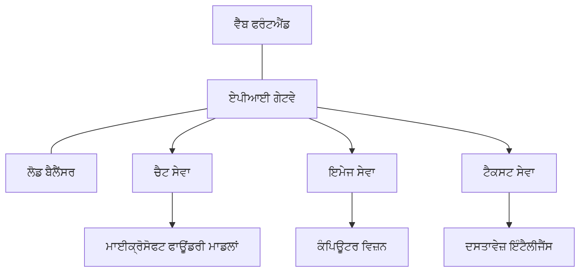

# ਪ੍ਰੋਡਕਸ਼ਨ AI ਵਰਕਲੋਡ ਲਈ ਸਰਵੋਤਮ ਅਭਿਆਸ AZD ਦੇ ਨਾਲ

**ਅਧਿਆਇ ਨੈਵੀਗੇਸ਼ਨ:**
- **📚 ਕੋਰਸ ਹੋਮ**: [AZD For Beginners](../../README.md)
- **📖 ਮੌਜੂਦਾ ਅਧਿਆਇ**: ਅਧਿਆਇ 8 - ਪ੍ਰੋਡਕਸ਼ਨ ਅਤੇ ਐਂਟਰਪ੍ਰਾਈਜ਼ ਪੈਟਰਨ
- **⬅️ ਪਿਛਲਾ ਅਧਿਆਇ**: [Chapter 7: Troubleshooting](../chapter-07-troubleshooting/debugging.md)
- **⬅️ ਸਬੰਧਤ**: [AI Workshop Lab](ai-workshop-lab.md)
- **🎯 ਕੋਰਸ ਪੂਰਾ**: [AZD For Beginners](../../README.md)

## ਜਾਇਜ਼ਾ

ਇਹ ਮਾਰਗਦਰਸ਼ਕ Azure Developer CLI (AZD) ਦੀ ਵਰਤੋਂ ਕਰਕੇ ਪ੍ਰੋਡਕਸ਼ਨ-ਰੈਡੀ AI ਵਰਕਲੋਡ ਤੈਨਾਤ ਕਰਨ ਲਈ ਵਿਸਤ੍ਰਿਤ ਸਰਵੋਤਮ ਅਭਿਆਸ ਪ੍ਰਦਾਨ ਕਰਦਾ ਹੈ। Microsoft Foundry Discord ਕਮਿਊਨਿਟੀ ਅਤੇ ਹਕੀਕਤੀ ਗਾਹਕ ਤੈਨਾਤੀਆਂ ਤੋਂ ਮਿਲੀ ਪ੍ਰਤੀਕਿਰਿਆ ਆਧਾਰਿਤ, ਇਹ ਅਭਿਆਸ ਪ੍ਰੋਡਕਸ਼ਨ AI ਸਿਸਟਮਾਂ ਵਿੱਚ ਸਭ ਤੋਂ ਆਮ ਚੁਣੌਤੀਆਂ ਨੂੰ ਹੱਲ ਕਰਦੇ ਹਨ।

## ਮੁੱਖ ਚੁਣੌਤੀਆਂ ਜਿਨ੍ਹਾਂ ਦਾ ਹੱਲ

ਸਾਡੀ ਕਮਿਊਨਿਟੀ ਪੁਲ ਦੇ ਨਤੀਜਿਆਂ ਆਧਾਰ 'ਤੇ, ਵਿਕਾਸਕਾਰਾਂ ਨੂੰ ਇਹ ਮੁੱਖ ਸਮੱਸਿਆਵਾਂ ਹਨ:

- **45%** ਬਹੁ-ਸੇਵਾ AI ਤੈਨਾਤੀਆਂ ਨਾਲ ਸੰਘਰਸ਼
- **38%** ਪ੍ਰਮਾਣ ਪੱਤਰ ਅਤੇ ਸਿਕ੍ਰੇਟ ਪ੍ਰਬੰਧਨ ਵਿੱਚ ਸਮੱਸਿਆਵਾਂ  
- **35%** ਪ੍ਰੋਡਕਸ਼ਨ ਤਿਆਰੀ ਅਤੇ ਸਕੇਲਿੰਗ ਮੁਸ਼ਕਲ
- **32%** ਬਿਹਤਰ ਲਾਗਤ ਅਪਟੀਮਾਈਜ਼ੇਸ਼ਨ ਰਣਨੀਤੀਆਂ ਦੀ ਲੋੜ
- **29%** ਮਾਨੀਟਰਿੰਗ ਅਤੇ ਤਰੁੱਟੀ-ਨਿਧਾਨ ਵਿੱਚ ਸੁਧਾਰ ਦੀ ਲੋੜ

## ਪ੍ਰੋਡਕਸ਼ਨ AI ਲਈ ਆਰਕੀਟੈਕਚਰ ਪੈਟਰਨ

### ਪੈਟਰਨ 1: ਮਾਈਕ੍ਰੋਸਰਵਿਸਿਜ਼ AI ਆਰਕੀਟੈਕਚਰ

**ਕਦੋਂ ਵਰਤਣਾ**: ਬਹੁਤੀਆਂ ਸਮਰਥਾਵਾਂ ਵਾਲੀਆਂ ਜਟਿਲ AI ਐਪਲੀਕੇਸ਼ਨਾਂ


**AZD ਲਾਗੂ ਕਰਨ ਦਾ ਤਰੀਕਾ**:

```yaml
# azure.yaml
name: enterprise-ai-platform
services:
  web:
    project: ./web
    host: staticwebapp
  api-gateway:
    project: ./api-gateway
    host: containerapp
  chat-service:
    project: ./services/chat
    host: containerapp
  vision-service:
    project: ./services/vision
    host: containerapp
  text-service:
    project: ./services/text
    host: containerapp
```

### ਪੈਟਰਨ 2: ਇਵੈਂਟ-ਡ੍ਰਾਈਵਨ AI ਪ੍ਰੋਸੈਸਿੰਗ

**ਕਦੋਂ ਵਰਤਣਾ**: ਬੈਚ ਪ੍ਰੋਸੈਸਿੰਗ, ਦਸਤਾਵੇਜ਼ ਵਿਸ਼ਲੇਸ਼ਣ, ਐਸਿੰਕ ਵਰਕਫਲੋਜ਼

```bicep
// Event Hub for AI processing pipeline
resource eventHub 'Microsoft.EventHub/namespaces@2023-01-01-preview' = {
  name: eventHubNamespaceName
  location: location
  sku: {
    name: 'Standard'
    tier: 'Standard'
    capacity: 1
  }
}

// Service Bus for reliable message processing
resource serviceBus 'Microsoft.ServiceBus/namespaces@2022-10-01-preview' = {
  name: serviceBusNamespaceName
  location: location
  sku: {
    name: 'Premium'
    tier: 'Premium'
    capacity: 1
  }
}

// Function App for processing
resource functionApp 'Microsoft.Web/sites@2023-01-01' = {
  name: functionAppName
  location: location
  kind: 'functionapp,linux'
  properties: {
    siteConfig: {
      appSettings: [
        {
          name: 'FUNCTIONS_EXTENSION_VERSION'
          value: '~4'
        }
        {
          name: 'AZURE_OPENAI_ENDPOINT'
          value: '@Microsoft.KeyVault(VaultName=${keyVault.name};SecretName=openai-endpoint)'
        }
      ]
    }
  }
}
```

## AI ਏਜੰਟ ਸਿਹਤ ਬਾਰੇ ਸੋਚ

ਜਦੋਂ ਇੱਕ ਰਵਾਇਤੀ ਵੈੱਬ ਐਪ ਟੁੱਟਦੀ ਹੈ, ਲੱਛਣ ਜਾਣੇ-ਪਹਚਾਣੇ ਹੁੰਦੇ ਹਨ: ਇਕ ਪੰਨਾ ਲੋਡ ਨਹੀਂ ਹੁੰਦਾ, ਇੱਕ API ਤਰੁੱਟੀ ਦੇਂਦਾ ਹੈ, ਜਾਂ ਇੱਕ ਡਿਪਲੋਇਮੈਂਟ ਫੇਲ ਹੋ ਜਾਂਦਾ ਹੈ। AI-ਸ਼ਕਤੀ ਵਾਲੀਆਂ ਐਪਲੀਕੇਸ਼ਨਾਂ ਉਹੀ ਤਰ੍ਹਾਂ ਟੁੱਟ ਸਕਦੀਆਂ ਹਨ—ਪਰ ਇਹ ਹੋਰ ਨਾਜੁਕ ਢੰਗ ਨਾਲ ਵੀ ਗਲਤ ਵਰਤੋਂ ਕਰ ਸਕਦੀਆਂ ਹਨ ਜਿਹੜੇ ਸਪੱਸਟ ਤਰੁੱਟੀ ਸੁਨੇਹੇ ਨਹੀਂ ਦਿੰਦੀਆਂ।

ਇਹ ਭਾਗ ਤੁਹਾਨੂੰ AI ਵਰਕਲੋਡ ਦੀ ਨਿਗਰਾਨੀ ਲਈ ਏਕ ਮਾਨਸਿਕ ਮਾਡਲ ਬਣਾਉਣ ਵਿੱਚ ਮਦਦ ਕਰਦਾ ਹੈ ਤਾਂ ਜੋ ਤੁਹਾਨੂੰ ਪਤਾ ਹੋਵੇ ਕਿ ਕੁਝ ਠੀਕ ਨਹੀਂ ਲੱਗਣ 'ਤੇ ਕਿੱਥੇ ਵੇਖਣਾ ਹੈ।

### ਏਜੰਟ ਸਿਹਤ ਰਵਾਇਤੀ ਐਪ ਸਿਹਤ ਨਾਲ ਕਿਵੇਂ ਵੱਖਰੀ ਹੈ

ਇੱਕ ਰਵਾਇਤੀ ਐਪ ਜਾਂ ਤਾਂ ਕੰਮ ਕਰਦੀ ਹੈ ਜਾਂ ਨਹੀਂ ਕਰਦੀ। ਇੱਕ AI ਏਜੰਟ ਕੰਮ ਕਰਦਾ ਦਿੱਸ ਸਕਦਾ ਹੈ ਪਰ ਨਤੀਜੇ ਖ਼ਰਾਬ ਦੇ ਸਕਦਾ ਹੈ। ਏਜੰਟ ਸਿਹਤ ਨੂੰ ਦੋ ਪਰਤਾਂ ਵਿਚ ਸੋਚੋ:

| Layer | What to Watch | Where to Look |
|-------|--------------|---------------|
| **Infrastructure health** | ਕੀ ਸਰਵਿਸ ਚੱਲ ਰਹੀ ਹੈ? ਕੀ ਰਿਸੋਰਸ ਮੁਹੱਈਆ ਕੀਤੇ ਗਏ ਹਨ? ਕੀ ਐਂਡਪਵਾਇੰਟ ਪਹੁੰਚਯੋਗ ਹਨ? | `azd monitor`, Azure Portal ਰਿਸੋਰਸ ਸਿਹਤ, ਕੰਟੇਨਰ/ਐਪ ਲੌਗ |
| **Behavior health** | ਕੀ ਏਜੰਟ ਸਹੀ ਤਰੀਕੇ ਨਾਲ ਜਵਾਬ ਦੇ ਰਿਹਾ ਹੈ? ਕੀ ਜਵਾਬ ਸਮੇਂ-ਸਿਰ ਹਨ? ਕੀ ਮਾਡਲ ਸਹੀ ਤਰੀਕੇ ਨਾਲ ਕਾਲ ਕੀਤਾ ਜਾ ਰਿਹਾ ਹੈ? | Application Insights ਟ੍ਰੇਸ, ਮਾਡਲ ਕਾਲ ਲੈਟੈਂਸੀ ਮੈਟ੍ਰਿਕਸ, ਰਿਸਪਾਂਸ ਗੁਣਵੱਤਾ ਲੌਗ |

ਇੰਫਰਾਸਟਰੱਕਚਰ ਸਿਹਤ ਜਾਣੀ-ਪਹਚਾਣੀ ਹੈ—ਇਹ ਕਿਸੇ ਵੀ azd ਐਪ ਲਈ ਇੱਕੋ ਜਿਹਾ ਹੈ। ਵਿਵਹਾਰਕ ਸਿਹਤ ਉਹ ਨਵੀਂ ਪਰਤ ਹੈ ਜੋ AI ਵਰਕਲੋਡ ਲਿਆਉਂਦੇ ਹਨ।

### ਜਦੋਂ AI ਐਪ ਉਮੀਦ ਅਨੁਸਾਰ ਵਹਿਵਟ ਨਹੀਂ ਦਿਖਾਉਂਦੀਆਂ ਤਾਂ ਕਿੱਥੇ ਦੇਖਣਾ ਹੈ

ਜੇ ਤੁਹਾਡੀ AI ਐਪ ਉਮੀਦ ਅਨੁਸਾਰ ਨਤੀਜੇ ਨਹੀਂ ਦੇ ਰਹੀ, ਤਾਂ Voici ਇੱਕ ਸੰਕੇਤਕ ਚੈਕਲਿਸਟ:

1. **ਬੁਨਿਆਦੀ ਗੱਲਾਂ ਨਾਲ ਸ਼ੁਰੂ ਕਰੋ।** ਕੀ ਐਪ ਚੱਲ ਰਹੀ ਹੈ? ਕੀ ਇਹ ਆਪਣੀਆਂ ਨਿਰਭਰਤਾਵਾਂ ਤੱਕ ਪਹੁੰਚ ਸਕਦੀ ਹੈ? `azd monitor` ਅਤੇ ਰਿਸੋਰਸ ਸਿਹਤ ਜਾਂਚੋ ਜਿਵੇਂ ਤੁਸੀਂ ਕਿਸੇ ਵੀ ਐਪ ਲਈ ਕਰਦੇ ਹੋ।
2. **ਮਾਡਲ ਕਨੈਕਸ਼ਨ ਚੈੱਕ ਕਰੋ।** ਕੀ ਤੁਹਾਡੀ ਐਪ ਸਫਲਤਾਪੂਰਵਕ AI ਮਾਡਲ ਨੂੰ ਕਾਲ ਕਰ ਰਹੀ ਹੈ? ਫੇਲ ਹੋਈ ਜਾਂ ਟਾਈਮਆਉਟ ਹੋਈ ਮਾਡਲ ਕਾਲਾਂ AI ਐਪ ਸਮੱਸਿਆਵਾਂ ਦਾ ਸਭ ਤੋਂ ਆਮ ਕਾਰਣ ਹੁੰਦੀਆਂ ਹਨ ਅਤੇ ਇਹ ਤੁਹਾਡੇ ਐਪਲੀਕੇਸ਼ਨ ਲੌਗ ਵਿੱਚ ਦਿਖਣਗੀਆਂ।
3. **ਦੇਖੋ ਕਿ ਮਾਡਲ ਨੂੰ ਕੀ ਮਿਲਿਆ।** AI ਜਵਾਬ ਇਨਪੁੱਟ (ਪ੍ਰੋਮਪਟ ਅਤੇ ਕੋਈ ਵੀ ਰੀਟਰੀਵਡ ਸੰਦਰਭ) 'ਤੇ ਨਿਰਭਰ ਕਰਦੇ ਹਨ। ਜੇ ਆਉਟਪੁੱਟ ਗਲਤ ਹੈ, ਤਾਂ ਆਮ ਤੌਰ 'ਤੇ ਇਨਪੁੱਟ ਗਲਤ ਹੁੰਦਾ ਹੈ। ਜਾਂਚੋ ਕਿ ਕੀ ਤੁਹਾਡੀ ਐਪ ਮਾਡਲ ਨੂੰ ਸਹੀ ਡੇਟਾ ਭੇਜ ਰਹੀ ਹੈ।
4. **ਜਵਾਬ ਲੈਟੈਂਸੀ ਦੀ ਸਮੀਖਿਆ ਕਰੋ।** AI ਮਾਡਲ ਕਾਲ ਆਮ API ਕਾਲਾਂ ਨਾਲੋਂ ਹੌਲੀਆਂ ਹੁੰਦੀਆਂ ਹਨ। ਜੇ ਤੁਹਾਡੀ ਐਪ ਸੁਸਤ ਮਹਿਸੂਸ ਹੋ ਰਹੀ ਹੈ, ਤਾਂ ਜਾਂਚੋ ਕਿ ਕੀ ਮਾਡਲ ਜਵਾਬ ਸਮੇਂ ਵੱਧ ਗਏ ਹਨ—ਇਹ ਥਰੌਟਲਿੰਗ, ਸਮਰੱਥਾ ਸੀਮਾਵਾਂ, ਜਾਂ ਰੀਜਨ-ਸਤਰ ਦੀ ਭੀੜ ਦਿਖਾ ਸਕਦਾ ਹੈ।
5. **ਲਾਗਤ ਸੰਕੇਤਾਂ 'ਤੇ ਨਜ਼ਰ ਰੱਖੋ।** ਟੋਕਨ ਵਰਤੋਂ ਜਾਂ API ਕਾਲਾਂ ਵਿੱਚ ਅਣਅਧਿਕਤ ਚੜ੍ਹਾਈ ਇੱਕ ਲੂਪ, ਗਲਤ ਸੰਰਚਿਤ ਪ੍ਰੋਮਪਟ, ਜਾਂ ਅਤਿ-ਜ਼ਿਆਦਾ ਰੀਟ੍ਰਾਇਜ਼ ਨੂੰ ਦਰਸਾ ਸਕਦੀ ਹੈ।

ਤੁਹਾਨੂੰ ਤੁਰੰਤ ਨਿਰੀਖਣ ਟੂਲਿੰਗ ਵਿੱਚ ਮਾਹਰ ਹੋਣ ਦੀ ਲੋੜ ਨਹੀਂ। ਮੁੱਖ ਗੱਲ ਇਹ ਹੈ ਕਿ AI ਐਪਲੀਕੇਸ਼ਨਾਂ ਵਿੱਚ ਇਕ ਵਾਧੂ ਵਿਵਹਾਰਕ ਪਰਤ ਨਿਗਰਾਨੀ ਲਈ ਹੁੰਦੀ ਹੈ, ਅਤੇ azd ਦੀ ਬਿਲਟ-ਇਨ ਮਾਨੀਟਰਿੰਗ (`azd monitor`) ਦੋਹਾਂ ਪਰਤਾਂ ਦੀ ਜਾਂਚ ਲਈ ਸ਼ੁਰੂਆਤੀ ਬਿੰਦੂ ਦਿੰਦੀ ਹੈ।

---

## ਸੁਰੱਖਿਆ ਲਈ ਸਰਵੋਤਮ ਅਭਿਆਸ

### 1. ਜ਼ੀਰੋ-ਟ੍ਰੱਸ ਸੁਰੱਖਿਆ ਮਾਡਲ

**ਲਾਗੂ ਕਰਨ ਦੀ ਰਣਨੀਤੀ**:
- ਬੇਤਰਤੀਬੀ ਸੇਵਾ-ਤੋਂ-ਸੇਵਾ ਸੰਚਾਰ ਬਿਨਾਂ ਪ੍ਰਮਾਣਿਕਤਾ ਦੇ ਨਹੀਂ
- ਸਾਰੇ API ਕਾਲ ਮੈਨੇਜਡ ਆਈਡੈਂਟਿਟੀ ਦੀ ਵਰਤੋਂ ਕਰਦੇ ਹੋਣ
- ਪ੍ਰਾਈਵੇਟ ਐਂਡਪੌਇੰਟਸ ਨਾਲ ਨੈੱਟਵਰਕ ਆਈਸੋਲੇਸ਼ਨ
- ਘੱਟੋ-ਘੱਟ ਪ੍ਰਿਵਿਲੇਜ ਅਧਾਰਤ ਐਕਸੈੱਸ ਕੰਟਰੋਲ

```bicep
// Managed Identity for each service
resource chatServiceIdentity 'Microsoft.ManagedIdentity/userAssignedIdentities@2023-01-31' = {
  name: 'chat-service-identity'
  location: location
}

// Role assignments with minimal permissions
resource openAIUserRole 'Microsoft.Authorization/roleAssignments@2022-04-01' = {
  scope: openAIAccount
  name: guid(openAIAccount.id, chatServiceIdentity.id, openAIUserRoleDefinitionId)
  properties: {
    roleDefinitionId: subscriptionResourceId('Microsoft.Authorization/roleDefinitions', '5e0bd9bd-7b93-4f28-af87-19fc36ad61bd')
    principalId: chatServiceIdentity.properties.principalId
    principalType: 'ServicePrincipal'
  }
}
```

### 2. ਸੁਰੱਖਿਅਤ ਸੀਕ੍ਰੇਟ ਪ੍ਰਬੰਧਨ

**Key Vault ਇੰਟੇਗ੍ਰੇਸ਼ਨ ਪੈਟਰਨ**:

```bicep
// Key Vault with proper access policies
resource keyVault 'Microsoft.KeyVault/vaults@2023-02-01' = {
  name: keyVaultName
  location: location
  properties: {
    tenantId: tenant().tenantId
    sku: {
      family: 'A'
      name: 'premium'  // Use premium for production
    }
    enableRbacAuthorization: true  // Use RBAC instead of access policies
    enablePurgeProtection: true    // Prevent accidental deletion
    enableSoftDelete: true
    softDeleteRetentionInDays: 90
  }
}

// Store all AI service credentials
resource openAIKeySecret 'Microsoft.KeyVault/vaults/secrets@2023-02-01' = {
  parent: keyVault
  name: 'openai-api-key'
  properties: {
    value: openAIAccount.listKeys().key1
    attributes: {
      enabled: true
    }
  }
}
```

### 3. ਨੈੱਟਵਰਕ ਸੁਰੱਖਿਆ

**ਪ੍ਰਾਈਵੇਟ ਐਂਡਪੌਇੰਟ ਸੰਰਚਨਾ**:

```bicep
// Virtual Network for AI services
resource virtualNetwork 'Microsoft.Network/virtualNetworks@2023-04-01' = {
  name: vnetName
  location: location
  properties: {
    addressSpace: {
      addressPrefixes: ['10.0.0.0/16']
    }
    subnets: [
      {
        name: 'ai-services-subnet'
        properties: {
          addressPrefix: '10.0.1.0/24'
          privateEndpointNetworkPolicies: 'Disabled'
        }
      }
      {
        name: 'app-services-subnet'
        properties: {
          addressPrefix: '10.0.2.0/24'
          delegations: [
            {
              name: 'Microsoft.Web/serverFarms'
              properties: {
                serviceName: 'Microsoft.Web/serverFarms'
              }
            }
          ]
        }
      }
    ]
  }
}

// Private endpoints for all AI services
resource openAIPrivateEndpoint 'Microsoft.Network/privateEndpoints@2023-04-01' = {
  name: '${openAIAccountName}-pe'
  location: location
  properties: {
    subnet: {
      id: virtualNetwork.properties.subnets[0].id
    }
    privateLinkServiceConnections: [
      {
        name: 'openai-connection'
        properties: {
          privateLinkServiceId: openAIAccount.id
          groupIds: ['account']
        }
      }
    ]
  }
}
```

## ਪ੍ਰਦਰਸ਼ਨ ਅਤੇ ਸਕੇਲਿੰਗ

### 1. ਆਟੋ-ਸਕੇਲਿੰਗ ਰਣਨੀਤੀਆਂ

**ਕੰਟੇਨਰ ਐਪਸ ਆਟੋ-ਸਕੇਲਿੰਗ**:

```bicep
resource containerApp 'Microsoft.App/containerApps@2023-05-01' = {
  name: containerAppName
  location: location
  properties: {
    configuration: {
      ingress: {
        external: true
        targetPort: 8000
        transport: 'http'
      }
    }
    template: {
      scale: {
        minReplicas: 2  // Always have 2 instances minimum
        maxReplicas: 50 // Scale up to 50 for high load
        rules: [
          {
            name: 'http-scaling'
            http: {
              metadata: {
                concurrentRequests: '20'  // Scale when >20 concurrent requests
              }
            }
          }
          {
            name: 'cpu-scaling'
            custom: {
              type: 'cpu'
              metadata: {
                type: 'Utilization'
                value: '70'  // Scale when CPU >70%
              }
            }
          }
        ]
      }
    }
  }
}
```

### 2. ਕੈਸ਼ਿੰਗ ਰਣਨੀਤੀਆਂ

**AI ਜਵਾਬਾਂ ਲਈ Redis ਕੈਸ਼**:

```bicep
// Redis Premium for production workloads
resource redisCache 'Microsoft.Cache/redis@2023-04-01' = {
  name: redisCacheName
  location: location
  properties: {
    sku: {
      name: 'Premium'
      family: 'P'
      capacity: 1
    }
    enableNonSslPort: false
    minimumTlsVersion: '1.2'
    redisConfiguration: {
      'maxmemory-policy': 'allkeys-lru'
    }
    // Enable clustering for high availability
    redisVersion: '6.0'
    shardCount: 2
  }
}

// Cache configuration in application
var cacheConnectionString = '${redisCache.properties.hostName}:6380,password=${redisCache.listKeys().primaryKey},ssl=True,abortConnect=False'
```

### 3. ਲੋਡ ਬੈਲਾਂਸਿੰਗ ਅਤੇ ਟ੍ਰੈਫਿਕ ਪ੍ਰਬੰਧਨ

**Application Gateway ਨਾਲ WAF**:

```bicep
// Application Gateway with Web Application Firewall
resource applicationGateway 'Microsoft.Network/applicationGateways@2023-04-01' = {
  name: appGatewayName
  location: location
  properties: {
    sku: {
      name: 'WAF_v2'
      tier: 'WAF_v2'
      capacity: 2
    }
    webApplicationFirewallConfiguration: {
      enabled: true
      firewallMode: 'Prevention'
      ruleSetType: 'OWASP'
      ruleSetVersion: '3.2'
    }
    // Backend pools for AI services
    backendAddressPools: [
      {
        name: 'ai-services-pool'
        properties: {
          backendAddresses: [
            {
              fqdn: '${containerApp.properties.configuration.ingress.fqdn}'
            }
          ]
        }
      }
    ]
  }
}
```

## 💰 ਲਾਗਤ ਅਪਟੀਮਾਈਜ਼ੇਸ਼ਨ

### 1. ਰਿਸੋਰਸ ਰਾਈਟ-ਸਾਈਜ਼ਿੰਗ

**ਮਾਹੌਲ-ਖਾਸ ਸੰਰਚਨਾਵਾਂ**:

```bash
# ਡਿਵੈਲਪਮੈਂਟ ਵਾਤਾਵਰਣ
azd env new development
azd env set AZURE_OPENAI_SKU "S0"
azd env set AZURE_OPENAI_CAPACITY 10
azd env set AZURE_SEARCH_SKU "basic"
azd env set CONTAINER_CPU 0.5
azd env set CONTAINER_MEMORY 1.0

# ਉਤਪਾਦਨ ਵਾਤਾਵਰਣ
azd env new production
azd env set AZURE_OPENAI_SKU "S0"
azd env set AZURE_OPENAI_CAPACITY 100
azd env set AZURE_SEARCH_SKU "standard"
azd env set CONTAINER_CPU 2.0
azd env set CONTAINER_MEMORY 4.0
```

### 2. ਲਾਗਤ ਮਾਨੀਟਰਿੰਗ ਅਤੇ ਬਜਟ

```bicep
// Cost management and budgets
resource budget 'Microsoft.Consumption/budgets@2023-05-01' = {
  name: 'ai-workload-budget'
  properties: {
    timePeriod: {
      startDate: '2024-01-01'
      endDate: '2024-12-31'
    }
    timeGrain: 'Monthly'
    amount: 2000  // $2000 monthly budget
    category: 'Cost'
    notifications: {
      warning: {
        enabled: true
        operator: 'GreaterThan'
        threshold: 80
        contactEmails: [
          'finance@company.com'
          'engineering@company.com'
        ]
        contactRoles: [
          'Owner'
          'Contributor'
        ]
      }
      critical: {
        enabled: true
        operator: 'GreaterThan'
        threshold: 95
        contactEmails: [
          'cto@company.com'
        ]
      }
    }
  }
}
```

### 3. ਟੋਕਨ ਵਰਤੋਂ ਅਪਟੀਮਾਈਜ਼ੇਸ਼ਨ

**OpenAI ਲਾਗਤ ਪ੍ਰਬੰਧਨ**:

```typescript
// ਐਪਲੀਕੇਸ਼ਨ-ਪੱਧਰੀ ਟੋਕਨ ਅਨੁਕੂਲਨ
class TokenOptimizer {
  private readonly maxTokens = 4000;
  private readonly reserveTokens = 500;
  
  optimizePrompt(userInput: string, context: string): string {
    const availableTokens = this.maxTokens - this.reserveTokens;
    const estimatedTokens = this.estimateTokens(userInput + context);
    
    if (estimatedTokens > availableTokens) {
      // ਸੰਦਰਭ ਨੂੰ ਕੱਟੋ, ਯੂਜ਼ਰ ਇਨਪੁਟ ਨੂੰ ਨਹੀਂ
      context = this.truncateContext(context, availableTokens - this.estimateTokens(userInput));
    }
    
    return `${context}\n\nUser: ${userInput}`;
  }
  
  private estimateTokens(text: string): number {
    // ਲਗਭਗ ਅੰਦਾਜ਼ਾ: 1 ਟੋਕਨ ≈ 4 ਅੱਖਰ
    return Math.ceil(text.length / 4);
  }
}
```

## ਮਾਨੀਟਰਿੰਗ ਅਤੇ ਨਿਰੀਖਣ

### 1. ਵਿਸਤ੍ਰਿਤ Application Insights

```bicep
// Application Insights with advanced features
resource applicationInsights 'Microsoft.Insights/components@2020-02-02' = {
  name: applicationInsightsName
  location: location
  kind: 'web'
  properties: {
    Application_Type: 'web'
    WorkspaceResourceId: logAnalyticsWorkspace.id
    SamplingPercentage: 100  // Full sampling for AI apps
    DisableIpMasking: false  // Enable for security
  }
}

// Custom metrics for AI operations
resource aiMetricAlerts 'Microsoft.Insights/metricAlerts@2018-03-01' = {
  name: 'ai-high-error-rate'
  location: 'global'
  properties: {
    description: 'Alert when AI service error rate is high'
    severity: 2
    enabled: true
    scopes: [
      applicationInsights.id
    ]
    evaluationFrequency: 'PT1M'
    windowSize: 'PT5M'
    criteria: {
      'odata.type': 'Microsoft.Azure.Monitor.SingleResourceMultipleMetricCriteria'
      allOf: [
        {
          name: 'high-error-rate'
          metricName: 'requests/failed'
          operator: 'GreaterThan'
          threshold: 10
          timeAggregation: 'Count'
        }
      ]
    }
  }
}
```

### 2. AI-ਖਾਸ ਮਾਨੀਟਰਿੰਗ

**AI ਮੈਟ੍ਰਿਕਸ ਲਈ ਕਸਟਮ ਡੈਸ਼ਬੋਰਡ**:

```json
// Dashboard configuration for AI workloads
{
  "dashboard": {
    "name": "AI Application Monitoring",
    "tiles": [
      {
        "name": "OpenAI Request Volume",
        "query": "requests | where name contains 'openai' | summarize count() by bin(timestamp, 5m)"
      },
      {
        "name": "AI Response Latency",
        "query": "requests | where name contains 'openai' | summarize avg(duration) by bin(timestamp, 5m)"
      },
      {
        "name": "Token Usage",
        "query": "customMetrics | where name == 'openai_tokens_used' | summarize sum(value) by bin(timestamp, 1h)"
      },
      {
        "name": "Cost per Hour",
        "query": "customMetrics | where name == 'openai_cost' | summarize sum(value) by bin(timestamp, 1h)"
      }
    ]
  }
}
```

### 3. ਹੈਲਥ ਚੈੱਕ ਅਤੇ ਅੱਪਟਾਈਮ ਮਾਨੀਟਰਿੰਗ

```bicep
// Application Insights availability tests
resource availabilityTest 'Microsoft.Insights/webtests@2022-06-15' = {
  name: 'ai-app-availability-test'
  location: location
  tags: {
    'hidden-link:${applicationInsights.id}': 'Resource'
  }
  properties: {
    SyntheticMonitorId: 'ai-app-availability-test'
    Name: 'AI Application Availability Test'
    Description: 'Tests AI application endpoints'
    Enabled: true
    Frequency: 300  // 5 minutes
    Timeout: 120    // 2 minutes
    Kind: 'ping'
    Locations: [
      {
        Id: 'us-east-2-azr'
      }
      {
        Id: 'us-west-2-azr'
      }
    ]
    Configuration: {
      WebTest: '''
        <WebTest Name="AI Health Check" 
                 Id="8d2de8d2-a2b0-4c2e-9a0d-8f9c9a0b8c8d" 
                 Enabled="True" 
                 CssProjectStructure="" 
                 CssIteration="" 
                 Timeout="120" 
                 WorkItemIds="" 
                 xmlns="http://microsoft.com/schemas/VisualStudio/TeamTest/2010" 
                 Description="" 
                 CredentialUserName="" 
                 CredentialPassword="" 
                 PreAuthenticate="True" 
                 Proxy="default" 
                 StopOnError="False" 
                 RecordedResultFile="" 
                 ResultsLocale="">
          <Items>
            <Request Method="GET" 
                     Guid="a5f10126-e4cd-570d-961c-cea43999a200" 
                     Version="1.1" 
                     Url="${webApp.properties.defaultHostName}/health" 
                     ThinkTime="0" 
                     Timeout="120" 
                     ParseDependentRequests="True" 
                     FollowRedirects="True" 
                     RecordResult="True" 
                     Cache="False" 
                     ResponseTimeGoal="0" 
                     Encoding="utf-8" 
                     ExpectedHttpStatusCode="200" 
                     ExpectedResponseUrl="" 
                     ReportingName="" 
                     IgnoreHttpStatusCode="False" />
          </Items>
        </WebTest>
      '''
    }
  }
}
```

## ਡਿਜਾਸਟਰ ਰਿਕਵਰੀ ਅਤੇ ਉੱਚ ਉਪਲੱਬਧਤਾ

### 1. ਮਲਟੀ-ਰੀਜਨ ਤੈਨਾਤੀ

```yaml
# azure.yaml - Multi-region configuration
name: ai-app-multiregion
services:
  api-primary:
    project: ./api
    host: containerapp
    env:
      - AZURE_REGION=eastus
  api-secondary:
    project: ./api
    host: containerapp
    env:
      - AZURE_REGION=westus2
```

```bicep
// Traffic Manager for global load balancing
resource trafficManager 'Microsoft.Network/trafficManagerProfiles@2022-04-01' = {
  name: trafficManagerProfileName
  location: 'global'
  properties: {
    profileStatus: 'Enabled'
    trafficRoutingMethod: 'Priority'
    dnsConfig: {
      relativeName: trafficManagerProfileName
      ttl: 30
    }
    monitorConfig: {
      protocol: 'HTTPS'
      port: 443
      path: '/health'
      intervalInSeconds: 30
      toleratedNumberOfFailures: 3
      timeoutInSeconds: 10
    }
    endpoints: [
      {
        name: 'primary-endpoint'
        type: 'Microsoft.Network/trafficManagerProfiles/azureEndpoints'
        properties: {
          targetResourceId: primaryAppService.id
          endpointStatus: 'Enabled'
          priority: 1
        }
      }
      {
        name: 'secondary-endpoint'
        type: 'Microsoft.Network/trafficManagerProfiles/azureEndpoints'
        properties: {
          targetResourceId: secondaryAppService.id
          endpointStatus: 'Enabled'
          priority: 2
        }
      }
    ]
  }
}
```

### 2. ਡੇਟਾ ਬੈਕਅੱਪ ਅਤੇ ਰਿਕਵਰੀ

```bicep
// Backup configuration for critical data
resource backupVault 'Microsoft.DataProtection/backupVaults@2023-05-01' = {
  name: backupVaultName
  location: location
  identity: {
    type: 'SystemAssigned'
  }
  properties: {
    storageSettings: [
      {
        datastoreType: 'VaultStore'
        type: 'LocallyRedundant'
      }
    ]
  }
}

// Backup policy for AI models and data
resource backupPolicy 'Microsoft.DataProtection/backupVaults/backupPolicies@2023-05-01' = {
  parent: backupVault
  name: 'ai-data-backup-policy'
  properties: {
    policyRules: [
      {
        backupParameters: {
          backupType: 'Full'
          objectType: 'AzureBackupParams'
        }
        trigger: {
          schedule: {
            repeatingTimeIntervals: [
              'R/2024-01-01T02:00:00+00:00/P1D'  // Daily at 2 AM
            ]
          }
          objectType: 'ScheduleBasedTriggerContext'
        }
        dataStore: {
          datastoreType: 'VaultStore'
          objectType: 'DataStoreInfoBase'
        }
        name: 'BackupDaily'
        objectType: 'AzureBackupRule'
      }
    ]
  }
}
```

## DevOps ਅਤੇ CI/CD ਇੰਟੇਗਰੇਸ਼ਨ

### 1. GitHub Actions ਵਰਕਫਲੋ

```yaml
# .github/workflows/deploy-ai-app.yml
name: Deploy AI Application

on:
  push:
    branches: [main]
  pull_request:
    branches: [main]

jobs:
  test:
    runs-on: ubuntu-latest
    steps:
      - uses: actions/checkout@v4
      
      - name: Setup Python
        uses: actions/setup-python@v4
        with:
          python-version: '3.11'
          
      - name: Install dependencies
        run: |
          pip install -r requirements.txt
          pip install pytest
          
      - name: Run tests
        run: pytest tests/
        
      - name: AI Safety Tests
        run: |
          python scripts/test_ai_safety.py
          python scripts/validate_prompts.py

  deploy-staging:
    needs: test
    if: github.event_name == 'pull_request'
    runs-on: ubuntu-latest
    steps:
      - uses: actions/checkout@v4
      
      - name: Setup AZD
        uses: Azure/setup-azd@v2
        
      - name: Login to Azure
        uses: azure/login@v1
        with:
          creds: ${{ secrets.AZURE_CREDENTIALS }}
          
      - name: Deploy to Staging
        run: |
          azd env select staging
          azd deploy

  deploy-production:
    needs: test
    if: github.ref == 'refs/heads/main'
    runs-on: ubuntu-latest
    steps:
      - uses: actions/checkout@v4
      
      - name: Setup AZD
        uses: Azure/setup-azd@v2
        
      - name: Login to Azure
        uses: azure/login@v1
        with:
          creds: ${{ secrets.AZURE_CREDENTIALS }}
          
      - name: Deploy to Production
        run: |
          azd env select production
          azd deploy
          
      - name: Run Production Health Checks
        run: |
          python scripts/health_check.py --env production
```

### 2. ਇੰਫਰਾਸਟਰੱਕਚਰ ਵੈਰੀਫਿਕੇਸ਼ਨ

```bash
# scripts/validate_infrastructure.sh
#!/bin/bash

echo "Validating AI infrastructure deployment..."

# ਜਾਂਚੋ ਕਿ ਸਾਰੀਆਂ ਲੋੜੀਂਦੀਆਂ ਸੇਵਾਵਾਂ ਚੱਲ ਰਹੀਆਂ ਹਨ
services=("openai" "search" "storage" "keyvault")
for service in "${services[@]}"; do
    echo "Checking $service..."
    if ! az resource list --resource-type "Microsoft.CognitiveServices/accounts" --query "[?contains(name, '$service')]" -o tsv; then
        echo "ERROR: $service not found"
        exit 1
    fi
done

# OpenAI ਮਾਡਲ ਡਿਪਲੋਇਮੈਂਟਾਂ ਦੀ ਜਾਂਚ ਕਰੋ
echo "Validating OpenAI model deployments..."
models=$(az cognitiveservices account deployment list --name $AZURE_OPENAI_NAME --resource-group $AZURE_RESOURCE_GROUP --query "[].name" -o tsv)
if [[ ! $models == *"gpt-4.1-mini"* ]]; then
  echo "ERROR: Required model gpt-4.1-mini not deployed"
    exit 1
fi

# AI ਸੇਵਾ ਦੀ ਕਨੈਕਟਿਵਿਟੀ ਜਾਂਚੋ
echo "Testing AI service connectivity..."
python scripts/test_connectivity.py

echo "Infrastructure validation completed successfully!"
```

## ਪ੍ਰੋਡਕਸ਼ਨ ਤਿਆਰੀ ਚੈਕਲਿਸਟ

### ਸੁਰੱਖਿਆ ✅
- [ ] ਸਭ ਸਰਵਿਸਾਂ ਮੈਨੇਜਡ ਆਈਡੈਂਟਿਟੀ ਵਰਤਦੀਆਂ ਹਨ
- [ ] ਸੈਕ੍ਰੇਟ Key Vault ਵਿੱਚ ਸਟੋਰ ਕੀਤੇ ਗਏ ਹਨ
- [ ] ਪ੍ਰਾਈਵੇਟ ਐਂਡਪੌਇੰਟਸ ਸੰਰਚਿਤ ਕੀਤੇ ਗਏ ਹਨ
- [ ] ਨੈੱਟਵਰਕ ਸੁਰੱਖਿਆ ਗਰੁੱਪ ਲਾਗੂ ਕੀਤੇ ਗਏ ਹਨ
- [ ] ਘੱਟੋ-ਘੱਟ ਪ੍ਰਿਵਿਲੇਜ ਨਾਲ RBAC
- [ ] ਪਬਲਿਕ ਐਂਡਪੌਇੰਟਸ 'ਤੇ WAF ਚਾਲੂ ਹੈ

### ਪ੍ਰਦਰਸ਼ਨ ✅
- [ ] ਆਟੋ-ਸਕੇਲਿੰਗ ਸੰਰਚਿਤ
- [ ] ਕੈਸ਼ਿੰਗ ਲਾਗੂ ਕੀਤੀ ਗਈ
- [ ] ਲੋਡ ਬੈਲਾਂਸਿੰਗ ਸੈੱਟਅਪ
- [ ] ਸਟੈਟਿਕ ਸਮੱਗਰੀ ਲਈ CDN
- [ ] ਡੇਟਾਬੇਸ ਕਨੈਕਸ਼ਨ ਪੂਲਿੰਗ
- [ ] ਟੋਕਨ ਵਰਤੋਂ ਅਪਟੀਮਾਈਜ਼ ਕੀਤੀ

### ਮਾਨੀਟਰਿੰਗ ✅
- [ ] Application Insights ਸੰਰਚਿਤ
- [ ] ਕਸਟਮ ਮੈਟ੍ਰਿਕਸ ਪਰਿਭਾਸ਼ਿਤ
- [ ] ਅਲਰਟਿੰਗ ਨਿਯਮ ਸੈੱਟਅਪ
- [ ] ਡੈਸ਼ਬੋਰਡ ਬਣਾਇਆ ਗਿਆ
- [ ] ਹੈਲਥ ਚੈੱਕ ਲਾਗੂ ਕੀਤੇ ਗਏ
- [ ] ਲੌਗ ਰਿਟੈਂਸ਼ਨ ਨੀਤੀਆਂ

### ਭਰੋਸੇਯੋਗਤਾ ✅
- [ ] ਮਲਟੀ-ਰੀਜਨ ਤੈਨਾਤੀ
- [ ] ਬੈਕਅੱਪ ਅਤੇ ਰਿਕਵਰੀ ਯੋਜਨਾ
- [ ] ਸਰਕਿਟ ਬਰੇਕਰ ਲਾਗੂ
- [ ] ਰੀਟ੍ਰਾਈ ਨੀਤੀਆਂ ਸੰਰਚਿਤ
- [ ] ਨਰਮ ਡਿਗਰੇਡੇਸ਼ਨ
- [ ] ਹੈਲਥ ਚੈੱਕ ਐਂਡਪੌਇੰਟਸ

### ਲਾਗਤ ਪ੍ਰਬੰਧਨ ✅
- [ ] ਬਜਟ ਅਲਰਟ ਸੰਰਚਿਤ
- [ ] ਰਿਸੋਰਸ ਰਾਈਟ-ਸਾਈਜ਼ਿੰਗ
- [ ] ਡੈਵ/ਟੈਸਟ ਛੂਟ ਲਾਗੂ
- [ ] ਰਿਜ਼ਰਡ ਇੰਸਟੈਂਸ ਖਰੀਦੀਆਂ ਗਈਆਂ
- [ ] ਲਾਗਤ ਮਾਨੀਟਰਿੰਗ ਡੈਸ਼ਬੋਰਡ
- [ ] ਨਿਯਮਤ ਲਾਗਤ ਸਮੀਖਿਆਵਾਂ

### ਅਨੁਕੂਲਤਾ ✅
- [ ] ਡੇਟਾ ਰਿਹਾਇਸ਼ ਦੀਆਂ ਲੋੜਾਂ ਪੂਰੀਆਂ ਕੀਤੀਆਂ ਗਈਆਂ
- [ ] ਆਡਿਟ ਲੌਗਿੰਗ ਚਾਲੂ
- [ ] ਅਨੁਕੂਲਤਾ ਨੀਤੀਆਂ ਲਾਗੂ
- [ ] ਸੁਰੱਖਿਆ ਬੇਸਲਾਈਨ ਲਾਗੂ
- [ ] ਨਿਯਮਤ ਸੁਰੱਖਿਆ ਮੁਲਾਂਕਣ
- [ ] ਇੰਸੀਡੈਂਟ ਰਿਸਪਾਂਸ ਯੋਜਨਾ

## ਪ੍ਰਦਰਸ਼ਨ ਬेंਚਮਾਰਕ

### ਆਮ ਪ੍ਰੋਡਕਸ਼ਨ ਮੈਟ੍ਰਿਕਸ

| Metric | Target | Monitoring |
|--------|--------|------------|
| **Response Time** | < 2 seconds | Application Insights |
| **Availability** | 99.9% | ਅੱਪਟਾਈਮ ਮਾਨੀਟਰਿੰਗ |
| **Error Rate** | < 0.1% | ਐਪਲਿਕੇਸ਼ਨ ਲੌਗ |
| **Token Usage** | < $500/month | ਲਾਗਤ ਪ੍ਰਬੰਧਨ |
| **Concurrent Users** | 1000+ | ਲੋਡ ਟੈਸਟਿੰਗ |
| **Recovery Time** | < 1 hour | ਡਿਜਾਸਟਰ ਰਿਕਵਰੀ ਟੈਸਟ |

### ਲੋਡ ਟੈਸਟਿੰਗ

```bash
# ਏਆਈ ਐਪਲੀਕੇਸ਼ਨਾਂ ਲਈ ਲੋਡ ਟੈਸਟਿੰਗ ਸਕ੍ਰਿਪਟ
python scripts/load_test.py \
  --endpoint https://your-ai-app.azurewebsites.net \
  --concurrent-users 100 \
  --duration 300 \
  --ramp-up 60
```

## 🤝 ਕਮਿਊਨਿਟੀ ਸਰਵੋਤਮ ਅਭਿਆਸ

Microsoft Foundry Discord ਕਮਿਊਨਿਟੀ ਫੀਡਬੈਕ ਦੇ ਆਧਾਰ 'ਤੇ:

### ਕਮਿਊਨਿਟੀ ਵੱਲੋਂ ਸਿਖੇ ਗਿਆ ਟੋਪ ਸੁਝਾਅ:

1. **ਛੋਟੇ ਤੋਂ ਸ਼ੁਰੂ ਕਰੋ, ਧੀਰੇ-ਧੀਰੇ ਸਕੇਲ ਕਰੋ**: ਮੂਲ SKUs ਨਾਲ ਸ਼ੁਰੂ ਕਰੋ ਅਤੇ ਅਸਲ ਵਰਤੋਂ ਦੇ ਆਧਾਰ 'ਤੇ ਵਧਾਓ
2. **ਸਭ ਕੁਝ ਮਾਨੀਟਰ ਕਰੋ**: ਪਹਿਲੇ ਦਿਨ ਤੋਂ ਵਿਸਤ੍ਰਿਤ ਮਾਨੀਟਰਿੰਗ ਸੈਟਅਪ ਕਰੋ
3. **ਸੁਰੱਖਿਆ ਆਟੋਮੇਟ ਕਰੋ**: ਸੁਰੱਖਿਆ ਲਈ Infrastructure as Code ਦੀ ਵਰਤੋਂ ਕਰੋ ਤਾਂ ਜੋ ਲਗਾਤਾਰਤਾ ਬਣੀ ਰਹੇ
4. **ਚੰਗੀ ਤਰ੍ਹਾਂ ਟੈਸਟ ਕਰੋ**: ਆਪਣੀ ਪਾਈਪਲਾਈਨ ਵਿੱਚ AI-ਖਾਸ ਟੈਸਟਿੰਗ ਸ਼ਾਮਲ ਕਰੋ
5. **ਲਾਗਤਾਂ ਦੀ ਯੋਜਨਾ ਬਣਾਓ**: ਟੋਕਨ ਵਰਤੋਂ ਦੀ ਨਿਗਰਾਨੀ ਕਰੋ ਅਤੇ ਜਲਦੀ ਬਜਟ ਅਲਰਟ ਸੈੱਟ ਕਰੋ

### ਆਮ ਗਲਤੀਆਂ ਜਿਨ੍ਹਾਂ ਤੋਂ ਬਚੋ:

- ❌ ਕੋਡ ਵਿੱਚ API ਕੁੰਜੀਆਂ ਹਾਰਡਕੋਡ ਕਰਨਾ
- ❌ ਠੀਕ ਤਰ੍ਹਾਂ ਮਾਨੀਟਰਿੰਗ ਨਾ ਲਗਾਉਣਾ
- ❌ ਲਾਗਤ ਅਪਟੀਮਾਈਜ਼ੇਸ਼ਨ ਨੂੰ ਨਜ਼ਰਅੰਦਾਜ਼ ਕਰਨਾ
- ❌ ਫੇਲਿਅਰ ਸੈਨੇਰੀਓਜ਼ ਦਾ ਟੈਸਟ ਨਾ ਕਰਨਾ
- ❌ ਹੈਲਥ ਚੈੱਕਸ ਦੇ ਬਿਨਾਂ ਤੈਨਾਤੀ ਕਰਨਾ

## AZD AI CLI ਕਮਾਂਡਸ ਅਤੇ ਐਕਸਟੈਂਸ਼ਨ

AZD ਵਿੱਚ AI-ਖਾਸ ਕਮਾਂਡਸ ਅਤੇ ਐਕਸਟੈਂਸ਼ਨਾਂ ਦਾ ਇੱਕ ਵਧਦਾ ਸੈੱਟ ਹੈ ਜੋ ਪ੍ਰੋਡਕਸ਼ਨ AI ਵਰਕਫਲੋਜ਼ ਨੂੰ ਸਧਾਰਨ ਬਣਾਉਂਦਾ ਹੈ। ਇਹ ਟੂਲ ਲੋਕਲ ਡਿਵੈਲਪਮੈਂਟ ਅਤੇ AI ਵਰਕਲੋਡਾਂ ਲਈ ਪ੍ਰੋਡਕਸ਼ਨ ਤੈਨਾਤੀ ਦੇ ਵਿਚਕਾਰ ਪੱਟਾ ਬਣਾਉਂਦੇ ਹਨ।

### AI ਲਈ AZD ਐਕਸਟੈਂਸ਼ਨ

AZD ਇੱਕ ਐਕਸਟੈਂਸ਼ਨ ਸਿਸਟਮ ਦੀ ਵਰਤੋਂ ਕਰਦਾ ਹੈ ਤਾਂ ਜੋ AI-ਖਾਸ ਸਮਰੱਥਾਵਾਂ ਜੋੜੀਆਂ ਜਾ ਸਕਣ। ਐਕਸਟੈਂਸ਼ਨਾਂ ਨੂੰ ਇੰਸਟਾਲ ਅਤੇ ਮੈਨੇਜ ਕਰਨ ਲਈ:

```bash
# ਸਾਰੇ ਉਪਲਬਧ ਐਕਸਟੈਂਸ਼ਨਾਂ ਦੀ ਸੂਚੀ ਦਿਖਾਓ (AI ਸਹਿਤ)
azd extension list

# ਸਥਾਪਿਤ ਐਕਸਟੈਂਸ਼ਨਾਂ ਦੇ ਵੇਰਵੇ ਜਾਂਚੋ
azd extension show azure.ai.agents

# Foundry agents ਐਕਸਟੈਂਸ਼ਨ ਸਥਾਪਿਤ ਕਰੋ
azd extension install azure.ai.agents

# ਫਾਈਨ-ਟਿਊਨਿੰਗ ਐਕਸਟੈਂਸ਼ਨ ਸਥਾਪਿਤ ਕਰੋ
azd extension install azure.ai.finetune

# ਕਸਟਮ ਮਾਡਲਾਂ ਐਕਸਟੈਂਸ਼ਨ ਸਥਾਪਿਤ ਕਰੋ
azd extension install azure.ai.models

# ਸਾਰੇ ਸਥਾਪਿਤ ਐਕਸਟੈਂਸ਼ਨਾਂ ਨੂੰ ਅਪਗ੍ਰੇਡ ਕਰੋ
azd extension upgrade --all
```

**ਉਪਲਬਧ AI ਐਕਸਟੈਂਸ਼ਨ:**

| Extension | Purpose | Status |
|-----------|---------|--------|
| `azure.ai.agents` | Foundry Agent Service ਮੈਨੇਜਮੈਂਟ | Preview |
| `azure.ai.finetune` | Foundry ਮਾਡਲ ਫਾਇਨ-ਟਿਊਨਿੰਗ | Preview |
| `azure.ai.models` | Foundry ਕਸਟਮ ਮਾਡਲ | Preview |
| `azure.coding-agent` | ਕੋਡਿੰਗ ਏਜੰਟ ਸੰਰਚਨਾ | Available |

### `azd ai agent init` ਨਾਲ ਏਜੰਟ ਪ੍ਰੋਜੈਕਟ ਆਰੰਭ ਕਰਨਾ

`azd ai agent init` ਕਮਾਂਡ Microsoft Foundry Agent Service ਨਾਲ ਇੰਟਿਗ੍ਰੇਟ ਕੀਤੇ ਇੱਕ ਪ੍ਰੋਡਕਸ਼ਨ-ਰੈਡੀ AI ਏਜੰਟ ਪ੍ਰੋਜੈਕਟ ਦਾ ਸਕੈਫੋਲਡ ਬਣਾਉਂਦੀ:

```bash
# ਏਜੰਟ ਮੈਨਿਫੈਸਟ ਤੋਂ ਇੱਕ ਨਵਾਂ ਏਜੰਟ ਪ੍ਰੋਜੈਕਟ ਸ਼ੁਰੂ ਕਰੋ
azd ai agent init -m <manifest-path-or-uri>

# ਇਨਿਸ਼ੀਅਲਾਈਜ਼ ਕਰੋ ਅਤੇ ਕਿਸੇ ਵਿਸ਼ੇਸ਼ Foundry ਪ੍ਰੋਜੈਕਟ ਨੂੰ ਟਾਰਗੇਟ ਕਰੋ
azd ai agent init -m agent-manifest.yaml --project-id <foundry-project-id>

# ਕਸਟਮ ਸੋਰਸ ਡਾਇਰੈਕਟਰੀ ਨਾਲ ਇਨਿਸ਼ੀਅਲਾਈਜ਼ ਕਰੋ
azd ai agent init -m agent-manifest.yaml --src ./agents/my-agent

# Container Apps ਨੂੰ ਹੋਸਟ ਵਜੋਂ ਨਿਸ਼ਾਨਾ ਬਣਾਓ
azd ai agent init -m agent-manifest.yaml --host containerapp
```

**ਮੁੱਖ ਫਲੈਗਸ:**

| Flag | Description |
|------|-------------|
| `-m, --manifest` | ਉਸ ਏਜੰਟ ਮੈਨਿਫੈਸਟ ਦਾ ਪਾਥ ਜਾਂ URI ਜੋ ਤੁਹਾਡੇ ਪ੍ਰੋਜੈਕਟ ਵਿੱਚ ਸ਼ਾਮਲ ਕਰਨਾ ਹੈ |
| `-p, --project-id` | ਤੁਹਾਡੇ azd ਮਾਹੌਲ ਲਈ ਮੌਜੂਦਾ Microsoft Foundry ਪ੍ਰੋਜੈਕਟ ID |
| `-s, --src` | ਏਜੰਟ ਡੈਫਿਨੀਸ਼ਨ ਡਾਊਨਲੋਡ ਕਰਨ ਲਈ ਡਾਇਰੈਕਟਰੀ ( ਡਿਫਾਲਟ `src/<agent-id>` ) |
| `--host` | ਡਿਫਾਲਟ ਹੋਸਟ ਦੀ ਓਵਰਰਾਈਡ ਕਰੋ (ਉਦਾਹਰਨ: `containerapp`) |
| `-e, --environment` | ਵਰਤਣ ਲਈ azd ਮਾਹੌਲ |

**ਪ੍ਰੋਡਕਸ਼ਨ ਟਿੱਪ**: ਸ਼ੁਰੂ ਤੋਂ ਹੀ ਆਪਣੇ ਏਜੰਟ ਕੋਡ ਅਤੇ ਕਲਾਉਡ ਰਿਸੋਰਸ ਲਿੰਕ ਰੱਖਣ ਲਈ ਮੌਜੂਦਾ Foundry ਪ੍ਰੋਜੈਕਟ ਨਾਲ ਸਿਧਾ ਜੁੜਨ ਲਈ `--project-id` ਵਰਤੋਂ ਕਰੋ।

### `azd mcp` ਨਾਲ ਮਾਡਲ ਕਾਂਟੈਕਸਟ ਪ੍ਰੋਟੋਕੋਲ (MCP)

AZD ਵਿੱਚ ਨਿਰਮਿਤ MCP ਸਰਵਰ ਸਹਿਯੋਗ (Alpha) ਸ਼ਾਮਿਲ ਹੈ, ਜੋ AI ਏਜੰਟਾਂ ਅਤੇ ਟੂਲਾਂ ਨੂੰ ਇਕ ਸਟੈਂਡਰਡ ਪ੍ਰੋਟੋਕੋਲ ਰਾਹੀਂ ਤੁਹਾਡੇ Azure ਰਿਸੋਰਸਾਂ ਨਾਲ ਅੰਤਰਕਿਰਿਆ ਕਰਨ ਦੇ ਯੋਗ ਬਣਾਉਂਦਾ ਹੈ:

```bash
# ਆਪਣੇ ਪ੍ਰੋਜੈਕਟ ਲਈ MCP ਸਰਵਰ ਸ਼ੁਰੂ ਕਰੋ
azd mcp start

# ਟੂਲ ਚਲਾਉਣ ਲਈ ਮੌਜੂਦਾ Copilot ਸਹਿਮਤੀ ਨਿਯਮਾਂ ਦੀ ਸਮੀਖਿਆ ਕਰੋ
azd copilot consent list
```

MCP ਸਰਵਰ ਤੁਹਾਡੇ azd ਪ੍ਰੋਜੈਕਟ ਸੰਦਰਭ—ਮਾਹੌਲ, ਸੇਵਾਵਾਂ, ਅਤੇ Azure ਰਿਸੋਰਸ—ਨੂੰ AI-ਸ਼ਕਤੀ ਵਾਲੇ ਡਿਵੈਲਪਮੈਂਟ ਟੂਲਾਂ ਲਈ ਪ੍ਰਗਟ ਕਰਦਾ ਹੈ। ਇਹ ਇਹ ਯੋਗ ਬਣਾਉਂਦਾ ਹੈ:

- **AI-ਸਹਾਇਤ ਡਿਪਲੋਇਮੈਂਟ**: ਕੋਡਿੰਗ ਏਜੰਟ ਤੁਹਾਡੇ ਪ੍ਰੋਜੈਕਟ ਦੀ ਹਾਲਤ ਪੁੱਛ ਕੇ ਡਿਪਲੋਇਮੈਂਟ ਟ੍ਰਿਗਰ ਕਰ ਸਕਦੇ ਹਨ
- **ਰਿਸੋਰਸ ਖੋਜ**: AI ਟੂਲ ਵੇਖ ਸਕਦੇ ਹਨ ਕਿ ਤੁਹਾਡਾ ਪ੍ਰੋਜੈਕਟ ਕਿਹੜੇ Azure ਰਿਸੋਰਸ ਵਰਤਦਾ ਹੈ
- **ਮਾਹੌਲ ਪ੍ਰਬੰਧਨ**: ਏਜੰਟ ਵਿਕਾਸ/ਸਟੇਜਿੰਗ/ਪ੍ਰੋਡਕਸ਼ਨ ਮਾਹੌਲਾਂ ਵਿਚ ਬਦਲ ਸਕਦੇ ਹਨ

### `azd infra generate` ਨਾਲ ਇੰਫਰਾਸਟਰੱਕਚਰ ਜਨਰੇਸ਼ਨ

ਪ੍ਰੋਡਕਸ਼ਨ AI ਵਰਕਲੋਡ ਲਈ, ਤੁਸੀਂ ਆਟੋਮੈਟਿਕ ਪ੍ਰੋਵਿਜ਼ਨਿੰਗ 'ਤੇ ਨਿਰਭਰ ਰਹਿਣ ਦੀ ਥਾਂ Infrastructure as Code ਜਨਰੇਟ ਅਤੇ ਕਸਟਮਾਈਜ਼ ਕਰ ਸਕਦੇ ਹੋ:

```bash
# Bicep/Terraform ਫਾਈਲਾਂ ਆਪਣੇ ਪ੍ਰੋਜੈਕਟ ਦੀ ਪਰਿਭਾਸ਼ਾ ਤੋਂ ਬਣਾਓ
azd infra generate
```

ਇਹ IaC ਨੂੰ ਡਿਸਕ 'ਤੇ ਲਿਖਦਾ ਹੈ ਤਾਂ ਕਿ ਤੁਸੀਂ:
- ਡਿਪਲੋਇਲ ਕਰਨ ਤੋਂ ਪਹਿਲਾਂ ਇੰਫਰਾਸਟਰੱਕਚਰ ਦੀ ਸਮੀਖਿਆ ਅਤੇ ਆਡਿਟ ਕਰ ਸਕੋ
- ਕਸਟਮ ਸੁਰੱਖਿਆ ਨੀਤੀਆਂ (ਨੈੱਟਵਰਕ ਨਿਯਮ, ਪ੍ਰਾਈਵੇਟ ਐਂਡਪੌਇੰਟ) ਜੋੜ ਸਕੋ
- ਮੌਜੂਦਾ IaC ਸਮੀਖਿਆ ਪ੍ਰਕਿਰਿਆਵਾਂ ਨਾਲ ਇਕਤਾ ਕਰ ਸਕੋ
- ਐਪਲੀਕੇਸ਼ਨ ਕੋਡ ਤੋਂ ਅਲੱਗ ਇੰਫਰਾਸਟਰੱਕਚਰ ਬਦਲਾਵਾਂ ਨੂੰ ਵਰਜਨ ਕੰਟਰੋਲ ਕਰ ਸਕੋ

### ਪ੍ਰੋਡਕਸ਼ਨ ਲਾਇਫਸਾਇਕਲ ਹੂਕਸ

AZD ਹੂਕਸ ਤੁਹਾਨੂੰ ਡਿਪਲੋਇਮੈਂਟ ਲਾਇਫਸਾਇਕਲ ਦੇ ਹਰ ਪੜਾਅ 'ਤੇ ਕਸਟਮ ਲਾਜਿਕ ਸ.inject ਕਰਨ ਦੇਣਗੇ—ਇਹ ਪ੍ਰੋਡਕਸ਼ਨ AI ਵਰਕਫਲੋਜ਼ ਲਈ ਨਿੱਕੀ ਅਹਮ ਹੈ:

```yaml
# azure.yaml - Production hooks example
name: ai-production-app
hooks:
  preprovision:
    shell: sh
    run: scripts/validate-quotas.sh    # Check AI model quota before provisioning
  postprovision:
    shell: sh
    run: scripts/configure-networking.sh  # Set up private endpoints
  predeploy:
    shell: sh
    run: scripts/run-ai-safety-tests.sh  # Run prompt safety checks
  postdeploy:
    shell: sh
    run: scripts/smoke-test.sh           # Verify agent responses post-deploy
services:
  agent-api:
    project: ./src/agent
    host: containerapp
    hooks:
      predeploy:
        shell: sh
        run: scripts/validate-model-access.sh  # Per-service hook
```

```bash
# ਡਿਵੈਲਪਮੈਂਟ ਦੌਰਾਨ ਕਿਸੇ ਖਾਸ ਹੁੱਕ ਨੂੰ ਹੱਥੋਂ ਚਲਾਓ
azd hooks run predeploy
```

**AI ਵਰਕਲੋਡ ਲਈ ਸੁਝਾਏ ਪ੍ਰੋਡਕਸ਼ਨ ਹੂਕਸ:**

| Hook | Use Case |
|------|----------|
| `preprovision` | AI ਮਾਡਲ ਸਮਰੱਥਾ ਲਈ ਸਬਸਕ੍ਰਿਪਸ਼ਨ ਕੋਟਾ ਦੀ ਸਤਿਆਪਤੀ |
| `postprovision` | ਪ੍ਰਾਈਵੇਟ ਐਂਡਪੌਇੰਟ ਸੰਰਚਿਤ ਕਰਨਾ, ਮਾਡਲ ਵਜ਼ਨ ਤੈਨਾਤ ਕਰਨਾ |
| `predeploy` | AI ਸেফਟੀ ਟੈਸਟ ਚਲਾਉਣਾ, ਪ੍ਰੋਮਪਟ ਟੈਮਪਲੇਟ ਵੈਲਿਡੇਟ ਕਰਨਾ |
| `postdeploy` | ਏਜੰਟ ਜਵਾਬਾਂ ਦੀ ਸਿਮੋਕ ਟੈਸਟਿੰਗ, ਮਾਡਲ ਕਨੈਕਟਿਵਿਟੀ ਦੀ ਪੜਤਾਲ |

### CI/CD ਪਾਈਪਲਾਈਨ ਸੰਰਚਨਾ

ਸੁਰੱਖਿਅਤ Azure ਪ੍ਰਮਾਣਕਰਨ ਨਾਲ ਆਪਣੇ ਪ੍ਰੋਜੈਕਟ ਨੂੰ GitHub Actions ਜਾਂ Azure Pipelines ਨਾਲ ਜੋੜਨ ਲਈ `azd pipeline config` ਵਰਤੋ:

```bash
# CI/CD ਪਾਈਪਲਾਈਨ ਨੂੰ ਸੰਰਚਿਤ ਕਰੋ (ਇੰਟਰਐਕਟਿਵ)
azd pipeline config

# ਇੱਕ ਖ਼ਾਸ ਪ੍ਰੋਵਾਈਡਰ ਨਾਲ ਸੰਰਚਨਾ ਕਰੋ
azd pipeline config --provider github
```

ਇਹ ਕਮਾਂਡ:
- ਘੱਟੋ-ਘੱਟ-ਪ੍ਰਿਵਿਲੇਜ ਐਕਸੈੱਸ ਵਾਲਾ ਸੇਵਾ ਪ੍ਰਿੰਸੀਪਲ ਬਣਾਉਂਦੀ ਹੈ
- ਫੈਡਰੇਟੇਡ ਕ੍ਰੇਡੇਂਸ਼ਲਾਂ ਸੰਰਚਿਤ ਕਰਦੀ ਹੈ (ਕੋਈ ਸਟੋਰ ਕੀਤੇ ਸੈਕ੍ਰੇਟ ਨਹੀਂ)
- ਤੁਹਾਡੇ ਪਾਈਪਲਾਈਨ ਡੈਫਿਨੀਸ਼ਨ ਫਾਇਲ ਨੂੰ ਜਨਰੇਟ ਜਾਂ ਅਪਡੇਟ ਕਰਦੀ ਹੈ
- ਤੁਹਾਡੀ CI/CD ਪ੍ਰਣਾਲੀ ਵਿੱਚ ਜ਼ਰੂਰੀ ਵਾਤਾਵਰਣ ਚਲਾਂ ਸੈੱਟ ਕਰਦੀ ਹੈ

**ਪ੍ਰੋਡਕਸ਼ਨ ਵਰਕਫਲੋ `pipeline config` ਨਾਲ:**

```bash
# 1. ਉਤਪਾਦਨ ਵਾਤਾਵਰਨ ਸੈੱਟ ਕਰੋ
azd env new production
azd env set AZURE_OPENAI_CAPACITY 100

# 2. ਪਾਈਪਲਾਈਨ ਨੂੰ ਕੰਫਿਗਰ ਕਰੋ
azd pipeline config --provider github

# 3. ਹਰ push ਨੂੰ main 'ਤੇ ਹੋਣ 'ਤੇ ਪਾਈਪਲਾਈਨ azd deploy ਚਲਾਉਂਦੀ ਹੈ
```

### `azd add` ਨਾਲ ਕੰਪੋਨੈਂਟ ਜੁੜਨਾ

ਮੌਜੂਦਾ ਪ੍ਰੋਜੈਕਟ ਵਿੱਚ ਕ੍ਰਮਵੱਧੀ ਤੌਰ 'ਤੇ Azure ਸੇਵਾਵਾਂ ਜੋੜੋ:

```bash
# ਇੱਕ ਨਵਾਂ ਸੇਵਾ ਕੰਪੋਨੈਂਟ ਇੰਟਰਐਕਟਿਵ ਤਰੀਕੇ ਨਾਲ ਜੋੜੋ
azd add
```

ਇਹ ਪੇਸ਼ੇਵਰ ਤੌਰ 'ਤੇ ਪ੍ਰੋਡਕਸ਼ਨ AI ਐਪਲੀਕੇਸ਼ਨਾਂ ਦੇ ਵਿਸਥਾਰ ਲਈ ਬਹੁਤ ਲਾਭਦਾਇਕ ਹੈ—ਉਦਾਹਰਨ ਲਈ, ਇੱਕ ਵੇਕਟਰ ਖੋਜ ਸੇਵਾ ਜੋੜਨਾ, ਨਵਾਂ ਏਜੰਟ ਐਂਡਪੌਇੰਟ, ਜਾਂ ਮੌਜੂਦਾ ਤੈਨਾਤੀ ਵਿੱਚ ਮਾਨੀਟਰਿੰਗ ਕੰਪੋਨੈਂਟ ਸ਼ਾਮਲ ਕਰਨਾ।

## ਵਾਧੂ ਸਰੋਤ


- **Azure Well-Architected Framework**: [AI ਵਰਕਲੋਡ ਮਾਰਗਦਰਸ਼ਨ](https://learn.microsoft.com/azure/well-architected/ai/)
- **Microsoft Foundry Documentation**: [ਆਧਿਕਾਰਿਕ ਦਸਤਾਵੇਜ਼](https://learn.microsoft.com/azure/ai-studio/)
- **Community Templates**: [Azure ਨਮੂਨੇ](https://github.com/Azure-Samples)
- **Discord Community**: [#Azure ਚੈਨਲ](https://discord.gg/microsoft-azure)
- **Azure ਲਈ ਏਜੰਟ ਸਕਿਲਜ਼**: [microsoft/github-copilot-for-azure on skills.sh](https://skills.sh/microsoft/github-copilot-for-azure) - Azure AI, Foundry, ਡਿਪਲੋਇਮੈਂਟ, ਲਾਗਤ ਅਪਟੀਮਾਈਜ਼ੇਸ਼ਨ ਅਤੇ ਡਾਇਗਨੋਸਟਿਕਸ ਲਈ 37 ਖੁੱਲ੍ਹੇ ਏਜੰਟ ਸਕਿਲਜ਼। ਆਪਣੇ ਐਡੀਟਰ ਵਿੱਚ ਇੰਸਟਾਲ ਕਰੋ:
  ```bash
  npx skills add microsoft/github-copilot-for-azure
  ```

---

**ਅਧਿਆਇ ਨੈਵੀਗੇਸ਼ਨ:**
- **📚 ਕੋਰਸ ਹੋਮ**: [AZD For Beginners](../../README.md)
- **📖 ਮੌਜੂਦਾ ਅਧਿਆਇ**: ਅਧਿਆਇ 8 - ਪ੍ਰੋਡਕਸ਼ਨ ਅਤੇ ਐਂਟਰਪ੍ਰਾਈਜ਼ ਪੈਟਰਨ
- **⬅️ ਪਿਛਲਾ ਅਧਿਆਇ**: [ਅਧਿਆਇ 7: ਟ੍ਰਬਲਸ਼ੂਟਿੰਗ](../chapter-07-troubleshooting/debugging.md)
- **⬅️ ਇਸ ਨਾਲ ਸੰਬੰਧਿਤ**: [AI ਵਰਕਸ਼ਾਪ ਲੈਬ](ai-workshop-lab.md)
- **� ਕੋਰਸ ਮੁਕੰਮਲ**: [AZD For Beginners](../../README.md)

**ਯਾਦ ਰੱਖੋ**: ਪ੍ਰੋਡਕਸ਼ਨ AI ਵਰਕਲੋਡ ਲਈ ਧਿਆਨਪੂਰਵਕ ਯੋਜਨਾ ਬਣਾਉਣ, ਨਿਗਰਾਨੀ ਅਤੇ ਲਗਾਤਾਰ ਅਪਟੀਮਾਈਜ਼ੇਸ਼ਨ ਦੀ ਲੋੜ ਹੁੰਦੀ ਹੈ। ਇਨ੍ਹਾਂ ਪੈਟਰਨਜ਼ ਨਾਲ ਸ਼ੁਰੂ ਕਰੋ ਅਤੇ ਆਪਣੇ ਵਿਸ਼ੇਸ਼ ਲੋੜਾਂ ਅਨੁਸਾਰ ਉਨ੍ਹਾਂ ਨੂੰ ਅਨੁਕੂਲ ਕਰੋ।

---

<!-- CO-OP TRANSLATOR DISCLAIMER START -->
**ਅਸਵੀਕਾਰਤਾ**:
ਇਸ ਦਸਤਾਵੇਜ਼ ਦਾ ਅਨੁਵਾਦ AI ਅਨੁਵਾਦ ਸੇਵਾ [Co-op Translator](https://github.com/Azure/co-op-translator) ਦੀ ਵਰਤੋਂ ਨਾਲ ਕੀਤਾ ਗਿਆ ਹੈ। ਜਦੋਂ ਕਿ ਅਸੀਂ ਸਹੀਤਾ ਲਈ ਯਤਨ ਕਰਦੇ ਹਾਂ, ਕਿਰਪਾ ਕਰਕੇ ਧਿਆਨ ਰੱਖੋ ਕਿ ਸਵੈਚਾਲਿਤ ਅਨੁਵਾਦਾਂ ਵਿੱਚ ਗਲਤੀਆਂ ਜਾਂ ਅਸਪੱਸ਼ਟਤਾਵਾਂ ਹੋ ਸਕਦੀਆਂ ਹਨ। ਮੂਲ ਭਾਸ਼ਾ ਵਿੱਚ ਮੌਜੂਦ ਦਸਤਾਵੇਜ਼ ਨੂੰ ਅਧਿਕਾਰਿਕ ਸਰੋਤ ਮੰਨਿਆ ਜਾਣਾ ਚਾਹੀਦਾ ਹੈ। ਆਵਸ਼ਯਕ ਜਾਣਕਾਰੀ ਲਈ, ਪੇਸ਼ੇਵਰ ਮਨੁੱਖੀ ਅਨੁਵਾਦ ਦੀ ਸਿਫ਼ਾਰਸ਼ ਕੀਤੀ ਜਾਂਦੀ ਹੈ। ਅਸੀਂ ਇਸ ਅਨੁਵਾਦ ਦੀ ਵਰਤੋਂ ਨਾਲ ਉਪਜਣ ਵਾਲੀਆਂ ਕਿਸੇ ਵੀ ਗਲਤਫਹਮੀਆਂ ਜਾਂ ਗਲਤ ਵਿਆਖਿਆਵਾਂ ਲਈ ਜ਼ਿੰਮੇਵਾਰ ਨਹੀਂ ਹਾਂ।
<!-- CO-OP TRANSLATOR DISCLAIMER END -->