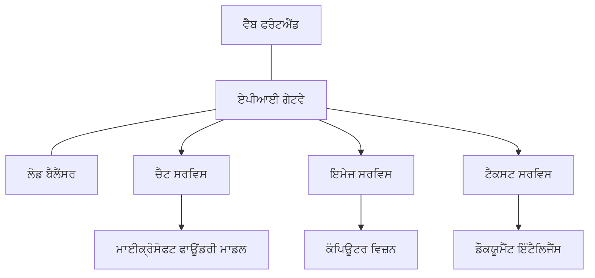

# AZD ਨਾਲ ਪ੍ਰੋਡਕਸ਼ਨ AI ਵర్కਲੋਡ ਲਈ ਬਿਹਤਰ ਅਭਿਆਸ

**ਅਧਿਆਇ ਨੈਵੀਗੇਸ਼ਨ:**
- **📚 ਕੋਰਸ ਮੁੱਖ**: [AZD ਸ਼ੁਰੂਆਤੀਆਂ ਲਈ](../../README.md)
- **📖 ਮੌਜੂਦਾ ਅਧਿਆਇ**: ਅਧਿਆਇ 8 - ਪ੍ਰੋਡਕਸ਼ਨ ਅਤੇ ਐਂਟਰਪ੍ਰਾਈਜ਼ ਪੈਟਰਨ
- **⬅️ ਪਿਛਲਾ ਅਧਿਆਇ**: [ਅਧਿਆਇ 7: ਸਮੱਸਿਆ-ਨਿਰਾਕਰਨ](../chapter-07-troubleshooting/debugging.md)
- **⬅️ ਇਸ ਨਾਲ ਸਬੰਧਿਤ**: [AI ਵਰਕਸ਼ਾਪ ਲੈਬ](ai-workshop-lab.md)
- **🎯 ਕੋਰਸ ਸਮਾਪਤ**: [AZD ਸ਼ੁਰੂਆਤੀਆਂ ਲਈ](../../README.md)

## ਸਰਾਂਸ਼

ਇਹ ਗਾਈਡ Azure Developer CLI (AZD) ਦੀ ਵਰਤੋਂ ਕਰਕੇ ਪ੍ਰੋਡਕਸ਼ਨ-ਤਿਆਰ AI ਵर्कਲੋਡ ਤੈਨਾਤ ਕਰਨ ਲਈ ਵਿਸਥਾਰਪੂਰਕ ਬਿਹਤਰ ਅਭਿਆਸ ਪ੍ਰਦਾਨ ਕਰਦੀ ਹੈ। Microsoft Foundry Discord ਕਮਿਊਨਿਟੀ ਅਤੇ ਹਕੀਕਤੀ ਗਾਹਕ ਡਿਪਲੋਇਮੈਂਟ ਤੋਂ ਪ੍ਰਾਪਤ ਫੀਡਬੈਕ ਦੀ ਆਧਾਰ 'ਤੇ, ਇਹ ਅਭਿਆਸ ਪ੍ਰੋਡਕਸ਼ਨ AI ਸਿਸਟਮਾਂ ਵਿੱਚ ਸਭ ਤੋਂ ਆਮ ਚੁਣੌਤੀਆਂ ਨੂੰ ਹੱਲ ਕਰਦੇ ਹਨ।

## ਮੁੱਖ ਚੁਣੌਤੀਆਂ ਜੋ ਹੱਲ ਕੀਤੀਆਂ ਗਈਆਂ

ਸਾਡੇ ਕਮਿਊਨਿਟੀ ਪੋਲ ਨਤੀਜਿਆਂ ਦੇ ਆਧਾਰ 'ਤੇ, ਵਿਕਾਸਕਾਰਾਂ ਨੂੰ ਇਹ ਸਬ ਤੋਂ ਵੱਧ ਮੁਸ਼ਕਲਾਂ ਆਉਂਦੀਆਂ ਹਨ:

- **45%** ਬਹੁ-ਸੇਵਾ AI ਡਿਪਲੋਇਮੈਂਟਾਂ ਵਿੱਚ ਮੁਸ਼ਕਲਾਂ
- **38%** ਸ੍ਰੇਡੈਂਸ਼ਲ ਅਤੇ ਸੀਕ੍ਰੇਟ ਪ੍ਰਬੰਧਨ ਦੀਆਂ ਸਮੱਸਿਆਵਾਂ  
- **35%** ਪ੍ਰੋਡਕਸ਼ਨ ਤਿਆਰੀ ਅਤੇ ਸਕੇਲਿੰਗ ਵਿੱਚ ਮੁਸ਼ਕਲ
- **32%** ਲਾਗਤ ਅਪਟੀਮਾਈਜ਼ੇਸ਼ਨ ਦੀਆਂ ਢੰਗ-ਪ੍ਰਕੀਰਤੀਆਂ ਦੀ ਲੋੜ
- **29%** ਮਨਿਟਰਿੰਗ ਅਤੇ ਡੀਬੱਗਿੰਗ ਵਿੱਚ ਸੁਧਾਰ ਦੀ ਲੋੜ

## ਪ੍ਰੋਡਕਸ਼ਨ AI ਲਈ ਆਰਕੀਟੈਕਚਰ ਪੈਟਰਨ

### ਪੈਟਰਨ 1: ਮਾਈਕ੍ਰੋਸਰਵਿਸਿਜ਼ AI ਆਰਕੀਟੈਕਚਰ

**ਕਦੋਂ ਇਸਦੀ ਵਰਤੋਂ ਕਰੋ**: ਕਈ ਸਮਰੱਥਾਵਾਂ ਵਾਲੀਆਂ ਜਟਿਲ AI ਐਪਲੀਕੇਸ਼ਨਾਂ ਲਈ



**AZD ਲਾਗੂਕਰਨ**:

```yaml
# azure.yaml
name: enterprise-ai-platform
services:
  web:
    project: ./web
    host: staticwebapp
  api-gateway:
    project: ./api-gateway
    host: containerapp
  chat-service:
    project: ./services/chat
    host: containerapp
  vision-service:
    project: ./services/vision
    host: containerapp
  text-service:
    project: ./services/text
    host: containerapp
```

### ਪੈਟਰਨ 2: ਇਵੈਂਟ-ਡ੍ਰਿਵਨ AI ਪ੍ਰੋਸੈਸਿੰਗ

**ਕਦੋਂ ਇਸਦੀ ਵਰਤੋਂ ਕਰੋ**: ਬੈਚ ਪ੍ਰੋਸੈਸਿੰਗ, ਦਸਤਾਵੇਜ਼ ਵਿਸ਼ਲੇਸ਼ਣ, ਅਸਿੰਕ੍ਰੋਨਸ ਵਰਕਫਲੋਜ਼

```bicep
// Event Hub for AI processing pipeline
resource eventHub 'Microsoft.EventHub/namespaces@2023-01-01-preview' = {
  name: eventHubNamespaceName
  location: location
  sku: {
    name: 'Standard'
    tier: 'Standard'
    capacity: 1
  }
}

// Service Bus for reliable message processing
resource serviceBus 'Microsoft.ServiceBus/namespaces@2022-10-01-preview' = {
  name: serviceBusNamespaceName
  location: location
  sku: {
    name: 'Premium'
    tier: 'Premium'
    capacity: 1
  }
}

// Function App for processing
resource functionApp 'Microsoft.Web/sites@2023-01-01' = {
  name: functionAppName
  location: location
  kind: 'functionapp,linux'
  properties: {
    siteConfig: {
      appSettings: [
        {
          name: 'FUNCTIONS_EXTENSION_VERSION'
          value: '~4'
        }
        {
          name: 'AZURE_OPENAI_ENDPOINT'
          value: '@Microsoft.KeyVault(VaultName=${keyVault.name};SecretName=openai-endpoint)'
        }
      ]
    }
  }
}
```

## AI ਏਜੰਟ ਦੀ ਸਿਹਤ ਬਾਰੇ ਸੋਚ

ਜਦੋਂ ਕੋਈ ਰਵਾਇਤੀ ਵੈੱਬ ਐਪ ਟੁੱਟਦਾ ਹੈ, ਤਾਂ ਲੱਛਣ ਜਾਣੇ-ਪਛਾਣੇ ਹੁੰਦੇ ਹਨ: ਇੱਕ ਪੰਨਾ ਲੋਡ ਨਹੀਂ ਹੁੰਦਾ, ਇੱਕ API ਗਲਤੀ ਦਿੰਦਾ ਹੈ, ਜਾਂ ਡਿਪਲੋਇਮੈਂਟ ਫੇਲ ਹੋ ਜਾਂਦਾ ਹੈ। AI-ਸਕਤ ਐਪਲੀਕੇਸ਼ਨ ਵੀ ਉਹਨੀਆਂ ਹੀ ਤਰੀਕਿਆਂ ਨਾਲ ਟੁੱਟ ਸਕਦੀਆਂ ਹਨ—ਪਰ ਇਹਨਾਂ ਵਿਵਹਾਰ ਵਿੱਚ ਥੋੜ੍ਹੇ ਸੁਬਟ ਅੰਦਾਜ਼ ਦੇ ਹੋ ਸਕਦੇ ਹਨ ਜੋ ਸਪੱਸ਼ਟ ਗਲਤੀ ਸੁਨੇਹੇ ਨਹੀਂ ਦਿੰਦੇ।

ਇਹ ਸੈਕਸ਼ਨ ਤੁਹਾਨੂੰ AI ਵर्कਲੋਡ ਦੀ ਨਿਗਰਾਨੀ ਲਈ ਇੱਕ ਮਾਨਸਿਕ ਮਾਡਲ ਬਣਾਉਣ ਵਿੱਚ ਮਦਦ ਕਰਦਾ ਹੈ ਤਾਂ ਜੋ ਜਦੋਂ ਗੱਲ ਠੀਕ ਨਾ ਲੱਗੇ ਤਾਂ ਤੁਸੀਂ ਜਾਣੋਂ ਕਿ ਕਿੱਥੇ ਦੇਖਣਾ ਹੈ।

### ਏਜੰਟ ਸਿਹਤ ਰਵਾਇਤੀ ਐਪ ਸਿਹਤ ਤੋਂ ਕਿਸ ਤਰ੍ਹਾਂ ਵੱਖਰੀ ਹੈ

ਇੱਕ ਰਵਾਇਤੀ ਐਪ ਜਾਂ ਤਾਂ ਕੰਮ ਕਰਦੀ ਹੈ ਜਾਂ ਨਹੀਂ। ਇੱਕ AI ਏਜੰਟ ਕੰਮ ਕਰਦਾ ਹੋਇਆ ਦਿਖਾਈ ਦੇ ਸਕਦਾ ਹੈ ਪਰ ਖਰਾਬ ਨਤੀਜੇ ਦੇ ਸਕਦਾ ਹੈ। ਏਜੰਟ ਸਿਹਤ ਨੂੰ ਦੋ ਪਰਤਾਂ ਵਿੱਚ ਸੋਚੋ:

| Layer | What to Watch | Where to Look |
|-------|--------------|---------------|
| **Infrastructure health** | ਕੀ ਸਰਵਿਸ ਚੱਲ ਰਹੀ ਹੈ? ਕੀ ਸਰੋਤ ਪ੍ਰੋਵਿਜ਼ਨ ਹੋਏ ਹਨ? ਕੀ ਐਂਡਪੋਇੰਟ ਪਹੁੰਚਯੋਗ ਹਨ? | `azd monitor`, Azure Portal resource health, container/app logs |
| **Behavior health** | ਕੀ ਏਜੰਟ ਸਹੀ ਤਰ੍ਹਾਂ ਜਵਾਬ ਦੇ ਰਿਹਾ ਹੈ? ਕੀ ਜਵਾਬ ਸਮੇਂ 'ਤੇ ਹਨ? ਕੀ ਮਾਡਲ ਨੂੰ ਸਹੀ ਤਰੀਕੇ ਨਾਲ ਕਾਲ ਕੀਤਾ ਜਾ ਰਿਹਾ ਹੈ? | Application Insights traces, model call latency metrics, response quality logs |

ਇੰਫਰਾਸਟ੍ਰੱਕਚਰ ਸਿਹਤ ਜਾਣਪਹਚਾਣ ਵਾਲੀ ਹੈ—ਇਹ ਕਿਸੇ ਵੀ azd ਐਪ ਲਈ ਇੱਕੋ ਹੀ ਹੈ। ਵਿਵਹਾਰਕ ਸਿਹਤ ਉਹ ਨਵੀਂ ਪਰਤ ਹੈ ਜੋ AI ਵర్కਲੋਡ ਲਿਆਉਂਦੇ ਹਨ।

### ਜਦੋਂ AI ਐਪਾਂ ਉਮੀਦ ਮੁਤਾਬਕ ਵਰਤਾਓ ਨਹੀਂ ਕਰਦੀਆਂ ਤਾਂ ਕਿੱਥੇ ਦੇਖਣਾ ਹੈ

ਜੇ ਤੁਹਾਡੀ AI ਐਪ ਉਮੀਦ ਮੁਤਾਬਕ ਨਤੀਜੇ ਨਹੀਂ ਦੇ ਰਹੀ, ਤਾਂ ਇੱਥੇ ਇੱਕ ਸੰਕਲਪਕ ਚੈਕਲਿਸਟ ਹੈ:

1. **ਆਧਾਰ ਚੀਜਾਂ ਤੋਂ ਸ਼ੁਰੂ ਕਰੋ।** ਕੀ ਐਪ ਚੱਲ ਰਹੀ ਹੈ? ਕੀ ਇਹ ਆਪਣੀਆਂ ਡਿਪੈਂਡੇਂਸੀਜ਼ ਤੱਕ ਪਹੁੰਚ ਸਕਦੀ ਹੈ? `azd monitor` ਅਤੇ ਰਿਸੋੋਰਸ ਸਿਹਤ ਜਾਂਚੋ ਬਿਲਕੁਲ ਉਸੇ ਤਰ੍ਹਾਂ ਜਿਵੇਂ ਤੁਸੀਂ ਕਿਸੇ ਵੀ ਐਪ ਲਈ ਕਰੋਗੇ।
2. **ਮਾਡਲ ਕਨੈਕਸ਼ਨ ਦੀ ਜਾਂਚ ਕਰੋ।** ਕੀ ਤੁਹਾਡੀ ਐਪਲਿਕੇਸ਼ਨ ਸਫਲਤਾਪੂਰਵਕ AI ਮਾਡਲ ਨੂੰ ਕਾਲ ਕਰ ਰਹੀ ਹੈ? ਫੇਲ ਜਾਂ ਟਾਈਮਆਉਟ ਹੋਏ ਮਾਡਲ ਕਾਲਾਂ AI ਐਪ ਮੁੱਦਿਆਂ ਦਾ ਸਭ ਤੋਂ ਆਮ ਕਾਰਨ ਹੁੰਦੇ ਹਨ ਅਤੇ ਇਹ ਤੁਹਾਡੇ ਐਪਲੀਕੇਸ਼ਨ ਲੋਗਜ਼ ਵਿੱਚ ਵੇਖਣ ਨੂੰ ਮਿਲਣਗੇ।
3. **ਦੇਖੋ ਕਿ ਮਾਡਲ ਨੇ ਕੀ ਪ੍ਰਾਪਤ ਕੀਤਾ।** AI ਜਵਾਬ ਇਨਪੁੱਟ (ਪ੍ਰੌਂਪਟ ਅਤੇ ਕਿਸੇ ਵੀ ਰੀਟਰੀਵਡ ਸੰਦਰਭ) 'ਤੇ ਨਿਰਭਰ ਹੁੰਦੇ ਹਨ। ਜੇ ਆਉਟਪੁੱਟ ਗਲਤ ਹੈ ਤਾਂ ਆਮ ਤੌਰ 'ਤੇ ਇਨਪੁੱਟ ਗਲਤ ਹੁੰਦਾ ਹੈ। ਜਾਂਚੋ ਕਿ ਕੀ ਤੁਹਾਡੀ ਐਪ ਮਾਡਲ ਨੂੰ ਸਹੀ ਡੇਟਾ ਭੇਜ ਰਹੀ ਹੈ।
4. **ਜਵਾਬ ਦੀ ਲੇਟੈਂਸੀ ਦੀ ਸਮੀਖਿਆ ਕਰੋ।** AI ਮਾਡਲ ਕਾਲ ਆਮ API ਕਾਲਾਂ ਨਾਲੋਂ ਹੋਰ ਧੀਮੀਆਂ ਹੁੰਦੀਆਂ ਹਨ। ਜੇ ਤੁਹਾਡੀ ਐਪ ਸੁਸਤ ਮਹਿਸੂਸ ਹੁੰਦੀ ਹੈ, ਤਾਂ ਜਾਂਚੋ ਕਿ ਮਾਡਲ ਦੇ ਜਵਾਬ ਸਮੇਂ ਵੱਧੇ ਹਨ ਜਾਂ ਨਹੀਂ—ਇਹ ਥਰੋਟਲਿੰਗ, ਸਮਰਥਾ ਸੀਮਾਵਾਂ, ਜਾਂ ਰੀਜਨ-ਪੱਧਰੀ ਭੀੜ ਦਾ ਸੰਕੇਤ ਹੋ ਸਕਦਾ ਹੈ।
5. **ਲਾਗਤ ਸੰਕੇਤਾਂ 'ਤੇ ਨਿਗਰਾਨੀ ਕਰੋ।** ਟੋਕਨ ਉਪਯੋਗਤਾ ਜਾਂ API ਕਾਲਾਂ ਵਿੱਚ ਅਣਉਮੀਦਿਤ ਚੜ੍ਹਾਵ ਲੂਪ, ਗਲਤ ਕਨਫ਼ਿਗਰਡ ਪ੍ਰੌਂਪਟ, ਜਾਂ ਬੇਹੱਦ ਰੀਟ੍ਰਾਈਜ਼ ਦਾ ਸੰਕੇਤ ਹੋ ਸਕਦੇ ਹਨ।

ਤੁਹਾਨੂੰ ਤੁਰੰਤ ਨਿਗਰਾਨੀ ਟੂਲਿੰਗ ਵਿੱਚ ਮਹਿਰਤ ਹਾਸਲ ਕਰਨ ਦੀ ਲੋੜ ਨਹੀਂ। ਮੁੱਖ ਬਿੰਦੂ ਇਹ ਹੈ ਕਿ AI ਐਪਲੀਕੇਸ਼ਨਾਂ ਵਿੱਚ ਵਿਵਹਾਰ ਦੀ ਇਕ ਹੋਰ ਪਰਤ ਨਿਗਰਾਨੀ ਕਰਨ ਲਈ ਹੁੰਦੀ ਹੈ, ਅਤੇ azd ਦਾ ਬਿਲਟ-ਇਨ ਮੋਨਿਟਰਿੰਗ (`azd monitor`) ਤੁਹਾਨੂੰ ਦੋਹਾਂ ਪਰਤਾਂ ਦੀ ਜਾਂਚ ਸ਼ੁਰੂ ਕਰਨ ਲਈ ਇੱਕ ਸ਼ੁਰੂਆਤੀ ਬਿੰਦੂ ਦਿੰਦਾ ਹੈ।

---

## ਸੁਰੱਖਿਆ ਬਿਹਤਰ ਅਭਿਆਸ

### 1. ਜ਼ੀਰੋ-ਟ੍ਰੱਸਟ ਸੁਰੱਖਿਆ ਮਾਡਲ

**ਨਿਰਵਾਹ ਰਣਨੀਤੀ**:
- ਬਿਨਾਂ ਪ੍ਰਮਾਣਕਰਨ ਦੇ ਕੋਈ ਸਰਵਿਸ-ਟੂ-ਸਰਵਿਸ ਸੰਚਾਰ ਨਹੀਂ
- ਸਾਰੇ API ਕਾਲ ਮੈਨੇਜਡ ਆਈਡੈਂਟਿਟੀਆਂ ਦੀ ਵਰਤੋਂ ਕਰਦੇ ਹਨ
- ਪ੍ਰਾਈਵੇਟ ਐਂਡਪੋਇੰਟ ਨਾਲ ਨੈੱਟਵਰਕ ਵਿਭਾਜਨ
- ਘੱਟੋ-ਘੱਟ ਅਧਿਕਾਰ ਅਕਸੇਸ ਕੰਟਰੋਲ

```bicep
// Managed Identity for each service
resource chatServiceIdentity 'Microsoft.ManagedIdentity/userAssignedIdentities@2023-01-31' = {
  name: 'chat-service-identity'
  location: location
}

// Role assignments with minimal permissions
resource openAIUserRole 'Microsoft.Authorization/roleAssignments@2022-04-01' = {
  scope: openAIAccount
  name: guid(openAIAccount.id, chatServiceIdentity.id, openAIUserRoleDefinitionId)
  properties: {
    roleDefinitionId: subscriptionResourceId('Microsoft.Authorization/roleDefinitions', '5e0bd9bd-7b93-4f28-af87-19fc36ad61bd')
    principalId: chatServiceIdentity.properties.principalId
    principalType: 'ServicePrincipal'
  }
}
```

### 2. ਸੁਰੱਖਿਅਤ ਸੀਕ੍ਰੇਟ ਪ੍ਰਬੰਧਨ

**Key Vault ਇੰਟੀਗ੍ਰੇਸ਼ਨ ਪੈਟਰਨ**:

```bicep
// Key Vault with proper access policies
resource keyVault 'Microsoft.KeyVault/vaults@2023-02-01' = {
  name: keyVaultName
  location: location
  properties: {
    tenantId: tenant().tenantId
    sku: {
      family: 'A'
      name: 'premium'  // Use premium for production
    }
    enableRbacAuthorization: true  // Use RBAC instead of access policies
    enablePurgeProtection: true    // Prevent accidental deletion
    enableSoftDelete: true
    softDeleteRetentionInDays: 90
  }
}

// Store all AI service credentials
resource openAIKeySecret 'Microsoft.KeyVault/vaults/secrets@2023-02-01' = {
  parent: keyVault
  name: 'openai-api-key'
  properties: {
    value: openAIAccount.listKeys().key1
    attributes: {
      enabled: true
    }
  }
}
```

### 3. ਨੈੱਟਵਰਕ ਸੁਰੱਖਿਆ

**Private Endpoint ਸੰਰਚਨਾ**:

```bicep
// Virtual Network for AI services
resource virtualNetwork 'Microsoft.Network/virtualNetworks@2023-04-01' = {
  name: vnetName
  location: location
  properties: {
    addressSpace: {
      addressPrefixes: ['10.0.0.0/16']
    }
    subnets: [
      {
        name: 'ai-services-subnet'
        properties: {
          addressPrefix: '10.0.1.0/24'
          privateEndpointNetworkPolicies: 'Disabled'
        }
      }
      {
        name: 'app-services-subnet'
        properties: {
          addressPrefix: '10.0.2.0/24'
          delegations: [
            {
              name: 'Microsoft.Web/serverFarms'
              properties: {
                serviceName: 'Microsoft.Web/serverFarms'
              }
            }
          ]
        }
      }
    ]
  }
}

// Private endpoints for all AI services
resource openAIPrivateEndpoint 'Microsoft.Network/privateEndpoints@2023-04-01' = {
  name: '${openAIAccountName}-pe'
  location: location
  properties: {
    subnet: {
      id: virtualNetwork.properties.subnets[0].id
    }
    privateLinkServiceConnections: [
      {
        name: 'openai-connection'
        properties: {
          privateLinkServiceId: openAIAccount.id
          groupIds: ['account']
        }
      }
    ]
  }
}
```

## ਪ੍ਰਦਰਸ਼ਨ ਅਤੇ ਸਕੇਲਿੰਗ

### 1. ਆਟੋ-ਸਕੇਲਿੰਗ ਰਣਨੀਤੀਆਂ

**Container Apps Auto-scaling**:

```bicep
resource containerApp 'Microsoft.App/containerApps@2023-05-01' = {
  name: containerAppName
  location: location
  properties: {
    configuration: {
      ingress: {
        external: true
        targetPort: 8000
        transport: 'http'
      }
    }
    template: {
      scale: {
        minReplicas: 2  // Always have 2 instances minimum
        maxReplicas: 50 // Scale up to 50 for high load
        rules: [
          {
            name: 'http-scaling'
            http: {
              metadata: {
                concurrentRequests: '20'  // Scale when >20 concurrent requests
              }
            }
          }
          {
            name: 'cpu-scaling'
            custom: {
              type: 'cpu'
              metadata: {
                type: 'Utilization'
                value: '70'  // Scale when CPU >70%
              }
            }
          }
        ]
      }
    }
  }
}
```

### 2. ਕੈਸ਼ਿੰਗ ਰਣਨੀਤੀਆਂ

**Redis Cache ਫਾਰ AI Responses**:

```bicep
// Redis Premium for production workloads
resource redisCache 'Microsoft.Cache/redis@2023-04-01' = {
  name: redisCacheName
  location: location
  properties: {
    sku: {
      name: 'Premium'
      family: 'P'
      capacity: 1
    }
    enableNonSslPort: false
    minimumTlsVersion: '1.2'
    redisConfiguration: {
      'maxmemory-policy': 'allkeys-lru'
    }
    // Enable clustering for high availability
    redisVersion: '6.0'
    shardCount: 2
  }
}

// Cache configuration in application
var cacheConnectionString = '${redisCache.properties.hostName}:6380,password=${redisCache.listKeys().primaryKey},ssl=True,abortConnect=False'
```

### 3. ਲੋਡ ਬੈਂਸਿੰਗ ਅਤੇ ਟ੍ਰੈਫਿਕ ਪ੍ਰਬੰਧਨ

**Application Gateway with WAF**:

```bicep
// Application Gateway with Web Application Firewall
resource applicationGateway 'Microsoft.Network/applicationGateways@2023-04-01' = {
  name: appGatewayName
  location: location
  properties: {
    sku: {
      name: 'WAF_v2'
      tier: 'WAF_v2'
      capacity: 2
    }
    webApplicationFirewallConfiguration: {
      enabled: true
      firewallMode: 'Prevention'
      ruleSetType: 'OWASP'
      ruleSetVersion: '3.2'
    }
    // Backend pools for AI services
    backendAddressPools: [
      {
        name: 'ai-services-pool'
        properties: {
          backendAddresses: [
            {
              fqdn: '${containerApp.properties.configuration.ingress.fqdn}'
            }
          ]
        }
      }
    ]
  }
}
```

## 💰 ਲਾਗਤ ਅਪਟੀਮਾਈਜ਼ੇਸ਼ਨ

### 1. ਸਰੋਤਾਂ ਦਾ ਸਹੀ-ਆਕਾਰ ਨਿਰਧਾਰਣ

**Environment-Specific Configurations**:

```bash
# ਡਿਵੈਲਪਮੈਂਟ ਵਾਤਾਵਰਣ
azd env new development
azd env set AZURE_OPENAI_SKU "S0"
azd env set AZURE_OPENAI_CAPACITY 10
azd env set AZURE_SEARCH_SKU "basic"
azd env set CONTAINER_CPU 0.5
azd env set CONTAINER_MEMORY 1.0

# ਉਤਪਾਦਨ ਵਾਤਾਵਰਣ
azd env new production
azd env set AZURE_OPENAI_SKU "S0"
azd env set AZURE_OPENAI_CAPACITY 100
azd env set AZURE_SEARCH_SKU "standard"
azd env set CONTAINER_CPU 2.0
azd env set CONTAINER_MEMORY 4.0
```

### 2. ਲਾਗਤ ਮੋਨਿਟਰਿੰਗ ਅਤੇ ਬਜਟ

```bicep
// Cost management and budgets
resource budget 'Microsoft.Consumption/budgets@2023-05-01' = {
  name: 'ai-workload-budget'
  properties: {
    timePeriod: {
      startDate: '2024-01-01'
      endDate: '2024-12-31'
    }
    timeGrain: 'Monthly'
    amount: 2000  // $2000 monthly budget
    category: 'Cost'
    notifications: {
      warning: {
        enabled: true
        operator: 'GreaterThan'
        threshold: 80
        contactEmails: [
          'finance@company.com'
          'engineering@company.com'
        ]
        contactRoles: [
          'Owner'
          'Contributor'
        ]
      }
      critical: {
        enabled: true
        operator: 'GreaterThan'
        threshold: 95
        contactEmails: [
          'cto@company.com'
        ]
      }
    }
  }
}
```

### 3. ਟੋਕਨ ਉਪਯੋਗਤਾ ਅਪਟੀਮਾਈਜ਼ੇਸ਼ਨ

**OpenAI Cost Management**:

```typescript
// ਐਪਲੀਕੇਸ਼ਨ ਪੱਧਰ ਤੇ ਟੋਕਨਾਂ ਦੀ ਅਨੁਕੂਲਤਾ
class TokenOptimizer {
  private readonly maxTokens = 4000;
  private readonly reserveTokens = 500;
  
  optimizePrompt(userInput: string, context: string): string {
    const availableTokens = this.maxTokens - this.reserveTokens;
    const estimatedTokens = this.estimateTokens(userInput + context);
    
    if (estimatedTokens > availableTokens) {
      // ਸੰਦਰਭ ਨੂੰ ਕੱਟੋ, ਉਪਭੋਗਤਾ ਦੇ ਇਨਪੁੱਟ ਨੂੰ ਨਹੀਂ
      context = this.truncateContext(context, availableTokens - this.estimateTokens(userInput));
    }
    
    return `${context}\n\nUser: ${userInput}`;
  }
  
  private estimateTokens(text: string): number {
    // ਲਗਭਗ ਅਨੁਮਾਨ: 1 ਟੋਕਨ ≈ 4 ਅੱਖਰ
    return Math.ceil(text.length / 4);
  }
}
```

## ਮੋਨਿਟਰਿੰਗ ਅਤੇ ਨਿਰੀਖਣਯੋਗਤਾ

### 1. ਵਿਆਪਕ Application Insights

```bicep
// Application Insights with advanced features
resource applicationInsights 'Microsoft.Insights/components@2020-02-02' = {
  name: applicationInsightsName
  location: location
  kind: 'web'
  properties: {
    Application_Type: 'web'
    WorkspaceResourceId: logAnalyticsWorkspace.id
    SamplingPercentage: 100  // Full sampling for AI apps
    DisableIpMasking: false  // Enable for security
  }
}

// Custom metrics for AI operations
resource aiMetricAlerts 'Microsoft.Insights/metricAlerts@2018-03-01' = {
  name: 'ai-high-error-rate'
  location: 'global'
  properties: {
    description: 'Alert when AI service error rate is high'
    severity: 2
    enabled: true
    scopes: [
      applicationInsights.id
    ]
    evaluationFrequency: 'PT1M'
    windowSize: 'PT5M'
    criteria: {
      'odata.type': 'Microsoft.Azure.Monitor.SingleResourceMultipleMetricCriteria'
      allOf: [
        {
          name: 'high-error-rate'
          metricName: 'requests/failed'
          operator: 'GreaterThan'
          threshold: 10
          timeAggregation: 'Count'
        }
      ]
    }
  }
}
```

### 2. AI-ਖਾਸ ਨਿਗਰਾਨੀ

**AI ਮੈਟ੍ਰਿਕਸ ਲਈ ਕਸਟਮ ਡੈਸ਼ਬੋਰਡ**:

```json
// Dashboard configuration for AI workloads
{
  "dashboard": {
    "name": "AI Application Monitoring",
    "tiles": [
      {
        "name": "OpenAI Request Volume",
        "query": "requests | where name contains 'openai' | summarize count() by bin(timestamp, 5m)"
      },
      {
        "name": "AI Response Latency",
        "query": "requests | where name contains 'openai' | summarize avg(duration) by bin(timestamp, 5m)"
      },
      {
        "name": "Token Usage",
        "query": "customMetrics | where name == 'openai_tokens_used' | summarize sum(value) by bin(timestamp, 1h)"
      },
      {
        "name": "Cost per Hour",
        "query": "customMetrics | where name == 'openai_cost' | summarize sum(value) by bin(timestamp, 1h)"
      }
    ]
  }
}
```

### 3. ਹੈਲਥ ਚੈਕ ਅਤੇ ਅਪਟਾਈਮ ਮੋਨਿਟਰਿੰਗ

```bicep
// Application Insights availability tests
resource availabilityTest 'Microsoft.Insights/webtests@2022-06-15' = {
  name: 'ai-app-availability-test'
  location: location
  tags: {
    'hidden-link:${applicationInsights.id}': 'Resource'
  }
  properties: {
    SyntheticMonitorId: 'ai-app-availability-test'
    Name: 'AI Application Availability Test'
    Description: 'Tests AI application endpoints'
    Enabled: true
    Frequency: 300  // 5 minutes
    Timeout: 120    // 2 minutes
    Kind: 'ping'
    Locations: [
      {
        Id: 'us-east-2-azr'
      }
      {
        Id: 'us-west-2-azr'
      }
    ]
    Configuration: {
      WebTest: '''
        <WebTest Name="AI Health Check" 
                 Id="8d2de8d2-a2b0-4c2e-9a0d-8f9c9a0b8c8d" 
                 Enabled="True" 
                 CssProjectStructure="" 
                 CssIteration="" 
                 Timeout="120" 
                 WorkItemIds="" 
                 xmlns="http://microsoft.com/schemas/VisualStudio/TeamTest/2010" 
                 Description="" 
                 CredentialUserName="" 
                 CredentialPassword="" 
                 PreAuthenticate="True" 
                 Proxy="default" 
                 StopOnError="False" 
                 RecordedResultFile="" 
                 ResultsLocale="">
          <Items>
            <Request Method="GET" 
                     Guid="a5f10126-e4cd-570d-961c-cea43999a200" 
                     Version="1.1" 
                     Url="${webApp.properties.defaultHostName}/health" 
                     ThinkTime="0" 
                     Timeout="120" 
                     ParseDependentRequests="True" 
                     FollowRedirects="True" 
                     RecordResult="True" 
                     Cache="False" 
                     ResponseTimeGoal="0" 
                     Encoding="utf-8" 
                     ExpectedHttpStatusCode="200" 
                     ExpectedResponseUrl="" 
                     ReportingName="" 
                     IgnoreHttpStatusCode="False" />
          </Items>
        </WebTest>
      '''
    }
  }
}
```

## ਡਿਜ਼ਾਸਟਰ ਰਿਕਵਰੀ ਅਤੇ ਹਾਈ ਅਵੇਲੇਬਿਲਿਟੀ

### 1. ਮਲਟੀ-ਰੀਜਨ ਡਿਪਲੋਇਮੈਂਟ

```yaml
# azure.yaml - Multi-region configuration
name: ai-app-multiregion
services:
  api-primary:
    project: ./api
    host: containerapp
    env:
      - AZURE_REGION=eastus
  api-secondary:
    project: ./api
    host: containerapp
    env:
      - AZURE_REGION=westus2
```

```bicep
// Traffic Manager for global load balancing
resource trafficManager 'Microsoft.Network/trafficManagerProfiles@2022-04-01' = {
  name: trafficManagerProfileName
  location: 'global'
  properties: {
    profileStatus: 'Enabled'
    trafficRoutingMethod: 'Priority'
    dnsConfig: {
      relativeName: trafficManagerProfileName
      ttl: 30
    }
    monitorConfig: {
      protocol: 'HTTPS'
      port: 443
      path: '/health'
      intervalInSeconds: 30
      toleratedNumberOfFailures: 3
      timeoutInSeconds: 10
    }
    endpoints: [
      {
        name: 'primary-endpoint'
        type: 'Microsoft.Network/trafficManagerProfiles/azureEndpoints'
        properties: {
          targetResourceId: primaryAppService.id
          endpointStatus: 'Enabled'
          priority: 1
        }
      }
      {
        name: 'secondary-endpoint'
        type: 'Microsoft.Network/trafficManagerProfiles/azureEndpoints'
        properties: {
          targetResourceId: secondaryAppService.id
          endpointStatus: 'Enabled'
          priority: 2
        }
      }
    ]
  }
}
```

### 2. ਡੇਟਾ ਬੈਕਅਪ ਅਤੇ ਰਿਕਵਰੀ

```bicep
// Backup configuration for critical data
resource backupVault 'Microsoft.DataProtection/backupVaults@2023-05-01' = {
  name: backupVaultName
  location: location
  identity: {
    type: 'SystemAssigned'
  }
  properties: {
    storageSettings: [
      {
        datastoreType: 'VaultStore'
        type: 'LocallyRedundant'
      }
    ]
  }
}

// Backup policy for AI models and data
resource backupPolicy 'Microsoft.DataProtection/backupVaults/backupPolicies@2023-05-01' = {
  parent: backupVault
  name: 'ai-data-backup-policy'
  properties: {
    policyRules: [
      {
        backupParameters: {
          backupType: 'Full'
          objectType: 'AzureBackupParams'
        }
        trigger: {
          schedule: {
            repeatingTimeIntervals: [
              'R/2024-01-01T02:00:00+00:00/P1D'  // Daily at 2 AM
            ]
          }
          objectType: 'ScheduleBasedTriggerContext'
        }
        dataStore: {
          datastoreType: 'VaultStore'
          objectType: 'DataStoreInfoBase'
        }
        name: 'BackupDaily'
        objectType: 'AzureBackupRule'
      }
    ]
  }
}
```

## DevOps ਅਤੇ CI/CD ਇੰਟੀਗ੍ਰੇਸ਼ਨ

### 1. GitHub Actions ਵਰਕਫਲੋ

```yaml
# .github/workflows/deploy-ai-app.yml
name: Deploy AI Application

on:
  push:
    branches: [main]
  pull_request:
    branches: [main]

jobs:
  test:
    runs-on: ubuntu-latest
    steps:
      - uses: actions/checkout@v4
      
      - name: Setup Python
        uses: actions/setup-python@v4
        with:
          python-version: '3.11'
          
      - name: Install dependencies
        run: |
          pip install -r requirements.txt
          pip install pytest
          
      - name: Run tests
        run: pytest tests/
        
      - name: AI Safety Tests
        run: |
          python scripts/test_ai_safety.py
          python scripts/validate_prompts.py

  deploy-staging:
    needs: test
    if: github.event_name == 'pull_request'
    runs-on: ubuntu-latest
    steps:
      - uses: actions/checkout@v4
      
      - name: Setup AZD
        uses: Azure/setup-azd@v2
        
      - name: Login to Azure
        uses: azure/login@v1
        with:
          creds: ${{ secrets.AZURE_CREDENTIALS }}
          
      - name: Deploy to Staging
        run: |
          azd env select staging
          azd deploy

  deploy-production:
    needs: test
    if: github.ref == 'refs/heads/main'
    runs-on: ubuntu-latest
    steps:
      - uses: actions/checkout@v4
      
      - name: Setup AZD
        uses: Azure/setup-azd@v2
        
      - name: Login to Azure
        uses: azure/login@v1
        with:
          creds: ${{ secrets.AZURE_CREDENTIALS }}
          
      - name: Deploy to Production
        run: |
          azd env select production
          azd deploy
          
      - name: Run Production Health Checks
        run: |
          python scripts/health_check.py --env production
```

### 2. ਇੰਫਰਾਸਟ੍ਰੱਕਚਰ ਵੈਲਿਡੇਸ਼ਨ

```bash
# scripts/validate_infrastructure.sh
#!/bin/bash

echo "Validating AI infrastructure deployment..."

# ਜਾਂਚੋ ਕਿ ਸਾਰੀਆਂ ਲੋੜੀਂਦੀਆਂ ਸੇਵਾਵਾਂ ਚੱਲ ਰਹੀਆਂ ਹਨ ਕਿ ਨਹੀਂ
services=("openai" "search" "storage" "keyvault")
for service in "${services[@]}"; do
    echo "Checking $service..."
    if ! az resource list --resource-type "Microsoft.CognitiveServices/accounts" --query "[?contains(name, '$service')]" -o tsv; then
        echo "ERROR: $service not found"
        exit 1
    fi
done

# OpenAI ਮਾਡਲ ਦੇ ਡਿਪਲੋਇਮੈਂਟਾਂ ਦੀ ਜਾਂਚ ਕਰੋ
echo "Validating OpenAI model deployments..."
models=$(az cognitiveservices account deployment list --name $AZURE_OPENAI_NAME --resource-group $AZURE_RESOURCE_GROUP --query "[].name" -o tsv)
if [[ ! $models == *"gpt-4.1-mini"* ]]; then
  echo "ERROR: Required model gpt-4.1-mini not deployed"
    exit 1
fi

# AI ਸੇਵਾ ਨਾਲ ਕਨੈਕਸ਼ਨ ਦੀ ਜਾਂਚ ਕਰੋ
echo "Testing AI service connectivity..."
python scripts/test_connectivity.py

echo "Infrastructure validation completed successfully!"
```

## ਪ੍ਰੋਡਕਸ਼ਨ ਤਿਆਰੀ ਚੈਕਲਿਸਟ

### Security ✅
- [ ] ਸਾਰੀਆਂ ਸਰਵਿਸਾਂ ਮੈਨੇਜਡ ਆਈਡੈਂਟਿਟੀਜ਼ ਦੀ ਵਰਤੋਂ ਕਰਦੀਆਂ ਹਨ
- [ ] ਸੀਕ੍ਰੇਟ Key Vault ਵਿੱਚ ਸਟੋਰ ਕੀਤੇ ਗਏ ਹਨ
- [ ] ਪ੍ਰਾਈਵੇਟ ਐਂਡਪੋਇੰਟ ਸੰਰਚਿਤ ਹਨ
- [ ] ਨੈੱਟਵਰਕ ਸੁਰੱਖਿਆ ਗਰੁੱਪ ਲਾਗੂ ਕੀਤੇ ਗਏ ਹਨ
- [ ] RBAC ਘੱਟੋ-ਘੱਟ ਅਧਿਕਾਰਾਂ ਨਾਲ
- [ ] ਪਬਲਿਕ ਐਂਡਪੋਇੰਟਸ 'ਤੇ WAF ਐਨੇਬਲ ਕੀਤਾ ਗਿਆ

### Performance ✅
- [ ] ਆਟੋ-ਸਕੇਲਿੰਗ ਸੰਰਚਿਤ
- [ ] ਕੈਸ਼ਿੰਗ ਲਾਗੂ ਕੀਤੀ ਗਈ
- [ ] ਲੋਡ ਬੈਲੈਨਸਿੰਗ ਸੈਟਅਪ
- [ ] ਸਟੈਟਿਕ ਸਮੱਗਰੀ ਲਈ CDN
- [ ] ਡੇਟਾਬੇਸ ਕਨੈਕਸ਼ਨ ਪੂਲਿੰਗ
- [ ] ਟੋਕਨ ਉਪਯੋਗਤਾ ਅਪਟੀਮਾਈਜ਼ ਕੀਤੀ

### Monitoring ✅
- [ ] Application Insights ਸੰਰਚਿਤ
- [ ] ਕਸਟਮ ਮੈਟ੍ਰਿਕਸ ਪਰਿਭਾਸ਼ਿਤ
- [ ] ਅਲਰਟ ਨਿਯਮ ਸੈਟਅਪ
- [ ] ਡੈਸ਼ਬੋਰਡ ਬਣਾਇਆ ਗਿਆ
- [ ] ਹੈਲਥ ਚੇਕ ਲਾਗੂ ਕੀਤੇ ਗਏ
- [ ] ਲੌਗ ਰੀਟੇਂਸ਼ਨ ਨੀਤੀਆਂ

### Reliability ✅
- [ ] ਮਲਟੀ-ਰੀਜਨ ਡਿਪਲੋਇਮੈਂਟ
- [ ] ਬੈਕਅਪ ਅਤੇ ਰਿਕਵਰੀ ਯੋਜਨਾ
- [ ] ਸਰਕਿਟ ਬ੍ਰੇਕਰ ਲਾਗੂ
- [ ] ਰੀਟ੍ਰਾਈ ਨੀਤੀਆਂ ਸੰਰਚਿਤ
- [ ] ਗ੍ਰੇਸਫੁਲ ਡਿਗਰੇਡੇਸ਼ਨ
- [ ] ਹੈਲਥ ਚੈੱਕ ਐਂਡਪੋਇੰਟਸ

### Cost Management ✅
- [ ] ਬਜਟ ਅਲਰਟ ਸੰਰਚਿਤ
- [ ] ਸਰੋਤਾਂ ਦਾ ਸਹੀ-ਆਕਾਰ ਨਿਰਧਾਰਿਤ
- [ ] ਡੈਵ/ਟੈਸਟ ਡਿਸਕਾਉਂਟ ਲਾਗੂ
- [ ] ਰਿਜ਼ਰਵਡ ਇਨਸਟੈਂਸ ਖਰੀਦੀਆਂ ਗਈਆਂ
- [ ] ਲਾਗਤ ਮੋਨਿਟਰਿੰਗ ਡੈਸ਼ਬੋਰਡ
- [ ] ਨਿਯਮਤ ਲਾਗਤ ਸਮੀਖਿਆਵਾਂ

### Compliance ✅
- [ ] ਡੇਟਾ ਰਿਹਾਇਸ਼ ਦੀਆਂ ਲੋੜਾਂ ਪੂਰੀਆਂ
- [ ] ਆਡਿਟ ਲੋਗਿੰਗ ਐਨੇਬਲ
- [ ] ਕੰਪਲਾਇੰਸ ਨੀਤੀਆਂ ਲਾਗੂ
- [ ] ਸੁਰੱਖਿਆ ਬੇਸਲਾਈਨ ਲਾਗੂ
- [ ] ਨਿਯਮਤ ਸੁਰੱਖਿਆ ਮੁਲਾਂਕਣ
- [ ] ਘਟਨਾ ਪ੍ਰਤੀਕਿਰਿਆ ਯੋਜਨਾ

## ਪ੍ਰਦਰਸ਼ਨ ਮਿਆਰੀਕർത്തਾ

### ਆਮ ਪ੍ਰੋਡਕਸ਼ਨ ਮੈਟ੍ਰਿਕਸ

| Metric | Target | Monitoring |
|--------|--------|------------|
| **Response Time** | < 2 seconds | Application Insights |
| **Availability** | 99.9% | Uptime monitoring |
| **Error Rate** | < 0.1% | Application logs |
| **Token Usage** | < $500/month | Cost management |
| **Concurrent Users** | 1000+ | Load testing |
| **Recovery Time** | < 1 hour | Disaster recovery tests |

### ਲੋਡ ਟੈਸਟਿੰਗ

```bash
# ਏਆਈ ਐਪਲੀਕੇਸ਼ਨਾਂ ਲਈ ਲੋਡ ਟੈਸਟਿੰਗ ਸਕ੍ਰਿਪਟ
python scripts/load_test.py \
  --endpoint https://your-ai-app.azurewebsites.net \
  --concurrent-users 100 \
  --duration 300 \
  --ramp-up 60
```

## 🤝 ਕਮਿਊਨਿਟੀ ਬਿਹਤਰ ਅਭਿਆਸ

Microsoft Foundry Discord ਕਮਿਊਨਿਟੀ ਫੀਡਬੈਕ ਦੇ ਆਧਾਰ 'ਤੇ:

### ਕਮਿਊਨਿਟੀ ਤੋਂ ਮੁੱਖ ਸਿਫਾਰਸ਼ਾਂ:

1. **ਛੋਟਿਆੰ ਤੋਂ ਸ਼ੁਰੂ ਕਰੋ, ਧੀਰੇ-ਧੀਰੇ ਸਕੇਲ ਕਰੋ**: ਬੁਨਿਆਦੀ SKUs ਨਾਲ ਸ਼ੁਰੂ ਕਰੋ ਅਤੇ ਅਸਲੀ ਵਰਤੋਂ ਦੇ ਅਧਾਰ 'ਤੇ ਸਕੇਲ ਕਰੋ
2. **ਹਰ ਚੀਜ਼ ਦੀ ਨਿਗਰਾਨੀ ਕਰੋ**: ਪਹਿਲੇ ਦਿਨ ਤੋਂ ਵਿਆਪਕ ਮੋਨਿਟਰਿੰਗ ਸੈਟਅਪ ਕਰੋ
3. **ਸੁਰੱਖਿਆ ਨੂੰ ਆਟੋਮੇਟ ਕਰੋ**: ਲਗਾਤਾਰ ਸੁਰੱਖਿਆ ਲਈ Infrastructure as Code ਦੀ ਵਰਤੋਂ ਕਰੋ
4. **ਥੋੜ੍ਹਾ-ਬਹੁਤ ਟੈਸਟ ਕਰੋ**: ਆਪਣੇ ਪਾਈਪਲਾਈਨ ਵਿੱਚ AI-ਖਾਸ ਟੈਸਟਿੰਗ ਸ਼ਾਮِل ਕਰੋ
5. **ਲਾਗਤਾਂ ਲਈ ਯੋਜਨਾ ਬਣਾਓ**: ਟੋਕਨ ਉਪਯੋਗਤਾ ਦੀ ਨਿਗਰਾਨੀ ਕਰੋ ਅਤੇ ਸ਼ੁਰੂ ਵਿੱਚ ਬਜਟ ਅਲਰਟ ਸੈਟ ਕਰੋ

### ਆਮ ਗਲਤੀਆਂ ਜਿਹਨਾਂ ਤੋਂ ਬਚਣਾ ਚਾਹੀਦਾ ਹੈ:

- ❌ ਕੋਡ ਵਿੱਚ API ਕੀਜ਼ ਹਾਰਡਕੋਡ ਕਰਨਾ
- ❌ ਢੁਕਵੀਂ ਮੋਨਿਟਰਿੰਗ ਨਾ ਸੈਟ ਕਰਨਾ
- ❌ ਲਾਗਤ ਅਪਟੀਮਾਈਜ਼ੇਸ਼ਨ ਦੀ ਅਨਦੇਖੀ
- ❌ ਫੇਲਿਯਰ ਸਨੈਰੀਓਜ਼ ਦਾ ਟੈਸਟ ਨਾ ਕਰਨਾ
- ❌ ਹੈਲਥ ਚੈਕਾਂ ਤੋਂ ਬਿਨਾਂ ਡਿਪਲੋਇ ਕਰਨਾ

## AZD AI CLI ਕਮਾਂਡਾਂ ਅਤੇ ਐਕਸਟੇਂਸ਼ਨ

AZD ਵਿੱਚ AI-ਖਾਸ ਕਮਾਂਡਾਂ ਅਤੇ ਐਕਸਟੇਂਸ਼ਨ ਦੀ ਇੱਕ ਵਧ ਰਹੀ ਸੈੱਟ ਸ਼ਾਮਿਲ ਹੈ ਜੋ ਪ੍ਰੋਡਕਸ਼ਨ AI ਵਰਕਫਲੋਜ਼ ਨੂੰ ਸਧਾਰਨ ਬਣਾਉਂਦੇ ਹਨ। ਇਹ ਟੂਲ ਲੋਕਲ ਡਿਵੈਲਪਮੈਂਟ ਅਤੇ ਪ੍ਰੋਡਕਸ਼ਨ ਡਿਪਲੋਇਮੈਂਟ ਦਰਮਿਆਨ ਦਾ ਖਾਈ ਪੂਰੀ ਕਰਦੇ ਹਨ।

### AI ਲਈ AZD ਐਕਸਟੇਂਸ਼ਨ

AZD ਇੱਕ ਐਕਸਟੇਂਸ਼ਨ ਸਿਸਟਮ ਦੀ ਵਰਤੋਂ ਕਰਦਾ ਹੈ ਤਾਂ ਜੋ AI-ਖਾਸ ਸਮਰੱਥਾਵਾਂ ਜੋੜੀਆਂ ਜਾ ਸਕਣ। ਇੰਸਟਾਲ ਅਤੇ ਮੈਨੇਜ ਕਰਨ ਲਈ:

```bash
# ਸਾਰੇ ਉਪਲਬਧ ਐਕਸਟੈਂਸ਼ਨਾਂ ਦੀ ਸੂਚੀ ਦਿਖਾਓ (ਐਆਈ ਸਮੇਤ)
azd extension list

# ਸਥਾਪਤ ਐਕਸਟੈਂਸ਼ਨਾਂ ਦੇ ਵੇਰਵੇ ਵੇਖੋ
azd extension show azure.ai.agents

# Foundry ਏਜੰਟਸ ਐਕਸਟੈਂਸ਼ਨ ਸਥਾਪਿਤ ਕਰੋ
azd extension install azure.ai.agents

# ਫਾਈਨ-ਟਿਊਨਿੰਗ ਐਕਸਟੈਂਸ਼ਨ ਸਥਾਪਿਤ ਕਰੋ
azd extension install azure.ai.finetune

# ਕਸਟਮ ਮਾਡਲ ਐਕਸਟੈਂਸ਼ਨ ਸਥਾਪਿਤ ਕਰੋ
azd extension install azure.ai.models

# ਸਾਰੇ ਸਥਾਪਤ ਐਕਸਟੈਂਸ਼ਨਾਂ ਨੂੰ ਅੱਪਗਰੇਡ ਕਰੋ
azd extension upgrade --all
```

**ਉਪਲਬਧ AI ਐਕਸਟੇਂਸ਼ਨ:**

| Extension | Purpose | Status |
|-----------|---------|--------|
| `azure.ai.agents` | Foundry Agent Service ਪ੍ਰਬੰਧਨ | Preview |
| `azure.ai.skills` | ਦੁਬਾਰਾ ਵਰਤਣਯੋਗ agent skills | Preview |
| `azure.ai.connections` | Foundry connections (ਡੇਟਾ ਸਰੋਤ, ਟੂਲ) | Preview |
| `azure.ai.finetune` | Foundry ਮਾਡਲ ਫਾਈਨ-ਟਿਊਨਿੰਗ | Preview |
| `azure.ai.models` | Foundry ਕਸਟਮ ਮਾਡਲ | Preview |
| `azure.coding-agent` | Coding agent ਸੰਰਚਨਾ | Available |

> `azure.ai.agents` ਐਕਸਟੇਂਸ਼ਨ ਤੇਜ਼ੀ ਨਾਲ ਵਿਕਸਤ ਹੋ ਰਿਹਾ ਹੈ। ਇਹ ਕੋਰਸ `0.1.40-preview` ਦੇ ਖਿਲਾਫ਼ ਪ੍ਰਮਾਣਿਤ ਹੈ। ਤਾਜ਼ਾ ਕਮਾਂਡ ਸੈੱਟ ਲੈਣ ਲਈ `azd extension upgrade --all` ਚਲਾਓ, ਅਤੇ ਆਪਣੀ ਇੰਸਟਾਲ ਕੀਤੀ ਵਰਜਨ ਦੀ ਪੁਸ਼ਟੀ ਕਰਨ ਲਈ `azd extension show azure.ai.agents` ਚਲਾਓ।

**ਨਵੇਂ `skills` ਅਤੇ `connections` ਐਕਸਟੇਂਸ਼ਨ ਕੀ ਹਨ?**

ਦੋ ਪ੍ਰੀਵਿਊ ਐਕਸਟੇਂਸ਼ਨ agent tooling ਦੇ ਨਾਲ ਆਏ ਸਨ ਅਤੇ ਸ਼ੁਰੂਆਤੀ ਸਿਖਿਆਰਥੀ ਦੇ ਤੌਰ 'ਤੇ ਵੀ ਸਮਝਣ ਯੋਗ ਹਨ:

- **`azure.ai.skills`** — ਇੱਕ **skill** ਇੱਕ ਦੁਬਾਰਾ ਵਰਤਣਯੋਗ ਸਮਰੱਥਾ ਹੈ (ਇੱਕ ਪੈਕ ਕੀਤੀ ਗਈ ਟੂਲ ਜਾਂ ਵਿਵਹਾਰ) ਜਿਸ ਨੂੰ ਤੁਸੀਂ ਇੱਕ ਜਾਂ ਵੱਧ ਏਜੰਟਸ ਨਾਲ ਜੋੜ ਸਕਦੇ ਹੋ ਬਜਾਏ ਹਰ ਵਾਰੀ ਦੁਬਾਰਾ ਬਣਾਉਣ ਦੇ। ਇਸਨੂੰ ਇੱਕ ਸਾਂਝਾ ਬਿਲਡਿੰਗ ਬਲੌਕ ਸਮਝੋ: "ਦਸਤਾਵੇਜ਼ ਖੋਜੋ" ਜਾਂ "ਆਰਡਰ ਲੱਭੋ" ਵਰਗਾ skill ਇੱਕ ਵਾਰ ਪਰਿਭਾਸ਼ਿਤ ਕਰੋ, ਫਿਰ multiple agents ਵਿੱਚ ਰੀਯੂਜ਼ ਕਰੋ। ਇਹ ਬਹੁ-ਏਜੰਟ ਪ੍ਰਣਾਲੀਆਂ (ਅਧਿਆਇ 5) ਨੂੰ ਸੰਗਠਿਤ ਰੱਖਦਾ ਹੈ ਅਤੇ ਕਾਪੀ-ਪੇਸਟ ਤੋਂ ਬਚਾਉਂਦਾ ਹੈ।
- **`azure.ai.connections`** — ਇੱਕ **connection** ਤੁਹਾਡੇ Foundry ਪ੍ਰੋਜੈਕਟ ਤੋਂ ਕਿਸੇ ਬਾਹਰੀ ਸਰੋਤ (ਜਿਸ ਦੀ ਏਜੰਟਸ ਨੂੰ ਲੋੜ ਹੈ) ਤੱਕ ਇੱਕ ਮੈਨੇਜਡ ਲਿੰਕ ਹੈ—ਜਿਵੇਂ ਇੱਕ ਡੇਟਾ ਸਰੋਤ (Azure AI Search ਵਰਗਾ), ਇੱਕ ਟੂਲ ਐਂਡਪੋਇੰਟ, ਜਾਂ ਹੋਰ ਕੋਈ ਸਰਵਿਸ। Connections ਕੇਂਦਰੀਕ੍ਰਿਤ ਕਰਦੇ ਹਨ ਕਿ ਏਜੰਟ ਡੇਟਾ ਨੂੰ ਕਿੱਥੋਂ ਅਤੇ ਕਿਵੇਂ ਐਕਸੈਸ ਕਰਦੇ ਹਨ, ਇਸ ਤਰ੍ਹਾਂ ਕ੍ਰੈਡੈਂਸ਼ਲ ਅਤੇ ਐਂਡਪੋਇੰਟ ਕੋਡ ਵਿੱਚ ਵਿਖਰੇ ਹੋਣ ਦਿੱਖਣ ਦੀ ਬਜਾਏ ਇੱਕ ਪਰਿਚਾਲਿਤ ਥਾਂ 'ਤੇ ਰਹਿੰਦੇ ਹਨ।

ਤੁਹਾਨੂੰ ਆਪਣੇ ਪਹਿਲੇ ਏਜੰਟ ਤੈਨਾਤ ਕਰਨ ਲਈ ਇਹਨਾਂ ਦੀ ਲੋੜ ਨਹੀਂ ਹੈ—ਸਿੱਖਦੇ ਸਮੇਂ `azure.ai.agents` ਨਾਲ ਰਹੋ। ਜਦੋਂ ਤੁਸੀਂ ਵੇਖੋ ਕਿ ਤੁਸੀਂ ਇੱਕੋ ਹੀ ਟੂਲ ਨੂੰ ਵੱਖ-ਵੱਖ ਏਜੰਟਸ ਵਿੱਚ ਨਕਲ ਕਰ ਰਹੇ ਹੋ ਤਾਂ `skills` ਦੀ ਪਹੁੰਚ ਕਰੋ, ਅਤੇ ਜਦੋਂ ਕਈ ਏਜੰਟ ਇਕੋ ਡੇਟਾ ਸਰੋਤ ਸਾਂਝਾ ਕਰਦੇ ਹਨ ਤਾਂ `connections` ਦੀ ਵਰਤੋਂ ਕਰੋ।

### `azd ai agent init` ਨਾਲ ਏਜੰਟ ਪ੍ਰੋਜੈਕਟ ਸ਼ੁਰੂ ਕਰਨਾ

`azd ai agent init` ਕਮਾਂਡ Microsoft Foundry Agent Service ਨਾਲ ਇੰਟੀਗ੍ਰੇਟਡ ਇੱਕ ਪ੍ਰੋਡਕਸ਼ਨ-ਤਿਆਰ AI ਏਜੰਟ ਪ੍ਰੋਜੈਕਟ scaffolding ਕਰਦੀ ਹੈ:

```bash
# ਏਜੰਟ ਮੈਨੀਫੈਸਟ ਤੋਂ ਇੱਕ ਨਵਾਂ ਏਜੰਟ ਪ੍ਰੋਜੈਕਟ ਆਰੰਭ ਕਰੋ
azd ai agent init -m <manifest-path-or-uri>

# ਇੱਕ ਨਿਰਧਾਰਤ Foundry ਪ੍ਰੋਜੈਕਟ ਆਰੰਭ ਕਰੋ ਅਤੇ ਉਸ ਨੂੰ ਨਿਸ਼ਾਨਾ ਬਣਾਓ
azd ai agent init -m agent-manifest.yaml --project-id <foundry-project-id>

# ਇੱਕ ਕਸਟਮ ਸੋਰਸ ਡਾਇਰੈਕਟਰੀ ਨਾਲ ਆਰੰਭ ਕਰੋ
azd ai agent init -m agent-manifest.yaml --src ./agents/my-agent

# Container Apps ਨੂੰ ਹੋਸਟ ਵਜੋਂ ਨਿਸ਼ਾਨਾ ਬਣਾਓ
azd ai agent init -m agent-manifest.yaml --host containerapp
```

**ਮੁੱਖ ਫਲੇਗਸ:**

| Flag | Description |
|------|-------------|
| `-m, --manifest` | ਤੁਹਾਡੇ ਪ੍ਰੋਜੈਕਟ ਵਿੱਚ ਜੋੜਨ ਲਈ agent manifest ਦਾ ਮਾਰਗ ਜਾਂ URI |
| `-p, --project-id` | ਤੁਹਾਡੇ azd ਵਾਤਾਵਰਨ ਲਈ ਮੌਜੂਦਾ Microsoft Foundry Project ID |
| `-s, --src` | ਏਜੰਟ ਡੈਫਿਨੀਸ਼ਨ ਨੂੰ ਡਾਊਨਲੋਡ ਕਰਨ ਲਈ ਡਾਇਰੈਕਟਰੀ (ਮਾਪੇ `src/<agent-id>`) |
| `--host` | ਡੀਫੌਲਟ ਹੋਸਟ ਨੂੰ ਓਵਰਰਾਈਡ ਕਰੋ (ਉਦਾਹਰਨ ਲਈ, `containerapp`) |
| `-e, --environment` | ਵਰਤੋਂ ਲਈ azd ਇਨਵਿਰਨਮੈਂਟ |

**ਪ੍ਰੋਡਕਸ਼ਨ ਟਿਪ**: `--project-id` ਦੀ ਵਰਤੋਂ ਕਰੋ ਤਾਂ ਜੋ ਸਿੱਧਾ ਮੌਜੂਦਾ Foundry ਪ੍ਰੋਜੈਕਟ ਨਾਲ ਕਨੈਕਟ ਹੋ ਜਾਵੋ, ਇਸ ਨਾਲ ਤੁਹਾਡਾ ਏਜੰਟ ਕੋਡ ਅਤੇ ਕਲਾਉਡ ਰਿਸੋਸز ਸ਼ੁਰੂ ਤੋਂ ਹੀ ਲਿੰਕ ਰਹਿੰਦੇ ਹਨ।

### ਏਜੰਟ ਲਾਈਫਸਾਈਕਲ ਦਾ ਪ੍ਰਬੰਧਨ

`init` ਤੋਂ ਇਲਾਵਾ, `azure.ai.agents` ਐਕਸਟੈਂਸ਼ਨ ਹੋਸਟ ਕੀਤੇ ਏਜੰਟ ਦੇ ਪੂਰੇ ਲਾਈਫਸਾਈਕਲ ਲਈ ਕਮਾਂਡ ਪ੍ਰਦਾਨ ਕਰਦਾ ਹੈ—ਟੈਸਟ ਕਰਨ, ਮੁੱਲਾਂਕਣ ਕਰਨ, ਅਪਟਿਮਾਈਜ਼ ਕਰਨ, ਅਤੇ ਰਿਟਾਇਰ ਕਰਨ ਲਈ:

```bash
# ਤੈਨਾਤ ਕੀਤੇ ਏਜੰਟ ਨੂੰ ਕਾਲ ਕਰੋ ਅਤੇ ਸਰਵਰ ਦੇ ਜਵਾਬ ਦਾ ਸਮਾਂ ਵੇਖੋ
# (ਕੁੱਲ ਲੈਟੰਸੀ ਅਤੇ ਪਹਿਲੇ ਬਾਈਟ ਤੱਕ ਦਾ ਸਮਾਂ)
azd ai agent invoke

# ਇਸਨੂੰ ਬਦਲਣ ਤੋਂ ਪਹਿਲਾਂ ਲਾਈਵ ਐਂਡਪੌਇੰਟ ਦੀ ਸੰਰਚਨਾ ਦਿਖਾਓ
azd ai agent endpoint show

# ਏਜੰਟ ਲਈ ਮੁਲਾਂਕਣ ਡੇਟਾਸੈੱਟ ਤਿਆਰ ਕਰੋ
azd ai agent eval generate --dataset ./eval/dataset.jsonl

# ਆਪਣੇ ਮੁਲਾਂਕਣ ਡੇਟਾ ਦੇ ਆਧਾਰ 'ਤੇ ਏਜੰਟ ਦੇ ਨਿਰਦੇਸ਼ਾਂ ਨੂੰ ਅਨੁਕੂਲ ਕਰੋ
# (ਏਜੰਟ ਪ੍ਰੋਜੈਕਟ ਵਿੱਚ optimization_model ਦੀ ਲੋੜ ਹੈ)
azd ai agent optimize

# ਕੋਡ-ਆਧਾਰਿਤ ਹੋਸਟ ਕੀਤੇ ਗਏ ਏਜੰਟ ਦਾ ਤੈਨਾਤ ਕੀਤਾ ਸਰੋਤ ਡਾਊਨਲੋਡ ਕਰੋ
# (SHA-256 ਜਾਂਚ ਸਮੇਤ)
azd ai agent code download

# ਇੱਕ ਹੋਸਟਡ ਏਜੰਟ ਅਤੇ ਇਸ ਦੀਆਂ ਸਭ ਵਰਜਨਾਂ ਨੂੰ ਮਿਟਾਓ
# (--force ਸਰਗਰਮ ਸੈਸ਼ਨਾਂ ਨੂੰ ਖਤਮ ਕਰ ਦਿੰਦਾ ਹੈ)
azd ai agent delete --force
```

**ਲਾਈਫਸਾਈਕਲ ਇੱਕ ਨਜ਼ਰ ਵਿੱਚ:**

| Stage | Command | Production use |
|-------|---------|----------------|
| Test | `azd ai agent invoke` | ਰਿਲੀਜ਼ ਤੋਂ ਪਹਿਲਾਂ ਜਵਾਬਾਂ ਦੀ ਯਾਚਨਾ ਅਤੇ ਲੇਟੈਂਸੀ ਮਾਪੋ |
| Inspect | `azd ai agent endpoint show` | ਐਂਡਪੋਇੰਟ auth/config ਦੀ ਸਮੀਖਿਆ; ਬ੍ਰੇਕਿੰਗ ਚੇਨਜਜ਼ ਜਲਦੀ ਪਛਾਣੋ |
| Measure | `azd ai agent eval generate` | ਰੀਅਲ ਟਰੇਸز ਤੋਂ ਇੱਕ ਦੁਹਰਾਊ ਯੋਗ ਮੁੱਲਾਂਕਣ ਸੈੱਟ ਬਣਾਓ |
| Improve | `azd ai agent optimize` | ਮਾਪੀ ਗੁਣਵੱਤਾ ਦੇ ਖਿਲਾਫ ਨਿਰਦੇਸ਼ਾਂ ਨੂੰ ਟਿਊਨ ਕਰੋ |
| Recover | `azd ai agent code download` | ਆਡੀਟ/ਰੋਲਬੈਕ ਲਈ ਅਕਿਾਈ ਡਿਪਲੋਅਡ ਸੋర్స్ ਪ੍ਰਾਪਤ ਕਰੋ |
| Retire | `azd ai agent delete --force` | ਇੱਕ ਏਜੰਟ ਅਤੇ ਇਸਦੇ ਵਰਜ਼ਨਾਂ ਨੂੰ ਸਾਫ਼ ਤਰੀਕੇ ਨਾਲ ਹਟਾਓ |

> ਇਹਨਾਂ ਕੋਮਾਂਡਾਂ ਨੂੰ ਪ੍ਰੀਵਿਊ ਕੀਤਾ ਗਿਆ ਹੈ ਅਤੇ ਐਕਸਟੈਂਸ਼ਨ ਰੀਲੀਜ਼ਾਂ ਦਰਮਿਆਨ ਬਦਲ ਸਕਦੇ ਹਨ। ਆਪਣੀ ਇੰਸਟਾਲ ਕੀਤੀ ਵਰਜਨ ਵਿੱਚ ਉਪਲਬਧ ਸਬ-ਕਮਾਂਡ ਵੇਖਣ ਲਈ `azd ai agent --help` ਚਲਾਓ।

### Model Context Protocol (MCP) with `azd mcp`
AZD ਵਿੱਚ ਨਿਰਮਿਤ MCP ਸਰਵਰ ਸਮਰਥਨ (Alpha) ਸ਼ਾਮਲ ਹੈ, ਜੋ AI ਏਜੰਟਾਂ ਅਤੇ ਟੂਲਜ਼ ਨੂੰ ਇੱਕ ਮਿਆਰੀ ਪ੍ਰੋਟੋਕਾਲ ਰਾਹੀਂ ਤੁਹਾਡੇ Azure ਸਰੋਤਾਂ ਨਾਲ ਇੰਟਰੈਕਟ ਕਰਨ ਦੇ ਯੋਗ ਬਨਾਉਂਦਾ ਹੈ:

```bash
# ਆਪਣੇ ਪ੍ਰੋਜੈਕਟ ਲਈ MCP ਸਰਵਰ ਸ਼ੁਰੂ ਕਰੋ
azd mcp start

# ਟੂਲ ਚਲਾਉਣ ਲਈ ਮੌਜੂਦਾ Copilot ਸਹਿਮਤੀ ਨਿਯਮਾਂ ਦੀ ਸਮੀਖਿਆ ਕਰੋ
azd copilot consent list
```

MCP ਸਰਵਰ ਤੁਹਾਡੇ azd ਪ੍ਰਾਜੈਕਟ ਸੰਦਰਭ—environments, services, ਅਤੇ Azure resources—ਨੂੰ AI-ਚਲਿਤ ਡਿਵੈਲਪਮੈਂਟ ਟੂਲਜ਼ ਲਈ ਐਕਸਪੋਜ਼ ਕਰਦਾ ਹੈ। ਇਸ ਨਾਲ ਸੰਭਵ ਹੁੰਦਾ ਹੈ:

- **AI-assisted deployment**: ਕੋਡਿੰਗ ਏਜੰਟਾਂ ਨੂੰ ਤੁਹਾਡੇ ਪ੍ਰਾਜੈਕਟ ਦੀ ਸਥਿਤੀ ਪੁੱਛਣ ਅਤੇ ਡਿਪਲੋਇਮੈਂਟ ਟ੍ਰਿਗਰ ਕਰਨ ਦਿਓ
- **Resource discovery**: AI ਟੂਲ ਇਹ ਪਤਾ ਲਗਾ ਸਕਦੇ ਹਨ ਕਿ ਤੁਹਾਡੇ ਪ੍ਰਾਜੈਕਟ ਕਿਹੜੀਆਂ Azure resources ਵਰਤਦਾ ਹੈ
- **Environment management**: ਏਜੰਟ dev/staging/production ਵਾਤਾਵਰਣਾਂ ਦੇ ਵਿਚਕਾਰ ਸਵਿੱਚ ਕਰ ਸਕਦੇ ਹਨ

### `azd infra generate` ਨਾਲ ਇੰਫਰਾਸਟਰੱਕਚਰ ਬਣਾਉਣਾ

ਉਤਪਾਦਨ AI ਵਰਕਲੋਡਾਂ ਲਈ, ਤੁਸੀਂ ਆਟੋਮੈਟਿਕ ਪ੍ਰੋਵਿਜਨਿੰਗ 'ਤੇ ਨਿਰਭਰ ਹੋਣ ਦੀ ਥਾਂ Infrastructure as Code ਜਨਰੇਟ ਅਤੇ ਕਸਟਮਾਈਜ਼ ਕਰ ਸਕਦੇ ਹੋ:

```bash
# ਤੁਹਾਡੇ ਪ੍ਰਾਜੈਕਟ ਦੀ ਪਰਿਭਾਸ਼ਾ ਤੋਂ Bicep/Terraform ਫਾਇਲਾਂ ਬਣਾਓ
azd infra generate
```

ਇਹ IaC ਨੂੰ ਡਿਸਕ 'ਤੇ ਲਿਖਦਾ ਹੈ ਤਾਂ ਜੋ ਤੁਸੀਂ:
- ਤੈਨਾਤੀ ਕਰਨ ਤੋਂ ਪਹਿਲਾਂ ਇੰਫਰਾਸਟਰੱਕਚਰ ਦੀ ਸਮੀਖਿਆ ਅਤੇ ਆਡੀਟ ਕਰ ਸਕੋ
- ਕਸਟਮ ਸੁਰੱਖਿਆ ਨੀਤੀਆਂ ਸ਼ਾਮਲ ਕਰੋ (ਨੈਟਵਰਕ ਨਿਯਮ, ਪ੍ਰਾਈਵੇਟ ਐਂਡਪੌਇੰਟ)
- ਮੌਜੂਦਾ IaC ਸਮੀਖਿਆ ਪ੍ਰਕਿਰਿਆਵਾਂ ਨਾਲ ਇੰਟੇਗ੍ਰੇਟ ਕਰੋ
- ਐਪਲਿਕੇਸ਼ਨ ਕੋਡ ਤੋਂ ਅਲੱਗ ਇੰਫਰਾਸਟਰੱਕਚਰ ਬਦਲਾਵਾਂ ਨੂੰ ਵਰਜ਼ਨ ਕੰਟਰੋਲ ਕਰੋ

### ਪ੍ਰੋਡਕਸ਼ਨ ਲਾਈਫਸਾਈਕਲ ਹੋਕਸ

AZD ਹੋਕਸ ਤੁਹਾਨੂੰ ਤੈਨਾਤੀ ਲਾਈਫਸਾਈਕਲ ਦੇ ਹਰ ਸਟੇਜ 'ਤੇ ਕਸਟਮ ਲੌਜਿਕ ਇੰਜੈਕਟ ਕਰਨ ਦੀ ਆਗਿਆ ਦਿੰਦੇ ਹਨ—ਜੋ ਪ੍ਰੋਡਕਸ਼ਨ AI ਵਰਕਫਲੋਜ਼ ਲਈ ਅਤਿ-ਆਵਸ਼ਯਕ ਹੈ:

```yaml
# azure.yaml - Production hooks example
name: ai-production-app
hooks:
  preprovision:
    shell: sh
    run: scripts/validate-quotas.sh    # Check AI model quota before provisioning
  postprovision:
    shell: sh
    run: scripts/configure-networking.sh  # Set up private endpoints
  predeploy:
    shell: sh
    run: scripts/run-ai-safety-tests.sh  # Run prompt safety checks
  postdeploy:
    shell: sh
    run: scripts/smoke-test.sh           # Verify agent responses post-deploy
services:
  agent-api:
    project: ./src/agent
    host: containerapp
    hooks:
      predeploy:
        shell: sh
        run: scripts/validate-model-access.sh  # Per-service hook
```

```bash
# ਡਿਵੈਲਪਮੈਂਟ ਦੌਰਾਨ ਕਿਸੇ ਖ਼ਾਸ ਹੁੱਕ ਨੂੰ ਹੱਥੋਂ ਚਲਾਓ
azd hooks run predeploy
```

**AI ਵਰਕਲੋਡਾਂ ਲਈ ਸਿਫਾਰਸ਼ੀ ਪ੍ਰੋਡਕਸ਼ਨ ਹੋਕਸ:**

| ਹੁਕ | ਉਪਯੋਗ ਕੇਸ |
|------|----------|
| `preprovision` | AI ਮਾਡਲ ਦੀ ਸਮਰੱਥਾ ਲਈ ਸਬਸਕ੍ਰਿਪਸ਼ਨ ਕੋਟਿਆਂ ਦੀ ਪੁਸ਼ਟੀ ਕਰੋ |
| `postprovision` | ਪ੍ਰਾਈਵੇਟ ਐਂਡਪੌਇੰਟ ਕਨਫਿਗਰ ਕਰੋ, ਮਾਡਲ ਵੇਟਸ ਤੈਨਾਤ ਕਰੋ |
| `predeploy` | AI ਸੁਰੱਖਿਆ ਟੈਸਟ ਚਲਾਓ, ਪ੍ਰਾਂਪਟ ਟੈਂਪਲੇਟਾਂ ਦੀ ਪੁਸ਼ਟੀ ਕਰੋ |
| `postdeploy` | ਏਜੰਟ ਜਵਾਬਾਂ ਦਾ smoke test ਕਰੋ, ਮਾਡਲ ਕਨੈਕਟਿਵਿਟੀ ਦੀ ਪੁਸ਼ਟੀ ਕਰੋ |

### CI/CD ਪਾਈਪਲਾਈਨ ਸੰਰਚਨਾ

ਸੁਰੱਖਿਅਤ Azure ਪ੍ਰਮਾਣਕਰਨ ਨਾਲ ਆਪਣੇ ਪ੍ਰਾਜੈਕਟ ਨੂੰ GitHub Actions ਜਾਂ Azure Pipelines ਨਾਲ ਜੋੜਣ ਲਈ `azd pipeline config` ਵਰਤੋਂ:

```bash
# CI/CD ਪਾਈਪਲਾਈਨ ਨੂੰ ਸੰਰਚਿਤ ਕਰੋ (ਇੰਟਰਐਕਟਿਵ)
azd pipeline config

# ਕਿਸੇ ਵਿਸ਼ੇਸ਼ ਪ੍ਰੋਵਾਈਡਰ ਨਾਲ ਸੰਰਚਿਤ ਕਰੋ
azd pipeline config --provider github
```

ਇਹ ਕਮਾਂਡ:
- ਘੱਟ-ਅਧਿਕਾਰ ਵਾਲੀ ਪਹੁੰਚ ਨਾਲ ਇੱਕ service principal ਬਣਾਉਂਦੀ ਹੈ
- ਫੈਡਰੇਟਿਡ ਕ੍ਰੈਡੈਂਸ਼ਲਸ (ਕੋਈ ਸਟੋਰ ਕੀਤੇ ਗਏ ਸਿਕਰਿਟ ਨਹੀਂ) ਕਨਫਿਗਰ ਕਰਦੀ ਹੈ
- ਤੁਹਾਡੇ ਪਾਈਪਲਾਈਨ ਡਿਫ਼ਿਨਿਸ਼ਨ ਫਾਇਲ ਨੂੰ ਬਣਾਉਂਦੀ ਜਾਂ ਅਪਡੇਟ ਕਰਦੀ ਹੈ
- ਤੁਹਾਡੇ CI/CD ਸਿਸਟਮ ਵਿੱਚ ਲੋੜੀਂਦੇ ਵਾਤਾਵਰਣ ਵੇਰੀਏਬਲ ਸੈਟ ਕਰਦੀ ਹੈ

#### ਕਦਮ-ਬ-ਕਦਮ: ਤੁਹਾਡੀ ਪਹਿਲੀ GitHub Actions ਪਾਈਪਲਾਈਨ

ਇੱਥੇ ਇੱਕ ਕਾਰਜਕਾਰੀ azd ਪ੍ਰਾਜੈਕਟ ਤੋਂ ਹਰ push 'ਤੇ ਆਟੋਮੇਟਿਕ ਡਿਪਲੋਇਮੈਂਟ ਤੱਕ ਪੂਰਾ ਵਾਕਥਰੂ ਦਿੱਤਾ ਗਿਆ ਹੈ।

**1. ਯਕੀਨੀ ਬਣਾਓ ਕਿ ਤੁਹਾਡਾ ਪ੍ਰਾਜੈਕਟ GitHub 'ਤੇ ਹੈ**

```bash
git init
git add .
git commit -m "Initial azd project"
gh repo create my-ai-app --private --source=. --push
```

**2. pipeline config ਚਲਾਓ**

```bash
azd pipeline config --provider github
```

azd ਇੰਟਰਐਕਟਿਵ ਢੰਗ ਨਾਲ:
- ਪੁੱਛੇਗਾ ਕਿ ਕਿਹੜੀ Azure subscription ਅਤੇ environment ਟਾਰਗਿਟ ਕਰਨੇ ਹਨ
- pipeline ਲਈ Entra **app registration + service principal** ਬਣਾਏਗਾ
- **federated credentials (OIDC)** ਸੈਟਅੱਪ ਕਰੇਗਾ—ਤਾਂ ਜੋ GitHub ਛੋਟੇ ਸਮੇਂ ਵਾਲੇ ਟੋਕਨ ਨਾਲ Azure ਨੂੰ ਪ੍ਰਮਾਣਿਤ ਕਰੇ ਅਤੇ **ਕੋਈ secrets ਸਟੋਰ ਨਾ ਕੀਤੇ ਜਾਣ**
- ਲੋੜੀਂਦੇ **variables** ਤੁਹਾਡੇ GitHub repo ਵਿੱਚ push ਕਰੇਗਾ (`AZURE_CLIENT_ID`, `AZURE_TENANT_ID`, `AZURE_SUBSCRIPTION_ID`, `AZURE_ENV_NAME`, `AZURE_LOCATION`)

**3. ਬਣੇ ਹੋਏ workflow ਨੂੰ ਸਮਝੋ**

azd `.github/workflows/azure-dev.yml` ਜੋੜਦਾ ਹੈ। ਮੁੱਖ ਹਿੱਸੇ ਇਸ ਤਰ੍ਹਾਂ ਦੇਖਾਈ ਦਿੰਦੇ ਹਨ:

```yaml
# .github/workflows/azure-dev.yml
on:
  push:
    branches: [ main ]
  workflow_dispatch:        # lets you run it manually too

permissions:
  id-token: write           # required for OIDC federated login
  contents: read

jobs:
  build:
    runs-on: ubuntu-latest
    env:
      AZURE_CLIENT_ID: ${{ vars.AZURE_CLIENT_ID }}
      AZURE_TENANT_ID: ${{ vars.AZURE_TENANT_ID }}
      AZURE_SUBSCRIPTION_ID: ${{ vars.AZURE_SUBSCRIPTION_ID }}
      AZURE_ENV_NAME: ${{ vars.AZURE_ENV_NAME }}
      AZURE_LOCATION: ${{ vars.AZURE_LOCATION }}
    steps:
      - uses: actions/checkout@v4
      - name: Install azd
        uses: Azure/setup-azd@v2
      - name: Log in with OIDC
        run: azd auth login --client-id "$AZURE_CLIENT_ID" --federated-credential-provider "github" --tenant-id "$AZURE_TENANT_ID"
      - name: Provision infrastructure
        run: azd provision --no-prompt
      - name: Deploy application
        run: azd deploy --no-prompt
```

**4. ਪੁਸ਼ਟੀ ਕਰੋ ਕਿ ਇਹ ਕੰਮ ਕਰਦਾ ਹੈ**

```bash
# ਪਾਈਪਲਾਈਨ ਨੂੰ ਟ੍ਰਿਗਰ ਕਰਨ ਲਈ ਇੱਕ ਬਦਲਾਅ ਪੁਸ਼ ਕਰੋ
git commit -am "Trigger pipeline" --allow-empty
git push
```

ਆਪਣੇ GitHub ਰਿਪੋ ਵਿੱਚ **Actions** ਟੈਬ ਖੋਲ੍ਹੋ ਅਤੇ ਵੇਖੋ ਕਿ workflow ਆਪਣੇ ਆਪ `azd provision` ਅਤੇ `azd deploy` ਚਲਾਂਉਂਦਾ ਹੈ।

> **ਫੈਡਰੇਟਿਡ ਕ੍ਰੈਡੈਂਸ਼ਲ ਮਹੱਤਵਪੂਰਨ ਕਿਉਂ ਹਨ:** ਪੁਰਾਣੀਆਂ ਪਾਈਪਲਾਈਨਾਂ GitHub ਵਿੱਚ ਇੱਕ client secret ਸਟੋਰ ਕਰਦੀਆਂ ਸਨ। OIDC ਫੈਡਰੇਟਿਡ ਕ੍ਰੈਡੈਂਸ਼ਲ ਉਸ secret ਨੂੰ ਪੂਰੀ ਤਰ੍ਹਾਂ ਹਟਾ ਦਿੰਦੇ ਹਨ—GitHub ਰਨਟਾਈਮ 'ਤੇ ਇੱਕ ਛੋਟੇ ਸਮੇਂ ਵਾਲਾ ਟੋਕਨ ਮੰਗਦਾ ਹੈ, ਜੋ ਜ਼ਿਆਦਾ ਸੁਰੱਖਿਅਤ ਹੁੰਦਾ ਹੈ ਅਤੇ ਜਿਸਨੂੰ ਘੁੰਮਾਇਆ ਜਾਂ ਲੀਕ ਨਹੀਂ ਹੋਣਾ। ਇਹ `azd pipeline config` ਦੀ ਡਿਫੌਲਟ ਸੈਟਿੰਗ ਹੈ।

> **Secrets vs. variables:** ਗੈਰ-ਸੰਵੇਦਨਸ਼ੀਲ ਪਛਾਣਕਰਤਾ (`AZURE_CLIENT_ID`, ਆਦਿ) ਰਿਪੋ **variables** ਵਿੱਚ ਰਹਿੰਦੇ ਹਨ। ਜੇ ਤੁਹਾਡੇ ਐਪ ਨੂੰ build ਸਮੇਂ ਸੱਚਮੁੱਚ ਕਿਸੇ secret ਦੀ ਲੋੜ ਹੋਵੇ, ਤਦ ਉਸਨੂੰ GitHub **secret** ਵਜੋਂ ਜੋੜੋ ਅਤੇ `${{ secrets.NAME }}` ਨਾਲ ਰੀਫ਼ਰੈਂਸ ਕਰੋ—ਪਰ runtime 'ਤੇ Key Vault + managed identity ਨੂੰ ਤਰਜੀਹ ਦਿਓ (ਦੇਖੋ [Chapter 3](../chapter-03-configuration/authsecurity.md))।

**pipeline config ਨਾਲ ਪ੍ਰੋਡਕਸ਼ਨ ਵਰਕਫਲੋ:**

```bash
# 1. ਉਤਪਾਦਨ ਵਾਤਾਵਰਣ ਸੈੱਟਅੱਪ ਕਰੋ
azd env new production
azd env set AZURE_OPENAI_CAPACITY 100

# 2. ਪਾਈਪਲਾਈਨ ਨੂੰ ਸੰਰਚਿਤ ਕਰੋ
azd pipeline config --provider github

# 3. ਪਾਈਪਲਾਈਨ main 'ਤੇ ਹਰ push 'ਤੇ azd deploy ਚਲਾਉਂਦੀ ਹੈ
```

#### ਕਦਮ-ਬ-ਕਦਮ: Azure DevOps ਪਾਈਪਲਾਈਨ

GitHub Actions ਦੀ ਥਾਂ Azure DevOps ਨੂੰ ਤਰਜੀਹ ਦਿੰਦੇ ਹੋ? azd `azdo` provider ਨਾਲ ਨੈਟਿਵ ਸਹਾਇਤਾ ਦਿੰਦਾ ਹੈ। ਪ੍ਰਵਾਹ ਲਗਭਗ ਇਕੋ ਜਿਹਾ ਹੈ—azd ਪਾਈਪਲਾਈਨ ਫਾਇਲ ਜਨਰੇਟ ਕਰਦਾ ਹੈ, ਇੱਕ service connection ਬਣਾਉਂਦਾ ਹੈ, ਅਤੇ ਪ੍ਰਮਾਣਕਰਨ ਨੂੰ ਵਾਇਰ ਕਰਦਾ ਹੈ।

**1. ਯਕੀਨੀ ਬਣਾਓ ਕਿ ਤੁਹਾਡੇ ਕੋਲ ਇੱਕ Azure DevOps ਪ੍ਰਾਜੈਕਟ ਹੈ**

ਤੁਹਾਨੂੰ `https://dev.azure.com/<your-org>` 'ਤੇ ਇੱਕ organization ਅਤੇ ਪ੍ਰਾਜੈਕਟ ਦੀ ਲੋੜ ਹੈ। ਇੱਕ Personal Access Token (PAT) ਬਣਾਓ ਜਿਸ ਵਿੱਚ **Build (Read & execute)**, **Code (Read & write)**, ਅਤੇ **Service Connections (Read, query & manage)** scopes ਹੋਣ—azd ਤੁਹਾਡੇ ਤੋਂ ਇਸ ਲਈ ਪੁੱਛੇਗਾ।

**2. ਪਾਈਪਲਾਈਨ ਕਨਫਿਗਰ ਕਰੋ**

```bash
azd pipeline config --provider azdo
```

azd ਇਹ ਕਰੇਗਾ:
- ਤੁਹਾਡੇ Azure DevOps organization ਅਤੇ project ਲਈ ਪੁੱਛੇਗਾ
- service principal ਦੀ ਵਰਤੋਂ ਕਰਕੇ Azure ਲਈ (ਬਣਾ ਕੇ ਜਾਂ ਦੁਬਾਰਾ ਵਰਤ ਕੇ) **service connection** ਬਣਾਏਗਾ
- **workload identity federation (OIDC)** ਨੂੰ ਡਿਫਾਲਟ ਤੌਰ 'ਤੇ ਕਨਫਿਗਰ ਕਰੇਗਾ ਤਾਂ ਜੋ ਕੋਈ client secret ਸਟੋਰ ਨਾ ਕੀਤਾ ਜਾਵੇ
- ਤੁਹਾਡੇ ਰਿਪੋ ਵਿੱਚ `azure-dev.yml` pipeline ਪਰਿਭਾਸ਼ਾ commit ਕਰੇਗਾ

**3. ਬਣਾਈ ਹੋਈ `azure-dev.yml` ਦੀ ਸਮੀਖਿਆ ਕਰੋ**

azd ਇੱਕ ਐਸੀ ਪਾਈਪਲਾਈਨ ਲਿਖਦਾ ਹੈ ਜੋ `main` 'ਤੇ ਹਰ push 'ਤੇ ਪ੍ਰੋਵਾਈਜ਼ਨ ਅਤੇ ਡਿਪਲੋਇਮੈਂਟ ਕਰਦੀ ਹੈ:

```yaml
# azure-dev.yml
trigger:
  - main

pool:
  vmImage: ubuntu-latest

steps:
  - task: setup-azd@1
    displayName: Install azd

  - script: azd provision --no-prompt
    displayName: Provision Infrastructure
    env:
      AZURE_SUBSCRIPTION_ID: $(AZURE_SUBSCRIPTION_ID)
      AZURE_ENV_NAME: $(AZURE_ENV_NAME)
      AZURE_LOCATION: $(AZURE_LOCATION)

  - script: azd deploy --no-prompt
    displayName: Deploy Application
    env:
      AZURE_SUBSCRIPTION_ID: $(AZURE_SUBSCRIPTION_ID)
      AZURE_ENV_NAME: $(AZURE_ENV_NAME)
      AZURE_LOCATION: $(AZURE_LOCATION)
```

**4. ਵੇਰੀਏਬਲ ਕਿੱਥੋਂ ਆਉਂਦੇ ਹਨ**

azd ਇਨਵਾਇਰਨਮੈਂਟ ਮੁੱਲ (`AZURE_ENV_NAME`, `AZURE_LOCATION`, `AZURE_SUBSCRIPTION_ID`) ਨੂੰ Azure DevOps ਵਿੱਚ ਇੱਕ **variable group** ਵਜੋਂ ਸਟੋਰ ਕਰਦਾ ਹੈ ਤਾਂ ਜੋ ਪਾਈਪਲਾਈਨ ਉਹਨਾਂ ਨੂੰ ਪੜ੍ਹ ਸਕੇ। ਤੁਸੀਂ ਉਹਨਾਂ ਨੂੰ **Pipelines → Library** ਹੇਠਾਂ ਦੇਖ ਅਤੇ ਸੋਧ ਸਕਦੇ ਹੋ।

> **GitHub ਵਰਗਾ ਹੀ OIDC ਫਾਇਦਾ:** `azdo` provider ਵੀ डਿਫਾਲਟ ਤੌਰ 'ਤੇ workload identity federation ਕਨਫਿਗਰ ਕਰਦਾ ਹੈ, ਤਾਂ ਕਿ service connection ਵਿੱਚ ਕੋਈ client secret ਸਟੋਰ ਨਾ ਹੋਵੇ—Azure DevOps ਰਨਟਾਈਮ 'ਤੇ ਇੱਕ ਛੋਟੇ ਸਮੇਂ ਵਾਲੇ ਟੋਕਨ ਦਾ ਅਦਲੀ-ਬਦਲੀ ਕਰਦਾ ਹੈ। ਜੇ ਤੁਹਾਡੀ ਸੰਗਠਨਾ ਅਜੇ OIDC ਵਰਤ ਨਹੀਂ ਸਕਦੀ ਤਾਂ ਹੀ `--auth-type client-credentials` ਪਾਸ ਕਰੋ।

**5. ਇਸਨੂੰ ਚਲਾਓ**

```bash
git commit -am "Add Azure DevOps pipeline" --allow-empty
git push
```

Azure DevOps ਵਿੱਚ **Pipelines** ਖੋਲ੍ਹੋ ਅਤੇ ਦੇਖੋ ਕਿ `azd provision` ਅਤੇ `azd deploy` ਕਿਵੇਂ ਚੱਲ ਰਹੇ ਹਨ।

### `azd add` ਨਾਲ ਕੰਪੋਨੈਂਟ ਸ਼ਾਮਲ ਕਰਨਾ

ਮੌਜੂਦਾ ਪ੍ਰਾਜੈਕਟ ਵਿੱਚ ਧੀਰੇ-ਧੀਰੇ Azure ਸੇਵਾਵਾਂ ਸ਼ਾਮਲ ਕਰੋ:

```bash
# ਇੱਕ ਨਵਾਂ ਸੇਵਾ ਕੰਪੋਨੈਂਟ ਇੰਟਰਐਕਟਿਵ ਤਰੀਕੇ ਨਾਲ ਸ਼ਾਮਲ ਕਰੋ
azd add
```

ਇਹ ਖਾਸ ਤੌਰ 'ਤੇ ਪ੍ਰੋਡਕਸ਼ਨ AI ਐਪਲੀਕੇਸ਼ਨਾਂ ਨੂੰ ਵਧਾਉਣ ਲਈ ਲਾਭਦਾਇਕ ਹੈ—ਉਦਾਹਰਣ ਵਜੋਂ, ਇੱਕ vector search ਸੇਵਾ ਜੋੜਨਾ, ਇੱਕ ਨਵਾਂ ਏਜੰਟ ਐਂਡਪੌਇੰਟ ਸ਼ਾਮਲ ਕਰਨਾ, ਜਾਂ ਮੌਜੂਦਾ ਡਿਪਲੋਇਮੈਂਟ ਵਿੱਚ ਮਾਨੀਟਰਿੰਗ ਕੰਪੋਨੈਂਟ ਜੋੜਨਾ।

## ਵਾਧੂ ਸਰੋਤ

- **Azure Well-Architected Framework**: [AI ਵਰਕਲੋਡ ਦਿਸ਼ਾ-ਨਿਰਦੇਸ਼](https://learn.microsoft.com/azure/well-architected/ai/)
- **Microsoft Foundry Documentation**: [Official docs](https://learn.microsoft.com/azure/ai-studio/)
- **Community Templates**: [Azure Samples](https://github.com/Azure-Samples)
- **Discord Community**: [#Azure channel](https://discord.gg/microsoft-azure)
- **Agent Skills for Azure**: [microsoft/github-copilot-for-azure on skills.sh](https://skills.sh/microsoft/github-copilot-for-azure) - Azure AI, Foundry, deployment, ਲਾਗਤ ਅਪਟੀਮਾਈਜ਼ੇਸ਼ਨ, ਅਤੇ ਡਾਇਗਨੋਸਟਿਕਸ ਲਈ 37 ਖੁੱਲੇ ਏਜੰਟ ਸਕਿਲਜ਼। ਆਪਣੇ editor ਵਿੱਚ ਇੰਸਟਾਲ ਕਰੋ:
  ```bash
  npx skills add microsoft/github-copilot-for-azure
  ```

---

**ਅਧਿਆਇ ਨੈਵੀਗੇਸ਼ਨ:**
- **📚 ਕੋਰਸ ਮੁੱਖ ਪੰਨਾ**: [AZD For Beginners](../../README.md)
- **📖 ਮੌਜੂਦਾ ਅਧਿਆਇ**: ਅਧਿਆਇ 8 - ਪ੍ਰੋਡਕਸ਼ਨ ਅਤੇ ਐਨਟਰਪ੍ਰਾਈਜ਼ ਪੈਟਰਨ
- **⬅️ Previous Chapter**: [Chapter 7: Troubleshooting](../chapter-07-troubleshooting/debugging.md)
- **⬅️ ਇਸ ਨਾਲ ਸੰਬੰਧਤ**: [AI ਵਰਕਸ਼ਾਪ ਲੈਬ](ai-workshop-lab.md)
- **� ਕੋਰਸ ਮੁਕੰਮਲ**: [AZD For Beginners](../../README.md)

**ਯਾਦ ਰੱਖੋ**: ਪ੍ਰੋਡਕਸ਼ਨ AI ਵਰਕਲੋਡਾਂ ਲਈ ਸੰਭਾਲ-ਸੂਚਨਾ ਯੋਜਨਾ, ਨਿਗਰਾਨੀ, ਅਤੇ ਲਗਾਤਾਰ ਅਪਟੀਮਾਈਜ਼ੇਸ਼ਨ ਦੀ ਲੋੜ ਹੁੰਦੀ ਹੈ। ਇਹਨਾਂ ਪੈਟਰਨਾਂ ਨਾਲ ਸ਼ੁਰੂ ਕਰੋ ਅਤੇ ਆਪਣੇ ਵਿਸ਼ੇਸ਼ ਲੋੜਾਂ ਮੁਤਾਬਕ ਉਨ੍ਹਾਂ ਨੂੰ ਅਨੁਕੂਲ ਬਣਾਓ।

---

<!-- CO-OP TRANSLATOR DISCLAIMER START -->
**ਅਸਵੀਕਾਰੋਪਣ**:
ਇਸ ਦਸਤਾਵੇਜ਼ ਦਾ ਅਨੁਵਾਦ ਏਆਈ ਅਨੁਵਾਦ ਸੇਵਾ [Co-op Translator](https://github.com/Azure/co-op-translator) ਦੀ ਵਰਤੋਂ ਕਰਕੇ ਕੀਤਾ ਗਿਆ ਹੈ। ਜਦੋਂ ਕਿ ਅਸੀਂ ਸਹੀਤਾਵਾਂ ਲਈ ਯਤਨਸ਼ੀਲ ਹਾਂ, ਕਿਰਪਾ ਕਰਕੇ ਧਿਆਨ ਰੱਖੋ ਕਿ ਸਵੈਚਾਲਿਤ ਅਨੁਵਾਦਾਂ ਵਿੱਚ ਗਲਤੀਆਂ ਜਾਂ ਅਸਮੱਤਿਆਵਾਂ ਹੋ ਸਕਦੀਆਂ ਹਨ। ਮੂਲ ਦਸਤਾਵੇਜ਼ ਆਪਣੀ ਮੂਲ ਭਾਸ਼ਾ ਵਿੱਚ ਅਧਿਕਾਰਕ ਸਰੋਤ ਮੰਨਿਆ ਜਾਣਾ ਚਾਹੀਦਾ ਹੈ। ਜਰੂਰੀ ਜਾਣਕਾਰੀ ਲਈ, ਪੇਸ਼ੇਵਰ ਮਨੁੱਖੀ ਅਨੁਵਾਦ ਦੀ ਸਿਫ਼ਾਰਸ਼ ਕੀਤੀ ਜਾਂਦੀ ਹੈ। ਅਸੀਂ ਇਸ ਅਨੁਵਾਦ ਦੇ ਉਪਯੋਗ ਤੋਂ ਪੈਦਾ ਹੋਣ ਵਾਲੀਆਂ ਕਿਸੇ ਵੀ ਗਲਤਫਹਿਮੀਆਂ ਜਾਂ ਗਲਤ ਵਿਆਖਿਆਵਾਂ ਲਈ ਜਵਾਬਦੇਹ ਨਹੀਂ ਹਾਂ।
<!-- CO-OP TRANSLATOR DISCLAIMER END -->